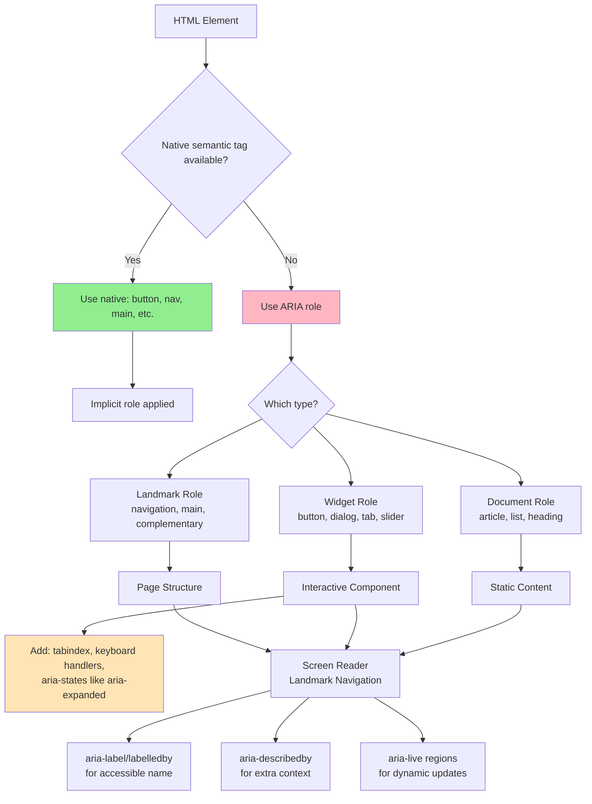
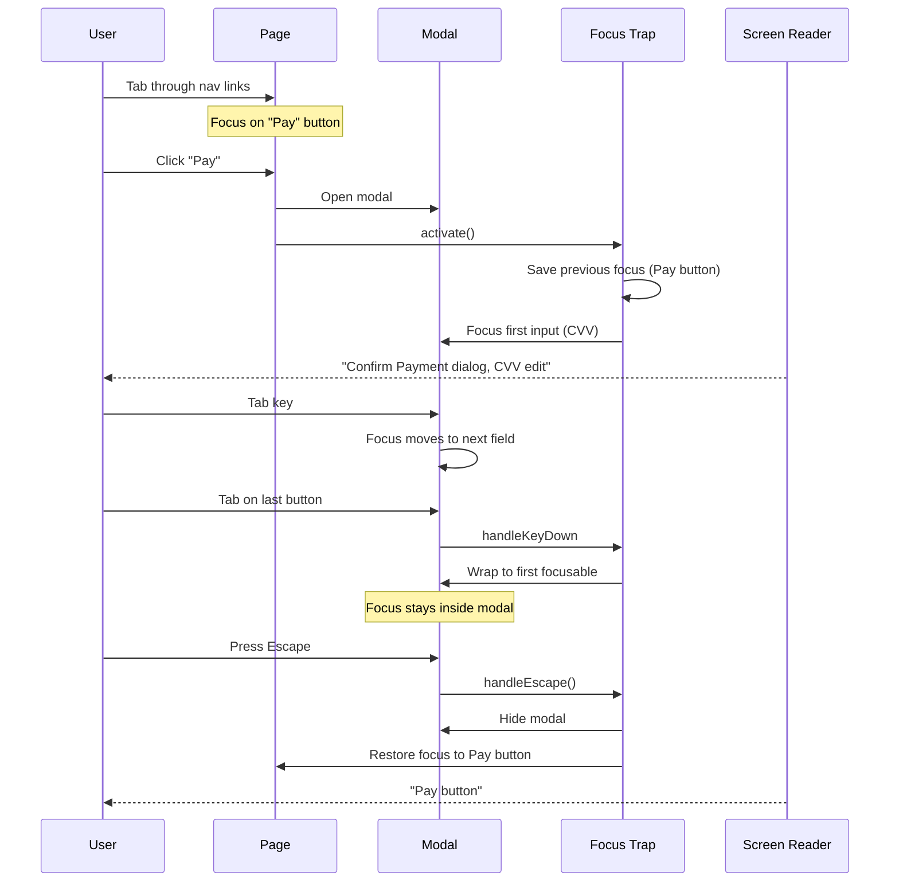
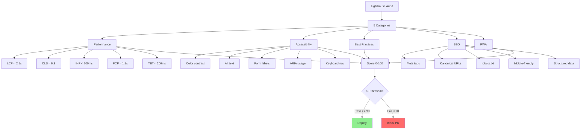
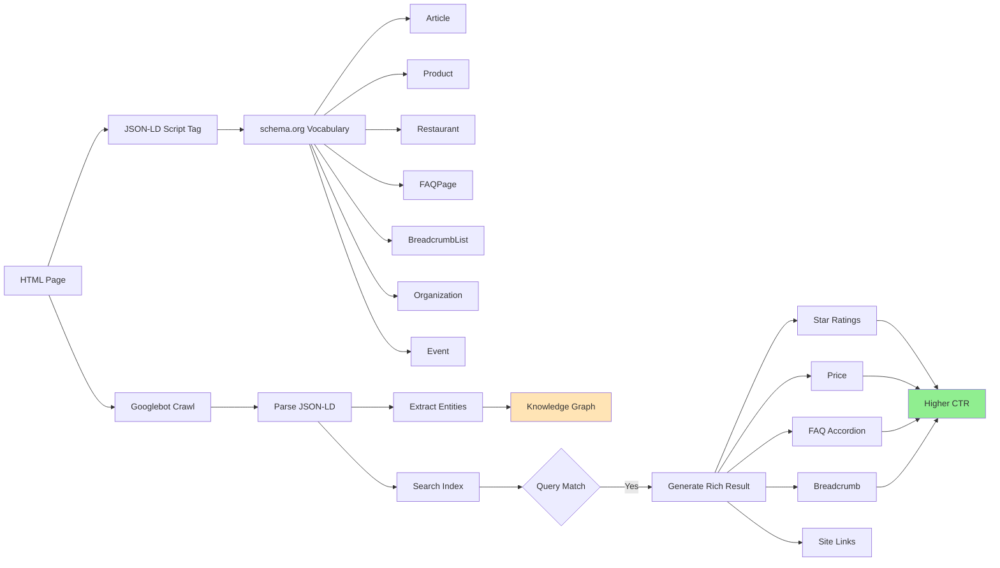

# Accessibility & SEO

Dekh bhai, accessibility (a11y) aur SEO — ye dono ek hi sikke ke do pehlu hain. Accessibility basically tumhe yeh ensure karne ko bolta hai ki tumhari app sab use kar paayein — bina dekh paane ke (screen reader users), bina haath chala paane ke (keyboard-only users), bina sun paane ke (deaf users), aur har situation me (bright sunlight, slow internet, old devices). SEO bhi yahi mindset hai — search engines bhi ek "user" hai jisko tum content samjha rahe ho. Googlebot tumhari page ko "dekh" nahi sakta jis tarah ek normal user dekh leta hai — usko semantic HTML, structured data, aur proper metadata chahiye taaki woh samjhe ki yeh page kis baare me hai.

Indian product companies (Razorpay, Cred, Zomato, Swiggy, Flipkart) — sab me a11y aur SEO interview questions aate hain, especially senior-frontend roles me. Reason simple hai — agar tumhari website Google par rank nahi karti, organic traffic zero. Agar accessibility nahi hai, tum legal trouble me aa sakte ho (US me ADA lawsuits, Europe me EAA), aur disabled users (~15% population) tumhari product use hi nahi kar paayenge. Cred ka sign-up flow agar screen reader pe break ho raha hai, ya Zomato ka menu Googlebot ko nahi dikh raha — direct revenue impact hai.

Is module me hum 4 cheezein cover karenge — ARIA roles (HTML ki accessibility ki backbone), keyboard navigation (tab, focus, traps), Lighthouse (Google ka official audit tool), aur structured data (JSON-LD, schema.org — jisse tumhari page Google ke rich snippets me aa sake). Har topic me code, real example, mermaid diagram, aur interview-style Q&A milega. Dhyaan se padh — yeh wo cheezein hain jo "good developer" aur "great developer" me farak laati hain.

---

## 1. ARIA roles

### 1.1 Landmark, widget, document structure roles; aria-label, aria-describedby, aria-live

#### Definition

ARIA ka full form hai **Accessible Rich Internet Applications**. Yeh W3C ka ek specification hai jo HTML elements ko extra "semantic meaning" deta hai — specifically assistive technologies (screen readers like JAWS, NVDA, VoiceOver) ke liye. ARIA me 3 cheezein important hain:

1. **Roles** — Element ka kya kaam hai (button, dialog, navigation, etc.)
2. **Properties** — Element ki characteristics (`aria-label`, `aria-describedby`, `aria-required`)
3. **States** — Element ki current state (`aria-expanded`, `aria-checked`, `aria-hidden`)

ARIA roles 3 categories me divide hote hain:

- **Landmark roles** — Page structure ke liye. `banner`, `navigation`, `main`, `complementary`, `contentinfo`, `search`, `form`, `region`. Yeh screen reader users ko "page ke sections" jump karne deta hai.
- **Widget roles** — Interactive components ke liye. `button`, `checkbox`, `slider`, `tab`, `menuitem`, `dialog`, `tree`, `combobox`. Yeh tab tab use karte ho jab native HTML element available nahi ho ya tum custom component bana rahe ho.
- **Document structure roles** — Static content ke liye. `article`, `heading`, `list`, `listitem`, `figure`, `toolbar`, `tooltip`.

Aur attributes:
- **`aria-label`** — Element ko ek accessible naam deta hai (jab visible label nahi hai)
- **`aria-labelledby`** — Doosre element ka id reference karke label use karta hai
- **`aria-describedby`** — Extra description (jaise help text, error message) reference karta hai
- **`aria-live`** — Dynamic content updates announce karne ke liye. Values: `off`, `polite`, `assertive`

#### Why?

Bhai, simple baat — agar tum `<div onclick="..">Submit</div>` likhta hai, screen reader user ko pata hi nahi chalega ki yeh button hai. Woh tab key dabake yahan reach bhi nahi kar payega (kyunki div tabbable nahi hota by default), aur enter dabake activate bhi nahi kar payega. Yeh basic stuff hai jo bahut log galat karte hain.

Real reasons:

1. **Native HTML pehle, ARIA baad me** — Pehla rule of ARIA: "Don't use ARIA". Matlab agar `<button>` se kaam ho raha hai, mat use kar `<div role="button">`. ARIA tab use kar jab native HTML kam pad rahi ho (custom dropdown, complex grid, modal dialog).
2. **Screen reader users ke liye context** — Blind user JAWS use karta hai, woh sirf audio sunke navigate karta hai. Agar tum button ko sirf icon (X cross) dikha rahe ho, aria-label="Close dialog" daalna mandatory hai.
3. **Dynamic content** — React/Vue apps me content change hota rehta hai (toast notifications, loading states). `aria-live` regions ke bina yeh changes announce hi nahi honge.
4. **Legal compliance** — WCAG 2.1 AA standard mandatory hai US government contracts, European Accessibility Act, India me Rights of Persons with Disabilities Act 2016 me. Compliance ke bina lawsuits aate hain (Domino's case famous hai US me).
5. **SEO bonus** — Semantic HTML aur ARIA Google ko bhi help karta hai content samjhne me.

#### How?

```html
<!-- ============================================ -->
<!-- LANDMARK ROLES — Page structure ke liye -->
<!-- ============================================ -->

<!-- Pehle native HTML5 elements use kar — yeh implicit roles aate hain -->
<header>          <!-- implicit role="banner" -->
  <nav aria-label="Primary">  <!-- implicit role="navigation" -->
    <ul>
      <li><a href="/">Home</a></li>
      <li><a href="/pricing">Pricing</a></li>
    </ul>
  </nav>
</header>

<main>            <!-- implicit role="main" — page ka main content -->
  <article>       <!-- document structure role -->
    <h1>Blog post heading</h1>
    <p>Content...</p>
  </article>
  
  <aside aria-label="Related articles">  <!-- implicit role="complementary" -->
    <h2>Related</h2>
  </aside>
</main>

<footer>          <!-- implicit role="contentinfo" -->
  <p>&copy; 2026 Cred</p>
</footer>

<!-- Multiple navs hain to har ek ko aria-label do, taaki screen reader 
     "Primary navigation", "Footer navigation" alag-alag pehchan sake -->
<nav aria-label="Footer">...</nav>

<!-- ============================================ -->
<!-- WIDGET ROLES — Custom interactive components -->
<!-- ============================================ -->

<!-- Galat tarika — div ko button banane ki koshish -->
<div onclick="submit()">Submit</div>  <!-- BAD: not focusable, no role -->

<!-- Sahi tarika #1 — Native button use kar -->
<button type="submit" onclick="submit()">Submit</button>

<!-- Sahi tarika #2 — Agar div hi use karna hai (kuch styling reason), 
     to ARIA + tabindex + keyboard handler sab daalo -->
<div 
  role="button" 
  tabindex="0"
  aria-pressed="false"
  onclick="handleClick()"
  onkeydown="if(event.key === 'Enter' || event.key === ' ') handleClick()">
  Custom Button
</div>

<!-- Custom checkbox example -->
<div 
  role="checkbox" 
  aria-checked="false"
  tabindex="0"
  aria-labelledby="terms-label"
  onclick="toggleCheck(this)">
</div>
<span id="terms-label">I agree to terms</span>

<!-- Custom tabs (Razorpay dashboard jaisa) -->
<div role="tablist" aria-label="Account settings">
  <button role="tab" aria-selected="true" aria-controls="profile-panel" id="profile-tab">
    Profile
  </button>
  <button role="tab" aria-selected="false" aria-controls="billing-panel" id="billing-tab" tabindex="-1">
    Billing
  </button>
</div>
<div role="tabpanel" id="profile-panel" aria-labelledby="profile-tab">
  <!-- Profile content -->
</div>
<div role="tabpanel" id="billing-panel" aria-labelledby="billing-tab" hidden>
  <!-- Billing content -->
</div>

<!-- ============================================ -->
<!-- aria-label, aria-labelledby, aria-describedby -->
<!-- ============================================ -->

<!-- aria-label — direct label string -->
<button aria-label="Close dialog">
  <svg>...</svg>  <!-- sirf icon hai, koi text nahi -->
</button>

<!-- aria-labelledby — label ek aur element me hai -->
<h2 id="billing-heading">Billing Information</h2>
<section aria-labelledby="billing-heading">
  <!-- content -->
</section>

<!-- aria-describedby — additional context (help text, errors) -->
<label for="password">Password</label>
<input 
  id="password" 
  type="password"
  aria-describedby="pwd-help pwd-error"
  aria-invalid="true">
<span id="pwd-help">Minimum 8 characters, 1 uppercase, 1 number</span>
<span id="pwd-error" role="alert">Password too short</span>

<!-- ============================================ -->
<!-- aria-live — dynamic content announcements -->
<!-- ============================================ -->
```

```javascript
// Toast notification example - jab order place ho jaye
const toastContainer = document.getElementById('toast-container');

// HTML me toast container aisa hoga:
// <div id="toast-container" aria-live="polite" aria-atomic="true"></div>

function showToast(message) {
  // aria-live="polite" — screen reader user ka current task ko interrupt 
  // nahi karta, bas next pause me announce karega
  toastContainer.textContent = message;
  
  // 3 sec baad clear kar do, taaki dobaara same message announce ho sake
  setTimeout(() => { toastContainer.textContent = ''; }, 3000);
}

// Critical errors ke liye assertive use karo - immediately announce hoga
function showError(message) {
  const errorRegion = document.getElementById('error-region');
  // <div id="error-region" aria-live="assertive" role="alert"></div>
  errorRegion.textContent = message;
}

// Common galti — aria-live region ko dynamically banana
// Yeh kaam nahi karega! Screen reader live region ko page load par 
// register karta hai. Pehle se DOM me hona chahiye.

// SAHI APPROACH:
// 1. Empty live region page load par render karo
// 2. JavaScript se uska text content update karo
```

```html
<!-- aria-live values samjho: -->

<!-- "polite" — Default for non-critical updates 
     (toast, save indicator, search results count) -->
<div aria-live="polite">5 results found</div>

<!-- "assertive" — Urgent, interrupts user
     (form submission error, payment failed) -->
<div aria-live="assertive" role="alert">Payment declined</div>

<!-- "off" — Default, no announcements -->

<!-- aria-atomic — pura content read karega ya sirf change?
     true = pura element re-read kare 
     false = sirf changed text read kare (default) -->
<div aria-live="polite" aria-atomic="true">
  Loading: <span id="progress">50%</span>
</div>

<!-- aria-relevant — kya changes announce hone chahiye?
     additions, removals, text, all -->
<div aria-live="polite" aria-relevant="additions">
  <!-- Sirf nayi added content announce hogi -->
</div>
```

#### Real-life Example

Sochte hain Swiggy ka cart page banana hai:

```html
<!-- Page structure with proper landmarks -->
<header>
  <nav aria-label="Primary">
    <a href="/" aria-label="Swiggy home">
       <!-- decorative, alt empty -->
    </a>
  </nav>
</header>

<main>
  <h1>Your Cart</h1>
  
  <!-- Live region for cart updates -->
  <div aria-live="polite" aria-atomic="false" class="sr-only" id="cart-announcer"></div>
  
  <section aria-labelledby="items-heading">
    <h2 id="items-heading">Items (3)</h2>
    
    <ul role="list">
      <li>
        <article>
          <h3>Paneer Butter Masala</h3>
          <p>From: <span>Punjab Grill</span></p>
          
          <!-- Quantity stepper - custom widget -->
          <div role="group" aria-labelledby="qty-label-1">
            <span id="qty-label-1" class="sr-only">Quantity for Paneer Butter Masala</span>
            
            <button 
              aria-label="Decrease quantity"
              onclick="decreaseQty(1)">
              −
            </button>
            
            <span aria-live="polite" id="qty-1">2</span>
            
            <button 
              aria-label="Increase quantity"
              onclick="increaseQty(1)">
              +
            </button>
          </div>
          
          <button 
            aria-label="Remove Paneer Butter Masala from cart"
            onclick="removeItem(1)">
            <svg aria-hidden="true">...</svg>
          </button>
        </article>
      </li>
    </ul>
  </section>
  
  <aside aria-labelledby="bill-heading">
    <h2 id="bill-heading">Bill Details</h2>
    <dl>
      <dt>Item Total</dt>
      <dd>₹560</dd>
      <dt>Delivery Fee</dt>
      <dd>₹40</dd>
      <dt>To Pay</dt>
      <dd id="total" aria-live="polite">₹600</dd>
    </dl>
  </aside>
</main>
```

```javascript
// Cart announcer — important UX detail
function increaseQty(itemId) {
  const qtyEl = document.getElementById(`qty-${itemId}`);
  const newQty = parseInt(qtyEl.textContent) + 1;
  qtyEl.textContent = newQty;
  
  // Announce to screen reader users
  const announcer = document.getElementById('cart-announcer');
  announcer.textContent = `Quantity updated to ${newQty}`;
  
  // Total bhi update karo, aria-live="polite" automatic announce karega
  updateTotal();
}

function removeItem(itemId) {
  // Pehle announce karo, then remove
  const announcer = document.getElementById('cart-announcer');
  announcer.textContent = 'Item removed from cart';
  
  // 100ms baad remove karo, taaki announcement chal jaaye
  setTimeout(() => {
    document.querySelector(`[data-item-id="${itemId}"]`).remove();
  }, 100);
}
```

#### Diagram



#### Interview Q&A

**Q: ARIA ka first rule kya hai aur kab use karna chahiye?**

Answer: ARIA ka first rule hai — "Don't use ARIA". Matlab agar native HTML element same kaam kar sakta hai, to ARIA mat use kar. `<button>` use kar `<div role="button">` ki jagah. `<input type="checkbox">` use kar custom checkbox ki jagah. Reason simple hai — native elements me focus management, keyboard handling, screen reader support, sab built-in hota hai. ARIA tab use karo jab tum genuinely complex custom widget bana rahe ho jo native HTML me available nahi hai — jaise tree view, complex grid, custom autocomplete dropdown. Even tab, pehle dekho ki kya WAI-ARIA Authoring Practices Guide me iska pattern hai aur usko follow karo. Aur dhyaan rakho — galat ARIA, no ARIA se bhi bura hai. Agar tu `role="button"` daalega aur keyboard handler nahi daalega, screen reader user ko lagega button hai but enter dabane par kuch nahi hoga — yeh confusing aur broken experience banata hai.

**Q: aria-label vs aria-labelledby vs aria-describedby — difference kya hai aur kab kaunsa use karna chahiye?**

Answer: Teeno accessible name aur description provide karte hain, lekin different scenarios ke liye. **`aria-label`** — direct string label deta hai, jab visible text nahi hai (jaise icon-only button — `<button aria-label="Close">×</button>`). Yeh override kar deta hai element ke andar ka text bhi, isliye carefully use karo. **`aria-labelledby`** — jab label already DOM me kahin existing element me hai, uska id reference karte ho. Yeh especially helpful hai sections aur dialogs ke liye — `<section aria-labelledby="heading-id">` me heading id reference karte ho. Aur multiple ids bhi de sakte ho space-separated, woh concatenate ho jaate hain. **`aria-describedby`** — yeh accessible *name* nahi hai, *description* hai. Form input ke help text, error messages, ya additional context ke liye. Screen reader pehle name padhega, fir description. Real example — login form: `<input aria-labelledby="email-label" aria-describedby="email-format email-error">` — yahan name "Email" aayega aur description me format hint aur error message aayenge. Priority order: visible label (with `<label for>`) > aria-labelledby > aria-label.

**Q: aria-live ka use case explain kar with polite vs assertive — aur common mistakes kya hote hain?**

Answer: `aria-live` regions dynamic content updates ko screen reader users tak pahuchaate hain. Jab page par kuch change hota hai (toast notification, form validation error, search results updating), screen reader by default usko announce nahi karta — aria-live region ke andar agar wo change ho, tab announce hoga. **`polite`** — non-urgent updates ke liye. Screen reader current task complete karke announce karega — saving indicator, "5 results found", success toasts. **`assertive`** — interrupts user, immediately announce hoga. Use karo critical alerts ke liye — payment failed, session expiring, form submission errors. Common mistakes: (1) Live region ko dynamically create karna — yeh kaam nahi karega. Empty live region page load par hi DOM me hona chahiye, fir uska content update karo. (2) `aria-live="assertive"` har jagah daalna — yeh user experience kharab karta hai, har minor change interrupt karega. (3) Same message twice set karna — agar text same hai, screen reader announce nahi karega; pehle empty kar do, fir set karo. (4) `role="alert"` aur `aria-live="assertive"` confuse karna — `role="alert"` implicitly assertive hota hai, dono mat daalo. (5) `aria-atomic` ka misunderstanding — true means pura element re-read hoga (loading bar updates ke liye useful), false means sirf changed text.

**Q: Custom dropdown component banana hai (combobox) — accessibility ke liye kaun-kaun se ARIA attributes lagao ge?**

Answer: Custom dropdown WAI-ARIA Authoring Practices ka combobox pattern follow karna chahiye. Yeh kaafi complex hai — galat implementation se bachne ke liye ideally Radix UI, Headless UI, ya React Aria use karo. Manually karna hai to: trigger element par `role="combobox"`, `aria-expanded` (true/false based on open state), `aria-controls="listbox-id"` (jo listbox usse linked hai), `aria-haspopup="listbox"`, aur `aria-activedescendant="option-id"` jo currently highlighted option ka id hai. Listbox par `role="listbox"` aur `aria-label` ya `aria-labelledby`. Har option par `role="option"` aur `aria-selected` (true/false). Keyboard handlers bhi mandatory — Arrow Down/Up se navigate, Enter/Space se select, Escape se close, Home/End for first/last, Tab to close and move focus. Focus management important hai — jab dropdown open ho, focus trigger par hi rahega (combobox pattern), aur `aria-activedescendant` change karke virtual focus move karte hain. Yeh native focus se different hai, but assistive tech ko sahi se announce karta hai. Aur announce karne ke liye options ke count bhi `aria-live` region me daal sakte ho — "5 suggestions available". Real production me Razorpay, Cred, sab Radix UI use karte hain, kyunki manually maintain karna nightmare hai.

---

## 2. Keyboard navigation

### 2.1 tabindex (0/-1/positive), focus trap (modal), skip links, focus-visible

#### Definition

Keyboard navigation matlab — bina mouse use kiye, sirf keyboard se pura page navigate kar paana. Tab key se aage, Shift+Tab se peeche, Enter/Space se activate, Arrow keys se options navigate. Yeh sirf disabled users ke liye nahi — power users (developers, support agents jo bahut data entry karte hain) bhi keyboard prefer karte hain. WCAG 2.1.1 (Keyboard) success criterion mandatory hai.

Key concepts:

- **`tabindex`** — Element ki tab order me position control karta hai. Values:
  - `tabindex="0"` — Element ko natural tab order me daalo (DOM order me jahaan hai, wahin)
  - `tabindex="-1"` — Element programmatically focusable hai (`.focus()` call kar sakte ho), but Tab se reach nahi hoga
  - `tabindex="1"` ya higher (positive) — **Anti-pattern** — explicit order set karta hai, but DOM order break karta hai
- **Focus trap** — Modal/dialog open hone par focus modal ke andar hi rahega, Tab/Shift+Tab background page ke elements par nahi jaayega
- **Skip links** — "Skip to main content" link jo page ke top par hota hai (visually hidden until focused), repetitive nav skip karne ke liye
- **`:focus-visible`** — CSS pseudo-class jo focus ring sirf keyboard users ko dikhata hai, mouse click karne par nahi

#### Why?

1. **Disabled users** — Motor disabilities (Parkinson's, paralysis) wale users mouse use nahi kar sakte. Sirf keyboard ya switch device se navigate karte hain.
2. **Power users** — Developers, traders, customer support — sab keyboard shortcuts pe efficiency build karte hain.
3. **Mobile screen readers** — VoiceOver/TalkBack swipe gestures bhi essentially keyboard navigation hain — same Tab order follow karte hain.
4. **Bug detection** — Keyboard navigation se test karne pe missing focus indicators, broken modals, sab catch ho jaate hain.
5. **Legal compliance** — WCAG 2.1.1 mandatory hai, aur 2.4.7 (Focus Visible) bhi.

Real example: Cred ka payment confirmation modal jaha tum CVV daalte ho — agar focus trap nahi hoga, Tab dabane par background page pe focus chala jaayega aur user accidental clicks kar sakta hai. Yeh security risk bhi hai aur a11y violation bhi.

#### How?

```html
<!-- ============================================ -->
<!-- TABINDEX VALUES -->
<!-- ============================================ -->

<!-- Naturally focusable elements - tabindex zaroorat nahi -->
<button>Click me</button>           <!-- focusable by default -->
<a href="/">Link</a>                <!-- focusable -->
<input type="text">                 <!-- focusable -->
<select>...</select>                <!-- focusable -->

<!-- tabindex="0" — Custom focusable element -->
<div 
  tabindex="0" 
  role="button"
  onclick="handle()"
  onkeydown="if(event.key==='Enter') handle()">
  Custom button
</div>

<!-- tabindex="-1" — Programmatically focusable, NOT in tab order -->
<!-- Use case: modal container ko focus karo open hone par -->
<div id="modal" tabindex="-1" role="dialog">
  <h2>Modal heading</h2>
</div>

<!-- BAD — Positive tabindex -->
<input tabindex="1">  <!-- Pehle yeh -->
<input tabindex="2">  <!-- Fir yeh -->
<input tabindex="3">  <!-- Phir yeh -->
<!-- Problem: agar tu naya input add karega beech me, sara order break -->
<!-- Use DOM order instead — jis order me chahiye, wahi order me likh -->

<!-- ============================================ -->
<!-- SKIP LINKS -->
<!-- ============================================ -->

<body>
  <!-- Pehla focusable element — skip link -->
  <a href="#main-content" class="skip-link">
    Skip to main content
  </a>
  
  <header>
    <nav>
      <!-- 50+ links yahan -->
    </nav>
  </header>
  
  <main id="main-content" tabindex="-1">
    <!-- Skip link click karne par yahan focus aayega -->
    <h1>Page title</h1>
  </main>
</body>
```

```css
/* Skip link visually hidden until focused */
.skip-link {
  position: absolute;
  top: -40px;
  left: 0;
  background: #000;
  color: #fff;
  padding: 8px 16px;
  z-index: 100;
  text-decoration: none;
}

.skip-link:focus {
  top: 0;
  /* Tab dabane par visible ho jaata hai */
}

/* ============================================ */
/* :focus-visible — Modern focus indicator */
/* ============================================ */

/* OLD APPROACH (problematic) */
button:focus {
  outline: 2px solid blue;
}
/* Problem: mouse click karne par bhi outline dikhta hai, ugly */

/* NEW APPROACH */
button:focus {
  outline: none;  /* default remove */
}

button:focus-visible {
  outline: 2px solid #0066ff;
  outline-offset: 2px;
}
/* Mouse click - no outline. Keyboard tab - outline visible. */

/* Browser detect karta hai user keyboard se aaya ya mouse se */

/* ============================================ */
/* sr-only utility class — visually hidden but available to screen readers */
/* ============================================ */
.sr-only {
  position: absolute;
  width: 1px;
  height: 1px;
  padding: 0;
  margin: -1px;
  overflow: hidden;
  clip: rect(0, 0, 0, 0);
  white-space: nowrap;
  border: 0;
}
```

```javascript
// ============================================
// FOCUS TRAP — Modal ke andar focus rakhna
// ============================================

class FocusTrap {
  constructor(modalElement) {
    this.modal = modalElement;
    this.previousFocus = null;
    
    // Focusable elements ka selector
    this.focusableSelector = `
      a[href],
      button:not([disabled]),
      input:not([disabled]),
      select:not([disabled]),
      textarea:not([disabled]),
      [tabindex]:not([tabindex="-1"])
    `;
  }
  
  activate() {
    // Modal open karne se pehle, current focused element yaad rakho
    // Modal close hone par yahin focus wapas bhejo
    this.previousFocus = document.activeElement;
    
    // Modal show karo
    this.modal.removeAttribute('hidden');
    
    // Modal ke andar pehle focusable element ko focus karo
    const focusables = this.getFocusableElements();
    if (focusables.length > 0) {
      focusables[0].focus();
    } else {
      // Agar koi focusable nahi, modal khud focus le (tabindex="-1" hona chahiye)
      this.modal.focus();
    }
    
    // Tab key listener attach karo
    this.modal.addEventListener('keydown', this.handleKeyDown);
    
    // Escape se close
    document.addEventListener('keydown', this.handleEscape);
    
    // Background ko inert kar do (optional, modern approach)
    // document.querySelectorAll('body > *:not(.modal)').forEach(el => 
    //   el.inert = true
    // );
  }
  
  handleKeyDown = (event) => {
    if (event.key !== 'Tab') return;
    
    const focusables = this.getFocusableElements();
    const firstEl = focusables[0];
    const lastEl = focusables[focusables.length - 1];
    
    // Shift+Tab on first element — wrap to last
    if (event.shiftKey && document.activeElement === firstEl) {
      event.preventDefault();
      lastEl.focus();
    }
    
    // Tab on last element — wrap to first
    if (!event.shiftKey && document.activeElement === lastEl) {
      event.preventDefault();
      firstEl.focus();
    }
    // Beech me tab natural way se kaam karega
  }
  
  handleEscape = (event) => {
    if (event.key === 'Escape') {
      this.deactivate();
    }
  }
  
  getFocusableElements() {
    return Array.from(this.modal.querySelectorAll(this.focusableSelector))
      .filter(el => {
        // Hidden elements ko skip karo
        return el.offsetParent !== null;
      });
  }
  
  deactivate() {
    this.modal.removeEventListener('keydown', this.handleKeyDown);
    document.removeEventListener('keydown', this.handleEscape);
    
    // Modal hide
    this.modal.setAttribute('hidden', '');
    
    // Focus wapas bhejo previous element par
    if (this.previousFocus) {
      this.previousFocus.focus();
    }
  }
}

// Usage:
const modal = document.getElementById('payment-modal');
const trap = new FocusTrap(modal);

document.getElementById('open-modal-btn').addEventListener('click', () => {
  trap.activate();
});

document.querySelector('.modal-close').addEventListener('click', () => {
  trap.deactivate();
});
```

```html
<!-- Modal HTML structure -->
<div 
  id="payment-modal"
  role="dialog"
  aria-modal="true"
  aria-labelledby="modal-title"
  aria-describedby="modal-desc"
  tabindex="-1"
  hidden>
  
  <h2 id="modal-title">Confirm Payment</h2>
  <p id="modal-desc">Enter your CVV to authorize this transaction</p>
  
  <input type="text" inputmode="numeric" maxlength="3" aria-label="CVV">
  
  <button class="modal-confirm">Pay ₹500</button>
  <button class="modal-close">Cancel</button>
</div>
```

#### Real-life Example

Razorpay checkout flow — payment modal:

```javascript
// React me focus trap (using react-focus-lock library — production standard)
import FocusLock from 'react-focus-lock';

function PaymentModal({ isOpen, onClose, amount }) {
  const previousFocusRef = useRef(null);
  
  useEffect(() => {
    if (isOpen) {
      // Yaad rakho kahan se aaye the
      previousFocusRef.current = document.activeElement;
      
      // Body scroll lock (modal open hai to background scroll na ho)
      document.body.style.overflow = 'hidden';
    }
    
    return () => {
      // Modal band hone par
      document.body.style.overflow = '';
      
      // Wapas wahin focus bhejo
      if (previousFocusRef.current) {
        previousFocusRef.current.focus();
      }
    };
  }, [isOpen]);
  
  // Escape se close
  useEffect(() => {
    if (!isOpen) return;
    
    const handleEscape = (e) => {
      if (e.key === 'Escape') onClose();
    };
    
    document.addEventListener('keydown', handleEscape);
    return () => document.removeEventListener('keydown', handleEscape);
  }, [isOpen, onClose]);
  
  if (!isOpen) return null;
  
  return (
    // Portal use karte hain modals ke liye, taaki DOM tree me top par render ho
    <Portal>
      <div className="modal-backdrop" onClick={onClose}>
        <FocusLock returnFocus>
          <div 
            role="dialog"
            aria-modal="true"
            aria-labelledby="payment-title"
            className="modal"
            onClick={e => e.stopPropagation()}>
            
            <h2 id="payment-title">Pay ₹{amount}</h2>
            
            <form>
              <label htmlFor="cvv">CVV</label>
              <input id="cvv" type="text" autoFocus />
              
              <button type="submit">Confirm</button>
              <button type="button" onClick={onClose}>Cancel</button>
            </form>
          </div>
        </FocusLock>
      </div>
    </Portal>
  );
}
```

#### Diagram



#### Interview Q&A

**Q: tabindex ke 3 values explain kar — 0, -1, positive — aur kab kaunsa use karna chahiye?**

Answer: `tabindex="0"` — element ko natural tab order me daalta hai, jahaan DOM me hai wahin tab order me aayega. Use karo custom interactive elements pe — `<div role="button" tabindex="0">`. Native interactive elements (button, a, input) pehle se tabbable hain, unpe tabindex="0" daalna redundant hai. `tabindex="-1"` — element programmatically focusable hai (JavaScript se `.focus()` call kar sakte ho), but Tab key se reach nahi hoga. Kab use karte ho? Modal containers (jisme `.focus()` karke initial focus set karna ho), error message ke target (form submit fail ho to error region par focus jump kar do), ya off-screen elements jo specific time pe focusable banane hain. **Positive tabindex (1, 2, 3...) — anti-pattern hai, kabhi mat use kar.** Reason: yeh DOM order ko override kar deta hai aur explicit order create karta hai. Problem yeh hai ki agar tum naya focusable element add karega, sara existing order break ho jaata hai. Aur jo elements me positive tabindex nahi hai, woh DOM order me aate hain *baad me*. Solution — DOM order ko visual order ke saath align karo, source me jis order me chahiye, usi me likho. CSS Grid/Flexbox se visual rearrangement karte ho fir.

**Q: Focus trap kya hai aur modal me kyun zaroori hai? Production me kaise implement karte hain?**

Answer: Focus trap ek mechanism hai jo focus ko ek specific container (modal/dialog) ke andar restrict karta hai. Tab/Shift+Tab dabane par focus background page pe nahi jaayega — modal ke andar hi cycle karega. Yeh zaroori kyun hai? Modal open hai, lekin keyboard user Tab dabake background pe pahuch jaayega — woh elements visually hidden honge (modal pe hain), but interact ho sakte hain. Yeh both UX confusion aur security risk hai (sensitive operations like payment, password change). WCAG aur ARIA Authoring Practices mandatory karte hain modals me focus trap. Production me — manually implement karna brittle hai, edge cases bahut hain (iframes, shadow DOM, dynamically added elements, contenteditable). Industry-standard libraries — `focus-trap` (vanilla JS), `react-focus-lock` (React), Radix UI Dialog, Headless UI Dialog — yeh sab heavy-lifting karte hain. Implementation me 4 chaaron cheezein zaroori — (1) modal open hone par previous focus save karo, (2) modal ke pehle focusable element pe focus le jao, (3) Tab/Shift+Tab par boundary detect karke wrap karo, (4) Escape se close karo aur previous focus restore karo. Plus `aria-modal="true"`, `role="dialog"`, body scroll lock, aur ideally background ko `inert` attribute se inactive kar do (modern browsers support karte hain).

**Q: :focus-visible aur :focus me kya difference hai? Outline kabhi bhi remove karna chahiye?**

Answer: `:focus` — element focused hai, chahe keyboard se ya mouse click se. `:focus-visible` — element focused hai *aur* user agent ko lagta hai keyboard navigation ho rahi hai (heuristic). Mouse click karne par button focus to ho jaata hai, but `:focus-visible` match nahi hota — isliye outline nahi dikhta. Keyboard se Tab kiya, `:focus-visible` match karta hai — outline dikhta hai. Yeh exactly wahi behavior hai jo users expect karte hain — keyboard users ko visual indicator chahiye, mouse users ko click ke baad ugly outline nahi chahiye. **Outline kabhi bhi `outline: none` karke chhodna mat — yeh WCAG 2.4.7 violation hai.** Pehle log `outline: none` lagake bhool jaate the, aur keyboard users ko pata hi nahi chalta focus kahan hai. Sahi approach — `outline: none` set karo `:focus` pe, fir custom styling do `:focus-visible` pe. Custom styling box-shadow, border, ya custom outline ho sakti hai — bas visible hona chahiye (sufficient contrast — 3:1 ratio minimum). Browser support: `:focus-visible` ab sab modern browsers me hai (Chrome 86+, Firefox 85+, Safari 15.4+). Older browser fallback ke liye `:focus:not(:focus-visible) { outline: none }` polyfill pattern use karte the, but ab unnecessary hai.

**Q: Skip link ka purpose kya hai aur kya yeh sirf screen reader users ke liye hai?**

Answer: Skip link ek `<a href="#main-content">Skip to main content</a>` link hota hai jo page ke top par hota hai (pehla focusable element). Visually hidden hota hai by default, but jab user Tab dabata hai, visible ho jaata hai. Click ya Enter karne par focus directly main content pe jump kar jaata hai, header aur navigation ko skip karke. **Yeh sirf screen reader users ke liye nahi hai** — keyboard-only users ke liye bhi essential hai. Sochlo, ek site me header me 50+ links hain (mega menu). Har page par tum chahte ho main content padhna, lekin Tab Tab Tab karke 50 links ke baad pahuchna padta hai. Skip link ke saath ek Tab + Enter, aur seedha main pe. Screen reader users alag tarike se navigate karte hain (landmarks, headings), but keyboard users (without screen reader) ke liye yeh primary tool hai. Implementation me dhyaan dene wali baatein — (1) skip link first focusable element hona chahiye `<body>` me, (2) target element (`#main-content`) `tabindex="-1"` hona chahiye taaki focus woh receive kar sake, (3) `:focus` pe visible kar do, (4) sufficient color contrast, (5) target element me focus ke baad reading order continue ho. WCAG 2.4.1 (Bypass Blocks) ka primary technique hai.

---

## 3. Lighthouse

### 3.1 Audits, scoring (perf/a11y/best-practices/SEO), fixing common issues

#### Definition

Lighthouse Google ka open-source automated tool hai jo web pages audit karta hai. Yeh 5 categories me score karta hai:

1. **Performance** (0-100) — Page kitni jaldi load hota hai. Core Web Vitals (LCP, CLS, INP), TBT, FCP, Speed Index.
2. **Accessibility** (0-100) — Common a11y issues (missing alt text, low contrast, missing labels, ARIA issues).
3. **Best Practices** (0-100) — HTTPS, console errors, deprecated APIs, image aspect ratio, image sizes.
4. **SEO** (0-100) — Meta tags, structured data, mobile-friendly, crawlability.
5. **PWA** (Optional) — Service worker, manifest, offline capability.

Lighthouse browser me Chrome DevTools (Lighthouse panel), CLI (`npx lighthouse https://example.com`), CI/CD me (Lighthouse CI), aur PageSpeed Insights (web tool) me available hai.

Important: Lighthouse score lab data hai (controlled environment). Real users ka data Field Data hota hai (Chrome User Experience Report — CrUX). Production decisions field data ke basis pe leni chahiye, lab data sirf debugging ke liye.

#### Why?

1. **SEO ranking** — Google's Page Experience update ke baad, Core Web Vitals ranking factor hain. Slow site = lower ranking.
2. **Conversion** — Amazon ka famous study — 100ms latency = 1% revenue loss. Walmart, Pinterest, Flipkart sab ne similar data publish kiya hai.
3. **Automated auditing** — Manual a11y audit nahi practical har deploy par. Lighthouse CI har PR pe automatic check karta hai.
4. **Quantifiable improvements** — Tum bol nahi sakte "site fast hai" — score chahiye. Score se PMs/managers ko convince karna easy hai.
5. **Accessibility coverage** — Lighthouse a11y audit ~30-50% issues catch karta hai (rest manual testing chahiye), but baseline establish karta hai.

#### How?

```bash
# CLI se Lighthouse run karna
npx lighthouse https://example.com \
  --output=html \
  --output-path=./report.html \
  --view  # Browser me khol dega

# Specific categories
npx lighthouse https://example.com \
  --only-categories=performance,accessibility \
  --form-factor=mobile  # ya desktop

# Lighthouse CI (GitHub Actions me)
npm install -g @lhci/cli
lhci autorun --config=./lighthouserc.json
```

```json
// lighthouserc.json — CI config
{
  "ci": {
    "collect": {
      "url": ["http://localhost:3000/", "http://localhost:3000/pricing"],
      "numberOfRuns": 3,
      "settings": {
        "preset": "desktop"
      }
    },
    "assert": {
      "preset": "lighthouse:recommended",
      "assertions": {
        "categories:performance": ["error", { "minScore": 0.9 }],
        "categories:accessibility": ["error", { "minScore": 0.95 }],
        "categories:seo": ["error", { "minScore": 0.95 }],
        "categories:best-practices": ["warn", { "minScore": 0.9 }],
        "first-contentful-paint": ["warn", { "maxNumericValue": 2000 }],
        "largest-contentful-paint": ["error", { "maxNumericValue": 2500 }],
        "cumulative-layout-shift": ["error", { "maxNumericValue": 0.1 }],
        "interactive": ["error", { "maxNumericValue": 3500 }]
      }
    },
    "upload": {
      "target": "temporary-public-storage"
    }
  }
}
```

```yaml
# .github/workflows/lighthouse.yml
name: Lighthouse CI
on: [pull_request]

jobs:
  lighthouse:
    runs-on: ubuntu-latest
    steps:
      - uses: actions/checkout@v4
      - uses: actions/setup-node@v4
        with:
          node-version: '20'
      
      - name: Install deps
        run: npm ci
      
      - name: Build site
        run: npm run build
      
      - name: Run Lighthouse CI
        run: |
          npm install -g @lhci/cli
          lhci autorun
        env:
          LHCI_GITHUB_APPTOKEN: ${{ secrets.LHCI_GITHUB_APPTOKEN }}
```

**Common Performance Issues aur Fixes:**

```html
<!-- ============================================ -->
<!-- LCP (Largest Contentful Paint) optimization -->
<!-- ============================================ -->

<!-- Hero image preload karo -->
<link rel="preload" as="image" href="/hero.webp" fetchpriority="high">

<!-- Image pe fetchpriority aur loading attributes -->
  <!-- width/height set karo CLS avoid karne ke liye -->

<!-- Below-fold images lazy load -->


<!-- ============================================ -->
<!-- CLS (Cumulative Layout Shift) — fix -->
<!-- ============================================ -->

<!-- Image dimensions hamesha specify karo -->

<!-- Browser space reserve karega, image load hone par layout shift nahi hoga -->

<!-- Fonts ke liye -->
<link rel="preload" as="font" href="/fonts/inter.woff2" type="font/woff2" crossorigin>
```

```css
/* font-display strategy */
@font-face {
  font-family: 'Inter';
  src: url('/fonts/inter.woff2') format('woff2');
  font-display: swap;  /* fallback font dikhao, custom font aane par swap */
  /* swap me CLS hota hai but text visible immediately - acceptable trade-off */
  /* Alternative: font-display: optional — agar load nahi hua to fallback hi rakho */
}

/* Aspect ratio for embedded content */
.video-container {
  aspect-ratio: 16 / 9;  /* Modern CSS, widely supported */
  width: 100%;
}

/* Skeleton loaders during data fetch */
.skeleton {
  width: 100%;
  height: 200px;
  background: #f0f0f0;
  /* Same height as actual content, so no shift when data loads */
}
```

```javascript
// ============================================
// INP (Interaction to Next Paint) — main thread issues
// ============================================

// BAD — long task on click
button.addEventListener('click', () => {
  const data = computeExpensiveResult();  // 500ms blocking
  updateUI(data);
});

// GOOD — break work into chunks
button.addEventListener('click', async () => {
  // Pehle UI update karo (instant feedback)
  showLoadingState();
  
  // Heavy work async, browser ko paint karne do
  await new Promise(resolve => setTimeout(resolve, 0));
  
  const data = computeExpensiveResult();
  
  // requestIdleCallback for non-urgent work
  requestIdleCallback(() => {
    updateUI(data);
  });
});

// BETTER — Web Worker for genuinely heavy compute
const worker = new Worker('/worker.js');
worker.postMessage({ task: 'compute', data: input });
worker.onmessage = (e) => updateUI(e.data);

// scheduler.yield() — modern API for splitting work
async function processItems(items) {
  for (const item of items) {
    processItem(item);
    
    // Yield to browser between items
    if ('scheduler' in window && 'yield' in scheduler) {
      await scheduler.yield();
    }
  }
}
```

**Common Accessibility Issues aur Fixes:**

```html
<!-- Missing alt text — BAD -->


<!-- GOOD — informative alt -->


<!-- Decorative image — empty alt -->


<!-- Form inputs without labels — BAD -->
<input type="email" placeholder="Email">

<!-- GOOD -->
<label for="email">Email</label>
<input id="email" type="email">

<!-- Or visually hidden label -->
<label for="search" class="sr-only">Search</label>
<input id="search" type="search" placeholder="Search...">

<!-- Button without accessible name — BAD -->
<button><svg>...</svg></button>

<!-- GOOD -->
<button aria-label="Close menu">
  <svg aria-hidden="true">...</svg>
</button>

<!-- Low contrast (Lighthouse flags this) — BAD -->
<!-- color: #999 on white background = 2.85:1 ratio (fails WCAG AA) -->

<!-- GOOD - WCAG AA requires 4.5:1 for normal text, 3:1 for large text -->
<!-- color: #767676 on white = 4.54:1 -->

<!-- Missing lang attribute — BAD -->
<html>

<!-- GOOD -->
<html lang="en">

<!-- Page without unique title -->
<title>Home | Cred — Best Credit Card Rewards in India</title>
```

**Common SEO Issues aur Fixes:**

```html
<head>
  <!-- Title tag — 50-60 chars optimal -->
  <title>Cred — Pay Credit Card Bills, Earn Rewards | Best CC App in India</title>
  
  <!-- Meta description — 150-160 chars, ranking factor for click-through -->
  <meta name="description" content="Cred lets you pay credit card bills and earn cashback rewards. Trusted by 13 million Indians. Download now for exclusive offers.">
  
  <!-- Canonical URL — duplicate content avoid karne ke liye -->
  <link rel="canonical" href="https://cred.club/">
  
  <!-- Open Graph (Facebook, LinkedIn) -->
  <meta property="og:title" content="Cred — Pay CC bills, earn rewards">
  <meta property="og:description" content="...">
  <meta property="og:image" content="https://cred.club/og-image.jpg">
  <meta property="og:type" content="website">
  
  <!-- Twitter Card -->
  <meta name="twitter:card" content="summary_large_image">
  <meta name="twitter:title" content="...">
  <meta name="twitter:image" content="...">
  
  <!-- Robots -->
  <meta name="robots" content="index, follow">
  
  <!-- Mobile viewport — Lighthouse checks this -->
  <meta name="viewport" content="width=device-width, initial-scale=1">
  
  <!-- Structured data (next topic) -->
  <script type="application/ld+json">...</script>
</head>
```

#### Real-life Example

Imagine Flipkart product page audit:

```bash
$ npx lighthouse https://flipkart.com/iphone-15 --form-factor=mobile

Performance:    62  (target: 90+)
Accessibility:  84  (target: 95+)  
Best Practices: 91
SEO:            95

# Issues flagged:
# Performance:
#   - LCP: 4.2s (target: <2.5s) - hero image not preloaded
#   - CLS: 0.18 (target: <0.1) - product image without dimensions
#   - TBT: 850ms - large JS bundle (vendor.js 850KB)
#   - Unused JS: 320KB
#   - Render-blocking resources: 2 (jquery, custom.css)

# Accessibility:
#   - 12 buttons missing accessible names (icon-only buttons)
#   - Color contrast issue: review stars (#FFD700 on white = 1.7:1)
#   - 3 form inputs missing labels (search, filter)
#   - Heading hierarchy skipped (h1 -> h3, missing h2)

# SEO:
#   - Image alt missing on 8 images (product gallery)
#   - Tap targets too small (<48x48px) on filter chips
```

**Fix Plan:**

```html
<!-- 1. Hero image preload + dimensions -->
<link rel="preload" as="image" href="/iphone-15.webp" fetchpriority="high">


<!-- 2. Icon buttons with aria-label -->
<button aria-label="Add to wishlist">
  <svg aria-hidden="true">...</svg>
</button>

<!-- 3. Larger tap targets -->
<style>
  .filter-chip {
    min-height: 48px;
    min-width: 48px;
    padding: 12px 16px;
  }
</style>

<!-- 4. Code splitting for JS bundle -->
```

```javascript
// Next.js dynamic imports — vendor chunks split
import dynamic from 'next/dynamic';

// Heavy review component lazy load
const ReviewSection = dynamic(() => import('./ReviewSection'), {
  loading: () => <ReviewSkeleton />,
  ssr: false  // user-specific, no SEO benefit
});
```

After fixes:
- Performance: 62 → 92
- Accessibility: 84 → 98  
- LCP: 4.2s → 2.1s
- CLS: 0.18 → 0.04

#### Diagram



#### Interview Q&A

**Q: Lighthouse score lab data hota hai — production me real users ka performance kaise track karte ho?**

Answer: Lighthouse lab data deta hai — controlled environment me, fixed network throttling (4G simulated), fixed CPU throttling. Real users ka data alag hota hai — different devices (low-end Android in tier-3 cities), different networks (2G to fiber), different browsers. Production tracking ke liye **Real User Monitoring (RUM)** use karte hain. Google ka **Web Vitals JS library** browser me Core Web Vitals measure karta hai actual users ke liye, fir tum analytics endpoint pe bhej sakte ho. `web-vitals` npm package — `onLCP`, `onCLS`, `onINP`, `onFCP`, `onTTFB` callbacks. Data store karne ke liye — Google Analytics 4, Datadog RUM, New Relic, ya custom backend (BigQuery + dashboards). Google ka **Chrome User Experience Report (CrUX)** bhi hai — anonymized real user data jo Google search ranking me use hota hai. Tum **PageSpeed Insights** me jaake apni site ka CrUX data dekh sakte ho — last 28 days ka 75th percentile. Lab data debugging ke liye perfect hai (PR me regression detect karna), but production health monitoring field data se hi hota hai. Ek aur baat — Lighthouse score sirf homepage pe nahi, har critical page pe run karo (product page, checkout, dashboard). Different pages ke alag bottlenecks hote hain.

**Q: Performance score me weight kaise distributed hai? Sab metrics ka weight same hai?**

Answer: Lighthouse v10+ me Performance category ka weighted scoring hai — **LCP (25%), CLS (25%), TBT (30%), FCP (10%), Speed Index (10%)**. Note — INP recently added hua hai (replacing FID), aur upcoming versions me yeh weight redistribute kar sakta hai. **TBT ka 30% weight kyun?** TBT (Total Blocking Time) main thread blocking measure karta hai, jo INP ka lab proxy hai. JS-heavy SPAs me yeh primary culprit hota hai. **LCP aur CLS dono 25%** — kyunki yeh user perception ke direct indicators hain. LCP = "kab content visible hua" (loading speed), CLS = "kya content shift hua" (visual stability). Score 0-100 me convert karne ke liye Lighthouse log-normal distribution use karta hai — top 25% sites ka data baseline hota hai. Matlab agar tum 90+ score laana chahte ho, top 10% sites se compete kar rahe ho. Real-world impact — score 50 se 90 jaane me actual perceived performance huge difference hota hai. Diminishing returns 95 ke baad — 95 se 99 me bahut effort, but minor user impact. Practical advice — production target 90+ rakho perf, 95+ a11y/SEO. Performance budget set karo (max bundle size, max LCP) aur CI me enforce karo.

**Q: Lighthouse a11y score 100 mean karta hai site fully accessible hai?**

Answer: **No, definitely not.** Lighthouse a11y score automated checks pe based hai, jo total a11y issues ka 30-50% hi catch kar pata hai. WebAIM ka Million Report (top 1M sites annual analysis) bhi yahi conclude karta hai — automated tools ~30% issues catch karte hain. Lighthouse jo catch karta hai — missing alt text, low color contrast, missing form labels, ARIA syntax errors, missing lang attribute, heading hierarchy issues. Lighthouse jo **nahi** catch karta — (1) Alt text quality (`alt="image"` pass karega technically), (2) keyboard navigation flow (focus order, focus traps in modals, skip links functionality), (3) screen reader experience (heading structure semantically correct hai ya nahi), (4) ARIA usage correctness (`role="button"` daal diya but keyboard handler nahi hai), (5) cognitive accessibility (complex forms, time limits), (6) media accessibility (video captions, audio descriptions), (7) contextual labels (link text "click here" technically pass karega). Manual testing zaroori — keyboard-only navigation, screen reader testing (NVDA/JAWS Windows, VoiceOver Mac/iOS, TalkBack Android), zoom 200%, color contrast for non-text elements, motion preferences. axe DevTools, WAVE, Pa11y bhi run karo — different tools different issues catch karte hain. Production me — Lighthouse CI baseline ke liye, manual a11y audit har quarter, user testing with disabled users (Fable, AccessWorks jaisi services).

**Q: CLS (Cumulative Layout Shift) ka common cause kya hota hai aur kaise fix karte ho?**

Answer: CLS visual stability measure karta hai — page render hone ke baad content kitna shift hua. Threshold — < 0.1 good, 0.1-0.25 needs improvement, > 0.25 poor. **Common causes:** (1) **Images without dimensions** — `` without width/height attributes. Image load hone tak browser ko pata nahi space kitna chahiye, fir image aaye to layout shift. Fix — `width` aur `height` attributes always set karo, ya `aspect-ratio` CSS use karo. (2) **Fonts swap (FOIT/FOUT)** — Custom font load hone ke baad text reflow hota hai. Fix — `font-display: optional` (no swap, but might use fallback if custom font slow), ya `font-display: swap` with carefully matched fallback metrics (`size-adjust`, `ascent-override`). (3) **Ads, embeds, iframes** — Dynamic content jo container me load hota hai. Fix — minimum height reserve karo container ke liye. (4) **Dynamically injected content** — "Subscribe" banner ya cookie consent jo top par push ho jata hai. Fix — fixed/absolute positioning use karo, ya CSS transform animations (jo layout trigger nahi karte). (5) **CSS animations on layout properties** — `width`, `height`, `top`, `left` animate karne se layout recalculate hota hai. Fix — `transform` aur `opacity` use karo, jo composited layer pe animate hote hain. (6) **Late-loading critical CSS** — Initial render unstyled, fir styles aane par shift. Fix — critical CSS inline karo `<head>` me. **Debugging tools** — Chrome DevTools Performance panel me "Experience" track shifts dikhata hai. Lighthouse report me specific elements highlight karta hai. Web Vitals extension live track karta hai dev me. Production me — `LayoutShift` PerformanceObserver use karke RUM me capture karo aur attribution data (which element shifted) bhi log karo.

---

## 4. Structured data

### 4.1 JSON-LD, schema.org, breadcrumbs, FAQ, Article markup

#### Definition

Structured data ek standardized format hai jo web page ka content machine-readable banata hai. Yeh search engines (Google, Bing, Yandex) ko exact context provide karta hai — yeh page ek product hai? Recipe hai? Event? Organization? FAQ? Bina structured data ke, search engines page ka HTML parse karke guess karte hain. Structured data ke saath, tum explicitly declare karte ho — "yeh recipe hai, ingredients yeh hain, prep time 30 min hai".

Components:

- **schema.org** — Vocabulary/ontology jo Google + Bing + Yandex + Yahoo collaboratively maintain karte hain. Hundreds of types — `Product`, `Recipe`, `Article`, `Event`, `Organization`, `Person`, `FAQPage`, `BreadcrumbList`, etc.
- **JSON-LD** — JavaScript Object Notation for Linked Data. Google's preferred format structured data ke liye. `<script type="application/ld+json">` tag me jaata hai. Alternatives — Microdata (HTML attributes), RDFa (HTML attributes) — ab outdated.
- **Rich snippets/Rich results** — Google search results me enhanced display. Star ratings, prices, FAQ accordions, breadcrumbs, recipe cards — sab structured data se aate hain.

Google Search Central pe poori list hai supported types ki. Common ones — Article, Breadcrumb, FAQ, HowTo, Product, Recipe, Review, Event, Organization, LocalBusiness, VideoObject.

#### Why?

1. **Rich results in SERP** — Plain blue link instead of rich card. Rich results me CTR (click-through rate) 2-3x zyada hota hai.
2. **Voice search** — Alexa, Google Assistant structured data se data extract karte hain. "Hey Google, what's the best biryani recipe?" — answer Recipe schema se aata hai.
3. **Knowledge Graph** — Companies/people about Knowledge Panels Google show karta hai (right side). Organization schema se data populate hota hai.
4. **Featured snippets** — Position 0, search results ke top par. FAQ aur HowTo schema mostly Featured Snippets me convert hote hain.
5. **Future-proof** — As AI search grows (ChatGPT search, Perplexity, Google AI Overviews), structured data hi primary signal hai content understanding ke liye.

Real example — Zomato har restaurant page pe `Restaurant` schema deta hai. Result — Google search "Punjab Grill near me" karne pe rating, price range, address, cuisine, hours sab dikh jaata hai search result me directly. Click-through rate massively improve hota hai.

#### How?

```html
<!-- ============================================ -->
<!-- ARTICLE SCHEMA (blog posts, news articles) -->
<!-- ============================================ -->

<script type="application/ld+json">
{
  "@context": "https://schema.org",
  "@type": "Article",
  "headline": "How to Build a Scalable Payment System",
  "description": "Deep dive into building payment infrastructure at scale, covering idempotency, reconciliation, and fraud detection.",
  "image": [
    "https://blog.razorpay.com/article-image.jpg"
  ],
  "datePublished": "2026-01-15T08:00:00+05:30",
  "dateModified": "2026-02-01T10:00:00+05:30",
  "author": {
    "@type": "Person",
    "name": "Harshil Mathur",
    "url": "https://blog.razorpay.com/authors/harshil"
  },
  "publisher": {
    "@type": "Organization",
    "name": "Razorpay",
    "logo": {
      "@type": "ImageObject",
      "url": "https://razorpay.com/logo.png"
    }
  },
  "mainEntityOfPage": {
    "@type": "WebPage",
    "@id": "https://blog.razorpay.com/scalable-payments"
  }
}
</script>

<!-- ============================================ -->
<!-- BREADCRUMB SCHEMA -->
<!-- ============================================ -->

<!-- HTML breadcrumbs UI -->
<nav aria-label="Breadcrumb">
  <ol>
    <li><a href="/">Home</a></li>
    <li><a href="/electronics">Electronics</a></li>
    <li><a href="/electronics/phones">Phones</a></li>
    <li aria-current="page">iPhone 15</li>
  </ol>
</nav>

<!-- JSON-LD for same breadcrumbs -->
<script type="application/ld+json">
{
  "@context": "https://schema.org",
  "@type": "BreadcrumbList",
  "itemListElement": [
    {
      "@type": "ListItem",
      "position": 1,
      "name": "Home",
      "item": "https://flipkart.com/"
    },
    {
      "@type": "ListItem",
      "position": 2,
      "name": "Electronics",
      "item": "https://flipkart.com/electronics"
    },
    {
      "@type": "ListItem",
      "position": 3,
      "name": "Phones",
      "item": "https://flipkart.com/electronics/phones"
    },
    {
      "@type": "ListItem",
      "position": 4,
      "name": "iPhone 15"
    }
  ]
}
</script>

<!-- ============================================ -->
<!-- FAQ SCHEMA -->
<!-- ============================================ -->

<!-- HTML FAQ section -->
<section aria-labelledby="faq-heading">
  <h2 id="faq-heading">Frequently Asked Questions</h2>
  
  <details>
    <summary>How long does delivery take?</summary>
    <p>Standard delivery takes 3-5 business days. Express delivery available for ₹99 extra (next-day delivery in metro cities).</p>
  </details>
  
  <details>
    <summary>What is the return policy?</summary>
    <p>We offer 7-day returns for all electronics. Items must be unopened and in original packaging.</p>
  </details>
  
  <details>
    <summary>Do you offer EMI options?</summary>
    <p>Yes, we offer no-cost EMI on credit cards from HDFC, ICICI, SBI for orders above ₹3,000.</p>
  </details>
</section>

<!-- JSON-LD for the FAQ -->
<script type="application/ld+json">
{
  "@context": "https://schema.org",
  "@type": "FAQPage",
  "mainEntity": [
    {
      "@type": "Question",
      "name": "How long does delivery take?",
      "acceptedAnswer": {
        "@type": "Answer",
        "text": "Standard delivery takes 3-5 business days. Express delivery available for ₹99 extra (next-day delivery in metro cities)."
      }
    },
    {
      "@type": "Question",
      "name": "What is the return policy?",
      "acceptedAnswer": {
        "@type": "Answer",
        "text": "We offer 7-day returns for all electronics. Items must be unopened and in original packaging."
      }
    },
    {
      "@type": "Question",
      "name": "Do you offer EMI options?",
      "acceptedAnswer": {
        "@type": "Answer",
        "text": "Yes, we offer no-cost EMI on credit cards from HDFC, ICICI, SBI for orders above ₹3,000."
      }
    }
  ]
}
</script>

<!-- IMPORTANT: FAQ content visible on page hona chahiye. 
     Sirf JSON-LD me declare karke hide karna policy violation hai. -->

<!-- ============================================ -->
<!-- PRODUCT SCHEMA (e-commerce) -->
<!-- ============================================ -->

<script type="application/ld+json">
{
  "@context": "https://schema.org",
  "@type": "Product",
  "name": "Apple iPhone 15 Pro Max 256GB",
  "image": [
    "https://flipkart.com/iphone-15-1.jpg",
    "https://flipkart.com/iphone-15-2.jpg"
  ],
  "description": "Latest iPhone with A17 Pro chip and titanium design",
  "sku": "IPHONE15PM256",
  "mpn": "MU683HN/A",
  "brand": {
    "@type": "Brand",
    "name": "Apple"
  },
  "offers": {
    "@type": "Offer",
    "url": "https://flipkart.com/iphone-15-pro-max",
    "priceCurrency": "INR",
    "price": "159900",
    "priceValidUntil": "2026-12-31",
    "availability": "https://schema.org/InStock",
    "seller": {
      "@type": "Organization",
      "name": "Flipkart"
    }
  },
  "aggregateRating": {
    "@type": "AggregateRating",
    "ratingValue": "4.6",
    "reviewCount": "12453"
  },
  "review": [
    {
      "@type": "Review",
      "reviewRating": {
        "@type": "Rating",
        "ratingValue": "5",
        "bestRating": "5"
      },
      "author": {
        "@type": "Person",
        "name": "Rohit Sharma"
      },
      "reviewBody": "Excellent build quality and camera"
    }
  ]
}
</script>

<!-- ============================================ -->
<!-- ORGANIZATION SCHEMA (in homepage <head>) -->
<!-- ============================================ -->

<script type="application/ld+json">
{
  "@context": "https://schema.org",
  "@type": "Organization",
  "name": "Razorpay",
  "url": "https://razorpay.com",
  "logo": "https://razorpay.com/logo.png",
  "sameAs": [
    "https://twitter.com/razorpay",
    "https://linkedin.com/company/razorpay",
    "https://facebook.com/razorpay"
  ],
  "contactPoint": {
    "@type": "ContactPoint",
    "telephone": "+91-80-4914-1414",
    "contactType": "customer support",
    "areaServed": "IN",
    "availableLanguage": ["English", "Hindi"]
  },
  "address": {
    "@type": "PostalAddress",
    "streetAddress": "1st floor, SJR Cyber, Laskar-Hosur Road",
    "addressLocality": "Bengaluru",
    "addressRegion": "Karnataka",
    "postalCode": "560030",
    "addressCountry": "IN"
  }
}
</script>
```

```javascript
// ============================================
// Next.js / React me dynamic JSON-LD
// ============================================

// Next.js App Router me Metadata API
// app/blog/[slug]/page.tsx
export async function generateMetadata({ params }) {
  const post = await getPost(params.slug);
  
  return {
    title: post.title,
    description: post.excerpt,
    openGraph: { /* ... */ },
  };
}

// JSON-LD component
function ArticleJsonLd({ post }) {
  const jsonLd = {
    '@context': 'https://schema.org',
    '@type': 'Article',
    headline: post.title,
    description: post.excerpt,
    image: post.coverImage,
    datePublished: post.publishedAt,
    dateModified: post.updatedAt,
    author: {
      '@type': 'Person',
      name: post.author.name,
    },
    publisher: {
      '@type': 'Organization',
      name: 'Razorpay Blog',
      logo: {
        '@type': 'ImageObject',
        url: 'https://razorpay.com/logo.png',
      },
    },
  };
  
  return (
    <script
      type="application/ld+json"
      // Next.js JSON-LD ko escape karne ke liye dangerouslySetInnerHTML use karte hain
      // Server-rendered hone se XSS risk minimal hai (data trusted source se aa raha hai)
      dangerouslySetInnerHTML={{ __html: JSON.stringify(jsonLd) }}
    />
  );
}

// Page me use karo
export default async function BlogPost({ params }) {
  const post = await getPost(params.slug);
  
  return (
    <>
      <ArticleJsonLd post={post} />
      <article>
        <h1>{post.title}</h1>
        {/* ... */}
      </article>
    </>
  );
}

// ============================================
// Validation — Important step
// ============================================

// Tools to validate JSON-LD:
// 1. Google's Rich Results Test: https://search.google.com/test/rich-results
// 2. Schema.org Validator: https://validator.schema.org/
// 3. Google Search Console — Enhancements report (production data)

// Common errors:
// - Missing required fields (e.g., Article needs headline + image + author)
// - Wrong data types (date as "Jan 15" instead of ISO 8601)
// - Hidden content in JSON-LD (must match visible content)
// - Multiple FAQPage on same page (only one allowed)
// - Excessive markup (every paragraph as separate Article — spammy)
```

#### Real-life Example

Zomato restaurant page complete schema:

```html
<!DOCTYPE html>
<html lang="en">
<head>
  <title>Punjab Grill, Cyber Hub — North Indian Restaurant in Gurgaon | Zomato</title>
  <meta name="description" content="Punjab Grill in Cyber Hub serves authentic North Indian cuisine. Average cost ₹2,500 for two. Open 12 PM-12 AM. View menu, photos, reviews.">
  
  <!-- Restaurant + Aggregate Rating + Menu -->
  <script type="application/ld+json">
  {
    "@context": "https://schema.org",
    "@type": "Restaurant",
    "name": "Punjab Grill",
    "image": "https://b.zmtcdn.com/data/pictures/2/punjab-grill.jpg",
    "url": "https://www.zomato.com/ncr/punjab-grill-cyber-hub",
    "telephone": "+91-124-4123456",
    "priceRange": "₹₹₹₹",
    "servesCuisine": ["North Indian", "Mughlai"],
    "address": {
      "@type": "PostalAddress",
      "streetAddress": "Cyber Hub, DLF Cyber City",
      "addressLocality": "Gurgaon",
      "addressRegion": "Haryana",
      "postalCode": "122002",
      "addressCountry": "IN"
    },
    "geo": {
      "@type": "GeoCoordinates",
      "latitude": "28.4954",
      "longitude": "77.0892"
    },
    "openingHoursSpecification": [
      {
        "@type": "OpeningHoursSpecification",
        "dayOfWeek": ["Monday", "Tuesday", "Wednesday", "Thursday", "Friday", "Saturday", "Sunday"],
        "opens": "12:00",
        "closes": "00:00"
      }
    ],
    "aggregateRating": {
      "@type": "AggregateRating",
      "ratingValue": "4.5",
      "reviewCount": "3421"
    },
    "menu": "https://www.zomato.com/ncr/punjab-grill-cyber-hub/menu",
    "acceptsReservations": "True"
  }
  </script>
  
  <!-- Breadcrumbs -->
  <script type="application/ld+json">
  {
    "@context": "https://schema.org",
    "@type": "BreadcrumbList",
    "itemListElement": [
      { "@type": "ListItem", "position": 1, "name": "Home", "item": "https://zomato.com/" },
      { "@type": "ListItem", "position": 2, "name": "Gurgaon", "item": "https://zomato.com/ncr" },
      { "@type": "ListItem", "position": 3, "name": "Cyber Hub", "item": "https://zomato.com/ncr/cyber-hub-restaurants" },
      { "@type": "ListItem", "position": 4, "name": "Punjab Grill" }
    ]
  }
  </script>
</head>
```

Result on Google search — "Punjab Grill Cyber Hub":
- Restaurant card with image, ratings (4.5 stars), price range, hours, "Open now"
- Map preview with location pin
- Direct "Call" button
- "Reserve a table" button
- Related restaurants carousel

CTR vs plain link — typically 2-4x higher.

#### Diagram



#### Interview Q&A

**Q: JSON-LD vs Microdata vs RDFa — kaunsa use karna chahiye aur kyun?**

Answer: Teeno structured data formats hain, but 2026 me **JSON-LD clearly Google's preferred format** hai. **Microdata** — HTML attributes me embedded (`itemscope`, `itemtype`, `itemprop`). Pros — co-located with visible content, easier to keep sync. Cons — HTML cluttered ho jaata hai, har element me attributes daalne padte hain, dynamic content me maintain karna mushkil. **RDFa** — similar HTML attributes (`vocab`, `typeof`, `property`), more powerful for academic/linked data scenarios but verbose. **JSON-LD** — separate `<script type="application/ld+json">` block. Pros — content aur structured data alag, easy to generate programmatically, server-side render karna trivial, third-party tools (CMS plugins, libraries) ke saath integrate karna easy. Cons — visible content aur JSON-LD ke beech sync maintain karna padta hai (Google policy violation hota hai mismatch pe). Google explicitly recommends JSON-LD apni documentation me. Bing aur Yandex bhi support karte hain. **Industry practice** — JSON-LD use karo, automated generate karo from same data source jo content render kar raha hai (CMS ya database). Single source of truth maintain karne se mismatches avoid hote hain. React/Next.js apps me especially convenient — JSX me JSON-LD inline render kar sakte ho `dangerouslySetInnerHTML` se. Microdata legacy systems me already hai to chhod do, replace karne ki zaroorat nahi unless major refactor ho raha hai. RDFa scientific publishing aur academic resources me zyada use hota hai.

**Q: FAQ schema lagaya, but rich result Google search me show nahi ho raha — debug kaise karoge?**

Answer: Multiple reasons ho sakte hain, systematic debug karte hain. **Step 1 — Validate JSON-LD syntax.** Google's Rich Results Test (https://search.google.com/test/rich-results) pe URL daalo. Yeh batayega — JSON valid hai, schema correct hai, required fields present hain ya nahi, aur preview dikhayega kaisa rich result aayega. **Step 2 — Check Search Console.** Google Search Console > Enhancements > FAQ. Yahaan Google ne kya detect kiya, kya errors flag kiye, woh dikhega. Production data 1-7 days lag karta hai usually. **Step 3 — Common policy violations.** (a) Hidden content — JSON-LD me jo answers hain, woh page pe visually visible bhi hone chahiye. Sirf JSON-LD me declare karke page pe hide karna policy violation. (b) Duplicate content — same FAQ multiple pages pe hai to canonical issue. (c) Promotional content — answers me "buy now", coupon codes, ads — Google reject karta hai. (d) Inappropriate schema — product page pe FAQ schema lagana jab actual FAQs nahi hain. **Step 4 — Eligibility criteria.** Google me explicit guidelines hain — content quality, site authority, mobile-friendly. Naya site ho to rich results delay se aate hain. **Step 5 — Technical issues.** robots.txt me page block to nahi? noindex meta tag? JavaScript se inject kar rahe ho structured data — Googlebot JS execute karta hai but slowly, indexing me delay. Best practice — server-side render karo JSON-LD. **Step 6 — Recent algorithm changes.** Aug 2023 me Google ne FAQ rich results limited kiye — sirf government aur health-authority sites pe show karte hain (most cases me). HowTo bhi limit hua. Toh modern me FAQ schema kam rich result generate kar raha hai. Other types (Product, Article, Breadcrumb, Recipe, Event) abhi bhi reliably show hote hain.

**Q: Production e-commerce site pe Product schema lagana hai — kaunse fields critical hain aur kya pitfalls avoid karna chahiye?**

Answer: Product schema me **required fields** hain `name` aur `image`. **Strongly recommended** — `description`, `brand`, `offers` (with `price`, `priceCurrency`, `availability`), `aggregateRating` (jab reviews hain), `review`, `sku`/`mpn`/`gtin`. Rich results ke liye `offers` aur `aggregateRating` zaroori hain — without them sirf basic listing aayegi, star ratings nahi dikhenge. **Critical pitfalls:** (1) **Price mismatch** — JSON-LD me ₹999 likha hai, page pe ₹1,099 dikha rahe ho. Google strict hai is pe — manual action lag sakta hai. Single source of truth use karo. (2) **Availability stale** — `"availability": "InStock"` likha hai, but actually out of stock. Real-time update karo cart system se. (3) **priceValidUntil date** — Yeh required hai discount price ke liye. Past date ho gaya to schema invalid. (4) **Currency** — `priceCurrency` ISO 4217 code (INR, USD, EUR), na ki "Rs" ya "₹". (5) **Multiple currencies/regions** — agar global site hai, har region ki page alag canonical URL with appropriate offers. (6) **Aggregate rating thresholds** — Google requires minimum reviews (vague but ~5+). Single review pe aggregate rating dena spammy lagta hai. (7) **Review schema abuse** — Self-review (apna review apne hi product pe) — manual action. (8) **Variants** — Product variants (sizes, colors) ke liye `ProductGroup` schema use karo (recently introduced), ya alag pages with different schemas. (9) **Image requirements** — Min 1200px width recommended for high-resolution, multiple aspect ratios provide karo (1:1, 4:3, 16:9). (10) **GTIN/MPN** — global product identifiers. Branded products ke liye highly recommended — Google product matching me help karta hai. (11) **Hidden content** — JSON-LD me sab info ho but page pe nahi — policy violation. Production setup — Schema generation utility centralize karo, validate karo CI me (schema-dts npm package TypeScript types provide karta hai), aur GSC ki Enhancements report monitor karo weekly.

**Q: Schema.org bahut large vocabulary hai — production me kaunse types prioritize karne chahiye? Indian context me kuch specific types hain?**

Answer: Sab types implement karna na zaroorat hai na practical. Priority **business goals aur content type** ke according hai. **E-commerce** — Product (with Offer, AggregateRating, Review), BreadcrumbList, Organization. Optional — VideoObject (product videos), FAQPage (PDP FAQs), HowTo (assembly/usage guides). **Content/Blog/News** — Article (NewsArticle for news-specific), BreadcrumbList, Person (author), Organization (publisher), VideoObject. **SaaS/B2B** — Organization, BreadcrumbList, FAQPage (pricing/features FAQs), SoftwareApplication, Article (blog), Event (webinars). **Local Business** — LocalBusiness (with sub-types like Restaurant, Dentist), PostalAddress, OpeningHoursSpecification, GeoCoordinates. **Marketplace** — combination of Organization + Product (per listing) + Review + Offer. **Indian context specific:** (1) **Currency** — INR use karo, but display me ₹ symbol theek hai. (2) **LocalBusiness for restaurants/services** — Zomato, Swiggy, JustDial sab heavy use karte hain. (3) **Course schema** — Indian edtech (BYJU's, Unacademy, upGrad) ke liye essential — Google search me course cards. (4) **JobPosting** — Naukri, LinkedIn India, Indeed — JobPosting schema indispensable. Salary in INR, location with PostalAddress, validThrough date. (5) **Event** — BookMyShow style — Event with location, offers, performer. (6) **Recipe** — Indian recipe sites (Hebbar's Kitchen, Vah Reh Vah) — Recipe with Indian-specific cuisine values, video tutorials. (7) **Movie/TVSeries** — OTT platforms (Hotstar, Prime Video India, Netflix) — Movie schema with actor (Person), director, aggregateRating. (8) **Tourism** — TouristAttraction, Hotel — for sites like MakeMyTrip, Yatra. **Implementation strategy** — Pareto principle. Top 3 schemas implement karo (Organization + BreadcrumbList + page-specific main type), 80% rich result coverage mil jaayegi. Fir incrementally expand karo based on Search Console data — kaunse pages me organic traffic potential hai. Don't over-engineer — har page pe 10 different schemas daalna kuch nahi karega, sometimes confuses Google. Quality > quantity.

---

## Resources & further reading

**Specifications & Standards:**
- WCAG 2.2 — https://www.w3.org/WAI/WCAG22/quickref/
- WAI-ARIA Authoring Practices — https://www.w3.org/WAI/ARIA/apg/
- Schema.org — https://schema.org/docs/full.html
- Web Content Accessibility Guidelines (W3C) — https://www.w3.org/WAI/

**Tools:**
- Lighthouse CI — https://github.com/GoogleChrome/lighthouse-ci
- axe DevTools — https://www.deque.com/axe/devtools/
- WAVE — https://wave.webaim.org/
- Pa11y — https://pa11y.org/
- Google Rich Results Test — https://search.google.com/test/rich-results
- Schema Markup Validator — https://validator.schema.org/
- Google Search Console — https://search.google.com/search-console

**Libraries (React ecosystem):**
- Radix UI — accessible primitives
- React Aria (Adobe) — hooks for accessible components
- Headless UI — Tailwind team's accessible components
- react-focus-lock — focus trap for modals
- focus-trap-react — alternative focus trap
- web-vitals — Real User Monitoring for Core Web Vitals

**Reading:**
- "Inclusive Components" by Heydon Pickering
- "Accessibility for Everyone" by Laura Kalbag
- web.dev/learn/accessibility — Google's free course
- web.dev/learn/performance — Performance fundamentals
- Smashing Magazine accessibility section
- Manuel Matuzović's blog (htmhell.dev, matuzo.at)

**Screen Readers (test your sites):**
- NVDA (Windows, free) — https://www.nvaccess.org/
- JAWS (Windows, paid)
- VoiceOver (macOS/iOS, built-in) — Cmd+F5
- TalkBack (Android, built-in)
- Orca (Linux)

**Indian Context:**
- Rights of Persons with Disabilities Act 2016
- GIGW (Government of India Web Guidelines)
- BIS standards for e-governance accessibility
- AccessAbility India — accessibility consultancy
