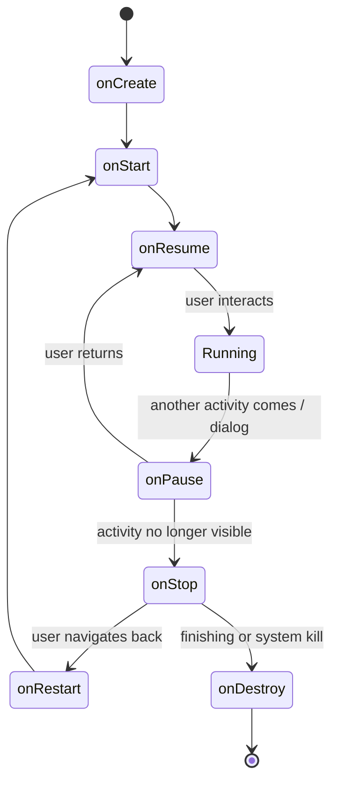

# Android Development with Kotlin — Zero to Play Store

Android ek aisa platform hai jiska India mein **600 million+ active users** hain — har 4 mein se 3 phones Android pe chal rahe hain (~78% market share, counterpoint research 2025 numbers). Tu Swiggy se khaana mangwata hai, Zomato pe review padhta hai, PhonePe se UPI karta hai, CRED pe credit card bill bharta hai, Paytm pe metro ka ticket leta hai — sab ke sab Android-first apps hain. Inn companies ke liye **Android engineer ek core hire** hai, web wala nahi. Aur yeh roadmap abhi tak EngiNerd pe missing tha — tu yahan se shuru karega aur 90 din mein Play Store pe app dal sakta hai.

Ye doc tujhe **Java/Kotlin basics** se lekar **Play Store deployment** tak le jayegi. Modern stack — **Jetpack Compose, Coroutines, Room, Retrofit, Hilt, ViewModel + StateFlow**. Pura code Kotlin mein, runnable, copy-paste karke chala sakta hai. XML views ka zikr karenge but main focus Compose pe — kyunki 2024+ ke saare naye Android projects Compose-first hain. Swiggy Instamart ka latest checkout flow — Compose. CRED ka entire app — Compose. Tu agar XML pe phasa hai to migrate karna seekh, kyunki interviews mein "have you used Compose?" pucha jata hai.

Chai-pani saath rakh, ye 14 sections ka safar hai. Har section ek concrete worked example ke saath hai.

---

## 1. Why Android — and why Kotlin

### 1.1 The Indian Android opportunity

Numbers seedhe rakhte hain:

| Metric | India | World |
|--------|-------|-------|
| Android market share | ~78% | ~71% |
| Total active devices | 600M+ | 3.3B+ |
| Avg time spent on apps/day | 4.9 hours | 4.2 hours |
| New app downloads/year | 28B+ | 142B+ |
| Tier-2 / tier-3 % of users | 65% | — |

iOS India mein bahut chhota hai — ~2-4% — aur jo log iPhone use karte hain unka kharcha bhi alag hai (premium D2C apps). But mass-market consumer apps — Swiggy, Zomato, Flipkart, Meesho, Dream11, MPL, Cred — sab Android pe chalti hain. Tu iss platform pe hai to **80% of Indian internet** tu reach kar sakta hai.

### 1.2 Hiring + salary bands (India, 2025)

Indian product companies Android engineers ko alag se hire karte hain — full-stack ya web role nahi. Approximate bands (CTC, lakhs/year):

| Company | SDE-1 (0-2 yr) | SDE-2 (2-5 yr) | SDE-3 (5+ yr) |
|---------|----------------|----------------|---------------|
| Swiggy | 18-26 | 32-50 | 55-90 |
| Zomato | 16-24 | 28-45 | 50-80 |
| PhonePe | 22-30 | 38-60 | 65-110 |
| Paytm | 14-22 | 25-40 | 45-70 |
| CRED | 24-35 | 42-65 | 70-120 |
| Razorpay | 20-28 | 35-55 | 60-95 |
| Flipkart | 22-32 | 38-58 | 60-100 |

Yeh sirf base + bonus hain — ESOPs alag se 30-200% top up kar sakte hain (CRED/Razorpay aggressive hain ESOPs pe). Mid-senior Android engineer at PhonePe with strong Compose + Kotlin coroutine skills — easily 70+ LPA.

### 1.3 Java vs Kotlin — kya use karein?

Google ne **2017 Google I/O** mein Kotlin ko officially Android ka first-class language declare kiya, aur **2019 mein "Kotlin-first"** policy announce ki. 2025 mein new Android tutorials, library docs, sample apps — sab Kotlin mein hain.

| Dimension | Java | Kotlin |
|-----------|------|--------|
| Null safety | Runtime NPEs | Compile-time `?` types |
| Boilerplate | High (getters/setters, builders) | Low (data classes, default args) |
| Concurrency | Threads + RxJava | Coroutines + Flow (structured) |
| Lambdas | Verbose | First-class |
| Data classes | Manual | `data class User(val name: String)` |
| Interop | Native | 100% Java interop |
| Android libraries | Supported | Preferred (KTX extensions) |
| Compose | Not supported | Required |

Translation: **Kotlin likh, Java optional**. Existing codebases mein Java mil sakta hai (Swiggy ka 2018 ka core abhi bhi partial Java hai), but new code 95% Kotlin hai. Tu agar sirf Java aata hai to Kotlin seekhne mein 1 weekend lagega — syntax 80% same hai, baaki 20% improvements.

### 1.4 Native vs Flutter vs React Native — kab kya?

Yeh interview classic hai. Crisp framing:

| Approach | When to choose | Real example |
|----------|---------------|--------------|
| **Native (Kotlin/Swift)** | Performance-critical, deep platform features, large team | Swiggy, PhonePe, Cred, Flipkart |
| **Flutter** | Pixel-perfect cross-platform UI, mid-size team, single codebase | Google Pay (partial), Dream11, Eternal |
| **React Native** | Web team wants to ship mobile, JS skills already there | Discord, Coinbase, ex-Facebook apps |
| **Webview / PWA** | Internal tools, content-heavy, low budget | Booking.com lite, gov apps |

For **product companies hiring at scale**, native is still default — kyunki maintenance, hiring pool, performance, and platform new APIs (Wear OS, Foldables, Android Auto, predictive back gesture) sab native mein pehle aate hain. Tu agar SDE-1 banna chahta hai mass-market app mein, **Kotlin + Compose tera path hai**.

---

## 2. Kotlin essentials for Android

Yeh section pura Kotlin teach nahi karega — assume tu Java/Kotlin basics jaanta hai (variables, classes, if/else, loops). Hum sirf **Android mein daily-use** features cover karenge.

### 2.1 `val` vs `var` — immutability default

```kotlin
val name: String = "Ratnesh"   // read-only, immutable reference
var count: Int = 0             // mutable
count = count + 1              // OK
// name = "Other"               // compile error
```

`val` use kar by default. `var` sirf jab tujhe sach mein reassign karna ho. Compose mein 90% state `val`-based with `mutableStateOf` (we'll see).

### 2.2 Null safety — Kotlin's superpower

Java ka `NullPointerException` Android crashes ka top reason hai. Kotlin compile-time pe ye marwata hai.

```kotlin
var nonNullable: String = "hello"
// nonNullable = null   // compile error

var nullable: String? = "hello"
nullable = null          // OK because of `?`

// Safe call (?.) — null hua to entire expression null hota hai
val len: Int? = nullable?.length

// Elvis operator (?:) — fallback
val safeLen: Int = nullable?.length ?: 0

// Not-null assertion (!!) — agar null hua to NPE throw
val forced: Int = nullable!!.length    // dangerous — avoid

// let — non-null block
nullable?.let { name ->
    println("Hello, $name")
}
```

**Rule:** `!!` lagana matlab tu Kotlin compiler ko bypass kar raha hai. Production code mein `!!` na ke barabar hona chahiye. `?.` + `?:` ya `let` use kar.

### 2.3 Data classes

Andriod mein UI state, API response, DB row sab "data holder" hote hain. Kotlin data class boilerplate khatam karta hai.

```kotlin
data class Restaurant(
    val id: String,
    val name: String,
    val rating: Double,
    val deliveryTimeMins: Int,
    val isVeg: Boolean = false
)

val r = Restaurant(id = "r1", name = "Behrouz", rating = 4.3, deliveryTimeMins = 32)
val copy = r.copy(rating = 4.5)   // immutable update
println(r)                         // auto toString
```

Free milta hai: `equals`, `hashCode`, `toString`, `copy`, `componentN()`. ViewModel state, Room entity, Retrofit DTO — sab data class hi hote hain.

### 2.4 Sealed classes — type-safe enums on steroids

Sealed class = closed hierarchy. Compiler ko pata hai sab subclasses kya hain — `when` exhaustive ho jata hai.

```kotlin
sealed class UiState<out T> {
    object Loading : UiState<Nothing>()
    data class Success<T>(val data: T) : UiState<T>()
    data class Error(val message: String) : UiState<Nothing>()
}

fun render(state: UiState<List<Restaurant>>) = when (state) {
    is UiState.Loading -> showSpinner()
    is UiState.Success -> showList(state.data)
    is UiState.Error -> showError(state.message)
    // no `else` needed — compiler verifies all cases
}
```

Yeh pattern Swiggy/Zomato ke ViewModels mein sab jagah dikhta hai. Loading + Success + Error — tinno cases handle karna mandatory hai.

### 2.5 `object` and `companion object`

`object` = singleton. `companion object` = static-equivalent inside a class.

```kotlin
object AppLogger {
    fun log(msg: String) = println("[App] $msg")
}
AppLogger.log("hi")    // direct call, no instance

class User(val id: String) {
    companion object {
        const val ANONYMOUS_ID = "anon"
        fun create(id: String?) = User(id ?: ANONYMOUS_ID)
    }
}
val u = User.create(null)   // factory call on companion
```

Singletons mostly DI-managed (Hilt) — but utility classes / constants `object` mein rakh.

### 2.6 Higher-order functions + lambdas

Functions ko parameter / return value ke roop mein use karna.

```kotlin
fun List<Restaurant>.filterTopRated(threshold: Double, action: (Restaurant) -> Unit) {
    for (r in this) {
        if (r.rating >= threshold) action(r)
    }
}

restaurants.filterTopRated(4.5) { r ->
    println("Top: ${r.name}")
}
```

Standard library mein `map`, `filter`, `flatMap`, `forEach`, `groupBy` — all higher-order, all lambda-based. Java streams se 10x cleaner.

### 2.7 Scope functions — let / run / apply / also / with

Yeh interview mein direct pucha jata hai. Memorize the table:

| Function | `this` or `it`? | Returns | Use case |
|----------|-----------------|---------|----------|
| `let` | `it` | lambda result | null check + transform |
| `run` | `this` | lambda result | object configure + compute |
| `apply` | `this` | object itself | builder-style configure |
| `also` | `it` | object itself | side effect + chain |
| `with` | `this` | lambda result | non-null receiver compute |

Examples:

```kotlin
// apply — configure and return object
val intent = Intent(this, OrderActivity::class.java).apply {
    putExtra("orderId", "ORD123")
    putExtra("amount", 499)
    flags = Intent.FLAG_ACTIVITY_NEW_TASK
}

// let — null-safe block
user?.let {
    analytics.track("user_login", it.id)
}

// also — log without breaking chain
val resp = api.fetchOrders().also { println("Got ${it.size} orders") }
```

### 2.8 Extension functions

Kisi bhi class mein function add kar — source code touch kiye bina.

```kotlin
fun String.isValidIndianPhone(): Boolean {
    val cleaned = this.filter { it.isDigit() }
    return cleaned.length == 10 && cleaned.first() in '6'..'9'
}

"+91 98765 43210".isValidIndianPhone()  // true
```

Android-specific examples:

```kotlin
fun Context.toast(msg: String) = Toast.makeText(this, msg, Toast.LENGTH_SHORT).show()
fun View.gone() { visibility = View.GONE }
fun Int.dpToPx(ctx: Context): Int = (this * ctx.resources.displayMetrics.density).toInt()
```

`-ktx` libraries (e.g., `core-ktx`, `fragment-ktx`, `lifecycle-runtime-ktx`) literally extension functions ka collection hain.

### 2.9 Coroutines + Flow — first taste

Coroutines = lightweight threads + structured concurrency. Async code synchronous-style mein.

```kotlin
suspend fun loadRestaurants(): List<Restaurant> {
    val resp = api.getRestaurants()      // network — suspends, doesn't block
    return resp.data
}

viewModelScope.launch {
    val list = loadRestaurants()         // looks blocking, isn't
    _state.value = UiState.Success(list)
}
```

Detailed coroutines section section 10 mein. Abhi sirf ye samajh — `suspend` keyword network/DB calls ke liye use hota hai, aur `launch` se coroutine fire karte hain.

---

## 3. Project structure + Gradle

### 3.1 Anatomy of a fresh Android project

Android Studio se naya project banata hai (File → New Project → Empty Compose Activity):

```
SwiggyClone/
├── app/
│   ├── src/
│   │   ├── main/
│   │   │   ├── java/com/swiggyclone/   ← all Kotlin code
│   │   │   ├── res/                    ← drawables, strings, themes
│   │   │   └── AndroidManifest.xml     ← app declaration
│   │   ├── test/                       ← unit tests (JVM)
│   │   └── androidTest/                ← instrumented tests (device)
│   ├── build.gradle.kts                ← module-level build config
│   └── proguard-rules.pro              ← R8/ProGuard rules
├── build.gradle.kts                    ← project-level config
├── settings.gradle.kts                 ← module list + plugin versions
├── gradle.properties                   ← global flags
└── gradle/libs.versions.toml           ← version catalog (modern way)
```

### 3.2 Gradle KTS — kya hai aur kyu

2023 se Android Studio ne **build.gradle.kts** (Kotlin DSL) ko default banaya, Groovy `build.gradle` ko replace karke. Reasons:
- Type-safe, IDE auto-completes properly
- Same Kotlin syntax that you use in app code
- Better refactoring + error messages

### 3.3 Version catalog — `libs.versions.toml`

Centralized dependency versions, single source of truth:

```toml
[versions]
agp = "8.5.0"
kotlin = "2.0.0"
compose-bom = "2024.06.00"
hilt = "2.51.1"
room = "2.6.1"
retrofit = "2.11.0"

[libraries]
androidx-core-ktx = { module = "androidx.core:core-ktx", version = "1.13.1" }
androidx-lifecycle-runtime-ktx = { module = "androidx.lifecycle:lifecycle-runtime-ktx", version = "2.8.0" }
androidx-activity-compose = { module = "androidx.activity:activity-compose", version = "1.9.0" }
compose-bom = { module = "androidx.compose:compose-bom", version.ref = "compose-bom" }
compose-ui = { module = "androidx.compose.ui:ui" }
compose-material3 = { module = "androidx.compose.material3:material3" }
hilt-android = { module = "com.google.dagger:hilt-android", version.ref = "hilt" }
hilt-compiler = { module = "com.google.dagger:hilt-compiler", version.ref = "hilt" }
retrofit = { module = "com.squareup.retrofit2:retrofit", version.ref = "retrofit" }
retrofit-gson = { module = "com.squareup.retrofit2:converter-gson", version.ref = "retrofit" }
room-runtime = { module = "androidx.room:room-runtime", version.ref = "room" }
room-ktx = { module = "androidx.room:room-ktx", version.ref = "room" }
room-compiler = { module = "androidx.room:room-compiler", version.ref = "room" }

[plugins]
android-application = { id = "com.android.application", version.ref = "agp" }
kotlin-android = { id = "org.jetbrains.kotlin.android", version.ref = "kotlin" }
hilt = { id = "com.google.dagger.hilt.android", version.ref = "hilt" }
ksp = { id = "com.google.devtools.ksp", version = "2.0.0-1.0.21" }
```

### 3.4 app/build.gradle.kts walkthrough

```kotlin
plugins {
    alias(libs.plugins.android.application)
    alias(libs.plugins.kotlin.android)
    alias(libs.plugins.hilt)
    alias(libs.plugins.ksp)
}

android {
    namespace = "com.swiggyclone"
    compileSdk = 34

    defaultConfig {
        applicationId = "com.swiggyclone"
        minSdk = 24                 // Android 7.0 — covers ~98% devices
        targetSdk = 34              // Android 14
        versionCode = 1
        versionName = "1.0.0"
    }

    buildTypes {
        debug {
            isMinifyEnabled = false
            applicationIdSuffix = ".debug"
            buildConfigField("String", "BASE_URL", "\"https://api-staging.swiggyclone.com/\"")
        }
        release {
            isMinifyEnabled = true            // R8 enabled
            isShrinkResources = true
            proguardFiles(
                getDefaultProguardFile("proguard-android-optimize.txt"),
                "proguard-rules.pro"
            )
            buildConfigField("String", "BASE_URL", "\"https://api.swiggyclone.com/\"")
        }
    }

    flavorDimensions += "env"
    productFlavors {
        create("dev")  { dimension = "env"; applicationIdSuffix = ".dev"  }
        create("prod") { dimension = "env" }
    }

    buildFeatures {
        compose = true
        buildConfig = true
    }
}

dependencies {
    implementation(platform(libs.compose.bom))
    implementation(libs.androidx.core.ktx)
    implementation(libs.androidx.activity.compose)
    implementation(libs.compose.ui)
    implementation(libs.compose.material3)
    implementation(libs.hilt.android)
    ksp(libs.hilt.compiler)
    implementation(libs.room.runtime)
    implementation(libs.room.ktx)
    ksp(libs.room.compiler)
    implementation(libs.retrofit)
    implementation(libs.retrofit.gson)
}
```

### 3.5 R8 / ProGuard — minify + obfuscate

R8 (Google's replacement for ProGuard, enabled by default since AGP 3.4) does:
1. **Shrinking** — unused code removed
2. **Optimization** — inline, dead code elim
3. **Obfuscation** — class/method names → `a.b.c` (reverse engg harder)
4. **Resource shrinking** — unused drawables/strings removed

Release APK without R8: 25 MB. With R8: 8-12 MB. **Always release build mein R8 enable rakh.**

`proguard-rules.pro` mein "keep" rules dalo — Retrofit reflection-based libraries, Room schemas, Gson models — varna runtime crash:

```proguard
# Keep Retrofit interfaces
-keep,allowobfuscation,allowshrinking interface retrofit2.Call
-keepattributes Signature
# Keep Gson DTO classes (using @Keep is preferred)
-keep class com.swiggyclone.network.dto.** { *; }
```

Modern best practice: `@Keep` annotation use kar code mein, separate proguard file kam rakh.

---

## 4. Activities, Fragments, Lifecycle

### 4.1 Activity — entry point

Activity ek **screen** hai. Manifest mein declared, system se launch hoti hai.

```kotlin
class MainActivity : ComponentActivity() {
    override fun onCreate(savedInstanceState: Bundle?) {
        super.onCreate(savedInstanceState)
        setContent {
            SwiggyTheme { HomeScreen() }
        }
    }
}
```

`AndroidManifest.xml` declares it:

```xml
<activity android:name=".MainActivity" android:exported="true">
    <intent-filter>
        <action android:name="android.intent.action.MAIN" />
        <category android:name="android.intent.category.LAUNCHER" />
    </intent-filter>
</activity>
```

### 4.2 Activity lifecycle



What runs where:

| Callback | What you do here |
|----------|------------------|
| `onCreate` | Inflate UI (`setContent`), init ViewModels, restore state from `savedInstanceState` |
| `onStart` | Activity visible (but not focused) — register UI-level listeners |
| `onResume` | Activity in foreground — start animations, camera preview, location updates |
| `onPause` | Losing focus — pause heavy work (camera, MediaPlayer), save lightweight state |
| `onStop` | No longer visible — unregister broadcasts, free heavy resources |
| `onDestroy` | Final cleanup — disposable observers, but **most cleanup should be in ViewModel.onCleared()** |

> **Important:** In modern Compose + ViewModel architecture, you write **almost zero lifecycle code yourself**. ViewModel handles state, lifecycle-aware components (LiveData, StateFlow with `collectAsStateWithLifecycle`) handle subscriptions. But interview mein ye lifecycle pucha jata hai — toh diagram yaad rakh.

### 4.3 Configuration changes — the rotation problem

Phone rotate kiya → Activity destroy + recreate. Default behaviour: tu sara state lose karega.

Old way (don't): override `onSaveInstanceState(Bundle)`, manually save kar, `onCreate(Bundle?)` mein restore.

```kotlin
override fun onSaveInstanceState(outState: Bundle) {
    super.onSaveInstanceState(outState)
    outState.putString("query", searchQuery)
}
```

Bundle mein sirf primitives + Parcelable jaati hai, max ~1 MB. Heavy state (e.g., loaded restaurant list) Bundle mein dalna anti-pattern hai.

**Modern way (do):** ViewModel use kar. ViewModel survives rotation by default. Bundle mein sirf "process death" ke liye chhota state daal — UI scroll position type, with `SavedStateHandle`.

```kotlin
class HomeViewModel(
    private val savedState: SavedStateHandle
) : ViewModel() {
    var searchQuery: String
        get() = savedState["query"] ?: ""
        set(value) { savedState["query"] = value }
}
```

### 4.4 Fragment — reusable UI piece

Fragment Activity ke andar baithta hai, lifecycle Activity se thoda alag.

| Activity callback | Fragment equivalent |
|-------------------|---------------------|
| `onCreate` | `onCreate` (no view yet) → `onCreateView` (returns View) → `onViewCreated` |
| `onStart`/`onResume` | same |
| `onPause`/`onStop` | same |
| `onDestroy` | `onDestroyView` (view destroyed) → `onDestroy` (fragment destroyed) |

Tricky part: Fragment ke andar **two lifecycles** hain — Fragment lifecycle aur Fragment-View lifecycle. View destroy ho sakta hai while Fragment instance alive (e.g., put in back stack). UI subscriptions **`viewLifecycleOwner`** se attach kar, Fragment se nahi:

```kotlin
override fun onViewCreated(view: View, savedInstanceState: Bundle?) {
    super.onViewCreated(view, savedInstanceState)
    viewModel.uiState
        .flowWithLifecycle(viewLifecycleOwner.lifecycle)
        .onEach { render(it) }
        .launchIn(viewLifecycleOwner.lifecycleScope)
}
```

### 4.5 Single-Activity architecture

Modern Android pattern: ek hi Activity (`MainActivity`), saari "screens" Composables ya Fragments hain, navigation Navigation Compose / Nav Component se. Reasons:
- Less boilerplate (no Activity transitions, intents)
- Shared ViewModels easy
- Deep linking centralised
- Edge-to-edge UI consistent

90% naye apps single-Activity hain. Tu agar new app start kar raha hai, isi pattern se kar.

### 4.6 Lifecycle-aware components

`LifecycleOwner` interface — Activity/Fragment isi ko implement karte hain. `LifecycleObserver` automatically subscribe/unsubscribe karta hai based on owner state.

```kotlin
class LocationTracker(
    private val lifecycleOwner: LifecycleOwner
) : DefaultLifecycleObserver {

    init { lifecycleOwner.lifecycle.addObserver(this) }

    override fun onStart(owner: LifecycleOwner) { startGps() }
    override fun onStop(owner: LifecycleOwner) { stopGps() }
}
```

Modern code yeh manually rarely likhna padta hai — `repeatOnLifecycle` + `Flow.flowWithLifecycle` already iska use karte hain internally.

---

## 5. Jetpack Compose — the modern UI

Compose 2021 mein stable hua, 2024 ka stable Material3, 2025 ka adaptive layouts. Sara new development isi pe.

### 5.1 What is a Composable?

A function annotated with `@Composable`. Returns `Unit`, emits UI to the tree. No XML, no findViewById, no inflation.

```kotlin
@Composable
fun Greeting(name: String) {
    Text(text = "Hello, $name!", style = MaterialTheme.typography.headlineMedium)
}

@Composable
fun HomeScreen() {
    Column(modifier = Modifier.padding(16.dp)) {
        Greeting("Ratnesh")
        Greeting("World")
    }
}
```

### 5.2 Recomposition — how it works

Compose tracks **state reads** at the function level. Jab kisi state ka value change hota hai, sirf **wo composables jo us state ko padhte hain** wapas execute hote hain. Yeh "smart diffing" hai — React's virtual DOM ke jaisa, but at function level.

Rules:
- Composable should be **idempotent** for the same inputs
- No side effects directly inside composable body — use `LaunchedEffect`, `DisposableEffect`
- Composables should be **fast** — heavy computation `remember` + `derivedStateOf` mein wrap kar

### 5.3 State hoisting — single source of truth

Compose mein "stateless composables" prefer karte hain. State upar hold kar, child ko `value` + `onValueChange` pass kar.

```kotlin
@Composable
fun NameField() {
    var name by remember { mutableStateOf("") }
    NameInput(value = name, onValueChange = { name = it })
}

@Composable
fun NameInput(value: String, onValueChange: (String) -> Unit) {
    TextField(value = value, onValueChange = onValueChange, label = { Text("Name") })
}
```

`NameInput` is **stateless** — pure function of inputs. Easy to test, easy to preview.

### 5.4 `remember` and `mutableStateOf`

- `remember { ... }` — Compose ki memory mein value cache karta hai across recompositions.
- `mutableStateOf(x)` — observable state holder. State read karne wala composable observer ban jata hai.

```kotlin
var count by remember { mutableStateOf(0) }
```

**`by` delegate** — `count` ko `Int` ki tarah read/write kar sakte hain, internally `MutableState<Int>` hai.

For lists, prefer `mutableStateListOf<T>()` over `mutableStateOf(listOf<T>())` — incremental updates work better.

### 5.5 Side effects — LaunchedEffect, DisposableEffect, derivedStateOf

**`LaunchedEffect(key)`** — coroutine that runs when composable enters composition; cancels + restarts when `key` changes.

```kotlin
LaunchedEffect(restaurantId) {
    viewModel.loadRestaurant(restaurantId)
}
```

**`DisposableEffect(key)`** — for non-coroutine cleanup (e.g., listener register/unregister).

```kotlin
DisposableEffect(Unit) {
    val listener = SensorListener()
    sensorManager.registerListener(listener, ...)
    onDispose {
        sensorManager.unregisterListener(listener)
    }
}
```

**`derivedStateOf { ... }`** — derive a state from other state, only recompute when output actually changes.

```kotlin
val isCheckoutEnabled by remember(cart) {
    derivedStateOf { cart.items.isNotEmpty() && cart.address != null }
}
```

### 5.6 CompositionLocal

App-wide values (theme, current user, density) propagate down composition tree without prop drilling.

```kotlin
val LocalUser = compositionLocalOf<User> { error("No user provided") }

CompositionLocalProvider(LocalUser provides currentUser) {
    Screen()
}

@Composable
fun ProfileBadge() {
    val user = LocalUser.current
    Text(user.name)
}
```

Use sparingly — overuse compose tree opaque banata hai. Theme-related cheezein chalti hain, business state nahi.

### 5.7 Modifier — order matters

`Modifier` chain UI ka style + layout describe karta hai.

```kotlin
Box(
    modifier = Modifier
        .padding(16.dp)
        .background(Color.Red)
        .padding(8.dp)
        .clickable { println("clicked") }
        .size(120.dp)
)
```

Order matters! Outer padding red ke bahar, inner padding red ke andar. `clickable` after `size` — sirf 120dp area clickable.

Common modifiers:

| Modifier | Purpose |
|----------|---------|
| `padding`, `size`, `width`, `height`, `fillMaxWidth` | Layout |
| `background`, `border`, `clip(RoundedCornerShape(...))` | Style |
| `clickable`, `combinedClickable` | Input |
| `verticalScroll(rememberScrollState())` | Scroll |
| `weight(1f)` | Flex (only inside Row/Column) |

### 5.8 Worked example — Counter screen

Ek button, ek count display, +1 / reset.

```kotlin
@Composable
fun CounterScreen() {
    var count by remember { mutableStateOf(0) }
    Column(
        modifier = Modifier.fillMaxSize().padding(24.dp),
        horizontalAlignment = Alignment.CenterHorizontally,
        verticalArrangement = Arrangement.Center
    ) {
        Text(
            text = "Count: $count",
            style = MaterialTheme.typography.displayMedium
        )
        Spacer(Modifier.height(24.dp))
        Row {
            Button(onClick = { count++ }) { Text("+1") }
            Spacer(Modifier.width(16.dp))
            OutlinedButton(onClick = { count = 0 }) { Text("Reset") }
        }
    }
}

@Preview(showBackground = true)
@Composable
fun CounterPreview() {
    SwiggyTheme { CounterScreen() }
}
```

Yahan state Composable ke andar hai — fine for trivial UI. But agar tu config change pe bachana chahta hai, ya business logic complex hai, ViewModel chahiye — next section.

### 5.9 Lists — LazyColumn

ListView / RecyclerView ka Compose equivalent:

```kotlin
@Composable
fun RestaurantList(restaurants: List<Restaurant>) {
    LazyColumn(
        contentPadding = PaddingValues(16.dp),
        verticalArrangement = Arrangement.spacedBy(12.dp)
    ) {
        items(restaurants, key = { it.id }) { r ->
            RestaurantCard(r)
        }
    }
}
```

`key` lambda IMPORTANT hai — items reorder/animate properly.

---

## 6. State management + ViewModel

### 6.1 Why ViewModel?

ViewModel = lifecycle-aware state holder. Survives configuration changes (rotation), gets cleared when its owner (Activity/Fragment/Composable) is permanently gone. **ViewModel mein tu UI state + business orchestration rakh — Activity/Composable sirf observer hai.**

```kotlin
class HomeViewModel : ViewModel() {
    private val _state = MutableStateFlow<UiState<List<Restaurant>>>(UiState.Loading)
    val state: StateFlow<UiState<List<Restaurant>>> = _state.asStateFlow()

    init { load() }

    fun load() {
        viewModelScope.launch {
            _state.value = UiState.Loading
            try {
                val list = repo.fetchRestaurants()
                _state.value = UiState.Success(list)
            } catch (e: Exception) {
                _state.value = UiState.Error(e.message ?: "Unknown error")
            }
        }
    }
}
```

### 6.2 StateFlow vs SharedFlow vs LiveData

| Type | Hot/Cold | Replays | Use |
|------|----------|---------|-----|
| `StateFlow<T>` | Hot, value-based | Latest | UI state — always has a value |
| `SharedFlow<T>` | Hot, event-based | Configurable replay | One-shot events (toast, navigate) |
| `LiveData<T>` | Hot, lifecycle-aware | Latest | Legacy — still works, but Flow preferred |
| `Flow<T>` (cold) | Cold, recomputes per collector | — | DB/API streams, transforms |

### 6.3 Unidirectional data flow (UDF)

The pattern that wins:

```
   ┌──────────────────┐ event(intent) ┌──────────────────┐
   │      View        │ ─────────────►│    ViewModel     │
   │  (Composable)    │               │                  │
   │                  │◄───────────── │  state (StateFlow)│
   └──────────────────┘    state      └──────────────────┘
                                              │
                                              ▼
                                        Repository / UseCase
```

Rules:
1. View **sirf** state read karta hai aur events emit karta hai.
2. ViewModel state mutate karta hai (single writer).
3. State immutable — `_state.value = newState` se replace.
4. View pure function of state.

### 6.4 Event vs state

UI me do tarah ke updates hote hain:
- **State** — persistent, re-rendered on rotation (loading, list, error). `StateFlow`.
- **One-shot events** — show toast, navigate, snackbar. `Channel` or `SharedFlow(replay=0, extraBufferCapacity=1)`.

```kotlin
sealed class CheckoutEvent {
    data class ShowError(val msg: String) : CheckoutEvent()
    object NavigateToSuccess : CheckoutEvent()
}

private val _events = Channel<CheckoutEvent>(Channel.BUFFERED)
val events = _events.receiveAsFlow()

fun checkout() = viewModelScope.launch {
    try {
        repo.placeOrder(cart)
        _events.send(CheckoutEvent.NavigateToSuccess)
    } catch (e: Exception) {
        _events.send(CheckoutEvent.ShowError(e.message ?: "Failed"))
    }
}
```

### 6.5 Worked example — TodoList with ViewModel + StateFlow

```kotlin
data class Todo(val id: String, val title: String, val done: Boolean = false)

data class TodoUiState(
    val todos: List<Todo> = emptyList(),
    val input: String = "",
    val isLoading: Boolean = false
)

class TodoViewModel : ViewModel() {

    private val _state = MutableStateFlow(TodoUiState())
    val state: StateFlow<TodoUiState> = _state.asStateFlow()

    fun onInputChange(text: String) {
        _state.update { it.copy(input = text) }
    }

    fun addTodo() {
        val title = state.value.input.trim()
        if (title.isEmpty()) return
        val newTodo = Todo(id = UUID.randomUUID().toString(), title = title)
        _state.update { it.copy(todos = it.todos + newTodo, input = "") }
    }

    fun toggle(id: String) {
        _state.update { ui ->
            ui.copy(todos = ui.todos.map { if (it.id == id) it.copy(done = !it.done) else it })
        }
    }

    fun delete(id: String) {
        _state.update { ui -> ui.copy(todos = ui.todos.filterNot { it.id == id }) }
    }
}
```

The Compose UI:

```kotlin
@Composable
fun TodoScreen(viewModel: TodoViewModel = viewModel()) {
    val ui by viewModel.state.collectAsStateWithLifecycle()

    Column(Modifier.padding(16.dp)) {
        Row {
            OutlinedTextField(
                value = ui.input,
                onValueChange = viewModel::onInputChange,
                label = { Text("New todo") },
                modifier = Modifier.weight(1f)
            )
            Spacer(Modifier.width(8.dp))
            Button(onClick = viewModel::addTodo) { Text("Add") }
        }
        Spacer(Modifier.height(16.dp))
        LazyColumn {
            items(ui.todos, key = { it.id }) { todo ->
                TodoRow(todo,
                    onToggle = { viewModel.toggle(todo.id) },
                    onDelete = { viewModel.delete(todo.id) })
            }
        }
    }
}

@Composable
fun TodoRow(todo: Todo, onToggle: () -> Unit, onDelete: () -> Unit) {
    Row(verticalAlignment = Alignment.CenterVertically) {
        Checkbox(checked = todo.done, onCheckedChange = { onToggle() })
        Text(
            text = todo.title,
            modifier = Modifier.weight(1f),
            textDecoration = if (todo.done) TextDecoration.LineThrough else null
        )
        IconButton(onClick = onDelete) { Icon(Icons.Default.Delete, contentDescription = null) }
    }
}
```

`collectAsStateWithLifecycle()` — Compose mein StateFlow observe karne ka **correct** way (Android 14+ best practice, since `collectAsState()` continues collecting in background — wastes resources).

---

## 7. Navigation — Navigation Compose

### 7.1 Setup

```kotlin
implementation("androidx.navigation:navigation-compose:2.8.0")
```

### 7.2 NavController + NavHost

```kotlin
@Composable
fun App() {
    val navController = rememberNavController()
    NavHost(navController = navController, startDestination = "home") {
        composable("home") {
            HomeScreen(onRestaurantClick = { id ->
                navController.navigate("restaurant/$id")
            })
        }
        composable(
            route = "restaurant/{id}",
            arguments = listOf(navArgument("id") { type = NavType.StringType })
        ) { backStack ->
            val id = backStack.arguments?.getString("id") ?: ""
            RestaurantScreen(id = id, onBack = { navController.popBackStack() })
        }
        composable("cart") { CartScreen() }
    }
}
```

### 7.3 Type-safe routes (Nav Compose 2.8+)

String routes are bug-prone. Modern way uses `@Serializable` data classes:

```kotlin
@Serializable object Home
@Serializable data class Restaurant(val id: String)
@Serializable object Cart

NavHost(navController, startDestination = Home) {
    composable<Home> {
        HomeScreen(onRestaurantClick = { id -> navController.navigate(Restaurant(id)) })
    }
    composable<Restaurant> { backStack ->
        val args = backStack.toRoute<Restaurant>()
        RestaurantScreen(id = args.id, onBack = { navController.popBackStack() })
    }
    composable<Cart> { CartScreen() }
}
```

Compile-time route checks, no string typos. Use this for new code.

### 7.4 Deep links

App ko `swiggyclone://restaurant/r1` ya `https://swiggyclone.com/r/r1` se open karna:

```kotlin
composable<Restaurant>(
    deepLinks = listOf(navDeepLink { uriPattern = "https://swiggyclone.com/r/{id}" })
) { /* ... */ }
```

Manifest mein intent filter:

```xml
<intent-filter android:autoVerify="true">
    <action android:name="android.intent.action.VIEW" />
    <category android:name="android.intent.category.DEFAULT" />
    <category android:name="android.intent.category.BROWSABLE" />
    <data android:scheme="https" android:host="swiggyclone.com" />
</intent-filter>
```

### 7.5 Bottom navigation

```kotlin
val items = listOf("home" to Icons.Default.Home, "search" to Icons.Default.Search, "cart" to Icons.Default.ShoppingCart)
val backStack by navController.currentBackStackEntryAsState()
NavigationBar {
    items.forEach { (route, icon) ->
        NavigationBarItem(
            selected = backStack?.destination?.route == route,
            onClick = { navController.navigate(route) { launchSingleTop = true; popUpTo("home") } },
            icon = { Icon(icon, null) },
            label = { Text(route) }
        )
    }
}
```

---

## 8. Persistence — Room

Room = SQLite ka type-safe wrapper. SQLite directly mat use kar — Room compile-time queries verify karta hai, migrations clean karta hai, Flow + suspend support karta hai.

### 8.1 Setup

```kotlin
implementation("androidx.room:room-runtime:2.6.1")
implementation("androidx.room:room-ktx:2.6.1")
ksp("androidx.room:room-compiler:2.6.1")
```

### 8.2 Entity — table

```kotlin
@Entity(tableName = "recipes")
data class Recipe(
    @PrimaryKey val id: String,
    val title: String,
    val cuisine: String,
    val cookTimeMins: Int,
    val isVeg: Boolean,
    val createdAt: Long = System.currentTimeMillis()
)

@Entity(
    tableName = "ingredients",
    foreignKeys = [ForeignKey(
        entity = Recipe::class,
        parentColumns = ["id"],
        childColumns = ["recipeId"],
        onDelete = ForeignKey.CASCADE
    )],
    indices = [Index("recipeId")]
)
data class Ingredient(
    @PrimaryKey(autoGenerate = true) val id: Long = 0,
    val recipeId: String,
    val name: String,
    val quantity: String
)
```

### 8.3 DAO — query interface

```kotlin
@Dao
interface RecipeDao {

    @Query("SELECT * FROM recipes ORDER BY createdAt DESC")
    fun observeAll(): Flow<List<Recipe>>

    @Query("SELECT * FROM recipes WHERE id = :id")
    suspend fun getById(id: String): Recipe?

    @Insert(onConflict = OnConflictStrategy.REPLACE)
    suspend fun upsert(recipe: Recipe)

    @Update
    suspend fun update(recipe: Recipe)

    @Delete
    suspend fun delete(recipe: Recipe)

    @Transaction
    @Query("SELECT * FROM recipes WHERE id = :id")
    fun observeWithIngredients(id: String): Flow<RecipeWithIngredients?>
}

data class RecipeWithIngredients(
    @Embedded val recipe: Recipe,
    @Relation(parentColumn = "id", entityColumn = "recipeId")
    val ingredients: List<Ingredient>
)
```

`Flow<T>` return = reactive — DB update hone par Flow naya value emit karta hai. UI auto-updates.

### 8.4 Database

```kotlin
@Database(
    entities = [Recipe::class, Ingredient::class],
    version = 2,
    exportSchema = true
)
abstract class AppDatabase : RoomDatabase() {
    abstract fun recipeDao(): RecipeDao
    abstract fun ingredientDao(): IngredientDao
}
```

### 8.5 Building the database

Hilt module mein (next section):

```kotlin
@Provides @Singleton
fun provideDb(@ApplicationContext ctx: Context): AppDatabase =
    Room.databaseBuilder(ctx, AppDatabase::class.java, "app.db")
        .addMigrations(MIGRATION_1_2)
        .build()
```

### 8.6 Migrations

Schema change matlab `version` bump karo + migration likho.

```kotlin
val MIGRATION_1_2 = object : Migration(1, 2) {
    override fun migrate(db: SupportSQLiteDatabase) {
        db.execSQL("ALTER TABLE recipes ADD COLUMN servings INTEGER NOT NULL DEFAULT 2")
    }
}
```

Production tip: `exportSchema = true` rakhta hai schema JSON `app/schemas/` mein. Git mein commit kar — har version ka schema audit-trail rehta hai.

> **Never use** `.fallbackToDestructiveMigration()` in production — yeh user data uda dega. Sirf development mein OK.

### 8.7 Repository pattern

Repository = single source of truth abstraction. ViewModel sirf repo se baat karta hai, repo decide karta hai DB / cache / network kahan se de.

```kotlin
class RecipeRepository @Inject constructor(
    private val dao: RecipeDao,
    private val api: RecipeApi
) {
    fun observeAll(): Flow<List<Recipe>> = dao.observeAll()

    suspend fun refresh() {
        val remote = api.getRecipes()
        remote.forEach { dao.upsert(it.toEntity()) }
    }
}
```

UI layer Flow consume karti hai — DB update hone par UI auto-render. Network refresh side-effect hai. Yeh **offline-first** pattern hai — Swiggy/Zomato exact pattern use karte hain restaurant cache, cart, order history ke liye.

---

## 9. Networking — Retrofit + OkHttp

### 9.1 Setup

```kotlin
implementation("com.squareup.retrofit2:retrofit:2.11.0")
implementation("com.squareup.retrofit2:converter-moshi:2.11.0")
implementation("com.squareup.okhttp3:logging-interceptor:4.12.0")
```

### 9.2 API interface

```kotlin
interface RestaurantApi {

    @GET("v1/restaurants")
    suspend fun getRestaurants(
        @Query("city") city: String,
        @Query("page") page: Int = 1
    ): RestaurantListResponse

    @GET("v1/restaurants/{id}")
    suspend fun getRestaurant(@Path("id") id: String): RestaurantDetailDto

    @POST("v1/orders")
    suspend fun placeOrder(@Body req: PlaceOrderRequest): OrderResponse

    @Headers("Cache-Control: no-cache")
    @GET("v1/cart")
    suspend fun getCart(): CartDto
}
```

`suspend fun` — coroutine-friendly, no callbacks, no `Call<T>` wrapper. `@Query`, `@Path`, `@Body`, `@Header` annotations declare HTTP semantics.

### 9.3 OkHttp client + interceptors

```kotlin
class AuthInterceptor @Inject constructor(
    private val tokenStore: TokenStore
) : Interceptor {
    override fun intercept(chain: Interceptor.Chain): Response {
        val token = tokenStore.accessToken
        val request = chain.request().newBuilder().apply {
            if (!token.isNullOrEmpty()) addHeader("Authorization", "Bearer $token")
        }.build()
        return chain.proceed(request)
    }
}

@Provides @Singleton
fun provideOkHttp(authInterceptor: AuthInterceptor): OkHttpClient {
    val logging = HttpLoggingInterceptor().apply {
        level = if (BuildConfig.DEBUG) HttpLoggingInterceptor.Level.BODY
                else HttpLoggingInterceptor.Level.NONE
    }
    return OkHttpClient.Builder()
        .addInterceptor(authInterceptor)
        .addInterceptor(logging)
        .connectTimeout(15, TimeUnit.SECONDS)
        .readTimeout(20, TimeUnit.SECONDS)
        .build()
}

@Provides @Singleton
fun provideRetrofit(client: OkHttpClient): Retrofit =
    Retrofit.Builder()
        .baseUrl(BuildConfig.BASE_URL)
        .client(client)
        .addConverterFactory(MoshiConverterFactory.create())
        .build()

@Provides @Singleton
fun provideRestaurantApi(retrofit: Retrofit): RestaurantApi =
    retrofit.create(RestaurantApi::class.java)
```

### 9.4 Error handling

Retrofit `suspend` API non-2xx pe `HttpException` throw karta hai, network failure pe `IOException`. Repository mein catch kar:

```kotlin
sealed class ApiResult<out T> {
    data class Success<T>(val data: T) : ApiResult<T>()
    data class Error(val code: Int? = null, val message: String) : ApiResult<Nothing>()
}

suspend inline fun <T> safeCall(crossinline block: suspend () -> T): ApiResult<T> = try {
    ApiResult.Success(block())
} catch (e: HttpException) {
    ApiResult.Error(code = e.code(), message = e.message())
} catch (e: IOException) {
    ApiResult.Error(message = "No internet")
} catch (e: Exception) {
    ApiResult.Error(message = e.message ?: "Unknown")
}
```

Usage:

```kotlin
when (val result = safeCall { api.getRestaurants("BLR") }) {
    is ApiResult.Success -> _state.value = UiState.Success(result.data.items)
    is ApiResult.Error -> _state.value = UiState.Error(result.message)
}
```

---

## 10. Coroutines + Flow — deep dive

### 10.1 Coroutine scopes — pick the right one

| Scope | Lifecycle | Use case |
|-------|-----------|----------|
| `viewModelScope` | Cleared in `ViewModel.onCleared()` | Most ViewModel work |
| `lifecycleScope` | Tied to Activity/Fragment | UI-side coroutines |
| `GlobalScope` | App lifetime | **Avoid** — leaks |
| Custom `CoroutineScope(Job() + Dispatchers.IO)` | Manual cancel | Long-lived workers (rare) |

Rule: **agar tu `GlobalScope.launch` likh raha hai, kuch galat hai**. ViewModel ya lifecycle ka use kar.

### 10.2 Dispatchers

| Dispatcher | Thread pool | Use for |
|-----------|-------------|---------|
| `Dispatchers.Main` | Main (UI) thread | UI updates, only |
| `Dispatchers.IO` | 64-thread pool | Network, DB, file I/O |
| `Dispatchers.Default` | CPU-count threads | CPU-heavy (parsing, image ops) |
| `Dispatchers.Unconfined` | Caller's thread | Avoid |

Switch dispatcher:

```kotlin
suspend fun loadAndProcess(): List<Item> = withContext(Dispatchers.IO) {
    val raw = api.fetch()           // network on IO
    val parsed = withContext(Dispatchers.Default) {
        heavyJsonParse(raw)         // CPU on Default
    }
    parsed
}
```

Modern libraries already use right dispatcher: **Retrofit suspend fun** Main-safe (switches to OkHttp's pool internally), **Room suspend fun** Main-safe (switches to DB pool). So tujhe `withContext(IO)` rarely lagana hota hai — sirf jab tu apna heavy code likh raha hai.

### 10.3 Cancellation is cooperative

Coroutine cancel hone par exception throw ho jayegi at next suspension point. Long CPU loops mein manually check kar:

```kotlin
viewModelScope.launch {
    repeat(1_000_000) { i ->
        ensureActive()    // throws if cancelled
        // heavy work
    }
}
```

`viewModelScope` automatically cancels on `onCleared()` — so screen close pe pending network call cancel ho jata hai (resource saved). Yeh structured concurrency ka magic hai.

### 10.4 Flow — cold async stream

`Flow<T>` lazily computes. Each `collect` triggers fresh execution.

```kotlin
fun pollStock(): Flow<Int> = flow {
    while (true) {
        emit(api.fetchStock())
        delay(5000)
    }
}.flowOn(Dispatchers.IO)

viewModelScope.launch {
    pollStock()
        .map { stock -> stock * priceMultiplier }
        .filter { it > 0 }
        .collect { _state.value = it }
}
```

Operators: `map`, `filter`, `combine`, `flatMapLatest`, `debounce`, `distinctUntilChanged`, `flowOn`.

Search pattern (Swiggy search bar):

```kotlin
val results = queryFlow
    .debounce(300)                      // wait for typing pause
    .distinctUntilChanged()
    .filter { it.length >= 2 }
    .flatMapLatest { q -> api.searchFlow(q) }   // cancel previous
    .catch { emit(emptyList()) }
    .stateIn(viewModelScope, SharingStarted.WhileSubscribed(5000), emptyList())
```

### 10.5 StateFlow vs SharedFlow

`StateFlow<T>` — value holder, always 1 latest value, conflated.
`SharedFlow<T>` — broadcast events, configurable replay/buffer, no initial value required.

```kotlin
private val _state = MutableStateFlow(UiState.Loading)
val state: StateFlow<UiState> = _state

private val _events = MutableSharedFlow<Event>(replay = 0, extraBufferCapacity = 1)
val events: SharedFlow<Event> = _events.asSharedFlow()

fun navigateToCheckout() = viewModelScope.launch {
    _events.emit(Event.NavigateCheckout)
}
```

### 10.6 `collectAsStateWithLifecycle` in Compose

Compose Composable se Flow consume karne ka right way:

```kotlin
val state by viewModel.state.collectAsStateWithLifecycle()
```

Old API `collectAsState()` — collects even when app in background → wasted CPU + battery → **don't use**. Always `collectAsStateWithLifecycle()` (from `androidx.lifecycle:lifecycle-runtime-compose`).

---

## 11. Dependency Injection — Hilt

### 11.1 Why DI?

- **Testability** — fakes inject kar test mein
- **Decoupling** — code dependencies declare karta hai, create nahi karta
- **Lifecycle management** — singleton vs scoped
- **Less boilerplate** — manual factories, Service Locator se safe

Without DI:

```kotlin
class HomeViewModel : ViewModel() {
    private val repo = RecipeRepository(
        dao = AppDatabase.getInstance(ctx).recipeDao(),  // ctx? Singleton ka mess
        api = RetrofitProvider.api
    )
}
```

With Hilt:

```kotlin
@HiltViewModel
class HomeViewModel @Inject constructor(
    private val repo: RecipeRepository
) : ViewModel()
```

### 11.2 Setup

```kotlin
plugins { id("com.google.dagger.hilt.android") }
implementation("com.google.dagger:hilt-android:2.51.1")
ksp("com.google.dagger:hilt-compiler:2.51.1")
implementation("androidx.hilt:hilt-navigation-compose:1.2.0")
```

```kotlin
@HiltAndroidApp
class MyApp : Application()
```

```xml
<application android:name=".MyApp" ... />
```

```kotlin
@AndroidEntryPoint
class MainActivity : ComponentActivity()
```

### 11.3 @Inject + @Module + @Provides + @Singleton

Constructor injection — preferred:

```kotlin
class RecipeRepository @Inject constructor(
    private val dao: RecipeDao,
    private val api: RecipeApi
)
```

Module — for things you don't own (third-party, interface bindings):

```kotlin
@Module
@InstallIn(SingletonComponent::class)
object NetworkModule {

    @Provides @Singleton
    fun provideOkHttp(): OkHttpClient = OkHttpClient.Builder().build()

    @Provides @Singleton
    fun provideRetrofit(client: OkHttpClient): Retrofit =
        Retrofit.Builder()
            .baseUrl(BuildConfig.BASE_URL)
            .client(client)
            .addConverterFactory(MoshiConverterFactory.create())
            .build()

    @Provides @Singleton
    fun provideRecipeApi(retrofit: Retrofit): RecipeApi = retrofit.create(RecipeApi::class.java)
}
```

Interface binding:

```kotlin
@Module
@InstallIn(SingletonComponent::class)
abstract class RepositoryModule {
    @Binds
    abstract fun bindRecipeRepo(impl: RecipeRepositoryImpl): RecipeRepository
}
```

### 11.4 In Composable

```kotlin
@Composable
fun HomeScreen(viewModel: HomeViewModel = hiltViewModel()) { /* ... */ }
```

### 11.5 Hilt vs Koin vs manual

| | Hilt | Koin | Manual |
|---|------|------|--------|
| Compile-time safety | Yes | No (runtime) | Yes |
| Boilerplate | Medium (annotations) | Low (DSL) | High |
| Build time | Slower (ksp) | Fast | Fast |
| Industry use (India) | 80%+ | ~15% (KMP teams) | <5% |

**Default:** Hilt. PhonePe, Swiggy, CRED — sab Hilt pe hain. Koin tab try kar jab tu Kotlin Multiplatform mein jaaye (Android + iOS shared logic).

---

## 12. Testing

### 12.1 Test pyramid

```
   /\         5% — End-to-end (Espresso, Compose UI tests on emulator)
  /__\
 / 25%\       20% — Integration (Room in-memory, Retrofit MockWebServer)
/______\
/  70%  \     70% — Unit (JUnit + MockK, ViewModel + Repository)
\________\
```

### 12.2 Unit test — ViewModel with MockK

```kotlin
class HomeViewModelTest {

    @get:Rule
    val mainRule = MainDispatcherRule()    // sets Dispatchers.Main = TestDispatcher

    private val repo = mockk<RecipeRepository>()
    private lateinit var viewModel: HomeViewModel

    @Before fun setup() { viewModel = HomeViewModel(repo) }

    @Test
    fun `loads recipes successfully`() = runTest {
        coEvery { repo.fetchRecipes() } returns listOf(Recipe(id = "1", title = "Biryani", ...))

        viewModel.load()
        advanceUntilIdle()

        val state = viewModel.state.value
        assertTrue(state is UiState.Success)
        assertEquals(1, (state as UiState.Success).data.size)
    }

    @Test
    fun `error state on exception`() = runTest {
        coEvery { repo.fetchRecipes() } throws IOException("offline")

        viewModel.load()
        advanceUntilIdle()

        assertTrue(viewModel.state.value is UiState.Error)
    }
}
```

### 12.3 Compose UI test

```kotlin
class TodoScreenTest {

    @get:Rule
    val composeRule = createComposeRule()

    @Test
    fun addingTodo_appearsInList() {
        composeRule.setContent { TodoScreen() }

        composeRule.onNodeWithText("New todo").performTextInput("Buy milk")
        composeRule.onNodeWithText("Add").performClick()

        composeRule.onNodeWithText("Buy milk").assertIsDisplayed()
    }
}
```

### 12.4 Espresso — when to use

Compose-only app mein Compose UI tests sufficient hain. Mixed XML + Compose mein Espresso lagta hai for legacy screens. End-to-end critical flows (login → search → checkout) ke liye Espresso + UIAutomator combo Swiggy/Zomato use karte hain.

---

## 13. Play Store deployment

### 13.1 Signing config

Release builds **signed** hone chahiye — Play Store unsigned APK accept nahi karta.

```bash
keytool -genkey -v -keystore release.jks \
  -alias swiggyclone -keyalg RSA -keysize 2048 -validity 10000
```

`gradle.properties` (do NOT commit) ya `~/.gradle/gradle.properties`:

```
RELEASE_KEYSTORE=/Users/you/keystores/release.jks
RELEASE_KEYSTORE_PASSWORD=...
RELEASE_KEY_ALIAS=swiggyclone
RELEASE_KEY_PASSWORD=...
```

`build.gradle.kts`:

```kotlin
android {
    signingConfigs {
        create("release") {
            storeFile = file(project.properties["RELEASE_KEYSTORE"] as String)
            storePassword = project.properties["RELEASE_KEYSTORE_PASSWORD"] as String
            keyAlias = project.properties["RELEASE_KEY_ALIAS"] as String
            keyPassword = project.properties["RELEASE_KEY_PASSWORD"] as String
        }
    }
    buildTypes {
        release { signingConfig = signingConfigs.getByName("release") }
    }
}
```

### 13.2 AAB vs APK

**Android App Bundle (.aab)** — Play Store format since Aug 2021 (mandatory for new apps). Google generates per-device APKs (right ABI, density, language) → smaller download (avg 30-40% less).

**APK** — direct install / sideloading.

```bash
./gradlew bundleRelease     # → app/build/outputs/bundle/release/app-release.aab
./gradlew assembleRelease   # → app-release.apk
```

### 13.3 Google Play Console review

1. Create developer account ($25 one-time fee).
2. Upload AAB.
3. Fill: title, short + long description, screenshots (phone, 7" tablet, 10" tablet), feature graphic, privacy policy link.
4. Content rating questionnaire.
5. Pricing + countries.
6. **Internal testing** track — submit AAB, share opt-in link with QA team.
7. Once internal stable → **Closed testing** (alpha) → **Open testing** (beta) → **Production**.
8. Initial review = **3-7 days** for new apps. Subsequent updates = hours to a day.

### 13.4 Phased rollout

Production release — 5% → 20% → 50% → 100% over a week. Crash spike dikha to halt + rollback. Play Console dashboard handles this.

### 13.5 In-app updates + crash monitoring

- **In-app updates** API — force / flexible update prompts.
- **Crashlytics** (Firebase) — crash + ANR aggregation. Mandatory for production.
- **Vitals** dashboard — Play Console mein crash rate, ANR rate, slow rendering, slow start. >2% crash rate = ranking hit.

---

## 14. Top 30 Android interview questions

| # | Question | Crisp answer |
|---|----------|--------------|
| 1 | Activity vs Fragment? | Activity = system entry-point screen; Fragment = reusable UI piece inside Activity, lighter, better for tablet/foldable. |
| 2 | Activity lifecycle in order? | `onCreate` → `onStart` → `onResume` → `onPause` → `onStop` → `onDestroy`; `onRestart` between Stop→Start. |
| 3 | Why use ViewModel? | Survives configuration changes, holds UI state, scoped to Activity/Fragment, cleared in `onCleared()`. |
| 4 | LiveData vs StateFlow? | StateFlow = Kotlin-first, more operators, structured concurrency. LiveData = older, lifecycle-aware. New code uses StateFlow + `collectAsStateWithLifecycle`. |
| 5 | How does Compose detect state changes? | Composables read `State<T>` via snapshot system; reads register the composable as a reader; on `value` change, only readers recompose. |
| 6 | What is recomposition? | Re-running composable functions when their inputs/state change to update UI. Compose skips composables whose inputs haven't changed. |
| 7 | `remember` vs `rememberSaveable`? | Both cache across recomposition; `rememberSaveable` also survives process death via Bundle. |
| 8 | `LaunchedEffect` vs `rememberCoroutineScope`? | `LaunchedEffect` runs once on composition (and restarts on key change); `rememberCoroutineScope` gives a scope tied to composition lifetime, you launch manually (e.g., on click). |
| 9 | Coroutines vs threads? | Coroutines = lightweight (thousands cheap), structured concurrency, suspendable. Threads = OS-level, expensive. Coroutines run **on** threads via dispatchers. |
| 10 | `viewModelScope` vs `lifecycleScope`? | viewModelScope = ViewModel lifetime; lifecycleScope = Activity/Fragment lifetime. ViewModel scope preferred for business logic. |
| 11 | `Dispatchers.IO` vs `Default`? | IO = blocking I/O (network, DB), 64+ threads. Default = CPU-bound work, threads = CPU count. |
| 12 | What does `suspend` mean? | Function can be paused/resumed without blocking the thread; only callable from coroutine or another suspend fun. |
| 13 | Cold flow vs hot flow? | Cold = each collector triggers fresh execution (Flow). Hot = shared across collectors (StateFlow, SharedFlow). |
| 14 | StateFlow vs SharedFlow? | StateFlow = always has value, conflated, replays latest. SharedFlow = events, configurable replay/buffer, no initial value. |
| 15 | What is structured concurrency? | Coroutines have parent-child relationships; child cancellation/failure propagates. Parent waits for children. Eliminates leaks. |
| 16 | Hilt vs Dagger vs Koin? | Hilt = Dagger preset for Android, less boilerplate, compile-time safe. Dagger = full power, complex. Koin = runtime, Kotlin DSL, easier but less safe. |
| 17 | What does `@HiltViewModel` do? | Tells Hilt to provide a ViewModel via assisted factory; constructor `@Inject` deps come from DI graph. |
| 18 | When use `remember(key) {}`? | Recompute remembered value when `key` changes (e.g., recompute filter list when query changes). |
| 19 | Modifier order matters — example? | `padding(8).background(Red).padding(8)` → red region between two paddings. Reorder = different visual. |
| 20 | What is R8? | Code shrinker / obfuscator / optimizer; replaced ProGuard; enabled in release builds. |
| 21 | AAB vs APK? | AAB = bundle uploaded to Play, Google generates device-specific APKs. Smaller install for users. APK = direct install. |
| 22 | Why use Room over raw SQLite? | Compile-time SQL verification, type-safe DAOs, suspend/Flow support, migrations, Kotlin codegen. |
| 23 | Room migration vs destructive migration? | Migration preserves user data; destructive drops tables — never in production. |
| 24 | What is OkHttp Interceptor? | Middleware around HTTP request/response — auth headers, logging, retries, caching. |
| 25 | How handle network error in Retrofit suspend fun? | Try/catch `HttpException` (non-2xx) and `IOException` (offline). Wrap into sealed `ApiResult`. |
| 26 | What is ANR? How to avoid? | Application Not Responding — main thread blocked >5s. Avoid by doing I/O on `Dispatchers.IO`, not blocking UI thread. |
| 27 | Memory leak in Activity — common cause? | Holding context/View reference after Activity destroyed (static field, long-lived listener, anonymous inner class). Use weak refs / lifecycle-aware components. |
| 28 | Single-activity architecture — why? | Less boilerplate, easier shared ViewModel + navigation, edge-to-edge, deep links centralized. |
| 29 | What is Baseline Profiles? | Pre-compiled profile that AOT-compiles hot paths at install time → 30-40% faster startup, smoother scrolling. |
| 30 | How reduce app size? | Enable R8, use AAB, vector drawables instead of PNGs, WebP for images, remove unused resources, split per-density, dynamic feature modules for rarely-used screens. |

---

## 15. Pre-interview checklist + what's next

### 15.1 30-day prep checklist

- [ ] Build one Compose-only app from scratch (todo list, weather, notes) and ship to Play internal track.
- [ ] Implement Room + Retrofit + Hilt in one feature, offline-first with `Flow`.
- [ ] Practice ViewModel + StateFlow UDF pattern; explain the data flow on whiteboard.
- [ ] Memorize: Activity lifecycle, scope functions table, dispatchers, hot vs cold flows.
- [ ] Read 2 famous open-source apps: **Now in Android** (Google) and **Tivi** (Chris Banes). Both Compose, Hilt, MAD score 100.
- [ ] Mock the top 30 above answers out loud — 30 sec each.
- [ ] One LeetCode-medium per day in Kotlin (interview is still Kotlin DSA + Android system design).
- [ ] Crash-Free rate on your Play Store app > 99%; share the dashboard screenshot in interviews — instant credibility.

### 15.2 Code review red flags to avoid

| Anti-pattern | Why bad | Do instead |
|--------------|---------|------------|
| `GlobalScope.launch` | Leaks, no cancellation | `viewModelScope.launch` |
| `!!` everywhere | Will NPE in prod | `?.let { }` or `?:` fallback |
| Heavy work in `onCreate` | Slow start, ANR | `viewModelScope` + `Dispatchers.IO` |
| Hold Context in static / companion | Memory leak | `@ApplicationContext`, weak ref |
| `findViewById` chain in Compose codebase | Wrong paradigm | Just Composables |
| Mutable state in Composable body | Recomposition bugs | `remember { mutableStateOf(...) }` |
| Direct Retrofit call in Activity | No testability, lifecycle leaks | ViewModel + Repository |
| `runBlocking` on main thread | Freezes UI | Suspend fun + coroutine |

### 15.3 Reading list (free, high quality)

- **Android Developers Codelabs** — Compose pathway: https://developer.android.com/courses
- **Now in Android (NIA)** open-source app — best modern reference
- **Philipp Lackner YouTube** — Compose + Coroutines deep dives
- **Modern Android Development (MAD) skills** — official Google series

### 15.4 What to learn next (links into your roadmap)

- **`system-design-basics`** → "Design WhatsApp's chat list" — sync, pagination, offline. Android role mein HLD bhi pucha jata hai senior level pe.
- **`lld-design`** → Android features OOP-modeled (e.g., "design a downloadable music player class diagram"). Compose composables + ViewModel state machine LLD-flavored hote hain.
- **`networks-complete`** → HTTP/2, TLS, DNS, TCP — network interceptor work karta hai isse, retry/backoff samajhne ke liye.
- **`dbms-complete`** → Room SQLite ke neeche bhi ek RDBMS hai. Indexes, transactions, migrations — fundamentals same.
- **`design-patterns`** + **`clean-code-solid`** → Repository, Strategy (split logic), Observer (Flow) — sab patterns Android mein roz dikhte hain.

### 15.5 Closing thought

Android engineering 2025 mein ek **declarative UI + structured concurrency + offline-first** ki kahani hai. Tu Compose seekh le, ViewModel + StateFlow ka UDF internalize kar le, ek Room + Retrofit + Hilt ka real app banale, aur ek bar Play Store par ship kar de — tu interview mein top 10% candidate ban jata hai. Indian product companies ke Android slots aaj **roj khali pade hain** kyunki acche Compose engineers 2-3 lakh per company short hain. Yahan se shuru kar, 90 din mein offer letter haath mein.

Chal, ab Android Studio kholna shuru kar.
