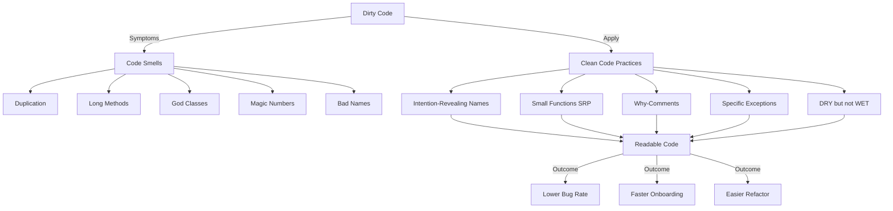
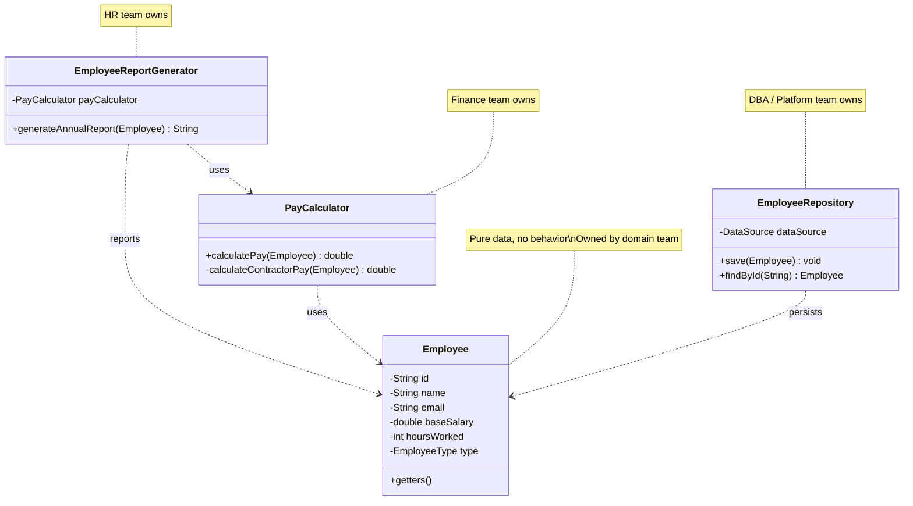
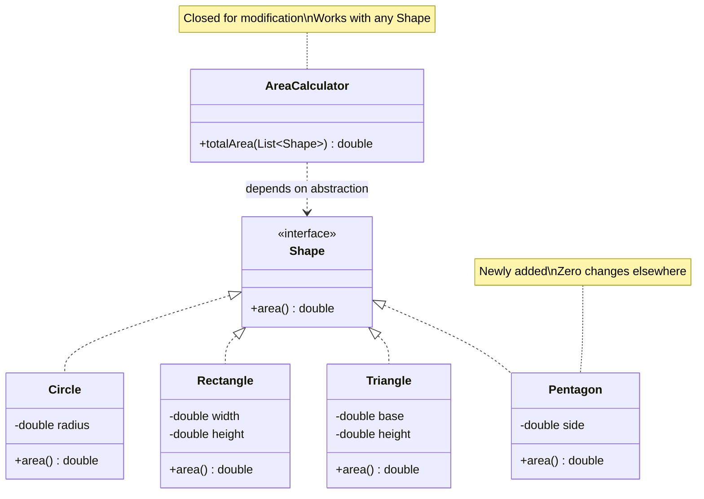
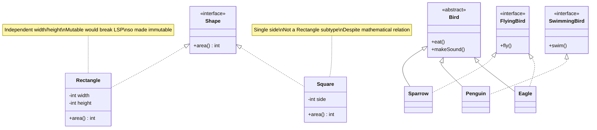
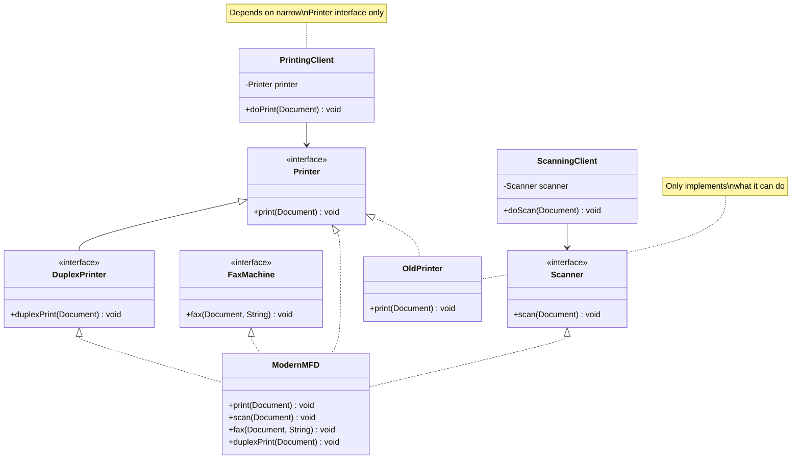
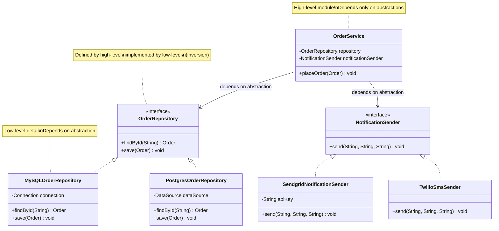

# Clean Code & SOLID

Bhai, seedhi baat — clean code basically tumhare future self ke liye gift hai. 6 mahine baad jab tu apna hi code padhega, agar samajh nahi aaya — toh tu hi villain hai apna. Aur jab team mein 10 log honge, har banda apna apna "creative" code likhega, toh codebase 6 mahine mein hi spaghetti ban jaayega. Isi liye Robert C. Martin (Uncle Bob) ne "Clean Code" aur "Clean Architecture" likhi — ye sirf style guide nahi hai, ye engineering discipline hai.

SOLID principles object-oriented design ke 5 commandments hain. Single Responsibility, Open/Closed, Liskov Substitution, Interface Segregation, aur Dependency Inversion. Ye principles tab paida hue jab Bob Martin aur Barbara Liskov jaise log dekh rahe the ki badi codebases kyu rot karti hain — ek change karo, 50 jagah break ho jaata hai. SOLID inhi rot patterns ko prevent karne ke liye hai. Java/TS jaise OO languages mein ye principles canonical hain, but functional code mein bhi inka essence apply hota hai.

Is module mein hum dono ko cover karenge — pehle Clean Code ke fundamentals (naming, functions, comments, errors, smells), phir SOLID ke 5 principles deeply, with BEFORE/AFTER refactor examples. Interview mein product companies (Atlassian, Stripe, Razorpay, Flipkart) tujhse SOLID poochne ke liye line laga ke khade hain. Bina diagram aur code ke jo bolega, woh reject. Toh chal, full depth mein chalte hain.

---

## 1. Clean Code

### 1.1 Naming, functions, comments, error handling, code smells

#### Definition

Clean code ka koi single definition nahi hai, but Bob Martin bolta hai — "Clean code reads like well-written prose." Matlab code padhke story ki tarah samajh aana chahiye. Variables, functions, classes ke naam itne clear ho ki comment ki zaroorat hi na pade. Functions itne chote ho ki ek scroll mein dikh jaayein. Error handling itni explicit ho ki failure modes hidden na ho. Aur code smells (duplication, long methods, god classes, magic numbers) ko proactively eliminate karna.

Clean code ke 4 pillars hain jo hum ek-ek karke dekhenge:

1. **Naming** — Names should reveal intent. `int d` mat likho, `int daysSinceLastLogin` likho.
2. **Functions** — Small, single-purpose, low cyclomatic complexity. Ideally 5-15 lines.
3. **Comments** — Code khud comment ho. Comments tab likho jab "why" explain karna ho, "what" nahi.
4. **Error Handling** — Exceptions over return codes, fail-fast, no swallowing.
5. **Code Smells** — Duplication, dead code, long parameter lists, feature envy, primitive obsession.

#### Why?

Sun bhai, ek interesting stat hai — average developer apna 10x time code padhne mein bitata hai vs likhne mein. Matlab agar tu 1 ghante naya code likhta hai, toh 10 ghante existing code padhta hai (apna ya doosre ka). Toh agar code padhna hi mehnga hai, toh code likhte time us reading cost ko optimize karna chahiye. Ye economics hai pure.

Doosri baat — bugs ka 80% root cause "developer didn't understand existing code" hota hai. Tujhe lagta hai feature add kar raha hai, but actual mein tu undocumented assumption tod raha hai jo 2 saal pehle kisi senior ne maan ke chala tha. Clean code in assumptions ko explicit banata hai.

Teesri baat — onboarding time. Naya banda team mein aaya, agar codebase clean hai toh 1 hafte mein contribute karne lagega. Agar gandhi hai, toh 3 mahine bhi kam padenge. Ye direct business cost hai. Big tech (Google, Meta) iss liye style guides aur code review ko itna serious leti hain.

Aur sabse important — clean code is a **discipline**, talent nahi. Junior bhi clean code likh sakta hai agar discipline ho. Senior bhi gandha code likhta hai agar discipline na ho. Ye ego ki baat nahi hai, craft ki baat hai.

#### How? (BEFORE/AFTER)

##### Naming — BEFORE

```java
// BEFORE: Bewakoofi se likha hua code
public class P {
    private List<int[]> l = new ArrayList<>();

    // ye function kya karta hai? bhagwan jaane
    public List<int[]> getThem() {
        List<int[]> l1 = new ArrayList<>();
        for (int[] x : l) {
            if (x[0] == 4) {
                l1.add(x);
            }
        }
        return l1;
    }
}
```

Yahan kuch bhi nahi pata — `P` kya hai, `l` kya hai, `4` ka matlab kya hai. Ye magic number hai. `getThem` se kya milega? Ye **mental mapping** force karta hai, jo Bob Martin ke according cardinal sin hai.

##### Naming — AFTER

```java
// AFTER: Naam se hi kahani saaf hai
public class GameBoard {
    private List<Cell> cells = new ArrayList<>();

    private static final int FLAGGED = 4;

    // flagged cells return karta hai — naam se obvious
    public List<Cell> getFlaggedCells() {
        List<Cell> flaggedCells = new ArrayList<>();
        for (Cell cell : cells) {
            if (cell.isFlagged()) {
                flaggedCells.add(cell);
            }
        }
        return flaggedCells;
    }
}

// Cell ek proper domain object hai, primitive int[] nahi
public class Cell {
    private int status;

    public boolean isFlagged() {
        return status == GameBoard.FLAGGED;
    }
}
```

Ab dekh — `GameBoard`, `Cell`, `getFlaggedCells`, `isFlagged` — sab self-documenting hain. Magic number `4` ko named constant `FLAGGED` mein convert kar diya. Aur primitive `int[]` ko `Cell` class mein wrap kar diya (primitive obsession smell remove).

##### Functions — BEFORE

```typescript
// BEFORE: Ek function jo 10 kaam kar raha hai
function processOrder(order: any): any {
    // validation
    if (!order.id) throw new Error("No id");
    if (!order.items || order.items.length === 0) throw new Error("Empty");
    if (!order.customer) throw new Error("No customer");

    // tax calculation
    let tax = 0;
    for (const item of order.items) {
        if (item.category === "food") tax += item.price * 0.05;
        else if (item.category === "luxury") tax += item.price * 0.18;
        else tax += item.price * 0.12;
    }

    // discount
    let discount = 0;
    if (order.customer.tier === "gold") discount = 0.1;
    else if (order.customer.tier === "silver") discount = 0.05;

    // total
    let subtotal = 0;
    for (const item of order.items) subtotal += item.price * item.quantity;
    const total = subtotal + tax - (subtotal * discount);

    // db save
    db.orders.insert({ ...order, tax, discount, total });

    // email
    emailService.send(order.customer.email, `Order ${order.id} placed`, `Total: ${total}`);

    return { orderId: order.id, total };
}
```

Ye function 30+ lines hai, 5 alag responsibilities hai (validation, tax, discount, total, save, email). Test karna nightmare. Change karna nightmare.

##### Functions — AFTER

```typescript
// AFTER: Chote, single-purpose functions
function processOrder(order: Order): OrderResult {
    validateOrder(order);
    const tax = calculateTax(order.items);
    const discount = calculateDiscount(order.customer);
    const total = calculateTotal(order.items, tax, discount);

    const savedOrder = saveOrder(order, tax, discount, total);
    notifyCustomer(savedOrder);

    return { orderId: savedOrder.id, total };
}

// Har function ek hi cheez karta hai
function validateOrder(order: Order): void {
    if (!order.id) throw new ValidationError("Order ID missing");
    if (!order.items?.length) throw new ValidationError("Order items empty");
    if (!order.customer) throw new ValidationError("Customer missing");
}

function calculateTax(items: OrderItem[]): number {
    return items.reduce((sum, item) => sum + getTaxForItem(item), 0);
}

function getTaxForItem(item: OrderItem): number {
    const rate = TAX_RATES[item.category] ?? TAX_RATES.default;
    return item.price * rate;
}

const TAX_RATES = { food: 0.05, luxury: 0.18, default: 0.12 };

function calculateDiscount(customer: Customer): number {
    return DISCOUNT_TIERS[customer.tier] ?? 0;
}

const DISCOUNT_TIERS = { gold: 0.1, silver: 0.05 };

function calculateTotal(items: OrderItem[], tax: number, discount: number): number {
    const subtotal = items.reduce((sum, i) => sum + i.price * i.quantity, 0);
    return subtotal + tax - (subtotal * discount);
}
```

Ab har function 1-5 lines ka hai. Test mein `calculateTax` ko alag mock kar sakte hain. Naya tax category add karna ho — `TAX_RATES` mein entry add karo, function chhedna nahi. **Stepdown rule** follow ho raha hai — top function high-level, neeche neeche specifics.

##### Comments — When YES, when NO

```java
// BAD COMMENTS — don't do this
// increment i by 1
i++;  // duh, code hi keh raha hai

// loop through users
for (User u : users) { ... }  // bekaar comment

// TODO: fix this  // 3 saal purana TODO, koi nahi fix karega

/**
 * @param x the x
 * @return the result
 */  // Javadoc that adds zero info
```

```java
// GOOD COMMENTS — yahan zaroori hain

// Hum bitwise AND use kar rahe hain instead of modulo because
// hash table size always power of 2 hai — ye 4x faster hai benchmark mein.
int bucket = hash & (capacity - 1);

// HACK: Stripe webhook sometimes sends duplicate events within 100ms.
// Idempotency check needed because retry logic upstream broken hai.
// Ticket: PAY-2341, Stripe support case #88291
if (isDuplicateEvent(event)) return;

// Regex breakdown:
// ^[6-9]   — Indian mobile starts with 6,7,8,9
// \d{9}$   — followed by exactly 9 digits
// Total 10 digits, no country code
private static final Pattern INDIAN_MOBILE = Pattern.compile("^[6-9]\\d{9}$");
```

Rule: Comment **why**, not **what**. Code already says what. Comment context, business reasoning, gotchas, references.

##### Error Handling — BEFORE

```java
// BEFORE: Error codes, swallowed exceptions, kuch pata nahi kya hua
public int saveUser(User user) {
    try {
        if (user == null) return -1;
        if (user.getEmail() == null) return -2;
        if (db.exists(user.getEmail())) return -3;

        db.save(user);
        return 0;
    } catch (Exception e) {
        // chup chap eat kar liya error
        return -99;
    }
}

// caller side mein nightmare
int result = saveUser(user);
if (result == -1) { /* null user */ }
else if (result == -2) { /* no email */ }
else if (result == -3) { /* duplicate */ }
else if (result != 0) { /* kuch toh galat hua */ }
```

Ye C-style hai. Java mein exceptions hain, use karo. Aur `catch (Exception e)` mein kuch nahi karna ye worst sin hai — error gayab ho jaata hai.

##### Error Handling — AFTER

```java
// AFTER: Exceptions, fail-fast, specific types
public class UserService {

    public User saveUser(User user) {
        Objects.requireNonNull(user, "User cannot be null");

        validateEmail(user.getEmail());
        ensureNotDuplicate(user.getEmail());

        try {
            return db.save(user);
        } catch (SQLException e) {
            // wrap karke domain exception throw kar — caller ko SQL ka kya pata
            throw new UserPersistenceException(
                "Failed to save user " + user.getEmail(), e
            );
        }
    }

    private void validateEmail(String email) {
        if (email == null || email.isBlank()) {
            throw new InvalidUserException("Email is required");
        }
        if (!EMAIL_PATTERN.matcher(email).matches()) {
            throw new InvalidUserException("Invalid email format: " + email);
        }
    }

    private void ensureNotDuplicate(String email) {
        if (db.existsByEmail(email)) {
            throw new DuplicateUserException("User already exists: " + email);
        }
    }
}

// Custom exception hierarchy
public class UserException extends RuntimeException { ... }
public class InvalidUserException extends UserException { ... }
public class DuplicateUserException extends UserException { ... }
public class UserPersistenceException extends UserException { ... }
```

Ab caller specific catch kar sakta hai, error types se. Stack trace preserved hai. Original SQLException wrap ho ke jaata hai (caller ko domain leak nahi hota).

##### Code Smells — Quick Reference

| Smell | Kya hota hai | Kaise fix |
|-------|--------------|-----------|
| **Duplicated code** | Same logic 3 jagah | Extract method/class |
| **Long method** | 50+ line function | Extract method, decompose |
| **Large class** | God class, 1000 lines | Split by responsibility |
| **Long parameter list** | `foo(a,b,c,d,e,f,g)` | Parameter object |
| **Feature envy** | Method dusri class ke field zyada use kar raha | Move method |
| **Primitive obsession** | `String email`, `String phone` everywhere | Value objects |
| **Magic numbers** | `if (x > 86400)` | Named constant `SECONDS_PER_DAY` |
| **Dead code** | Commented out, never called | Delete it (git remembers) |
| **Comments lying** | Comment says X, code does Y | Update or delete |
| **Shotgun surgery** | Ek change, 20 jagah edit | Consolidate concept |

#### Real-life Example

Razorpay payment integration sochta hu. Initial version mein ek senior ne `processPayment()` likha — 800 lines, validation + gateway call + retry + webhook + ledger update + email + SMS sab ek mein. Diwali traffic mein bug aaya — refund flow mein ledger entry double ho rahi thi. Debug karne baithe — 4 din lage kyunki function itna bada tha, kaha break ho raha hai pata hi nahi chal raha tha. Logs mein kuch nahi kyunki `catch(Exception e) { log.error("error"); }` — useless.

Refactor mein hum ne tod ke 12 chote functions banaye — `validatePaymentRequest`, `callGateway`, `recordLedgerEntry`, `notifyMerchant`, etc. Har ek mein specific exception types. Result — agla bug 30 minute mein fix ho gaya, kyunki stack trace seedha `LedgerException` pe gaya, line number ke saath.

Doosra example — Flipkart ke search team ne ek `SearchHelper` class banayi thi (red flag — "Helper" naming smell). 2 saal mein 4500 lines ki ho gayi. Kuch bhi search-related ho woh wahin daal dete the. Onboarding mein 2 mahine sirf is class samajhne mein lagte the. Eventually team ne split kiya — `QueryParser`, `Ranker`, `Filter`, `ResultAggregator`, `SuggestionEngine`. Velocity 3x ho gayi.

#### Diagram



#### Interview Q&A

**Q1: Tu code review karta hai. Junior ne ek 200-line function bheja jo working hai, tests pass hain. Tu kya feedback dega aur kyu?**

Bhai, tests pass karna minimum bar hai, sufficient nahi. Mai pehle yeh dekhunga ki function kya kya kar raha hai — agar 5+ responsibilities hain (validation, business logic, DB, network, formatting), toh seedha SRP violation hai. 200 lines mein cyclomatic complexity 20+ hogi guaranteed, jo unmaintainable hai. Mai junior ko bolunga: function ko **stepdown rule** ke according tod — top mein high-level orchestration, neeche specifics. Har function 5-15 lines, single purpose, abstraction level consistent rakhe. Tests pass karne ka matlab ye nahi ki future change easy hoga — jab requirement change hogi, ye 200-line monster modify karna painful hoga, aur regression risk high. Code is read 10x more than written, toh readability optimize karna interest deta hai pure project mein.

Aur ek important point — tests pass hone ka ek aur side hai: agar function itna bada hai toh tests bhi probably integration-level hain, unit nahi. Refactor karke chote functions banayenge toh unit tests likhe ja sakenge, jo faster, cheaper, aur targeted hote hain. Coverage bhi increase hoga without effort.

**Q2: Comments ke baare mein tera philosophy kya hai? Kab likhta hai, kab nahi?**

Mera default position hai — comments are a failure of code to express itself. Agar mujhe comment likhna pad raha hai ki "ye loop users iterate kar raha hai", toh problem ye hai ki code spasht nahi hai. Pehle naam improve karunga — `for (User user : activeUsers)` already self-documenting hai. Comment likhne se pehle 3 questions puchhta hu: kya naam better ho sakta hai? Kya function extract karke usko naam de sakte hain? Kya variable rename karke clear ho sakta hai? Agar in tinon ka jawab nahi hai, tab comment justify hota hai.

Comments **zaroor** likhta hu in cases mein: business reasoning ("GST 18% kyunki luxury category — government rule, see GST Act"), non-obvious optimizations ("bitwise AND for power-of-2 hash, 4x faster"), workarounds with ticket reference ("HACK: Stripe webhook duplicate fix, see PAY-2341"), regex/algorithm explanations, public API documentation (Javadoc/TSDoc). Sab cases mein comment **why** explain karta hai, **what** nahi. Aur stale comments to actively delete karta hu — galat comment galat code se zyada dangerous hai, kyunki reader trust karta hai use.

**Q3: "Fail fast" matlab kya hota hai? Aur defensive programming se kaise alag hai?**

Fail-fast ka matlab hai — jaise hi invalid state detect ho, immediately exception throw karo, silently continue mat karo. Maan le ek function hai jo `userId` accept karta hai. Agar `null` aata hai, toh function ke top pe `Objects.requireNonNull(userId)` daal — pehli line mein hi NullPointerException with message. Vs alternative — null leke chalo, 50 lines neeche jab DB call karega tab mysterious NPE aayega without context. Fail-fast debugging ko trivialize karta hai — error source ke paas hi blow up karta hai.

Defensive programming alag concept hai — har jagah null check, type check, range check, even jab caller already validate kar chuka hai. Ye "paranoid coding" hai — short-term safe lagta hai but long-term mein code bloat hota hai aur **postel's law** ka misapplication ho jaata hai. Sahi pattern hai — **boundaries pe defend, internals mein trust**. Public API entry point pe rigorous validation, internal private methods mein assume ki inputs already valid hain (kyunki tu hi caller hai). Iss se code clean rehta hai aur fail-fast philosophy maintain hoti hai. DTOs aur value objects ko constructor mein validate karo — once they exist, woh always valid hain (make illegal states unrepresentable).

**Q4: Code smell aur anti-pattern mein kya difference hai?**

Code smell ek **hint** hai ki kuch galat ho sakta hai — confirmed bug nahi, suspicion hai. Jaise long method ek smell hai — automatically wrong nahi hai (kuch performance-critical functions intentionally long ho sakte hain), but flag karta hai ki investigate karo. Smells ka concept Martin Fowler ne popularize kiya — duplication, feature envy, primitive obsession, etc. Sab smells refactor karke address kiye ja sakte hain — `Refactoring` book unka catalog hai with specific recipes (Extract Method, Replace Conditional with Polymorphism, etc.).

Anti-pattern usse zyada serious hai — confirmed bad practice with documented negative consequences. Singleton (when misused), God Object, Spaghetti Code, Copy-Paste Programming — ye anti-patterns hain. Anti-pattern ki recognized solution hoti hai. Smell aur anti-pattern dono ki structure (problem, context, consequences, solution) similar hoti hai, but anti-pattern stronger statement hai. Practical interview answer — main "smell" word use karta hu code review mein kyunki softer hai aur dialogue invite karta hai. "Anti-pattern" boldenga toh defensive ho jaayega banda, "smell hai shayad" bologe toh discussion start hogi. Communication bhi engineering skill hai.

---

## 2. SOLID Principles

SOLID 5 principles ka acronym hai jo Robert C. Martin ne 2000s mein consolidate kiye, but inka root Bertrand Meyer aur Barbara Liskov ke 80s-90s ke kaam mein hai. Ye principles object-oriented design ke liye hain, but mostly modular design ke liye apply hote hain — functional code mein bhi essence hota hai. Goal hai: **code that is easy to maintain and extend over time**.

### 2.1 S — Single Responsibility Principle

#### Definition

Bob Martin ki original definition: "A class should have only one reason to change." Recently usne refine kiya: "A module should be responsible to one, and only one, actor." Actor matlab stakeholder/user/department jo us module ke behavior ke liye responsible hai. Agar HR ke rules change hote hain, toh sirf HR-related class change ho. Agar Finance ke rules change hote hain, sirf Finance class change ho. Agar ek hi class HR aur Finance dono se driven hai, toh ye SRP violation hai.

Common misunderstanding — log samajhte hain "class ek hi kaam kare". Galat. Class ek hi **stakeholder** ko answer kare. Ek class 10 methods ke saath ho sakti hai if all 10 methods ek hi reason se change hote hain.

#### Why?

Sun bhai, jab ek class 2-3 stakeholders ko serve karti hai, toh political problem ho jaati hai. Maan le `Employee` class hai jismein `calculatePay()` (Finance owns), `saveToDatabase()` (DBA owns), `generateReport()` (HR owns). Ab Finance ne pay calculation rule change kiya. Tu `calculatePay()` modify karega. Test karne ke baad realize hoga ki HR ka report bhi unintentionally affected hua kyunki dono shared private method `getRegularHours()` use karte the. **Coupling between unrelated concerns** — yehi SRP violate karne ka cost hai.

Doosra reason — testability. Agar class 5 cheezein karti hai, toh test setup mein 5 dependencies mock karne padenge. Agar class ek cheez karti hai, ek-do dependency. Mock setup simple, tests fast.

Teesra — **merge conflicts**. Multi-stakeholder class pe alag alag teams alag features develop karenge — guaranteed git conflicts. SRP follow karne se ek class ek team owns, conflicts naturally reduce.

#### How? (BEFORE/AFTER)

##### BEFORE — Multiple responsibilities in one class

```java
// BEFORE: Employee class jo sab kuch karti hai — SRP violation
public class Employee {
    private String name;
    private String email;
    private double baseSalary;
    private int hoursWorked;
    private String role;

    // Finance ka kaam — pay calculation
    public double calculatePay() {
        if (role.equals("HOURLY")) {
            return hoursWorked * baseSalary;
        } else if (role.equals("SALARIED")) {
            return baseSalary;
        }
        // ye if-else change hoga jab Finance new rule banayegi
        return 0;
    }

    // DBA ka kaam — persistence
    public void saveToDatabase() {
        Connection conn = DriverManager.getConnection("jdbc:...");
        PreparedStatement ps = conn.prepareStatement(
            "INSERT INTO employees VALUES (?, ?, ?)"
        );
        ps.setString(1, name);
        ps.setString(2, email);
        ps.setDouble(3, baseSalary);
        ps.execute();
        // ye change hoga jab DBA schema change kare
    }

    // HR ka kaam — reporting
    public String generateAnnualReport() {
        StringBuilder sb = new StringBuilder();
        sb.append("Employee: ").append(name).append("\n");
        sb.append("Total Pay: ").append(calculatePay() * 12).append("\n");
        sb.append("Hours: ").append(hoursWorked).append("\n");
        return sb.toString();
        // ye change hoga jab HR report format change kare
    }
}
```

3 stakeholders, 3 reasons to change. Finance pay rule change kare, DBA schema change kare, HR report format change kare — sab is ek class ko touch karenge. Conflicts guaranteed.

##### AFTER — Split by responsibility

```java
// AFTER: Har responsibility ka apna class

// Pure data — Employee just carries info
public class Employee {
    private final String id;
    private final String name;
    private final String email;
    private final double baseSalary;
    private final int hoursWorked;
    private final EmployeeType type;

    // constructor, getters
}

// Finance owns this — pay calculation
public class PayCalculator {
    public double calculatePay(Employee employee) {
        return switch (employee.getType()) {
            case HOURLY -> employee.getHoursWorked() * employee.getBaseSalary();
            case SALARIED -> employee.getBaseSalary();
            case CONTRACTOR -> calculateContractorPay(employee);
        };
    }

    private double calculateContractorPay(Employee e) {
        return e.getHoursWorked() * e.getBaseSalary() * 1.2; // 20% premium
    }
}

// DBA owns this — persistence
public class EmployeeRepository {
    private final DataSource dataSource;

    public EmployeeRepository(DataSource dataSource) {
        this.dataSource = dataSource;
    }

    public void save(Employee employee) {
        try (Connection conn = dataSource.getConnection();
             PreparedStatement ps = conn.prepareStatement(
                 "INSERT INTO employees (id, name, email, salary) VALUES (?, ?, ?, ?)"
             )) {
            ps.setString(1, employee.getId());
            ps.setString(2, employee.getName());
            ps.setString(3, employee.getEmail());
            ps.setDouble(4, employee.getBaseSalary());
            ps.execute();
        } catch (SQLException e) {
            throw new PersistenceException("Failed to save employee", e);
        }
    }
}

// HR owns this — reporting
public class EmployeeReportGenerator {
    private final PayCalculator payCalculator;

    public EmployeeReportGenerator(PayCalculator payCalculator) {
        this.payCalculator = payCalculator;
    }

    public String generateAnnualReport(Employee employee) {
        double annualPay = payCalculator.calculatePay(employee) * 12;
        return String.format(
            "Employee: %s\nAnnual Pay: %.2f\nHours: %d",
            employee.getName(), annualPay, employee.getHoursWorked()
        );
    }
}
```

Ab 3 alag classes, 3 alag teams own kar sakti hain. Finance ne pay rule change kiya — sirf `PayCalculator` change. DBA ne column add kiya — sirf `EmployeeRepository`. HR ne format change kiya — sirf `EmployeeReportGenerator`. Zero coupling.

#### Real-life Example

Maine Swiggy mein ek `OrderManager` class dekha tha (legacy code review session mein). 2300 lines. Ye class:
- Order place kar rahi thi (customer flow)
- Restaurant ko notify kar rahi thi (restaurant team flow)
- Delivery agent assign kar rahi thi (logistics team flow)
- Payment process kar rahi thi (payments team flow)
- Analytics events fire kar rahi thi (data team flow)

5 teams, 1 class. Har sprint mein 3-4 teams concurrently is class mein PR daal rahi thin. Merge conflict daily ka kissa tha. Testing mein ek bug fix karte time doosri team ka feature break hota tha — kyunki shared private state.

Refactor karke split kiya: `OrderPlacementService`, `RestaurantNotificationService`, `DeliveryAssignmentService`, `PaymentProcessor`, `AnalyticsPublisher`. Ek facade `OrderOrchestrator` jo inhe coordinate karta hai (high-level only). Result — merge conflicts 80% drop, deploy frequency 3x increase, kyunki teams independently deploy kar sakti thin apni service.

Doosra example: Stripe ka famous design — har object (Customer, Charge, Subscription) ke liye separate Service class hai. `Customer` is data, `CustomerService` operations karta hai. SRP at object level.

#### Diagram



#### Interview Q&A

**Q1: SRP ki "single reason to change" wali definition mein "reason" ka matlab kya hai? Tujhe practical mein kaise pata chalta hai ki class SRP violate kar rahi hai?**

Bob Martin ne baad mein clarify kiya — "reason" matlab "actor" ya "stakeholder". Practical mein mai 3 questions puchta hu. Pehla — "Is class ko change karne ki request kaun raise karega? Agar 2+ alag departments/teams hain, toh SRP violation hai." Doosra — "Agar mai is class ko ek vakya mein describe karu without 'and', kya possible hai? `OrderProcessor` — fine. `OrderProcessorAndEmailSender` — clearly violation." Teesra — "Class ke methods ke groups banao based on which fields they touch. Agar 2-3 disjoint clusters bante hain, class internally split ho rahi hai."

Aur ek tactical heuristic — jab `git log` mein class ki history dekhu, agar har commit alag team se hai (Finance ne ek commit, HR ne dusra, DBA ne teesra), toh class genuinely multi-stakeholder hai. Iska direct measurement bhi possible hai static analysis tools se — LCOM (Lack of Cohesion of Methods) metric high ho toh SRP suspect karo.

**Q2: SRP follow karne mein koi downside hai? Aksar log bolte hain "too many small classes ho jaati hain."**

Haan bhai, ye real concern hai. SRP ko maximalize karoge toh "class explosion" anti-pattern aata hai — 50 classes for what could be 5. Pratyek class 10-15 lines, har jagah dependencies inject ho rahi hain, code navigate karna mushkil. Ye **over-engineering** hai. Sahi balance ye hai — split karo jab actually multiple stakeholders hain ya class clearly bloated ho rahi hai. Speculative SRP mat karo. YAGNI (You Ain't Gonna Need It) principle yahan apply hota hai — aaj jo nahi chahiye, aaj mat banao.

Doosra trade-off hai — performance. Bahut chote classes mein method calls ka overhead (vmtable lookups, JIT inlining limits) ho sakta hai hot path mein. 99% applications mein ye negligible hai, but high-frequency trading ya game engines mein matter karta hai. Aur cognitive overhead — new dev codebase mein aaye, 100 chote classes dekhe vs 10 medium classes — sometimes medium classes easier to grok hote hain. Pragmatic SRP follow karo, dogmatic nahi.

**Q3: Agar mere paas ek class hai jo 3 things karti hai but woh tightly coupled hain (jaise login flow mein authenticate, generate token, audit log), toh kya SRP violate kar raha hu?**

Ye nuance question hai. Pehle dekh — ye 3 cheezein conceptually 3 alag responsibilities hain ya ek hi responsibility (login) ke 3 steps hain. Agar cohesive workflow hai aur sab steps ek hi reason se change hoge (login policy change), toh ek class mein rakhna acceptable hai. Iska naam `LoginService` rakh — single high-level responsibility "user ko log in karna." Internally 3 private methods ho sakte hain.

But — agar audit logging compliance team owns (audit format unhone decide kiya, change kar sakte hain), token generation security team owns (algorithm change ho sakta hai), aur authenticate logic product team owns — toh 3 alag stakeholders hain, split karo. `Authenticator`, `TokenService`, `AuditLogger` alag, aur `LoginService` inhe orchestrate kare. Ye **composition over coupling** approach hai. Decision factor stakeholder hai, lines of code nahi.

**Q4: SRP aur Cohesion mein kya relationship hai?**

Bhai, ye dono basically same coin ke do sides hain. Cohesion measure karta hai ki class ke andar elements (fields, methods) kitne related hain. High cohesion matlab sab elements ek concept ke baare mein hain. SRP achieve karne ka outcome high cohesion hai — agar class ek hi reason se change hoti hai, toh uske sab elements logically related honge.

Mathematically, **LCOM (Lack of Cohesion of Methods)** metric class ke methods ke beech shared field usage measure karta hai. Low LCOM = high cohesion = likely SRP-compliant. High LCOM = methods unrelated = likely SRP violation. Tools jaise SonarQube, Codacy ye metric automatically compute karte hain. Interview mein agar deeper jaana hai, "I'd use cohesion metrics like LCOM4 to objectively flag SRP violations during code review" bolna 10x impressive lagta hai vs sirf intuition.

---

### 2.2 O — Open/Closed Principle

#### Definition

Bertrand Meyer (1988) ki definition: "Software entities (classes, modules, functions) should be open for extension, but closed for modification." Matlab — naya behavior add karne ke liye **existing code ko modify karne ki zaroorat nahi padni chahiye**, balki extension mechanism (subclass, interface, plugin) ke through achieve hona chahiye.

Modern interpretation polymorphism aur abstraction pe based hai. Ek stable abstraction (interface/abstract class) define karo, aur naye behaviors uske implementations ke through aaye. Existing code ko stable rakho — once written, tested, deployed — usse mat chedo. Naya code naye file mein.

#### Why?

Sun, jab tu existing tested code modify karta hai, tu **regression risk** introduce karta hai. Test suite cheez hi yehi hai — tested behavior mein confidence. Modify karoge toh dobara test karna padega, edge cases miss ho sakte hain, deployed customers affect ho sakte hain. Naya code add karna safe hai — existing behavior pe impact zero (theoretically).

Doosra reason — **deployment independence**. Agar plugin model use karte ho (jaise Eclipse, Chrome extensions, Stripe webhooks), toh naye plugins independently develop aur deploy ho sakte hain bina core platform touch kiye. Big payoff in large codebases.

Teesra — **multiple variants without code duplication**. Tujhe payment system mein 5 payment methods support karne hain (UPI, Card, NetBanking, Wallet, Cash). Agar `if-else` likhega `PaymentProcessor` mein, har naya method add karne pe usko modify karega. OCP follow karke `PaymentMethod` interface banao, har method uska implementation. Naya method add karne pe bas naya class banao, existing untouched.

#### How? (BEFORE/AFTER)

##### BEFORE — Modification needed for new types

```java
// BEFORE: Har naya shape add karne ke liye AreaCalculator ko modify karna padta hai
public class Shape {
    public String type;
    public double radius;       // for circle
    public double width, height; // for rectangle
    public double base, heightTri; // for triangle
}

public class AreaCalculator {
    public double calculateArea(Shape shape) {
        if (shape.type.equals("CIRCLE")) {
            return Math.PI * shape.radius * shape.radius;
        } else if (shape.type.equals("RECTANGLE")) {
            return shape.width * shape.height;
        } else if (shape.type.equals("TRIANGLE")) {
            return 0.5 * shape.base * shape.heightTri;
        }
        // naya shape add karne ke liye yahan if-else add karna padega
        // aur Shape class mein naye fields add karne padenge
        throw new IllegalArgumentException("Unknown shape");
    }
}
```

Naya shape add karna ho — `Pentagon`. Tujhe `Shape` modify karna padega (naye fields), `AreaCalculator` modify karna padega (naya if branch). Jaha Pentagon use ho usske test bhi rerun karne padenge, aur Circle/Rectangle ke tests bhi rerun karne padenge kyunki shared code change hua. Risk **everywhere**.

##### AFTER — Polymorphism for extension

```java
// AFTER: Open for extension via Shape interface
public interface Shape {
    double area();
}

public class Circle implements Shape {
    private final double radius;

    public Circle(double radius) {
        this.radius = radius;
    }

    @Override
    public double area() {
        return Math.PI * radius * radius;
    }
}

public class Rectangle implements Shape {
    private final double width;
    private final double height;

    public Rectangle(double width, double height) {
        this.width = width;
        this.height = height;
    }

    @Override
    public double area() {
        return width * height;
    }
}

public class Triangle implements Shape {
    private final double base;
    private final double height;

    public Triangle(double base, double height) {
        this.base = base;
        this.height = height;
    }

    @Override
    public double area() {
        return 0.5 * base * height;
    }
}

// AreaCalculator ab kabhi modify nahi hoga
public class AreaCalculator {
    public double totalArea(List<Shape> shapes) {
        return shapes.stream()
                     .mapToDouble(Shape::area)
                     .sum();
    }
}

// Naya shape add karna ho? Bas naya class
public class Pentagon implements Shape {
    private final double side;

    public Pentagon(double side) {
        this.side = side;
    }

    @Override
    public double area() {
        // Pentagon formula
        return 0.25 * Math.sqrt(5 * (5 + 2 * Math.sqrt(5))) * side * side;
    }
}
// Existing code zero modification.
```

`AreaCalculator` ab **closed for modification** hai — kabhi nahi badlega. But system **open for extension** hai — `Pentagon`, `Hexagon`, anything add kar sakte ho bina existing classes touch kiye.

##### TypeScript — Strategy Pattern Example

```typescript
// Discount calculation — different strategies
interface DiscountStrategy {
    calculate(price: number): number;
}

class NoDiscount implements DiscountStrategy {
    calculate(price: number): number {
        return price;
    }
}

class PercentageDiscount implements DiscountStrategy {
    constructor(private percentage: number) {}

    calculate(price: number): number {
        return price * (1 - this.percentage / 100);
    }
}

class FlatDiscount implements DiscountStrategy {
    constructor(private amount: number) {}

    calculate(price: number): number {
        return Math.max(0, price - this.amount);
    }
}

class BogoDiscount implements DiscountStrategy {
    // Buy one get one — half price
    calculate(price: number): number {
        return price * 0.5;
    }
}

class Cart {
    constructor(private discountStrategy: DiscountStrategy) {}

    checkout(price: number): number {
        return this.discountStrategy.calculate(price);
    }
}

// Naya discount type add karna? Bas naya class
class TieredDiscount implements DiscountStrategy {
    calculate(price: number): number {
        if (price > 10000) return price * 0.7;
        if (price > 5000) return price * 0.85;
        return price * 0.95;
    }
}
// Cart class touched? Nahi. Existing strategies touched? Nahi.
```

#### Real-life Example

Razorpay payment gateway mein OCP textbook example hai. Unhone `PaymentInstrument` interface define ki hai. Initial mein 3 implementations the — `Card`, `Netbanking`, `UPI`. Jab `Wallet` (Paytm, MobiKwik) add karna tha, unhone naya `WalletInstrument` class banaya. Core payment processing engine, fraud detection, ledger — sab existing code untouched. Bas factory mein `Wallet` register kiya. Ye iss liye possible hai kyunki interface stable rakhi hai design time pe.

But agar naya instrument fundamentally different ho (jaise Crypto — uske liye blockchain confirmations track karne padenge, jo card ke liye nahi hote), toh OCP break ho jaata hai. Tab interface ko evolve karna padta hai (add new method) — jo automatically existing implementations break karega. Iska resolution: interface segregation (next topic) ya default methods (Java 8+).

Doosra example — Spring Framework's `BeanPostProcessor` extension point. Spring core code never modified — but tu apna processor implement kar ke beans ke creation ko hijack kar sakta hai. AOP, Validation, Security sab is mechanism ke through plug ho jaate hain.

#### Diagram



#### Interview Q&A

**Q1: OCP achieve karne ke liye kaunse design patterns common hain?**

Bhai, OCP polymorphism pe fundamentally based hai, toh sare polymorphic patterns OCP enable karte hain. Sabse common — **Strategy pattern** (different algorithms behind ek interface, like discount example). **Template Method** (base class skeleton define kare, subclasses specifics fill karein). **Decorator** (existing object ke around new behavior wrap karna without modification). **Visitor** (new operations existing object hierarchies pe add karna). **Chain of Responsibility** (handlers chain mein, naye handler add karna easy). **Plugin/Service Locator** (registry pattern jaha implementations runtime mein register hote hain).

Practical advice — **Strategy** aur **Template Method** 80% cases cover kar dete hain. Decorator advance use case mein. Visitor mostly compiler/AST jaise tree structures mein useful hai. Aur ek modern technique — **functional approach** with first-class functions/lambdas. Java mein `Function<T,R>` pass karna ek strategy pass karne ka lightweight equivalent hai. TypeScript mein closures use kar sakte ho. OCP ko object-oriented patterns ke saath limit mat karo, functional composition bhi ek tool hai.

**Q2: OCP follow karne mein kya cost hai? Kab violate karna acceptable hai?**

Cost hai — **upfront design effort** aur **abstraction overhead**. OCP achieve karne ke liye tujhe future extensions anticipate karne padte hain, interfaces design karne padte hain. Speculative abstraction galat ho sakti hai — `Shape` interface design ki, but actual extension `3D Shape` aaya jo `volume()` chahta hai, toh interface change karni padegi (jo OCP break karta hai). Ye **YAGNI vs OCP** trade-off hai.

Pragmatic rule — pehli baar likhte time concrete code likho (no premature abstraction). Doosri baar similar code likhna pade, identify pattern, OCP-ready abstraction extract karo (Refactor to abstraction, not pre-design). Teesri baar similar — definitely abstract karo. Ye **rule of three** Refactoring book mein hai. Iss approach se over-engineering avoid hota hai aur abstraction real usage patterns se driven hoti hai, speculation se nahi.

OCP violate karna acceptable hai jab — class internal implementation detail hai (private to module), prototype/MVP hai (production nahi), ya extension probability extremely low hai. Production library code mein OCP zaroori, prototype code mein nahi.

**Q3: Open/Closed sound contradictory lagta hai. Iska resolution kya hai?**

Haan, paradox lagta hai pehli baar. Resolution **abstraction layer** mein hai. Ek class **closed for modification** hai matlab uska public interface aur core behavior fix hai. Same time **open for extension** hai matlab uske subclasses ya implementations new behaviors provide kar sakte hain. Stable interface, evolving implementations.

Analogy le — USB port closed for modification hai (USB-A standard fixed), but open for extension (koi bhi USB device plug ho sakta hai jo standard follow kare). Tu USB port modify nahi karta naye device ke liye — port stable, devices vary. Software mein same — interface USB port hai, implementations USB devices.

Iska deeper insight ye hai ki OCP **architectural tension** ko name deti hai — change costly hai, but change inevitable hai. Solution change ko boundary pe contain karo (extension points pe), core stable rakho. Ye principle Robert Martin's Clean Architecture mein bhi appear karta hai — concentric circles where outer rings change, inner rings stable.

**Q4: Polymorphism aur OCP relate kaise karte hain?**

Polymorphism OCP achieve karne ka **mechanism** hai, OCP **goal** hai. Polymorphism ke bina classical OCP impossible hai. Subtype polymorphism (interfaces/inheritance), parametric polymorphism (generics), ad-hoc polymorphism (overloading) — sab OCP enable karte hain alag tarah se.

Subtype polymorphism most direct hai — `List<Shape>` mein `Circle`, `Rectangle`, `Pentagon` sab daal sakte ho, code generic Shape ke against likha hai. Generics use karke aur powerful — `List<T>` for any T, container code untouched. Function pointers/lambdas — strategy passing without explicit class hierarchy.

Modern languages multiple polymorphism mechanisms provide karte hain. Java mein interfaces + generics + lambdas. TypeScript mein structural typing + generics + union types. Rust mein traits. Each mechanism alag trade-offs deta hai. OCP-conscious design mein **right polymorphism for right problem** choose karna important hai. Inheritance abuse mat karo (LSP violations risk), composition aur interfaces prefer karo. "Composition over inheritance" GoF book ka famous principle yahin se aata hai.

---

### 2.3 L — Liskov Substitution Principle

#### Definition

Barbara Liskov (1987) ki original formulation: "Let φ(x) be a property provable about objects x of type T. Then φ(y) should be true for objects y of type S where S is a subtype of T." Practical mein — **subtypes ko base type ke jagah substitute kiya ja sake bina program ka correctness toda**. Agar `Bird` ke jagah `Eagle` daal du, code break nahi hona chahiye, behavior surprise nahi karna chahiye.

LSP ka real meaning: subclass parent ka **behavioral contract** maintain kare. Ye sirf method signatures ki baat nahi (woh compiler enforce kar deta hai), ye **semantics** ki baat hai. Pre-conditions weaken karo (more lenient input), post-conditions strengthen karo (stronger output guarantees), invariants preserve karo. Ye **Design by Contract** (Bertrand Meyer) ke roots hain.

#### Why?

Sun bhai, LSP violate karne ka direct result — surprising bugs. Tu code likh raha hai jo `Animal` base class ke against work karta hai. Tujhe pata hai `animal.eat()` always works. Phir koi `Robot` (robot animal lol) subclass banata hai jo `eat()` override karke `throw new UnsupportedOperationException()` deta hai. Ab tera code mein production mein crash. Ye **hidden contract violation** hai.

LSP violate karne ka classic symptom hai — code mein `instanceof` checks. Agar tu `if (animal instanceof Robot) { /* skip eat */ }` likh raha hai, tu base type ke contract pe trust nahi kar pa raha. Ye design smell hai.

Doosra reason — **inheritance reuse without LSP is dangerous**. Inheritance code reuse ka tool hai, but agar subclass parent ka contract break karta hai, toh inheritance reuse ka cost worthless ho jaata hai (kyunki polymorphism tutta hai). Composition then preferable hai.

#### How? (BEFORE/AFTER)

##### BEFORE — Classic Square/Rectangle violation

```java
// BEFORE: Square Rectangle extend karta hai — LSP violation
public class Rectangle {
    protected int width;
    protected int height;

    public void setWidth(int width) { this.width = width; }
    public void setHeight(int height) { this.height = height; }
    public int getWidth() { return width; }
    public int getHeight() { return height; }
    public int area() { return width * height; }
}

public class Square extends Rectangle {
    // Square mein width aur height equal hone chahiye — invariant
    @Override
    public void setWidth(int width) {
        this.width = width;
        this.height = width;  // height bhi same set kar diya
    }

    @Override
    public void setHeight(int height) {
        this.height = height;
        this.width = height;  // width bhi same set kar diya
    }
}

// Test code — LSP violation expose
public void testRectangle(Rectangle r) {
    r.setWidth(5);
    r.setHeight(4);
    assert r.area() == 20; // FAILS for Square! Returns 16.
}

// Caller ko surprise milega
Rectangle r = new Square();
testRectangle(r);  // crashes assertion
```

Geometrically Square ek Rectangle hai, but **behaviorally** nahi. Rectangle ka contract: "width aur height independently set ho sakte hain." Square is contract violate karta hai. Tu base type assume karke code likhega, subtype crash karega.

##### AFTER — Honest hierarchy

```java
// AFTER: Common abstraction, no false inheritance
public interface Shape {
    int area();
}

public class Rectangle implements Shape {
    private final int width;
    private final int height;

    public Rectangle(int width, int height) {
        this.width = width;
        this.height = height;
    }

    @Override
    public int area() { return width * height; }

    public int getWidth() { return width; }
    public int getHeight() { return height; }
}

public class Square implements Shape {
    private final int side;

    public Square(int side) {
        this.side = side;
    }

    @Override
    public int area() { return side * side; }

    public int getSide() { return side; }
}

// Ab Square Rectangle nahi hai — alag concept. Both Shape implement karte hain.
// Polymorphism intact, LSP intact.
```

Lesson — "is-a" relationship sirf taxonomy nahi, **behavioral substitutability** se decide hota hai. Geometry mein Square Rectangle hai, but mutable Rectangle interface mein Square fit nahi hota. Immutability isse partially solve karti hai (no setters = no contract issues), but better solution hai parallel hierarchy.

##### Another Example — Bird hierarchy

```typescript
// BEFORE: Naive inheritance
class Bird {
    fly(): void {
        console.log("Flying...");
    }
}

class Sparrow extends Bird {
    // inherits fly() — works
}

class Penguin extends Bird {
    fly(): void {
        // Penguin ud nahi sakta — LSP violation
        throw new Error("Penguins can't fly!");
    }
}

function makeBirdFly(bird: Bird) {
    bird.fly();  // crashes if bird is Penguin
}

// AFTER: Honest hierarchy
abstract class Bird {
    abstract eat(): void;
    abstract makeSound(): void;
}

interface FlyingBird {
    fly(): void;
}

interface SwimmingBird {
    swim(): void;
}

class Sparrow extends Bird implements FlyingBird {
    eat() { console.log("eating seeds"); }
    makeSound() { console.log("chirp"); }
    fly() { console.log("flying"); }
}

class Penguin extends Bird implements SwimmingBird {
    eat() { console.log("eating fish"); }
    makeSound() { console.log("quack"); }
    swim() { console.log("swimming"); }
}

class Eagle extends Bird implements FlyingBird {
    eat() { console.log("eating prey"); }
    makeSound() { console.log("screech"); }
    fly() { console.log("soaring"); }
}

// Ab makeBirdFly sirf FlyingBird accept kare
function makeBirdFly(bird: FlyingBird) {
    bird.fly();  // safe — only flying birds accepted
}
```

Capabilities ko interfaces mein split kiya. Penguin Bird hai, but FlyingBird nahi. Compiler enforces correctness.

#### Real-life Example

Maine Java's `Collections` framework mein LSP violation dekha tha — `Collections.unmodifiableList()` ek `List` return karta hai jo `add()` call pe `UnsupportedOperationException` throw karta hai. Technically `List` interface implement karta hai, but contract violate karta hai (List documentation says add() should add element). Iska excuse JDK ne diya — interface segregation us time complete nahi tha. Ab Java mein `List.of()` return karta hai immutable lists, lekin interface still same hai. Ye legacy LSP violation hai.

Doosra example — Spring's `JpaRepository`. Tu `findById()` call karta hai, expectation hai entity return ho ya `Optional.empty()`. Lekin custom repository implementations mein agar koi `null` return karta hai (Optional.empty() ke jagah), ye LSP break karta hai — caller `Optional` API expect karta hai, NPE milta hai.

Real production case — ek e-commerce mein `User` aur `GuestUser` (no login) inherit karte the. `User.getEmail()` always non-null tha (registration mein required). `GuestUser.getEmail()` null return karta tha. Recommendation engine `user.getEmail().toLowerCase()` call karta tha — guest cases mein NPE crash. LSP violation. Fix — `Optional<String> getEmail()` parent class mein, Guest aur User dono Optional return karein. Or better, alag interfaces.

#### Diagram



#### Interview Q&A

**Q1: LSP violation aur interface implementation mismatch mein difference kya hai?**

Bhai, ye nuanced question hai. Interface implementation mismatch syntactic hai — compiler catch kar leta hai. Method missing, wrong signature, wrong return type — sab compile errors. LSP violation **semantic** hai — compiler nahi pakad sakta. Method signature match karta hai, lekin behavior contract break karta hai. Code chalata hai, but production mein surprise crashes.

Practical examples — `Penguin.fly()` syntactically valid hai (method exists, no compile error), but semantically `Bird.fly()` ka contract violate karta hai. Compiler iss semantic gap ko nahi dekh sakta. Type system ka limitation hai. Ye iss liye **Design by Contract** important hai — pre-conditions, post-conditions, invariants explicitly document karo (ya runtime mein check karo). Modern languages mein ye partially first-class hai (Eiffel mein full support, Java mein assertions, JML), but mostly developer discipline pe depend hai.

Tools jo help karte hain — property-based testing (QuickCheck, jqwik). Tu base type ke against properties define karta hai, framework subtype instances mein test karta hai. Agar property fail, LSP violation suspect karo.

**Q2: Tu kaise design karega ki LSP violations ho hi nahi?**

Mai 4 strategies use karta hu. Pehla — **prefer composition over inheritance**. Inheritance contract enforcement mein weak hai, composition explicit dependency. Agar Square ko Rectangle ki functionality chahiye, internally Rectangle compose karo, inherit nahi. Doosra — **immutability**. Mutable state aur inheritance mix LSP violations ka primary source hai (Square/Rectangle classic). Immutable objects mein setters nahi, contracts simpler. Teesra — **interface segregation** (next topic). Ek bada interface tod ke chote-chote interfaces banao based on capabilities. `Bird` ko `Flying`, `Swimming`, `Walking` interfaces mein split kar — each capability optional.

Chautha — **explicit contracts** with assertions/invariants. Methods mein pre-conditions check kar (`requireNonNull`, range checks), post-conditions assert kar. Subclasses mein in contracts ko respect karo (override mein assertions strengthen karo, weaken nahi). Aur testing mein **shared base test class** banao — base class ke test cases sab subtypes pe run hone chahiye. Agar fail karte hain, LSP violation expose hota hai automatically.

**Q3: LSP aur "is-a" relationship between confusion kaise resolve karein?**

"Is-a" natural language mein loose hai. Geometrically Square is a Rectangle. Biologically Penguin is a Bird. But LSP context mein "is-a" ka strict meaning hai — **substitutable behavior**. Agar tu base type ke against code likha hai (with assumptions about behavior), aur subtype substitute kar diya, code work karta hai bina assumption tode — tab "is-a" valid hai.

Practical test — base type ke saare tests subtype pe pass hone chahiye. Agar koi test fail karta hai, "is-a" relationship LSP sense mein wrong hai, despite natural language sense mein right hone ke baavajud. Iska implication ye hai ki **"is-a" model dynamic hai** — depends on what behaviors you've put in the base type. Agar `Bird.fly()` define ki, Penguin Bird nahi (LSP violation). Agar `Bird` mein sirf `eat()` aur `makeSound()` hai, Penguin valid Bird hai.

Iss insight se design tip — base classes minimal banao. Sirf wo behavior daalo jo **truly universal** hai across all subtypes. Specialized behavior interfaces mein. "Skinny base, rich interfaces" approach LSP violations drastically kam karta hai.

**Q4: Covariance, contravariance, aur invariance LSP se kaise relate karte hain?**

Bhai, ye type theory deep hai. LSP ke formal rules variance govern karte hain. Subclass override mein:

- **Method parameter types** — contravariant (broader allowed) ya invariant. Agar parent `eat(Food f)` accept karta hai, child `eat(Object o)` accept kar sakta hai (broader). `eat(Pizza p)` nahi (narrower — clients ko pata nahi tha).
- **Method return types** — covariant (narrower allowed). Parent `Animal getAnimal()` return karta hai, child `Dog getAnimal()` return kar sakta hai (narrower). Caller `Animal` expect karta tha, `Dog` accept hai.
- **Throws clauses** — covariant (narrower allowed). Child same ya fewer/narrower exceptions throw kare.
- **Pre-conditions** — weakened allowed (broader inputs accepted). Parent says "x > 0", child can say "x >= 0".
- **Post-conditions** — strengthened allowed (stronger guarantees). Parent says "result >= 0", child can say "result > 0".

Java Generics mein ye `? extends T` (covariance) aur `? super T` (contravariance) wildcards se control hota hai. TypeScript mein method parameters bivariant hain (legacy reason, ab `strictFunctionTypes` flag se proper contravariance). Practical interview answer — "I don't memorize variance rules; I check by writing test cases — does substitution preserve behavior? If yes, LSP-compliant. If no, refactor."

---

### 2.4 I — Interface Segregation Principle

#### Definition

Bob Martin: "Clients should not be forced to depend on methods they do not use." Matlab — bade fat interfaces mat banao jo clients ko unwanted dependencies de. Choti, focused, role-specific interfaces banao — har client sirf wo interface depend kare jo usse relevant hai.

Java me ye literally `interface` keyword pe apply hota hai, but principle broader hai — koi bhi abstraction (interface, abstract class, even concrete class's public API) jo clients use karte hain, woh lean honi chahiye. Otherwise har client interface ke har method ke liye couple ho jaata hai, even unused methods ke liye.

#### Why?

Sun bhai, fat interface ka primary problem **coupling explosion** hai. Maan le `IUserService` interface hai jo 30 methods declare karti hai. Ek client sirf `getUser()` use karta hai. Lekin client interface se compile-time depend karta hai — interface mein agar koi method add hua, ya signature change hui (kisi aur method ki), client recompile karna pad sakta hai. Distributed systems mein binary compatibility break ho sakti hai.

Doosra reason — **testability**. Tu mock banayega `IUserService` ka — sare 30 methods mock karne padenge (ya null/default return karne padenge). Agar interface chote ho, mock simple. Test setup fast.

Teesra — **multiple implementation pain**. Agar tu `IUserService` ke 5 implementations chahta hai (real, mock, test fixture, fake, decorator), har implementation mein 30 methods implement karne padenge — even agar usse 25 ki zaroorat nahi. Ye `UnsupportedOperationException` boilerplate ya empty stub methods ki taraf le jaata hai — code smell.

Chautha — **single responsibility at interface level**. Fat interface usually multiple responsibilities mix karta hai (read + write + admin + reporting). Split karne se cohesion barhti hai.

#### How? (BEFORE/AFTER)

##### BEFORE — Fat interface

```java
// BEFORE: Multifunction printer interface — sab ek mein
public interface MultiFunctionDevice {
    void print(Document doc);
    void scan(Document doc);
    void fax(Document doc, String number);
    void copy(Document doc);
    void staple(Document doc);
    void duplexPrint(Document doc);
    void color(Document doc);
}

// Old printer jo sirf print kar sakta hai
public class OldPrinter implements MultiFunctionDevice {
    @Override
    public void print(Document doc) {
        System.out.println("Printing: " + doc);
    }

    // forced to implement methods we don't support
    @Override
    public void scan(Document doc) {
        throw new UnsupportedOperationException("Scan nahi hota");
    }

    @Override
    public void fax(Document doc, String number) {
        throw new UnsupportedOperationException("Fax nahi hota");
    }

    @Override
    public void copy(Document doc) {
        throw new UnsupportedOperationException("Copy nahi hota");
    }

    @Override
    public void staple(Document doc) {
        throw new UnsupportedOperationException("Staple nahi hota");
    }

    @Override
    public void duplexPrint(Document doc) {
        throw new UnsupportedOperationException("Duplex nahi hota");
    }

    @Override
    public void color(Document doc) {
        throw new UnsupportedOperationException("Color nahi hota");
    }
}

// Client jo sirf print karna chahta hai
public class PrintingClient {
    private MultiFunctionDevice device;  // overloaded interface depend karta hai

    public PrintingClient(MultiFunctionDevice device) {
        this.device = device;
    }

    public void doPrint(Document doc) {
        device.print(doc);  // sirf yehi use karta hai, but 7 methods ki interface depend kar raha
    }
}
```

`OldPrinter` ko 6 methods unnecessarily implement karne padte hain. `PrintingClient` 7-method interface depend karta hai, sirf 1 use karta hai. Aur agar `MultiFunctionDevice` mein method add hua (`bookletPrint`), `OldPrinter` aur `PrintingClient` dono affected.

##### AFTER — Segregated interfaces

```java
// AFTER: Role-based segregation

public interface Printer {
    void print(Document doc);
}

public interface Scanner {
    void scan(Document doc);
}

public interface FaxMachine {
    void fax(Document doc, String number);
}

public interface Copier {
    void copy(Document doc);
}

public interface Stapler {
    void staple(Document doc);
}

public interface DuplexPrinter extends Printer {
    void duplexPrint(Document doc);
}

public interface ColorPrinter extends Printer {
    void color(Document doc);
}

// Old printer sirf Printer implement karta hai
public class OldPrinter implements Printer {
    @Override
    public void print(Document doc) {
        System.out.println("Printing: " + doc);
    }
    // bas. No fake implementations.
}

// Modern multifunction device
public class ModernMFD implements Printer, Scanner, FaxMachine, Copier, DuplexPrinter, ColorPrinter {
    @Override public void print(Document doc) { /* impl */ }
    @Override public void scan(Document doc) { /* impl */ }
    @Override public void fax(Document doc, String number) { /* impl */ }
    @Override public void copy(Document doc) { /* impl */ }
    @Override public void duplexPrint(Document doc) { /* impl */ }
    @Override public void color(Document doc) { /* impl */ }
}

// Client only depends on what it needs
public class PrintingClient {
    private final Printer printer;  // narrow dependency

    public PrintingClient(Printer printer) {
        this.printer = printer;
    }

    public void doPrint(Document doc) {
        printer.print(doc);
    }
}

// Different clients with different needs
public class ScanningClient {
    private final Scanner scanner;
    public ScanningClient(Scanner scanner) { this.scanner = scanner; }
    public void doScan(Document doc) { scanner.scan(doc); }
}
```

Ab `OldPrinter` sirf `Printer` implement karta hai. `PrintingClient` sirf `Printer` depend karta hai. Naya method `Scanner` mein add hua — `OldPrinter` aur `PrintingClient` zero impact. Multiple inheritance of interfaces (Java allows) compose them as needed.

##### TypeScript Example — Repository pattern

```typescript
// BEFORE: Fat repository
interface UserRepository {
    findById(id: string): User;
    findByEmail(email: string): User;
    findAll(): User[];
    save(user: User): void;
    update(user: User): void;
    delete(id: string): void;
    count(): number;
    bulkInsert(users: User[]): void;
    bulkDelete(ids: string[]): void;
    streamAll(): AsyncIterator<User>;
    findActiveUsers(since: Date): User[];
}

// Read-only client like AnalyticsService
class AnalyticsService {
    constructor(private repo: UserRepository) {}  // ye sirf read karta hai
    // ye write methods ka access kyu chahiye?
}

// AFTER: Segregated repositories
interface UserReader {
    findById(id: string): User;
    findByEmail(email: string): User;
    findAll(): User[];
    count(): number;
}

interface UserWriter {
    save(user: User): void;
    update(user: User): void;
    delete(id: string): void;
}

interface UserBulkOperations {
    bulkInsert(users: User[]): void;
    bulkDelete(ids: string[]): void;
}

interface UserStreamer {
    streamAll(): AsyncIterator<User>;
}

interface UserQuery {
    findActiveUsers(since: Date): User[];
}

// Concrete class implements multiple
class PostgresUserRepository
    implements UserReader, UserWriter, UserBulkOperations, UserStreamer, UserQuery {
    // implementations
}

// Read-only clients clearly typed
class AnalyticsService {
    constructor(private reader: UserReader) {}  // can't accidentally write
}

class AdminService {
    constructor(
        private reader: UserReader,
        private writer: UserWriter
    ) {}
}
```

Ab compile-time mein `AnalyticsService` `save()` call hi nahi kar sakta — interface mein method nahi hai. **Type-level safety** — accidentally write nahi hoga.

#### Real-life Example

Maine Flipkart mein observation kiya — `OrderService` ek god interface ban gaya tha 40+ methods ke saath. Cancellation team, return team, refund team, shipping team — sab same interface se couple. Cancellation team ne method add kiya `cancelByReason()`, sab teams ko notification mila ki interface change hua. Discussions hone lagi inter-team. Velocity tank.

Refactor karke segregate kiya — `OrderPlacement`, `OrderCancellation`, `OrderReturn`, `OrderRefund`, `OrderShipping`, `OrderQuery`. Har team apna interface own karne lagi. Cross-team coordination drastically reduced. Each team independently versioned aur deployed apni interfaces.

Doosra textbook example — **Java's `Closeable` aur `AutoCloseable`**. Closeable IOException throw karta hai (legacy). AutoCloseable broader hai (try-with-resources ke liye), Exception throw karta hai. ISP follow karte hue Java 7 mein split kiya gaya — clients jo sirf try-with-resources chahte hain `AutoCloseable` use karein, jo IO-specific hain `Closeable`. Backward compatibility maintained.

Aur ek — **AWS SDK design**. S3 client mein methods 100+ hain (versions, tags, encryption, lifecycle, etc.). Modern SDK mein per-feature interfaces hain — `S3ReadOnly`, `S3Encrypted`, `S3Lifecycle`. Client apne use case ke according narrow interface inject karta hai.

#### Diagram



#### Interview Q&A

**Q1: ISP aur SRP mein kya difference hai? Dono related lagte hain.**

Bhai, ye genuine confusion hai aur common interview question hai. SRP **classes/modules** ke baare mein hai — class ek hi reason se change ho. ISP **interfaces** ke baare mein hai — clients sirf jo use karein wahi depend karein. Different perspectives same problem ke — cohesion.

Practical mein — agar tu SRP follow karta hai aur ek class ek responsibility serve karti hai, uska interface naturally narrow hota hai. Agar interface fat hai, toh class probably multiple responsibilities serve kar rahi hai (SRP violation). Toh ISP aur SRP often co-occur — dono violations together aate hain.

But difference subtle hai — class SRP-compliant ho sakti hai but interface ISP-violating. Maan le `UserRepository` class single-purpose hai (user data manage karna), lekin uska interface 20 methods expose karta hai. Class SRP fine, but clients ke perspective se ISP violation. Solution — interface ko split karo (UserReader, UserWriter), class same rahe (multiple interfaces implement kare).

Ek tarah se SRP supply-side principle hai (provider's responsibility), ISP demand-side principle hai (consumer's needs).

**Q2: Java aur TypeScript mein ISP implement karne mein structural differences kya hain?**

Java mein interfaces nominal hain — explicit `implements` declare karna padta hai. ISP follow karne ke liye tu multiple chote interfaces design karta hai, aur class multiple implement karti hai (`class MFD implements Printer, Scanner, FaxMachine`). Compile-time pe verified.

TypeScript mein structural typing hai — koi bhi object jo "shape" match karta hai, automatically interface compatible hai. ISP aur natural lagta hai — tu function signature mein narrow type expect kar sakta hai (`function process(p: { print: () => void })`), caller koi bhi object pass kar sakta hai jo at least `print` method rakhta ho. Inline interfaces possible.

Iska implication ye hai ki TypeScript mein **Single Method Interfaces** (SAMs) more natural hain. Java 8+ functional interfaces jaise `Function`, `Predicate` similar idea hai — ek method ka interface, lambda assignable. ISP ka logical extreme. Practical advice — Java mein 3-7 method interfaces sweet spot hain. TypeScript mein 1-3 sweet spot. Bahut zyada split karne se also problem (interface explosion), bahut zyada combine karne se ISP violation. Cohesion guide karna chahiye.

**Q3: Marker interfaces aur ISP ka kya relation hai?**

Marker interfaces (jaise `Serializable`, `Cloneable` Java mein) zero methods rakhte hain — sirf type tagging ke liye hote hain. Strictly ISP-compliant hain (zero methods se kuch use karne ka question nahi). But ye ek alag pattern hai — capability declaration without behavior contract.

Modern Java mein annotations (`@FunctionalInterface`, custom annotations) prefer kiye jaate hain marker interfaces over, kyunki annotations metadata hain runtime mein available, aur compile-time checks possible. Marker interfaces ka use case ab limited hai — runtime polymorphism with `instanceof` checks zaroori ho jab.

ISP ka modern interpretation marker interfaces ko discourage nahi karta but emphasize karta hai ki agar interface mein methods hain, toh focused honi chahiye. Marker interfaces are special case (zero methods, trivially focused).

**Q4: ISP follow karne mein over-engineering kab ho jaata hai?**

Sahi sawaal. Agar tu har method ko apni interface mein daal de, **interface explosion** ho jaata hai. 50 interfaces ke saath ek class jo sab implement kare — cognitive nightmare. Sweet spot find karna important hai.

Mera heuristic — **interfaces represent roles**. `Printer` ek role hai (print karne wala). `DuplexPrinter` ek specialized role (duplex print kar sakta hai). Kitne distinct roles tere domain mein hain, utne interfaces. 5-10 typically reasonable, project size pe depend karta hai.

Aur **don't speculate**. Pehli baar simple class likho with one interface (or no interface). Jab actually multiple clients with different needs aate hain, tab segregate karo. Ye **YAGNI + ISP** balance hai. Refactoring tools (IDE rename, extract interface) iss process ko cheap banate hain — premature design ki zaroorat nahi.

Aur **internal use case different hai from public API**. Public library mein conservative ISP follow karo (clients ko narrow interfaces do, future flexibility). Internal application code mein pragmatic — agar sab clients same interface use karte hain, segregation overhead bekaar hai. Boundaries matter.

---

### 2.5 D — Dependency Inversion Principle

#### Definition

Bob Martin: "(a) High-level modules should not depend on low-level modules. Both should depend on abstractions. (b) Abstractions should not depend on details. Details should depend on abstractions."

Ye principle dono "modules" aur "details" inversion karta hai — traditional procedural programming mein high-level code low-level concrete code call karta hai (top-down dependency). DIP me dependency direction inverted hai — both high-level aur low-level abstractions pe depend karte hain. Concrete implementations runtime pe inject hote hain.

Important distinction — **Dependency Inversion Principle** (DIP) is design principle. **Dependency Injection** (DI) is technique. DI ek implementation mechanism hai DIP achieve karne ka, but DIP ko DI ke bina bhi achieve kar sakte hain (via factories, service locators, etc.).

#### Why?

Sun bhai, traditional code mein `OrderService` directly `MySQLDatabase` instantiate karta hai aur usse call karta hai. Ye **tight coupling** hai. Issues:

1. **Testability** — Unit test mein real MySQL chalana padta hai, ya agar testing chahiye toh test database setup. Slow, brittle.
2. **Replaceability** — Postgres pe migrate karna ho? `OrderService` modify karna padega.
3. **Multiple environments** — Dev mein in-memory DB, staging mein Postgres, prod mein RDS — sab handle karna mushkil.
4. **Concurrent development** — Database team development mein hai, business logic team usse wait karega — DIP follow karte hue interface define karke parallel mein kaam ho sakta hai.

DIP follow karne se **architecture stable** hota hai — high-level business logic stable, low-level details (DB, API, etc.) change hote hain bina business logic touch kiye. Ye Clean Architecture, Hexagonal Architecture, Onion Architecture sab DIP pe based hain.

Aur **mocking trivial** ho jaata hai. Test mein `IOrderRepository` ka mock pass karo, real DB call nahi. Tests fast, deterministic, isolated.

#### How? (BEFORE/AFTER)

##### BEFORE — Tight coupling

```java
// BEFORE: High-level depends on low-level concretion
public class MySQLOrderRepository {
    private Connection connection;

    public MySQLOrderRepository() {
        try {
            this.connection = DriverManager.getConnection(
                "jdbc:mysql://localhost:3306/orders"
            );
        } catch (SQLException e) {
            throw new RuntimeException(e);
        }
    }

    public Order findById(String id) {
        // direct MySQL specific code
        return null;
    }

    public void save(Order order) { /* MySQL specific */ }
}

public class EmailNotificationSender {
    public void send(String to, String subject, String body) {
        // direct SMTP code with hardcoded server
        Properties props = new Properties();
        props.put("mail.smtp.host", "smtp.gmail.com");
        // ...
    }
}

public class OrderService {
    // High-level service directly instantiating concrete dependencies
    private MySQLOrderRepository repository = new MySQLOrderRepository();
    private EmailNotificationSender emailSender = new EmailNotificationSender();

    public void placeOrder(Order order) {
        repository.save(order);
        emailSender.send(
            order.getCustomerEmail(),
            "Order placed",
            "Your order " + order.getId() + " is placed"
        );
    }
}
```

Problems:
- `OrderService` directly couple `MySQLOrderRepository` se. Postgres pe move karna ho? Code change.
- Test karne ke liye real MySQL chahiye.
- `EmailNotificationSender` hardcoded Gmail SMTP. Sendgrid pe migrate? Code change.
- Constructor mein dependencies create — hidden dependencies, hard to mock.

##### AFTER — Dependency inversion

```java
// AFTER: Abstractions, dependency injection

// High-level defines abstraction
public interface OrderRepository {
    Order findById(String id);
    void save(Order order);
}

public interface NotificationSender {
    void send(String to, String subject, String body);
}

// High-level service depends on abstractions only
public class OrderService {
    private final OrderRepository repository;
    private final NotificationSender notificationSender;

    // Constructor injection — dependencies passed in
    public OrderService(OrderRepository repository, NotificationSender notificationSender) {
        this.repository = repository;
        this.notificationSender = notificationSender;
    }

    public void placeOrder(Order order) {
        repository.save(order);
        notificationSender.send(
            order.getCustomerEmail(),
            "Order placed",
            "Your order " + order.getId() + " is placed"
        );
    }
}

// Low-level details implement abstractions
public class MySQLOrderRepository implements OrderRepository {
    private final Connection connection;

    public MySQLOrderRepository(Connection connection) {
        this.connection = connection;
    }

    @Override
    public Order findById(String id) { /* MySQL impl */ return null; }

    @Override
    public void save(Order order) { /* MySQL impl */ }
}

public class PostgresOrderRepository implements OrderRepository {
    private final DataSource dataSource;

    public PostgresOrderRepository(DataSource dataSource) {
        this.dataSource = dataSource;
    }

    @Override
    public Order findById(String id) { /* Postgres impl */ return null; }

    @Override
    public void save(Order order) { /* Postgres impl */ }
}

public class SendgridNotificationSender implements NotificationSender {
    private final String apiKey;

    public SendgridNotificationSender(String apiKey) {
        this.apiKey = apiKey;
    }

    @Override
    public void send(String to, String subject, String body) {
        // Sendgrid HTTP API call
    }
}

public class TwilioSmsSender implements NotificationSender {
    @Override
    public void send(String to, String subject, String body) {
        // Twilio SMS — can substitute for email
    }
}

// Composition root — wiring at app startup
public class App {
    public static void main(String[] args) {
        DataSource dataSource = createPostgresDataSource();
        OrderRepository repo = new PostgresOrderRepository(dataSource);
        NotificationSender notifier = new SendgridNotificationSender(getApiKey());

        OrderService orderService = new OrderService(repo, notifier);

        // use orderService
    }
}

// Tests trivial
public class OrderServiceTest {
    @Test
    public void placeOrder_savesAndNotifies() {
        OrderRepository mockRepo = mock(OrderRepository.class);
        NotificationSender mockNotifier = mock(NotificationSender.class);
        OrderService service = new OrderService(mockRepo, mockNotifier);

        Order order = new Order("123", "user@example.com");
        service.placeOrder(order);

        verify(mockRepo).save(order);
        verify(mockNotifier).send(eq("user@example.com"), any(), any());
    }
}
```

Ab `OrderService` stable hai — Postgres, Mongo, Sendgrid, Twilio — sab pluggable. Test mein mocks. Composition root mein wiring centralize. Modern frameworks (Spring, NestJS, Angular) DI containers provide karte hain jo wiring automate karte hain.

##### TypeScript / NestJS Example

```typescript
// Abstractions
export interface PaymentGateway {
    charge(amount: number, token: string): Promise<PaymentResult>;
}

export interface OrderRepository {
    save(order: Order): Promise<Order>;
}

// Implementations
@Injectable()
export class StripeGateway implements PaymentGateway {
    async charge(amount: number, token: string): Promise<PaymentResult> {
        // Stripe API call
        return { success: true, transactionId: "stripe_xxx" };
    }
}

@Injectable()
export class RazorpayGateway implements PaymentGateway {
    async charge(amount: number, token: string): Promise<PaymentResult> {
        // Razorpay API call
        return { success: true, transactionId: "rzp_xxx" };
    }
}

// High-level service
@Injectable()
export class CheckoutService {
    constructor(
        @Inject('PaymentGateway') private gateway: PaymentGateway,
        @Inject('OrderRepository') private repo: OrderRepository
    ) {}

    async checkout(order: Order, paymentToken: string) {
        const result = await this.gateway.charge(order.total, paymentToken);
        if (result.success) {
            order.markPaid(result.transactionId);
            await this.repo.save(order);
        }
        return result;
    }
}

// Module wiring
@Module({
    providers: [
        { provide: 'PaymentGateway', useClass: StripeGateway },
        { provide: 'OrderRepository', useClass: PostgresOrderRepository },
        CheckoutService,
    ],
})
export class CheckoutModule {}
```

Indian fintech mein ye pattern critical hai — Stripe international, Razorpay India ke liye. DIP se runtime mein gateway switch ho sakta hai based on customer region.

#### Real-life Example

Stripe ka internal architecture textbook DIP example hai. Core payment logic abstract `PaymentInstrument`, `PaymentMethod`, `Charge`, `Customer` interfaces ke against likhi hai. Naye payment methods (jaise `Klarna`, `AfterPay`) add karna ho — naye implementations write karo, core logic untouched. Multi-region database support similar pattern — `DatabaseClient` interface, region-specific implementations.

Razorpay ka **gateway abstraction layer** — they support 100+ payment methods (UPI apps, banks, wallets). Each is a `PaymentInstrument` implementation. Merchant integration code ek hi API use karta hai (`razorpay.payments.create()`), internally Razorpay decides routing. Merchant ko Phonepe vs Paytm vs UPI — kuch farak nahi padta. Pure DIP win.

Anti-example — maine ek startup mein dekha jahan `OrderService` directly `new SendGridClient()` create kar raha tha. Sendgrid ka API rate limit hit hua, switch karna chahte the AWS SES pe. 40+ files mein change karna pada. 1 hafta debugging. Agar DIP follow karte, 1 line change in composition root.

Aur Spring Framework khud DIP ka manifestation hai — `@Autowired`, `@Inject`, IoC container — sab DIP automate karne ke mechanisms hain.

#### Diagram



#### Interview Q&A

**Q1: Dependency Inversion aur Dependency Injection mein kya difference hai? Dono ek hi cheez hain ya alag?**

Bhai, ye most confused topic hai. **Dependency Inversion** ek **principle** hai — high-level modules low-level pe depend nahi karein, dono abstractions pe depend karein. Ye design philosophy hai. **Dependency Injection** ek **technique** hai — dependencies ko constructor/setter/method ke through provide karna instead of internally creating. Ye implementation mechanism hai.

DI usually DIP achieve karne ke liye use hoti hai, but DIP ko DI ke bina bhi achieve kar sakte hain. Examples — **Service Locator pattern** (centralize registry se dependencies fetch karo), **Factory pattern** (factories create karte hain dependencies), **Abstract Factory** (factories of factories). Aur DI bina DIP bhi possible hai — agar tu concrete classes inject kar raha hai (interface nahi), tab DI hai but DIP nahi (still tight coupling, just relocated).

Sahi pattern — Interfaces define karo (DIP) + Constructor injection use karo (DI). Frameworks like Spring, NestJS, Angular ye automate karte hain via IoC containers. Lekin core principle DIP hai, framework optional. Manual DI ("poor man's DI") perfectly valid hai for small apps.

**Q2: IoC, IoC Container, aur DI — relationship samjha?**

**Inversion of Control (IoC)** broader concept hai — control flow inverted hota hai traditional programming se. Traditional: tu library call karta hai. IoC: framework tujhe call karta hai (Hollywood principle: "Don't call us, we'll call you"). Examples: event handlers (framework events fire karta hai, tera handler call hota hai), template methods (parent skeleton, subclass specifics), DI (object creation framework karta hai).

DI IoC ka ek specific form hai — control of dependency creation framework ko diya. **IoC Container** (Spring's ApplicationContext, NestJS's Module, Angular's Injector) software hai jo IoC implement karta hai — automated dependency wiring, lifecycle management (singleton, prototype, scoped), configuration.

Practical hierarchy: IoC (broadest concept) > DI (specific IoC application) > IoC Container (DI automation tool). Interview mein ye distinction karna 10x impressive hai. Aur DIP iss whole structure ka design rationale hai — "why" we do all this — so that high-level code stable rahe.

**Q3: DIP follow karne mein performance overhead hota hai?**

Theoretically haan, practically negligible. Interface dispatch (virtual method call) direct call se thoda slow hota hai (vtable lookup), but JIT compilers (HotSpot, V8) modern aggressive inlining karte hain — most cases mein difference unmeasurable. Benchmarks mein interface vs direct call ka overhead 1-2 nanoseconds level hai.

Heavy DI frameworks (Spring) startup time pe overhead daalte hain — reflection-based injection, classpath scanning. Production apps mein ye 5-30 seconds add kar sakta hai startup. Lambda/serverless mein cold start matter karta hai. Solution — compile-time DI (Dagger in Java, NestJS pre-compiled, Spring Native with GraalVM AOT compilation). Code generation se reflection avoid hota hai.

Memory mein DI containers extra metadata rakhte hain (object graphs, scopes). Typical app mein ye 10-50 MB add karta hai — modern hardware mein non-issue. High-frequency trading, embedded systems mein ye matter karta hai — tab manual DI ya minimal DI prefer karte hain.

Bottom line — DIP ka maintainability benefit performance cost se kahin zyada outweight karta hai 99% applications mein. Premature optimization mat karo iss area mein.

**Q4: Architecture level pe DIP kaise apply hota hai? Clean Architecture aur Hexagonal Architecture se kya relation hai?**

DIP architecture-level pe applied karne se "clean architecture" patterns emerge hote hain. **Clean Architecture** (Bob Martin) mein concentric circles hain — innermost mein business entities, phir use cases, phir interface adapters, outermost mein frameworks/UI/DB. Dependency rule — outer dependencies inner pe depend kare, never inverse. Inner ko outer ka knowledge nahi.

Achieve kaise hota hai? **DIP ke through**. Use case (inner) ko database (outer) ki zaroorat hai — direct dependency banane ke bajaye, inner mein **interface** define karo (`UserRepository`), outer mein **implementation** (`PostgresUserRepository`). Dependency direction inverted — implementation interface pe depend karta hai, business logic implementation ko nahi jaanta.

**Hexagonal Architecture** (Alistair Cockburn) similar idea — application core ke around "ports" (interfaces) hote hain, "adapters" (implementations) connect karte hain external world se. Ports core mein define hote hain, adapters outside. Pure DIP application.

Modern frameworks like NestJS, Spring Boot iss architecture ko encourage karte hain — modules, providers, interfaces, implementations clearly separated. **Onion Architecture** (Jeffrey Palermo) ek aur variation. In sab patterns ka common DNA — DIP. Senior engineer interview mein agar architecture question aaye, "I follow DIP at architecture level — define ports/interfaces in core, implement adapters at boundaries" bolna senior hire signal hai.

---

## Resources & further reading

- **Robert C. Martin** — "Clean Code: A Handbook of Agile Software Craftsmanship" (the canonical text — every chapter is essential)
- **Robert C. Martin** — "Clean Architecture: A Craftsman's Guide to Software Structure and Design"
- **Robert C. Martin** — "Agile Software Development, Principles, Patterns, and Practices" (original SOLID consolidation)
- **Martin Fowler** — "Refactoring: Improving the Design of Existing Code" (catalog of code smells and refactoring recipes)
- **Eric Evans** — "Domain-Driven Design" (complementary to SOLID — strategic + tactical design)
- **Vaughn Vernon** — "Implementing Domain-Driven Design"
- **Gang of Four** — "Design Patterns: Elements of Reusable Object-Oriented Software" (patterns that achieve SOLID)
- **Steve Freeman, Nat Pryce** — "Growing Object-Oriented Software, Guided by Tests" (TDD + SOLID synergy)
- **Bertrand Meyer** — "Object-Oriented Software Construction" (Design by Contract origins, LSP foundations)
- **Barbara Liskov, Jeannette Wing** — "A Behavioral Notion of Subtyping" (1994 paper — LSP formalization)
- **Alistair Cockburn** — Hexagonal Architecture article (ports and adapters)
- **Jeffrey Palermo** — Onion Architecture blog series
- **Sandi Metz** — "Practical Object-Oriented Design in Ruby" (POODR — accessible SOLID intro)
- **Kent Beck** — "Test-Driven Development by Example" (TDD drives clean design)
- **Joshua Bloch** — "Effective Java" (Java-specific practices that reinforce SOLID)
- **Misko Hevery** — "The Clean Code Talks" (Google Tech Talks on YouTube — DI, testability, SOLID)
- **Uncle Bob's blog** — cleancoder.com (deep dives on each principle)
- **refactoring.guru** — visual SOLID and design patterns reference
- **Mark Seemann** — "Dependency Injection Principles, Practices, and Patterns" (DI deep dive)
- **YouTube: Christopher Okhravi** — SOLID principles series (visual explanations)
- **YouTube: Derek Banas** — Design Patterns series
- **InfoQ** — Robert Martin SOLID talks (free conference videos)
- **Stripe Engineering blog** — real production DIP examples
- **Razorpay tech blog** — Indian fintech architecture using SOLID
- Practice — refactor a 500-line legacy class in your codebase using SOLID. Theory < practice.
