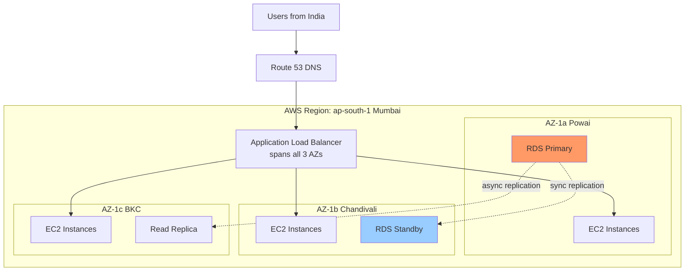
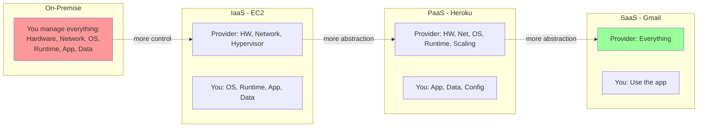
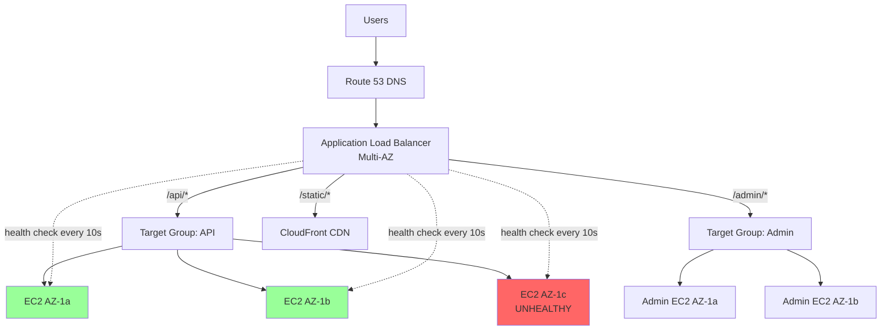
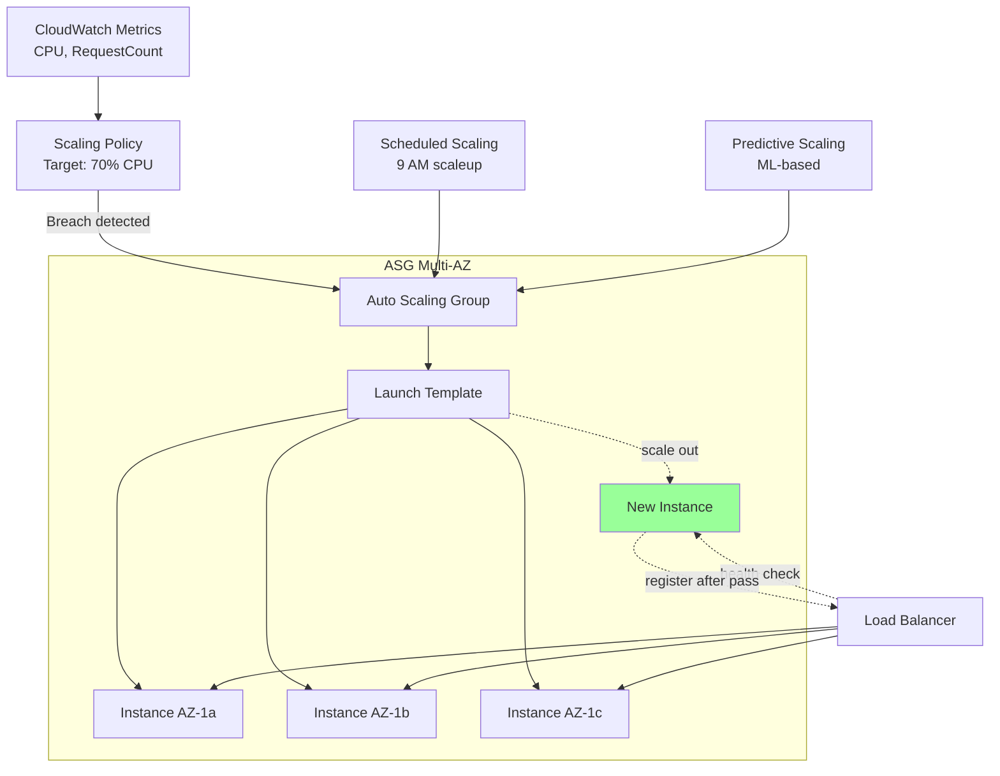
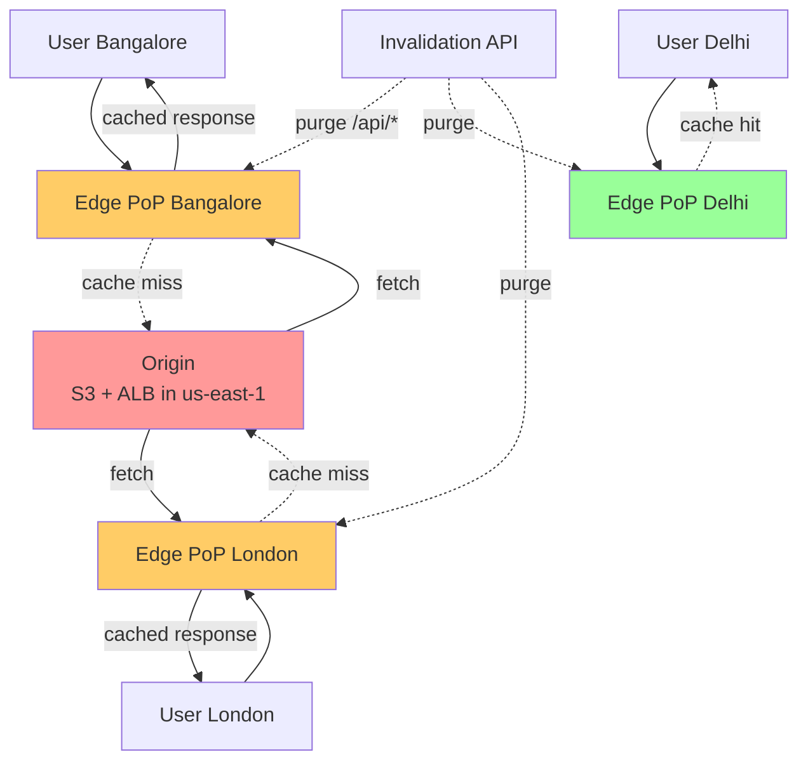
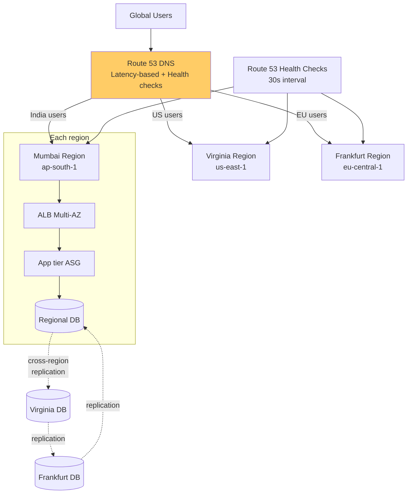

# Cloud Fundamentals

Cloud basically tumhe pay-as-you-go infrastructure deta hai. Pehle company ko hardware kharidna padta tha, racks lagaane padte the, data center ka AC bill bharna padta tha — ab AWS pe credit card daalo aur server ready ho jaata hai 60 seconds mein. Ye sirf "kisi aur ka computer" nahi hai jaisa meme bolta hai — ye ek poora ecosystem hai jisme compute, storage, network, identity, observability, ML, queues, databases sab as-a-service milte hain, with APIs that you can `curl` from your laptop. Tumhare CFO ke liye ye CapEx-to-OpEx shift hai, tumhare SRE ke liye ye programmable infrastructure hai, aur tumhare developer ke liye ye 5-line Terraform mein global deployment hai.

Is module mein hum cloud ka mental model build karenge — pehle on-prem vs cloud ka comparison, fir regions/AZ ka physics, fir IaaS/PaaS/SaaS ka spectrum, aur uske baad core building blocks: load balancers, auto-scaling, CDN, aur multi-region deployment. Har subtopic mein definition, "yeh kyun banaya gaya", "andar kya ho raha hai" (with config snippets), real-life example, mermaid diagram, aur interview-style Q&A milega. IIT-level depth maintain karenge — matlab hum sirf "S3 use karo" nahi bolenge, hum object storage ka durability math, eventual consistency model, aur multi-AZ replication ka network cost discuss karenge.

Tumhe ek baat clear rakhni hai: cloud is not magic. Har managed service ke neeche koi server, koi disk, koi network card hai — bas Amazon/Google/Microsoft ne usko abstract kar diya hai. Interview mein jab tumse poochha jaaye "design Netflix on AWS", to tum sirf service names list nahi karoge — tum bataoge ki traffic kaise flow karega edge se origin tak, AZ failure handle kaise hoga, cost kya aayega, aur agar `us-east-1` poora down ho gaya to kya plan hai. Chalo shuru karte hain.

---

## 1. Cloud computing basics

### 1.1 On-prem vs cloud, regions vs Availability Zones (AZs), shared responsibility model

#### Definition

**On-premise (on-prem)** ka matlab hai tumhari company khud apna data center chalati hai — physical servers, racks, generators, cooling, networking gear, security guards, sab kuch tumhari ownership mein. Capital expenditure (CapEx) heavy model — pehle hardware kharido, fir 3-5 saal use karo.

**Cloud** ka matlab hai ye sab infrastructure ek hyperscaler (AWS, GCP, Azure) chalata hai aur tum API ke through usko rent karte ho. Tum compute, storage, network ko on-demand mangwa sakte ho aur per-second/per-GB billing hoti hai. Ye Operating Expenditure (OpEx) model hai.

**Region** ek geographical area hota hai — jaise `ap-south-1` (Mumbai), `us-east-1` (N. Virginia), `eu-west-2` (London). Har region ek independent deployment hai with its own pricing, services availability, aur compliance boundary.

**Availability Zone (AZ)** ek region ke andar ek isolated data center cluster hai. Ek region mein typically 3-6 AZs hote hain. AZs same region mein hote hain (low latency, ~1-2ms inter-AZ) but physically separated — different power grids, different cooling, different fiber paths. Iska matlab agar ek AZ mein flood/fire/power-cut ho jaaye, baaki AZs chalti rahengi.

**Shared Responsibility Model** wo contract hai jo cloud provider aur tumhare beech responsibilities split karta hai. Provider ka kaam: physical security, hardware, hypervisor, networking fabric ("security **of** the cloud"). Tumhara kaam: OS patching (jab applicable), application code, IAM policies, encryption keys, data classification ("security **in** the cloud").

#### Why?

On-prem ka pain bahut tha. Tumhe peak load ke liye 3x capacity provision karna padta tha — Diwali sale ke liye servers kharido, baaki 11 mahine wo idle pade rehte the. Capacity planning meetings months tak chalte the. Ek server fail ho jaaye to procurement → delivery → racking → OS install → 2 hafte minimum. Disaster recovery ke liye ek aur data center kharido — double cost.

Cloud ne ye sab solve kiya:
- **Elasticity**: Diwali pe 100 servers, baaki time 5 — pay only for what you use
- **Speed**: API call se VM 60 seconds mein ready
- **Global reach**: Mumbai mein code likho, Tokyo mein deploy karo with `--region ap-northeast-1`
- **Managed services**: Database, queue, ML model — sab ready-made, tumhe sirf use karna hai

Regions/AZs ka concept isliye bana kyunki ek single data center failure entire business ko down kar deta hai. AWS ka 2017 ka famous `us-east-1` S3 outage yaad rakho — ek typo se internet ka half hissa down ho gaya tha. Multi-AZ aur multi-region designs is se bachaate hain.

Shared responsibility model isliye zaruri hai kyunki bahut log soch lete hain "AWS pe daal diya, ab secure hai". Galat. AWS ne S3 bucket diya — public/private banaane ki zimmedari tumhari hai. Capital One ka 2019 breach S3 misconfiguration se hua tha, AWS ki galti nahi thi.

#### How?

**On-prem architecture** mein tumhe ye sab manually handle karna padta hai:
```
[Customer Request]
      |
   [Firewall - hardware appliance]
      |
   [Load Balancer - F5 BIG-IP, costs $50k]
      |
   [Web Servers - rack of Dell PowerEdge]
      |
   [DB Server - Oracle RAC cluster]
      |
   [SAN Storage - NetApp filer]
```

Har box ke liye tumhe vendor contract, support contract, spare parts, network engineer, DBA chahiye.

**Cloud equivalent** AWS pe:
```hcl
# Terraform snippet — pura stack 50 lines mein
# Region selection — Mumbai for low latency to Indian users
provider "aws" {
  region = "ap-south-1"
}

# VPC across 3 AZs — multi-AZ from day 1
resource "aws_vpc" "main" {
  cidr_block = "10.0.0.0/16"
  tags = { Name = "prod-vpc" }
}

# Public subnets in 3 AZs — load balancer yahan baithega
resource "aws_subnet" "public" {
  count             = 3
  vpc_id            = aws_vpc.main.id
  cidr_block        = "10.0.${count.index}.0/24"
  availability_zone = data.aws_availability_zones.available.names[count.index]
  # ap-south-1a, ap-south-1b, ap-south-1c
}

# Application Load Balancer — managed, auto-scaling, multi-AZ
resource "aws_lb" "app" {
  name               = "prod-alb"
  load_balancer_type = "application"
  subnets            = aws_subnet.public[*].id
  # AWS handles HA across AZs automatically
}
```

**Region/AZ selection criteria** kya hote hain interview mein:
1. **Latency**: User base ke paas ka region (India users → ap-south-1 Mumbai, ap-south-2 Hyderabad)
2. **Compliance**: Data residency laws — EU users ka data EU mein (GDPR), India ke liye DPDP Act 2023
3. **Service availability**: Sab regions mein sab services nahi hain. New services pehle `us-east-1` mein launch hote hain
4. **Cost**: Same EC2 instance Mumbai mein zyada mehenga hai vs Virginia (~10-15%)
5. **Disaster radius**: AZs alag-alag hain but same region — earthquake/regional outage se bachne ke liye multi-region

**Inter-AZ network** typically <2ms latency, but **costs money** — AWS charges $0.01/GB for cross-AZ traffic. Iska matlab agar tum DB ko AZ-A mein rakho aur app ko AZ-B mein, tumhara har query cross-AZ jaayega aur bill phat jaayega. Architects same-AZ pinning aur read replicas use karte hain.

**Shared responsibility breakdown** AWS docs ke according:

| Layer | IaaS (EC2) | PaaS (RDS) | SaaS (S3) |
|-------|------------|------------|-----------|
| Physical | AWS | AWS | AWS |
| Hypervisor | AWS | AWS | AWS |
| OS | **You** | AWS | AWS |
| Runtime | **You** | AWS | AWS |
| App | **You** | **You** | AWS |
| Data | **You** | **You** | **You** |
| IAM/Access | **You** | **You** | **You** |
| Encryption keys | **You** (or AWS KMS) | Both | Both |

#### Real-life Example

Hotstar ka IPL 2023 ka case study dekho. Match start hone se 30 minutes pehle traffic 50x spike hota hai. On-prem hote to inhe peak ke liye 50x servers permanently rakhne padte — saal mein 11 mahine idle. Cloud pe inhone:
- AWS Auto Scaling Groups configure kiye — predictive scaling using ML
- 3 AZs across `ap-south-1` mein deploy kiya — ek AZ down ho to baaki 2 traffic absorb karein
- CloudFront CDN edge locations India mein 11 cities — origin traffic 95% reduce
- Multi-region failover Singapore (`ap-southeast-1`) ke liye Route 53 health checks pe

Result: 32 million concurrent viewers handle kiye without on-prem CapEx of ~$200M.

Counter-example: HSBC bank apna core banking on-prem rakhta hai. Reasons — 50-year old COBOL code, regulatory requirements (RBI/FCA), data residency, aur cost predictability. Cloud sab kuch ke liye answer nahi hai.

#### Diagram



#### Interview Q&A

**Q1: Tumne kaha AZs are isolated — agar same region mein hain to physically alag kaise hote hain? Network kaise connect hota hai?**

Bhai, AZs same region mein hote hain matlab same metropolitan area — Mumbai region ke 3 AZs Mumbai ke 3 alag-alag suburbs mein hain (typically 10-100 km apart). Inn data centers ke beech AWS apna private fiber network bichaata hai — redundant paths, dedicated bandwidth, sub-2ms latency. Power grids alag hote hain — agar Powai mein power gaya, BKC chalega. Cooling systems independent. Even network providers diverse rakhe jaate hain. Yeh "synchronous replication possible, but blast radius isolated" wala sweet spot deta hai. Compare karo region-to-region jo 50-200ms apart hote hain — wahan sync replication impractical hai, async hi chalta hai.

**Q2: Multi-AZ aur multi-region mein kya difference hai? Kab kya use karoge?**

Multi-AZ same region ke andar redundancy hai — handles AZ-level failures (data center fire, power outage, network partition). RTO seconds-to-minutes, RPO near-zero (sync replication possible). Multi-region different geographies mein deployment hai — handles region-level disasters (natural calamity, AWS regional outage like 2021 us-east-1 outage), aur compliance/latency requirements. Multi-region complex hai kyunki async replication, conflict resolution, DNS failover sab handle karna padta hai. Cost bhi 2-3x ho jaata hai. Default for production: multi-AZ. For tier-1 critical (banks, payment systems, streaming): multi-region. Decision driver — RTO/RPO SLA aur cost budget. Agar tumhara SLA 99.99% hai (52 min/year downtime), multi-AZ kaafi hai. 99.999% (5 min/year) chahiye to multi-region zaruri.

**Q3: Shared responsibility model mein "AWS secures the cloud, customer secures in the cloud" — IAM ka case dekho. Agar koi IAM key leak ho gayi aur attacker ne S3 data delete kar diya, kis ki responsibility?**

Customer ki, 100%. AWS ne IAM service di — secure, encrypted, MFA-capable, with audit logging via CloudTrail. Tumne us key ko GitHub pe commit kar diya (jaise hota hai bahut companies mein), ya rotate nahi kiya 2 saal se, ya least-privilege ke bajaye `*:*` policy laga di — yeh sab tumhari galti hai. AWS doesn't read your code, doesn't enforce your policies. Best practices — IAM Access Analyzer use karo, short-lived credentials via STS/SSO, key rotation automated, GitGuardian/TruffleHog se secret scanning, S3 bucket versioning + MFA delete enable. Agar AWS ka IAM service hi hack ho jaaye (super-rare, but theoretical) — wo "of the cloud" issue hai aur AWS pay karega.

**Q4: Ek startup CTO tumse poochta hai — "Mein cloud pe jaaun ya on-prem rahun?" 5-criteria framework de.**

Pehla — **scale predictability**. Agar traffic stable hai aur growth slow, on-prem cheaper ho sakta hai 3-year horizon pe (cloud 3-4x premium charge karta hai compute). Variable traffic? Cloud win. Doosra — **team capability**. Cloud chalane ke liye DevOps/SRE skills chahiye. Tumhari team Linux/networking expert hai? On-prem viable. Generalists hain? Cloud's managed services life saver. Teesra — **time to market**. Startup hai? Cloud pe 1 din mein launch. On-prem mein 3 mahine. Choutha — **regulatory/compliance**. Defence/government data India mein hai? On-prem ya GovCloud must. Paanchwa — **TCO over 5 years**. Excel sheet banao — hardware + power + cooling + bandwidth + people for on-prem vs cloud bill + people. Mostly cloud wins for <500 servers, on-prem starts winning at hyperscale (Dropbox famous case — moved off AWS to save $75M/year).

---

## 2. IaaS, PaaS, SaaS

### 2.1 Service models comparison — examples of each (EC2 vs Heroku vs Gmail), when to choose

#### Definition

Cloud services ek spectrum pe baithte hain — kitna tum manage karte ho vs kitna provider manage karta hai. Three main layers:

**IaaS (Infrastructure as a Service)**: Tumhe raw infrastructure milta hai — virtual machines, storage volumes, networks. Tum khud OS install karte ho (well, AMI choose karte ho), patches lagate ho, web server configure karte ho, app deploy karte ho. Examples: AWS EC2, GCP Compute Engine, Azure VMs, DigitalOcean Droplets.

**PaaS (Platform as a Service)**: Tumhe ek platform milta hai jahan tum sirf code push karte ho — `git push heroku main` aur deploy ho gaya. OS, runtime, scaling, load balancing — sab provider manage karta hai. Tum sirf application code aur config dete ho. Examples: Heroku, Google App Engine, AWS Elastic Beanstalk, Vercel, Railway, Render.

**SaaS (Software as a Service)**: End-user ready application — tumhe sirf use karna hai, login karke. Koi infrastructure nahi, koi code nahi. Examples: Gmail, Salesforce, Slack, Notion, Figma, Zoom.

Beech mein bhi categories hain — **CaaS** (Containers, jaise ECS/EKS/GKE), **FaaS/Serverless** (Lambda, Cloud Functions), **DBaaS** (RDS, DynamoDB, MongoDB Atlas). Spectrum is continuous, labels are convenience.

#### Why?

Ye layers isliye bani kyunki different teams ko different abstraction levels chahiye. Pizza analogy famous hai but useful — tum pizza khaane ke 4 tareeke socho:

1. **On-prem**: Khet mein gehu ugao, atta peeso, sauce banao, oven banao — tum sab kuch karte ho
2. **IaaS**: Atta + sauce + cheese kharido, ghar pe oven mein bake karo — provider ne raw ingredients diye, tumne assemble kiya
3. **PaaS**: Frozen pizza kharido, ghar pe heat karo — bahut kaam hua hua, bas final step tumhara
4. **SaaS**: Pizza order karo Domino's se — bas kha lo

Har layer pe tumne control choda but velocity badhi. IaaS tumhe maximum flexibility deta hai — kernel version choose karo, network tuning karo, custom drivers install karo. PaaS speed deta hai — 10 min mein production deploy. SaaS instant value — sign up, use.

Choice depends on **engineering opportunity cost**. Agar tum payment app banaa rahe ho, tumhara core competency payment logic hai — Postgres ko khud manage karne mein 2 engineers month spend karoge ya RDS le lo aur woh time fraud detection pe spend karo? Obviously PaaS/managed.

#### How?

**IaaS example — EC2 instance launch with custom Nginx**:

```bash
# 1. Pehle ek VM launch karo via AWS CLI
aws ec2 run-instances \
  --image-id ami-0c55b159cbfafe1f0 \
  --instance-type t3.medium \
  --key-name prod-key \
  --security-group-ids sg-0a1b2c3d \
  --subnet-id subnet-abc123 \
  --user-data file://bootstrap.sh
# Output: instance-id, public-ip
```

```bash
#!/bin/bash
# bootstrap.sh — yeh tumhe likhna padega for IaaS
# OS update — tumhari responsibility
yum update -y
# Web server install — tumhari responsibility
amazon-linux-extras install nginx1 -y
# App code clone — tumhari responsibility
cd /var/www && git clone https://github.com/myorg/app.git
# Service start, log rotation, monitoring agent — sab tumhe setup karna
systemctl enable nginx && systemctl start nginx
# CloudWatch agent install for metrics
yum install -y amazon-cloudwatch-agent
# Aur ye sirf shuruwat hai — patching, log rotation, security updates ongoing
```

Total responsibility: kernel selection, OS hardening, runtime versions, scaling group config, load balancer config, certificate rotation. Maximum control, maximum work.

**PaaS example — Heroku deploy**:

```bash
# Code likho, ek file add karo:
# Procfile
echo "web: node server.js" > Procfile

# package.json mein engine specify karo
# {"engines": {"node": "20.x"}}

# Deploy
heroku create my-app
git push heroku main

# Done. Heroku ne automatically:
# - Node.js install kiya
# - Dependencies installed
# - Container built
# - Load balancer configured
# - HTTPS cert provisioned via Let's Encrypt
# - Logs aggregated
# - Auto-restart on crash
# - Process metrics tracked
```

Tumne kya kiya? Sirf code aur Procfile diya. Heroku ne baaki sab kiya. Trade-off — tum kernel version choose nahi kar sakte, tumhe specific Linux distro nahi mil sakta, custom system packages limited hain.

**Heroku app.json** — config-as-code ka example:
```json
{
  "name": "shopify-clone",
  "stack": "heroku-22",
  "addons": [
    "heroku-postgresql:standard-0",
    "heroku-redis:premium-0",
    "rollbar"
  ],
  "env": {
    "NODE_ENV": "production",
    "RATE_LIMIT": "100"
  },
  "formation": {
    "web": { "quantity": 3, "size": "standard-2x" },
    "worker": { "quantity": 2, "size": "standard-1x" }
  }
}
```

**SaaS example — Gmail integration via API**:

```python
# Tumne kabhi mail server manage nahi kiya
# Bas API call:
from googleapiclient.discovery import build

service = build('gmail', 'v1', credentials=creds)
message = service.users().messages().send(
    userId='me',
    body={'raw': encoded_message}
).execute()
# Sent. SMTP servers, spam filters, DKIM, SPF, infra — sab Google ka headache
```

Tumhara responsibility: sirf API integration aur OAuth flow.

**Decision matrix — when to choose what**:

| Situation | Recommended | Reasoning |
|-----------|-------------|-----------|
| Custom kernel, GPU drivers, real-time OS | IaaS | Maximum control |
| MVP/prototype, small team | PaaS | Speed > flexibility |
| Existing app, lift-and-shift | IaaS | Minimal refactor |
| Email, CRM, analytics dashboards | SaaS | Buy don't build |
| Microservices at scale | CaaS (k8s) | Best of both |
| Event-driven, sporadic load | Serverless/FaaS | Pay per request |
| Compliance-heavy, custom HSM | IaaS or on-prem | Control over crypto |

#### Real-life Example

Razorpay ka journey dekho. 2014 mein Heroku pe shuru kiya — fast iteration zaruri tha, payment gateway ko market mein laana tha. 6 mahine mein product live, Heroku addons (Postgres, Redis) saare problems handle kar rahe the. Phir 2017 ke aas-paas scale aaya — TPS badha, custom networking chahiye thi (banks ke saath dedicated lines), latency requirements sub-100ms. Heroku se AWS EC2 + ECS pe migrate kiya — IaaS+CaaS hybrid. Database RDS pe (PaaS), compute ECS pe (CaaS), kuch legacy stuff EC2 pe (IaaS). Internal tools — Slack (SaaS), Notion (SaaS), DataDog (SaaS for monitoring).

Yeh real architecture hai — koi pure IaaS ya pure PaaS shop nahi hai. Engineering leaders har component ke liye optimum layer choose karte hain. Email? SaaS (SendGrid). Database? PaaS (RDS). Custom payment switch? IaaS (EC2 with kernel tuning). Office stuff? SaaS (Google Workspace).

Counter-example: Netflix famously 100% AWS pe hai, but unka stack mostly IaaS+CaaS hai — kyunki unka core competency video encoding/streaming hai jisme custom optimization chahiye. Heroku unhe scale nahi kar sakta.

#### Diagram



#### Interview Q&A

**Q1: Serverless/FaaS spectrum mein kahan fit hota hai? PaaS ka subset hai ya alag category?**

Serverless PaaS ka extreme version hai — even more abstracted. PaaS mein tum still ek "app" deploy karte ho jo continuously chalti hai (Heroku dyno 24/7 run hota hai). Serverless mein tum sirf functions deploy karte ho jo events ke response mein chalti hain — request aaya, function spin up hua, response diya, function shut down. Pay per invocation, not per hour. AWS Lambda ka pricing — first 1M requests/month free, baad mein $0.20 per million. Trade-off — cold starts (first request slow, ~500ms-2s), execution time limit (15 min on Lambda), state-less (DB ya cache external chahiye). Use cases — image thumbnailing on upload, scheduled cron jobs, API backends with sporadic traffic, event processing from queues. Don't use — long-running jobs, stateful apps, latency-critical (<100ms p99) realtime. So categorize: **IaaS → CaaS → PaaS → FaaS → SaaS**, increasing abstraction.

**Q2: Tumhari company 5000 EC2 instances chala rahi hai. CFO bolta hai "Heroku pe move karo, easier hoga". Tumhara response?**

CFO ko gently push back karna padega with data. Heroku at that scale economically aur technically infeasible hai. Heroku dyno pricing — Performance-L $500/month for 14GB RAM, equivalent EC2 m5.xlarge ~$140/month. 5000 dynos = $2.5M/month vs $700k EC2. Plus Heroku scale-out limits, no VPC peering with on-prem, limited region selection (US/EU only — India users? Latency disaster), no custom networking for compliance. PaaS shines for sub-50 instance shops where developer velocity > infra cost. At 5000 instances, you have dedicated platform team — they can build internal PaaS on top of Kubernetes (jaise Spotify ka Backstage, Airbnb ka platform team). Use right tool for right scale. Counter-recommendation — analyze 5000 instances ka utilization, probably 60% over-provisioned, savings plans + spot instances + right-sizing se 40% bill cut kar sakte ho without changing anything.

**Q3: PaaS ka "vendor lock-in" risk kaisa hai? Migration strategy kya hogi?**

Vendor lock-in PaaS mein real concern hai. Heroku-specific buildpacks, Heroku Postgres-only features, Heroku Connect for Salesforce — yeh sab portable nahi hain. Migration AWS pe karna ho to weeks-to-months ka kaam. Mitigation strategies — (1) **12-factor app** principles follow karo, jisse code platform-agnostic rahe — env vars, stateless processes, logs to stdout. (2) Standard tech use karo — vanilla Postgres, Redis, RabbitMQ, jo har cloud pe milte hain. (3) **Containerize** karo — Docker images portable hain, Heroku pe bhi chalti hain (Container Registry), AWS pe bhi (ECS/EKS). (4) **Database migrations**: pg_dump/restore for Postgres works across Heroku → RDS. (5) Avoid platform-specific addons jo proprietary hain. Cost of lock-in vs cost of abstraction — startup phase mein lock-in acceptable hai (speed matters more), maturity phase mein portability invest karo. Famous example — Coinbase ne Heroku se AWS migration 2 saal mein ki, $200M+ scale tak Heroku pe rahe.

**Q4: SaaS choose karne ke decision points kya hain? "Buy vs Build" framework de.**

Classic enterprise question. **Buy** karo jab — (1) Problem solved hai market mein (CRM, email, video conferencing), (2) Tumhara core competency nahi hai, (3) Time to value <3 months chahiye, (4) Total cost of ownership over 3 years SaaS se kam hai (factor in: salary of 2-3 engineers + maintenance + opportunity cost). **Build** karo jab — (1) Core differentiator hai (Razorpay ka payment routing engine khud banaa, Slack nahi use kiya), (2) SaaS solutions inadequate (regulatory, security, performance), (3) At hyperscale custom solution cheaper (Facebook's custom datacenters), (4) Strategic IP banaani hai. 80/20 rule — 80% commodity stuff buy karo, 20% differentiating stuff build karo. Common mistake — engineers love building; CTO ka job rok-thaam karna. Doosra angle — **integration cost**. SaaS ek silo nahi rahna chahiye — Salesforce + Slack + Jira sab integrate hone chahiye. Iceberg ka under-water hissa — vendor management, security reviews, SOC2 audits, data export plans for vendor death. Final tip — har SaaS contract mein "data export API" clause hona chahiye, warna 5 saal baad lock-in disaster.

---

## 3. Core concepts

### 3.1 Load balancing (cloud LBs)

#### Definition

Load balancer ek network device/service hai jo incoming traffic ko multiple backend servers mein distribute karta hai. Cloud mein yeh fully managed service hota hai — AWS ALB/NLB, GCP Cloud Load Balancing, Azure Load Balancer. Goals — high availability (ek server down → traffic doosre pe), scalability (servers add karo, LB automatically use karega), aur efficiency (least-loaded server ko request bhejo).

LB types based on OSI layer:
- **Layer 4 (Transport)**: TCP/UDP level — IP+port dekh ke route karta hai. Fast, but doesn't understand HTTP. Examples: AWS NLB, HAProxy in TCP mode
- **Layer 7 (Application)**: HTTP/HTTPS aware — URL path, headers, cookies dekh sakta hai. Slower but smarter. Examples: AWS ALB, Nginx, HAProxy in HTTP mode

LB algorithms:
- **Round-robin**: Sequence mein har server ko ek
- **Least connections**: Jisme abhi sabse kam active connections
- **Weighted**: Bigger servers ko zyada load
- **IP hash**: Same client IP → same server (session affinity)
- **Latency-based**: Sabse fast responding server ko prefer

#### Why?

Bina LB ke ek single server ho — wo down hua, app down. Wo overload hua, slow response. Tum 10 servers chala rahe ho — kaise decide hoga ki user kaunse server pe jaaye? DNS round-robin ek option hai but TTL caching ki wajah se uneven distribution hota hai aur failover slow hai. LB centralized intelligence deta hai.

LB problems jo solve karta hai:
1. **Single point of failure elimination**: Multiple servers, koi bhi handle kar sakta hai
2. **Horizontal scaling**: Servers add/remove karo, LB pool update karo, traffic redistribute
3. **Health checks**: Sick servers ko traffic mat bhejo
4. **TLS termination**: Encryption/decryption LB pe karo, backend HTTP pe baat kare (CPU offload)
5. **Routing logic**: `/api/*` → API servers, `/static/*` → CDN, `/admin/*` → admin servers
6. **DDoS protection**: Cloud LBs me built-in rate limiting, AWS Shield integration

#### How?

**Architecture flow**:
```
Client → DNS resolves to LB IP → LB receives request
  → LB consults health-check status
  → LB picks backend per algorithm
  → LB forwards request (rewriting headers if L7)
  → Backend responds → LB returns to client
```

**AWS ALB Terraform config** with all the bells and whistles:

```hcl
# Application Load Balancer — Layer 7, HTTP-aware
resource "aws_lb" "app" {
  name               = "prod-alb"
  internal           = false  # Internet-facing
  load_balancer_type = "application"
  security_groups    = [aws_security_group.alb.id]
  subnets            = aws_subnet.public[*].id  # Multi-AZ
  
  enable_deletion_protection = true
  enable_http2               = true
  idle_timeout               = 60  # seconds
  
  # Access logs to S3 for debugging — IMPORTANT in production
  access_logs {
    bucket  = aws_s3_bucket.lb_logs.bucket
    prefix  = "alb"
    enabled = true
  }
}

# Target group — yahan backend instances register hote hain
resource "aws_lb_target_group" "api" {
  name     = "api-targets"
  port     = 8080
  protocol = "HTTP"
  vpc_id   = aws_vpc.main.id
  
  # Health check — sick instances ko traffic se hata do
  health_check {
    enabled             = true
    healthy_threshold   = 2  # 2 successful checks = healthy
    unhealthy_threshold = 3  # 3 failed = mark unhealthy
    interval            = 10  # seconds between checks
    matcher             = "200-299"
    path                = "/health"  # tumhari app pe yeh endpoint hona chahiye
    timeout             = 5
  }
  
  # Sticky sessions — agar app stateful hai (avoid if possible)
  stickiness {
    type            = "lb_cookie"
    cookie_duration = 86400  # 1 day
    enabled         = false  # mostly disable, prefer stateless
  }
  
  # Connection draining — graceful shutdown
  deregistration_delay = 30  # 30 sec wait for in-flight requests
}

# Listener — HTTPS pe sun ke route karo
resource "aws_lb_listener" "https" {
  load_balancer_arn = aws_lb.app.arn
  port              = 443
  protocol          = "HTTPS"
  ssl_policy        = "ELBSecurityPolicy-TLS13-1-2-2021-06"
  certificate_arn   = aws_acm_certificate.main.arn
  
  # Default action — agar koi rule match nahi hua
  default_action {
    type             = "forward"
    target_group_arn = aws_lb_target_group.api.arn
  }
}

# Listener rule — path-based routing
resource "aws_lb_listener_rule" "admin" {
  listener_arn = aws_lb_listener.https.arn
  priority     = 100
  
  condition {
    path_pattern { values = ["/admin/*"] }
  }
  condition {
    source_ip { values = ["203.0.113.0/24"] }  # Office IP only
  }
  
  action {
    type             = "forward"
    target_group_arn = aws_lb_target_group.admin.arn
  }
}
```

**Health check deep dive**:
- **Active health check**: LB periodically `/health` endpoint hit karta hai (e.g., every 10s). Health endpoint ko shallow rakho — DB/external API mat check karo, warna cascading failures
- **Passive health check**: Real traffic se signals — connection errors, 5xx responses count karke mark unhealthy
- **Connection draining (deregistration delay)**: Jab instance scale-in hota hai ya update ke liye remove hota hai, LB use 30-60s ka window deta hai existing requests complete karne ka. New requests nahi bhejta but old ones ko drain hone deta hai.

**TLS termination at LB**:
```
Client (HTTPS) → LB (TLS terminate) → Backend (HTTP)
```
Pros — backend simpler, certs ek jagah manage, ALB integrate ACM with auto-renewal. Cons — LB-to-backend traffic plaintext within VPC. For end-to-end encryption use re-encryption mode.

**Algorithm choice**:
- Default: round-robin (works for stateless apps)
- Long-lived connections (WebSockets): least connections
- Heterogeneous instances (some big some small): weighted
- Caching layer ke saamne: consistent hash (jisse same key → same backend, cache hit ratio improve)

#### Real-life Example

Flipkart Big Billion Days. Day-of traffic 10x normal. Architecture:
- AWS ALB internet-facing, multi-AZ
- 200+ EC2 instances behind it across 3 AZs
- Path-based routing: `/checkout/*` → high-priority checkout cluster (overprovisioned), `/search/*` → search cluster, `/recommendations/*` → ML cluster
- Health checks every 5s — agar instance ka response time >2s, mark unhealthy
- TLS termination on ALB with ACM cert
- WAF integration for DDoS/bot protection
- Access logs to S3, then queried via Athena for post-mortem

Critical learning — initial sale ke time ek bug tha health check endpoint mein jo full DB query karta tha. Sale start hua, DB slow hui, health checks fail hone lage, instances mark unhealthy, traffic remaining instances pe gaya, woh aur slow hue, cascading failure. Fix — health check endpoint ko trivial banaya (`return "OK"` only), DB health check separate `/health/deep` endpoint pe.

#### Diagram



#### Interview Q&A

**Q1: ALB vs NLB vs CLB — kab kya use karoge?**

Tinno AWS ke load balancer offerings hain. **CLB (Classic Load Balancer)** legacy hai — 2009 mein launch hua, AWS recommend karta hai naye deployments mein avoid karne ko. Sirf maintain karo agar already chal raha hai. **ALB (Application Load Balancer)** Layer 7 hai — HTTP/HTTPS/WebSocket. Path-based, host-based routing kar sakta hai. JWT validation, authentication via Cognito support karta hai. Best for modern web apps, microservices, APIs. **NLB (Network Load Balancer)** Layer 4 hai — TCP/UDP/TLS. Ultra-high performance (millions of req/sec), ultra-low latency (~100 microseconds), preserves source IP, supports static IPs. Use for non-HTTP protocols (gaming, IoT, custom TCP), ultra-high TPS, agar tumhe client ka real IP chahiye on backend (X-Forwarded-For doesn't work for non-HTTP). Cost — NLB cheaper for high throughput, ALB cheaper for low. Decision tree — HTTP? ALB. Custom TCP/UDP? NLB. Both? Use both — internet-facing ALB + internal NLB for service mesh.

**Q2: Sticky sessions kab use karte ho aur kab nahi?**

Sticky sessions matlab same client ko har baar same backend pe bhejo (cookie-based ya IP-based). Use case — legacy stateful apps jo session memory mein store karte hain (PHP $_SESSION, old Java apps). Agar tum sticky sessions on karo to user logged-in rahega ek server pe; warna har request alag server pe jaayega aur session lost. Anti-pattern hai modern architecture mein — stateless servers banao, session ko external store mein rakho (Redis, Memcached, JWT tokens). Stateless ke fayde — kisi bhi server pe traffic ja sakta hai (true horizontal scaling), server crash ho gaya to user impact nahi (failover seamless), deploy easier (rolling deploy without session loss). Sticky sessions ke nuqsaan — uneven load distribution (kuch users heavy, unke servers overloaded), failover mein session loss, scale-in mein session loss. Real interview — "tum sticky session use kar rahe ho? red flag, why?" Sahi answer — "legacy app migration ke liye temporary, parallel mein Redis-based session store implement kar rahe hain".

**Q3: Health check design mein common mistakes kya hain?**

Pehla — **deep health checks**. Endpoint mein DB query, external API call, cache check sab daal dete hain. Fir DB slow → health check timeout → instances marked unhealthy → cascading failure. Fix — health check trivial rakho (`return 200 OK`). DB/dependencies ka separate `/health/deep` endpoint banao jo monitoring system (CloudWatch, Datadog) check kare, alert kare, but LB use nahi kare. Doosra — **threshold misconfiguration**. Healthy threshold 2 + interval 10s = 20s lagega instance ko healthy mark hone mein after deploy. Unhealthy threshold 5 + interval 30s = 2.5 min lagega problem detect karne mein. Production ke liye aggressive checks — interval 10s, unhealthy threshold 2-3. Teesra — **timeout too high**. Health check timeout 30s rakhi hai? Agar instance hang ho, 30s tak traffic ja raha hai. Rule of thumb — timeout < interval. Chouthha — **path conflict** with auth middleware. Health check endpoint authentication require kar raha hai, LB ke paas creds nahi, hamesha 401 — instance always unhealthy. Health endpoint ko explicitly auth-bypass list mein rakho.

**Q4: LB ke baad bhi tumhare backend overload ho raha hai. Diagnose kaise karoge?**

Step 1 — **Metrics dekho**. CloudWatch mein ALB ka `RequestCountPerTarget`, `TargetResponseTime`, `HTTPCode_Target_5XX_Count`, `UnHealthyHostCount`. Agar uneven distribution dikh raha hai across targets, LB algorithm ka issue hai (round-robin pe heterogeneous instances? Use least-connections). Step 2 — **Backend bottleneck**. Check CPU, memory, network on individual instances. Agar CPU 100% ek pe doosre pe 30%, kuch heavy requests specific instance pe ja raha hai (sticky sessions? Connection reuse?). Step 3 — **Connection limits**. ALB ka per-target connection limit, OS level `nofile` limit, application level (e.g., PHP-FPM workers, Node.js event loop). `netstat -an | grep ESTAB` se count nikalo. Step 4 — **Slow backends**. P99 latency badhi? Tracing tool (X-Ray, Jaeger) se request flow dekho — DB slow? External API? Lock contention? Step 5 — **Capacity insufficient**. Sometimes simple — load badh gaya, instances kam hain. Auto-scaling configure hai? Cooldown period sahi hai? Real story — ek company mein P99 latency 5s ja rahi thi peak pe, sab metrics normal lag rahe the. Final root cause — RDS connection pool exhausted, app waiting for DB connections. LB ki problem nahi thi, downstream choke point tha. Lesson — LB ek piece hai system mein, full stack diagnose karo.

---

### 3.2 Auto-scaling (horizontal vs vertical, scaling policies)

#### Definition

Auto-scaling matlab tumhari infrastructure automatically grow ya shrink karti hai demand ke according. Cloud ka killer feature hai. Two flavors:

**Vertical scaling (scale up/down)**: Ek single server ko bigger/smaller banao. t3.small → m5.xlarge → r5.4xlarge. More CPU, more RAM, but still one machine. Limits — biggest instance size pe pahuch jaaoge eventually.

**Horizontal scaling (scale out/in)**: Aur instances add/remove karo. 2 instances → 10 instances → 100 instances. Almost unlimited theoretically. Stateless apps ke liye perfect.

**Scaling policies**:
- **Target tracking**: "CPU 70% maintain karo" — CloudWatch metric ko target pe rakho
- **Step scaling**: "CPU >80% → 2 instances add, >90% → 5 add" — thresholds aur steps
- **Scheduled scaling**: "Roz 9am pe scale up, 6pm pe scale down" — predictable patterns
- **Predictive scaling**: ML-based — historical patterns dekh ke pre-emptive scale (AWS Auto Scaling)

#### Why?

Pehle (on-prem days) capacity planning Excel sheet pe hota tha — peak load anticipate karo, 2x buffer rakho, hardware order karo. Diwali ke liye 100 servers, baaki 11 mahine 80 idle. Massive waste.

Auto-scaling ne ye flip kiya:
1. **Cost efficiency**: Pay only for active capacity
2. **Reliability**: Sudden spike pe automatic scale-out, no manual intervention
3. **Self-healing**: Instance fail hua → ASG terminate karega, new launch karega
4. **Operational simplicity**: Capacity planning kam, monitoring zyada

Vertical vs horizontal kab — depends on workload. Database (especially RDBMS like Postgres) typically vertical scale karte hain — replication complex hai, single primary sane hai. Stateless web tier horizontal — 1 instance ya 1000, all equal. Cache (Redis cluster) horizontal with sharding. Modern apps mein horizontal preferred — fault tolerance better, no upper limit, rolling updates possible.

#### How?

**AWS Auto Scaling Group (ASG)** ka complete config:

```hcl
# Launch template — VM ka blueprint
resource "aws_launch_template" "app" {
  name_prefix   = "app-"
  image_id      = data.aws_ami.amazon_linux.id  # Latest AMI
  instance_type = "t3.medium"
  
  # User data — instance startup script
  user_data = base64encode(templatefile("bootstrap.sh", {
    app_version = var.app_version
  }))
  
  iam_instance_profile {
    name = aws_iam_instance_profile.app.name
  }
  
  network_interfaces {
    associate_public_ip_address = false
    security_groups             = [aws_security_group.app.id]
  }
  
  # Disk config
  block_device_mappings {
    device_name = "/dev/xvda"
    ebs {
      volume_size           = 30
      volume_type           = "gp3"
      encrypted             = true
      delete_on_termination = true
    }
  }
  
  # Spot instances for cost saving (where appropriate)
  instance_market_options {
    market_type = "spot"
    spot_options {
      max_price = "0.05"  # max bid
    }
  }
}

# Auto Scaling Group
resource "aws_autoscaling_group" "app" {
  name                      = "app-asg"
  vpc_zone_identifier       = aws_subnet.private[*].id  # Multi-AZ
  target_group_arns         = [aws_lb_target_group.app.arn]
  health_check_type         = "ELB"  # LB-based health check, not just EC2
  health_check_grace_period = 300  # 5 min for app to boot before checking
  
  min_size         = 3   # Always at least 3 (one per AZ)
  max_size         = 50  # Hard cap to prevent cost runaway
  desired_capacity = 3
  
  launch_template {
    id      = aws_launch_template.app.id
    version = "$Latest"
  }
  
  # Instance distribution across AZs
  # Default: balanced
  
  # Lifecycle hooks for graceful shutdown
  initial_lifecycle_hook {
    name                 = "drain-on-terminate"
    default_result       = "CONTINUE"
    heartbeat_timeout    = 60
    lifecycle_transition = "autoscaling:EC2_INSTANCE_TERMINATING"
  }
  
  # Tags propagated to instances
  tag {
    key                 = "Environment"
    value               = "production"
    propagate_at_launch = true
  }
  
  # Update policy — rolling deploy ke liye
  instance_refresh {
    strategy = "Rolling"
    preferences {
      min_healthy_percentage = 90
      instance_warmup        = 300
    }
  }
}

# Target tracking scaling policy — sabse common
resource "aws_autoscaling_policy" "cpu_target" {
  name                   = "cpu-target-tracking"
  autoscaling_group_name = aws_autoscaling_group.app.name
  policy_type            = "TargetTrackingScaling"
  
  target_tracking_configuration {
    predefined_metric_specification {
      predefined_metric_type = "ASGAverageCPUUtilization"
    }
    target_value = 70.0  # Target: average CPU 70%
    
    # Scale-in cooldown — 5 min wait before next scale-in
    # Prevents flapping
    scale_in_cooldown  = 300
    scale_out_cooldown = 60  # Faster scale-out than scale-in
  }
}

# Custom metric scaling — request count per instance
resource "aws_autoscaling_policy" "request_count" {
  name                   = "request-count-target"
  autoscaling_group_name = aws_autoscaling_group.app.name
  policy_type            = "TargetTrackingScaling"
  
  target_tracking_configuration {
    customized_metric_specification {
      metric_name = "RequestCountPerTarget"
      namespace   = "AWS/ApplicationELB"
      statistic   = "Average"
      
      metric_dimension {
        name  = "TargetGroup"
        value = aws_lb_target_group.app.arn_suffix
      }
    }
    target_value = 1000.0  # 1000 req/min per instance
  }
}

# Scheduled scaling — known patterns
resource "aws_autoscaling_schedule" "morning_scaleup" {
  scheduled_action_name  = "morning-scaleup"
  autoscaling_group_name = aws_autoscaling_group.app.name
  recurrence             = "0 8 * * MON-FRI"  # 8 AM weekdays
  min_size               = 10
  max_size               = 50
  desired_capacity       = 15
}
```

**Scaling decision flow**:
```
CloudWatch Metric (CPU%) 
  → Threshold breach detected (CPU > 70% for 2 min)
  → Auto Scaling action triggered
  → Launch new EC2 instance from launch template
  → User data script runs (~2-3 min)
  → Instance registers with ALB target group
  → Health check passes (~30-60s)
  → Traffic flows to new instance
  → Total time: 5-7 min from spike to absorbed
```

Yeh delay important hai — agar tumhara traffic spike 10x in 1 minute hai, auto-scaling alone insufficient. Solutions:
- Pre-warm during predictable spikes (scheduled scaling)
- Faster boot (lighter AMIs, pre-baked images vs user-data)
- Over-provision baseline (run 2x what you need normally)
- Use serverless for spike-prone workloads

**Cooldown periods** — flapping prevent karte hain. Scale-out fast, scale-in slow (10 min recommended). Why? Aggressive scale-in mean traffic dip → terminate → traffic resume → launch again. Asymmetric cooldown more economical.

**Predictive scaling** AWS ka 2018 ka feature — historical CloudWatch data dekh ke ML model train karta hai, future load predict karta hai, instances pre-provision karta hai. Especially useful for daily/weekly patterns. E-commerce, news sites benefit.

**Vertical scaling on cloud** — RDS instance type change is mostly online (~1-2 min downtime). EC2 instance type change requires stop/start (5 min downtime). Use vertical for databases, horizontal for stateless tier.

#### Real-life Example

Swiggy ka order load pattern — lunch (12-2pm) aur dinner (7-10pm) huge spikes, beech mein quiet. Architecture:
- ASG min 50, max 500 instances during operational hours
- Scheduled scaling: 11:30am pe scale to 200, 2:30pm pe scale to 80, 6:30pm pe scale to 300, 11pm pe scale to 50
- Target tracking on top — CPU >65% trigger
- Custom metric — orders-per-minute per instance, target 50
- During monsoon (rain → more orders): predictive scaling adjust karta hai
- Spot instances for 60% of fleet, on-demand for 40% (mix to balance cost/reliability)

Critical incident — IPL match + rain + dinner time = 8x normal spike in 10 minutes. Auto-scaling handled — predictive ne already 2x scaled tha, target tracking ne 4x more added in 6 minutes. Lesson — multiple scaling policies layered work better than one.

#### Diagram



#### Interview Q&A

**Q1: Tumne kaha "horizontal scaling almost unlimited" — kya bottlenecks hain?**

Theory mein unlimited but practice mein limits hain. Pehla — **stateful components**. Database ek primary hai usually — uske aage tum jitne web servers daalo, DB choke hogi. Solutions — read replicas (read scale), sharding (write scale), eventual consistency. Doosra — **shared resources**. Cache miss storm — 1000 web servers ek key request kar rahe hain, agar cache miss hua to all 1000 DB hit karenge (thundering herd). Solutions — request coalescing, probabilistic early refresh. Teesra — **network**. ALB ka per-listener limit, NAT gateway throughput, VPC peering bandwidth — sab cap hain. Chouthha — **license-bound software**. Some enterprise software per-CPU licensed — horizontal scaling cost prohibitive. Paanchwa — **deployment complexity**. 1000 instances mein rolling deploy lengthy hai. Use blue-green ya canary instead. Cheh — **cost**. Aap unlimited scale kar sakte ho but cost linear (ya worse) badhta hai. Optimize first, scale second. Real anecdote — ek startup ne 500 instances daal ke "scale" claim kiya, baad mein N+1 query issue fix hua, 50 instances mein same load handle hua. Compute is not always the answer.

**Q2: Spot instances vs on-demand vs reserved instances — auto-scaling mein kaise mix karoge?**

Smart cost optimization yahin hota hai. **On-demand** baseline — full price ($0.10/hr for t3.medium), no commitment, available always. **Reserved instances (RI) / Savings Plans** — 1-3 year commit, 30-70% discount. Predictable baseline ke liye. **Spot** — spare AWS capacity, 70-90% cheaper, but AWS 2 min ka notice de ke yank kar sakta hai (when capacity needed elsewhere). Strategy — baseline 30% on RI/SP (steady minimum traffic), 30% on-demand (predictable working capacity), 40% spot (variable, can absorb termination). Use **Mixed Instance Policy** in ASG — multiple instance types specify karo (m5.large, m5a.large, m5n.large), spot price across them stable rehta hai. Stateless tiers spot pe rakho, stateful (DB, cache) on-demand/RI pe. Spot interruption handler implement karo — 2-min warning aaye to graceful shutdown, drain connections, save state to S3, deregister from LB. Tools — AWS Spot Instance Advisor, Karpenter for k8s. Real savings 50-70% achievable. Netflix famously runs majority spot. Anti-pattern — DB on spot, ya stateful real-time gaming on spot.

**Q3: ASG ne instance launch kiya but instance ka health check fail ho raha hai — debug kaise karoge?**

Step 1 — **Console pe ASG events**. Activity tab dekho — "Launching instance i-abc... failed: <reason>". Common reasons: subnet IP exhausted, security group misconfig, AMI deprecated. Step 2 — **Instance launched but unhealthy**. SSH karo (via Session Manager), `journalctl -u cloud-init` dekho user-data execution. Bootstrap script fail hua? Step 3 — **App started but health check fail**. ALB target group mein "unhealthy" reason — "Health checks failed with these codes: 500" ya "Request timed out". Curl health endpoint manually from within instance. App listening on right port? Security group allowing LB to reach? Step 4 — **Health check grace period**. Default 0 — agar app boot karne mein 2 min lagti hai aur health check immediately start, instance unhealthy mark hoke terminate ho jaayega. Set `health_check_grace_period = 300`. Step 5 — **IAM role**. Instance role missing permission for app dependencies (S3 download, Secrets Manager fetch). Step 6 — **DNS/network**. VPC DNS resolution off? Private subnet without NAT? Real war story — health endpoint `/healthz` tha but ALB `/health` check kar raha tha (Kubernetes vs ALB convention mismatch). 401 forever. Fix — match the path.

**Q4: Auto-scaling 5-7 min lagta hai. Tumhara traffic 30-second mein 10x ho gaya. Strategy?**

Multi-pronged approach — pure auto-scaling sufficient nahi. Pehla — **over-provision baseline**. Headroom rakho — average load pe 50% utilization, not 80%. Cost zyada but spike absorb. Doosra — **faster boot times**. Custom AMI with everything pre-installed (Packer use karo) — boot 30 seconds vs 3 minutes. Containerize aur ECS/EKS use karo — container start kuch seconds. Best — Lambda/serverless for spike-prone workloads, sub-second cold starts. Teesra — **predictive scaling**. ML-based ya scheduled — known events (sale launch, IPL match) ke liye pre-scale. Chouthha — **request shedding**. Overload pe non-critical requests drop karo (recommendations, analytics) instead of full failure. Paanchwa — **caching aggressively**. CDN edge cache, application cache (Redis), DB query cache — origin pe load reduce. Cheh — **queue-based architecture**. Sync requests ko async banao — order placed → queue → background workers process. Spike DB nahi DDoS karega, queue absorb karega. Saatva — **regional pre-warm**. Multi-region deployment — spike aaye to traffic distribute. Real example — election results night, news sites ne pre-arranged "election mode" deploy kiya — cache TTL increase, non-essential features off, capacity 5x baseline. Auto-scaling alone fail karega 30-second 10x spike pe — architecture-level changes zaruri hain.

---

### 3.3 CDN (origin, edge, cache invalidation)

#### Definition

CDN (Content Delivery Network) ek globally distributed network of servers hai jo content cache karke users ke paas (geographically) deliver karta hai. Famous CDNs — Cloudflare, AWS CloudFront, Akamai, Fastly, Google Cloud CDN.

Key terms:
- **Origin**: Original source of content — tumhara S3 bucket, EC2 server, ALB. CDN yahin se "fetch" karta hai jab content cache mein nahi.
- **Edge / PoP (Point of Presence)**: Globally distributed cache servers. CloudFront ke 600+ PoPs hain (2024). User ka nearest edge server respond karta hai.
- **Cache hit/miss**: Edge pe content available = hit (fast). Not available = miss (origin se fetch karna padega).
- **TTL (Time To Live)**: Kitne der content cached rahe before re-validate. 24 hours typical for static, seconds-minutes for dynamic.
- **Cache invalidation**: Forcefully remove content from cache before TTL expiry. Hard problem ("only two hard things in CS").

#### Why?

Latency. India ka user `us-east-1` (Virginia) ke server se request karega — round-trip ~250ms. Same user CloudFront edge in Mumbai se — ~10ms. 25x improvement in latency.

CDN benefits:
1. **Reduced latency**: Geographic proximity = faster
2. **Origin offload**: 95%+ requests edge se serve = origin load reduce
3. **Bandwidth cost reduction**: Origin se outbound traffic kam = AWS data transfer bill kam
4. **DDoS mitigation**: Edge globally distributed, attack absorb hota hai
5. **Availability**: Origin down hai? Stale cache se serve (graceful degradation)
6. **TLS termination**: HTTPS handshake at edge = faster
7. **HTTP/3, QUIC**: Modern protocols at edge, even if origin pe HTTP/1.1

CDN sirf static content ke liye nahi — modern CDNs API responses, dynamic content, even compute (edge functions) cache karte hain.

#### How?

**Request flow**:
```
User in Bangalore requests https://example.com/logo.png
  → DNS resolves to CloudFront edge IP (anycast)
  → Routed to nearest PoP (Bangalore PoP)
  → Cache check: HIT?
    YES → Return immediately (5-15ms latency)
    NO  → Forward to origin (S3/ALB)
       → Origin returns content
       → Edge caches with TTL
       → Returns to user
       → Subsequent users from same region get HIT
```

**CloudFront distribution config**:

```hcl
resource "aws_cloudfront_distribution" "main" {
  enabled             = true
  is_ipv6_enabled     = true
  default_root_object = "index.html"
  price_class         = "PriceClass_200"  # India + US + EU + Asia (excludes SA, AU)
  
  # Multiple origins — agar diff content diff places se aata
  origin {
    domain_name = aws_s3_bucket.static.bucket_regional_domain_name
    origin_id   = "s3-static"
    
    s3_origin_config {
      origin_access_identity = aws_cloudfront_origin_access_identity.oai.cloudfront_access_identity_path
    }
  }
  
  origin {
    domain_name = aws_lb.app.dns_name
    origin_id   = "alb-dynamic"
    
    custom_origin_config {
      http_port              = 80
      https_port             = 443
      origin_protocol_policy = "https-only"
      origin_ssl_protocols   = ["TLSv1.2"]
    }
  }
  
  # Default behavior — most requests
  default_cache_behavior {
    allowed_methods  = ["GET", "HEAD", "OPTIONS"]
    cached_methods   = ["GET", "HEAD"]
    target_origin_id = "s3-static"
    
    viewer_protocol_policy = "redirect-to-https"
    compress               = true  # Gzip/Brotli
    
    forwarded_values {
      query_string = false  # Static — query string ignore
      cookies { forward = "none" }
    }
    
    min_ttl     = 0
    default_ttl = 86400      # 1 day
    max_ttl     = 31536000   # 1 year
  }
  
  # Path-based behavior — API calls
  ordered_cache_behavior {
    path_pattern     = "/api/*"
    allowed_methods  = ["GET", "HEAD", "OPTIONS", "PUT", "POST", "PATCH", "DELETE"]
    cached_methods   = ["GET", "HEAD"]
    target_origin_id = "alb-dynamic"
    
    viewer_protocol_policy = "https-only"
    compress               = true
    
    forwarded_values {
      query_string = true  # API needs query string
      headers      = ["Authorization", "Content-Type", "Origin"]
      cookies { forward = "all" }
    }
    
    # API responses ka TTL bahut chhota
    min_ttl     = 0
    default_ttl = 0   # No caching by default
    max_ttl     = 60  # Max 1 min if origin says cache
  }
  
  # Static images — long cache
  ordered_cache_behavior {
    path_pattern     = "/images/*"
    allowed_methods  = ["GET", "HEAD"]
    cached_methods   = ["GET", "HEAD"]
    target_origin_id = "s3-static"
    
    viewer_protocol_policy = "redirect-to-https"
    compress               = true
    
    forwarded_values {
      query_string = false
      cookies { forward = "none" }
    }
    
    min_ttl     = 86400      # 1 day minimum
    default_ttl = 2592000    # 30 days
    max_ttl     = 31536000   # 1 year
  }
  
  # WAF integration
  web_acl_id = aws_wafv2_web_acl.main.arn
  
  # Logging
  logging_config {
    bucket          = aws_s3_bucket.cf_logs.bucket_domain_name
    include_cookies = false
    prefix          = "cf-logs/"
  }
  
  viewer_certificate {
    acm_certificate_arn      = aws_acm_certificate.main.arn
    ssl_support_method       = "sni-only"
    minimum_protocol_version = "TLSv1.2_2021"
  }
  
  # Geographic restrictions
  restrictions {
    geo_restriction {
      restriction_type = "none"
      # Or: restriction_type = "blacklist", locations = ["CN", "RU"]
    }
  }
  
  # Custom error pages — origin down? Show friendly page
  custom_error_response {
    error_code         = 503
    response_code      = 200
    response_page_path = "/maintenance.html"
    error_caching_min_ttl = 30
  }
}
```

**Cache key design** — kya parameters cache mein different entries banaate hain:
- URL path (always)
- Query string (selective — `?utm_*` ignore karo, `?id=` honor karo)
- Headers (selective — `Accept-Language` for i18n, `Authorization` mostly skip)
- Cookies (mostly avoid forwarding)

**Cache headers** origin se control:
```
Cache-Control: public, max-age=86400, s-maxage=604800
# public: shared caches OK
# max-age: browser cache 1 day
# s-maxage: CDN cache 7 days

Cache-Control: no-store
# Sensitive data — no cache anywhere

Cache-Control: private, max-age=300
# Browser only, no CDN — user-specific data

Vary: Accept-Language, Accept-Encoding
# Different cache entries based on these headers
```

**Cache invalidation strategies** — yahan magic hota hai:

1. **TTL-based (passive)**: Set short TTL, cache auto-expires. Simple but stale content possible. Good for non-critical content.

2. **Versioned URLs (best)**: `/static/app.v123.js` — naya version = naya URL. Old cached versions irrelevant. CSS/JS bundlers (webpack, vite) hash-based filenames generate karte hain (`app.a1b2c3.js`).

3. **Explicit invalidation API**: 
```bash
aws cloudfront create-invalidation \
  --distribution-id E1ABCDEFG \
  --paths "/api/users/*" "/index.html"
# Cost: first 1000 paths free/month, then $0.005/path
```
Slow (5-15 min propagation), expensive at scale, race conditions possible.

4. **Cache tags / surrogate keys** (Fastly, Cloudflare): Tag responses with keys, invalidate by tag. `Surrogate-Key: user-123 product-456` — invalidate `user-123` invalidates all responses tagged with it. Best for complex apps.

5. **Stale-while-revalidate**: Serve stale, fetch new in background. `Cache-Control: max-age=600, stale-while-revalidate=86400`. UX win.

**Edge functions** modern CDNs ka killer feature — Cloudflare Workers, AWS Lambda@Edge. Code at edge, modify request/response, A/B testing, auth, geo-routing without origin hit.

#### Real-life Example

Hotstar ka video streaming. Architecture:
- Origin: S3 + EC2 transcoding pipeline
- CDN: Multi-CDN — Akamai (primary), CloudFront (secondary), Limelight (tertiary)
- Manifest files (`.m3u8`) — short TTL (5s) so live streams update
- Video segments (`.ts` files) — long TTL (1 day), chunked
- Geo-targeting at edge: Indian users → Indian PoPs (no transatlantic hop)
- Token-based auth at edge using Lambda@Edge — JWT verify, prevent unauthorized leeching
- Cache hit ratio target — 98%+ on segments
- Invalidation rare — versioned manifest URLs

Cost impact — without CDN, IPL final ka traffic origin se serve hota = ~5 Tbps egress = $millions/match. With CDN at 98% hit ratio, origin egress ~100 Gbps = manageable. CDN bill bhi big but predictable.

Counter-example — banking app. CDN dynamic content cache nahi karta (private user data), but static assets (JS, CSS, logos) edge se. WAF integration prioritize over cache benefits.

#### Diagram



#### Interview Q&A

**Q1: "Cache invalidation is one of the two hard problems in CS" — kyon hard hai aur mitigations kya hain?**

Hard isliye hai kyunki distributed systems mein consistency aur freshness ka trade-off hai. CDN ke 600 PoPs hain — har jagah simultaneously invalidation impossible hai. Race conditions — invalidation in flight, naya request aaya, kis version ko serve kare? Stale reads — invalidation propagation 5-15 min lagta hai, beech mein purane data serve hota rahega. Cost — har invalidation API call paisa lagta hai aur expensive at scale. Invalidation storms — bulk invalidate karo to CDN throttle karega. Mitigations — (1) **Avoid invalidation, use versioning**: filename mein hash daalo (`app.a1b2c3.js`), naya version = naya URL, automatic invalidation. (2) **Short TTLs for dynamic**: 30s TTL mean stale 30s max, no explicit invalidation. (3) **Surrogate keys**: tagged invalidation, granular. (4) **Soft purge (stale-while-revalidate)**: serve stale during invalidation propagation, fetch fresh background. (5) **Origin shield**: regional layer between edge and origin — bulk invalidation to origin shield faster. (6) **Cache layering**: origin cache + CDN cache, invalidate origin cache first, CDN slowly catches up. Real-world example — Twitter ke timeline updates use cache tags + 60s TTL — explicit invalidation rare. New tweets via push (WebSocket), not cache poll.

**Q2: Static vs dynamic content CDN cache strategy mein difference?**

Static content (images, CSS, JS, video) — long TTL (days/months), versioned URLs, aggressive cache. Hit ratio target 99%+. Invalidation via versioning, not API. Compress at edge (Brotli/Gzip). Dynamic content (API responses, user pages) — careful caching. Personalized content (`/profile/me`) generally not cached. Common API responses (`/api/products/popular`) cached short (1-5 min) with proper Vary headers. Cache key includes auth (or skip cache for authed). Use ETag/Last-Modified for conditional requests — origin says "still fresh" without re-sending body. Microcaching — even 10s cache for hot endpoints reduces origin load 10x. Stale-while-revalidate for UX. Modern pattern — **edge compute** for dynamic logic (Lambda@Edge, CW Workers) — auth, A/B testing, geo-routing happen at edge without origin hit. Best of both worlds. Real example — e-commerce homepage product list cached 30s at edge (assume 1000 req/sec, origin sees ~33 req/sec, 30x amplification). User-specific cart not cached (private). Tradeoffs always — aggressive cache = scalability, conservative cache = freshness.

**Q3: CDN ke saamne WAF kab use karte ho aur kahan place karte ho?**

WAF (Web Application Firewall) — Layer 7 firewall — SQL injection, XSS, bot, OWASP top 10 attacks block karta hai. Placement options — (1) **At CDN edge** (CloudFront WAF, Cloudflare WAF) — global, attack edge pe block hota hai before origin. Best DDoS mitigation. (2) **Between CDN and origin** (regional WAF, ALB-attached) — secondary defense. (3) **Application level** (libraries) — last line. Stack approach — defense in depth. Edge WAF benefits — geographically distributed (DDoS absorbed across PoPs), low latency, high throughput. Concerns — false positives (legit users blocked), tuning expensive, cost (per-request charges). Strategy — start with managed rules (AWS Managed Rules, Cloudflare ruleset), monitor mode initially (log don't block), gradually enable enforcement. Custom rules for specific attacks (rate limit `/login` to 5/min/IP). Bot management — separate concern — distinguish good bots (Googlebot) from bad (scrapers). Product company example — Razorpay ka login flow WAF + reCAPTCHA + rate limit + IP reputation, multiple layers. Don't forget — WAF cost compounds at scale — million requests/month = significant bill, optimize rule sets.

**Q4: Multi-CDN strategy — kab aur kaise implement karoge?**

Multi-CDN matlab same content multiple CDN providers se serve — Akamai + CloudFront + Cloudflare. Reasons — (1) **Reliability**: CDN provider outage hota hai (AWS CloudFront 2017, Fastly 2021, Cloudflare 2022 — all had major outages). Single CDN = single point of failure. (2) **Geographic optimization**: CDN A India mein best, B Europe mein best, C China mein only option (ChinaCache, Aliyun). (3) **Cost negotiation**: vendors compete, 20-30% savings possible. (4) **Performance**: real-time RUM (Real User Monitoring) data dekh ke best CDN pick karo. Implementation — DNS-level routing (NS1, Cedexis, AWS Route 53 traffic policies) — health checks across CDNs, latency-based routing. Origin shield zaruri — multiple CDNs origin pe N-fold load karenge bina shield. Complexity — invalidation har CDN pe alag, monitoring multiplied, debugging hard. Most companies start single CDN, multi-CDN at scale (>$100k/month CDN spend justifies engineering). Anti-pattern — multi-CDN without monitoring becomes invisible failures. Real example — Netflix uses Open Connect (own CDN) + AWS CloudFront for non-video, multi-CDN architecture. Hotstar IPL streaming uses 3+ CDNs with weighted DNS routing.

---

### 3.4 Multi-region deployment (active-active vs active-passive, DNS-based failover)

#### Definition

Multi-region deployment matlab tumhari application multiple AWS/GCP/Azure regions mein simultaneously deploy hai — `ap-south-1` (Mumbai) + `ap-southeast-1` (Singapore) + `us-east-1` (Virginia). Goals — disaster recovery (entire region down), latency reduction (geographically distributed users), aur compliance (data residency).

Two patterns:

**Active-active**: Sab regions simultaneously traffic serve karte hain. User Mumbai se aaya → Mumbai region. User London se aaya → Frankfurt region. Both writing to local DB (with cross-region replication). Maximum availability, complex consistency.

**Active-passive (warm/cold standby)**: Primary region (Mumbai) serves all traffic. Secondary region (Singapore) idle ya minimum capacity. Disaster mein failover karna padta hai — DNS update, replicate data promotion, etc. Simpler, but RTO higher.

**DNS-based failover**: Route 53 (AWS), Cloud DNS (GCP), Azure Traffic Manager — health checks based DNS resolution. Primary unhealthy → DNS responds with secondary IP. TTL determines speed of failover.

Routing policies:
- **Failover**: Primary → secondary on failure
- **Latency-based**: Nearest region by latency
- **Geo-location**: Country/region based
- **Weighted**: Percentage split (canary deployments)
- **Multi-value answer**: Multiple IPs, client picks

#### Why?

Single region kabhi bhi go down kar sakta hai — physical disaster (earthquake, flood), software bug (entire AZ control plane failure), human error (config push wrong). 2017 ka famous AWS S3 outage — 4 hours `us-east-1` mein S3 down, half internet broken. 2021 ka Azure outage — global identity service down. Single region = single SPOF.

Multi-region benefits:
1. **Disaster recovery**: Region-level failure se bhi survive
2. **Lower latency**: Global users → nearest region
3. **Compliance**: Data residency (GDPR EU mein, China mein China)
4. **Capacity**: Single region pe instance limits, multi-region distributed
5. **Blast radius reduction**: Bug deploy ek region mein, propagate slow

But costs — 2-3x infra spend, replication complexity, data consistency hard, network costs (cross-region transfer ~$0.02/GB), team expertise.

Decision driver — **RTO (Recovery Time Objective)** aur **RPO (Recovery Point Objective)**. RTO = downtime tolerance (5 min? 1 hour? 1 day?). RPO = data loss tolerance (0? 1 hour? 1 day?). Banking RTO ~5 min, RPO ~0 → active-active. Internal tool RTO 4 hours OK → active-passive cold standby.

#### How?

**Active-active architecture**:

```
                    Route 53 (DNS)
                         |
              [Latency-based routing]
              /                      \
       ap-south-1                us-east-1
       (Mumbai)                 (Virginia)
       /     \                   /      \
     ALB    ALB                 ALB     ALB
     |       |                   |       |
   App     App                 App      App
   |       |                   |       |
  RDS-Pri  RDS-Replica       RDS-Pri  RDS-Replica
       \                          /
        Cross-region replication
        (DynamoDB Global Tables ya
         Aurora Global Database)
```

Both regions write-capable. Conflict resolution via vector clocks, last-write-wins, ya CRDTs.

**Route 53 failover config**:

```hcl
# Primary record — Mumbai
resource "aws_route53_record" "primary" {
  zone_id = aws_route53_zone.main.zone_id
  name    = "api.example.com"
  type    = "A"
  
  alias {
    name                   = aws_lb.mumbai.dns_name
    zone_id                = aws_lb.mumbai.zone_id
    evaluate_target_health = true
  }
  
  set_identifier = "primary-mumbai"
  failover_routing_policy {
    type = "PRIMARY"
  }
  
  health_check_id = aws_route53_health_check.mumbai.id
}

# Secondary record — Singapore
resource "aws_route53_record" "secondary" {
  zone_id = aws_route53_zone.main.zone_id
  name    = "api.example.com"
  type    = "A"
  
  alias {
    name                   = aws_lb.singapore.dns_name
    zone_id                = aws_lb.singapore.zone_id
    evaluate_target_health = true
  }
  
  set_identifier = "secondary-singapore"
  failover_routing_policy {
    type = "SECONDARY"
  }
  
  health_check_id = aws_route53_health_check.singapore.id
}

# Health check — multi-region check, prevents single-checker bias
resource "aws_route53_health_check" "mumbai" {
  fqdn              = aws_lb.mumbai.dns_name
  port              = 443
  type              = "HTTPS"
  resource_path     = "/health"
  failure_threshold = 3        # 3 consecutive fails
  request_interval  = 30       # seconds
  
  # Check from multiple AWS regions for accuracy
  measure_latency = true
  
  cloudwatch_alarm_region = "us-east-1"
  insufficient_data_health_status = "Healthy"
  
  tags = { Name = "mumbai-health" }
}

# Latency-based routing — alternative to failover
resource "aws_route53_record" "latency_mumbai" {
  zone_id = aws_route53_zone.main.zone_id
  name    = "app.example.com"
  type    = "A"
  
  alias {
    name                   = aws_lb.mumbai.dns_name
    zone_id                = aws_lb.mumbai.zone_id
    evaluate_target_health = true
  }
  
  set_identifier = "mumbai"
  latency_routing_policy {
    region = "ap-south-1"
  }
}

# Same record name with different identifier — Route 53 picks lowest latency
resource "aws_route53_record" "latency_singapore" {
  zone_id = aws_route53_zone.main.zone_id
  name    = "app.example.com"
  type    = "A"
  
  alias {
    name                   = aws_lb.singapore.dns_name
    zone_id                = aws_lb.singapore.zone_id
    evaluate_target_health = true
  }
  
  set_identifier = "singapore"
  latency_routing_policy {
    region = "ap-southeast-1"
  }
}
```

**Data replication strategies**:

1. **DynamoDB Global Tables**: Multi-region active-active, automatic last-write-wins conflict resolution. Sub-second replication. Best for active-active.

2. **Aurora Global Database**: Single primary region for writes, up to 5 secondary regions for reads. <1 sec replication lag. Failover in ~1 min. Active-passive primarily.

3. **RDS read replicas cross-region**: Async replication, manual promotion on failure. RTO ~10-30 min.

4. **S3 Cross-Region Replication (CRR)**: Object-level async replication. Eventually consistent.

5. **Application-level replication**: Kafka MirrorMaker, custom ETL. Most flexible, most work.

**Failover process** (active-passive):
```
1. Health check fails in primary (3 consecutive failures, 90 sec)
2. Route 53 marks primary unhealthy
3. DNS responses now return secondary IP
4. Client TTL expires (typical 60s) — clients re-resolve
5. New requests → secondary region
6. Promote secondary RDS to primary (manual or automated, ~5 min)
7. Application starts accepting writes in secondary
   
Total RTO: 60s (DNS) + 5min (DB promotion) = ~6 minutes
RPO: replication lag at moment of failure (~1-30 sec)
```

**Active-active is hard** because:
- Write conflicts — same user updates profile in Mumbai aur Singapore simultaneously
- Sequence/auto-increment IDs collide — use UUIDs ya per-region prefixed IDs
- Cache coherence — invalidation must propagate cross-region
- Cost — full duplicate stack, plus cross-region replication bandwidth
- Testing — failure scenarios complex (split-brain, network partition)

**Network architecture**:
```hcl
# VPC peering ya Transit Gateway for cross-region private connectivity
resource "aws_vpc_peering_connection" "mumbai_singapore" {
  peer_vpc_id = aws_vpc.singapore.id
  vpc_id      = aws_vpc.mumbai.id
  peer_region = "ap-southeast-1"
  auto_accept = false
}

# In Singapore region — accept the peering
resource "aws_vpc_peering_connection_accepter" "accept" {
  provider                  = aws.singapore
  vpc_peering_connection_id = aws_vpc_peering_connection.mumbai_singapore.id
  auto_accept               = true
}
```

#### Real-life Example

Netflix's multi-region architecture (simplified):
- Primary regions: us-east-1, us-west-2, eu-west-1
- DynamoDB Global Tables for user state — active-active across regions
- Cassandra clusters — multi-region replication
- Eureka service discovery — region-local, with cross-region awareness
- Chaos Engineering — Chaos Monkey, Chaos Kong (regional failure simulation)
- DNS via Route 53 + UltraDNS (multi-DNS provider)
- Failover tested monthly via Chaos Kong — full region drained
- RTO: <10 minutes for region failure
- During COVID, eu-west-1 had instability — auto-failover to eu-west-2 worked, no user impact

Indian context — UPI infrastructure has multi-region (NPCI architecture). Each transaction logged to multiple data centers synchronously — high consistency, sub-second response. Banking-grade RTO/RPO. Different from typical web app patterns.

#### Diagram



#### Interview Q&A

**Q1: Active-active aur active-passive — kab kya use karoge? Tradeoff explain karo.**

Active-active higher availability deta hai (RTO seconds) but complexity 5x — write conflicts handle karne padte hain, cost double, testing hard. Active-passive simpler but RTO minutes-to-hours, RPO non-zero typically. Decision drivers — (1) **RTO/RPO requirements**: SLA 99.999% (5 min/year)? Active-active. SLA 99.95% (4 hr/year)? Active-passive. (2) **Workload type**: Read-heavy with eventual consistency OK → active-active easy (multi-region read replicas). Write-heavy with strict consistency → active-passive (single primary). Financial transactions → primary-only, replicas for read. (3) **Data model**: append-only logs (events, analytics) → active-active trivial. Mutable shared state (inventory, accounts) → active-active hard. (4) **Cost**: active-active 2-3x active-passive. Justify with revenue impact of downtime. (5) **Team capability**: distributed systems expertise needed for active-active. Default for most apps — active-passive with read replicas in DR region. Promote to active-active only for tier-1 with proven need. Famous case — GitHub uses active-passive (primary in US, DR in different region), accepts 30-min RTO. Stripe — active-active for read paths, single-primary for charges. Pragmatic, not theoretical.

**Q2: DNS-based failover ke limitations kya hain? Alternatives?**

DNS failover slow hai — typical TTL 60-300s, plus DNS resolver caching (some ISPs/clients ignore TTL, cache 1+ hours). Failover RTO realistically 5-15 min for 95% users, long tail 1+ hour. Health check sensitivity tradeoff — aggressive check (10s interval, 2 failure threshold) = false positives common, flapping. Conservative (60s interval, 5 threshold) = slow detection. **Alternatives** — (1) **Anycast IP**: Same IP advertised from multiple regions, BGP routes to nearest. Cloudflare, AWS Global Accelerator. Failover seconds, not minutes. No DNS TTL issue. (2) **Client-side failover**: SDK has multiple endpoints, auto-retry on failure (Cassandra driver pattern). Sub-second failover but client complexity. (3) **L4/L7 global LBs**: AWS Global Accelerator, GCP Global LB — TCP-level routing, sub-second failover, static IPs. Premium pricing. (4) **Service mesh** (Istio, Linkerd) for internal traffic — cross-region failover at app layer. Best practice — DNS-based for internet-facing public traffic (cheap, simple), Global Accelerator for premium (paying customers, sub-second failover), service mesh for internal microservices. Don't rely on DNS alone for tight RTO.

**Q3: Cross-region data replication ke patterns aur tradeoffs?**

Multiple patterns each with tradeoffs — (1) **Synchronous**: Write Mumbai, wait for Singapore ack. Strong consistency, but latency = inter-region RTT (~150ms Mumbai-Singapore). Practical only for critical low-throughput data. (2) **Asynchronous**: Write Mumbai, return success, replicate async to Singapore. Fast writes, eventual consistency. RPO = replication lag (typically 1-30s, can spike). Most common pattern. (3) **Multi-master with conflict resolution**: Both regions write, conflicts resolved via timestamps/CRDTs/vector clocks. DynamoDB Global Tables, Cassandra. Complex but high availability. (4) **Quorum-based**: Write succeeds when N of M regions ack. Tunable consistency. Cassandra `LOCAL_QUORUM` vs `EACH_QUORUM`. (5) **Event sourcing + CDC**: Write to local Kafka, replicate Kafka cross-region, consumers in each region apply events. Strong audit, eventual consistency, complex. Selection criteria — financial/inventory: synchronous or quorum (consistency over availability). Social media/CMS: async (availability over consistency, conflicts rare). IoT/analytics: async with CRDTs. Nuance — even "synchronous" not truly synchronous over WAN — physics limits (speed of light Mumbai-Singapore ~25ms one-way, so RTT 50ms minimum, plus processing). For sub-10ms writes, multi-region sync impossible — split workload (writes single-region, reads multi-region).

**Q4: Tumhari company `us-east-1` mein hai. Multi-region migration plan banaao — phases, risks, success criteria.**

Phase 0 — **Discovery (2-4 weeks)**: Map dependencies — which services region-bound (RDS instance), which globally available (S3, IAM)? Identify data flows, dependencies, latency-sensitive paths. Cost estimate (2x infra + replication + engineering time). Decide active-active vs active-passive based on RTO needs. Phase 1 — **Foundation (4-8 weeks)**: Infrastructure-as-Code review — Terraform must be region-parameterized. CI/CD pipeline supports multi-region deploys. Observability stack (CloudWatch, Datadog) cross-region aggregated. IAM roles cross-region capable. Phase 2 — **Data layer (8-12 weeks)**: This is hardest. Choose replication strategy. For RDS, set up cross-region read replicas. For DynamoDB, enable Global Tables. For S3, CRR. Test replication lag, conflict scenarios. Migrate session state to region-replicated store (Redis cluster or DynamoDB). Phase 3 — **Application layer (4-8 weeks)**: Deploy app stack to second region (initially passive). Configure cross-region service discovery. Health checks. Smoke tests in second region. Phase 4 — **DNS/traffic (2-4 weeks)**: Configure Route 53 with health checks. Start with weighted routing (95-5 split) to test second region under real traffic. Gradually shift if active-active. Phase 5 — **Failover testing (2-4 weeks)**: Game days — chaos engineering, simulate primary failure, measure actual RTO/RPO vs target. Iterate. Phase 6 — **Optimization (ongoing)**: Cost tuning, latency optimization, runbook development. Risks — (1) data inconsistency during transition, (2) cost overruns, (3) team burnout, (4) hidden region dependencies (some service only in us-east-1). Success criteria — RTO/RPO SLA met in chaos tests, cost within 2.5x, no production incidents during migration, runbook tested by on-call. Budget 6-9 months end-to-end for non-trivial app.

---

## Resources & further reading

**Official documentation:**
- AWS Well-Architected Framework — https://aws.amazon.com/architecture/well-architected/ — har aspect ka pillar (reliability, security, cost, performance, operational excellence). Interview gold.
- AWS Architecture Center — https://aws.amazon.com/architecture/ — reference architectures across industries.
- Google Cloud Architecture Framework — similar to AWS WAF, GCP perspective.
- Microsoft Azure Architecture Center — well-curated patterns.

**Books:**
- *Designing Data-Intensive Applications* by Martin Kleppmann — distributed systems bible. Replication, consistency, partitioning chapters directly applicable.
- *Site Reliability Engineering* by Google — free online — production operations from Google's perspective.
- *The Phoenix Project* + *The Unicorn Project* by Gene Kim — DevOps culture, applicable to cloud operations.
- *Cloud Native Patterns* by Cornelia Davis — patterns for cloud-native apps.
- *AWS Certified Solutions Architect Study Guide* — even if you don't take cert, content valuable for interviews.

**Talks/Videos:**
- AWS re:Invent — annual conference, sessions on YouTube. Search "deep dive" sessions for architecture detail.
- Netflix Tech Blog — https://netflixtechblog.com/ — multi-region, microservices, chaos engineering case studies.
- Uber Engineering Blog — geographic distribution, real-time architecture.
- High Scalability — http://highscalability.com/ — case studies of scaled architectures.

**Tools:**
- Terraform — IaC standard. AWS provider docs essential.
- AWS CDK — Python/TypeScript IaC, more programmable than Terraform.
- Pulumi — alternative to Terraform with full programming language.
- k6/Locust — load testing for scaling validation.
- Chaos Toolkit, Gremlin — chaos engineering platforms.

**Courses:**
- A Cloud Guru / Linux Academy — practical AWS courses.
- Coursera "Cloud Computing Specialization" by University of Illinois — academic depth.
- AWS Skill Builder (free) — hands-on labs.

**Practice:**
- AWS Free Tier — 12 months free for many services. Build real stuff.
- localstack — local AWS emulator for development.
- System Design Interview prep — Grokking the System Design Interview, Alex Xu's books.

**Indian context:**
- NPCI architecture papers — UPI scale insights.
- Hotstar Tech blog (now Disney+ Hotstar) — IPL streaming scale.
- Razorpay engineering blog — fintech architecture.
- Flipkart/Myntra engineering — e-commerce scale patterns.

Yaad rakho — cloud is a means, not an end. Tools change har 2 saal mein, fundamentals same rehte hain. Latency, throughput, consistency, availability, durability — yeh five fundamental tradeoffs har architecture decision drive karte hain. Master karo principles, services come and go.
