# Cloud Platforms — Part 1: Amazon Web Services (AWS)

AWS basically world's biggest cloud platform hai. Indian companies mostly AWS pe hi production chalti hain. Flipkart, Swiggy, Zomato, Razorpay, Cred, PhonePe — sab ki kuch na kuch workload AWS pe chalti hai. Reason simple hai: AWS 2006 me launch hua tha, matlab 20 saal ka head start hai inke paas. Itne saal me itni services bana di hain ki ek lifetime me sab seekhna mushkil hai. Last count me 240+ services thi, aur har re:Invent (inka annual conference) me 50-100 nayi cheezein add hoti hain.

Tu intern hai to ek baat samjha deta hu — AWS seekhne ka matlab "saari services" rattana nahi hai. 90% companies sirf 15-20 core services use karti hain: IAM, EC2, S3, VPC, RDS, Lambda, CloudWatch, Route53, ELB, ECS/EKS, CloudFront, SQS, SNS, DynamoDB, Secrets Manager. Bas. Is guide me hum 6 fundamental services dekhenge jo har AWS engineer ko aata hi hona chahiye. Yeh foundation pakka kar le, baaki services tujhe documentation se ek hafte me samajh aa jayengi. Ek aur important baat — AWS ka pricing model "pay as you go" hai, matlab tu jitna use karega utna paisa katega. Lekin yahan hi log fasste hain: ek galat config aur ₹50,000 ka bill aa jata hai. Isliye IAM aur billing alerts pehle din se setup karna mandatory hai.

## 1. Amazon Web Services (AWS)

### 1.1 IAM — users, roles, policies, assume-role, MFA

#### Definition

IAM matlab Identity and Access Management. Yeh AWS ka security backbone hai — kaun kya kar sakta hai, kis resource pe, kab kar sakta hai, yeh sab IAM define karta hai. Char concepts samajh le: **User** (ek insaan ya application jiska AWS me account hai), **Group** (users ka collection, jaise "Developers" group), **Role** (ek temporary identity jo AWS services ya cross-account access ke liye assume ki jaati hai), aur **Policy** (JSON document jo permissions describe karta hai — kya allowed hai aur kya denied).

Analogy soch — IAM ek office building ka security system hai. **User** matlab employee ka ID card. **Group** matlab department (HR, Engineering). **Policy** matlab building me kaunse rooms tu enter kar sakta hai (server room only for IT). **Role** matlab jab tu kisi aur department me temporarily kaam karne jaata hai, to wahan ka temporary badge milta hai jo kuch ghanto baad expire ho jaata hai. **MFA** matlab badge ke saath ek OTP bhi chahiye — kisi ne badge chura bhi liya to OTP ke bina entry nahi.

#### Why?

Production me IAM kyu critical hai? Kyunki AWS account hack hone ka matlab — koi tumhare paise se Bitcoin mining shuru kar dega aur subah uthkar dekhega ₹15 lakh ka bill. Real story hai yeh, GitHub pe accidentally AWS keys push karne wale logo ke saath rozana hota hai. IAM properly setup karne se — least privilege principle (sirf utna access do jitna kaam ke liye chahiye), MFA mandatory, root account ko lock karke rakhna, aur services ko user keys ke bajaye roles dena — yeh sab milake account ko safe banate hain.

#### How?

```bash
# AWS CLI configure karna — pehle access keys chahiye
aws configure
# AWS Access Key ID: AKIAxxxxx
# AWS Secret Access Key: xxxxx
# Default region: ap-south-1 (Mumbai)
# Default output format: json

# Naya IAM user banao
aws iam create-user --user-name rohit-dev

# User ko group me daalo (group pehle se bana hai)
aws iam add-user-to-group --user-name rohit-dev --group-name Developers

# Policy attach karo — managed policy use kar (AWS-provided)
aws iam attach-user-policy \
  --user-name rohit-dev \
  --policy-arn arn:aws:iam::aws:policy/AmazonS3ReadOnlyAccess

# MFA device enable karna — virtual MFA (Google Authenticator)
aws iam create-virtual-mfa-device \
  --virtual-mfa-device-name rohit-mfa \
  --outfile QRCode.png \
  --bootstrap-method QRCodePNG

# Role banao — EC2 ke liye S3 access dene wala
# Pehle trust policy chahiye (kaun assume kar sakta hai)
cat > trust-policy.json <<EOF
{
  "Version": "2012-10-17",
  "Statement": [{
    "Effect": "Allow",
    "Principal": { "Service": "ec2.amazonaws.com" },
    "Action": "sts:AssumeRole"
  }]
}
EOF

aws iam create-role \
  --role-name EC2-S3-Access-Role \
  --assume-role-policy-document file://trust-policy.json

# Custom policy — sirf ek specific bucket ka access
cat > s3-policy.json <<EOF
{
  "Version": "2012-10-17",
  "Statement": [{
    "Effect": "Allow",
    "Action": ["s3:GetObject", "s3:PutObject"],
    "Resource": "arn:aws:s3:::my-app-uploads/*"
  }]
}
EOF

# Cross-account assume role — dusre AWS account me jump karna
aws sts assume-role \
  --role-arn arn:aws:iam::123456789012:role/AdminRole \
  --role-session-name rohit-debug-session \
  --duration-seconds 3600
# Yeh temporary credentials dega — 1 ghante ke baad expire
```

#### Real-life Example

Ek fintech startup imagine kar — Razorpay-type. Inke paas 3 AWS accounts hain: **dev**, **staging**, **prod**. Engineers ka actual login sirf dev account me hota hai. Prod me deploy karne ke liye CI/CD pipeline ek role assume karta hai jo sirf specific deployment actions kar sakta hai. Database access ke liye on-call engineer apne dev account se prod ke "DBReadOnly" role ko assume karta hai — woh bhi sirf 30 min ke liye. Saari assume-role activity CloudTrail me log hoti hai. Audit ke time RBI ko dikha sakte hain ki "is timestamp pe kis user ne kya kiya". Yeh proper IAM setup ka power hai.

#### Diagram

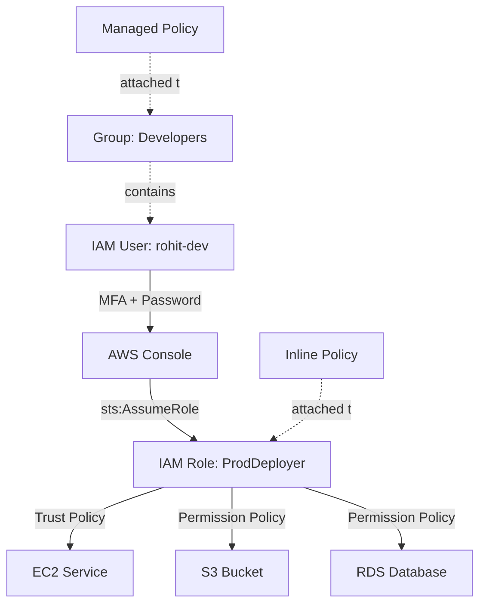

#### Interview Question

**Q:** IAM User aur IAM Role me kya difference hai? Production application ke liye kaunsa use karna chahiye aur kyu?

**A:** IAM User ek permanent identity hai jiske paas long-lived credentials hote hain — access key ID aur secret access key. Yeh humans ke liye banaya gaya hai jo console ya CLI se login karte hain. User ke credentials rotate karne padte hain manually, aur agar leak ho gaye to attacker ko unlimited time tak access mil jaata hai jab tak tu manually rotate na kare.

IAM Role ek temporary identity hai. Role ke paas koi permanent credentials nahi hote — jab koi entity (EC2 instance, Lambda function, ya dusra IAM user) role assume karta hai, AWS STS (Security Token Service) temporary credentials issue karta hai jo 15 minute se 12 ghante me expire ho jaate hain. Trust policy define karti hai ki kaun assume kar sakta hai, aur permission policy define karti hai ki role kya kar sakta hai.

Production applications ke liye **always roles use karo, users nahi**. Maan le tu EC2 pe ek Node.js app chala raha hai jo S3 me files upload karta hai. Galat tarika — IAM user banao, uske access keys EC2 me environment variable me daalo. Sahi tarika — ek IAM role banao S3 access wala, EC2 instance ko woh role attach karo (instance profile). Ab application AWS SDK use karega aur SDK automatically EC2 metadata service se temporary credentials le lega — jo har ghante rotate hote hain. Keys leak hone ka risk khatam, manual rotation ka headache khatam, aur audit trail bhi clean rehta hai.

---

### 1.2 EC2 — instance types, AMIs, security groups, EBS volumes

#### Definition

EC2 matlab Elastic Compute Cloud. Simple words me — yeh AWS me virtual machines (VMs) hain. Tu ek server rent kar raha hai jo AWS ke data center me kahin chal raha hai, lekin tujhe lagta hai jaise tera apna laptop hai jisme tu SSH kar sakta hai. EC2 ke 4 main concepts hain: **Instance Type** (CPU/RAM/network ka size — t3.micro, m5.large, c5.xlarge etc.), **AMI** (Amazon Machine Image — basically pre-baked OS template, jaise Ubuntu 22.04 ya Amazon Linux 2023), **Security Group** (virtual firewall jo decide karta hai kaunsa traffic instance pe aa sakta hai), aur **EBS** (Elastic Block Store — instance ki hard disk).

Analogy soch — EC2 ek hotel room jaisa hai. **Instance Type** matlab room ka size (single, double, suite). **AMI** matlab room ka pre-furnished setup (basic, deluxe, presidential). **Security Group** matlab hotel ka security guard jo decide karta hai kaun andar aa sakta hai. **EBS volume** matlab room ka locker — tu checkout kar bhi le, locker ka saamaan safe rehta hai (instance terminate karne ke baad bhi EBS volume bach sakta hai).

#### Why?

Tu poochega — Lambda aur containers ke zamane me EC2 kyu use karein? Reason hai control aur cost predictability. Long-running workloads ke liye (database, message queue, ML training, gaming server), EC2 sabse cost-effective hai. Reserved Instances ya Savings Plans le lo to 72% tak discount mil jaata hai. Spot Instances le lo to 90% discount, lekin AWS kabhi bhi terminate kar sakta hai (batch jobs ke liye perfect). Plus, kuch workloads ko full OS access chahiye hota hai — kernel tuning, custom drivers, GPU access — yeh sirf EC2 pe possible hai.

#### How?

```bash
# Latest Amazon Linux 2023 AMI ID dhundo Mumbai region me
aws ec2 describe-images \
  --owners amazon \
  --filters "Name=name,Values=al2023-ami-*-x86_64" \
  --query 'Images | sort_by(@, &CreationDate) | [-1].ImageId' \
  --output text \
  --region ap-south-1

# Security group banao — SSH aur HTTPS allow
aws ec2 create-security-group \
  --group-name web-sg \
  --description "Web server SG" \
  --vpc-id vpc-0abc123

# SSH sirf office IP se allow kar (production me 0.0.0.0/0 NEVER)
aws ec2 authorize-security-group-ingress \
  --group-id sg-0xyz789 \
  --protocol tcp --port 22 --cidr 49.207.xxx.xxx/32

# HTTPS dunia bhar se allow
aws ec2 authorize-security-group-ingress \
  --group-id sg-0xyz789 \
  --protocol tcp --port 443 --cidr 0.0.0.0/0

# EC2 instance launch karo
aws ec2 run-instances \
  --image-id ami-0abcd1234 \
  --instance-type t3.medium \
  --key-name my-keypair \
  --security-group-ids sg-0xyz789 \
  --subnet-id subnet-0pqr456 \
  --iam-instance-profile Name=EC2-S3-Access-Role \
  --block-device-mappings '[{
    "DeviceName": "/dev/xvda",
    "Ebs": {
      "VolumeSize": 30,
      "VolumeType": "gp3",
      "Encrypted": true,
      "DeleteOnTermination": true
    }
  }]' \
  --tag-specifications 'ResourceType=instance,Tags=[
    {Key=Name,Value=web-prod-01},
    {Key=Environment,Value=production}
  ]' \
  --user-data file://bootstrap.sh

# bootstrap.sh — instance start hone pe yeh chalega
# #!/bin/bash
# yum update -y
# yum install -y nginx
# systemctl enable --now nginx

# Extra EBS volume attach karo (data ke liye)
aws ec2 create-volume \
  --availability-zone ap-south-1a \
  --size 100 \
  --volume-type gp3 \
  --iops 3000 \
  --throughput 125 \
  --encrypted

aws ec2 attach-volume \
  --volume-id vol-0aaa111 \
  --instance-id i-0bbb222 \
  --device /dev/sdf

# Snapshot lo backup ke liye
aws ec2 create-snapshot \
  --volume-id vol-0aaa111 \
  --description "Daily backup $(date +%F)"
```

#### Real-life Example

Ek e-commerce company jaise Meesho — inka product catalog service ek auto-scaling group me chalti hai. AMI custom-built hai jisme application code, Node.js, aur monitoring agents pre-installed hain. Sale day pe traffic 50x ho jaata hai, to auto-scaling group automatically c5.2xlarge instances spin up kar deta hai (CPU-optimized, kyunki yeh service compute-heavy hai). Off-peak hours me wapas scale down. Database connection pool wale instances pe extra EBS volume attached hai (gp3, 500GB, 16000 IOPS) for local cache. Security group sirf ALB se traffic allow karta hai — public internet se direct access nahi. SSH access bhi nahi — debugging ke liye AWS Systems Manager Session Manager use karte hain (no SSH keys, full audit trail).

#### Diagram

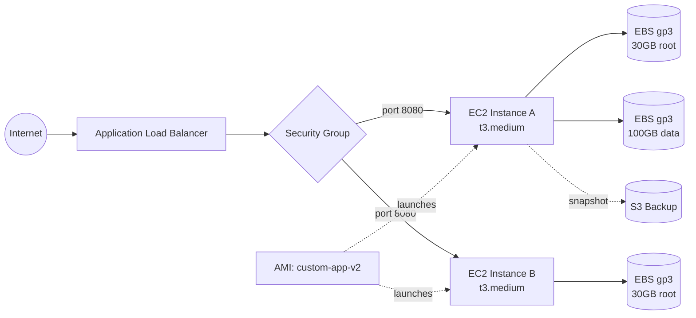

#### Interview Question

**Q:** Tujhe ek high-traffic web application deploy karna hai. Tu t3.large choose karega ya c5.large? Aur EBS me gp2 vs gp3 vs io2 kab use karega?

**A:** Instance type choice workload pe depend karti hai. **t3.large** burstable hai — 2 vCPU aur 8GB RAM, lekin baseline CPU performance sirf 30% hai. CPU credits accumulate hote hain idle time me, aur burst time pe spend hote hain. Yeh dev/staging environments aur low-traffic apps ke liye perfect hai kyunki sasta hai. **c5.large** compute-optimized hai — same 2 vCPU lekin sustained 100% CPU performance, 4GB RAM, faster network. High-traffic web app ke liye c5.large ya c6i.large better hai kyunki CPU credit run-out hone pe t3 instance throttle ho jaata hai aur latency spike marti hai. Memory-heavy workload ho (Java apps, caching) to r5/r6i family use kar.

EBS volume types ka difference IOPS aur throughput pe hai. **gp2** purana general-purpose SSD hai — IOPS volume size se tied hai (3 IOPS per GB), max 16000. Ab deprecated maano. **gp3** new general-purpose SSD hai jo 2020 me aaya — baseline 3000 IOPS aur 125 MB/s throughput by default, aur tu independently scale kar sakta hai (max 16000 IOPS, 1000 MB/s). gp3 gp2 se 20% sasta hai aur better performance deta hai — default choice yahi hona chahiye 99% cases me. **io2 / io2 Block Express** ultra-high performance ke liye hai — 256000 IOPS tak, 99.999% durability, sub-millisecond latency. Yeh sirf mission-critical databases (Oracle, SAP HANA, large Postgres clusters) ke liye use kar — kyunki 3-4x mehenga hai. Normal web apps aur 90% databases ke liye gp3 sufficient hai.

---

### 1.3 S3 — buckets, objects, lifecycle policies, encryption (SSE-S3/SSE-KMS), versioning

#### Definition

S3 matlab Simple Storage Service. Yeh AWS ka object storage hai — basically internet-scale unlimited file storage. File system nahi hai (no folders technically, "prefixes" hote hain), block storage bhi nahi hai. Yeh **object storage** hai — har file ek "object" hai jiske paas data, metadata, aur ek unique key hota hai. Tu file ko URL se access karta hai. S3 11 nines durability deta hai (99.999999999%) — matlab 10 million objects me ek file 10000 saal me lose hoti hai statistically.

Char core concepts: **Bucket** (top-level container, globally unique name — `my-app-uploads-prod-2026`), **Object** (actual file with key like `users/123/avatar.jpg`), **Lifecycle Policy** (automated rules — "30 din baad cheap storage me move kar do, 1 saal baad delete kar do"), **Versioning** (har file ka history rakhta hai, accidental delete se bachata hai). Analogy — S3 ek infinite warehouse hai. Buckets matlab warehouses. Objects matlab boxes. Lifecycle matlab inventory manager jo purane boxes ko basement (cheap storage) me shift karta hai. Versioning matlab har box ki photo lekar rakhta hai purani version ki bhi.

#### Why?

S3 internet ka default file storage ban gaya hai. Static website hosting, user uploads (images, videos), database backups, data lake (analytics ke liye), CDN origin, Terraform state files, Docker registry (ECR backend) — sab S3 pe hai. Cost dekh — S3 Standard ₹2/GB per month (Mumbai region, approx). Glacier Deep Archive ₹0.1/GB per month — matlab 1TB ka backup ₹100/month me. Koi on-prem solution itna sasta nahi hai. Plus, S3 ki API itni stable hai ki MinIO, Cloudflare R2, Backblaze B2 — sab S3-compatible API banate hain. Seekh lega to lifelong useful skill hai.

#### How?

```bash
# Bucket banao (name globally unique hona chahiye)
aws s3api create-bucket \
  --bucket meesho-user-uploads-prod \
  --region ap-south-1 \
  --create-bucket-configuration LocationConstraint=ap-south-1

# Public access COMPLETELY block kar do (default secure)
aws s3api put-public-access-block \
  --bucket meesho-user-uploads-prod \
  --public-access-block-configuration \
    "BlockPublicAcls=true,IgnorePublicAcls=true,BlockPublicPolicy=true,RestrictPublicBuckets=true"

# Versioning enable kar — accidental delete se bachata hai
aws s3api put-bucket-versioning \
  --bucket meesho-user-uploads-prod \
  --versioning-configuration Status=Enabled

# Default encryption — SSE-S3 (AWS-managed keys, free)
aws s3api put-bucket-encryption \
  --bucket meesho-user-uploads-prod \
  --server-side-encryption-configuration '{
    "Rules": [{
      "ApplyServerSideEncryptionByDefault": {
        "SSEAlgorithm": "AES256"
      }
    }]
  }'

# Sensitive data ke liye SSE-KMS (apni key, audit trail)
aws s3api put-bucket-encryption \
  --bucket meesho-financial-data \
  --server-side-encryption-configuration '{
    "Rules": [{
      "ApplyServerSideEncryptionByDefault": {
        "SSEAlgorithm": "aws:kms",
        "KMSMasterKeyID": "arn:aws:kms:ap-south-1:123456789012:key/abc-xyz"
      },
      "BucketKeyEnabled": true
    }]
  }'

# Lifecycle policy — purani files ko cheaper tier me bhejo
cat > lifecycle.json <<EOF
{
  "Rules": [{
    "ID": "ArchiveOldUploads",
    "Status": "Enabled",
    "Filter": { "Prefix": "uploads/" },
    "Transitions": [
      { "Days": 30,  "StorageClass": "STANDARD_IA" },
      { "Days": 90,  "StorageClass": "GLACIER_IR" },
      { "Days": 365, "StorageClass": "DEEP_ARCHIVE" }
    ],
    "Expiration": { "Days": 2555 },
    "NoncurrentVersionExpiration": { "NoncurrentDays": 90 }
  }]
}
EOF

aws s3api put-bucket-lifecycle-configuration \
  --bucket meesho-user-uploads-prod \
  --lifecycle-configuration file://lifecycle.json

# File upload kar
aws s3 cp ./photo.jpg s3://meesho-user-uploads-prod/users/42/avatar.jpg

# Pre-signed URL banao (frontend ko de — temporary direct upload)
aws s3 presign s3://meesho-user-uploads-prod/users/42/upload.jpg \
  --expires-in 900
# 15 min ke liye valid URL milega
```

#### Real-life Example

Imagine kar Hotstar jaisi streaming platform. User videos upload karte hain (live cricket clips), aur platform ko 100PB+ video store karna hai. Strategy yeh hai — fresh uploads (7 din) S3 Standard me rehte hain (frequent access, fast). 7-30 din ke videos S3 Standard-IA me jaate hain (Infrequent Access, sasta but milisecond latency). 30+ din ke clips Glacier Instant Retrieval me. 1 saal+ ke videos Deep Archive me chale jaate hain — ₹0.1/GB/month. Versioning enabled hai, to agar koi user galti se video delete kar de, 30 din tak recoverable hai. Encryption SSE-KMS hai with customer-managed key — compliance audit ke liye proof chahiye ki encryption keys kaun rotate karta hai. CloudFront CDN S3 ke saamne hai, to actual S3 pe load minimal hai. Yeh entire setup ka cost on-prem se 1/10 hai.

#### Diagram

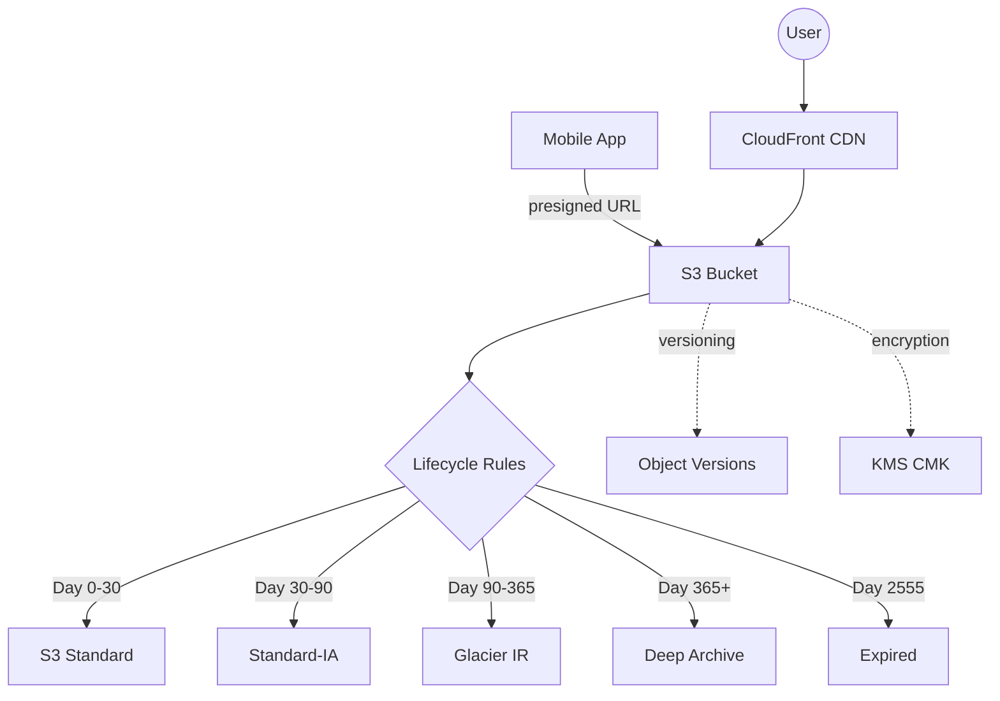

#### Interview Question

**Q:** SSE-S3 aur SSE-KMS me kya difference hai? Aur bucket policy vs IAM policy kab use karte hain?

**A:** Dono server-side encryption methods hain — matlab S3 data ko disk pe encrypt karke store karta hai, aur read time pe decrypt. **SSE-S3** me AWS automatically AES-256 keys manage karta hai. Tu kuch nahi karta — bas enable kiya, kaam khatam. Free hai, aur 99% use cases ke liye sufficient hai. Lekin tujhe key rotation pe control nahi hai, aur audit log me sirf "S3 ne encrypt kiya" dikhta hai.

**SSE-KMS** me AWS Key Management Service ki key use hoti hai. Tu apni Customer Master Key (CMK) bana sakta hai, rotation policy set kar sakta hai (yearly auto-rotation), aur har encryption/decryption operation CloudTrail me log hota hai with user identity. Yeh compliance-heavy environments (PCI-DSS, HIPAA, RBI) ke liye mandatory hai. Cost — KMS ₹1/key/month plus ₹0.03 per 10000 API calls. Trick yeh hai — `BucketKeyEnabled=true` set kar do, isse S3 ek bucket-level intermediate key use karta hai aur KMS API calls 99% kam ho jaate hain.

Bucket policy vs IAM policy — yeh confusing hai initially. **IAM policy** identity pe attach hoti hai (user, role, group) aur batati hai "yeh identity kya kar sakti hai". **Bucket policy** resource pe attach hoti hai (bucket) aur batati hai "yeh bucket pe kaun kya kar sakta hai". Use case difference — agar tu apne hi account ke users ko access dena chahta hai, IAM policy use kar (centralized, easy to audit). Agar cross-account access dena hai (dusra AWS account ya public access ya CloudFront OAI), to bucket policy use kar — kyunki tu dusre account ke users pe IAM policy attach nahi kar sakta. Real production pattern — IAM policies se internal access control, bucket policy se sirf cross-account access aur "deny insecure transport" jaisa enforcement (`aws:SecureTransport=false` deny karna).

---

### 1.4 VPC — subnets (public/private), route tables, NAT gateway, internet gateway

#### Definition

VPC matlab Virtual Private Cloud. Yeh tera apna isolated network hai AWS me — apna IP range, apne subnets, apni firewall rules. Jab tu AWS account banata hai, har region me ek "default VPC" already milta hai, lekin production me hamesha custom VPC banao. Concepts: **CIDR block** (IP range jaise 10.0.0.0/16 — 65536 IPs), **Subnet** (CIDR ka subset, ek availability zone me bandhe — 10.0.1.0/24 me 256 IPs), **Route Table** (rules jo decide karte hain ki packet kahan jayega), **Internet Gateway (IGW)** (public internet ka gateway), **NAT Gateway** (private subnets ko outgoing internet access dene wala one-way door).

Public vs Private subnet ka difference yeh hai — **Public subnet** ka route table IGW pe point karta hai, matlab internet se inbound traffic aa sakta hai (load balancers, bastion hosts yahan rakhe jaate hain). **Private subnet** ka route table NAT gateway pe point karta hai — private subnet me bethe instances internet pe outbound request kar sakte hain (npm install, OS updates) lekin internet se direct inbound nahi aa sakta (databases, internal services yahan).

Analogy — VPC ek gated society hai. CIDR matlab society ka full address range. Subnets matlab alag-alag blocks (Block A, B, C). Public subnet matlab parking lot (saari gaadi aa-jaa sakti hai). Private subnet matlab residential area (sirf residents andar, lekin residents bahar Swiggy order kar sakte hain — NAT gateway is the Swiggy delivery boy). IGW matlab society ka main gate.

#### Why?

VPC AWS networking ka foundation hai. Without proper VPC design, security audits fail ho jaate hain. RBI guidelines, PCI compliance, HIPAA — sab demand karte hain ki sensitive workloads (databases, internal APIs) public internet se reachable na ho. VPC design ek baar galat ho gaya to baad me fix karna nightmare hai — IPs change hote hain, subnets recreate karne padte hain. Isliye day 1 pe correct CIDR planning, multi-AZ subnet layout, aur NAT gateway placement decide karna critical hai.

#### How?

```bash
# VPC banao 10.0.0.0/16 CIDR ke saath
aws ec2 create-vpc \
  --cidr-block 10.0.0.0/16 \
  --tag-specifications 'ResourceType=vpc,Tags=[{Key=Name,Value=prod-vpc}]'
# Yeh vpc-0abc123 return karega

# Public subnet ap-south-1a me
aws ec2 create-subnet \
  --vpc-id vpc-0abc123 \
  --cidr-block 10.0.1.0/24 \
  --availability-zone ap-south-1a \
  --tag-specifications 'ResourceType=subnet,Tags=[{Key=Name,Value=public-1a}]'

# Public subnet ap-south-1b me (multi-AZ HA)
aws ec2 create-subnet \
  --vpc-id vpc-0abc123 \
  --cidr-block 10.0.2.0/24 \
  --availability-zone ap-south-1b \
  --tag-specifications 'ResourceType=subnet,Tags=[{Key=Name,Value=public-1b}]'

# Private subnets (databases ke liye)
aws ec2 create-subnet --vpc-id vpc-0abc123 \
  --cidr-block 10.0.10.0/24 --availability-zone ap-south-1a
aws ec2 create-subnet --vpc-id vpc-0abc123 \
  --cidr-block 10.0.11.0/24 --availability-zone ap-south-1b

# Internet Gateway banao aur VPC se attach kar
aws ec2 create-internet-gateway \
  --tag-specifications 'ResourceType=internet-gateway,Tags=[{Key=Name,Value=prod-igw}]'

aws ec2 attach-internet-gateway \
  --vpc-id vpc-0abc123 \
  --internet-gateway-id igw-0xyz789

# Public route table — IGW pe default route
aws ec2 create-route-table --vpc-id vpc-0abc123
aws ec2 create-route \
  --route-table-id rtb-0pub111 \
  --destination-cidr-block 0.0.0.0/0 \
  --gateway-id igw-0xyz789

# Public subnets ko public route table se associate
aws ec2 associate-route-table \
  --route-table-id rtb-0pub111 \
  --subnet-id subnet-0pub1a

# Elastic IP NAT gateway ke liye
aws ec2 allocate-address --domain vpc

# NAT Gateway banao public subnet me (yeh expensive hai!)
aws ec2 create-nat-gateway \
  --subnet-id subnet-0pub1a \
  --allocation-id eipalloc-0nat111 \
  --tag-specifications 'ResourceType=natgateway,Tags=[{Key=Name,Value=prod-nat}]'

# Private route table — NAT gateway pe default route
aws ec2 create-route-table --vpc-id vpc-0abc123
aws ec2 create-route \
  --route-table-id rtb-0priv222 \
  --destination-cidr-block 0.0.0.0/0 \
  --nat-gateway-id nat-0aaa333

# VPC Flow Logs enable kar — debug aur security audit ke liye
aws ec2 create-flow-logs \
  --resource-type VPC \
  --resource-ids vpc-0abc123 \
  --traffic-type ALL \
  --log-destination-type s3 \
  --log-destination arn:aws:s3:::vpc-flow-logs-prod
```

#### Real-life Example

Ek typical 3-tier production architecture dekh — Cred jaisi app. VPC me 6 subnets hain: 2 public (ap-south-1a aur 1b) for ALB, 2 private app-tier (NodeJS services), 2 private data-tier (Postgres RDS). ALB public subnets me sit karta hai aur traffic NodeJS services ko forward karta hai private subnets me. NodeJS services Postgres ko data-tier me access karte hain. NAT gateways har AZ me ek-ek hain (single NAT single point of failure ban jaata hai). Postgres ka security group sirf NodeJS services ke security group se inbound allow karta hai port 5432 pe — public internet se direct access impossible hai. VPC Flow Logs S3 me ja rahe hain, jisse SOC team suspicious traffic patterns dhundh sakti hai. Cost optimization — NAT gateway expensive hai (₹3500/month per NAT plus data charges), to small environments me VPC endpoints use karte hain S3 aur DynamoDB ke liye (free, traffic AWS backbone se jaata hai).

#### Diagram

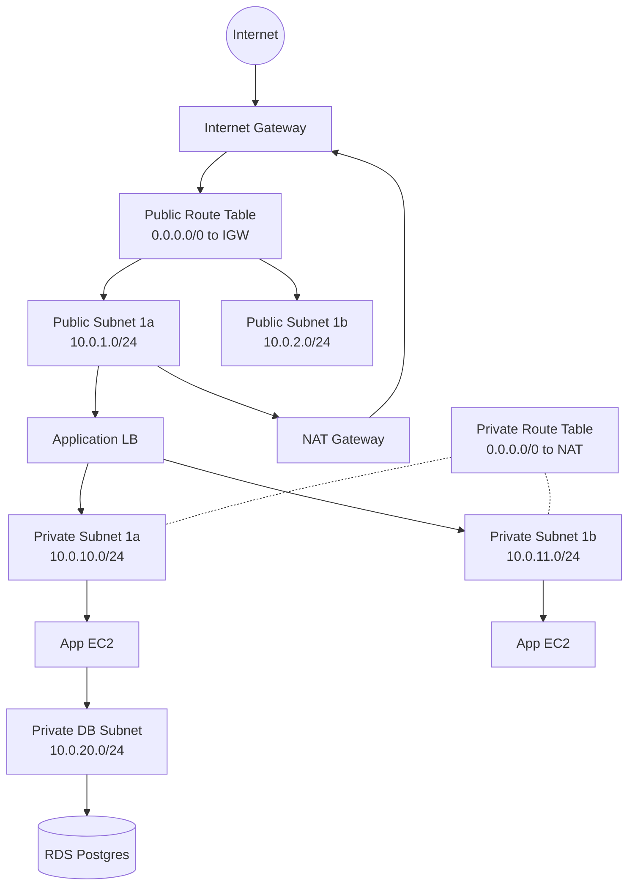

#### Interview Question

**Q:** NAT Gateway aur Internet Gateway me kya difference hai? NAT Instance kab use karna chahiye NAT Gateway ke bajaye?

**A:** Internet Gateway (IGW) bidirectional hai — VPC ko public internet se connect karta hai dono directions me. Public subnet ke instances ka public IP hota hai, aur internet se inbound traffic aa sakta hai unke pass (via security groups). IGW free hai — koi cost nahi, koi bandwidth limit nahi (theoretically).

NAT Gateway unidirectional hai — sirf outbound traffic allow karta hai. Private subnet ke instances jo internet pe call karna chahte hain (npm install, API calls to Stripe, OS updates), unke packets NAT gateway se hokar jaate hain. NAT gateway public IP attach karta hai source pe, aur response wapas same connection ke through aata hai. Internet se naye inbound connections initiate nahi ho sakte private instances pe — yahi security ka point hai. NAT gateway managed hai — AWS handle karta hai HA aur scaling (45 Gbps tak). Cost mehenga hai — ₹3000-3500/month per NAT plus ₹4-5/GB data processed.

NAT Instance ek EC2 instance hai jo NAT functionality provide karta hai. Pehle yahi option tha. Use case — choti dev environments jahan budget tight hai, ya jahan NAT pe custom logic chahiye (firewall rules, traffic inspection). t3.nano se shuru kar sakte ho ₹400/month me. Lekin downsides — single point of failure (HA ke liye script likhni padti hai), bandwidth limit instance type pe depend karta hai, aur tu OS patching, security updates, monitoring khud handle karta hai. 99% production cases me NAT Gateway better hai. NAT Instance tabhi consider kar jab cost bahut critical ho aur low-traffic environment ho, ya specific networking features (port forwarding, Bastion functionality) chahiye ek hi machine pe.

---

### 1.5 RDS — managed databases (Postgres/MySQL/Aurora), Multi-AZ, read replicas

#### Definition

RDS matlab Relational Database Service. Yeh AWS ka managed database service hai — Postgres, MySQL, MariaDB, Oracle, SQL Server, aur Aurora (AWS ka custom Postgres/MySQL-compatible engine) support karta hai. "Managed" ka matlab — patching, backups, replication, failover, monitoring sab AWS handle karta hai. Tu sirf SQL queries chalata hai aur connection string use karta hai. EC2 pe khud Postgres install karne se 100x kam headache.

Critical features: **Multi-AZ deployment** (synchronous standby replica dusre AZ me — primary fail ho to 60-120 second me automatic failover), **Read Replicas** (asynchronous copies, read traffic offload karne ke liye, max 5 per instance), **Automated Backups** (daily snapshots + transaction logs, point-in-time recovery 35 din tak), **Performance Insights** (query-level monitoring), **Parameter Groups** (database engine config jaise `max_connections`).

Analogy — RDS ek 5-star hotel jaisa hai. Tu bas check-in karta hai aur kaam karta hai. Housekeeping (backups), security (patching), room maintenance (OS updates) sab hotel staff handle karta hai. Multi-AZ matlab agar tera primary room flood ho jaye, dusra identical room standby me hai with same belongings. Read replicas matlab additional rooms jahan tu sirf reading karta hai (writing nahi) — research ke liye library jaise.

#### Why?

Managed database use kyu karein? Kyunki database operations world's hardest distributed systems problem hai. Replication, failover, backup verification, performance tuning, version upgrades — yeh sab full-time DBA team chahiye on-prem me. Indian startups ke paas yeh luxury nahi hota. RDS pe Multi-AZ ek checkbox hai — automatic synchronous replication, automatic failover. Aurora to aur insane hai — 6-way replication across 3 AZs by default, storage auto-scales 10GB se 128TB tak, read replicas 15 tak, aur cross-region replication available. Cost RDS ka EC2-self-managed se zyada hai (40-60% premium), lekin reliability aur engineering time ki bachat consider karne pe sasta padta hai.

#### How?

```bash
# DB subnet group banao (RDS multi-AZ ke liye 2+ AZ subnets chahiye)
aws rds create-db-subnet-group \
  --db-subnet-group-name prod-db-subnets \
  --db-subnet-group-description "Production DB subnets" \
  --subnet-ids subnet-0db1a subnet-0db1b

# Security group — sirf app SG se port 5432 inbound
aws ec2 create-security-group \
  --group-name rds-postgres-sg \
  --description "RDS Postgres SG" \
  --vpc-id vpc-0abc123

aws ec2 authorize-security-group-ingress \
  --group-id sg-0rds111 \
  --protocol tcp --port 5432 \
  --source-group sg-0app222

# Postgres RDS instance Multi-AZ ke saath
aws rds create-db-instance \
  --db-instance-identifier prod-postgres \
  --db-instance-class db.r6g.xlarge \
  --engine postgres \
  --engine-version 16.3 \
  --master-username dbadmin \
  --master-user-password "$(openssl rand -base64 24)" \
  --allocated-storage 100 \
  --storage-type gp3 \
  --storage-encrypted \
  --kms-key-id arn:aws:kms:ap-south-1:123:key/xxx \
  --multi-az \
  --vpc-security-group-ids sg-0rds111 \
  --db-subnet-group-name prod-db-subnets \
  --backup-retention-period 30 \
  --preferred-backup-window "18:00-19:00" \
  --preferred-maintenance-window "sun:19:30-sun:20:30" \
  --enable-performance-insights \
  --performance-insights-retention-period 7 \
  --deletion-protection \
  --tags Key=Environment,Value=production

# Read replica banao (analytics queries ke liye)
aws rds create-db-instance-read-replica \
  --db-instance-identifier prod-postgres-read-1 \
  --source-db-instance-identifier prod-postgres \
  --db-instance-class db.r6g.large \
  --availability-zone ap-south-1c

# Manual snapshot lene se pehle major change
aws rds create-db-snapshot \
  --db-instance-identifier prod-postgres \
  --db-snapshot-identifier pre-migration-2026-04-30

# Point-in-time recovery (any moment from last 35 days)
aws rds restore-db-instance-to-point-in-time \
  --source-db-instance-identifier prod-postgres \
  --target-db-instance-identifier prod-postgres-recovered \
  --restore-time 2026-04-29T14:30:00Z

# Aurora cluster (different from regular RDS)
aws rds create-db-cluster \
  --db-cluster-identifier prod-aurora-pg \
  --engine aurora-postgresql \
  --engine-version 16.2 \
  --master-username dbadmin \
  --master-user-password "$(openssl rand -base64 24)" \
  --vpc-security-group-ids sg-0rds111 \
  --db-subnet-group-name prod-db-subnets \
  --storage-encrypted \
  --backup-retention-period 30
```

#### Real-life Example

Ek payments company jaise Razorpay imagine kar. Primary database Aurora Postgres cluster hai, db.r6g.4xlarge size (16 vCPU, 128GB RAM). Cluster me 1 writer aur 3 readers hain, 3 different AZs me distributed. Application writer endpoint pe writes karta hai aur reader endpoint pe reads. Reader endpoint internally load balance karta hai 3 replicas pe. Storage automatically scale hota hai — abhi 5TB hai, jab 10TB chahiye to AWS ne automatic increase kar diya without downtime. Daily backups 35 din tak retain hote hain, aur weekly logical backups (`pg_dump`) S3 me cross-region replicate hote hain DR ke liye. RPO 1 second hai (Aurora ka replication lag), RTO 30 second (failover time). Production deploys ke pehle hamesha snapshot lete hain — agar deployment galat ho jaye to point-in-time recovery se 5 min me revert ho jata hai. Performance Insights se slow queries identify hote hain — top 10 slow queries weekly review hoti hain DBA team me.

#### Diagram

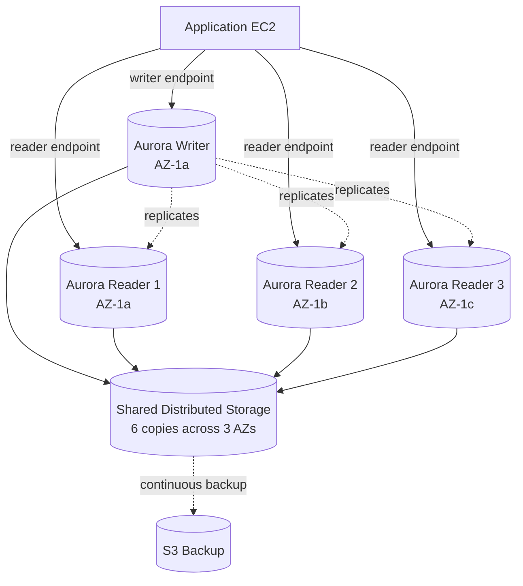

#### Interview Question

**Q:** Multi-AZ aur Read Replica me kya difference hai? Aurora aur regular RDS Postgres me kab kya choose karna chahiye?

**A:** Multi-AZ aur Read Replica do alag goals solve karte hain. **Multi-AZ** high availability ke liye hai. Standby instance same region me ek doosre AZ me hai, aur replication **synchronous** hai — har commit primary aur standby dono pe persist hone ke baad hi acknowledgment milti hai. Standby ko tu access nahi kar sakta queries ke liye — yeh sirf failover ke liye hai. Primary fail ho (hardware failure, AZ outage, OS patching) to RDS automatically DNS endpoint ko standby pe point kar deta hai 60-120 second me. Performance ka impact hai — synchronous replication latency badhata hai. Cost lagbhag double ho jaata hai single instance ke compare me.

**Read Replica** scaling reads ke liye hai. Asynchronous replication hoti hai (millisecond se seconds tak lag), aur tu separately query kar sakta hai replica ko. Heavy reporting queries, analytics, BI tools — sab replicas pe daal do, primary write performance affect nahi hoga. Replicas same region me ya cross-region me ho sakte hain. Replica ko manually promote karke standalone primary bana sakta hai (DR scenario). Replica failover automatic nahi hota — application code me handle karna padta hai. Production rule — Multi-AZ + Read Replica dono use karo. Multi-AZ HA ke liye, replicas read scaling ke liye.

Aurora vs regular Postgres RDS — Aurora AWS ka custom-built engine hai jo Postgres/MySQL ke saath wire-protocol compatible hai lekin storage layer puri tarah rewritten hai. Aurora 6-way replication automatically karta hai 3 AZs me, storage auto-scales without downtime, replicas tak 15 ho sakti hain, replica lag typically 10-20ms (regular RDS me 100ms-second), aur backups continuous hain (point-in-time recovery 1 second granularity tak). Failover bhi 30 second me hota hai (regular Multi-AZ me 60-120 sec). Performance regular RDS Postgres se 3-5x better hai high-concurrency workloads pe. Lekin Aurora 20% mehenga hai aur kuch Postgres extensions support nahi karta. Choose kar — high-traffic production app, mission-critical, scaling reads chahiye, budget okay hai = Aurora. Internal tools, dev/staging, smaller workloads, specific Postgres extensions chahiye (jaise TimescaleDB) = regular RDS Postgres.

---

### 1.6 Lambda — serverless functions, triggers, cold start, concurrency limits

#### Definition

Lambda matlab AWS ka serverless compute service. "Serverless" ka matlab tu server provision nahi karta — bas code upload kiya, AWS run karta hai jab needed. Tu pay karta hai per-invocation aur per-millisecond execution time. Idle time pe zero cost. Maximum execution time 15 minutes hai. Memory 128 MB se 10240 MB tak set kar sakta hai (CPU memory ke proportional hota hai). Languages supported — Python, Node.js, Java, Go, Ruby, .NET, ya custom runtime via container images.

Concepts samajh: **Trigger** (event source jo function invoke karta hai — API Gateway, S3 upload, SQS message, EventBridge schedule, DynamoDB stream, etc.), **Cold Start** (jab function pehli baar invoke ho ya idle hone ke baad, container start hone me extra time lagta hai 100ms-3sec), **Concurrency** (kitne simultaneous executions allowed, account default 1000), **Provisioned Concurrency** (pre-warmed instances jo cold start eliminate karte hain).

Analogy — Lambda Uber jaisa hai. Tu apni gaadi nahi rakhta (server provision nahi). Jab chahiye tab call karte ho, ride karte ho, paise dete ho, gayab. EC2 personal car hai — 24/7 available but parking, fuel, maintenance ka kharcha. Cold start matlab Uber driver ne pehle gaadi shuru karni hai 30 second me — agar driver nearby ho (warm) to instant pickup.

#### Why?

Lambda ka use kab kare? Event-driven workloads ke liye perfect hai — file upload hone pe thumbnail generate karo, scheduled cron jobs (har raat report email karo), API endpoints jo predictable load nahi hain (weekend pe 0 traffic, weekday pe spikes), webhooks (Razorpay payment confirmation, GitHub push event), data pipelines (S3 me CSV aaya to process karo aur DynamoDB me daal do). Traditional EC2 me yeh karne ke liye 24/7 server chalana padega ₹2000-5000/month, Lambda me yeh ₹50/month me ho jaata hai. Lekin Lambda har use case ke liye nahi hai — long-running processes (video encoding, ML training), heavy CPU/RAM workloads, or websocket servers ke liye yeh fit nahi hai.

#### How?

```bash
# Function code zip karo
zip function.zip index.js node_modules/

# IAM role banao Lambda ke liye
cat > trust.json <<EOF
{
  "Version": "2012-10-17",
  "Statement": [{
    "Effect": "Allow",
    "Principal": { "Service": "lambda.amazonaws.com" },
    "Action": "sts:AssumeRole"
  }]
}
EOF

aws iam create-role \
  --role-name lambda-thumbnail-role \
  --assume-role-policy-document file://trust.json

# Basic execution role attach kar (CloudWatch logs ke liye)
aws iam attach-role-policy \
  --role-name lambda-thumbnail-role \
  --policy-arn arn:aws:iam::aws:policy/service-role/AWSLambdaBasicExecutionRole

# S3 access bhi de
aws iam attach-role-policy \
  --role-name lambda-thumbnail-role \
  --policy-arn arn:aws:iam::aws:policy/AmazonS3FullAccess

# Lambda function create karo
aws lambda create-function \
  --function-name image-thumbnail-generator \
  --runtime nodejs20.x \
  --role arn:aws:iam::123:role/lambda-thumbnail-role \
  --handler index.handler \
  --zip-file fileb://function.zip \
  --timeout 60 \
  --memory-size 1024 \
  --environment "Variables={BUCKET=meesho-thumbnails,LOG_LEVEL=info}" \
  --reserved-concurrent-executions 100 \
  --tracing-config Mode=Active

# S3 trigger add karo (jab koi file upload ho)
aws lambda add-permission \
  --function-name image-thumbnail-generator \
  --statement-id s3-invoke \
  --action lambda:InvokeFunction \
  --principal s3.amazonaws.com \
  --source-arn arn:aws:s3:::meesho-user-uploads-prod

aws s3api put-bucket-notification-configuration \
  --bucket meesho-user-uploads-prod \
  --notification-configuration '{
    "LambdaFunctionConfigurations": [{
      "LambdaFunctionArn": "arn:aws:lambda:ap-south-1:123:function:image-thumbnail-generator",
      "Events": ["s3:ObjectCreated:*"],
      "Filter": {
        "Key": {
          "FilterRules": [{ "Name": "prefix", "Value": "uploads/" }]
        }
      }
    }]
  }'

# Provisioned concurrency — cold start eliminate (paid feature)
aws lambda put-provisioned-concurrency-config \
  --function-name image-thumbnail-generator \
  --qualifier prod \
  --provisioned-concurrent-executions 10

# Sample handler code (index.js)
cat > index.js <<'EOF'
exports.handler = async (event) => {
  // S3 event parse karo
  const record = event.Records[0];
  const bucket = record.s3.bucket.name;
  const key = decodeURIComponent(record.s3.object.key);
  console.log(`Processing ${key} from ${bucket}`);
  // Thumbnail logic yahan
  return { statusCode: 200, body: 'OK' };
};
EOF

# Test invoke
aws lambda invoke \
  --function-name image-thumbnail-generator \
  --payload '{"test":"data"}' \
  --cli-binary-format raw-in-base64-out \
  response.json
```

#### Real-life Example

Swiggy ka order notification system soch — jab koi user order place karta hai, EventBridge me ek event jaata hai. Multiple Lambda functions parallely fire hote hain — ek SMS bhejne ke liye (Twilio API), ek push notification ke liye (FCM), ek email ke liye (SES), ek analytics event ke liye (Kinesis stream pe daalta hai), ek Slack alert ke liye agar high-value order hai (₹2000+). Har Lambda independent hai, alag failure mode hai. Agar Twilio down hai to bas SMS Lambda fail hoga — order email aur push to chala jayega. SQS dead-letter queue setup hai retry ke liye. Cold start critical use cases (payment confirmation) me Provisioned Concurrency 5 set hai. Average invocation 200ms hota hai, 256MB memory enough hai. Monthly cost — 50 lakh invocations, total ₹3000. Agar yeh sab traditional servers pe banate to minimum ₹50000/month chahiye for redundancy.

#### Diagram

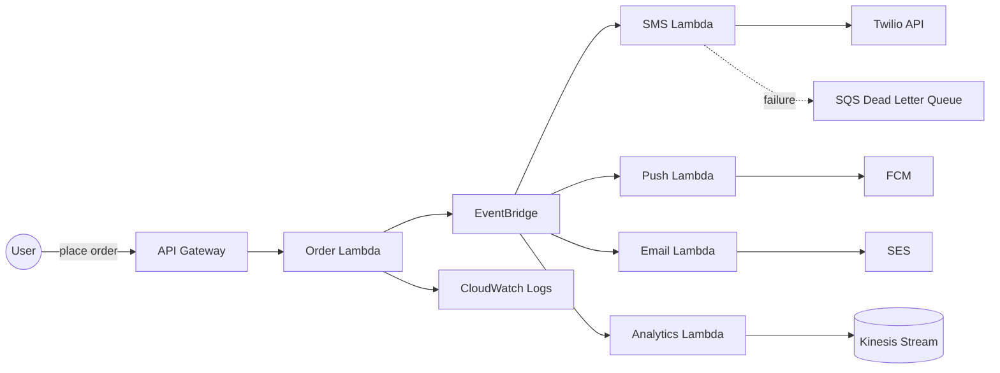

#### Interview Question

**Q:** Lambda cold start kya hai aur isse kaise mitigate karte hain? Concurrency limits ke baare me bata.

**A:** Cold start tab hota hai jab Lambda function ka koi warm container available nahi hai aur AWS ko naya container spin up karna padta hai. Steps yeh hain — AWS download karta hai function code, container initialize karta hai, runtime start karta hai (JVM load, Node.js bootstrap), aur tera handler ke bahar ka code execute karta hai (database connections, library imports). Iske baad handler invoke hota hai. Cold start typically 100ms (Node.js, small) se 3-5 seconds (Java, large dependencies) tak ho sakta hai. Subsequent invocations same container me 5-15 minute tak warm rehte hain — yeh "warm starts" hain, sub-millisecond.

Mitigation strategies — **Memory increase** karo, kyunki CPU memory ke proportional milti hai aur initialization fast hota hai (1769 MB pe 1 full vCPU milta hai). **Smaller deployment package** — sirf needed dependencies bundle kar, tree-shaking use kar (esbuild, webpack). **Init code optimize kar** — lazy load karo expensive imports, AWS SDK clients reuse karo bahar handler ke. **Provisioned Concurrency** — yeh paid feature pre-warmed instances rakhta hai. Tu specify karta hai "mujhe hamesha 10 warm containers chahiye" — yeh instances zero cold start dete hain. Cost extra hai (₹0.30 per instance per hour approx) lekin latency-critical APIs ke liye worth it. **Lambda SnapStart** (Java only) — function snapshot le leta hai initialized state ka, nayi invocations us snapshot se restore hoti hain. Cold start 90% reduce ho jaata hai.

Concurrency limits 2 levels pe hain. **Account-level concurrency** AWS account ka soft limit hai, default 1000 per region. Yeh saari Lambdas me share hota hai. AWS Support se increase karwa sakta hai. **Function-level reserved concurrency** ek specific function ke liye reserve karna — agar tu critical function hai aur tu chahta hai uske paas hamesha 100 slots available rahein, reserved concurrency 100 set kar de. Yeh account pool se 100 deduct ho jaate hain. Reserved concurrency 0 set karne ka ek nasty trick hai — function effectively disable ho jaata hai (incident response me useful). Burst behavior — Lambda initial 500-3000 concurrent invocations instantly handle kar leta hai (region pe depend), uske baad 500 per minute ki rate se scale karta hai. Agar traffic spike isse zyada hai to throttling hoti hai, jo SQS-triggered Lambdas me retry hoti hai but API Gateway-triggered me 429 error return hota hai. Production me hamesha CloudWatch alarm set kar Throttles metric pe.

---

## Conclusion

Yeh 6 services AWS ka backbone hain — IAM (security), EC2 (compute), S3 (storage), VPC (networking), RDS (databases), Lambda (serverless). Inko deeply samajh le, hands-on practice kar (free tier me bahut kuch ho jaata hai), aur production patterns observe kar. Real expertise tab aati hai jab tu actual incidents handle karta hai — production database failover, S3 cost spike, NAT gateway saturation, Lambda throttling. Documentation padh, AWS Well-Architected Framework dekh, aur experiment karta reh. Cloud platforms part 2 me hum CloudWatch, Route53, ELB, ECS/EKS, aur SQS/SNS dekhenge. Tab tak yeh foundation pakka kar.
# Cloud Platforms — Part 2: Google Cloud Platform (GCP)

GCP — Google Cloud Platform — basically wahi infrastructure hai jisme Google khud apna Search, Gmail, YouTube, Maps chalata hai, aur ab tu bhi usi pe apna app deploy kar sakta hai. AWS se thoda chhota market share hai but GCP ka data analytics game (BigQuery) bahut strong hai — Google ne search engine ka tech wahaan publicly available kar diya. Agar tera kaam ML, data warehousing, Kubernetes, ya bahut hi clean networking pe hai, toh GCP genuinely shine karta hai.

Is guide me hum 5 core services dekhenge — IAM (security/permissions ka backbone), Compute Engine (VMs), Cloud Storage (object storage / S3 ka cousin), BigQuery (serverless analytics monster), aur Cloud Functions (event-driven serverless). Har service ke liye definition, why use karein, kaise setup karein with `gcloud` CLI, real-life production scenario, ek mermaid diagram, aur interview question milega. Tu intern hai, main senior dev — toh seedha point pe baat karunga, koi marketing fluff nahi.

## 2. Google Cloud Platform (GCP)

GCP ka mental model AWS se thoda alag hai. AWS me "account" sabse upar hota hai, GCP me **Project** sabse important unit hai — har resource (VM, bucket, function) kisi na kisi project me hi rehta hai. Projects ke upar **Folders**, aur unke upar **Organization** node hota hai (agar tu Workspace/Cloud Identity use kar raha hai). Billing alag se attach hoti hai project pe. Yeh hierarchy yaad rakhna important hai kyunki IAM aur quotas wahi pe lagte hain.

### 2.1 IAM — projects, service accounts, roles, conditions

#### Definition

IAM (Identity and Access Management) GCP ka security ka dimaag hai. Iska kaam ek hi sawal answer karna hai — "kaun (identity) kya kar sakta hai (role/permission) kis resource pe (scope), aur kis condition me?" GCP me identities do flavors me aati hain — **human users** (Google accounts, jaise tera gmail), aur **service accounts** (machine identities — jab ek VM ya Cloud Function ko BigQuery padhne ki permission chahiye toh wo service account use karta hai). Groups aur Workspace domains bhi support hote hain.

Analogy soch — IAM ek bahut hi paranoid security guard hai jo har gate (resource) pe khada hai. Guard ke paas ek list hai — "yeh banda andar aa sakta hai, lekin sirf 9-5 ke beech, sirf agar uske paas blue badge hai, aur sirf reading room me, writing room me nahi." Yeh "9-5 + blue badge" wala part **IAM Conditions** hain. "Reading room" wala part **Role** hai. "Banda" identity hai. Roles 3 type ke hote hain — **Basic** (Owner/Editor/Viewer — bahut broad, prod me mat use kar), **Predefined** (Google ke banaye hue task-specific, jaise `roles/storage.objectViewer`), aur **Custom** (apne hisaab se permissions pick karke banaye).

#### Why?

Agar IAM theek se setup nahi hai toh ya toh tera deployment fail hoga (permission denied) ya — much worse — tu ek service account ko `Owner` de dega aur woh leak ho jayega, then attacker ka pura project access ho jayega. Principle of Least Privilege (PoLP) yahaan religion ki tarah follow karna hai. Service accounts har workload ke liye alag banao, broad roles avoid karo, aur sensitive operations pe IAM Conditions lagao (e.g., "yeh role sirf production project me lagega, dev me nahi", ya "sirf corporate IP range se").

#### How?

```bash
# Pehle apna project set karo (har gcloud command iske against chalega)
gcloud config set project enginerd-prod-42

# Naya service account banao — apne backend API ke liye
gcloud iam service-accounts create backend-api-sa \
  --display-name="Backend API Service Account" \
  --description="Runs the Node API on Cloud Run"

# Service account ko BigQuery data read karne ki permission do (project-level)
gcloud projects add-iam-policy-binding enginerd-prod-42 \
  --member="serviceAccount:backend-api-sa@enginerd-prod-42.iam.gserviceaccount.com" \
  --role="roles/bigquery.dataViewer"

# Aur job run karne ki permission alag se — split kar diya jaanbujhke
gcloud projects add-iam-policy-binding enginerd-prod-42 \
  --member="serviceAccount:backend-api-sa@enginerd-prod-42.iam.gserviceaccount.com" \
  --role="roles/bigquery.jobUser"

# Conditional binding — yeh role sirf "analytics" naam wale dataset pe milega
gcloud projects add-iam-policy-binding enginerd-prod-42 \
  --member="user:intern@enginerd.com" \
  --role="roles/bigquery.dataEditor" \
  --condition='expression=resource.name.startsWith("projects/_/datasets/analytics_"),title=only_analytics_datasets'

# Verify karo — kis identity ke paas kya hai
gcloud projects get-iam-policy enginerd-prod-42 \
  --flatten="bindings[].members" \
  --filter="bindings.members:backend-api-sa*" \
  --format="table(bindings.role)"
```

Note kar — humne service account key file (JSON) generate **nahi** ki. GCP me agar tera workload GCP ke andar hi chal raha hai (Cloud Run, GKE, Compute Engine), toh **Workload Identity** ya attached service account use karo, JSON key avoid karo. Keys leak hoti hain, attached identities nahi.

#### Real-life Example

Maan le tu ek startup me hai jo medical records process karta hai. Tera setup:

- `data-ingest-sa` — sirf raw GCS bucket me likh sakta hai (`roles/storage.objectCreator`), kahin aur kuch nahi.
- `etl-pipeline-sa` — raw bucket read kar sakta hai, BigQuery `staging` dataset me likh sakta hai.
- `analytics-sa` — sirf BigQuery `gold` dataset read kar sakta hai (analyst dashboards ke liye).
- `intern-user@` — IAM Condition lagi hui hai ki sirf 9 AM - 7 PM IST ke andar `dev-` prefix wale projects me access milega.

Agar koi service compromise ho gayi, blast radius chhota hai — `data-ingest-sa` leak hua toh attacker sirf raw bucket me garbage daal sakta hai, gold data nahi pad sakta. Yeh exact pattern HIPAA / SOC2 audits me dikhana padta hai.

#### Diagram

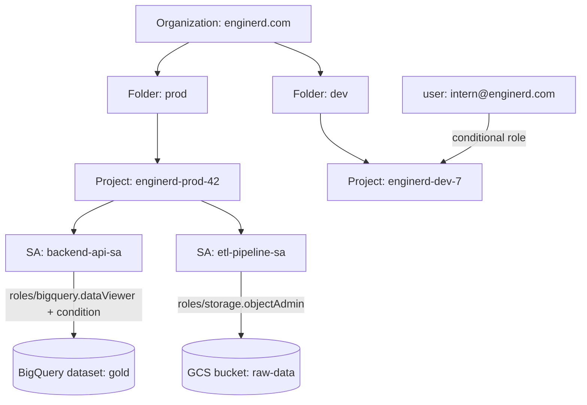

#### Interview Question

**Q:** "Tu service account JSON key kab use karega, aur kab nahi karega? Aur agar nahi karega toh alternative kya hai?"

**A:** Service account JSON key sirf tab use karunga jab workload GCP ke bahar chal raha ho aur koi dusra option na ho — jaise on-prem server se GCP API call karni ho, ya kisi third-party SaaS ko GCP me access dena ho jisme Workload Identity Federation possible nahi. Reason — JSON key ek long-lived credential hai. Agar yeh leak ho gayi (git me commit ho gayi, log me chhap gayi, laptop chori ho gaya), toh attacker ko unlimited time milta hai use karne ka, aur rotation manual hai. Yeh ek ticking time bomb hai.

Agar workload GCP ke andar hai — Compute Engine, GKE, Cloud Run, Cloud Functions — toh **attached service account** use karunga. Yahan GCP metadata server short-lived tokens issue karta hai (1 hour expiry), automatic rotation, koi key file kahin save nahi hoti. GKE me specifically **Workload Identity** use karunga jisme Kubernetes service account ko GCP service account se bind karte hain. Agar workload AWS ya Azure pe hai aur GCP access chahiye, toh **Workload Identity Federation** use karunga — wahaan AWS IAM role ya OIDC token ko GCP trust kar leta hai aur short-lived token issue karta hai, koi key file nahi. Bottom line — JSON keys 2026 me last resort hain, default nahi.

### 2.2 Compute Engine — instances, machine families, persistent disks

#### Definition

Compute Engine GCP ka IaaS layer hai — basically tu ek VM (virtual machine) request karta hai, GCP tujhe ek Linux/Windows box deta hai jisme tu kuch bhi run kar sakta hai. AWS EC2 ka direct counterpart. Har VM ek **machine type** ke saath aati hai (kitna CPU, kitni RAM), ek **boot disk** (Persistent Disk — PD), aur ek ya zyada **network interfaces** VPC me. Tu SSH karke andar ja sakta hai, apps deploy kar sakta hai, ya managed instance groups me autoscale kar sakta hai.

Analogy — Compute Engine ek hotel ki tarah hai. Machine families different categories of rooms hain — **E2** budget rooms (general purpose, sasta, cost-optimized), **N2/N2D** standard rooms (balanced, mostly yahi use hota hai), **C3/C3D** business class (compute-optimized, high CPU ke liye), **M3** suite (memory-optimized, SAP HANA jaise beasts ke liye), **A3/A2** presidential suite (GPU/TPU, ML training ke liye, paisa pani ki tarah jaata hai). Persistent Disk hotel ka locker hai — VM (room) chod do, locker (disk) bachata hai data. Boot disk se OS boot hota hai, additional data disks attach kar sakte ho.

#### Why?

Cloud Run aur Cloud Functions sab kuch handle nahi kar sakte. Agar tu legacy app chala raha hai jo specific OS dependencies maangti hai, ya GPU workload run kar raha hai, ya stateful service hai jiske paas long-running connections hain (game server, video transcoder), Compute Engine sahi choice hai. Persistent Disks region me replicate ho sakti hain (regional PD) — toh agar ek zone gir gaya, dusri zone me VM up kar ke wahi disk attach kar sakte ho, data safe rahega.

#### How?

```bash
# Ek e2-medium VM banao Mumbai region me, Debian 12 boot disk, 50GB SSD ke saath
gcloud compute instances create api-server-1 \
  --zone=asia-south1-a \
  --machine-type=e2-medium \
  --image-family=debian-12 \
  --image-project=debian-cloud \
  --boot-disk-size=50GB \
  --boot-disk-type=pd-ssd \
  --service-account=backend-api-sa@enginerd-prod-42.iam.gserviceaccount.com \
  --scopes=cloud-platform \
  --tags=http-server,https-server \
  --metadata=startup-script='#!/bin/bash
    apt-get update && apt-get install -y nginx
    systemctl start nginx'

# Extra data disk attach karo (database ya logs ke liye)
gcloud compute disks create api-data-disk \
  --size=200GB --type=pd-balanced --zone=asia-south1-a

gcloud compute instances attach-disk api-server-1 \
  --disk=api-data-disk --zone=asia-south1-a

# SSH karke check karo
gcloud compute ssh api-server-1 --zone=asia-south1-a

# Production me VM directly mat banao — Managed Instance Group (MIG) banao for autoscaling
gcloud compute instance-templates create api-template \
  --machine-type=e2-medium \
  --image-family=debian-12 --image-project=debian-cloud \
  --service-account=backend-api-sa@enginerd-prod-42.iam.gserviceaccount.com \
  --scopes=cloud-platform

gcloud compute instance-groups managed create api-mig \
  --base-instance-name=api \
  --template=api-template \
  --size=3 \
  --zone=asia-south1-a

# Autoscaler attach — CPU 60% se zyada hua toh scale up, max 10 tak
gcloud compute instance-groups managed set-autoscaling api-mig \
  --zone=asia-south1-a \
  --max-num-replicas=10 \
  --min-num-replicas=2 \
  --target-cpu-utilization=0.6
```

Tip — `e2` family ka CPU "shared core" hota hai chhote sizes me, jo unpredictable performance de sakta hai burst load me. Production API ke liye `n2-standard-2` se start kar, fir profile karke neeche utar.

#### Real-life Example

Ek video streaming startup tha — woh user-uploaded videos ko transcode karta tha (1080p ko 720p, 480p, 360p me convert). Yeh CPU-heavy aur burst-y workload hai. Solution — `c3-highcpu-8` VMs ka MIG, Spot instances pe (60-91% sasta on-demand se), Pub/Sub queue se job uthate the. Ek video aata, queue me message, MIG ka autoscaler queue depth dekh ke 2 se 50 VMs tak scale up karta, transcode hota, output GCS me jaata, MIG wapas 2 pe scale down. Spot VMs preempt ho sakti hain (GCP 30-second notice deke chheen leta hai), but kyunki kaam idempotent tha (same video dobara transcode kar sakte the), preemption se kuch fark nahi padta tha. Bill 70% kam ho gaya regular VMs ke comparison me.

#### Diagram

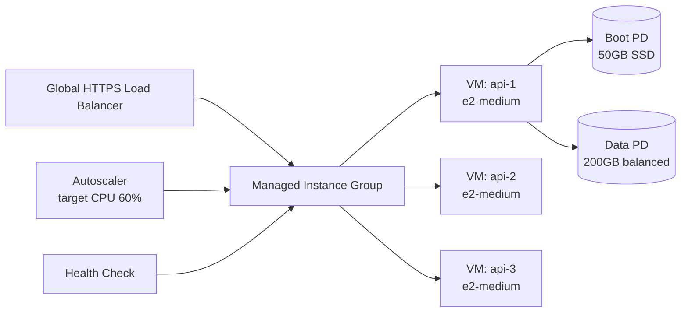

#### Interview Question

**Q:** "Persistent Disk ke types kya hain aur kab kaunsa choose karega? `pd-standard` vs `pd-balanced` vs `pd-ssd` vs `pd-extreme` ka practical difference batao."

**A:** GCP me 4 main PD types hain. **pd-standard** HDD-based hai, sabse sasta, but IOPS bahut kam (~0.75 IOPS/GB read). Yeh sirf cold archives, batch logs, ya backup volumes ke liye theek hai jahan throughput zyada matter karta hai latency se. **pd-balanced** SSD hai but cheaper than pd-ssd — most general workloads ke liye yeh sweet spot hai (web servers, app servers, dev databases). Default yahi rakhta hun jab tak specific reason na ho. **pd-ssd** high-performance SSD, zyada IOPS aur lower latency — production databases (Postgres, MongoDB self-hosted), heavy read/write apps ke liye. Cost double around hai pd-balanced ka.

**pd-extreme** ek special beast hai — provisioned IOPS, tu specifically IOPS number request karta hai (e.g., 100k IOPS). Yeh latency-sensitive enterprise databases (SAP HANA, mission-critical Oracle) ke liye hai jahan har microsecond count karta hai. Bahut mehenga, casual use case ke liye nahi. Practical decision tree — dev/test pe `pd-balanced`, prod app servers `pd-balanced` ya `pd-ssd`, prod database `pd-ssd`, archive/logs `pd-standard`, aur agar koi `pd-extreme` maang raha hai bina justification ke toh pehle puchhna hai "kya tumne IOPS measure kiya hai actual workload ka?" Aur ek aur point — Hyperdisk naam ki ek nayi family hai (Hyperdisk Extreme, Balanced, Throughput) jo C3/M3 jaisi modern machines ke saath aati hai aur PD families ko replace kar rahi hai gradually, toh new projects me Hyperdisk dekhna chahiye.

### 2.3 Google Cloud Storage (GCS) — buckets, classes, lifecycle

#### Definition

GCS GCP ka object storage hai — AWS S3 ka direct competitor. Tu file (image, video, JSON, parquet, kuch bhi) ek **bucket** me daalta hai, GCS use durable rakhta hai (11 nines durability — 99.999999999%) aur HTTP API ke through globally accessible banata hai. Buckets globally unique naam ke saath hote hain (jaise `enginerd-user-uploads`), aur har object ka ek unique path hota hai bucket ke andar. File system NAHI hai — yeh flat key-value store hai, "folders" sirf naming convention hain (`/` prefix matching).

Storage classes 4 hain — **Standard** (frequent access, regular files, default), **Nearline** (month me ek baar access, 30-day minimum storage), **Coldline** (90-day min, quarterly access), **Archive** (365-day min, sirf disaster recovery / compliance). Jaise jaise colder class jaata hai, storage cost girta hai but retrieval cost aur access latency badhta hai. Analogy — Standard tera kitchen counter (turant chahiye), Nearline kitchen cabinet (kabhi kabhi nikalta hai), Coldline garage ka box (kabhi kabhi saal me), Archive bank locker (sirf zaroorat padne pe, fee deke nikalta hai).

#### Why?

Buckets ka use case extremely broad hai — user uploads (profile pics, documents), backups, static website hosting, data lake (raw CSV/JSON/parquet for BigQuery), ML training data, logs archive, video assets, build artifacts. Lifecycle rules wahi par jaadu karte hain — tu ek baar rule likh deta hai "30 din ke baad Standard se Nearline, 90 din baad Coldline, 365 din baad Archive, 7 saal baad delete," aur GCS automatically files ko move karta rehta hai. Saalon ka cost optimization automate ho jaata hai.

#### How?

```bash
# Bucket banao — multi-region, Mumbai (asia-south1) ya asia multi-region
gcloud storage buckets create gs://enginerd-user-uploads \
  --location=asia-south1 \
  --default-storage-class=STANDARD \
  --uniform-bucket-level-access \
  --public-access-prevention

# File upload karo
gcloud storage cp ./avatar.png gs://enginerd-user-uploads/users/123/avatar.png

# Lifecycle policy file banao (lifecycle.json)
cat > lifecycle.json <<'EOF'
{
  "lifecycle": {
    "rule": [
      {
        "action": {"type": "SetStorageClass", "storageClass": "NEARLINE"},
        "condition": {"age": 30, "matchesStorageClass": ["STANDARD"]}
      },
      {
        "action": {"type": "SetStorageClass", "storageClass": "COLDLINE"},
        "condition": {"age": 90, "matchesStorageClass": ["NEARLINE"]}
      },
      {
        "action": {"type": "SetStorageClass", "storageClass": "ARCHIVE"},
        "condition": {"age": 365, "matchesStorageClass": ["COLDLINE"]}
      },
      {
        "action": {"type": "Delete"},
        "condition": {"age": 2555}
      }
    ]
  }
}
EOF

# Apply karo bucket pe
gcloud storage buckets update gs://enginerd-user-uploads --lifecycle-file=lifecycle.json

# Versioning enable karo (accidental delete se bachne ke liye)
gcloud storage buckets update gs://enginerd-user-uploads --versioning

# Signed URL generate karo — 15 min ke liye, frontend ko de do direct upload karne ke liye
gcloud storage sign-url gs://enginerd-user-uploads/uploads/file.png \
  --duration=15m \
  --http-method=PUT \
  --impersonate-service-account=upload-signer-sa@enginerd-prod-42.iam.gserviceaccount.com
```

Important note — `--uniform-bucket-level-access` aur `--public-access-prevention` default lagao. Pichhle saalon me bahut data leaks isi se hue ki kisi ne galti se bucket public kar diya ya per-object ACLs me garbar ho gayi. Uniform access se sirf IAM controls karta hai, ACLs disable ho jaate hain — clean.

#### Real-life Example

Ek edtech company ke paas crore documents hain — student assignments, project files, video lectures. Pattern observe kiya — recent 30 din ke files ko students roz access karte the (Standard sahi), uske baad 60-90 days me kabhi-kabhi (revision time pe), 90 days ke baad almost kabhi nahi (sirf archive value). Lifecycle setup kiya exactly upar wala — 30 din baad Nearline, 90 baad Coldline, 1 saal baad Archive, 7 saal baad delete (legal compliance ke liye). Pehle storage bill ~$8000/month tha pure Standard pe, lifecycle ke baad ~$1200/month ho gaya — 85% reduction with ZERO code change. Sirf ek JSON file commit ki, infra cost ka problem solve.

#### Diagram

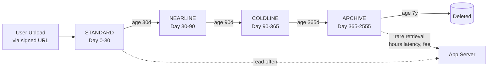

#### Interview Question

**Q:** "Bucket-level access vs object-level (ACL) access ka difference kya hai? Aur uniform access ko default kyun karte hain?"

**A:** Pehle GCS me dono modes the. **Uniform bucket-level access** me sirf IAM rules govern karte hain ki kaun kya kar sakta hai bucket aur uske objects pe — ACL totally disabled. **Fine-grained / object-level ACL** mode me har individual object pe alag se ACL set kar sakte ho — `make this one file public, this folder readable to specific email` types. Yeh flexible lagti hai but operational nightmare hai.

Uniform access default karte hain teen reasons se. **First**, security audit clean rehta hai — tu ek hi jagah (IAM policy) dekh ke decide kar sakta hai access kya hai. ACLs me har object check karna padta hai, jo automation ke saath asambhav hai bade buckets pe (lakhon objects). **Second**, accidental public exposure prevent hota hai — kisi ne galti se `allUsers: READ` ek object pe set kiya, woh public ho gaya, scanner bots use 24 hours me index kar lete hain, leak ho gaya. Combined with `--public-access-prevention`, bucket bilkul lockdown me rehta hai. **Third**, IAM Conditions sirf uniform mode me kaam karte hain — agar tujhe time-based ya attribute-based access chahiye toh ACL mode me yeh available nahi. Production me uniform default, ACL mode sirf bahut hi specific legacy migration scenario me.

### 2.4 BigQuery — serverless data warehouse, partitioning/clustering, SQL dialect

#### Definition

BigQuery GCP ka crown jewel hai — ek serverless, fully-managed petabyte-scale data warehouse. Serverless ka matlab — tu kabhi server, cluster, ya storage size manage nahi karta. Tu sirf SQL likhta hai, BigQuery underlying me Dremel engine pe distributed query chala leta hai (literally hazaaron machines pe parallel), aur seconds me result deta hai chahe table 10 GB ka ho ya 10 PB ka. Yeh internally Google ke Colossus storage aur Borg-style compute pe chalta hai — wahi tech jis pe Search chalta hai. Storage aur compute decoupled hain, alag bill hote hain.

Analogy — agar tera Postgres ek scooter hai (chhota, single rider, gali me theek), Snowflake aur Redshift cars hain (zyada log, manual size choose karna padta hai), toh BigQuery teleporter hai — query phenkho, answer turant, kahin se bhi. Catch yeh hai ki yeh OLTP nahi hai (frequent inserts/updates ke liye nahi), yeh **OLAP** hai — analytical queries ke liye built. SQL dialect "Standard SQL" hai (ANSI compliant + extensions). **Partitioning** matlab table ko date/integer column pe physical chunks me divide kar do — query sirf relevant chunks scan kare, full table nahi. **Clustering** matlab partition ke andar bhi data ko ek/zyada columns pe sort kar do — aur fast.

#### Why?

Pricing model unique hai — by default tu **per-TB scanned** pay karta hai ($6.25/TB on-demand, ya flat-rate slots reservation). Iska matlab agar tu accidentally `SELECT *` from 1 TB table chala diya, $6 udd gaye 1 query me. Isliye partitioning + clustering critical hai — proper setup se tu 1 TB table pe sirf 5 GB scan kar ke same answer la sakta hai. BigQuery ML bhi hai (SQL me directly model train karo), BI Engine hai (sub-second dashboards), aur native integrations hain Looker, Sheets, Data Studio se. Jab data team ko quick analytics chahiye bina infra babysit kiye, BigQuery default choice hai.

#### How?

```bash
# Dataset banao (ye logical container hai tables ka, schema/permissions yahaan attach hote hain)
bq --location=asia-south1 mk --dataset enginerd-prod-42:analytics

# Table banao with partitioning aur clustering
bq mk --table \
  --time_partitioning_field=event_time \
  --time_partitioning_type=DAY \
  --clustering_fields=user_id,event_type \
  enginerd-prod-42:analytics.user_events \
  event_time:TIMESTAMP,user_id:STRING,event_type:STRING,payload:JSON
```

```sql
-- Galat query — full table scan, paisa barbad
SELECT user_id, COUNT(*) AS events
FROM `enginerd-prod-42.analytics.user_events`
WHERE event_type = 'click'
GROUP BY user_id;

-- Sahi query — partition filter use karke sirf 7 days scan
SELECT user_id, COUNT(*) AS events
FROM `enginerd-prod-42.analytics.user_events`
WHERE event_time >= TIMESTAMP_SUB(CURRENT_TIMESTAMP(), INTERVAL 7 DAY)
  AND event_type = 'click'  -- clustering ka fayda yahan milega
GROUP BY user_id
ORDER BY events DESC
LIMIT 100;

-- Dry run karo pehle — yeh actually query nahi chalata, sirf btata hai kitna scan hoga
-- bq query --dry_run --use_legacy_sql=false 'SELECT ...'

-- Required partition filter enforce karo table pe — koi galti se full scan nahi maar sake
ALTER TABLE `enginerd-prod-42.analytics.user_events`
SET OPTIONS (require_partition_filter = TRUE);

-- Materialized view banao bahut common aggregation ke liye
CREATE MATERIALIZED VIEW `enginerd-prod-42.analytics.daily_clicks`
PARTITION BY DATE(event_day)
AS
SELECT
  TIMESTAMP_TRUNC(event_time, DAY) AS event_day,
  user_id,
  COUNT(*) AS click_count
FROM `enginerd-prod-42.analytics.user_events`
WHERE event_type = 'click'
GROUP BY event_day, user_id;
```

#### Real-life Example

Ek e-commerce company tha jo har order, click, page-view, cart event log karta tha — 50 million events/day, table ka size 5 TB pe pahuncha 6 mahine me. Pehle Postgres pe analytics chala rahe the — saare daily reports 4 ghante lagte the, peak time pe DB choke ho jaata tha. BigQuery me migrate kiya — events ko `event_time` pe daily partition kiya, `user_id` aur `product_id` pe clustering. Wahi 4-ghante wali queries ab 8 seconds me complete hoti hain. Aur kyunki partition filter mandatory hai, koi accidentally pura table scan nahi kar sakta. Monthly bill ~$300 hai for analytics (pehle Postgres replica ka cost $1500 tha sirf read load ke liye). Plus, business team ko Looker pe dashboards mile jo live BQ se chalti hain — engineers ko ETL pipeline maintain karne ki zaroorat khatam.

#### Diagram

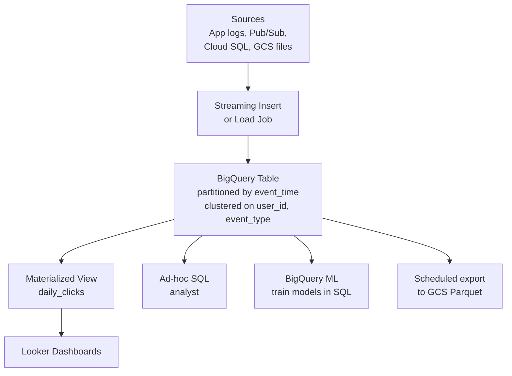

#### Interview Question

**Q:** "Partitioning aur Clustering ka difference samjhao. Dono kab use karoge ek hi table pe?"

**A:** Partitioning physical hai — BigQuery table ko underlying me actual separate chunks me divide karta hai based on partition key (most common: timestamp/date column daily, ya integer range). Jab tu query likhta hai `WHERE event_time BETWEEN x AND y`, BigQuery sirf un partitions ko scan karta hai — yeh **pruning** hai. 365-day table pe 7-day query matlab ~2% scan, ~98% bachat. Partitioning ka constraint — ek hi column pe partition kar sakte ho, aur cardinality limit hai (max 4000 partitions per table — daily partitioning means ~11 saal).

Clustering logical sorting hai partition ke andar. Tu 1 se 4 columns specify karta hai, BigQuery un columns pe data ko sort karke store karta hai blocks me. Jab tu `WHERE user_id = 'abc' AND event_type = 'click'` filter karta hai, BigQuery un blocks ko skip karta hai jinme yeh values nahi hain — yeh **block pruning** hai. Clustering kabhi exact pruning guarantee nahi karta (best-effort, but usually 80-95% effective on high-cardinality columns).

Dono saath use karte hain almost always production tables pe. Pattern — partition by date (almost har analytical table date-bound hota hai), cluster by 1-3 most-filtered high-cardinality columns. Common galti — sirf partition lagana, ya sirf clustering. Sirf partition lagaya toh date-range filter chahiye har query pe, but `user_id` filter slow rahega. Sirf clustering lagaya toh date queries pura table scan kar lengi. Combined setup me tu bahut aggressive cost optimization karta hai — production me typical setup ke saath, same query 50-100x sasti aur fast ho jaati hai.

### 2.5 Cloud Functions — serverless, Node/Python, triggers, gen 1 vs gen 2

#### Definition

Cloud Functions GCP ka FaaS (Function as a Service) offering hai — tu ek function likhta hai (HTTP handler, ya event handler), code deploy karta hai, aur GCP us function ko on-demand chalata hai jab koi trigger fire hota hai. Server tu kabhi nahi dekhta, scaling automatic hai (0 se 1000s instances tak), billing per-invocation aur per-second compute hota hai. Idle me $0 cost. Supported runtimes — Node.js, Python, Go, Java, .NET, Ruby, PHP. Triggers do main category — **HTTP** (REST endpoint), aur **event-driven** (GCS object create, Pub/Sub message, Firestore write, Eventarc se kuch bhi).

Analogy — Compute Engine ek hotel room hai jo tu poori raat ke liye book karta hai (paisa charge hota hai chahe so or jaag), Cloud Run ek serviced apartment hai (request aaya toh bill, idle me bhi thoda subscription), Cloud Functions ek pay-per-bite vending machine hai — sirf jab request aaya tab paisa, baki time literal $0. Code chhota hona chahiye, ek kaam karta ho, fast start ho, stateless ho.

**Gen 1 vs Gen 2** — Cloud Functions Gen 1 GCP ka original FaaS tha — limited: max 9 min execution, 1 concurrent request per instance, fewer triggers. **Gen 2** internally Cloud Run + Eventarc pe banaya gaya hai — max 60 min execution (HTTP), 1000 concurrent requests per instance (massive cost saving), Eventarc se 90+ event sources, larger instance sizes (16 GiB RAM, 8 vCPU). 2026 me **Gen 2 default hai aur Gen 1 deprecated hai** — naye projects me Gen 2 hi use karna hai, kuch saal me Gen 1 EOL hone wala hai.

#### Why?

Glue code, webhooks, lightweight APIs, image thumbnailing on upload, Pub/Sub message processors, scheduled jobs (Cloud Scheduler + Function), Slack bots — yeh sab Cloud Functions ka bread and butter hai. Operational overhead zero hai. Agar tera workload predictable aur high-throughput hai (24/7 high QPS), Cloud Run ya GKE sasta padega. But sporadic, event-driven, ya low-volume kaam ke liye Functions sabse efficient hai.

#### How?

```bash
# Project structure — chhota Node 20 function jo GCS upload pe thumbnail banata hai
# index.js
cat > index.js <<'EOF'
const functions = require('@google-cloud/functions-framework');
const { Storage } = require('@google-cloud/storage');
const sharp = require('sharp');

const storage = new Storage();

// CloudEvent handler — Gen 2 me yahi pattern hai
functions.cloudEvent('makeThumbnail', async (cloudEvent) => {
  const { bucket, name, contentType } = cloudEvent.data;

  // Skip agar already thumbnail hai (infinite loop se bachao!)
  if (name.startsWith('thumbnails/')) {
    console.log(`Skipping ${name}, already a thumbnail`);
    return;
  }
  if (!contentType?.startsWith('image/')) return;

  const file = storage.bucket(bucket).file(name);
  const [buffer] = await file.download();

  const thumbnail = await sharp(buffer)
    .resize(200, 200, { fit: 'cover' })
    .jpeg({ quality: 80 })
    .toBuffer();

  const thumbPath = `thumbnails/${name}`;
  await storage.bucket(bucket).file(thumbPath).save(thumbnail, {
    contentType: 'image/jpeg',
  });

  console.log(`Thumbnail created: ${thumbPath}`);
});
EOF

# Deploy as Gen 2 function with GCS trigger
gcloud functions deploy makeThumbnail \
  --gen2 \
  --runtime=nodejs20 \
  --region=asia-south1 \
  --source=. \
  --entry-point=makeThumbnail \
  --trigger-event-filters="type=google.cloud.storage.object.v1.finalized" \
  --trigger-event-filters="bucket=enginerd-user-uploads" \
  --service-account=thumbnail-sa@enginerd-prod-42.iam.gserviceaccount.com \
  --memory=512Mi \
  --cpu=1 \
  --max-instances=50 \
  --timeout=120s

# HTTP function deploy karne ka example
gcloud functions deploy webhookHandler \
  --gen2 \
  --runtime=python311 \
  --region=asia-south1 \
  --source=./webhook \
  --entry-point=handle_webhook \
  --trigger-http \
  --no-allow-unauthenticated \
  --memory=256Mi \
  --max-instances=10
```

#### Real-life Example

Ek SaaS company me Stripe integration tha. Stripe webhooks (subscription created, payment succeeded, payment failed) handle karne the — yeh bursty hain (mahine ki 1st aur 15th tarikh pe peak), idle 90% time. Pehle ek hamesha-running Node service rakhte the GKE pe — 2 pods always up, ~$80/month. Migrate kiya Cloud Functions Gen 2 pe — webhook URL ko Stripe me register kiya, function Pub/Sub me message daalta tha (idempotency aur retry safety ke liye), dusra function Pub/Sub se consume kar ke business logic chalata tha. Idle pe $0, peak pe automatic scale to 100 instances, total bill ~$3/month. Plus event-driven separation se code testable aur observable bana — har function ka apna log aur metric.

Dusra example — ek startup ka GCS upload pipeline tha jaha users PDF upload karte the. PDF aate hi function fire hota — text extraction (Tesseract OCR via library), language detection, BigQuery me metadata insert. Sab serverless. 50,000 PDFs/day — Functions Gen 2 ek instance pe 1000 concurrent requests handle kar leta hai (Gen 1 me 1 hi tha), toh sirf ~5 instances kaafi hote the, cold starts ka issue effectively khatam.

#### Diagram

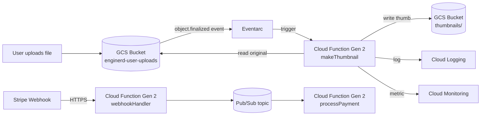

#### Interview Question

**Q:** "Cloud Functions Gen 2 vs Cloud Run — dono Cloud Run ke upar chalti hain ab. Tu kab kya choose karega?"

**A:** Yeh question 2026 me bahut common hai kyunki Gen 2 internally Cloud Run service hi banata hai, line dhundhli ho gayi hai. **Cloud Functions Gen 2** ek **opinionated wrapper** hai — tu sirf function likhta hai (handler signature), Google framework, runtime, base image, build pipeline sab handle karta hai. Tujhe Dockerfile nahi likhna padta, language-specific buildpack automatically apply hota hai. Ek function = ek deployable unit, ek trigger. Eventarc integration first-class hai. Best for — chhote, single-purpose, event-driven kaam jahaan tu boilerplate me time waste nahi karna chahta.

**Cloud Run** raw container platform hai — tu apna Dockerfile likhta hai (ya buildpack use kar sakta hai), full control hai over runtime, dependencies, base image, multi-route apps deploy kar sakta hai (ek service me poora Express ya FastAPI app), gRPC support hai, sidecar containers possible hain (Gen 2 me nahi). Best for — full microservices, multi-endpoint APIs, custom runtimes (Rust, custom Java setups), workloads jahan tujhe container internals control karne hain.

Practical decision — agar mera kaam ek function jaisa hai (ek event aaya, ek kaam karna hai, jaise webhook ya GCS trigger), Cloud Functions Gen 2 use karunga, kam boilerplate. Agar mera kaam ek poora HTTP service hai with multiple endpoints, custom dependencies, ya tight performance tuning, Cloud Run use karunga. Pricing aur scaling almost identical hain dono me (kyunki neeche same engine hai), toh choice operational complexity aur ergonomics pe banti hai. Gen 1 ka koi reason nahi naye projects me — wo deprecated path hai.

## Resources & further reading

- cloud.google.com/docs — official GCP documentation, sabse authoritative source
- cloud.google.com/iam/docs/best-practices-service-accounts — service accounts ke liye must-read
- cloud.google.com/bigquery/docs/best-practices-performance-overview — BigQuery cost & performance optimization
- cloud.google.com/storage/docs/lifecycle — GCS lifecycle rules deep dive
- cloud.google.com/functions/docs/concepts/version-comparison — Gen 1 vs Gen 2 official comparison
- cloud.google.com/architecture — reference architectures, real-world patterns
- `gcloud help` — local CLI reference, har command ka detail yahaan milega
- Google Cloud Skills Boost (cloudskillsboost.google) — hands-on labs, beginner se advanced tak
