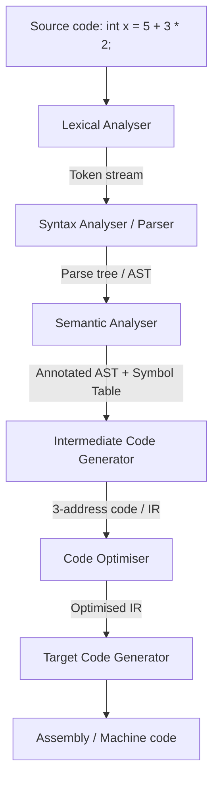
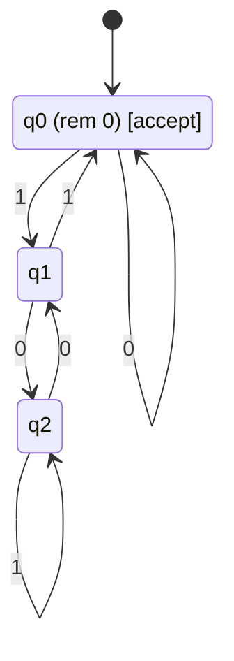
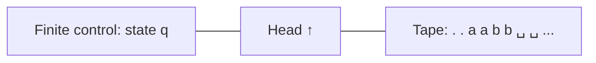

# Compiler Design + Theory of Computation — From Source Code to Undecidable Problems

Bhai, ye dono subjects ek hi sikke ke do pehlu hain. **Theory of Computation (TOC)** poochta hai *"machine kya kya compute kar sakti hai, aur kya kabhi nahi kar sakti?"* — pure math, regular languages se Turing machines tak. **Compiler Design** us theory ko production-grade engineering banata hai — finite automata se lexer, context-free grammar se parser, attribute grammars se semantic analysis, aur intermediate representations se machine code. TOC theorem hai, compiler uska implementation hai. Tu dono saath padhega, dono ek doosre ka light-bulb moment dega.

Iss subject ka iraada Layer-0 ka **last** hole bhar dena hai. GATE CSE pe Compiler ka 6-7 marks aur TOC ka 8-10 marks ka chunk hai — 15-marks ka guaranteed pool jo har year aata hai. Industry pe MS / Adobe / Google interview mein direct ask: *"Write a regex-to-DFA converter"*, *"Implement a recursive-descent parser for arithmetic"*, *"Prove halting problem is undecidable"*, *"Why is SAT NP-complete?"*. Iske baad Layer-0 100% complete — 12 of 12 foundations ready, upar building rakhna shuru kar sakta hai.

Voice rule: Hinglish narration, but jab formal language likhni hai — `L = {a^n b^n | n ≥ 0}`, transition function `δ : Q × Σ → Q`, productions `S → aSb | ε` — tab pure precise English. Math is unforgiving; grammars are unambiguous. A4 sheet, pen, aur ek dry-erase board agar ho to behtar — automata haath se draw karne se DFA-NFA equivalence brain mein actually settle hoti hai.

---

# PART 1 — COMPILER DESIGN

## 1. What compilers actually do

### 1.1 The 6-phase model

Compiler ek pipeline hai. Source code andar daal, target code bahar nikal. Beech mein 6 phases:



Phases:

1. **Lexical analysis (scanner)** — character stream ko tokens mein todta hai. `int x = 5;` → `KEYWORD(int) IDENT(x) ASSIGN INT_LIT(5) SEMI`.
2. **Syntax analysis (parser)** — tokens se parse tree banata hai using a CFG. Ye phase grammar errors detect karta hai.
3. **Semantic analysis** — type checking, scope resolution, declaration-before-use. *"`x + "hello"` is a type error"* yahan pakdi jaati hai.
4. **Intermediate code generation** — AST ko machine-independent IR mein convert karta hai (e.g., 3-address code).
5. **Optimisation** — IR ko faster / smaller banata hai without changing behaviour. Constant folding, dead-code elimination, loop invariant motion.
6. **Target code generation** — IR ko actual assembly / machine code mein turn karta hai. Register allocation aur instruction selection yahaan hote hain.

Pehle 3 phases ko **front-end** aur last 3 ko **back-end** kehte hain. Yahi reason hai ki LLVM jaisi project ek front-end (C, C++, Rust, Swift) aur ek back-end (x86, ARM, RISC-V) likh ke saare combinations cover kar leti hai.

### 1.2 Compiler vs interpreter vs JIT

| Aspect | Compiler | Interpreter | JIT |
|--------|----------|-------------|-----|
| Translation | Whole program once | Statement-by-statement | Hot paths at runtime |
| Output | Native binary | None (executes directly) | Native code in memory |
| Speed (run) | Fastest | Slowest | Near-native |
| Speed (start) | Slow (compile then run) | Instant | Medium |
| Examples | gcc, clang, Go, Rust | CPython baseline, Bash | V8 (JS), HotSpot (Java), PyPy |

Realistically, modern runtimes hybrid hote hain. **Java**: source → bytecode (compiler) → JVM (interpreter) → JIT'd hot methods (compiler again). **Python**: source → bytecode (`.pyc`) → CPython VM (interpreter); PyPy mein extra JIT layer. *Tu pure interpreter ya pure compiler shayad hi production mein dekhega.*

### 1.3 Worked example: `int x = 5 + 3 * 2;`

Phase by phase:

| Phase | Output |
|-------|--------|
| Lexer | `int`, `x`, `=`, `5`, `+`, `3`, `*`, `2`, `;` (9 tokens) |
| Parser | AST: `Decl(int, x, BinOp(+, 5, BinOp(*, 3, 2)))` (operator precedence respected) |
| Semantic | Type-check: `int` matches `5+3*2` (int). Symbol table: `x : int` added. |
| IR (TAC) | `t1 = 3 * 2; t2 = 5 + t1; x = t2;` |
| Optimised IR | Constant folding: `x = 11;` |
| Codegen (x86) | `mov DWORD PTR [rbp-4], 11` |

Yahi 6-phase walk-through interview mein "describe a compiler pipeline" ka standard answer hai.

---

## 2. Lexical Analysis — strings to tokens

### 2.1 Tokens vs lexemes vs patterns

- **Token** — categorical name. e.g., `IDENTIFIER`, `INT_LITERAL`, `KEYWORD_IF`.
- **Lexeme** — actual character sequence in source. e.g., `count`, `42`, `if`.
- **Pattern** — rule (regex) that defines all valid lexemes for a token.

Example mapping:

| Pattern | Lexeme examples | Token |
|---------|-----------------|-------|
| `[a-zA-Z_][a-zA-Z0-9_]*` | `count`, `_tmp`, `x1` | `IDENTIFIER` |
| `[0-9]+` | `42`, `0`, `100` | `INT_LITERAL` |
| `if` | `if` | `KEYWORD_IF` |
| `==` | `==` | `OP_EQ` |

Reserved words (`if`, `while`) are usually matched by the same pattern as identifier and then **looked up** in a keyword table — separate keyword regex har word ke liye DFA blow up kar deta hai.

### 2.2 Regular expressions as token spec

Lexer specifications regular expressions ki language mein likhi jaati hain because finite automata exactly recognise regular languages (TOC se yeh later). Operators:

- Concatenation: `ab`
- Union: `a | b`
- Kleene closure: `a*` — zero or more
- Positive closure: `a+` — one or more (≡ `aa*`)
- Optional: `a?` — zero or one (≡ `a | ε`)

Real C identifier regex: `[A-Za-z_][A-Za-z0-9_]*`. Floating-point literal: `[0-9]+(\.[0-9]+)?([eE][+-]?[0-9]+)?`.

### 2.3 NFA → DFA → minimised DFA

Compiler scanner build hota hai is pipeline se:

```
regex --(Thompson's construction)--> NFA --(subset construction)--> DFA --(Hopcroft)--> minimal DFA
```

- **Thompson's construction**: har regex operator ka equivalent NFA fragment hai (`a` = single edge, `a|b` = parallel paths, `a*` = ε-loops). Linear in regex size.
- **Subset construction**: NFA states ke subsets DFA states ban jaate hain. Worst-case 2^n blow-up but practically manageable.
- **Hopcroft's minimisation**: equivalent DFA states ko merge karta hai. O(n log n).

### 2.4 Hopcroft's algorithm (intuition)

Goal: find equivalence classes of states (do states equivalent agar har input string pe same accept/reject behaviour).

Steps:
1. Initial partition: 2 classes — accepting states `F` aur non-accepting `Q \ F`.
2. Refine: agar ek class ke kuch states alphabet symbol `a` pe alag-alag classes mein jaate hain, to woh class split kar do.
3. Repeat until no change.
4. Final classes = states of minimal DFA.

Example: a DFA with states `{0,1,2,3}`, accepting `{3}`, on input `a`:

| state | δ(state, a) |
|-------|-------------|
| 0 | 1 |
| 1 | 3 |
| 2 | 3 |
| 3 | 3 |

Initial: `{3} | {0,1,2}`. Refine: from `{0,1,2}`, on `a`, state 0 → 1 (in `{0,1,2}`), states 1,2 → 3 (in `{3}`). Split: `{3} | {1,2} | {0}`. From `{1,2}` on `a` both → 3, same class — stable. Final 3 states (1 less than original).

### 2.5 lex / flex

Industrial scanner generators. Spec format:

```lex
%{
#include "tokens.h"
%}
%%
[0-9]+              { yylval = atoi(yytext); return INT_LITERAL; }
[a-zA-Z_][a-zA-Z_0-9]*  { return lookup_keyword_or_ident(yytext); }
"=="                { return OP_EQ; }
"="                 { return ASSIGN; }
[ \t\n]+            ;   /* skip whitespace */
.                   { error("unknown char"); }
%%
```

Flex internally builds NFA → DFA → table-driven scanner in C. *Tu directly real compiler grade lexer 50 lines mein paa raha hai.*

---

## 3. Syntax Analysis — tokens to parse trees

### 3.1 Context-Free Grammars

> **Definition (CFG):** A CFG is a 4-tuple `G = (V, T, P, S)` where:
> - `V` = finite set of non-terminals (variables)
> - `T` = finite set of terminals (alphabet, disjoint from V)
> - `P` = finite set of productions of the form `A → α`, where `A ∈ V` and `α ∈ (V ∪ T)*`
> - `S ∈ V` = start symbol

Classic arithmetic grammar:

```
E → E + T | T
T → T * F | F
F → ( E ) | id
```

Yeh grammar `id + id * id` jaisi expressions parse karti hai with correct precedence (* binds tighter than +) and left-associativity.

### 3.2 Top-down: LL(1) parsing

LL(1) = scan **L**eft-to-right, produce **L**eftmost derivation, **1** token lookahead. Recursive-descent ka theoretical name.

Pehla problem: above grammar is **left-recursive** (`E → E + T`). Top-down parser infinite loop kar dega. Eliminate karo:

```
E  → T E'
E' → + T E' | ε
T  → F T'
T' → * F T' | ε
F  → ( E ) | id
```

Now tu ek `parseE`, `parseEPrime`, `parseT`, `parseTPrime`, `parseF` likh sakta hai — har function 1 token dekh ke decide karta hai konsi production lagani hai. That's recursive descent.

### 3.3 First and Follow sets — the GATE 2-marker

Predictive parsing ke liye chahiye **FIRST** (kaunse terminals se string A derive ho sakti hai) aur **FOLLOW** (A ke baad legal taur pe kaunsa terminal aa sakta hai).

> **FIRST(α)** = `{ a ∈ T ∪ {ε} | α ⇒* aβ or α ⇒* ε }`

> **FOLLOW(A)** = `{ a ∈ T ∪ {$} | S ⇒* αAaβ }` for non-terminal `A`. `$` denotes input end.

Computation rules (apply to fixed point):

**FIRST:**
1. `FIRST(a) = {a}` for terminal `a`.
2. For `A → ε`, add `ε` to `FIRST(A)`.
3. For `A → X1 X2 ... Xk`: add `FIRST(X1) \ {ε}` to `FIRST(A)`. If `ε ∈ FIRST(X1)`, also process `X2`, and so on. If all `Xi` derive `ε`, add `ε` to `FIRST(A)`.

**FOLLOW:**
1. `$ ∈ FOLLOW(S)`.
2. For `A → αBβ`: add `FIRST(β) \ {ε}` to `FOLLOW(B)`.
3. For `A → αB` or `A → αBβ` where `ε ∈ FIRST(β)`: add `FOLLOW(A)` to `FOLLOW(B)`.

Worked example for our arithmetic grammar:

| Symbol | FIRST | FOLLOW |
|--------|-------|--------|
| E | `{ (, id }` | `{ ), $ }` |
| E' | `{ +, ε }` | `{ ), $ }` |
| T | `{ (, id }` | `{ +, ), $ }` |
| T' | `{ *, ε }` | `{ +, ), $ }` |
| F | `{ (, id }` | `{ *, +, ), $ }` |

This is the GATE staple — practice 5 grammars with First/Follow till tu sleep mein bhi nikal sake.

### 3.4 LL(1) parse table

For each production `A → α`:
- For each `a ∈ FIRST(α) \ {ε}`: set `M[A, a] = A → α`.
- If `ε ∈ FIRST(α)`: for each `b ∈ FOLLOW(A)`: set `M[A, b] = A → α`.

Grammar is LL(1) iff no cell has 2+ entries (no conflicts).

Our arithmetic grammar's parse table (excerpt):

| | id | + | * | ( | ) | $ |
|---|---|---|---|---|---|---|
| E | E→TE' | | | E→TE' | | |
| E' | | E'→+TE' | | | E'→ε | E'→ε |
| T | T→FT' | | | T→FT' | | |
| T' | | T'→ε | T'→*FT' | | T'→ε | T'→ε |
| F | F→id | | | F→(E) | | |

No conflicts → grammar is LL(1) → predictive parser works.

### 3.5 Bottom-up: LR parsing

Bottom-up parsers tokens shift karte hain stack pe aur RHS match hone par reduce karte hain. **L**eft-to-right, **R**ightmost derivation in **reverse**.

Three flavours, in increasing power:

| Parser | Lookahead | States | Power | Real-world use |
|--------|-----------|--------|-------|----------------|
| **SLR(1)** | 1 | Same as LR(0) | Weakest LR | Rarely used |
| **LALR(1)** | 1 | Same as LR(0) (states merged) | Sweet spot | yacc, bison |
| **CLR(1)** / canonical LR(1) | 1 | Largest | Strongest LR(1) | Theoretical |

Power hierarchy: `LL(1) ⊂ SLR(1) ⊂ LALR(1) ⊂ CLR(1) ⊂ LR(k) ⊂ unambiguous CFGs`.

LALR(1) is the de-facto standard kyunki LR(1) ki power milti hai SLR(1) ke memory footprint mein.

### 3.6 Shift-reduce conflicts

Stack pe `...E + E` hai aur input mein `*` aaya. Do choices:
- **Shift** `*` (so next reduce will be `E * E`).
- **Reduce** `E + E → E` first.

Agar grammar precedence specify nahi karti (`E → E + E | E * E | id`) to woh **ambiguous** hai aur conflict aata hai. Solutions:
1. Rewrite grammar with separate `E`, `T`, `F` levels (Section 3.1) — best.
2. Yacc/bison directives: `%left '+'`, `%left '*'` (latter has higher precedence because declared later). Quick hack but works.

### 3.7 Parse tree vs AST

- **Parse tree** = full derivation tree, includes every grammar symbol used.
- **AST (Abstract Syntax Tree)** = compressed parse tree, keeps only semantically meaningful nodes.

For `id + id`, parse tree under our grammar: `E → E + T → T + T → F + T → id + T → id + F → id + id` (6 levels deep). AST: `BinOp(+, id, id)` (3 nodes).

Compiler internally AST hi use karta hai. Parse tree ek intermediate concept hai mostly textbook ke liye.

### 3.8 yacc / bison

Yacc spec format:

```yacc
%token IDENT NUMBER
%left '+' '-'
%left '*' '/'
%%
expr : expr '+' expr   { $$ = mk_binop('+', $1, $3); }
     | expr '*' expr   { $$ = mk_binop('*', $1, $3); }
     | '(' expr ')'    { $$ = $2; }
     | NUMBER          { $$ = mk_num($1); }
     | IDENT           { $$ = mk_ident($1); }
     ;
```

Bison generates an LALR(1) parser as a C function that calls back into your semantic actions via `$$` (synthesised) and `$n` (children). Yahi `gcc`'s C parser ke earlier versions ka backbone tha (newer GCC handwritten recursive-descent use karta hai for better diagnostics).

---

## 4. Semantic Analysis + Syntax-Directed Translation

### 4.1 Type checking and the symbol table

Parser ne syntax pakdi. Semantic phase poochta hai *"kya yeh program meaning rakhta hai?"*:
- **Declaration before use** — variable use hone se pehle declared ho.
- **Type compatibility** — `int x = "hello";` reject.
- **Scope rules** — inner `x` outer `x` ko shadow karta hai.
- **Function arity / argument types** — `printf("%d", "hi")` warning.

**Symbol table** = data structure mapping `name → (type, scope, offset, ...)`. Implementation usually a stack of hash maps — entering scope pushes a new map, exiting pops. Lookup walks down the stack.

### 4.2 Syntax-Directed Translation (SDT)

Idea: grammar productions ke saath **semantic actions** attach kar do. Parse karte time, har reduction par action chal jata hai aur AST/IR build hoti jaati hai.

Two attribute kinds:

- **Synthesised attributes**: bottom-up flow — child nodes ke values se parent compute hota hai. Bottom-up parsers (yacc) natural fit hain.
- **Inherited attributes**: top-down ya sibling-to-sibling — parent / left-sibling se compute hota hai. Useful for type info propagation.

Notation: `S.val` for synthesised, `T.in` for inherited.

### 4.3 Worked example: SDT for arithmetic

Grammar with synthesised `val`:

```
E → E1 + T   { E.val = E1.val + T.val }
E → T        { E.val = T.val }
T → T1 * F   { T.val = T1.val * F.val }
T → F        { T.val = F.val }
F → ( E )    { F.val = E.val }
F → num      { F.val = num.lexval }
```

Input `5 + 3 * 2`:
- `F.val = 5`, `T.val = 5`
- `F.val = 3`, `T1.val = 3`
- `F.val = 2`, `T.val = 3 * 2 = 6`
- `E1.val = 5`, `E.val = 5 + 6 = 11` ✓

Yeh hi calculator parser hai. Replace numeric `val` with **AST node pointers** aur tu compiler IR build kar raha hai. Replace with **3-address code emission** aur tu IR generator likh raha hai.

### 4.4 Type-checking inherited attribute example

```
D → T id   { id.type = T.type }    -- inherited
T → int    { T.type = INT }
T → float  { T.type = FLOAT }
```

`T.type` first compute hota hai, phir `id` ko inherit karta hai. Symbol table mein `id : T.type` insert ho jaata hai.

---

## 5. Intermediate Code + Optimisation

### 5.1 Three-address code (TAC)

TAC: at most 3 operands per instruction. `x = y op z`, `if x relop y goto L`, `goto L`, `param x`, `call f, n`, `return x`.

For `a = b * -c + b * -c`:

```
t1 = -c
t2 = b * t1
t3 = -c
t4 = b * t3
t5 = t2 + t4
a = t5
```

### 5.2 Quadruples / triples / indirect triples

| Representation | Format | Pros | Cons |
|----------------|--------|------|------|
| **Quadruple** | `(op, arg1, arg2, result)` | Easy to reorder (optimisation friendly) | More space |
| **Triple** | `(op, arg1, arg2)` — result implicit (triple index) | Compact | Reordering breaks references |
| **Indirect triple** | Triple table + pointer table | Reorderable + compact | Extra indirection |

Most production compilers use SSA-form quadruples (LLVM IR is essentially this).

### 5.3 DAG-based optimisation

Expression `a = b * -c + b * -c` ko DAG mein common subexpression `b * -c` ek hi node hota hai. Optimised TAC:

```
t1 = -c
t2 = b * t1
t5 = t2 + t2
a = t5
```

6 instructions → 4 instructions. **Common subexpression elimination (CSE)** is the technical name.

### 5.4 Loop optimisations

- **Loop-invariant code motion**: jo computation loop ke andar har iteration mein same hoti hai, woh bahar hoist kar do.
  ```c
  // Before
  for (int i = 0; i < n; i++) a[i] = x * y + i;
  // After (x*y is invariant)
  int t = x * y;
  for (int i = 0; i < n; i++) a[i] = t + i;
  ```
- **Strength reduction**: expensive op ko cheaper op se replace karo. `i * 4` inside loop → maintain `t = t + 4`.
- **Induction variable elimination**: linear functions of loop counter ko apne increment se replace karo.
- **Loop unrolling**: body ko 2× / 4× expand karke loop overhead kam karo.

GCC `-O2` ya LLVM `-O2` yeh sab automatically apply karte hain.

---

## 6. Code Generation

### 6.1 Target machine assumption

Textbook target: a load-store machine with general-purpose registers `R0..Rn`, instructions `LD`, `ST`, `ADD R, R, R`, `MUL R, R, R`, conditional/unconditional branches. Real target: x86-64 with 16 GP registers, complex addressing modes, SIMD; or ARM64; or RISC-V.

### 6.2 Register allocation as graph colouring

Variables ko registers assign karna problem: build an **interference graph** where nodes = variables, edges between variables that are **live at the same time** (i.e. cannot share a register). Color the graph with `k` colors where `k` = number of physical registers.

> **Theorem:** Graph k-colourability is NP-complete (we'll meet this in Part 2). Compilers use heuristics — Chaitin's algorithm: repeatedly remove nodes with degree < k, color them on the way back. Spill (use memory) when stuck.

Yeh wahi NP-completeness ka practical face hai jo TOC mein abstract feel hota hai.

### 6.3 Instruction selection

Same TAC `t = a + b` x86 mein `add eax, ebx` hai, but `t = a + 1` better as `inc eax`, aur `t = a * 2` as `shl eax, 1`. Tree-pattern matching algorithms (e.g., BURS) optimal selection karte hain.

---

# PART 2 — THEORY OF COMPUTATION

## 7. Why TOC matters

### 7.1 GATE weight

GATE CSE Section 6 = Theory of Computation. Consistent **8-10 marks** every year. Topics:
- Regular languages, finite automata, pumping lemma
- CFGs, PDAs, ambiguity, CNF
- Turing machines, decidability, undecidability
- Complexity classes (P, NP, NP-complete intro)

### 7.2 Foundation for everything

- **Compiler design** literally builds on regular and context-free languages — Part 1 ki har technique TOC ka direct application thi.
- **Complexity theory** — algorithms ka kaunsa class hai (P? NP? PSPACE?) yahaan se start hota hai.
- **Cryptography** — public-key crypto's hardness assumptions (factoring, discrete log) NP intermediate suspected hain. Computational complexity ke bina security claims arbitary hain.
- **Verification / formal methods** — model checking, termination proofs, decidability arguments — sab TOC.

Tu Google interview mein bhale hi formally Turing machine na bana, but jab interviewer poochega *"is this problem even solvable in poly time?"* — yahaan se tu answer derive karega.

---

## 8. Regular Languages and Finite Automata

### 8.1 DFA — Deterministic Finite Automaton

> **Definition:** A DFA is a 5-tuple `M = (Q, Σ, δ, q0, F)` where:
> - `Q` = finite set of states
> - `Σ` = finite input alphabet
> - `δ : Q × Σ → Q` = transition function (total function — exactly one next state)
> - `q0 ∈ Q` = start state
> - `F ⊆ Q` = set of accepting (final) states

Language accepted: `L(M) = { w ∈ Σ* | δ*(q0, w) ∈ F }` where `δ*` is the natural extension to strings.

Real example — DFA for "binary strings divisible by 3":



State `qi` = remainder when binary string interpreted as integer is `i mod 3`. `q0` is the only accepting state. Try `110` (= 6, divisible): q0 -1→ q1 -1→ q0 -0→ q0 ✓.

### 8.2 NFA — Non-deterministic Finite Automaton

> **Definition:** Like DFA but `δ : Q × Σ → P(Q)` — transition returns a **set** of states. Multiple choices, accept if **any** path ends in `F`.

NFA tighter to design but harder to execute directly. NFA for "strings ending in `01`":

```
States: {q0, q1, q2}, start q0, accept q2
δ(q0, 0) = {q0, q1}    -- non-deterministic: stay or move
δ(q0, 1) = {q0}
δ(q1, 1) = {q2}
δ(q2, 0) = {}
δ(q2, 1) = {}
```

### 8.3 ε-NFA and equivalence

Add ε-transitions (move without consuming input). All three accept the same class of languages — **regular languages**.

> **Theorem (Subset construction / Rabin-Scott):** For every NFA `N` with `n` states, there exists an equivalent DFA `M` with at most `2^n` states.

Construction: DFA states are subsets of NFA states. `δ_DFA(S, a) = ⋃_{q ∈ S} δ_NFA(q, a)`. Start = ε-closure of NFA start. Accept = subsets containing any NFA accept state.

### 8.4 Regular expressions ↔ FA

> **Kleene's Theorem:** A language is regular iff it can be described by a regular expression iff it is recognised by some FA (DFA / NFA / ε-NFA).

Two-way construction:
- Regex → ε-NFA via Thompson's construction (Section 2.3).
- DFA → regex via state elimination (Brzozowski's method).

### 8.5 Pumping lemma for regular languages

> **Lemma:** If `L` is regular, then `∃ p ≥ 1` (the pumping length) such that every string `s ∈ L` with `|s| ≥ p` can be split as `s = xyz` with:
> 1. `|y| ≥ 1`
> 2. `|xy| ≤ p`
> 3. `∀ i ≥ 0 : x y^i z ∈ L`

Use: prove a language is **not** regular by contradiction.

> **Application:** Show `L = {a^n b^n | n ≥ 0}` is not regular.
>
> **Proof:** Assume regular with pumping length `p`. Take `s = a^p b^p ∈ L`. Then `s = xyz` with `|xy| ≤ p` ⇒ `y` consists only of `a`s. Let `|y| = k ≥ 1`. Pump up: `xy^2z = a^{p+k} b^p ∉ L`. Contradiction. ∎

This `a^n b^n` language is the canonical witness — it's CFG-recognisable (next section) but not regular.

### 8.6 Closure properties

Regular languages are closed under:
- Union, intersection, complement
- Concatenation, Kleene star
- Reverse, homomorphism, inverse homomorphism

This is why you can compose regex / DFA freely without falling out of the regular class.

---

## 9. Context-Free Languages and Pushdown Automata

### 9.1 CFG recap

Definition we already saw in Section 3.1. Power: CFGs can describe `{a^n b^n | n ≥ 0}` (S → aSb | ε), `{ww^R}` palindromes, balanced parentheses (S → (S)S | ε) — all of which are **not** regular.

### 9.2 Derivations and parse trees

- **Leftmost derivation**: at each step, replace the leftmost non-terminal.
- **Rightmost derivation** (a.k.a. canonical): replace the rightmost.

For `S → aSb | ε`, derive `aabb`:

Leftmost: `S ⇒ aSb ⇒ aaSbb ⇒ aabb`.
Rightmost: `S ⇒ aSb ⇒ aaSbb ⇒ aabb` (here both same because grammar is "linear").

### 9.3 Ambiguity

A CFG is **ambiguous** if some string has 2+ distinct parse trees (equivalently, 2+ leftmost derivations). The dangling-else problem:

```
stmt → if expr then stmt
     | if expr then stmt else stmt
     | other
```

`if a then if b then s1 else s2` — does `else` bind to inner or outer `if`? Two parses → ambiguous. Real languages resolve by convention (else binds to nearest unmatched if) usually via grammar rewriting.

> **Theorem (undecidable):** "Is a given CFG ambiguous?" — undecidable. *Bhai, ambiguity check ke liye bhi machine nahi bana sakte universally. That's the power of TOC.*

### 9.4 Chomsky Normal Form (CNF)

> **CNF:** Every production has form `A → BC` (two non-terminals) or `A → a` (one terminal). `S → ε` allowed if `S` doesn't appear on any RHS.

Every CFL has an equivalent CNF grammar. CNF is the basis of the **CYK parsing algorithm** (O(n³) general CFG parsing).

### 9.5 Greibach Normal Form (GNF)

> **GNF:** Every production has form `A → aα` where `a` is a terminal and `α ∈ V*` (possibly empty).

GNF derivations are useful in PDA construction — every step consumes one input symbol.

### 9.6 Pushdown Automaton (PDA)

> **Definition:** PDA `P = (Q, Σ, Γ, δ, q0, Z0, F)`:
> - `Q, Σ, q0, F` as in DFA
> - `Γ` = stack alphabet
> - `Z0 ∈ Γ` = initial stack symbol
> - `δ : Q × (Σ ∪ {ε}) × Γ → P(Q × Γ*)` — reads input + stack top, transitions to new state and pushes a string onto stack.

PDA = NFA + a stack. The stack is what gives extra power over FA.

PDA for `L = {a^n b^n | n ≥ 0}`:
- On `a`: push `A`.
- On `b` while top is `A`: pop.
- Accept by empty stack at input end.

### 9.7 DPDA vs NPDA

- **DPDA (deterministic)** recognises the deterministic context-free languages (DCFL). Programming language syntax mostly DCFL hai — that's why LR parsers (Section 3.5) work.
- **NPDA (non-deterministic)** recognises **all** CFLs.

`{ww^R}` (even palindromes) is recognised by NPDA but **not** any DPDA — non-determinism strictly more powerful for PDAs (unlike for FAs).

### 9.8 CFG ↔ PDA equivalence

> **Theorem:** A language is context-free iff some NPDA accepts it.

Construction: from CFG in GNF, build a 1-state PDA that simulates leftmost derivation on the stack.

### 9.9 Pumping lemma for CFLs

> **Lemma:** If `L` is context-free, then `∃ p ≥ 1` such that every `s ∈ L` with `|s| ≥ p` can be written as `s = uvxyz` with:
> 1. `|vy| ≥ 1`
> 2. `|vxy| ≤ p`
> 3. `∀ i ≥ 0 : u v^i x y^i z ∈ L`

Use: show `L = {a^n b^n c^n | n ≥ 0}` is **not** context-free.

> **Sketch:** Assume CF with pumping length `p`. Take `s = a^p b^p c^p`. The window `vxy` of length ≤ p can span at most 2 of the 3 letter-blocks. Pumping disturbs the count of those 2 but leaves the 3rd unchanged → result has unequal counts → not in L. ∎

This is why a^n b^n c^n needs context-sensitive grammars (next type up in the hierarchy).

---

## 10. Turing Machines and Decidability

### 10.1 Standard TM

> **Definition:** TM `M = (Q, Σ, Γ, δ, q0, q_acc, q_rej)`:
> - `Q`, `q0` as before; `q_acc, q_rej ∈ Q` distinct halt states
> - `Σ ⊂ Γ` input alphabet ⊂ tape alphabet
> - `Γ` includes a blank symbol `␣ ∉ Σ`
> - `δ : (Q \ {q_acc, q_rej}) × Γ → Q × Γ × {L, R}` — read tape symbol, write new symbol, move head left or right, transition state.

Tape is infinite to the right (or both directions, equivalent). Head starts at position 0.



Computation: from `(q0, tape with input)`, apply `δ` repeatedly. **Accept** if reach `q_acc`, **reject** if reach `q_rej`, **loop** otherwise.

### 10.2 Variants — all equivalent in power

- **Multi-tape TM** — k tapes, k heads. Same languages as 1-tape (with quadratic slowdown).
- **Non-deterministic TM (NTM)** — `δ` returns set of next configurations. Same recognisable languages, but exponential slowdown to simulate on deterministic TM.
- **Two-way infinite tape** — equivalent to one-way infinite.
- **Universal TM (UTM)** — a single TM `U` that takes `<M, w>` (encoded TM + input) and simulates `M` on `w`. *Yeh hi modern computing ka theoretical foundation hai — your laptop is a UTM with a finite memory bound.*

> **Church-Turing thesis:** Anything that can be computed by an "intuitive algorithm" can be computed by a TM. Not a theorem (informal notion) — but no counterexample in 90 years.

### 10.3 Recognisable vs decidable

- **Recognisable (recursively enumerable, RE)**: TM `M` exists such that `M` accepts every `w ∈ L` and either rejects or **loops** on `w ∉ L`.
- **Decidable (recursive)**: TM `M` exists that **halts** on every input — accepts iff `w ∈ L`, otherwise rejects.

`Decidable ⊊ Recognisable`. Equivalently, `L` decidable iff both `L` and `L^c` are recognisable.

### 10.4 The Halting Problem

> **Definition:** `HALT = { <M, w> | M is a TM, M halts on input w }`.
>
> **Theorem (Turing, 1936):** HALT is **undecidable** — no TM can decide HALT.

> **Proof (diagonalisation):**
> Assume for contradiction TM `H` decides HALT: `H(<M, w>) = accept` if `M` halts on `w`, else `reject`.
> Build TM `D`: on input `<M>`, run `H(<M, <M>>)`. If `H` accepts, **loop forever**; if `H` rejects, **halt**.
> Now ask: does `D` halt on `<D>`?
> - If `D` halts on `<D>`, then by construction `H(<D, <D>>)` accepted, but then `D` was supposed to loop. Contradiction.
> - If `D` loops on `<D>`, then `H(<D, <D>>)` rejected, but then `D` was supposed to halt. Contradiction.
>
> Either way contradiction. ∴ `H` cannot exist. ∎

This is the most important theorem in CS. *Tu chahe Sun ka clock processor banaye, Google ka quantum chip lagaye — HALT decide nahi kar sakta. Period.*

### 10.5 Reduction proofs

Pattern: "L1 is undecidable. If we could decide L2, we could decide L1. ∴ L2 is undecidable."

Example: `EMPTY = { <M> | L(M) = ∅ }` — given a TM, is its language empty?

> **Reduction:** Suppose decider `R` for EMPTY. Given `<M, w>`, construct `M'` that on any input ignores it and simulates `M` on `w`. `L(M') = Σ*` if M halts on w, else `∅`. So `<M, w> ∈ HALT` iff `<M'> ∉ EMPTY`. Thus `R` would decide HALT — impossible. ∴ EMPTY undecidable.

### 10.6 Rice's Theorem

> **Theorem (Rice):** Any non-trivial property of the **language** recognised by a TM is undecidable.

"Non-trivial" = some TMs satisfy it, some don't. So "does this TM accept the empty language?", "does this TM accept exactly the primes?", "are these two TMs equivalent?" — all undecidable. *Compiler tester banane wala har dream Rice ne 1953 mein crush kiya.*

---

## 11. Chomsky Hierarchy

Languages classified by the kind of grammar / machine that recognises them. Strict containment chain:

```mermaid
flowchart TD
    T0[Type 0: Recursively Enumerable<br/>Grammar: unrestricted<br/>Machine: Turing machine]
    T1[Type 1: Context-Sensitive<br/>Grammar: αAβ → αγβ, |γ| ≥ 1<br/>Machine: Linear-Bounded Automaton]
    T2[Type 2: Context-Free<br/>Grammar: A → γ<br/>Machine: Pushdown Automaton]
    T3[Type 3: Regular<br/>Grammar: A → aB or A → a<br/>Machine: Finite Automaton]

    T0 --> T1
    T1 --> T2
    T2 --> T3
```

| Type | Languages | Closed under | Example membership-decidable? |
|------|-----------|--------------|-------------------------------|
| 0 | RE | union, concat, *, intersect, but **not** complement | Recognisable, not decidable |
| 1 | CSL | union, intersect, complement, concat, * | Decidable (in PSPACE) |
| 2 | CFL | union, concat, *; **not** intersect, **not** complement | Decidable in O(n³) |
| 3 | Regular | all boolean ops, concat, * | Decidable in O(n) |

Witness languages:
- Regular: `{a^n | n ≥ 0}`
- CFL but not regular: `{a^n b^n | n ≥ 0}`
- CSL but not CFL: `{a^n b^n c^n | n ≥ 0}`
- RE but not CSL: HALT
- Not RE: complement of HALT (`{<M,w> | M loops on w}`)

---

## 12. Computational Complexity

### 12.1 P, NP, NP-hard, NP-complete

> **P** = languages decidable by a deterministic TM in polynomial time `O(n^k)`.
>
> **NP** = languages decidable by a non-deterministic TM in polynomial time. Equivalently, languages with polynomial-time **verifiers** for "yes" instances.
>
> **NP-hard** = at least as hard as every problem in NP. Every NP problem reduces to it in polynomial time.
>
> **NP-complete** = NP ∩ NP-hard. The "hardest" problems in NP.

### 12.2 Polynomial-time reduction

`A ≤_P B` means: there exists polynomial-time computable `f` such that `x ∈ A ⇔ f(x) ∈ B`. If `A ≤_P B` and `B ∈ P`, then `A ∈ P`. Contrapositive: if `A` is NP-hard and `A ≤_P B`, then `B` is NP-hard.

### 12.3 Cook-Levin theorem

> **Cook-Levin (1971):** SAT (Boolean satisfiability) is NP-complete.

Significance: this is the **first** problem proven NP-complete from first principles (by direct simulation of an NTM with a Boolean formula encoding the computation tableau). Every other NP-complete proof reduces from SAT (or from something already proven NP-complete via SAT). One theorem unlocked the entire complexity zoo.

### 12.4 Classic NP-complete examples

| Problem | Statement | Reduction from |
|---------|-----------|----------------|
| **SAT** | Given Boolean formula φ, is there a satisfying assignment? | (Cook-Levin direct) |
| **3-SAT** | SAT restricted to 3 literals per clause | SAT |
| **CLIQUE** | Does graph G have a clique of size k? | 3-SAT |
| **INDEPENDENT SET** | Does G have an independent set of size k? | CLIQUE (complement graph) |
| **VERTEX COVER** | Does G have a vertex cover of size k? | INDEPENDENT SET (V \ IS = VC) |
| **HAMILTONIAN CYCLE** | Does G have a cycle visiting every vertex once? | VERTEX COVER |
| **TSP (decision)** | Given weighted G and bound B, is there a Hamiltonian cycle of total weight ≤ B? | HAMILTONIAN CYCLE |
| **SUBSET SUM** | Given integers and target T, is there a subset summing to T? | 3-SAT |
| **GRAPH k-COLOURING** | Can G be coloured with k colours such that no edge is monochromatic? | 3-SAT (when k ≥ 3) |

That last one is exactly the register-allocation problem from Section 6.2 — production compilers solve an NP-complete problem heuristically every time they compile your code.

### 12.5 P vs NP — the famous open question

> **Question:** Does `P = NP`?

If yes, every problem with a fast verifier has a fast solver — RSA broken, optimal scheduling trivial, mathematics largely automated. If no (the consensus belief), then there are problems fundamentally harder to solve than to verify.

Status: open since 1971. Clay Mathematics Institute Millennium Prize: $1,000,000 for resolution. Most theorists believe `P ≠ NP` but no proof exists.

> **The hierarchy you should remember:**
> `P ⊆ NP ⊆ PSPACE ⊆ EXPTIME`
> Every containment proper or open. Only **proven proper** so far: `P ⊊ EXPTIME` (time hierarchy theorem).

### 12.6 Coping with NP-hardness

In practice, NP-hard problem aaye to:
1. **Approximation algorithms** — guarantee within a factor of optimal. Vertex cover: 2-approx in poly time.
2. **Heuristics** — no guarantee but fast. Greedy, simulated annealing.
3. **Restricted instances** — 2-SAT in P (general SAT NP-complete). Tree-width restriction.
4. **Exponential but smarter** — branch-and-bound, SAT solvers (DPLL, CDCL) handle million-clause SAT routinely.
5. **Randomised** — Monte-Carlo / Las Vegas algorithms.

LLVM's register allocator uses heuristics; flight scheduling uses branch-and-bound; chip place-and-route uses simulated annealing. NP-hard ka jeevan mein matlab "exact answer impossible at scale, approximate ya restrict" — not "give up".

---

## 13. Top 25 Compiler + TOC interview questions

| # | Question | Sharp answer |
|---|----------|--------------|
| 1 | List the 6 phases of compilation. | Lexical, syntax, semantic, IR-gen, optimisation, codegen. |
| 2 | Difference between token, lexeme, pattern. | Token = category; lexeme = actual chars; pattern = regex defining lexemes. |
| 3 | Why do scanners use DFA not NFA directly? | DFA execution O(n) per char; NFA needs simulation set. |
| 4 | What does Thompson's construction do? | Regex → ε-NFA in linear time. |
| 5 | LL(1) vs LR(1) parser? | LL: top-down leftmost; LR: bottom-up rightmost-reverse. LR strictly stronger. |
| 6 | Eliminate left recursion from `A → Aα | β`. | `A → β A'`, `A' → α A' | ε`. |
| 7 | Compute FIRST / FOLLOW for `S → aB | bA, A → a, B → b`. | FIRST(S)={a,b}, FIRST(A)={a}, FIRST(B)={b}; FOLLOW(S)={$}, FOLLOW(A)=FOLLOW(B)={$}. |
| 8 | What's a shift-reduce conflict? | Parser cannot decide between shifting next token vs reducing current handle. |
| 9 | Synthesised vs inherited attribute? | Synth: bottom-up (child→parent); inherit: top-down/sibling. |
| 10 | What is 3-address code? | IR with at most 3 operands per instruction; e.g., `t1 = a + b`. |
| 11 | Why do compilers use SSA form? | Each variable assigned once → easier dataflow + optimisation. |
| 12 | How is register allocation modelled? | Graph k-colouring on interference graph; NP-complete. |
| 13 | NFA → DFA worst case states? | 2^n. |
| 14 | Prove `{a^n b^n}` not regular. | Pumping lemma; pump y (all a's) breaks count. |
| 15 | Why does NPDA > DPDA in power? | NPDA recognises all CFLs; DPDA only DCFLs. e.g. `ww^R` needs NPDA. |
| 16 | CNF restrictions? | Productions A → BC or A → a (plus optional S → ε). |
| 17 | What does Kleene's theorem state? | Regex, DFA, NFA, ε-NFA all recognise same class. |
| 18 | Pumping lemma for CFLs split form? | s = uvxyz, |vxy| ≤ p, |vy| ≥ 1, uv^ix y^iz ∈ L for all i. |
| 19 | State the halting problem. | Given <M,w>, does M halt on w? — undecidable. |
| 20 | What is Rice's theorem in one sentence? | Every non-trivial property of TM-recognised language is undecidable. |
| 21 | Difference between recognisable and decidable? | Decidable: TM halts on all inputs. Recognisable: TM halts only on yes-instances. |
| 22 | What is Cook-Levin's contribution? | Proved SAT NP-complete from first principles. |
| 23 | Give 4 NP-complete problems. | SAT, 3-SAT, CLIQUE, VERTEX COVER (also TSP, Subset Sum, k-Colouring). |
| 24 | If P = NP, what breaks? | RSA / discrete-log crypto; one-way functions imply P ≠ NP. |
| 25 | Where in Chomsky hierarchy is `{a^n b^n c^n}`? | Type 1 (context-sensitive); not type 2 (CFL pumping fails). |

---

## 14. Pre-exam checklist

### 14.1 Compiler 24-hour-before checklist

- [ ] 6-phase pipeline drawn with one example walk-through.
- [ ] Token / lexeme / pattern distinction stated cleanly.
- [ ] One regex → NFA → DFA → minimal-DFA full conversion practised.
- [ ] FIRST / FOLLOW computed for 2 grammars from scratch.
- [ ] LL(1) parse table constructed for one small grammar.
- [ ] LL(1) vs SLR(1) vs LALR(1) vs CLR(1) power hierarchy memorised.
- [ ] One SDT example (arithmetic eval or AST build) traced.
- [ ] 3-address code produced for `a = b * -c + b * -c` with CSE applied.
- [ ] Register allocation = graph colouring (NP-complete) recall.
- [ ] Loop invariant motion + strength reduction defined with example.

### 14.2 TOC 24-hour-before checklist

- [ ] DFA / NFA / ε-NFA formal 5-tuple definition.
- [ ] Subset construction example done on paper.
- [ ] Pumping lemma for regular: `{a^n b^n}` non-regularity proof rehearsed.
- [ ] Pumping lemma for CFL: `{a^n b^n c^n}` non-CFL proof rehearsed.
- [ ] CFG ↔ NPDA equivalence direction sketched.
- [ ] Halting problem diagonalisation proof verbalised in 60 seconds.
- [ ] Rice's theorem in one line.
- [ ] Chomsky hierarchy diagram with one witness language per layer.
- [ ] NP-complete chain: SAT → 3-SAT → CLIQUE → VERTEX COVER memorised.
- [ ] P vs NP statement + Clay prize anecdote ready.

### 14.3 Survival mantras inside the room

- TOC question pe — pehle definition, phir example, phir construction / proof. Definition skip kiya to interviewer rok dega.
- Compiler question pe — phase identify kar pehle, phir technique. *"Yeh syntax-phase ka kaam hai, LL(1) parse table approach lega"* line confidence dikhati hai.
- Undecidability ka koi question aaye — **diagonalisation** ya **reduction from HALT** — yahi do hammer hain. Pick one.
- Complexity question pe — NP-completeness claim ke liye 2 cheez dikhao: (1) NP membership (poly verifier), (2) NP-hardness (reduction from known NPC).

---

## What to learn next

Compiler Design + Theory of Computation solid ho gaya? Layer-0 ka 12th aur **last** foundation block lag gaya. Now you've got the full toolkit — math, OOP, DSA, OS, DBMS, Networks, Compiler, TOC. Build upward:

1. **`gate-cse`** — saare Layer-0 subjects ka GATE-style PYQ drilling. TOC + Compiler ka 15-mark guaranteed pool yahaan crystallise hoga. PYQs of last 10 years, topic-wise, with timing.
2. **`discrete-math-oop`** — agar Discrete Math ke recurrence relations / graph theory abhi rusty hain to refresh. Pumping lemma + automata ka math layer wahaan reinforced hai.
3. **`cpp-mastery`** — compiler internals samajhne ke baad C++ template metaprogramming, RAII, move semantics ka *"the compiler does this"* moment alag hi level ka hota hai.
4. **`system-design-basics`** — DSL design, query languages, custom parsers — Compiler ka knowledge directly real-world platform design mein use hota hai (think GraphQL, SQL planners, regex engines).
5. **`lld-design`** — Interpreter pattern, Visitor pattern, Composite pattern — sab AST traversal patterns hain. Compiler ke baad LLD ke ye GoF patterns "obvious" feel honge.
