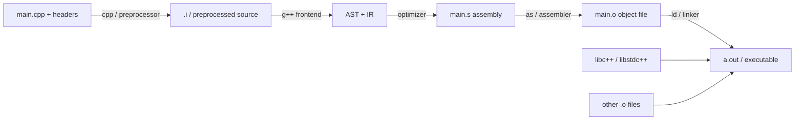

# C / C++ Mastery — From `cout << "hello"` to Production Systems

Bhai dekh, India mein engineering padhne wala har doosra banda C++ likhta hai — kyuki Codeforces pe 1900+ pahunchne ke liye Python ka 5x slowdown afford nahi kar sakte, kyuki ICPC regionals mein STL ke bina sochna mushkil hai, aur kyuki Flipkart / Atlassian / Sprinklr / Directi ke interview rounds mein "C++ likh sakte ho?" khud ek selection filter hai. Tu Java aur JavaScript aur Python is platform pe seekh chuka hai — par C++ ek alag mausam hai. Stack-heap khud manage karna padta hai, pointer ki galti se segfault aata hai, aur compile errors 80-line lambe template-spam ke roop mein milte hain.

Iss subject ka goal: tu `cout << "hello"` se shuru hoga, end mein tu **production-grade modern C++** likhega — RAII se memory safe, smart pointers se leak-proof, STL ka full arsenal, move semantics ka game samajh ke, aur DSA contest ka fast I/O ka pura tooling. Hum casual `using namespace std;` wala script-kid C++ se nikal ke wahaan jaayenge jahaan tu Codeforces pe purple ban sakta hai aur kal Atlassian ka systems team join kar sake.

> **Why C++ depth matters:** ICPC World Finals 2024 ke 95% solutions C++ thay. Codeforces ke top 100 Indian users — sab C++ pe. Indian gaming studios (Sumo Pune, Ubisoft Pune), HFT firms (Tower Research Mumbai, Graviton Bengaluru), aur systems teams (Nutanix, Sprinklr) — sab C++ pe ride karte hain. Agar tu sirf "syntax aata hai" wala C++ jaanta hai, tu DSA round bhi flunk karega. Real C++ — STL ki complexity yaad, RAII ki habit, smart pointer ka instinct — wo placement ke baad bhi pay karta hai.

Chai garam kar le, ye 1000+ lines ka safar hai. Modern **C++17 baseline** maan ke chal rahe hain (`auto`, structured bindings, `std::optional`); jahaan C++20/23 ka feature hai, alag se mark karenge. Compilers — `g++` (Linux/contests), `clang++` (Mac/sanitizer), `MSVC` (Windows IDE). Ham mostly `g++ -std=c++17 -O2 -Wall` assume karenge — wahi Codeforces pe chalega.

---

## 1. Why C++ — for DSA, for systems, for India

### 1.1 The DSA contest reality

Tu jab Codeforces / CodeChef / LeetCode pe baithta hai, language matter karti hai. Same algorithm, alag language, alag verdict.

| Language | Typical TL multiplier | STL/library quality | Verbosity | Best use |
|----------|----------------------|---------------------|-----------|----------|
| **C++** | 1x (the baseline) | World-class STL | Medium | Tight TL, heavy DS, ICPC |
| **Java** | 2-3x | Decent (Collections, TreeMap) | High | When you grew up on it |
| **Python** | 3-10x | Slow loops; numpy ok | Lowest | Easy problems, prototyping |
| **Kotlin/JS** | 2x | Limited contest libraries | Medium | Niche |

Jab problem ka constraint `n = 10^7` ho aur TL 1 second ho, Python `for` loop hi 5+ seconds le lega. Same problem C++ mein 0.3 seconds. Iska matlab algorithm sahi hone ke baawjood Python AC nahi karega — language tax hai. Codeforces pe round ke top 50 mein Python wala ek bhi nahi milta, sab C++.

### 1.2 The STL advantage

C++ ki Standard Template Library = **competitive programmer ki Bible**. Ek line mein:

```cpp
sort(arr, arr + n);                            // O(n log n) introsort
unordered_map<int, int> freq;                  // O(1) average hash
set<int> sortedSet;                            // O(log n) ordered
priority_queue<int, vector<int>, greater<>> minHeap;  // min-heap
auto it = lower_bound(v.begin(), v.end(), x);  // first >= x in sorted v
```

Java mein wahi karne ke liye `Comparator` lambda + `TreeMap` + `PriorityQueue<>(...)` likhna padta hai. Python mein `heapq` ke functions C-style hain, OOP nahi. STL = battle-tested, complexity-guaranteed, intent-clear.

### 1.3 When to choose C++ vs Java vs Python in interviews

Decision tree:

- **Codeforces / ICPC / heavy DS round** → C++. STL + speed jeetenge.
- **TCS NQT / Infosys / Wipro coding round** → Python ya Java. Problem easy hain, readability matters more.
- **Product company DSA round (Amazon, Flipkart)** → C++ ya Java. Interviewer dono se comfortable. Tu jisme fluent hai.
- **System design round** → language-agnostic. Pseudocode ya jo bhi tu likh sake fast.
- **Embedded / OS / Compiler / Game / HFT role** → C++ ya C. No alternative.

> **Pitfall:** Interview mein C++ likh ke `vector<int>` ka `.push_back()` ka complexity nahi pata — that's a red flag. Language choose karne se pehle uska runtime model samajh.

### 1.4 Indian contest culture

CodeChef (Directi, Bengaluru) ne ek pura generation banaya — Long Challenge, Cookoff, Lunchtime. Codeforces (Russian) pe Indian rank list ke top sab ICPC ke regulars hain. Ek typical roadmap:

1. Class 10/11 mein C++ basics (CBSE / ICSE syllabus)
2. College year 1: Codeforces handle, 800-rated problems
3. Year 2: ICPC India regionals (Amritapuri / Kanpur / Gwalior)
4. Year 3: 1600+ rating, Google Kickstart, Meta Hacker Cup
5. Final year: top product company internships → full time

Iss safar ka 80% C++ pe hota hai. Tu agar yeh pata kar le ki "STL me kya hai aur kya nahi", tu 70% problems pe head start mil gaya.

---

## 2. Compilation model — preprocess → compile → assemble → link

### 2.1 The pipeline

C++ ka source-to-binary safar 4 stages mein hota hai. Yeh samajhna build errors debug karne mein bachata hai.



### 2.2 Stage by stage

**1. Preprocessor (`cpp`)** — text-level. Replaces `#include`, expands `#define`, evaluates `#if/#ifdef`. Output is a single huge C++ source.

```bash
g++ -E main.cpp -o main.i      # see preprocessed output (often 50,000+ lines after <bits/stdc++.h>)
```

**2. Compiler frontend** — parses C++, builds AST, type-checks, emits intermediate representation.

```bash
g++ -S main.cpp -o main.s      # stop after assembly generation
```

**3. Assembler (`as`)** — turns assembly into machine code in an object file.

```bash
g++ -c main.cpp -o main.o      # compile to .o, don't link
```

**4. Linker (`ld`)** — combines `.o` files + libraries, resolves symbols, produces executable.

```bash
g++ main.o util.o -o app -lstdc++   # link
```

### 2.3 The build flags you must know

```bash
g++ -std=c++17        # language standard (use c++17 baseline; c++20 if compiler supports)
    -O2                # optimization level (O0 debug, O2 release, O3 aggressive)
    -Wall -Wextra      # all warnings — fix them, don't ignore
    -g                 # debug symbols (for gdb)
    -fsanitize=address # AddressSanitizer — catches use-after-free, OOB reads
    -fsanitize=undefined  # UBSan — catches signed overflow, null deref
    -DLOCAL            # define a macro (for local debug `#ifdef LOCAL`)
    main.cpp -o main
```

> **Contest tip:** `g++ -std=c++17 -O2 -Wall -Wshadow -fsanitize=address,undefined main.cpp -o main` is the sane local-test command. Codeforces uses `-O2 -std=c++17`.

### 2.4 Header vs source — separation

C++ historically separates declarations (`.h` / `.hpp`) from definitions (`.cpp`). Why?

- Header is **included** in many translation units → if you put a function body there, you get duplicate-symbol linker errors (unless `inline` or template).
- Source is **compiled once** into one `.o` file.

```cpp
// math_utils.hpp -- declarations only
#pragma once
namespace mu {
    int gcd(int a, int b);
    template<typename T> T sq(T x) { return x * x; }   // template = must be in header
}

// math_utils.cpp -- definitions
#include "math_utils.hpp"
namespace mu {
    int gcd(int a, int b) { return b == 0 ? a : gcd(b, a % b); }
}

// main.cpp
#include "math_utils.hpp"
int main() { return mu::gcd(12, 18); }     // links against math_utils.o
```

Build: `g++ math_utils.cpp main.cpp -o app`.

### 2.5 Include guards vs `#pragma once`

Headers ko multiple times include hone se bachao — warna double-declaration error. Two options:

```cpp
// Option 1: classic include guard (portable, slightly verbose)
#ifndef MATH_UTILS_HPP
#define MATH_UTILS_HPP
// ... declarations
#endif

// Option 2: #pragma once (non-standard but supported on g++/clang/MSVC — modern default)
#pragma once
// ... declarations
```

Modern code 99% uses `#pragma once`. Compile-time slightly faster (compiler tracks the file, doesn't re-scan).

### 2.6 The competitive programming hack — `<bits/stdc++.h>`

```cpp
#include <bits/stdc++.h>     // GCC-only meta-header that pulls EVERY standard header
using namespace std;
```

Sirf contests mein use kar — production code mein **never**. Reasons:
- Compile time blow up (50-100k lines of header)
- Non-standard (clang/MSVC pe kaam nahi karta out of the box)
- Pollutes namespace via `using namespace std;`

Production mein har needed header alag include kar — `<vector>`, `<string>`, `<algorithm>`.

---

## 3. Pointers + References — the heart of C++

### 3.1 What is a pointer?

Pointer = ek variable jo memory address store karta hai. Stack pe ya heap pe kahin bhi rakhi cheez ka address le sakta hai.

```cpp
int x = 42;
int* p = &x;           // p stores address of x
cout << p;             // 0x7ffd... (some address)
cout << *p;            // 42        (dereference — read the value at that address)
*p = 100;              // mutate x via pointer
cout << x;             // 100
```

Pointer ko declare karte time `*` type ke saath jude — `int* p` matlab "p is pointer to int". Variable name ke saath nahi — yeh historical confusion hai. C-style `int *p` bhi same hai, par modern style `int* p` zyada honest.

### 3.2 Null pointers

C++11 ke baad `nullptr` use kar — purana `NULL` (jo `0` ka macro tha) bug-prone hai.

```cpp
int* p = nullptr;        // valid: p points to nothing
if (p != nullptr) *p = 5; // safe-guard
*p = 5;                   // ❌ undefined behaviour — SEGFAULT runtime crash

// Older code (DON'T write new code like this):
int* q = NULL;            // = 0; ambiguous in overload resolution
int* r = 0;               // legacy null
```

> **Interview classic:** "Difference between `NULL` and `nullptr`?" — `nullptr` has type `std::nullptr_t`; `NULL` is `0` integer. So `f(int)` vs `f(int*)` overload — `nullptr` picks pointer, `NULL` picks `int`. Always `nullptr`.

### 3.3 Pointer arithmetic

Pointers ke saath `+`, `-`, `++`, `--` legal hain — par pointed-to type ke "size" mein jump hota hai.

```cpp
int arr[5] = {10, 20, 30, 40, 50};
int* p = arr;            // arr decays to &arr[0]
cout << *p;              // 10
cout << *(p + 1);        // 20  (jumps sizeof(int) = 4 bytes)
cout << *(p + 3);        // 40
p += 2; cout << *p;      // 30

// arr[i] is literally syntactic sugar for *(arr + i)
// So 3[arr] is also 30 (legal but cursed)

// Pointer subtraction returns a "ptrdiff_t" — number of elements between
int* end = arr + 5;
cout << (end - arr);     // 5
```

### 3.4 Pointer to pointer

```cpp
int x = 5;
int* p = &x;
int** pp = &p;           // pp points to p

cout << **pp;            // 5
**pp = 99;               // x is now 99
```

Real use: dynamic 2D arrays (rare in modern code — use `vector<vector<int>>`), or modifying a pointer inside a function.

### 3.5 References — pointer's polite cousin

A reference = an alias for an existing variable. Once bound, it cannot be re-seated to another variable. Cannot be null. Syntactically used like the variable itself.

```cpp
int x = 10;
int& r = x;              // r is now another name for x
r = 20;                  // x is also 20
cout << &r << " " << &x; // same address

int& bad;                // ❌ compile error: must initialize
int& z = nullptr;        // ❌ no such thing as null reference
```

### 3.6 References vs pointers — when to pick which

| Need | Pointer | Reference |
|------|---------|-----------|
| Reseatable (point to A then B) | Yes | No |
| Can be null | Yes | No |
| Pointer arithmetic | Yes | No |
| In function params (no copy) | Yes (`int*`) | Yes (`int&`) — **prefer this** |
| Optional output param | Yes (`int* out`) | Use `std::optional` |
| Linked list / tree node `next` | Yes | No (cannot be reseated) |
| Range-based for loop | No | Yes (`for (auto& x : v)`) |

Modern rule of thumb: **prefer references in function signatures unless null is meaningful**. For data structure links (next, parent), use pointers (or `std::shared_ptr`).

### 3.7 Common pointer bugs

#### a) Dangling pointer — points to freed/out-of-scope memory

```cpp
int* makeBad() {
    int x = 5;
    return &x;           // ❌ x dies when function returns; pointer dangles
}

int* p = makeBad();
cout << *p;              // undefined behaviour — sometimes 5, sometimes garbage, sometimes crash
```

#### b) Use-after-free

```cpp
int* p = new int(10);
delete p;
cout << *p;              // ❌ memory freed, but p still holds the address — UAF
p = nullptr;             // hygiene: zero out after delete
```

#### c) Double-free

```cpp
int* p = new int(10);
delete p;
delete p;                // ❌ undefined; usually crashes
```

#### d) Memory leak — forgot to delete

```cpp
void leaky() {
    int* p = new int[1000];
    // ... no delete[] — leaks 4KB every call
}
```

> **Modern fix for ALL FOUR:** use smart pointers (`unique_ptr`, `shared_ptr`) — Section 8. In 2026, raw `new`/`delete` mostly belongs in legacy code or extreme low-level scenarios.

### 3.8 Worked example — singly linked list traversal

```cpp
struct Node {
    int data;
    Node* next;
    Node(int x) : data(x), next(nullptr) {}
};

void printList(Node* head) {
    for (Node* cur = head; cur != nullptr; cur = cur->next)
        cout << cur->data << " -> ";
    cout << "NULL\n";
}

int main() {
    Node* a = new Node(1);
    a->next = new Node(2);
    a->next->next = new Node(3);
    printList(a);          // 1 -> 2 -> 3 -> NULL
    // (cleanup elided — see smart pointer section)
}
```

### 3.9 Worked example — swap two ints

Three flavours — see how pointer / reference / pass-by-value differ.

```cpp
void swapVal(int a, int b) { int t = a; a = b; b = t; }    // ❌ no effect on caller
void swapPtr(int* a, int* b) { int t = *a; *a = *b; *b = t; }
void swapRef(int& a, int& b) { int t = a; a = b; b = t; }   // cleanest

int x = 3, y = 7;
swapVal(x, y);  cout << x << " " << y;   // 3 7   (unchanged — wrong)
swapPtr(&x, &y); cout << x << " " << y;  // 7 3   (right but caller passes &)
swapRef(x, y);   cout << x << " " << y;  // 3 7   (right and clean)
```

STL: `std::swap(x, y)` already exists — use that.

### 3.10 Worked example — dynamic array (the C-style way)

```cpp
int n = 100;
int* arr = new int[n];           // heap allocation
for (int i = 0; i < n; i++) arr[i] = i * i;
cout << arr[42];                 // 1764

delete[] arr;                    // MUST use delete[] for arrays (not delete)
arr = nullptr;
```

Modern: `std::vector<int> arr(n);` — auto-resizing, exception-safe, RAII. Use vector. Always.

---

## 4. Memory model — stack, heap, RAII

### 4.1 Where does data live?

```text
+--------------------+ high address
|       stack        |  <- grows DOWN; local vars, function frames
|         |          |
|         v          |
|                    |
|         ^          |
|         |          |
|        heap        |  <- grows UP; new/malloc allocations
+--------------------+
|        BSS         |  <- uninitialized globals/statics
+--------------------+
|        data        |  <- initialized globals/statics
+--------------------+
|        text        |  <- machine code (read-only)
+--------------------+ low address
```

### 4.2 Stack vs heap — properties

| Property | Stack | Heap |
|----------|-------|------|
| Allocation speed | O(1) — pointer bump | O(log n) — free-list lookup |
| Size | Small (~1-8 MB by default) | Large (up to system RAM) |
| Lifetime | Auto — ends with scope | Manual — until `delete` / smart pointer dies |
| Allocator | Compiler emits `sub rsp, N` | `new`/`malloc` calls runtime |
| Crash mode | Stack overflow (deep recursion, big arrays) | Segfault on bad access; OOM on full heap |
| Cache friendliness | Hot, contiguous | Scattered, can miss |

> **Contest gotcha:** Local `int dp[10'000'000]` overflows the stack on Codeforces (8 MB default). Solution: declare it global, or `vector<int> dp(10'000'000)` (heap-allocated under the hood).

### 4.3 `new` / `delete` vs `malloc` / `free`

| Operator | Returns | Calls constructor? | Throws on fail? | Pair with |
|----------|---------|---------------------|-----------------|-----------|
| `new T` | `T*` typed | Yes | Yes (`std::bad_alloc`) | `delete` |
| `new T[n]` | `T*` typed | Yes (n times) | Yes | `delete[]` |
| `malloc(size)` | `void*` | No | No (returns `nullptr`) | `free` |

```cpp
// C++ way
Foo* f = new Foo(42);
delete f;

Foo* arr = new Foo[10];
delete[] arr;            // [] matters! Otherwise UB

// C way (avoid in C++ code unless interfacing C library)
Foo* g = static_cast<Foo*>(malloc(sizeof(Foo)));
new (g) Foo(42);          // placement new — manually call constructor
g->~Foo();                // manually call destructor
free(g);
```

> **Rule:** Never mix. `new` ⇄ `delete`, `new[]` ⇄ `delete[]`, `malloc` ⇄ `free`. Mixing = UB.

### 4.4 RAII — Resource Acquisition Is Initialization

C++ ka **most important idiom**. Idea: resource (memory, file, lock, socket) ki lifetime ko object ki lifetime se baandh do. Constructor mein acquire, destructor mein release. Stack unwinding (scope exit, exception) automatically destructor call karta hai → resource leak nahi hota.

```cpp
class FileHandle {
    FILE* fp;
public:
    FileHandle(const char* path) { fp = fopen(path, "r"); }
    ~FileHandle()                { if (fp) fclose(fp); }
    // disable copy (Rule of 5; see OOP section)
    FileHandle(const FileHandle&) = delete;
    FileHandle& operator=(const FileHandle&) = delete;
};

void readFile() {
    FileHandle f("data.txt");
    // ... use f.fp ...
    if (errorCondition) throw std::runtime_error("oops");
    // even if exception thrown, ~FileHandle() runs → fclose called
}
```

STL types are RAII: `std::vector` frees its buffer in destructor, `std::lock_guard` releases mutex, `std::ifstream` closes file. **You almost never write `new`/`delete` in modern C++** because RAII types do it for you.

### 4.5 Why manual memory bites in production

Real bugs from real codebases (anonymized):

1. **Trade engine** — A Mumbai HFT firm's L2 order book shipped with a code path where on rare disconnect, a `Side*` pointer was deleted twice → segfault → process restart → 4 ms of missed market data → ~₹40 lakh slippage on that day. Fix: `unique_ptr<Side>`.

2. **Game engine** — A Pune studio's particle system leaked `~3 KB/frame` because a `delete` was inside a `continue` branch. Heap grew until OS killed the game after 6 hours. Fix: `vector<Particle>`.

3. **Embedded firmware** — A Bengaluru IoT startup's MQTT client double-freed a buffer on retry path → crash → device bricked → factory recall.

Modern C++ (smart pointers + STL containers + RAII) eliminates 95% of these. Section 8 ke baad tu likhega is style mein.

### 4.6 Move vs copy — preview

When you write `vector<int> b = a;`, the buffer of `a` is **deep-copied**. When you write `vector<int> b = std::move(a);`, the buffer pointer is **stolen** — `a` becomes empty, `b` owns it. We cover this in detail in Section 10 — it's why modern C++ is fast.

---

## 5. STL Containers — the heart of C++ DSA

STL has **sequence containers**, **associative containers**, and **container adaptors**. Know complexity by heart — interviewer asks.

### 5.1 `std::vector` — the dynamic array (your default)

```cpp
#include <vector>
vector<int> v;                    // empty
vector<int> v2(10, 0);            // 10 zeros
vector<int> v3 = {1, 2, 3, 4};    // initializer list
vector<vector<int>> grid(n, vector<int>(m, 0));   // 2D, n x m

v.push_back(5);                   // amortized O(1)
v.pop_back();                     // O(1)
v.size();                         // O(1)
v[0]; v.front(); v.back();        // O(1)
v.at(i);                          // O(1) but bounds-checked → throws std::out_of_range
sort(v.begin(), v.end());         // O(n log n)
v.insert(v.begin() + 2, 99);      // O(n) — shifts elements
v.erase(v.begin() + 2);           // O(n)
v.clear();                        // O(n)
```

Vector grows by **doubling capacity** (`reserve` to avoid reallocs if you know size). Random access is O(1) — just `data() + i`. Cache-friendly. **9 out of 10 times, vector is the right choice.**

### 5.2 `std::array` — fixed-size, stack-allocated

```cpp
#include <array>
array<int, 5> a = {1, 2, 3, 4, 5};   // size known at compile time
a[3]; a.size();                       // O(1); size is constexpr
sort(a.begin(), a.end());
```

Better than C arrays — knows its size, has iterators, copyable. Use when size is fixed.

### 5.3 `std::list` — doubly linked list

```cpp
#include <list>
list<int> l = {1, 2, 3};
l.push_front(0);                  // O(1)
l.push_back(4);                   // O(1)
auto it = l.begin();
advance(it, 2);
l.insert(it, 99);                 // O(1) at iterator
```

**Truth bomb:** `list` is rarely the right choice. Pointer-chasing destroys cache. Use vector + indices in 95% of cases. Only valid when you have iterators that must remain stable across insertions.

### 5.4 `std::deque` — double-ended queue

```cpp
#include <deque>
deque<int> dq;
dq.push_front(1);                 // O(1)
dq.push_back(2);                  // O(1)
dq[0];                            // O(1) random access
```

Internally a list of fixed-size chunks. Good for monotonic deque pattern, BFS with deque-front-pop, sliding window max. Slightly more cache misses than vector but supports both ends.

### 5.5 `std::forward_list` — singly linked list

```cpp
#include <forward_list>
forward_list<int> fl = {1, 2, 3};
fl.push_front(0);                 // O(1)
// no push_back, no size() in older std
```

Memory-optimized list. Almost never used outside textbook examples.

### 5.6 `std::set` / `std::multiset` — ordered, balanced BST

```cpp
#include <set>
set<int> s;
s.insert(5);                      // O(log n)
s.insert(3);
s.insert(8);
s.count(5);                       // O(log n) — 0 or 1
s.erase(5);                       // O(log n)
auto it = s.lower_bound(4);       // first ≥ 4 → 5
s.find(3) != s.end();             // contains check

multiset<int> ms;                 // duplicates allowed
ms.insert(5); ms.insert(5);
ms.count(5);                      // 2
```

Backed by a **red-black tree** in libstdc++. Iteration is **sorted order** — that's why it's `set`'s killer feature vs unordered.

### 5.7 `std::unordered_set` / `std::unordered_multiset` — hash set

```cpp
#include <unordered_set>
unordered_set<int> us;
us.insert(5);                     // O(1) avg, O(n) worst
us.count(5);                      // O(1) avg
```

Hash table. **No order**. Use when you need fast contains/insert and don't care about order.

> **DSA gotcha:** On Codeforces, malicious input can make `unordered_map` go quadratic via hash collisions. For competitive use, define a custom hash (Section 12).

### 5.8 `std::map` / `std::multimap` — ordered map

```cpp
#include <map>
map<string, int> ages;
ages["aryan"] = 22;               // O(log n)
ages["bhavna"] = 25;
for (auto& [name, age] : ages)    // iterates in sorted key order
    cout << name << "->" << age << "\n";

ages.count("aryan");              // O(log n)
auto it = ages.find("aryan");
if (it != ages.end()) cout << it->second;
```

### 5.9 `std::unordered_map` — hash map (DSA workhorse)

```cpp
#include <unordered_map>
unordered_map<int, int> freq;
for (int x : arr) freq[x]++;       // counter pattern
freq[42];                          // O(1) avg — inserts default-constructed if missing
freq.contains(42);                 // C++20 cleaner check
```

**Most-used STL type in DSA after vector.** Frequency tables, adjacency maps, memoization, etc.

### 5.10 Container adaptors

Adaptors wrap an underlying container. They expose a restricted interface.

```cpp
#include <stack>
stack<int> st;
st.push(1); st.push(2);
st.top();          // 2
st.pop();          // returns void! Use top() then pop()
st.size();

#include <queue>
queue<int> q;
q.push(1); q.push(2);
q.front();         // 1
q.back();          // 2
q.pop();

priority_queue<int> maxHeap;          // default = max-heap
maxHeap.push(3); maxHeap.push(1); maxHeap.push(4);
maxHeap.top();                        // 4

priority_queue<int, vector<int>, greater<int>> minHeap;   // min-heap
```

### 5.11 `std::bitset` — fixed-size bit vector

```cpp
#include <bitset>
bitset<1024> b;
b.set(5);                          // b[5] = 1
b[10] = 1;
b.count();                         // popcount
b.test(5);                         // true
(b1 & b2);                         // bitwise ops on whole bitset

// DSA: subset sum DP, Sieve of Eratosthenes optimized, palindromic queries
```

Bitset is **64x denser** than `vector<bool>` and has O(n/64) bitwise ops — useful for tight DP and sieves.

### 5.12 Iterator categories

Each STL algorithm requires a specific iterator strength.

```text
InputIterator    -> read once, ++ only         (istream_iterator)
OutputIterator   -> write once, ++ only        (ostream_iterator)
ForwardIterator  -> read/write, ++             (forward_list)
BidirectionalIt  -> ++ and --                  (list, set, map)
RandomAccessIt   -> ++, --, +n, -n, [], <      (vector, array, deque, raw pointer)
```

`std::sort` needs RandomAccess — that's why `list::sort` is a separate member function (list is bidirectional only). `binary_search` needs random-access for O(log n); on `set`, use `set::lower_bound` instead.

### 5.13 Container picker — quick reference

| Need | Pick |
|------|------|
| Default | `vector` |
| Fixed size known at compile time | `array` |
| FIFO | `queue` |
| LIFO | `stack` |
| Top-K extract | `priority_queue` |
| Sorted unique | `set` |
| Count duplicates with order | `multiset` |
| Counter / dict / memo | `unordered_map` |
| Sorted dict for `lower_bound` queries | `map` |
| Bit DP / sieve | `bitset` |
| Both-ends ops | `deque` |

---

## 6. STL Algorithms — declarative power

`<algorithm>` mein ~100+ functions hain. Yeh top picks DSA aur prod dono mein chahiye.

### 6.1 Sorting

```cpp
#include <algorithm>
vector<int> v = {3, 1, 4, 1, 5, 9, 2, 6};

sort(v.begin(), v.end());                       // ascending, O(n log n)
sort(v.begin(), v.end(), greater<int>());       // descending
sort(v.begin(), v.end(), [](int a, int b) {
    return abs(a - 5) < abs(a - 5);             // custom comparator
});

stable_sort(v.begin(), v.end());                // preserves equal-element order
partial_sort(v.begin(), v.begin() + 3, v.end());  // top 3 sorted, rest unspecified
nth_element(v.begin(), v.begin() + k, v.end()); // k-th smallest in O(n) average
```

> **Comparator rule:** must return `true` if `a` should come strictly before `b`. **Never** use `<=` — that breaks strict-weak-ordering and your sort UB-crashes on large inputs.

### 6.2 Binary search family — `lower_bound` / `upper_bound`

The single most powerful STL pattern for DSA.

```cpp
vector<int> a = {1, 3, 5, 7, 7, 7, 9};

auto lb = lower_bound(a.begin(), a.end(), 7);   // first iter with value >= 7  (index 3)
auto ub = upper_bound(a.begin(), a.end(), 7);   // first iter with value > 7   (index 6)
int countOf7 = ub - lb;                          // 3

bool found = binary_search(a.begin(), a.end(), 7);   // true/false
```

Use cases:
- **First/last occurrence** of x in sorted array
- **Number of elements in range [l, r]**: `upper_bound(r) - lower_bound(l)`
- **First element ≥ x** (lower_bound), **first > x** (upper_bound)
- **Floor/ceil** searches in sorted set/map

### 6.3 Search / count / predicate

```cpp
auto it = find(v.begin(), v.end(), 42);              // O(n)
auto it2 = find_if(v.begin(), v.end(), [](int x) { return x % 7 == 0; });

int evens = count_if(v.begin(), v.end(), [](int x) { return x % 2 == 0; });

bool anyNeg = any_of (v.begin(), v.end(), [](int x) { return x < 0; });
bool allPos = all_of (v.begin(), v.end(), [](int x) { return x > 0; });
bool noZero = none_of(v.begin(), v.end(), [](int x) { return x == 0; });
```

### 6.4 Aggregate / transform / accumulate

```cpp
#include <numeric>
int sum = accumulate(v.begin(), v.end(), 0);          // 0 = init value
long long bigSum = accumulate(v.begin(), v.end(), 0LL); // careful with overflow

vector<int> sq(v.size());
transform(v.begin(), v.end(), sq.begin(), [](int x){ return x*x; });

int prod = accumulate(v.begin(), v.end(), 1, multiplies<int>());

#include <numeric>     // C++17
int total = reduce(v.begin(), v.end(), 0);            // can be parallel via execution policy
```

### 6.5 Permutations + extremes

```cpp
sort(v.begin(), v.end());
do {
    print(v);
} while (next_permutation(v.begin(), v.end()));      // generates all n! perms

auto mx = max_element(v.begin(), v.end());            // iterator
int idxOfMax = mx - v.begin();
auto [mn, mx2] = minmax_element(v.begin(), v.end());  // both at once
```

### 6.6 Unique / dedupe

```cpp
sort(v.begin(), v.end());                             // unique requires sorted input
v.erase(unique(v.begin(), v.end()), v.end());         // erase-remove idiom for dedup
```

### 6.7 Five worked DSA examples with STL

#### a) Top K frequent elements

```cpp
vector<int> topK(vector<int>& nums, int k) {
    unordered_map<int, int> freq;
    for (int x : nums) freq[x]++;

    vector<pair<int,int>> v(freq.begin(), freq.end());
    nth_element(v.begin(), v.begin() + k, v.end(),
                [](auto& a, auto& b) { return a.second > b.second; });

    vector<int> ans;
    for (int i = 0; i < k; i++) ans.push_back(v[i].first);
    return ans;
}
```

#### b) Two sum on sorted array (binary search)

```cpp
vector<int> twoSum(vector<int>& a, int target) {
    for (int i = 0; i < (int)a.size(); i++) {
        int need = target - a[i];
        auto it = lower_bound(a.begin() + i + 1, a.end(), need);
        if (it != a.end() && *it == need)
            return {i, (int)(it - a.begin())};
    }
    return {};
}
```

#### c) Merge K sorted lists with priority_queue

```cpp
struct Item { int val, listIdx, elemIdx; };
auto cmp = [](Item a, Item b) { return a.val > b.val; };
priority_queue<Item, vector<Item>, decltype(cmp)> pq(cmp);

for (int i = 0; i < (int)lists.size(); i++)
    if (!lists[i].empty()) pq.push({lists[i][0], i, 0});

vector<int> out;
while (!pq.empty()) {
    auto [v, li, ei] = pq.top(); pq.pop();
    out.push_back(v);
    if (ei + 1 < (int)lists[li].size())
        pq.push({lists[li][ei+1], li, ei+1});
}
```

#### d) Sliding window maximum (monotonic deque)

```cpp
vector<int> maxSlidingWindow(vector<int>& a, int k) {
    deque<int> dq;
    vector<int> ans;
    for (int i = 0; i < (int)a.size(); i++) {
        while (!dq.empty() && dq.front() <= i - k) dq.pop_front();
        while (!dq.empty() && a[dq.back()] < a[i]) dq.pop_back();
        dq.push_back(i);
        if (i >= k - 1) ans.push_back(a[dq.front()]);
    }
    return ans;
}
```

#### e) All anagram groups (string sort + map)

```cpp
vector<vector<string>> groupAnagrams(vector<string>& strs) {
    unordered_map<string, vector<string>> groups;
    for (auto& s : strs) {
        string key = s;
        sort(key.begin(), key.end());
        groups[key].push_back(s);
    }
    vector<vector<string>> ans;
    for (auto& [_, g] : groups) ans.push_back(move(g));
    return ans;
}
```

---

## 7. Object-Oriented C++

C++ OOP Java se richer hai (multiple inheritance, operator overloading, value-vs-reference semantics) aur saath hi danger zone bhi (manual lifecycle).

### 7.1 Class basics

```cpp
class Point {
    double x_, y_;                          // private by default in `class`
public:
    Point() : x_(0), y_(0) {}               // default constructor
    Point(double x, double y) : x_(x), y_(y) {}    // parameterized

    double getX() const { return x_; }      // const member function — promises no mutation
    void   setX(double x) { x_ = x; }

    double dist(const Point& o) const {     // const ref param — no copy, no mutation
        return hypot(x_ - o.x_, y_ - o.y_);
    }
};

Point p(3, 4), q(0, 0);
cout << p.dist(q);                          // 5
```

`struct` vs `class`: only difference = default access (`public` for struct, `private` for class). Convention: `struct` for plain-data aggregates, `class` for encapsulated types.

### 7.2 The big special members

```cpp
class Buffer {
    char* data;
    size_t size;
public:
    Buffer(size_t n);                         // 1. Constructor
    ~Buffer();                                // 2. Destructor
    Buffer(const Buffer& o);                  // 3. Copy constructor
    Buffer& operator=(const Buffer& o);       // 4. Copy assignment
    Buffer(Buffer&& o) noexcept;              // 5. Move constructor (C++11)
    Buffer& operator=(Buffer&& o) noexcept;   // 6. Move assignment (C++11)
};
```

If you don't write any, compiler generates trivial defaults that **shallow-copy** members. For pointer-owning classes this is a **double-free disaster**.

### 7.3 Rule of 3 / 5 / 0

| Rule | When | What |
|------|------|------|
| **Rule of 0** | Class owns no resources directly (uses vector/string/smart_ptr) | Define **none** — defaults are correct |
| **Rule of 3** | Class manages a raw resource (file, raw new) | Define dtor + copy ctor + copy assign |
| **Rule of 5** | Same + you want move semantics | Add move ctor + move assign |

```cpp
// Rule of 0 — modern preferred
class Player {
    string name;                // string is RAII
    vector<int> scores;         // vector is RAII
    unique_ptr<Weapon> weapon;  // smart pointer is RAII
    // Compiler-generated dtor / copy / move all correct.
};

// Rule of 5 — when you must hold a raw resource
class FileHolder {
    FILE* fp;
public:
    FileHolder(const char* p) { fp = fopen(p, "r"); }
    ~FileHolder() { if (fp) fclose(fp); }
    FileHolder(const FileHolder&) = delete;            // non-copyable file
    FileHolder& operator=(const FileHolder&) = delete;
    FileHolder(FileHolder&& o) noexcept : fp(o.fp) { o.fp = nullptr; }
    FileHolder& operator=(FileHolder&& o) noexcept {
        if (this != &o) { if (fp) fclose(fp); fp = o.fp; o.fp = nullptr; }
        return *this;
    }
};
```

### 7.4 Inheritance + virtual functions

```cpp
class Shape {
public:
    virtual double area() const = 0;        // pure virtual → Shape is abstract
    virtual ~Shape() = default;             // VIRTUAL destructor — see 7.5
};

class Circle : public Shape {
    double r;
public:
    Circle(double r) : r(r) {}
    double area() const override { return 3.14159 * r * r; }
};

class Square : public Shape {
    double s;
public:
    Square(double s) : s(s) {}
    double area() const override { return s * s; }
};

vector<unique_ptr<Shape>> shapes;
shapes.push_back(make_unique<Circle>(3));
shapes.push_back(make_unique<Square>(4));
for (auto& sh : shapes) cout << sh->area() << "\n";   // 28.27 / 16
```

`virtual` enables runtime polymorphism via vtable. `override` keyword tells compiler to verify base has matching virtual — catches typo bugs (a `cosnt` typo turns it into an unrelated function).

`final` prevents further overrides:

```cpp
class Triangle final : public Shape {        // no class can extend Triangle
    double area() const final { return ...; } // no derived class can re-override
};
```

### 7.5 Virtual destructor — the polymorphism gotcha

```cpp
class Base {
public: ~Base() { cout << "Base dtor\n"; }   // ❌ NOT virtual
};
class Derived : public Base {
    int* big;
public: Derived() : big(new int[1000]) {}
        ~Derived() { delete[] big; cout << "Derived dtor\n"; }
};

Base* p = new Derived();
delete p;             // ❌ calls only Base::~Base — leaks `big`, UB
```

Fix: declare base destructor `virtual`. Rule: **if a class has any virtual function, its destructor must also be virtual.**

### 7.6 vtable — under the hood

Each class with virtual functions has a **vtable** (per-class table of function pointers). Each instance has a hidden `vptr` (pointer to its class's vtable) as the first member.

```text
+--------+
| vptr   |---+
| ...    |   |
+--------+   |
             v
+--------------------+
| vtable for Circle  |
+--------------------+
| &Circle::area      |
| &Shape::~Shape     |  // dispatched dynamically
+--------------------+
```

Calling `sh->area()` → load vptr → load slot → call. Cost: 1 extra indirect load (predictable, cheap on modern CPUs).

### 7.7 Multiple inheritance + the diamond

C++ allows multiple inheritance — `class C : public A, public B`. Most use cases handled by interfaces (abstract classes). The danger:

```cpp
class Animal { public: int age; };
class Mammal : public Animal {};
class Bird   : public Animal {};
class Bat    : public Mammal, public Bird {};   // diamond!

Bat b;
b.age = 5;            // ❌ ambiguous — two `age` slots (one from Mammal, one from Bird)
```

Fix: **virtual inheritance** — only one `Animal` subobject.

```cpp
class Mammal : virtual public Animal {};
class Bird   : virtual public Animal {};
class Bat    : public Mammal, public Bird {};
b.age = 5;            // ✅ unambiguous
```

> **Rule of thumb:** Avoid multiple concrete inheritance. Use composition or interface (pure-virtual) inheritance. Diamond is a smell.

---

## 8. Smart Pointers — modern C++ memory safety

`#include <memory>` deta hai 3 smart pointers — RAII wrappers around heap allocations.

### 8.1 `unique_ptr` — exclusive ownership

```cpp
#include <memory>

unique_ptr<int> p = make_unique<int>(42);     // C++14 — preferred over new
cout << *p;                                   // 42
*p = 100;
// no delete needed — auto on scope exit

unique_ptr<int> q = p;                        // ❌ compile error: not copyable
unique_ptr<int> r = std::move(p);             // ✅ ownership transferred
                                              // p is now nullptr
```

- **Zero overhead** vs raw pointer (no atomic counters).
- **Cannot copy**, only move.
- Default — use this 95% of the time.

```cpp
struct Node {
    int val;
    unique_ptr<Node> next;        // owns its successor
};
// Linked list with unique_ptr — no manual delete needed
```

### 8.2 `shared_ptr` — shared ownership

```cpp
shared_ptr<int> a = make_shared<int>(42);
shared_ptr<int> b = a;                        // both share — refcount = 2
cout << a.use_count();                        // 2
b.reset();                                    // refcount = 1
// when last shared_ptr dies, memory freed
```

- Has **two heap allocations** by `new T` + control block; `make_shared` fuses into one.
- Atomic refcount — has cost vs `unique_ptr`.
- Use when ownership is genuinely shared (graph nodes, observer lists).

### 8.3 `weak_ptr` — non-owning observer

Solves cycles. A weak_ptr to an object does **not** prevent its destruction.

```cpp
shared_ptr<int> sp = make_shared<int>(42);
weak_ptr<int> wp = sp;

if (auto locked = wp.lock()) {                // upgrade weak → shared if alive
    cout << *locked;                          // 42
}
sp.reset();                                   // object destroyed
auto locked2 = wp.lock();                     // returns null shared_ptr
```

### 8.4 The reference cycle — and why weak_ptr exists

```cpp
struct Node {
    shared_ptr<Node> next;
    shared_ptr<Node> prev;                    // ❌ creates cycle
};

auto a = make_shared<Node>();
auto b = make_shared<Node>();
a->next = b; b->prev = a;
// when a, b go out of scope, refcounts go 2->1, never 0 → leak
```

Fix: one direction `weak_ptr`.

```cpp
struct Node {
    shared_ptr<Node> next;
    weak_ptr<Node>   prev;     // doesn't keep prev alive
};
```

### 8.5 `make_unique` / `make_shared` — always prefer over raw `new`

```cpp
auto p = make_unique<Foo>(arg1, arg2);          // forwards args to ctor
auto q = make_shared<Foo>(arg1, arg2);

// Avoid this older form:
unique_ptr<Foo> bad(new Foo(arg1, arg2));       // exception-safety subtly worse
```

### 8.6 Smart pointer pitfalls

1. **Don't construct two `shared_ptr`s from same raw pointer** → both think they own → double free.
   ```cpp
   Foo* raw = new Foo();
   shared_ptr<Foo> a(raw);
   shared_ptr<Foo> b(raw);    // ❌ disaster
   ```
2. **Don't `delete` what a smart pointer owns.**
3. **Don't return raw pointer from `unique_ptr::get()` and outlive it.**
4. **In `enable_shared_from_this` only after wrapped in shared_ptr.**

---

## 9. Templates + Generics

Templates = compile-time generics. Same code, different types. STL is built on templates.

### 9.1 Function templates

```cpp
template <typename T>
T max3(T a, T b, T c) {
    return std::max({a, b, c});
}

cout << max3(3, 5, 1);              // T = int
cout << max3(2.5, 9.1, 3.0);        // T = double
cout << max3<string>("a","b","c");  // explicit type
```

Compiler generates a separate function per used type (instantiation). Errors are at instantiation, not template definition — that's why error messages are so long.

### 9.2 Class templates

```cpp
template <typename T>
class Stack {
    vector<T> data;
public:
    void push(const T& x) { data.push_back(x); }
    T pop() { T x = data.back(); data.pop_back(); return x; }
    bool empty() const { return data.empty(); }
};

Stack<int> si;
Stack<string> ss;
```

### 9.3 Multiple type parameters + non-type parameters

```cpp
template <typename K, typename V>
struct Pair { K first; V second; };

template <int N>                            // non-type template parameter
struct FixedArray { int data[N]; };

FixedArray<10> fa;                          // size baked at compile time
```

### 9.4 Template specialisation

When you want different behaviour for a specific type:

```cpp
template <typename T> struct TypeName        { static const char* get() { return "?"; } };
template <> struct TypeName<int>             { static const char* get() { return "int"; } };
template <> struct TypeName<string>          { static const char* get() { return "string"; } };

cout << TypeName<int>::get();         // "int"
cout << TypeName<double>::get();      // "?"
```

### 9.5 SFINAE — Substitution Failure Is Not An Error (the old way)

If template substitution produces invalid type, that overload is silently dropped — not an error.

```cpp
template <typename T>
auto sumIfNumeric(T a, T b) -> typename enable_if<is_arithmetic<T>::value, T>::type {
    return a + b;
}
// sumIfNumeric("a", "b") → SFINAE'd out, compile error: "no matching function"
```

Modern code mostly replaces SFINAE with **C++20 concepts**.

### 9.6 Concepts (C++20) — the modern way

```cpp
#include <concepts>

template <typename T>
concept Numeric = std::is_arithmetic_v<T>;

Numeric auto sum(Numeric auto a, Numeric auto b) {
    return a + b;
}

// sum(3, 5) -> 8
// sum("a", "b") -> compile error: constraint not satisfied
```

Cleaner errors, easier to read. Concepts replace 90% of SFINAE in modern code.

### 9.7 Variadic templates — one paragraph

```cpp
template <typename... Args>
void printAll(Args... args) {
    ((cout << args << " "), ...);             // C++17 fold expression
    cout << "\n";
}
printAll(1, 2.5, "hi", 'c');                 // 1 2.5 hi c
```

`Args...` accepts any number of args of any types. STL uses this for `make_unique`, `emplace_back`, `tuple`.

---

## 10. Move Semantics + Rvalue References

C++11 ka game-changer. Returning a vector from a function used to be slow (deep copy); now it's effectively free.

### 10.1 Lvalue vs Rvalue (5-second version)

- **Lvalue** = something with a name / address you can take (`x`, `arr[5]`, `*p`)
- **Rvalue** = temporary / about-to-die (`x + 1`, `42`, `getString()`)

```cpp
int x = 5;
x = 10;        // ok — x is lvalue
5 = x;         // ❌ — 5 is rvalue
```

### 10.2 Rvalue reference `T&&`

A reference type that **only binds to rvalues**.

```cpp
void f(int& lref)   { cout << "lvalue\n"; }
void f(int&& rref)  { cout << "rvalue\n"; }

int x = 5;
f(x);              // lvalue
f(10);             // rvalue
f(x + 1);          // rvalue
```

### 10.3 Move constructor / move assignment

When initializing from an rvalue, **steal** the resource instead of copying.

```cpp
class Buffer {
    char* data; size_t n;
public:
    // copy ctor — deep
    Buffer(const Buffer& o) : n(o.n) {
        data = new char[n];
        memcpy(data, o.data, n);
    }
    // move ctor — steal
    Buffer(Buffer&& o) noexcept : data(o.data), n(o.n) {
        o.data = nullptr; o.n = 0;            // leave o in valid empty state
    }
    ~Buffer() { delete[] data; }
};
```

`std::vector`, `std::string`, `std::unique_ptr` all have move ctors → returning them by value is cheap.

### 10.4 `std::move` — cast to rvalue

`move` doesn't move anything — it just casts an lvalue to rvalue, enabling the move overload.

```cpp
string a = "hello world";
string b = a;                  // copy
string c = std::move(a);       // move — a is now empty but valid
cout << a;                     // "" (don't rely on this state, only that it's destructible/assignable)
```

### 10.5 `std::forward` — perfect forwarding

For generic code that forwards to another function while preserving lvalue/rvalue-ness.

```cpp
template <typename F, typename... Args>
auto invoke(F&& f, Args&&... args) {
    return f(std::forward<Args>(args)...);    // preserves rvalue-ness of each arg
}
```

### 10.6 When move beats copy (the practical wins)

- **Returning vector by value** → no copy
  ```cpp
  vector<int> build(int n) {
      vector<int> v(n);
      iota(v.begin(), v.end(), 0);
      return v;       // moved out, not copied
  }
  ```
- **vector growth** — when `push_back` causes realloc, elements are moved (not copied) to new buffer if their move ctor is `noexcept`.
- **Inserting heavy objects** into containers — `v.push_back(std::move(big))`.
- **Swap** — `std::swap` uses three moves under the hood.

### 10.7 Common pitfall — using moved-from objects

```cpp
string a = "hello";
string b = std::move(a);
cout << a.length();        // unspecified — implementation-defined
a = "fresh";               // ✅ OK — assignment is fine
```

After move, the moved-from object is in **valid but unspecified state**. Only safe operations: destruction, assignment. Don't read it.

---

## 11. Modern C++ — C++17/20/23 highlights

### 11.1 `auto` + structured bindings

```cpp
auto x = 10;                            // int
auto y = 3.14;                          // double
auto v = vector<int>{1, 2, 3};

map<string, int> ages = {{"a", 22}, {"b", 30}};
for (auto& [name, age] : ages)          // C++17 structured binding
    cout << name << "=" << age << "\n";

auto [q, r] = div(17, 5);               // q=3, r=2
```

### 11.2 if-with-init (C++17)

```cpp
if (auto it = m.find("key"); it != m.end()) {
    use(it->second);
}                                        // it goes out of scope here

switch (auto code = parse(); code) {
    case 0: ...
    case 1: ...
}
```

### 11.3 `std::optional`, `std::variant`, `std::any`

```cpp
#include <optional>
optional<int> findFirstEven(vector<int>& v) {
    for (int x : v) if (x % 2 == 0) return x;
    return nullopt;
}

if (auto e = findFirstEven(arr)) cout << *e;

#include <variant>
variant<int, string, double> val;
val = 42;
val = string("hi");
visit([](auto&& x) { cout << x; }, val);

#include <any>
any a = 5;       a = string("hello");    // type-erased
```

### 11.4 Ranges (C++20)

```cpp
#include <ranges>
#include <vector>
vector<int> v = {1, 2, 3, 4, 5, 6};
auto evenSquares = v
    | views::filter([](int x){ return x % 2 == 0; })
    | views::transform([](int x){ return x * x; });
for (int x : evenSquares) cout << x << " ";   // 4 16 36
```

Lazy, composable. Pipeable like Unix pipes.

### 11.5 Designated initializers (C++20)

```cpp
struct Config { int port; string host; bool tls; };
Config c{ .port = 8080, .host = "localhost", .tls = true };
```

### 11.6 `constexpr` / `consteval`

```cpp
constexpr int factorial(int n) { return n <= 1 ? 1 : n * factorial(n - 1); }

constexpr int x = factorial(10);    // computed at compile time

consteval int square(int n) { return n * n; }    // C++20 — must run at compile time
int s = square(5);                                 // ok at compile time
int v = 7;
int t = square(v);                                 // ❌ error — not a constant expression
```

Use `constexpr` for tables baked at compile time (precomputed factorials, Pascal's triangle).

### 11.7 Other goodies

- `std::string_view` — non-owning string ref. Pass it instead of `const string&` for read-only.
- `std::filesystem` — portable paths/dirs/files (C++17).
- `<format>` — Python-style format strings (C++20).
- Three-way comparison `<=>` (spaceship, C++20) — auto-generates `<`, `>`, `==` etc.

---

## 12. DSA-specific patterns

### 12.1 Fast I/O — the contest opening

```cpp
#include <bits/stdc++.h>
using namespace std;

int main() {
    ios_base::sync_with_stdio(false);
    cin.tie(nullptr);
    // ... your code
}
```

`sync_with_stdio(false)` decouples C++ streams from C `printf/scanf` → 5-10x speed boost. `cin.tie(nullptr)` stops auto-flushing `cout` before each `cin` read. Combine for ~10x faster I/O. Without these, problems with `n = 10^6` reads will TLE.

### 12.2 Sort with custom comparator

```cpp
vector<pair<int,int>> arr;
sort(arr.begin(), arr.end(), [](auto& a, auto& b) {
    if (a.first != b.first) return a.first < b.first;
    return a.second > b.second;       // tiebreak: second descending
});
```

### 12.3 Custom hash for `unordered_map` (anti-collision)

Codeforces ke malicious test cases `unordered_map<int,int>` ko O(n) per op bana dete hain via hash collisions. Custom hash safety:

```cpp
struct CustomHash {
    static uint64_t splitmix64(uint64_t x) {
        x += 0x9e3779b97f4a7c15;
        x = (x ^ (x >> 30)) * 0xbf58476d1ce4e5b9;
        x = (x ^ (x >> 27)) * 0x94d049bb133111eb;
        return x ^ (x >> 31);
    }
    size_t operator()(uint64_t x) const {
        static const uint64_t SEED = chrono::steady_clock::now().time_since_epoch().count();
        return splitmix64(x + SEED);
    }
};

unordered_map<long long, int, CustomHash> safeMap;
```

### 12.4 PBDS — policy-based data structures (ordered_set)

GNU `__gnu_pbds` mein ek extra container milta hai jo `set` ka superset hai — usme `order_of_key(x)` (rank) aur `find_by_order(k)` (k-th element) O(log n) mein.

```cpp
#include <ext/pb_ds/assoc_container.hpp>
#include <ext/pb_ds/tree_policy.hpp>
using namespace __gnu_pbds;

typedef tree<int, null_type, less<int>,
             rb_tree_tag, tree_order_statistics_node_update> ordered_set;

ordered_set s;
s.insert(10); s.insert(5); s.insert(20);
cout << s.order_of_key(10);      // 1 (number of elements < 10)
cout << *s.find_by_order(0);     // 5  (smallest element)
```

Use case: count of inversions, k-th smallest in dynamic set, dynamic order statistics.

### 12.5 The "macro abuse" debate

Indian competitive scene mein famous templates milte hain —

```cpp
#define ll long long
#define pb push_back
#define mp make_pair
#define all(x) (x).begin(), (x).end()
#define rep(i, a, b) for (int i = (a); i < (b); i++)
#define endl '\n'
```

**Pro:** Type-fast on contests where each second matters.
**Con:** Unreadable for collaborators; production code mein NEVER. `endl` ko `\n` se replace karne se buffer flush nahi hota — yeh genuine speed-up hai but `cin.tie(nullptr)` already iska kaam karta hai mostly.

> **My take:** `using ll = long long;` (alias, not macro) + `all(x)` macro — yeh dono fine. Baki sab discipline matter.

### 12.6 Common contest snippets

```cpp
// Read N then N ints
int n; cin >> n; vector<int> a(n);
for (auto& x : a) cin >> x;

// Sort with index preserved
vector<int> idx(n); iota(idx.begin(), idx.end(), 0);
sort(idx.begin(), idx.end(), [&](int i, int j){ return a[i] < a[j]; });

// Prefix sums
vector<long long> ps(n + 1, 0);
for (int i = 0; i < n; i++) ps[i+1] = ps[i] + a[i];
// sum of [l..r]: ps[r+1] - ps[l]

// Coordinate compression
vector<int> sorted = a;
sort(sorted.begin(), sorted.end());
sorted.erase(unique(sorted.begin(), sorted.end()), sorted.end());
auto comp = [&](int x){ return lower_bound(sorted.begin(), sorted.end(), x) - sorted.begin(); };
```

### 12.7 Overflow + integer types

```cpp
int a = 1e5, b = 1e5;
long long c = a * b;        // ❌ a*b overflows int FIRST, then assigned to long long
long long d = (long long)a * b;   // ✅ correct

const int MOD = 1e9 + 7;
// modular multiplication: always cast to long long first
long long e = ((long long)x * y) % MOD;
```

> **Burn this in:** `1e9 * 1e9 = 1e18` overflows `int` (max ~2.1e9). Default to `long long` in DSA code unless space is critical.

---

## 13. Top 30 C++ interview questions

| # | Question | Crisp answer |
|---|----------|--------------|
| 1 | Difference between `struct` and `class`? | Default access: struct=public, class=private. Otherwise identical. |
| 2 | What is RAII? | Resource lifetime tied to object lifetime; ctor acquires, dtor releases. |
| 3 | `nullptr` vs `NULL`? | `nullptr` is `nullptr_t` (typed); `NULL` is integer 0 → ambiguous in overloads. |
| 4 | When is destructor called? | At scope exit, on `delete`, when temporary dies, container element removed. |
| 5 | Why virtual destructor? | So `delete base*` correctly destroys derived part — else UB / leak. |
| 6 | Difference between pointer and reference? | Reference can't be null/reseated; pointer can. |
| 7 | What is a vtable? | Per-class table of virtual function pointers; instances hold a vptr. |
| 8 | `new` vs `malloc`? | `new` calls ctor + returns typed; `malloc` raw bytes; mismatch is UB. |
| 9 | Stack vs heap? | Stack = scoped, fast, small; heap = manual, large, slower. |
| 10 | When to use `unique_ptr` vs `shared_ptr`? | unique unless ownership truly shared (atomic refcount overhead). |
| 11 | Rule of 3? Rule of 5? Rule of 0? | If you write any of {dtor, copy ctor, copy assign}, write all 3 (5 with moves). Best: write 0 (use RAII members). |
| 12 | What is a memory leak? | Heap allocation never freed. Smart pointers prevent it. |
| 13 | Dangling pointer? | Pointer to freed/out-of-scope memory; deref is UB. |
| 14 | Template specialisation? | Custom implementation for specific types. |
| 15 | `const` member function? | Promises not to mutate object; can be called on const objects. |
| 16 | `const` vs `constexpr`? | `const` = runtime-immutable; `constexpr` = computable at compile time. |
| 17 | `inline` keyword? | Hints inlining + allows multiple definitions across translation units. |
| 18 | Lvalue vs rvalue? | Lvalue has identity/address; rvalue is temporary. |
| 19 | Move semantics benefit? | Steal resources from rvalue → no deep copy → faster. |
| 20 | `std::move` does what? | Casts lvalue to rvalue ref so move overload is selected. |
| 21 | What is SFINAE? | Substitution failure → overload silently dropped, not error. |
| 22 | Diamond problem solution? | Virtual inheritance → single shared base subobject. |
| 23 | Why use `override`? | Compiler verifies you're actually overriding — catches typos. |
| 24 | `final` keyword? | Class can't be inherited; method can't be re-overridden. |
| 25 | When is move ctor preferred over copy? | Source is rvalue (temp, std::move'd, returned). |
| 26 | `vector::push_back` complexity? | Amortized O(1); occasional O(n) on realloc. |
| 27 | Difference: `map` vs `unordered_map`? | map=BST, sorted, O(log n); unordered_map=hash, unordered, O(1) avg. |
| 28 | What is iterator invalidation? | Mutating container can break existing iterators (e.g., vector resize). |
| 29 | What does `explicit` do on ctor? | Disables implicit single-arg conversions. |
| 30 | Difference: `delete` vs `delete[]`? | First for `new T`, second for `new T[n]`; mismatch is UB. |

---

## 14. Pre-interview checklist + what's next

### 14.1 The 24-hour-before checklist

- [ ] Can you write a `vector` from scratch (with copy/move/Rule of 5)? 30 mins.
- [ ] Can you implement a singly linked list traversal + reverse iteratively + recursively?
- [ ] BFS + DFS on `vector<vector<int>>` adjacency list.
- [ ] Binary search using `lower_bound` and by hand (both).
- [ ] Min-heap and max-heap with `priority_queue` — top-K problem.
- [ ] Sliding window with `deque` — max in window.
- [ ] `unordered_map` for two-sum / counter problems.
- [ ] Recursion + memoization with `vector<vector<int>> dp`.
- [ ] Recall complexity of all STL container ops cold.
- [ ] Smart pointer ownership question: when `unique` vs `shared`.

### 14.2 Common interview blunders to dodge

1. Saying "C++ is faster than Java" without reason → know **why** (no GC, no JIT warmup, direct memory).
2. Using `using namespace std;` in production code question → red flag; specify `std::vector`.
3. Forgetting `virtual` destructor in polymorphic class → instant follow-up.
4. Saying `vector::push_back` is O(1) without "amortized" → interviewer pounces.
5. Not knowing `std::sort` is introsort (not pure quicksort) → leaks "rote learner" smell.

### 14.3 What to learn next

| Track | Next milestones |
|-------|-----------------|
| **DSA grind** | LeetCode 250 hard, Codeforces Div 2 regular, ICPC regional |
| **Systems programming** | OS concepts (this site has `os-complete.md`), POSIX, threads, sockets |
| **Networking** | TCP/UDP, socket programming, see `networks-complete.md` |
| **Concurrency** | `std::thread`, `mutex`, `atomic`, lock-free queues |
| **Build systems** | CMake basics, then bazel for big monorepos |
| **Modern C++ deeper** | Effective Modern C++ (Scott Meyers), C++ Core Guidelines |
| **System design** | This site's `system-design-basics.md` then `system-design-advanced.md` |
| **Design patterns** | This site's `design-patterns.md` — most originally written for C++ |

### 14.4 Resource shortlist (Indian context)

- **GeeksforGeeks C++ STL tutorials** — quick reference, free
- **Codeforces blogs** — `lower_bound`, segment tree, PBDS deep dives
- **CP Algorithms** (cp-algorithms.com) — algorithmic encyclopedia, mostly C++
- **Atcoder Beginner Contest / Educational rounds** — clean problem statements
- **Effective Modern C++** by Scott Meyers — bible for C++11/14 idioms
- **CppReference.com** — official-grade reference; bookmark, don't memorize

### 14.5 The mindset shift

Java se C++ aate hue tu sochta hai "manual memory is hassle". Sahi baat hai. Lekin yahaan ek revelation hai — C++ tujhe woh **deta hai jo baaki languages chhupati hain**. Stack vs heap kaisa decide hota hai, vtable kaise dispatch karti hai, move kab cheap aur copy kab mahanga, cache locality kaise matter karti hai. Ye sab GC-wali language tujhe nahi sikhati.

C++ ek mehnat ki language hai. Lekin agar tu yeh chadh gaya, tu Java mein bhi accha likhega, Python mein bhi accha likhega, Go mein bhi — kyuki tu **machine ke baare mein zyada jaanta hai**. Aur jab interview mein "explain how `HashMap` works internally" pucha jaata hai, tu C++ ka `unordered_map` se start karke confidently saari layers samjha sakta hai.

Chal lag ja. Codeforces handle khol, ek "A" problem aaj raat solve kar, kal "B". Cheers.
