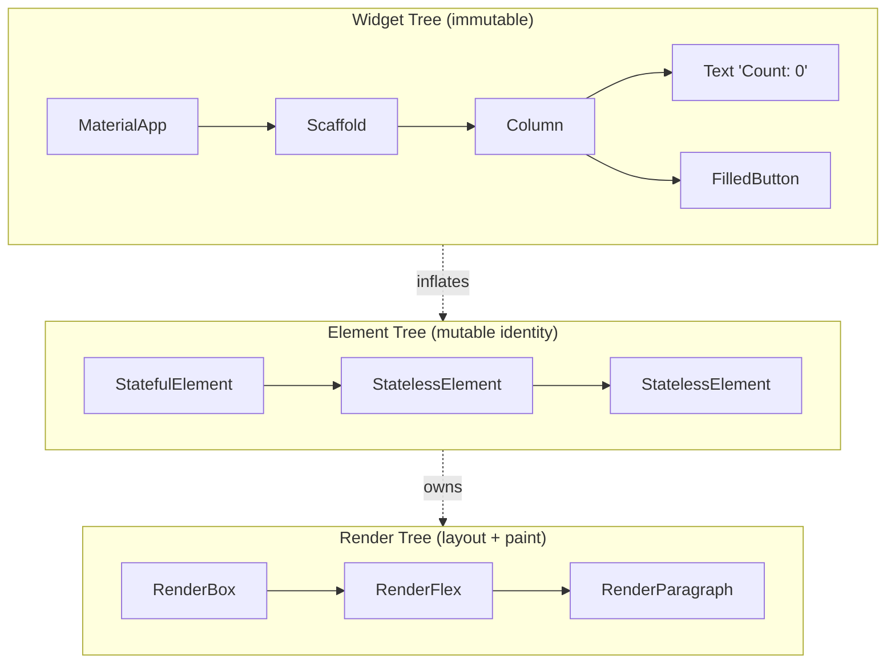
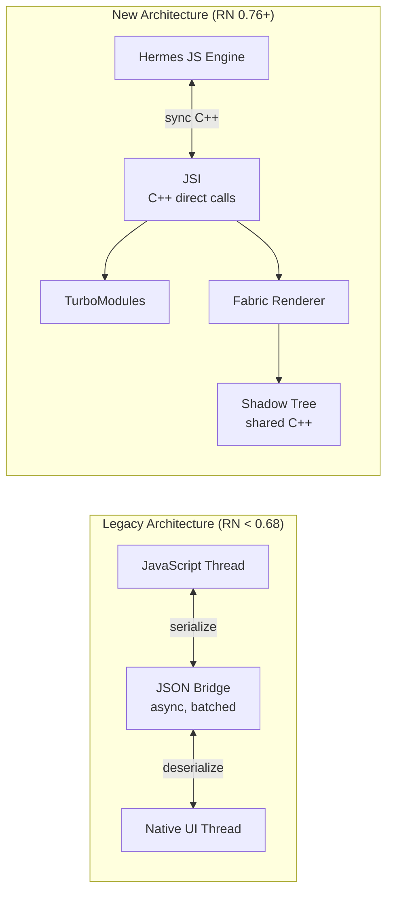

# Cross-Platform Mobile — Flutter and React Native, End to End

Indian startup mein 2 mobile engineer hire karna ek luxury hai. Tu seed-stage YC alum CEO ko bola "ek Kotlin engineer + ek Swift engineer chahiye" — uska reaction: "ek banda do platforms cover karega, warna hire hi nahi karte." Yahi reason hai ki **PhonePe (Flutter), Paytm (Flutter), Flipkart's lite app (Flutter), Swiggy (React Native + native), Dream11 (RN heavy), CRED's older Tatacliq Lite (Flutter)** — sab cross-platform pe shifted hain ya hybrid chal rahe hain. Native (`android-kotlin`) ka asli use-case 100+ engineers wali team aur 100M+ DAU app hai. Tu agar startup-grade engineer banna chahta hai, **Flutter ya React Native ek must-have skill hai** — interview mein "have you shipped a cross-platform app?" puchha jata hai, aur "no" matlab pipeline filter ho gaya.

Yeh doc dono frameworks ko ek hi guide mein cover karti hai — kyunki real interview mein "kab Flutter, kab RN, kab native" wala decision aata hai. Tu donon ka mental model rakhega to tu **architecture interview mein 1.5x value add** karega vs single-framework dev. Code dono mein hai — Dart for Flutter, modern React 19 + RN 0.76 (New Architecture, Hermes default) for React Native. Pair this with `android-kotlin` (native) for the full mobile track.

Chai-pani saath, 14 sections, ~900 lines. Chal shuru karte hain.

---

## 1. Native vs Cross-Platform — kab kya jeetta hai

### 1.1 Three options on the table

| Approach | Language(s) | Engine | UI rendering |
|----------|-------------|--------|--------------|
| **Native Android + iOS** | Kotlin + Swift | OS runtimes | Android Views/Compose, UIKit/SwiftUI |
| **Flutter** | Dart | Dart VM (debug) / AOT-compiled (release) | Skia/Impeller — paints every pixel itself |
| **React Native** | JavaScript/TypeScript | Hermes JS engine + Fabric (new arch) | Real native widgets (Android `View`, iOS `UIView`) |

Critical difference: **Flutter ka UI framework apna khud ka canvas paint karta hai**, RN actual native widgets render karta hai via JS-to-native bridge. Yeh detail interviews mein mandatory hai.

### 1.2 Flutter ke pros (kyun jeetta hai)

- **Pixel-perfect cross-platform UI** — har platform pe identical look. Skia/Impeller renderer bypass karta hai native widget quirks.
- **60-120 fps consistently** — AOT-compiled Dart binary, no JS bridge serialization overhead in hot paths.
- **Hot reload** — sub-second UI iteration. Stateful: app state retain hota hai widget tree update ke saath.
- **Rich widget library** — Material 3 + Cupertino out-of-box. Animations, gestures, custom paints — sab inbuilt.
- **Single codebase, single team** — same Dart developer Android, iOS, web, desktop, embedded — sab pe ship kar sakta hai.
- **Stable + fast-growing** — Google backed, Material 3 + Impeller renderer + Wasm web target — momentum strong hai 2025 mein.

### 1.3 React Native ke pros (kyun choose karte hain log)

- **JavaScript/TypeScript dev pool** — India mein 2025 mein 3-4 lakh JS devs hain vs ~50k Dart devs. Hiring 5x easy.
- **Expo ecosystem** — auth, push, OTA updates, dev clients, EAS Build — sab managed.
- **Native modules easy** — `react-native-camera`, `react-native-bluetooth-classic`, `react-native-mmkv` — npm pe lakhs of modules.
- **Code sharing with web** — same React patterns, same Redux store, monorepo se 60-70% logic share kar sakta hai (e.g., Coinbase, Discord).
- **OTA updates via CodePush / EAS Update** — bug fix push without Play Store/App Store re-review (subject to platform policies).
- **Real native widgets** — accessibility, theming, OS look-and-feel default mein consistent.

### 1.4 Native (Kotlin/Swift) ke pros — kyun abhi bhi mandatory

- **Best raw performance** — no abstraction layer. Heavy computation, real-time graphics, ML inference — native jeetta hai.
- **Deepest platform integration** — Wear OS, Android Auto, CarPlay, Live Activities, HealthKit, Apple Pay — yeh sab native-first APIs hain. Cross-platform months/years late support karta hai.
- **Lowest crash rate at scale** — 100M DAU pe 0.05% crash matter karta hai. Native frameworks pe debug pipeline mature hai.
- **No bridge / framework upgrade pain** — Flutter major version upgrade (2 → 3) ya RN new arch migration multi-month effort hota hai.

### 1.5 Indian startup decision matrix

| Company | Stack | Why this stack |
|---------|-------|----------------|
| **PhonePe** | Flutter (most consumer flows) | Single team for 500M+ users, pixel parity |
| **Paytm** | Flutter (newer modules) + native (legacy) | Aggressive iteration, dev velocity |
| **Flipkart Lite** | Flutter + PWA | Tier-2/3 reach, low-RAM devices |
| **Eternal (Zomato/Blinkit/Hyperpure)** | Native + RN (some flows) | Native default, RN for fast experiments |
| **Swiggy** | Native primary, RN for select internal tools | Performance + 100M scale |
| **Dream11** | Native + some RN | Real-money gaming → native correctness |
| **CRED** | Native (Kotlin/Swift) | Premium UX, animation-heavy |
| **Razorpay (consumer Magic)** | RN + native modules | Web team continuity |
| **Khatabook** | Flutter | Tier-2/3 tablet-friendly UI |
| **Groww** | Flutter (most), native (real-time charts) | Speed of feature ship |
| **Discord-clone startups** | RN | Web devs already on board |

War stories tu interview mein bol sakta hai: **Airbnb famously sunset RN** in 2018 — citing native module debt. **Dropbox sunset their cross-platform C++ shared core** earlier. But — **Stadia is gone, Flutter is still here**, and **Flipkart's super-app ka entire grocery flow Flutter mein chal raha hai 2025 mein**. Tradeoffs context-dependent hain.

### 1.6 Hiring + salary bands (India, 2025)

| Role | 0-2 yr (LPA) | 2-5 yr (LPA) | 5+ yr (LPA) |
|------|--------------|--------------|-------------|
| Flutter dev | 6-15 | 14-30 | 28-55 |
| React Native dev | 6-15 | 14-32 | 30-60 |
| Native Android (Kotlin) | 8-22 | 22-45 | 45-90 |
| Native iOS (Swift) | 9-24 | 24-50 | 50-100 |

Native salaries premium hain kyunki supply tight hai aur senior native engineers scaled apps debug kar sakte hain. Cross-platform engineers ko **native ke fundamentals bhi aana chahiye** — Activity lifecycle, UIViewController, threading model. Pure-JS-only RN devs ko salary ceiling 25-30 LPA pe hit hota hai.

### 1.7 The decision tree (use this in interview)

1. App is **performance-critical** (gaming, real-time graphics, AR/ML)? → **Native**.
2. App needs **deep platform integration** (Wear OS, CarPlay, HealthKit, Live Activities) day one? → **Native**.
3. Team has **strong web/JS background**, sharing code with web app? → **React Native**.
4. Team wants **identical UI on Android + iOS**, fast iteration, single codebase, animation-heavy? → **Flutter**.
5. Internal tool / MVP / proving product-market fit fast? → **Flutter or RN**, whichever team knows.
6. Existing native app, want to add **one new flow fast**? → **Brownfield RN module** (Shopify-style integration).

---

## 2. Flutter — Dart essentials

Dart ko aam taur pe "TypeScript + Java + Kotlin ka mix" bola jata hai. Type-safe, null-safe, GC'd, single-threaded with isolates for parallelism.

### 2.1 Sound null safety

Dart 2.12+ ne **sound null safety** introduce ki — null types statically known hain, runtime guarantees deta hai compiler.

```dart
String name = "Ratnesh";        // non-nullable, default value mandatory
String? maybeName;              // nullable, defaults to null

int len = name.length;          // OK
int? maybeLen = maybeName?.length;   // null-safe call
int safeLen = maybeName?.length ?? 0; // null-coalescing

// Late initialization (assert non-null after init)
late final ApiClient client;
void main() {
  client = ApiClient();
  client.fetch();
}

// Bang operator (!) — runtime check, throws if null. Avoid.
String forced = maybeName!;     // throws if null — use rarely
```

`late` Hilt-like DI scenarios mein kaam aata hai jab tu init `main()` ke baad karta hai. `!!` Kotlin ka `!!` jaisa — production mein avoid kar.

### 2.2 async / await + Future + Stream

Dart single-threaded hai but async I/O event loop pe non-blocking chalta hai.

```dart
// Future = single async value
Future<String> fetchUserName(String id) async {
  final response = await http.get(Uri.parse('https://api.x.com/users/$id'));
  if (response.statusCode != 200) throw Exception('failed');
  return jsonDecode(response.body)['name'] as String;
}

// Stream = multiple async values over time
Stream<int> tickEverySecond() async* {
  var i = 0;
  while (true) {
    await Future.delayed(const Duration(seconds: 1));
    yield i++;
  }
}

void main() async {
  final name = await fetchUserName('u1');
  print(name);

  await for (final tick in tickEverySecond().take(3)) {
    print('tick $tick');
  }
}
```

`Future` ≈ JS Promise / Kotlin `Deferred`. `Stream` ≈ Kotlin `Flow` / RxJS Observable. UI mein `FutureBuilder` aur `StreamBuilder` widgets ye directly consume karte hain.

### 2.3 Mixins — Dart's distinctive feature

Multiple inheritance ka safe version. Class ek base class extend karti hai, but multiple mixins `with` keyword se compose karti hai.

```dart
mixin Loggable {
  void log(String msg) => print('[${runtimeType}] $msg');
}

mixin Cacheable<T> {
  final _cache = <String, T>{};
  T? readCache(String key) => _cache[key];
  void writeCache(String key, T value) => _cache[key] = value;
}

class UserRepository with Loggable, Cacheable<User> {
  Future<User> fetch(String id) async {
    log('fetching $id');
    final cached = readCache(id);
    if (cached != null) return cached;
    final user = await api.getUser(id);
    writeCache(id, user);
    return user;
  }
}
```

Flutter framework `with` everywhere — `WidgetsBindingObserver`, `TickerProviderStateMixin`, `SingleTickerProviderStateMixin`. Animation controllers ke liye `vsync: this` ke liye mixin chahiye.

### 2.4 Records + pattern matching (Dart 3+)

Dart 3 ne **records** (named tuples) and **pattern matching** (Rust-style `match`) introduce kiye.

```dart
// Record — anonymous tuple
(String, int) parse(String s) {
  final parts = s.split(':');
  return (parts[0], int.parse(parts[1]));
}

final (name, age) = parse('Ratnesh:25');  // destructuring
print('$name is $age');

// Named record fields
({String name, int age}) currentUser() => (name: 'R', age: 25);
final u = currentUser();
print(u.name);

// Pattern matching with sealed classes
sealed class ApiResult<T> {}
class Loading<T> extends ApiResult<T> {}
class Success<T> extends ApiResult<T> { final T data; Success(this.data); }
class Failure<T> extends ApiResult<T> { final String msg; Failure(this.msg); }

String render<T>(ApiResult<T> r) => switch (r) {
  Loading() => 'loading...',
  Success(data: final d) => 'got: $d',
  Failure(msg: final m) => 'error: $m',
};
```

`switch` exhaustive hai sealed classes pe — compiler verifies. Yeh Kotlin sealed class + when ka direct equivalent.

---

## 3. Flutter — widget architecture

### 3.1 Everything is a widget

Flutter mein UI ka har element — text, button, padding, color, animation, even alignment — ek **Widget** hai. Widget = immutable description of "what UI should look like at this moment". Tu dynamic UI banata hai widget tree rebuild kar ke.

```dart
import 'package:flutter/material.dart';

void main() => runApp(const MyApp());

class MyApp extends StatelessWidget {
  const MyApp({super.key});

  @override
  Widget build(BuildContext context) {
    return MaterialApp(
      title: 'Hello',
      theme: ThemeData(useMaterial3: true, colorSchemeSeed: Colors.deepPurple),
      home: const Scaffold(
        body: Center(child: Text('Hello, Bharat')),
      ),
    );
  }
}
```

`MaterialApp` ek widget. `Scaffold` ek widget. `Center` ek widget. `Text` ek widget. **Composition over configuration** — chhote widgets ko bada banane ke liye nest karte hain.

### 3.2 StatelessWidget vs StatefulWidget

- **StatelessWidget** — pure function of inputs. Same `build()` har baar same UI return karta hai given same constructor params.
- **StatefulWidget** — mutable internal state via separate `State<T>` class. State change → `setState()` → rebuild.

```dart
// Stateless
class Greeting extends StatelessWidget {
  final String name;
  const Greeting({super.key, required this.name});

  @override
  Widget build(BuildContext context) => Text('Hi, $name');
}

// Stateful
class Counter extends StatefulWidget {
  const Counter({super.key});
  @override
  State<Counter> createState() => _CounterState();
}

class _CounterState extends State<Counter> {
  int _count = 0;

  @override
  Widget build(BuildContext context) {
    return Column(
      mainAxisSize: MainAxisSize.min,
      children: [
        Text('Count: $_count', style: const TextStyle(fontSize: 24)),
        FilledButton(
          onPressed: () => setState(() => _count++),
          child: const Text('Increment'),
        ),
      ],
    );
  }
}
```

`setState` Flutter ko bolta hai "this State is dirty, rebuild dependents." React's `useState` mental model identical hai.

### 3.3 Build context, Element tree, Render tree

Yeh interview question hai — answer ready rakhna.

Flutter mein **3 trees** hain:

1. **Widget tree** — immutable config you wrote. Cheap to rebuild.
2. **Element tree** — runtime instance per widget; tracks identity, parent-child, state.
3. **Render tree** — actual layout + paint. Expensive. Diffing happens here.



`BuildContext` = handle to the Element tree. `context.read<X>()`, `Theme.of(context)`, `Navigator.of(context)` — sab Element tree walk karte hain ancestor dhundhne ke liye.

### 3.4 Hot reload mental model

Hot reload = source change → Dart VM re-injects updated class methods → Flutter re-runs `build()` on existing State objects. State preserved.

- **Hot reload** (`r`) — code change merge, state retained.
- **Hot restart** (`R`) — entire app re-mounted, state reset.
- **Full restart** — process restart needed for: native code change, `main()` change, generic type changes that need fresh init.

Hot reload = sub-second iteration. Yahi reason hai Flutter dev velocity native se 3-5x faster feel hota hai.

### 3.5 Worked example — Counter app, idiomatic

```dart
import 'package:flutter/material.dart';

void main() => runApp(const CounterApp());

class CounterApp extends StatelessWidget {
  const CounterApp({super.key});

  @override
  Widget build(BuildContext context) {
    return MaterialApp(
      theme: ThemeData(useMaterial3: true, colorSchemeSeed: Colors.indigo),
      home: const CounterPage(),
    );
  }
}

class CounterPage extends StatefulWidget {
  const CounterPage({super.key});
  @override
  State<CounterPage> createState() => _CounterPageState();
}

class _CounterPageState extends State<CounterPage> {
  int _count = 0;

  void _increment() => setState(() => _count++);
  void _reset() => setState(() => _count = 0);

  @override
  Widget build(BuildContext context) {
    final theme = Theme.of(context);
    return Scaffold(
      appBar: AppBar(title: const Text('Counter')),
      body: Center(
        child: Column(
          mainAxisAlignment: MainAxisAlignment.center,
          children: [
            Text('You tapped', style: theme.textTheme.titleMedium),
            Text('$_count',
              style: theme.textTheme.displayLarge?.copyWith(
                color: theme.colorScheme.primary,
              )),
            const SizedBox(height: 24),
            Row(
              mainAxisAlignment: MainAxisAlignment.center,
              children: [
                FilledButton(onPressed: _increment, child: const Text('+1')),
                const SizedBox(width: 12),
                OutlinedButton(onPressed: _reset, child: const Text('Reset')),
              ],
            ),
          ],
        ),
      ),
    );
  }
}
```

`setState` chhoti app ke liye perfect. **3+ screens hote hi state lift karna mandatory** ho jata hai — section 4 mein dekhenge.

---

## 4. Flutter — state management

### 4.1 setState — only for tiny apps

Single screen, single state field — `setState` enough. Multi-screen state share karna ho to lift karna padega → boilerplate explode → state management lib chahiye.

### 4.2 Provider — deprecated for new apps but still common

Provider Flutter team ka ex-recommended approach tha. **2024 mein deprecated** for new code (Flutter team Riverpod recommend karti hai), but legacy codebases mein abhi bhi 60% projects mein hai.

```dart
// pubspec.yaml: provider: ^6.1.0
class CartModel extends ChangeNotifier {
  final _items = <String>[];
  List<String> get items => List.unmodifiable(_items);

  void add(String item) {
    _items.add(item);
    notifyListeners();
  }
}

void main() => runApp(
  ChangeNotifierProvider(
    create: (_) => CartModel(),
    child: const MyApp(),
  ),
);

class CartView extends StatelessWidget {
  const CartView({super.key});
  @override
  Widget build(BuildContext context) {
    final cart = context.watch<CartModel>();
    return Column(
      children: cart.items.map((i) => Text(i)).toList(),
    );
  }
}
```

`context.watch` rebuilds on change; `context.read` reads once without subscribing.

### 4.3 Riverpod — the modern winner

Riverpod = Provider ka spiritual successor by same author (Remi Rousselet). Compile-safe, BuildContext-free, testable, supports async out of box. **2025 mein Flutter team's de-facto recommendation**.

```yaml
# pubspec.yaml
dependencies:
  flutter_riverpod: ^2.5.1
  riverpod_annotation: ^2.3.5
dev_dependencies:
  riverpod_generator: ^2.4.0
  build_runner: ^2.4.9
```

```dart
import 'package:flutter_riverpod/flutter_riverpod.dart';
import 'package:riverpod_annotation/riverpod_annotation.dart';
part 'counter.g.dart';

// Generated provider via riverpod_generator
@riverpod
class Counter extends _$Counter {
  @override
  int build() => 0;

  void increment() => state++;
  void reset() => state = 0;
}

void main() => runApp(const ProviderScope(child: MyApp()));

class CounterView extends ConsumerWidget {
  const CounterView({super.key});

  @override
  Widget build(BuildContext context, WidgetRef ref) {
    final count = ref.watch(counterProvider);
    return Column(children: [
      Text('$count'),
      FilledButton(
        onPressed: () => ref.read(counterProvider.notifier).increment(),
        child: const Text('+1'),
      ),
    ]);
  }
}
```

Async provider examples:

```dart
@riverpod
Future<List<Restaurant>> restaurants(RestaurantsRef ref) async {
  final api = ref.watch(apiClientProvider);
  return api.fetchRestaurants();
}

class RestaurantList extends ConsumerWidget {
  const RestaurantList({super.key});
  @override
  Widget build(BuildContext context, WidgetRef ref) {
    final asyncRestaurants = ref.watch(restaurantsProvider);
    return asyncRestaurants.when(
      loading: () => const CircularProgressIndicator(),
      error: (e, _) => Text('Error: $e'),
      data: (list) => ListView(
        children: list.map((r) => ListTile(title: Text(r.name))).toList(),
      ),
    );
  }
}
```

**`AsyncValue<T>`** = sealed class with `loading / data / error` — pattern match karke render kar.

### 4.4 Bloc — when business logic is complex

Bloc (Business Logic Component) explicit event → state transition pattern. **Stream-based**, very testable, used heavily in fintech (PhonePe, Groww use BLoC). Ceremony zyada hai but state machine clarity unmatched.

```dart
sealed class CounterEvent {}
class Increment extends CounterEvent {}
class Reset extends CounterEvent {}

class CounterBloc extends Bloc<CounterEvent, int> {
  CounterBloc() : super(0) {
    on<Increment>((event, emit) => emit(state + 1));
    on<Reset>((event, emit) => emit(0));
  }
}

// In UI:
BlocProvider(
  create: (_) => CounterBloc(),
  child: BlocBuilder<CounterBloc, int>(
    builder: (context, count) => Text('$count'),
  ),
)
```

Use Bloc when: app has 5+ screens, complex transitions (auth flows, multi-step checkout, KYC), team wants state machine formality. Else Riverpod ahead.

### 4.5 GetX — controversial, avoid for new projects

GetX ek "kitchen sink" library hai — state, navigation, DI, i18n, snackbar — sab ek package mein. Beginners ko fast lagta hai, but **community concerns** hain: BuildContext bypass karta hai (memory leak risk), tightly coupled, testing harder, hidden globals. **2025 mein new projects ke liye Riverpod ya Bloc choose kar**, GetX legacy debt ban jata hai.

### 4.6 Worked example — TodoList with Riverpod

```dart
// todo.dart
import 'package:flutter/material.dart';
import 'package:flutter_riverpod/flutter_riverpod.dart';
import 'package:riverpod_annotation/riverpod_annotation.dart';
part 'todo.g.dart';

class Todo {
  final String id;
  final String title;
  final bool done;
  Todo({required this.id, required this.title, this.done = false});

  Todo copyWith({String? title, bool? done}) =>
      Todo(id: id, title: title ?? this.title, done: done ?? this.done);
}

@riverpod
class TodoList extends _$TodoList {
  @override
  List<Todo> build() => [];

  void add(String title) {
    state = [
      ...state,
      Todo(id: DateTime.now().millisecondsSinceEpoch.toString(), title: title),
    ];
  }

  void toggle(String id) {
    state = [
      for (final t in state)
        if (t.id == id) t.copyWith(done: !t.done) else t,
    ];
  }

  void remove(String id) =>
      state = state.where((t) => t.id != id).toList();
}

class TodoPage extends ConsumerStatefulWidget {
  const TodoPage({super.key});
  @override
  ConsumerState<TodoPage> createState() => _TodoPageState();
}

class _TodoPageState extends ConsumerState<TodoPage> {
  final _controller = TextEditingController();

  @override
  Widget build(BuildContext context) {
    final todos = ref.watch(todoListProvider);
    return Scaffold(
      appBar: AppBar(title: const Text('Riverpod Todos')),
      body: Column(children: [
        Padding(
          padding: const EdgeInsets.all(8),
          child: Row(children: [
            Expanded(
              child: TextField(
                controller: _controller,
                decoration: const InputDecoration(hintText: 'Add task'),
              ),
            ),
            IconButton(
              icon: const Icon(Icons.add),
              onPressed: () {
                if (_controller.text.isNotEmpty) {
                  ref.read(todoListProvider.notifier).add(_controller.text);
                  _controller.clear();
                }
              },
            ),
          ]),
        ),
        Expanded(
          child: ListView.builder(
            itemCount: todos.length,
            itemBuilder: (_, i) {
              final t = todos[i];
              return CheckboxListTile(
                title: Text(t.title,
                  style: TextStyle(
                    decoration: t.done ? TextDecoration.lineThrough : null,
                  )),
                value: t.done,
                onChanged: (_) =>
                    ref.read(todoListProvider.notifier).toggle(t.id),
                secondary: IconButton(
                  icon: const Icon(Icons.delete),
                  onPressed: () =>
                      ref.read(todoListProvider.notifier).remove(t.id),
                ),
              );
            },
          ),
        ),
      ]),
    );
  }
}
```

State immutable, transitions via copyWith — same UDF (Unidirectional Data Flow) as Compose `StateFlow`.

---

## 5. Flutter — Navigation + Routing

### 5.1 go_router — the modern winner

`Navigator 2.0` raw API painful hai — declarative but verbose. **`go_router` (v14+)** Flutter team ka recommended package hai 2025 mein. Type-safe routes, deep linking, redirection, named params — sab built-in.

```yaml
dependencies:
  go_router: ^14.2.0
```

```dart
import 'package:go_router/go_router.dart';

final router = GoRouter(
  initialLocation: '/',
  routes: [
    GoRoute(path: '/', builder: (_, __) => const HomePage()),
    GoRoute(
      path: '/restaurants/:id',
      builder: (ctx, state) => RestaurantPage(id: state.pathParameters['id']!),
    ),
    GoRoute(
      path: '/cart',
      builder: (_, __) => const CartPage(),
    ),
  ],
  redirect: (ctx, state) {
    final loggedIn = AuthService.isLoggedIn;
    final goingToLogin = state.matchedLocation == '/login';
    if (!loggedIn && !goingToLogin) return '/login';
    return null;
  },
);

class App extends StatelessWidget {
  const App({super.key});
  @override
  Widget build(BuildContext context) =>
      MaterialApp.router(routerConfig: router);
}
```

Navigation:

```dart
context.go('/restaurants/r123');     // replace stack
context.push('/cart');                // push on top
context.pop();                        // pop
```

### 5.2 Type-safe routes via codegen

```dart
@TypedGoRoute<RestaurantRoute>(path: '/restaurants/:id')
class RestaurantRoute extends GoRouteData {
  final String id;
  const RestaurantRoute({required this.id});

  @override
  Widget build(BuildContext context, GoRouterState state) =>
      RestaurantPage(id: id);
}

// Usage
const RestaurantRoute(id: 'r123').go(context);
```

Compile-time route checking — typo se 404 nahi mil sakta.

### 5.3 Deep links

`AndroidManifest.xml` mein intent filter, iOS `Info.plist` mein associated domain — `go_router` automatic match kar leta hai. `https://swiggy.com/restaurants/r123` open karne pe app `RestaurantPage(id: 'r123')` directly kholega.

---

## 6. Flutter — networking + persistence

### 6.1 http vs dio

| Library | Notes |
|---------|-------|
| `http` (official) | Simple GET/POST, no interceptors, no built-in retries. Fine for small apps. |
| `dio` (community, dominant) | Interceptors, request/response transformers, multipart, timeout, retries, FormData. **Production default**. |

```dart
// dio example
import 'package:dio/dio.dart';

final dio = Dio(BaseOptions(
  baseUrl: 'https://api.swiggy.com',
  connectTimeout: const Duration(seconds: 10),
  receiveTimeout: const Duration(seconds: 15),
))..interceptors.addAll([
  LogInterceptor(responseBody: true),
  AuthInterceptor(),
]);

class AuthInterceptor extends Interceptor {
  @override
  void onRequest(RequestOptions options, RequestInterceptorHandler handler) {
    final token = TokenStore.read();
    if (token != null) options.headers['Authorization'] = 'Bearer $token';
    handler.next(options);
  }
}

Future<List<Restaurant>> fetchRestaurants() async {
  final response = await dio.get('/v1/restaurants');
  return (response.data as List)
      .map((j) => Restaurant.fromJson(j as Map<String, dynamic>))
      .toList();
}
```

### 6.2 drift (formerly Moor) — SQLite ORM

Compile-time SQL verification, type-safe DAOs, reactive streams.

```yaml
dependencies:
  drift: ^2.20.0
  sqlite3_flutter_libs: ^0.5.0
dev_dependencies:
  drift_dev: ^2.20.0
  build_runner: ^2.4.9
```

```dart
@DriftDatabase(tables: [Todos])
class AppDatabase extends _$AppDatabase {
  AppDatabase() : super(_open());

  @override
  int get schemaVersion => 1;

  Stream<List<Todo>> watchAll() => select(todos).watch();
  Future<int> insertOne(TodosCompanion entry) => into(todos).insert(entry);
}

class Todos extends Table {
  IntColumn get id => integer().autoIncrement()();
  TextColumn get title => text().withLength(min: 1, max: 200)();
  BoolColumn get done => boolean().withDefault(const Constant(false))();
}
```

`watch()` returns a `Stream` — UI auto-updates on DB changes. Room (Android) ka direct equivalent.

### 6.3 Hive — key-value, fast, NoSQL-ish

Box-based persistent KV store. Encryption-ready, lazy boxes for huge data, no schema migrations needed for simple maps.

```dart
await Hive.initFlutter();
final box = await Hive.openBox<String>('settings');
box.put('theme', 'dark');
final theme = box.get('theme');
```

Use Hive when: small structured data, offline cache, settings/profile blob. Drift jab relational queries / joins / migrations chahiye.

### 6.4 shared_preferences — tiny stuff

iOS `NSUserDefaults` + Android `SharedPreferences` ka unified wrapper. <50KB simple flags ke liye.

```dart
final prefs = await SharedPreferences.getInstance();
await prefs.setBool('onboarded', true);
final onboarded = prefs.getBool('onboarded') ?? false;
```

App version, "first launch", feature flags — yahan rakh.

---

## 7. React Native — basics + JS bridge

### 7.1 The bridge (legacy) vs Hermes + Fabric (new architecture)

RN ka original arch: **JS runtime ↔ native side, dono bridge ke through async JSON serialize karke baat karte the**. Yeh slow tha — har layout calc, har event multiple round-trips. Result: jank, 60fps loss on heavy lists.

**New Architecture (RN 0.68+, default in 0.76+)** = ek paradigm shift hai:

- **Hermes** — Facebook ka apna JS engine, AOT-compiled bytecode, fast startup, low memory.
- **JSI (JavaScript Interface)** — direct C++ binding between JS engine + native. No JSON serialization.
- **TurboModules** — lazy-loaded native modules invoked via JSI synchronously.
- **Fabric** — new renderer, concurrent React-friendly, shared shadow tree across threads.



Practical impact: startup time **30-40% faster**, list scrolling **smoother**, native module calls **synchronous when needed**.

### 7.2 JSX returning native components

JSX same as React for web — but components map to **real native widgets**.

```jsx
import React from 'react';
import { View, Text, Pressable, StyleSheet } from 'react-native';

export function Greeting({ name }) {
  return (
    <View style={styles.container}>
      <Text style={styles.title}>Hi, {name}</Text>
      <Pressable
        style={styles.button}
        onPress={() => console.log('tapped')}
      >
        <Text style={styles.buttonText}>Tap me</Text>
      </Pressable>
    </View>
  );
}

const styles = StyleSheet.create({
  container: { padding: 16, alignItems: 'center' },
  title: { fontSize: 22, fontWeight: '600' },
  button: {
    marginTop: 12,
    paddingHorizontal: 16,
    paddingVertical: 10,
    backgroundColor: '#4f46e5',
    borderRadius: 8,
  },
  buttonText: { color: 'white', fontWeight: '600' },
});
```

`<View>` → Android `ViewGroup` / iOS `UIView`. `<Text>` → `TextView` / `UILabel`. `<ScrollView>`, `<FlatList>`, `<TextInput>`, `<Image>` — sab actual native.

### 7.3 Why styling is StyleSheet, not CSS

RN no DOM, no browser engine. CSS subset + Flexbox layout (Yoga engine, also from Meta). Class names ki jagah objects.

- All `flex` properties supported (default `flex-direction: column` on RN, vs `row` on web).
- No `display: grid`, no `position: sticky`, no media queries (use `Dimensions` API or `useWindowDimensions`).
- No cascading — styles inline, explicit.

`StyleSheet.create` validation + perf optimization deta hai (interns object IDs internally).

### 7.4 Hot reload + Fast Refresh

**Fast Refresh** (RN 0.61+) = component-level hot reload. Save → component re-mounts with state preserved (where possible). Class component error → full reload. Hooks-only components → near-perfect state retention.

Usage:
- `npx expo start` (Expo) or `npm start` (RN CLI) → metro bundler.
- Save file → app updates in <1s.
- Press `r` in terminal for full reload.

---

## 8. React Native — state management

### 8.1 useState / useReducer for component state

React hooks RN mein same behave karte hain.

```jsx
function Counter() {
  const [count, setCount] = React.useState(0);
  return (
    <View>
      <Text>{count}</Text>
      <Button title="+1" onPress={() => setCount(c => c + 1)} />
    </View>
  );
}

// useReducer for finite state machine
function tasksReducer(state, action) {
  switch (action.type) {
    case 'add': return [...state, { id: Date.now(), title: action.title, done: false }];
    case 'toggle': return state.map(t => t.id === action.id ? { ...t, done: !t.done } : t);
    case 'remove': return state.filter(t => t.id !== action.id);
    default: return state;
  }
}
```

### 8.2 Context for shared state (small apps)

```jsx
const AuthContext = React.createContext(null);

export function AuthProvider({ children }) {
  const [user, setUser] = React.useState(null);
  return (
    <AuthContext.Provider value={{ user, setUser }}>
      {children}
    </AuthContext.Provider>
  );
}

export const useAuth = () => React.useContext(AuthContext);
```

Pitfall: Context value change → **all consumers re-render**. Big shared state → split contexts or use Zustand/Redux.

### 8.3 Redux Toolkit — the standard

Redux pre-2020 ka boilerplate (`actions`, `reducers`, `dispatch`) bahut tha. **Redux Toolkit (RTK)** ne 80% boilerplate kill kar diya. Standard for medium-large RN apps.

```jsx
// store/cartSlice.js
import { createSlice, configureStore } from '@reduxjs/toolkit';

const cartSlice = createSlice({
  name: 'cart',
  initialState: { items: [] },
  reducers: {
    add: (state, action) => { state.items.push(action.payload); },
    remove: (state, action) => {
      state.items = state.items.filter(i => i.id !== action.payload);
    },
  },
});

export const { add, remove } = cartSlice.actions;
export const store = configureStore({ reducer: { cart: cartSlice.reducer } });

// In component
import { useSelector, useDispatch } from 'react-redux';

function CartView() {
  const items = useSelector(s => s.cart.items);
  const dispatch = useDispatch();
  return items.map(i => (
    <Pressable key={i.id} onPress={() => dispatch(remove(i.id))}>
      <Text>{i.name}</Text>
    </Pressable>
  ));
}
```

**RTK Query** (RTK ka caching layer) `dio`-style API caching deta hai — auto refetch, invalidation, polling.

### 8.4 Zustand — modern minimal alternative

Zustand = Redux ka 90% benefit, 10% code. Hook-based, no provider, no actions/reducers boilerplate. **2024-25 mein RN community ka new darling**.

```jsx
import { create } from 'zustand';

const useCartStore = create((set) => ({
  items: [],
  add: (item) => set((s) => ({ items: [...s.items, item] })),
  remove: (id) => set((s) => ({ items: s.items.filter(i => i.id !== id) })),
}));

function CartView() {
  const items = useCartStore(s => s.items);
  const remove = useCartStore(s => s.remove);
  return items.map(i => (
    <Pressable key={i.id} onPress={() => remove(i.id)}><Text>{i.name}</Text></Pressable>
  ));
}
```

### 8.5 Worked example — TodoList with Zustand

```jsx
// store.js
import { create } from 'zustand';
import { persist, createJSONStorage } from 'zustand/middleware';
import AsyncStorage from '@react-native-async-storage/async-storage';

export const useTodoStore = create(
  persist(
    (set) => ({
      todos: [],
      add: (title) => set((s) => ({
        todos: [...s.todos, { id: Date.now().toString(), title, done: false }],
      })),
      toggle: (id) => set((s) => ({
        todos: s.todos.map(t => t.id === id ? { ...t, done: !t.done } : t),
      })),
      remove: (id) => set((s) => ({
        todos: s.todos.filter(t => t.id !== id),
      })),
    }),
    { name: 'todos', storage: createJSONStorage(() => AsyncStorage) }
  )
);

// TodoScreen.jsx
import React from 'react';
import { View, Text, TextInput, Pressable, FlatList, StyleSheet } from 'react-native';
import { useTodoStore } from './store';

export default function TodoScreen() {
  const todos = useTodoStore(s => s.todos);
  const { add, toggle, remove } = useTodoStore();
  const [input, setInput] = React.useState('');

  return (
    <View style={styles.container}>
      <View style={styles.row}>
        <TextInput
          style={styles.input}
          value={input}
          onChangeText={setInput}
          placeholder="Add task"
        />
        <Pressable
          style={styles.addBtn}
          onPress={() => { if (input) { add(input); setInput(''); } }}
        >
          <Text style={styles.addText}>+</Text>
        </Pressable>
      </View>
      <FlatList
        data={todos}
        keyExtractor={(item) => item.id}
        renderItem={({ item }) => (
          <View style={styles.todoRow}>
            <Pressable onPress={() => toggle(item.id)} style={{ flex: 1 }}>
              <Text style={[styles.todoText, item.done && styles.doneText]}>
                {item.title}
              </Text>
            </Pressable>
            <Pressable onPress={() => remove(item.id)}>
              <Text style={styles.delete}>Delete</Text>
            </Pressable>
          </View>
        )}
      />
    </View>
  );
}

const styles = StyleSheet.create({
  container: { flex: 1, padding: 16 },
  row: { flexDirection: 'row', marginBottom: 12 },
  input: {
    flex: 1, borderWidth: 1, borderColor: '#ddd',
    borderRadius: 8, paddingHorizontal: 12,
  },
  addBtn: {
    marginLeft: 8, backgroundColor: '#4f46e5', borderRadius: 8,
    paddingHorizontal: 16, justifyContent: 'center',
  },
  addText: { color: 'white', fontSize: 20, fontWeight: '600' },
  todoRow: {
    flexDirection: 'row', paddingVertical: 12,
    borderBottomWidth: 1, borderBottomColor: '#eee',
  },
  todoText: { fontSize: 16 },
  doneText: { textDecorationLine: 'line-through', color: '#999' },
  delete: { color: '#ef4444' },
});
```

`persist` middleware = auto-save to AsyncStorage. Yeh production-grade pattern hai — Riverpod's hydrated_riverpod ka equivalent.

---

## 9. React Native — Expo vs vanilla CLI

### 9.1 Expo — fastest path

Expo = managed RN setup. **2024+ mein RN team's officially recommended way to start**.

Pros:
- `npx create-expo-app my-app` → app on phone in 60 sec via Expo Go scanner.
- Pre-bundled native modules: camera, notifications, location, sensors, BLE.
- **EAS Build** — cloud builds, no Xcode/Android Studio mandatory locally.
- **EAS Update** — JS bundle OTA push without Play Store review.
- **EAS Submit** — automated Play / App Store upload.
- TypeScript template default.

Cons (older versions):
- Native module not in Expo SDK → couldn't use.
- App size larger (all SDK pre-included).

**2025 fix:** **Expo Dev Client** + **Expo Modules API** + **prebuild**. Tu custom native code add kar sakta hai without "ejecting" — just `npx expo prebuild` runs and you get native folders.

### 9.2 Bare React Native CLI — full power, more setup

```bash
npx @react-native-community/cli@latest init MyApp
cd MyApp
npx pod-install ios  # iOS only
npx react-native run-android
npx react-native run-ios
```

Pros:
- Total control over native side.
- Any native library supported.
- No Expo runtime overhead.

Cons:
- Xcode + Android Studio + JDK + Ruby + CocoaPods setup mandatory.
- iOS builds need Mac.
- OTA setup manual (CodePush, Microsoft AppCenter retiring 2025 — moving to Expo Updates anyway).

### 9.3 When to graduate from Expo

Tu Expo se "graduate" kab kare? **2025 mein almost never**. Expo Modules API mature ho gayi hai. Tu sirf prebuild kar — native folders generate ho jayenge — aur bare project jaisa edit karta reh. Best of both worlds.

Sirf graduate kar agar: **proprietary fork of RN core**, deep custom JNI work, ya Expo SDK release lag karta hai for cutting-edge feature.

---

## 10. Native modules / platform channels

Cross-platform framework UI cover kar leta hai, but **camera RAW access, Bluetooth Classic, custom hardware (POS terminals, vehicle telematics), payment SDKs (Razorpay, Stripe), MDM enterprise APIs** — sab native code chahiye. Solution: **bridge from JS/Dart to native**.

### 10.1 Flutter — MethodChannel

Bidirectional async calls between Dart and native (Kotlin/Swift).

Dart side:

```dart
import 'package:flutter/services.dart';

class BatteryInfo {
  static const _ch = MethodChannel('com.enginerd/battery');

  static Future<int> level() async {
    final v = await _ch.invokeMethod<int>('getBatteryLevel');
    return v ?? 0;
  }
}
```

Android side (`MainActivity.kt`):

```kotlin
class MainActivity : FlutterActivity() {
  override fun configureFlutterEngine(flutterEngine: FlutterEngine) {
    super.configureFlutterEngine(flutterEngine)
    MethodChannel(flutterEngine.dartExecutor.binaryMessenger, "com.enginerd/battery")
      .setMethodCallHandler { call, result ->
        if (call.method == "getBatteryLevel") {
          val level = (getSystemService(BATTERY_SERVICE) as BatteryManager)
            .getIntProperty(BatteryManager.BATTERY_PROPERTY_CAPACITY)
          result.success(level)
        } else result.notImplemented()
      }
  }
}
```

iOS (`AppDelegate.swift`) similar with `FlutterMethodChannel`.

For streams (e.g., sensor events) → `EventChannel`. For binary data → `BasicMessageChannel`.

### 10.2 React Native — TurboModules (new architecture)

TurboModules = JSI-based, lazy-loaded, type-safe via Codegen.

`specs/NativeBattery.ts`:

```ts
import type { TurboModule } from 'react-native';
import { TurboModuleRegistry } from 'react-native';

export interface Spec extends TurboModule {
  getBatteryLevel(): Promise<number>;
}

export default TurboModuleRegistry.getEnforcing<Spec>('Battery');
```

Android Java/Kotlin generated boilerplate ke andar:

```kotlin
class BatteryModule(reactContext: ReactApplicationContext) :
  NativeBatterySpec(reactContext) {
  override fun getBatteryLevel(promise: Promise) {
    val mgr = reactApplicationContext.getSystemService(Context.BATTERY_SERVICE) as BatteryManager
    promise.resolve(mgr.getIntProperty(BatteryManager.BATTERY_PROPERTY_CAPACITY))
  }
}
```

JS side:

```jsx
import Battery from './specs/NativeBattery';
const level = await Battery.getBatteryLevel();
```

Codegen TS spec se Java/ObjC stubs auto-generate karta hai — type mismatch compile-time pakda jata hai.

---

## 11. Testing

### 11.1 Flutter

```yaml
dev_dependencies:
  flutter_test: { sdk: flutter }
  mockito: ^5.4.4
  integration_test: { sdk: flutter }
  build_runner: ^2.4.9
```

**Unit / widget test:**

```dart
import 'package:flutter_test/flutter_test.dart';
import 'package:flutter/material.dart';

void main() {
  testWidgets('Counter increments', (tester) async {
    await tester.pumpWidget(const CounterApp());
    expect(find.text('0'), findsOneWidget);
    await tester.tap(find.byType(FilledButton).first);
    await tester.pump();
    expect(find.text('1'), findsOneWidget);
  });
}
```

**Mockito** for repository / API mocking:

```dart
@GenerateMocks([ApiClient])
void main() {
  test('fetches restaurants', () async {
    final api = MockApiClient();
    when(api.fetchRestaurants()).thenAnswer((_) async => [Restaurant(name: 'X')]);
    final repo = RestaurantRepository(api);
    final list = await repo.list();
    expect(list, hasLength(1));
  });
}
```

**integration_test** = real device / emulator end-to-end:

```bash
flutter test integration_test/app_test.dart
```

### 11.2 React Native

```bash
npm install --save-dev jest @testing-library/react-native @testing-library/jest-native
```

**Unit test:**

```jsx
import { render, fireEvent } from '@testing-library/react-native';
import Counter from '../Counter';

test('counter increments', () => {
  const { getByText } = render(<Counter />);
  expect(getByText('0')).toBeTruthy();
  fireEvent.press(getByText('+1'));
  expect(getByText('1')).toBeTruthy();
});
```

**Detox** for end-to-end (real Android emulator / iOS simulator):

```js
describe('Login flow', () => {
  it('logs in successfully', async () => {
    await element(by.id('email')).typeText('a@b.com');
    await element(by.id('password')).typeText('pwd');
    await element(by.id('submit')).tap();
    await expect(element(by.text('Welcome'))).toBeVisible();
  });
});
```

Run: `detox test --configuration android.emu.debug`. Detox ka native runner real touch events fire karta hai — full app smoke test.

---

## 12. Deployment to Play Store + App Store

### 12.1 Flutter — build outputs

```bash
# Android
flutter build apk --release
flutter build appbundle --release   # AAB for Play Store (mandatory since 2021)

# iOS
flutter build ipa --release          # requires Mac + Xcode + paid Apple dev account
```

Signing config in `android/app/build.gradle.kts` (keystore, alias, password). iOS signing via Xcode automatic signing or Fastlane Match.

### 12.2 React Native — Fastlane

Fastlane = Ruby-based CLI for build + sign + upload automation.

```ruby
# Fastfile
platform :android do
  lane :release do
    gradle(task: 'bundleRelease')
    upload_to_play_store(track: 'production', aab: 'android/app/build/outputs/bundle/release/app-release.aab')
  end
end

platform :ios do
  lane :release do
    match(type: 'appstore')
    build_app(scheme: 'MyApp', export_method: 'app-store')
    upload_to_app_store
  end
end
```

`fastlane android release` → Play Console pe directly chala jata hai. Same iOS for App Store Connect.

### 12.3 OTA updates — CodePush / Expo OTA / EAS Update

JS-only changes ko store re-review se bypass kar dena. Bug fix Tuesday morning, 2 PM tak production pe.

- **Microsoft CodePush** — RN-only, **retiring March 2025**. Migrate.
- **Expo EAS Update** — current default for Expo and bare RN.
- **Flutter Shorebird** — community OTA solution, AOT-compiled patches (technically more involved than JS OTA).

**The OTA controversy:**

- **Apple App Store Guidelines 3.3.1** — JS-only updates allowed *jab tak* updated code primary purpose change na kare. Native binary patches **strictly forbidden**.
- **Google Play** more lenient but post-2024 enforcement tightened.
- 2024-25 mein Apple ne select apps ko warning bheji "behavioral changes via OTA without review = potential rejection". Practical: **bug fixes + copy changes OK**, new monetized features **submit kar review ke liye**.

```bash
# Expo EAS Update example
eas update --branch production --message "fix login crash"
```

User app open karega — JS bundle silently update — next launch new code.

---

## 13. Top 30 cross-platform mobile interview questions

| # | Question | Crisp answer |
|---|----------|--------------|
| 1 | Flutter vs RN — one liner? | Flutter paints its own pixels via Skia/Impeller; RN renders real native widgets via JSI/Fabric. |
| 2 | Why Dart for Flutter? | AOT compilation → fast startup; JIT in dev → hot reload; null-safe + Kotlin-like syntax; Google-backed. |
| 3 | StatelessWidget vs StatefulWidget? | Stateless = pure function of inputs, immutable. Stateful = has separate `State<T>` with mutable fields, rebuilds via `setState`. |
| 4 | Three trees in Flutter? | Widget (config) → Element (identity, parent-child) → Render (layout, paint). |
| 5 | What is BuildContext? | Handle to current Element in tree; used to walk ancestors (`Theme.of`, `Navigator.of`, providers). |
| 6 | Why is Riverpod preferred over Provider? | Compile-safe, BuildContext-free, supports async out-of-box, testable, codegen-friendly. |
| 7 | When use Bloc over Riverpod? | Complex business logic, formal state machine, multi-step flows, fintech / payments domains. |
| 8 | What is `AsyncValue<T>` in Riverpod? | Sealed type with `loading / data / error`; pattern-match for UI rendering. |
| 9 | go_router vs Navigator 1.0? | go_router = declarative, deep-link-first, type-safe routes via codegen, redirection support; Navigator 1.0 imperative push/pop. |
| 10 | dio vs http? | dio = production: interceptors, retry, FormData, transformers; http = simple GET/POST. |
| 11 | drift vs sqflite? | drift = type-safe ORM, compile-time SQL check, reactive streams; sqflite = raw SQLite wrapper. |
| 12 | What is MethodChannel? | Bidirectional async channel between Dart and native (Android Kotlin / iOS Swift) for platform features. |
| 13 | Hot reload vs hot restart? | Reload = inject changed code, retain state; restart = re-mount app, lose state; full restart = process restart for native changes. |
| 14 | What is the JS bridge in RN? | Legacy mechanism: JSON-serialized async messages between JS thread and native; replaced by JSI (sync C++ calls) in new arch. |
| 15 | Hermes vs JSC? | Hermes = Meta's JS engine for RN: AOT bytecode, fast startup, low memory; JSC = Apple's JavaScriptCore, RN's old default. |
| 16 | What is Fabric? | RN new-arch renderer; concurrent React-friendly, shared C++ shadow tree across UI/JS threads. |
| 17 | TurboModules vs legacy NativeModules? | Turbo = JSI-based, lazy-loaded, type-safe via Codegen; legacy = bridge-based, eager-loaded, runtime type-checked. |
| 18 | Why StyleSheet over inline objects? | Validates styles, interns IDs for perf; inline objects allocate per render. |
| 19 | FlatList vs ScrollView? | FlatList = virtualized (only visible rows mounted); ScrollView = renders all children — fine for short lists, jank for long. |
| 20 | Redux Toolkit vs Zustand? | RTK = full ecosystem, devtools, RTK Query caching; Zustand = minimal, no provider, hook-based, faster onboarding. |
| 21 | Expo vs bare RN CLI? | Expo = managed SDK, EAS Build, fast start; bare = full native control, all libs available; modern Expo prebuild bridges both. |
| 22 | What is EAS Update? | Expo's OTA service: push JS bundle updates without Play/App Store re-review (within Apple guidelines). |
| 23 | Apple's stance on OTA updates? | Bug fixes and copy changes OK; behavior-changing native binary patches forbidden (3.3.1). |
| 24 | When choose native over cross-platform? | Performance-critical (gaming, AR), deep platform APIs (Wear OS, CarPlay) day one, 100M+ users with strict crash budget. |
| 25 | Indian startups using Flutter? | PhonePe, Paytm (newer modules), Flipkart Lite, Khatabook, Groww (most flows). |
| 26 | Indian startups using RN? | Swiggy (select flows), Razorpay Magic, Discord-clone startups, internal tools at many product cos. |
| 27 | Why hot reload retains state in Flutter? | Dart VM injects updated class methods; Element tree + State objects preserved across rebuild. |
| 28 | Sound null safety meaning? | Compile-time guarantee that non-nullable types never hold null; eliminates a large class of NPEs. |
| 29 | What is Yoga in RN? | Cross-platform Flexbox layout engine (C++); RN uses it to compute layout same as web Flex on both Android and iOS. |
| 30 | Detox vs Jest in RN? | Jest = unit + integration tests on Node; Detox = e2e on real device/emulator with native gesture simulation. |

---

## 14. Pre-interview checklist + what to learn next

### 14.1 30-day prep checklist

- [ ] Build one Flutter app from scratch with Riverpod + go_router + dio + drift, ship to Play Internal track.
- [ ] Build one RN/Expo app with Zustand + React Navigation + TanStack Query, ship via EAS Build to internal distribution.
- [ ] Implement one MethodChannel feature in Flutter (battery level, vibration, custom haptic).
- [ ] Implement one TurboModule in RN (or use a native module like `react-native-mmkv`) and explain JSI.
- [ ] Memorize: 3 trees (widget/element/render), Hermes + Fabric + JSI roles, Riverpod's `AsyncValue` pattern.
- [ ] Read official **Flutter samples repo** + **react-native-template-typescript** as baselines.
- [ ] Test pyramid: unit (mockito / Jest), widget / RTL component, e2e (integration_test / Detox) — write at least 3 of each.
- [ ] Push an OTA update via EAS Update (RN) or Shorebird (Flutter) and observe rollout.
- [ ] Mock the top 30 questions out loud — 30 seconds each.
- [ ] Crash-Free rate on your Play Console > 99% — Sentry / Firebase Crashlytics integrated.

### 14.2 Code review red flags

| Anti-pattern | Why bad | Do instead |
|--------------|---------|------------|
| `setState` deep in widget tree for shared state | Re-renders entire subtree, hard to test | Lift to Riverpod/Bloc provider |
| `!` (force-unwrap) in Dart everywhere | Runtime null crash | `?.` + `??` fallback or `late` |
| Inline anonymous functions in `FlatList` `renderItem` | Re-creates fn per render → memo busted | `useCallback` or extract component |
| Mutating Redux state directly | Breaks immutability guarantees | RTK uses Immer; mutate as if direct, RTK handles |
| Heavy work on JS thread (RN) | UI jank | Move to native module or `runOnUI` (Reanimated) |
| Big Context value object | All consumers re-render | Split contexts or move to Zustand/Redux |
| `dio` without timeout | App hangs on bad network | `connectTimeout`, `receiveTimeout` mandatory |
| Storing JWT in SharedPreferences/AsyncStorage plain | Token theft via rooted device | `flutter_secure_storage` / `react-native-keychain` |
| Hot-reload-only verified UI | Production paint differs (debug skia vs release Impeller) | Test release builds before ship |
| Missing `key` in dynamic lists (RN) | Reconciliation bugs | Stable string `keyExtractor` |

### 14.3 Reading list (free, high quality)

- **Flutter docs + cookbook** — `docs.flutter.dev` (gold standard).
- **Riverpod docs** — Remi Rousselet's tutorials; codegen path is the future.
- **React Native docs** — `reactnative.dev` (new arch deep dives section).
- **Expo docs + EAS guides** — `docs.expo.dev`.
- **Reso Coder YouTube** (Flutter clean architecture).
- **William Candillon "Can it be done in React Native?"** YouTube (Reanimated + gesture handler magic).
- **Engineering blogs**: Shopify (RN at scale), Discord (RN performance), PhonePe (Flutter migration), Groww (Flutter charts).

### 14.4 What to learn next (links into your roadmap)

- **`android-kotlin`** → Native Android. Cross-platform engineer ko native fundamentals (Activity lifecycle, Service, ViewModel) aana mandatory hai for native modules / debugging.
- **`lld-design`** → ViewModel + repository + use-case pattern, OOP design of feature modules; cross-platform mein bhi same patterns chalti hain.
- **`system-design-basics`** → "Design WhatsApp / Swiggy mobile architecture" — offline-first sync, push notifications, image upload pipeline. Senior mobile interviews mein HLD pucha jata hai.
- **`networks-complete`** → HTTP/2, TLS, DNS, retry/backoff, websockets — dio interceptors aur RN `fetch` debugging mein samajh chahiye.
- **`frontend-performance`** → Core Web Vitals jaise mobile app metrics (TTI, jank, frame budget). FlatList / ListView optimization rules same-similar apply hote hain.

### 14.5 Closing thought

Cross-platform mobile 2025 mein **default startup choice** hai — kyunki ek Flutter ya RN engineer Android + iOS dono ship kar sakta hai 70-80% feature parity ke saath. Flutter ne pixel-perfect UI race jeet li hai (PhonePe-Paytm scale pe deploy ho raha hai), aur RN ne new arch ke saath performance gap close kar di hai (Hermes + JSI + Fabric). Tu ek Flutter app + ek RN/Expo app banale, dono mein OTA update push karke rollout dekhle, ek native module (MethodChannel / TurboModule) likh le — interview mein **"yes I've shipped both"** bolne ke baad SDE-1 to SDE-2 jump real ho jata hai. Native (`android-kotlin`) pair kar le — **cross-platform + native dono** wala mobile engineer Indian startup mein **gold-standard hire** hai. Yahan se shuru kar, 90 din mein offer haath mein.
