# CSS (Complete)

CSS yaani Cascading Style Sheets — ye wahi cheez hai jo HTML ke naked structure ko dress-up karti hai. HTML agar skeleton hai, to CSS uski skin, kapde, makeup sab kuch hai. Is guide me hum selectors se le kar SCSS tak sab cover karenge — ekdum production-level depth me, taaki tu kal job pe baith ke confidently CSS likh sake. Ek baat yaad rakh: CSS dikhne me easy lagti hai, par jab tak tu specificity, cascade, aur layout systems ko deeply nahi samjhega, tab tak debugging me 4 ghante nikal jayenge ek button center karne me.

---

## 1. Selectors & specificity

### 1.1 Selector types (type, class, id, attribute, pseudo, combinators)

#### Definition
Selectors basically wo pattern hote hain jisse tu CSS ko bolta hai "yeh element pakad aur isko style maar". Sochiye tum ek classroom me ho aur teacher bolti hai "saare ladke khade ho jao" — yeh type selector hai. "Jin logon ke paas red shirt hai wo khade ho jao" — yeh class selector hai. "Ramesh kumar khada ho ja" — yeh ID selector. CSS me bhi exactly aisa hi hota hai, bas syntax thoda alag hai.

Selectors ke main types — type (`div`, `p`), class (`.btn`), id (`#header`), attribute (`[type="text"]`), pseudo-class (`:hover`, `:nth-child`), pseudo-element (`::before`, `::after`), aur combinators (descendant ` `, child `>`, adjacent sibling `+`, general sibling `~`). Har ek ka apna use case hai aur senior devs inko mix karke bohot powerful patterns banate hain.

#### Why?
Tu agar har element ko inline style dega to maintenance hell ho jayega. Selectors tujhe ek centralised jagah se hundreds of elements ko target karne ka power dete hain. Bina selectors ke CSS ka koi matlab hi nahi — yeh wahi hai jo "scale" enable karta hai.

#### How?
```css
/* Type selector — saare paragraphs */
p { color: #333; }

/* Class — reusable */
.btn-primary { background: blue; }

/* ID — unique element */
#main-header { height: 80px; }

/* Attribute selector — sirf email inputs */
input[type="email"] { border: 1px solid green; }

/* Pseudo-class — hover state */
.btn-primary:hover { background: darkblue; }

/* Pseudo-element — first letter bada karna */
p::first-letter { font-size: 2em; }

/* Combinator — sirf direct children */
.card > .title { font-weight: bold; }
```

#### Real-life Example
Mann le tu ek e-commerce site bana raha hai. Product cards me jab tak user hover na kare tab tak "Add to cart" button hidden rakhna hai — sirf hover pe dikhana hai.

```css
.product-card .add-to-cart {
  opacity: 0;
  transition: opacity 0.2s ease;
}

.product-card:hover .add-to-cart {
  opacity: 1;
}

/* Out of stock items grey karna */
.product-card[data-stock="0"] {
  opacity: 0.5;
  pointer-events: none;
}
```

#### Diagram
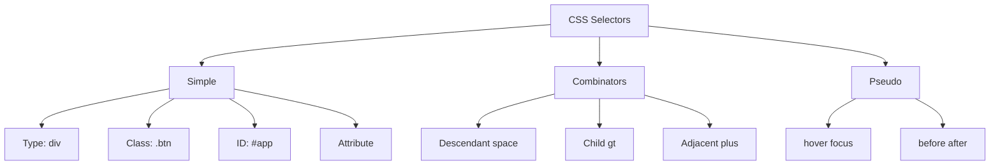

#### Interview Question
**Q:** Difference between `.parent .child` and `.parent > .child`?

**A:** Pehla wala descendant combinator hai — yeh `.parent` ke andar kahin bhi nested `.child` ko match karega, chahe wo 5 level deep ho. Doosra wala child combinator hai — yeh sirf direct child match karega.

Production me iska bohot impact hota hai. Agar tu `.menu li` likhega to nested submenus ke `li` bhi affect honge, jo aksar bug create karta hai. `.menu > li` likhne se sirf top-level items affect hote hain. Senior devs mostly child combinator prefer karte hain kyunki yeh predictable hota hai aur scope tight rakhta hai.

---

### 1.2 Specificity calculation, cascade, !important

#### Definition
Specificity ek scoring system hai jo browser use karta hai jab do alag-alag CSS rules same element pe apply ho rahe ho. Sochiye court me do vakeel hain — jiske paas zyada strong evidence hoga, judge uski sunega. Yahan "evidence" specificity score hai. Calculation 4 buckets me hoti hai: inline styles (1000), IDs (100), classes/attributes/pseudo-classes (10), aur elements/pseudo-elements (1).

Cascade matlab "agar specificity same hai to baad wala rule jeetega" — yaani CSS file me jo niche likha hai wo override karega. `!important` ek nuclear option hai jo specificity ko bypass kar deta hai, par production me iska use red flag mana jata hai kyunki maintainability tod deta hai.

#### Why?
Conflicts to honge hi — ek hi button pe `.btn`, `.btn-primary`, `#submit` sab apply ho rahe hain. Specificity ke bina browser confused ho jayega ki kaunsa rule apply kare. Aur `!important` isliye exist karta hai kyunki kabhi-kabhi third-party CSS override karna padta hai jise tu control nahi karta.

#### How?
```css
/* Specificity: 0,0,0,1 — element */
p { color: black; }

/* Specificity: 0,0,1,0 — class */
.intro { color: blue; }

/* Specificity: 0,1,0,0 — id */
#main { color: red; }

/* Specificity: 0,0,2,1 — class + class + element */
.card .title h2 { color: green; }

/* Nuclear — avoid */
.danger { color: yellow !important; }
```

#### Real-life Example
Common production scenario — tu Bootstrap use kar raha hai aur uska `.btn` already styled hai. Tujhe apna custom red button banana hai.

```css
/* Yeh kaam nahi karega — Bootstrap ki specificity zyada hogi */
.my-btn { background: red; }

/* Solution 1: Specificity badha */
.container .my-btn { background: red; }

/* Solution 2: Last resort */
.my-btn { background: red !important; }

/* Best — apna design system bana */
:root { --color-danger: #e53e3e; }
.btn-danger { background: var(--color-danger); }
```

#### Diagram
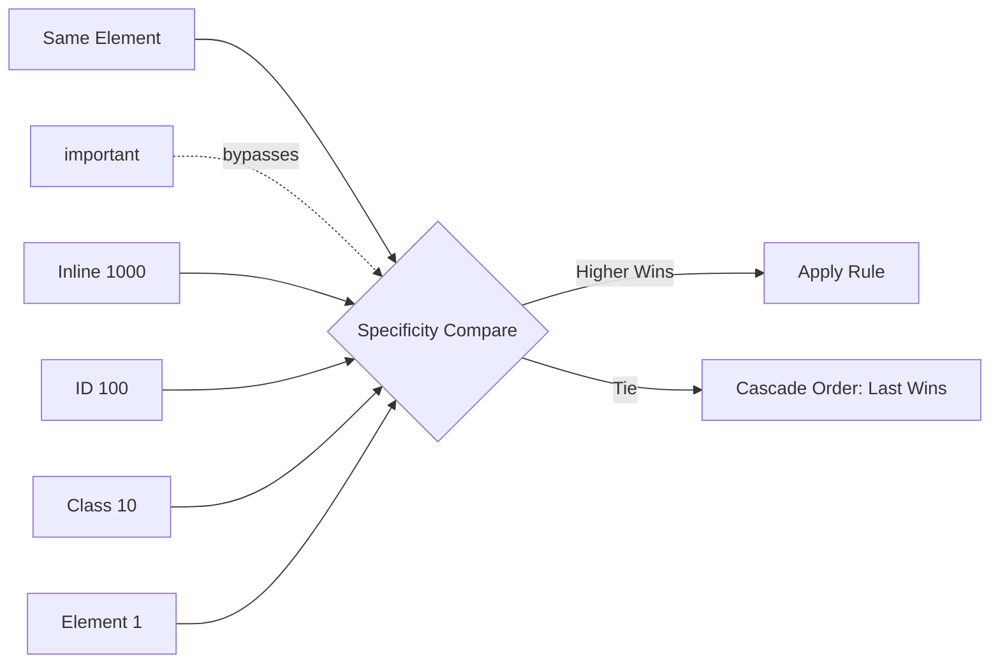

#### Interview Question
**Q:** `!important` use karna kab justified hai?

**A:** Honest answer — almost never apne code me. `!important` use karne ke valid cases hain: utility classes (jaise Tailwind ka `!mt-4`), third-party library overrides jaha tu source control nahi karta, aur user-side accessibility overrides (jaise dark mode for everything).

Production me agar tu `!important` use kar raha hai apni hi CSS me to ye sign hai ki tera architecture tooth gaya hai — specificity wars chal rahi hain. Better approach hai BEM methodology, CSS modules, ya design tokens use karna taaki naturally specificity flat rahe. Jab tu codebase me 50 jagah `!important` dekhega to samajh ja kisi ne CSS architecture pe nahi socha.

---

## 2. Box model

### 2.1 Content/padding/border/margin, box-sizing

#### Definition
Har HTML element ek rectangular box hai — chahe wo `<span>` ho ya `<div>`. Is box ke 4 layers hote hain: content (text/image), padding (content ke around space andar), border (boundary line), aur margin (box ke bahar space). Sochiye ek courier package — andar sample rakha hai (content), uske around bubble wrap (padding), phir cardboard box (border), aur baaki packages se distance (margin).

`box-sizing` property tay karti hai ki jab tu `width: 300px` likhega to wo width content ki hai ya total box ki. Default `content-box` me width sirf content ki hoti hai aur padding+border alag se add hote hain — yeh aksar bug create karta hai. `border-box` me width total box ki hoti hai jo intuitive hai.

#### Why?
Bina box model samjhe tu kabhi layout debug nahi kar sakta. "Mera div 300px hona chahiye but 340px dikh raha hai" — yeh classic content-box bug hai. `box-sizing: border-box` use karne se calculations predictable ho jaati hain — yahi reason hai modern frameworks (Bootstrap, Tailwind) globally `border-box` set karte hain.

#### How?
```css
/* Globally border-box — modern best practice */
*, *::before, *::after {
  box-sizing: border-box;
}

.card {
  width: 300px;        /* total box width */
  padding: 20px;       /* andar space */
  border: 2px solid;   /* boundary */
  margin: 16px;        /* bahar space */
  /* Total box width still 300px because of border-box */
}
```

#### Real-life Example
Tu ek pricing card bana raha hai jo grid me 3 columns me fit hona chahiye, har column exactly 33.33%. Bina border-box ke padding add karte hi cards overflow ho jayenge.

```css
.pricing-grid {
  display: grid;
  grid-template-columns: repeat(3, 1fr);
  gap: 20px;
}

.pricing-card {
  box-sizing: border-box;
  width: 100%;
  padding: 24px;
  border: 1px solid #e2e8f0;
  border-radius: 8px;
  /* Yeh 100% me hi rahega, padding andar fit hogi */
}
```

#### Diagram
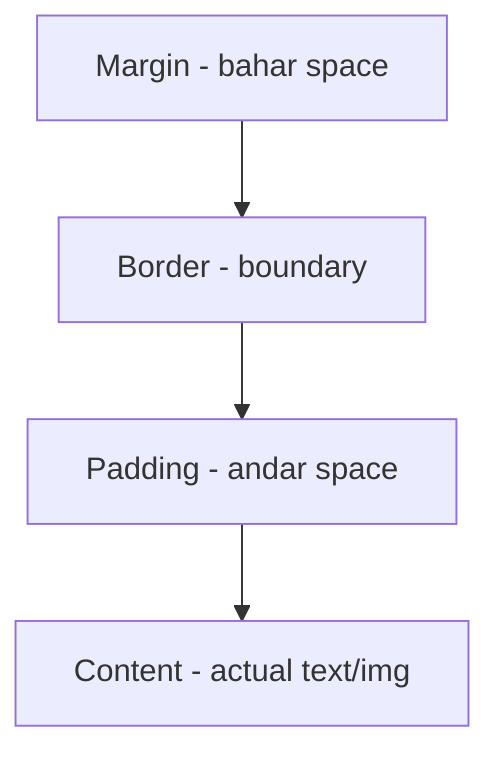

#### Interview Question
**Q:** `margin: 20px` aur `padding: 20px` me kya difference hai aur kab kya use karoge?

**A:** Padding element ke andar ka space hai — background color isme show hota hai. Margin element ke bahar ka space hai — yeh transparent hota hai aur dusre elements se distance maintain karta hai.

Practical rule: agar tujhe element ki content ko uske border se door rakhna hai (jaise button text aur button ki edge me space), padding use kar. Agar dusre elements se distance chahiye (jaise cards ke beech gap), margin use kar. Ek aur cool baat — margins collapse hote hain (vertical adjacent margins me se bada wala win karta hai), padding kabhi collapse nahi hoti. Modern layouts me log gap (flex/grid) prefer karte hain margins ke jagah kyunki margins predictable nahi hote nested cases me.

---

## 3. Units

### 3.1 px, rem, em, %, vh, vw, ch, fr — when to use which

#### Definition
CSS me units do bade categories me aate hain — absolute (px) aur relative (rem, em, %, vh, vw, ch, fr). Px ek fixed unit hai — 16px hamesha 16px hi rahega. Relative units kisi reference se calculate hote hain — `em` parent ki font-size se, `rem` root (html) ki font-size se, `%` parent ke dimension se, `vh/vw` viewport height/width ka percentage, `ch` "0" character ki width, aur `fr` grid ka fractional unit hai.

Sochiye tum recipe likh rahe ho — "200 grams aata" yeh px hai, "2 cup aata" yeh rem hai (cup ka size ek standard hai), "half of total mixture" yeh % hai. Modern CSS me px se zyada rem use hoti hai accessibility ke liye.

#### Why?
Px use karne se tera UI accessibility tod deta hai — agar user browser me font size badha de (zoom nahi, settings me default size), to px-based UI scale nahi hoga. Rem-based UI proportionally badh jayega. Vh/vw responsive hero sections ke liye perfect hain. Fr grid me space distribution ko trivial bana deta hai. Sahi unit choose karna senior dev ki pehchaan hai.

#### How?
```css
html { font-size: 16px; } /* root reference */

.card {
  /* rem — root relative, predictable */
  padding: 1.5rem;        /* 24px */
  border-radius: 0.5rem;  /* 8px */
  
  /* em — current element font size relative */
  font-size: 1.2em;
  
  /* % — parent relative */
  width: 50%;
  
  /* vh/vw — viewport relative */
  min-height: 100vh;
  
  /* ch — character width, perfect for readable text */
  max-width: 65ch;
}

.grid {
  display: grid;
  /* fr — fractional, flexible */
  grid-template-columns: 200px 1fr 2fr;
}
```

#### Real-life Example
Blog article ki readable layout. Text ki width ko character count se decide karna better hota hai — research bolti hai 60-75 characters per line ideal hain readability ke liye.

```css
.article-content {
  max-width: 70ch;
  margin: 0 auto;
  padding: 2rem 1rem;
  font-size: 1.125rem;
  line-height: 1.6;
}

.hero-section {
  min-height: 80vh;  /* viewport ka 80% */
  padding: 4rem 5vw; /* horizontal padding viewport-relative */
}
```

#### Diagram
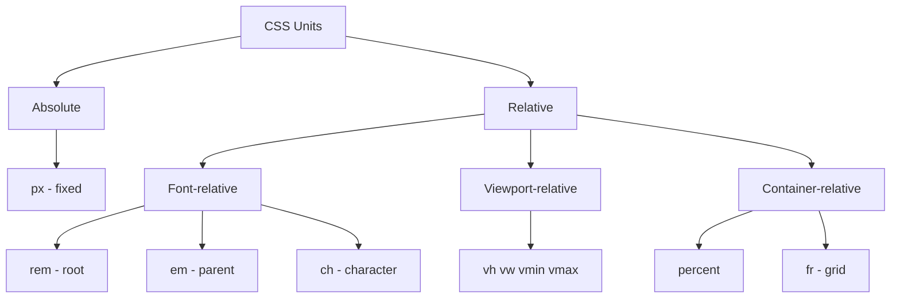

#### Interview Question
**Q:** Rem aur em me kab kaunsa use karoge?

**A:** Rem use kar jab tu chahta hai value root font-size se predictably calculate ho — for example, spacing (`padding: 2rem`), font sizes overall, breakpoints. Yeh consistent rakhega across the app.

Em use kar jab tu chahta hai value local context se relate kare — for example, ek button ke andar icon ka size button ke font-size proportionate ho (`font-size: 1.5em`), ya nested lists me indentation. Em compounding ka issue hota hai (parent 1.2em, child 1.2em = 1.44em actual), to deeply nested structures me careful rahna padta hai. Senior dev rule of thumb: layout/spacing ke liye rem, component-internal sizing ke liye em.

---

## 4. Layout

### 4.1 Display types (block, inline, inline-block, none)

#### Definition
`display` property element ke fundamental layout behaviour ko decide karti hai. Block elements (`<div>`, `<p>`) full width lete hain aur new line pe start hote hain — soch lo paragraphs in a notebook. Inline elements (`<span>`, `<a>`) sirf utni jagah lete hain jitni content ki zaroorat hai aur same line pe rehte hain — yeh wo highlighter words ki tarah hain. Inline-block hybrid hai — same line pe rehta hai par width/height set kar sakte ho. `display: none` element ko DOM se visually hata deta hai — space bhi nahi leta.

#### Why?
Default display values har element ki HTML semantics se aati hain, par UI banane me hume aksar override karna padta hai. Ek `<a>` ko button banana hai? `display: inline-block` chahiye taaki padding work kare. Mobile pe menu hide karna hai? `display: none`. Yeh fundamental hai — bina samjhe tu intermediate layouts pe nahi ja sakta.

#### How?
```css
/* Block — full width, new line */
.section { display: block; }

/* Inline — content width, same line */
.tag { display: inline; }
/* width/height ignored, padding-top/bottom weird */

/* Inline-block — best of both */
.btn-link {
  display: inline-block;
  padding: 12px 24px;
  width: 120px;
}

/* None — completely hidden */
.modal-hidden { display: none; }

/* Modern — flex aur grid bhi display values hain */
.container { display: flex; }
```

#### Real-life Example
Navigation menu — desktop pe horizontal (inline), mobile pe vertical (block).

```css
.nav-item {
  display: block;  /* mobile default */
  padding: 12px 16px;
}

@media (min-width: 768px) {
  .nav-item {
    display: inline-block;
    padding: 8px 20px;
  }
}

.mobile-menu-toggle { display: block; }
@media (min-width: 768px) {
  .mobile-menu-toggle { display: none; }
}
```

#### Diagram
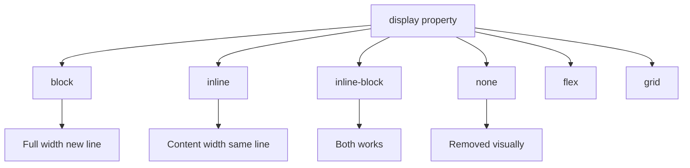

#### Interview Question
**Q:** `display: none` aur `visibility: hidden` me kya difference hai?

**A:** `display: none` element ko layout flow se completely remove kar deta hai — wo space bhi nahi leta, screen readers ko bhi nahi dikhta (mostly). `visibility: hidden` element ko invisible karta hai but space reserved rakhta hai aur layout me presence maintain karta hai.

Production scenario: agar tu accordion bana raha hai jaha content collapse hone pe layout shift na ho, `visibility: hidden` better hai. Agar mobile pe sidebar completely hata na hai, `display: none` use kar. Ek third option `opacity: 0` bhi hai — yeh visibility: hidden jaisa hai but element clickable rehta hai aur transitions me kaam aata hai. Animation ke liye opacity, layout removal ke liye display, space-preserving hide ke liye visibility — yeh decision matrix hai.

---

### 4.2 Position (static, relative, absolute, fixed, sticky)

#### Definition
`position` property element ko document flow se decouple karne ka tool hai. `static` default hai — element normal flow me rehta hai. `relative` element ko apne original spot se offset karta hai par space reserved rehta hai. `absolute` element ko nearest positioned ancestor ke relative position karta hai aur normal flow se hata deta hai. `fixed` viewport ke relative position karta hai — scroll pe bhi same jagah rehta hai. `sticky` hybrid hai — pehle relative ki tarah behave karta hai, phir threshold pe fixed ban jata hai.

Sochiye ek bus me — static seats fixed jagah hain (normal flow), relative me thoda left-right shift kar sakte ho seat me, absolute me chal ke kahin bhi standing kar sakte ho, fixed driver ki seat hai, aur sticky wo passenger hai jo apni stop tak baitha hai phir door pe khada ho jata hai.

#### Why?
Modern UIs me overlays, dropdowns, modals, sticky headers — yeh sab position ke bina impossible hain. Sticky table headers, fixed navigation, absolute-positioned tooltips — daily real cases hain. Position galat use karne se z-index wars aur layout chaos ho jata hai.

#### How?
```css
/* Default flow */
.box { position: static; }

/* Relative — offset original position */
.shifted {
  position: relative;
  top: 10px;
  left: 20px;
}

/* Absolute — needs positioned ancestor */
.parent { position: relative; }
.tooltip {
  position: absolute;
  top: 100%;
  left: 0;
}

/* Fixed — relative to viewport */
.floating-cta {
  position: fixed;
  bottom: 24px;
  right: 24px;
}

/* Sticky — magical */
.section-header {
  position: sticky;
  top: 0;
  background: white;
}
```

#### Real-life Example
E-commerce ki product detail page jaha "Add to cart" button mobile pe scroll karne pe bottom me stick ho jata hai.

```css
.product-page {
  padding-bottom: 80px; /* sticky CTA ke liye space */
}

.add-to-cart-bar {
  position: sticky;
  bottom: 0;
  background: white;
  padding: 16px;
  box-shadow: 0 -2px 8px rgba(0,0,0,0.1);
  z-index: 10;
}

.product-image-zoom {
  position: absolute;
  inset: 0; /* shorthand for top/right/bottom/left: 0 */
  background: rgba(0,0,0,0.9);
}
```

#### Diagram
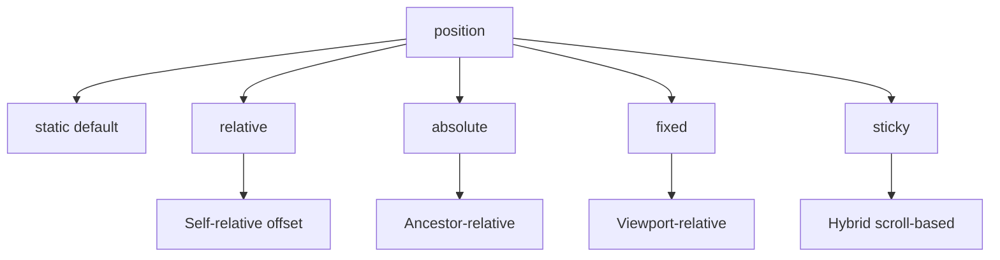

#### Interview Question
**Q:** `position: absolute` element kis ke relative position hota hai?

**A:** Nearest ancestor ke relative jiska position `static` ke alawa kuch bhi set ho — usually `relative`. Agar koi positioned ancestor nahi hai to wo `<html>` (initial containing block) ke relative position hota hai.

Production gotcha: agar tu tooltip bana raha hai aur uska parent `position: relative` set karna bhool gaya, to tooltip page me random jagah jaake bait jayega kyunki wo body ke relative go raha hai. Senior dev pattern — jab bhi component me kuch absolute place karna ho, parent pe `position: relative` mandatory rakhna chahiye, ye component ki "containment boundary" define karta hai. CSS variables ke saath combined kar to design system level pe yeh predictable ho jata hai.

---

### 4.3 Flexbox — axis, justify-content, align-items, gap

#### Definition
Flexbox basically tumhe ek dimension me items distribute karne deta hai. Pehle float aur position se layout karna torture tha — center karna ek meme tha CSS me. Flexbox ne sab fix kar diya. Flex container ka ek main axis hota hai (default horizontal) aur ek cross axis (default vertical). `justify-content` main axis pe distribute karta hai, `align-items` cross axis pe align karta hai, aur `gap` items ke beech space deta hai.

Sochiye ek line me khade ladke — coach bolta hai "evenly spread ho jao" (justify-content: space-between), ya "saare ek dam center me aao" (justify-content: center), ya "saare ek dusre se 1 meter door rahe" (gap: 1m).

#### Why?
Flexbox 1D layouts ke liye perfect hai — navigation bars, button groups, card actions, form rows. Bina flexbox ke center karne ke liye absolute positioning + transforms ka jugaad karna padta tha. Ab `display: flex; justify-content: center; align-items: center;` aur khatam.

#### How?
```css
.flex-container {
  display: flex;
  flex-direction: row;          /* main axis horizontal */
  justify-content: space-between; /* main axis distribution */
  align-items: center;          /* cross axis alignment */
  gap: 16px;                    /* items ke beech space */
  flex-wrap: wrap;              /* multi-line allow */
}

.flex-item {
  flex: 1 1 200px;
  /* grow shrink basis */
}

/* Center content perfectly — classic */
.centered {
  display: flex;
  justify-content: center;
  align-items: center;
  min-height: 100vh;
}
```

#### Real-life Example
Header with logo on left, nav in center, user actions on right — classic flex pattern.

```css
.app-header {
  display: flex;
  align-items: center;
  justify-content: space-between;
  padding: 0 24px;
  height: 64px;
  border-bottom: 1px solid #e2e8f0;
}

.app-header .nav {
  display: flex;
  gap: 24px;
  align-items: center;
}

.app-header .user-actions {
  display: flex;
  gap: 12px;
  align-items: center;
}

@media (max-width: 768px) {
  .app-header .nav { display: none; }
}
```

#### Diagram
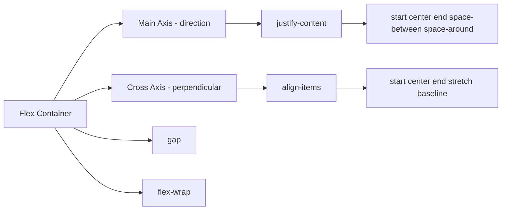

#### Interview Question
**Q:** `flex: 1` shorthand ka kya matlab hai?

**A:** `flex: 1` ka full form hai `flex: 1 1 0%` — yaani `flex-grow: 1`, `flex-shrink: 1`, `flex-basis: 0%`. Iska practical effect ye hai ki item available space me equally distribute ho jata hai apne siblings ke saath, content size ko ignore karke.

Compare karo `flex: auto` (1 1 auto) se — wo content size ko respect karta hai phir bachi space distribute karta hai. Aur `flex: none` (0 0 auto) item ko fixed rakhta hai. Production use case — agar tu sidebar + main content layout bana raha hai aur main ko full available space dena hai, `flex: 1` use kar. Agar tu equal columns chahiye irrespective of content, sabko `flex: 1` de — yeh table-layout: fixed ka modern equivalent hai.

---

### 4.4 CSS Grid — template, areas, auto-fit/auto-fill, minmax

#### Definition
Grid 2D layout system hai — rows aur columns dono me items arrange karna. Flexbox 1D hai (ya row ya column), Grid 2D hai (rows aur columns simultaneously). Sochiye Excel sheet — defined rows aur columns hain, har cell me data daal sakte ho. CSS Grid bilkul yahi karta hai par bohot zyada powerful — `grid-template-areas` se tu literally layout ka ASCII art bana sakta hai.

`auto-fit` aur `auto-fill` responsive grids ke liye magical hain — bina media queries ke columns automatically adjust ho jaate hain. `minmax(min, max)` ek column ki minimum aur maximum size define karta hai, jo overflow aur tiny columns dono prevent karta hai.

#### Why?
Pehle 2D layouts ke liye nested flexboxes ya floats ka jugaad chalta tha — fragile aur ugly. Grid se entire page layout ek container me define ho jata hai. Dashboard, magazine layouts, photo galleries — Grid in sab ke liye purpose-built hai.

#### How?
```css
.dashboard {
  display: grid;
  grid-template-columns: 240px 1fr;
  grid-template-rows: 64px 1fr;
  grid-template-areas:
    "sidebar header"
    "sidebar main";
  height: 100vh;
}

.sidebar { grid-area: sidebar; }
.header  { grid-area: header; }
.main    { grid-area: main; }

/* Responsive grid bina media queries ke */
.product-grid {
  display: grid;
  grid-template-columns: repeat(auto-fit, minmax(250px, 1fr));
  gap: 24px;
}
```

#### Real-life Example
E-commerce listing — cards automatically adjust based on viewport. 1200px pe 4 columns, 800px pe 3, 500px pe 2, mobile pe 1 — sab without media queries.

```css
.product-listing {
  display: grid;
  grid-template-columns: repeat(auto-fit, minmax(280px, 1fr));
  gap: 1.5rem;
  padding: 2rem;
}

.product-card {
  display: grid;
  grid-template-rows: 200px auto auto 1fr auto;
  gap: 12px;
  padding: 16px;
  border: 1px solid #e2e8f0;
  border-radius: 8px;
}
```

#### Diagram
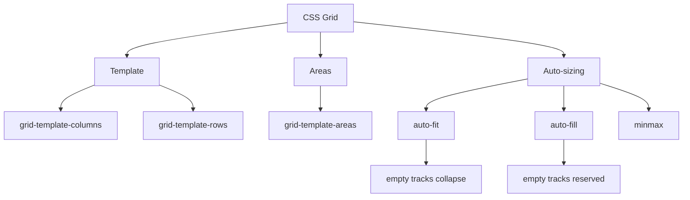

#### Interview Question
**Q:** `auto-fit` aur `auto-fill` me kya difference hai?

**A:** Dono `repeat()` me use hote hain responsive grids ke liye. Difference yeh hai — `auto-fill` empty tracks ko bhi reserve karke rakhta hai (matlab agar 5 column fit ho sakti hain par 3 items hi hain to 2 empty columns ki space ghair ki ghair pakdi rahegi). `auto-fit` empty tracks ko collapse kar deta hai aur existing items ko stretch karke available space fill karta hai.

Practical: agar tu chahta hai cards stretch ho jab kam ho to `auto-fit` use kar — yeh visually better dikhta hai. Agar tu chahta hai cards apni minimum size pe rahein chahe space ho ya na ho (e.g., consistent card sizes), `auto-fill` use kar. Production me 90% cases me `auto-fit` use hota hai with `minmax` for fluid responsive grids.

---

## 5. Responsive design

### 5.1 Media queries, breakpoints

#### Definition
Media queries CSS ka tool hain jisse tu different screen sizes, orientations, aur device features ke liye different styles apply karta hai. Breakpoints wo specific widths hain jaha tu layout change karna decide karta hai — typically common breakpoints 480px (mobile), 768px (tablet), 1024px (laptop), 1280px (desktop).

Sochiye ek shop ka layout — chhoti shop me sab kuch ek line me, badi shop me alag-alag sections, mall me to entire floors. Media queries CSS me yahi karte hain — viewport size ke hisaab se layout adapt karna.

#### Why?
2026 me 60%+ traffic mobile se aata hai. Agar tu sirf desktop ke liye design karega to half users ko unusable site milegi. Responsive design optional nahi hai, mandatory hai. Plus Google ka mobile-first indexing — SEO bhi affect hota hai.

#### How?
```css
/* Mobile first — base styles for small screens */
.container {
  padding: 1rem;
  font-size: 14px;
}

/* Tablet and up */
@media (min-width: 768px) {
  .container {
    padding: 2rem;
    font-size: 16px;
  }
}

/* Desktop */
@media (min-width: 1024px) {
  .container {
    max-width: 1200px;
    margin: 0 auto;
    padding: 3rem;
  }
}

/* Specific feature queries */
@media (prefers-color-scheme: dark) {
  body { background: #1a1a1a; color: white; }
}

@media (prefers-reduced-motion: reduce) {
  * { animation: none !important; }
}
```

#### Real-life Example
News website jaha desktop pe 3-column layout (sidebar, main article, related), tablet pe 2-column (main + sidebar combined), mobile pe single column.

```css
.article-layout {
  display: grid;
  grid-template-columns: 1fr;
  gap: 1rem;
}

@media (min-width: 768px) {
  .article-layout {
    grid-template-columns: 2fr 1fr;
  }
}

@media (min-width: 1200px) {
  .article-layout {
    grid-template-columns: 200px 1fr 300px;
  }
}
```

#### Diagram
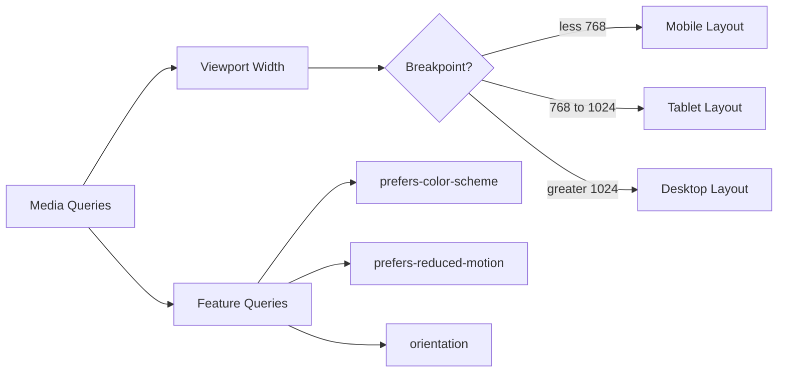

#### Interview Question
**Q:** Tum kaunse breakpoints use karte ho aur kyun?

**A:** Honest answer — fixed device-based breakpoints (iPad, iPhone) ek anti-pattern hain kyunki devices kabhi same nahi rehte. Better approach hai content-based breakpoints — tu apne layout ko slowly resize kar aur jaha bhi wo "tooth" jaye, wahan breakpoint daal.

Common starting set: 480px, 768px, 1024px, 1280px. Tailwind CSS ki defaults achhi hain (sm: 640, md: 768, lg: 1024, xl: 1280, 2xl: 1536). Production tip — design tokens me breakpoints rakh aur sabhi components me consistent use kar. Aur container queries (newer CSS) component-level responsive design enable karta hai jo aur powerful hai because component apne size pe react karta hai, viewport pe nahi.

---

### 5.2 Mobile-first vs desktop-first

#### Definition
Mobile-first design philosophy hai jaha tu pehle mobile ke liye design karta hai aur phir progressive enhancement se larger screens ke liye styles add karta hai. CSS me yeh `min-width` media queries se hota hai. Desktop-first inverse hai — pehle desktop ke liye design phir `max-width` queries se mobile ke liye scale down.

Sochiye recipe likhna — mobile-first me tu basic recipe likhta hai jo sab samajh sakein, phir advanced cooking tips add karta hai. Desktop-first me tu master chef recipe likhta hai phir simplify karne ke nuskhe likhta hai. Pehla approach naturally inclusive hai.

#### Why?
Mobile-first 2026 me default hai. Reasons — performance (mobile pe minimum CSS load hota hai initially), progressive enhancement (constraint-driven design better hota hai), aur Google's mobile-first indexing. Jab tu mobile-first sochta hai to tu prioritise karta hai content over decoration.

#### How?
```css
/* Mobile-first approach — RECOMMENDED */
.card {
  padding: 1rem;
  font-size: 14px;
  flex-direction: column;
}

@media (min-width: 768px) {
  .card {
    padding: 2rem;
    font-size: 16px;
    flex-direction: row;
  }
}

/* Desktop-first approach — older style */
.card-old {
  padding: 2rem;
  font-size: 16px;
  flex-direction: row;
}

@media (max-width: 767px) {
  .card-old {
    padding: 1rem;
    font-size: 14px;
    flex-direction: column;
  }
}
```

#### Real-life Example
Pricing table — mobile pe stacked vertical, desktop pe side-by-side comparison.

```css
.pricing-table {
  display: grid;
  grid-template-columns: 1fr;
  gap: 1rem;
}

.pricing-card {
  padding: 1.5rem;
  border: 1px solid #e2e8f0;
}

.pricing-card .features {
  display: none; /* mobile pe hide, expand on tap */
}

@media (min-width: 768px) {
  .pricing-table {
    grid-template-columns: repeat(3, 1fr);
  }
  
  .pricing-card .features {
    display: block;
  }
}
```

#### Diagram
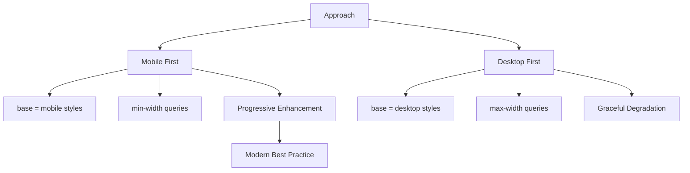

#### Interview Question
**Q:** Mobile-first kyun preferred hai modern web me?

**A:** Three big reasons. Pehla — performance. Mobile users typically slower networks aur weaker devices use karte hain. Mobile-first me base CSS minimal hota hai aur larger styles progressively load hote hain. Desktop-first me mobile users ko unnecessary heavy styles parse karne padte hain.

Doosra — design discipline. Jab tu chhote screen se start karta hai to tu content prioritise karta hai — kya zaroori hai vs kya nice-to-have. Yeh better UX banata hai. Teesra — Google's mobile-first indexing search rankings ke liye mobile version ko primary maanti hai. Production me 99% modern teams mobile-first follow karti hain — Tailwind, Bootstrap 5, Material UI sab is approach pe built hain.

---

## 6. Advanced

### 6.1 Animations & transitions, keyframes

#### Definition
Transitions ek property ke do states ke beech smooth interpolation karte hain — typically hover/focus/active states ke liye. Animations zyada powerful hain — multi-step keyframe-based motion define kar sakte ho jo automatically chal sakti hain (without user interaction). Keyframes wo waypoints hain animation me — "0% pe yahan, 50% pe yahan, 100% pe wahan".

Sochiye dance moves — transition do poses ke beech smooth movement hai (haath upar se neeche). Animation pure choreography hai with multiple steps timed in sequence.

#### Why?
UI without motion robotic feel hota hai. Subtle animations hierarchy convey karte hain (jaise modal slide-in se attention attract karta hai), feedback dete hain (button press), aur perceived performance improve karte hain (loading skeletons). Par overdo karne se annoying ho jata hai — `prefers-reduced-motion` respect karna mandatory hai.

#### How?
```css
/* Transition — state change */
.btn {
  background: blue;
  transform: translateY(0);
  transition: background 0.2s ease, transform 0.2s ease;
}

.btn:hover {
  background: darkblue;
  transform: translateY(-2px);
}

/* Animation — keyframes */
@keyframes slideInFromBottom {
  from {
    opacity: 0;
    transform: translateY(20px);
  }
  to {
    opacity: 1;
    transform: translateY(0);
  }
}

.modal {
  animation: slideInFromBottom 0.3s ease-out;
}

/* Multi-step keyframes */
@keyframes pulse {
  0%, 100% { transform: scale(1); }
  50%      { transform: scale(1.05); }
}

.notification-badge {
  animation: pulse 2s ease-in-out infinite;
}
```

#### Real-life Example
Loading skeleton screens jaisa LinkedIn, Facebook me dikhta hai — content load hone se pehle gray boxes pulse karte hain.

```css
@keyframes shimmer {
  0%   { background-position: -200% 0; }
  100% { background-position: 200% 0; }
}

.skeleton {
  background: linear-gradient(
    90deg,
    #f0f0f0 25%,
    #e0e0e0 50%,
    #f0f0f0 75%
  );
  background-size: 200% 100%;
  animation: shimmer 1.5s infinite;
  border-radius: 4px;
}

@media (prefers-reduced-motion: reduce) {
  .skeleton { animation: none; background: #e0e0e0; }
}
```

#### Diagram
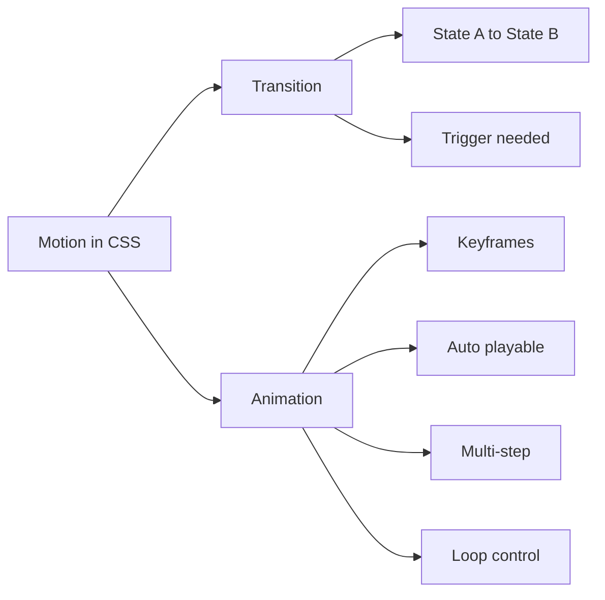

#### Interview Question
**Q:** Animation perform kaunse properties pe karna chahiye smoothness ke liye?

**A:** Sirf `transform` aur `opacity` pe animate karna chahiye production me. Reason — yeh dono properties browser ki compositor thread pe handle hoti hain aur GPU-accelerated hain, jisse 60fps animations smoothly chalti hain. `width`, `height`, `top`, `left`, `margin` pe animate karna mat — yeh layout reflow trigger karte hain jo expensive hai.

Practical example — ek modal slide-in karne ke liye `top` animate karne se janky hoga, par `transform: translateY()` use karne se silky smooth hoga. Aur `will-change: transform` hint browser ko optimisation prep karne deta hai par overuse mat kar — sirf jab actually animate kar raha ho. Senior dev rule — agar animation jaank kar rahi hai, DevTools Performance tab kholo aur dekho kahan layout/paint trigger ho raha hai.

---

### 6.2 Transform — translate, rotate, scale, 3D

#### Definition
`transform` property element ko visually move, rotate, scale, ya skew karne deti hai bina layout ko affect kiye. Yaani element apni original space pe occupy karta rehega but visually kahin aur dikhega. Functions: `translate(x, y)` move karne ke liye, `rotate(deg)` ghumane ke liye, `scale(n)` size badhane/ghatane ke liye, aur `skew()` tilt karne ke liye. 3D variants bhi hain — `translate3d`, `rotateX`, `rotateY`, `perspective`.

Sochiye photo editing — tu photo ko tilt karta hai, zoom karta hai, ya rotate karta hai — actual photo ki position file system me change nahi hoti, sirf display change hoti hai. CSS transform exactly yahi karta hai.

#### Why?
Transforms GPU-accelerated hain to performance ke liye best. Layout-affecting properties (top, left, width) ke jagah transforms use karne se animations smooth chalti hain. 3D transforms se card flips, carousels, aur cool effects ban sakte hain.

#### How?
```css
/* Translate — move without changing layout */
.tooltip {
  transform: translate(-50%, -100%);
}

/* Rotate */
.spinning-icon {
  transform: rotate(45deg);
}

/* Scale — size change */
.zoom-on-hover {
  transition: transform 0.3s;
}
.zoom-on-hover:hover {
  transform: scale(1.1);
}

/* Multiple — order matters */
.transformed {
  transform: translate(20px, 0) rotate(15deg) scale(1.2);
}

/* 3D — card flip */
.card-3d {
  perspective: 1000px;
}
.card-3d-inner {
  transition: transform 0.6s;
  transform-style: preserve-3d;
}
.card-3d:hover .card-3d-inner {
  transform: rotateY(180deg);
}
```

#### Real-life Example
Image gallery jaha thumbnail hover pe slightly zoom karta hai aur lightbox open hone pe scale-up animate hota hai.

```css
.gallery-thumb {
  overflow: hidden;
  border-radius: 8px;
}

.gallery-thumb img {
  width: 100%;
  height: 100%;
  object-fit: cover;
  transition: transform 0.4s ease;
}

.gallery-thumb:hover img {
  transform: scale(1.08);
}

@keyframes lightbox-in {
  from { transform: scale(0.8); opacity: 0; }
  to   { transform: scale(1);   opacity: 1; }
}

.lightbox {
  animation: lightbox-in 0.25s ease-out;
}
```

#### Diagram
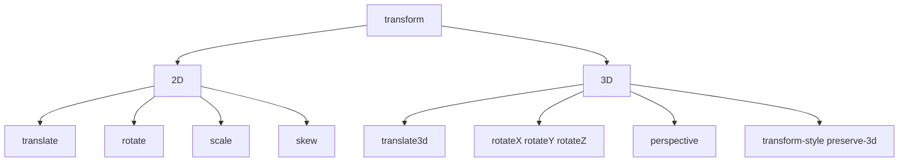

#### Interview Question
**Q:** `transform: translate()` aur `position` based movement me kya farak hai performance ke liye?

**A:** `position: absolute` ke saath `top/left` change karne se browser har frame pe layout recalculation karta hai (reflow), jo expensive hai aur janky animations create karta hai. `transform: translate()` browser ko hint deta hai ki sirf compositing layer move karna hai — koi layout change nahi.

Practical implication — agar tu drag-and-drop ya scroll-linked animation bana raha hai, transform mandatory hai 60fps ke liye. Plus transforms GPU pe offload hote hain to main thread free rehta hai (jo JavaScript execute kar raha hota hai). Senior dev mantra — "animate transform and opacity, nothing else" — yeh modern web performance ki cornerstone hai.

---

### 6.3 CSS variables (custom properties), fallbacks

#### Definition
CSS variables (officially "custom properties") tujhe values ko reusable tokens ke roop me define karne dete hain. `--variable-name` se declare karte hain aur `var(--variable-name)` se use. SCSS variables ke unlike, CSS variables runtime me hote hain — JavaScript se modify ho sakte hain, media queries me change kar sakte ho, scope inheritance follow karte hain.

Sochiye ek company me brand colors — har designer ko har baar exact hex code yaad rakhna padega? Nahi — ek brand guide hota hai jisme `primary-blue: #007bff` define hai. CSS variables wahi role play karte hain.

#### Why?
Maintainability — agar primary color change karna hai, ek jagah change kar to puri site me reflect ho. Theming — dark mode, white-label products easily implement ho jate hain. Runtime dynamic — JavaScript se variables update karke dynamic UI ban sakti hai. Component APIs — components customize karne ka clean way.

#### How?
```css
/* Root level — globally available */
:root {
  --color-primary: #3b82f6;
  --color-primary-dark: #1d4ed8;
  --spacing-unit: 8px;
  --radius-md: 6px;
  --font-base: 16px;
}

/* Use with var() — fallback support */
.btn {
  background: var(--color-primary, blue); /* fallback if undefined */
  padding: calc(var(--spacing-unit) * 2);
  border-radius: var(--radius-md);
  font-size: var(--font-base);
}

/* Scoped — only inside .dark */
.dark {
  --color-primary: #60a5fa;
  --color-bg: #1a1a1a;
  --color-text: #f5f5f5;
}

/* Dynamic via JS-friendly */
.progress-bar {
  --progress: 0%;
  width: var(--progress);
  transition: width 0.3s;
}
/* JS: element.style.setProperty('--progress', '75%') */
```

#### Real-life Example
Design system me theming. Light/dark mode toggle bina puri CSS rewrite kiye.

```css
:root {
  --bg-primary: #ffffff;
  --bg-secondary: #f7fafc;
  --text-primary: #1a202c;
  --text-secondary: #4a5568;
  --border: #e2e8f0;
  --accent: #3182ce;
}

[data-theme="dark"] {
  --bg-primary: #1a202c;
  --bg-secondary: #2d3748;
  --text-primary: #f7fafc;
  --text-secondary: #cbd5e0;
  --border: #4a5568;
  --accent: #63b3ed;
}

body {
  background: var(--bg-primary);
  color: var(--text-primary);
}

.card {
  background: var(--bg-secondary);
  border: 1px solid var(--border);
  color: var(--text-primary);
}
```

#### Diagram
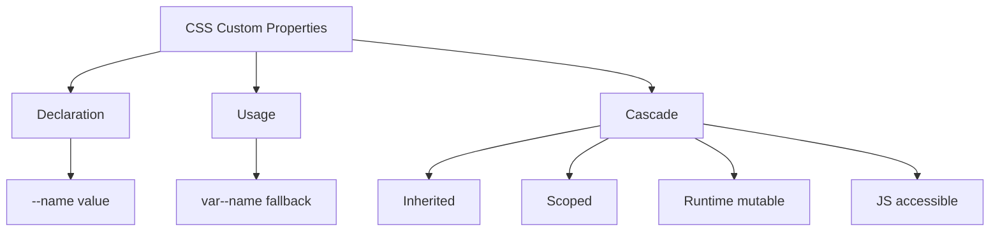

#### Interview Question
**Q:** CSS custom properties aur SCSS variables me kya difference hai?

**A:** SCSS variables compile-time pe resolve hote hain — yaani `$primary: blue` SCSS me likha to compile hone ke baad CSS me literally `blue` hi rahega. Wo runtime me change nahi ho sakte. CSS custom properties (`--primary: blue`) runtime me live hote hain — DOM ka part hain, JavaScript se modify ho sakte hain, cascade follow karte hain, aur scope respect karte hain.

Practical implication — theming ke liye CSS variables better hain (dark mode toggle without page reload). Calculations aur logic-heavy stuff jaha runtime me change nahi chahiye, SCSS variables better hain because no runtime overhead. Modern best practice — design tokens CSS variables me, internal SCSS computations SCSS variables me. Both ko complementary tools ki tarah use karna chahiye, replacement nahi.

---

### 6.4 BEM methodology

#### Definition
BEM yaani Block Element Modifier — ek naming convention hai jo CSS architecture ko predictable banati hai. Block ek standalone entity hai (`.card`), Element block ka part hai (`.card__title`), aur Modifier block ya element ka variant (`.card--featured`, `.card__title--large`). Format: `block__element--modifier`.

Sochiye lego pieces — har block ek standalone unit hai, uski parts hain (elements), aur har piece ka color variant ya size variant ho sakta hai (modifiers). BEM CSS ko bilkul aise hi modular bana deta hai.

#### Why?
Bina BEM ke CSS classes randomly named ho jaati hain — `.title`, `.big-title`, `.title-2`, kuch samajh nahi aata. Specificity wars hote hain. BEM se har class self-documenting ho jaati hai — naam dekh ke pata chal jata hai konsa block, konsa part, aur kya variant. Plus flat specificity — saare classes single-class selectors hote hain.

#### How?
```css
/* Block */
.card { 
  padding: 16px;
  border-radius: 8px;
}

/* Elements */
.card__header {
  border-bottom: 1px solid #eee;
}

.card__title {
  font-size: 18px;
  font-weight: 600;
}

.card__body {
  padding-top: 16px;
}

/* Modifiers */
.card--featured {
  background: linear-gradient(135deg, #667eea, #764ba2);
  color: white;
}

.card__title--large {
  font-size: 24px;
}
```

```html
<div class="card card--featured">
  <div class="card__header">
    <h2 class="card__title card__title--large">Premium Plan</h2>
  </div>
  <div class="card__body">Content here</div>
</div>
```

#### Real-life Example
Form component with multiple states — default, error, success.

```css
.form-field { display: flex; flex-direction: column; gap: 4px; }
.form-field__label { font-size: 14px; font-weight: 500; }
.form-field__input {
  padding: 8px 12px;
  border: 1px solid #cbd5e0;
  border-radius: 4px;
}
.form-field__error { color: red; font-size: 12px; }

.form-field--error .form-field__input {
  border-color: red;
}
.form-field--success .form-field__input {
  border-color: green;
}
.form-field--disabled .form-field__input {
  background: #f7fafc;
  cursor: not-allowed;
}
```

#### Diagram
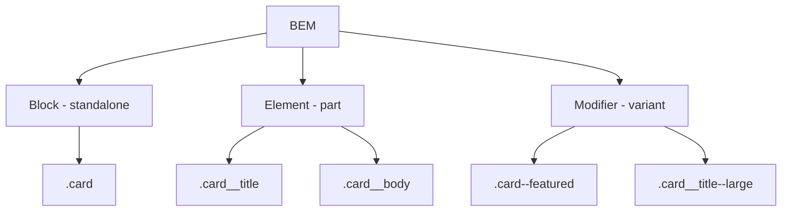

#### Interview Question
**Q:** BEM ke alternatives kya hain aur kab kya use karna chahiye?

**A:** Modern alternatives — CSS Modules (scoped CSS automatically with build tools), CSS-in-JS (styled-components, emotion), aur utility-first (Tailwind CSS). Har approach ka apna trade-off hai.

BEM best hai jab tu plain CSS ya SCSS likh raha hai bina build tool magic ke — predictable, no setup, framework-agnostic. CSS Modules React/Next.js apps me automatically scoping deti hain to BEM ki manual discipline nahi chahiye. Tailwind utility-first approach me class composition se design system enforce hota hai but HTML thoda verbose ho jata hai. Production teams aksar hybrid approach lete hain — Tailwind utilities for layout/spacing, CSS Modules for component-specific styles, aur global tokens via CSS variables. BEM seekhna still valuable hai because uska mindset (component-thinking) sab approaches me transferable hai.

---

### 6.5 SASS/SCSS basics — variables, mixins, nesting

#### Definition
SASS (Syntactically Awesome Style Sheets) CSS ka preprocessor hai — yaani tu SCSS likhta hai aur compile hone pe plain CSS me convert ho jata hai. SCSS ke superpowers — variables (`$primary: blue`), nesting (parent ke andar children selectors), mixins (reusable style blocks), functions, partials (modular files), inheritance (`@extend`). Yeh sab features plain CSS me limitedly available hain par SCSS me cleaner hain.

Sochiye plain CSS as walking, SCSS as bicycle — same destination par bohot zyada efficiently. Modern projects me SCSS still relevant hai especially design systems aur component libraries me.

#### Why?
Variables for consistency, nesting for readability, mixins for DRY (Don't Repeat Yourself). Ek media query mixin likh ke pure project me use kar sakte ho. Color manipulation functions (`darken`, `lighten`) design tokens ke liye god-tier hain. Partials se styles ko modular files me organize kar sakte ho.

#### How?
```scss
// Variables
$primary: #3b82f6;
$spacing-unit: 8px;
$breakpoint-md: 768px;

// Mixin — reusable block
@mixin flex-center {
  display: flex;
  justify-content: center;
  align-items: center;
}

@mixin respond-to($breakpoint) {
  @media (min-width: $breakpoint) {
    @content;
  }
}

// Nesting — parent context
.card {
  padding: $spacing-unit * 2;
  background: white;
  
  &__title {
    font-size: 18px;
    
    &--large {
      font-size: 24px;
    }
  }
  
  &:hover {
    background: lighten($primary, 40%);
  }
  
  @include respond-to($breakpoint-md) {
    padding: $spacing-unit * 4;
  }
}

// Use mixin
.modal {
  @include flex-center;
  position: fixed;
  inset: 0;
}
```

#### Real-life Example
Design system me theming with SCSS maps and functions.

```scss
$colors: (
  primary: #3b82f6,
  success: #10b981,
  danger:  #ef4444,
  warning: #f59e0b
);

@function color($name) {
  @return map-get($colors, $name);
}

@mixin button-variant($name) {
  background: color($name);
  border: 1px solid darken(color($name), 10%);
  
  &:hover {
    background: darken(color($name), 5%);
  }
}

.btn-primary { @include button-variant(primary); }
.btn-success { @include button-variant(success); }
.btn-danger  { @include button-variant(danger); }
```

#### Diagram
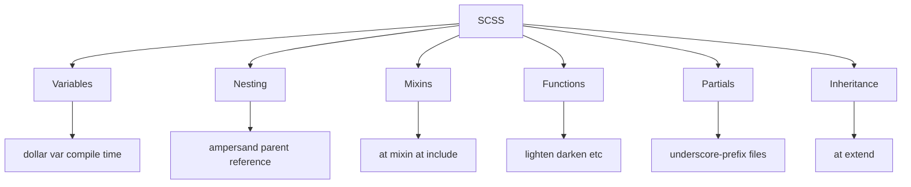

#### Interview Question
**Q:** Modern projects me SCSS abhi bhi relevant hai jab CSS itni powerful ho gayi hai?

**A:** Honest answer — CSS bohot zyada catch up kar chuki hai. Custom properties (variables), `:has()` selector, `@layer`, container queries, nesting (native CSS nesting ab supported hai) — yeh sab features SCSS ki kuch features ko obsolete kar rahe hain. Par SCSS abhi bhi value add karta hai mixins, functions, control flow (`@if`, `@for`, `@each`), aur color manipulation me.

Production decision factors — agar tu bare-metal React/Next.js project me hai with build tools, CSS Modules + custom properties usually sufficient hain. Agar tu component library bana raha hai jaha advanced computations aur token transformations chahiye, SCSS still useful. Tailwind users ke liye SCSS almost irrelevant hai. My take — naye projects me native CSS try kar pehle, SCSS sirf jab specific need ho. Legacy codebases me already integrated hai to use karte rahna fine hai. Yeh "yes/no" question nahi hai, "right tool for context" question hai.

---

## Resources & further reading

- **MDN Web Docs** (developer.mozilla.org) — CSS reference ki bible. Har property pe authoritative documentation, browser compatibility, examples. Pehla bookmark.
- **web.dev** (web.dev) — Google ki team se modern CSS best practices, performance tips, aur Core Web Vitals related guidance. Practical aur production-focused.
- **CSS-Tricks** (css-tricks.com) — Chris Coyier ki team ke deep-dive articles. "A Complete Guide to Flexbox" aur "A Complete Guide to Grid" wahan ki classic resources hain.
- **Smashing Magazine** (smashingmagazine.com) — Long-form articles on CSS architecture, design systems, aur advanced topics.
- **CodePen** (codepen.io) — Live experiments, copy-paste karke practice kar. Best way to learn animations.
- **Josh Comeau's CSS course** (joshwcomeau.com) — Paid but highest-quality interactive learning experience for CSS.
- **Kevin Powell on YouTube** — Free top-tier CSS content, beginner se advanced tak.
- **W3C Specs** (w3.org/Style/CSS) — Jab tu language lawyer ban-na chahta hai aur exact behaviour samajhna hai.

Final advice — CSS sirf padh ke nahi seekhi jaati. Daily ek small UI clone kar (Dribbble se inspiration le), DevTools kholke production sites ki CSS dekh, aur BEM/Tailwind/SCSS sab try kar. 6 mahine consistent practice me tu intermediate se senior level pe pohonch jayega.
