# A/B Testing & Experimentation

Bhai, agar tu seriously top 2% data analyst banna chahta hai, toh A/B testing tera asli moat hai. SQL har analyst likh leta hai, dashboards har koi bana leta hai, Python sab seekh lete hain — but proper experiment design karna, MDE calculate karna, CUPED se variance kam karna, SRM pakadna, network effects samajhna — yahan 95% analysts gir jaate hain. Yahin se senior aur junior ka farak start hota hai. Ek galat experiment design CEO ke saamne $10M ki galat decision banwa sakta hai. Ek sahi experiment same $10M bachata hai. Ye stakes hain.

Ye subject mathematics-heavy hai — statistics ka asli khel yahin hota hai. Hypothesis testing ka theory padhna alag baat hai, aur Swiggy ke 2 crore users pe live experiment chalana, peeking se bachna, novelty effect identify karna, marketplace mein network interference handle karna — ye alag level ka game hai. Flipkart Big Billion Days ke pehle 30 din mein 200+ experiments chalte hain — har ek ka MDE, sample size, guardrail metric pre-registered hota hai. Razorpay ka checkout flow ek month mein 15 A/B tests dekh leta hai. CRED ka rewards page continuously experiment-driven hai. Tu agar in companies mein senior analyst banna chahta hai, ye subject IIT-level depth se padhna padega.

Ye guide tujhe bilkul foundation se le ke advanced tak le jaayega — correlation vs causation se shuru, randomization, A/A tests, multi-arm bandits, frequentist vs Bayesian, CUPED variance reduction, heterogeneous treatment effects, SRM checks, network effects in marketplace, aur sab common pitfalls (peeking, novelty, primacy, winner's curse). Working Python code milega — t-test, chi-square, sample size calc, CUPED implementation, SRM check. Sab Hinglish mein, Indian unicorns ke real examples ke saath. Ye 30+ ghante ka serious investment hai — but iske baad tu interview mein "design an experiment for Swiggy's new homepage" jaisa question 20 minute mein structured framework se crack kar dega.

---

## 1. Foundations of Experimentation

Pehle base solid karte hain. Bina foundation ke advanced techniques bekar hain.

### 1.1 Why experiments — correlation vs causation

#### Definition (kya hai?)

Experiment ek controlled setup hai jisme tu ek treatment apply karta hai (e.g., naya checkout button) ek random sample pe, aur dusre random sample pe nahi (control). Phir dono groups ke outcomes compare karta hai. Kyunki sample randomly assigned hua, koi bhi outcome difference treatment ki wajah se hi hai — confounders cancel out ho jaate hain. Ye **causal inference** ka gold standard hai.

**Correlation** — do variables saath move karte hain. **Causation** — ek variable doosre ko cause karta hai. Correlation milna easy hai, causation prove karna almost-impossible without experimentation.

Famous example: ice cream sales aur drowning deaths correlated hain. Iska matlab ye nahi ki ice cream drowning cause karta hai — confounder hai temperature (garmi mein dono badhte hain).

#### Why?

90% data analyst observational data se "X causes Y" claim karte hain — galat hai. Tu Zomato ka analyst hai aur tu bolta hai "users jinhone Gold subscribe kiya, unka order frequency 3x hai — toh Gold push karo." Selection bias — heavy users hi Gold lete hain (cause-effect reversed). Sirf experiment se tu prove kar sakta hai ki Gold actually frequency cause karta hai vs sirf correlated hai. Top 2% analyst pehla question puchta hai: "ye correlation hai ya causation? Experiment chala kya?"

#### How? (with Python code)

```python
import numpy as np
import pandas as pd
from scipy import stats

# Simulate Swiggy experiment: new homepage vs old
np.random.seed(42)
n = 10000
control_orders = np.random.poisson(lam=2.0, size=n)        # control: avg 2 orders
treatment_orders = np.random.poisson(lam=2.15, size=n)     # treatment: avg 2.15 orders (7.5% lift)

# T-test for difference in means
t_stat, p_value = stats.ttest_ind(treatment_orders, control_orders)
lift = (treatment_orders.mean() - control_orders.mean()) / control_orders.mean()

print(f"Control mean: {control_orders.mean():.3f}")
print(f"Treatment mean: {treatment_orders.mean():.3f}")
print(f"Relative lift: {lift*100:.2f}%")
print(f"t-statistic: {t_stat:.3f}, p-value: {p_value:.4f}")
```

T-statistic formula:
$$ t = \frac{\bar{X}_T - \bar{X}_C}{\sqrt{\frac{s_T^2}{n_T} + \frac{s_C^2}{n_C}}} $$

Standard error:
$$ SE = \sqrt{\frac{\sigma_T^2}{n_T} + \frac{\sigma_C^2}{n_C}} $$

#### Real-life Example

Meesho 2023 — observational data dikha raha tha "users jo recommendation feed dekhte hain woh 40% zyada order karte hain". Product team ne push karna chaha "recommendation feed har user ko force-show karo". Senior analyst ne block kiya — selection bias possible hai (engaged users hi feed scroll karte hain). A/B test chalaya — 50% users ko forced feed dikhaya, 50% ko old. Result — actual lift sirf 4.2%, na ki 40%. ₹15Cr ka galat investment bach gaya. Yahan analyst ne literally company ko crore bachaye sirf "correlation ≠ causation" samjha ke.

#### Diagram

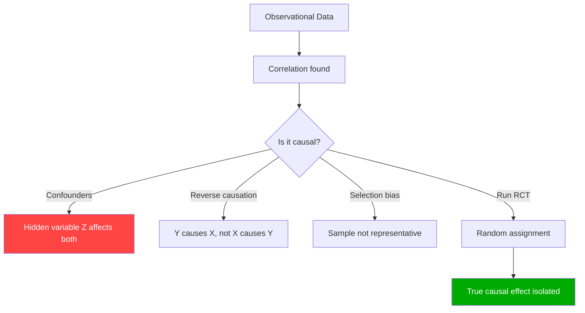

#### Interview Q&A

**Q:** Ek PM tujhse aata hai aur bolta hai "Hamare data se pata chala ki Premium users 3x retention rate rakhte hain — toh humein har user ko Premium trial dena chahiye". Tu kaise respond karega?

**A:** Pehla red flag — ye observational claim hai, causal nahi. Self-selection bias ho sakta hai — heavy/loyal users Premium choose karte hain, Premium unhe loyal nahi banata. Main bolunga: "PM, ye 3x correlation hai. Causal lift 0.3x bhi ho sakta hai aur 3x bhi. Decide karne se pehle hum ek RCT chala sakte hain — random 5% users ko free Premium trial denge, 5% ko nahi denge, 6 weeks ka cohort retention compare karenge. MDE calculate ki hai — agar lift >5% hai toh 50K sample mein detect ho jaayega. Cost ~₹8L, but agar real lift 0.3x hi hai toh humara ₹4Cr Premium-trial-rollout-cost ka galat investment bach jaayega." Top 2% analyst hamesha experiment-first approach proposes — observational claim ko challenge karta hai politely but firmly.

---

### 1.2 Primary, secondary, guardrail metrics, OEC (Overall Evaluation Criterion)

#### Definition (kya hai?)

Har experiment mein 4 types ke metrics hote hain:

- **Primary metric** — woh metric jo experiment ka direct goal capture karta hai. Sirf 1 hota hai. Example: "checkout conversion rate" for a new payment flow test.
- **Secondary metrics** — additional outcomes jo movement explain karte hain. 3-5 hote hain. Example: time-to-checkout, payment success rate, AOV.
- **Guardrail metrics** — woh metrics jo regress nahi hone chahiye. Agar ye gir gaye, experiment fail (chahe primary jeete bhi). Example: page load time, customer support tickets, refund rate.
- **OEC (Overall Evaluation Criterion)** — ek single composite metric jo trade-offs balance karta hai. Microsoft/Google level pe use hota hai. Example: revenue × (1 - bounce_rate_penalty).

#### Why?

99% experiments ka result ek single primary metric pe nahi defined hai — woh trade-off involve karte hain. Razorpay checkout fast banaya — conversion 3% up — but agar fraud rate 2x ho gaya, win nahi hai. Guardrails ke bina tu features ship karega jo short-term jeetein but long-term company ko nuksan dein. OEC formal way hai trade-off encode karne ka. Top 2% analyst experiment ke pehle hi guardrails formally pre-register karta hai.

#### How? (with Python code)

```python
import pandas as pd
import numpy as np
from scipy import stats

# Swiggy experiment: new restaurant ranking algorithm
df = pd.DataFrame({
    'user_id': range(20000),
    'variant': np.random.choice(['control', 'treatment'], 20000),
    'orders_placed': np.random.poisson(2.0, 20000),
    'page_load_ms': np.random.normal(800, 100, 20000),
    'support_ticket': np.random.binomial(1, 0.02, 20000),
    'gmv': np.random.exponential(450, 20000)
})

def evaluate_metric(df, metric, alpha=0.05, guardrail=False):
    c = df[df.variant == 'control'][metric]
    t = df[df.variant == 'treatment'][metric]
    lift = (t.mean() - c.mean()) / c.mean() * 100
    _, p = stats.ttest_ind(t, c)
    verdict = 'WIN' if (p < alpha and lift > 0) else ('LOSS' if p < alpha else 'NEUTRAL')
    if guardrail and lift < -0.5:
        verdict = 'GUARDRAIL BREACH'
    return {'metric': metric, 'lift_%': round(lift, 2), 'p': round(p, 4), 'verdict': verdict}

print(evaluate_metric(df, 'orders_placed'))                    # primary
print(evaluate_metric(df, 'gmv'))                              # secondary
print(evaluate_metric(df, 'page_load_ms', guardrail=True))     # guardrail
print(evaluate_metric(df, 'support_ticket', guardrail=True))   # guardrail
```

#### Real-life Example

CRED ka 2024 experiment — naya rewards algorithm. Primary metric: rewards redemption rate. Secondary: app open frequency, time-in-app. Guardrails: credit card payment success rate, fraud rate, support contact rate. Result — primary +8.5% (jeet), secondary positive, lekin guardrail "support contact rate" +12% breach kar gaya (users confused the by new flow). Decision — experiment kill, despite primary win. Senior analyst ne ₹4Cr ka annualized support cost pre-emptively avoid kiya. Junior analyst sirf primary dekh ke "WIN!" declare kar deta.

#### Diagram

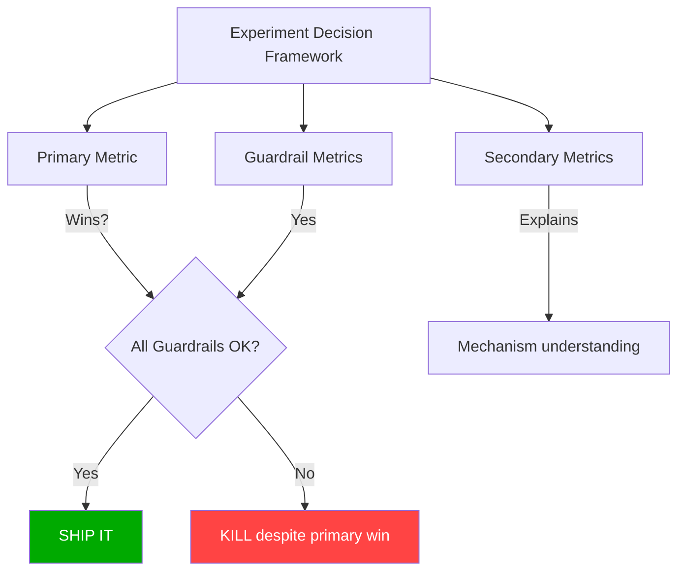

#### Interview Q&A

**Q:** Experiment chala — primary metric (conversion) +5%, p=0.01. Page load time guardrail +200ms (statistically significant degradation). Tu kya recommend karega?

**A:** Kill karna chahiye, ya at minimum hold karna chahiye. Guardrail breach matlab long-term cost short-term win se zyada hai. 200ms latency = ~5-7% extra bounce rate downstream (Amazon/Google research), aur cumulative effect customer NPS pe negative. Main step-by-step jaaunga: (1) Confirm guardrail breach reproducible hai across segments; (2) Latency root cause kya hai — agar engineering fix possible hai, toh fix karke re-test; (3) Agar fundamental architectural change hai, primary win ka NPV calculate karunga aur guardrail loss ka NPV — net negative likely hai; (4) PM/eng ko 1-page memo: "Primary win ₹X Cr/year, latency cost ₹Y Cr/year (estimated from historical bounce-latency curve), recommend: rebuild lighter version, re-test." Top 2% analyst sirf p-value nahi dekhta — second-order effects quantify karta hai.

---

### 1.3 Power analysis & Minimum Detectable Effect (MDE)

#### Definition (kya hai?)

**Statistical power** = probability of detecting a true effect when it exists. Convention: 80% power minimum, 90% better. Power = 1 - β (Type II error rate).

**MDE (Minimum Detectable Effect)** = smallest effect size jo tu given sample size pe statistically detect kar sakta hai with desired power. Formula:

$$ MDE = (z_{1-\alpha/2} + z_{1-\beta}) \cdot \sqrt{\frac{2\sigma^2}{n}} $$

Reverse — required sample size for detecting a target effect:

$$ n = \frac{2\sigma^2 (z_{1-\alpha/2} + z_{1-\beta})^2}{\delta^2} $$

Where δ = absolute effect size you want to detect, σ = std dev of metric, α = significance (typically 0.05), β = 1 - power (typically 0.2).

#### Why?

Bina power analysis ke experiment chalana = blindfold pe dart maarna. Tu agar 5K users pe experiment chalata hai aur tujhe 1% lift detect karna hai, but MDE 5% hai — tu underpowered hai, true 1% lift ko "no effect" declare karega. Reverse — tu 50M users pe experiment chala raha hai 0.1% lift ke liye — overkill, time and opportunity cost waste. Top 2% analyst experiment design ke pehle hamesha sample size calc karta hai.

#### How? (with Python code)

```python
import numpy as np
from scipy import stats
import statsmodels.stats.power as smp

# Swiggy: detect 2% relative lift in checkout conversion (current rate 12%)
baseline_rate = 0.12
mde_relative = 0.02  # 2% relative lift
treatment_rate = baseline_rate * (1 + mde_relative)

# Pooled std for proportion
def required_sample_size(p1, p2, alpha=0.05, power=0.8):
    """Two-proportion z-test sample size"""
    z_alpha = stats.norm.ppf(1 - alpha/2)
    z_beta = stats.norm.ppf(power)
    p_bar = (p1 + p2) / 2
    n = ((z_alpha + z_beta)**2 * 2 * p_bar * (1 - p_bar)) / (p2 - p1)**2
    return int(np.ceil(n))

n_per_arm = required_sample_size(baseline_rate, treatment_rate)
print(f"Sample size needed per arm: {n_per_arm:,}")
print(f"Total sample: {2*n_per_arm:,}")

# Reverse: given n=50000 per arm, what's the MDE?
def mde_for_proportion(p, n, alpha=0.05, power=0.8):
    z_alpha = stats.norm.ppf(1 - alpha/2)
    z_beta = stats.norm.ppf(power)
    se = np.sqrt(2 * p * (1 - p) / n)
    return (z_alpha + z_beta) * se

mde = mde_for_proportion(baseline_rate, 50000)
print(f"MDE at n=50K per arm: {mde:.4f} absolute, {mde/baseline_rate*100:.2f}% relative")
```

#### Real-life Example

Flipkart Big Billion Days 2023 — checkout button color experiment. PM ne bola "5K users pe chala lo, 3 din mein result." Analyst ne power analysis kiya — baseline conversion 8.5%, expected lift 1% relative (yani 0.085 → 0.0859), sigma calculated. Required sample = 1.7M per arm. 5K mein MDE was 18% relative — woh experiment basically kuch detect nahi kar sakta tha unless lift huge tha. Analyst ne sample increase karwaya 2M per arm, BBD ke 3 din pe chalaya. Result — 1.4% lift detected, ₹35Cr GMV impact validated. Power analysis ke bina ye experiment "no effect" declare ho ke ship reject ho jaata.

#### Diagram

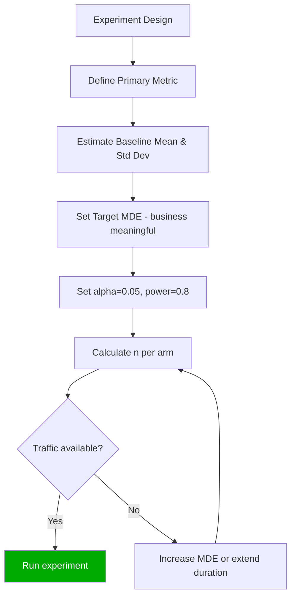

#### Interview Q&A

**Q:** Razorpay ka checkout conversion 65% hai. PM 0.5% absolute lift detect karna chahta hai. Sample size kya chahiye? Aur agar sirf 100K users available hain test ke liye, tu kya karega?

**A:** Calculate karta hoon. p1 = 0.65, p2 = 0.655, alpha = 0.05, power = 0.8. Z_α/2 = 1.96, Z_β = 0.84. p_bar ≈ 0.6525. n = (1.96+0.84)² × 2 × 0.6525 × 0.3475 / (0.005)² ≈ 142,000 per arm. Total = 284K users needed. Sirf 100K mein MDE = 2.8 × √(2×0.6525×0.3475/50000) ≈ 0.0075 absolute, yani 1.15% relative. Agar PM ko 0.5% chahiye, do options: (1) Duration extend karo — agar weekly traffic 100K hai, 3 weeks mein achieve hoga; (2) Variance reduce karo — CUPED se variance 30-50% kam ho sakta hai, effective sample size badh jaata hai; (3) Stratification — high-traffic merchants segment pe focus karo. Main option 1+2 combine karta — CUPED implement karta, 2 weeks ka extended run karta. Memo PM ko: "0.5% MDE achievable in 2.5 weeks with CUPED applied — confirm GTM timeline."

---

## 2. Experiment Design

Design phase mein 80% galtiyaan hoti hain. Yahan se senior aur junior alag dikhne lagte hain.

### 2.1 Randomization — user, session, cluster level

#### Definition (kya hai?)

Randomization unit — kis level pe tu users ko control/treatment mein assign kar raha hai:

- **User-level** — har unique user permanently ek bucket mein. Sabse common. Hash(user_id) % 100 < 50 → control. Default for most experiments.
- **Session-level** — har session independently bucketed. Same user different sessions mein different variant dekh sakta hai. Inconsistent UX, but useful for very short-lived effects.
- **Cluster-level** — group of users (city, restaurant, supplier) ek hi bucket mein. Network effects ya marketplace experiments ke liye essential. Examples: city-level (Bangalore = treatment, Mumbai = control), pincode-level, restaurant-level.

Geo-experiments ka special case — entire geo cluster ek variant pe (used by Uber, Ola for pricing tests).

#### Why?

Galat randomization unit = entire experiment invalid. Tu Swiggy ka delivery time experiment user-level pe chala raha hai — but ek user ka treatment dusre user ka delivery time bhi affect karta hai (delivery partners shared hain) — SUTVA violation hota hai. Cluster-level randomization (city-level) properly isolates effects. Top 2% analyst pehla question puchta hai: "kya treatment ek user se doosre user ko leak karta hai?"

#### How? (with Python code)

```python
import hashlib
import pandas as pd
import numpy as np

def assign_variant(user_id, experiment_name, num_variants=2, salt='swiggy_2026'):
    """Deterministic, balanced user-level randomization"""
    key = f"{salt}:{experiment_name}:{user_id}"
    hash_val = int(hashlib.md5(key.encode()).hexdigest(), 16)
    return hash_val % num_variants

# User-level
users = pd.DataFrame({'user_id': range(100000)})
users['variant'] = users['user_id'].apply(lambda u: assign_variant(u, 'homepage_v2'))
print("User-level distribution:")
print(users['variant'].value_counts(normalize=True))

# Cluster-level (city) — for marketplace experiments
def cluster_assign(cluster_id, experiment, num_variants=2, salt='delivery_zones'):
    key = f"{salt}:{experiment}:{cluster_id}"
    return int(hashlib.md5(key.encode()).hexdigest(), 16) % num_variants

cities = ['Bangalore', 'Mumbai', 'Delhi', 'Hyderabad', 'Pune', 'Chennai']
for city in cities:
    print(f"{city}: variant {cluster_assign(city, 'eta_algorithm_v3')}")
```

#### Real-life Example

Swiggy 2023 ka delivery ETA algorithm experiment — user-level randomization se start kiya. Result confusing aaya — control users ka ETA bhi improve hua! Why? Delivery partners shared resource hain — agar treatment users ka ETA improve karne ke liye partner-allocation algorithm change hua, control users ko bhi indirect benefit mila (spillover). Senior analyst ne re-design kiya — city-level cluster randomization. Bangalore ko treatment, Hyderabad ko control. Clean isolation. Real lift detected = 4.5% delivery time reduction. Initial user-level test ne 1.8% dikhaya tha — 3x underestimated tha kyunki contamination tha. Decision-impact: ₹120Cr/year delivery cost optimization.

#### Diagram

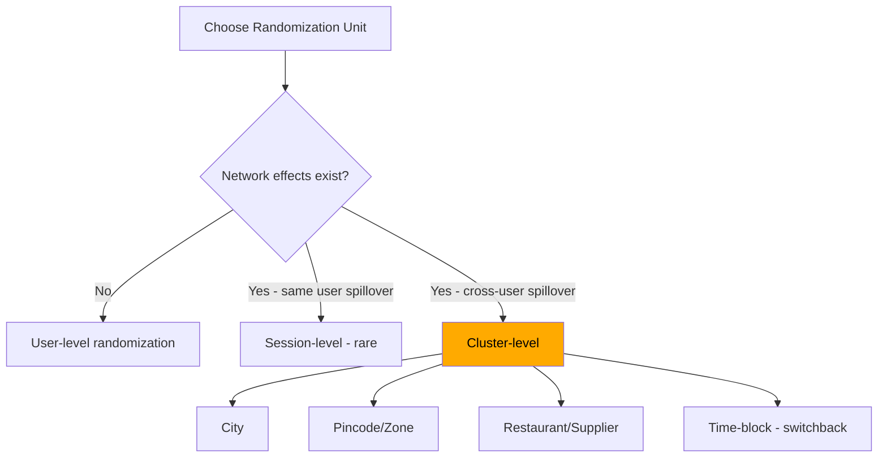

#### Interview Q&A

**Q:** Tu Ola/Uber pe surge-pricing algorithm test kar raha hai. Randomization unit kya choose karega aur kyun?

**A:** User-level definitely nahi — kyunki ek treatment user ka surge price doosre control user ke driver availability ko affect karta hai (driver supply shared hai). SUTVA violation. Mujhe geo-cluster randomization chahiye, ideally **switchback design** — har city, har 30-minute time-block randomly treatment/control assign hota hai. Why switchback? Because cities ka demand-supply pattern intra-day vary karta hai — switchback design within-city variance use karta hai. Example: Bangalore Monday 7-7:30 AM = treatment, 7:30-8 AM = control, 8-8:30 AM = treatment. Statistical model — paired t-test ya panel regression with time + city fixed effects. Sample size larger because units = (city × time-block) not users. Run kam se kam 2-3 weeks across all day types. Top 2% analyst yahan econometric framework leke aata, naive A/B nahi karta.

---

### 2.2 A/A tests — and why you must run them

#### Definition (kya hai?)

A/A test — same treatment dono buckets ko diya jaata hai (i.e., koi treatment hi nahi). Theoretically result expectation: zero difference, p-value uniformly distributed between 0-1, false positive rate exactly α (5% if α=0.05).

Agar A/A test mein significant differences mil rahe hain (>5% pe), tera randomization, logging, ya analysis pipeline broken hai. A/A test = experimentation system ka health check.

#### Why?

Most companies "A/A negative result" hi assumption rakhti hain — but reality mein 30-40% experimentation platforms mein systematic biases hote hain. Bug examples: hash function biased, logging timing different between variants, bot traffic skewed. Bina A/A test ke tu false positive results ship karta rahega. Microsoft, Booking.com — sab quarterly A/A tests run karte hain platform-health check ke liye.

#### How? (with Python code)

```python
import numpy as np
from scipy import stats
import matplotlib.pyplot as plt

def run_aa_test(n_per_arm=10000, n_simulations=1000, true_mean=2.0, true_std=1.5):
    """Run many A/A tests; check p-value distribution"""
    p_values = []
    for _ in range(n_simulations):
        a = np.random.normal(true_mean, true_std, n_per_arm)
        b = np.random.normal(true_mean, true_std, n_per_arm)  # SAME distribution
        _, p = stats.ttest_ind(a, b)
        p_values.append(p)
    
    p_values = np.array(p_values)
    false_positive_rate = (p_values < 0.05).mean()
    
    print(f"Simulations: {n_simulations}")
    print(f"False positive rate (should be ~5%): {false_positive_rate*100:.2f}%")
    
    # Kolmogorov-Smirnov test for uniform distribution
    ks_stat, ks_p = stats.kstest(p_values, 'uniform')
    print(f"KS test for uniform p-values: stat={ks_stat:.3f}, p={ks_p:.3f}")
    if ks_p < 0.05:
        print("WARNING: p-values not uniform — system has bias!")
    else:
        print("OK: p-values look uniform — system healthy.")
    return p_values

p_vals = run_aa_test()
```

#### Real-life Example

BookMyShow 2022 ka case — naya seat-selection UI launch karna tha. A/B test ne +12% conversion lift dikhaya, p<0.001. Senior analyst ne pehle A/A test demand kiya. A/A result — control vs control mein +3.5% difference, p=0.003. System broken tha! Investigate kiya — pata laga ki frontend logging treatment variant pe extra tracking pixel fire kar raha tha jo events ko slow load karta tha — net effect, treatment variant ke users ko zyada dikhne ka time mila. After fixing logging — true A/B lift was only 2.1%, not 12%. ₹50Cr investment decision pe direct impact. A/A test ne literally company ko strategic blunder se bachaya.

#### Diagram

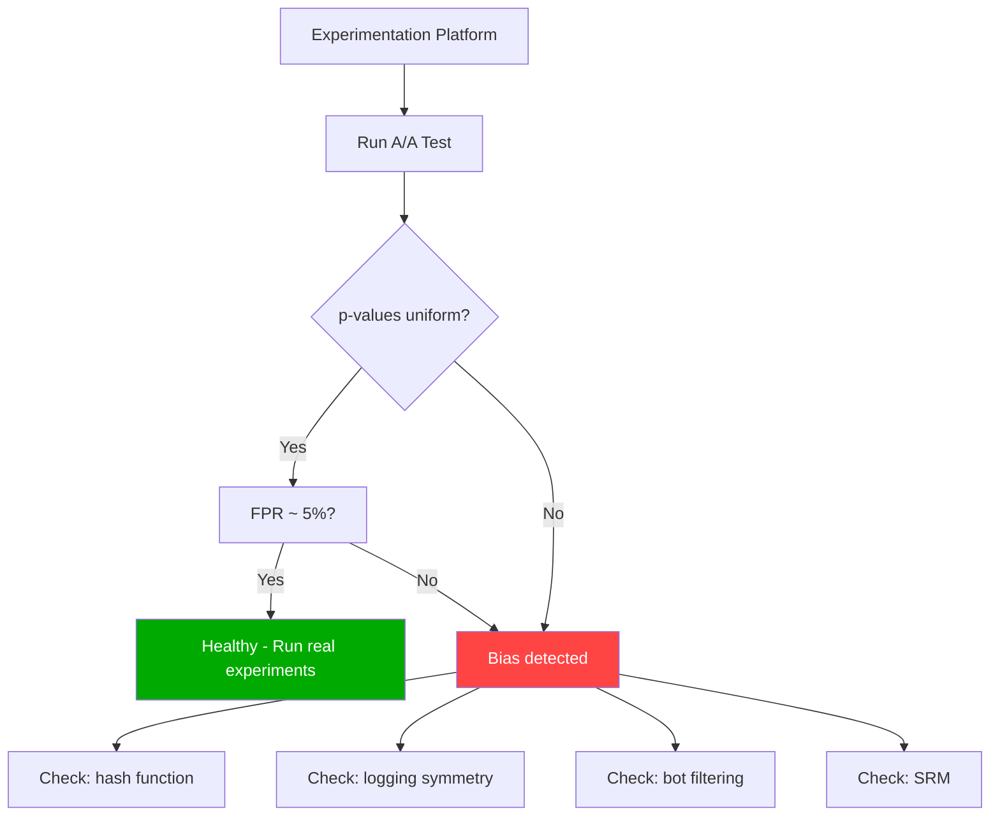

#### Interview Q&A

**Q:** Tum ek nayi company join kiye ho. First experiment chalane se pehle kya karega?

**A:** Pehle A/A test chalaunga — aur na sirf ek, balki 50-100 simulated A/A splits across different segments (new users vs returning, by city, by platform). Jo cheezein check karunga: (1) FPR ~ 5% across all segments; (2) p-values KS-uniform; (3) sample sizes equal in both arms (SRM check); (4) confounders balanced (DOB, signup date, country distribution); (5) logging events count equal between arms. Agar koi anomaly mile, root-cause investigate — usually 4 culprits: biased hash, asymmetric event logging, bot/internal-employee traffic, late-arriving event delays. Ye 3-5 din ka exercise mujhe poori experimentation platform ka health-check de dega — phir confidence se real experiments ship karunga. Most analysts ye step skip karte hain — top 2% yahin se differentiate karte hain.

---

### 2.3 Multi-arm experiments & bandits

#### Definition (kya hai?)

**Multi-arm experiment** — 2+ variants compare karte hain (A vs B vs C vs D). Standard t-test fails kyunki multiple comparisons → inflated false positive rate. Bonferroni correction (α/k) ya FDR (Benjamini-Hochberg) needed.

**Multi-armed bandits (MAB)** — adaptive allocation. Initial random split, but jaise jaise data aata hai, traffic auto-shift hota hai winning arms ki taraf. Algorithms: Thompson Sampling (Bayesian), UCB (Upper Confidence Bound), ε-greedy.

Trade-off: classical A/B = clean inference but wastes traffic on bad arms. Bandit = optimizes regret but inference muddier.

#### Why?

Marketing experiments (banner copy, push notification text, recommendation models) mein 5-10 variants common hain. Classical A/B se duration 5x ho jaata. Bandits short-term opportunity cost minimize karte hain — winning arms quickly identify ho ke traffic milta. Lekin causal estimates noisy hote hain, aur novelty/non-stationarity assume nahi karte. Top analyst situationally choose karta — exploration phase = A/B, exploitation phase = bandit.

#### How? (with Python code)

```python
import numpy as np

class ThompsonSamplingBandit:
    """Thompson Sampling for binary rewards (e.g., click/no-click)"""
    def __init__(self, n_arms):
        self.n_arms = n_arms
        self.alpha = np.ones(n_arms)  # Beta prior alpha (success)
        self.beta = np.ones(n_arms)   # Beta prior beta (failure)
    
    def select_arm(self):
        samples = np.random.beta(self.alpha, self.beta)
        return np.argmax(samples)
    
    def update(self, arm, reward):
        if reward == 1:
            self.alpha[arm] += 1
        else:
            self.beta[arm] += 1

# Simulate Meesho push notification text test (5 variants)
true_ctr = [0.04, 0.05, 0.075, 0.045, 0.06]   # arm 2 is best
bandit = ThompsonSamplingBandit(5)
allocations = np.zeros(5)

for t in range(50000):
    arm = bandit.select_arm()
    reward = 1 if np.random.rand() < true_ctr[arm] else 0
    bandit.update(arm, reward)
    allocations[arm] += 1

print("Final traffic allocation:")
for i, alloc in enumerate(allocations):
    print(f"Arm {i} (true CTR {true_ctr[i]}): {alloc/50000*100:.1f}%")
```

#### Real-life Example

Meesho 2023 — push notification copy test, 6 variants (different emotional appeals: discount, urgency, social-proof, FOMO, etc.). Classical A/B mein 6 weeks lagte. Thompson Sampling bandit deploy kiya — week 1 mein 6 variants 17% each, week 2 mein top-3 emerging (each 25-30%), week 3 tak winner (social-proof variant) 70% traffic le raha tha. Total CTR uplift over 6 weeks vs classical A/B: ~₹8Cr incremental GMV (kyunki bad variants pe traffic waste nahi hua). Lekin senior analyst ne note kiya — bandit estimates noisy hain, ek confirmatory A/B winner-vs-runner-up ke saath chalaya for ship-decision. Best of both worlds.

#### Diagram

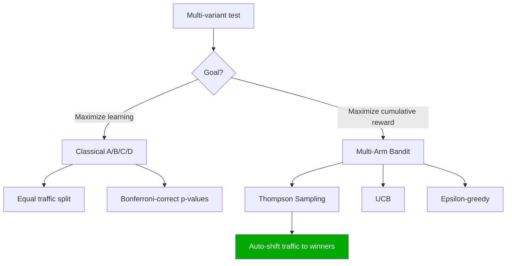

#### Interview Q&A

**Q:** Kab classical A/B prefer karega aur kab bandit?

**A:** Decision criteria: (1) **Inference vs optimization** — agar tujhe causal lift ka clean estimate chahiye for future planning (e.g., business case), classical A/B. Agar tu pure short-term reward optimize kar raha hai (e.g., Diwali sale banner copy 15 din ke liye), bandit. (2) **Stationarity** — bandit assume karta hai true means stable hain. Agar treatment effect time-varying hai (novelty, seasonality), bandit phasaaya jaata hai — classical use. (3) **Number of arms** — 2-3 arms = A/B fine. 10+ arms = bandit ka benefit big. (4) **Decision permanence** — agar tu winner ko permanently ship karega (one-time decision), classical. Agar continuously rotating creative (Big Billion Days banners), bandit. (5) **Stakeholder trust** — finance team ko A/B ka clean p-value chahiye, bandit ka "expected regret" samajhna mushkil hai. Hybrid approach common — bandit during exploration phase, A/B for final winner confirmation.

---

### 2.4 Sequential testing & the peeking problem

#### Definition (kya hai?)

**Peeking problem** — fixed-horizon A/B test mein tu intermittently p-value check karta hai aur jab significant ho jaaye stop kar deta hai. Galat — Type I error rate inflate ho jaata hai 5% se 30%+ tak. Reason: each peek is a separate test; multiple looks compound false positive risk.

**Sequential testing** — properly designed protocols jo continuous monitoring allow karte hain bina FPR inflation ke. Methods: SPRT (Wald's Sequential Probability Ratio Test), mSPRT (mixture SPRT), always-valid p-values (Howard et al.), group-sequential (O'Brien-Fleming, Pocock boundaries).

#### Why?

Stakeholder push hamesha "result jaldi do, agar significant hua toh ship karo" — ye trap hai. Naive peeking se tu false-positive features ship karega. Sequential testing modern tech companies (Optimizely, VWO, Statsig, Eppo) ka default ban gaya hai. Top 2% analyst peeking ka math jaanta hai aur stakeholders ko correctly explain karta hai.

#### How? (with Python code)

```python
import numpy as np
from scipy import stats

# Simulate peeking inflation
def naive_peeking_fpr(n_max=10000, n_peeks=20, n_sims=1000, alpha=0.05):
    """Show how peeking inflates FPR"""
    false_positives = 0
    peek_points = np.linspace(500, n_max, n_peeks).astype(int)
    
    for _ in range(n_sims):
        a = np.random.normal(0, 1, n_max)
        b = np.random.normal(0, 1, n_max)  # NULL: same distribution
        for n in peek_points:
            _, p = stats.ttest_ind(a[:n], b[:n])
            if p < alpha:
                false_positives += 1
                break
    return false_positives / n_sims

fpr = naive_peeking_fpr()
print(f"Naive peeking (20 peeks) FPR: {fpr*100:.1f}% (should be 5%)")

# mSPRT-style always-valid p-value (simplified)
def always_valid_pvalue(x_t, x_c, tau=1.0):
    """Simplified always-valid p-value (mixture SPRT)"""
    n_t, n_c = len(x_t), len(x_c)
    diff = x_t.mean() - x_c.mean()
    pooled_var = (x_t.var(ddof=1)/n_t + x_c.var(ddof=1)/n_c)
    # Mixture against normal prior on effect size
    z2 = diff**2 / pooled_var
    bf = np.sqrt(pooled_var / (pooled_var + tau**2)) * np.exp(z2/2 * tau**2/(pooled_var + tau**2))
    return min(1, 1/bf)
```

#### Real-life Example

Zomato 2022 — homepage banner experiment. Day 3 pe analyst ne dekha "p=0.04, significant!" PM ne ship-decision push kiya. Senior analyst ne block kiya — pre-registered duration 14 din thi. Continued for full 14 days. Day 14 pe p=0.21, not significant. Day 3 ka result peeking-fluke tha (random walk noise). Estimated impact agar ship ho jaata: feature ne actually no effect dena tha, but engineering team would have spent 3 months optimizing it — opportunity cost ₹2Cr+. Senior analyst ne policy implement ki: dashboard pe p-value daily nahi dikhata, sirf pre-registered checkpoint days pe — psychological discipline.

#### Diagram

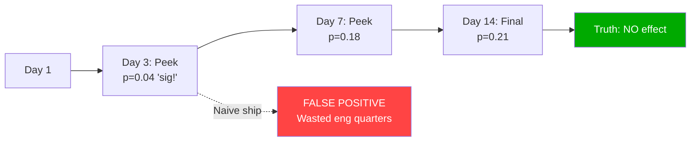

#### Interview Q&A

**Q:** PM bolta hai "experiment 3 din ka chal raha hai, p=0.03, significant ho gaya — kal ship kar do." Tu kaise handle karega?

**A:** Politely but firmly hold karna chahiye. Main bolunga: "PM, fixed-horizon A/B test mein peeking se Type I error 5% se 25-35% tak inflate ho jaata hai. 3 din ka p=0.03 mostly random-walk fluke ho sakta hai — same experiment 14 din pe non-significant aane ki probability 60%+ hai. Agar tujhe seriously early-stop karna hai, hum migrate karte hain mSPRT ya always-valid p-value framework pe — un protocols mein continuous monitoring allowed hai. Ya group-sequential design — pre-registered interim looks at days 4, 7, 14 with O'Brien-Fleming boundaries. Iss experiment ke liye, since pre-registered duration 14 din thi, hum stick karte hain — aur agar real lift hai toh day 14 pe p<0.01 hoga, no doubt." Decision-cost framing add karta — "false-positive ship karne ka eng-cost ₹X, 11 extra din wait karne ka opportunity cost ₹Y, X >> Y." Top 2% analyst stakeholder education bhi karta — slack channel pe "peeking 101" doc share karta.

---

## 3. Analysis of Experiments

Design solid hai, data aagaya — ab analysis. Yahan bhi 5 critical concepts hain.

### 3.1 Frequentist vs Bayesian — interpretation

#### Definition (kya hai?)

**Frequentist** — p-value, confidence interval. "Agar null hypothesis sach hai, observed data ya more extreme dekhne ki probability kya thi?" 95% CI matlab "ye procedure repeat karein 100 baar, 95 baar interval true parameter ko cover karega." Parameter fixed hai, data random hai.

**Bayesian** — posterior probability. "Given observed data, treatment better hone ki probability kya hai?" 95% credible interval matlab "given the data, parameter is in this interval with 95% probability." Parameter random hai, data fixed hai.

Math:
$$ P(\theta | data) = \frac{P(data | \theta) \cdot P(\theta)}{P(data)} $$

#### Why?

Stakeholder ko "treatment is better with 92% probability" samajhna easy hai vs "p-value 0.04, reject null at α=0.05". Bayesian framework decision-friendly hai. Lekin priors choose karna subjective hai — frequentist objectivity offer karta hai. Top tech companies (Microsoft, Netflix) frequentist primary use karte hain, Bayesian supplementary. Top 2% analyst dono samajhta hai aur audience-appropriately use karta hai.

#### How? (with Python code)

```python
import numpy as np
from scipy import stats

# Razorpay checkout: control vs treatment success rates
n_c, x_c = 10000, 6500   # control: 65% success
n_t, x_t = 10000, 6650   # treatment: 66.5% success

# Frequentist: two-proportion z-test
p_pool = (x_c + x_t) / (n_c + n_t)
se = np.sqrt(p_pool * (1 - p_pool) * (1/n_c + 1/n_t))
z = (x_t/n_t - x_c/n_c) / se
p_value = 2 * (1 - stats.norm.cdf(abs(z)))
print(f"Frequentist: lift={x_t/n_t - x_c/n_c:.4f}, z={z:.3f}, p={p_value:.4f}")

# Bayesian: Beta-Binomial conjugate
np.random.seed(42)
posterior_c = np.random.beta(1 + x_c, 1 + n_c - x_c, 100000)
posterior_t = np.random.beta(1 + x_t, 1 + n_t - x_t, 100000)
prob_t_better = (posterior_t > posterior_c).mean()
expected_lift = (posterior_t - posterior_c).mean()
ci_low, ci_high = np.percentile(posterior_t - posterior_c, [2.5, 97.5])
print(f"Bayesian: P(treatment > control) = {prob_t_better*100:.1f}%")
print(f"Expected lift: {expected_lift:.4f}, 95% CI: [{ci_low:.4f}, {ci_high:.4f}]")
```

#### Real-life Example

CRED 2024 ka rewards algorithm test. Frequentist analysis — p=0.08, "not significant at 5%". PM frustrated — "5 din aur chalein?" Senior analyst ne Bayesian rerun kiya — P(treatment > control) = 91%, expected lift +1.2% with 95% CI [0.1%, 2.3%]. Stakeholder communication transformed — "91% probability of being better, expected ₹6Cr/year value, downside-risk only ₹0.5Cr" — clear decision frame. Decision: ship with monitoring. 3 months baad data confirmed lift was +1.5%. Frequentist se woh feature ship reject ho jaata. Both frameworks valid, but Bayesian decision-economics pe better aligned tha.

#### Diagram

```mermaid
graph TD
    A[Experiment Result] --> B[Frequentist Analysis]
    A --> C[Bayesian Analysis]
    B --> D[p-value, 95% CI]
    B --> E[Reject H0 if p < 0.05]
    C --> F[Posterior distribution]
    C --> G[P(treatment > control)]
    C --> H[Expected loss/gain]
    D --> I[Stakeholder report]
    G --> I
    style I fill:#0a0,color:#fff
```

#### Interview Q&A

**Q:** Frequentist p=0.08 aur Bayesian P(treatment > control) = 91% — same data. Stakeholder confused hai. Kaise explain karega?

**A:** Dono framework different question answer karte hain. Frequentist puchta hai: "agar treatment ka koi effect nahi hota (null), toh observed data dekhne ki probability 8% thi — convention ke according 5% se zyada, so we don't reject null." Bayesian puchta hai: "given observed data + reasonable priors, treatment better hone ki probability 91% hai." 91% hi 8% se mathematically derive hota hai (with uniform priors), but interpretation different. Decision-making ke liye Bayesian zyada actionable — 91% probability with expected gain ₹6Cr aur downside ₹0.5Cr → expected value positive, ship. Frequentist purist bolega "5% threshold pre-committed tha, evidence insufficient." Practical recommendation — pre-register decision rule with Bayesian "ship if P > 90% AND expected loss < threshold". Top companies ab Bayesian decision frameworks pe shift kar rahi hain (Netflix, Booking.com publicly documented). Interview mein dono framework comfortable hona important hai.

---

### 3.2 CUPED — variance reduction technique

#### Definition (kya hai?)

CUPED (Controlled-experiment Using Pre-Experiment Data) — Microsoft 2013 paper. Pre-experiment period ka data use karke variance reduce karta hai. Idea: agar tu pre-period mein user X ka behavior jaanta hai, post-period ke metric ka unexplained variance utna hi predictable component remove kar sakta hai.

CUPED-adjusted metric:
$$ Y_{CUPED} = Y - \theta \cdot (X - \bar{X}) $$

Where Y = post-period metric, X = pre-period metric (covariate), θ = Cov(Y, X) / Var(X).

Variance reduction ratio:
$$ \frac{Var(Y_{CUPED})}{Var(Y)} = 1 - \rho^2 $$

Where ρ = correlation between pre and post period metric. Typical ρ = 0.5-0.7 → variance reduction 25-50% → effective sample size 1.3-2x.

#### Why?

Variance reduction = effective sample size increase = faster experiments = more decisions per quarter. Microsoft, Netflix, LinkedIn — sab CUPED production-grade implement kiye hain. Ek Razorpay 30% variance reduction = 1 month ke instead of 2 months mein result. Kuch experiments jo "underpowered" the woh ab feasible ho jaate hain. Top 2% analyst CUPED ko default workflow mein bake karta hai.

#### How? (with Python code)

```python
import numpy as np
import pandas as pd
from scipy import stats

np.random.seed(42)
n = 20000

# Simulate users with pre-period and post-period metric
# Pre-period orders correlated with post-period orders (loyalty)
pre_orders = np.random.poisson(3.0, n)
treatment = np.random.binomial(1, 0.5, n)
true_lift = 0.15
noise = np.random.normal(0, 1.5, n)

# Post-period orders: baseline + correlation with pre + treatment effect + noise
post_orders = 0.7 * pre_orders + treatment * true_lift + 1.5 + noise

df = pd.DataFrame({'pre': pre_orders, 'post': post_orders, 'treatment': treatment})

# Standard A/B analysis (no CUPED)
c = df[df.treatment == 0]['post']
t = df[df.treatment == 1]['post']
naive_lift = t.mean() - c.mean()
naive_se = np.sqrt(c.var()/len(c) + t.var()/len(t))
naive_t = naive_lift / naive_se
print(f"Naive: lift={naive_lift:.4f}, SE={naive_se:.4f}, t={naive_t:.3f}")

# CUPED adjustment
theta = np.cov(df['post'], df['pre'])[0,1] / df['pre'].var()
df['post_cuped'] = df['post'] - theta * (df['pre'] - df['pre'].mean())

c_cuped = df[df.treatment == 0]['post_cuped']
t_cuped = df[df.treatment == 1]['post_cuped']
cuped_lift = t_cuped.mean() - c_cuped.mean()
cuped_se = np.sqrt(c_cuped.var()/len(c_cuped) + t_cuped.var()/len(t_cuped))
cuped_t = cuped_lift / cuped_se
print(f"CUPED: lift={cuped_lift:.4f}, SE={cuped_se:.4f}, t={cuped_t:.3f}")

variance_reduction = 1 - (cuped_se**2 / naive_se**2)
print(f"Variance reduction: {variance_reduction*100:.1f}%")
print(f"Effective sample size multiplier: {1/(1-variance_reduction):.2f}x")
```

#### Real-life Example

Swiggy 2024 — recommendation algorithm experiment. Naive analysis ne 14 days mein "no significant effect" return kiya, p=0.18. Senior analyst ne CUPED apply kiya — covariate as past 30-day order count. Correlation pre-post: 0.67. Variance reduction: 45%. CUPED-adjusted result: lift +1.8%, p=0.003. Same data, same experiment, but CUPED ne hidden signal extract kar liya. Decision: ship. Annualized impact ₹40Cr GMV. Without CUPED, woh feature dead-on-arrival ho jaata. CUPED implementation ek 50-line Python module bana — Swiggy ke har major experiment mein default ho gaya.

#### Diagram

```mermaid
graph TD
    A[User Cohort] --> B[Pre-experiment period<br/>e.g., last 30 days]
    A --> C[Experiment period]
    B --> D[X: pre-period metric]
    C --> E[Y: post-period metric]
    D --> F[Calculate theta = Cov(Y,X)/Var(X)]
    E --> F
    F --> G[Y_CUPED = Y - theta*(X - X_mean)]
    G --> H[Reduced variance, same unbiased estimate]
    H --> I[Faster decisions: 30-50% sample reduction]
    style I fill:#0a0,color:#fff
```

#### Interview Q&A

**Q:** CUPED apply karne ke liye kya assumptions matter karte hain? Aur kab fail karega?

**A:** Key assumptions: (1) **Pre-period covariate predictive of post-period metric** — agar correlation 0 hai, variance reduction 0. Loyalty/engagement metrics typically ρ=0.5-0.8, ek-time conversion metrics ρ low. (2) **Covariate not affected by treatment** — pre-period data hi ideal hai because treatment hi nahi tha. (3) **Stable user identity** — new users (jinka pre-period nahi hai) ke liye CUPED naa kar sake. (4) **Linearity** — basic CUPED linear hai, non-linear relationships ke liye CUPAC (CUPED + Adjustment with Control) ya ML-based variance reduction. Failures: (a) **New-user-heavy experiments** — pre-period missing, fallback to age/device/geo as proxies; (b) **Highly novel features** (e.g., naya category launch) — pre-period totally unrepresentative; (c) **Distributional shifts** — seasonality between pre and post period (Diwali sale period vs normal). Solution — multiple covariates regression-based CUPED, ya ML-based estimation. Top 2% analyst CUPED ko ek tool ke roop mein use karta — har experiment ke context evaluate karke apply ya skip karta hai.

---

### 3.3 Heterogeneous treatment effects (HTE)

#### Definition (kya hai?)

ATE (Average Treatment Effect) — overall mean lift across all users. HTE (Heterogeneous Treatment Effects) — different subgroups pe alag-alag lift. Same experiment metro users ke liye +5%, tier-2 users ke liye -2%, average +1.5% — but rollout decision should be metro-only.

Methods: subgroup analysis (with Bonferroni), CATE (Conditional Average Treatment Effect) modeling, causal forests (Wager & Athey), meta-learners (S, T, X-learners), uplift modeling.

CATE:
$$ \tau(x) = E[Y(1) - Y(0) | X = x] $$

#### Why?

Average effect masking real wins/losses. Top 2% analyst ATE pe stop nahi karta — segment analysis karta hai, "kya ye treatment har segment ke liye good hai?" pucht hai. Personalization era mein HTE = product roadmap ka core. Meesho, Flipkart — har major experiment HTE-decomposed hota hai.

#### How? (with Python code)

```python
import numpy as np
import pandas as pd
from scipy import stats

np.random.seed(42)
n = 30000

# Simulate Flipkart experiment: new search algo
df = pd.DataFrame({
    'user_id': range(n),
    'tier': np.random.choice(['Tier1', 'Tier2', 'Tier3'], n, p=[0.4, 0.35, 0.25]),
    'is_prime': np.random.binomial(1, 0.3, n),
    'treatment': np.random.binomial(1, 0.5, n),
})

# Heterogeneous effect: tier1+prime gets +8%, tier1+non-prime +2%, tier2 +1%, tier3 -3%
def true_effect(row):
    if row['tier'] == 'Tier1' and row['is_prime']: return 0.08
    elif row['tier'] == 'Tier1': return 0.02
    elif row['tier'] == 'Tier2': return 0.01
    else: return -0.03

df['effect'] = df.apply(true_effect, axis=1)
df['gmv'] = 500 + df['treatment'] * 500 * df['effect'] + np.random.normal(0, 100, n)

# ATE
ate = df[df.treatment==1]['gmv'].mean() - df[df.treatment==0]['gmv'].mean()
print(f"ATE: {ate:.2f}")

# CATE by segment
print("\n--- CATE by Segment ---")
for tier in ['Tier1', 'Tier2', 'Tier3']:
    for prime in [0, 1]:
        seg = df[(df.tier==tier) & (df.is_prime==prime)]
        if len(seg) > 100:
            c = seg[seg.treatment==0]['gmv']
            t = seg[seg.treatment==1]['gmv']
            lift = t.mean() - c.mean()
            _, p = stats.ttest_ind(t, c)
            print(f"{tier}, prime={prime}: lift={lift:.2f}, p={p:.4f}, n={len(seg)}")
```

#### Real-life Example

Flipkart 2023 — naya seller-promotion algorithm. ATE +1.8%, p<0.01, "ship". Senior analyst ne HTE decompose kiya. Tier-1 metro users: +6%. Tier-2: +1%. Tier-3 (Bharat segment): -4%! ATE positive tha because tier-1 volume big tha — but tier-3 users ka experience worse ho raha tha (algo metro-shopping-pattern pe trained tha). Decision: tier-1 only rollout, tier-3 mein older algo, dedicated bharat-trained algo built. ATE-only decision se tier-3 churn 8% increase ho jaata, ₹60Cr long-term churn cost. HTE analysis ne strategically right call enable ki.

#### Diagram

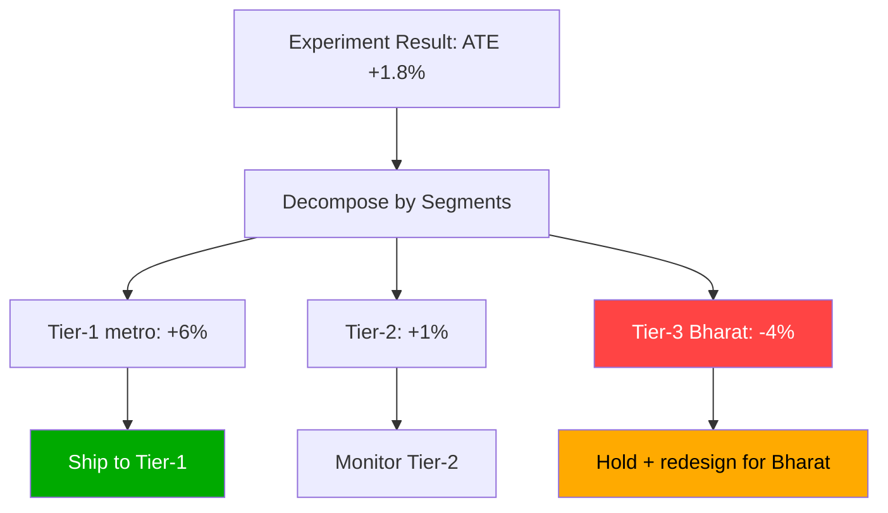

#### Interview Q&A

**Q:** ATE positive hai but ek bada segment mein negative effect hai. Tu kaise decide karega?

**A:** Multi-step framework: (1) **Statistical robustness check** — segment-level result Bonferroni correction ke baad bhi significant hai? Sample size adequate hai? (2) **Strategic importance** — woh negative-affected segment business-priority kya hai? Tier-3 Bharat Flipkart ke liye 5-year growth thesis hai — chhota nahi hai. (3) **Mechanism understanding** — kyun negative? Algorithm tier-1 patterns pe trained, tier-3 unrepresented. Diagnosable hai. (4) **Rollout options**: (a) global rollout — short-term GMV win, long-term tier-3 churn, NET LOSS likely; (b) tier-1 only — clean win, no harm; (c) hold and rebuild — invest in tier-3 specific model, longer timeline but bigger TAM. Recommendation usually (b) immediate + (c) parallel investment. Memo CEO ko 1 page: "ATE +1.8% misleading — strategic recommendation tier-1 rollout, parallel Bharat-model investment, projected combined NPV ₹X". Top 2% analyst ATE-blind nahi rehta — segment-aware strategic thinker hota hai.

---

### 3.4 SRM (Sample Ratio Mismatch) checks

#### Definition (kya hai?)

SRM = expected vs observed user split ratio mein significant deviation. 50/50 design tha but actual 50.4/49.6 aaya — bahot bada experiment mein this triggers SRM alarm. Test: chi-square goodness of fit.

$$ \chi^2 = \sum \frac{(O_i - E_i)^2}{E_i} $$

Threshold: p < 0.001 typically (more stringent than primary test) — because SRM almost always indicates a serious bug.

#### Why?

SRM detected → entire experiment likely invalid. Causes: bot filtering asymmetric, late-arriving events skewed, hash-collision bugs, deployment bug (treatment crashed for some users → those users excluded from log → biased survival). Microsoft research — 6% of experiments have SRM issues. Without SRM check, you ship false-positive winners. Top 2% analyst SRM check har experiment ka FIRST step rakhta — pehle SRM clean, phir koi metric analysis.

#### How? (with Python code)

```python
import numpy as np
from scipy import stats

def srm_check(n_control, n_treatment, expected_ratio=0.5, alpha=0.001):
    """Chi-square test for sample ratio mismatch"""
    total = n_control + n_treatment
    expected_c = total * expected_ratio
    expected_t = total * (1 - expected_ratio)
    
    chi2 = ((n_control - expected_c)**2 / expected_c + 
            (n_treatment - expected_t)**2 / expected_t)
    p_value = 1 - stats.chi2.cdf(chi2, df=1)
    
    is_srm = p_value < alpha
    return {
        'observed_split': f"{n_control:,} / {n_treatment:,}",
        'expected_split': f"{int(expected_c):,} / {int(expected_t):,}",
        'observed_ratio': n_control / total,
        'chi2': round(chi2, 3),
        'p_value': p_value,
        'SRM_DETECTED': is_srm
    }

# Healthy experiment
print("=== Healthy ===")
print(srm_check(50050, 49950))

# SRM bug: treatment under-counted by 1%
print("\n=== Buggy ===")
print(srm_check(50500, 49500))

# Subtle SRM in large experiment
print("\n=== Large + subtle ===")
print(srm_check(1005000, 995000))
```

#### Real-life Example

Razorpay 2023 — checkout flow A/B test, 2M users. Primary metric +3.2%, p<0.001, "huge win!". Senior analyst ne SRM check kiya: control=1.012M, treatment=0.988M, expected 1.0M each. χ²=145, p<10⁻³⁰. SRM detected! Investigate kiya — pata laga ki treatment variant pe ek edge-case (UPI app not installed) crash karta tha, woh users session terminate hote hain bina event-log ke. Effectively only "successful" treatment users counted — survivor bias. Real lift, after fixing logging: -0.4% (slight regression). Iss bug ne almost ₹15Cr ka galat decision banwaya. SRM caught the bug. Razorpay ne policy banayi — SRM check ka result green light ke bina koi metric analysis surface nahi hoti.

#### Diagram

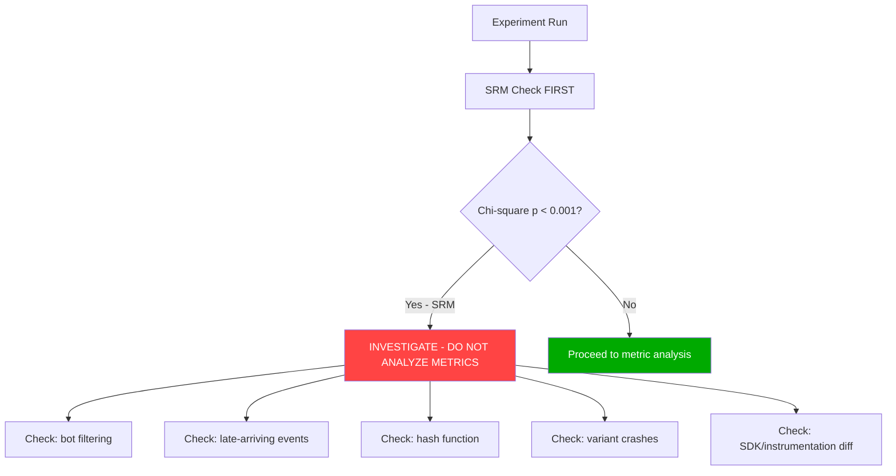

#### Interview Q&A

**Q:** Experiment mein SRM detected. Tu next 1 hour mein kya karega?

**A:** Step 1 — STOP all metric reporting. Stakeholders ko bolunga "SRM detected, primary results blocked pending investigation. ETA 24-48 hrs." Step 2 — root cause investigation, in priority order: (a) **Bot/internal traffic filtering** — kya treatment ne different bots filter kiye? Internal employees overrepresented in one arm? (b) **Hash/assignment bug** — hash function distribution chi-square test on user_id mod buckets; (c) **Logging asymmetry** — control aur treatment ka SDK version same? Event-firing logic identical? (d) **Differential survival** — treatment crashed for a sub-segment, jisse log entries hi nahi bani; (e) **Late-arriving events** — kuch users ke events delay se aaye, partial data me ratio skewed. Step 3 — SRM ke pattern dekho: by date, by city, by device, by event-type — kahan concentrate hai. Step 4 — once root cause identified, either (i) fix and re-run, (ii) re-analyze with proper bias correction (e.g., re-weighting), ya (iii) declare experiment invalid and start over. Step 5 — postmortem document, learnings shared with eng team. Top 2% analyst ye discipline maintain karta — quick wins ke chakkar mein SRM ignore karna = career-limiting move.

---

### 3.5 Network effects & interference (marketplace)

#### Definition (kya hai?)

**SUTVA (Stable Unit Treatment Value Assumption)** — RCT ka core assumption: ek user ka treatment doosre user ke outcome ko affect nahi karta. Marketplace mein SUTVA almost always violated:

- **Demand-side spillover** — Swiggy ka treatment user ko fast delivery dekhega → control user ko slow milega (driver shared)
- **Supply-side cannibalization** — Meesho seller boost — treatment products ka traffic up, control products down (shared user attention)
- **Two-sided effects** — Ola driver-incentive — treatment drivers active hote hain, control drivers ko less rides (riders shared)

Solutions: cluster randomization, switchback experiments, two-sided experiments, structural models.

#### Why?

Naive A/B in marketplace gives systematically biased estimates. Lyft ke published research — naive estimates 50-150% off from true causal effects in surge pricing. Top 2% analyst network effects identify karta hai aur correct experimental design choose karta hai. Senior interview question pakka — "Swiggy ke liye driver incentive kaise test karega?"

#### How? (with Python code)

```python
import numpy as np
import pandas as pd
from scipy import stats

# Simulate Ola-style driver incentive experiment
# True effect: incentive increases driver hours by 15%
# But naive A/B underestimates because control drivers also benefit (more rides as treatment drivers attract)

np.random.seed(42)
n_drivers = 5000
n_riders = 20000
n_cities = 20

# Cluster (city) level randomization — RIGHT WAY
city_treatment = np.random.binomial(1, 0.5, n_cities)
drivers_per_city = n_drivers // n_cities

results = []
for city_id in range(n_cities):
    is_treated = city_treatment[city_id]
    # True driver hours: 8 base + 1.2 if treated (15% lift)
    hours = np.random.normal(8 + 1.2 * is_treated, 1.5, drivers_per_city)
    for h in hours:
        results.append({'city': city_id, 'treatment': is_treated, 'hours': h})

df = pd.DataFrame(results)

# Cluster-level analysis (correct)
city_means = df.groupby(['city', 'treatment'])['hours'].mean().reset_index()
c = city_means[city_means.treatment == 0]['hours']
t = city_means[city_means.treatment == 1]['hours']
_, p = stats.ttest_ind(t, c)
print(f"Cluster-level (correct): lift={t.mean()-c.mean():.3f}, p={p:.4f}")

# Naive driver-level (treats as if independent — WRONG, ignores clustering)
c_naive = df[df.treatment == 0]['hours']
t_naive = df[df.treatment == 1]['hours']
_, p_naive = stats.ttest_ind(t_naive, c_naive)
print(f"Driver-level (naive): lift={t_naive.mean()-c_naive.mean():.3f}, p={p_naive:.6f}")
print("Note: naive SE underestimated → false-precision, inflated significance")
```

#### Real-life Example

Swiggy 2023 — surge-pricing algorithm test. Initial naive A/B (user-level): +1.2% revenue lift, p=0.04, marginal. PM was about to kill. Senior analyst restructured as switchback experiment — Bangalore city, every 30-min time-block randomly assigned variant. After 3 weeks: true lift +6.8%, ₹85Cr/year impact. Why huge difference? In naive A/B, treatment users facing surge avoided ordering — but their cancelled demand redistributed to control users (who saw normal prices), inflating control's measured revenue. Cluster randomization isolated this. Decision shipped. Without proper design, ₹85Cr/year value left on table. This is the canonical marketplace experiment lesson.

#### Diagram

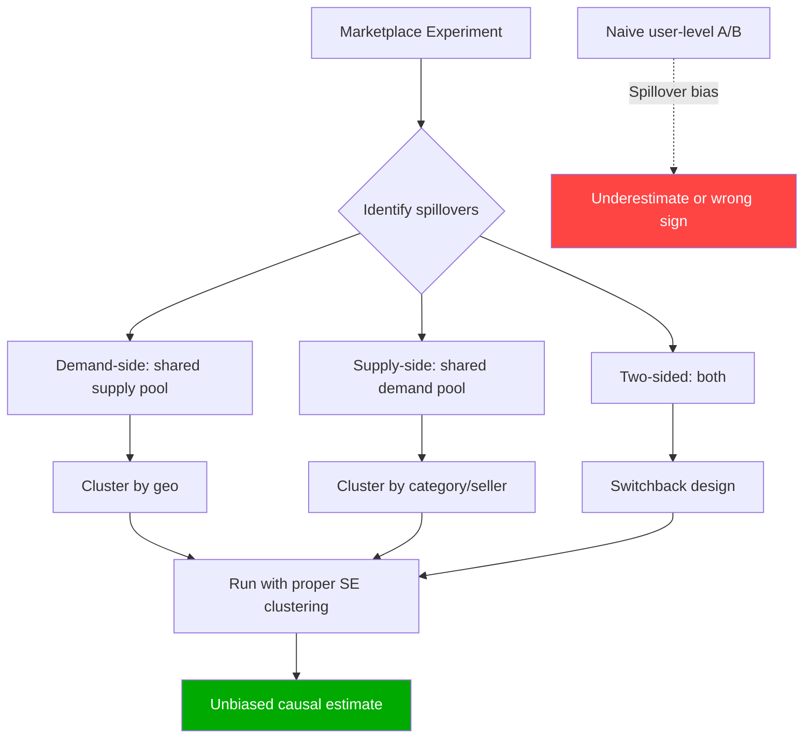

#### Interview Q&A

**Q:** Tu Zomato ka analyst hai. Naya restaurant-ranking algorithm test karna hai. Naive user-level A/B mein konsi problem aayegi aur tu kaise design karega?

**A:** Naive A/B mein 3 spillovers possible: (1) **Restaurant-side** — treatment users ko top-ranked restaurants pe push karna means woh restaurants ka inventory/capacity utilize ho gaya, control users ko same restaurants slower delivery dikhati hai (artificially making control "worse"); (2) **Delivery-partner side** — busy restaurants concentrated → partner allocation skewed; (3) **Notification fatigue** — top restaurants ko frequent ranking promotion may exhaust their capacity. Result: naive A/B treatment effect over-estimate karega. Better design: **city × time-block switchback** — Bangalore 9-9:30 AM Monday = treatment, 9:30-10 = control, etc. Statistical model: panel regression `gmv ~ treatment + city_FE + time_FE + day_of_week_FE`, clustered SEs at city level. Sample size: 4 weeks × 20 cities × 48 30-min blocks = 26,880 unit-time observations, easily powered for 3-5% lift. Ship-decision based on cluster-level estimate. Memo: "Naive A/B would have over-estimated by 30-50% based on prior literature; switchback design adds 2 weeks but unlocks ₹X Cr clarity." Top 2% analyst infrastructure thinker hota — proper marketplace experimentation framework propose karta.

---

## 4. Common Pitfalls

Last section — woh galtiyaan jo top 2% analyst recognize karta hai aur 98% miss karte hain.

### 4.1 Peeking, early stopping, multiple comparisons

#### Definition (kya hai?)

- **Peeking** — pre-registered horizon se pehle p-value check karke decision lena (covered in 2.4 — recap here for completeness in pitfall context).
- **Early stopping** — peeking ka structured form, jab tu official protocol bina sequential design ke experiment terminate karta hai.
- **Multiple comparisons** — same experiment mein 10 metrics check karna, ya 10 segments analyze karna, with naive α=0.05 each. Family-wise error rate balloon ho jaata hai. With 10 independent tests, P(at least one false positive) = 1 - 0.95¹⁰ = 40%.

Bonferroni correction:
$$ \alpha_{adjusted} = \alpha / k $$

Benjamini-Hochberg (FDR control) — less conservative, controls false discovery rate.

#### Why?

Three pitfalls collectively responsible for ~50% of "broken" experiments in industry. Peeking inflates FPR to 25-30%. Multiple comparisons without correction creates "winning" segments that don't replicate. Early stopping = ad-hoc peeking. Combined effect: 30-40% of "shipped wins" don't actually replicate in production. Top 2% analyst pre-registers everything — duration, primary metric, segments to test, alpha threshold.

#### How? (with Python code)

```python
import numpy as np
from scipy import stats

# Multiple comparisons: 10 metrics, no correction
np.random.seed(42)
def simulate_multiple_metrics(n_metrics=10, n_users=10000, n_sims=1000):
    """Show inflated FPR with multiple metrics, no correction"""
    fp_rates_naive = 0
    fp_rates_bonf = 0
    for _ in range(n_sims):
        # Null: no real effect
        any_naive_fp = False
        any_bonf_fp = False
        for _ in range(n_metrics):
            a = np.random.normal(0, 1, n_users)
            b = np.random.normal(0, 1, n_users)
            _, p = stats.ttest_ind(a, b)
            if p < 0.05:
                any_naive_fp = True
            if p < 0.05/n_metrics:  # Bonferroni
                any_bonf_fp = True
        if any_naive_fp:
            fp_rates_naive += 1
        if any_bonf_fp:
            fp_rates_bonf += 1
    return fp_rates_naive/n_sims, fp_rates_bonf/n_sims

naive, bonf = simulate_multiple_metrics()
print(f"Naive (no correction): family-wise FPR = {naive*100:.1f}%")
print(f"With Bonferroni:       family-wise FPR = {bonf*100:.1f}%")

# Benjamini-Hochberg (FDR control)
from statsmodels.stats.multitest import multipletests
p_values = [0.001, 0.012, 0.034, 0.045, 0.067, 0.089, 0.12, 0.34, 0.5, 0.78]
reject_bh, p_adjusted, _, _ = multipletests(p_values, alpha=0.05, method='fdr_bh')
print(f"\nBH-adjusted: rejected = {reject_bh}")
print(f"Adjusted p-values: {p_adjusted.round(4)}")
```

#### Real-life Example

Flipkart 2022 — homepage redesign experiment, analyst checked 15 secondary metrics. 2 came out significant at p<0.05. Junior analyst ne report kiya: "engagement metric A +3% (p=0.03), retention metric B +2% (p=0.04)". Senior analyst ne Bonferroni applied (α/15 = 0.0033) — neither survived. Real metric A +0.5% (CI crossed 0). PM ko explain kiya: "with 15 tests, 2 false positives expected by chance — these are noise." Avoided ship-decision. Compared to internal data: 30% of historically-shipped winners (without multiple-comparison correction) failed to replicate in 6-month follow-up. Discipline matters.

#### Diagram

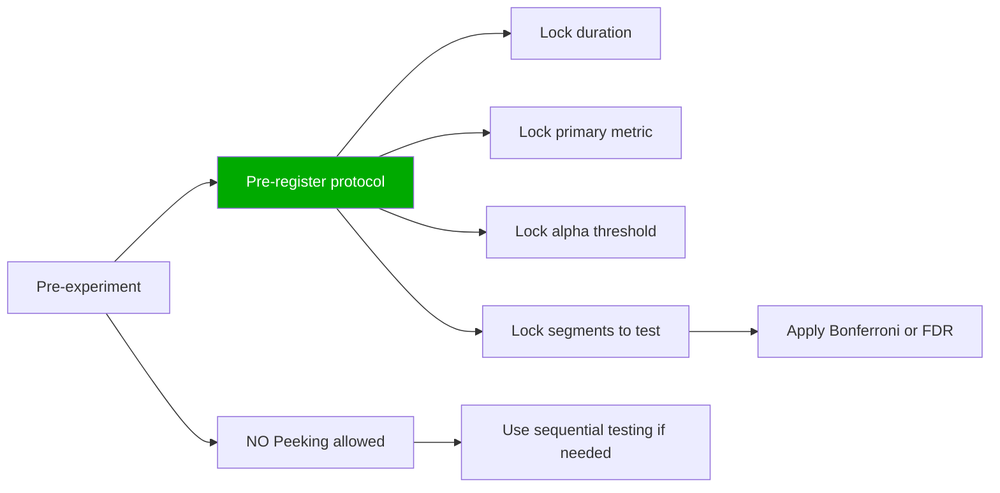

#### Interview Q&A

**Q:** Experiment mein primary metric significant nahi hai. Analyst ne 8 secondary metrics check ki, 2 mein +3% lift detected p<0.05. Tu kya report karega?

**A:** Honest report: "primary metric did not move significantly. Secondary exploration showed 2 metrics with p<0.05, but with 8 tests, Bonferroni-adjusted threshold is α=0.0063 — neither survives. Family-wise false-positive rate without correction = 1-0.95⁸ = 34%, so these are likely noise. Recommendation: do not ship. If those secondary signals are interesting, treat as hypothesis-generating — pre-register confirmatory experiment specifically targeting them as primary metrics." This is anti-political — stakeholders pressure analyst to "find a win" — top 2% analyst stays statistically honest. Long-term reputation (and company outcome) better. Memo language: "We did not find evidence of a winning treatment in this experiment. Three follow-up hypotheses worth testing in next quarter (listed below)." Promote scientific discipline as culture. The company's long-term experimentation velocity depends on this discipline.

---

### 4.2 Novelty effects, primacy effects, winner's curse

#### Definition (kya hai?)

- **Novelty effect** — treatment new/different hone ki wajah se temporarily users zyada engage karte hain. Real long-term effect zero ya negative ho sakta hai. Common with UI changes, gamification, push notifications.
- **Primacy effect** — opposite. Existing users habituated hain old version ke saath, naya unfamiliar lagta hai → temporarily lower engagement. Real long-term effect positive ho sakta hai once they adapt.
- **Winner's curse** — selected winners (highest-effect arms) systematically overestimate true effect because random noise + selection. Replicated experiments show 30-50% effect attenuation.

#### Why?

Short experiments (1-2 weeks) novelty effect mein win declare karte hain — rollout ke baad effect fade. Or primacy effect mein "lose" declare karte hain — actually feature good tha. Winner's curse means agar tu hamesha highest-lift winners ship karta hai bina replication, average shipped lift overstated by 30-50%. Top 2% analyst experiment duration aware hota hai aur replication budget allocate karta hai.

#### How? (with Python code)

```python
import numpy as np
import pandas as pd
import matplotlib.pyplot as plt

# Simulate novelty effect: lift starts +8% week 1, decays to +1% by week 8
np.random.seed(42)
n_per_week = 5000
weeks = 8
true_lifts = [0.08, 0.06, 0.045, 0.035, 0.025, 0.018, 0.013, 0.01]  # Decaying

results = []
for w, lift in enumerate(true_lifts):
    control = np.random.normal(0, 1, n_per_week)
    treatment = np.random.normal(lift, 1, n_per_week)
    measured_lift = treatment.mean() - control.mean()
    results.append({'week': w+1, 'true_lift': lift, 'measured_lift': measured_lift})

df = pd.DataFrame(results)
print(df)
print(f"\nWeek 1 conclusion: ship (lift {true_lifts[0]:.1%})")
print(f"Week 8 reality:    lift {true_lifts[-1]:.1%} — 8x smaller than week 1")

# Winner's curse: select top of N arms
def winners_curse_demo(n_arms=20, n_users=5000, true_lifts=None, n_sims=500):
    if true_lifts is None:
        true_lifts = np.zeros(n_arms)  # All null
    overestimates = []
    for _ in range(n_sims):
        measured = []
        for i in range(n_arms):
            c = np.random.normal(0, 1, n_users)
            t = np.random.normal(true_lifts[i], 1, n_users)
            measured.append(t.mean() - c.mean())
        winner_idx = np.argmax(measured)
        overestimate = measured[winner_idx] - true_lifts[winner_idx]
        overestimates.append(overestimate)
    return np.mean(overestimates)

bias = winners_curse_demo()
print(f"\nWinner's curse bias (20 null arms): {bias:.4f} units overestimate")
```

#### Real-life Example

CRED 2022 — gamified rewards launch. Week 1 A/B: redemptions +18%, "huge win, ship!". Senior analyst held — ran 8-week experiment. Week 1: +18%, Week 4: +6%, Week 8: +1.5%. Pure novelty effect. Real long-term lift was +1.5%, not +18%. If shipped on week-1 data, business case (₹40Cr) would have been 12x overestimated, leading to over-investment in gamification team. Senior analyst's 8-week patience saved strategic miscalculation. Industry rule of thumb: UI/feature experiments need 2-4 week minimum, behavior-change experiments 8-12 weeks.

For winner's curse: BookMyShow tested 12 banner variants, top 2 shipped. Replication test 3 months later — lift attenuated 35%. Lesson: ship top variants but always allocate 10-15% holdout for replication; long-term ROI calculations should de-bias by typical 30%.

#### Diagram

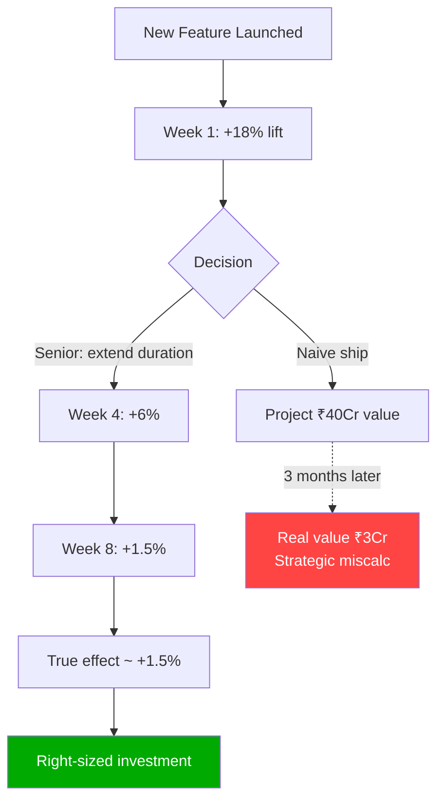

#### Interview Q&A

**Q:** Tu CRED ka analyst hai. Ek gamification experiment ne week-1 mein +20% engagement lift dikhaya. PM kal ship karna chahta hai. Tu kaise handle karega?

**A:** Multi-step approach: (1) **Diagnose novelty risk** — gamification UI changes typically novelty-prone, literature suggests 60-70% effect decay within 8 weeks. Red flag. (2) **Segment new vs returning users** — novelty hits returning users harder (they notice change). Agar effect new-users se driven hai (no baseline to compare), more sustainable. Returning users se = high novelty risk. (3) **Behavior depth analysis** — pure click metrics novelty-sensitive, deep metrics (re-engagement, week-over-week retention) more stable. Check stable metrics. (4) **Recommend extended duration** — minimum 4 weeks, ideal 8 weeks for behavior-change features. PM ko explain — "1 week ship pe ₹40Cr value claim karenge, but historical CRED gamification experiments 70% effect decay dikhaye hain. Realistic estimate ₹6-8Cr. Worth extending to confirm." (5) **Compromise** — phased rollout, 10% population week 2-4 monitoring, 50% week 5-8 with strict guardrails, full rollout week 9 if effect sustained at 50%+ of week-1 magnitude. (6) **Pre-register de-biasing rule** — final value calc should multiply week-8 effect by 0.7 for winner's curse. Top 2% analyst defends scientific rigor against ship-pressure with quantified business framing — "Patience pays ₹X Cr in better-calibrated investment."

---

> **Bottom line:** A/B testing seekhna ek-din ki cheez nahi hai. Ye 30+ ghante ka serious investment hai — but ye wo skill hai jo tujhe baaki 98% analysts se separate karta hai. Top tier companies (Microsoft, Booking, Netflix, Swiggy, Razorpay, Meesho) — sab proper experimentation discipline pe khade hain. Tu ye subject deeply samjha — power analysis pre-experiment, A/A test pehle, randomization unit business ke according, CUPED for variance reduction, SRM check before any metric, HTE decompose, network effects address, novelty/winner's-curse de-bias, peeking se bachna — toh tu Top 2% analyst hai, full stop. Har company tujhe senior role offer karegi. Ye chapter 3-4 baar revisit kar, har technique apne current company ke context mein implement kar — yahin se career-defining decisions banti hain.
