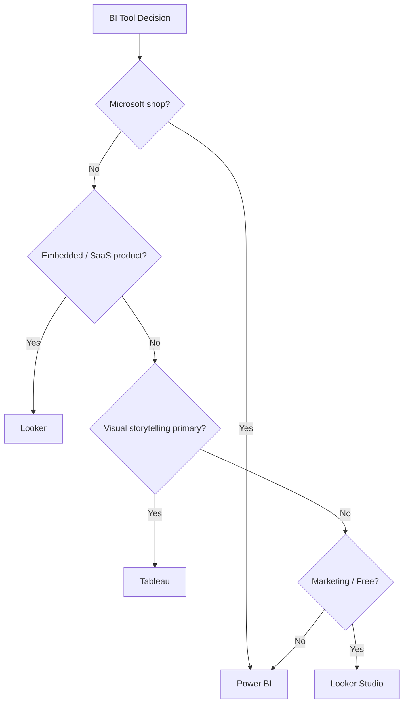
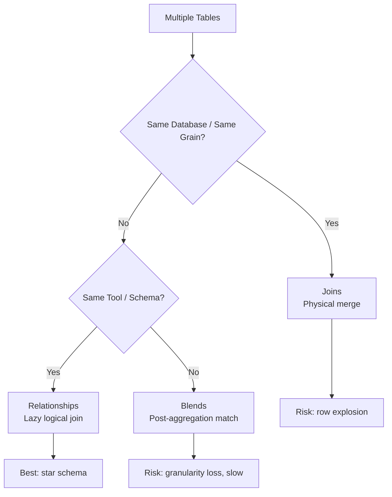
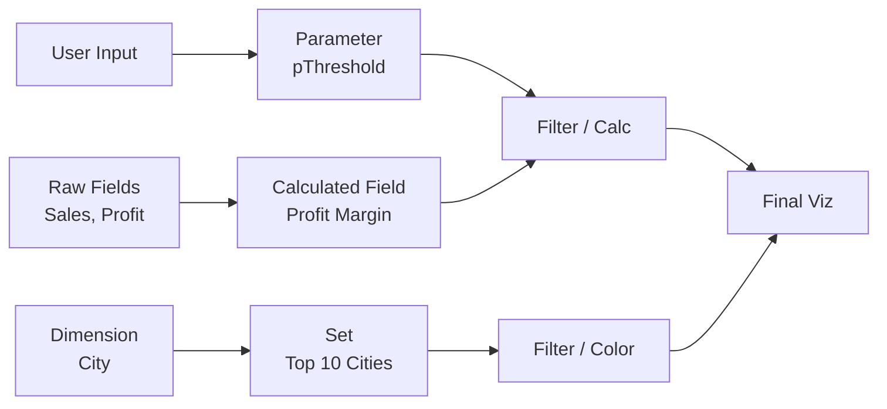
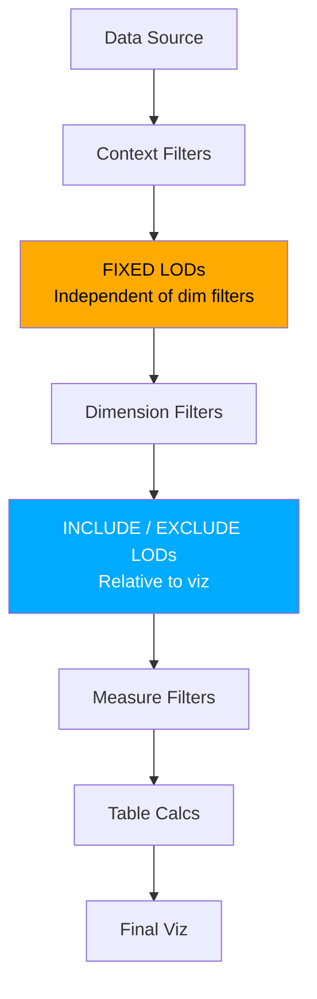
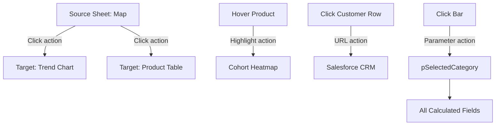
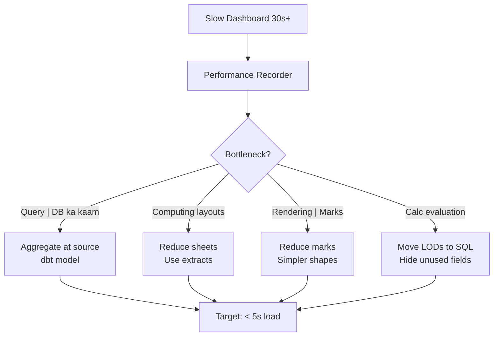
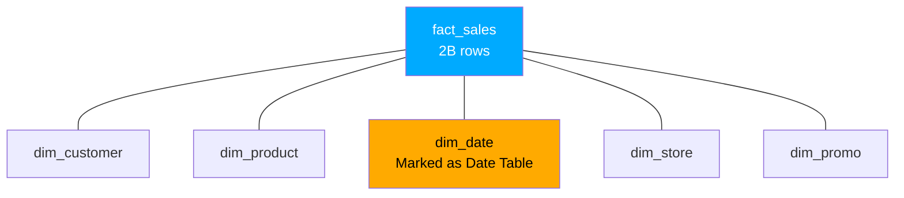
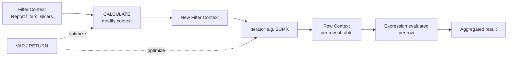
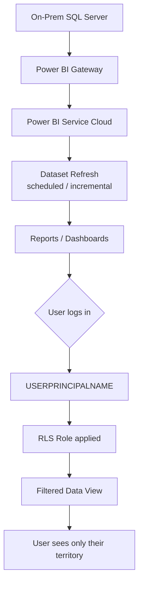
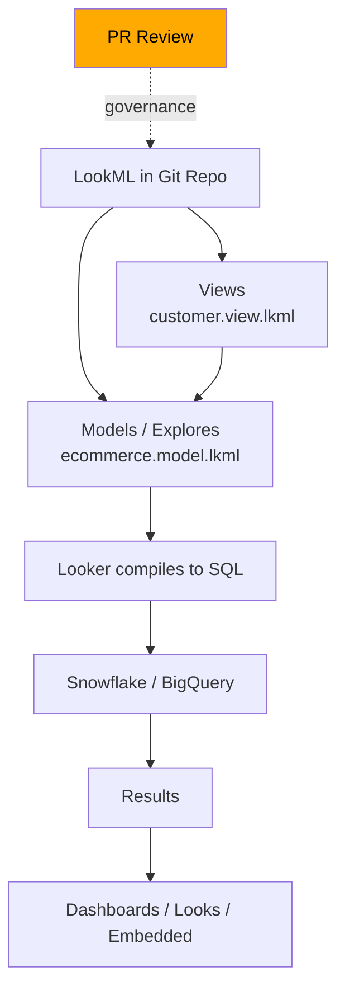

# BI Tools — Tableau & Power BI

BI tool hai analyst ka portfolio — interview mein agar dashboard URL nahi share kar sakta, you're in the bottom half. Seedha baat — SQL aur Python tu kitna bhi acha likh le, jab tak woh kaam ek public-facing artifact mein convert nahi hota — ek dashboard, ek shareable link, ek embedded report jo CXO Monday morning ko khol ke dekhta hai — tab tak tu "back-office" analyst hai. Top 2% analyst ke pas hamesha ek "open in browser" wala live link hota hai jise woh interview ke screen-share mein dikha sake. CFO ko Excel pivot bhejne wala analyst replaceable hai. Refresh-on-schedule, RLS-protected, sub-2-second load wala dashboard banane wala analyst irreplaceable hai.

Iss subject mein tu seekhega — kaunsa BI tool kab choose karna hai (Tableau vs Power BI vs Looker vs Looker Studio), data modeling kaise karte hain har tool mein (joins vs blends vs relationships ka real farak), Tableau ka LOD expressions deeply (FIXED / INCLUDE / EXCLUDE — woh cheez jo 90% Tableau users galat use karte hain), Power BI ka DAX deeply (CALCULATE, FILTER, iterators, variables — Microsoft ka secret weapon), aur Looker / LookML ka basics. Indian context throughout — Razorpay aur Postman Looker pe kyu chale gaye, TCS / Infosys ke MNC clients Power BI pe kyu fixated hain, agencies aur consulting firms (Bain, McKinsey, Tiger Analytics) Tableau pe kyu kasam khaate hain. 14 ghante laga — har subtopic ek hands-on dashboard banayega tere portfolio mein.

---

## 1. BI Fundamentals

BI (Business Intelligence) tool ka kaam ek hai — data ko visualization mein convert karna jo business user khud explore kar sake. Pehle tool choose karna seekh, phir modeling. Tool wrong choose kiya toh agle 2 saal woh galti bhugatega.

### 1.1 Pick your tool — Tableau vs Power BI vs Looker

#### Definition (kya hai?)

Teen major BI tools hain market mein, har ek ka apna sweet spot hai:

- **Tableau** — Salesforce ka product (2019 mein $15.7B mein acquire kiya). Drag-drop visualization ka king. Strongest visual capabilities, best community for chart design. Pricing: ~$70/user/month (Creator), ~$15/user/month (Viewer). Indian agencies (Tiger Analytics, MuSigma, Fractal), consulting firms (BCG, Bain) heavy users.

- **Power BI** — Microsoft ka product. Office 365 ke saath bundle hota hai (~$10/user/month, often free with E5 license). Tightest integration with Excel + Azure + Teams. MNCs jo already Microsoft shop hain (TCS, Infosys, Wipro, Cognizant ke clients) by default Power BI pe hain. Indian banking (HDFC, ICICI), enterprise IT, manufacturing dominantly Power BI.

- **Looker** — Google ka product (acquired 2019, $2.6B). Code-first BI — sab kuch LookML (a SQL-like modeling language) mein define hota hai. Git-based versioning, embedded analytics ka king. Indian SaaS-native companies — Razorpay, Postman, Hasura, Chargebee, Khatabook — Looker pe move kar chuke.

- **Looker Studio (formerly Data Studio)** — free version of Looker (sort of). Google Analytics + Sheets pe direct connect, marketing dashboards ka standard. D2C brands, agencies, freelance analysts ke liye.

#### Why?

Tool selection 5-year decision hai. Migration costs 6-12 months easily lagti hai (dashboards rebuild, training, governance reset). Tu agar startup mein "Tableau lagao" bola aur founder Microsoft shop hai, tu economics aur licensing mein loss kara dega. Top analyst tool selection ko technical decision nahi treat karta — woh organizational, financial, aur skill-availability decision treat karta hai.

#### How?

Decision framework:

| Factor | Tableau | Power BI | Looker |
|---|---|---|---|
| Visual flexibility | Best | Good | OK |
| Pricing | Expensive ($70/Creator) | Cheap ($10) | Expensive ($60-100, opaque) |
| Learning curve | Medium (drag-drop) | Easy if Excel-savvy | Steep (LookML = code) |
| Embedded analytics | Hard | Medium | Best |
| Version control | Weak (TWBX files) | Weak (PBIX files) | Strong (Git/LookML) |
| Indian community | Strong (consulting) | Massive (IT services) | Growing (SaaS) |
| Best for | Storytelling, exec decks | Enterprise reporting | Self-serve, embedded |

#### Real-life Example

Razorpay ka journey — pehle Tableau pe the (2018-2020), but engineering team ne complain kiya ki "every dashboard ek snowflake hai, kuch documented nahi, koi SQL truth nahi". 2021 mein Looker pe migrate kiye — LookML mein semantic layer (`metric: total_payment_volume = SUM(amount)`) define kiya, ab har analyst aur PM same definition use karte hain. Cost? Higher per-seat. But governance + consistency = priceless. Compare karo TCS — 4L+ employees, har project ke clients ke liye dashboard banane padte hain, MS ecosystem mein already license hai → Power BI obvious choice. Agency like Tiger Analytics — clients across industries, "wow factor" presentations chahiye → Tableau.

#### Diagram



#### Interview Question

**Q:** Tu ek 200-person Series B fintech ka first BI hire hai. Kaunsa tool choose karega aur kyu?

**A:** Pehle 3 questions — (1) tech stack (AWS / GCP / Azure?), (2) existing licensing (MS E5? Salesforce?), (3) embedded analytics needed (do customers need dashboards?). Series B fintech mein typically — GCP / AWS, no MS bundle, embedded analytics maybe needed for merchants. Mera default Looker hota — kyunki LookML semantic layer 10+ analysts ke liye scalability deta, Git versioning audit-friendly hai (RBI compliance), embedded merchant dashboards future use case ke liye ready. Cost ki concern hai toh dbt + Metabase combination — open-source alternative. Tableau choose nahi karunga because version control + governance pain points 12 months mein bite karenge. Power BI tab choose karunga jab Azure shop hai aur MS license already paid. Decision memo 1-pager ke saath stakeholders ko sell karunga — TCO 3-year horizon mein.

---

### 1.2 Data modeling — joins vs blends vs relationships

#### Definition (kya hai?)

Data modeling matlab — multiple tables (fact + dimensions) ko BI tool ke andar kaise combine karte hain. Teen approaches:

- **Joins (Tableau, SQL)** — physical level pe row-merge. INNER, LEFT, RIGHT, FULL. Single data source banta hai. Fast queries, but row duplication ka risk if cardinality galat.
- **Blends (Tableau)** — logical level pe (post-aggregation) two data sources ko match karte hain on common dimension. Different data sources (Snowflake + Google Sheets) merge karne ke liye. Slow, granularity-limited.
- **Relationships (Power BI, Tableau 2020+)** — "noodles" — tables connected hain but actual join lazy hota hai (only when measure pucha jaata hai). Star schema enforced. Cardinality (1:M, M:M) explicit.

#### Why?

99% BI bugs galat data modeling se aate hain. Tu agar fact table aur dimension dono ko inner join kar deta hai jab dimension incomplete hai — rows missing. Tu agar M:M relationship ko 1:M samajh leta hai — measures inflated. Top 2% BI developer pehle ER diagram banata hai whiteboard pe, phir tool mein implement karta hai. Modeling shortcut maara toh dashboard 6 mahine baad collapse hoga — refactor 4-week project ban jaata hai.

#### How?

Tableau mein modeling — "Logical Layer" (relationships) + "Physical Layer" (joins). Best practice: Logical layer pe relationships use karo (semantic flexibility), Physical layer pe joins sirf jab same grain ki tables hain.

Power BI mein modeling — Model view mein tables ko drag-drop kar ke relationship draw karte hain. Cardinality (1:M default, M:M explicit), Cross-filter direction (single vs both — performance trade-off).

Example star schema (Power BI):

```
fact_orders (granularity: 1 row per order)
├── dim_date (date_id PK)
├── dim_customer (customer_id PK)
├── dim_product (product_id PK)
└── dim_store (store_id PK)
```

#### Real-life Example

Flipkart ke BI team ne 2019 mein bug pakda — Big Billion Days revenue dashboard ₹4500Cr show kar raha tha, but actual ₹3800Cr tha. Root cause: Tableau mein fact_orders aur fact_returns dono "orders" data source mein blend kiya tha — but blending fan-trap (cardinality mismatch) bana raha tha. Same order multiple return rows se match ho raha tha → SUM(gmv) inflated. Fix: separate data sources, proper FK relationships, returns ko subtract logic LOD se. Public-facing investor presentation se 30 min pehle pakda — phir analyst rockstar bana.

#### Diagram



#### Interview Question

**Q:** Tu ek Power BI report bana raha hai — fact_sales aur dim_product ke beech relationship draw kiya. Sales report ka total ₹50Cr aa raha hai jab actual database mein ₹35Cr hai. Kya galat hua aur kaise debug karega?

**A:** Classic fan-trap symptom. Mere debug steps: (1) cardinality check — `dim_product` mein product_id truly unique hai? `SELECT COUNT(*), COUNT(DISTINCT product_id) FROM dim_product` — agar mismatch toh dim mein duplicates hain, M:M ban gaya hai relationship; (2) cross-filter direction check — agar "both" set hai, dim ke columns fact ko bhi filter kar sakte hain — accidentally SUM inflate hota hai; (3) granularity check fact pe — 1 order = 1 row truly? Maybe order-line level granularity hai aur SUM(order_amount) jo har line pe duplicate hai galat add ho raha; (4) measure definition — `Total Sales = SUM(Sales[amount])` ya `SUMX` use ho raha — agar SUMX with cross-filter, double-aggregation. Fix: dim mein duplicates remove (or surrogate key), 1:M cardinality enforce, single-direction cross-filter, measure DAX rewrite. Top 2% step: dbt mein dim ko `unique` test laga deta — bug source pe pakda jaata.

---

## 2. Tableau Deep Dive

Tableau seekhna matlab teen cheezein master karna — calculated fields (logic), LOD expressions (cross-grain calculation), aur dashboard interactivity (actions). Last cheez performance optimization — production-grade dashboards ka unsung hero.

### 2.1 Calculated fields, parameters, sets

#### Definition (kya hai?)

- **Calculated field** — naya field jo existing fields se derive hota hai. SQL expression jaisa, but Tableau ke functions (ZN, IIF, DATEDIFF, etc.). Example: `Profit Margin = SUM([Profit]) / SUM([Sales])`.
- **Parameter** — single user-controlled value (number, date, string) jo calculations / filters mein plug hota hai. Example: "Threshold" parameter — slider for "show stores above ₹X revenue".
- **Set** — dynamic ya static group of dimension members. Example: "Top 10 cities by revenue" set — auto-updates jab data change ho.

#### Why?

Calculated fields without these = sirf SQL pull-and-display. Parameters interactivity ka core hain — exec-facing dashboard mein "what-if" scenarios bina parameter ke nahi banti. Sets advanced segmentation enable karte hain — "premium customers", "churn-risk users" — ek baar define karo, har viz mein use karo.

#### How?

Real example — Tableau calculated field for "Customer Tier":

```
// Calculated field: Customer Tier
IF [LTV] >= 50000 THEN "Platinum"
ELSEIF [LTV] >= 20000 THEN "Gold"
ELSEIF [LTV] >= 5000 THEN "Silver"
ELSE "Bronze"
END
```

Parameter example — "Date Range Selector":

```
// Parameter: pSelectedRange (string, allowed values: "Last 7", "Last 30", "Last 90")

// Calculated field using parameter
IF [pSelectedRange] = "Last 7" AND [Order Date] >= TODAY() - 7 THEN [Sales]
ELSEIF [pSelectedRange] = "Last 30" AND [Order Date] >= TODAY() - 30 THEN [Sales]
ELSEIF [pSelectedRange] = "Last 90" AND [Order Date] >= TODAY() - 90 THEN [Sales]
ELSE NULL
END
```

Set example — "Top 10 Cities by GMV":

```
Right-click Dimension > Create Set > Top tab > By field: SUM([GMV]), Top 10
```

#### Real-life Example

Tu Bain ka analyst hai, client Asian Paints ka Tableau dashboard bana raha hai. CMO ko "what-if" chahiye — "agar mai marketing spend 20% increase karu specific city mein, ROI kya hoga?" Tu parameter banata hai `pSpendMultiplier` (range 0.5-2.0, default 1.0), aur calculated field `Projected Revenue = [Base Revenue] * (1 + 0.3 * ([pSpendMultiplier] - 1))` (assuming 30% elasticity). CMO slider khinchta hai, dashboard real-time update hota hai. Decision meeting mein CMO ne 1.4× select kiya for Mumbai → ₹3Cr extra revenue projected. Decision made in 10 minutes — without parameter, week-long Excel modeling exercise.

#### Diagram



#### Interview Question

**Q:** Calculated field aur Parameter mein kya farak hai? Kab kaunsa use karega?

**A:** Calculated field — derived from data, har row ke liye evaluate hota hai (e.g., Profit Margin per row). Data se driven. Parameter — single user-controlled value, data se nahi data-aware hota hai but row-level nahi. Static unless user changes. Use karne ka rule: agar logic data ke har row ke liye different hoga → calculated field; agar logic ek single "knob" hai user ke liye → parameter. Often dono combine hote hain — parameter user input leta hai, calculated field row-level apply karta hai. Example: parameter `pTargetMargin = 30%`, calculated field `[Above Target] = IIF([Profit Margin] >= [pTargetMargin], "Yes", "No")`. Sets alag breed hain — woh dimension members ka subset hain, dynamically refreshable. Top 2% step: parameters ko "actions" se link karte hain (parameter actions, Tableau 2020.2+) — click pe parameter update hota hai, dashboard chain reaction.

---

### 2.2 LOD expressions — FIXED, INCLUDE, EXCLUDE

#### Definition (kya hai?)

LOD (Level of Detail) expressions — Tableau mein cross-granularity calculation karne ke liye. Default mein Tableau viz ke level pe aggregate karta hai — but kabhi tujhe alag level pe calculate karna hota hai. Teen flavors:

- **FIXED** — fixed level pe calculate, ignore viz filters except `Context` filters. Example: `{FIXED [Customer ID] : SUM([Sales])}` — har customer ka total sales, viz mein kuch bhi ho.
- **INCLUDE** — viz level + extra dimensions ko include karke calculate, phir viz pe roll-up. Example: `{INCLUDE [Sub-Category] : SUM([Sales])}` — sub-category granularity pe pehle, phir average viz pe.
- **EXCLUDE** — viz level se kuch dimensions ko hata ke calculate. Example: `{EXCLUDE [Region] : SUM([Sales])}` — region ignore kar ke total.

#### Why?

LOD without proper understanding = Tableau ka biggest gotcha. 90% intermediate Tableau users LOD ko galat use karte hain — ya toh table calc se confuse karte hain ya filter scope galat samajhte hain. Top 2% Tableau dev ko LOD blueprint banane mein 30 sec lagta hai — kyunki woh execution order samajhta hai (Context filters → FIXED → Dimension filters → INCLUDE/EXCLUDE → Measure filters → Table Calcs).

#### How?

Real scenario — "Customer cohort analysis": Customer ka first order date find karna, phir cohort behavior analyze karna.

```
// Step 1: Customer's first order date (FIXED — independent of viz)
First Order Date = {FIXED [Customer ID] : MIN([Order Date])}

// Step 2: Months since acquisition
Months Since Acquired = DATEDIFF('month', [First Order Date], [Order Date])

// Step 3: Cohort size (per cohort)
Cohort Size = {FIXED [First Order Date] : COUNTD([Customer ID])}

// Step 4: Retention rate
Retention Rate = COUNTD([Customer ID]) / [Cohort Size]
```

INCLUDE example — "Average sub-category sales within category":

```
Avg Sub-Cat Sales = AVG({INCLUDE [Sub-Category] : SUM([Sales])})
// In a viz showing Category, this gives avg of sub-category totals
```

EXCLUDE example — "Region's contribution vs national":

```
National Sales = {EXCLUDE [Region] : SUM([Sales])}
Region Share = SUM([Sales]) / [National Sales]
```

#### Real-life Example

Tiger Analytics ka analyst Marico (consumer goods) ka dashboard bana raha hai. CFO ka question — "har city ke top 3 SKUs ka contribution dikhao". Naive approach — table sort, top 3 manually. Scalable approach — LOD:

```
// SKU rank within city
SKU Rank = RANK_DENSE(SUM([Sales]))  // table calc
COMPUTE USING [SKU] FOR EACH [City]

// Top-3 flag
Top 3 SKU = IIF([SKU Rank] <= 3, "Top 3", "Others")

// Top-3 sales per city
Top3 Sales = {FIXED [City] : SUM(IIF([SKU Rank] <= 3, [Sales], 0))}
City Total = {FIXED [City] : SUM([Sales])}
Top3 Share = [Top3 Sales] / [City Total]
```

CFO ko ek slide mein 50 cities ka top-3 contribution dikha — Mumbai 67%, Delhi 71%, Pune 58%. Insight — Pune diversification opportunity. ₹4Cr investment decision LOD ne enable kiya.

#### Diagram



#### Interview Question

**Q:** Tu Swiggy ka dashboard bana raha hai. "Total order value" tile dikhana hai jo city filter apply hone par bhi unchanged rahe (national figure). Kaunsa LOD use karega?

**A:** `{FIXED : SUM([Order Value])}` — empty FIXED, koi dimension nahi, matlab whole dataset pe aggregate. But yahan twist hai — agar tu city filter "context filter" bana deta hai, toh FIXED bhi context filter ke baad evaluate hota hai aur change ho jaata hai. Mujhe "national" chahiye toh city filter ko regular dimension filter rakhna hai (FIXED uske pehle execute hota hai, untouched). Alternative — `{EXCLUDE [City] : SUM([Order Value])}` — but ye sirf jab city viz mein exist karta hai, otherwise behave like FIXED. Cleanest: `{FIXED : SUM([Order Value])}` with regular city filter. Top 2% step: tile ke title pe "*National total — not affected by city filter" footnote — user expectation set karna important hai.

---

### 2.3 Dashboards, actions, story points

#### Definition (kya hai?)

- **Dashboard** — multiple worksheets (vizzes) ek single canvas pe arranged. Tiled (grid) ya floating (overlap) layout.
- **Actions** — interactivity rules. Click ek viz pe → filter / highlight / navigate / parameter-update / set-update on another viz. Example: click on city → orders chart auto-filters to that city.
- **Story points** — sequential dashboard slides — narrative-driven analysis. Less common in production, more for exec presentations.

#### Why?

Dashboard without actions = static report — Excel se behtar nahi. Actions transform a dashboard into an "exploration tool" — exec khud questions answer kar sakta hai bina analyst ko ping kiye. Top 2% dashboard mein 5-10 actions hote hain (filter, highlight, navigate, URL, parameter, set) — jisse "1 dashboard answers 100 questions".

#### How?

Common action patterns:

1. **Filter action** — click city → filter all charts to that city
2. **Highlight action** — hover product → highlight that product across charts
3. **Navigate action** — click "View Details" → goto detail dashboard with passed filters
4. **URL action** — click customer → open CRM (Salesforce) with that customer ID
5. **Parameter action** — click bar → update parameter → drives calculated fields
6. **Set action** — click city → add to "Selected Cities" set → use in calc / color

Layout best practice (executive dashboard):

```
+----------------------------------+
| KPI Tiles (Revenue | GMV | DAU)  |  <- Top: scan in 5s
+----------------+-----------------+
| Trend Chart   | City Map         |  <- Mid: where + when
+----------------+-----------------+
| Product table | Cohort heatmap   |  <- Bottom: drill-down
+----------------+-----------------+
```

#### Real-life Example

Maine ek dashboard banaya Lenskart ke liye (D2C eyewear). Top KPIs (Revenue, AOV, CR), city heatmap, product category bars, cohort retention table. Actions: (1) click city on map → filter all other charts; (2) hover product → highlight on cohort table; (3) click "View Customer" on table → URL action opens Salesforce; (4) parameter `pCohortMetric` (Revenue / Orders / CM) → user toggles which metric the heatmap shows. CMO ne ek 30-min meeting mein 20 questions answer kiye self-serve. Mere previous static-report approach mein woh 20 questions = 4 hours of back-and-forth Slack messages. Speed-of-decision multiplier 8×.

#### Diagram



#### Interview Question

**Q:** Tu interview mein dashboard demo de raha hai. Interviewer pucha "yeh dashboard scalable hai 100 users ke liye?" Tu kya answer dega?

**A:** Multi-dimensional answer. (1) **Performance** — extract refresh nightly (live connection 100 users ko nahi support karega), aggregations pre-computed in dbt (raw fact table query nahi karta), filters as context filters jahan FIXED LODs hain. (2) **Governance** — RLS (Row Level Security) configured — sales rep apna territory dekhta hai, manager apni team. (3) **UX** — load time < 5 sec target, top KPIs above-the-fold, mobile layout separate. (4) **Maintenance** — dashboard versioned in Tableau Server (Git not native), data dictionary documented, owner+SLA assigned. (5) **Adoption** — onboarding video recorded, "Office Hours" weekly for power users. Top 2% answer demonstrates ki dashboard "build" sirf 30% hai — "operate" 70%.

---

### 2.4 Performance optimization & extracts

#### Definition (kya hai?)

Tableau mein two connection modes:

- **Live connection** — query har baar database pe maarti hai. Real-time, but slow (depends on DB) and concurrent users DB load karte hain.
- **Extract (.hyper file)** — data Tableau ke columnar format mein cache. Fast, but stale (refresh on schedule).

Performance optimization = extracts + minimal calc + sensible filters + data prep upstream.

#### Why?

Slow dashboard = unused dashboard. Exec ne 10 sec wait kiya, woh dashboard close kar deta hai. Internal Tableau benchmark — load time > 8 sec → adoption < 20%. Top 2% dashboard 2-3 sec mein load hota hai. Yeh aag ke skin ka color batata hai.

#### How?

Optimization checklist:

1. **Use extracts** — live sirf jab real-time genuinely chahiye (operational dashboards)
2. **Aggregate at source** — fact table mein 100M rows, dashboard ko sirf monthly granularity chahiye → dbt mein `fact_orders_monthly` pre-aggregate, Tableau usse connect
3. **Minimize calc complexity** — LOD heavy use slow karta hai; jahan possible, dbt mein precompute
4. **Hide unused fields** — extract size kam, query parsing fast
5. **Filters at source** — `WHERE date >= '2024-01-01'` extract definition mein, not dashboard filter
6. **Avoid string ops in calcs** — `CONTAINS()`, `REGEX` slow; integer comparisons fast
7. **Mark types** — circles fastest, complex shapes (polygons) slow
8. **Reduce marks** — viz mein 10K+ marks (every transaction as dot) = slow render

Performance Recorder (Help > Settings > Start Performance Recording) — exact bottleneck identify karta hai.

#### Real-life Example

Mujhe ek BFSI client ka Tableau dashboard inherit hua — 45 sec load time, 300 concurrent users. Performance recorder dikhaya — 80% time "Computing layouts" mein ja raha tha. Root cause: dashboard mein 18 sheets, each pe 15-20 LOD calcs, all live to Snowflake. Fix: (a) Snowflake pe daily aggregation table banayi (dbt model), Tableau extract usse connect kiya — 100M rows → 500K rows (200× reduction); (b) LODs ko dbt mein convert kiya jahan possible; (c) sheets ko 8 mein consolidate, hidden filters context bana diye. Result: 45 sec → 3 sec. CFO ne weekly review mein analyst ko bonus diya.

#### Diagram



#### Interview Question

**Q:** Live connection vs Extract — kab kaunsa use karega?

**A:** Default mera Extract hai — 95% dashboards as Extract because (a) faster, (b) DB load decouples, (c) offline-friendly. Live tabhi jab — (1) operational use case (last-minute fraud alert dashboard, latency-critical); (2) extremely large data (>1B rows, extract impractical) — but yahan bhi materialised view at source better; (3) compliance — data Tableau Server pe bhi nahi rakhna allowed. Hybrid approach also exists — "incremental extracts" — full extract weekly, increments hourly. Top 2% answer: Extract scheduling strategy bhi mention kare — refresh time DB lean hours pe (3 AM), failure alerts setup, fallback live connection if extract fails. Most analysts "extract use kar lenge" bolte hain — top 2% extract operations engineer-grade discuss karte hain.

---

## 3. Power BI Deep Dive

Power BI ka heart hai DAX (Data Analysis Expressions) — Microsoft ka domain-specific language for BI. Tableau LOD seekha to 70% mehnat ki, baaki 30% DAX seekhna hai. Power BI ka modeling philosophy strict hai — star schema enforced.

### 3.1 Star schema enforced, relationships

#### Definition (kya hai?)

Power BI ka data model strictly star schema favor karta hai. Tu agar OBT (one big table) Power BI mein dalega, performance suffer karega aur DAX likhna painful ho jaayega. Why? Because Power BI ka VertiPaq engine columnar+compressed hai — joins on integer keys (dim PKs) extremely fast hote hain, redundant data per-column basis pe compress hota hai.

Components:
- **Fact tables** — events, transactions (orders, page views, calls)
- **Dimension tables** — context (customer, product, date, geography)
- **Relationships** — Model view mein lines, cardinality (1:M, M:M), cross-filter direction (single, both)
- **Date table** — mandatory for time-intelligence DAX (TOTALYTD, SAMEPERIODLASTYEAR)

#### Why?

Power BI mein star schema enforce nahi kiya toh — (1) performance 5-10× kharab; (2) DAX measures ambiguous behavior; (3) M:M relationships cardinality bugs; (4) time-intelligence functions break. Microsoft ki own documentation explicitly bolti hai "star schema is the recommended approach". TCS/Infosys consultants jo client deliveries karte hain, woh first slide hi star schema diagram dikhata hai.

#### How?

Model design steps:

1. **Identify grain** — fact table ka 1 row kya represent karta hai? (1 order? 1 line item? 1 daily-customer-snapshot?)
2. **Surrogate keys** — dim tables mein integer PK (`customer_key`), avoid string natural keys for performance
3. **Date table** — `dim_date` separate, marked as Date Table (Power BI > Mark as Date Table)
4. **Relationships** — Model view mein 1:M from dim to fact, single-direction cross-filter (default)
5. **Avoid bidirectional** — only when truly needed (M:M bridge tables)
6. **Hide FKs** — fact mein customer_key user-facing nahi, hide from report view

Real example star schema for Indian e-commerce:

```
fact_sales (1 row per order line)
├── customer_key → dim_customer (city, tier, signup_date)
├── product_key → dim_product (category, brand, price_band)
├── date_key → dim_date (year, month, quarter, fiscal_period)
├── store_key → dim_store (region, format, opening_date)
└── promo_key → dim_promo (type, discount_pct)
```

#### Real-life Example

Infosys ka client — Marico (FMCG). 5L SKUs, 50K stores, 5-year history → 2B rows fact_sales. Initial model OBT tha — query load 30 sec. Star schema migration: dim_product (5L rows), dim_store (50K), dim_date (1825 rows), fact reduced to integer keys + measures. Compressed extract size 80GB → 18GB. Query 30s → 2s. DAX measures `Total Sales = SUM(fact_sales[amount])` plus time-intelligence `Sales YoY = CALCULATE([Total Sales], SAMEPERIODLASTYEAR(dim_date[date]))` — clean, fast, predictable. Marico CFO ka monthly review 4 hours → 30 minutes.

#### Diagram



#### Interview Question

**Q:** Power BI mein date table separate kyu chahiye? Fact table mein already order_date column hai.

**A:** Three reasons. (1) **Time-intelligence DAX** functions (SAMEPERIODLASTYEAR, DATESYTD, PARALLELPERIOD) ko ek "marked Date table" chahiye — woh contiguous date range hold karta hai (no gaps), Power BI usse calendar-aware operations karta hai. Fact table ke order_date mein gaps ho sakte hain (no orders some days) → time-intelligence break karta hai. (2) **Multiple fact tables** — orders fact aur returns fact dono ka common date dim — joins clean, comparisons consistent. (3) **Fiscal calendar** — Indian companies April-March fiscal — dim_date mein fiscal_year, fiscal_quarter columns custom-defined. Naked date column ye nahi de sakta. (4) **Performance** — integer key (date_key = YYYYMMDD) join faster than DATETIME. Top 2% step: dim_date programmatically generate karta hai (DAX `CALENDAR()` ya Power Query M-script) — manual nahi.

---

### 3.2 DAX deeply — CALCULATE, FILTER, iterators (SUMX), variables

#### Definition (kya hai?)

DAX (Data Analysis Expressions) — Power BI / Power Pivot / Analysis Services ka calculation language. Initially intimidating, but core mein 5 concepts hain:

- **CALCULATE** — DAX ka king function. Ek measure ko modified filter context mein evaluate karta hai. `CALCULATE(<expression>, <filter1>, <filter2>...)`.
- **FILTER** — table return karta hai based on condition. CALCULATE ke andar use hota hai for complex filters.
- **Iterators (SUMX, AVERAGEX, RANKX)** — row-by-row iterate karta hai table pe, har row ke liye expression evaluate karta hai, phir aggregate.
- **Variables (VAR / RETURN)** — intermediate values store karte hain — performance + readability.
- **Filter context vs Row context** — DAX ka mental model. Filter context: report mein active filters. Row context: iterator ke andar current row.

#### Why?

DAX without these = Excel formula. With these = ek single measure jo entire enterprise report ka revenue calculate kar sake. Top 2% DAX dev 200-line measure likh sakta hai with proper variables, comments, and edge-case handling.

#### How?

Real DAX example — "Revenue YoY Growth %" measure:

```dax
Revenue YoY % =
VAR _CurrentPeriodRev = [Total Revenue]
VAR _PriorPeriodRev =
    CALCULATE(
        [Total Revenue],
        SAMEPERIODLASTYEAR(dim_date[date])
    )
VAR _Growth =
    DIVIDE(
        _CurrentPeriodRev - _PriorPeriodRev,
        _PriorPeriodRev
    )
RETURN
    IF(
        ISBLANK(_PriorPeriodRev),
        BLANK(),
        _Growth
    )
```

Iterator example — "Weighted average price by quantity":

```dax
Weighted Avg Price =
DIVIDE(
    SUMX(fact_sales, fact_sales[quantity] * fact_sales[unit_price]),
    SUM(fact_sales[quantity])
)
```

Complex CALCULATE example — "Revenue from new customers only":

```dax
Revenue from New Customers =
CALCULATE(
    [Total Revenue],
    FILTER(
        dim_customer,
        dim_customer[first_order_date] >= MIN(dim_date[date])
            && dim_customer[first_order_date] <= MAX(dim_date[date])
    )
)
```

Time-intelligence example — "MTD vs Last Month MTD":

```dax
Sales MTD = TOTALMTD([Total Sales], dim_date[date])

Sales Last MTD =
CALCULATE(
    [Sales MTD],
    DATEADD(dim_date[date], -1, MONTH)
)

MTD Growth = DIVIDE([Sales MTD] - [Sales Last MTD], [Sales Last MTD])
```

#### Real-life Example

HDFC Bank ka analyst Power BI mein "loan portfolio quality" dashboard bana raha hai. NPA ratio chahiye — but with complex filter logic (NPA = loans 90+ days overdue, excluding restructured). DAX:

```dax
NPA Ratio =
VAR _TotalLoanBook = SUM(fact_loans[outstanding_amount])
VAR _NPALoans =
    CALCULATE(
        SUM(fact_loans[outstanding_amount]),
        FILTER(
            fact_loans,
            fact_loans[days_past_due] >= 90
                && fact_loans[is_restructured] = FALSE
        )
    )
RETURN
    DIVIDE(_NPALoans, _TotalLoanBook)
```

Single measure ka use 12 alag dashboards mein hota hai (retail loans, corporate loans, region-wise, branch-wise) — single source of truth. Earlier Excel mein 50 analysts 50 alag NPA definitions use karte the. DAX semantic layer ne ye eliminate kiya — RBI audit clean.

#### Diagram



#### Interview Question

**Q:** SUM(fact_sales[amount]) aur SUMX(fact_sales, fact_sales[amount]) mein kya farak hai?

**A:** Functionally same result for this exact case, but semantically very different. SUM ek "aggregator" hai — pure column pe operate karta hai, vectorized, very fast (VertiPaq optimized). SUMX ek "iterator" hai — har row pe expression evaluate karta hai, phir sum. Single column ke liye iterator use karna waste hai (slower). Iterator ka real value tab hai jab expression complex hai per-row — e.g., `SUMX(fact_sales, fact_sales[quantity] * fact_sales[unit_price] * (1 - fact_sales[discount_pct]))` — yahan SUM nahi kaam karega kyunki tujhe per-row multiplication chahiye. Rule of thumb: simple aggregations → SUM/AVG/MIN/MAX. Per-row computed expressions → SUMX/AVERAGEX/RANKX. Top 2% step: variables ke saath combine kara to even iterators ko optimize kara — `VAR _t = ADDCOLUMNS(...) RETURN SUMX(_t, ...)` — engine smart-evaluates.

---

### 3.3 Row-level security, gateways, refresh

#### Definition (kya hai?)

Production Power BI ka 30% effort yeh teen cheezein hain — enable nahi kiya toh dashboard development complete nahi.

- **Row-Level Security (RLS)** — DAX-based filter rules so different users dekhte hain different data. Example: Mumbai sales rep sirf Mumbai data dekhe, North zone manager sirf North zone.
- **Gateway** — on-prem data sources (e.g., SQL Server in client's datacenter) ko Power BI cloud se securely connect karne ka bridge. Two flavors: standard mode, personal mode.
- **Refresh** — dataset ko schedule pe re-pull from source. Daily, hourly, real-time (push streaming, DirectQuery).

#### Why?

RLS without = data exposure (sales rep ne competitor's region dekha → ethics+compliance violation). Gateway without = on-prem data Power BI mein nahi aa sakta (90% Indian enterprises hybrid hain — some cloud, some on-prem). Refresh without = stale dashboards (CFO ne kal ka data dekha jab today ka chahiye tha).

#### How?

RLS implementation:

1. Power BI Desktop > Modeling > Manage Roles
2. Create role "Regional Manager" with DAX filter on dim_user table:

```dax
[user_email] = USERPRINCIPALNAME()
```

3. Cross-filter from dim_user → fact_sales propagates filter
4. Publish to service, assign Azure AD users / groups to role
5. Test as role (View > See As Role > Regional Manager → simulate user)

Dynamic RLS (single role, user-mapping table):

```dax
// Role: Regional Filter
// Filter on dim_region:
[region] IN
    VALUES(
        FILTER(
            dim_user_region_map,
            dim_user_region_map[user_email] = USERPRINCIPALNAME()
        )[region]
    )
```

Gateway setup — install on a server in client's datacenter, register with Power BI Service, configure data source credentials, schedule refresh.

Refresh strategies:
- **Import + scheduled refresh** — most common, 8 refreshes/day max in Pro, 48 in Premium
- **DirectQuery** — every viz query hits source — real-time but slow
- **Composite** — fact in DirectQuery, dims in Import (best of both for some scenarios)
- **Incremental refresh** — only new partitions refresh (Premium feature) — large datasets ke liye essential

#### Real-life Example

Wipro ka client — large Indian bank, 2000 branches, 50K employees. Power BI deployment: (a) RLS by branch + role hierarchy (branch manager sees only branch, zone head sees zone, CXO sees all); (b) gateway in bank's Mumbai datacenter (on-prem Oracle + SAP); (c) incremental refresh — daily partitions, last 30 days refresh, older immutable. Compliance — Audit log enabled, RBI inspection ready. 50K users, 100 dashboards, 0 data leaks in 3 years. Wipro consultant ne ye architecture document client board mein present kiya — ₹15Cr deal renewal locked.

#### Diagram



#### Interview Question

**Q:** Tu Power BI mein RLS implement karna chahta hai. Static RLS aur Dynamic RLS mein kya farak hai? Kab kaunsa choose karega?

**A:** **Static RLS** — har region ke liye separate role banata hai (Role: Mumbai, filter `[city] = "Mumbai"`; Role: Delhi, filter `[city] = "Delhi"` etc.). User ko Power BI Service mein role assign karte hain. Pros: simple to setup, easy debug. Cons: 50 cities = 50 roles = maintenance nightmare; user-role mapping outside Power BI (Azure AD groups). **Dynamic RLS** — single role, DAX uses `USERPRINCIPALNAME()` to dynamically filter from a mapping table (`dim_user_region_map`). Pros: scales to 1000s of users, mapping table updates centrally; Cons: harder to debug, mapping table refresh dependency. Choose static jab — small org (<10 segments), stable hierarchy. Choose dynamic jab — large org, frequent user changes, hierarchical permissions (employee sees own data, manager sees team, etc.). Top 2% step: dynamic RLS combined with object-level security (OLS) — kuch users ko entire table hide kar dete hain (e.g., HR salary table HR group ko hi visible).

---

## 4. Looker / Looker Studio

Looker tool nahi, philosophy hai — code-first BI, semantic layer mandatory, Git-based versioning. Once tu LookML samajh gaya, tu Tableau/Power BI ke "click-and-pray" approach ko outdated samajhne lagega.

### 4.1 LookML basics — explores, views, dashboards

#### Definition (kya hai?)

Looker mein sab kuch LookML (Looker Modeling Language) mein code likha hota hai — YAML-like syntax. Components:

- **View** — ek table ya derived query ke liye semantic definition. Dimensions (columns) aur measures (aggregations) define hote hain.
- **Explore** — ek "starting point" jahan se user query banata hai. Multiple views joined together — like a pre-defined star schema with a user-friendly entry.
- **Model** — explores ka collection, tied to a database connection.
- **Dashboard** — usual sense — multiple tiles arranged. But Looker dashboards bhi LookML mein code likhe ja sakte hain (LookML dashboards) — Git-versioned.

LookML compile karta hai SQL mein — Looker DB pe SQL bhejta hai, results dashboards mein render karta hai.

#### Why?

Code-first BI ke 4 superpowers — (1) **Git versioning** — har change PR-reviewable, rollback-able; (2) **Semantic consistency** — `total_revenue` definition ek hi jagah, sab dashboards same use karte hain (vs Tableau jahan har dashboard mein redefine hota hai); (3) **Embedded analytics** — Looker iframe + SSO + DRILL_FIELDS = SaaS product mein dashboards embed easy; (4) **DRY (Don't Repeat Yourself)** — ek base view mein measure define, 50 dashboards reuse.

Razorpay 2021 mein Tableau se Looker move kiya — primary reason: governance. Tableau mein 200+ dashboards mein "active customer" ki 15 alag definitions thi. Looker ke baad ek hi definition.

#### How?

LookML view example — `customer.view.lkml`:

```lkml
view: customer {
  sql_table_name: analytics.dim_customer ;;

  dimension: customer_id {
    primary_key: yes
    type: number
    sql: ${TABLE}.customer_id ;;
  }

  dimension: city {
    type: string
    sql: ${TABLE}.city ;;
  }

  dimension_group: signup {
    type: time
    timeframes: [date, week, month, quarter, year]
    sql: ${TABLE}.signup_date ;;
  }

  measure: count {
    type: count
    drill_fields: [customer_id, city, signup_date]
  }

  measure: total_ltv {
    type: sum
    sql: ${TABLE}.lifetime_value ;;
    value_format_name: inr_0
  }
}
```

Explore example — `ecommerce.model.lkml`:

```lkml
connection: "snowflake_prod"
include: "*.view.lkml"

explore: orders {
  join: customer {
    relationship: many_to_one
    sql_on: ${orders.customer_id} = ${customer.customer_id} ;;
  }

  join: product {
    relationship: many_to_one
    sql_on: ${orders.product_id} = ${product.product_id} ;;
  }
}
```

User Looker UI mein "Orders" explore khol ke dimensions/measures drag karta hai — Looker auto SQL banata hai with proper joins. Saved as a "Look" or "Dashboard tile".

#### Real-life Example

Postman (API tooling SaaS, Indian-origin) ka growth team Looker pe heavily depends. Use case — daily active workspace metric. LookML mein definition:

```lkml
measure: daily_active_workspaces {
  type: count_distinct
  sql: CASE WHEN ${activity.event_count} >= 5 THEN ${workspace.id} END ;;
  description: "Workspaces with 5+ events in the day — defines an 'active' workspace"
  drill_fields: [workspace.id, workspace.name, customer.email]
}
```

Yeh definition Postman ke 30+ dashboards (growth, sales, CS, exec) mein same number deti hai. Earlier Tableau mein 7 alag definitions thi — sales team ka "active" different from growth team's. Quarterly board pe number mismatch debate. LookML semantic layer ne 6 mahine mein "single source of truth" achieve kiya — VP Growth ne explicit shoutout diya analytics team ko.

#### Diagram



#### Interview Question

**Q:** Looker vs Tableau — agar tu CTO ko convince karna hai $200K/year ka migration justify karne ke liye, kya argue karega?

**A:** Migration cost ($200K) usually 6 months of analyst time + license fees. Justification 3 axes pe banega: (1) **Governance / single source of truth** — current Tableau setup mein "active user" ki kitni definitions hain audit kara — typically 8-15 in mid-size company. Each duplicate definition = 1 quarterly board meeting ka argument. Estimated business cost (decision delays, incorrect actions): ₹2Cr/year. Looker ka semantic layer eliminate karta hai. (2) **Embedded analytics revenue** — agar product team customer-facing dashboards bechna chahti hai, Looker iframe SSO ready, Tableau pe same effort 3× hota hai. New ARR opportunity. (3) **Engineering velocity** — Git-versioned LookML = analyst PRs review ho sakti hain, rollback easy, knowledge codified. Currently TWBX files share over Slack — bus factor of 1, knowledge loss when analyst leaves. Estimated turnover cost: 3-4 months ramp-up per replacement. Total NPV positive. Tradeoffs honest se discuss kara — Tableau visual flexibility better, exec storytelling slightly compromised — but Trade volumes greater than aesthetics. CTO ko table dikha — Year 1 cost neutral, Year 2-3 ROI 3-4×.

---

> **Bottom line:** BI tool sirf software nahi — analyst ka public-facing artifact hai. Tableau seekho deeply LOD ke saath ya Power BI seekho deeply DAX ke saath ya Looker seekho LookML ke saath — but ek tool ko mastery level pe le ja. Ek live shareable dashboard URL portfolio mein > 5 SQL scripts. Indian context yaad rakh — agencies/consulting Tableau, MNCs Power BI, SaaS-native Looker. Tool selection 5-year decision hai, sochne mein 1 hafta lagao, decide karke 2 saal practice karo. Interview mein "main Tableau aur Power BI dono jaanta hoon" mediocre signal hai — "main Power BI mein 50K-row M:M relationships ka performance optimization kar chuka hoon, RLS dynamic implement kiya hai 2K user setup mein, aur yeh raha live dashboard URL" — that's top 2%.
