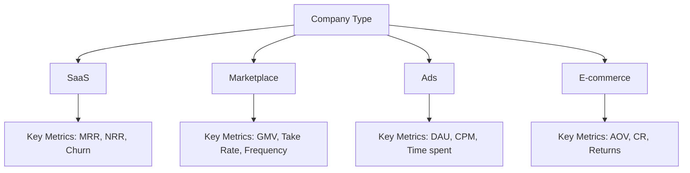
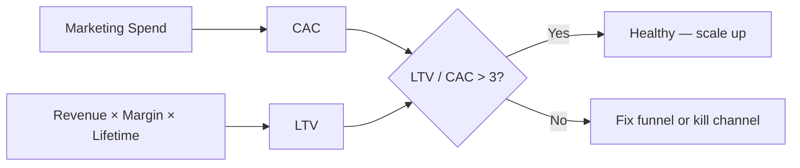
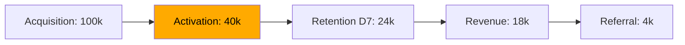
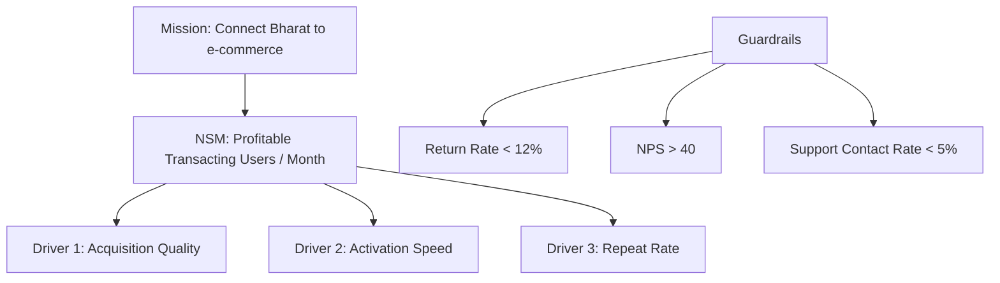
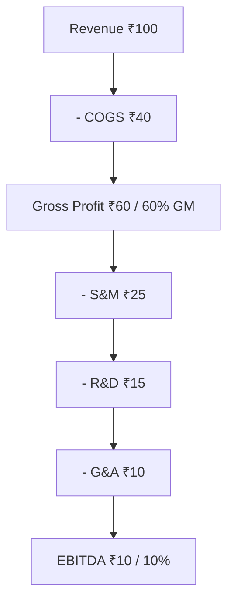
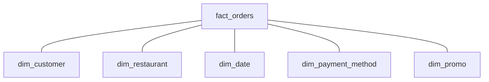

# Business & Data Fundamentals

Dekh bhai, seedha point pe aata hoon — agar tu data analyst banna chahta hai aur tujhe ye nahi pata ki kis tarah ka business hai jis ka data tu analyze kar raha hai, toh tu sirf SQL clerk hai. Top 2% analyst aur baaki 98% mein difference yahi se start hota hai — context. Ek "great" analysis without business context is just data theater. Tu CEO ke saamne 50-page deck le ke jaayega aur woh pehla question pucchega "Iska revenue impact kya hai?" — agar wahin tu hil gaya, game over.

Ye subject tujhe wo neev dega jo har analytics question ke neeche chhupi rehti hai — business kaise paisa banata hai, unit economics kya cheez hai, AARRR funnel kya story sunata hai, North Star metric ki politics kya hai, P&L mein kya likha hota hai, kaunsi analysis kab karni hai, aur OLTP vs OLAP ka real-world consequence kya hai. Sab Hinglish mein, Indian unicorns ke real examples ke saath. Tu agar ye 18 ghante seriously laga deta hai, toh agla har SQL query ya dashboard tujhe "kya number nikala" se "kya decision banaya" tak shift kar dega.

---

## 1. How Businesses Make Money

Yahan se shuru karta hai analyst ka asli safar. SQL likhne se pehle ye samajhna padega ki tu jis company ke liye kaam kar raha hai woh paisa kaise banati hai — kyunki saari analysis usi ke around ghoomti hai.

### 1.1 Business models — SaaS, marketplace, ads, e-commerce

#### Definition (kya hai?)

Business model matlab company kaise paisa banati hai. Char major buckets hain India mein:

- **B2B SaaS** — software subscription bechte hain monthly/yearly. Examples: Zoho, Freshworks, Postman, Razorpay (PaaS-ish), Chargebee. Revenue = MRR × customers. Margin 70-85%.
- **Marketplace** — buyers aur sellers ko connect karte hain, har transaction pe commission lete hain. Examples: Flipkart, Meesho, Urban Company, Swiggy/Zomato (food delivery), Ola/Uber. Revenue = GMV × take rate.
- **Ads-driven** — content free, advertisers se paisa lete hain. Examples: Google, Meta, Sharechat, Inshorts, news apps. Revenue = impressions × CPM.
- **E-commerce / D2C** — direct product bechte hain. Examples: Boat, Mamaearth, Sugar Cosmetics, Lenskart. Revenue = orders × AOV. Margin 30-50%.

Ek aur category hai — **fintech** (Paytm, PhonePe, CRED, Zerodha) — jo hybrid hota hai (payments + lending + investment). Inka revenue MDR (merchant discount rate), interest, brokerage se aata hai.

#### Why?

Business model decide karta hai ki kaunse metrics matter karte hain. SaaS mein churn aur NRR sabse important hain. Marketplace mein supply-demand balance, take rate, frequency dekhne padte hain. Ads mein DAU, time spent, CPM. E-commerce mein AOV, conversion rate, returns. Tu Swiggy ka analyst hai aur "MRR" ki baat kar raha hai — tu galat business model assume kar raha hai.

#### How?

Jab tu naya analyst join karta hai company mein, sabse pehle ye 5 questions pucch:
1. Hum paisa kaise banate hain? (Revenue model)
2. Largest revenue stream konsi hai?
3. Profitable hain ya growth-at-loss mode mein?
4. Top 3 metrics jo board ko har month dikhate hain?
5. Hamara biggest cost bucket kaunsa hai?

Ye 5 answers se tu poori company ka mental model bana lega.

#### Real-life Example

Swiggy do business model chalata hai — food delivery (marketplace, take rate ~22%) aur Instamart (e-commerce, gross margin model). Agar tu Swiggy ka analyst hai aur tujhe "aur kitna grow karein?" pucha jaaye, food delivery side pe answer hoga "frequency badhao" (existing user kitni baar order karta hai), Instamart side pe "AOV badhao" (har order mein zyada items add karwao). Same company, do alag levers — kyunki business model alag hai.

#### Diagram



#### Interview Question

**Q:** Tu Razorpay ka analyst hai. PM ne pucha "humara revenue 10% badhana hai next quarter mein". Tu kaise approach karega?

**A:** Pehla step — Razorpay ka primary revenue MDR hai (har transaction pe ~2%). So revenue = transactions × MDR. Maine teen lever identify kiye: (1) Transaction volume — naye merchants onboard, existing merchants ki TPV badhao; (2) MDR optimization — premium products (Razorpay X, Capital) pe higher take rate; (3) Mix shift — international transactions higher MDR rakhte hain. Maine baseline data dekha — last quarter ka transaction volume, MDR by product, by merchant tier. Phir jo gaps highest revenue impact ke saath fastest move kar sakte hain (e.g., enterprise merchants ka Capital adoption) — woh prioritize kiye. PM ko 3-page memo diya — pyramid principle se: "Recommendation: enterprise capital cross-sell drive karo, ₹40Cr revenue uplift expected, kyunki..."

---

### 1.2 Unit economics — CAC, LTV, payback, contribution margin

#### Definition (kya hai?)

Unit economics matlab — har ek customer / order / unit acquire karne mein kitna paisa lagta hai aur woh kitna laata hai. Bina iske kuch bhi growth flat ya negative profitable hota hai.

- **CAC (Customer Acquisition Cost)** = Marketing spend / new customers acquired. Example: Swiggy ne ₹1Cr marketing kiya aur 50K naye user aaye → CAC = ₹200/user.
- **LTV (Lifetime Value)** = Average revenue per customer × gross margin × average customer lifetime. SaaS ka common formula: ARPU × gross margin / churn rate.
- **Payback period** = CAC / (monthly contribution margin per customer). Itne months mein CAC recover hota hai. Healthy SaaS = 12-18 months. D2C = 3-6 months.
- **Contribution margin** = Revenue – variable costs (per unit). Fixed costs nikaal do. Ye batata hai har order kitna "contribute" karta hai.

#### Why?

VC funded companies mein har Friday "growth at any cost" se "unit economics first" mein shift hota hai. Tu agar ye 4 numbers monitor nahi karta toh tu nahi samajh paayega ki growth profitable hai ya bleed kar raha hai. Zomato, Swiggy, Meesho — sab IPO se pehle unit economics ko unblock karne mein 2-3 saal lagaye.

#### How?

```sql
-- CAC by month, by channel
SELECT
  DATE_TRUNC('month', acquired_at) AS month,
  acquisition_channel,
  SUM(marketing_spend) / NULLIF(COUNT(DISTINCT user_id), 0) AS cac
FROM users u
LEFT JOIN marketing_spend ms USING (channel, month)
GROUP BY 1, 2
ORDER BY 1 DESC;
```

LTV thoda nuanced hota hai. Naive LTV = total historical revenue per cohort / cohort size. Predictive LTV needs survival analysis ya cohort regression — covered later in `da-ml-for-analysts`.

#### Real-life Example

Imagine tu Sugar Cosmetics ka analyst hai. Marketing team ne Instagram pe ₹50L spend kiya, 25,000 customers acquire kiye → CAC = ₹200. Average first order ₹600, gross margin 40% → contribution per order = ₹240. Customers average 1.4 orders karte hain in first 6 months. So 6-month LTV = 1.4 × ₹240 = ₹336. Payback = ₹200 / ₹336 × 6 = 3.6 months. Acche hain. Lekin agar same channel ka CAC ₹400 ho jaaye (auction inflation), payback hits 7.1 months — D2C ke liye stretch ho jaata hai. Yahin pe analyst ki insight CMO ke liye ₹2Cr/month ki decision banti hai.

#### Diagram



#### Interview Question

**Q:** LTV/CAC ratio 3:1 ka thumb rule hai. Iska matlab kya hai aur kab break hota hai?

**A:** 3:1 ka matlab — har ₹1 acquire karne mein, lifetime mein ₹3 revenue (gross-margin adjusted) wapas aana chahiye. 1:1 matlab tu break-even bhi nahi kar raha. 5:1 matlab tu under-investing in growth — aur scale kar sakta tha. Break karta hai jab: (a) churn assumptions galat hain — predicted lifetime real se kam hai; (b) cohort decay — naye cohorts ki LTV kam ho rahi hai (often happens after promo-led acquisition); (c) marginal CAC rising — pehle 10K customers ₹100/CAC mein aaye, agle 50K mein ₹400/CAC lag raha hai (auction inflation). Top 2% analyst average LTV/CAC dekh ke khush nahi hota — woh **marginal** LTV/CAC dekhta hai by channel, by cohort, by month.

---

### 1.3 AARRR funnel — Acquisition, Activation, Retention, Revenue, Referral

#### Definition (kya hai?)

AARRR (Dave McClure's "Pirate Metrics") — product analytics ka backbone framework. Har user journey ko 5 stages mein todta hai:

- **Acquisition** — naya user pehli baar app/website pe aaya
- **Activation** — usne pehla "aha moment" experience kiya (e.g., first order, first message sent, first photo uploaded)
- **Retention** — woh wapas aata hai (D1, D7, D30)
- **Revenue** — usne paise diye (subscription, purchase)
- **Referral** — usne kisi aur ko refer kiya

#### Why?

Funnel-thinking se tu samajh paayega kahan drop-off ho raha hai. Most analysts CMO ko bolte hain "conversion rate gir gaya" — top 2% analyst funnel decompose karta hai, batata hai "drop-off Activation step pe hai, Acquisition healthy hai" — aur fix karna easy ho jaata hai.

#### How?

```sql
-- AARRR funnel for last 30 days (Swiggy-style example)
WITH cohort AS (
  SELECT user_id, MIN(created_at) AS signup_at
  FROM users WHERE created_at >= CURRENT_DATE - 30
  GROUP BY 1
),
events AS (
  SELECT
    c.user_id,
    MAX(CASE WHEN o.created_at <= c.signup_at + INTERVAL '7 days' THEN 1 END) AS activated,
    MAX(CASE WHEN o.created_at BETWEEN c.signup_at + 7 AND c.signup_at + 30 THEN 1 END) AS retained,
    SUM(o.gmv) AS revenue,
    COUNT(DISTINCT r.referred_user_id) AS referrals
  FROM cohort c
  LEFT JOIN orders o ON o.user_id = c.user_id
  LEFT JOIN referrals r ON r.referrer_user_id = c.user_id
  GROUP BY 1
)
SELECT
  COUNT(*) AS acquired,
  SUM(activated) AS activated,
  SUM(retained) AS retained,
  SUM(CASE WHEN revenue > 0 THEN 1 END) AS revenue_users,
  SUM(CASE WHEN referrals > 0 THEN 1 END) AS referrers
FROM events;
```

#### Real-life Example

Zomato ka analyst pata laga ki Acquisition strong hai (1L installs/week), but Activation only 40% (first order within 7 days). Deep dive — most users address add karne ke step pe drop hote hain. Fix: location auto-detect default, SMS-based one-tap login. Activation jumped to 58%, downstream Retention/Revenue automatically improved 20-25%. CMO ka ₹50L marketing waste bach gaya kyunki same acquisition se zyada users monetize hue.

#### Diagram



#### Interview Question

**Q:** Tum Swiggy ke product analyst ho. AARRR funnel mein retention sabse weak hai — D30 only 22%. Kaha investigate karoge?

**A:** Pehle main retention ko slice karunga — by cohort (kab join hue), by channel (organic vs paid), by city, by first-order category, by promo-used. Insight aksar yahan se aati hai: paid Instagram cohorts retention much lower than organic — promo-led acquisition se "wrong-fit" users aate hain. Phir cohort-level retention curve plot karunga (D1, D7, D14, D30) — agar curve flat ho jaata hai 20% pe, that's the loyal core. Bigger drop D7-D14 mein matlab habit nahi banti — push notification strategy, fresh restaurant suggestions, loyalty program (Swiggy One) drive karna chahiye. Recommendation 2-3 bullet points mein, expected retention uplift quantify ki, A/B test design banaya — sab ek 2-page memo mein.

---

### 1.4 North Star Metrics & guardrails

#### Definition (kya hai?)

**North Star Metric (NSM)** — ek single metric jo company ki long-term success ko sabse best capture karta hai. Ye DAU type vanity metric nahi hota — ye **value delivered** capture karta hai.

Examples:
- Airbnb — Nights booked
- Spotify — Time spent listening
- Slack — Messages sent in paid teams
- Swiggy — Orders per active user per week
- Zomato dining — Reservations completed
- Razorpay — TPV (total payment volume) processed

**Guardrail metrics** — woh metrics jo tu side mein monitor karta hai taaki NSM ke chakkar mein kuch important cheez break na ho. Examples: payment failure rate, latency, customer support tickets, refund rate.

#### Why?

NSM ke bina har team apna alag-alag metric optimize karti hai aur company ka direction blur ho jaata hai. NSM ke saath sab line up hote hain. Guardrails ke bina NSM ke pursuit mein kabhi-kabhi UX, quality, ya margin compromise ho jaata hai. Top analyst dono dekhta hai.

#### How?

NSM choose karne ka framework:
1. **Customer value capture karta ho** — vanity metric nahi (e.g., signups vanity hai, weekly active orderers value hai)
2. **Lagging indicator nahi** — kuch leading hona chahiye taaki team affect kar sake
3. **Single number** — multi-metric scorecard NSM nahi hota
4. **Reflects mission** — aspirational ho

Guardrails: latency, error rate, churn, NPS, refund rate, support contact rate.

#### Real-life Example

Meesho ka NSM pehle GMV tha — but woh discount-driven tha (low-margin). 2022 mein NSM shift hua "transacting users with positive contribution margin" pe — matlab woh users count karenge jinki order pe Meesho profit kamati hai. Saath guardrail: customer NPS, return rate, supplier satisfaction. Result — 6 months mein discount spend 35% kam hua, contribution margin positive ho gaya, scale rukla nahi.

#### Diagram



#### Interview Question

**Q:** Tu CRED ka analyst hai. NSM pick karne ko boli — kya choose karega aur kyun?

**A:** CRED ka mission hai high-trust members ka ecosystem — credit card payment, lifestyle rewards, loans. Vanity options: DAU, app opens, total payments. NSM as I'd pick: "Members with ≥1 credit card payment AND ≥1 reward redemption per month" — because ye dono engagement (payment) aur retention loop (rewards = lock-in) capture karta hai. Pure payment hota toh tu utility-only user count karta. Pure rewards hota toh payment-less browsers count karta. Dono ka intersection batata hai ki user lock-in ho gaya hai. Guardrails: late payment rate (credit health), reward unit economics, NPS, fraud rate. Memo deta — NSM definition, baseline, target, sub-drivers, guardrails — sab ek page pe.

---

### 1.5 P&L 101 — revenue, COGS, gross margin, OpEx, EBITDA

#### Definition (kya hai?)

P&L (Profit & Loss statement) ek company ka monthly/quarterly financial scorecard hai:

```
Revenue                  ₹100Cr
- COGS (cost of goods)   ₹40Cr
= Gross Profit           ₹60Cr  (60% gross margin)
- OpEx (operating exp)   ₹50Cr
   - Sales & Marketing   ₹25Cr
   - R&D / Engineering   ₹15Cr
   - G&A (general admin) ₹10Cr
= EBITDA                 ₹10Cr  (10% margin)
- D&A (deprec/amort)     ₹2Cr
= EBIT                   ₹8Cr
- Interest, taxes        ₹3Cr
= Net Profit             ₹5Cr
```

- **Revenue** — top line, customer se aaya hua paisa
- **COGS** — direct cost of delivering the product (server costs for SaaS, packaging+shipping for D2C, payment gateway fees for marketplace)
- **Gross margin** = (Revenue – COGS) / Revenue. SaaS ~75-85%, marketplace 15-30%, e-commerce 30-50%
- **OpEx** — sab indirect costs (salaries, marketing, rent, tools)
- **EBITDA** — Earnings before Interest, Taxes, Depreciation, Amortization. Rough cash flow proxy

#### Why?

Analyst jo P&L padh sakta hai woh CFO se conversation kar sakta hai. Kabhi tu finance team ke saath sit karega — ya tujhe variance analysis karna padega — ya CEO direct pucchega "marketing spend kya gross margin pe pressure daal raha hai?" — bina P&L samjhe tu blank ho jaayega.

#### Real-life Example

Swiggy 2023 ke financials: revenue ~₹8200Cr, COGS (delivery partner pay, restaurant payouts) ~₹6200Cr → gross margin ~24%. OpEx (marketing, tech, G&A) ~₹2900Cr → EBITDA loss ~₹900Cr. Analyst ki insight: agar har order pe contribution margin 10 paise zyada extract ho jaaye (delivery efficiency, restaurant rate negotiation), 1B orders × 10 paise = ₹100Cr — that flows straight to EBITDA. Yahin pe SQL queries (cohort-level CM analysis) actual ₹ create karte hain.

#### Diagram



#### Interview Question

**Q:** EBITDA aur Net Profit mein farak kya hai? Aur startups EBITDA pe focus kyu karte hain?

**A:** EBITDA earnings before interest, tax, depreciation, amortization hai — basically operating cash generation ka proxy. Net profit usme se sab non-operational cheezein bhi nikal jaati hain. Startups EBITDA pe focus karte hain because (a) early-stage mein D&A heavy hota hai (capex investments) — net loss dikhana mathematically zyada lagta hai actual cash burn se; (b) interest aur tax non-operational decisions pe depend karte hain (capital structure) — operating efficiency dikhane ke liye unhe strip out karte hain. Top 2% analyst EBITDA aur free cash flow dono dekhta hai — kyunki EBITDA mein working capital changes capture nahi hote, aur company "EBITDA positive" ho ke bhi cash flow negative ho sakti hai (e.g., inventory build-up).

---

## 2. Types of Analysis

Har question ke liye alag tarah ki analysis chahiye. Tu agar "kya hua" pucha gaya hai aur tu causal model bana raha hai, time waste. Reverse bhi waste.

### 2.1 Descriptive vs diagnostic vs predictive vs prescriptive

#### Definition (kya hai?)

Char layers of analysis hain — increasing complexity ke saath:

| Type | Question | Example |
|------|----------|---------|
| Descriptive | Kya hua? | Last week revenue ₹2.1Cr tha. |
| Diagnostic | Kyun hua? | Revenue gir gaya kyunki Bangalore city mein partner outage tha. |
| Predictive | Kya hoga? | Next month revenue ₹2.3-2.5Cr predicted. |
| Prescriptive | Kya karna chahiye? | Bangalore mein backup partner onboard karo, ₹15L revenue protect hoga. |

#### Why?

Sab dashboards descriptive hote hain — "kal kitna hua". Descriptive hi value-add nahi hai jab tak diagnostic na ho. Predictive aur prescriptive hi top 2% analyst ka territory hai. Most companies ka 80% analyst time descriptive pe jaata hai — top analysts deliberately diagnostic+ pe shift karte hain.

#### Real-life Example

Flipkart Big Billion Days ke baad analyst report:
- **Descriptive:** "Sale ka GMV ₹4500Cr — last year se 30% up."
- **Diagnostic:** "Mobile category 45% up (drove growth), fashion only 8% up; mobile mein iPhone discount 15% offer ka bada role tha."
- **Predictive:** "Q4 forecast mein ₹12000Cr GMV — driven by mobile + electronics."
- **Prescriptive:** "Fashion category pe focused brand investments + influencer marketing = expected ₹600Cr incremental Q4 GMV."

#### Interview Question

**Q:** "Last week DAU gir gaya" — ek dashboard analyst ye descriptive number deta hai. Top 2% analyst kya extra deta?

**A:** Top 2% analyst diagnostic + predictive + prescriptive add karta hai. Diagnostic — DAU gir gaya kyunki North India mein heatwave tha aur app open rate gir gaya — segmenting by region revealed it. Predictive — agle 2 weeks mein DAU recover ho jaayega based on weather forecast + historical recovery curves. Prescriptive — heatwave-resilient categories (cold drinks, ACs in BigBasket case) pe push notification, expected DAU recovery 15% faster. Same data point, but actionable strategy in 1 day vs descriptive dashboard report.

---

### 2.2 Exploratory vs confirmatory analysis

#### Definition (kya hai?)

- **Exploratory (EDA)** — tu data ke saath khel raha hai, hypothesis nahi hai. Looking for patterns, surprises. Tukey ki philosophy.
- **Confirmatory** — tu specific hypothesis test kar raha hai. Pre-registered, statistical test. A/B test analysis exclusively confirmatory hota hai.

#### Why?

Most pitfalls confirmatory analysis ko exploratory ki tarah treat karne se aate hain (ya vice versa). Tu agar 50 dimensions mein "winner" dhundta hai (EDA), but p-value report karta hai jaise hypothesis pre-registered tha — tu p-hacking kar raha hai. Top analyst dono ke beech clear line draw karta hai.

#### Real-life Example

Tu Paytm ke fraud analyst hai. Exploratory mode: 1M transactions ka data, kya pattern dikh raha hai? IP-clusters? Velocity? Karna hai dive deep, find anomalies. Confirmatory mode: tujhe lagta hai "BDA wale phones se zyada fraud aata hai" — ek hypothesis hai. Tu pre-register karta hai test design (chi-square test of independence between phone OS and fraud flag), sample size, alpha, expected effect size. Then run. Result valid hai. Agar tu 20 features mein "best" dhund ke phir test karega — multiple comparisons, false discovery, garbage in.

#### Interview Question

**Q:** "P-hacking" kya hai? Tu kaise avoid karega?

**A:** P-hacking — same data pe multiple tests run karna jab tak ek "significant" result na aaye, aur sirf woh report karna. Avoidance: (1) hypothesis pre-register karo before looking at data; (2) multiple testing correction (Bonferroni, FDR) lagao agar sach mein multiple tests chahiye; (3) train-test split — exploratory analysis ek subset pe, confirmatory test held-out pe; (4) Bayesian framework consider karo jo penalize karta hai over-fitting; (5) effect size + CI report karo, sirf p-value nahi.

---

## 3. Data Types & Structure

Ye section thoda technical hai — par bina iske SQL bhi confused likhega.

### 3.1 Structured, semi-structured, unstructured data

#### Definition (kya hai?)

- **Structured** — fixed schema, rows/columns. Examples: orders table, users table. Tools: SQL.
- **Semi-structured** — flexible but parseable. Examples: JSON event logs, XML, Parquet. Tools: SQL+JSON functions, Spark.
- **Unstructured** — koi schema nahi. Examples: chat logs, images, audio, PDFs. Tools: Python, ML models, vector DBs.

#### Why?

Indian analyst ka 70% time structured pe jaata hai (relational DBs). 25% semi-structured (event JSONs from product). 5% unstructured (text reviews, voice logs). Tu agar product analytics karta hai — Mixpanel, Amplitude, GA4 — sab semi-structured event JSONs hote hain. SQL with JSON_EXTRACT functions essential hai.

#### Real-life Example

Swiggy ek order ka data 3 places pe rakhta hai — orders table (structured: SQL row), event stream (semi-structured: JSON for click → cart → checkout events), aur customer support call recordings (unstructured: audio). Top 2% analyst teeno ko correlate karta hai — "users jinhone checkout pe drop kiya, kya unke pehle support call mein kuch bola tha?" Multi-source analysis = unique insight.

---

### 3.2 OLTP vs OLAP — when which

#### Definition (kya hai?)

- **OLTP (Online Transaction Processing)** — operational DBs. Postgres, MySQL, MongoDB. Optimized for fast small reads/writes (single row). Production app yahan se data leta-deta hai.
- **OLAP (Online Analytical Processing)** — analytics DBs. Snowflake, BigQuery, Redshift, ClickHouse. Optimized for big aggregations on millions of rows.

| | OLTP | OLAP |
|---|---|---|
| Optimized for | Single-row read/write | Aggregations |
| Storage | Row-oriented | Column-oriented |
| Latency | ms | seconds |
| Concurrent users | 1000s | 10s |
| Example workload | Add to cart | Last 90 days revenue by city |

#### Why?

Analyst kabhi OLTP pe direct query nahi maarta — production down kar dega. CDC (Change Data Capture) via Debezium / Fivetran data ko OLAP mein ETL/ELT karta hai. Tu Snowflake/BigQuery pe queries chalata hai. Rule: OLTP = product, OLAP = analytics. Cross na karna.

#### Real-life Example

PhonePe ka transactions table — Postgres OLTP (low latency for transaction completion). Har raat ELT job se BigQuery (OLAP) mein move hota hai. Analyst ke queries BigQuery pe — `SELECT SUM(amount) FROM transactions WHERE date >= '2026-01-01'` instant chalti hai because columnar storage. Same query Postgres pe ghante laga deti, prod degrade ho jaata.

#### Interview Question

**Q:** Production engineer ne tujhe production Postgres DB ka access diya. Tu ek bada aggregation query chala raha hai aur app slow ho raha hai. Kya galat hua aur kaise fix karega?

**A:** Galat ye hua ki OLTP DB pe OLAP query chala diya. Postgres row-oriented hai — pura table scan kar raha hai for aggregation, aur saath mein production traffic ke liye locks/cache compete kar raha hai. Fix: (a) immediate — query kill, replica pe shift karo; (b) short-term — Postgres read replica setup, analytical queries replica pe; (c) right-term — proper data warehouse (BigQuery/Snowflake) setup, CDC se data sync. Top 2% analyst yahan business case bhi banata: "₹X crore revenue impact prevent hoga because checkout latency stable rahegi."

---

### 3.3 Star schema, snowflake schema, fact vs dimension

#### Definition (kya hai?)

Kimball methodology — analytics ka standard data model. Two table types:

- **Fact table** — events, transactions, measurements. High volume. Examples: orders, page_views, ad_impressions. Numeric measures (amount, quantity).
- **Dimension table** — context, descriptive attributes. Low volume. Examples: customers, products, dates, geographies. Mostly text fields.

**Star schema** — central fact table + dimension tables radiating out. Joins simple, denormalized.

**Snowflake schema** — dimensions further normalized into sub-dimensions. More normalized, more joins, slightly slower queries but less storage.

#### Why?

Modern analytics 95% star schema pe khada hai. dbt projects, BigQuery datasets, Snowflake warehouses — sab star schema implement karte hain. Tu agar fact-dim concept nahi samjha toh dbt mein modeling galat karega aur dashboards slow + brittle banenge.

#### How?

```sql
-- Star schema in action: revenue by city by month
SELECT
  d.year_month,
  c.city,
  SUM(f.gmv) AS revenue,
  COUNT(DISTINCT f.user_id) AS unique_orderers
FROM fact_orders f
JOIN dim_date d ON f.date_id = d.date_id
JOIN dim_customer c ON f.customer_id = c.customer_id
WHERE d.year = 2026
GROUP BY 1, 2
ORDER BY 1, 3 DESC;
```

#### Real-life Example

Zomato ka fact_orders table — har order ek row, columns: order_id, customer_id, restaurant_id, date_id, gmv, items, delivery_fee. Dimension tables: dim_customer (city, signup_date, tier), dim_restaurant (cuisine, area, rating), dim_date (month, quarter, day_of_week). Tu agar analyst ne ye structure properly setup nahi kiya hota — har query mein 5-6 joins hote, slow + bug-prone. Ab kaam easy.

#### Diagram



#### Interview Question

**Q:** Star schema vs OBT (One Big Table) debate — modern stack mein kaunsa preferred hai?

**A:** Modern columnar warehouses (BigQuery, Snowflake) pe storage cheap aur joins bhi efficient hain — so OBT (denormalized single wide table) practical ho gaya hai for many use cases. Pros: zero joins, super fast queries, simple for non-technical users. Cons: storage waste, update anomalies (customer city change karna ho toh million rows update karne padenge), dimension semantics lose ho jaate hain. Best practice: dbt mein **fact + dim** as base layer (truth), and **OBT marts** as analyst-friendly views derived from base layer. Best of both — semantic clarity neeche, query speed upar.

---

### 3.4 Cardinality, granularity, primary/foreign keys

#### Definition (kya hai?)

- **Cardinality** — column mein kitne unique values hain. high-cardinality (user_id), medium (city), low (gender, plan_type).
- **Granularity** — table ka "row level". orders table ki granularity = "1 row per order". user_daily_summary = "1 row per user per day". Top mistake: confused granularity → wrong aggregations.
- **Primary key (PK)** — unique row identifier in this table. user_id in users.
- **Foreign key (FK)** — pointer to PK of another table. user_id in orders → references users.user_id.

#### Why?

90% data bugs galat granularity ya cardinality ke confusion se aate hain. Tu agar orders table aur shipments table dono ko join karta hai bina PK/FK samjhe — duplicates explode ho jaate hain. Top 2% analyst pehla check `COUNT(*) vs COUNT(DISTINCT pk)` karta hai har table pe.

#### How?

```sql
-- Cardinality check
SELECT
  COUNT(*) AS total_rows,
  COUNT(DISTINCT user_id) AS unique_users,
  COUNT(DISTINCT city) AS unique_cities,
  COUNT(DISTINCT plan_type) AS unique_plans
FROM users;

-- Granularity check — kya orders table truly 1 row per order hai?
SELECT order_id, COUNT(*) AS row_count
FROM orders
GROUP BY 1
HAVING COUNT(*) > 1;  -- agar yahan rows aaye, granularity broken hai
```

#### Real-life Example

Tu Meesho ka analyst hai. orders table pe SUM(gmv) maara — ₹250Cr aaya. CFO ne pucha "phir actual revenue 200Cr kyu hai?" Tu deep dive karta — pata laga orders table mein har order ke har item ki separate row hai (granularity = item-level, not order-level), but tu order-level samajh ke join kiya tha shipments se. Result — har order ke items × shipments cross product = duplicate rows. SUM inflated. Bug. Granularity check pehle hota toh ye 30 min mein pakda jaata, board memo embarrassment se bachte.

#### Interview Question

**Q:** Tu ek `customer_subscriptions` table query kar raha hai — `SELECT COUNT(*) FROM customer_subscriptions` returns 1.2M, but `SELECT COUNT(DISTINCT customer_id)` returns 800K. Iska kya matlab hai?

**A:** Granularity 1-row-per-customer nahi hai. Either (a) ek customer ke multiple subscriptions hain (multi-product company — like Amazon Prime + Music + Video all separate rows), ya (b) historical version-tracked records hain (e.g., subscription upgrades = new row). To know which, mujhe `start_date`, `end_date`, ya `is_active` columns dekhne padenge. Agar SCD Type 2 hai (version-tracked), toh "active customers" = `WHERE is_current = TRUE`. Agar multi-sub, "active customers" = `COUNT(DISTINCT customer_id) WHERE status = 'active'`. Galat assumption se 50% inflated metric ja sakta hai board ke saamne — top 2% analyst pehla yahi check karta hai.

---

> **Bottom line:** Business sense + data structure samajh = analyst ka foundation. Bina iske advanced SQL likhega bhi to wrong question answer karega. Iss subject ko 18 ghante seriously laga, har section ka apne company ke context mein equivalent dhund — phir aage badh.
