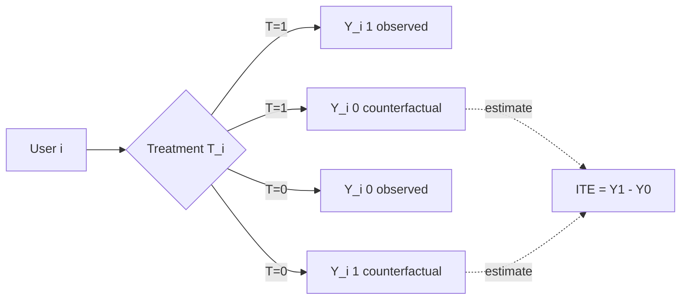
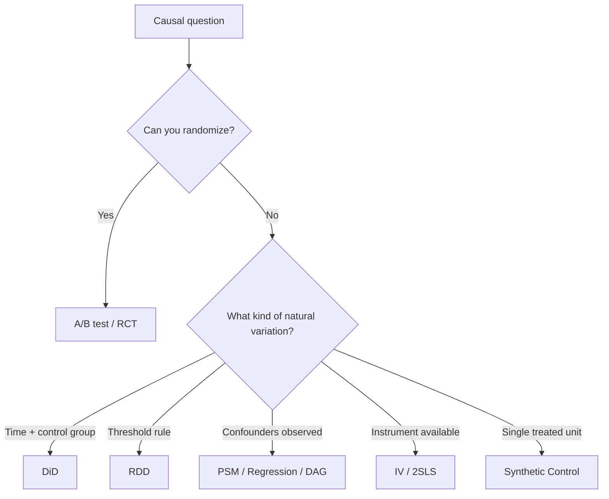
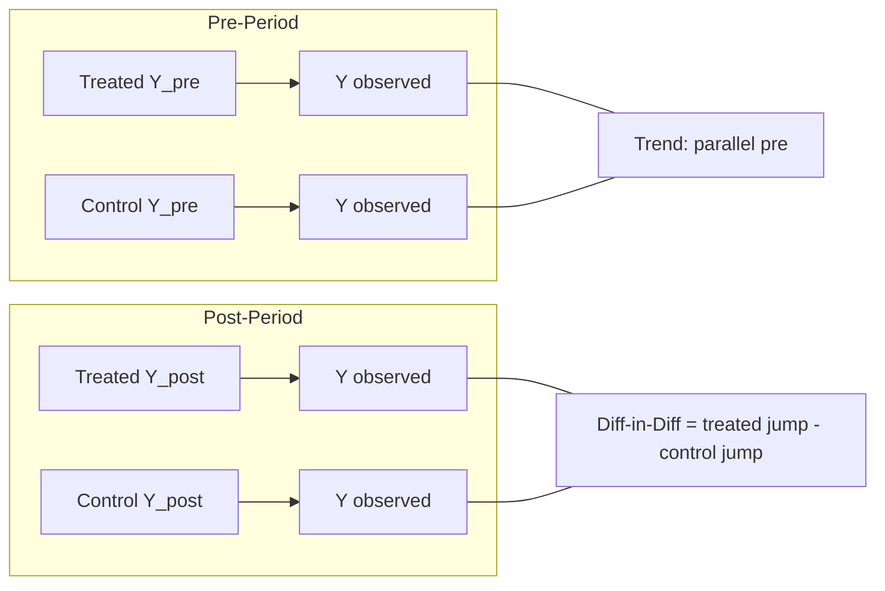
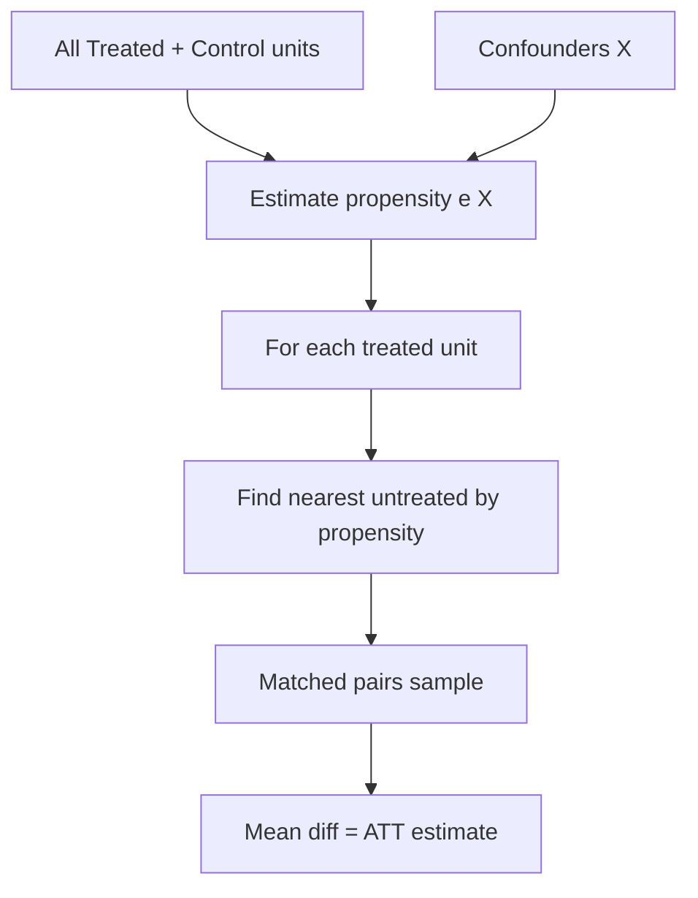
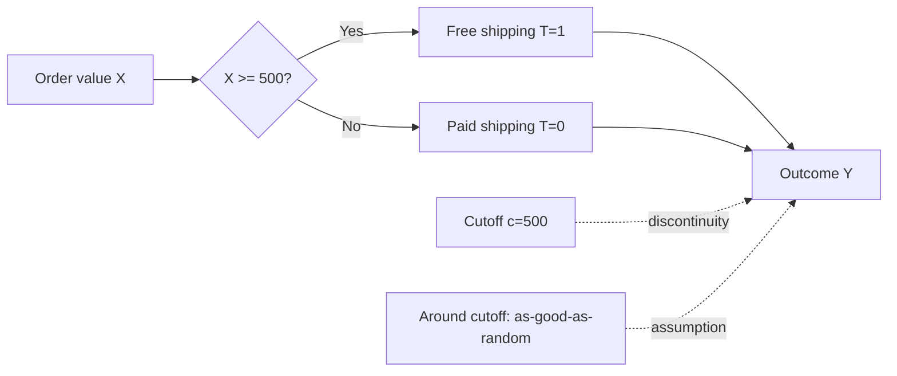
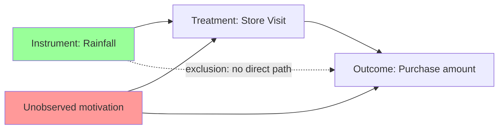
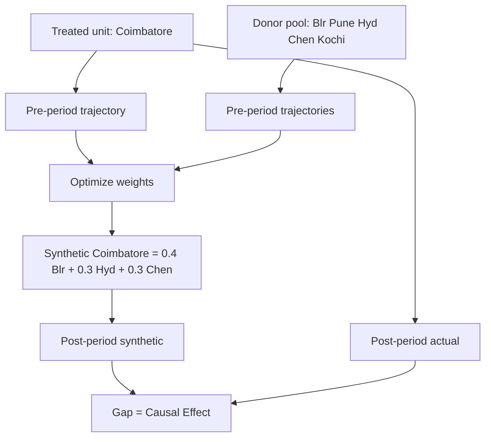
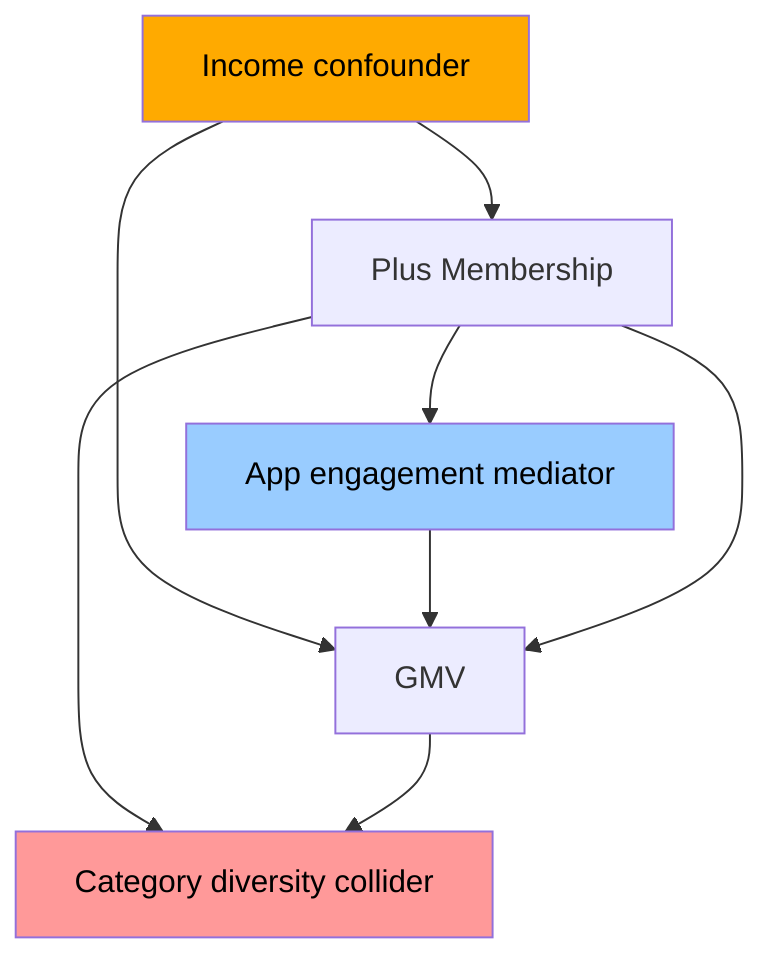
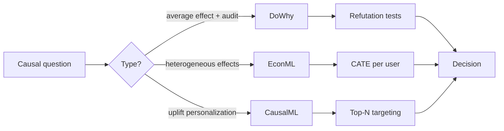

# Causal Inference

Dekh bhai, seedha point pe aata hoon — agar tu data analyst hai aur tujhe lagta hai correlation hi sab kuch hai, toh tu A/B test ke comfort zone se bahar nikal hi nahi paayega. Real world mein 80% questions tujhe aise milenge jahan **experiment chala nahi sakte**: "Naye pricing ka revenue pe kya impact hua?" — pricing already roll out ho chuki hai. "Customer success calls churn kam karte hain?" — calls high-value users ko hi jaate hain (selection bias). "GST rate change ka MSME revenue pe asar kya tha?" — government ne tujhse pucha thodi tha. Yahan **Causal Inference is your superpower**.

Ye subject tujhe sikhayega ki kaise observational data se causal claims nikaale jaate hain — without running an RCT. Difference-in-Differences, Propensity Score Matching, Regression Discontinuity, Instrumental Variables, Synthetic Control, aur Pearl ke DAGs — har technique ek alag scenario solve karti hai. Ye top 2% data analyst ka asli differentiator hai. Average analyst SQL likhta hai, dashboard banata hai. Top 2% analyst CFO ko bolta hai "Maine DiD se nikala — naye delivery UI ne Bangalore mein order frequency 7.4% badhayi, parallel-trends assumption hold karta hai, p < 0.01."

Iss subject ko 20 ghante seriously laga. Math thodi heavy hai (potential outcomes framework, Rubin), Python tooling sikhni hai (`statsmodels`, `linearmodels`, `dowhy`, `econml`, `causalml`), aur sabse important — **causal thinking** develop karni hai. Jab koi bole "X badha to Y bhi badha", tu turant pucche "confounder kya hai? selection bias kya hai? counterfactual kya hota?". Ye mindset hi tujhe board room mein le ke jaayega.

---

## 1. Why Causal Inference?

Causal inference ka start hota hai ek philosophical question se — "kya hota agar..." Ye counterfactual thinking hai, aur isi ke around Rubin (1974) ne **potential outcomes framework** banaya, aur Pearl ne **structural causal models / DAGs** diye. Dono mil ke modern causal inference ka backbone hain.

### 1.1 Potential outcomes (Rubin) & counterfactuals

#### Definition (kya hai?)

Rubin's potential outcomes framework: har individual $i$ ke do **potential outcomes** hote hain:

- $Y_i(1)$ — outcome agar treatment mila ho
- $Y_i(0)$ — outcome agar treatment nahi mila ho

Lekin reality mein tu sirf **ek** observe kar sakta hai — yeh hai **fundamental problem of causal inference**. Agar Ramesh ne Swiggy One subscribe kiya, to tu $Y_{Ramesh}(1)$ dekh sakta hai (uska post-subscription order frequency), but $Y_{Ramesh}(0)$ — counterfactual — tujhe estimate karna padega.

Key estimands:

- **Individual Treatment Effect (ITE):** $\tau_i = Y_i(1) - Y_i(0)$
- **Average Treatment Effect (ATE):** $\tau_{ATE} = E[Y_i(1) - Y_i(0)]$
- **Average Treatment Effect on the Treated (ATT):** $\tau_{ATT} = E[Y_i(1) - Y_i(0) \mid T_i = 1]$

ATT zyada relevant hota hai jab tu specifically treated group pe impact dekhna chahta hai (e.g., Swiggy One subscribers pe effect, na ki universe-wide).

#### Why?

Counterfactual thinking se tu correlation se aage badhta hai. "Swiggy One users 20% zyada order karte hain" — ye correlation hai (selection bias: heavy users hi subscribe karte hain). "Swiggy One ne order frequency 7% badhayi" — ye causal claim hai (counterfactual ke against compare). Bina is framework ke tu galat conclusions board ko deta rahega.

#### How (with Python)?

```python
import numpy as np
import pandas as pd

# Simulate potential outcomes for Swiggy One subscription
np.random.seed(42)
n = 10000
# Heavy users have higher baseline + higher likelihood to subscribe (selection bias)
baseline = np.random.gamma(2, 5, n)  # baseline orders/month
treat_prob = 1 / (1 + np.exp(-(baseline - 10) / 3))
T = np.random.binomial(1, treat_prob)

Y0 = baseline + np.random.normal(0, 1, n)  # untreated potential outcome
Y1 = Y0 + 2.5  # true ATE = 2.5 orders/month
Y_obs = T * Y1 + (1 - T) * Y0  # only one observed

# Naive comparison (biased — selection)
naive_ate = Y_obs[T == 1].mean() - Y_obs[T == 0].mean()
true_ate = (Y1 - Y0).mean()
print(f"Naive ATE: {naive_ate:.2f}, True ATE: {true_ate:.2f}")
# Naive overestimates because subscribers were heavy users to begin with
```

#### Real-life Example

Razorpay launches "Capital" loan product. Naive analysis: "Capital users ka GMV 40% zyada hai non-users se" — but Capital sirf already-growing merchants ko mila (selection). True causal effect maybe 8-12%. Without potential outcomes thinking, CFO ko ₹X-crore wrong projection diya jaayega aur growth team ki budgeting flop ho jaayegi.

#### Diagram



#### Interview Q&A

**Q:** "Fundamental problem of causal inference" kya hai aur causal inference iski wajah se kaise possible hai?

**A:** Fundamental problem — har individual ke liye tu sirf ek potential outcome observe kar sakta hai (treated ya untreated), dono ek saath nahi. So ITE individual level pe non-identifiable hai. Causal inference is possible kyunki hum **average effects** estimate karte hain — under assumptions like SUTVA (no interference between units), ignorability ($Y(0), Y(1) \perp T \mid X$), aur positivity ($0 < P(T=1 \mid X) < 1$). Agar treatment as-good-as-random ho given covariates, treated group ki Y(0) untreated group se estimate kar sakte hain. Top 2% analyst hamesha pehle assumptions explicitly state karta hai before giving causal estimate.

---

### 1.2 When you can't run an experiment

#### Definition (kya hai?)

A/B test gold standard hai, lekin practical reality mein 4 scenarios mein tu RCT chala hi nahi sakta:

1. **Ethical** — "Smoking ka cancer pe effect" — randomly logon ko smoke karwana illegal hai
2. **Logistical / Cost** — "GST rate change ka MSME pe impact" — government tujhse pucke nahi karegi
3. **One-shot events** — "Demonetization", "COVID lockdown", "Zomato IPO" — already ho chuke hain
4. **Selection-driven adoption** — "Swiggy One subscription effect" — randomization possible hai but business reasons se rollout already happened

In sab cases mein **observational data** se causal claim nikalna padta hai. Ye doable hai, but you need: (a) right method, (b) plausible assumptions, (c) sensitivity analysis. Bina (c) ke tera result fragile hai.

#### Why?

Most boardroom questions experiments se nahi answer hote. "Naye pricing ka effect kya tha?" — pricing already live hai, control group nahi hai. Tu agar bolega "experiment chala nahi sakte, can't answer" — tu replaced ho jaayega. Top 2% analyst quasi-experimental designs use karta hai — DiD, RDD, IV, synthetic control — taaki RCT ke bina bhi causal estimate de sake.

#### How (with Python)?

```python
import pandas as pd
import numpy as np

# Decision tree: which method when?
def pick_causal_method(scenario):
    rules = {
        "treatment_at_specific_time_with_control_group": "DiD",
        "treatment_assigned_by_threshold": "RDD",
        "observational_with_confounders": "PSM or DAG-based adjustment",
        "endogenous_treatment_with_instrument": "IV (2SLS)",
        "single_treated_unit_many_controls": "Synthetic Control",
        "structural_assumptions_clear": "DAG + do-calculus (Pearl)"
    }
    return rules.get(scenario, "Re-frame your question")

# Example
print(pick_causal_method("treatment_at_specific_time_with_control_group"))
# → DiD

print(pick_causal_method("treatment_assigned_by_threshold"))
# → RDD
```

Method choice depends on **what kind of natural experiment** your data has. Pehla step — data ki structure samjho, phir method pick karo.

#### Real-life Example

UPI launch (2016) ke baad RBI ko samajhna tha "UPI ne digital payments penetration kitni badhayi vs cash?" RCT possible nahi tha — UPI sab states mein simultaneous launch hua. Researchers ne **synthetic control** use kiya — pre-UPI period mein India-like countries (Brazil, Indonesia) ka weighted combination banaya, post-UPI India ke actual digital payment growth ko us synthetic counterfactual se compare kiya. Result: UPI ne ~22% incremental digital adoption add ki, 4 saal mein. Bina causal method ke ye number sirf "associations" hota.

#### Diagram



#### Interview Q&A

**Q:** "Correlation does not imply causation" — ye sab bolte hain. Top 2% analyst kya extra batata hai?

**A:** Average analyst yahin pe ruk jaata hai. Top 2% analyst aage jaata: (1) Identify karo **why** correlation causation imply nahi karta — confounding, reverse causality, selection, ya measurement error; (2) Specific example deta — "ice cream sales aur drowning correlated hain, both confounded by summer"; (3) Solution propose karta — "agar confounder observable hai, regression adjust karo ya PSM. Agar unobservable, IV ya RDD dhundo. Agar time variation hai, DiD do." (4) Sensitivity analysis run karta — "Rosenbaum bounds, E-value — kitna unobserved confounding mera estimate flip karega." Ye 4-step jawab tujhe board-ready bana deta hai.

---

## 2. Causal Methods

Ab core methods. Har method ek specific natural experiment exploit karta hai. Tujhe dono samajhna hai — math aur business application.

### 2.1 Difference-in-Differences (DiD)

#### Definition (kya hai?)

DiD ka core idea: agar treatment ek specific time pe ek specific group ko mila, aur ek similar untreated group hai, toh **time effect ko subtract karne ke baad** treatment effect milega.

$$\tau_{DiD} = (Y_{T,post} - Y_{T,pre}) - (Y_{C,post} - Y_{C,pre})$$

Equivalent regression form:

$$Y_{it} = \alpha + \beta_1 \cdot \text{Treated}_i + \beta_2 \cdot \text{Post}_t + \tau \cdot (\text{Treated}_i \times \text{Post}_t) + \epsilon_{it}$$

Yahan $\tau$ ka coefficient = DiD estimate of ATT.

**Critical assumption — Parallel Trends:** Treatment ke absence mein, treated aur control groups ki Y trends parallel hoti. Agar pre-period mein dono parallel nahi the, DiD biased hai.

#### Why?

DiD sabse common quasi-experimental method hai industry mein. Phased rollouts (city-by-city launches), policy changes (GST, demonetization), feature rollouts (Bangalore mein pehle, Mumbai mein baad mein) — sab DiD ke perfect candidates hain. Aur regression form mein control variables bhi add kar sakte hain.

#### How (with Python)?

```python
import pandas as pd
import numpy as np
import statsmodels.formula.api as smf

# Swiggy launches new delivery time UI in Bangalore (treatment)
# Mumbai, Delhi, Hyderabad as control cities
np.random.seed(7)
cities = ["Bangalore", "Mumbai", "Delhi", "Hyderabad"]
months = pd.date_range("2025-06-01", "2026-03-01", freq="MS")
rows = []
for c in cities:
    for m in months:
        treated = int(c == "Bangalore")
        post = int(m >= pd.Timestamp("2025-12-01"))
        # Base trend + city FE + treatment effect post-launch
        base = 100 + 0.5 * (m.month + 12 * (m.year - 2025))
        city_fe = {"Bangalore": 5, "Mumbai": 10, "Delhi": 0, "Hyderabad": -3}[c]
        treat_effect = 7.4 if (treated and post) else 0
        y = base + city_fe + treat_effect + np.random.normal(0, 1.5)
        rows.append({"city": c, "month": m, "treated": treated,
                     "post": post, "orders_per_user": y})
df = pd.DataFrame(rows)

# DiD via regression
model = smf.ols("orders_per_user ~ treated + post + treated:post", data=df).fit()
print(model.summary().tables[1])
# Coefficient on treated:post = ATT estimate (~7.4)

# With city + month fixed effects (more robust)
df["month_str"] = df["month"].astype(str)
fe_model = smf.ols("orders_per_user ~ treated:post + C(city) + C(month_str)",
                   data=df).fit()
print("DiD (FE) estimate:", fe_model.params["treated:post"])
```

Pre-trends test important hai — `event_study` regression chalao with leads/lags to verify parallel trends hold pre-treatment.

#### Real-life Example

Swiggy launches a new delivery-time UI in Bangalore in Dec 2025 — predicted ETAs ko 2-min granularity se 30-sec granularity tak refine kiya. Mumbai, Delhi, Hyderabad rollout 3 months baad. PM ko question — "Bangalore mein orders/user/week kitna badha causally?" Naive year-over-year comparison: Bangalore 12% up — but festive season + new restaurants + multiple confounders. DiD with Mumbai/Delhi/Hyderabad as control: ATT = 7.4% (p < 0.01). PM ko clean number mila — pan-India rollout justified ₹40Cr engineering investment.

#### Diagram



#### Interview Q&A

**Q:** Parallel trends assumption fail ho gaya — kya karega?

**A:** Pehla — pre-trends test plot karunga (event-study with leads). Agar treated group already trending up before treatment, parallel trends violated. Options: (1) **Synthetic DiD** — control units ko weighted combination de jo treated ka pre-trend match kare; (2) **Triple-difference (DDD)** — additional dimension (e.g., user segment) jisme treatment hone ki uneven exposure ho, taaki time-varying confounders cancel ho jayein; (3) **Re-define control group** — closer matching cities pick karo; (4) **Functional form change** — log(Y) use karo agar trends multiplicative hain. Bina sensitivity analysis ke DiD board ke saamne mat le ke jaana — top 2% analyst hamesha pre-trends plot saath rakhta hai slide deck mein.

---

### 2.2 Propensity Score Matching (PSM)

#### Definition (kya hai?)

PSM ka idea: jab observational data mein treated aur untreated groups systematically alag hain (selection bias), tu **propensity score** $e(X) = P(T=1 \mid X)$ estimate kar — ye conditional probability hai treatment milne ki, given covariates X. Phir similar propensity wale treated-untreated pairs match kar de — matched sample mein selection bias significantly reduce ho jaata hai.

Steps:
1. Logistic regression: $e(X) = P(T=1 \mid X)$ estimate karo
2. Treated user ko closest untreated user(s) se match karo on $e(X)$ — nearest neighbor, kernel, ya stratification
3. Matched sample pe ATE/ATT calculate karo: $\tau_{ATT} = E[Y(1) - Y(0) \mid T=1, e(X)]$

**Key assumption — Conditional Independence / Ignorability:** $Y(0), Y(1) \perp T \mid X$. Matlab — sab confounders X mein observed hain. Unobserved confounders ho to PSM bias rahega.

#### Why?

PSM kab use karte hain — jab tu observational data mein hai aur RCT possible nahi hai, but rich covariates available hain jo selection drive karte hain. Marketing campaigns, customer success interventions, loyalty programs — sab PSM-friendly hain.

#### How (with Python)?

```python
import numpy as np, pandas as pd
from sklearn.linear_model import LogisticRegression
from sklearn.neighbors import NearestNeighbors

# Razorpay: customer success calls (CS) effect on churn
np.random.seed(11)
n = 5000
mrr = np.random.lognormal(8, 1, n)  # monthly recurring revenue
tenure = np.random.gamma(2, 6, n)
tickets = np.random.poisson(2, n)
# CS calls go to high-MRR, long-tenure, high-ticket merchants (selection bias)
score = 0.5 * np.log(mrr) + 0.1 * tenure + 0.3 * tickets - 6
T = np.random.binomial(1, 1 / (1 + np.exp(-score)))
# True ATT — CS calls reduce churn by 4 percentage points for treated
churn_base = 0.20 - 0.02 * np.log(mrr) - 0.005 * tenure + 0.01 * tickets
churn_base = np.clip(churn_base, 0.02, 0.95)
true_effect = -0.04
churn = np.random.binomial(1, np.clip(churn_base + T * true_effect, 0, 1))
df = pd.DataFrame({"mrr": mrr, "tenure": tenure, "tickets": tickets,
                   "T": T, "churn": churn})

# Naive
naive = df[df.T == 1].churn.mean() - df[df.T == 0].churn.mean()
print(f"Naive: {naive:.3f}")  # biased — high MRR users churn less anyway

# Step 1: propensity score
X = df[["mrr", "tenure", "tickets"]].values
ps_model = LogisticRegression(max_iter=1000).fit(X, df.T)
df["ps"] = ps_model.predict_proba(X)[:, 1]

# Step 2: 1:1 nearest-neighbor matching
treated = df[df.T == 1]
control = df[df.T == 0]
nn = NearestNeighbors(n_neighbors=1).fit(control[["ps"]].values)
_, idx = nn.kneighbors(treated[["ps"]].values)
matched_control = control.iloc[idx.flatten()]
att = treated.churn.mean() - matched_control.churn.mean()
print(f"PSM ATT: {att:.3f}")  # ≈ -0.04
```

Production mein `causalml.match.NearestNeighborMatch` ya `dowhy` use karo — robust, handles weighting and overlap diagnostics.

#### Real-life Example

Razorpay studies effect of customer success calls on churn. 30,000 SMB merchants, 8,000 ko CS calls mile (high-value, high-tenure merchants ko priority). Naive: CS-called merchants ka churn 6%, others 14% — looks like calls reduce churn 8 pp. PSM with covariates (MRR tier, tenure, support tickets, product mix): true ATT comes to ~3.8 pp reduction. Razorpay ne ROI calculate kiya — har CS call ₹400, retained merchant ka NPV ₹35K — clear positive. Without PSM, they'd have over-credited CS team aur over-invested in scaling.

#### Diagram



#### Interview Q&A

**Q:** PSM ki biggest limitation kya hai aur kaise mitigate karte ho?

**A:** Biggest limitation — **unobserved confounders**. PSM assumes ki sab variables jo treatment + outcome dono ko affect karte hain, X mein included hain. Agar koi unobserved variable hai (e.g., merchant's "founder hustle" — Razorpay deta nahi observe kar sakta), PSM bias rahega. Mitigations: (1) **Rosenbaum bounds** sensitivity analysis — kitna unobserved confounding flip karega result; (2) **E-value** calculate karo (VanderWeele); (3) Cross-check with **IV** ya **DiD** if structure permits; (4) Domain experts se discuss — kaunse confounders likely missed; (5) Negative controls — known-zero-effect outcomes pe PSM run karo, agar non-zero effect aaye, model misspecified hai. Top 2% analyst kabhi PSM result alone present nahi karta — ek slide hamesha sensitivity analysis ki rakhta hai.

---

### 2.3 Regression Discontinuity Design (RDD)

#### Definition (kya hai?)

RDD exploit karta hai **threshold-based assignment**. Agar treatment ek continuous variable (running variable) ke specific cutoff ke upar/neeche assign hota hai, toh cutoff ke aas-paas units **as-good-as-randomized** ho jaate hain — kyunki ₹499 vs ₹501 order karne wale users effectively similar hain.

Sharp RDD: $T_i = \mathbb{1}(X_i \geq c)$ — discontinuity pe treatment hard-switch karti hai.

Estimator (local linear regression around cutoff):

$$\tau_{RDD} = \lim_{x \downarrow c} E[Y \mid X = x] - \lim_{x \uparrow c} E[Y \mid X = x]$$

Fuzzy RDD: cutoff probability ko jump karta hai but 0→1 nahi (compliance imperfect) — uses IV-style 2SLS.

**Key assumption — Continuity:** Without treatment, $E[Y(0) \mid X]$ continuous hota cutoff ke around. No "manipulation" of running variable (users cutoff cross karne ke liye game na karein).

#### Why?

RDD super clean causal estimate deta hai — basically RCT-quality, jab threshold genuine ho. Discounts, free shipping, eligibility cutoffs (credit score), exam-based admissions, regulatory thresholds — sab RDD candidates hain.

#### How (with Python)?

```python
import numpy as np, pandas as pd
import statsmodels.formula.api as smf

# Meesho: orders >= ₹500 get free shipping. Effect on conversion / repeat purchase?
np.random.seed(3)
n = 20000
order_value = np.random.gamma(4, 100, n)  # running variable
free_ship = (order_value >= 500).astype(int)
# Outcome: 30-day repeat purchase rate
# True jump at ₹500 = +0.06 (6 pp lift in repeat)
base = 0.20 + 0.0003 * order_value
repeat = np.random.binomial(1, np.clip(base + 0.06 * free_ship, 0, 1))
df = pd.DataFrame({"order_value": order_value, "free_ship": free_ship,
                   "repeat": repeat})

# Local linear RDD around cutoff (bandwidth ₹150)
bw = 150
window = df[(df.order_value > 500 - bw) & (df.order_value < 500 + bw)].copy()
window["centered"] = window.order_value - 500
window["above"] = (window.centered >= 0).astype(int)

# Linear fit on each side, allow slope to differ
rdd = smf.ols("repeat ~ above + centered + above:centered", data=window).fit()
print(f"RDD ATE at cutoff: {rdd.params['above']:.3f}")
print(f"95% CI: {rdd.conf_int().loc['above'].values}")
# Should recover ≈ 0.06
```

Production: `rdrobust` package (Calonico-Cattaneo-Titiunik) — proper bandwidth selection, robust SEs, bias correction.

#### Real-life Example

Meesho's free-shipping threshold at ₹500. Question — kya ye threshold conversion + repeat purchase pe causal impact daalti hai? Naive: ₹500+ orders ka repeat rate ₹400-500 orders se 11% zyada — but high-value orders are heavier shoppers. RDD around ₹500 cutoff: clean +6 pp lift in 30-day repeat purchase, sharp jump at threshold. Implication: free shipping is a real behavior driver, not just selection. Operations team threshold ko ₹450 tak drop karne ka cost-benefit kar saki — projected ₹18Cr annual revenue uplift.

#### Diagram



Visual: scatter plot with running variable on X-axis, outcome on Y-axis, vertical line at cutoff, separate linear fits on each side — visible jump = effect.

#### Interview Q&A

**Q:** Sharp vs Fuzzy RDD difference, aur "manipulation" kya cheez hai?

**A:** **Sharp RDD** — treatment assignment cutoff pe deterministic. Agar X ≥ c, T = 1 always. Example: 21+ legal drinking age. **Fuzzy RDD** — cutoff probability of treatment ko jump karata hai (e.g., 0.1 → 0.7), not 0 → 1. Compliance imperfect hai. Estimator becomes Wald/IV-style: jump in Y ÷ jump in P(T=1). **Manipulation** — units cutoff cross karne ke liye apna X manipulate karte hain. Example: students grade boundary ke just upar suspiciously cluster karte hain (teachers leniently grade). Detect via **McCrary density test** — if density of X discontinuous at cutoff, manipulation hai. Manipulation present ho to RDD invalid — units no longer as-good-as-random around cutoff. Top 2% analyst hamesha density test slide deck mein dikhata hai before quoting RDD estimate.

---

### 2.4 Instrumental Variables (IV)

#### Definition (kya hai?)

IV tab use karte hain jab treatment **endogenous** ho — matlab unobserved confounders treatment + outcome dono ko drive karte hain. IV ka idea: ek **instrument Z** dhundo jo:

1. **Relevance:** $Z$ correlated with $T$ (instrument actually shifts treatment) — $\text{Cov}(Z, T) \neq 0$
2. **Exclusion restriction:** $Z$ affects $Y$ **only through** $T$ — $Z$ ka direct effect on $Y$ zero hai given $T$
3. **Independence:** $Z$ unobserved confounders se uncorrelated hai

Agar ye 3 conditions hold, **2-Stage Least Squares (2SLS)**:

- **Stage 1:** $T = \pi_0 + \pi_1 Z + \nu$ → fitted $\hat{T}$ nikal
- **Stage 2:** $Y = \beta_0 + \beta_1 \hat{T} + \epsilon$ → $\beta_1$ = LATE (Local ATE)

Wald estimator (single binary Z, T): $\tau_{IV} = \frac{\text{Cov}(Y, Z)}{\text{Cov}(T, Z)}$

#### Why?

IV ka magic — unobserved confounders ke baavjood causal effect estimate kar sakte hain, agar valid instrument mile. Limitation: valid instrument dhundna mushkil hai. Weak instruments → bias amplify hota hai. Top 2% analyst exclusion restriction defend karne ke liye domain story strong rakhta hai.

#### How (with Python)?

```python
import numpy as np, pandas as pd
from linearmodels.iv import IV2SLS

# Question: Does store visit cause higher purchase amount?
# Endogeneity: motivated buyers visit store + buy more (unobserved motivation)
# Instrument: rainfall — random, affects visit, doesn't directly affect intent to buy
np.random.seed(99)
n = 5000
motivation = np.random.normal(0, 1, n)  # unobserved
rainfall = np.random.gamma(2, 1, n)  # instrument — exogenous
# Visit prob decreases with rainfall, increases with motivation
visit_prob = 1 / (1 + np.exp(-(0.8 * motivation - 0.6 * rainfall + 0.5)))
visit = np.random.binomial(1, visit_prob)
# True causal effect of visit on purchase ₹ = 800
purchase = 1500 + 800 * visit + 600 * motivation + np.random.normal(0, 200, n)

df = pd.DataFrame({"purchase": purchase, "visit": visit, "rain": rainfall,
                   "const": 1.0})

# Naive OLS (biased — overstates because motivation is hidden confounder)
import statsmodels.api as sm
ols = sm.OLS(df.purchase, sm.add_constant(df[["visit"]])).fit()
print(f"OLS biased: {ols.params['visit']:.0f}")

# 2SLS using rainfall as instrument
iv = IV2SLS(df.purchase, df[["const"]], df[["visit"]], df[["rain"]]).fit()
print(f"IV (2SLS): {iv.params['visit']:.0f}")  # ≈ 800
print(iv.summary)

# Diagnostics
print(f"First-stage F (relevance): {iv.first_stage}")
# F > 10 → not weak; < 10 → weak instrument warning
```

#### Real-life Example

A retail chain wants to know: does footfall cause purchase? Endogeneity — motivated shoppers visit and buy. They use **rainfall** as instrument. Logic: rain randomly reduces store visits (relevance), but doesn't directly change a person's intent to spend (exclusion). Naive OLS: ₹1,200 per visit. IV 2SLS: ₹800 per visit. The 33% gap was unobserved motivation. CFO uses true ₹800 figure for in-store ad ROI calculations — saves ~₹6Cr from over-investing in foot-traffic-only campaigns.

#### Diagram



#### Interview Q&A

**Q:** "Weak instrument" problem kya hai aur kaise detect karte ho?

**A:** Weak instrument — Z aur T ka correlation barely above zero. Stage-1 mein $\pi_1$ statistically small ya noisy hota hai. Issue: 2SLS estimator's variance explode karta hai aur **bias** OLS bias ke direction mein push ho jaata hai (counterintuitively, weak IV is worse than just using OLS). Detection: **first-stage F-statistic** report karo. Stock-Yogo rule of thumb: F > 10 → safe; F < 10 → weak instrument zone. Modern recommendation (Lee et al 2022) F > 104.7 for valid 95% CI when single instrument. Solutions: (1) better instrument dhundo (more relevant); (2) **weak-IV-robust** inference — Anderson-Rubin test, conditional likelihood ratio (CLR); (3) limited information maximum likelihood (LIML) instead of 2SLS. Top 2% analyst always reports first-stage F prominently before quoting IV result.

---

### 2.5 Synthetic Control method

#### Definition (kya hai?)

Synthetic Control (Abadie, Diamond, Hainmueller 2010) — designed for case studies with **single treated unit** (e.g., one city, one state, one country) aur multiple **donor pool** units (untreated). Treated unit ka counterfactual = **weighted combination of donor units** that best matches treated's pre-treatment trajectory on outcome + predictors.

Optimization:

$$W^* = \arg\min_W \sum_{t=1}^{T_0} (Y_{1t} - \sum_{j=2}^{J+1} w_j Y_{jt})^2$$

subject to $w_j \geq 0$, $\sum w_j = 1$. Post-treatment, compare actual treated outcome to synthetic counterfactual:

$$\hat{\tau}_t = Y_{1t} - \sum_j w_j^* Y_{jt}$$

Inference via **placebo tests** — synthetic control har donor unit pe run karo, compare gap distributions.

#### Why?

DiD requires multiple treated + parallel trends. Single treated unit pe DiD weak hota hai. Synthetic control single-unit settings handle karta hai — policy evaluations, single-city launches, country-level interventions. Result interpretable hota hai — "synthetic Bangalore = 0.4 × Hyderabad + 0.3 × Pune + 0.3 × Chennai".

#### How (with Python)?

```python
import numpy as np, pandas as pd
from scipy.optimize import minimize

# Zomato launches dining-out in new city (Coimbatore, treated)
# Donor pool: Bangalore, Pune, Hyderabad, Chennai, Kochi (untreated)
np.random.seed(21)
months = pd.date_range("2024-01-01", "2026-04-01", freq="MS")
T0 = 18  # pre-treatment period
n_post = len(months) - T0

donors = ["Blr", "Pune", "Hyd", "Chen", "Kochi"]
# Underlying trends per donor
donor_data = {d: 50 + np.cumsum(np.random.normal(0.5, 1.5, len(months))) for d in donors}
# True synthetic Coimbatore = 0.4*Blr + 0.3*Hyd + 0.3*Chen + 5 (level shift)
synth_true = 0.4*donor_data["Blr"] + 0.3*donor_data["Hyd"] + 0.3*donor_data["Chen"] + 5
# Add noise pre, plus treatment effect of +12% in post
noise = np.random.normal(0, 1.5, len(months))
treated = synth_true + noise
treated[T0:] *= 1.12  # +12% causal lift post-launch

donor_mat = np.array([donor_data[d] for d in donors])  # (5, T)

# Solve for weights using pre-period only
def loss(w):
    pred = w @ donor_mat[:, :T0]
    return np.sum((treated[:T0] - pred) ** 2)

cons = [{"type": "eq", "fun": lambda w: np.sum(w) - 1}]
bnds = [(0, 1)] * len(donors)
w0 = np.ones(len(donors)) / len(donors)
res = minimize(loss, w0, bounds=bnds, constraints=cons)
weights = res.x

print("Weights:", dict(zip(donors, weights.round(2))))
synthetic = weights @ donor_mat
gap = treated - synthetic
print(f"Avg post-treatment effect: {gap[T0:].mean():.2f}")
print(f"Pre-treatment RMSE (fit quality): {np.sqrt(((treated[:T0]-synthetic[:T0])**2).mean()):.2f}")
```

Production: `pysyncon`, `SparseSC`, ya R's `Synth` / `tidysynth` for proper placebo inference.

#### Real-life Example

Zomato launches in Coimbatore — first time in tier-2 South city. Question: launch successful? Naive YoY doesn't work (no Coimbatore baseline). Synthetic Control uses Bangalore (40%) + Hyderabad (30%) + Chennai (30%) — pre-launch period mein Coimbatore's restaurant onboarding, search-volume, app-install trends synthesize hote hain. Post-launch actual vs synthetic gap = +12% incremental orders, +18% incremental restaurant signups. Placebo test on each donor city → no comparable gaps, so observed effect is significant. CEO ne 8 more tier-2 cities ke liye similar playbook approve kiya, ₹50Cr expansion budget.

#### Diagram



#### Interview Q&A

**Q:** Synthetic control mein inference kaise karte ho — t-test toh sample size 1 hai?

**A:** Classical t-test work nahi karega. Standard approach — **placebo / permutation tests**. Har donor unit pe synthetic control run karo as if it was treated, gap distribution generate karo. Real treated unit ka post-period gap agar placebo distribution ke extreme tail mein hai (e.g., top 5%), to "p-value" approximation 0.05 ke around. Variants: (1) **Pre-period RMSE-normalized gap ratio** — agar treated ka gap-to-prefit ratio donors se 5x bada hai, significant; (2) **In-time placebos** — fake treatment date pre-period mein assume karo, check ki effect na aaye; (3) Recent advances — Chernozhukov et al's confidence intervals via conformal inference. Top 2% analyst placebo-spaghetti plot hamesha dikhata hai (har donor ka gap line, treated ki line bold) — visually persuasive aur statistically defensible.

---

### 2.6 DAGs (Pearl) — backdoor & frontdoor criteria

#### Definition (kya hai?)

DAG (Directed Acyclic Graph) — Judea Pearl ka framework. Variables nodes hote hain, causal arrows directed edges. DAG explicitly encode karta hai assumptions about which variables cause which.

Key concepts:

- **Confounder** — variable that causes both T and Y (e.g., $C \to T$ and $C \to Y$). Creates backdoor path.
- **Mediator** — on causal path T → M → Y. Don't condition on this if you want total effect.
- **Collider** — common effect of two variables (e.g., $T \to K \leftarrow Y$). Conditioning on collider opens spurious path (Berkson's bias).

**Backdoor criterion:** To estimate $T \to Y$, find set $Z$ that:
1. Blocks all backdoor paths from T to Y
2. Contains no descendants of T

Then condition on Z (regression, matching, weighting): $P(Y \mid do(T)) = \sum_Z P(Y \mid T, Z) P(Z)$.

**Frontdoor criterion:** When all backdoor confounders unobserved but mediator $M$ is observed and $T \to M \to Y$, identify causal effect via M. Used when IV unavailable.

#### Why?

DAGs make assumptions transparent. Tu agar regression mein "control variables" daal raha hai blindly, tu collider bias daal sakta hai — DAG draw karna majboor karta hai assumptions explicit karna. Modern causal stack (DoWhy library) DAG-driven hai.

#### How (with Python)?

```python
import networkx as nx
from dowhy import CausalModel
import pandas as pd, numpy as np

# Encode DAG: T (Swiggy One sub) → Y (orders/month)
# Confounder C (income), Mediator M (app open frequency)
np.random.seed(5)
n = 5000
income = np.random.lognormal(10, 0.6, n)
T = np.random.binomial(1, 1 / (1 + np.exp(-(np.log(income) - 10))))
M = 5 + 2 * T + 0.3 * np.log(income) + np.random.normal(0, 1, n)
Y = 10 + 3 * T + 0.5 * M + 0.2 * np.log(income) + np.random.normal(0, 1, n)
df = pd.DataFrame({"T": T, "Y": Y, "M": M, "income": income})

# DAG as graphviz string
dag = """
digraph {
  income -> T;
  income -> Y;
  T -> M;
  M -> Y;
  T -> Y;
}
"""

model = CausalModel(data=df, treatment="T", outcome="Y", graph=dag)
identified = model.identify_effect(proceed_when_unidentifiable=True)
print(identified)

# Estimate via backdoor adjustment on income
estimate = model.estimate_effect(
    identified, method_name="backdoor.linear_regression"
)
print(f"ATE: {estimate.value:.2f}")  # ≈ 3 + 0.5*2 = 4 (total effect)

# Refutation tests
refute = model.refute_estimate(identified, estimate,
                               method_name="placebo_treatment_refuter")
print(refute)
```

#### Real-life Example

Flipkart analyst studies "Plus membership effect on GMV". DAG: income → membership, income → GMV, membership → app_engagement → GMV, membership → GMV (direct). Without DAG, analyst added "app_engagement" as control thinking it'd reduce noise — but engagement is mediator, controlling kills part of treatment effect. Then mistakenly included "category_diversity" — but that's a collider (Plus + GMV both cause it), opening spurious path. DAG-driven analysis revealed correct adjustment set = {income, prior_GMV}; gave clean ATE of +18% GMV. Decision-makers got the truth, not a noisy under-estimate.

#### Diagram



Backdoor set = {Income}. DON'T condition on M (mediator) or K (collider).

#### Interview Q&A

**Q:** "Bad controls" kya hote hain — kuch examples de.

**A:** Bad controls — variables jinhe regression mein add karna **bias create** karta hai instead of removing. Three types: (1) **Mediators** — T → M → Y. M ko control karoge to indirect effect chala jaayega (sometimes intentional for direct effect, but for total effect, kill mat karo). Example: studying ad-spend on revenue, "website visits" mediator hai. (2) **Colliders** — T → K ← Y. K control karna spurious correlation create karta hai (Berkson bias). Example: hospital-admitted patients mein "fitness" aur "disease" negatively correlated dikhta hai, but population mein nahi. (3) **Descendants of T** — T's effects, controlling unhe attenuates the effect. Solution: hamesha DAG draw karo, backdoor criterion follow karo, na ki "kitchen sink" regression. Top 2% analyst DoWhy ya `dagitty` use kar ke programmatically check karta hai adjustment set.

---

## 3. Causal Tooling

Production mein causal inference manual coding nahi hota. Three libraries dominate the Python ecosystem.

### 3.1 DoWhy, EconML, CausalML — production tooling

#### Definition (kya hai?)

- **DoWhy (Microsoft)** — 4-step framework: model → identify → estimate → refute. DAG-first. Built-in refutation tests (placebo, random common cause, subset stability). Best for **rigorous causal questions** with clear assumptions.
- **EconML (Microsoft)** — heterogeneous treatment effects (CATE estimation). Double Machine Learning, Causal Forests, Meta-learners (S-, T-, X-, R-learner), Deep IV. Best for **personalization** ("kis user pe treatment ka effect zyada?").
- **CausalML (Uber)** — uplift modeling + meta-learners + match. Production-grade, scaled to millions of rows. Best for **marketing optimization** ("kis user ko coupon bhejna profitable?").

Stack hierarchy:
- Question framing + assumptions → **DoWhy**
- Heterogeneous effects + ML-driven → **EconML**
- Marketing uplift, scale, churn intervention → **CausalML**

#### Why?

Production causal inference = scaling + reproducibility + assumption auditing. Manual statsmodels code 100-row PoC ke liye thik hai. 100M-row Swiggy data pe — DoWhy/EconML/CausalML ke bina engineering disaster ho jaayega. Plus interviewer impressed hota hai jab tu specific tool pick karne ka rationale deta hai.

#### How (with Python)?

```python
# 1. DoWhy — full causal pipeline with refutation
from dowhy import CausalModel
model = CausalModel(data=df, treatment="T", outcome="Y", graph=dag)
ide = model.identify_effect()
est = model.estimate_effect(ide, method_name="backdoor.propensity_score_matching")
ref = model.refute_estimate(ide, est, method_name="random_common_cause")
print(est.value, ref)

# 2. EconML — Causal Forest for heterogeneous effects
from econml.dml import CausalForestDML
import numpy as np
X = df[["income", "tenure"]].values  # heterogeneity drivers
T = df["T"].values
Y = df["Y"].values
W = df[["age", "city_tier"]].values  # confounders

cf = CausalForestDML(n_estimators=200, min_samples_leaf=10, random_state=42)
cf.fit(Y, T, X=X, W=W)
cate = cf.effect(X)  # individualized treatment effects
print(f"Avg CATE: {cate.mean():.2f}")
# Find users with high CATE — these are best treatment targets

# 3. CausalML — uplift model for marketing
from causalml.inference.meta import LRSRegressor, XGBTRegressor
xgb_t = XGBTRegressor()
te, lb, ub = xgb_t.estimate_ate(X=X, treatment=T, y=Y)
print(f"ATE via X-learner: {te[0]:.2f}, CI: [{lb[0]:.2f}, {ub[0]:.2f}]")
```

#### Real-life Example

Swiggy's growth team uses all three: (1) **DoWhy** to audit "Does Swiggy One cause more orders?" — DAG with income, tier, prior-frequency confounders; refutation tests confirm robust estimate (+22% orders). (2) **EconML** Causal Forest to find heterogeneity — high-CATE users are mid-tier (₹40-60K income, 2-4 orders/month pre-treatment) — these are prime upsell targets. (3) **CausalML** for coupon allocation — among 5M targetable users, model ranks top 800K with highest predicted uplift × LTV. Result: 3.4× ROAS vs blanket coupon strategy. Saved ~₹14Cr in promo budget while hitting same incremental order target.

#### Diagram



#### Interview Q&A

**Q:** DoWhy aur EconML ke beech kya farak hai aur kab kaunsa use karte ho?

**A:** **DoWhy** — assumption-first, identification-strict. Tu pehle DAG draw karta hai, backdoor/frontdoor identification check hota hai, phir estimation, phir refutation. Best when: (a) causal question new hai aur assumptions test karne hain; (b) board-level decision hai aur sensitivity analysis chahiye; (c) clean ATE/ATT chahiye. **EconML** — estimation-first, ML-heavy. Doubly robust + Causal Forests + meta-learners. Best when: (a) heterogeneous treatment effects chahiye (CATE per user); (b) high-dimensional confounders hain (200+ features); (c) personalization problem hai — "kis user pe campaign zyada kaam karega". Real workflow: **DoWhy** se assumptions validate karo + ATE estimate karo, **EconML** se heterogeneity explore karo for targeting. Dono complementary hain — interviewer agar "either-or" pucche, tu "both, in sequence" answer karega — that signals top 2% maturity.

---

> **Bottom line:** Causal inference observation se **decisions** banata hai. Average analyst SQL nikalta hai aur correlations report karta hai. Top 2% analyst DAG draw karta hai, identification strategy pick karta hai (DiD/PSM/RDD/IV/SC), assumptions defend karta hai (parallel trends, ignorability, exclusion, manipulation, continuity), Python tooling se estimate run karta hai (`statsmodels`, `linearmodels`, `dowhy`, `econml`, `causalml`), aur **sensitivity analysis** ke saath board ko deliver karta hai. Iss subject ko 20 ghante seriously laga — phir tu kabhi "experiment chala nahi sakte" ke jawab mein "can't answer" nahi bolega. Tu bolega "natural experiment kya hai? Let me design the identification strategy." — wahin pe tu hire ho jaayega.
