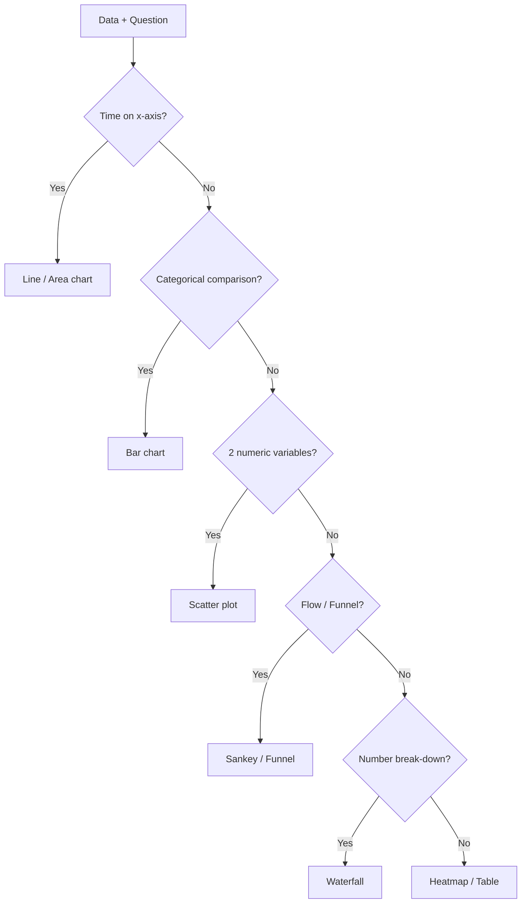
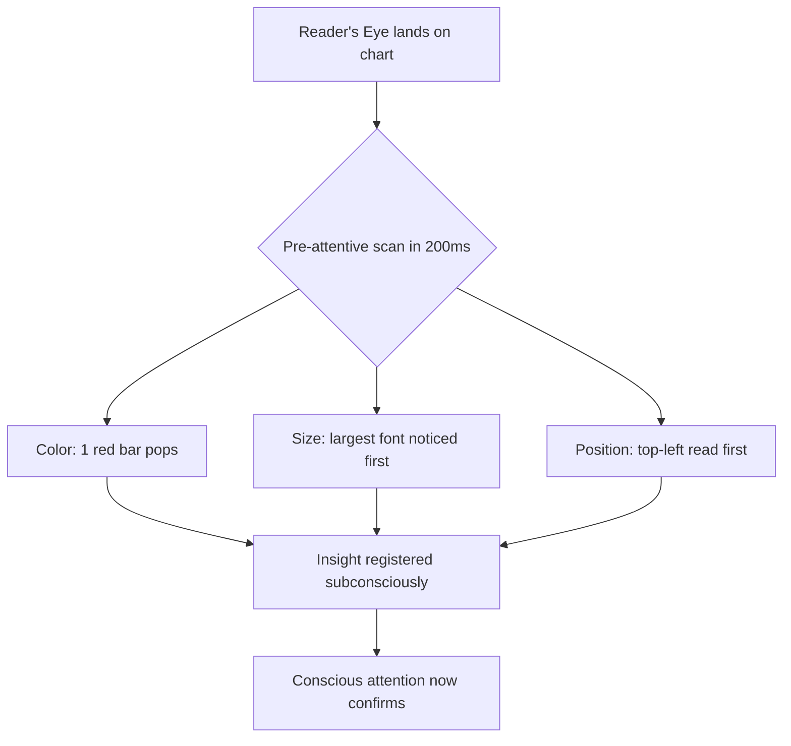
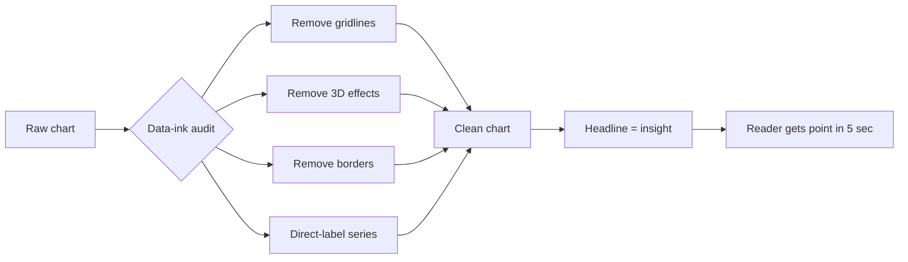
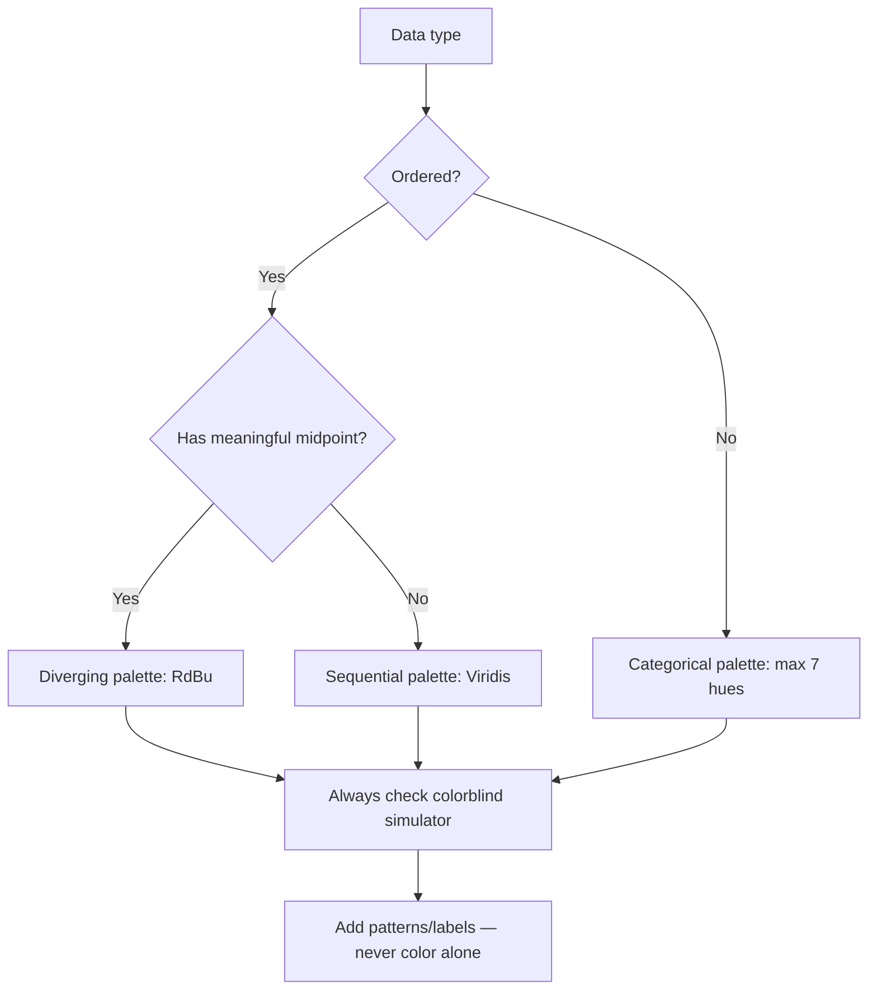
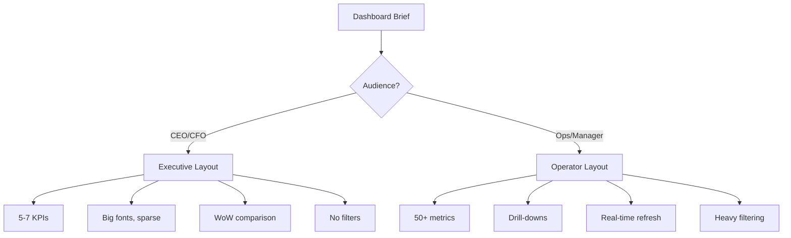
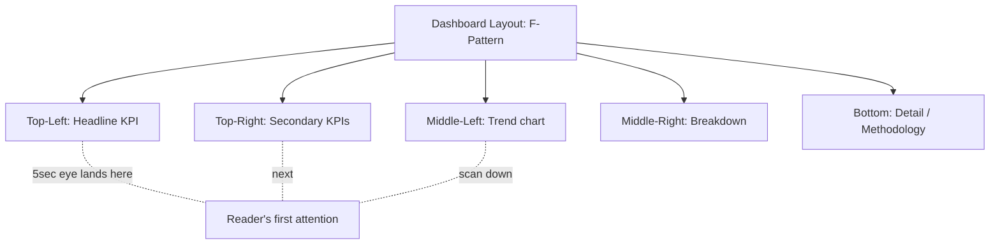
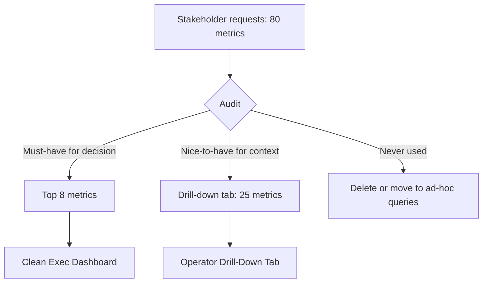
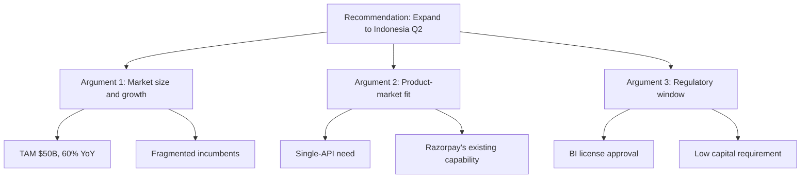
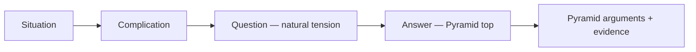
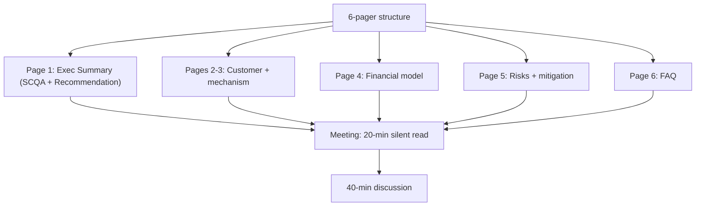

# Data Storytelling & Visualization

Dekh bhai, ek kadwi sachai bata raha hoon — koi bhi CXO ne aaj tak teri SQL ki "elegance" ke liye tujhe promote nahi kiya. Promotion milti hai us analyst ko jiski insight ne ek decision swing ki — ₹50 crore ki marketing spend redirect ki, ek dying product line bachayi, ya ek board meeting mein CEO ke nervous system ko thanda kiya. Information dene wale toh dashboards bhi hain, BI tools bhi, ChatGPT bhi. **Insight dene wala analyst rare hai.** Top 2% analyst chart-maker nahi hota — woh **influencer** hota hai. Uski slide CEO ke phone wallpaper pe screenshot ban ke ghoomti hai.

Ye subject tujhe sikhayega ki same data ko 10 different tareeke se present kar sakta hai — 9 mein audience so jaayegi, 1 mein decision ban jaayegi. Hum cover karenge — chart selection ka science (kab bar, kab line, kab waterfall, kab Sankey), Tufte ke principles jo 1983 mein likhe gaye lekin aaj bhi Bloomberg terminals pe live hain, pre-attentive attributes (kaise human brain 200 milliseconds mein color/size pakad leta hai), dashboard design jo executive aur operator ke liye totally alag hota hai, aur communication ke frameworks — Pyramid Principle (McKinsey), SCQA (Barbara Minto), Amazon ka 6-pager culture. Sab Hinglish mein, Flipkart-Swiggy-Razorpay-CRED ke real boardroom examples ke saath.

Ek line yaad rakh — *"Insights > Information."* Tu agar 50 charts banata hai aur reader ko khud "kya conclude karu" sochna pad raha hai, tu fail ho gaya. Top 2% analyst reader ko soche bina conclusion tak le jaata hai. Storytelling ek soft skill nahi hai — ye highest-leverage hard skill hai. Chal shuru karte hain.

---

## 1. Visualization Principles

Visualization ka ek hi purpose hai — **cognitive load kam karna**. Reader ke brain ko kaam mat karwa, tu kar. Beautiful chart woh nahi jo Tableau gallery mein dikhe — woh hai jo ek glance mein answer de de.

### 1.1 Chart selection — bar, line, scatter, sankey, waterfall

#### Definition (kya hai?)

Chart selection matlab — apni data ki "shape" aur question ke type ke base pe sahi visualization choose karna. Galat chart = sahi data ke baavjood galat conclusion. Common Indian dashboards mein 80% charts wrong type hain — pie chart for trends, line chart for categories, 3D bar charts for nothing useful.

| Chart | When to use | Avoid when |
|-------|-------------|------------|
| **Bar** | Categorical comparison (cities, products, channels) | Continuous time-series — line is better |
| **Line** | Trends over time, continuous data | Categorical comparison without ordering |
| **Scatter** | Relationship between 2 numeric vars | Categorical x-axis |
| **Sankey** | Flow / funnel / conversion between stages | Simple 2-stage comparisons (overkill) |
| **Waterfall** | Build-up / break-down of a number (P&L bridges) | Time-series trends |
| **Pie** | Almost never (max 3 slices, must sum to whole) | Anything with >3 categories |
| **Heatmap** | 2D dense matrices (cohort retention, hour-day patterns) | Sparse data |

#### Why?

Galat chart pe CEO ka 5-second attention waste ho jaata hai. Pie chart mein 7 slices dikhayega — woh kabhi nahi samajh paayega ki "Bangalore ka share Hyderabad se zyada hai ya kam". Same data bar chart mein — instant clarity. Top 2% analyst chart pehle decide karta hai, then build.

#### How?

Decision flow:
1. Question time-based hai? → Line / Area
2. Categories compare karne hain? → Bar (horizontal if labels long)
3. Two numeric vars ka rishta? → Scatter (add trendline if needed)
4. Multi-stage flow? → Sankey ya funnel
5. Number ka break-down (additive/subtractive)? → Waterfall
6. 2D pattern? → Heatmap

#### Real-life Example

Flipkart Big Billion Days post-mortem mein analyst ko dikhana tha "GMV ₹4500Cr kahan se aaya". Pehla draft — pie chart with 12 categories. CEO ne "next" bola in 3 seconds. Second draft — **horizontal bar chart sorted descending**, top 5 categories highlighted. CEO bola "Mobile electronics 45% — fashion sirf 8%, kya issue hai?" Decision shuru ho gayi. Same data, different chart, different boardroom outcome.

Razorpay ke quarterly review mein "TPV growth ₹100Cr → ₹140Cr" — analyst ne **waterfall chart** banaya: +₹25Cr from new merchants, +₹20Cr from existing merchants TPV growth, –₹8Cr from churn, +₹3Cr from international. CFO ne 30 second mein samajh liya growth ki anatomy.

#### Diagram



#### Interview Question

**Q:** Tum Swiggy ke analyst ho. Show karna hai "user journey from app open → restaurant view → cart → checkout → order placed → delivered". Konsa chart?

**A:** Sankey diagram ya funnel chart — kyunki ye multi-stage flow hai jisme har stage pe drop-off hai. Bar chart se sirf magnitudes dikhenge, drop-off ratio nahi. Pie chart toh aata hi nahi yahan. Line chart for time-trend per stage — separately. Top 2% analyst dono dega — Sankey for "where do users drop", line chart for "is this drop-off improving over weeks". Funnel ka Bonus — color code drop-off >30% in red so CEO ka eye tatka pakde.

---

### 1.2 Pre-attentive attributes — color, size, position

#### Definition (kya hai?)

Pre-attentive attributes — wo visual properties jo human brain **200 milliseconds ke andar process kar leta hai**, bina conscious attention ke. Reader ne sochna nahi padta — aankh khud detect kar leti hai. Iss list mein hain:

- **Color (hue)** — red vs grey vs blue
- **Size** — bigger element more important
- **Position** — top-left = first read (in left-to-right cultures)
- **Length** (bar charts pe pre-attentive)
- **Orientation** — tilted item stands out
- **Density / shading**

#### Why?

Top 2% analyst pre-attentive attributes ko deliberately use karta hai to **direct the reader's eye**. Default Excel/Tableau colors mein har bar same blue hota hai — reader ko khud dhundhna padta hai "kaunsa important hai". Kharab. Sahi: 1 bar red (the insight), baaki grey. Reader 1 second mein conclusion tak.

Length is more accurate than area — that's why bars beat pies. Position is more accurate than length — that's why dot plots beat bars in some cases. Hierarchy: position > length > angle > area > volume > color hue.

#### How?

Practical rules:
1. **Grey out everything, color only the insight.** 5 categories ke chart mein, jo "the point" hai usse highlight color do, baaki neutral grey.
2. **Size = importance.** Top metric biggest font (32pt+), supporting numbers 16pt, footnotes 10pt.
3. **Position = priority.** Top-left = headline number, bottom-right = footnotes/methodology.
4. **One color = one meaning.** Red mat use karna decoration ke liye — red = problem/loss across the deck.

#### Real-life Example

Zomato ka monthly business review deck. Pehle version: city-wise GMV bar chart, har bar different rainbow color (Tableau default). CEO ne 8 seconds dekha aur next slide. Analyst ne fix kiya — sab grey, sirf Bangalore (the underperformer) red, Hyderabad (overperformer) green. Same data. CEO ne 30 seconds dekha, "Bangalore mein kya ho raha hai?" — meeting ka direction shift ho gaya. Yahin pe analyst promotion pakad leta hai.

CRED ka NPS dashboard — pehle har question alag color tha (15 colors). Now: only "promoters %" ek bold green number, "detractors %" red, baaki muted. Pre-attentive hierarchy.

#### Diagram



#### Interview Question

**Q:** "Why do bar charts beat pie charts almost always?"

**A:** Cleveland-McGill perception hierarchy ki vajah se. Humans length compare karne mein bahut accurate hain (bars), angle/area compare karne mein bahut weak (pie slices). Pie chart mein 32% vs 28% slices ka difference aankh se pakadna mushkil hai — bar chart mein same data instantly clear. Plus pie chart sorting bhi nahi karta naturally — bar chart sorted descending = automatic ranking. Exception: if exactly 2-3 categories AND must show parts-of-whole, pie acceptable. Otherwise bar always wins. Top 2% analyst Tufte ki line bolega — *"the only worse design than a pie chart is several of them."*

---

### 1.3 Tufte's data-ink ratio, chartjunk, small multiples

#### Definition (kya hai?)

Edward Tufte ne 1983 mein "Visual Display of Quantitative Information" likhi — visualization ki Bible. Teen core concepts:

- **Data-ink ratio** = (ink used for data) / (total ink). Goal: maximize. Matlab har pixel ka kaam ho — gridlines, borders, 3D effects, drop shadows — sab waste hai jab tak data-relevant nahi.
- **Chartjunk** — woh decoration jo data nahi convey karta. 3D bars, gradient fills, clipart, unnecessary legends. Tufte called it "the ducks" (after a duck-shaped roadside store that was pure decoration).
- **Small multiples** — same chart, repeated with one variable changed. E.g., 10 cities ka revenue line chart side-by-side instead of one spaghetti chart with 10 lines overlapping.

#### Why?

Indian corporate decks chartjunk ka mecca hain — har bar ka shadow, har slide pe company logo, gradient fills, 3D pies. Result: reader ka eye thakta hai, signal noise mein dub jaata hai. Tufte ka principle simple — *"Above all else show the data."* Top 2% analyst minimalist hota hai. Less ink = more clarity.

Small multiples superpower hai. Spaghetti chart (10 lines overlap) mein reader giveup karta hai. 10 small charts (each one city) — reader 10 seconds mein 10 stories padh leta hai.

#### How?

Audit checklist for any chart:
1. Gridlines remove kar — agar zaruri hain, halki grey
2. Y-axis label minimize — currency/unit ek baar bata, baar baar nahi
3. Borders/box around chart — usually delete
4. 3D effects — always delete
5. Legend — agar 2-3 series hain, directly label kar lines pe
6. Title = the insight, not the description. ❌ "Revenue by Month" ✅ "Revenue grew 22% QoQ, driven by Tier-2 cities"

#### Real-life Example

Paytm ka 2022 IPO roadshow deck — pehla version mein 3D pie charts, gradient blue-to-purple bars, every slide had Paytm logo + footer + page number + "Confidential" stamp. McKinsey ne intervention kiya — re-did with Tufte principles. Final deck: white background, single accent color (Paytm blue), bold headline numbers, small multiples for category-wise breakdowns. Investor feedback dramatically improved.

Swiggy ka city-wise growth report — pehle 50 cities ka spaghetti line chart tha, koi pattern hi nahi dikhta. Analyst ne small multiples banaye: 5×10 grid of mini line charts, sorted by growth rate. Bangalore-Hyderabad-Pune top row mein (high growth), Tier-3 cities bottom (slow). CEO ko 1 minute mein city portfolio ka health pic mil gaya.

#### Diagram



#### Interview Question

**Q:** Tujhe Razorpay ka quarterly review deck audit karne ko bola gaya. 80 slides hain, har chart mein 3D bars + gradient colors + heavy gridlines. Tu kaise refactor karega?

**A:** Tufte audit. Pehle data-ink ratio calculate — current 25%, target 70%+. Step-by-step: (1) 3D bars → flat bars; (2) gradients → solid muted greys, ek accent color for "the insight"; (3) gridlines → either delete or 10% opacity; (4) legends → direct labels; (5) chart titles rewrite as insight statements ("MDR margin compressed 15bps QoQ" instead of "MDR by Quarter"); (6) cluster spaghetti charts into small multiples. Slide count probably reduce hoga 80 → 35 because clarity multiplies — same content, less repetition. CFO ka reading time 45min → 15min, decision velocity up.

---

### 1.4 Color theory & accessibility

#### Definition (kya hai?)

Color theory matlab — chart mein colors deliberately choose karna for meaning, hierarchy, aur accessibility. Ye sirf "pretty" ka game nahi hai — 8% males color-blind hain (red-green most common), aur projector pe colors shift hote hain. Top 2% analyst ye sab plan karta hai pehle.

Key concepts:
- **Sequential palette** — single hue, light to dark. For ordered data (low to high). E.g., revenue heatmap.
- **Diverging palette** — two hues meeting at neutral midpoint. For data with meaningful zero/middle (profit vs loss, NPS detractors vs promoters).
- **Categorical palette** — distinct hues for unrelated categories. Max 7 colors — beyond that human brain can't distinguish.
- **Accessibility** — colorblind-safe palettes (ColorBrewer, Viridis), high-contrast for projectors, never rely on color alone (add patterns/labels).

#### Why?

Investor pitch mein analyst ne "loss in red, profit in green" charts dikhaye. CFO color-blind tha — red-green distinguish hi nahi kar paya. Embarrassing. Aur ye 8% males ki population mein common hai — board mein likely 1-2 directors color-blind honge. Top 2% analyst Viridis ya colorblind-safe palettes use karta hai by default.

#### How?

Defaults set kar lo:
1. **Sequential** — Viridis, Blues, Greens (single hue ramps)
2. **Diverging** — RdBu (red-blue) instead of RdYlGn (red-yellow-green), kyunki RdBu colorblind-safe hai
3. **Categorical** — Tableau 10, Color Universal Design palette (max 7)
4. **Brand colors** — neutral hue for non-insight, brand accent for insight only
5. **Test** — Colorblind simulator (Coblis, Sim Daltonism) chala always

#### Real-life Example

BookMyShow ka occupancy dashboard — pehle red (low) → yellow (mid) → green (high) tha. Theatre managers (color-blind included) ko low-occupancy theatres dhundhne mein dikkat hoti thi. Analyst ne switch kiya RdBu palette pe (red → white → blue) + numeric labels added. Color-blind-safe + high-contrast + readable on phones in low light. Operational efficiency 12% improved (faster identification of underperforming shows).

Meesho ka supplier dashboard har category alag color mein tha (15 categories!). Reader brain overload. Analyst ne fix kiya — sab grey, top-3 categories accent colors, "Dim others" toggle for focus. Decision velocity badh gayi.

#### Diagram



#### Interview Question

**Q:** "Red-green color coding kyu avoid karna chahiye?"

**A:** 8% males aur 0.5% females red-green color blindness rakhte hain (deuteranopia/protanopia). Boardrooms mein at scale, stakeholders mein guaranteed exist karte hain. Red-green chart unhe identical dikhta hai — critical decisions miss ho sakti hain. Alternative: red-blue (RdBu) ya orange-blue diverging palette — perceptually distinct for all. Aur color alone pe kabhi mat depend karna — pattern, label, ya numeric value bhi add kar. WCAG AA standard contrast ratio 4.5:1 minimum. Top 2% analyst designs for accessibility from day 1, not as an afterthought.

---

## 2. Dashboard Design

Dashboard ek product hai — uska user hai (audience), uska success metric hai (decision-time reduction). Most analysts dashboard ko "data dump" treat karte hain. Top 2% analyst dashboard ko UX product treat karta hai.

### 2.1 Audience-first design — exec vs operator

#### Definition (kya hai?)

Dashboard ka design audience pe depend karta hai. Do major archetypes:

| Aspect | Executive Dashboard | Operator Dashboard |
|--------|---------------------|---------------------|
| **Audience** | CEO, CFO, VP | Ops manager, marketing manager, analyst |
| **Frequency** | Weekly/monthly check | Multiple times daily |
| **Granularity** | High-level KPIs (5-10 metrics) | Granular (50-200 metrics) |
| **Time horizon** | Quarterly trends | Real-time / hourly |
| **Interactivity** | Minimal — show, don't make them filter | Heavy — drill-down, filter, slice |
| **Density** | Sparse — lots of whitespace | Dense — packed grids |
| **Goal** | Inform decisions | Enable action |

#### Why?

Same dashboard for CEO and ops manager = fail for both. CEO ko 50-metric grid se overwhelm kar diya — woh use nahi karega. Ops manager ko 5 KPIs diye — woh under-served. Audience-first matlab pehle pucho — *kaun dekhega? kab dekhega? kya decision lega?* — phir design.

#### How?

3-question framework before designing:
1. **Who?** — exec / ops / analyst / external (investor)
2. **What decision?** — yearly strategy / weekly tactics / hourly firefighting
3. **What action?** — adjust budget / change team / no action just inform

Exec dashboard — 1 page, 5 metrics, big fonts, prior period comparison, plain-English titles.
Operator dashboard — multi-tab, drill-downs, real-time refresh, filters, data export.

#### Real-life Example

Flipkart ka CEO dashboard — exactly 6 metrics on 1 page: GMV, Orders, AOV, NMV (net merchandise value), Active Users, Net Promoter Score. Each with WoW arrow + sparkline. CEO 90 seconds mein scan kar leta hai daily. Drill-downs nahi — agar deep dive chahiye, analyst ko ping karta hai.

Same Flipkart ka category manager ka dashboard — 70+ metrics, filterable by city/brand/date/promo, real-time refresh, exportable CSV. Different audience, different beast.

Swiggy ka Instamart ops dashboard — dark stores manager ke liye real-time order queue, dispatch SLA, picker productivity, stock-outs by SKU — 40+ tiles. CEO version mein sirf "orders/day, contribution margin, growth %, dark store count" — that's it.

#### Diagram



#### Interview Question

**Q:** Tujhe Zomato CEO ke liye dashboard banane ko bola. Tu kya pehle 3 questions puchega?

**A:** (1) **Cadence** — daily check karenge ya weekly? Daily matlab simpler, weekly matlab thoda zyada context (cohort comparisons). (2) **Decision** — kya kaam aane wala hai? Investor updates? Internal team alignment? Real-time firefighting? Har use case different layout demand karta hai. (3) **Top 5 metrics** — agar tu sirf 5 numbers dekh sake, kaunse honge? CEO ka answer hi NSM + key drivers reveal karega. Bonus pucchunga — *"existing dashboard mein kya frustrate karta hai?"* — yahaan se design constraints aate hain. Then design — 1 page, 5-7 KPIs, WoW + YoY, sparklines, no filters, headline insight at top.

---

### 2.2 5-second test, F-pattern, hierarchy

#### Definition (kya hai?)

- **5-second test** — dashboard reader ko 5 seconds dikhao, phir cover karo. Pucho — *"sabse important number kya tha? kya status hai (good/bad)?"* Agar reliably answer nahi de pa raha, dashboard fail hai.
- **F-pattern** — eye-tracking studies show western readers' eyes pages pe F shape mein move karte hain — top-left first, top-right next, then down-left scan. Top-left mein headline/insight rakhna chahiye.
- **Hierarchy** — visual weight (size, color, position) decides reading order. Biggest+boldest+top-left = first read. Use hierarchy deliberately — random layouts mein important cheez bottom-right corner mein chhup jaati hai.

#### Why?

CXOs ka attention span 30-60 seconds per dashboard visit hai. Agar tu 5-second test fail kar raha hai, woh insight register nahi karega — chahe data kitna bhi accurate ho. Bug: hum apne dashboard ko *banane wale* ki nazar se dekhte hain — sab samajh aata hai. Reader naya hai — uske liye hierarchy build karni padti hai.

#### How?

Pre-launch checklist:
1. Print dashboard, show to a colleague for 5 seconds
2. Pucho — "headline metric kya hai? status good ya bad?"
3. Agar woh confused — top-left mein bigger headline, color-coded status (green up arrow / red down arrow), insight statement
4. F-pattern follow — most important top, supporting middle, methodology/footnotes bottom
5. Whitespace — har tile ke beech breathing room

Layout grid:
- Top: headline metric + period comparison + status
- Top-right: secondary KPIs
- Middle: trends, breakdowns
- Bottom: detail tables, methodology, refresh time

#### Real-life Example

Razorpay ka exec dashboard pehle TPV chart middle mein tha. CEO se 5-second test liya — uska answer "kuch growth chart hai" — number recall nahi. Analyst ne redesign kiya — TPV ₹4200Cr top-left mein 48pt bold + green arrow "+18% MoM". CEO ka recall 100%, "achha 18% growth — drivers kya hain?" instantly correct question.

CRED ka member dashboard — pehle "Total members" bottom-right tha. Shifted to top-left, 56pt. Founder Kunal Shah ne x-times daily check karna shuru kiya — visibility = focus.

#### Diagram



#### Interview Question

**Q:** "Dashboard 5-second test pass kaise karaye?"

**A:** Top-left corner mein **headline insight + headline number + status** rakho. E.g., not "Revenue" but "Revenue ₹120Cr | +14% MoM | Above Target". Font 40pt+ — pre-attentive size cue. Color-code status (green = above target, red = below). Sparkline next to it shows trend. Agar reader 5 seconds mein "kya situation hai" answer nahi de paya, hierarchy aur top-left content stronger karo. Top 2% analyst is dashboard ki "elevator pitch" 1-line mein banata hai aur woh top mein paste karta hai — bina kisi chart ke. Charts supporting evidence ban jaati hain.

---

### 2.3 Avoiding the kitchen-sink dashboard

#### Definition (kya hai?)

Kitchen-sink dashboard — woh dashboard jo har stakeholder ki request aankhon mein bharke ek single page pe daal di gayi. 60 metrics, 20 charts, 8 filters, no clear story. Result — koi nahi use karta. Common Indian PSU dashboards ka classic example. Tu hi banaata hai jab tu "no" nahi kah pata.

#### Why?

"Kitchen-sink" mentality engineering-driven hota hai — *"complete data deta hu, woh khud filter karein"*. Lekin user usually decision-making mode mein hota hai — explore mode mein nahi. Top 2% analyst opinion-ated dashboards banata hai — *"yeh dekho, yeh important hai, baaki niche drill kar sakte ho agar interest ho"*.

Cost of bloat:
- Loading time → slow → abandonment
- Cognitive overload → no insights extracted
- Maintenance hell — har metric ka pipeline, alerting, debugging
- Trust erosion — agar 5 metrics out-of-sync hain (often happens at scale), trust gone

#### How?

Apply "must-have / nice-to-have / never" filter:
1. **Must-have** (5-10) — top of dashboard, always visible
2. **Nice-to-have** (10-30) — separate tab, discoverable
3. **Never** — kitne bhi requests aaye, reject. Raw exports / ad-hoc queries ke liye SQL access do, dashboard pe nahi.

Practice: every quarter, audit dashboard — kaunse tiles last 90 days mein <5 times view hue? Delete. Lean stays.

#### Real-life Example

BookMyShow ka movie team dashboard 2019 mein 80+ tiles tha — show count, occupancy, revenue per show, F&B sales, refund rate, walk-in conversion, language-wise mix, etc. New head of analytics ne audit karaya — usage logs check kiye. 70% tiles weekly <5 views. Trim kiya 80 → 18. Initial complaints ("mera metric kahan gaya?"). 1 month baad — *team productivity went up*, decision velocity up, PMs khud bole "ab samajh aata hai dashboard". Lean wins.

Meesho ka growth dashboard pehle 100+ metrics tha. New CDO ne 7-tile exec dashboard banaya, baaki "deep-dive" tabs mein. Founders ka usage 3× hua, decision quality up.

#### Diagram



#### Interview Question

**Q:** "Tum naye CDO ho. Existing dashboards 200+ metrics ka jungle hain. Cleanup strategy kya hogi?"

**A:** 4-step approach. **Step 1: Audit** — usage logs nikalo, kaunse tiles last 90 days mein actively viewed/queried hain. Aksar 80% usage 20% tiles pe hota hai (Pareto). **Step 2: Audience interviews** — top 10 users se pucho "agar sirf 5 numbers dekh sako, kaunse honge?" — overlap se core KPIs emerge karte hain. **Step 3: Tiered structure** — Tier-1 (exec, 5-7), Tier-2 (operator, 30-50 in tabs), Tier-3 (ad-hoc SQL access for analysts). **Step 4: Communication** — old dashboards 30-day deprecation, new structure documented, training session. Resistance hogi — handle by showing usage data ("this metric had 2 views in 90 days"). Top 2% analyst stakeholder pe blame nahi daalta — ye design problem hai jo solve hota hai.

---

## 3. Insight Communication

Data laaya, chart banaya, dashboard publish kiya — but agar communication weak hai, sab mehnat zaaya. Ye section pure consulting/exec-comm territory hai.

### 3.1 The Pyramid Principle (McKinsey method)

#### Definition (kya hai?)

Pyramid Principle — Barbara Minto (McKinsey, 1967) ki invention. Communication structure jisme:

1. **Answer first** (top of pyramid) — your conclusion / recommendation, ek line mein
2. **Supporting arguments** (middle) — 3-5 reasons that prove the answer (MECE — Mutually Exclusive, Collectively Exhaustive)
3. **Evidence** (bottom) — data, charts, examples that prove each argument

Bottom-up build karta hai analyst (data → arguments → answer), but top-down communicate karta hai (answer → arguments → data).

#### Why?

Indian default communication style chronological hota hai — "maine ye dekha, phir ye nikala, phir ye realise kiya, isliye ye conclusion". CEO ka patience nahi hai — woh 30 seconds mein "what should I do?" sunna chahta hai. Pyramid principle se tu pehle answer deta hai, phir reasons, phir evidence (if asked). 90% time CEO answer + reasons sun ke decision le leta hai. Time saved on both sides.

#### How?

Template:
```
Recommendation: [one-line answer]
Because:
  1. [Argument 1] — supported by [data]
  2. [Argument 2] — supported by [data]
  3. [Argument 3] — supported by [data]
Risks/Counterpoints: [...]
Next steps: [...]
```

Test: tera answer "MECE" hai? Mutually exclusive — overlap nahi karte? Collectively exhaustive — sab kuch cover ho gaya? Agar overlap hai, merge kar; agar gap hai, add kar.

#### Real-life Example

Imagine tu Razorpay ka analyst hai. CEO ne pucha "should we expand to Indonesia?" Bottom-up build karta hai — market sizing, regulatory analysis, payment landscape, Razorpay capability. Pyramid output:

> **Recommendation:** Expand to Indonesia in Q2-2026 with payment-only product, defer banking-as-a-service to Q4.
>
> **Because:**
> 1. **Market is large and underserved** — $50B digital payments TAM, 60% YoY growth, fragmented incumbents.
> 2. **Razorpay's product fits the gap** — Indonesia merchants need single-API multi-method gateway; current incumbents are method-specific.
> 3. **Regulatory window is open** — BI (Bank Indonesia) recently approved foreign payment licenses with low capital requirement.
>
> **Risks:** Local talent acquisition, OVO/GoPay incumbency. Mitigation via local partner.
>
> **Next steps:** 30-day market diligence trip + local hire.

CEO ne 2 minutes mein read kiya, "go" bola. Vs 50-page McKinsey-style report jo 2 hours leta padhne mein.

CRED ka analyst ne credit-card-debt product launch propose kiya same structure mein — 1-page memo CEO Kunal ko, decision in 1 day.

#### Diagram



#### Interview Question

**Q:** "Pyramid Principle ka MECE concept explain kar — example ke saath."

**A:** MECE = Mutually Exclusive (overlap nahi) + Collectively Exhaustive (gap nahi). Example: tu growth strategy break karta hai. ❌ Non-MECE: "(a) social media marketing, (b) digital marketing, (c) Instagram ads" — overlap hai, kyunki (b) (a) aur (c) ko include karta hai. ✅ MECE: "(a) acquisition, (b) activation, (c) retention" — clean break, aur AARRR mein ye dimensions overlap nahi karti, sab cover kar leti hain. Top 2% analyst MECE check har time slide structure ke pehle karta hai. Bonus — agar "other" bucket banana pad raha hai, framework probably MECE nahi hai — re-think.

---

### 3.2 SCQA framework — Situation, Complication, Question, Answer

#### Definition (kya hai?)

SCQA — Barbara Minto ka second framework, used to **open** a presentation/memo ke liye. Pyramid Principle "what to say" deta hai, SCQA "how to start" deta hai. Structure:

- **Situation (S)** — current state, jo audience already knows. Sets common ground.
- **Complication (C)** — kuch change/issue jo situation ko disrupt karta hai. Tension build karta hai.
- **Question (Q)** — implicit ya explicit, "ab kya karein?"
- **Answer (A)** — your recommendation. Connects to Pyramid Principle's top.

#### Why?

Most analysts memo ki opening mein context ka 3 paragraph likh dete hain — reader bore. SCQA tension build karta hai in 3 sentences — reader engaged, then answer satisfies that tension. Dialogue se zyada hollywood-style narrative.

#### How?

Template:
```
S: [Situation — 1 sentence, agreed reality]
C: [Complication — 1-2 sentences, the disruption]
Q: [Question — implicit OR explicit, the natural question that arises]
A: [Answer — your recommendation, connects to Pyramid top]
```

#### Real-life Example

Paytm analyst ka memo to CFO on UPI take-rate strategy:

> **(S) Situation:** Paytm processes ₹4 lakh crore in UPI volumes monthly, contributing 35% of total TPV.
>
> **(C) Complication:** RBI's MDR-zero policy means UPI generates effectively zero revenue, while costs (payment ops, fraud, settlement) scale linearly with volume — creating a structural margin drag of ₹120Cr/quarter.
>
> **(Q) Question:** How do we monetize UPI without violating MDR-zero rules?
>
> **(A) Answer:** Three monetization vectors — (1) cross-sell financial products (Postpaid, BNPL) to UPI users at 8-12% take-rate, (2) merchant value-added services (analytics, loyalty) at flat fee, (3) bidirectional UPI payouts to international corridors at FX margin.

CFO 30 second mein context + tension + question + answer absorb kar leta hai — phir Pyramid Principle se reasons explore karta hai.

Swiggy analyst SCQA opener for "should we kill 10-min delivery": **S** — Instamart's 10-min delivery in 6 cities. **C** — unit economics negative ₹60/order vs ₹40 for 30-min slot. **Q** — should we shut down? **A** — no, but limit to top 50 dark stores where density supports unit economics, defer national expansion.

#### Diagram



#### Interview Question

**Q:** "SCQA aur straight-up Pyramid Principle ka difference kya hai?"

**A:** Pyramid Principle communication ki **structure** hai — answer first, then arguments, then evidence. SCQA opening **hook** hai jo audience ko engaged karta hai before they hear the answer. Real memo mein dono use hote hain — SCQA pehla paragraph (situation-complication-question-answer), Answer Pyramid ka top ban jaata hai, aur baaki memo Pyramid ke arguments/evidence build karta hai. SCQA narrative tension banata hai (jaise screenplay structure), Pyramid logical structure provide karta hai. Top 2% analyst dono use karta hai together — opening SCQA, body Pyramid.

---

### 3.3 Amazon-style 6-pagers, executive summaries

#### Definition (kya hai?)

**Amazon 6-pager** — Bezos ne PowerPoint ban kiya Amazon mein. Replacement: 6-page narrative memo. Meeting ke pehle 20 minutes mein silently sab read karte hain — phir discussion hota hai. Structure usually:

1. Press release format opening (imagined future state)
2. FAQ (anticipated questions)
3. Customer experience description
4. Mechanism / approach
5. Financial model
6. Risks and open questions

**Executive summary** — top 1-page condensation of full memo. Sometimes called TL;DR. Pyramid + SCQA both used here.

#### Why?

PowerPoint pe analyst bullets banata hai — depth missing, logic gaps chhup jaate hain. 6-pager full prose mein likhna padta hai — har gap exposed ho jaata hai. Plus reader self-paced read karta hai — fast readers fast, careful readers careful. Classic Bezos quote: *"Bullets allow ideas to be poorly defined."*

Indian companies abhi PPT-driven hain mostly — Flipkart, Cred, Razorpay started shifting to memo-culture. Top 2% analyst memo writing master karta hai because 5 years mein industry standard banega.

#### How?

Memo writing template:
- Length: 2-6 pages (1.5x line spacing, 11pt). Beyond 6 = audience won't read.
- **Top: Executive summary** (1 paragraph) — SCQA + Recommendation
- **Body: Pyramid Principle** — arguments + evidence
- **Tables/charts** — supporting only, prose carries narrative
- **Appendix** — methodology, full data, calcs
- **No bullets** in body — full sentences. Bullets only for explicit lists (e.g., next steps).

Ek tip: pehla draft chronologically likh (jaise tu sochta hai), phir flip — answer top mein paste kar, baaki rebuild kar. Bottom-up think, top-down communicate.

#### Real-life Example

CRED ka 6-pager when launching CRED Mint (peer lending product):

> **(Page 1 — Exec summary):** CRED Mint will offer 9-12% returns to members by lending their idle bank funds to vetted borrowers. We expect ₹500Cr AUM in year 1, ₹2000Cr in year 2, with contribution margin 3-4%. Key risk: regulatory; mitigated via NBFC partnership.
>
> **(Page 2):** Member problem — 4 lakh+ HNI members hold ₹40K Cr+ idle in savings at 3-4% interest...
>
> **(Page 3):** Mechanism — RBI-licensed NBFC partner originates loans, CRED is platform...
>
> **(Page 4):** Financial model — AUM ramp, take-rate, cost structure, contribution margin...
>
> **(Page 5):** Risks — regulatory, default, member trust...
>
> **(Page 6):** FAQ — anticipated 12 questions, answered.

CEO ne meeting mein 20 min silently read kiya, phir 40 min discussion — decision made same day. PPT route mein 4 meetings lagti.

Razorpay shifted to 4-page memos for any product GTM proposal. Quality of decisions improved measurably — half the post-launch surprises eliminated because risks fully written upfront.

#### Diagram



#### Interview Question

**Q:** "Bezos PPT pe ban kyu daalta tha? 6-pagers ka real benefit kya hai?"

**A:** Teen reasons. **(1) Logical rigor** — bullets gaps chhupate hain, prose mein har transition justify karna padta hai. Lazy thinking fail ho jaati hai paper pe. **(2) Asynchronous depth** — slides presenter-paced hain, reader passive hai. Memo reader-paced — fast skimmers fast jaate hain, careful readers carefully soch sakte hain, sab ek hi document. **(3) Permanence + scaling** — 6-pager 6 months baad bhi context ke saath padha ja sakta hai. PPT slides decontextualized junk ban jaate hain. Top 2% analyst memo writing seriously practice karta hai — kyunki communication-leverage analyst ke career ka biggest multiplier hai. Likes Bezos said — *"the people who write the memos figure out their own thinking better than the people who don't."*

---

> **Bottom line:** Charts pretty banane se kuch nahi hota — insight inject karna padta hai reader ke decision-making mein. Top 2% analyst Tufte ki rigour, Minto ka structure, aur Bezos ki narrative discipline combine karta hai. Tu chart-maker se influencer tab ban-ta hai jab teri ek slide CEO ke phone wallpaper pe screenshot ho jaaye, ya tera 6-pager board meeting ke 30 min mein decision swing kar de. Ye subject 12-15 ghante de — har dashboard Tufte audit kar, har memo Pyramid + SCQA mein rewrite kar. Phir agla SQL query, agla A/B test — sab influence-multiplier ban jaayenge.
