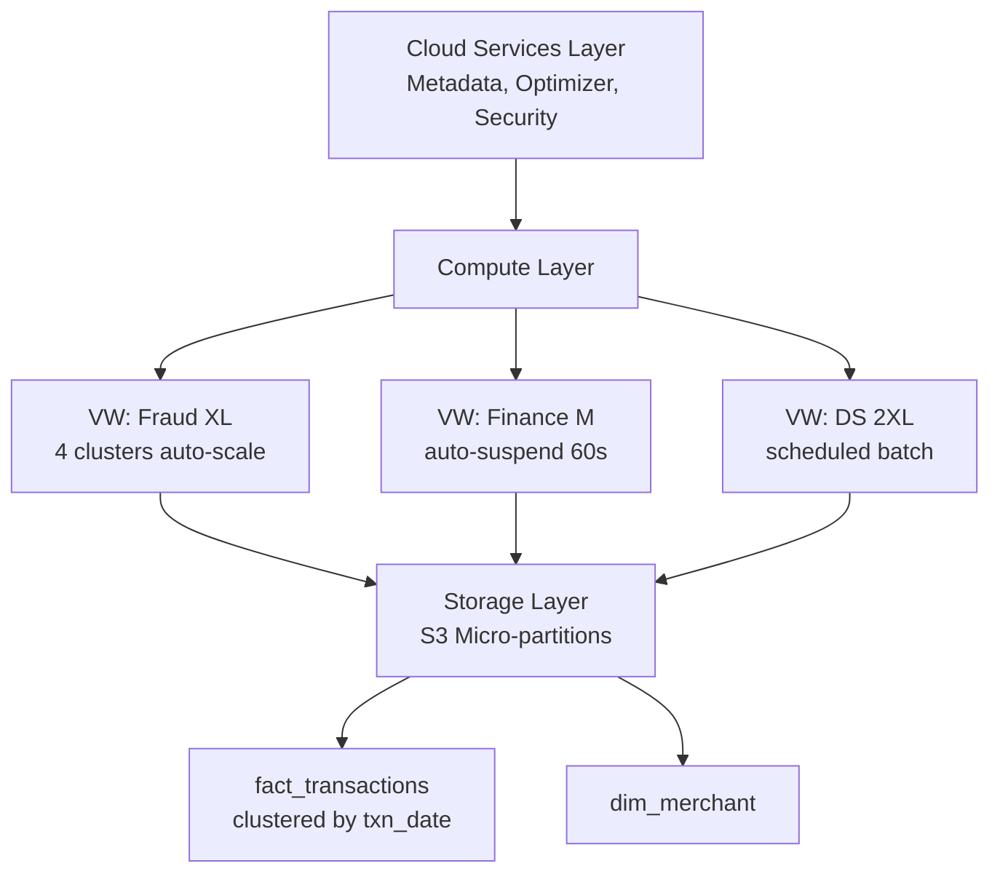
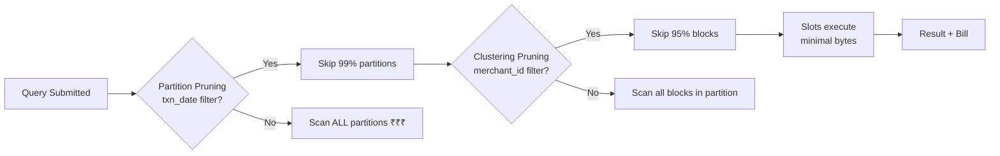
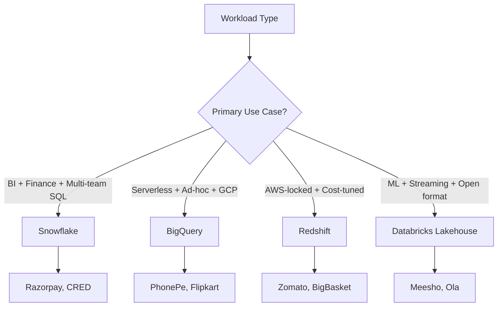
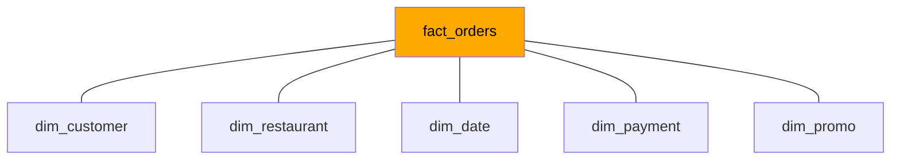
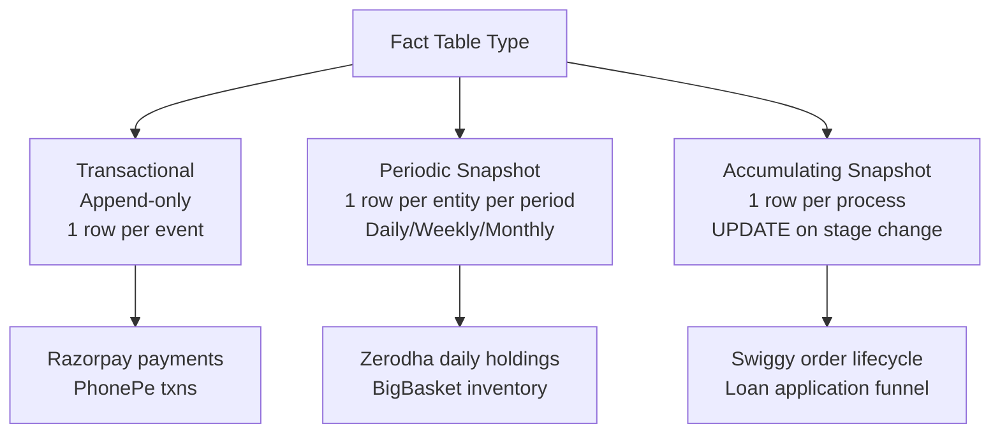
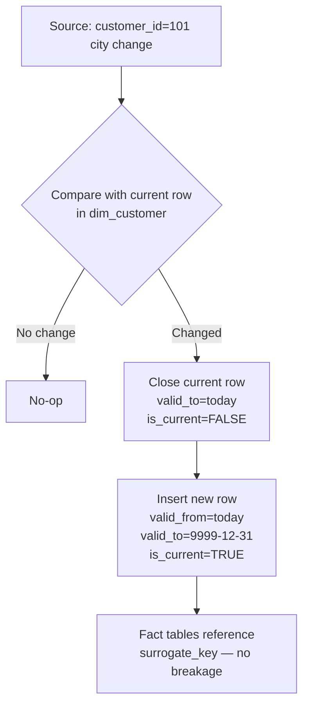
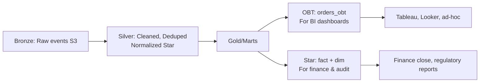
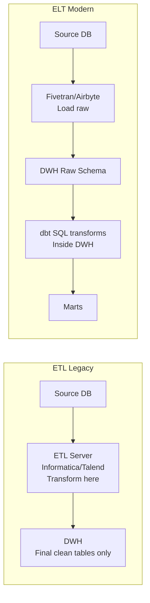
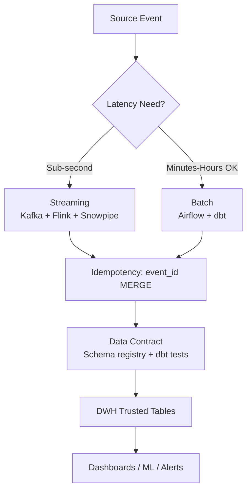

# Data Warehousing & Modeling

Bhai, seedha sun — agar tu apne aap ko "data analyst" bolta hai aur tujhe nahi pata ki tera SQL query Snowflake pe ₹4000 ka bill kyu chhod gaya, ya BigQuery mein cluster-by lagaya hota toh ₹2 lakh/month bach jaate, toh tu sirf query likhne wala technician hai — engineer-grade analyst nahi. Top 2% analyst aur baaki ke beech jo asli farak hai woh yahin chhupa hai — **warehouse internals**. Tu Razorpay mein baith ke Snowflake ki micro-partitions samjhe bina query maarega — finance team ka FinOps dashboard tujhe blame karega. Tu PhonePe mein BigQuery pe partition_date filter bhool gaya — ek query mein 40 TB scan, ₹20K gone in 8 seconds.

Ye subject tujhe wo plumbing dikhayega jo har dashboard, har dbt model, har ML feature pipeline ke neeche chalti hai. Cloud DWH internals (Snowflake virtual warehouses, BigQuery slots, Redshift nodes, Databricks lakehouse), Kimball dimensional modeling (fact, dim, SCD, conformed dims), aur ETL vs ELT debate — sab Hinglish mein, IIT depth pe, real Indian unicorn examples ke saath. Tu ye 12 ghante seriously laga, agle din se tu queries 60-80% sasti likhega aur dbt models aise design karega ki BI team tujhe biryani khilayegi.

Yaad rakh — modern analyst ka job sirf "answer kya hai" nahi hai. Job hai "answer **kitne ka** hai" (cost), "kitni jaldi" (latency), aur "kal scale hua toh tootega kya" (architecture). Cluster-by, partitioning, materialization, SCD — ye sab tools hain jo tujhe analyst se analytics engineer banate hain. Chal shuru karte hain.

---

## 1. Cloud Data Warehouses

OLTP vs OLAP toh tu `da-business-fundamentals` mein padh chuka hai. Ab asli OLAP ki dukaan kholte hain — Snowflake, BigQuery, Redshift, Databricks. Har ek ka apna architecture, apna pricing model, apna sweet spot. Agar tu inhe ek-jaisa samajhta hai toh galti kar raha hai — same SQL likhne pe four alag-alag bills aate hain.

### 1.1 Snowflake — virtual warehouses, micro-partitions

#### Definition (kya hai?)

Snowflake ek **multi-cluster shared-data architecture** wala cloud DWH hai. Teen layers hote hain — (1) **Storage layer** (S3/GCS/Azure Blob pe columnar micro-partitions), (2) **Compute layer** (virtual warehouses — independently scalable), (3) **Cloud services layer** (metadata, query optimizer, security). Storage aur compute completely decoupled hain — matlab tu 100TB store kar sakta hai but compute scale up/down on demand.

- **Virtual Warehouse (VW)** — ek MPP compute cluster. Sizes XS, S, M, L, XL, 2XL... 6XL. Har upgrade pe 2x compute, 2x cost per second. Multiple VWs same data pe simultaneously chal sakte hain (no contention).
- **Micro-partition** — Snowflake ka physical storage unit. ~50-500MB compressed columnar files, immutable. Snowflake automatically table ko micro-partitions mein todta hai based on insertion order. Har micro-partition ke metadata mein min/max values store hote hain — query pruning ke liye.

#### Why?

Razorpay ka case le. Production team ko real-time fraud queries chahiye, finance team ko monthly P&L, data science team ko 6-month feature engineering. Teeno alag teams alag-alag VW use karte hain — `WH_FRAUD_LARGE`, `WH_FINANCE_MEDIUM`, `WH_DS_XLARGE`. Ek dusre ko slow nahi karte. Storage shared, compute isolated. Ye hi Snowflake ka killer feature hai.

Micro-partitions samajhna critical hai because **clustering** unhi pe based hota hai. Agar tu time-series data (transactions) ko `transaction_date` pe cluster karta hai, Snowflake same date ke rows ko same micro-partitions mein rakhta hai — query mein `WHERE date = '2026-04-30'` aaya toh sirf 1-2 micro-partitions scan honge, baaki **pruned**. Bina clustering pe full table scan = ₹₹₹.

#### How?

```sql
-- Virtual warehouse create karna
CREATE WAREHOUSE wh_analytics
  WAREHOUSE_SIZE = 'MEDIUM'
  AUTO_SUSPEND = 60          -- 60 sec idle ke baad suspend (cost saving)
  AUTO_RESUME = TRUE
  MIN_CLUSTER_COUNT = 1
  MAX_CLUSTER_COUNT = 4      -- multi-cluster: concurrent queries ke liye auto-scale
  SCALING_POLICY = 'STANDARD';

-- Clustered table create karna for query pruning
CREATE OR REPLACE TABLE fact_transactions (
  txn_id        STRING,
  merchant_id   STRING,
  txn_date      DATE,
  amount        NUMBER(18,2),
  status        STRING,
  payload       VARIANT          -- semi-structured JSON
)
CLUSTER BY (txn_date, merchant_id);

-- Bulk load from S3 stage using COPY INTO
COPY INTO fact_transactions
FROM @s3_razorpay_stage/transactions/2026-04-30/
FILE_FORMAT = (TYPE = PARQUET)
ON_ERROR = 'CONTINUE';

-- Query that benefits from pruning
USE WAREHOUSE wh_analytics;
SELECT merchant_id, SUM(amount) AS gmv
FROM fact_transactions
WHERE txn_date BETWEEN '2026-04-01' AND '2026-04-30'
  AND status = 'SUCCESS'
GROUP BY 1
ORDER BY 2 DESC LIMIT 100;

-- Pruning verify karo
SELECT SYSTEM$CLUSTERING_INFORMATION('fact_transactions', '(txn_date)');
```

#### Real-life Example

Razorpay ka core analytics Snowflake pe chalta hai. Daily 200M+ transactions ingest hote hain via Snowpipe (continuous loader from S3). Finance team ka monthly close — ek query 2 billion rows aggregate karti hai. Without clustering on `txn_date` — full scan, 18 minutes, ₹6000 ek query. With clustering — 28 seconds, ₹85. Same answer. Top analyst ne ye optimize kiya, CFO ne bonus diya.

#### Diagram



#### Interview Question

**Q:** Snowflake ka warehouse aur cluster mein farak kya hai? Aur kab `MAX_CLUSTER_COUNT` badhaoge?

**A:** Warehouse = ek logical compute resource (XS to 6XL). Cluster = us warehouse ke andar ka individual MPP node-set. By default 1 cluster chalta hai. `MIN_CLUSTER_COUNT=1, MAX_CLUSTER_COUNT=4` matlab agar concurrent queries badh gayi (queueing dikhi), Snowflake auto-spin up extra clusters — same size ke. Size badhana (M se L) → har query faster (more compute per query). Cluster count badhana → more concurrent queries handle hote hain. Sizing chahiye for slow queries; multi-cluster chahiye for high concurrency (e.g., BI tool 50 analysts simultaneously query kar rahe hain). Top 2% analyst FinOps dashboard pe `WAREHOUSE_LOAD_HISTORY` view check karta hai — agar `avg_queued_load > 0` hai, multi-cluster scale-out justified hai.

---

### 1.2 BigQuery — slots, partitioning, clustering

#### Definition (kya hai?)

BigQuery ek **serverless** DWH hai — Google ka Dremel engine on top of Colossus storage. Tu compute provision nahi karta (Snowflake ki tarah VW spin up nahi karta) — tu **slots** consume karta hai. Slot = 1 unit of CPU + memory + network for query execution. By default tu **on-demand** mode pe hai (per-TB scanned billing — $5 per TB), ya tu **slots reservation** kharidta hai (flat-rate, autoscaled).

- **Partitioning** — table ko ingestion date ya kisi column (e.g., `event_date`) pe partition karta hai. Query mein `WHERE event_date = '2026-04-30'` se sirf 1 partition scan, baaki skip — bytes scanned drastically kam.
- **Clustering** — partition ke andar rows ko 1-4 columns pe sort karta hai. Block-level pruning enable karta hai.
- **Slot** — concurrent execution unit. Free tier ~2000 slots; enterprise reservations 100s-1000s.

#### Why?

BigQuery ka pricing on-demand mode mein **bytes scanned** se decide hota hai. Agar tu `SELECT *` maarta hai 5TB table pe → $25 per query. Same query partition + cluster pruning ke saath 50GB scan kare → $0.25. PhonePe ka analyst jo `partition_date` filter bhool jaata hai woh quarterly review mein FinOps team se "explain karo" letter le aata hai.

Slots ka concept zaroori hai for reservation pricing. Tu agar 500 slots reserve karta hai $10K/month mein — fixed cost. Heavy query slot starve hoti hai. Sizing FinOps decision hai, but analyst ko samajhna chahiye for query optimization.

#### How?

```sql
-- Partitioned + clustered table create karna
CREATE OR REPLACE TABLE `phonepe-analytics.core.fact_transactions`
(
  txn_id       STRING,
  user_id      STRING,
  merchant_id  STRING,
  txn_ts       TIMESTAMP,
  txn_date     DATE,
  amount       NUMERIC,
  status       STRING,
  state        STRING
)
PARTITION BY txn_date
CLUSTER BY merchant_id, status
OPTIONS (
  partition_expiration_days = 730,
  require_partition_filter = TRUE   -- accidental full scan rok deta hai
);

-- Pruning-friendly query — sirf 1 partition + clustered blocks scan
SELECT
  merchant_id,
  COUNTIF(status = 'SUCCESS') AS success_txns,
  SUM(IF(status = 'SUCCESS', amount, 0)) AS gmv
FROM `phonepe-analytics.core.fact_transactions`
WHERE txn_date BETWEEN '2026-04-01' AND '2026-04-30'
  AND merchant_id IN ('M_FLIPKART', 'M_AMAZON', 'M_MEESHO')
GROUP BY merchant_id;

-- Bytes that WILL be scanned (dry run check)
-- bq query --dry_run --use_legacy_sql=false '<query>'

-- Slot usage check
SELECT
  job_id,
  total_slot_ms,
  total_bytes_processed / POW(1024,4) AS tb_scanned,
  ROUND(total_bytes_processed / POW(1024,4) * 5, 2) AS dollar_cost
FROM `region-asia-south1`.INFORMATION_SCHEMA.JOBS
WHERE creation_time >= TIMESTAMP_SUB(CURRENT_TIMESTAMP(), INTERVAL 1 DAY)
ORDER BY total_bytes_processed DESC
LIMIT 20;
```

#### Real-life Example

PhonePe ka entire data platform GCP + BigQuery pe khada hai. Daily ~3 billion UPI events ingest hote hain. Ek table `fact_upi_txns` partitioned by `txn_date`, clustered by `(payer_psp, status)`. Analyst query "April mein YBL PSP ka failure rate" — sirf 30 partitions × clustered blocks scan, ~12GB out of ~80TB table. ₹5 ka query. Without clustering — same query 800GB scan, ₹350. Yearly impact: 1000 analysts × 50 queries/day × ₹345 saving = ₹17 crore/year. Yahin pe analyst FinOps hero banta hai.

#### Diagram



#### Interview Question

**Q:** BigQuery on-demand vs flat-rate — kab kaunsa choose karoge?

**A:** On-demand ($5/TB scanned) ka best fit — sporadic queries, predictable workload nahi. Small startup, ad-hoc analytics — pay only for what you scan. Flat-rate (slots reservation) ka fit — heavy, consistent workload (PhonePe, Flipkart-scale). 1500 slots reservation = $30K/month flat. Agar tu monthly 200TB scan karta — on-demand $1000 only, flat-rate waste. Agar 5PB scan karta — on-demand $25K vs flat-rate $30K with predictability + no noisy-neighbor + autoscaling. Top analyst monthly `INFORMATION_SCHEMA.JOBS` se bytes_scanned aur slot_ms project karta hai, breakeven nikalta hai. Hybrid bhi possible — baseline reserved + spillover on-demand.

---

### 1.3 Redshift, Databricks lakehouse — when to use what

#### Definition (kya hai?)

- **Amazon Redshift** — AWS ka MPP DWH. Originally tightly-coupled (compute + storage one cluster), ab **RA3 nodes** se decoupled. Cluster-based pricing, leader node + compute nodes, columnar (PostgreSQL-derived). Sort keys + dist keys = manual optimization (analyst ka kaam).
- **Databricks Lakehouse** — Delta Lake (ACID layer) + Spark on object store. "Lakehouse" = data lake (cheap S3) + warehouse (ACID transactions, schema enforcement). SQL Warehouse (formerly SQL Endpoint) = serverless compute for SQL queries. Photon engine (C++ vectorized) speeds up analytics queries. Open format (Parquet + Delta) — no vendor lock-in.

#### Why?

Choice depends on team, workload, ecosystem:

| Dimension | Snowflake | BigQuery | Redshift | Databricks |
|---|---|---|---|---|
| Cloud | Multi-cloud | GCP | AWS | Multi-cloud |
| Compute model | Virtual warehouses | Slots (serverless) | Clusters (RA3) | SQL Warehouses + Spark |
| Storage | Proprietary micro-partition | Capacitor (proprietary) | Columnar managed | Open Delta Lake on S3 |
| Pricing | Per-second compute + storage | Bytes scanned OR slots | Node-hour | DBU (compute) + storage |
| ML/Streaming | Limited (Snowpark) | Vertex integration | SageMaker | Native (MLflow, Spark Streaming) |
| Best fit | BI-heavy, multi-team | Serverless, GCP-native | AWS-locked, mid-scale | ML + analytics unified |
| Indian users | Razorpay, Cred, Dream11 | PhonePe, Flipkart, Hotstar | Zomato, BigBasket | Meesho, Ola, Swiggy ML |

**When to use what:**
- **Snowflake** — Multi-tenant analytics, finance + BI heavy, team SQL-first, multi-cloud strategy.
- **BigQuery** — GCP shop already, ad-hoc queries, serverless preference, no infra team.
- **Redshift** — Already AWS-deep, cost-sensitive, predictable workloads, willing to tune sort/dist keys.
- **Databricks** — ML + analytics convergence, big streaming workload, data scientists + analysts on same platform, open format mandatory.

#### How?

```sql
-- Redshift: distkey + sortkey for optimization
CREATE TABLE fact_orders (
  order_id     BIGINT,
  user_id      BIGINT,
  order_date   DATE,
  city         VARCHAR(50),
  amount       DECIMAL(12,2)
)
DISTKEY (user_id)              -- co-locate user ke saare orders
SORTKEY (order_date, city);    -- range scans + zone maps benefit

-- Vacuum + analyze (Redshift specific maintenance)
VACUUM REINDEX fact_orders;
ANALYZE fact_orders;

-- Databricks SQL: Delta table + OPTIMIZE + ZORDER
CREATE TABLE meesho.gold.fact_orders
USING DELTA
PARTITIONED BY (order_date)
LOCATION 's3://meesho-lakehouse/gold/fact_orders/'
AS SELECT * FROM meesho.silver.orders_clean;

-- Compaction + multi-dim clustering
OPTIMIZE meesho.gold.fact_orders
WHERE order_date >= current_date() - INTERVAL 7 DAYS
ZORDER BY (user_id, city);

-- Time travel — Delta Lake unique feature
SELECT COUNT(*) FROM meesho.gold.fact_orders VERSION AS OF 42;
SELECT COUNT(*) FROM meesho.gold.fact_orders TIMESTAMP AS OF '2026-04-29 10:00:00';
```

#### Real-life Example

- **Zomato** AWS-deep hai — Redshift hi natural choice tha. Restaurant catalog, order events, ratings — sab Redshift cluster pe. Analyst team 4 saal se sort/dist key tune karte hain. Migration to Snowflake consider hua but cost + integration ne roka.
- **Meesho** ML-heavy — recommendation, fraud, supplier scoring. Databricks lakehouse choose kiya — same Delta Lake table pe SQL analyst dashboards bhi banata hai aur DS team Spark feature pipelines bhi. Ek source of truth, ek bill, ek governance (Unity Catalog).
- **Flipkart** legacy Hadoop/Hive cluster ab gradually BigQuery + Spark on GCS pe migrate ho raha hai — terabytes of historical data ka ETL chal raha hai 18 months se.

#### Diagram



#### Interview Question

**Q:** Tu naye startup mein data team lead ban gaya. CTO ne pucha "kaunsa DWH choose karein?" — tu kaise approach karega?

**A:** Pehle 5 questions: (1) **Cloud lock-in** — already AWS/GCP/Azure pe kuch hai? Migration cost factor hai. (2) **Workload mix** — pure SQL analytics, ya ML/streaming bhi? Databricks ML edge deta hai. (3) **Team skills** — SQL-first analysts ya Python/Spark engineers? Snowflake/BigQuery SQL-friendly, Databricks needs Spark fluency. (4) **Data volume + growth** — sub-TB Postgres bhi chala leta, 10TB+ DWH chahiye. (5) **Cost predictability** — startup burn-conscious, on-demand BigQuery start, scale up to reserved/Snowflake. Recommendation memo: 1-page, 3 options ke pros/cons, 12-month TCO estimate (storage + compute + integration), recommended choice with rationale. Top 2% analyst yahan PoC bhi propose karega — same 100GB sample dataset teeno pe load, 10 representative queries chala ke benchmark.

---

## 2. Dimensional Modeling (Kimball)

Ralph Kimball ne 1996 mein "The Data Warehouse Toolkit" likhi — aaj 30 saal baad bhi 90% production data warehouses Kimball-style star schemas hain. Reason simple — analyst-friendly, BI-tool friendly, query-fast, semantically clean. Ye section tujhe dimensional modeling ka bedrock dega.

### 2.1 Star vs snowflake schema

#### Definition (kya hai?)

- **Star schema** — central fact table + denormalized dimension tables radiating out. Joins simple, 1-hop. dim_product mein category, brand, supplier sab columns; no further normalization.
- **Snowflake schema** — dimensions normalized into sub-dimensions. dim_product → dim_category → dim_department. Multi-hop joins, less storage redundancy, but slower queries.

| Aspect | Star | Snowflake |
|---|---|---|
| Joins | 1 hop | Multi-hop |
| Storage | Higher (denormalized) | Lower |
| Query speed | Faster | Slower |
| ETL complexity | Simple | Complex |
| Analyst usability | High | Medium |
| BI tool fit | Excellent | OK (some struggle) |
| Updates | More duplicates to update | Single source of truth |

#### Why?

Modern columnar warehouses (Snowflake DWH, BigQuery) mein storage cheap hai aur joins on integer keys super-fast. So **star schema 95% time winner** hai. Snowflake schema ki need rare cases mein — when dimensions huge hain (10s of millions rows) and update frequency high hai. Tu agar dbt project mein har dim ko further normalize kar raha hai "purity" ke liye, tu over-engineering kar raha hai.

#### How?

```sql
-- Star schema: Zomato example
CREATE TABLE dim_restaurant (
  restaurant_id    INT PRIMARY KEY,
  restaurant_name  STRING,
  cuisine          STRING,        -- denormalized (no separate dim_cuisine)
  city             STRING,        -- denormalized
  state            STRING,        -- denormalized
  rating           NUMERIC(3,2),
  is_active        BOOLEAN
);

CREATE TABLE dim_customer (
  customer_id   INT PRIMARY KEY,
  signup_date   DATE,
  city          STRING,
  age_band      STRING,
  tier          STRING            -- gold/silver/bronze
);

CREATE TABLE dim_date (
  date_id      DATE PRIMARY KEY,
  day_of_week  STRING,
  month        INT,
  quarter      INT,
  year         INT,
  is_weekend   BOOLEAN,
  is_holiday   BOOLEAN
);

CREATE TABLE fact_orders (
  order_id        BIGINT PRIMARY KEY,
  customer_id     INT REFERENCES dim_customer,
  restaurant_id   INT REFERENCES dim_restaurant,
  order_date      DATE REFERENCES dim_date,
  gmv             NUMERIC(12,2),
  delivery_fee    NUMERIC(8,2),
  items_count     INT
);

-- Star query: 3 simple joins
SELECT
  d.year, d.quarter, r.cuisine, c.tier,
  SUM(f.gmv) AS revenue
FROM fact_orders f
JOIN dim_restaurant r USING (restaurant_id)
JOIN dim_customer c USING (customer_id)
JOIN dim_date d ON f.order_date = d.date_id
WHERE d.year = 2026
GROUP BY 1,2,3,4;
```

#### Real-life Example

Zomato ka analytics layer star schema pe khada hai. `fact_orders` ek tha 3 billion rows. `dim_restaurant` 500K rows. Analyst joins simple — 1 hop. Tableau dashboards drag-drop kaam karte hain. Agar Kimball normalize karte (dim_cuisine + dim_city + dim_state alag) — analyst ko 5 joins likhne padte, dashboards slow hote, BI tool ka semantic layer ulajh jaata.

#### Diagram



#### Interview Question

**Q:** Tu dbt project setup kar raha hai. PM bola "snowflake schema le, normalized hota hai" — tu kya argue karega?

**A:** "Normalized" sounds clean but analytics workload pe wrong tradeoff. Reasons: (1) **Query speed** — modern BigQuery/Snowflake DWH joins fast hain but har extra hop CPU cost laata hai. Star = 1 hop, snowflake = 3-4 hops. Aggregations 30-50% slower observable. (2) **Analyst ergonomics** — drag-drop BI tools (Tableau, Looker) star schema ke liye design kiye. Multi-hop joins mein semantic layer brittle ho jaata hai. (3) **Storage cheap** — denormalized dim_product 50MB extra. Compute saving us se 100x bada. (4) **dbt patterns** — community converged on star (mart layer). Hire-able pattern. Argument with data: "Maine 2 versions banaye, same query star pe 1.2s, snowflake pe 3.8s, ₹0.40 vs ₹1.20 per query. 100K queries/month → ₹80K saving + happy analysts." Top 2% analyst tradeoff numbers se argue karta hai, opinion se nahi.

---

### 2.2 Fact tables — transactional, snapshot, accumulating

#### Definition (kya hai?)

Three flavors of fact tables (Kimball ne classify kiya):

1. **Transactional fact** — har business event ek row. Append-only. Examples: orders, page_views, payments, ad_impressions. Granularity = 1 row per event. Most common (~80% facts).
2. **Periodic snapshot fact** — fixed intervals pe state capture. 1 row per entity per period. Examples: daily account balance, monthly inventory, weekly subscription state. Granularity = 1 row per entity per period.
3. **Accumulating snapshot fact** — process with multiple stages, ek row pe update hote rehte hain. Examples: order lifecycle (placed → confirmed → packed → shipped → delivered), loan application (applied → reviewed → approved → disbursed). 1 row per process instance, multiple date columns.

#### Why?

Analyst sabse common galti — saare workloads ke liye transactional fact use karta hai. Inventory question pucha → orders table se "kal kitna stock tha" infer karne lagta — galat. Periodic snapshot chahiye. Loan funnel question → har stage ke liye separate join karta — galat. Accumulating snapshot ek row mein sab dates capture karta. Right shape = right answer with low complexity.

#### How?

```sql
-- 1. Transactional fact (Razorpay payments)
CREATE TABLE fact_payments (
  payment_id     STRING PRIMARY KEY,
  merchant_id    STRING,
  customer_id    STRING,
  payment_ts     TIMESTAMP,
  amount         NUMERIC(18,2),
  status         STRING,
  method         STRING        -- UPI, card, netbanking
);
-- Append-only. Insert per event.

-- 2. Periodic snapshot fact (Zerodha daily account balance)
CREATE TABLE fact_account_daily_snapshot (
  snapshot_date   DATE,
  account_id      STRING,
  cash_balance    NUMERIC(18,2),
  holdings_value  NUMERIC(18,2),
  margin_used     NUMERIC(18,2),
  PRIMARY KEY (snapshot_date, account_id)
);
-- Daily insert: 1 row per account per day.
INSERT INTO fact_account_daily_snapshot
SELECT CURRENT_DATE, account_id, cash, holdings, margin
FROM source_accounts_state;

-- 3. Accumulating snapshot fact (Swiggy order lifecycle)
CREATE TABLE fact_order_lifecycle (
  order_id           STRING PRIMARY KEY,
  customer_id        STRING,
  placed_ts          TIMESTAMP,
  confirmed_ts       TIMESTAMP,
  packed_ts          TIMESTAMP,
  picked_up_ts       TIMESTAMP,
  delivered_ts       TIMESTAMP,
  cancelled_ts       TIMESTAMP,
  current_status     STRING,
  delivery_minutes   INT
);
-- UPDATE same row as stages progress.

-- Example funnel query — beautifully simple on accumulating snapshot
SELECT
  DATE_TRUNC('day', placed_ts) AS day,
  COUNT(*) AS placed,
  COUNT(confirmed_ts) AS confirmed,
  COUNT(picked_up_ts) AS picked,
  COUNT(delivered_ts) AS delivered,
  AVG(EXTRACT(EPOCH FROM (delivered_ts - placed_ts))/60) AS avg_min
FROM fact_order_lifecycle
WHERE placed_ts >= CURRENT_DATE - 30
GROUP BY 1;
```

#### Real-life Example

Swiggy ke order lifecycle pe consider — 6 stages, 6 timestamps. Without accumulating snapshot — analyst ko 6 alag event tables join karne padte (orders_placed, orders_confirmed, ...) every funnel query pe. With accumulating — ek row, ek table, sab stages columns, funnel query 5 lines mein. Operations team daily SLA dashboard banata hai — "kitne orders 30 min ke andar deliver hue" — ek row mein both timestamps available, calculation trivial.

#### Diagram



#### Interview Question

**Q:** PM ne pucha "Daily kitne orders har stage pe stuck hain bata, also delivery time SLA breaches". Tu kaunsi fact table design karega?

**A:** Accumulating snapshot fact — `fact_order_lifecycle`. Reasons: (1) Funnel analysis trivial — ek row mein saare stage timestamps (placed, confirmed, picked_up, delivered, cancelled). `COUNT(*)` per stage filter. (2) Stuck-at-stage = `WHERE confirmed_ts IS NOT NULL AND picked_up_ts IS NULL AND placed_ts < NOW() - INTERVAL '30 min'`. (3) SLA breach = `WHERE delivered_ts - placed_ts > INTERVAL '45 min'`. (4) Trade-off — UPDATE-heavy, columnar warehouses pe expensive. Solution — Delta Lake (Databricks) ya Snowflake's MERGE INTO. Alternative wrong choice — transactional fact (events table) pe pivot/aggregate every query — repeats logic, slow, brittle. Accumulating snapshot ka entire purpose ye hi pattern hai.

---

### 2.3 Conformed dimensions & slowly changing dimensions (SCD)

#### Definition (kya hai?)

- **Conformed dimensions** — same dimension table multiple fact tables mein consistently used. e.g., `dim_customer` `fact_orders` aur `fact_payments` aur `fact_support_tickets` — sab same customer dim use karte hain. Cross-fact analytics enable hota hai (orders × tickets per customer).
- **Slowly Changing Dimensions (SCD)** — dimension attributes change hote hain over time. Customer city change kiya, product category re-classify hua, employee promote hua. Three types:
  - **SCD Type 1** — overwrite. History gone. Simple, lossy.
  - **SCD Type 2** — version-track. New row per change with `valid_from`, `valid_to`, `is_current` flags. Surrogate key separate from natural key.
  - **SCD Type 3** — limited history (current + previous in same row). Rare.

#### Why?

Customer Bangalore se Mumbai shift hua. Tu agar SCD Type 1 pe overwrite karta — historical orders Bangalore se Mumbai mein "shift" ho jaate. CFO ka regional revenue report retroactively change ho jaata. Audit fail. SCD Type 2 — Bangalore version closed (`valid_to = '2026-04-15'`), Mumbai version opened. Historical orders Bangalore version se join, naye orders Mumbai. Time-correct attribution.

Conformed dims without — har team apna `dim_customer` banayega (orders team alag, support team alag), join ke time keys mismatch, "kis customer ke kitne tickets aur orders" jaisa simple question 3 din lagega.

#### How?

```sql
-- Conformed dimension (Razorpay)
CREATE TABLE dim_merchant (
  merchant_sk      BIGINT PRIMARY KEY,    -- surrogate key (system-generated)
  merchant_id      STRING,                -- natural key (business)
  merchant_name    STRING,
  category         STRING,
  city             STRING,
  tier             STRING,
  valid_from       DATE,
  valid_to         DATE,                  -- NULL or '9999-12-31' for current
  is_current       BOOLEAN
);

-- SCD Type 2 MERGE (Snowflake / standard SQL)
MERGE INTO dim_merchant t
USING source_merchants s
ON t.merchant_id = s.merchant_id AND t.is_current = TRUE
WHEN MATCHED AND (
       t.category != s.category
    OR t.city     != s.city
    OR t.tier     != s.tier
  )
  THEN UPDATE SET
    t.valid_to = CURRENT_DATE,
    t.is_current = FALSE
WHEN NOT MATCHED THEN INSERT (
  merchant_sk, merchant_id, merchant_name, category, city, tier,
  valid_from, valid_to, is_current
) VALUES (
  hash_seq.nextval, s.merchant_id, s.merchant_name, s.category, s.city, s.tier,
  CURRENT_DATE, '9999-12-31', TRUE
);

-- After MERGE, second pass to insert new versions of changed merchants
INSERT INTO dim_merchant
SELECT hash_seq.nextval, s.merchant_id, s.merchant_name,
       s.category, s.city, s.tier,
       CURRENT_DATE, '9999-12-31', TRUE
FROM source_merchants s
LEFT JOIN dim_merchant t
  ON t.merchant_id = s.merchant_id AND t.is_current = TRUE
WHERE t.merchant_sk IS NULL OR (
        t.category != s.category
     OR t.city     != s.city
     OR t.tier     != s.tier
);

-- Time-correct join: fact uses surrogate key
SELECT
  m.tier,
  SUM(f.amount) AS gmv
FROM fact_payments f
JOIN dim_merchant m
  ON f.merchant_sk = m.merchant_sk    -- already point-in-time correct
WHERE f.payment_date BETWEEN '2026-01-01' AND '2026-03-31'
GROUP BY 1;
```

#### Real-life Example

Razorpay ke merchant onboarding mein Flipkart "Mid-Market" tier se "Enterprise" tier mein move hua July 2025 mein. SCD Type 2 ke bina — saari historical revenue Flipkart ki Enterprise tier mein dikhti, 2024 ke board reports mein "Enterprise tier already 40% revenue" — galat. SCD Type 2 ke saath — pre-July rows Mid-Market version se join, post-July Enterprise version se. Tier-wise revenue trend honest aur audit-ready.

#### Diagram



#### Interview Question

**Q:** SCD Type 2 implement kiya, but dashboards "active customers" wrong dikha rahe — count inflated. Kyu?

**A:** Classic mistake — `COUNT(DISTINCT customer_id)` ki jagah `COUNT(*)` ya `COUNT(DISTINCT customer_sk)` use ho raha hai. SCD Type 2 mein har customer ke multiple rows hote hain (har attribute change pe naya version). Surrogate key (sk) har version unique, but natural key (customer_id) same rehta hai. Solutions: (1) "Active customers" query mein `WHERE is_current = TRUE` filter lagao OR `COUNT(DISTINCT customer_id)` use karo. (2) BI tool semantic layer mein `dim_customer_current` view banao filter ke saath — analyst `SELECT * FROM dim_customer_current` use kare. (3) Educate analysts on natural vs surrogate key distinction. Top 2% analyst dimension docs mein clearly likhta — "use surrogate key for fact joins, natural key for unique counts".

---

### 2.4 One Big Table (OBT) vs normalized debate

#### Definition (kya hai?)

- **OBT (One Big Table)** — fact + dim attributes denormalized into single wide table. e.g., `orders_wide` mein order columns + customer columns + restaurant columns + date attributes — sab. No joins required for queries.
- **Normalized (star)** — separate fact and dim tables, joined at query time.

| Aspect | OBT | Star |
|---|---|---|
| Query complexity | None (no joins) | Few joins |
| Query speed | Fastest (no join cost) | Fast |
| Storage | Higher (duplication) | Lower |
| Update cost | High (millions of rows) | Low (dim only) |
| SCD support | Hard (re-materialize) | Native (Type 2) |
| Schema evolution | Brittle | Flexible |
| Analyst ease | Excellent | Good |

#### Why?

Modern columnar warehouses (BigQuery, Snowflake) pe storage cheap ho gaya hai aur compression killer hai — same value repeated 10M times barely takes more storage than 10M unique values. So OBT practical ban gaya. But naive "everything OBT" galat hai — updates explosive, history-tracking impossible. Best practice converged — **layered approach**:
- **Bronze/Silver layer** — normalized (raw + cleaned)
- **Gold/Mart layer** — OBT for analyst-facing tables; star for finance/audit

#### How?

```sql
-- OBT mart for daily revenue dashboard (Meesho example)
CREATE TABLE mart.orders_obt
PARTITION BY order_date
CLUSTER BY (city, supplier_id) AS
SELECT
  -- order facts
  o.order_id,
  o.order_date,
  o.gmv,
  o.discount,
  o.items_count,
  o.payment_method,

  -- customer attributes (denormalized from dim_customer)
  c.customer_id,
  c.signup_date AS customer_signup_date,
  c.city AS customer_city,
  c.tier AS customer_tier,

  -- supplier attributes (denormalized from dim_supplier)
  s.supplier_id,
  s.supplier_category,
  s.supplier_state,
  s.supplier_tier,

  -- date attributes (denormalized from dim_date)
  d.day_of_week,
  d.is_weekend,
  d.is_festival,
  d.month, d.quarter, d.year

FROM fact_orders o
JOIN dim_customer c USING (customer_id)
JOIN dim_supplier s USING (supplier_id)
JOIN dim_date d ON o.order_date = d.date_id;

-- Analyst query — zero joins, fast, simple
SELECT
  customer_city, customer_tier,
  SUM(gmv) AS revenue,
  COUNT(DISTINCT customer_id) AS unique_buyers
FROM mart.orders_obt
WHERE order_date BETWEEN '2026-04-01' AND '2026-04-30'
  AND is_festival = TRUE
GROUP BY 1, 2;
```

#### Real-life Example

Meesho ke BI team ko Tableau dashboards banane the. Pehle star schema pe — har dashboard 5-6 joins, slow (8-12 sec), Tableau extracts large. Switched to OBT mart layer in dbt — same dashboards 1-2 sec, simpler logic, business analysts (non-SQL experts) bhi self-serve karne lage. Cost: storage 4x (₹15K/month → ₹60K/month). Benefit: 50 analyst-hours/week saved + faster decisions. Net positive.

#### Diagram



#### Interview Question

**Q:** Tu OBT use karta hai. Customer city change hua — kya karega?

**A:** Yahin OBT ka classic pain point hai. Options: (1) **Re-materialize** — entire OBT rebuild karo from base tables. Cost: full table scan + write. Frequency: daily okay, hourly painful. (2) **Targeted MERGE** — sirf affected customer ki rows update karo. Snowflake/BigQuery MERGE INTO supports this but expensive on big tables. (3) **Lambda pattern** — base tables (star) source of truth + materialized OBT view that refreshes on schedule. (4) **Best practice** — OBT for query perf, but **maintain underlying star as truth**. dbt `incremental` materialization with `unique_key` and `merge` strategy + nightly full rebuild. SCD Type 2 happens in dim layer, OBT picks current versions only (or includes effective-dated joins for time-correct). Top 2% answer: "OBT is a query optimization, not a source of truth — keep star underneath, OBT is downstream materialization."

---

## 3. ETL / ELT Concepts

Data warehouse mein data aata kahan se hai? Pipeline hota hai — extract, load, transform. Order matters. Last 10 saalon mein industry ETL se ELT pe shift ho gayi — kyu, kaise, kab — ye section khol raha hai.

### 3.1 ETL vs ELT — why ELT won

#### Definition (kya hai?)

- **ETL (Extract, Transform, Load)** — source se data nikala, ek staging server pe transform kiya (Informatica, Talend, custom Python), phir warehouse mein load. Transformation **before** warehouse.
- **ELT (Extract, Load, Transform)** — source se data nikala, **directly warehouse mein raw load** kiya, transformations warehouse ke andar SQL ya dbt se. Transformation **inside** warehouse, on cheap, scalable compute.

| Aspect | ETL (legacy) | ELT (modern) |
|---|---|---|
| Transform location | Middleware server | DWH itself |
| Compute | Limited (server-bound) | Massive (DWH MPP) |
| Tools | Informatica, SSIS, Talend | Fivetran/Airbyte + dbt |
| Cost | High licenses | Pay-as-you-go DWH |
| Iteration speed | Slow (deploy pipeline) | Fast (rerun SQL) |
| Raw data accessible? | No (lost in transform) | Yes (raw layer preserved) |
| Schema evolution | Painful | Flexible |
| Analyst ownership | DE-only | Analyst can own |

#### Why?

ELT won because cloud DWH compute ban gaya cheap aur infinitely scalable. Pehle Informatica server pe 8-core box thi, data fit nahi karta tha — ETL ka mandate tha. Ab Snowflake/BigQuery pe terabytes-per-second processing, raw load karke SQL transform sasta hai. Plus — **raw layer preserved hota hai**, agar transform mein bug nikla toh re-run trivially. Plus — **dbt revolution** SQL-based transform analyst-owned bana diya, DE bottleneck khatam.

Indian context: Flipkart 2017-2020 mein heavy Informatica + Hadoop tha (ETL era). Migration BigQuery + dbt (ELT) pe 2022-onwards. Razorpay birth se ELT (Snowflake + dbt). PhonePe BigQuery + dbt + Airflow.

#### How?

```sql
-- ELT pattern in dbt (typical Razorpay/PhonePe stack)

-- 1. EXTRACT + LOAD via Fivetran (auto-managed)
-- Fivetran pulls Postgres OLTP → Snowflake raw schema, every 15 min.
-- Raw schema has 1:1 source replica. Zero transform.

-- 2. TRANSFORM via dbt models

-- models/staging/stg_payments.sql
-- (clean, rename, basic typing)
{{ config(materialized='view') }}
SELECT
  id           AS payment_id,
  merchant_id::STRING AS merchant_id,
  amount::NUMERIC(18,2) AS amount,
  created_at::TIMESTAMP AS payment_ts,
  status,
  payment_method
FROM {{ source('raw_postgres', 'payments') }}
WHERE _fivetran_deleted = FALSE;

-- models/marts/finance/fact_payments.sql
{{ config(
    materialized='incremental',
    unique_key='payment_id',
    cluster_by=['payment_date', 'merchant_id'],
    on_schema_change='append_new_columns'
) }}
SELECT
  payment_id,
  merchant_id,
  amount,
  payment_ts,
  CAST(payment_ts AS DATE) AS payment_date,
  status,
  payment_method,
  CURRENT_TIMESTAMP() AS dbt_loaded_at
FROM {{ ref('stg_payments') }}

  WHERE payment_ts > (SELECT MAX(payment_ts) FROM {{ this }})
;

-- models/marts/finance/agg_daily_revenue.sql
SELECT
  payment_date,
  merchant_id,
  SUM(amount) FILTER (WHERE status = 'SUCCESS') AS gmv,
  COUNT(*) FILTER (WHERE status = 'FAILED') AS failed_txns
FROM {{ ref('fact_payments') }}
GROUP BY 1, 2;

-- Run: dbt run --select +agg_daily_revenue
-- Test: dbt test
-- Deploy: GitHub Actions on PR merge
```

#### Real-life Example

Razorpay ka entire data stack: Postgres (OLTP) → Fivetran/Debezium CDC → Snowflake raw → dbt models → Snowflake gold mart → Looker dashboards. Total stack 4 tools, fully ELT. 200+ dbt models, 50 analysts SQL likhke own models maintain karte hain. Compare karo Flipkart ke 2018-era stack — 30+ Informatica jobs, 8-person ETL team, 2-week lead time per change. Same business logic delivery — Razorpay 2 days, Flipkart 2 weeks. ELT productivity edge clear.

#### Diagram



#### Interview Question

**Q:** Tu legacy ETL company join ki, tujhe ELT pitch karna hai CIO ko. Top 3 arguments?

**A:** (1) **Cost + speed** — $200K/year Informatica licenses + 5-person team vs $40K/year Fivetran + 2-person + dbt OSS. Lead time 2 weeks → 2 days. ROI 10x. (2) **Raw data preservation** — ELT mein raw layer rehti hai. Transform bug → re-run SQL, no source re-pull. ETL mein transform-time bug = lost data. (3) **Analyst ownership + dbt revolution** — dbt SQL-based, version-controlled, tested. 50 analysts contribute, no DE bottleneck. ETL pipelines DE-only — single point of failure. Bonus (4) — modern DWH compute infinite, transform bottleneck gaya. (5) — schema evolution flexible, columns add karna trivial. Memo with current stack TCO + 3-year ELT projection + risk mitigation (parallel run for 6 months) — CIO bonus mil jaata hai.

---

### 3.2 Batch vs streaming, idempotency, data contracts

#### Definition (kya hai?)

- **Batch processing** — fixed schedule pe data process (every 15 min, hourly, daily). Tools: Airflow, dbt Cloud, Cron. Latency: minutes to hours.
- **Streaming processing** — events arrive ke saath process (sub-second to seconds). Tools: Kafka, Kinesis, Flink, Spark Streaming, Materialize. Latency: ms to seconds.
- **Idempotency** — same operation N times run karne pe same result. Critical for retries — pipeline crash hua, restart pe duplicate insert nahi hona chahiye. Implementation: UPSERT/MERGE on unique keys, deterministic IDs, deduplicate on load.
- **Data contracts** — producer (source app) aur consumer (warehouse) ke beech formal schema agreement. Source change kare bina notify, downstream tooto na — contract enforces stability. Tools: Schema Registry, Protobuf, dbt source freshness + tests.

#### Why?

Real-time fraud detection (Razorpay UPI) streaming mandate karta hai — ek second mein decide karo legit ya fraud. Daily P&L close batch sahi hai — kuch ghante ki latency okay. Mismatch mein over-engineering ya wrong-fit. Idempotency ke bina pipeline har retry pe duplicates create karega — analyst ka GMV inflated, CFO ka heart attack. Data contracts ke bina engineering team rename karega `user_id` → `customer_id` aur 200 dashboards tooten ge Monday subah.

#### How?

```sql
-- Idempotent MERGE pattern (Snowflake)
MERGE INTO fact_payments t
USING (
  SELECT
    payment_id,
    merchant_id,
    amount,
    payment_ts,
    status
  FROM staging.payments_incoming
  WHERE _ingest_batch_id = '2026-04-30-09'
) s
ON t.payment_id = s.payment_id      -- unique key for idempotency
WHEN MATCHED AND t.status != s.status THEN UPDATE SET
  t.status = s.status,
  t.updated_at = CURRENT_TIMESTAMP()
WHEN NOT MATCHED THEN INSERT (
  payment_id, merchant_id, amount, payment_ts, status, created_at
) VALUES (
  s.payment_id, s.merchant_id, s.amount, s.payment_ts, s.status, CURRENT_TIMESTAMP()
);
-- Re-run safe. Same batch_id 5 times = same final state.

-- BigQuery streaming insert with dedup (idempotent via insertId)
-- Producer side: each event has unique event_id used as insertId by BQ.
-- BQ guarantees best-effort dedup within ~1 minute window.

-- dbt source freshness check (data contract enforcement)
-- models/sources.yml
/*
sources:
  - name: raw_postgres
    tables:
      - name: payments
        loaded_at_field: _fivetran_synced
        freshness:
          warn_after: {count: 1, period: hour}
          error_after: {count: 4, period: hour}
        columns:
          - name: payment_id
            tests:
              - not_null
              - unique
          - name: status
            tests:
              - accepted_values:
                  values: ['SUCCESS','FAILED','PENDING','REFUNDED']
*/

-- Daily batch dbt run (cron 02:00 IST)
-- dbt run --select tag:daily
-- dbt test --select tag:daily

-- Streaming side: Kafka topic → Flink stateful job → Snowflake via Snowpipe
-- (high-throughput insert, sub-minute latency)
```

#### Real-life Example

PhonePe ka fraud detection — Kafka mein UPI events stream → Flink job real-time scoring → high-risk events ko block, sab events Snowpipe se BigQuery mein ingested. Latency: 200-400 ms decision, 30-second warehouse availability. **Idempotency** critical — Flink checkpoint restore pe duplicate events nahi chahiye, BQ mein `event_id` unique key se dedupe. **Data contract** — Producer team Protobuf schema register karti hai, breaking changes blocked at deploy time. Ek baar producer ne `txn_amount` ko paise se rupees mein change kiya bina contract update — staging mein dbt test fail, prod tak nahi pohcha. Ye hi top 2% data engineering hygiene hai.

#### Diagram



#### Interview Question

**Q:** Pipeline run hua, crash ho gaya middle mein. Re-ran kiya — analyst ne dekha GMV double dikha raha hai. Root cause aur fix?

**A:** Root cause: pipeline non-idempotent. Pehle run mein partial inserts hue, re-run mein wahi rows phir insert hue (no unique constraint or dedup). Fix layered: (1) **Immediate** — affected partition truncate + re-run (DELETE rows for crashed batch_id, then re-run). (2) **Short-term** — INSERT ko MERGE INTO with `payment_id` as unique key replace karo. Re-run safe. (3) **Medium-term** — har batch ko `batch_id` tag karo (`_ingest_batch_id` column), MERGE strategy "delete + insert by batch_id" use karo (Snowflake ka `delete+insert` pattern). (4) **Long-term** — dbt incremental model with `unique_key`, `on_schema_change='append_new_columns'`, source freshness tests, automated CI — sab idempotency + contract enforcement. (5) **Process** — RCA doc, "idempotency review" checklist part of PR template. Top 2% analyst ek bug se 5-step systemic fix nikalta hai, blame kisi pe nahi daalta.

---

> **Bottom line:** Warehouse internals samajhna analyst ka force multiplier hai. Snowflake virtual warehouses, BigQuery slots, partitioning, clustering, Kimball star schema, SCD Type 2, ELT idempotency, data contracts — ye sab tools tujhe analyst se analytics engineer banate hain. Tu agar sirf SELECT likhta rahega bina ye samjhe — har query pe paisa jaayega, har dim change pe dashboard tootega, har pipeline crash pe data corrupt hoga. Iss subject ko 12 ghante seriously laga, apne company ke DWH mein har section ka equivalent dhund (kaunsa tier, kya partitioning, kya SCD policy), aur agla SQL likhne se pehle `EXPLAIN` aur cost estimate dekhna habit bana le. Tu top 2% mein wahin se enter karta hai.
