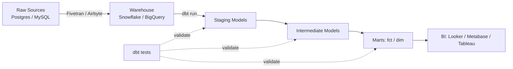
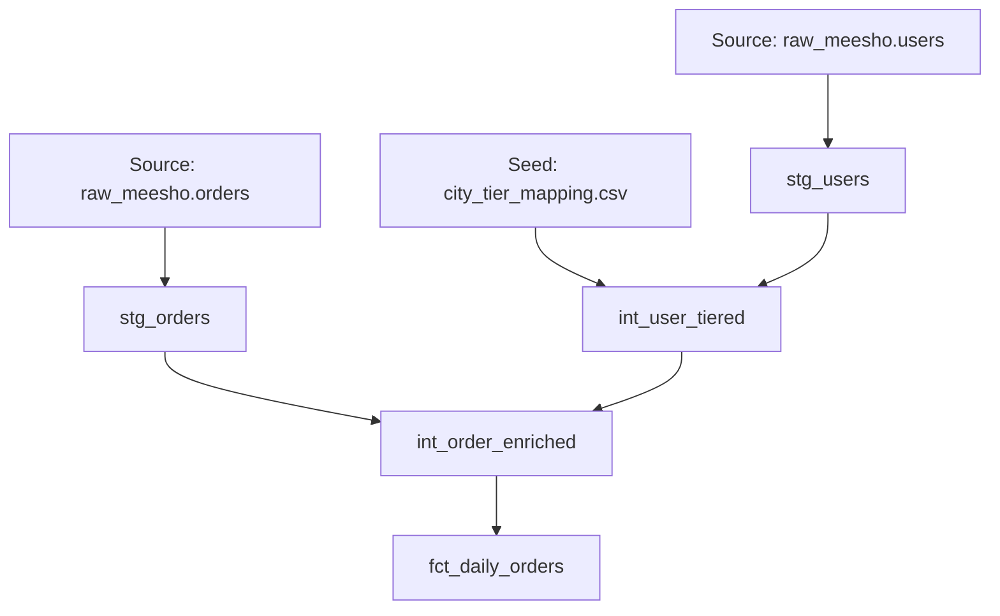
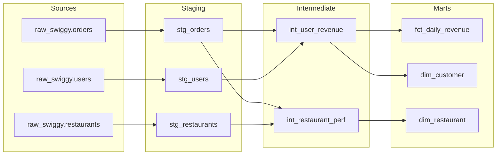
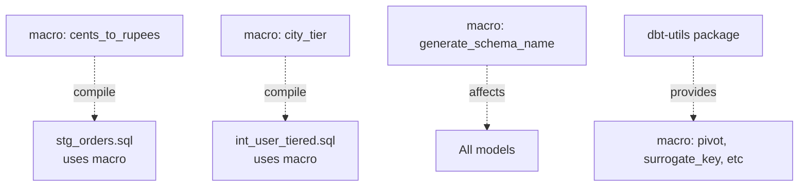
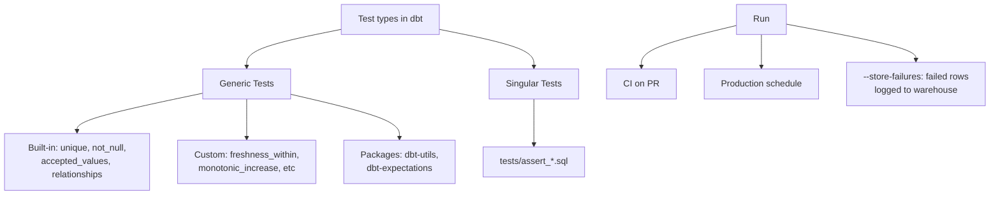
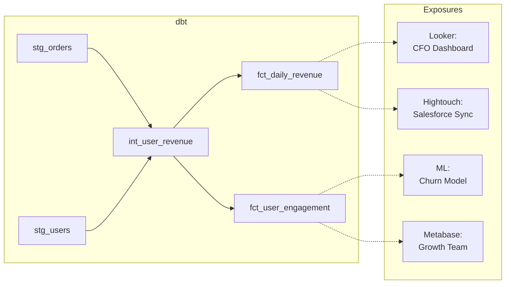
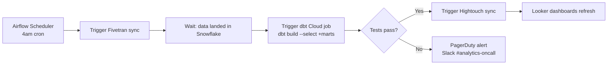
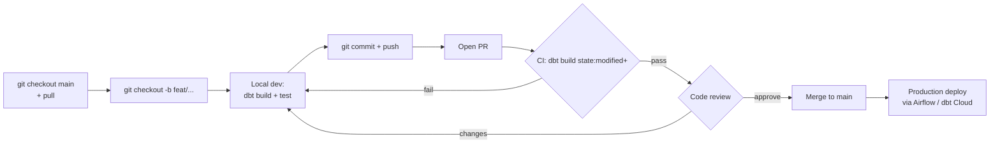
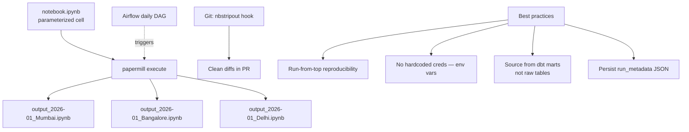

# dbt + Analytics Engineering

dbt ne SQL ko software engineering bana diya. Pre-dbt era was wild west — analysts copy-pasted queries, no versioning, no tests. dbt = git + tests + lineage on top of SQL. Ab tu agar Razorpay, PhonePe, Meesho, ya Postman ke data team mein analyst hai aur tu dbt nahi jaanta, tu basically 2018 mein atak gaya hai. Top 2% analytics engineer aur baaki 98% mein difference yahi hai — dbt project ka structure, naming convention, test coverage, lineage clarity, aur git hygiene.

Ye subject tujhe tin layers mein dbt sikhayega — pehla foundation (models, sources, seeds, layering), phir templating power (Jinja, macros, tests, docs, exposures), aur teesra orchestration + git discipline jo analyst ko engineer banata hai. Sab Hinglish mein, real Indian unicorn ke context mein, asli `stg_orders.sql` aur `fct_daily_revenue.sql` jaise file names ke saath. Tu agar ye 14 ghante seriously laga deta hai, tu apne next dbt PR pe senior engineer "lgtm, ship it" likhega bina ek bhi nit comment ke.

---

## 1. dbt Fundamentals

dbt = data build tool. Tu SQL `SELECT` likhta hai, dbt usko table/view bana deta hai warehouse mein, dependency graph track karta hai, tests chala deta hai, aur docs auto-generate karta hai. Sirf SQL + YAML — koi naya language nahi.

### 1.1 Why dbt changed analytics engineering

#### Definition (kya hai?)

dbt ek transformation tool hai jo "T" of ELT karta hai — Extract aur Load koi aur tool karta hai (Fivetran, Stitch, Airbyte, Debezium), data warehouse (Snowflake, BigQuery, Redshift, Databricks) mein land karta hai, aur dbt usi warehouse ke andar SQL `SELECT` statements ko production-grade data models mein convert karta hai. Har model ek `.sql` file hai jo `SELECT` se shuru hoti hai. dbt usko `CREATE TABLE AS` ya `CREATE VIEW AS` mein wrap karke run karta hai. Saath mein YAML files mein tu schema, tests, descriptions declare karta hai.

#### Why?

Pre-dbt era socho — analyst Tableau pe ek dashboard banata, query 800 lines ki, kahin documented nahi, koi version control nahi, tester nahi, aur jab metric break hota toh "kal tak chal raha tha" wala chaos. dbt teen problems solve karta hai: (1) **versioning** — har model git mein, PR review hota hai; (2) **testing** — `not_null`, `unique`, `relationships`, custom assertions; (3) **lineage** — automatic DAG, tu dekh sakta hai `fct_daily_revenue` kis-kis source pe depend karta hai. Razorpay, PhonePe, Meesho, Postman, CRED, Zerodha — sab dbt pe migrate ho chuke hain ya migrate ho rahe hain because alternative is unmanageable at scale.

#### How?

```sql
-- models/staging/stg_orders.sql
{{ config(materialized='view') }}

SELECT
    order_id,
    user_id,
    restaurant_id,
    order_amount,
    order_status,
    created_at::TIMESTAMP AS ordered_at
FROM {{ source('raw_swiggy', 'orders') }}
WHERE NOT _fivetran_deleted
```

`{{ source(...) }}` Jinja macro hai jo raw table reference mein resolve hota hai. dbt run karega `dbt run --select stg_orders` aur `analytics.staging.stg_orders` view ban jaayega.

#### Real-life Example

Razorpay ka analytics engineering team 2021 mein dbt adopt kiya. Pehle 200+ scheduled SQL scripts the Airflow pe — koi naming convention nahi, dependencies hardcoded, testing zero. Migration ke baad: 600+ models in dbt, 4500+ tests, lineage graph clear, aur breaking change pakdne ka time 4 hours se 5 minutes ho gaya kyunki CI mein tests run hote hain har PR pe. Senior analyst ka time queries debug karne se shift hua actual business analysis pe.

#### Diagram



#### Interview Question

**Q:** dbt vs stored procedures vs Airflow Python operators — analytics transformation ke liye dbt kyu preferred hai?

**A:** Stored procedures warehouse-locked hote hain, version control mein dikhte nahi properly, testing primitive hai, lineage manual track karna padta hai. Airflow Python operators flexible hain but har transformation imperative code ban jaata hai — analyst ke liye barrier high hai (Python expertise zaruri). dbt declarative hai — tu sirf `SELECT` likhta hai, dbt baaki sambhalta hai. Native git integration, automatic DAG, built-in tests, auto docs, materialization strategies (view/table/incremental/snapshot) sirf config change se. Plus dbt warehouse-native hai — Snowflake/BigQuery ka full compute use karta hai, koi data movement nahi. Top 2% analytics engineer Airflow ko **orchestrator** ke liye rakhta hai (trigger dbt run, manage dependencies between dbt + Python ML jobs), aur transformations sab dbt mein.

---

### 1.2 Models, sources, seeds — building blocks

#### Definition (kya hai?)

dbt project ke teen primary building blocks:

- **Models** — `.sql` files in `models/` directory. Har file ek `SELECT` statement hai, dbt usko warehouse mein materialize karta hai as view (default), table, incremental, ya ephemeral.
- **Sources** — raw tables jo dbt ne nahi banaye (Fivetran/Airbyte se aaye). YAML mein declare karte ho `sources.yml`. `{{ source('raw_swiggy', 'orders') }}` se reference karte ho. Freshness checks, descriptions, tests source level pe lagte hain.
- **Seeds** — small static CSV files jo `seeds/` directory mein rakhe jaate hain. `dbt seed` command unko warehouse mein table bana deta hai. Use case: country code mappings, holiday calendar, manual segment lists.

#### Why?

Ye three abstractions clean separation banate hain — **sources** = raw truth (don't touch), **models** = transformations (your work), **seeds** = config/reference data (small lookup tables). Bina iske analyst raw tables direct query karta rehta hai, schema changes break karte hain queries silently, aur har CSV manually upload karna padta hai jo reproducibility kill karta hai.

#### How?

```yaml
# models/staging/_sources.yml
version: 2

sources:
  - name: raw_swiggy
    database: raw
    schema: swiggy_prod
    loaded_at_field: _fivetran_synced
    freshness:
      warn_after: {count: 1, period: hour}
      error_after: {count: 6, period: hour}
    tables:
      - name: orders
        description: "Raw orders from Swiggy production Postgres via Fivetran"
        columns:
          - name: order_id
            tests: [unique, not_null]
      - name: users
      - name: restaurants
```

```sql
-- models/staging/stg_users.sql
SELECT
    user_id,
    LOWER(email) AS email,
    phone,
    city,
    created_at AS signed_up_at
FROM {{ source('raw_swiggy', 'users') }}
```

```csv
# seeds/city_tier_mapping.csv
city,tier
Mumbai,Tier1
Bangalore,Tier1
Pune,Tier2
Indore,Tier2
Patna,Tier3
```

```sql
-- models/intermediate/int_user_tiered.sql
SELECT u.*, t.tier
FROM {{ ref('stg_users') }} u
LEFT JOIN {{ ref('city_tier_mapping') }} t USING (city)
```

#### Real-life Example

Meesho ka data team `seeds/` mein `pin_code_to_state.csv` rakhta hai — 19,000 rows, India ka pin-to-state mapping. Sources mein `raw_meesho.orders`, `raw_meesho.shipments` declare hain. Staging mein `stg_orders.sql` source ko clean karta hai. Intermediate mein `int_orders_with_state.sql` seed ke saath join karta hai. Mart mein `fct_orders_by_state.sql` final aggregation. Ek bhi raw table direct query nahi ki gayi business logic mein — clean separation.

#### Diagram



#### Interview Question

**Q:** Tu kab seed use karega vs source vs model?

**A:** Seed = small static reference data jo analytics team manually maintain karta hai (country codes, tier mappings, blacklists, holiday calendars) — version controlled CSV. Limit ~1000 rows ideally, max 10K. Source = bahar se aane wala raw data jisko hum control nahi karte (production DBs via Fivetran, third-party APIs) — bas declare karke freshness track karte hain. Model = analyst ka actual SQL transformation. Anti-patterns: large datasets ko seed banana (CSV git mein bloat), business logic seed mein hardcode karna jo frequently change ho (use a model or config), ya source bypass karke raw schema direct ref karna (lineage break, no freshness).

---

### 1.3 staging → intermediate → marts layering

#### Definition (kya hai?)

dbt best practice — models ko teen layers mein organize karna:

- **Staging (`stg_*`)** — 1:1 with source tables. Sirf renaming, type casting, light cleanup. No joins, no aggregations. Granularity = source ki granularity.
- **Intermediate (`int_*`)** — staging models ko join, filter, light aggregate karke business concepts banana. Reusable building blocks. Often hidden from end-users.
- **Marts (`fct_*`, `dim_*`)** — final business-facing tables. Star schema — fact tables (events, transactions) and dimension tables (entities). BI tools yahin se query karte hain.

#### Why?

Layering = separation of concerns. Staging changes jab source schema badle. Intermediate changes jab business logic evolve ho. Marts stable rehte hain BI users ke liye. Bina layering ke ek 600-line model banta hai jo source rename hote hi pura todh deta hai. dbt Labs ka official style guide isi pe khada hai, aur 95% production dbt projects (including Razorpay, PhonePe, Postman) yahi follow karte hain.

#### How?

```sql
-- models/staging/stg_orders.sql (1:1 with source, just clean)
SELECT
    order_id,
    user_id,
    restaurant_id,
    gmv_paise / 100.0 AS gmv_inr,
    status,
    created_at::TIMESTAMP AS ordered_at
FROM {{ source('raw_swiggy', 'orders') }}
WHERE NOT _fivetran_deleted
```

```sql
-- models/intermediate/int_user_revenue.sql (joins + business logic)
WITH orders AS (
    SELECT * FROM {{ ref('stg_orders') }}
    WHERE status = 'delivered'
),
users AS (
    SELECT * FROM {{ ref('stg_users') }}
)
SELECT
    u.user_id,
    u.city,
    u.signed_up_at,
    COUNT(o.order_id) AS lifetime_orders,
    SUM(o.gmv_inr) AS lifetime_gmv,
    MIN(o.ordered_at) AS first_order_at,
    MAX(o.ordered_at) AS last_order_at
FROM users u
LEFT JOIN orders o USING (user_id)
GROUP BY 1, 2, 3
```

```sql
-- models/marts/core/fct_daily_revenue.sql (final business mart)
{{ config(materialized='incremental', unique_key=['order_date','city']) }}

SELECT
    DATE(ordered_at) AS order_date,
    city,
    COUNT(DISTINCT user_id) AS unique_orderers,
    COUNT(*) AS total_orders,
    SUM(gmv_inr) AS gmv,
    SUM(gmv_inr) / NULLIF(COUNT(DISTINCT user_id), 0) AS arpu
FROM {{ ref('int_user_revenue') }} ur
JOIN {{ ref('stg_orders') }} o USING (user_id)

  WHERE DATE(ordered_at) >= (SELECT MAX(order_date) FROM {{ this }}) - 3

GROUP BY 1, 2
```

#### Real-life Example

PhonePe ka mart layer mein `fct_daily_tpv.sql` (total payment volume per day per merchant), `dim_merchant.sql` (merchant attributes — category, tier, onboarded date), `fct_user_engagement.sql` (DAU/MAU metrics). Intermediate mein `int_payment_enriched.sql` jo raw payments ko user + merchant + device dim ke saath enrich karta hai. Staging mein har `raw_phonepe.*` table ka 1:1 `stg_*`. BI team Looker pe bas marts query karti hai — staging/intermediate hidden hain via dbt's `meta: contains_pii` flag aur permission boundaries.

#### Diagram



#### Interview Question

**Q:** Tu staging layer mein joins kyu nahi karta?

**A:** Staging ka contract = source ka 1:1 mirror with type fixes + naming. Joins yahan karoge to (a) source schema change har dependent join todh dega cascading; (b) reusability mar jaati hai — same source ko 5 different intermediate models alag-alag joins ke saath consume karna chahte hain; (c) testing hard ho jaata hai because joins introduce duplicates if FKs broken. Staging clean = saari downstream layer predictable. Top 2% analytics engineer staging ko boring rakhta hai deliberately — sab interesting kaam intermediate aur marts mein.

---

## 2. Jinja, Macros & Tests

dbt ki real superpower yahan unlock hoti hai — SQL ko programmable banana, repeating patterns ko abstract karna, aur data quality automate karna.

### 2.1 Jinja templating & reusable macros

#### Definition (kya hai?)

**Jinja** Python-based templating language hai. dbt mein har `.sql` file pehle Jinja se compile hoti hai (templating expand hota hai), phir resulting SQL warehouse pe execute hoti hai. Tu `{{ ... }}` mein expressions, `` mein control flow likhta hai.

**Macros** Jinja functions hain — reusable code blocks `macros/` directory mein. Tu ek baar likh, har model mein call kar.

#### Why?

DRY principle SQL pe lagana — bina Jinja ke same `CASE WHEN city IN (...) THEN 'Tier1'` har model mein copy-paste hoga. Macro likh ke `{{ city_tier(city) }}` use karo. Schema generation, environment-specific configs, dynamic pivot, conditional logic — sab macros se. dbt-utils, dbt-expectations jaise packages hundreds of pre-built macros dete hain.

#### How?

```sql
-- macros/cents_to_rupees.sql

    ({{ column_name }} / 100.0) AS {{ alias }}

```

```sql
-- usage in a model
SELECT
    order_id,
    {{ cents_to_rupees('gmv_paise', 'gmv_inr') }},
    {{ cents_to_rupees('discount_paise', 'discount_inr') }}
FROM {{ source('raw_swiggy', 'orders') }}
```

```sql
-- macros/generate_schema_name.sql (env-specific schemas)

    
    
        {{ custom_schema_name | trim }}
    
        {{ default_schema }}_{{ custom_schema_name | trim }}
    

```

```sql
-- macros/pivot_payment_methods.sql (dynamic pivot using dbt-utils)

    
    
        SUM(CASE WHEN {{ column }} = '{{ m }}' THEN gmv_inr ELSE 0 END) AS gmv_{{ m | lower }}
        ,
    

```

```sql
-- usage
SELECT user_id, {{ pivot_payments() }}
FROM {{ ref('stg_orders') }}
GROUP BY 1
```

#### Real-life Example

Postman ka analytics team ek macro likha `{{ active_user(activity_window=30) }}` jo standardized "active user" definition implement karta hai (login + ≥1 API call in last N days). 40+ models is macro ko use karte hain. Jab 2024 mein definition badli (also include Postman flows triggers), sirf macro update kiya — saare downstream metrics auto-refresh ho gaye consistently. Bina macro ke 40 PRs lagte 40 alag teams se, with inconsistent rollout.

#### Diagram



#### Interview Question

**Q:** Macro vs CTE — kab kaunsa use karega?

**A:** CTE = within-model abstraction (same SQL file ke andar logical step). Macro = across-model reusability (multiple models mein same logic). Rule of thumb: agar tu same logic 2+ models mein chahiye — macro. Ek hi model mein 3-4 logical steps — CTE. Anti-pattern: ek-do model mein use hone wale macros banana (over-engineering, debugging hard hota hai because compiled SQL Jinja-expanded form pe debug karna padta hai). Top 2% analytics engineer macros ko purposeful rakhta hai — har macro ka clear "why" doc-string ke saath. Plus Jinja-heavy models compile fail ho jaate hain cryptic errors ke saath, so simple wins.

---

### 2.2 Tests — generic and singular, data quality

#### Definition (kya hai?)

dbt tests assertions hain jo warehouse pe SQL run karke check karte hain ki data expected shape mein hai. Two types:

- **Generic tests** — reusable tests jo column-level YAML mein declare karte hain. Built-in: `unique`, `not_null`, `accepted_values`, `relationships`. Custom generic tests `tests/generic/` mein likh sakte ho.
- **Singular tests** — ek specific assertion ke liye standalone SQL file `tests/` mein. Returns rows = test fails (rows = violations).

#### Why?

Bina tests ke data silently rotten ho jaata hai. Source schema change, NULL spike, duplicate explosion, FK orphan — sab production dashboards pe wrong numbers banake CFO ke saamne le aate hain. Tests CI mein chalte hain (PR pe block) aur production runs mein (alert fire). Razorpay ka analytics team 4500+ tests pe khada hai — har critical metric ke piche granularity, freshness, business-rule tests hain.

#### How?

```yaml
# models/marts/core/_marts.yml
version: 2

models:
  - name: fct_daily_revenue
    description: "Daily revenue per city, post-cancellation/refund"
    columns:
      - name: order_date
        tests: [not_null]
      - name: city
        tests:
          - not_null
          - relationships:
              to: ref('dim_city')
              field: city
      - name: gmv
        tests:
          - not_null
          - dbt_utils.expression_is_true:
              expression: ">= 0"
      - name: arpu
        tests:
          - dbt_expectations.expect_column_values_to_be_between:
              min_value: 0
              max_value: 50000

  - name: dim_customer
    columns:
      - name: customer_id
        tests: [unique, not_null]
      - name: tier
        tests:
          - accepted_values:
              values: ['Tier1', 'Tier2', 'Tier3']
```

```sql
-- tests/assert_no_negative_gmv.sql (singular test)
SELECT order_date, city, gmv
FROM {{ ref('fct_daily_revenue') }}
WHERE gmv < 0
```

```sql
-- tests/generic/test_freshness_within.sql (custom generic test)

SELECT 1
FROM {{ model }}
HAVING MAX({{ column_name }}) < DATEADD('hour', -{{ hours }}, CURRENT_TIMESTAMP)

```

```yaml
# usage of custom generic
columns:
  - name: ordered_at
    tests:
      - freshness_within:
          hours: 6
```

#### Real-life Example

Meesho ka 2023 incident — supplier dashboard pe GMV 2x spike dikhne laga raat ko. Pre-dbt era hota toh subah tak chal jaata. dbt mein `unique` test on `(order_id, item_id)` failed in CI — duplicate rows aaye the upstream Fivetran pipeline mein retry-related glitch se. CI block hua, PR merge nahi hua, on-call analytics engineer ko Slack alert mila, root cause 30 min mein fix. Production data clean raha. CFO dashboard pe sahi number gaya. Top 2% analytics engineer tests ko safety net nahi, **product** maan ke design karta hai.

#### Diagram



#### Interview Question

**Q:** Critical model fail hua test mein production run pe — pipeline rok do ya continue?

**A:** Depends on test severity. dbt mein `severity: error` (default) fail hone pe downstream models skip ho jaate hain — strict but safe. `severity: warn` log karta hai but pipeline chalu rakhta hai — quality issues ke liye jo abhi blocker nahi hain. Best practice: critical tests (uniqueness on PK, NOT NULL on FK joins, business rule violations like negative revenue) → `severity: error`. Soft assertions (column distribution, freshness threshold) → `severity: warn` with PagerDuty alert. Top 2% analytics engineer test severity classification ko deliberate decision banata hai — har critical model pe README mein document karta hai kaunse tests gating hain. Plus `--store-failures` use karta hai taaki failed rows warehouse mein audit table mein log ho jaayein, debugging next morning easy ho.

---

### 2.3 Documentation, exposures, lineage

#### Definition (kya hai?)

- **Documentation** — `description:` fields YAML mein, plus `` blocks markdown mein. `dbt docs generate && dbt docs serve` se interactive site banta hai with searchable models, columns, lineage graph.
- **Exposures** — downstream consumers of dbt models (Looker dashboards, ML models, reverse ETL syncs) ko first-class declare karna. YAML mein define karte hain. Lineage extends beyond dbt itself.
- **Lineage** — directed acyclic graph (DAG) of model dependencies. dbt automatically build karta hai `ref()` aur `source()` calls se. Visual graph in docs site.

#### Why?

Onboarding speed, change-impact analysis, aur stakeholder trust — teen pillars docs+exposures+lineage ke. New analyst join hoke 1 hour mein samajh sakta hai data flow. Engineer source schema change karne se pehle dekh sakta hai "iss column ko 12 dashboards aur 3 ML models use karte hain" via exposures. PII tagging via `meta:` se governance automate hota hai.

#### How?

```yaml
# models/marts/core/_marts.yml
version: 2

models:
  - name: fct_daily_revenue
    description: |
      Daily delivered-order revenue at city granularity.
      Cancellations and refunds excluded. PII-free.
    columns:
      - name: order_date
        description: "Calendar date of order placement (IST)."
      - name: gmv
        description: "{{ doc('gmv_definition') }}"

exposures:
  - name: cfo_revenue_dashboard
    type: dashboard
    maturity: high
    url: https://looker.company.com/dashboards/42
    description: "CFO weekly revenue review — board-level metric"
    depends_on:
      - ref('fct_daily_revenue')
      - ref('dim_customer')
    owner:
      name: Priya Sharma
      email: priya@razorpay.com

  - name: churn_prediction_model
    type: ml
    maturity: medium
    depends_on:
      - ref('int_user_revenue')
      - ref('fct_user_engagement')
    owner:
      name: Analytics Eng
      email: analytics-eng@razorpay.com
```

```markdown
{# models/docs.md #}

**GMV (Gross Merchandise Value)** — total order amount in INR before discounts,
post-cancellation/refund. Includes delivery fee. Excludes tax.
Source of truth: `fct_daily_revenue.gmv`.

```

```bash
# generate and serve docs
dbt docs generate
dbt docs serve --port 8080
```

#### Real-life Example

Postman ka dbt docs site internal at `dbt.postman.engineering`. 350+ models documented, 80+ exposures (Looker dashboards, Salesforce reverse ETL via Hightouch, churn ML model, billing reconciliation). Jab 2024 mein `users.signup_source` field deprecate karna tha, engineer ne dbt docs lineage dekha — 14 downstream models, 6 exposures impacted. Migration plan owner-wise distribute hua, 2 weeks mein sab sahi shift, zero dashboard breakage. Bina exposures ke ye 3 months ka project hota with surprise breakages.

#### Diagram



#### Interview Question

**Q:** dbt docs sirf nice-to-have hai ya genuinely valuable? Kab ROI justify hoti hai?

**A:** Small project (10-20 models, 1-2 analysts) — minimal docs theek hai. Beyond that, docs investment compounding return deta hai. Concrete ROI: (1) **Onboarding** — naya analyst 2 weeks vs 2 days mein productive; (2) **Change impact** — schema migration 3x fast with lineage clarity; (3) **Stakeholder trust** — PM/CFO khud query kar sakte hain "iss number ka definition kya hai" without pinging analyst; (4) **Compliance/governance** — PII tagging via `meta:` blocks, GDPR/DPDP audit trails, automated detection. Top 2% analytics engineer docs ko **first-class deliverable** treat karta hai PR ke saath — model code without `description:` PR review fail karwa deta hai. Plus exposures definitively declare ki "ye dashboard meri responsibility hai" — accountability concrete ho jaati hai.

---

## 3. Orchestration & Git for Analysts

dbt models likh lena solo skill hai. Production-grade analytics engineering requires orchestration discipline aur git hygiene jo software engineer-level ho.

### 3.1 Airflow, Prefect, Dagster — awareness level

#### Definition (kya hai?)

Workflow orchestrators jo scheduled jobs run karte hain, dependencies manage karte hain, retries/alerts handle karte hain. Tin major players analytics ecosystem mein:

- **Airflow** (Apache, since 2014) — Python DAGs, mature, large community, complex setup. Most Indian unicorns (Flipkart, Swiggy, Razorpay legacy) use it.
- **Prefect** (since 2018) — pythonic, simpler API, dynamic flows, hybrid execution model, cleaner UI. Postman uses Prefect Cloud.
- **Dagster** (since 2019) — software-defined assets paradigm, native dbt integration via `dagster-dbt`, asset-centric (not task-centric). Modern stack mein gaining ground.

#### Why?

dbt khud orchestrator nahi hai — `dbt run` ek command hai. Production mein sab kuch chahiye: scheduling (har raat 4am), dependencies (Fivetran sync complete hone ke baad dbt run, fir Hightouch sync), retries on failure, alerting (PagerDuty/Slack), backfills, environment isolation (dev/staging/prod). Yahi orchestrator karte hain. Awareness level kyu? Analytics engineer ke liye orchestrator pe deep expertise zaruri nahi (data engineer ka territory) — but tujhe samajhna chahiye ki tera dbt project kahan se trigger hota hai aur failure pe kya hota hai.

#### How?

```python
# Airflow DAG (analytics_engineer awareness level)
from airflow import DAG
from airflow.providers.dbt.cloud.operators.dbt_cloud import DbtCloudRunJobOperator
from airflow.operators.bash import BashOperator
from datetime import datetime, timedelta

with DAG(
    'daily_analytics',
    schedule='0 4 * * *',          # 4am IST daily
    start_date=datetime(2026, 1, 1),
    catchup=False,
    default_args={'retries': 2, 'retry_delay': timedelta(minutes=10)},
) as dag:

    fivetran_sync = BashOperator(
        task_id='trigger_fivetran',
        bash_command='curl -X POST https://api.fivetran.com/v1/connectors/.../force',
    )

    dbt_build = DbtCloudRunJobOperator(
        task_id='dbt_build',
        dbt_cloud_conn_id='dbt_cloud_default',
        job_id=12345,                # production daily build job
    )

    hightouch_sync = BashOperator(
        task_id='hightouch_sync',
        bash_command='curl -X POST https://api.hightouch.com/api/v1/syncs/.../trigger',
    )

    fivetran_sync >> dbt_build >> hightouch_sync
```

#### Real-life Example

Razorpay ka analytics stack: Fivetran (ELT) → Snowflake → dbt Cloud (transformation) → Hightouch (reverse ETL to Salesforce/HubSpot) + Looker (BI). Airflow orchestrate karta hai entire pipeline. Failure mein PagerDuty alert on-call ko, retry 2x, baaki cases mein incident channel mein auto-post. Analytics engineer ka primary touch-point dbt Cloud — Airflow DAG bas trigger karta hai. Jab dbt job fail karta hai, dbt Cloud UI mein detail (which model, which test, log link) milti hai.

#### Diagram



#### Interview Question

**Q:** Tu analytics engineer hai. dbt Cloud aur Airflow dono available hain. Tu dbt run kahan se trigger karega?

**A:** Depends on dependency complexity. Pure dbt-only pipeline (sources already synced via Fivetran's own scheduler, no downstream Python/ML steps, no reverse ETL) — dbt Cloud's native scheduler simpler aur sufficient hai. Web UI, easy alerting, version-aware. But agar pipeline cross-tool dependencies hain (Fivetran → wait for completion → dbt → Python ML model retraining → Hightouch sync → BI cache refresh) — Airflow/Dagster/Prefect needed. Top 2% analytics engineer hybrid approach use karta hai: Airflow ko orchestrator, dbt Cloud ko execution layer (call via API). Best of both — Airflow's dependency power + dbt Cloud's analytics-friendly UI/logs/notifications. Anti-pattern: Airflow mein `dbt run` ko BashOperator se chalana — works but you lose dbt Cloud's UI advantages aur logs scattered ho jaate hain.

---

### 3.2 Git — branching, PRs, code review for analysts

#### Definition (kya hai?)

Git = version control system. dbt mein har model file `.sql`, har test file `.sql`, har YAML — sab git mein. Analytics engineer ka workflow:

- **main/master** — production branch. Protected. Direct push blocked.
- **feature branches** — `feat/add-fct-daily-revenue`, `fix/stg-orders-null-handling`. Local development yahan.
- **PR (Pull Request)** — feature branch ko main mein merge karne ka request. Review + CI checks (dbt build, dbt test) gating.
- **CI/CD** — GitHub Actions / GitLab CI / dbt Cloud CI har PR pe automatically dbt build run karke validate karta hai.

#### Why?

Pre-dbt analyst era mein "version control" matlab `final_v2_FINAL_FINAL.sql` files. Now it's git. Git enables: collaboration (5 analysts same project pe parallel kaam), audit (kaunsa change kab kisne kiya), rollback (revert ek command), aur quality gates (CI + review). Bina iske analytics scale nahi karta beyond 2-3 analysts. Razorpay/PhonePe/Postman ke analytics teams 20+ engineers, 100+ PRs/week — sab git workflow pe.

#### How?

```bash
# Daily workflow for analytics engineer
git checkout main
git pull origin main

# new feature
git checkout -b feat/fct-cohort-retention

# edit models/marts/core/fct_cohort_retention.sql
# edit models/marts/core/_marts.yml (add tests + docs)

# local validation
dbt build --select +fct_cohort_retention
dbt test  --select +fct_cohort_retention

# commit
git add models/marts/core/fct_cohort_retention.sql models/marts/core/_marts.yml
git commit -m "feat: add fct_cohort_retention for D7/D30 cohort analysis

Used by Growth team's weekly retention review dashboard.
Granularity: 1 row per (signup_week, cohort_age_days)."

git push origin feat/fct-cohort-retention

# open PR via GitHub UI or:
gh pr create --title "Add fct_cohort_retention mart" \
             --body "Adds weekly cohort retention with D1/D7/D30 metrics.
                     Tested with unique on (signup_week, age_days), not_null on retention_pct.
                     Linked Looker dashboard: <URL>."
```

```yaml
# .github/workflows/dbt_ci.yml
name: dbt CI
on:
  pull_request:
    branches: [main]
jobs:
  dbt-build:
    runs-on: ubuntu-latest
    steps:
      - uses: actions/checkout@v4
      - uses: actions/setup-python@v5
        with: { python-version: '3.11' }
      - run: pip install dbt-snowflake==1.8.0
      - run: dbt deps
      - name: dbt build (changed models only)
        run: dbt build --select state:modified+ --defer --state ./prod-manifest
        env:
          DBT_PROFILES_DIR: ./ci
          SNOWFLAKE_PASSWORD: ${{ secrets.SNOWFLAKE_PASSWORD }}
```

#### Real-life Example

Postman ka analytics team weekly cadence: Monday planning, Tue-Thu development on feature branches, Friday merge day. Each PR requires (a) `dbt build` green in CI; (b) one code review approval (analytics engineer or lead); (c) docs/tests updated; (d) Slite/Notion design doc linked for non-trivial changes. CI uses `state:modified+` (only changed models + downstream) for speed — full builds nightly. PR mein analyst Looker dashboard preview link share karta hai dev schema se. Reviewer compiled SQL dekhta hai (Jinja-expanded), test coverage check karta hai, performance review karta hai (compile time, partition pruning). Result: zero broken dashboards in 18 months despite 80+ PRs/month.

#### Diagram



#### Interview Question

**Q:** dbt PR review mein tu kya specifically dekhega beyond "does it run"?

**A:** Top 2% reviewer checklist: (1) **Layering correctness** — staging mein joins nahi, marts mein source ka direct ref nahi; (2) **Tests** — har new column ka description, PK pe `unique + not_null`, FK pe `relationships`, business invariants pe expression tests; (3) **Materialization fit** — small dim → table, frequently changing fact → incremental, ephemeral only when truly intermediate; (4) **Naming** — `stg_<source>__<entity>`, `fct_<event>`, `dim_<entity>` convention; (5) **Compiled SQL** — Jinja expand karke check ki actual query reasonable hai (no N+1 patterns, no full-table scans on incremental); (6) **Lineage** — naya model existing models reuse kar raha hai ya duplicate kar raha hai; (7) **Docs + exposures** — description present, downstream impact noted; (8) **Performance** — partition columns, clustering keys, where filters in incremental block. PR description mein "what" + "why" + "test plan" + "rollback strategy" — sab present.

---

### 3.3 Notebook best practices — reproducibility, papermill

#### Definition (kya hai?)

Jupyter notebooks analyst ka favorite tool — exploration, prototyping, ad-hoc analysis. But notebooks have reproducibility problems: hidden state (out-of-order cells), no version diff (JSON format), no testing, often not parameterized. **Reproducibility** matlab koi aur (ya tu 6 mahine baad) same notebook ko same input pe run kare aur same output mile. **Papermill** ek tool hai jo notebooks ko parameterized scripts banata hai — programmatic execution + injection of variables.

#### Why?

Analyst-engineer transition mein notebook-discipline biggest gap hai. Senior analyst ka notebook 2 saal baad chala nahi paata kyunki: cells out of order, undocumented dependencies, hardcoded paths, hardcoded credentials, kernel restart pe fail. Reproducibility = trust. Papermill enables productionization — same notebook ko Airflow se daily different parameters ke saath chala sakte ho. Many companies (Netflix famously) papermill ko notebooks-as-pipelines pattern ke liye use karte hain.

#### How?

```python
# notebooks/cohort_retention_analysis.ipynb (key cells)

# Cell 1: parameters (papermill tag: parameters)
start_date = '2026-01-01'
end_date   = '2026-04-30'
city       = 'Mumbai'
output_path = './outputs/cohort_retention.parquet'

# Cell 2: imports + reproducibility setup
import pandas as pd, numpy as np
import snowflake.connector
import os, json
from datetime import datetime

np.random.seed(42)             # deterministic randomness
pd.set_option('display.max_rows', 50)

run_metadata = {
    'run_at': datetime.utcnow().isoformat(),
    'git_sha': os.environ.get('GIT_SHA', 'unknown'),
    'params': {'start_date': start_date, 'end_date': end_date, 'city': city},
}

# Cell 3: data load (always from versioned dbt mart, never raw)
conn = snowflake.connector.connect(
    user=os.environ['SF_USER'],
    password=os.environ['SF_PASSWORD'],
    account='razorpay-analytics',
    warehouse='ANALYST_WH',
    database='ANALYTICS',
    schema='MARTS_CORE',
)

query = f"""
SELECT *
FROM fct_cohort_retention
WHERE signup_week BETWEEN '{start_date}' AND '{end_date}'
  AND city = '{city}'
"""
df = pd.read_sql(query, conn)
print(f"Loaded {len(df)} rows for {city} between {start_date} and {end_date}")

# Cell 4: analysis
# ... cohort heatmap, D7/D30 calc, etc

# Cell 5: persist + log run_metadata
df.to_parquet(output_path)
with open(output_path.replace('.parquet', '.meta.json'), 'w') as f:
    json.dump(run_metadata, f, indent=2)
```

```bash
# papermill execution — parameterized
papermill notebooks/cohort_retention_analysis.ipynb \
          outputs/cohort_retention_mumbai_2026Q1.ipynb \
          -p city Mumbai \
          -p start_date 2026-01-01 \
          -p end_date 2026-03-31

# loop over cities
for city in Mumbai Bangalore Delhi Pune Hyderabad; do
  papermill notebooks/cohort_retention_analysis.ipynb \
            outputs/cohort_retention_${city}.ipynb \
            -p city $city
done
```

```bash
# git diff-friendly: nbstripout removes outputs from commits
pip install nbstripout
nbstripout --install
```

#### Real-life Example

Meesho ka category team weekly category-deep-dive analysis karta hai — saree, kurta, sneakers, kitchen, etc 30+ categories. Pre-papermill era — analyst manually har category ke liye notebook copy karta, top variables change karta, run karta, screenshot leta. 1 din ka kaam. Post-papermill — ek `category_deep_dive.ipynb` parameterized, papermill se loop, parallel execution, 30 notebooks 20 min mein generate. Output Slack mein auto-post hota Stakeholders ko. Plus `nbstripout` git hook se notebooks output-free commit hote — diffs readable, no GB-size repos.

#### Diagram



#### Interview Question

**Q:** Senior analyst ka notebook tujhe handover hua. Tu kaise validate karega ki reproducible hai?

**A:** Five-step audit: (1) **Kernel restart + run all** — agar fail karta hai, hidden state issue; reorder cells, eliminate side effects. (2) **Dependency lock** — `requirements.txt` ya `poetry.lock` present hai? Python version specified? Bina iske 6 mahine baad library breaking change pe sab tut jaayega. (3) **Data source** — kya dbt mart se aata hai (versioned, tested, stable schema) ya raw table direct query (volatile)? Mart-based always preferred. (4) **Hardcoded values** — paths, credentials, dates. Sab env vars / parameters mein move karo. (5) **Run metadata** — output ke saath run timestamp, git SHA, parameter values JSON mein log hote hain ya nahi? Bina iske "ye chart kab generate hua, kis data se" answer nahi de paayega 2 weeks baad. Bonus: papermill-compatible bana de (parameters cell tagged), so productionization ke liye ready ho. Top 2% analytics engineer notebook ko **disposable artifact** treat karta hai — important logic dbt models mein, notebook sirf exploration + presentation layer.

---

> **Bottom line:** dbt + Jinja/macros + tests + git-native workflow + thoughtful orchestration = analytics engineering. Tu agar ye stack confidently chala sakta hai, tu Razorpay / PhonePe / Meesho / Postman level analytics teams mein senior IC role command kar sakta hai. SQL likhna table-stakes hai 2026 mein — software engineering discipline SQL pe lagana hi differentiator hai. Iss subject ko apne current dbt project mein audit karne ke liye use kar — har section ka concrete improvement identify kar, ek PR khol, merge kar — phir aage badh.
