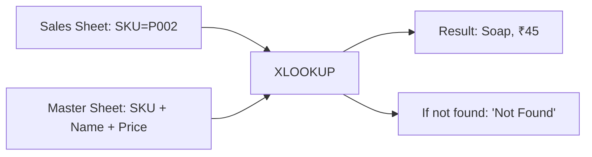
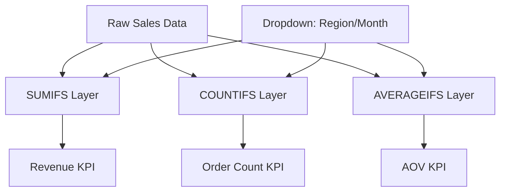
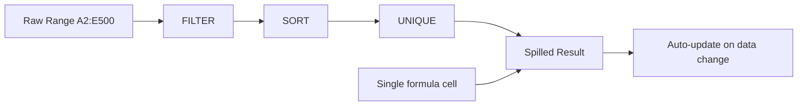
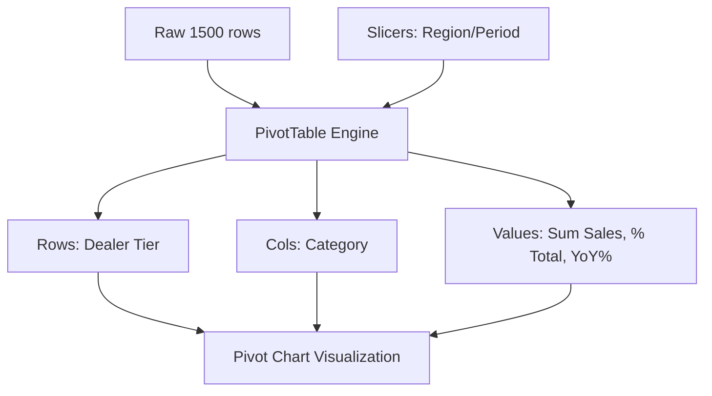
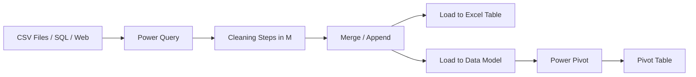
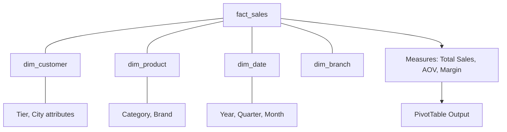
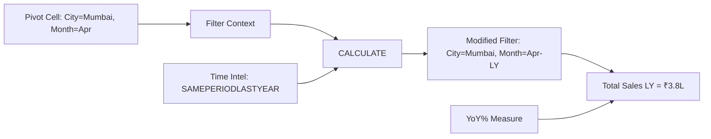
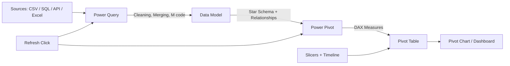

# Excel — The Analyst's Hidden Superpower

Dekh bhai, ek baat seedhi bol deta hoon — tu LinkedIn pe "Python > Excel" memes dekh ke confused ho gaya hai. Reality check: India mein 80% business decisions abhi bhi Excel mein hote hain. CFO ka board pack? Excel. SME ka monthly P&L? Excel. FMCG company ka secondary sales report? Excel. Banking ka credit risk model? Excel + VBA. Tu Jupyter notebook le ke jaayega CEO ke saamne, woh bolega "bhai mujhe ek Excel file bhej de jisme main filter laga ke dekh sakoon" — aur tu blank ho jaayega. Ek real story sun — ek IIT-pass-out analyst ne Reliance Retail ke ek SVP ko 200-page PDF report bheji Python se generated. SVP ne reply kiya: "Excel chahiye, CSV nahi, PDF nahi. Mujhe pivot maarna hai." Game over. Wahi din usne XLOOKUP seekha.

Top 2% data analyst Excel ko "starter tool" nahi maanta — woh Excel ko "decision-making interface" maanta hai. Python data manipulate karta hai, Tableau visualize karta hai, but Excel woh jagah hai jahan business head apne haathon se "what-if" karta hai. Tu agar Excel ka XLOOKUP, dynamic arrays, Power Query (M language), Power Pivot + DAX, aur time intelligence DAX measures nahi jaanta — tu sirf SQL clerk hai jo Excel se daro. Ye guide tujhe wo Excel sikhayegi jo top 2% analyst use karte hain — Indian SME, retail, FMCG, banking ke real examples ke saath. Sab Hinglish, IIT depth, no fluff.

---

## 1. Lookup & Aggregation Formulas

Excel ka 70% kaam hota hai do tables ko "join" karna aur conditional aggregations nikalna. SQL mein JOIN aur GROUP BY hota hai — Excel mein VLOOKUP/XLOOKUP aur SUMIFS/COUNTIFS. Aur ab dynamic arrays ne game hi badal diya hai.

### 1.1 VLOOKUP, INDEX-MATCH, XLOOKUP

#### Definition (kya hai?)

Lookup formulas — ek table mein value dhundo aur dusri table se related column return karo. SQL mein iska equivalent `LEFT JOIN` hai.

- **VLOOKUP** — purana legend, vertical lookup. Syntax: `VLOOKUP(lookup_value, table, col_index, [range_lookup])`. Ek hi direction mein dhundta hai (left to right).
- **INDEX-MATCH** — VLOOKUP ka flexible cousin. `INDEX(return_range, MATCH(lookup_value, lookup_range, 0))`. Left-to-right, right-to-left, bidirectional — sab kar sakta hai.
- **XLOOKUP** — Excel 365 ka new boss. `XLOOKUP(lookup_value, lookup_array, return_array, [if_not_found], [match_mode], [search_mode])`. Modern, clean, default exact match, error handling built-in.

#### Why?

VLOOKUP ke saath 3 problems hain — (1) lookup column hamesha leftmost hona chahiye, (2) col_index hardcode hota hai (column insert hua toh formula tutta), (3) approximate match default hai (silent bug factory). XLOOKUP ye sab fix karta hai. INDEX-MATCH still relevant hai legacy Excel (2016, 2019) ke liye jo XLOOKUP support nahi karte. Tu agar ek SME company mein join hua hai jahan abhi Office 2019 chal raha hai — INDEX-MATCH master karna padega.

#### How? (with formulas)

Sample data — `Products` sheet:

| ProductID | Name        | Category | Price |
|-----------|-------------|----------|-------|
| P001      | Atta 5kg    | Grocery  | 280   |
| P002      | Soap        | Personal | 45    |
| P003      | Notebook    | Stationery | 60  |

`Sales` sheet — tu yahan ProductID ke against Name aur Price laana chahta hai.

```excel
// VLOOKUP — classic
=VLOOKUP(A2, Products!$A$2:$D$4, 2, FALSE)   // returns Name
=VLOOKUP(A2, Products!$A$2:$D$4, 4, FALSE)   // returns Price

// INDEX-MATCH — flexible (return Name from ProductID)
=INDEX(Products!$B$2:$B$4, MATCH(A2, Products!$A$2:$A$4, 0))

// XLOOKUP — modern
=XLOOKUP(A2, Products!$A$2:$A$4, Products!$B$2:$B$4, "Not Found")

// XLOOKUP — bidirectional (ProductID + column header → value)
=XLOOKUP(A2, Products!$A$2:$A$4, XLOOKUP(B$1, Products!$B$1:$D$1, Products!$B$2:$D$4))
```

Result for `A2 = "P002"` → Name = "Soap", Price = 45.

#### Real-life Example

Tu ek mid-size FMCG distributor ka analyst hai (Hyderabad-based, ₹80Cr annual turnover). Daily 2000+ secondary sales entries aati hain — but sirf SKU code hota hai, product name aur MRP nahi. Tu master `SKU_Master` sheet maintain karta hai 800 SKUs ka. Daily sales sheet mein XLOOKUP se SKU → Name, Category, MRP, GST rate auto-populate karta hai. Pehle VLOOKUP use karta tha — ek baar IT team ne SKU_Master mein column reorder kiya, sab formulas tut gaye, distributor ko ₹4L ka GST mismatch ho gaya. XLOOKUP migration ke baad zero issue.

#### Diagram



#### Interview Question

**Q:** VLOOKUP, INDEX-MATCH, XLOOKUP — kab kaunsa use karega?

**A:** Decision tree clear hai. Excel 365 / 2021 hai → XLOOKUP default — clean syntax, exact match default, IFNA built-in, bidirectional. Excel 2016/2019 (still 60% Indian SMEs) → INDEX-MATCH — flexibility chahiye, leftward lookup, dynamic column references. VLOOKUP sirf legacy compatibility ya quick-and-dirty 30-second analysis ke liye — production reports mein avoid karo. Real differentiator — XLOOKUP ka 5th argument (match_mode) wildcard aur approximate sorted/unsorted handle karta hai, jo VLOOKUP nahi karta. Plus XLOOKUP arrays return kar sakta hai (spill into multiple cells), making it composable with FILTER/SORT/UNIQUE.

---

### 1.2 SUMIFS, COUNTIFS, AVERAGEIFS

#### Definition (kya hai?)

Conditional aggregation functions — multiple criteria ke saath sum, count, average. SQL mein equivalent: `SELECT SUM(x) FROM t WHERE c1=v1 AND c2=v2`.

- **SUMIFS(sum_range, criteria_range1, criteria1, ...)** — multi-condition sum
- **COUNTIFS(criteria_range1, criteria1, ...)** — multi-condition count
- **AVERAGEIFS(avg_range, criteria_range1, criteria1, ...)** — multi-condition average

Note: order alag hai — SUMIFS mein sum_range pehle, COUNTIFS mein criteria pehle. Confusing but learn it.

#### Why?

Pivot tables se pehle ye formulas analyst ke roti-paani the. Aaj bhi jab tu ek "live dashboard" banata hai jisme single cell mein KPI dikhana hai — SUMIFS chahiye. Pivot dynamic input nahi le sakta easily, but SUMIFS le sakta hai. Real example: CFO ko ek 1-page summary chahiye jisme dropdown se month change kare aur saari numbers update ho jaayein — SUMIFS + Data Validation = magic.

#### How? (with formulas)

Sample data — `Sales`:

| Date       | Region | Salesperson | Product  | Amount |
|------------|--------|-------------|----------|--------|
| 2026-04-01 | North  | Rahul       | Atta     | 12000  |
| 2026-04-01 | South  | Priya       | Soap     | 4500   |
| 2026-04-02 | North  | Rahul       | Atta     | 8000   |
| 2026-04-02 | West   | Amit        | Notebook | 3000   |
| 2026-04-03 | North  | Priya       | Atta     | 15000  |

```excel
// Total North region sales
=SUMIFS(E:E, B:B, "North")
// Result: 35000

// North region + Atta product sales
=SUMIFS(E:E, B:B, "North", D:D, "Atta")
// Result: 35000

// Count of orders > ₹5000 in North
=COUNTIFS(B:B, "North", E:E, ">5000")
// Result: 3

// Average order value for Rahul
=AVERAGEIFS(E:E, C:C, "Rahul")
// Result: 10000

// Date range — April first week sales
=SUMIFS(E:E, A:A, ">="&DATE(2026,4,1), A:A, "<="&DATE(2026,4,7))

// Wildcard — products containing "ot" (Notebook)
=SUMIFS(E:E, D:D, "*ot*")
// Result: 3000
```

#### Real-life Example

Tu Future Retail (BigBazaar legacy systems) ke region analyst ho. CEO weekly review mein 28 cities ka revenue, footfall, basket size — ek single sheet pe chahiye. Pivot bana sakta hai but har refresh pe data source point karna padta hai. Tu ek "Dashboard" sheet banata hai — top mein dropdowns (Week, Region), neeche 12 KPI cells, har cell SUMIFS/COUNTIFS/AVERAGEIFS. CEO dropdown change karta hai, sab numbers instant update. 2 saal se same template chal raha hai, har Monday 9 AM CEO ki inbox mein. Yeh hai practical Excel.

#### Diagram



#### Interview Question

**Q:** SUMIFS aur SUMPRODUCT mein farak kya hai? Kab SUMPRODUCT use karega?

**A:** SUMIFS straightforward criteria-based sum hai, fast aur readable. SUMPRODUCT array math karta hai — multiple arrays ko multiply aur sum karta hai. Use SUMPRODUCT jab: (1) OR conditions chahiye (SUMIFS sirf AND deta hai) — `=SUMPRODUCT((B:B="North")+(B:B="South"), E:E)`; (2) calculated criteria — month from date `=SUMPRODUCT((MONTH(A:A)=4)*E:E)`; (3) weighted average — `=SUMPRODUCT(price*qty)/SUM(qty)`. Performance-wise SUMIFS faster hai bade datasets pe (lakhs of rows) because internally optimized hai. Top 2% analyst SUMIFS ko default rakhta hai, SUMPRODUCT ko surgical situations ke liye.

---

### 1.3 FILTER, SORT, UNIQUE, SEQUENCE, dynamic arrays

#### Definition (kya hai?)

Excel 365 ki crown jewel — **dynamic arrays**. Ek formula multiple cells mein "spill" karta hai automatically. Pehle CSE (Ctrl+Shift+Enter) array formulas the — painful. Ab clean.

- **FILTER(array, include, [if_empty])** — SQL ka WHERE clause
- **SORT(array, [sort_index], [sort_order])** — SQL ka ORDER BY
- **SORTBY(array, by_array1, sort_order1, ...)** — sort by external column
- **UNIQUE(array, [by_col], [exactly_once])** — SQL ka DISTINCT
- **SEQUENCE(rows, [cols], [start], [step])** — generate number series
- **Spill operator (#)** — `A2#` refers to entire spill range starting at A2

#### Why?

Pehle "top 10 customers by revenue" nikalne ke liye PivotTable banao, copy karo, paste-special values, sort karo — 5 steps. Ab ek formula. Plus ye formulas chainable hain — FILTER ke output ko SORT mein wrap karo, fir UNIQUE mein wrap karo — SQL-style composition Excel mein. Top 2% analyst ke dashboards aaj sirf dynamic arrays pe khade hote hain — zero pivots, zero VBA, fully formula-driven, auto-refresh.

#### How? (with formulas)

Sample `Sales` data (same as above, plus more rows). Suppose 500 rows.

```excel
// Filter — only North region orders
=FILTER(A2:E500, B2:B500="North")
// Spills into multiple rows automatically

// Filter + sort — North orders sorted by amount descending
=SORT(FILTER(A2:E500, B2:B500="North"), 5, -1)

// Top 5 orders overall by amount
=SORT(A2:E500, 5, -1)
// Then take first 5 rows... or:
=INDEX(SORT(A2:E500, 5, -1), SEQUENCE(5), {1,2,3,4,5})

// Unique salespeople list
=UNIQUE(C2:C500)

// Unique combinations of Region + Salesperson
=UNIQUE(B2:C500)

// Sales people who appear exactly once
=UNIQUE(C2:C500, FALSE, TRUE)

// Generate next 12 month-ends starting Apr-2026
=EOMONTH(DATE(2026,4,1), SEQUENCE(12,1,0))

// Composable — top 3 salespeople by total revenue
=LET(
   names, UNIQUE(C2:C500),
   totals, SUMIFS(E2:E500, C2:C500, names),
   SORTBY(names, totals, -1)
)
```

The `LET` function lets you name intermediate results — like SQL CTEs, makes formulas readable.

#### Real-life Example

Tu HDFC Bank ke retail analytics team mein hai. Branch managers ko har Monday "top 20 underperforming customers" list bhejni hoti hai (jinki balance previous month se 30% gir gayi). Pehle: VBA macro tha, 4 minute run hota tha, breakage frequent. Ab: ek FILTER + SORT formula `=SORT(FILTER(A2:G50000, (G2:G50000/F2:F50000-1)<-0.3), 7, 1)` — instant, transparent, har junior bhi maintain kar sakta hai. Branch ne IT-dependency cut ki, aur 4 hours/week save hue. Yeh dynamic arrays ka asli ROI hai.

#### Diagram



#### Interview Question

**Q:** Tujhe ek 50,000-row sales sheet diya gaya. "Top 5 products by revenue per region" nikalna hai. Pivot ya dynamic arrays?

**A:** Dono kar sakte hain, but trade-off samajh. Pivot — fast for one-time analysis, drag-drop, no formula skill required, but har refresh manual, source-data sensitive. Dynamic arrays — formula-based so version-controllable, auto-update on data refresh, composable (chain mein further analysis bana sakte hain), but Excel 365 chahiye. Production dashboard ke liye main dynamic arrays choose karunga — `LET` se readable, `FILTER+SORT+TAKE` se top-N nikaal sakte hain, region loop ke liye `BYROW` ya helper UNIQUE list. One-time exploration mein pivot fine hai. Top 2% answer: dono ka hybrid — Power Query data load kare, Power Pivot model bane, Pivot table presentation layer ho, dynamic arrays for ad-hoc analyst questions.

---

## 2. Pivot Tables & Power Query

Excel ki do sabse powerful features. Pivot 1993 se hai, Power Query 2013 se — saath mein analyst ka ETL+BI stack ban jaata hai bina koi external tool ke.

### 2.1 Pivot tables and pivot charts — analyst staple

#### Definition (kya hai?)

**Pivot table** — ek interactive aggregation engine. Drag-drop se rows, columns, values, filters set karte ho — Excel internally GROUP BY karke aggregate karta hai. **Pivot chart** — pivot ke upar visualization layer.

Key concepts:
- **Rows / Columns** — categorical dimensions (Region, Month)
- **Values** — numeric measures with aggregation (Sum, Count, Average, %)
- **Filters / Slicers** — interactive subset selection
- **Calculated fields** — derived measures (Profit = Revenue – Cost)
- **Grouping** — auto-group dates by month/quarter/year, numbers into bins
- **Show Values As** — % of total, % of parent, running total, rank

#### Why?

Pivot tables 30 seconds mein woh aggregation kar dete hain jo SQL mein 30 minutes lag jaata. CFO ke saamne tu live "drill down" kar sakta hai — "South region zoom karein? Ab February zoom karein? Ab top SKU dikhao?" — sab 3 clicks. Senior management ke saath data conversation ka ye sabse natural medium hai. Tu agar pivot fluently nahi chala sakta, tu boardroom mein survive nahi karega.

#### How? (with formulas + steps)

Sample data — `Sales` table (1500 rows, columns: Date, Region, Salesperson, Product, Category, Qty, Amount).

Steps:
1. Click anywhere in data → Insert → PivotTable → New Worksheet
2. Drag fields: **Rows** = Region, **Columns** = Category, **Values** = Sum of Amount, **Filters** = Date
3. Right-click value → "Show Values As" → "% of Row Total"

Calculated field — Profit Margin:
```excel
// Inside PivotTable Analyze → Fields, Items, Sets → Calculated Field
Name: Profit_Margin
Formula: = (Amount - Cost) / Amount
```

Use **GETPIVOTDATA** to reference pivot in formulas:
```excel
=GETPIVOTDATA("Amount", $A$3, "Region", "North", "Category", "Grocery")
```

Sample input → output:

Input rows:
| Region | Category   | Amount |
|--------|------------|--------|
| North  | Grocery    | 50000  |
| North  | Personal   | 20000  |
| South  | Grocery    | 30000  |
| South  | Personal   | 15000  |

Pivot output (Sum of Amount, % of Row):

| Region | Grocery | Personal | Total  |
|--------|---------|----------|--------|
| North  | 71%     | 29%      | 70000  |
| South  | 67%     | 33%      | 45000  |
| Total  | 70%     | 30%      | 115000 |

#### Real-life Example

Tu Asian Paints ke trade marketing team mein analyst hai. Har quarter 1500 dealers ka primary sales data 4 product categories (Interior, Exterior, Wood, Industrial) mein aata hai. Sales head ek 2-hour review meeting karte hain — woh live questions puchte hain: "Maharashtra zone mein Wood category last quarter compared kya hua?", "Top 10 dealers Exterior mein?", "Which categories ka YoY growth negative hai?". Tu pivot table + slicers + timeline + calculated fields se sab live answer karta hai. Bina pivot, tujhe har question ke liye 5 min lagega — pivot mein 5 second. Promotion fast-track yahan se start hota hai.

#### Diagram



#### Interview Question

**Q:** Pivot table ka data refresh nahi ho raha jab tu source mein naye rows add karta hai. Kya issue hai?

**A:** Classic problem. Source range static define hua tha (e.g., A1:G1000) — naye rows row 1001+ pe gaye, pivot inhe nahi dekh raha. Three fixes, increasing sophistication: (1) **Manual** — pivot data source change karke range expand. Brittle. (2) **Dynamic named range** with OFFSET/COUNTA — auto-grows. Better. (3) **Excel Table** — `Ctrl+T` se source ko Table mein convert karo, pivot ka source `Table1` ban jaayega, naye rows automatically include. Best practice. (4) **Power Query** — load via PQ, pivot use Data Model, refresh propagate ho jaata hai end-to-end. Production-grade. Top 2% analyst hamesha source ko Table banata hai pehle din se — fundamental hygiene.

---

### 2.2 Power Query (M language) for cleaning

#### Definition (kya hai?)

**Power Query** — Excel ka built-in ETL engine. Data Tab → Get & Transform. Multiple sources se data lao (CSV, SQL, web, JSON, Excel files), transform karo (clean, merge, pivot, unpivot), aur load karo Excel ya Data Model mein. Background mein **M language** generate hoti hai (capital M, functional language, similar to F#).

Key transformations:
- **Remove rows/columns**, **change types**, **split column**, **trim/clean text**
- **Merge queries** (LEFT/INNER/FULL JOIN equivalent)
- **Append queries** (UNION ALL)
- **Pivot/Unpivot columns**
- **Group By** (SQL-style aggregation)
- **Custom columns** with M expressions

#### Why?

Excel "macros / VBA" ka ye replacement hai for data prep. VBA brittle, slow, hard to maintain. Power Query: GUI-driven steps, every step recorded as M code, refreshable. Reproducible ETL — same monthly file new data ke saath ek-click refresh. Indian SME mein jahan tu daily 10 CSV merge karta hai (har region ka alag) — VBA mein 200 lines, PQ mein 10 GUI clicks. Plus M language seekhne ke baad tu custom transformations bhi likh sakta hai.

#### How? (with M code)

Scenario: 5 regional sales CSV files ek folder mein hain, har file ka schema same. Combine + clean + load.

Steps:
1. Data → Get Data → From File → From Folder → select folder
2. Combine & Transform → Excel detects sample, applies to all files
3. Apply transformations: remove blank rows, trim text, change date format, filter cancelled orders
4. Close & Load → Table or Data Model

Generated M code:

```m
let
    Source = Folder.Files("C:\Sales\2026"),
    FilteredCSV = Table.SelectRows(Source, each [Extension] = ".csv"),
    Combined = Table.Combine(
        List.Transform(FilteredCSV[Content], each Csv.Document(_, [Delimiter=",", Encoding=65001]))
    ),
    PromoteHeaders = Table.PromoteHeaders(Combined, [PromoteAllScalars=true]),
    ChangeTypes = Table.TransformColumnTypes(PromoteHeaders, {
        {"Date", type date},
        {"Amount", Currency.Type},
        {"Qty", Int64.Type}
    }),
    RemoveBlanks = Table.SelectRows(ChangeTypes, each [Date] <> null),
    TrimText = Table.TransformColumns(RemoveBlanks, {
        {"Region", Text.Trim, type text},
        {"Salesperson", Text.Proper, type text}
    }),
    FilterCancelled = Table.SelectRows(TrimText, each [Status] <> "Cancelled"),
    AddMonth = Table.AddColumn(FilterCancelled, "Month", each Date.ToText([Date], "yyyy-MM"))
in
    AddMonth
```

Sample input (one file):

| Date       | Region   | Amount | Status    |
|------------|----------|--------|-----------|
| 2026-04-01 | north    | 12000  | Delivered |
| 2026-04-02 |  South   | 4500   | Cancelled |
| 2026-04-03 | West     | 8000   | Delivered |

Output after PQ:

| Date       | Region | Amount | Status    | Month    |
|------------|--------|--------|-----------|----------|
| 2026-04-01 | north  | 12000  | Delivered | 2026-04  |
| 2026-04-03 | West   | 8000   | Delivered | 2026-04  |

#### Real-life Example

Tu Marico (Parachute, Saffola FMCG) ke distribution analytics team mein hai. Har morning 28 superstockists Excel files email karte hain — har file ka schema thoda alag (date format DD/MM vs MM/DD, "Region" vs "Zone" column name). Pehle: junior analyst manually 2 ghante laga ke consolidate karta tha. Now: Power Query template bana — 28 files ek folder mein drop karo, "Refresh All" button click karo, 90 seconds mein consolidated cleaned data ready. Junior ka time freed, errors zero, audit trail (M code) reproducible. Tu agar SME setup mein hai aur ye automate karta hai — tu indispensable ban jaata hai.

#### Diagram



#### Interview Question

**Q:** Power Query vs Excel formulas — kab kaunsa choose karega for data cleaning?

**A:** Decision based on three axes — **scale, repeatability, and complexity**. (1) Scale — 50K+ rows ho toh formulas slow ho jaate hain (volatile recalc), PQ batch process karta hai compiled M, 10x faster. (2) Repeatability — monthly refresh chahiye? PQ wins (one-click refresh). One-time analysis? Formulas fine. (3) Complexity — multiple-source merge, conditional unpivot, fuzzy match — PQ has built-in functions, formulas would need 50-line VBA. Counter — agar tu interactive what-if karna chahta hai (user input changes formula recalcs immediately), formulas direct hain, PQ ko refresh karna padega. Production ETL = PQ. Live calc = formulas. Top 2% setup: PQ for ingestion + cleaning, Power Pivot for modeling, formulas on top for live calculations.

---

## 3. Power Pivot + DAX

Yahan se Excel "spreadsheet" se "BI tool" ban jaata hai. Power Pivot Excel mein integrated hai (free, just enable from COM Add-ins) — but most analysts ko iska pata bhi nahi hota. Ye top 2% ka secret weapon hai.

### 3.1 Power Pivot — relationships, measures

#### Definition (kya hai?)

**Power Pivot** — Excel ka in-memory columnar database engine (VertiPaq). Multiple tables ko Data Model mein load karo, **relationships** define karo (1:M between dim and fact), **measures** likhho DAX mein, aur Pivot Tables se query karo.

- **Data Model** — multiple tables connected via relationships, no joins needed in formulas
- **Relationship** — usually 1-to-many (dim_customer 1 → fact_sales many)
- **Measure** — DAX formula that returns scalar/aggregation, evaluated in pivot context
- **Calculated column** — DAX formula in table row context (computed once at load)
- **Hierarchy** — drill-down structure (Year → Quarter → Month → Day)

#### Why?

Plain Excel mein 1M rows handle nahi hoti (1.04M ka hard limit, slow above 100K). Power Pivot mein 100M+ rows easy, columnar compression se. Plus star schema implement kar sakte ho — fact_sales central, dim_customer/dim_product/dim_date around — exactly Kimball style. Plain pivot multiple tables nahi handle karta cleanly — Power Pivot karta hai. Indian banks, BFSI, telecom analysts ke desktops pe ye chalta hai for risk and compliance reports because cloud BI tools sensitive data ke liye banned hain.

#### How? (with DAX)

Setup:
1. Data → Manage Data Model → Power Pivot window opens
2. Add tables — fact_sales, dim_customer, dim_product, dim_date (typically loaded via Power Query)
3. Diagram view — drag fact_sales[customer_id] → dim_customer[customer_id] to create relationship
4. Mark dim_date as Date Table
5. Create measures in fact_sales

Sample data:

`fact_sales`:
| Date       | CustomerID | ProductID | Qty | Amount |
|------------|------------|-----------|-----|--------|
| 2026-04-01 | C001       | P001      | 2   | 560    |
| 2026-04-01 | C002       | P002      | 5   | 225    |
| 2026-04-02 | C001       | P003      | 1   | 60     |

`dim_customer`:
| CustomerID | Name   | City      | Tier   |
|------------|--------|-----------|--------|
| C001       | Reliance Smart | Mumbai | Gold |
| C002       | DMart  | Pune      | Silver |

DAX measures:

```dax
Total Sales := SUM(fact_sales[Amount])

Total Qty := SUM(fact_sales[Qty])

Avg Order Value := DIVIDE([Total Sales], DISTINCTCOUNT(fact_sales[OrderID]), 0)

Gold Tier Sales := CALCULATE([Total Sales], dim_customer[Tier] = "Gold")

Sales Mumbai := CALCULATE([Total Sales], dim_customer[City] = "Mumbai")
```

Pivot Table now: Rows = City, Columns = Tier, Values = [Total Sales] — works across tables seamlessly because of relationships.

#### Real-life Example

Tu Bajaj Finance ke risk analytics team mein hai. Loan portfolio analysis — 8M loans, 12 dim tables (customer, product, branch, region, RBI category, etc.). Tableau license per analyst ₹70K/year. Tu Power Pivot mein same model bana ta hai — 8M rows ka data ~600MB Excel file mein fit ho jaata hai (VertiPaq compression), measures DAX mein, refresh nightly via Power Query from data warehouse. Risk head ko Excel file deta hai jisme woh apne PivotTable se khud explore kar sakta hai — without needing analyst at every step. Yeh democratization hai.

#### Diagram



#### Interview Question

**Q:** Calculated column vs measure in DAX — farak kya hai aur kab use karenge?

**A:** Critical concept. **Calculated column** — table mein new column add hota hai, har row ke liye evaluate at refresh time, stored in model (memory consume karta hai), uses **row context**. Use case — categorize karna (e.g., `Order_Bucket = IF([Amount] > 10000, "High", "Low")`) — slicer mein use karna hai. **Measure** — koi column nahi banata, formula on-the-fly evaluate hota hai jab pivot mein use ho, uses **filter context**, zero memory cost, dynamically respects slicers. Use case — aggregations (Total Sales, YoY%). Rule of thumb: **agar tu slicer/filter mein use karega → calculated column. Agar values area mein → measure**. Galti — log measures jaise calculated columns banate hain (e.g., row-level profit margin) — model bloat ho jaata hai. Top 2%: 90% measures, 10% calculated columns (only for slicing/grouping).

---

### 3.2 DAX basics — CALCULATE, time intelligence

#### Definition (kya hai?)

**DAX (Data Analysis Expressions)** — Power Pivot, Power BI, Analysis Services ki formula language. Looks like Excel formulas but evaluates in **filter context** — har pivot cell ka apna context hota hai (row labels, column labels, slicers).

Key functions:
- **CALCULATE(expression, filter1, filter2, ...)** — DAX ka most important function. Modify the filter context.
- **FILTER(table, condition)** — return filtered table for use inside CALCULATE
- **ALL / ALLEXCEPT** — remove filters from context
- **Time intelligence** — `SAMEPERIODLASTYEAR`, `DATEADD`, `TOTALYTD`, `DATESYTD`, `PARALLELPERIOD`
- **VAR / RETURN** — local variables for readability

#### Why?

CALCULATE = DAX ka heart. 80% non-trivial DAX me CALCULATE hota hai. Time intelligence ke bina YoY, MoM, YTD, rolling averages calculate karna nightmare hota hai SQL ya plain Excel mein — DAX mein ek line. Top 2% analyst time intelligence DAX measures mein fluent hota hai because finance teams ka 90% report YoY growth, MTD, YTD comparisons demand karta hai.

#### How? (with DAX)

Continuing earlier model — `fact_sales` + `dim_date` (marked as date table).

```dax
// Base measure
Total Sales := SUM(fact_sales[Amount])

// CALCULATE — modify context
Sales Last Year :=
    CALCULATE(
        [Total Sales],
        SAMEPERIODLASTYEAR(dim_date[Date])
    )

// YoY Growth %
YoY Growth % :=
    DIVIDE(
        [Total Sales] - [Sales Last Year],
        [Sales Last Year],
        0
    )

// Year-to-Date Sales
YTD Sales :=
    TOTALYTD([Total Sales], dim_date[Date])

// Month-to-Date
MTD Sales :=
    TOTALMTD([Total Sales], dim_date[Date])

// Rolling 3-month average
Rolling 3M Avg :=
    AVERAGEX(
        DATESINPERIOD(dim_date[Date], MAX(dim_date[Date]), -3, MONTH),
        [Total Sales]
    )

// % of total — ALL removes row context filter
% of Total Sales :=
    DIVIDE(
        [Total Sales],
        CALCULATE([Total Sales], ALL(fact_sales))
    )

// Top customer flag using VAR
Customer Rank :=
    VAR currentSales = [Total Sales]
    VAR rankNum =
        RANKX(
            ALL(dim_customer[Name]),
            [Total Sales],
            ,
            DESC
        )
    RETURN rankNum
```

Sample input pivot — Rows: Month, Values: Total Sales, Sales LY, YoY%:

| Month   | Total Sales | Sales LY | YoY%   |
|---------|-------------|----------|--------|
| 2026-01 | 4,50,000    | 3,80,000 | 18.4%  |
| 2026-02 | 4,80,000    | 4,00,000 | 20.0%  |
| 2026-03 | 5,20,000    | 4,50,000 | 15.6%  |

#### Real-life Example

Tu HUL (Hindustan Unilever) ke finance analyst hai. CFO har Monday "Weekly Performance Pack" maangti hai — 8 brands, 4 zones, MTD/QTD/YTD vs LY at each level, with %achievement of target. Bina DAX, tu 200-row Excel pe iterate karega, pivot pe pivot, formula explosion. With DAX — ek measure file (40 measures), pivot drag-drop, sab numbers compute. Tu Monday morning 30 min mein deck banake bheji deta hai. Same junior analyst 2 din lagata hai. Productivity 20x. Visibility 10x.

#### Diagram



#### Interview Question

**Q:** CALCULATE function ka core behavior explain karo. "Filter context" matlab kya?

**A:** CALCULATE ka job hai — current filter context modify karna phir expression evaluate karna. Filter context = the set of filters applied when a cell evaluates (row labels, column labels, slicers, page filters — all combined). Example — pivot cell at (Region=North, Month=Apr) — filter context is `Region=North AND Month=Apr`. `CALCULATE([Total Sales], dim_customer[Tier]="Gold")` modifies this to `Region=North AND Month=Apr AND Tier=Gold`. Critical rules: (1) explicit filters in CALCULATE **override** equivalent filters in current context (not AND, but replace) — `CALCULATE([Total Sales], dim_date[Year]=2025)` even when pivot is on 2026 returns 2025 — confusing for beginners. (2) Use `KEEPFILTERS` to AND instead of override. (3) CALCULATE with no filter args (used with iterators) does **context transition** — row context becomes filter context. Top 2% answer: CALCULATE is like SQL `WHERE` redefining the slice — but with the twist that you can also remove filters (ALL), keep filters (KEEPFILTERS), or transition row→filter. Master this and 80% of DAX ki khel khelne layak ho.

---



This is the Excel analytics stack — same conceptual flow as Snowflake → dbt → Tableau, but local, free, and 80% as powerful for SME-scale data.

---

> **Bottom line:** Excel is not your past, it's your daily reality. Python aur SQL data nikalte hain — Excel decisions banata hai. Top 2% analyst Excel ko respect deta hai — XLOOKUP fluently chalata hai, dynamic arrays se elegant formulas likhta hai, Power Query se ETL automate karta hai, Power Pivot mein star schema banata hai, DAX mein time intelligence likhta hai. CEO ne CSV nahi maangi — usne Excel maangi. Tu agar deliver kar deta hai jisme woh apne haathon se filter, drill, what-if kar sakta hai — tu indispensable ban jaata hai. Iss subject ko 12 ghante seriously laga, har section ki formulas apne data pe try kar — phir tu kisi bhi Indian SME, FMCG, retail, ya BFSI mein analyst se "trusted advisor" tak ka jump kar lega.
