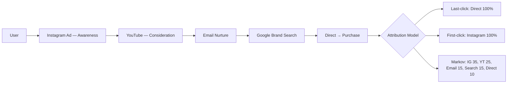
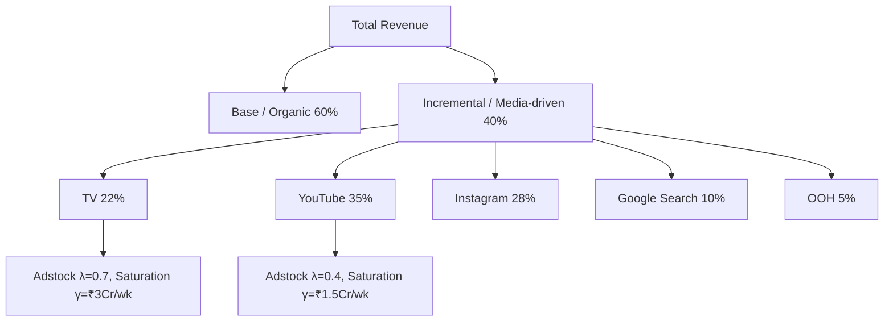
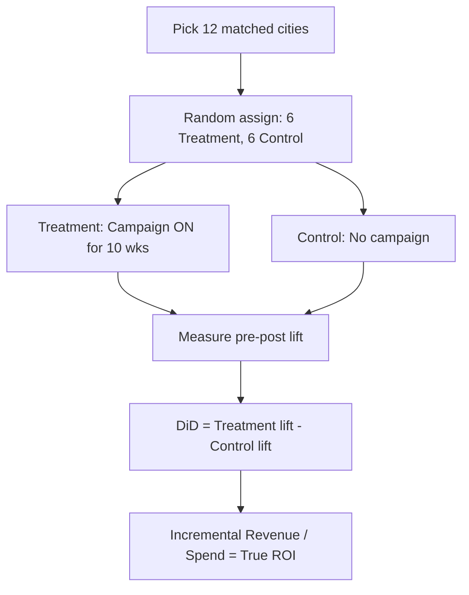
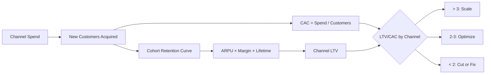
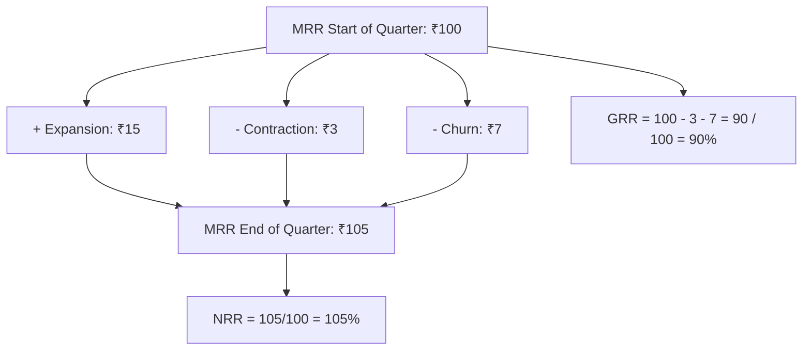
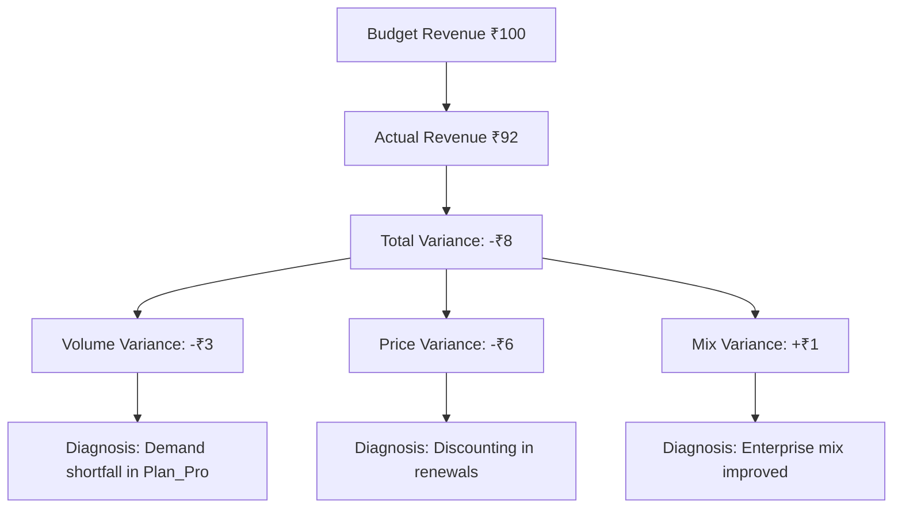
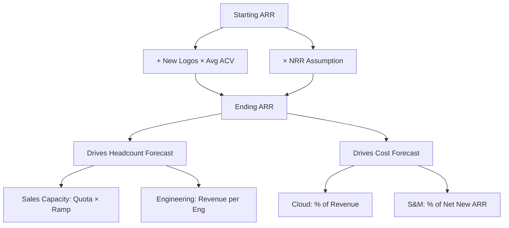
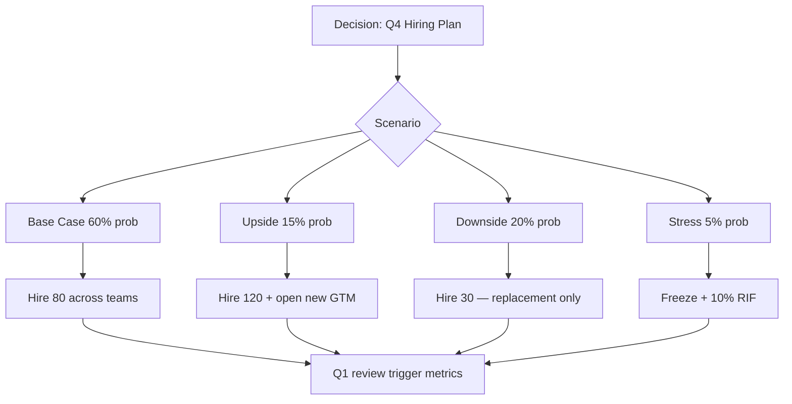

# Marketing & Finance Analytics

Marketing aur finance analytics ek subject mein? Kyunki dono CFO/CMO ki language bolte hain — ₹ first. CMO ka har campaign ek "investment" hai jiska ROI prove karna padta hai, aur CFO ka har forecast ek "marketing assumption" pe khada hota hai (acquisition rate, churn, payback). Top 2% analyst ye realize karta hai ki marketing spend aur finance variance ek hi sikke ke do pehlu hain — Razorpay ka attribution problem aur Razorpay ka NRR forecast same root data pe khade hain.

Ye subject tujhe sikhayega ki marketing channels ko fairly credit kaise dete hain (last-click ki bewakoofi se MMM aur incrementality tak), SaaS metrics jaise MRR/ARR/NRR ka real-life cohort math kya hota hai (BYJU'S ka NRR collapse iska cautionary tale hai), variance analysis (budget vs actual) ka muscle, aur scenario planning ka discipline. Indian unicorns ke real examples — Swiggy ka MMM, Lenskart ka D2C attribution, Meesho ka geo-experiment, Zoho/Freshworks/Postman ka SaaS metric stack — sab Hinglish mein, IIT depth ke saath. 12 ghante laga, ROI lifetime ka.

---

## 1. Marketing Attribution

Marketing attribution matlab — ek customer ne paisa diya, ab credit kis channel ko milega? Ye ₹100Cr ka question hai literally. Galat attribution = galat budget allocation = ₹ ka rakhwala fail.

### 1.1 Last-click, first-click, multi-touch attribution

#### Definition (kya hai?)

Attribution models batate hain ki conversion ka credit kaunse touchpoint ko milega. Ek typical user 7-12 touchpoints hit karta hai before converting (Google search → Instagram ad → email → YouTube → direct → purchase). Pure ka credit kis ko?

- **Last-click** — last touchpoint gets 100% credit. Default in Google Analytics, simple, but fundamentally biased towards bottom-funnel channels (brand search, direct).
- **First-click** — first touchpoint gets 100% credit. Top-funnel ke liye fair, but neglects nurture.
- **Linear** — sab touchpoints ko equal credit. Easy but naive.
- **Time-decay** — recent touchpoints ko zyada weight. Exponential decay.
- **Position-based (U-shaped)** — first 40%, last 40%, middle 20% distributed. Marketing-led nurture ke liye decent.
- **Data-driven (Markov, Shapley)** — algorithmic, removal-effect based. Top 2% ka territory.

#### Why?

Last-click model Indian D2C brands ka biggest budget killer hai. Lenskart ka analyst dekhega — "Google brand search 40% conversions drive kar raha hai" — aur CMO branded search pe ₹2Cr daal dega. Reality? Google brand search sirf demand capture kar raha hai jo upstream Instagram + YouTube ne create ki thi. Attribution galat = budget galat = growth stalls.

#### How?

Markov chain attribution Python mein — removal effect approach.

```python
import pandas as pd
import numpy as np
from collections import defaultdict

# Sample touchpoint paths: each user's journey before conversion (1) or drop (0)
paths = [
    (['Instagram', 'Google_Search', 'Direct'], 1),
    (['YouTube', 'Email', 'Google_Search'], 1),
    (['Instagram', 'Direct'], 0),
    (['Google_Search'], 1),
    (['YouTube', 'Instagram', 'Email'], 0),
]

# Build transition matrix
transitions = defaultdict(lambda: defaultdict(int))
for path, converted in paths:
    states = ['Start'] + path + ['Conversion' if converted else 'Null']
    for i in range(len(states) - 1):
        transitions[states[i]][states[i+1]] += 1

# Normalize to probabilities
def normalize(t):
    probs = {}
    for src, dests in t.items():
        total = sum(dests.values())
        probs[src] = {d: c/total for d, c in dests.items()}
    return probs

trans_prob = normalize(transitions)

def conversion_prob(trans, removed=None):
    # Simulate Markov chain: P(reaching Conversion from Start)
    # Simplified: iterative reachability
    from functools import lru_cache
    @lru_cache(None)
    def p(state):
        if state == 'Conversion': return 1.0
        if state == 'Null' or state == removed: return 0.0
        return sum(prob * p(nxt) for nxt, prob in trans.get(state, {}).items())
    return p('Start')

baseline = conversion_prob(trans_prob)
channels = ['Instagram', 'Google_Search', 'YouTube', 'Email', 'Direct']
removal_effects = {ch: baseline - conversion_prob(trans_prob, removed=ch) for ch in channels}
total = sum(removal_effects.values())
attribution = {ch: re/total for ch, re in removal_effects.items()}
print(attribution)
```

#### Real-life Example

Lenskart D2C — analyst ne dekha last-click attribution mein "Direct" 35% conversions claim kar raha tha. Markov-based attribution chala — Direct ka actual incremental contribution sirf 12% nikla. Baaki 23% credit Instagram (top-funnel awareness) aur YouTube (consideration) ka tha. CMO ne ₹3.5Cr/quarter ka brand search budget shift kiya Reels + YouTube pe — 6 months mein new customer acquisition 28% up, blended CAC down 18%.

#### Diagram



#### Interview Question

**Q:** Tu Lenskart ka analyst hai. Last-click model dikhata hai brand search 40% conversions deti hai. CMO budget yahan double karna chahta hai. Tu kya bolega?

**A:** Brand search demand-capture channel hai, demand-generation nahi. Last-click usse over-credit deta hai because journey ke end pe yeh aata hai. Maine recommend kiya: (1) holdout test — ek city mein brand search pause karke organic conversion baseline measure karein; (2) Markov / Shapley-based data-driven attribution implement karein with at least 90 days of multi-touch path data; (3) saath mein incrementality test karein — geo-split, brand search on/off. Mere hypothesis: brand search ka 50-60% conversions woh hain jo without it bhi convert hote (cannibalization). Real incremental impact 15-20%. Budget agar shift ho YouTube + Instagram (upper-funnel) pe, 90-day lag ke baad blended CAC down hoga 15-20%. Memo mein expected uplift, test design, risk (brand defense vs competitors), aur 30-60-90 day plan dia.

---

### 1.2 Media Mix Modeling (MMM)

#### Definition (kya hai?)

MMM (Media Mix Modeling) ek statistical regression-based approach hai jisme tu time-series data lekar har marketing channel ka revenue contribution estimate karta hai. Cookie-less, privacy-friendly, top-down. Model:

$$Revenue_t = \beta_0 + \sum_{i} \beta_i \cdot Adstock_i(Spend_{i,t}) + \gamma \cdot Seasonality_t + \delta \cdot Macro_t + \epsilon_t$$

Key concepts:
- **Adstock** — ad ka effect time mein decay hota hai. $Adstock_t = Spend_t + \lambda \cdot Adstock_{t-1}$, where $\lambda \in (0,1)$.
- **Saturation (Hill / log curve)** — har channel ki diminishing returns. Doubling spend doesn't double revenue.
- **Base vs Incremental** — kya organic baseline hai (brand equity) aur kya media-driven incremental hai.

#### Why?

iOS 14.5 (ATT) ke baad cookie-based attribution dead ho gaya. Privacy-first world mein MMM hi reliable channel-level ROI deta hai. Swiggy, Zomato, BigBasket — sab quarterly MMM run karte hain to allocate ₹500-800Cr annual marketing budgets across TV, digital, OOH, performance.

#### How?

Adstock + saturation MMM Python mein — simplified.

```python
import numpy as np
import pandas as pd
from scipy.optimize import minimize

# Weekly data: spend per channel + revenue
df = pd.read_csv('mmm_weekly.csv')  # cols: week, tv_spend, ig_spend, yt_spend, revenue, holiday, price_index

def adstock(x, lam):
    out = np.zeros_like(x, dtype=float)
    out[0] = x[0]
    for t in range(1, len(x)):
        out[t] = x[t] + lam * out[t-1]
    return out

def hill(x, alpha, gamma):
    # Saturation curve: alpha = shape, gamma = half-saturation
    return x**alpha / (x**alpha + gamma**alpha)

def predict(params, df):
    lam_tv, lam_ig, lam_yt, a_tv, a_ig, a_yt, g_tv, g_ig, g_yt, b_tv, b_ig, b_yt, b0, b_hol = params
    tv = hill(adstock(df['tv_spend'].values, lam_tv), a_tv, g_tv)
    ig = hill(adstock(df['ig_spend'].values, lam_ig), a_ig, g_ig)
    yt = hill(adstock(df['yt_spend'].values, lam_yt), a_yt, g_yt)
    return b0 + b_tv*tv + b_ig*ig + b_yt*yt + b_hol*df['holiday'].values

def loss(params, df):
    pred = predict(params, df)
    return np.mean((df['revenue'].values - pred)**2)

x0 = [0.5]*3 + [1.0]*3 + [df[c].mean() for c in ['tv_spend','ig_spend','yt_spend']] + [1.0]*3 + [df['revenue'].mean(), 0.0]
res = minimize(loss, x0, args=(df,), method='Nelder-Mead', options={'maxiter': 5000})
print('Channel betas:', res.x[9:12])  # contribution coefficients
```

Production-grade MMM: Meta Robyn, Google Meridian, LightweightMMM — Bayesian priors, automated hyperparameter search.

#### Real-life Example

Swiggy 2023 ka MMM exercise — quarterly ₹180Cr marketing spend across TV, IG/FB, YouTube, Google search, OOH. MMM result: TV ka contribution 22% but ROI lowest (₹1.4 return per ₹1). YouTube ka ROI ₹4.2, IG ₹3.8. CMO ne TV budget 35% kam kiya, ₹40Cr digital pe shift — next quarter Instamart category mein 18% revenue uplift, blended marketing efficiency 26% better. MMM nahi hota toh ye ₹40Cr "TV brand build" mein bleed hota.

#### Diagram



#### Interview Question

**Q:** MMM aur multi-touch attribution (MTA) mein farak kya hai? Kab kaunsa use karega?

**A:** MTA user-level cookie/device data pe chalta hai — granular but iOS-killed aur offline channels (TV, OOH) capture nahi karta. MMM aggregate weekly time-series pe regress karta hai — captures TV, OOH, brand effects, but channel granularity weak (Instagram Reels vs Stories distinguish nahi kar paayega easily). Best practice — triangulation: MMM for top-down budget allocation across major channels (quarterly), MTA for tactical within-channel optimization (weekly), incrementality tests for ground-truth validation. Top 2% analyst teeno ka **unified measurement framework** banata hai — Bayesian priors MMM se MTA mein feed karke bias correct karta hai.

---

### 1.3 Incrementality testing & geo experiments

#### Definition (kya hai?)

Incrementality test = causal experiment to measure true incremental impact of marketing. Question: agar ye ad nahi chalata, kya conversion fir bhi hota? Methods:

- **Holdout test** — random user subset ko ad nahi dikhao (PSA placebo), compare conversion.
- **Geo experiment** — kuch cities mein channel on, kuch off. DiD (difference-in-difference) analysis.
- **Ghost ads / intent-to-treat** — auction simulation, kis user ko ad dikhna tha but artificial holdout.
- **Switchback tests** — same geo mein time periods alternate (treatment week, control week).

Statistical core: **DiD estimator** — $\hat{\tau} = (Y^{T}_{post} - Y^{T}_{pre}) - (Y^{C}_{post} - Y^{C}_{pre})$.

#### Why?

Attribution models correlation hain, incrementality causation. Last-click "Direct converted 35%" se zyada powerful hai "Direct off karne pe conversion sirf 4% giri — 31% naturally hota tha". Yahan se actual ROI nikalta hai. Meta, Google, TikTok sab "lift studies" platform-level offer karte hain — but unka apna bias hai (over-report incrementality), so independent geo-experiments gold standard hain.

#### How?

Geo-experiment DiD analysis Python mein.

```python
import pandas as pd
import statsmodels.formula.api as smf

# Geo-level weekly revenue: 8 treatment cities (channel ON), 8 control (channel OFF) for 8 weeks pre + 8 post
df = pd.read_csv('geo_experiment.csv')
# cols: city, week, revenue, treatment (0/1), post (0/1 — pre vs post launch)

# Difference-in-difference regression with city + week fixed effects
model = smf.ols(
    'revenue ~ treatment * post + C(city) + C(week)',
    data=df
).fit(cov_type='cluster', cov_kwds={'groups': df['city']})

print(model.summary())
# Coefficient on 'treatment:post' is the DiD lift estimate
lift = model.params['treatment:post']
ci = model.conf_int().loc['treatment:post']
print(f'Incremental lift per city per week: ₹{lift:,.0f} (95% CI: ₹{ci[0]:,.0f} to ₹{ci[1]:,.0f})')
```

#### Real-life Example

Meesho 2023 ka Tier-3 city push — ₹25Cr quarterly TV + regional language Instagram campaign. Incrementality test design: 12 matched-pair cities (paired on baseline GMV, demographics) — 6 treatment (campaign ON), 6 control (campaign OFF) for 10 weeks. DiD result: treatment cities mein incremental new-buyer GMV ₹3.8Cr per city per quarter (95% CI ₹2.9-4.7Cr), control flat. Total incremental lift = 6 × ₹3.8Cr = ₹22.8Cr on ₹25Cr spend — ROI 0.91. Borderline. CMO decision: shift to lower-cost regional digital, kill TV in Tier-3, redeploy ₹10Cr to Tier-2 where MMM showed higher saturation headroom.

#### Diagram



#### Interview Question

**Q:** Meta apne dashboard pe lift study chala raha hai aur 35% incremental lift dikha raha hai. Tu trust karega?

**A:** Skeptical rahunga. Platform-run lift studies mein 3 biases: (1) **selection bias** — control group accidentally exposed via cross-device/cookie matching gaps; (2) **measurement bias** — Meta apna own conversion definition use karta hai (modeled conversions, view-through credit); (3) **incentive misalignment** — Meta ka incentive hai high lift dikhana to retain spend. Mitigation: maine independent geo-experiment design karunga — cities matched on GMV/demographics, treatment-control split, DiD with city + week fixed effects, clustered SEs. Saath mein PSA holdout (placebo ad jo random users ko dikhaya jaaye) — ghost-ads style. Gold standard: pre-registered protocol with finance team sign-off on success criteria. Agar Meta ka 35% claim aur independent test 12-15% deta hai — that's the real number, baaki platform inflation hai.

---

### 1.4 CAC, LTV, payback by channel

#### Definition (kya hai?)

Channel-level unit economics. Aggregate CAC/LTV blended hota hai — average mein truth chhupti hai. Channel-level breakdown se pata chalta hai kaunsa channel scale-worthy hai.

- **Channel CAC** = (Channel spend) / (New customers attributed via that channel).
- **Channel LTV** = ARPU of that channel's cohort × gross margin × lifetime. Critically — channel-cohort-specific.
- **Payback period** = CAC / (monthly contribution margin per customer in that channel).
- **LTV/CAC ratio** = Healthy if > 3 in steady state. By channel — varies wildly.

KaTeX (SaaS standard):

$$LTV = ARPU \times \frac{1}{churn} \times GM\%$$

#### Why?

Blended LTV/CAC = 3 dikha sakta hai but agar Instagram channel pe 1.2 hai aur Google pe 5.5, tu Instagram pe ₹ jala raha hai, Google scale kar sakta tha. Channel-level cohort retention curves dekhe bina blended numbers se decision = mediocre analyst.

#### How?

```sql
-- Channel-level CAC, LTV, Payback (D2C brand example)
WITH new_customers AS (
  SELECT
    user_id,
    acquisition_channel,
    DATE_TRUNC('month', acquired_at) AS cohort_month,
    acquired_at
  FROM users
  WHERE acquired_at >= '2024-01-01'
),
channel_spend AS (
  SELECT
    channel,
    DATE_TRUNC('month', spend_date) AS cohort_month,
    SUM(spend_amount) AS total_spend
  FROM marketing_spend
  GROUP BY 1, 2
),
revenue_per_cohort AS (
  SELECT
    nc.acquisition_channel,
    nc.cohort_month,
    COUNT(DISTINCT nc.user_id) AS new_customers,
    SUM(o.gross_margin_amount) AS total_gm,
    SUM(o.gross_margin_amount) / NULLIF(COUNT(DISTINCT nc.user_id), 0) AS gm_per_customer
  FROM new_customers nc
  LEFT JOIN orders o
    ON o.user_id = nc.user_id
    AND o.created_at <= nc.acquired_at + INTERVAL '12 months'
  GROUP BY 1, 2
)
SELECT
  r.acquisition_channel,
  r.cohort_month,
  r.new_customers,
  s.total_spend / NULLIF(r.new_customers, 0) AS cac,
  r.gm_per_customer AS ltv_12m,
  (r.gm_per_customer / NULLIF(s.total_spend / NULLIF(r.new_customers, 0), 0)) AS ltv_cac_ratio,
  (s.total_spend / NULLIF(r.new_customers, 0)) / NULLIF(r.gm_per_customer / 12, 0) AS payback_months
FROM revenue_per_cohort r
JOIN channel_spend s
  ON r.acquisition_channel = s.channel
  AND r.cohort_month = s.cohort_month
ORDER BY r.cohort_month, ltv_cac_ratio DESC;
```

#### Real-life Example

Mamaearth (D2C) analyst ne channel-cohort analysis kiya: Instagram CAC ₹420, 12-month gross-margin LTV ₹980 → LTV/CAC = 2.3, payback 5.1 months. Influencer marketing CAC ₹680 but LTV ₹2150 (higher AOV + repeat) → LTV/CAC = 3.2, payback 3.8 months. Google search CAC ₹290 but LTV ₹650 (low repeat — utility buyers) → LTV/CAC = 2.2. Recommendation: influencer pe scale, Google maintain (defense), Instagram efficiency improve karo via creative testing. ₹1.5Cr/month reallocated, blended LTV/CAC went from 2.4 to 3.1 in 4 months.

#### Diagram



#### Interview Question

**Q:** Channel A: CAC ₹500, 12-mo LTV ₹1500. Channel B: CAC ₹1200, 12-mo LTV ₹4000. Kaunsa scale karega?

**A:** Surface pe Channel B ka LTV/CAC 3.33 vs Channel A's 3.0 — B better. Lekin teen aur factors check karunga: (1) **Payback** — A: 4 months, B: 3.6 months (assuming same monthly margin) — B still ahead, but cash-constrained company ke liye payback duration matters; (2) **Marginal CAC curve** — kya Channel B saturate ho gaya? Agar next ₹1Cr ka CAC ₹2000 ho jaayega (auction inflation), LTV/CAC drop kar 2 ho jaayegi. Channel A scalable headroom zyada ho sakta hai; (3) **Cohort decay** — kya recent cohorts ki LTV degrade ho rahi hai? Promo-led acquisition often shows this. Recommendation: marginal LTV/CAC by spend tier dekhna padega, dono channels mein incremental ₹1Cr scale karke true expansion ROI measure karna padega. Single-point average se decision ≠ top 2%.

---

## 2. Finance & SaaS Metrics

SaaS metrics CFO aur board ki bhasha hain. Tu agar SaaS analyst hai aur MRR/NRR cohort math nahi samajhta — tu inviting embarrassment in next board prep.

### 2.1 MRR, ARR, NRR, GRR, churn, expansion

#### Definition (kya hai?)

SaaS subscription business ke core metrics:

- **MRR (Monthly Recurring Revenue)** = Sum of all active monthly subscriptions, normalized to monthly. Annual plan ₹12,000 → MRR contribution ₹1,000.
- **ARR (Annual Recurring Revenue)** = MRR × 12. Reported metric for SaaS valuations.
- **GRR (Gross Revenue Retention)** = $\frac{MRR_{start} - Churn - Downgrades}{MRR_{start}}$. Excludes expansion. Healthy: > 90% mid-market, > 95% enterprise.
- **NRR (Net Revenue Retention)** = $\frac{MRR_{start} - Churn - Downgrades + Expansion}{MRR_{start}}$. Includes upsells/cross-sells. Holy grail metric. > 100% means cohort grows even without new logos. Best-in-class > 120%.
- **Logo churn** = Customers lost / Customers at start. Different from $-churn.
- **Expansion MRR** = Existing customers ka upgrade/cross-sell se MRR gain.

KaTeX:

$$NRR = \frac{MRR_{start} + Expansion - Contraction - Churn}{MRR_{start}}$$

#### Why?

NRR is the single most important SaaS metric per top VCs (a16z, Bessemer). 130% NRR matlab tu zero new customer acquire bhi kare to revenue compound karega. < 100% matlab tu treadmill pe daud raha hai — har month new sales karne padenge sirf flat rehne ke liye. Indian SaaS comparison: Postman ~115% NRR (developer love + team expansion), Freshworks ~108%, Zoho privately reports > 110% on core CRM. BYJU'S ka NRR 2022 mein 60s mein gir gaya — refund waves + churn — woh "growth at any cost" mindset ka cautionary tale.

#### How?

Cohort-based NRR in SQL — quarterly cohort tracking.

```sql
-- NRR by cohort: track each starting cohort's MRR through subsequent quarters
WITH cohort_start AS (
  -- For each customer, their MRR at the start of their cohort quarter
  SELECT
    customer_id,
    DATE_TRUNC('quarter', subscription_start_date) AS cohort_quarter,
    SUM(monthly_recurring_revenue) AS starting_mrr
  FROM subscriptions
  WHERE status = 'active' AND subscription_start_date <= DATE_TRUNC('quarter', subscription_start_date) + INTERVAL '1 month'
  GROUP BY 1, 2
),
mrr_snapshot AS (
  -- For each customer, MRR at the end of each subsequent quarter
  SELECT
    s.customer_id,
    DATE_TRUNC('quarter', d.snapshot_date) AS snapshot_quarter,
    SUM(CASE WHEN s.status = 'active' THEN s.monthly_recurring_revenue ELSE 0 END) AS current_mrr
  FROM subscriptions s
  CROSS JOIN (SELECT generate_series('2023-01-01'::date, '2026-01-01', '3 months') AS snapshot_date) d
  WHERE s.subscription_start_date <= d.snapshot_date
    AND (s.subscription_end_date IS NULL OR s.subscription_end_date > d.snapshot_date)
  GROUP BY 1, 2
)
SELECT
  cs.cohort_quarter,
  ms.snapshot_quarter,
  COUNT(DISTINCT cs.customer_id) AS cohort_size,
  SUM(cs.starting_mrr) AS starting_mrr,
  SUM(ms.current_mrr) AS current_mrr,
  ROUND(100.0 * SUM(ms.current_mrr) / NULLIF(SUM(cs.starting_mrr), 0), 1) AS nrr_pct
FROM cohort_start cs
LEFT JOIN mrr_snapshot ms ON ms.customer_id = cs.customer_id AND ms.snapshot_quarter >= cs.cohort_quarter
GROUP BY 1, 2
ORDER BY 1, 2;
```

#### Real-life Example

Postman 2023 cohort analysis: Q1 2022 enterprise cohort starting MRR ₹4.8Cr/month. After 6 quarters: churn -₹0.4Cr (8.3%), contraction -₹0.2Cr (downgrade plans), expansion +₹1.6Cr (more dev seats added as orgs scaled) — ending MRR ₹5.8Cr → NRR 121%. CFO board memo: "Land and expand model proven — har enterprise customer 18 months mein 1.45x revenue, even without new logos."

Counter-example: BYJU'S 2022 — aggressive sales tactics se signed customers refund/churn maange, NRR collapsed to ~65%, leading to ₹4500Cr+ revenue restatement. Lesson: NRR sirf metric nahi, customer-fit ka thermometer hai.

#### Diagram



#### Interview Question

**Q:** Tu Freshworks ka analyst hai. NRR 95% hai. Board ne pucha "Postman ka 115%, hum 95% pe kyu? Diagnose karo."

**A:** NRR ko teen levers mein decompose karunga: gross retention (1 - churn), expansion rate, contraction rate. Postman 115% = ~95% GRR + ~22% expansion - ~2% contraction. Freshworks 95% = maybe 88% GRR + 12% expansion - 5% contraction. Diagnosis: (1) **GRR gap** — Freshworks ke SMB-heavy customers ka churn rate naturally higher (8-12%) vs Postman ke developer-team adoption (sticky, low churn). Fix: ICP refinement, customer success investment in mid-market+; (2) **Expansion gap** — Freshworks single-product expansion (Freshdesk → Freshsales cross-sell) needs sales motion; Postman natural seat expansion (more devs join → auto-upgrade). Fix: usage-based pricing, multi-product bundle pricing, in-app upsell triggers; (3) **Contraction** — annual renewals pe customers downgrade plans. Fix: ARR commit incentives, value reviews 60 days pre-renewal. Expected NRR uplift in 4 quarters: 95% → 105-108%.

---

### 2.2 Variance analysis — budget vs actual

#### Definition (kya hai?)

Variance analysis = budget (planned) vs actual (real) ka systematic comparison. Har month/quarter end pe FP&A team P&L ke har line item ka variance calculate karti hai. Three flavors:

- **Volume variance** = (Actual Volume - Budget Volume) × Budget Price/Unit
- **Price variance** = (Actual Price - Budget Price) × Actual Volume
- **Mix variance** = portfolio composition ke change ka effect

KaTeX:

$$Total\ Variance = (Actual_{vol} \times Actual_{price}) - (Budget_{vol} \times Budget_{price})$$

Decomposition: $Total = Volume\ Var + Price\ Var + Mix\ Var$.

#### Why?

CFO board meeting mein "revenue 10% miss" sunenge nahi — woh pucchenge "miss kya volume drop tha (demand issue) ya pricing realization (discounting/competition) ya product mix shift?" Top 2% analyst variance bridges banata hai jo har ₹ ka exact source explain kare. Ye distinguishes financial analyst from data analyst.

#### How?

```python
import pandas as pd

# Budget vs Actual data
df = pd.DataFrame({
    'product': ['Plan_Pro', 'Plan_Enterprise', 'Plan_Starter'],
    'budget_volume': [1000, 200, 5000],
    'budget_price': [3000, 25000, 500],
    'actual_volume': [950, 240, 5200],
    'actual_price': [2850, 24000, 540],
})

df['budget_revenue'] = df['budget_volume'] * df['budget_price']
df['actual_revenue'] = df['actual_volume'] * df['actual_price']
df['total_variance'] = df['actual_revenue'] - df['budget_revenue']

# Decomposition (using budget price for volume var, actual volume for price var)
df['volume_variance'] = (df['actual_volume'] - df['budget_volume']) * df['budget_price']
df['price_variance'] = (df['actual_price'] - df['budget_price']) * df['actual_volume']

print(df[['product', 'total_variance', 'volume_variance', 'price_variance']])

# Mix variance — when product mix shifts: actual mix at budget price - budget mix at budget price (× total actual volume)
total_actual = df['actual_volume'].sum()
total_budget = df['budget_volume'].sum()
df['actual_mix'] = df['actual_volume'] / total_actual
df['budget_mix'] = df['budget_volume'] / total_budget
df['mix_variance'] = (df['actual_mix'] - df['budget_mix']) * total_actual * df['budget_price']
print('\nWith mix decomposition:')
print(df[['product', 'volume_variance', 'price_variance', 'mix_variance']])
```

#### Real-life Example

Zoho FY24 Q3 — revenue budget ₹820Cr, actual ₹785Cr → ₹35Cr unfavorable variance. CFO board memo se pehle analyst ne decompose kiya:
- Volume variance: -₹12Cr (Enterprise deals shifted Q4)
- Price variance: -₹28Cr (competitive pricing pressure on Asia-Pacific renewals)
- Mix variance: +₹5Cr (higher proportion of high-margin CRM Plus bundle)

Action: pricing committee formed, Asia-Pacific CSM team strengthened, Q4 forecast revised down ₹25Cr but mix favorability preserved. Without decomposition, board panic + wrong remediation. With decomposition, surgical fix.

#### Diagram



#### Interview Question

**Q:** Revenue actual budget se 8% kam hai. Tu CFO ko kya present karega?

**A:** Pure 8% miss as flat number useless hai. Maine variance bridge banaya: starting budget → minus volume variance → minus price variance → plus/minus mix variance → actual. Each line with diagnosis. Example deck slide: "Budget ₹100Cr → Actual ₹92Cr = -₹8Cr. Decomposition: volume -₹3Cr (Tier-2 city slowdown, macro), price -₹6Cr (competitive renewal discounts in 14 enterprise accounts), mix +₹1Cr (Pro tier adoption better than expected). Recommended actions: (1) Tier-2 inside-sales push to recover ₹2Cr in Q4; (2) renewal pricing council to halt discount creep — ₹4Cr at-risk renewals identified; (3) Pro tier marketing double-down — already accretive." 1 page, 3 bullets, ₹ impact each. CFO approves in 10 minutes.

---

### 2.3 Forecasting — revenue, headcount, costs

#### Definition (kya hai?)

Forecasting = future kya hoga ka structured prediction. Three layers:

- **Revenue forecast** — driver-based: New ARR + Expansion - Churn = Net New ARR. Bottom-up from sales pipeline (weighted by stage probability) + top-down from marketing-funnel forecasts.
- **Headcount forecast** — sales capacity model (quota × ramp × productivity), engineering capacity (project staffing), G&A scale ratios.
- **Cost forecast** — fixed (rent, base salaries) + variable (cloud, sales commissions, marketing). Tied to revenue forecast assumptions.

Methods:
- **Time-series** — ARIMA, Prophet, exponential smoothing for stable patterns
- **Driver-based** — explicit assumptions (CAC, win rate, ramp time)
- **Cohort-based** — projected NRR × existing cohorts + new logo additions
- **Pipeline-weighted** — Stage 1: 10%, Stage 2: 30%, Stage 3: 60%, Closed-Won: 100%

#### Why?

Forecast accuracy CFO ki credibility hai. ±5% accuracy = trusted; ±15% = board loses confidence. Public SaaS companies (Freshworks listed) ka stock har quarter forecast vs actual pe 10-20% move karta hai. Internal forecasting equally consequential — hiring plans, fundraising timing, runway calculations sab forecast pe khade.

#### How?

Driver-based revenue forecast in Python.

```python
import pandas as pd
import numpy as np

# SaaS revenue forecast: 6 quarters ahead
def forecast_arr(starting_arr, quarters=6,
                 quarterly_new_logos=80, avg_acv=600000,
                 nrr=1.10, gross_churn=0.08):
    # nrr is annual; convert to quarterly
    quarterly_nrr = nrr ** 0.25
    quarterly_gross_churn = 1 - (1 - gross_churn) ** 0.25

    forecast = []
    arr = starting_arr
    for q in range(1, quarters + 1):
        # Existing cohort: applies NRR
        existing_after_retention = arr * quarterly_nrr
        # New logos this quarter
        new_arr = quarterly_new_logos * avg_acv
        ending_arr = existing_after_retention + new_arr
        forecast.append({
            'quarter': f'Q+{q}',
            'starting_arr': arr,
            'retained_expanded': existing_after_retention,
            'new_arr': new_arr,
            'ending_arr': ending_arr,
            'qoq_growth': (ending_arr / arr - 1) * 100
        })
        arr = ending_arr
    return pd.DataFrame(forecast)

f = forecast_arr(starting_arr=180_00_00_000)  # ₹180Cr ARR
print(f.to_string(index=False))

# Sensitivity: what if NRR drops to 100%?
f_low = forecast_arr(starting_arr=180_00_00_000, nrr=1.00)
print('\nLow NRR scenario:')
print(f_low[['quarter', 'ending_arr', 'qoq_growth']].to_string(index=False))
```

#### Real-life Example

Freshworks FY24 internal forecast: starting ARR $640M, quarterly new ARR target $25M (from 70 enterprise logos × $360K avg), NRR 108%. Forecast 4 quarters ahead → $760M ARR. Actual landed $748M — 1.6% miss, mostly due to one large customer downgrade (NRR realized 106.5%). FP&A team's accuracy → board trust → smoother fundraising conversations. Compare to BYJU'S internal forecasts pre-collapse — overoptimistic NRR assumptions (95%+ when actual was sub-70%) drove ₹2000Cr hiring decisions that later required mass layoffs.

#### Diagram



#### Interview Question

**Q:** Tu CFO ko 3-year revenue forecast build karke de raha hai. Kya assumptions transparently expose karega aur kyu?

**A:** Forecast = math + assumptions. Top mistake: forecast ko single number share karna — black box. Maine forecast ko driver-decomposed deta hoon: (1) **Top-of-funnel** assumption — quarterly leads, conversion to opportunity rate, win rate, deal size — har ek pe historical baseline + change rationale; (2) **Retention** assumption — gross churn, expansion rate, NRR — by segment (SMB vs enterprise often differ 20+ points); (3) **Pricing** — list price changes, discounting trend; (4) **Macro** — INR/USD if export-heavy, sector growth rate. Each assumption gets sensitivity bands (best/base/worst). CFO ko 3 scenarios deta — base case, +20% upside (high NRR + new product launch), -25% downside (macro slowdown). Transparency builds trust — agar assumption miss ho jaaye, blame na lage; learning iteratively refine ho. BYJU'S ka mistake — assumptions opaque rahe, board ne implicitly believe kiya, collapse mein recovery muddled. Top 2% analyst assumptions ko first-class citizens treat karta hai.

---

## 3. Scenario & Sensitivity Planning

### 3.1 Scenario planning, sensitivity analysis

#### Definition (kya hai?)

- **Scenario planning** = explicit alternative futures consider karna. Common: Base case, Upside case (+15-20%), Downside case (-20-30%), Stress case (catastrophic — funding winter, regulatory shock). Each with internally consistent assumption set.
- **Sensitivity analysis** = ek key variable ko vary karke output (revenue, EBITDA, runway) pe impact measure karna. Tornado chart ke through visualize. Identifies which assumptions are "load-bearing" (high impact) vs "decorative" (low impact).
- **Monte Carlo simulation** = saari assumptions ko probability distributions assign karke 10,000+ simulations chala ke output distribution generate karna. Risk-adjusted decision-making ka backbone.

KaTeX (sensitivity elasticity):

$$Sensitivity_{var} = \frac{\partial Output}{\partial Input_{var}} \cdot \frac{Input_{var}}{Output}$$

#### Why?

Single-point forecasts dangerous hote hain — false precision. CFO/CEO ko "kya ho sakta hai aur har case mein hum kya karenge" prepared hoke jaana padta hai board mein. Indian context mein 2022 funding winter ne bahut companies ko caught off-guard kara because scenario planning skip ki thi. Top operators (Razorpay, CRED, Zoho) regular scenario reviews karte hain — quarterly base/upside/downside refresh + monthly sensitivity reruns.

#### How?

Monte Carlo simulation Python mein for SaaS runway.

```python
import numpy as np
import pandas as pd

np.random.seed(42)

def simulate_runway(n_sims=10000):
    results = []
    for _ in range(n_sims):
        # Sample assumptions from distributions
        starting_cash = 200_00_00_000  # ₹200Cr
        starting_mrr = 18_00_00_000     # ₹18Cr/mo
        # Quarterly NRR — Beta distribution centered at 105%
        nrr_quarterly = np.random.beta(50, 47.5)  # mean ~0.5128, scaled
        nrr_quarterly = 1.0 + (nrr_quarterly - 0.5128) * 0.3  # range ~95-115%
        # New ARR per month — normal distribution
        new_mrr_monthly = np.random.normal(2_50_00_000, 50_00_00)  # ₹2.5Cr ± ₹0.5Cr
        # Monthly burn — normal
        monthly_burn = np.random.normal(15_00_00_000, 1_50_00_000)  # ₹15Cr ± ₹1.5Cr

        cash = starting_cash
        mrr = starting_mrr
        months = 0
        while cash > 0 and months < 60:
            # MRR evolution
            mrr = mrr * (nrr_quarterly ** (1/3)) + new_mrr_monthly
            # Cash burn (revenue offsets some burn)
            net_burn = monthly_burn - mrr * 0.8  # 80% gross margin
            cash -= max(net_burn, 0)
            months += 1
        results.append(months)

    df = pd.DataFrame({'runway_months': results})
    print(f"Median runway: {df.runway_months.median():.1f} months")
    print(f"P10 (downside): {df.runway_months.quantile(0.1):.1f} months")
    print(f"P90 (upside): {df.runway_months.quantile(0.9):.1f} months")
    print(f"Probability of <12 month runway: {(df.runway_months < 12).mean()*100:.1f}%")
    return df

simulate_runway()
```

#### Real-life Example

Razorpay 2022 scenario planning exercise (post-RBI payment aggregator licensing changes):

- **Base case**: licensing cleared in 6 months, TPV grows 35% YoY, MDR stable. Revenue ₹1800Cr.
- **Upside**: licensing in 4 months + RuPay credit-card-on-UPI pickup. Revenue ₹2200Cr.
- **Downside**: licensing delays 12 months, new merchant onboarding paused, TPV growth slows to 12%. Revenue ₹1350Cr.
- **Stress**: licensing rejection, TPV declines 8%, mass exodus. Revenue ₹950Cr.

Sensitivity tornado: TPV growth (±₹400Cr swing) > MDR (±₹250Cr) > merchant churn (±₹180Cr) > cost ratio (±₹120Cr). Decision: hiring frozen for non-critical roles in downside trigger ($licensing delay > 8 months$), enterprise capital product accelerated as MDR-independent revenue stream. Result: actual outcome between base and downside, runway protected, no layoffs needed unlike many peers.

#### Diagram



#### Interview Question

**Q:** CFO ne bola "next FY ka revenue forecast de" — tu single number doge ya scenarios? Defend.

**A:** Single number CFO ke liye operational simplicity hai but planning ke liye dangerous. Maine deliverable triple-layered banaya: (1) **Base case** with explicit assumptions documented — top-line single number for budget commitment; (2) **Sensitivity analysis** — top 5 assumptions ko ±20% vary karke tornado chart, dikhata hai kaunse drivers truly matter; (3) **Scenario set** — base, upside, downside, stress with internally consistent assumption bundles, each tied to actionable triggers (e.g., "if MoM new ARR < ₹1.8Cr for 2 consecutive months, switch to downside playbook"). CFO se ek hour mein agree karwata: budget single number pe build hota hai, but board / investor communication mein sensitivity bands appear karte hain (under-promise, over-deliver). Operating reviews mein scenario re-evaluation quarterly. Ye discipline 2022 mein Razorpay, CRED ne maintained kiya, BYJU'S ne nahi — outcome differential public knowledge hai. Top 2% analyst forecast ko ek "living document" treat karta hai with explicit branches, not a static number.

---

> **Bottom line:** Marketing aur finance analytics ka common thread — har metric ka rupee impact, har assumption ka transparent, har decision ka scenario-tested. Last-click attribution se MMM tak, MRR cohort se NRR forecast tak, budget variance se Monte Carlo runway tak — ye sab ek hi philosophy serve karte hain: business ko probabilistic, decomposable, defensible bana ke chalana. Tu agar ye 12 ghante laga, tu CFO aur CMO dono ki language fluently bolega — woh skill 95% data analysts ke paas nahi hai, aur wahin top 2% ka moat banta hai.
