# ML for Analysts

Tu data scientist nahi banna chahta — but baseline model bana lena top 2% ka skill hai. Interpretation > deployment. Dekh bhai, ye subject ka pura point yahi hai — tu Kaggle grandmaster nahi banne wala, tu PhD thesis nahi likhne wala. But jab CMO pucche "kaunse customers next month churn karenge?" ya CFO pucche "next quarter ka revenue forecast kya hai aur confidence interval kya hai?" — tu blank face nahi de sakta. Ek baseline logistic regression, ek random forest, ek SHAP plot — ye teen cheezein tujhe baaki 98% analysts se alag kar deti hain.

ML for analysts ka mantra simple hai: **interpretable models > black-box accuracy**. Tu agar ek 92% accuracy ka XGBoost banaata hai jiska coefficient explain nahi kar sakta vs 88% logistic regression jiske har feature ka odds ratio tu CMO ko 2 minute mein samjha sakta hai — top 2% analyst doosra wala chooses, har baar. Iss subject mein hum regression families, tree-based models, evaluation discipline, aur 5 practical use cases (churn, LTV, forecasting, segmentation, anomaly detection) cover karenge — sab Indian unicorn context ke saath. Ek section ye bhi hai jo zyada important hai: **kab ML use NAHI karna hai**. Kyunki 60% ML projects fail hote hain aur reason aksar ye hota hai ki SQL se 90% kaam ho raha tha aur tu fancy banane ke chakkar mein 6 months waste kar diya.

---

## 1. Regression Models

Regression analyst ka bread and butter hai. Tu agar XGBoost seekh leta hai but linear regression ka adjusted R-squared interpret nahi kar sakta — tu interview mein out ho jaayega. Regression family ke 4 pillar hain — linear, multiple, logistic, regularized — har ek alag use case ke liye.

### 1.1 Linear regression — assumptions, interpretation

#### Definition (kya hai?)

Linear regression ek dependent variable $y$ ko ek ya zyada independent variables $x$ ke linear combination ke through predict karta hai. Equation:

$$y = \beta_0 + \beta_1 x_1 + \beta_2 x_2 + \cdots + \beta_n x_n + \epsilon$$

Yahan $\beta_0$ intercept, $\beta_i$ coefficients (slopes), aur $\epsilon$ random error term hai jo $\mathcal{N}(0, \sigma^2)$ assumed hota hai. Goal — sum of squared residuals minimize karna: $\min \sum_{i=1}^{n} (y_i - \hat{y}_i)^2$.

Five core assumptions (LINEAR mnemonic): **L**inearity (relationship linear hai), **I**ndependence (errors independent), **N**ormality (errors normally distributed), **E**qual variance / homoscedasticity (errors ka variance constant), **A**ll predictors no perfect multicollinearity, plus no outliers dominating.

#### Why?

Linear regression interpretable hai — har coefficient batata hai "agar $x_1$ 1 unit badh jaaye, $y$ kitna badhega holding others constant". CMO ke liye ye golden hai. Tu agar bolta hai "ad spend pe $\beta = 0.32$ matlab har ₹1L extra ad spend pe ₹32K incremental revenue" — woh 5 second mein samajh jaata hai. XGBoost ke "feature importance" se ye conversation possible nahi.

#### How? (Python)

```python
import pandas as pd
import numpy as np
import statsmodels.api as sm
from sklearn.linear_model import LinearRegression
from sklearn.model_selection import train_test_split

# Swiggy: predict order GMV from user features
df = pd.read_csv("swiggy_orders.csv")
X = df[["user_age_days", "past_orders", "avg_basket_size", "city_tier", "promo_used"]]
y = df["gmv"]

X_train, X_test, y_train, y_test = train_test_split(X, y, test_size=0.2, random_state=42)

# statsmodels for full diagnostic output
X_train_sm = sm.add_constant(X_train)
model = sm.OLS(y_train, X_train_sm).fit()
print(model.summary())  # coefficients, p-values, R², F-stat, residual diagnostics

# Interpretation: model.params["past_orders"] = 12.4 means
# har ek extra past order GMV ko ₹12.4 se increase karta hai (holding others constant)

# Assumption checks
residuals = model.resid
fitted = model.fittedvalues
# Homoscedasticity: residuals vs fitted plot flat hona chahiye
# Normality: Shapiro-Wilk on residuals
from scipy.stats import shapiro
print(shapiro(residuals))
```

#### Real-life Example

Zomato dining team ne linear regression banaya jisme dependent variable "weekly reservations per restaurant" tha, aur predictors: ratings, price band, cuisine, city tier, photos count, delivery overlap. Coefficient interpretation: ratings ka $\beta = 18.2$ — har 0.1 star rating bump → ~1.8 extra reservations/week. Photos count ka $\beta = 0.8$ — har extra photo +0.8 reservations. Restaurant partner team ko ye actionable advice de paaye: "5 high-quality photos add karo aur rating 4.0 → 4.2 le aao, expected uplift +12 reservations/week." Black-box model se ye conversation impossible thi.

#### Diagram

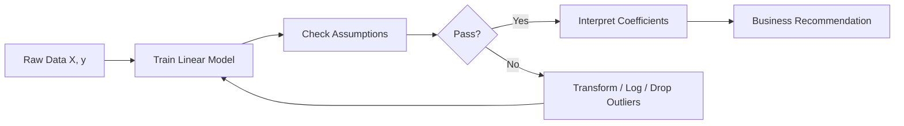

#### Interview Question

**Q:** Tu linear regression chala raha hai aur R-squared 0.85 aaya — but residual plot mein clear funnel shape dikh raha hai. Kya problem hai aur kaise fix karega?

**A:** Funnel shape (residuals expand karte fitted values ke saath) heteroscedasticity indicate karta hai — equal variance assumption violate hai. R-squared high hone se model "right" nahi banta — coefficients ke standard errors galat estimate honge, p-values misleading honge. Fix options: (a) **log transformation** on $y$ — agar $y$ skewed hai (revenue, GMV usually log-normal), $\log(y)$ predict karo; (b) **weighted least squares** — high-variance regions ko down-weight karo; (c) **robust standard errors** (Huber-White) — coefficients same, SEs corrected; (d) check if missing non-linear feature (e.g., $x^2$). Top 2% analyst pehle log-transform try karta hai because business data (revenue, orders, user counts) almost always log-normal hota hai — fix simple, interpretation translate hoti hai "% change" mein.

---

### 1.2 Multiple regression, multicollinearity, VIF

#### Definition (kya hai?)

Multiple regression matlab 2 ya zyada predictors ke saath linear regression. Problem aati hai jab predictors aapas mein highly correlated hote hain — **multicollinearity**. Ye coefficients ko unstable banaata hai — ek predictor thoda hila do, doosre ka coefficient flip ho jaata hai.

**Variance Inflation Factor (VIF)** measures kitna ek predictor explained hai by other predictors:

$$\text{VIF}_j = \frac{1}{1 - R_j^2}$$

jahan $R_j^2$ aata hai $x_j$ ko regress karne se baaki predictors pe. Rule of thumb: VIF > 5 problematic, VIF > 10 serious.

#### Why?

Multicollinearity ke chakkar mein tu galat business advice dega. Example: tu Razorpay merchant revenue predict kar raha hai with both `total_transactions` aur `total_volume` — ye 0.95 correlated hain. Coefficients flip kar sakte hain — ek positive, ek negative — aur tu CMO ko bolega "transactions badhao, volume kam karo" — total bullshit advice. VIF check karne se ye bach jaata hai.

#### How? (Python)

```python
import pandas as pd
from statsmodels.stats.outliers_influence import variance_inflation_factor

# Razorpay: predict merchant monthly revenue
df = pd.read_csv("razorpay_merchants.csv")
X = df[["total_txns", "total_volume", "avg_ticket", "active_days", "kyc_complete", "tier"]]

# VIF for each predictor
vif_df = pd.DataFrame()
vif_df["feature"] = X.columns
vif_df["VIF"] = [variance_inflation_factor(X.values, i) for i in range(X.shape[1])]
print(vif_df.sort_values("VIF", ascending=False))

# Output example:
# feature        VIF
# total_volume   24.3   <- highly collinear with total_txns
# total_txns     22.1
# avg_ticket      8.2   <- moderate
# active_days     2.1   <- fine
# tier            1.4
# kyc_complete    1.1

# Fix: drop one of the collinear pair OR create derived feature
X["volume_per_txn"] = X["total_volume"] / X["total_txns"]
X = X.drop(columns=["total_volume"])  # keep total_txns, drop volume
```

#### Real-life Example

Paytm ka analyst merchant LTV predict kar raha tha — features mein `total_txns_lifetime`, `total_gmv_lifetime`, `avg_monthly_txns`, `avg_monthly_gmv` sab daal diye. R² 0.91 — par coefficients absurd: `avg_monthly_gmv` ka $\beta$ negative aaya. VIF check kiya — 4 features sab >15. Fix kiya — sirf `avg_monthly_txns` aur `avg_ticket_size` rakhe (uncorrelated derived features). R² 0.87 aa gaya — slightly lower, but coefficients sane: txns positive, ticket size positive. CMO ko clean advice mil gayi: "merchant ko higher ticket categories pe push karo (e.g., utility bill payments) — har ₹1 ticket increase = ₹X LTV uplift."

#### Diagram

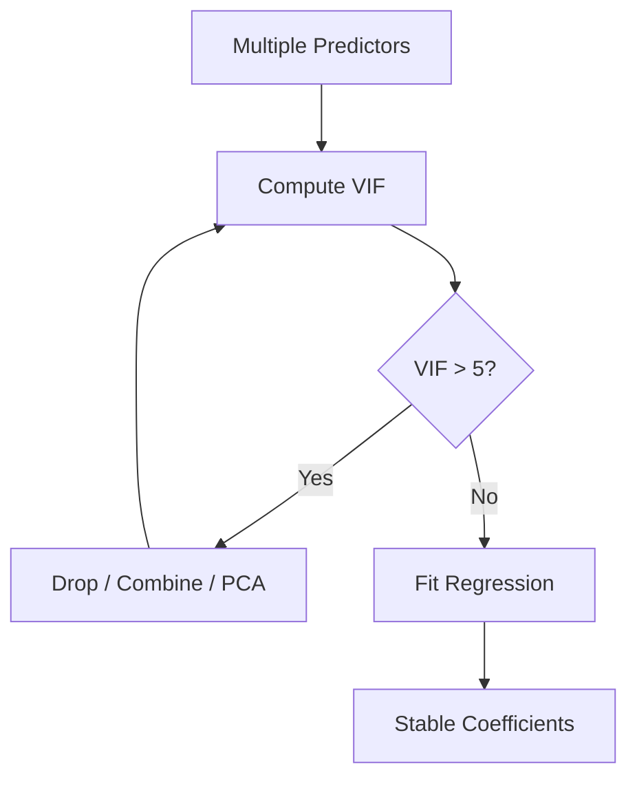

#### Interview Question

**Q:** Multicollinearity model ki predictive accuracy ko kitna hurt karti hai?

**A:** Ye trick question hai. Multicollinearity **prediction accuracy ko kam nahi karti** — out-of-sample predictions same rahti hain agar correlation pattern train aur test mein same ho. Multicollinearity sirf **coefficient stability aur interpretability** ko hurt karti hai — SEs inflate hote hain, individual feature ka p-value insignificant lag sakta hai jabki overall model strong hai. So agar tu sirf prediction kar raha hai (e.g., revenue forecast) — multicollinearity ignore kar sakta hai. Agar tu causal interpretation karna chahta hai (har feature ka individual impact CMO ko explain karna hai) — VIF check mandatory hai. Top 2% analyst dono cases distinguish karta hai aur conversation ke according VIF strictness adjust karta hai.

---

### 1.3 Logistic regression — coefficient interpretation

#### Definition (kya hai?)

Logistic regression binary outcome ($y \in \{0, 1\}$) ke liye use hota hai — churn ya not, fraud ya not, convert ya not. Model probability output deta hai using sigmoid:

$$P(y=1 \mid x) = \frac{1}{1 + e^{-(\beta_0 + \beta_1 x_1 + \cdots + \beta_n x_n)}}$$

Equivalently, log-odds (logit) linear hai:

$$\log\left(\frac{p}{1-p}\right) = \beta_0 + \beta_1 x_1 + \cdots + \beta_n x_n$$

Coefficient interpretation: $e^{\beta_i}$ = odds ratio. Agar $\beta_i = 0.4$, then $e^{0.4} \approx 1.49$ — feature 1 unit increase = odds 49% increase.

#### Why?

Churn prediction, fraud detection, conversion modeling — sab logistic se start karte hain. XGBoost se accuracy 2-3% better aati hai but interpretability lose hoti hai. CRO ya CMO ko jab tu bolta hai "har 1 day delay in first transaction = churn odds 12% increase ($e^{0.113}$)" — ye gold-tier insight hai.

#### How? (Python)

```python
import pandas as pd
import numpy as np
from sklearn.linear_model import LogisticRegression
from sklearn.metrics import roc_auc_score, classification_report
from sklearn.model_selection import train_test_split

# Jio: predict 30-day churn
df = pd.read_csv("jio_users.csv")
features = ["recharge_lag_days", "data_usage_gb", "voice_mins", "complaint_count",
            "tenure_months", "plan_price", "competitor_offer_received"]
X = df[features]
y = df["churned_30d"]

X_train, X_test, y_train, y_test = train_test_split(X, y, test_size=0.2, stratify=y, random_state=42)

model = LogisticRegression(max_iter=1000, C=1.0)
model.fit(X_train, y_train)

# Coefficients as odds ratios
coef_df = pd.DataFrame({
    "feature": features,
    "coef": model.coef_[0],
    "odds_ratio": np.exp(model.coef_[0])
}).sort_values("odds_ratio", ascending=False)
print(coef_df)

# AUC
y_prob = model.predict_proba(X_test)[:, 1]
print(f"AUC: {roc_auc_score(y_test, y_prob):.3f}")
print(classification_report(y_test, model.predict(X_test)))
```

#### Real-life Example

Jio ka retention team logistic regression banayi 50M users pe — 30-day churn prediction. Top 3 odds ratios: `recharge_lag_days` (OR=1.18 per day — har extra day delay churn odds 18% badhati hai), `complaint_count` (OR=2.4 per complaint), `competitor_offer_received` (OR=3.1 — Airtel/Vi ka SMS offer aaya toh churn odds 3x). Inn 3 insights se retention team ne playbook banayi: (1) recharge lag 5+ days = WhatsApp offer trigger; (2) complaint resolved → goodwill 2GB free data; (3) competitor offer received (detected via SIM swap intent signals) → counter-offer in 24 hours. 6 months mein churn 14% kam — ₹400Cr ARR protected.

#### Diagram

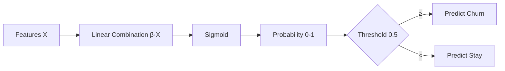

#### Interview Question

**Q:** Logistic regression mein threshold 0.5 default hai — tu kab change karega?

**A:** 0.5 sirf when costs balanced hain — false positive aur false negative dono equally bad. Real world mein imbalanced cost hota hai. Churn prediction example: false negative (churn predict nahi kiya, customer chala gaya) ka cost ₹2000 LTV loss hai, false positive (churn predict kiya, customer wapas aana hi tha, retention offer ₹100 dedi) ka cost ₹100 hai. Cost ratio 20:1 — threshold lower karna chahiye (e.g., 0.2) taaki zyada users flag hon for retention. Optimal threshold cost-curve se nikalta hai: threshold sweep karo, har threshold pe `expected_cost = FP × cost_FP + FN × cost_FN`, minimize karo. Top 2% analyst always business cost ko model output mein bake karta hai — pure ML metric nahi optimize karta.

---

### 1.4 Regularization — Ridge, Lasso, Elastic Net

#### Definition (kya hai?)

Regularization overfitting prevent karne ke liye loss function mein penalty add karta hai:

- **Ridge (L2)**: $\min \sum (y_i - \hat{y}_i)^2 + \lambda \sum \beta_j^2$ — coefficients ko shrink karta hai 0 ke taraf, lekin exactly 0 nahi.
- **Lasso (L1)**: $\min \sum (y_i - \hat{y}_i)^2 + \lambda \sum |\beta_j|$ — coefficients exactly 0 ho sakte hain (feature selection).
- **Elastic Net**: $\min \sum (y_i - \hat{y}_i)^2 + \lambda_1 \sum |\beta_j| + \lambda_2 \sum \beta_j^2$ — both combined.

$\lambda$ regularization strength — cross-validation se tune karte hain.

#### Why?

Jab features bahot hain (50+) aur observations kam (10K), ya features highly correlated hain, regularization save kar leta hai. Lasso automatic feature selection deti hai — top 2% analyst Lasso se "kaunse 10 features se 80% variance explain hoti hai" identify karta hai aur stakeholder ke saath simple story batata hai.

#### How? (Python)

```python
from sklearn.linear_model import Ridge, Lasso, ElasticNet, LassoCV
from sklearn.preprocessing import StandardScaler
from sklearn.model_selection import cross_val_score
import numpy as np
import pandas as pd

# Flipkart: predict customer LTV from 80 behavioral features
df = pd.read_csv("flipkart_users.csv")
X = df.drop(columns=["customer_id", "ltv_365d"])
y = df["ltv_365d"]

# Standardize (essential for regularization)
scaler = StandardScaler()
X_scaled = scaler.fit_transform(X)

# Lasso with CV to pick lambda
lasso_cv = LassoCV(cv=5, random_state=42, n_alphas=100).fit(X_scaled, y)
print(f"Optimal alpha: {lasso_cv.alpha_:.4f}")

# Surviving features (non-zero coefficients)
coef_df = pd.DataFrame({
    "feature": X.columns,
    "coef": lasso_cv.coef_
})
surviving = coef_df[coef_df["coef"] != 0].sort_values("coef", key=abs, ascending=False)
print(f"Lasso kept {len(surviving)} of {len(X.columns)} features")
print(surviving.head(15))
```

#### Real-life Example

Flipkart ka analyst LTV model bana raha tha 120 features ke saath (every clickstream signal). Plain OLS ne overfit kar diya — train R² 0.94, test 0.61. Lasso lagaya — alpha tune kiya CV se — 38 features survived, baaki coefficients exactly 0 ho gaye. Test R² jumped to 0.79. Surprise insight: "wishlist items count" top-3 predictor tha (kuch nahi expected tha CMO ko), aur "session duration" Lasso ne kill kar diya (vanity metric). Marketing team ne wishlist nudges launch kiye — quarterly LTV uplift ₹240/customer measured.

#### Diagram

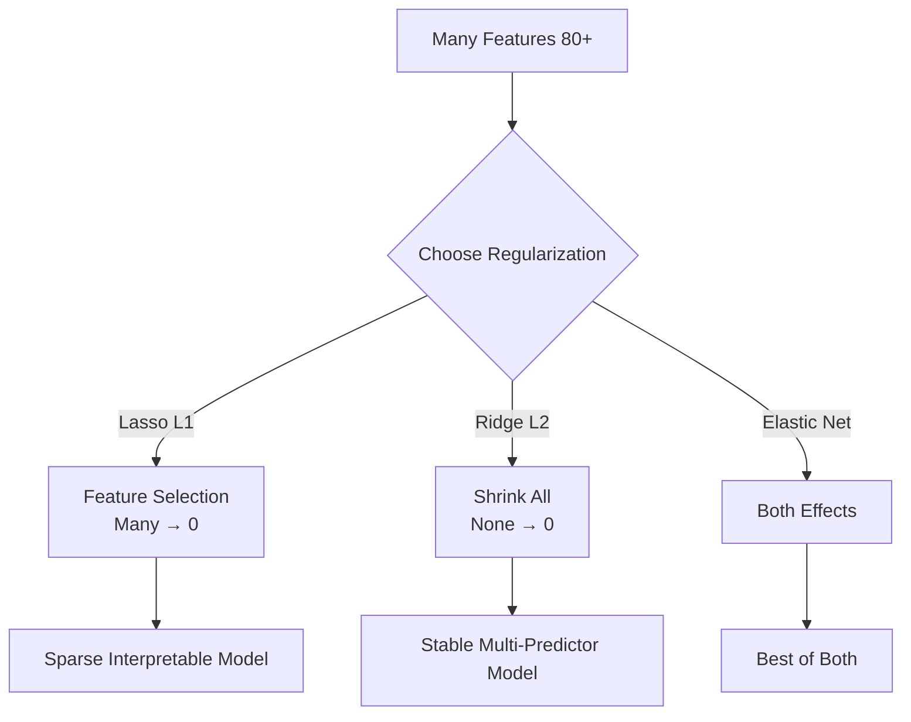

#### Interview Question

**Q:** Tu predictive model bana raha hai 200 features, 5000 samples ke saath. Ridge, Lasso, ya Elastic Net — kaunsa pick karega aur kyun?

**A:** Default mein Elastic Net — kyunki ye dono dynamics handle karta hai. Lekin reasoning ye depend karta hai: agar suspicion hai ki sirf 10-20 features actually matter karte hain (aksar real world mein ye true hota hai — pareto principle), toh Lasso pick karunga — sparse model interpret karna easy. Agar features sab moderately useful hain aur correlated hain, Ridge — kyunki Lasso correlated features mein arbitrary ek pick kar leta hai. Elastic Net interpolates — `l1_ratio` parameter se tune. Practically, mai 3 setup CV pe race karwata hu — `LassoCV`, `RidgeCV`, `ElasticNetCV` — RMSE compare karta hu, plus interpretability factor add karta hu (Lasso ka 20-feature model 200-feature Ridge se hamesha better stakeholder communication ke liye, even if RMSE 2% higher hai).

---

## 2. Tree-Based Models

Tree-based models analyst ka secret weapon hain — non-linear, no scaling needed, automatic feature interactions, handles missing values. XGBoost / LightGBM 2018 ke baad har Kaggle tabular competition jeet rahe hain — analyst ke liye bhi default ho gaye hain.

### 2.1 Decision trees — for understanding

#### Definition (kya hai?)

Decision tree data ko recursive splits ke through partition karta hai — har split ek feature condition pe (e.g., `age > 30`). Goal: har leaf node mein samples maximally homogeneous ho. Splits chosen by **information gain** (entropy reduction) ya **Gini impurity reduction**:

$$\text{Gini}(t) = 1 - \sum_{i=1}^{c} p_i^2$$

jahan $p_i$ proportion of class $i$ in node $t$. Best split = jo Gini sabse zyada kam kare.

#### Why?

Decision tree by itself accuracy mein average hota hai (overfits easily) — but understanding ke liye golden hai. Tu agar churn ka 5-level decision tree banata hai aur CMO ko dikhata "if recharge_lag > 7 AND complaint_count > 0 → 78% churn probability" — woh business rule directly retention playbook mein convert kar deta hai. No deployment needed — tree itself rule-set hai.

#### How? (Python)

```python
from sklearn.tree import DecisionTreeClassifier, plot_tree, export_text
import matplotlib.pyplot as plt
import pandas as pd

# Razorpay: merchant churn prediction
df = pd.read_csv("razorpay_merchants.csv")
X = df[["txn_count_30d", "txn_volume_30d", "support_tickets", "tenure_months", "kyc_complete"]]
y = df["churned_60d"]

# Shallow tree for interpretability
tree = DecisionTreeClassifier(max_depth=4, min_samples_leaf=200, random_state=42)
tree.fit(X, y)

# Visualize
plt.figure(figsize=(20, 10))
plot_tree(tree, feature_names=X.columns, class_names=["stay", "churn"],
          filled=True, fontsize=10)
plt.savefig("merchant_churn_tree.png", dpi=150)

# Text rules — directly business-readable
rules = export_text(tree, feature_names=list(X.columns))
print(rules)
# |--- txn_count_30d <= 5
# |   |--- support_tickets > 2
# |   |   |--- class: churn (probability 0.81)
```

#### Real-life Example

Razorpay ka SMB analyst merchant churn pe decision tree banayi — max depth 4, only 5 features. Output rules: "agar last 30 days mein <5 transactions AND >2 support tickets — 81% churn probability". Account managers ko direct rule sheet di — "ye conditions match karne wale 3000 merchants ko is week call karo". Conversion: 38% retention vs 12% baseline. Notably, deep XGBoost ne 5% better AUC diya — but Razorpay team simple tree pick kiya kyunki account managers ko rules samjhane mein zero friction tha.

#### Diagram

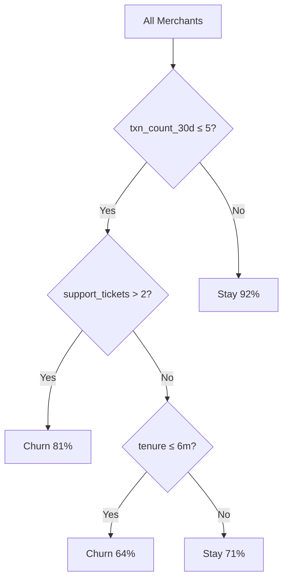

#### Interview Question

**Q:** Decision tree overfit kyu karte hain easily, aur kaise prevent karega?

**A:** Tree depth unrestricted ho toh har sample apna leaf bana sakta hai (memorize). Variance high, generalization low. Prevention 4 ways: (1) **max_depth limit** — typically 4-8 for interpretability; (2) **min_samples_leaf** — har leaf mein minimum samples (e.g., 1% of dataset); (3) **min_samples_split** — node split karne ke liye minimum samples; (4) **post-pruning** (cost-complexity pruning) — `ccp_alpha` parameter se. Top 2% analyst CV pe `max_depth` aur `ccp_alpha` tune karta hai — but interpretability priority ke saath. Agar 3-deep tree 0.78 AUC deta aur 12-deep 0.82 — chhota tree pick karta hu unless ye 4-point gap ₹X crore ka business impact create kar raha hai.

---

### 2.2 Random Forests

#### Definition (kya hai?)

Random Forest = ensemble of many decision trees, har tree:
1. Random subsample of rows (bootstrap) pe trained
2. Har split pe random subset of features se best chosen

Final prediction = majority vote (classification) ya average (regression). Ye **bagging** technique hai — variance reduce karti hai without bias increase.

Mathematically, agar har tree's prediction $\hat{y}_t$ hai, RF prediction $\hat{y} = \frac{1}{T}\sum_{t=1}^{T} \hat{y}_t$. Variance reduces by factor $\rho + \frac{1-\rho}{T}$ where $\rho$ = average correlation between trees.

#### Why?

Random Forest analyst ka go-to "first try" model hai — minimal tuning, robust to outliers, handles mixed types, gives feature importance. 80% baselines mein RF + 5 hyperparams = job done. Plus, OOB (out-of-bag) error built-in CV ki tarah free aata hai.

#### How? (Python)

```python
from sklearn.ensemble import RandomForestClassifier
from sklearn.model_selection import cross_val_score
import pandas as pd
import numpy as np

# Swiggy: predict whether user will reorder within 14 days
df = pd.read_csv("swiggy_orders.csv")
features = ["past_orders", "days_since_last", "avg_basket", "promo_redemption_rate",
            "favorite_cuisines_count", "city_tier", "rating_given_avg", "complaint_count"]
X = df[features]
y = df["reordered_14d"]

rf = RandomForestClassifier(
    n_estimators=300,
    max_depth=10,
    min_samples_leaf=50,
    n_jobs=-1,
    oob_score=True,
    random_state=42
)
rf.fit(X, y)
print(f"OOB accuracy: {rf.oob_score_:.3f}")

# Feature importance
fi_df = pd.DataFrame({
    "feature": features,
    "importance": rf.feature_importances_
}).sort_values("importance", ascending=False)
print(fi_df)

# 5-fold CV AUC
cv_auc = cross_val_score(rf, X, y, cv=5, scoring="roc_auc")
print(f"CV AUC: {cv_auc.mean():.3f} ± {cv_auc.std():.3f}")
```

#### Real-life Example

Swiggy ka analyst 14-day reorder prediction RF model banaya 8 features pe. AUC 0.84, OOB accuracy 0.79. Feature importance ranked: `days_since_last` (0.31), `past_orders` (0.22), `favorite_cuisines_count` (0.14), `promo_redemption_rate` (0.11). Insight: jin users ne 14+ days mein order nahi kiya AND favorite cuisines <2 hain — 23% reorder rate (vs 71% baseline). Marketing team ne is segment ko targeted "discover new cuisines" push notification campaign launch ki — 14-day reorder rate 23% → 38%, ₹18Cr incremental quarterly GMV.

#### Diagram

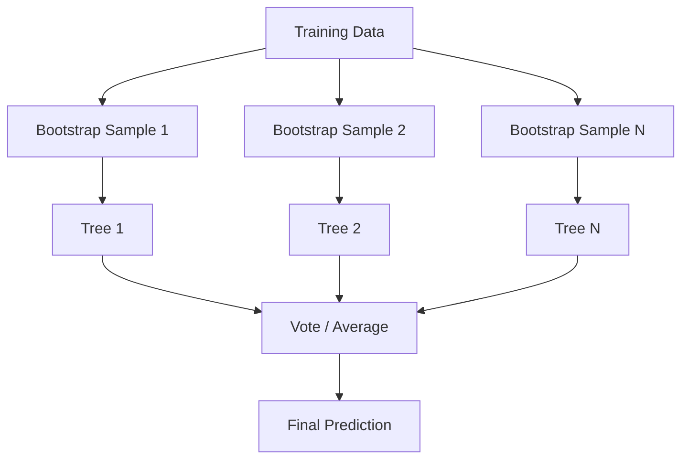

#### Interview Question

**Q:** Random Forest ke `n_estimators` ko increase karte raho — kya kabhi overfit hoga?

**A:** Theoretically no — RF mein `n_estimators` increase karne se variance reduce hoti hai monotonically (averaging more trees), bias same rahta hai. So zyada trees = better ya same performance, never worse. **But** computationally cost hai — 1000 trees vs 500 trees ka 0.001 AUC ka improvement, double inference time. Practically `n_estimators` 200-500 sweet spot hai. Real overfitting risk individual tree depth se aata hai (`max_depth`, `min_samples_leaf`) — woh constraints control karte hain. Top 2% analyst phir bhi learning curve plot karta hai (n_estimators vs OOB error) aur jaha curve flat ho jaata hai waha rukta hai — extra compute waste nahi karta.

---

### 2.3 XGBoost, LightGBM, CatBoost — analyst go-to

#### Definition (kya hai?)

Gradient Boosting Machines (GBMs) trees ko **sequentially** train karte hain — har naya tree previous trees ki errors ko fix karta hai. Loss function gradient pe direction set hota hai:

$$F_m(x) = F_{m-1}(x) + \eta \cdot h_m(x)$$

jahan $h_m$ naya tree, $\eta$ learning rate. Gradient = $-\frac{\partial L}{\partial F}$.

Three flavors:
- **XGBoost** — most mature, regularization built-in, handles missing values natively, sparse-aware
- **LightGBM** — faster (leaf-wise growth, histogram binning), better for big data
- **CatBoost** — Yandex, handles categorical features natively without one-hot, less tuning

#### Why?

Tabular data pe ye 3 algorithms 90% Kaggle competitions jeet te hain. Analyst ke liye: XGBoost default, LightGBM jab data >5M rows, CatBoost jab high-cardinality categoricals (city, pincode, merchant_id) bahot hain.

#### How? (Python)

```python
import xgboost as xgb
import lightgbm as lgb
from catboost import CatBoostClassifier
from sklearn.model_selection import train_test_split
from sklearn.metrics import roc_auc_score
import pandas as pd

# Paytm: fraud detection
df = pd.read_csv("paytm_txns.csv")
features = ["amount", "hour_of_day", "device_age_days", "txns_last_1h",
            "merchant_category", "user_city", "ip_country_mismatch", "velocity_score"]
X = df[features]
y = df["is_fraud"]

X_train, X_test, y_train, y_test = train_test_split(X, y, test_size=0.2, stratify=y, random_state=42)

# XGBoost
xgb_model = xgb.XGBClassifier(
    n_estimators=500,
    max_depth=6,
    learning_rate=0.05,
    subsample=0.8,
    colsample_bytree=0.8,
    scale_pos_weight=99,  # 1% fraud rate
    eval_metric="auc",
    early_stopping_rounds=50,
    random_state=42
)
xgb_model.fit(X_train, y_train, eval_set=[(X_test, y_test)], verbose=False)
print(f"XGBoost AUC: {roc_auc_score(y_test, xgb_model.predict_proba(X_test)[:,1]):.4f}")

# LightGBM (faster on big data)
lgb_model = lgb.LGBMClassifier(
    n_estimators=500, max_depth=8, learning_rate=0.05,
    num_leaves=63, class_weight="balanced", random_state=42
)
lgb_model.fit(X_train, y_train, eval_set=[(X_test, y_test)],
              callbacks=[lgb.early_stopping(50)])

# CatBoost — handles categoricals directly
cat_model = CatBoostClassifier(
    iterations=500, depth=6, learning_rate=0.05,
    cat_features=["merchant_category", "user_city"],
    auto_class_weights="Balanced", verbose=0
)
cat_model.fit(X_train, y_train, eval_set=(X_test, y_test), early_stopping_rounds=50)
```

#### Real-life Example

Paytm fraud team XGBoost run karti hai realtime — 200K transactions/min. Features 80+ — velocity counters, device fingerprints, merchant patterns. AUC 0.987. False positive rate 0.4% pe true positive rate 91% — matlab har 1000 fraud attempts mein 910 catch, har 1000 genuine transactions mein 4 falsely blocked. Annual fraud savings ₹600Cr+. Analyst team ne LightGBM se experiment kiya bhi — XGBoost se 8x faster training but AUC 0.002 lower — production XGBoost stayed because precision matters at this scale.

#### Diagram

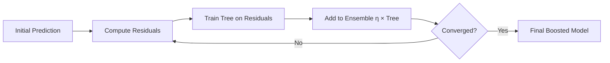

#### Interview Question

**Q:** Random Forest aur XGBoost mein fundamental difference kya hai? Kab kaunsa pick karega?

**A:** Random Forest = **bagging** (parallel, independent trees, average). XGBoost = **boosting** (sequential, each tree fixes previous errors, weighted sum). RF variance reduce karti hai (multiple high-variance models average), Boosting bias reduce karti hai (each iteration error correction). Practically: RF easier to tune (3-4 params, hard to overfit), Boosting more powerful but careful tuning needed (learning_rate, n_estimators, max_depth, regularization — overfit easy). Pick: (a) **first baseline** — RF (low effort, good signal); (b) **production model with tuning budget** — XGBoost/LightGBM; (c) **interpretability priority** — single tree or RF; (d) **categorical-heavy data** — CatBoost; (e) **massive data >10M rows** — LightGBM. Top 2% analyst dono race karke decision deta hai with RMSE/AUC + training time + interpretability tradeoff explicit.

---

### 2.4 SHAP values & feature importance

#### Definition (kya hai?)

SHAP (SHapley Additive exPlanations) game theory se aata hai — har feature ko ek "player" treat karta hai jo prediction "payout" mein contribute karta hai. Shapley value = average marginal contribution of feature across all possible feature subsets:

$$\phi_i = \sum_{S \subseteq F \setminus \{i\}} \frac{|S|!(|F|-|S|-1)!}{|F|!} [f(S \cup \{i\}) - f(S)]$$

Properties — local accuracy ($\sum \phi_i = f(x)$), missingness, consistency. Practically: har sample ke liye, SHAP batata hai "is prediction mein har feature ne kitna add/subtract kiya".

Vanilla feature importance (e.g., RF's `feature_importances_`) global hai — model-level. SHAP **local** hai — har individual prediction ko explain karta hai.

#### Why?

CMO bolta hai "is specific high-value customer ko churn predict kyu kiya?" — Vanilla feature importance se answer "globally complaints matter" — but is specific user ke liye main driver kya tha pata nahi. SHAP per-customer batata hai: "is user ke liye churn probability 0.78 hai because tenure short (-0.15) + complaints high (+0.32) + price sensitivity (+0.18)". Top 2% analyst SHAP plots stakeholder ke saamne use karta hai — black-box model interpretable ho jaata hai.

#### How? (Python)

```python
import shap
import xgboost as xgb
import pandas as pd
import matplotlib.pyplot as plt

# Train XGBoost (from churn example)
model = xgb.XGBClassifier(n_estimators=300, max_depth=6, learning_rate=0.05).fit(X_train, y_train)

# SHAP explainer (TreeExplainer is fast for tree models)
explainer = shap.TreeExplainer(model)
shap_values = explainer.shap_values(X_test)

# Global importance — beeswarm summary
shap.summary_plot(shap_values, X_test, plot_type="dot")  # all features, all samples

# Bar chart — average absolute SHAP
shap.summary_plot(shap_values, X_test, plot_type="bar")

# Local explanation — single user
user_idx = 42
shap.waterfall_plot(shap.Explanation(
    values=shap_values[user_idx],
    base_values=explainer.expected_value,
    data=X_test.iloc[user_idx],
    feature_names=X_test.columns.tolist()
))

# Dependence plot — feature interaction
shap.dependence_plot("recharge_lag_days", shap_values, X_test, interaction_index="complaint_count")

# Force plot — interactive HTML
shap.force_plot(explainer.expected_value, shap_values[user_idx], X_test.iloc[user_idx])
```

#### Real-life Example

Jio retention team monthly review mein SHAP waterfall plot le ke jaati top-100 high-value churn-risk users ka. CXO ko literally har user ki story dikhayi: "User_A — base churn rate 12%, predicted 67%. Top push factors: recharge_lag 9 days (+18%), 2 complaints last week (+15%), tenure only 4 months (+12%), competitor SMS detected (+10%)." Action plan auto-generated: "Send goodwill 5GB + complaint resolution call + tenure-discount offer." 6-month measurement: SHAP-driven targeted retention had 2.3x ROI vs old segment-based blanket offers. Save ~₹120Cr per quarter.

#### Diagram

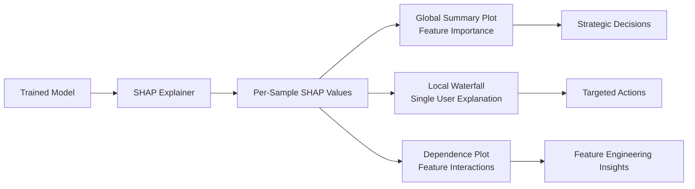

#### Interview Question

**Q:** Random Forest ka built-in `feature_importances_` aur SHAP-based importance mein kya difference hai? Kaunsa zyada reliable?

**A:** RF's default importance **Mean Decrease in Impurity (MDI)** hai — har feature pe har split ke Gini reduction ka sum, normalized. Problem: MDI **biased** hai high-cardinality features ke towards (e.g., user_id-like features artificially important dikhte hain) aur correlated features ke beech splits arbitrary distribute hote hain. SHAP **model-agnostic, theoretically grounded** (game theory), unbiased estimator. Plus SHAP local explanations deti hai (per-sample) which MDI nahi. Practically reliable order: (1) **SHAP** — gold standard for both global aur local; (2) **Permutation importance** — shuffle a feature, measure performance drop, unbiased but doesn't give local; (3) **MDI** — default, biased, use only for quick sanity check. Top 2% analyst stakeholder presentations mein hamesha SHAP use karta hai — aur jab koi pucche "kyu is user ko predict kiya" toh waterfall plot ready rakhta hai.

---

## 3. Model Evaluation

Model accha hai ya nahi — ye decide karna analyst ka 50% kaam hai. Galat metric pe optimize karega toh production mein face plant ho jaayega.

### 3.1 Train/val/test, cross-validation, time-series CV

#### Definition (kya hai?)

- **Train** — model fit karne ka data
- **Validation** — hyperparameter tuning aur early stopping ke liye
- **Test** — final unbiased performance estimate, **never touch during development**

Typical split 70/15/15 ya 60/20/20. **Cross-validation (k-fold)**: data ko k parts mein todna, har part baari-baari val banata hai, k models train hote hain — average performance = robust estimate. K=5 ya 10 standard.

**Time-series CV**: temporal data mein random split = data leakage (future info se past predict karna). Solution — **expanding window** ya **rolling window** CV jaha train always before val in time.

#### Why?

Train pe high accuracy = nothing. Test/val performance batata hai real generalization. Single train-test split unstable estimate de sakta hai (lucky split) — CV se confidence interval milta hai. Time-series mein random split toxic hai — tu sochta hai 0.95 AUC hai, production mein 0.62 milta hai.

#### How? (Python)

```python
from sklearn.model_selection import KFold, StratifiedKFold, TimeSeriesSplit, cross_val_score
import pandas as pd
import xgboost as xgb

# Standard k-fold (random) — for non-temporal data
kf = StratifiedKFold(n_splits=5, shuffle=True, random_state=42)
auc_scores = cross_val_score(xgb.XGBClassifier(), X, y, cv=kf, scoring="roc_auc")
print(f"5-fold CV AUC: {auc_scores.mean():.3f} ± {auc_scores.std():.3f}")

# Time-series CV — rolling/expanding window
df_ts = df.sort_values("date").reset_index(drop=True)
tscv = TimeSeriesSplit(n_splits=5, test_size=30)  # last 30 days each fold

for fold, (train_idx, val_idx) in enumerate(tscv.split(df_ts)):
    X_train, X_val = df_ts.iloc[train_idx][features], df_ts.iloc[val_idx][features]
    y_train, y_val = df_ts.iloc[train_idx]["target"], df_ts.iloc[val_idx]["target"]
    model = xgb.XGBClassifier().fit(X_train, y_train)
    score = roc_auc_score(y_val, model.predict_proba(X_val)[:,1])
    print(f"Fold {fold}: train={df_ts.iloc[train_idx]['date'].max()}, val_AUC={score:.3f}")
```

#### Real-life Example

Zomato ka demand forecasting team initially random k-fold CV use kar rahi thi for daily orders prediction — CV RMSE 8%, production RMSE 22%. Senior analyst ne diagnose kiya — random split allowed model to "see" future data points during training. TimeSeriesSplit pe shift kiya — CV RMSE 19% (much closer to true production), aur ye realistic estimate dekh ke team ne feature engineering double down ki — eventually production RMSE 11% pe le aaye. Lesson: CV honest hona chahiye, not flattering.

#### Diagram

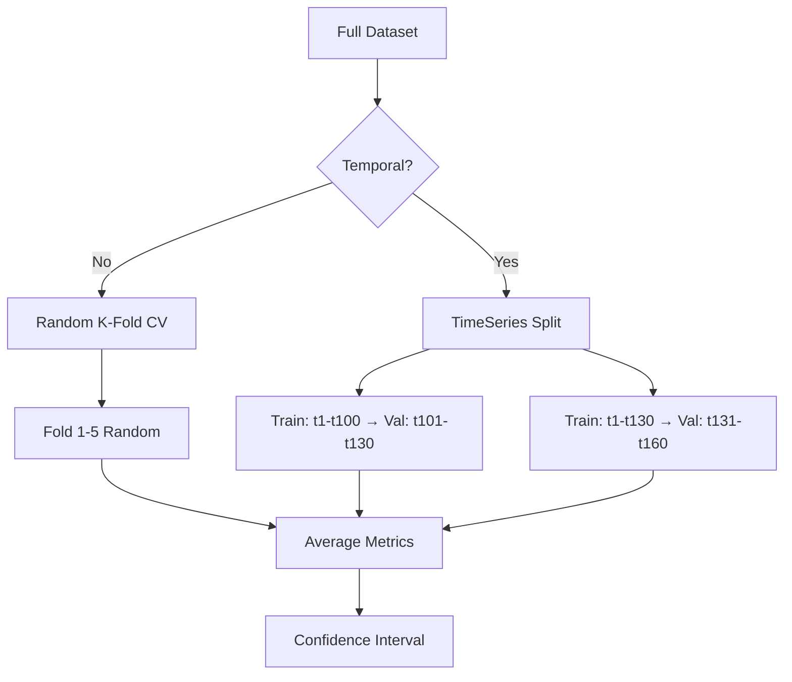

#### Interview Question

**Q:** Tu churn model bana raha hai. Tune random k-fold CV kiya — AUC 0.85. Production mein deploy kiya — AUC 0.71 mila. Kya galat hua?

**A:** Sabse common failure: **temporal data leakage**. Churn fundamentally time-dependent hai — tu kisi customer ko predict kar raha hai whether they'll churn in **future**. Random k-fold mein train fold mein future months ka data, val fold mein past — model "leaks" forward information. Production mein sirf past available hai → drop. Fix: **TimeSeriesSplit** with strict cutoff — train pe `2024-01 to 2025-06` data, val pe `2025-07 to 2025-09`, test pe `2025-10 to 2025-12`. Plus check feature engineering — kya koi feature future-derived hai? (e.g., "lifetime_orders" computed at training time = future data leak if predicting older snapshot). Top 2% analyst hamesha **simulate production** during validation — jab today 2025-06 hai, only 2025-06 ke pehle ka data feature mein use karo. Painful but honest.

---

### 3.2 Precision, Recall, F1, ROC-AUC, lift, gain

#### Definition (kya hai?)

Confusion matrix se start:

|  | Predicted + | Predicted − |
|--|--|--|
| Actual + | TP | FN |
| Actual − | FP | TN |

- **Precision** $= \frac{TP}{TP + FP}$ — predicted positives mein se kitne actually positive
- **Recall (Sensitivity)** $= \frac{TP}{TP + FN}$ — actual positives mein se kitne caught
- **F1** $= \frac{2 \cdot P \cdot R}{P + R}$ — harmonic mean
- **ROC-AUC** — area under ROC curve (TPR vs FPR at all thresholds). $\text{AUC} = P(\text{score}_{+} > \text{score}_{-})$ for random positive-negative pair. 0.5 = random, 1.0 = perfect.
- **Lift** at top k% = (response rate in top k%) / (overall response rate). Marketing ke liye crucial.
- **Cumulative Gain** — top k% target karne se kitne % positives capture hote hain.

#### Why?

Imbalanced data (fraud, churn — 1-5% positive rate) mein accuracy useless hai — 99% accuracy "predict all negative" se aati hai. Precision-recall tradeoff aur AUC reliable hain. Lift/gain charts marketing teams ke favorite — "top 10% users target karne se 60% churners catch hote hain" se ROI calculation easy.

#### How? (Python)

```python
from sklearn.metrics import (precision_score, recall_score, f1_score,
                             roc_auc_score, precision_recall_curve, roc_curve)
import numpy as np
import pandas as pd
import matplotlib.pyplot as plt

y_pred_proba = model.predict_proba(X_test)[:, 1]
y_pred = (y_pred_proba >= 0.5).astype(int)

print(f"Precision: {precision_score(y_test, y_pred):.3f}")
print(f"Recall:    {recall_score(y_test, y_pred):.3f}")
print(f"F1:        {f1_score(y_test, y_pred):.3f}")
print(f"ROC-AUC:   {roc_auc_score(y_test, y_pred_proba):.3f}")

# Lift chart — for marketing decile targeting
df_lift = pd.DataFrame({"y_true": y_test, "score": y_pred_proba})
df_lift = df_lift.sort_values("score", ascending=False).reset_index(drop=True)
df_lift["decile"] = pd.qcut(df_lift.index, 10, labels=range(1, 11))
overall_rate = df_lift["y_true"].mean()
lift_df = df_lift.groupby("decile").agg(
    rate=("y_true", "mean"),
    count=("y_true", "size"),
    captured=("y_true", "sum")
).reset_index()
lift_df["lift"] = lift_df["rate"] / overall_rate
lift_df["cumulative_gain"] = lift_df["captured"].cumsum() / lift_df["captured"].sum()
print(lift_df)
# decile=1 (top 10%) lift=4.2 means 4.2x baseline conversion
# cumulative_gain=0.62 by decile 2 means top 20% captures 62% of positives
```

#### Real-life Example

Flipkart ka cross-sell team logistic model banayi for "premium subscription upgrade" prediction. AUC 0.78. Lift chart dekha: top decile lift = 5.1x — top 10% users target karne se 51% subscribers convert. Marketing budget ₹2Cr tha — agar pure base ko target karte (10M users), CAC ₹200. Ab top 1M target karne se CAC ₹50 down. Same conversion volume, 4x lower spend. Annual savings ₹15Cr. Lift chart se non-technical CMO ne instant decision liya — model ka individual coefficient explain karne ki need nahi padi.

#### Diagram

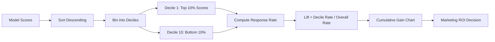

#### Interview Question

**Q:** Tu fraud model bana raha hai. AUC 0.94 hai — boss khush. Tu kya extra dekhega before deployment?

**A:** AUC sirf **ranking quality** measure karta hai — actual operating point pe performance nahi. Fraud highly imbalanced hai (0.5% rate) — AUC 0.94 ho ke bhi precision low ho sakti hai practical threshold pe. Mai 4 cheezein extra dekhunga: (1) **Precision-Recall curve** — at desired recall (say 80% fraud caught), precision kya hai? Agar 5% precision hai, matlab 95% flagged transactions actually genuine — operational nightmare for review team; (2) **Cost matrix** — false positive ka cost (₹500 review effort + customer friction) vs false negative ka cost (avg fraud loss ₹15K) — optimal threshold cost-curve se nikalta hai, not 0.5; (3) **Calibration plot** — predicted probability 0.8 wale samples mein actually 80% fraud? XGBoost often miscalibrated, isotonic regression se fix; (4) **Subgroup performance** — by amount band, by user tenure, by city — kahin systematic underperformance toh nahi (e.g., new users pe AUC 0.62 = unfair model). Top 2% analyst AUC ko starting point treat karta hai, not finish line.

---

### 3.3 MAE, MSE, RMSE, MAPE, R²

#### Definition (kya hai?)

Regression metrics:

- **MAE (Mean Absolute Error)** $= \frac{1}{n}\sum |y_i - \hat{y}_i|$ — same units as $y$, robust to outliers
- **MSE (Mean Squared Error)** $= \frac{1}{n}\sum (y_i - \hat{y}_i)^2$ — penalizes big errors more
- **RMSE** $= \sqrt{\text{MSE}}$ — same units as $y$, interpretable
- **MAPE (Mean Absolute Percentage Error)** $= \frac{100\%}{n}\sum \left|\frac{y_i - \hat{y}_i}{y_i}\right|$ — scale-free, but breaks at $y_i = 0$
- **R²** $= 1 - \frac{\sum (y_i - \hat{y}_i)^2}{\sum (y_i - \bar{y})^2}$ — fraction of variance explained, 0 to 1 (can be negative for terrible models)

$$\text{RMSE} = \sqrt{\frac{1}{n}\sum_{i=1}^{n}(y_i - \hat{y}_i)^2}$$

#### Why?

Different metrics different stakeholders ke liye. Forecasting team MAPE pe focus karti hai (% error scale-free hai across products). CFO RMSE prefer karta hai (₹ mein samjha sakta hai). Statisticians R² (variance explained). Top 2% analyst sab 4 report karta hai — har audience apna favorite pick kar leta hai.

#### How? (Python)

```python
from sklearn.metrics import mean_absolute_error, mean_squared_error, r2_score
import numpy as np

def regression_metrics(y_true, y_pred):
    mae = mean_absolute_error(y_true, y_pred)
    mse = mean_squared_error(y_true, y_pred)
    rmse = np.sqrt(mse)
    mape = np.mean(np.abs((y_true - y_pred) / np.maximum(np.abs(y_true), 1))) * 100
    r2 = r2_score(y_true, y_pred)
    return {"MAE": mae, "MSE": mse, "RMSE": rmse, "MAPE_%": mape, "R2": r2}

# Zomato dining demand forecast
y_pred = model.predict(X_test)
metrics = regression_metrics(y_test.values, y_pred)
for k, v in metrics.items():
    print(f"{k}: {v:.3f}")
# MAE: 12.3 reservations
# RMSE: 18.7 reservations
# MAPE_%: 14.2%
# R2: 0.81
```

#### Real-life Example

Zomato dining demand forecasting team weekly reservation predictions on 8000 restaurants ke liye banayi. Initial model RMSE 28, MAPE 24% — capacity planning bekaar. Feature engineering (weather, holidays, events, last_4_weeks_avg) ke baad RMSE 14, MAPE 11% — operational acceptable. CFO ko RMSE pitch ki — "average 14 reservations off, on base of avg 120 — 88% accurate." Restaurant partner ops team ko MAPE pitch ki — "11% error band, you can plan staffing within ±15%." Same model, two metrics, two satisfied audiences.

#### Diagram

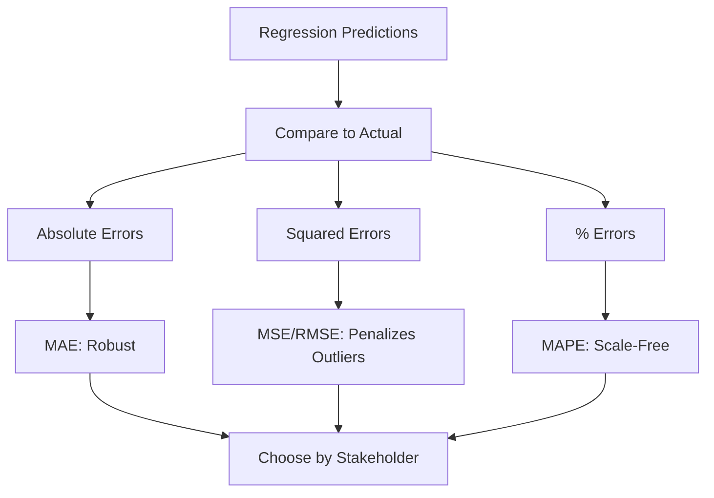

#### Interview Question

**Q:** Tu sales forecast bana raha hai. Manager bolta hai "RMSE optimize karo." Tu agree karega?

**A:** Depends. RMSE squared errors sum karta hai — outlier days (festival sales spike, system outage zero sales) ko heavily penalize karta hai. Agar woh outliers genuinely matter karte hain (e.g., Diwali sale demand right pakadna critical because inventory waste se ₹crores ka loss) — RMSE correct choice. But agar outliers noise hain (one-off events not representative of typical days), MAE better — robust, har normal day pe equal weight. MAPE useful agar SKU-level errors compare karne hain across products with different scales (₹100 product ka ₹10 error vs ₹10000 product ka ₹100 error — same MAPE 10%, different RMSE drastically). Top 2% analyst 3 metrics report karta hai aur business context pe primary metric agree karta hai BEFORE model building, not after — manager se confirm karta hai "outlier days important hain ya nahi" pehle.

---

## 4. Practical Use Cases

Ye section asli bread-and-butter hai. Top 2% analyst ye 5 use cases mein expert hota hai — har company in mein se 2-3 mangti hai.

### 4.1 Customer churn prediction

#### Definition (kya hai?)

Churn = customer ne service use karna chhod diya. Definition company-specific hoti hai — SaaS mein subscription cancel, telecom mein 30 days no recharge, e-commerce mein 90 days no purchase. ML problem: binary classification — har customer pe predict whether they'll churn in next $T$ days (T = 30, 60, 90 typical).

#### Why?

Acquisition cost retention cost se 5-7x zyada hota hai. Churn predict karke proactive retention = highest ROI ML use case. Even 5% churn reduction can mean ₹100Cr+ ARR for big telecoms / SaaS / fintechs.

#### How? (Python)

```python
import xgboost as xgb
import shap
import pandas as pd
from sklearn.model_selection import train_test_split
from sklearn.metrics import roc_auc_score, classification_report

# Jio: 30-day churn pipeline
df = pd.read_csv("jio_churn.csv")  # 50M users sample down to 5M

# Feature engineering — tenure, recency, frequency, monetary, complaint, competitor
df["recency_days"] = (pd.to_datetime("today") - pd.to_datetime(df["last_recharge"])).dt.days
df["arpu"] = df["total_revenue_90d"] / 3
df["data_intensity"] = df["data_gb_30d"] / df["plan_data_quota"]
df["complaint_rate"] = df["complaints_30d"] / df["tenure_months"].clip(lower=1)

features = ["tenure_months", "recency_days", "arpu", "data_intensity",
            "voice_mins_30d", "complaint_rate", "plan_changes_90d",
            "competitor_offer_received", "city_tier", "device_age"]
X, y = df[features], df["churned_30d"]

X_train, X_test, y_train, y_test = train_test_split(X, y, test_size=0.2, stratify=y, random_state=42)

# Model — XGBoost with class weight (1% churn → scale_pos_weight=99)
churn_rate = y_train.mean()
model = xgb.XGBClassifier(
    n_estimators=400, max_depth=6, learning_rate=0.05,
    subsample=0.8, colsample_bytree=0.8,
    scale_pos_weight=(1-churn_rate)/churn_rate,
    eval_metric="auc", early_stopping_rounds=30, random_state=42
)
model.fit(X_train, y_train, eval_set=[(X_test, y_test)], verbose=False)

# Evaluate
auc = roc_auc_score(y_test, model.predict_proba(X_test)[:, 1])
print(f"AUC: {auc:.3f}")

# SHAP for actionable per-user explanations
explainer = shap.TreeExplainer(model)
shap_values = explainer.shap_values(X_test)
shap.summary_plot(shap_values, X_test)

# Score full base + segment by risk
df["churn_prob"] = model.predict_proba(X[features])[:, 1]
df["risk_segment"] = pd.qcut(df["churn_prob"], q=[0, 0.7, 0.9, 1.0],
                              labels=["low", "medium", "high"])
print(df.groupby("risk_segment").size())
```

#### Real-life Example

Jio retention team ye exact pipeline run karti hai monthly on 400M users. AUC 0.87. Top decile churn rate 38% (vs 4% baseline) — 9.5x lift. Targeted retention offer for top 10% (40M users): 5GB free data + tenure-based ₹50 cashback. Cost ~₹100/user × 40M = ₹400Cr. Saved churn: 25% of 38% × 40M = 3.8M users retained. Average ARPU ₹250/month × 12 = ₹3000 LTV/user. ROI = 3.8M × 3000 / 400Cr = ~28x.

#### Diagram

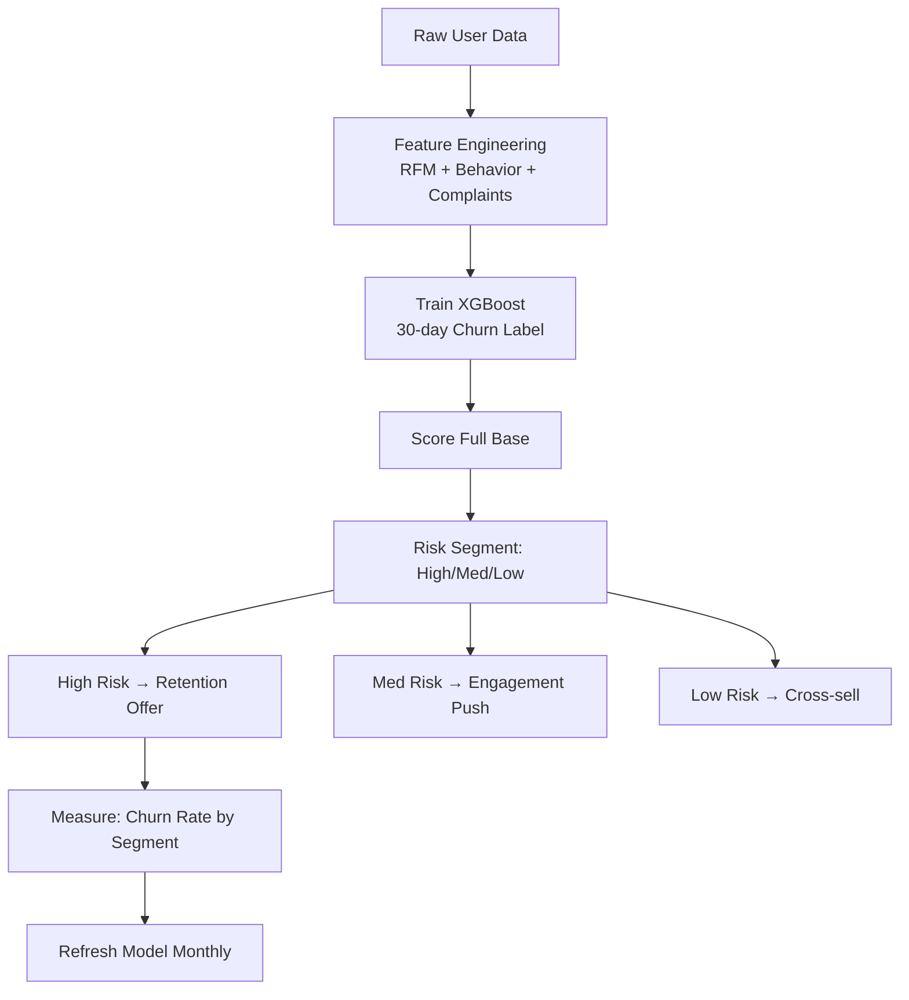

#### Interview Question

**Q:** Tu churn model bana ke deploy kiya. 3 months baad measurement mein "high-risk segment" ka actual churn 22% nikla — predicted 38% tha. Kya hua aur ye good news hai ya bad?

**A:** Ye **selection effect / treatment effect** hai — aur ambiguity hai. Two interpretations: (1) **Good news**: retention offers WORKED — predicted 38% churn ko 22% reduce kiya, ROI calculation pe ye savings credit do; (2) **Bad news**: model overestimating churn — calibration off, threshold settings bigad rahe hain. Differentiate kaise? **Holdout group** chahiye — randomly 10% high-risk users ko offer NA do, control group banaye. 3 months baad: agar control mein 38% churn aur treated mein 22% — model accurate, intervention worked, savings real (16% × users = saved). Agar control mein bhi 22% — model overestimating, calibration ki zarurat. Top 2% analyst **always** holdout group rakhta hai for measurement, even when stakeholders pressure "sab ko offer do" — without control, ROI claims unprovable.

---

### 4.2 Lifetime Value (LTV) modeling

#### Definition (kya hai?)

LTV = customer ka lifetime mein expected total revenue (gross-margin adjusted). Naive: $\text{LTV} = \text{ARPU} \times \text{margin} / \text{churn rate}$. Predictive ML: regression model jaha target = future revenue over horizon T (e.g., next 365 days), features = first 30/60 days behavior.

Two-stage approach often: (1) **classification** for "will customer purchase again?" (alive prob); (2) **regression** for "if alive, how much will they spend?" Multiply for expected LTV.

#### Why?

LTV CAC decisions, payback periods, channel ROI, customer segmentation — sab decisions ka base. Predictive LTV (vs historical) acquisition channels ko forward-looking optimize karne deta hai.

#### How? (Python)

```python
import lightgbm as lgb
import pandas as pd
import numpy as np
from sklearn.metrics import mean_absolute_error, r2_score

# Swiggy: predict 365-day LTV from first 30-day behavior
df = pd.read_csv("swiggy_users.csv")
features = ["first_order_value", "orders_first_30d", "avg_basket_30d",
            "promo_redemption_count", "categories_explored", "weekend_order_ratio",
            "delivery_time_avg", "rating_given_avg", "city_tier", "device_type"]
X = df[features]
y = df["revenue_365d"]  # gross margin already applied

# Filter for at least active users (alive in first 30d)
mask = df["orders_first_30d"] >= 1
X, y = X[mask], y[mask]

# Log-transform target (LTV log-normal)
y_log = np.log1p(y)

X_train, X_test, y_train, y_test = train_test_split(X, y_log, test_size=0.2, random_state=42)

# LightGBM regression
model = lgb.LGBMRegressor(
    n_estimators=500, max_depth=8, learning_rate=0.05,
    num_leaves=63, subsample=0.8, colsample_bytree=0.8,
    objective="regression", random_state=42
)
model.fit(X_train, y_train, eval_set=[(X_test, y_test)],
          callbacks=[lgb.early_stopping(30)])

# Reverse log transform for actual ₹ predictions
y_pred = np.expm1(model.predict(X_test))
y_test_actual = np.expm1(y_test)

mae = mean_absolute_error(y_test_actual, y_pred)
r2 = r2_score(y_test_actual, y_pred)
print(f"LTV MAE: ₹{mae:.0f}, R²: {r2:.3f}")

# Decile analysis
df_pred = pd.DataFrame({"actual": y_test_actual.values, "predicted": y_pred})
df_pred["decile"] = pd.qcut(df_pred["predicted"], 10, labels=range(1, 11))
print(df_pred.groupby("decile").agg(
    actual_avg=("actual", "mean"),
    predicted_avg=("predicted", "mean"),
    count=("actual", "size")
))
```

#### Real-life Example

Swiggy growth team ye model use karti hai for paid acquisition channel optimization. Top decile predicted LTV ₹4500 (avg ₹950) — Instagram Reels-acquired users pe LTV consistently top 3 deciles mein, Google Search bottom 4 deciles. CMO ne Google Search budget halve kiya, Reels mein 2x invest kiya — same ₹50Cr quarterly marketing spend, but acquired LTV-weighted users 1.7x. Net contribution margin uplift ₹140Cr year-on-year. LTV model directly se channel-mix decision drove kara.

#### Diagram

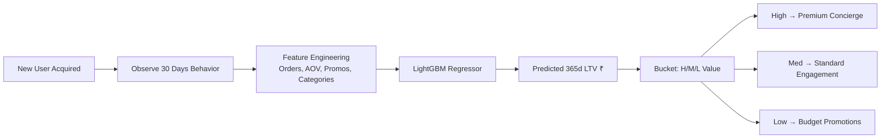

#### Interview Question

**Q:** Tu naive LTV use kar raha hai (`ARPU × margin / churn`) — predictive ML LTV se kab switch karega?

**A:** Naive LTV cohort-average deta hai — single number for entire user base. Useless for individual decisions: kis user pe ₹5000 acquisition spend justify hai vs ₹500. Switch when: (1) **acquisition channels diverge in quality** — agar Google Search vs Instagram users different LTV trajectories follow karte hain, naive average bekaar hai; (2) **personalization needed** — high-LTV users ko premium service vs low-LTV ko standard; (3) **payback windows tight** — bad cohorts kill karne ke liye early signal needed (30-day predictive LTV se 90-day decision le sakte ho); (4) **product mix** — different products different LTV profiles. Effort vs payoff: predictive LTV needs 6-8 weeks build (data eng + model + validation + deployment). Worth it agar marketing spend >₹10Cr/quarter — typically returns 15-30% efficiency. Below that, naive LTV + segmentation enough hai. Top 2% analyst yeh tradeoff explicitly stakeholder ko explain karta hai before greenlighting project.

---

### 4.3 Forecasting — Prophet, ARIMA, exponential smoothing

#### Definition (kya hai?)

Time series forecasting = future values predict karna based on historical patterns. Three classical approaches:

- **Exponential Smoothing (ETS)** — recent observations ko higher weight, trend + seasonality decompose. Holt-Winters most common.
- **ARIMA** — AutoRegressive Integrated Moving Average. Stationary series pe AR (lag dependence), I (differencing), MA (error dependence) ka combination. Box-Jenkins methodology.
- **Prophet** (Facebook) — additive model: $y(t) = g(t) + s(t) + h(t) + \epsilon$ where $g$ = trend, $s$ = seasonality (Fourier), $h$ = holidays. Robust to missing data, handles holidays, easy API.

#### Why?

Demand forecasting, revenue forecasting, capacity planning, inventory management — har analyst-heavy company mein ye need hota hai. Prophet analyst-friendly hai (minimal stats knowledge needed), ARIMA more rigorous, ETS lightweight.

#### How? (Python)

```python
import pandas as pd
import numpy as np
from prophet import Prophet
from statsmodels.tsa.arima.model import ARIMA
from statsmodels.tsa.holtwinters import ExponentialSmoothing
import matplotlib.pyplot as plt

# Zomato: dining demand forecasting (daily reservations, 2-year history)
df = pd.read_csv("zomato_daily_reservations.csv", parse_dates=["date"])
df = df.rename(columns={"date": "ds", "reservations": "y"})
df = df.sort_values("ds").reset_index(drop=True)

train, test = df.iloc[:-30], df.iloc[-30:]

# Prophet
indian_holidays = pd.DataFrame({
    "holiday": "festival",
    "ds": pd.to_datetime(["2025-10-21", "2025-11-12", "2025-12-25"]),  # Diwali, etc
    "lower_window": -1, "upper_window": 1
})
m = Prophet(weekly_seasonality=True, yearly_seasonality=True, holidays=indian_holidays)
m.fit(train)
future = m.make_future_dataframe(periods=30)
forecast = m.predict(future)

# Compare on test
preds = forecast[["ds", "yhat", "yhat_lower", "yhat_upper"]].iloc[-30:]
mape_prophet = np.mean(np.abs((test["y"].values - preds["yhat"].values) / test["y"].values)) * 100
print(f"Prophet MAPE: {mape_prophet:.2f}%")

# ARIMA (auto order via AIC search or manual)
arima = ARIMA(train["y"], order=(7, 1, 2)).fit()
arima_pred = arima.forecast(steps=30)
mape_arima = np.mean(np.abs((test["y"].values - arima_pred.values) / test["y"].values)) * 100

# Holt-Winters Exponential Smoothing
hw = ExponentialSmoothing(train["y"], trend="add", seasonal="add", seasonal_periods=7).fit()
hw_pred = hw.forecast(30)
mape_hw = np.mean(np.abs((test["y"].values - hw_pred.values) / test["y"].values)) * 100

print(f"Prophet: {mape_prophet:.2f}% | ARIMA: {mape_arima:.2f}% | HW: {mape_hw:.2f}%")
```

#### Real-life Example

Zomato dining team Prophet use karti hai 8000+ restaurants pe daily reservations forecast ke liye. Festivals (Diwali, Eid, Christmas) ka holiday effect Prophet directly model karta hai — without it MAPE 32%, with it MAPE 11%. Restaurant partners ko 7-day-ahead forecast share hota hai, woh staff scheduling aur ingredient procurement plan karte hain. Savings ~₹2000/restaurant/month wastage reduction → 8000 × ₹2000 × 12 = ₹19.2Cr/year ecosystem savings, indirectly Zomato ka NPS aur partner retention drive karta hai.

#### Diagram

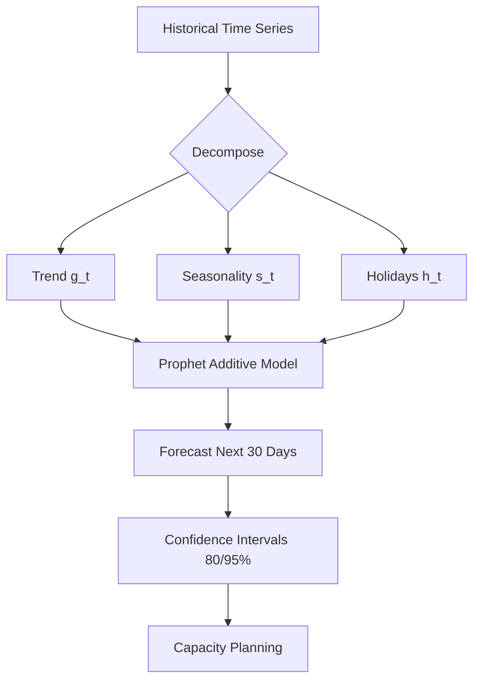

#### Interview Question

**Q:** Prophet vs ARIMA — kab kaunsa pick karega?

**A:** **Prophet** pick karunga jab: (1) data mein **multiple seasonalities** hain (daily, weekly, yearly) — Fourier-based handling automatic; (2) **holidays/events** important hain — Prophet me natively list de sakte ho; (3) **missing data / outliers** hain — robust by design; (4) **non-technical team** model maintain karegi — Prophet API friendly hai; (5) **business interpretability** chahiye — trend/seasonality/holiday plots clean hain. **ARIMA** pick karunga jab: (1) **rigorous statistical inference** chahiye — confidence intervals theoretically grounded; (2) **stationary series** with clear AR/MA structure; (3) **short-term high-accuracy** forecasting (1-7 days ahead) — ARIMA often Prophet ko narrow window mein beat karta hai; (4) **regulated environments** (finance, banking) jaha statistical pedigree mandatory. Practical: mai dono race karwata hu plus simple **naive baseline** (yesterday's value) — agar Prophet-ARIMA ka lift naive pe <20%, model ka maintenance cost worth nahi.

---

### 4.4 Customer segmentation — RFM, K-means

#### Definition (kya hai?)

Segmentation = customers ko homogeneous groups mein todna for differentiated treatment.

**RFM** — Recency (last purchase kab tha), Frequency (kitne baar kharida), Monetary (kitna spend) — har customer ko 3 dimensions pe score (typically 1-5 quintile), 5×5×5 = 125 segments collapse to 8-12 actionable.

**K-means clustering** — unsupervised, $k$ centroids initialize, iteratively assign + recompute. Minimizes within-cluster sum of squares:

$$\min \sum_{i=1}^{k} \sum_{x \in C_i} \|x - \mu_i\|^2$$

#### Why?

Marketing one-size-fits-all dead hai. RFM/K-means se "champions" vs "at risk" vs "new" segments identify hote hain — har segment ka treatment alag (loyalty rewards, win-back, onboarding). Conversion rates 2-5x improve hote hain.

#### How? (Python)

```python
import pandas as pd
import numpy as np
from sklearn.cluster import KMeans
from sklearn.preprocessing import StandardScaler
from sklearn.metrics import silhouette_score

# Flipkart: RFM segmentation
df = pd.read_csv("flipkart_orders.csv", parse_dates=["order_date"])
snapshot_date = df["order_date"].max() + pd.Timedelta(days=1)

rfm = df.groupby("customer_id").agg(
    recency=("order_date", lambda x: (snapshot_date - x.max()).days),
    frequency=("order_id", "count"),
    monetary=("order_value", "sum")
).reset_index()

# RFM scores (quintiles)
rfm["R_score"] = pd.qcut(rfm["recency"], 5, labels=[5, 4, 3, 2, 1])  # lower recency better
rfm["F_score"] = pd.qcut(rfm["frequency"].rank(method="first"), 5, labels=[1, 2, 3, 4, 5])
rfm["M_score"] = pd.qcut(rfm["monetary"], 5, labels=[1, 2, 3, 4, 5])
rfm["RFM_score"] = rfm["R_score"].astype(str) + rfm["F_score"].astype(str) + rfm["M_score"].astype(str)

# Map to actionable segments
def segment(row):
    r, f, m = int(row["R_score"]), int(row["F_score"]), int(row["M_score"])
    if r >= 4 and f >= 4 and m >= 4: return "Champions"
    if r >= 3 and f >= 3: return "Loyal"
    if r >= 4 and f <= 2: return "New Customers"
    if r <= 2 and f >= 3: return "At Risk"
    if r <= 2 and f <= 2: return "Lost"
    return "Need Attention"

rfm["segment"] = rfm.apply(segment, axis=1)
print(rfm["segment"].value_counts())

# K-means alternative — let data find clusters
features = rfm[["recency", "frequency", "monetary"]].apply(lambda x: np.log1p(x))
scaler = StandardScaler()
X_scaled = scaler.fit_transform(features)

# Find optimal k with silhouette + elbow
for k in range(3, 9):
    km = KMeans(n_clusters=k, n_init=10, random_state=42).fit(X_scaled)
    sil = silhouette_score(X_scaled, km.labels_)
    print(f"k={k}: silhouette={sil:.3f}, inertia={km.inertia_:.0f}")

# Final clustering
km_final = KMeans(n_clusters=5, n_init=10, random_state=42).fit(X_scaled)
rfm["cluster"] = km_final.labels_
print(rfm.groupby("cluster")[["recency", "frequency", "monetary"]].mean())
```

#### Real-life Example

Flipkart marketing team RFM segmentation chalati hai 200M+ users pe. "Champions" segment (top 8%) — high R, F, M — rewards program ke saath premium offers. "At Risk" (high F, low R — past loyal but disengaged) — personalized win-back ₹500 voucher. "New Customers" — onboarding journey + AOV-boost nudges. K-means se discover hua ek hidden cluster: "Festival shoppers" — sirf BBD/Republic Day pe active, dormant rest of year. Special "Festival Pre-Launch" preview campaign ne is segment ka annual GMV 28% increase kiya.

#### Diagram

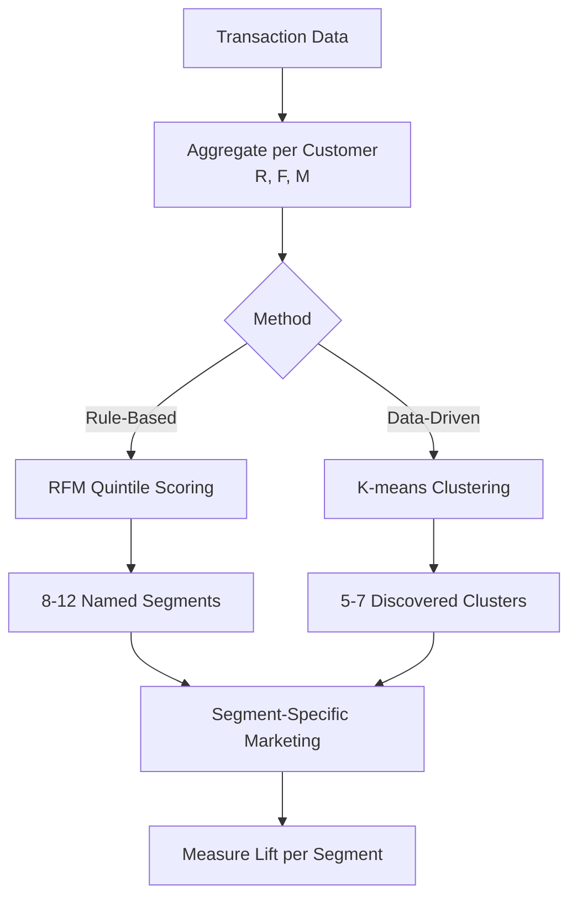

#### Interview Question

**Q:** RFM aur K-means dono customer segmentation karte hain. Tu kab kaunsa pick karega?

**A:** **RFM** pick karunga jab: (1) **business already has segment strategy** in mind (champions, at-risk, new) — RFM directly maps to actionable named segments; (2) **stakeholders want interpretable rules** — "recency 4-5 + frequency 4-5 = champion" is easy to explain; (3) **cross-team consistency** — har analyst RFM se same segments produce karega, K-means run-to-run vary kar sakta hai. **K-means** pick karunga jab: (1) **discovery mode** — kya unknown segments hidden hain? (2) **multi-dimensional features** beyond RFM — engagement metrics, product affinities, demographics combine karne hain; (3) **feature interactions matter** — K-means non-additive patterns capture kar sakta hai. Practically — both run karta hu — RFM as baseline, K-means with 6-10 features for richer segmentation. Compare segments side-by-side, sometimes hybrid karta hu (RFM as primary, K-means within "Champions" subgroup to find sub-personas).

---

### 4.5 Anomaly detection

#### Definition (kya hai?)

Anomaly detection = unusual data points identify karna jo "normal" pattern se deviate karte hain. Three flavors:

- **Statistical**: z-score, IQR — assume distribution
- **Distance/Density-based**: Isolation Forest, LOF (Local Outlier Factor) — distance-based
- **Reconstruction-based**: Autoencoders — neural network reconstructs, high reconstruction error = anomaly

Isolation Forest: random feature → random split, outliers are isolated in fewer splits. Anomaly score based on path length:

$$s(x, n) = 2^{-\frac{E(h(x))}{c(n)}}$$

where $E(h(x))$ = average path length, $c(n)$ = normalization. Score close to 1 = anomaly.

#### Why?

Fraud detection, system monitoring, data quality checks, customer support escalation — anomaly detection underpins. Unsupervised so labeled fraud data ki need nahi (cold-start fraud detection).

#### How? (Python)

```python
from sklearn.ensemble import IsolationForest
from sklearn.neighbors import LocalOutlierFactor
import pandas as pd
import numpy as np

# Paytm: anomalous transaction detection (no labels assumed)
df = pd.read_csv("paytm_txns.csv")
features = ["amount", "txn_count_last_1h", "device_age_hours", "ip_distance_from_usual_km",
            "merchant_risk_score", "hour_of_day", "amount_vs_user_avg_ratio"]
X = df[features]

# Isolation Forest
iso = IsolationForest(contamination=0.01, n_estimators=200, random_state=42)
df["iso_score"] = iso.fit_predict(X)  # -1 = anomaly, 1 = normal
df["iso_anomaly_score"] = -iso.score_samples(X)  # higher = more anomalous

# Local Outlier Factor
lof = LocalOutlierFactor(n_neighbors=50, contamination=0.01)
df["lof_score"] = lof.fit_predict(X)

# Top anomalies
top_anomalies = df.nlargest(100, "iso_anomaly_score")
print(top_anomalies[["txn_id", "amount", "iso_anomaly_score"] + features])

# Operationalize — flag for review queue
df["needs_review"] = (df["iso_score"] == -1) | (df["lof_score"] == -1)
print(f"Flagged: {df['needs_review'].sum()} of {len(df)} ({df['needs_review'].mean()*100:.2f}%)")
```

#### Real-life Example

Paytm fraud team Isolation Forest run karti hai 200K txn/min stream pe — anomaly score top 0.5% txns realtime review queue mein jaate hain. Combination unsupervised (IF) + supervised (XGBoost trained on confirmed fraud) → ensemble. IF naye fraud patterns catch karta hai jo training data mein nahi the (zero-day fraud), XGBoost known patterns pe high-precision deta hai. Together — ₹600Cr+ annual fraud prevention. Plus IF data quality monitoring ke liye bhi use hota hai — agar daily transaction distribution suddenly shift, alert ho jaata hai engineering team ko (likely upstream bug).

#### Diagram

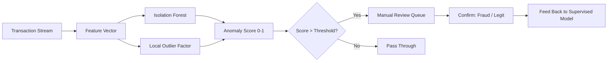

#### Interview Question

**Q:** Tu Isolation Forest se 1% transactions flag kar raha hai — review team overwhelmed hai. Optimization kaise karega?

**A:** Multi-layered approach: (1) **threshold tuning** — `contamination` 0.01 se 0.005 reduce karo, only top 0.5% flag; (2) **ensemble with supervised** — IF flag + XGBoost (trained on past confirmed fraud) ka concordance check, dono agree karein toh high-priority queue, sirf IF flag toh low-priority; (3) **segment-specific thresholds** — high-amount txns pe stricter review (low threshold), small-amount loose; (4) **feedback loop** — review team's confirm/reject labels back to supervised model, monthly retrain — false positive rate decay over time; (5) **cost-based prioritization** — flag list ko expected loss × probability se sort karo, top by expected ₹ loss review karo first. Plus measure review team's **precision** (kitne flags actually fraud) — agar 5% precision se 25% pe le aaye 6 months mein, 5x throughput same headcount pe. Top 2% analyst ML model deploy karke chhodta nahi — operational metric (precision, MTTR, queue depth) bhi own karta hai.

---

## 5. When NOT to Use ML

Ye section probably most underrated hai — but career-defining hai. 60% ML projects fail karte hain, aur reason aksar ye hota hai ki problem ML ki nahi thi.

### 5.1 When SQL gets you 90% there

#### Definition (kya hai?)

ML overhead bahot hai — data eng, training, validation, deployment, monitoring, retraining. Ye costs justified hain only when ML signal SQL/heuristic baseline se substantively better hai. Aksar — surprise — SQL aggregations + business rules 90% problem solve kar dete hain, baki 10% ML ka effort 100x hai.

#### Why?

Real-life decision tree:
1. Problem statement clear hai?
2. SQL query / dashboard se solve ho sakta hai? → **DO THAT**
3. Simple business rule (if-else) se solve ho sakta hai? → **DO THAT**
4. Statistical model (regression) interpretable enough hai? → **DO THAT**
5. Bahut complex pattern hai, supervised data hai, ROI clear hai? → **THEN ML**

Steps 2-4 mein ruk gaya — ML mat lagao. Steps 5 tak pahuncha — strict ROI calculation karo before greenlight.

#### How? (Decision Framework + Code)

```python
# Decision framework — ROI estimate before committing
def should_use_ml(problem_size, sql_baseline_value, ml_lift_estimate,
                  ml_build_cost, ml_maintain_cost_yearly, project_duration_years=2):
    """
    Returns recommendation: SQL, Business Rules, or ML
    """
    # SQL baseline value
    sql_value = sql_baseline_value * project_duration_years

    # ML projected value
    ml_value = sql_baseline_value * (1 + ml_lift_estimate) * project_duration_years
    ml_total_cost = ml_build_cost + ml_maintain_cost_yearly * project_duration_years

    incremental_value = ml_value - sql_value - ml_total_cost
    incremental_roi = incremental_value / ml_total_cost if ml_total_cost > 0 else 0

    if incremental_value < 0:
        return f"DON'T USE ML. SQL gives ₹{sql_value:.0f}, ML net ₹{incremental_value:.0f} (negative)"
    elif incremental_roi < 1:
        return f"BORDERLINE. Incremental ROI {incremental_roi:.2f}x — only do if strategic"
    else:
        return f"USE ML. Incremental ROI {incremental_roi:.2f}x, net value ₹{incremental_value:.0f}"

# Example: churn prediction at small startup vs large telecom
# Small startup: 50K users, ARPU ₹500/year
print(should_use_ml(
    problem_size=50000,
    sql_baseline_value=50000 * 500 * 0.05,  # 5% reduction via simple recency rules
    ml_lift_estimate=0.03,  # 3% additional reduction with ML
    ml_build_cost=2000000,  # ₹20L build
    ml_maintain_cost_yearly=1500000  # ₹15L/year maintain
))
# Output: BORDERLINE or DON'T USE — ML overhead too high for problem size

# Large telecom: 50M users, ARPU ₹3000/year
print(should_use_ml(
    problem_size=50000000,
    sql_baseline_value=50000000 * 3000 * 0.05,
    ml_lift_estimate=0.03,
    ml_build_cost=10000000,  # ₹1Cr build
    ml_maintain_cost_yearly=5000000  # ₹50L/year maintain
))
# Output: USE ML. Massive scale justifies investment.
```

#### Real-life Examples (Don't Use ML)

**Razorpay merchant onboarding — initial idea**: ML model predict karega "kaunsa merchant likely to churn in first 30 days" → personalized onboarding flow. Analyst ne pehle SQL likhi: `WHERE first_txn_lag_days > 7 OR kyc_pending = 1 OR support_ticket_in_first_3d > 0` — ye 3 conditions ne 78% of churners catch kiye. Simple SMS reminders + KYC follow-up calls on this segment → churn 24% reduce. ML build karne ki need nahi padi — ek SQL view + ops process ne 4 weeks mein launch kiya. ML-based version 6 months ki effort se 28% reduction de paati — incremental 4% nahi worth ₹40L+ ka build.

**Swiggy menu recommendation — ek failed ML attempt**: Team ne deep learning recommendation system 8 months mein banayi. A/B test result: 0.3% CTR uplift over baseline (which was popularity-based + cuisine-affinity SQL). Maintenance cost ₹30L/month. Killed the system, reverted to SQL-based. Lesson: 0.3% lift on ₹X revenue base must beat ₹360L annual cost — usually doesn't unless scale is massive.

#### Diagram

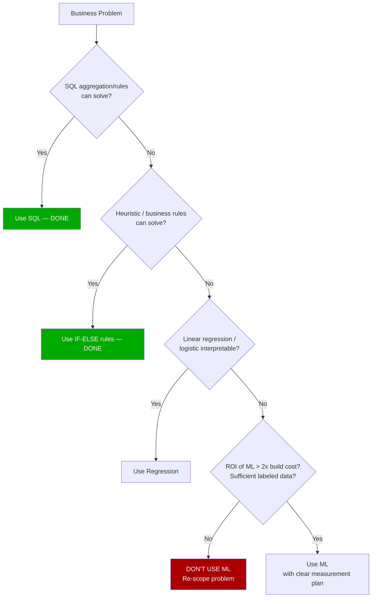

#### Interview Question

**Q:** Tu naye startup mein join kiya. CEO bolta hai "humein churn prediction ML chahiye next quarter ke liye." Tu kya respond karega?

**A:** Direct "yes" nahi karunga — pehle 5 questions: (1) **kitne customers hain?** Below 10K — ML ka data chhota hai, regression bhi unstable; (2) **ARPU aur churn rate kya hai?** Total churn ₹ value calculate karunga — agar saalana ₹50L se kam hai, ML build cost (₹15-30L) + maintain (₹10L/year) justify nahi; (3) **labeled churn data kitna hai?** 6 months minimum chahiye historical data, kam hai toh statistical instability; (4) **current state kya hai?** SQL aggregations / cohort dashboards exist? Most basic recency-based segment exist hai? Agar nahi — pehle wahi build karo, 80% value waha milegi; (5) **business action plan kya hai?** Predict toh kar lenge, retention offers ka budget aur ops capacity hai? Bina action ke prediction useless. Honest recommendation aksar hota hai: "Phase 1 — SQL-based RFM segmentation + recency-based retention rules (4 weeks). Measure for 3 months. Phase 2 — agar lift plateau ho jaaye aur scale justify kare, predictive ML add karenge." Top 2% analyst CEO ko "no" bolne se darrta nahi — actually "no" bol ke trust earn karta hai, kyunki bekaar projects pitch karne wale 6 months mein blamed hote hain.

---

> **Bottom line:** ML for analyst means baseline competence, not deep specialization. Linear/logistic regression interpret kar pana, XGBoost run kar pana, SHAP plot stakeholder ko dikha pana, RMSE/AUC sahi report kar pana — yahi top 2% ka skill stack hai. Aur sabse important — ML ka kab use NA karna hai woh judgment. Tu agar SQL se 90% kaam kar sakta hai, ML mat use kar. Agar ML use karega, business cost-benefit explicit rakhna, holdout group rakhna, calibration check karna, SHAP se explain karna. Deployment data scientists ka headache hai — interpretation tera. Yahin pe analyst aur scientist ka role split clean rehta hai, aur tu apne lane mein top 2% ban jaata hai.
