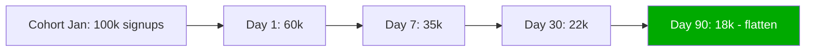
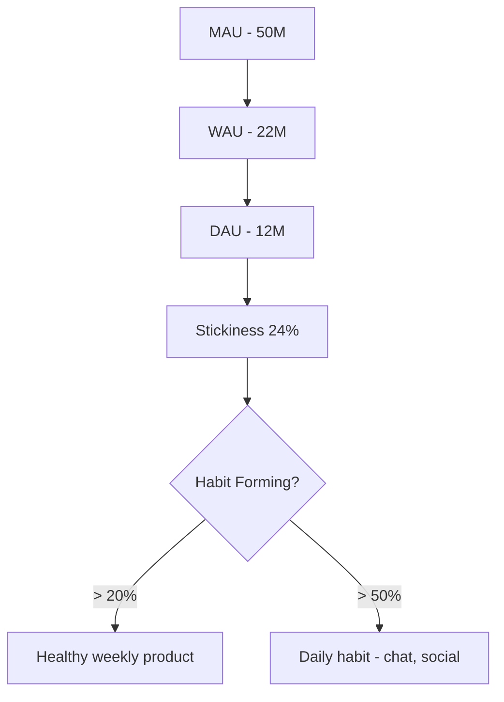
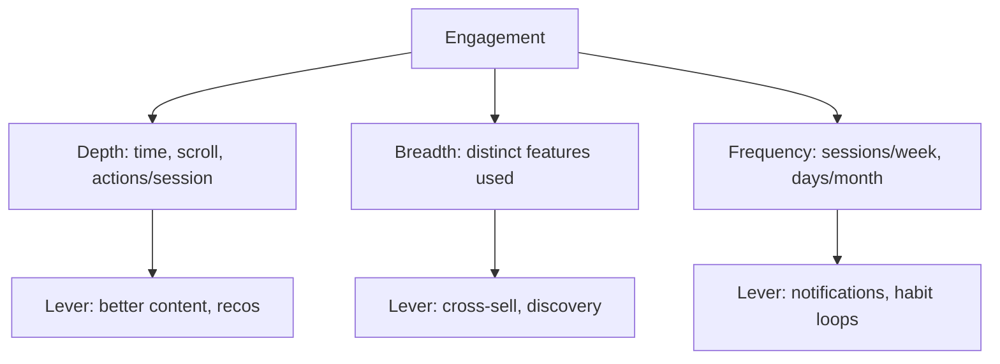
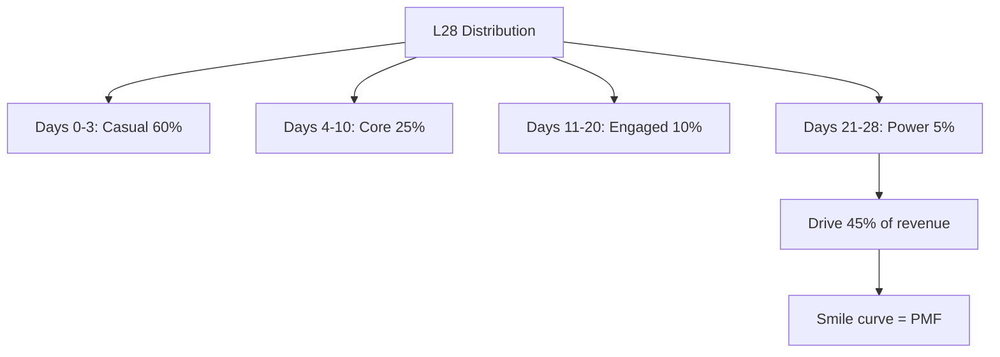
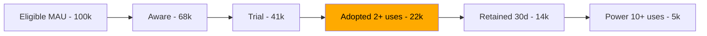
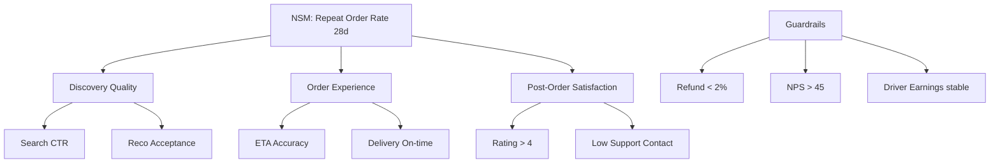
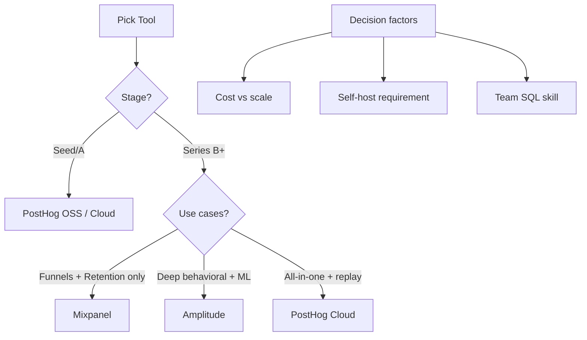

# Product Analytics

Product analyst is the closest data role to PM — top 2% PMs hire top 2% analysts as their right hand. Yahaan tu sirf SQL clerk nahi hai — tu PM ke decisions ka co-pilot hai. Roadmap kya prioritize karein, kaunsa feature kill karein, retention curve ke konse step pe paisa lagayein, NSM kaunsa pick karein — har ek question pe top 2% analyst ek opinion deta hai (data-backed) jo PM ke launch decision ka 30-40% weight hota hai.

Ye subject tujhe wahi muscle dega — funnels ko surgically decompose karna, retention curves padhna jaise CFO P&L padhta hai, DAU/MAU stickiness ko dekh ke samajhna ki product habit-forming ban raha hai ya nahi, power user curves se realize karna ki tera 80% revenue 5% users se aata hai, feature adoption ko ship-and-forget se ship-and-measure mein convert karna, NSM ka driver tree banana, aur Amplitude vs Mixpanel vs PostHog ke beech mein context ke hisab se sahi tool pick karna. Sab Hinglish mein, Indian product unicorns (Swiggy, Zomato, Sharechat, CRED, Meesho, BookMyShow, Inshorts) ke real examples ke saath. Tu agar ye 14 ghante seriously laga deta hai, tera next standup mein PM bolega "yaar tu PM ke saath co-author hai is feature ka."

---

## 1. Product Metrics

Product analytics ka backbone yahan se shuru hota hai. Funnel mein drop kahan hai, retention curve flatten ho rahi hai ya decay continue, DAU/MAU stickiness move kar rahi hai, aur power users kaun hain — ye 4 lenses se tu kisi bhi consumer product ki health diagnose kar sakta hai.

### 1.1 Funnels, retention curves, cohorts

#### Definition (kya hai?)

- **Funnel** — sequential steps jo user product mein cross karta hai. Each step pe drop-off measure hota hai. Example: app open → search → add to cart → checkout → payment success.
- **Retention curve** — kisi cohort ke users ka percentage jo Day N pe wapas active hain. Y-axis: % retained, X-axis: days since signup. Healthy curves "smile" karte hain — initial decay ke baad flat ho jaate hain.
- **Cohort** — same time-window mein onboarded users ka group. Most common: weekly signup cohort.

#### Why?

Aggregate retention number ek lie hai. "30% MAU retention" matlab kuch nahi — kyunki naye users aur purane users mix hote hain. Cohort analysis time ko isolate karta hai, taaki tu compare kar sake "Jan cohort vs Feb cohort — kya new onboarding flow se Day 7 retention up hua?" Funnels batate hain kahan paisa leak ho raha hai. Retention curve batati hai product habit-forming hai ya nahi. Top 2% analyst dono daily dekhta hai.

#### How?

```sql
-- Cohort retention: weekly signup cohort × week_offset
WITH cohort AS (
  SELECT user_id,
         DATE_TRUNC('week', signup_at) AS cohort_week
  FROM users
  WHERE signup_at >= CURRENT_DATE - INTERVAL '90 days'
),
activity AS (
  SELECT c.user_id,
         c.cohort_week,
         DATE_TRUNC('week', e.event_at) AS active_week,
         FLOOR(EXTRACT(EPOCH FROM (e.event_at - c.cohort_week)) / 604800) AS week_offset
  FROM cohort c
  JOIN events e ON e.user_id = c.user_id
  WHERE e.event_name = 'app_open'
)
SELECT cohort_week,
       week_offset,
       COUNT(DISTINCT user_id) AS active_users,
       ROUND(100.0 * COUNT(DISTINCT user_id) /
             FIRST_VALUE(COUNT(DISTINCT user_id))
             OVER (PARTITION BY cohort_week ORDER BY week_offset), 2) AS retention_pct
FROM activity
GROUP BY 1, 2
ORDER BY 1, 2;
```

#### Real-life Example

Swiggy ka analyst Bangalore vs Tier-2 cities ke 2025 Q4 cohort retention curves compare kiya. Bangalore curve Day 30 pe 42% pe flatten hoti hai (loyal core), Tier-2 Day 30 pe 18% — aur curve abhi bhi decay ho rahi hai. Diagnostic: Tier-2 mein restaurant supply density kam hai, repeat order ke liye options nahi. Recommendation: 3 cities pick karo, restaurant onboarding ka aggressive push, expected Day 30 retention 30% tak. PM ne usi quarter ₹12Cr supply expansion budget approve kiya — analyst ki cohort retention slide ki wajah se.

#### Diagram



#### Interview Question

**Q:** Aggregate retention 30% hai — but tu cohort retention dekhne pe insist karta hai. Kyu?

**A:** Aggregate mix hota hai. Suppose 1L users hain — 50K Jan cohort (40% retained), 50K Feb cohort (20% retained, naya promo-led acquisition se low quality). Average 30%, but trend cohort-by-cohort ulta hai — naye cohorts ki quality gir rahi hai. Aggregate flat dikhega, cohort split karte hi alarm bajega. Top 2% analyst aggregate kabhi report nahi karta bina cohort decomposition ke. Plus cohort retention curves "shape" reveal karte hain — flat curve = product-market fit, perpetually decaying = no fit, smile = re-engagement working.

---

### 1.2 DAU/WAU/MAU, stickiness ratios

#### Definition (kya hai?)

- **DAU** — Daily Active Users. Unique users jo aaj active the (app open, ya specific qualifying action).
- **WAU** — Weekly Active Users. Trailing 7-day unique active.
- **MAU** — Monthly Active Users. Trailing 28 ya 30-day unique active.
- **Stickiness = DAU/MAU** — % of monthly users jo daily aate hain. Industry benchmarks: WhatsApp ~85%, Instagram ~50%, Swiggy ~12%, BookMyShow ~3%.
- **WAU/MAU** — softer stickiness, weekly habit ko measure karta hai.

#### Why?

Stickiness ratio batata hai product habit-forming hai ya occasional-use. Daily-use product (chat, social, news) target 50%+. Weekly-use (food delivery, content) target 15-25%. Occasional (ticket booking, real estate) 3-5% bhi healthy hai. Galat benchmark se galat panic — Zomato analyst 12% DAU/MAU dekh ke "we're failing" bola toh bewakoof banega; benchmark 12-15% hi sahi hai food delivery mein.

#### How?

```sql
-- DAU, WAU, MAU, stickiness for last 30 days
WITH daily AS (
  SELECT DATE(event_at) AS day,
         COUNT(DISTINCT user_id) AS dau
  FROM events
  WHERE event_name = 'app_open'
    AND event_at >= CURRENT_DATE - INTERVAL '60 days'
  GROUP BY 1
),
rolling AS (
  SELECT day,
         dau,
         COUNT(DISTINCT user_id) FILTER (
           WHERE event_at BETWEEN day - INTERVAL '6 days' AND day
         ) OVER () AS wau,
         COUNT(DISTINCT user_id) FILTER (
           WHERE event_at BETWEEN day - INTERVAL '27 days' AND day
         ) OVER () AS mau
  FROM events e
  JOIN daily d ON DATE(e.event_at) = d.day
)
SELECT day,
       dau, wau, mau,
       ROUND(100.0 * dau / NULLIF(mau, 0), 2) AS stickiness_dau_mau,
       ROUND(100.0 * wau / NULLIF(mau, 0), 2) AS wau_mau
FROM rolling
ORDER BY day DESC;
```

#### Real-life Example

Sharechat ka 2025 stickiness DAU/MAU 38% pe pahuncha — content product ke liye world-class. Diagnostic deep dive — regional creator economy launch ke baad creators daily content drop kar rahe hain, users ki habit form ho gayi. Compare karo with their 2022 numbers (24%) — pure ML feed personalization investment se +14 points. Iska business impact: ad inventory 60% up because daily impressions multiply hue, ARPU +35%. Analyst ne weekly stickiness dashboard ke saath driver tree banaya — creator supply, feed relevance, notification CTR — sab DAU/MAU ko move karte hain.

#### Diagram



#### Interview Question

**Q:** BookMyShow ka DAU/MAU 4% hai. Iska matlab product fail hai?

**A:** Bilkul nahi — context-dependent metric hai. BookMyShow ka use case "occasional ticket booking" hai — koi har din movie nahi dekhta. 4% DAU/MAU normal aur healthy hai is segment ke liye. Better metric: "purchase frequency per active user" (orders/user/month) ya "revenue per MAU." Agar yahan growth flat ho — toh worry. Top 2% analyst metric ko use case ke saath calibrate karta hai — chat app ke liye 4% disaster, ticket app ke liye baseline. Plus BookMyShow ko WAU/MAU bhi nahi, "MAU per quarter" bhi consider karna chahiye — kyunki user-cycle 1-3 months hai. Wrong cadence = wrong story.

---

### 1.3 Engagement — depth, breadth, frequency

#### Definition (kya hai?)

Engagement teen orthogonal axes pe measure hota hai:

- **Depth** — har session mein user kitna deep jaata hai. Time spent, screens viewed, scroll depth, items added to cart.
- **Breadth** — kitne distinct features/sections use karta hai. Feature breadth = unique features touched per user / total features.
- **Frequency** — kitni baar wapas aata hai. Sessions per user per week, days active per month.

Triangle: depth × breadth × frequency = engagement volume.

#### Why?

Single metric ("DAU") incomplete picture hai. User daily aata hai (frequency high) but 5 seconds use karke chala jaata hai (depth low) — product engaged nahi hai. Ya user 2 hour spend karta hai (depth high) but week mein 1 baar (frequency low) — habit nahi hai. Top 2% analyst teeno dimensions ko track karta hai aur trade-offs explicitly call out karta hai. Meesho ke board mein "engagement up" claim karne se pehle teen alag charts dikhane padte hain.

#### How?

```sql
-- Engagement triangle for active users last 30 days
WITH user_eng AS (
  SELECT user_id,
         COUNT(DISTINCT DATE(event_at))                          AS days_active,   -- frequency
         COUNT(DISTINCT feature_name)                            AS features_used, -- breadth
         AVG(session_duration_sec)                               AS avg_session,   -- depth
         SUM(events_in_session)                                  AS total_events
  FROM events
  WHERE event_at >= CURRENT_DATE - INTERVAL '30 days'
  GROUP BY 1
)
SELECT
  CASE
    WHEN days_active >= 20 AND features_used >= 4 AND avg_session > 180 THEN 'Power'
    WHEN days_active >= 10 AND features_used >= 2 AND avg_session > 90  THEN 'Core'
    WHEN days_active >= 3                                                THEN 'Casual'
    ELSE 'At-risk'
  END AS engagement_tier,
  COUNT(*) AS users,
  AVG(days_active) AS avg_days,
  AVG(features_used) AS avg_breadth,
  AVG(avg_session) AS avg_depth_sec
FROM user_eng
GROUP BY 1
ORDER BY 1;
```

#### Real-life Example

Meesho ka 2025 engagement deep dive — frequency stable thi (8 sessions/week), depth flat (~6 min/session), but **breadth** sirf 1.4 categories per user. Insight: users sirf fashion category mein stuck the, home decor / kitchen / electronics dekh hi nahi rahe the. Recommendation — homepage personalization shift "category discovery" pe, cross-sell carousels. 6 months baad breadth 2.7 categories per user pe pahuncha, AOV +28%, GMV per user +41%. Same DAU, same frequency — but breadth lever pull karke ₹400Cr incremental annualized GMV. Engagement triangle ki teesri side ne paisa banaya.

#### Diagram



#### Interview Question

**Q:** Inshorts PM ne pucha "engagement up karna hai." Tu kaha start karega?

**A:** Pehle current engagement decompose karunga — depth, breadth, frequency teeno dimensions pe. Inshorts ka core hai 60-second news cards. Likely depth (cards per session) saturated ho — 12-15 cards per session natural ceiling hai. Frequency (sessions/day) bhi habituated users ke liye 3-4 saturated. Highest unlock breadth mein hota hai — categories beyond default (Tech, Sports, Business, Regional Hindi/Tamil). Hypothesis: agar regional language section pe push kiya jaaye, breadth +1.2 categories aur retention +15% hoga. Recommendation A/B test — homepage pe "Languages" prominent CTA, expected +8% DAU lift. PM ko driver tree pe mapping diya, business case ₹X Cr ad revenue uplift, 6-week test plan. Yahi se "great analyst" wala memo banta hai.

---

### 1.4 Power user curves, L7/L28

#### Definition (kya hai?)

- **Power user curve** (a.k.a. L-curve, smile curve) — histogram of users by "days active in last 28 days" (0 to 28). X-axis: days active, Y-axis: % users. Healthy social/daily product mein right side (28-day actives) pe spike dikhti hai — "smile."
- **L7** — Users jo last 7 days mein 7/7 din active the (perfect attendance week).
- **L28** — Last 28 days mein active days count distribution. L28 = 28 means daily user. L28 = 1 means casual.

Ye Facebook/Reforge ne popularize kiya. Top consumer products mein L28 distribution clearly bimodal hota hai.

#### Why?

Average engagement metric hide karta hai distribution. Tujhe power users (top 5-10% who drive 50%+ of revenue) clearly identify karne padte hain — kyunki acquisition strategy, monetization, NPS sab unke around design hote hain. Plus power user curve ka shape product-market fit ka sabse honest indicator hai. Decay curve = no fit. Smile curve = fit.

#### How?

```sql
-- L28 power user histogram
WITH days_active AS (
  SELECT user_id,
         COUNT(DISTINCT DATE(event_at)) AS active_days
  FROM events
  WHERE event_at >= CURRENT_DATE - INTERVAL '28 days'
    AND event_name = 'app_open'
  GROUP BY 1
)
SELECT active_days,
       COUNT(*) AS users,
       ROUND(100.0 * COUNT(*) / SUM(COUNT(*)) OVER (), 2) AS pct_of_users
FROM days_active
GROUP BY 1
ORDER BY 1;

-- L7: perfect attendance week
SELECT COUNT(*) AS l7_users
FROM (
  SELECT user_id, COUNT(DISTINCT DATE(event_at)) AS d
  FROM events
  WHERE event_at >= CURRENT_DATE - INTERVAL '7 days'
  GROUP BY 1
  HAVING COUNT(DISTINCT DATE(event_at)) = 7
) x;
```

```python
# Cohort retention heatmap in pandas
import pandas as pd
import seaborn as sns
import matplotlib.pyplot as plt

df = pd.read_csv('cohort_retention.csv')  # cohort_week, week_offset, retention_pct
heatmap = df.pivot(index='cohort_week', columns='week_offset', values='retention_pct')
plt.figure(figsize=(14, 8))
sns.heatmap(heatmap, annot=True, fmt='.0f', cmap='YlGnBu', cbar_kws={'label': 'Retention %'})
plt.title('Weekly Cohort Retention - Swiggy 2025 H2')
plt.xlabel('Weeks Since Signup')
plt.ylabel('Signup Cohort Week')
plt.tight_layout()
plt.savefig('cohort_heatmap.png', dpi=150)
```

#### Real-life Example

BookMyShow analyst ne L28 curve banayi — clearly bimodal: 75% users 1-3 days active (occasional bookers), 4% users 15+ days active (cinephiles, multi-show bookers). Top 4% = power users = 38% of revenue. Diagnostic: power users mostly Mumbai/Bangalore metro, premium screens (PVR/INOX), monthly avg 4.2 bookings vs casual 0.4. Recommendation: dedicated "BMS Black" loyalty tier — early access to F1, IPL, concerts. 9 months baad power user count 4% → 6.2%, total revenue +18% from same MAU base. Power user curve ka shape directly product strategy banata hai.

#### Diagram



#### Interview Question

**Q:** Zomato ka L7/L28 stickiness pichle 6 mahine mein flat hai. Tu kya investigate karega?

**A:** Pehle L28 distribution ka shape compare karunga 6 months pehle vs aaj — average flat hai but distribution shift ho sakti hai (e.g., power users gir gaye but casuals badh gaye, average maintain hua). Phir cohort-by-cohort breakdown — kya naye cohorts ka L7 conversion gir raha hai? Kya Zomato Gold (subscription) members ka L28 alag move kar raha hai? City-level slicing — Tier-1 saturated, Tier-2 ka opportunity. Feature usage angle — dining-out vs delivery vs Hyperpure split mein L28 kaisa hai? Hypothesis: power users ka share gir raha hai because Swiggy One ka aggressive subscription pull. Recommendation — Zomato Gold ki value-prop sharpen karo (free delivery + 20% off premium restaurants), expected power user share +1.8 pts. Memo with driver tree, 4-week test plan, board-ready slide.

---

## 2. Feature & North Star Analysis

Product analyst ka bada chunk feature launches aur NSM tracking ke around hota hai. Feature ship kiya — adoption kaisi hui, retention kis cohort ki badhi, NSM kitna move hua, kya negative side-effects guardrails pe aaye — sab measure karna analyst ka kaam hai.

### 2.1 Feature adoption analysis

#### Definition (kya hai?)

Feature adoption metric hierarchy:

- **Awareness** — % MAU jinhone feature dekha (impression / entry-point view).
- **Trial** — % aware users jinhone ek baar try kiya.
- **Adoption** — % trial users jinhone feature ko 2+ times use kiya (habit formation threshold).
- **Retention of feature** — Adopted users mein se kitne 30/60/90 days baad bhi use kar rahe hain.
- **Power adoption** — adopted users jinhone feature ko 10+ times use kiya (deep adoption).

Standard funnel: Awareness → Trial → Adopted → Retained.

#### Why?

Most PMs feature ship karte hain, "1L users ne use kiya!" announce karte hain — but us 1L mein se 70% ek baar try karke chhod dete hain. Adoption ≠ trial. Top 2% analyst feature launch ke 30 days baad adoption funnel decompose karta hai aur PM ko clear answer deta — feature stick hua ya nahi, retention pe impact, NSM pe contribution. Bina is rigour ke product roadmap "feature factory" ban jaata hai jisme nothing actually moves the needle.

#### How?

```sql
-- CRED rewards feature adoption funnel
WITH cohort AS (
  SELECT user_id
  FROM users
  WHERE signup_at <= CURRENT_DATE - INTERVAL '60 days'
    AND last_active_at >= CURRENT_DATE - INTERVAL '30 days'
),
feat AS (
  SELECT c.user_id,
         MAX(CASE WHEN e.event_name = 'rewards_tab_view'   THEN 1 END) AS aware,
         COUNT(CASE WHEN e.event_name = 'reward_redeemed'  THEN 1 END) AS redemptions,
         MAX(CASE WHEN e.event_name = 'reward_redeemed'    THEN 1 END) AS tried,
         MAX(CASE WHEN e.event_name = 'reward_redeemed'
                   AND e.event_at >= CURRENT_DATE - 7 DAYS THEN 1 END) AS retained_7d
  FROM cohort c
  LEFT JOIN events e ON e.user_id = c.user_id
                     AND e.event_at >= CURRENT_DATE - INTERVAL '30 days'
  GROUP BY 1
)
SELECT COUNT(*)                                            AS eligible,
       SUM(aware)                                          AS aware,
       SUM(tried)                                          AS tried,
       SUM(CASE WHEN redemptions >= 2 THEN 1 END)          AS adopted,
       SUM(CASE WHEN redemptions >= 10 THEN 1 END)         AS power_adopted,
       SUM(retained_7d)                                    AS retained_7d,
       ROUND(100.0 * SUM(tried)   / COUNT(*),         2)   AS trial_pct,
       ROUND(100.0 * SUM(CASE WHEN redemptions >= 2 THEN 1 END)
                  / NULLIF(SUM(tried),0), 2)               AS adoption_pct
FROM feat;
```

#### Real-life Example

CRED rewards feature 2024 launch — pehle month: awareness 68%, trial 41%, adopted (2+ redemptions) 22%, retained 30 days 14%. Decent, par PM ko diagnostic chahiye — kya retain karne wale users ka credit card payment frequency badha? Cohort analysis: rewards-adopted users ka monthly payment frequency 2.1 → 3.4 (+62%). Iska matlab rewards engagement loop hai — primary product (payments) drive kar rahe. Recommendation: rewards prominence homepage pe badhao, expected payment frequency +18% across MAU. 12 months mein CRED ka NSM (members with payment + redemption) 35% → 51% MAU. Analyst ki memo me feature retention curve + payment frequency uplift = ₹X Cr revenue case.

#### Diagram



#### Interview Question

**Q:** Tu Swiggy ka analyst hai. "Genie" (any-pickup) feature 6 weeks pehle launch hua. PM bola "successful launch — 200K users used it." Tu kya counter-question puchega?

**A:** "200K used" sirf trial number hai — meaningless. Mere counter-questions: (1) Awareness — kitne MAU ne entry point dekha, kya icon discoverable hai? (2) Trial-to-adoption rate — 200K mein se kitne ne 2+ times use kiya? Genie habit-forming feature hai (errands run karne wala) — adoption kam hua to launch fail hai. (3) Cannibalization — kya Genie users ka core food order frequency gir raha hai? (4) Unit economics — Genie order ka delivery cost zyada (long distance), contribution margin kya hai? (5) Retention loop — Genie users ka 60-day retention vs non-Genie users? Likely insight: trial high tha because novelty + push notification, but adoption sirf 8% (16K). Recommendation — Genie ko core flow ke andar embed karo, awareness aur use-case clarity badhao. Top 2% analyst PM ke "successful" claim ko 4 alag layers pe interrogate karta hai.

---

### 2.2 North Star Metrics for products

#### Definition (kya hai?)

Product-level NSM = ek single metric jo product ki long-term success aur user value capture kare. Ye DAU/sign-up jaisi vanity metric nahi — value-delivered metric. Saath mein **input metrics** (drivers) and **guardrails** define hote hain.

NSM properties:
1. Value-aligned (user actual benefit measure kare)
2. Forward-looking (revenue ka leading indicator)
3. Actionable (team affect kar sake)
4. Single number (scoreboard nahi)

Examples:
- Swiggy Food: Orders per Active User per Week
- Zomato: Repeat order rate within 28 days
- Spotify: Time spent listening per user per week
- Sharechat: Engaged sessions (>3 min) per DAU

#### Why?

NSM ke bina engineering team feature count optimize karti hai, marketing team installs, PM team launches — sab apna apna metric chase karte hain, company drift karti hai. NSM common scoreboard banata hai. Driver tree ke through har sub-team apna ownership area dekhti hai. Top 2% analyst NSM ko driver tree mein decompose karta hai — har leaf node ek owner team ko map hota hai.

#### How?

```sql
-- Swiggy NSM: weekly orders per active user
WITH wau AS (
  SELECT DATE_TRUNC('week', event_at) AS wk,
         COUNT(DISTINCT user_id)      AS active_users
  FROM events
  WHERE event_name = 'app_open'
  GROUP BY 1
),
ord AS (
  SELECT DATE_TRUNC('week', placed_at) AS wk,
         COUNT(*)                      AS orders,
         COUNT(DISTINCT user_id)       AS ordering_users
  FROM orders
  WHERE status = 'delivered'
  GROUP BY 1
)
SELECT w.wk,
       w.active_users,
       o.ordering_users,
       o.orders,
       ROUND(1.0 * o.orders / NULLIF(o.ordering_users, 0), 2) AS orders_per_orderer,
       ROUND(1.0 * o.orders / NULLIF(w.active_users, 0), 2)   AS nsm_orders_per_wau
FROM wau w
LEFT JOIN ord o USING (wk)
ORDER BY w.wk DESC;
```

#### Real-life Example

Zomato 2023 mein NSM shift kiya "MAU" se "Repeat order rate within 28 days." Reasoning — MAU promo-driven thi, but repeat rate genuine product love capture karta hai. Driver tree:
- Repeat rate = Discovery quality × Order experience × Post-order satisfaction
  - Discovery: search relevance, recommendation CTR
  - Order experience: ETA accuracy, delivery reliability
  - Post-order: rating distribution, support contact rate

Har leaf ek team owns. 2024 mein repeat rate 38% → 47%, drove EBITDA-positive food delivery first time in company history. NSM picked carefully ka direct ROI.

#### Diagram



#### Interview Question

**Q:** Tu Inshorts ka product analyst hai. CEO ne pucha "humara NSM kya hona chahiye?" Tujhe kya pick karoge aur kyu?

**A:** Inshorts ka mission "60-second informed citizen" hai. Vanity options: DAU, app opens, total cards read. Better NSM: "Engaged Reading Sessions per Reader per Week" jahan engaged session = 5+ cards read aur 3+ minutes spent. Kyu? (1) DAU vanity — push notification se artificially boost ho sakta hai. (2) Cards read per session saturated hai (~12), capacity-bound. (3) Engaged sessions captures both habit (frequency × user) aur depth (5+ cards = real consumption). Driver tree: notification CTR (acquisition of session), feed relevance (depth in session), category breadth (breadth — regional language unlock). Guardrails: % users churning (gimmick fatigue), ad load per session (UX), creator/source diversity. Memo me NSM definition, baseline, target +20% in 12 months, sub-driver ownership map. CEO ko ek slide me clarity.

---

## 3. Product Analytics Tools

Tools sirf SQL aur dashboard nahi — Amplitude, Mixpanel, PostHog jaise dedicated product analytics platforms PM-analyst workflow ka 60% cover karte hain. Sahi tool pick karna company stage, budget, aur use case ka function hai.

### 3.1 Amplitude vs Mixpanel vs PostHog — pick & ship

#### Definition (kya hai?)

Teen leading product analytics tools, har ek ka distinct positioning:

- **Amplitude** — enterprise-grade, deep cohorts/funnels, strong "behavioral analytics," ML-powered predictions. Pricing: free tier 10M events/month, paid $40K-200K/year. Indian customers: Swiggy, PhonePe, Razorpay.
- **Mixpanel** — clean UI, fast funnels & retention, good for mid-size product teams. Pricing: $25/month entry, scales to $50K/year. Indian customers: Cleartrip, Flipkart Ads, Inshorts.
- **PostHog** — open-source, self-hostable, all-in-one (analytics + session replay + feature flags + A/B). Pricing: cloud free tier 1M events, paid usage-based. Indian customers: lots of seed-Series A startups, CRED experimented early.

#### Why?

Galat tool pick karne se ya toh 10× spend wastage (Amplitude for 50K user app), ya analytics gaps (PostHog without enterprise SLA for fintech). Top 2% analyst stage-aware decision banata hai, vendor pitch nahi sunta — jobs-to-be-done frame karta hai aur tools score karta hai.

#### How?

```sql
-- Same NSM query works across all three (assuming events ingested)
-- But each tool has its own UI for funnels/retention. SQL is fallback.

-- Amplitude/Mixpanel/PostHog all support SQL-style queries on raw events:
SELECT user_id,
       COUNT(*) FILTER (WHERE event_name = 'order_placed') AS orders,
       COUNT(DISTINCT DATE(event_time))                    AS active_days
FROM raw_events
WHERE event_time >= NOW() - INTERVAL '28 days'
GROUP BY 1;
```

| Dimension | Amplitude | Mixpanel | PostHog |
|---|---|---|---|
| Price (10M events/mo) | $40K+/yr | $5-15K/yr | $4K/yr (cloud) or self-host free |
| UI for funnels/retention | Best-in-class | Clean, fast | Solid, improving |
| Cohorts | Deep, behavioral | Good | Good |
| Session replay | Limited | Limited | Native |
| Feature flags / A/B | Limited | Limited | Native |
| Self-hosting | No | No | Yes |
| SQL access | Yes (paid tiers) | Yes (Mixpanel JQL) | Yes (HogQL/ClickHouse) |
| ML predictions (churn) | Native | Limited | DIY |
| Best fit | Enterprise consumer | Mid-stage SaaS / consumer | Early stage / OSS-friendly |

#### Real-life Example

CRED ka 2022 decision — early days mein Mixpanel use kar rahe the. As scale badha (5M+ users, 200M+ events/month), bill $200K/year cross hua. Analyst team ne three-month evaluation ki: Amplitude vs PostHog. Amplitude pricing $300K/year quote — kill. PostHog self-hosted (their own AWS) — infra cost $40K/year, plus session replay aur feature flags bundled. Migration 3 months mein hua, $260K/year saved, plus session replay ne UX bugs (rewards redemption flow drop) 6 weeks mein pakad liye jo kabhi pakde nahi gaye Mixpanel mein. Top 2% analyst ka tool decision = direct P&L line item.

#### Diagram



#### Interview Question

**Q:** Tu ek Series A consumer startup join kiya — 200K MAU, 50M events/month, team of 1 analyst + 4 engineers. Konsa tool pick karega aur kyu?

**A:** Stage-aware decision: Amplitude overkill aur expensive ($60K+/yr). Mixpanel decent ($15K/yr) but session replay aur feature flags chhute. PostHog cloud ($4-8K/yr at this volume) all-in-one — analytics + session replay + feature flags + A/B testing + SQL via HogQL. Plus self-host option in future agar privacy/cost concerns aaye. Decision factors: (1) team size chhoti — multiple tools maintain karne ka overhead nahi hai, all-in-one win; (2) Series A budget tight, $50K saved/yr = 0.5 hire equivalent; (3) feature flag-driven experimentation early se start karna chahiye, PostHog native ye support karta hai; (4) session replay debugging-time massively cut karega. Migration plan: 6-week SDK rollout, parallel-track existing analytics ke saath, validate event parity. Memo CEO/CTO ko: tool comparison table, cost-benefit, 90-day implementation plan, expected analyst productivity uplift 30% (less time stitching dashboards). Top 2% analyst tool ko vendor brand pe nahi, jobs-to-be-done aur P&L pe pick karta hai.

---

> **Bottom line:** Product analyst PM ka co-pilot hai — funnels surgically decompose karne wala, retention curves padhne wala, DAU/MAU stickiness ko context ke saath calibrate karne wala, power user curves se 80/20 dhundne wala, feature adoption ko shipping celebration se rigorous post-mortem mein convert karne wala, NSM aur driver tree banane wala, aur tool stack ko company stage ke saath align karne wala. Ye 14 ghante laga, har metric ke peeche ka business question pakad — phir tu woh analyst banega jiske memo PM padh ke roadmap rewrite karta hai.
