# SQL Mastery for Analysts

Dekh bhai, agar tu data analyst banna chahta hai aur tu SQL mein "intermediate" likh raha hai resume pe — but tujhe window functions, CTEs, aur cohort analysis raat ke 2 baje bhi nahi aati — toh tu top 2% mein nahi hai. SQL is THE #1 skill for analysts. Python optional hai, R optional hai, Tableau optional hai — SQL non-negotiable hai. Har Indian unicorn (Flipkart, Swiggy, Zomato, Razorpay, Paytm, Meesho, BookMyShow) ka analyst ka 70-80% time SQL likhne mein jaata hai. Agar tu yahan strong nahi hai, tu sirf "select-star analyst" hai — aur woh role 2-3 saal mein automation kha jaayega.

Ye subject tujhe core SELECT-WHERE se le ke recursive CTEs, sessionization, gaps-and-islands, SCD Type 2, aur multi-dialect (Postgres / BigQuery / Snowflake) tak le jaayega. Har topic mein working SQL queries, sample data tables (input → output), Mermaid diagrams, aur interview Q&A. Kuch concepts (window functions, cohort retention, funnel analysis) tujhe interview mein definitely puchhe jaayenge — Razorpay, Swiggy, Flipkart, sab pucchte hain. IIT-level depth pe likhi hui hai — agar tu ye 25-30 ghante seriously laga deta hai aur har query khud bhi ek toy dataset pe chala ke dekhta hai, toh tu kisi bhi product analytics interview ko crack kar dega.

Ek baat aur — SQL sirf syntax nahi hai. SQL ek **mental model** hai — set theory, declarative thinking, aur data layering ka. Top 2% analyst pehle pseudocode mein query likhta hai (CTEs ke through), phir SQL mein translate karta hai. Iss subject ko padhte waqt har query ko apne haath se likh, mistakes kar, debug kar — passive reading se SQL nahi aati.

---

## 1. Core SQL

Yahan se shuru karta hai. Agar tu ye 6 subtopics master nahi karta, aage kuch nahi banega. Ye 80% queries ka foundation hain.

### 1.1 SELECT, WHERE, ORDER BY, LIMIT

#### Definition (kya hai?)

SQL ka most basic anatomy. `SELECT` columns choose karta hai, `FROM` table specify karta hai, `WHERE` rows filter karta hai, `ORDER BY` sort karta hai, `LIMIT` rows count cap karta hai. Execution order — `FROM → WHERE → SELECT → ORDER BY → LIMIT` — ye yaad rakh, kyunki `WHERE` mein column alias use nahi kar sakta (alias `SELECT` mein banta hai, jo baad mein execute hota hai).

#### Why?

99% production queries ka skeleton yahi hai. Tu agar `WHERE` mein `OR` aur `AND` ka precedence galat samjha — wrong rows filter hote hain, dashboards lie karte hain. Tu agar `LIMIT` use nahi karta exploration mein — 100M row table pe `SELECT *` chala diya — laptop hang, warehouse credits jala.

#### How?

```sql
-- Swiggy orders table — last 7 days, Bangalore, top 10 high-GMV orders
SELECT order_id, user_id, gmv, restaurant_id, created_at
FROM orders
WHERE city = 'Bangalore'
  AND created_at >= CURRENT_DATE - INTERVAL '7 days'
  AND status = 'delivered'
ORDER BY gmv DESC
LIMIT 10;
```

Sample input (`orders` table):

| order_id | user_id | gmv | city | status | created_at |
|---|---|---|---|---|---|
| O1 | U1 | 450 | Bangalore | delivered | 2026-04-28 |
| O2 | U2 | 1200 | Mumbai | delivered | 2026-04-27 |
| O3 | U3 | 800 | Bangalore | cancelled | 2026-04-26 |
| O4 | U4 | 950 | Bangalore | delivered | 2026-04-25 |

Output (after WHERE + ORDER BY + LIMIT):

| order_id | user_id | gmv | restaurant_id | created_at |
|---|---|---|---|---|
| O4 | U4 | 950 | R12 | 2026-04-25 |
| O1 | U1 | 450 | R7 | 2026-04-28 |

#### Real-life Example

BookMyShow ka analyst Friday raat dashboard banata hai — "Top 20 highest-grossing shows in Mumbai this weekend". Query simple lagti — `SELECT show_id, SUM(gmv) FROM bookings WHERE city='Mumbai' GROUP BY 1 ORDER BY 2 DESC LIMIT 20`. Lekin agar tu `WHERE city='Mumbai' OR show_date >= '2026-04-28'` likh deta — operator precedence ke chakkar mein `OR` ne `AND` ko break kar diya — tu poori India ka data uthate, Mumbai-specific nahi. Bracket lagana sikh — `WHERE city='Mumbai' AND (show_date BETWEEN ... AND ...)`.

#### Diagram


#### Interview Question

**Q:** `WHERE` aur `HAVING` mein farak kya hai? Aur `WHERE col = NULL` kyu kabhi rows return nahi karta?

**A:** `WHERE` row-level filter hai (pre-aggregation), `HAVING` group-level filter (post-aggregation). `WHERE col = NULL` kabhi true nahi hota kyunki SQL mein NULL = NULL bhi NULL hota hai (UNKNOWN), TRUE nahi. Use `WHERE col IS NULL`. Top analyst hamesha `IS NULL` / `IS NOT NULL` likhta hai NULL handling ke liye, aur `COALESCE` use karta hai default values ke liye.

---

### 1.2 JOINs — INNER, LEFT, RIGHT, FULL, CROSS, SELF

#### Definition (kya hai?)

JOIN do tables ko combine karta hai based on matching keys. 6 types:

- **INNER JOIN** — sirf matching rows dono tables se
- **LEFT JOIN** — left table sab rows + matching right (right unmatched = NULL)
- **RIGHT JOIN** — opposite of left (rarely used; LEFT preferred)
- **FULL OUTER JOIN** — dono tables ka union, unmatched both sides NULL ke saath
- **CROSS JOIN** — cartesian product (har row × har row)
- **SELF JOIN** — table apne aap se join (hierarchies, comparisons)

#### Why?

Real-world data normalized hota hai — orders alag, users alag, products alag. Bina JOIN ke kuch bhi answer nahi nikalta. Top analyst INNER vs LEFT ka semantic farak samajhta hai — "kitne users ne order kiya?" INNER hai, "har user ka order count (including 0)" LEFT hai. Galat JOIN type = silent data loss.

#### How?

```sql
-- Flipkart: har user ka total order count, including users jinhone kuch nahi order kiya
SELECT
  u.user_id,
  u.name,
  COUNT(o.order_id) AS total_orders,
  COALESCE(SUM(o.gmv), 0) AS total_gmv
FROM users u
LEFT JOIN orders o ON u.user_id = o.user_id
GROUP BY u.user_id, u.name;

-- Self join: har employee ka manager ka naam
SELECT e.name AS employee, m.name AS manager
FROM employees e
LEFT JOIN employees m ON e.manager_id = m.employee_id;

-- Cross join: har product × har city = catalog matrix
SELECT p.product_id, c.city
FROM products p
CROSS JOIN cities c;
```

Sample input — `users`:

| user_id | name |
|---|---|
| U1 | Aarav |
| U2 | Diya |
| U3 | Kabir |

`orders`:

| order_id | user_id | gmv |
|---|---|---|
| O1 | U1 | 500 |
| O2 | U1 | 300 |
| O3 | U2 | 700 |

LEFT JOIN output:

| user_id | name | total_orders | total_gmv |
|---|---|---|---|
| U1 | Aarav | 2 | 800 |
| U2 | Diya | 1 | 700 |
| U3 | Kabir | 0 | 0 |

#### Real-life Example

Razorpay ka analyst — "kitne merchants ne pichhle 30 din mein zero transactions kiye?" Naive INNER JOIN se answer galat aayega kyunki zero-transaction merchants `transactions` table mein hain hi nahi. LEFT JOIN `merchants` se `transactions` pe + `WHERE t.transaction_id IS NULL` (anti-join pattern) — sirf woh merchants jinka koi match nahi mila. Yahin pe activation dashboards bante hain.

#### Diagram

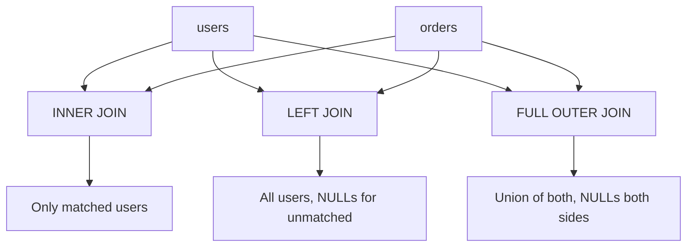

#### Interview Question

**Q:** `LEFT JOIN ... WHERE right_table.col IS NULL` ka pattern kya karta hai? Use case bata.

**A:** Ye **anti-join** pattern hai — left table mein woh rows jo right mein match nahi karte. Use cases: (1) churned users — `users LEFT JOIN orders WHERE orders.order_id IS NULL AND order_date >= last 30 days` (orders mein nahi aaye); (2) inventory check — products without recent sales; (3) referrals jinka payout nahi hua. Top 2% analyst `NOT EXISTS` ya `NOT IN` se compare bhi karta hai — `NOT IN` NULL ke saath buggy hai (UNKNOWN propagate karta hai), `NOT EXISTS` aur anti-join correct hain. Hamesha `NOT EXISTS` prefer karo.

---

### 1.3 GROUP BY, HAVING — common pitfalls

#### Definition (kya hai?)

`GROUP BY` rows ko buckets mein todta hai based on column(s), phir aggregations (SUM, COUNT, AVG, MIN, MAX) per group calculate karta hai. `HAVING` group-level filter hai. Rule: jo column `SELECT` mein aggregation ke bina hai, woh `GROUP BY` mein hona chahiye (Postgres strict, MySQL lenient — buggy).

#### Why?

GROUP BY analytical queries ka heart hai — "revenue by city", "users by signup_month", "AOV by category". Pitfalls insidious hain — non-aggregated column GROUP BY mein nahi hai = silent wrong rows; HAVING vs WHERE confused = inefficient queries; COUNT(*) vs COUNT(col) vs COUNT(DISTINCT col) ka farak na samajhna = wrong metrics.

#### How?

```sql
-- Zomato: city-wise monthly GMV, only cities with > 1000 orders
SELECT
  city,
  DATE_TRUNC('month', created_at) AS month,
  COUNT(*) AS total_orders,
  COUNT(DISTINCT user_id) AS unique_users,
  SUM(gmv) AS total_gmv,
  AVG(gmv) AS avg_order_value
FROM orders
WHERE created_at >= '2026-01-01'
GROUP BY city, DATE_TRUNC('month', created_at)
HAVING COUNT(*) > 1000
ORDER BY total_gmv DESC;
```

Pitfall 1 — `COUNT(*)` vs `COUNT(col)`:

| Function | Counts |
|---|---|
| COUNT(*) | All rows including NULLs |
| COUNT(col) | Only non-NULL values |
| COUNT(DISTINCT col) | Unique non-NULL values |

Pitfall 2 — GROUP BY pe NULL alag bucket banta hai. Tu agar `GROUP BY city` karta aur kuch rows mein city NULL hai, woh ek separate group ban jaayega — often missed.

#### Real-life Example

Paytm analyst — "monthly active merchants by tier". Tu likhta `SELECT tier, COUNT(*) FROM merchants_monthly GROUP BY tier`. Bug — `COUNT(*)` mein same merchant agar do month active tha woh 2 baar count ho gaya. Sahi `COUNT(DISTINCT merchant_id)`. Ek aur — kuch merchants ka `tier` NULL tha (new onboards) — tu ne `WHERE tier IS NOT NULL` lagaya nahi, NULL group bhi aaya, CMO confused. Hamesha NULL handling explicit karo.

#### Diagram

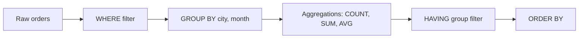

#### Interview Question

**Q:** `WHERE COUNT(*) > 100` kyu fail hota hai? Aur kab `WHERE` vs `HAVING` use karte hain?

**A:** Execution order — `WHERE` `GROUP BY` ke pehle chalta hai, jab tak rows aggregate hue hi nahi, `COUNT(*)` exist nahi karta. So `WHERE COUNT(*) > 100` syntactically fail. Use `HAVING COUNT(*) > 100`. General rule: row-level conditions `WHERE` mein, group-level (post-aggregation) conditions `HAVING` mein. Performance tip — agar condition pre-aggregation expressible hai, `WHERE` use karo (kam rows aggregate honge, faster).

---

### 1.4 Subqueries — correlated vs uncorrelated

#### Definition (kya hai?)

Subquery = query inside another query. Two types:

- **Uncorrelated** — inner query independent hai outer se. Ek baar execute, result reuse.
- **Correlated** — inner query har outer row ke liye re-execute hoti hai (refers outer column). Slow for big tables, but powerful.

#### Why?

Subqueries complex logic decompose karte hain. Correlated subqueries pattern matching (top-N per group, "users above their city's avg GMV") ke liye essential hain — though window functions often better hain. Knowing kab subquery, kab CTE, kab window — top 2% ka separator hai.

#### How?

```sql
-- Uncorrelated: users jinka GMV company avg se zyada
SELECT user_id, total_gmv
FROM (SELECT user_id, SUM(gmv) AS total_gmv FROM orders GROUP BY 1) u
WHERE total_gmv > (SELECT AVG(gmv) FROM orders);

-- Correlated: har user ka latest order
SELECT u.user_id, u.name,
  (SELECT MAX(created_at) FROM orders o WHERE o.user_id = u.user_id) AS last_order_at
FROM users u;

-- Correlated: users above their CITY's avg GMV (not global avg)
SELECT u.user_id, u.city, u.total_gmv
FROM user_summary u
WHERE u.total_gmv > (
  SELECT AVG(total_gmv) FROM user_summary u2 WHERE u2.city = u.city
);
```

Sample input (`user_summary`):

| user_id | city | total_gmv |
|---|---|---|
| U1 | Bangalore | 5000 |
| U2 | Bangalore | 2000 |
| U3 | Mumbai | 8000 |
| U4 | Mumbai | 3000 |

Bangalore avg = 3500, Mumbai avg = 5500. Output: U1 (5000 > 3500), U3 (8000 > 5500).

#### Real-life Example

Meesho analyst — "har category mein top-3 selling products". Naive correlated subquery: `WHERE product_id IN (SELECT product_id FROM products p2 WHERE p2.category = p.category ORDER BY gmv DESC LIMIT 3)` — works but slow on millions of rows. Better: window function `ROW_NUMBER() OVER (PARTITION BY category ORDER BY gmv DESC) <= 3`. Same answer, 10x faster on warehouse.

#### Diagram

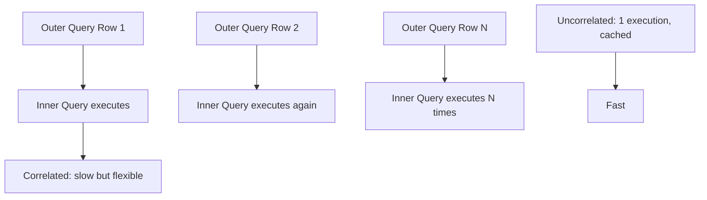

#### Interview Question

**Q:** `IN (subquery)` vs `EXISTS (subquery)` — kab konsa?

**A:** `IN` returns true agar value subquery ke output mein milti hai. `EXISTS` returns true agar subquery atleast 1 row return karta hai. Behavior similar hota hai — but: (1) NULL handling — `IN` NULL ke saath UNKNOWN return karta hai (so `NOT IN` with NULL values silently drops rows — bug!); `EXISTS` NULLs handle properly karta hai. (2) Performance — most modern optimizers (Postgres 12+, BigQuery, Snowflake) dono ko similarly optimize karte hain via semi-join. Rule: hamesha `EXISTS` / `NOT EXISTS` prefer karo for safety. `NOT IN (subquery)` mein agar subquery NULL return kare, query empty result deta — silent bug.

---

### 1.5 UNION, INTERSECT, EXCEPT

#### Definition (kya hai?)

Set operators — do queries ke results combine karte hain.

- **UNION** — A ∪ B (deduplicated). `UNION ALL` keeps duplicates (faster).
- **INTERSECT** — A ∩ B (rows present in both)
- **EXCEPT** — A − B (rows in A but not in B). MySQL mein nahi hai, anti-join se simulate karte hain.

Both queries ke columns same count, same data types ke hone chahiye.

#### Why?

Multi-source data combine karna, deduplicate karna, "present in A but not B" anti-pattern, snapshot comparisons (today's users vs yesterday's). Top use case — daily vs weekly active users overlap, churned vs new merchants.

#### How?

```sql
-- Razorpay: this month active merchants vs last month active — churned identify
WITH this_month AS (
  SELECT DISTINCT merchant_id FROM transactions
  WHERE month = '2026-04'
),
last_month AS (
  SELECT DISTINCT merchant_id FROM transactions
  WHERE month = '2026-03'
)
SELECT merchant_id FROM last_month
EXCEPT
SELECT merchant_id FROM this_month;
-- Output: churned merchants

-- New merchants this month
SELECT merchant_id FROM this_month
EXCEPT
SELECT merchant_id FROM last_month;

-- Retained
SELECT merchant_id FROM this_month
INTERSECT
SELECT merchant_id FROM last_month;
```

`UNION` vs `UNION ALL` performance — UNION dedupe karta hai (sort/hash → expensive). UNION ALL just appends. Agar duplicates nahi ho sakte (different sources, distinct keys), `UNION ALL` 5-10x faster.

#### Real-life Example

Swiggy analyst — "weekly active users in food vs Instamart business". Food orderers ki query, Instamart orderers ki query, phir `INTERSECT` se cross-business users (most loyal segment), `EXCEPT` se food-only / Instamart-only. CMO ko ek matrix dikhata: cross-business users 12% lekin 35% revenue contribute karte hain — cross-sell ROI bahut high.

#### Diagram

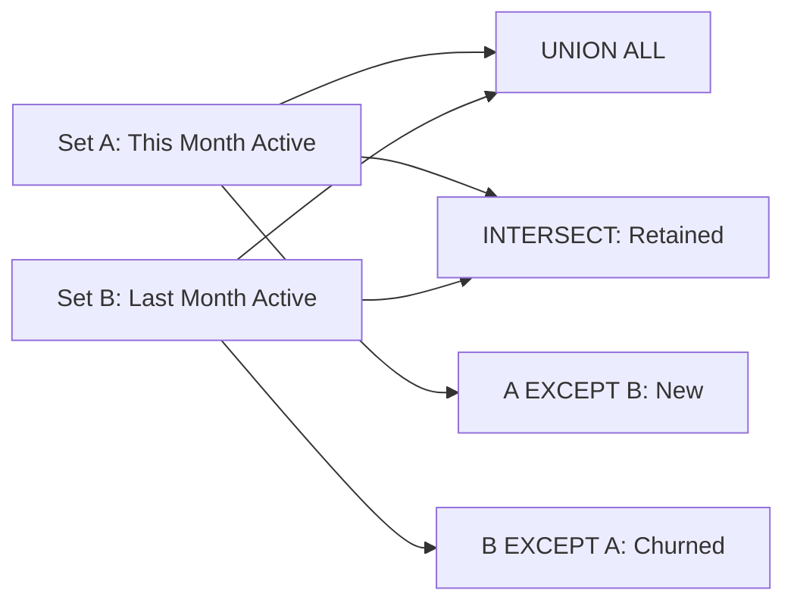

#### Interview Question

**Q:** Kab `UNION` use karega, kab `UNION ALL`?

**A:** `UNION ALL` default choice — faster (no dedup). `UNION` use karo only if (a) duplicates possibly hain aur tu unique chahiye, ya (b) two queries ke beech genuine overlap ho sakta hai jo tu collapse karna chahta hai. Production warehouse pe billion-row tables pe `UNION` 10x slow hai — analysts default `UNION ALL` use karte hain aur explicit `DISTINCT` lagate hain agar zaroori ho. Top 2% analyst hamesha intent explicit rakhta hai.

---

### 1.6 CASE WHEN, COALESCE, NULLIF, IFNULL

#### Definition (kya hai?)

- **CASE WHEN** — SQL ka if-else. Conditional column logic.
- **COALESCE(a, b, c)** — first non-NULL value return karta hai. Cross-dialect (works everywhere).
- **NULLIF(a, b)** — agar a = b, NULL return karta hai (divide-by-zero protection mein useful).
- **IFNULL(a, b)** — MySQL/BigQuery ka 2-argument shortcut. Postgres mein nahi (use COALESCE).

#### Why?

Real data NULLs aur edge cases se bhara hota hai. Bina inke clean handling, dashboards mein "N/A", divide-by-zero crashes, ya silent wrong numbers. Top 2% analyst defensive SQL likhta hai — har division `NULLIF(denom, 0)`, har optional column `COALESCE`.

#### How?

```sql
-- Flipkart: customer tiering + safe AOV calculation
SELECT
  user_id,
  total_orders,
  total_gmv,
  -- Tier classification
  CASE
    WHEN total_gmv >= 50000 THEN 'Platinum'
    WHEN total_gmv >= 20000 THEN 'Gold'
    WHEN total_gmv >= 5000 THEN 'Silver'
    ELSE 'Bronze'
  END AS tier,
  -- Safe AOV (divide-by-zero protection)
  total_gmv / NULLIF(total_orders, 0) AS aov,
  -- Default city for missing
  COALESCE(city, 'Unknown') AS city_clean,
  -- Conversion rate
  CASE WHEN visits > 0 THEN orders * 100.0 / visits ELSE 0 END AS cr_pct
FROM user_summary;
```

Sample input:

| user_id | total_orders | total_gmv | city | visits | orders |
|---|---|---|---|---|---|
| U1 | 10 | 25000 | Bangalore | 100 | 10 |
| U2 | 0 | 0 | NULL | 50 | 0 |
| U3 | 50 | 80000 | Mumbai | 200 | 50 |

Output:

| user_id | tier | aov | city_clean | cr_pct |
|---|---|---|---|---|
| U1 | Gold | 2500 | Bangalore | 10.0 |
| U2 | Bronze | NULL | Unknown | 0 |
| U3 | Platinum | 1600 | Mumbai | 25.0 |

#### Real-life Example

Zomato — "delivery time analysis". Naive `AVG(delivered_at - placed_at)` — kuch orders mein `delivered_at` NULL tha (still pending), woh AVG mein skip ho gaye (good), but tu agar `(delivered_at - placed_at) / NULLIF(COUNT(*), 0)` likhta — divide-by-zero protection. Aur CASE WHEN se "fast (< 30 min)", "average (30-45)", "slow (> 45)" buckets — operations team ko actionable.

#### Diagram

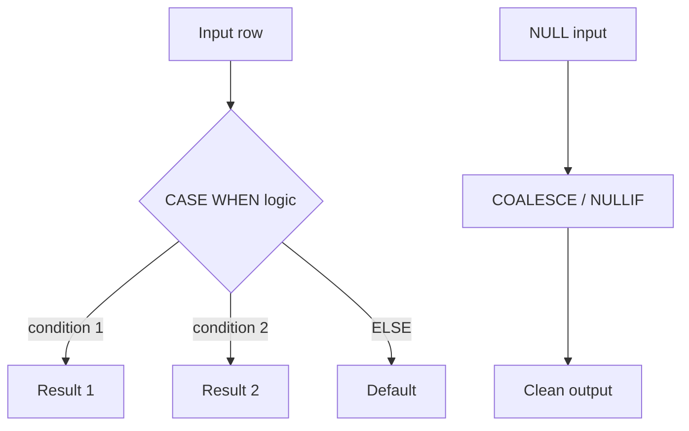

#### Interview Question

**Q:** `CASE WHEN x = NULL THEN ...` kyu kabhi match nahi karta?

**A:** Same NULL trap — NULL = NULL bhi UNKNOWN hota hai, TRUE nahi. CASE WHEN UNKNOWN treats as falsy — to control flow ELSE pe jaata hai. Use `CASE WHEN x IS NULL THEN ...`. Top analyst `COALESCE(x, default)` pehle apply karta hai aur phir CASE — cleaner aur safer. Real interview gotcha — Razorpay, Flipkart sab pucchte hain.

---

## 2. Intermediate SQL

Yahan se top 2% ka territory shuru hota hai. Window functions aur CTEs analysts ki superpower hain.

### 2.1 Window functions — ROW_NUMBER, RANK, LAG, LEAD, SUM OVER

#### Definition (kya hai?)

Window functions row-level calculations karte hain ek "window" of rows ke across, **without collapsing rows** (unlike GROUP BY). Syntax: `function() OVER (PARTITION BY ... ORDER BY ...)`.

Common ones:
- **ROW_NUMBER()** — sequential 1, 2, 3, ... per partition
- **RANK()** — ties get same rank, gaps in next (1, 2, 2, 4)
- **DENSE_RANK()** — ties same, no gaps (1, 2, 2, 3)
- **LAG(col, n)** — previous row's value
- **LEAD(col, n)** — next row's value
- **SUM/AVG/MIN/MAX OVER (...)** — running aggregates

#### Why?

Top analytical patterns — "first order per user", "MoM growth", "percentile within group", "running total" — sab window functions ke bina painfully slow correlated subqueries hote hain. Window se 5-10x faster + cleaner. Har modern data analyst interview mein 1-2 questions guarantee window functions pe.

#### How?

```sql
-- Swiggy: har user ka first order (deduplication / "earliest" pattern)
SELECT user_id, order_id, gmv, created_at
FROM (
  SELECT user_id, order_id, gmv, created_at,
    ROW_NUMBER() OVER (PARTITION BY user_id ORDER BY created_at ASC) AS rn
  FROM orders
) t
WHERE rn = 1;

-- MoM revenue growth using LAG
SELECT
  month,
  total_revenue,
  LAG(total_revenue) OVER (ORDER BY month) AS prev_month_revenue,
  (total_revenue - LAG(total_revenue) OVER (ORDER BY month))
    / NULLIF(LAG(total_revenue) OVER (ORDER BY month), 0) * 100 AS mom_growth_pct
FROM monthly_revenue
ORDER BY month;

-- Running total of GMV per user
SELECT user_id, order_id, gmv, created_at,
  SUM(gmv) OVER (PARTITION BY user_id ORDER BY created_at
    ROWS BETWEEN UNBOUNDED PRECEDING AND CURRENT ROW) AS cumulative_gmv
FROM orders;
```

Sample input — `monthly_revenue`:

| month | total_revenue |
|---|---|
| 2026-01 | 1000000 |
| 2026-02 | 1200000 |
| 2026-03 | 1100000 |

Output:

| month | total_revenue | prev_month | mom_growth_pct |
|---|---|---|---|
| 2026-01 | 1000000 | NULL | NULL |
| 2026-02 | 1200000 | 1000000 | 20.0 |
| 2026-03 | 1100000 | 1200000 | -8.33 |

#### Real-life Example

BookMyShow — "har show ke liye top-5 booking days". Without window: complex correlated subquery. With window: `RANK() OVER (PARTITION BY show_id ORDER BY daily_bookings DESC) <= 5`. 1 line, 100x faster. Analyst CMO ko top-grossing days highlight karta — woh same days pe next year promotional campaigns lock karte hain.

#### Diagram

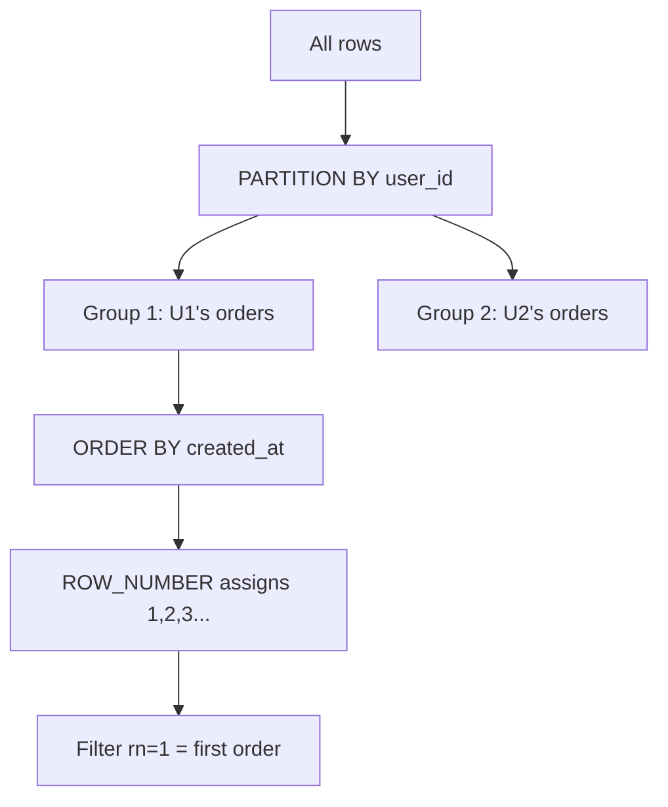

#### Interview Question

**Q:** `ROW_NUMBER` vs `RANK` vs `DENSE_RANK` — concrete farak example se bata.

**A:** Scores: 95, 90, 90, 85.
- ROW_NUMBER: 1, 2, 3, 4 (always sequential, ties broken arbitrarily)
- RANK: 1, 2, 2, 4 (ties same, gap before next)
- DENSE_RANK: 1, 2, 2, 3 (ties same, no gap)

Use cases — "top-N per group" with ROW_NUMBER (deterministic), "leaderboard with ties" RANK, "tier classification with consecutive ranks" DENSE_RANK. Real Razorpay interview question — "top 3 highest-volume merchants per state, allowing ties" — answer DENSE_RANK <= 3.

---

### 2.2 Window frames — ROWS BETWEEN / RANGE BETWEEN

#### Definition (kya hai?)

Window frame specify karta hai ki window function kis subset of rows pe operate karega within partition. Default — for ORDER BY queries — `RANGE BETWEEN UNBOUNDED PRECEDING AND CURRENT ROW`.

- **ROWS BETWEEN** — physical row offset
- **RANGE BETWEEN** — logical value offset (based on ORDER BY column value)

Common frames:
- `UNBOUNDED PRECEDING AND CURRENT ROW` — running total
- `6 PRECEDING AND CURRENT ROW` — last 7 rows (rolling 7-day)
- `3 PRECEDING AND 3 FOLLOWING` — centered window

#### Why?

Moving averages (7-day, 30-day), rolling sums, "previous N rows" patterns — sab frames ke bina galat. Default frame galat assume karne se silent bugs aate hain — RANGE vs ROWS ka farak na samajhna = duplicate rows pe wrong aggregation.

#### How?

```sql
-- Paytm: 7-day rolling average daily transactions
SELECT
  date,
  daily_transactions,
  AVG(daily_transactions) OVER (
    ORDER BY date
    ROWS BETWEEN 6 PRECEDING AND CURRENT ROW
  ) AS rolling_7day_avg
FROM daily_metrics
ORDER BY date;

-- Running total with explicit frame
SELECT order_id, gmv,
  SUM(gmv) OVER (
    ORDER BY created_at
    ROWS BETWEEN UNBOUNDED PRECEDING AND CURRENT ROW
  ) AS running_gmv
FROM orders;

-- 30-day rolling unique users (more nuanced — needs distinct, not standard frame)
-- Workaround: COUNT(DISTINCT) doesn't work in window — use approximation or custom logic
```

Sample input:

| date | daily_txn |
|---|---|
| 2026-04-01 | 100 |
| 2026-04-02 | 120 |
| 2026-04-03 | 110 |
| 2026-04-04 | 130 |
| 2026-04-05 | 140 |
| 2026-04-06 | 150 |
| 2026-04-07 | 160 |
| 2026-04-08 | 170 |

Output (7-day rolling avg from row 7 onwards has full window):

| date | daily_txn | rolling_7day_avg |
|---|---|---|
| 2026-04-07 | 160 | 130.0 |
| 2026-04-08 | 170 | 140.0 |

#### Real-life Example

Zomato dining team — daily reservations volatile hain (weekday vs weekend). Raw daily numbers se trend dikhta nahi. 7-day rolling average se smoothing hoti hai — "Bangalore ka dining business 4 weeks se 8% MoM grow kar raha hai" instead of "kal 12% gir gaya". Same data, executive-friendly storytelling.

#### Diagram

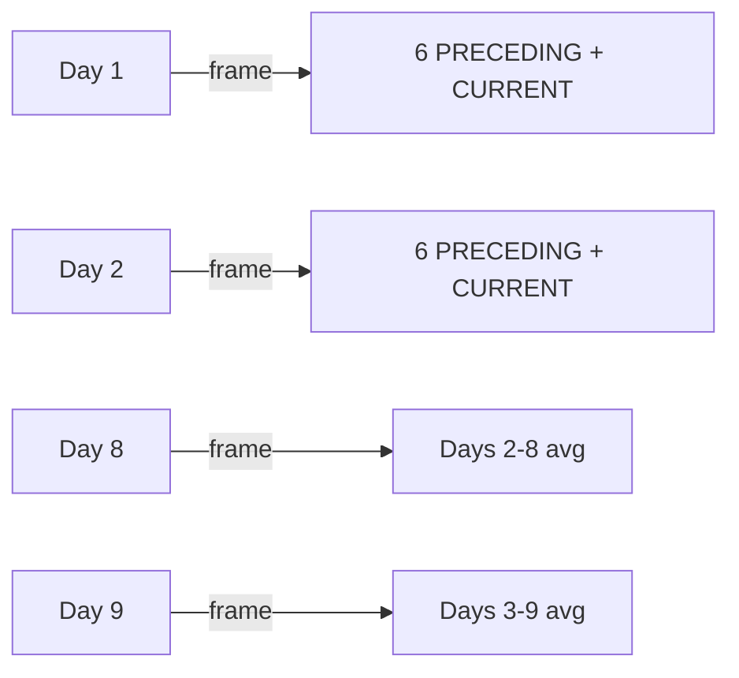

#### Interview Question

**Q:** `ROWS BETWEEN 6 PRECEDING` vs `RANGE BETWEEN INTERVAL '6 days' PRECEDING` — kab same, kab alag?

**A:** ROWS physical row count counts — agar tu daily data pe likhta hai aur koi din missing nahi, ROWS aur RANGE same. Lekin agar gaps hain (weekend missing, holiday gap), ROWS galat 7 calendar-day window deta — woh 7 available rows leta. RANGE actual time interval respect karta hai. For time-series analytics with potential gaps, RANGE + INTERVAL safer hai. BigQuery aur Snowflake mein RANGE INTERVAL syntax slightly differ karta — dialect documentation check kar.

---

### 2.3 CTEs and recursive CTEs

#### Definition (kya hai?)

**CTE (Common Table Expression)** — `WITH name AS (subquery)` syntax. Named, reusable subquery scoped to one statement. Modular, readable, reusable.

**Recursive CTE** — `WITH RECURSIVE` — apne aap ko reference karta hai. Hierarchies (org chart, category trees), graph traversal, generate sequences.

#### Why?

CTEs SQL ko functional/composable banate hain. Bina CTE ke nested subqueries 5-level deep, unreadable. Top analyst hamesha CTEs use karta hai — pehle data layers banata, phir final SELECT.

#### How?

```sql
-- Multi-CTE: Swiggy cohort + retention combined
WITH cohort AS (
  SELECT user_id, DATE_TRUNC('month', MIN(created_at)) AS cohort_month
  FROM orders
  GROUP BY user_id
),
monthly_activity AS (
  SELECT user_id, DATE_TRUNC('month', created_at) AS active_month
  FROM orders
  GROUP BY user_id, DATE_TRUNC('month', created_at)
),
retention AS (
  SELECT
    c.cohort_month,
    EXTRACT(MONTH FROM AGE(m.active_month, c.cohort_month)) AS month_num,
    COUNT(DISTINCT m.user_id) AS active_users
  FROM cohort c
  JOIN monthly_activity m ON c.user_id = m.user_id
  GROUP BY c.cohort_month, month_num
)
SELECT * FROM retention ORDER BY cohort_month, month_num;

-- Recursive CTE: Flipkart category tree (parent_id self-reference)
WITH RECURSIVE category_tree AS (
  -- Base case: top-level categories
  SELECT category_id, name, parent_id, 1 AS level
  FROM categories WHERE parent_id IS NULL
  UNION ALL
  -- Recursive: children
  SELECT c.category_id, c.name, c.parent_id, ct.level + 1
  FROM categories c
  JOIN category_tree ct ON c.parent_id = ct.category_id
)
SELECT * FROM category_tree ORDER BY level, name;

-- Generate date series (for filling missing dates)
WITH RECURSIVE dates AS (
  SELECT DATE '2026-01-01' AS d
  UNION ALL
  SELECT d + 1 FROM dates WHERE d < DATE '2026-12-31'
)
SELECT * FROM dates;
```

#### Real-life Example

Meesho category hierarchy — "Electronics > Mobiles > Smartphones > Android" — 5-6 levels deep. Question: "har top-level category ka total GMV including all sub-categories". Without recursive CTE: hand-coded multi-level joins. With: 10-line recursive CTE — clean, scales to any depth. Top analyst yahan se interview clear karta.

#### Diagram

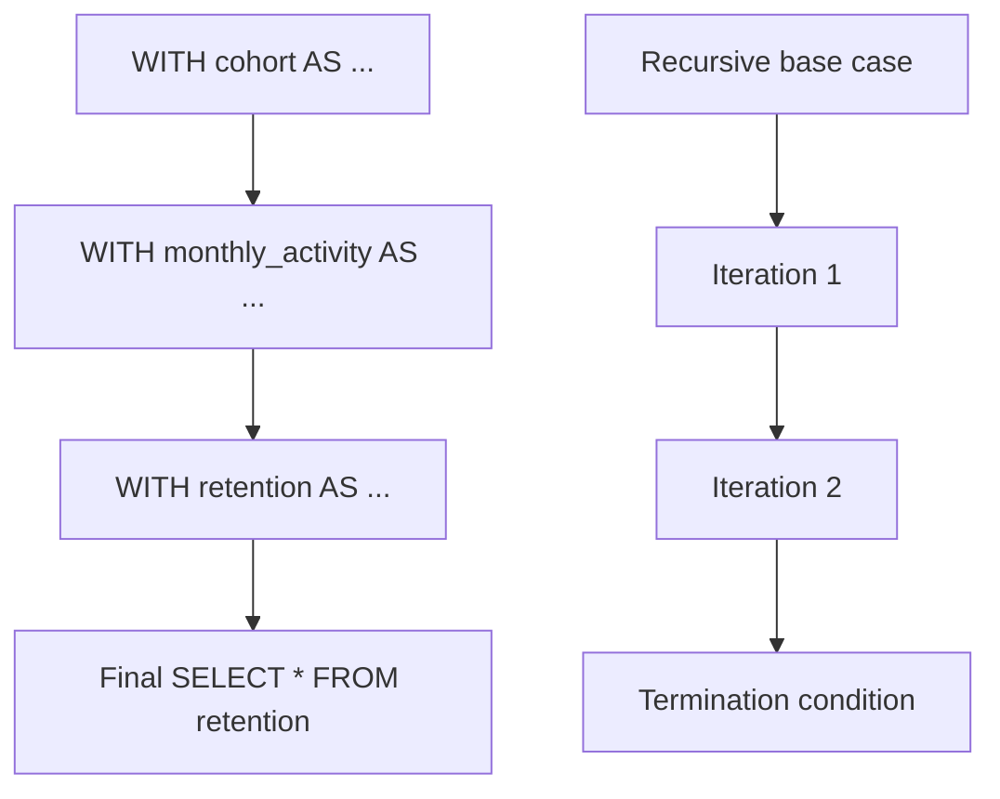

#### Interview Question

**Q:** CTE vs subquery vs temp table — performance kab kaunsa best?

**A:** Modern engines (Postgres 12+, BigQuery, Snowflake) CTEs ko inline karte hain (treated like subqueries) — performance similar. Pre-Postgres-12 mein CTE ek "optimization fence" thi (separately materialized — sometimes slower, sometimes faster). Temp tables explicit materialization hai — multi-statement reuse mein faster. Rule: readability ke liye CTE prefer karo, performance critical heavy reuse mein temp tables consider karo, recursion ke liye CTE only option. Top 2% analyst pehle CTE likhta hai, EXPLAIN check karta hai, agar slow hai toh refactor.

---

### 2.4 Pivoting and unpivoting in SQL

#### Definition (kya hai?)

- **Pivot** — long format → wide format. Rows → columns. (e.g., monthly revenue per city in 12 columns).
- **Unpivot** — wide → long. Columns → rows. (Transposed input ko analyzable form mein laana.)

Postgres mein native PIVOT nahi (use CASE WHEN aggregations or `crosstab` extension). BigQuery/Snowflake ka native `PIVOT`/`UNPIVOT` syntax hai.

#### Why?

Dashboards wide format chahiye — "Jan, Feb, Mar, Apr columns mein revenue". Source data long format mein — "(month, revenue) rows". Pivot/Unpivot ka use case hai. BigQuery mein elegant, Postgres mein verbose — but har analyst dono jaanta hai.

#### How?

```sql
-- Postgres: pivot using CASE WHEN (verbose but portable)
SELECT
  city,
  SUM(CASE WHEN month = 1 THEN revenue ELSE 0 END) AS jan,
  SUM(CASE WHEN month = 2 THEN revenue ELSE 0 END) AS feb,
  SUM(CASE WHEN month = 3 THEN revenue ELSE 0 END) AS mar
FROM monthly_revenue_by_city
GROUP BY city;

-- BigQuery: native PIVOT
SELECT * FROM monthly_revenue_by_city
PIVOT (SUM(revenue) FOR month IN (1, 2, 3)) ;

-- Snowflake: similar
SELECT * FROM monthly_revenue_by_city
PIVOT (SUM(revenue) FOR month IN (1, 2, 3))
AS p (city, jan, feb, mar);

-- UNPIVOT (wide -> long), BigQuery example
SELECT * FROM wide_table
UNPIVOT (revenue FOR month IN (jan, feb, mar));
```

Sample input (long):

| city | month | revenue |
|---|---|---|
| Bangalore | 1 | 100 |
| Bangalore | 2 | 120 |
| Mumbai | 1 | 150 |
| Mumbai | 2 | 180 |

Pivot output (wide):

| city | jan | feb |
|---|---|---|
| Bangalore | 100 | 120 |
| Mumbai | 150 | 180 |

#### Real-life Example

Razorpay weekly merchant reports — "har merchant ka 7-din ka transaction count Mon-Sun columns mein". Long-format query bana, dashboard tool (Looker/Metabase) mein pivot — but agar 1000 merchants × 7 days = 7000 rows fetch ho raha hai aur dashboard 100 columns × 1000 rows expect kar raha hai — SQL-side pivot zaroori. CASE WHEN se 7 columns banaye, Looker mein direct render — load time 5x faster.

#### Interview Question

**Q:** Tu Postgres pe hai, dynamic pivot karna hai (columns runtime decide), kaise karega?

**A:** Postgres native dynamic pivot nahi karta. Options: (1) `crosstab` extension (`tablefunc`) — enables pivot but pre-known columns; (2) plpgsql function — dynamically generate column list, EXECUTE; (3) preferred — keep long format in SQL, pivot in BI tool (Looker, Tableau, Metabase) jahan dynamic columns easy hain. Top 2% analyst SQL pe over-engineering nahi karta — right tool right layer.

---

### 2.5 String, date/time functions, regex

#### Definition (kya hai?)

Real-world data dirty hota hai. Strings mein extra spaces, mixed case, emails malformed. Dates strings mein, timezones inconsistent. Regex pattern matching ka swiss army knife hai.

Common functions:
- **String** — `LOWER`, `UPPER`, `TRIM`, `SUBSTRING`, `CONCAT`, `LENGTH`, `REPLACE`, `SPLIT_PART`
- **Date** — `DATE_TRUNC`, `DATE_PART`, `EXTRACT`, `AGE`, `DATEADD`, `DATEDIFF`
- **Regex** — `~` / `~*` (Postgres), `REGEXP_CONTAINS` (BigQuery), `RLIKE` (Snowflake)

#### Why?

90% data cleaning SQL mein hota hai (not Python). Tu agar email validation, phone normalization, log parsing, date bucketing handle nahi kar sakta — basic ETL queries mein stuck. Regex specially — log analysis, URL parsing, fraud detection mein essential.

#### How?

```sql
-- BookMyShow: clean user emails, extract domain, normalize phones
SELECT
  user_id,
  LOWER(TRIM(email)) AS email_clean,
  SPLIT_PART(LOWER(email), '@', 2) AS email_domain,
  REGEXP_REPLACE(phone, '[^0-9]', '', 'g') AS phone_digits,
  CASE
    WHEN email ~* '^[a-z0-9._%+-]+@[a-z0-9.-]+\.[a-z]{2,}$' THEN 'valid'
    ELSE 'invalid'
  END AS email_valid
FROM users;

-- Date bucketing: cohort month, day-of-week analysis
SELECT
  DATE_TRUNC('month', created_at) AS cohort_month,
  EXTRACT(DOW FROM created_at) AS day_of_week,
  EXTRACT(HOUR FROM created_at) AS hour_of_day,
  COUNT(*) AS orders
FROM orders
GROUP BY 1, 2, 3;

-- Date difference: tenure
SELECT user_id,
  DATE_PART('day', CURRENT_DATE - signup_date) AS tenure_days,
  AGE(CURRENT_DATE, signup_date) AS tenure_age
FROM users;
```

Sample input — `users`:

| user_id | email | phone |
|---|---|---|
| U1 |  Aarav@gmail.com  | +91-98765-43210 |
| U2 | diya@gmail | 9876543211 |

Output:

| user_id | email_clean | email_domain | phone_digits | email_valid |
|---|---|---|---|---|
| U1 | aarav@gmail.com | gmail.com | 919876543210 | valid |
| U2 | diya@gmail | gmail | 9876543211 | invalid |

#### Real-life Example

Paytm fraud team — transactions logs mein device fingerprint string `"iPhone-13-iOS17.2-Mumbai-WiFi"`. Regex se parse — `SPLIT_PART` se device, OS, city, network nikaala. Fraud signals discover hue: same device fingerprint × multiple users in 1 hour = bot attack. Without SQL-level string parsing, ye signal Python pipeline mein 4 ghante late aata — analyst ne real-time SQL view banayi, fraud team ne 30 min mein react kiya.

#### Interview Question

**Q:** Postgres mein `LIKE` vs `~` (regex) — performance aur use case farak?

**A:** `LIKE` simple wildcards (`%`, `_`) karta hai, fast — agar leading wildcard nahi hai (`'abc%'`), B-tree index use kar sakta hai. `~` (POSIX regex) full regex — flexible but no index unless `pg_trgm` GIN index. Use `LIKE` for simple prefix/contains, `~` for complex patterns. `ILIKE` / `~*` case-insensitive. Top analyst `WHERE LOWER(col) LIKE '...'` likhta hai — but warn — this kills index unless functional index `(LOWER(col))`.

---

### 2.6 JSON / array functions (Postgres, BigQuery, Snowflake)

#### Definition (kya hai?)

Modern apps event data JSON mein store karte hain (semi-structured). Mixpanel, Amplitude, Segment, custom event streams — sab JSON. SQL ke JSON functions chahiye to query karne ke liye without ETL.

- **Postgres** — `->`, `->>`, `#>`, `jsonb_extract_path_text`, `jsonb_array_elements`
- **BigQuery** — `JSON_EXTRACT`, `JSON_VALUE`, `UNNEST`
- **Snowflake** — `:` (colon syntax), `LATERAL FLATTEN`

#### Why?

Product events ka 90% JSON mein aata hai. Tu agar JSON_EXTRACT nahi jaanta — har analytics question ke liye Python/dbt model maangega. Top analyst direct SQL se event funnels chala leta hai — speed 10x.

#### How?

```sql
-- Postgres: extract from JSONB event payload
SELECT
  event_id,
  payload->>'user_id' AS user_id,
  payload->>'event_name' AS event_name,
  (payload->>'gmv')::NUMERIC AS gmv,
  payload->'items' AS items_json,
  jsonb_array_length(payload->'items') AS item_count
FROM events
WHERE payload->>'event_name' = 'purchase';

-- Postgres: unnest array of items
SELECT
  e.event_id,
  item->>'product_id' AS product_id,
  (item->>'price')::NUMERIC AS price
FROM events e,
  jsonb_array_elements(e.payload->'items') AS item;

-- BigQuery: extract scalar, unnest array
SELECT
  event_id,
  JSON_VALUE(payload, '$.user_id') AS user_id,
  item.product_id,
  item.price
FROM events,
  UNNEST(JSON_EXTRACT_ARRAY(payload, '$.items')) AS item_json,
  UNNEST([JSON_EXTRACT_SCALAR(item_json, '$.product_id')]) AS product_id;

-- Snowflake: VARIANT column with FLATTEN
SELECT
  event_id,
  payload:user_id::STRING AS user_id,
  f.value:product_id::STRING AS product_id,
  f.value:price::NUMBER AS price
FROM events,
  LATERAL FLATTEN(input => payload:items) f;
```

Sample input:

| event_id | payload (JSON) |
|---|---|
| E1 | {"user_id":"U1","event":"purchase","items":[{"product_id":"P1","price":500}]} |

Output (after unnest):

| event_id | user_id | product_id | price |
|---|---|---|---|
| E1 | U1 | P1 | 500 |

#### Real-life Example

Meesho ka analyst — "kaunse products checkout pe zyada drop hote hain". Event stream JSON mein. `JSON_EXTRACT` se cart_items array nikala, `UNNEST` kiya, phir checkout_completed event ke saath LEFT JOIN — drop products identified. CMO ko data milti hai "ye 50 products ka checkout drop > 60% hai — UX ya pricing issue". Without JSON functions, ye data ETL pipeline mein 1 week wait karta — direct SQL se 1 ghante mein insight.

#### Interview Question

**Q:** Postgres mein `->` aur `->>` mein farak kya hai?

**A:** `->` returns JSON object/value (still JSON type — can be further chained). `->>` returns text (final cast to TEXT). Example: `payload->'user'->>'name'` — pehle user object nikalta JSON, phir name as text. Agar tu `payload->>'user'->>'name'` likhta — first ->> already cast to text, second ->> on text fails. JSONB pe operate kar (faster than JSON), aur explicit cast kar — `(payload->>'gmv')::NUMERIC`.

---

## 3. Advanced SQL Patterns

Yahan se ye subject industrial-grade analyst banata hai. Cohort, funnel, sessionization — Razorpay, Swiggy, Flipkart interview ka 60% yahan se aata hai.

### 3.1 Cohort retention analysis in pure SQL

#### Definition (kya hai?)

Cohort analysis = users ko unke "join month" ke basis pe group karna, phir har subsequent month mein dekhna kitne wapas aaye. Output ek triangular matrix — rows = cohort months, columns = months-since-join, values = retention %.

#### Why?

Single retention number (e.g., "30% retention") meaningless hai. Cohort se trends dikhte hain — kya newer cohorts better retain hote hain (product improving)? Kya promo-led cohorts D7 ke baad collapse karte hain (junk acquisition)? Top analyst cohort table dikha ke executive ko trends decode kar deta hai.

#### How?

```sql
-- Swiggy cohort retention (pure SQL)
WITH first_order AS (
  SELECT
    user_id,
    DATE_TRUNC('month', MIN(created_at)) AS cohort_month
  FROM orders
  GROUP BY user_id
),
user_activity AS (
  SELECT DISTINCT
    user_id,
    DATE_TRUNC('month', created_at) AS active_month
  FROM orders
),
cohort_data AS (
  SELECT
    f.cohort_month,
    EXTRACT(MONTH FROM AGE(a.active_month, f.cohort_month))::INT AS month_num,
    COUNT(DISTINCT f.user_id) AS active_users
  FROM first_order f
  JOIN user_activity a ON f.user_id = a.user_id AND a.active_month >= f.cohort_month
  GROUP BY f.cohort_month, month_num
),
cohort_size AS (
  SELECT cohort_month, COUNT(DISTINCT user_id) AS size
  FROM first_order GROUP BY cohort_month
)
SELECT
  c.cohort_month,
  c.month_num,
  c.active_users,
  s.size AS cohort_size,
  ROUND(100.0 * c.active_users / s.size, 1) AS retention_pct
FROM cohort_data c
JOIN cohort_size s ON c.cohort_month = s.cohort_month
ORDER BY c.cohort_month, c.month_num;
```

Output (pivoted in BI tool):

| cohort_month | M0 | M1 | M2 | M3 |
|---|---|---|---|---|
| 2026-01 | 100% | 45% | 32% | 25% |
| 2026-02 | 100% | 52% | 38% | — |
| 2026-03 | 100% | 48% | — | — |

#### Real-life Example

Zomato 2023 — Q1 cohorts D30 retention 28%, Q2 cohorts 22%, Q3 cohorts 18%. Trend dropping. Analyst dive kiya — Q3 mein new "₹50 off first order" promo launch hua tha, mostly bargain hunters aaye. Promo-cohort segment kiya, retention 12% mila. Organic Q3 cohort retention still 32%. Insight — promo kill karo OR target tighter. Saved ₹15Cr next quarter on wasted CAC.

#### Diagram

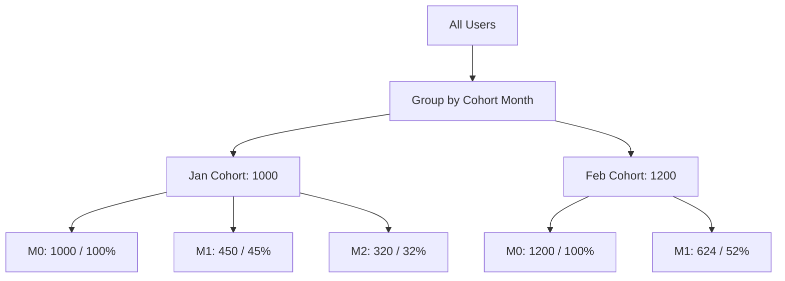

#### Interview Question

**Q:** Tu cohort analysis run kar raha hai, but newer cohorts ka data incomplete hai (Mar cohort ka M3 data abhi exist nahi). Kaise handle karega presentation mein?

**A:** Triangular matrix — incomplete cells ko explicit dash/blank/grey out, NOT zero (zero = false signal of churn). BI tool mein conditional formatting — cohort_month + month_num > current_date toh hide. Stakeholder ko explicit footnote — "M3 data incomplete for Mar cohort, last fully measurable cohort is Jan". Top 2% analyst data integrity over completeness optimize karta hai.

---

### 3.2 Funnel analysis with drop-off rates

#### Definition (kya hai?)

Funnel = sequential events analysis. User step 1 → step 2 → step 3 — har step pe kitne drop hue. Conversion rate stage-to-stage aur end-to-end calculate hota hai.

#### Why?

AARRR funnel, checkout funnel, signup funnel — har product analyst ka bread-and-butter. Bottleneck identify karna = revenue protect karna. Top analyst funnel ko granular slice karta hai (by device, channel, geo) — "drop iPhone pe 25%, Android pe 60% — likely Android UX issue".

#### How?

```sql
-- Flipkart checkout funnel: search -> view -> cart -> checkout -> purchase
WITH funnel AS (
  SELECT
    session_id,
    user_id,
    MAX(CASE WHEN event = 'search' THEN 1 ELSE 0 END) AS searched,
    MAX(CASE WHEN event = 'view_product' THEN 1 ELSE 0 END) AS viewed,
    MAX(CASE WHEN event = 'add_to_cart' THEN 1 ELSE 0 END) AS carted,
    MAX(CASE WHEN event = 'checkout' THEN 1 ELSE 0 END) AS checkout,
    MAX(CASE WHEN event = 'purchase' THEN 1 ELSE 0 END) AS purchased
  FROM events
  WHERE event_date >= CURRENT_DATE - 7
  GROUP BY session_id, user_id
)
SELECT
  SUM(searched) AS searched,
  SUM(viewed) AS viewed,
  SUM(carted) AS carted,
  SUM(checkout) AS checkout,
  SUM(purchased) AS purchased,
  ROUND(100.0 * SUM(viewed) / NULLIF(SUM(searched), 0), 2) AS search_to_view,
  ROUND(100.0 * SUM(carted) / NULLIF(SUM(viewed), 0), 2) AS view_to_cart,
  ROUND(100.0 * SUM(checkout) / NULLIF(SUM(carted), 0), 2) AS cart_to_checkout,
  ROUND(100.0 * SUM(purchased) / NULLIF(SUM(checkout), 0), 2) AS checkout_to_purchase,
  ROUND(100.0 * SUM(purchased) / NULLIF(SUM(searched), 0), 2) AS overall_cr
FROM funnel;
```

Output:

| stage | count | rate |
|---|---|---|
| Searched | 100,000 | 100% |
| Viewed | 70,000 | 70% (search→view) |
| Carted | 28,000 | 40% (view→cart) |
| Checkout | 18,000 | 64% (cart→checkout) |
| Purchased | 12,000 | 67% (checkout→purchase) |
| **Overall** | | **12% (search→purchase)** |

#### Real-life Example

BookMyShow — movie booking funnel. Movie page → seat selection → payment. Saturday peak pe payment step pe 35% drop. Analyst dove — payment gateway latency 8 sec (Razorpay was throttling). Backup gateway (PayU) ka A/B test ran — drop reduced to 12%, ₹2.5Cr/weekend revenue saved. Pure SQL funnel se identify hua, woh decision business level pe gaya.

#### Diagram

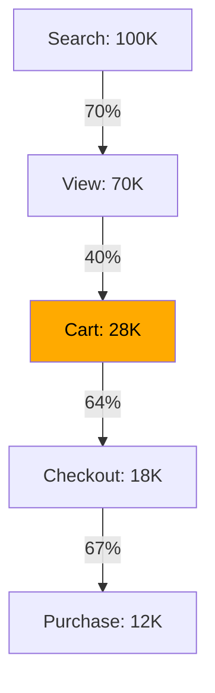

#### Interview Question

**Q:** Funnel define karte waqt "step 1 then step 2" — tu strict order enforce kare ya not? Real-world implications?

**A:** Strict order = events in temporal sequence (cart only counts agar view ke baad hua). Non-strict = sequence matter nahi (within session both happened). Strict more accurate but stricter, drops loose flows. Implementation — `event1.timestamp < event2.timestamp` joins, ya `LAG` window. Default — conversion funnel mein strict, behavioral overlap mein non-strict. Top analyst question pucchta — "first-event-wins ya last-event-wins?", "deduplicate by session ya user?", explicit document karta.

---

### 3.3 Sessionization — gap-based session detection

#### Definition (kya hai?)

Session = continuous user activity grouped by inactivity gap. Standard rule — "30 min ka koi event nahi = session khatam". SQL mein gap detect kar ke session_id assign karna.

#### Why?

Per-session analytics (avg session duration, events per session, session conversion) bina sessionization ke possible nahi. Mixpanel/Amplitude built-in karte hain — pure SQL warehouse pe analyst ko khud likhna hota hai. Classic interview question.

#### How?

```sql
-- Sessionization: 30-min inactivity gap
WITH event_with_gap AS (
  SELECT
    user_id,
    event_id,
    event_time,
    LAG(event_time) OVER (PARTITION BY user_id ORDER BY event_time) AS prev_event_time,
    EXTRACT(EPOCH FROM event_time - LAG(event_time) OVER (PARTITION BY user_id ORDER BY event_time))/60 AS gap_min
  FROM events
),
new_session_marker AS (
  SELECT *,
    CASE
      WHEN prev_event_time IS NULL OR gap_min > 30 THEN 1 ELSE 0
    END AS is_new_session
  FROM event_with_gap
),
sessionized AS (
  SELECT *,
    SUM(is_new_session) OVER (PARTITION BY user_id ORDER BY event_time
      ROWS BETWEEN UNBOUNDED PRECEDING AND CURRENT ROW) AS session_num
  FROM new_session_marker
)
SELECT
  user_id || '_' || session_num AS session_id,
  user_id,
  MIN(event_time) AS session_start,
  MAX(event_time) AS session_end,
  COUNT(*) AS events_in_session,
  EXTRACT(EPOCH FROM MAX(event_time) - MIN(event_time))/60 AS session_duration_min
FROM sessionized
GROUP BY user_id, session_num;
```

Sample input:

| user_id | event_time |
|---|---|
| U1 | 10:00 |
| U1 | 10:15 |
| U1 | 11:00 (gap > 30 min) |
| U1 | 11:10 |

Output:

| session_id | events | duration |
|---|---|---|
| U1_1 | 2 | 15 min |
| U1_2 | 2 | 10 min |

#### Real-life Example

Swiggy app analytics — "user kitni baar app khol raha hai per day, average session length kya hai". Mobile sessions naturally fragmented — phone lock, switch apps. 30-min gap rule industry standard. Analyst session-level data nikaal ke "engaged session" defined kiya (events > 5 OR duration > 2 min) — engaged sessions per DAU = "stickiness metric". Product team ne push notification timing iss data se calibrate ki — DAU 8% up.

#### Diagram

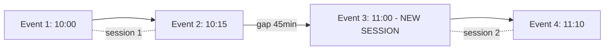

#### Interview Question

**Q:** Session gap kya hona chahiye — 30 min industry standard, but situational kab change karega?

**A:** 30 min web/app default. Situational changes: (1) e-commerce browsing — 30 min fine; (2) video streaming — longer (2 hr) — user pause kar sakta hai; (3) gaming — shorter (10 min); (4) chat apps — longer (event spurts hain). Define gap business context se. Top 2% analyst gap distribution plot karta — agar bimodal hai (peak 5 min, peak 60 min), 30 min cutoff might split natural sessions wrong. Empirical choose karo, document karo.

---

### 3.4 Running totals, moving averages, YoY/MoM growth

#### Definition (kya hai?)

- **Running total** — cumulative sum from start to current row
- **Moving average** — rolling N-period average
- **MoM growth** — `(this_month - last_month) / last_month`
- **YoY growth** — same vs same month previous year

#### Why?

Time-series KPIs dashboards ka backbone. Raw daily numbers volatile, derived metrics se trend dikhta. Investors aur board YoY growth dekhte hain (seasonality strip out).

#### How?

```sql
-- Comprehensive time-series KPI table
WITH monthly AS (
  SELECT
    DATE_TRUNC('month', created_at) AS month,
    SUM(gmv) AS gmv,
    COUNT(DISTINCT user_id) AS unique_users
  FROM orders
  GROUP BY 1
)
SELECT
  month,
  gmv,
  -- Running total
  SUM(gmv) OVER (ORDER BY month
    ROWS BETWEEN UNBOUNDED PRECEDING AND CURRENT ROW) AS cumulative_gmv,
  -- 3-month moving average
  AVG(gmv) OVER (ORDER BY month
    ROWS BETWEEN 2 PRECEDING AND CURRENT ROW) AS ma_3month,
  -- MoM growth
  ROUND(100.0 * (gmv - LAG(gmv) OVER (ORDER BY month))
    / NULLIF(LAG(gmv) OVER (ORDER BY month), 0), 2) AS mom_pct,
  -- YoY growth
  ROUND(100.0 * (gmv - LAG(gmv, 12) OVER (ORDER BY month))
    / NULLIF(LAG(gmv, 12) OVER (ORDER BY month), 0), 2) AS yoy_pct
FROM monthly
ORDER BY month;
```

#### Real-life Example

Razorpay quarterly investor deck — TPV chart mein 3 lines: monthly TPV (volatile), 3-month MA (smooth), YoY% (growth narrative). Investor ko clarity — "raw zigzag dekh ke business unstable lagta, MA + YoY se 40% YoY growth confidence ban gayi". Same data, different presentation = ₹500Cr funding round.

#### Diagram

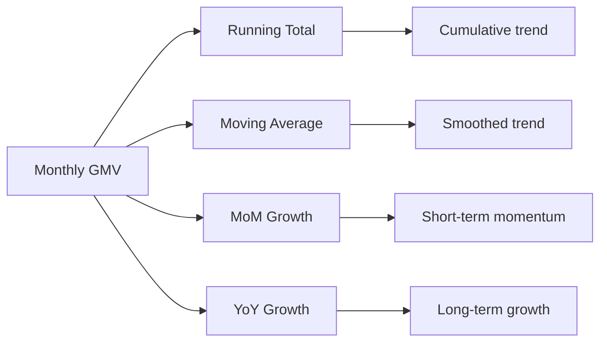

#### Interview Question

**Q:** YoY growth calculation pe seasonality kaise impact karti hai aur tu kaise normalize karega?

**A:** Diwali, festive sale, Holi — har sector mein peaks hain. YoY same-month basis pe seasonality auto-strip ho jaati hai (Oct vs last Oct compare). MoM mein nahi. Top 2% analyst dono dikhata — MoM short-term momentum, YoY structural growth. Advanced: STL decomposition (statsmodels) — but pure SQL mein 12-month MA / current month ratio se de-seasonalize kar sakta. Q3 spike Diwali se hai ya genuine? Compare next-Diwali-cohort lift.

---

### 3.5 Gaps and islands problem

#### Definition (kya hai?)

Classical SQL pattern — sequential data mein continuous "islands" aur "gaps" identify karna. Examples: consecutive login streak, continuous active subscription period, longest non-failure delivery streak.

Approach: difference between row_number and value gives groups.

#### How?

```sql
-- User login streak detection
-- Input: user, login_date
WITH numbered AS (
  SELECT
    user_id,
    login_date,
    ROW_NUMBER() OVER (PARTITION BY user_id ORDER BY login_date) AS rn,
    login_date - (ROW_NUMBER() OVER (PARTITION BY user_id ORDER BY login_date))::INT AS grp_anchor
  FROM user_logins
),
streaks AS (
  SELECT
    user_id,
    MIN(login_date) AS streak_start,
    MAX(login_date) AS streak_end,
    COUNT(*) AS streak_length,
    grp_anchor
  FROM numbered
  GROUP BY user_id, grp_anchor
)
SELECT user_id, MAX(streak_length) AS longest_streak
FROM streaks
GROUP BY user_id
ORDER BY longest_streak DESC;
```

Sample input:

| user_id | login_date |
|---|---|
| U1 | 2026-04-01 |
| U1 | 2026-04-02 |
| U1 | 2026-04-03 |
| U1 | 2026-04-05 (gap) |
| U1 | 2026-04-06 |

`login_date - rn`:
- 04-01 - 1 = 03-31 (group A)
- 04-02 - 2 = 03-31 (group A)
- 04-03 - 3 = 03-31 (group A)
- 04-05 - 4 = 04-01 (group B)
- 04-06 - 5 = 04-01 (group B)

Streaks: A (length 3), B (length 2). Longest = 3.

#### Real-life Example

Paytm — "users with > 7 day daily transaction streak". Loyalty rewards trigger. Without gaps-and-islands, ye query painful CASE WHEN chain. With pattern, 10 lines. Marketing ne 50K eligible users ko ₹50 cashback bheja, retention 12% improved.

#### Diagram

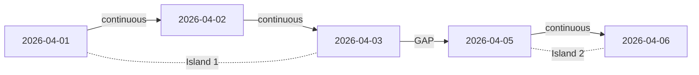

#### Interview Question

**Q:** Tu Razorpay analyst hai — "merchants jinhone consecutive 30 din transactions kiye". Kaise?

**A:** Daily merchant_active_dates table → gaps-and-islands → streak length per merchant → filter where streak_length >= 30. SQL above pattern adapt karke. Edge cases — same day multiple txns count as 1 day (use DISTINCT date), timezone normalize karo. Top analyst output mein "streak_start, streak_end" bhi return karta — woh "active period boundary" jaisa metadata downstream useful.

---

### 3.6 De-duplication strategies

#### Definition (kya hai?)

Real data mein duplicates aate hain — pipeline retries, source system bugs, joins blow-up. Dedup strategies:
1. `DISTINCT` — exact row dedup
2. `ROW_NUMBER` window — keep "best" per key
3. `GROUP BY` with aggregation — collapse with rules
4. `QUALIFY` (BigQuery, Snowflake) — filter window result inline

#### How?

```sql
-- Strategy 1: simple DISTINCT
SELECT DISTINCT user_id, email FROM users;

-- Strategy 2: keep latest per user_id (ROW_NUMBER)
SELECT * FROM (
  SELECT *,
    ROW_NUMBER() OVER (PARTITION BY user_id ORDER BY updated_at DESC) AS rn
  FROM user_events
) WHERE rn = 1;

-- Strategy 3: collapse with aggregation
SELECT user_id, MAX(updated_at) AS last_update,
  ARRAY_AGG(event_id) AS all_event_ids
FROM events
GROUP BY user_id;

-- Strategy 4: QUALIFY (BigQuery/Snowflake)
SELECT * FROM user_events
QUALIFY ROW_NUMBER() OVER (PARTITION BY user_id ORDER BY updated_at DESC) = 1;
```

#### Real-life Example

Meesho user table — Salesforce sync bug se 3% users duplicate ho gaye. Dedup: ROW_NUMBER PARTITION BY email_clean ORDER BY created_at ASC (keep oldest record), keep rn=1. Saved data integrity for marketing campaigns — duplicate emails se people ko 2x SMS ja rahe the, NPS hit ho raha tha.

#### Interview Question

**Q:** `DISTINCT` vs `GROUP BY` — performance and semantic farak?

**A:** Semantically — `SELECT DISTINCT a, b` ≡ `SELECT a, b GROUP BY a, b`. Performance modern engines mein same (both hash-based). Stylistic — DISTINCT pure dedup intent hai, GROUP BY aggregations expect karta. Top 2% analyst — agar aggregations chahiye GROUP BY, agar pure dedup DISTINCT (clearer code intent). Window functions (ROW_NUMBER) tab use karo jab tu specific row pick karna chahta — "latest", "highest", with multiple columns.

---

### 3.7 Slowly Changing Dimensions (SCD Type 1, 2, 3)

#### Definition (kya hai?)

Dimension data badalti rehti — customer city change, product price update, employee dept transfer. Kaise track karein? Three types:

- **Type 1 (overwrite)** — old value lose, new value overwrite. Simple, no history.
- **Type 2 (versioned)** — har change pe new row, old row marked inactive. Full history. Industry standard.
- **Type 3 (limited history)** — old value column add (e.g., previous_city). Only last change tracked.

#### How?

```sql
-- Type 2 SCD example: customer_dim
CREATE TABLE customer_dim (
  customer_sk BIGINT,        -- surrogate key (per version)
  customer_id BIGINT,         -- business key
  name TEXT,
  city TEXT,
  start_date DATE,
  end_date DATE,
  is_current BOOLEAN
);

-- Sample rows for SCD Type 2
-- customer_sk | customer_id | name | city | start_date | end_date | is_current
-- 1 | 100 | Aarav | Bangalore | 2024-01-01 | 2025-06-30 | FALSE
-- 2 | 100 | Aarav | Mumbai | 2025-07-01 | 9999-12-31 | TRUE

-- Find a customer's city as of any point in time
SELECT name, city, start_date, end_date
FROM customer_dim
WHERE customer_id = 100
  AND DATE '2025-03-01' BETWEEN start_date AND end_date;
-- Returns: Bangalore (correct historical value)

-- Update process (when customer's city changes)
-- Step 1: close current row
UPDATE customer_dim
SET end_date = CURRENT_DATE - 1, is_current = FALSE
WHERE customer_id = 100 AND is_current = TRUE;

-- Step 2: insert new row
INSERT INTO customer_dim (customer_id, name, city, start_date, end_date, is_current)
VALUES (100, 'Aarav', 'Pune', CURRENT_DATE, '9999-12-31', TRUE);
```

#### Real-life Example

Zomato delivery partner ka tier (Bronze/Silver/Gold) badalta rehta. Type 2 mein har change versioned. Q1 mein "Bronze partners ka avg delivery time 35 min tha" historical accurate — kyunki Q1 mein woh Bronze the, ab Gold ho gaye. Type 1 hota toh current Gold tier se Q1 metric blend ho jaata, wrong inference. SCD Type 2 = analytical correctness for time-travel queries.

#### Diagram

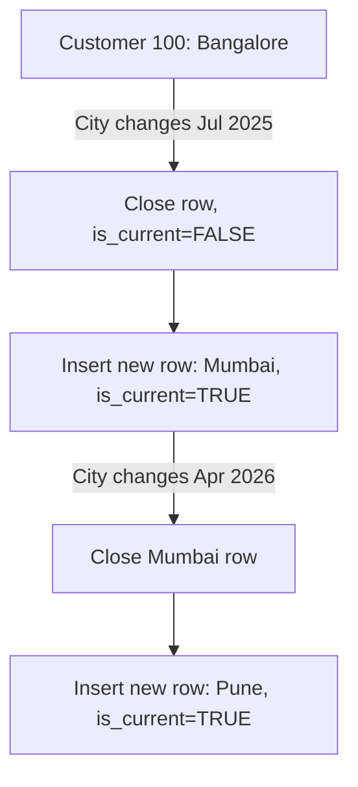

#### Interview Question

**Q:** Type 2 SCD pe report banate waqt analyst kaisa galti karta hai?

**A:** Common galti — `JOIN customer_dim ON orders.customer_id = customer_dim.customer_id` without time-correlation. Result — har order × all versions = duplicate rows. Sahi: `JOIN customer_dim ON orders.customer_id = customer_dim.customer_id AND orders.order_date BETWEEN start_date AND end_date`. Ya simpler — `is_current = TRUE` (current state only, but historical context lose). Top 2% analyst point-in-time joins likhna jaanta — interview mein definitely pucha jaata.

---

## 4. SQL Performance

Ek beautiful query jo 8 ghante chalti hai = useless query. Performance fundamentals.

### 4.1 EXPLAIN / EXPLAIN ANALYZE

#### Definition (kya hai?)

`EXPLAIN` query plan dikhata hai (estimated cost, index usage, join algorithm). `EXPLAIN ANALYZE` actually runs the query and shows real execution time, rows processed.

#### Why?

Slow query = wasted time + warehouse cost. Without EXPLAIN, tu blind hai — "kyu slow hai?" guess karta. EXPLAIN se sequential scan, missing index, bad join order, exploded cardinality identify hote.

#### How?

```sql
-- Postgres
EXPLAIN ANALYZE
SELECT u.name, COUNT(o.order_id)
FROM users u LEFT JOIN orders o ON u.user_id = o.user_id
WHERE u.signup_date >= '2026-01-01'
GROUP BY u.name;

-- Sample output:
-- HashAggregate (cost=12500.00..12550.00)
--   ->  Hash Right Join (cost=1200.00..12000.00, actual time=3.2..120.5 ms)
--         Hash Cond: (o.user_id = u.user_id)
--         ->  Seq Scan on orders o (cost=0.00..8000.00)  <-- RED FLAG: full scan
--         ->  Hash (cost=200.00..200.00)
--               ->  Index Scan on users u (cost=0.42..200.00)
--                     Index Cond: (signup_date >= '2026-01-01')
```

Watch for: `Seq Scan` on big tables (missing index?), high `actual time`, `Rows Removed by Filter` (predicate pushdown failing).

#### Real-life Example

Flipkart analyst — query 12 minutes le rahi thi. EXPLAIN ANALYZE — `Seq Scan` on 500M-row events table. WHERE clause pe `event_date` filter tha — but column NULL allowed tha aur partial index nahi tha. Added covering index, query 8 sec. ₹50K/day warehouse cost saved.

#### Interview Question

**Q:** EXPLAIN aur EXPLAIN ANALYZE mein farak?

**A:** EXPLAIN — query plan dikhata hai BUT runs nahi karta. Estimated costs based on stats. EXPLAIN ANALYZE — actually executes query, shows real timing + actual rows. Production pe ANALYZE careful — destructive queries (UPDATE, INSERT) actually execute karte. Top analyst dono use karta — pehle EXPLAIN (cheap), agar suspicious pattern toh ANALYZE.

---

### 4.2 Indexes — B-tree, hash, partial, covering

#### Definition (kya hai?)

Index = sorted lookup structure for fast WHERE/JOIN. Types:
- **B-tree** — default, range queries (`>`, `<`, `BETWEEN`), equality
- **Hash** — equality only, no range
- **Partial** — index over subset (`CREATE INDEX ... WHERE active = TRUE`) — saves space
- **Covering** — index includes additional columns (Postgres `INCLUDE`) — query satisfied entirely from index, no table lookup

#### How?

```sql
-- B-tree on user_id (default)
CREATE INDEX idx_orders_user ON orders(user_id);

-- Composite B-tree (user_id + created_at)
CREATE INDEX idx_orders_user_date ON orders(user_id, created_at);

-- Partial — only active subscriptions
CREATE INDEX idx_active_subs ON subscriptions(user_id) WHERE status = 'active';

-- Covering — query gets data from index without heap fetch
CREATE INDEX idx_orders_covering ON orders(user_id, created_at) INCLUDE (gmv, status);
```

Rule of thumb — index column = frequent WHERE/JOIN column with high cardinality. Low-cardinality (gender) indexes useless.

#### Real-life Example

Razorpay merchant dashboard — `WHERE merchant_id = X AND created_at > Y` query 15 sec slow. Pre-existing single-col indexes. Composite `(merchant_id, created_at)` banaya, query 50 ms. Single-column indexes < composite for multi-column WHERE. Order matters — most-filtered first.

#### Interview Question

**Q:** Index banane ka cost kya hai? Kab nahi banayega?

**A:** Indexes free nahi — (1) write slow (har INSERT/UPDATE index update); (2) storage cost; (3) query planner overhead. Avoid: low-cardinality columns (gender, boolean) — full scan often faster; tables with very high write throughput; columns rarely filtered. Top 2% analyst index ka ROI dekhta — query frequency × time saved vs write overhead × storage. Random "let's add index" ka over-indexing as bad as none.

---

### 4.3 Query optimization — predicate pushdown, no SELECT *

#### Definition (kya hai?)

- **Predicate pushdown** — filters as early in plan as possible (less rows downstream)
- **No SELECT *** — select only needed columns (less I/O, less network, columnar warehouse mein huge)
- **JOIN order** — small table first (build hash on smaller, probe larger)
- **Avoid functions on indexed columns** — `WHERE LOWER(email) = ...` kills index unless functional index

#### How?

```sql
-- Bad: function on indexed column
SELECT * FROM users WHERE LOWER(email) = 'aarav@gmail.com';
-- Index on email skipped

-- Good
SELECT name, email FROM users WHERE email = 'aarav@gmail.com';

-- Bad: predicate after join
SELECT *
FROM orders o JOIN users u ON o.user_id = u.user_id
WHERE u.signup_date > '2026-01-01';
-- Modern optimizers usually push, but explicit safer

-- Good: predicate in subquery
SELECT *
FROM orders o
JOIN (SELECT * FROM users WHERE signup_date > '2026-01-01') u
  ON o.user_id = u.user_id;
```

In columnar warehouses (BigQuery, Snowflake) — `SELECT col1, col2` only reads those column files. `SELECT *` reads everything = 10-100x slower + costlier.

#### Real-life Example

Swiggy analytics — analyst ne `SELECT * FROM events WHERE date = '2026-04-29'`. Warehouse bill ek query pe ₹4000 (450 GB scan). Same with `SELECT user_id, event_name, gmv FROM events WHERE date = '2026-04-29'` — ₹40 (4.5 GB scan). 100x cost difference. dbt review mein analyst ke pehle hint — "no select star, ever".

#### Interview Question

**Q:** Tu BigQuery pe ₹500 ka query daily run kar raha hai. Cost reduce karne ke top 3 strategies?

**A:** (1) **Column pruning** — `SELECT *` mat karo, sirf needed columns; columnar storage column-wise scan; (2) **Partition pruning** — partition by date column, WHERE clause mein partition column hamesha; BigQuery non-partition full scan = explosive cost; (3) **Cluster columns** — frequently filtered columns pe cluster (BigQuery)/sort key (Snowflake); reduces data scanned. Bonus: materialized views for repetitive aggregations, scheduled queries off-peak. Top 2% analyst monthly cost report dekhta, top 10 expensive queries identify, optimize.

---

### 4.4 Partitioning, clustering, materialized views

#### Definition (kya hai?)

- **Partitioning** — table physically split by column value (e.g., by date). Query filter pe partition pruning.
- **Clustering** — within partition, data sorted by clustering keys. Reduces I/O.
- **Materialized view** — query result physically stored. Read fast, periodic refresh. Different from regular view (which just stores definition).

#### How?

```sql
-- BigQuery: partitioned + clustered table
CREATE TABLE analytics.orders (
  order_id STRING,
  user_id STRING,
  city STRING,
  gmv NUMERIC,
  created_at TIMESTAMP
)
PARTITION BY DATE(created_at)
CLUSTER BY city, user_id;

-- Postgres: native partitioning
CREATE TABLE orders (
  order_id BIGINT, user_id BIGINT, gmv NUMERIC, created_at TIMESTAMP
) PARTITION BY RANGE (created_at);

CREATE TABLE orders_2026_q1 PARTITION OF orders
  FOR VALUES FROM ('2026-01-01') TO ('2026-04-01');

-- Materialized view
CREATE MATERIALIZED VIEW mv_daily_revenue AS
SELECT DATE_TRUNC('day', created_at) AS day, SUM(gmv) AS revenue
FROM orders GROUP BY 1;

-- Refresh
REFRESH MATERIALIZED VIEW mv_daily_revenue;
```

#### Real-life Example

Paytm transactions table 5 billion rows. Partitioned by `DATE(created_at)`, clustered by `merchant_id`. Daily merchant report query — earlier 8 min, post-partition 12 sec. Same data, different physical layout. Storage same, scan 100x less.

#### Diagram

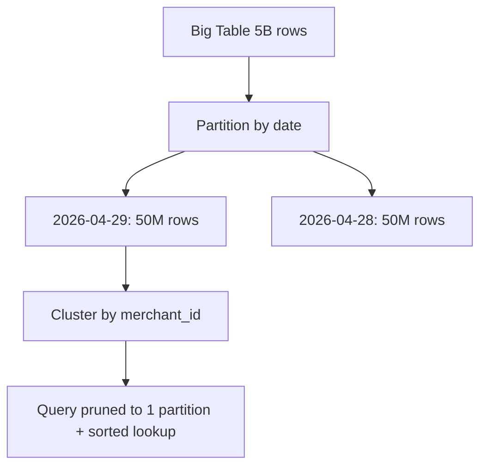

#### Interview Question

**Q:** Materialized view vs regular view vs CTE — kab kaunsa?

**A:** **Regular view** — saved query definition, no storage; har baar query re-runs underlying. Fast for simple lookups, slow for heavy aggregations. **Materialized view** — physical storage, periodic refresh; fast read, stale-data tradeoff. **CTE** — single-query scope, no persistence; modular code, no caching. Use case: dashboard query top-of-funnel — MV (refreshed nightly); ad-hoc analysis — CTE; semantic layer abstraction — regular view. Top 2% analyst MV refresh schedule cost-vs-freshness tradeoff samajhta hai — too frequent = wasted compute, too rare = stale dashboards.

---

## 5. Multi-dialect SQL

Postgres, BigQuery, Snowflake — most Indian companies (Razorpay, Swiggy, Meesho) ek se ek shift karte hain, ya multi-cloud chalate. Syntax differences crucial.

### 5.1 Postgres vs BigQuery vs Snowflake — syntax that bites

#### Definition (kya hai?)

Same SQL standard, but dialects different. Tu Postgres pe code likhta, BigQuery pe paste karta, errors aate. Top 2% analyst dialect-aware likhta hai aur quick adapt karta.

#### Why?

Multi-cloud era — BigQuery (GCP), Snowflake (multi-cloud), Redshift (AWS), Databricks (lakehouse). Indian unicorns mostly BigQuery (cheap, GCP credits) ya Snowflake (premium). Postgres operational. Tu agar dialects nahi jaanta, har platform shift pe productivity tank.

#### How?

Comparison table:

| Feature | Postgres | BigQuery | Snowflake |
|---|---|---|---|
| String concat | `||` or CONCAT | CONCAT only | `||` or CONCAT |
| Date diff | `AGE()`, `EXTRACT` | `DATE_DIFF(d1, d2, DAY)` | `DATEDIFF('day', d1, d2)` |
| Date trunc | `DATE_TRUNC('month', ts)` | `DATE_TRUNC(ts, MONTH)` | `DATE_TRUNC('month', ts)` |
| Current timestamp | `NOW()`, `CURRENT_TIMESTAMP` | `CURRENT_TIMESTAMP()` | `CURRENT_TIMESTAMP()` |
| Quoted identifier | `"col"` | backticks `` `col` `` | `"col"` |
| Regex match | `col ~ 'pat'` | `REGEXP_CONTAINS(col, 'pat')` | `RLIKE(col, 'pat')` |
| Array | `ARRAY[1,2]`, `unnest` | `ARRAY[1,2]`, `UNNEST` | `ARRAY_CONSTRUCT(1,2)`, `LATERAL FLATTEN` |
| JSON path | `payload->>'key'` | `JSON_VALUE(payload, '$.key')` | `payload:key::STRING` |
| Window QUALIFY | Not supported | Supported | Supported |
| EXCEPT | EXCEPT | EXCEPT DISTINCT / ALL | EXCEPT (or MINUS) |
| Pivot | manual CASE | native PIVOT | native PIVOT |
| Sample | `TABLESAMPLE SYSTEM (10)` | `TABLESAMPLE SYSTEM (10 PERCENT)` | `SAMPLE (10)` |

```sql
-- Postgres
SELECT user_id || ' - ' || name AS label
FROM users WHERE email ~* '@gmail';

-- BigQuery (same intent)
SELECT CONCAT(user_id, ' - ', name) AS label
FROM users WHERE REGEXP_CONTAINS(email, r'@gmail');

-- Snowflake
SELECT user_id || ' - ' || name AS label
FROM users WHERE RLIKE(email, '@gmail');
```

#### Real-life Example

Meesho 2023 mein Snowflake → BigQuery migration kiya (cost + GCP credits). Analytics team ka 3000+ SQL queries break — `DATEDIFF` syntax different, `LATERAL FLATTEN` BigQuery mein UNNEST, REGEXP functions alag. Senior analyst ne dialect translation script likha (regex-based) — 70% queries auto-converted, baaki manual. Without dialect literacy, migration 6 month tha — 6 weeks mein nikla.

#### Diagram

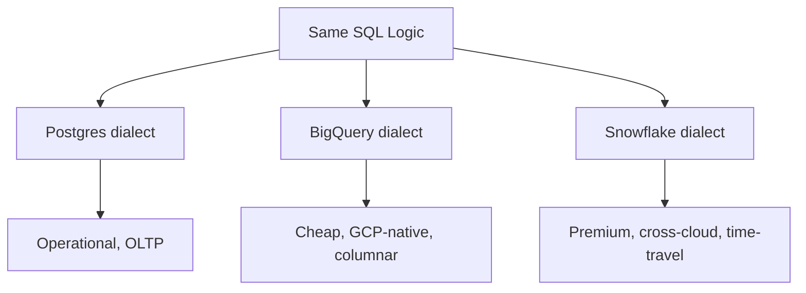

#### Interview Question

**Q:** BigQuery aur Postgres mein date arithmetic kaise differ karta hai?

**A:** Postgres: `date1 - date2` returns interval/integer days; `date + 7` adds days. BigQuery: explicit `DATE_DIFF(d1, d2, DAY)`, `DATE_ADD(d, INTERVAL 7 DAY)`. Snowflake: `DATEDIFF('day', d1, d2)`, `DATEADD('day', 7, d)`. Common bug — Postgres-style `date1 - date2` BigQuery pe error. Top 2% analyst documentation reference rakhta — ya dbt jinja macros use karta jo dialect-agnostic SQL banate.

---

> **Bottom line:** SQL data analyst ki #1 skill hai — non-negotiable. Core (SELECT, JOIN, GROUP BY) sirf entry ticket hai. Window functions, CTEs, cohort/funnel/sessionization patterns — yahan top 2% analyst alag dikhta. Performance (EXPLAIN, indexes, partitioning) ke bina beautiful SQL useless hai. Multi-dialect literacy modern data stack mein essential. Iss subject ko 25-30 ghante seriously laga, har query khud apne toy dataset (Postgres local pe) likh ke chala — passive reading se SQL nahi aati. Jab tu raat ke 2 baje bhi gaps-and-islands likh sakta hai bina Google ke, tab tu top 2% mein aaya.
