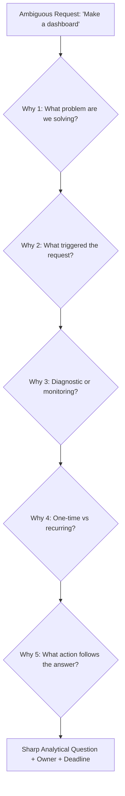
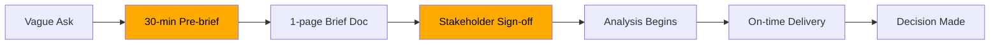
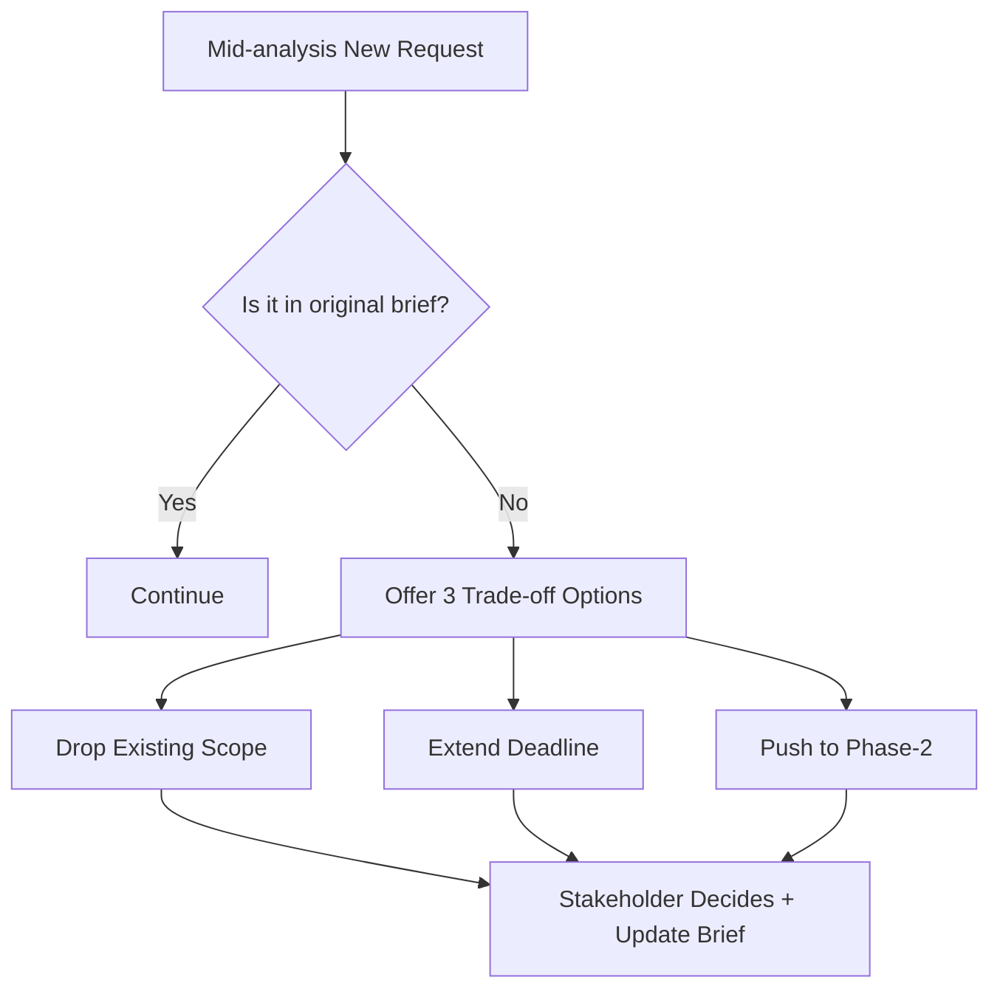
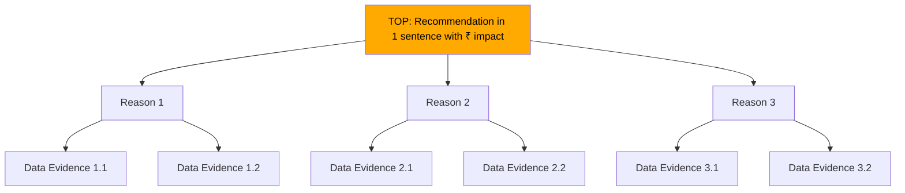
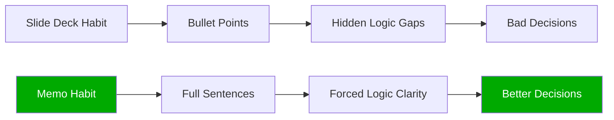
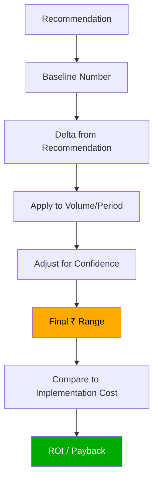
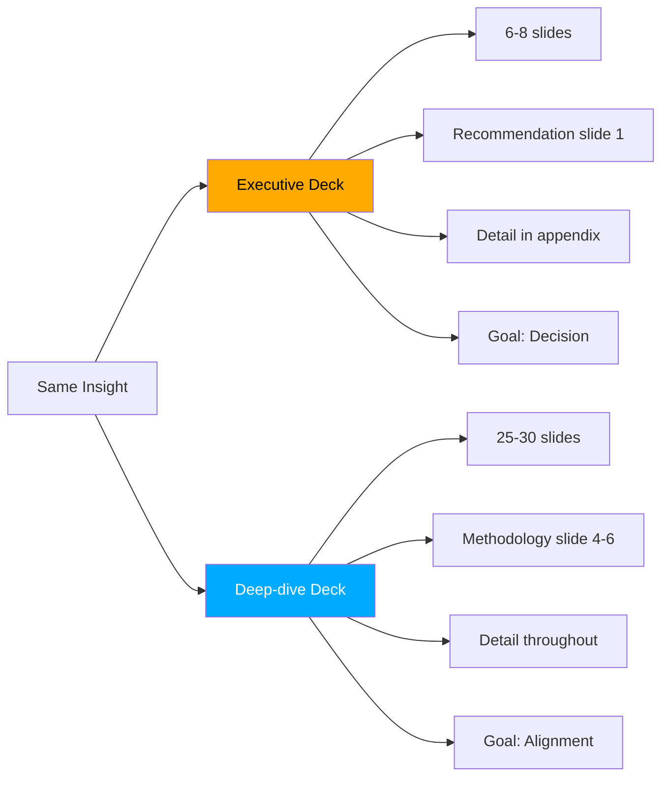
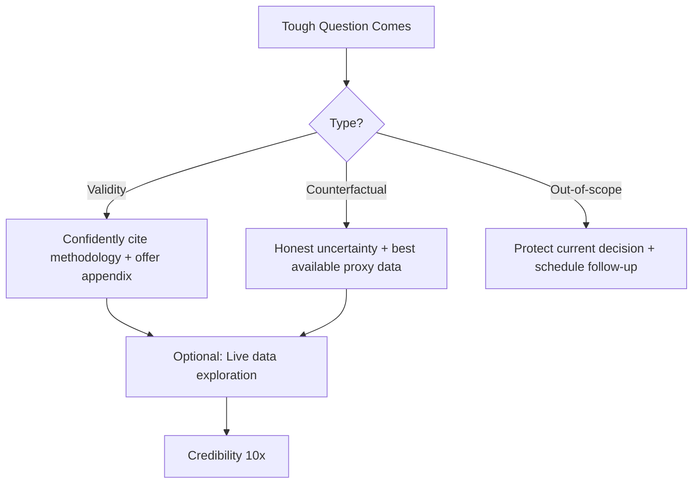

# Stakeholder Management & Influence

Dekh bhai, ek baat clear kar le — top 2% analyst is **not the most technical**, woh sabse **influential** hota hai. Tu jitna bada SQL likhe, jitna fancy ML model train kare, jitna deep cohort analysis kare — agar woh ek decision nahi banti, agar woh ek leader ka mind nahi badalti, agar woh ek rupee bhi P&L pe move nahi karti — woh kaam complete waste hai. Period. Repeat karo: insight without action = digital theatre.

98% Indian analysts is trap mein phasse hue hain — woh sochte hain "agar mera analysis correct hai toh leadership automatic samjhegi". Bhai, leadership busy hai. CMO ke 14 meetings hain. CFO ko board ka pressure hai. PM ke roadmap pe 7 launches pending hain. Tera 40-slide deck unhe nahi padhna. Unhe chahiye — ek line, ek number, ek decision, ek owner. Aur ye skill — ambiguous question ko sharp question banane ki, recommendation ko ₹ mein quantify karne ki, board mein cheekh-pukar ke beech apna point clearly land karne ki — yahi hai woh moat jo top 2% ko separate karta hai.

Ye subject tujhe wo soft-skill arsenal dega jo IIT mein nahi sikhaate. 5 Whys se ambiguous PM request ko translate karna, pre-analysis briefing se scope creep avoid karna, Pyramid Principle se exec audience ke liye top-down memo banana, Amazon 6-pager style se decisions document karna, har recommendation ko ₹ Cr business impact mein convert karna, executive presentation aur deep-dive presentation ka difference samajhna, board ke sudden questions handle karna without panic, aur live data exploration ke through credibility build karna. Sab Hinglish mein, real PM-analyst conversations, real CMO requests, real CFO ambush questions — Razorpay, Swiggy, Zomato, Flipkart, Meesho ke context mein.

---

## 1. Working with Business Leaders

Yahi pe top 2% analyst banta hai. SQL toh sab seekh lete hain — but ambiguous "make a dashboard" request ko ek sharp business question mein translate karna, success criteria pre-decide karna, aur scope creep ko politely roak dena — ye art hai. Iske bina tu har project mein 3x time bharbada karega.

### 1.1 5 Whys — translate ambiguous → analytical

#### Definition (kya hai?)

5 Whys ek root-cause discovery technique hai jo Toyota se aayi hai — har ambiguous statement pe "kyun?" pucho 5 baar, asli question floor pe aa jaayega. Analyst ke liye ye sabse powerful translation tool hai — kyunki business leaders kabhi seedha analytical question nahi puchte. Woh symptom puchte hain, tu cause dhundta hai.

PM bolega "make a dashboard for retention". Ye question nahi hai — ye desperation hai. 5 Whys lagao — pata chalega ki actually woh churn risk score chahta hai for 90-day cohorts taaki next quarter ka OKR meet ho.

#### Why?

98% analysts pehla literal request execute karte hain — dashboard bana ke deliver kar dete hain — phir 2 hafte baad PM bolta "yaar ye toh kaam ka nahi hai". Time waste, trust waste, credibility waste. Top 2% analyst pehle question ko question karte hain. 30 minute briefing 3 hafte rework save karta hai.

#### How?

Process — har naya request aaye toh 5 layers deep jaao:

```text
PM: "Mujhe ek retention dashboard chahiye."
Analyst: "Sure — kis cohort ka retention dekhna hai, weekly ya monthly?" (Why 1: scope clarify)
PM: "Monthly, last 6 months."
Analyst: "Kyun ye specifically? Kuch alarming dikha kya?" (Why 2: trigger)
PM: "Haan, last quarter D30 retention 4 points gir gaya."
Analyst: "OK, toh hum cause dhundh rahe hain ya measure kar rahe hain?" (Why 3: intent)
PM: "Cause. Leadership review hai 2 hafte mein."
Analyst: "Toh ek static analysis chahiye ya recurring monitoring?" (Why 4: cadence)
PM: "Static analysis pehle, phir agar pattern dikha toh dashboard."
Analyst: "Last cheez — agar mujhe cause mil gaya, action kya hoga?" (Why 5: action)
PM: "Onboarding flow redesign — agar drop-off wahan hai."
```

5 minute mein "dashboard banao" se "static cohort analysis on D30 retention drop, focus on onboarding step drop-offs, deliverable in 10 days" ho gaya.

#### Real-life Example

Razorpay ka analyst — Head of Sales aaya, "merchant dashboard chahiye". Analyst ne 5 Whys lagaye. Pata chala asli problem — top 100 enterprise merchants ka MoM TPV gir raha tha aur sales team ko early warning chahiye thi before churn. Solution dashboard nahi tha — solution tha automated weekly Slack alert with TPV-decline merchants flagged. Build time 2 hafte se 3 din ho gaya.

#### Diagram



#### Interview Question

**Q:** Tu Swiggy ka analyst hai. CMO ne meeting mein bola "Bangalore mein kuch gadbad hai, ek analysis chahiye." Tu kaise scope karega?

**A:** Pehle main sirf "haan ji" nahi bolunga. 5 Whys karunga: (1) "Kya gadbad?" — orders flat hain ya negative? (2) "Kab dikha?" — sudden drop ya gradual? (3) "Compare kis se kar rahe hain?" — last week, last year, ya forecast? (4) "Hypothesis kya hai?" — competitor, weather, supply issue? (5) "Insight ke baad kya karenge?" — marketing push, ops fix, ya pricing? In 5 answers se main scope decide karunga — agar action "marketing push" hai toh user-level segmentation chahiye, agar "ops fix" hai toh restaurant supply analysis. Bina is clarity ke main 3 din ka kaam 2 hafte mein nahi karunga.

---

### 1.2 Pre-analysis briefing & success criteria

#### Definition (kya hai?)

Pre-analysis briefing ek 30-minute structured conversation hai jo tu analysis start karne se **pehle** karta hai stakeholder ke saath. Output — ek 1-page brief jo cover karta hai: business question, hypothesis, scope, deliverable format, success criteria, deadline, decision-maker. Iske bina tu blind chala raha hai.

Success criteria matlab — pehle se decide karna ki "is analysis ka result agar X aaya toh hum Y karenge". Ye sunke leaders pehle confused hote hain, but ye exact mechanism hai jo analysis ko decision-driver banata hai vs report-card.

#### Why?

Bina pre-brief ke har analyst ek classical mistake karta hai — analysis 80% complete hone ke baad pata chalta hai stakeholder ne kuch aur expect kiya tha. Rework. Frustration. "Yaar tu samjha nahi". Pre-brief 30 min lagta hai aur typically 4-6 din ka rework save karta hai. ROI ridiculous hai.

#### How?

Standard 1-page brief template:

```text
ANALYSIS BRIEF — Razorpay Enterprise Churn Diagnostic
Requestor: VP Sales (Rohan)
Decision-maker: CRO
Business question: Last 90 din mein top-200 enterprise merchants mein churn 8% se 14% kyun ho gaya?
Hypothesis (theirs): Pricing hike ka impact, ya customer success coverage gap.
Scope IN: Top 200 merchants by FY24 TPV, churn definition = 60-day TPV drop > 70%.
Scope OUT: SMB segment, international, sub-100Cr TPV merchants.
Deliverable: 3-page memo + 1 table + 1 chart. NO dashboard.
Success criteria: Agar pricing hike top driver hai, pricing committee meet hogi; agar coverage gap hai, CS hiring plan revisit hoga.
Deadline: 7 working days. Draft review on Day 5.
```

Stakeholder se sign-off lo email/Slack pe before writing first SQL.

#### Real-life Example

Flipkart Big Billion Day ke baad VP Category aaya: "Fashion underperformed, kya hua?" Analyst ne pre-brief banaya — scope: Fashion subcategories only, last 2 BBDs comparable. Success criteria: agar reason "discount depth kam thi" hai toh next year marketing budget badhega; agar "supply gaps" hai toh sourcing team ko alert. VP ne email pe sign-off diya. 5 din baad analysis deliver hua, decision Day 6 pe ho gayi — woh analyst regional CMO se directly engage hua next quarter.

#### Diagram



#### Interview Question

**Q:** "Pre-brief ek bureaucratic process hai" — agar PM ye bole, tu kaise convince karega?

**A:** Main use practical lens dunga. Bolunga "Last 5 analysis projects yaad karo — kitne mein scope mid-way change hua, kitne mein delivery ke baad rework hua?" Typically 60% mein. Phir bolunga "Pre-brief ek insurance policy hai — 30 minute ka cost, 5-day rework ka avoidance. Aur ye tumhare PM job ko bhi bachata hai — agar leadership question kare 'tumne ye kyun karwaya', tumhare paas signed brief hai." Pre-brief stakeholder ko bhi safe karta hai, isliye woh resist nahi karte once samjh aata.

---

### 1.3 Managing scope creep, saying no without burning bridges

#### Definition (kya hai?)

Scope creep matlab — analysis chal raha hai aur stakeholder beech mein add karna shuru karta hai: "ek aur slice add kar do", "ye ek view bhi", "thoda predictive bhi karle". Har "chhota" addition compound karta hai — 3 chhote requests = 1 hafta extra. Top 2% analyst scope creep ko **politely refuse** karta hai bina relationship damage kiye.

Saying no = professional boundary setting. Ye art hai — yes-man banoge toh deadline miss + quality drop, hard-no banoge toh next time tujhe loop mein nahi rakhenge.

#### Why?

Most analysts "sab kar dunga" syndrome mein phasse hote hain — har request ko yes bolte hain, phir burnout, phir delivery slip, phir credibility loss. Top 2% analyst scope ko sacred treat karta hai aur creep ko trade-off conversation banata hai. "Ye add karna hai? Theek hai — kya drop karein? Ya deadline 5 din extend kare?"

#### How?

Three-line response framework:

```text
PM (mid-analysis): "Yaar ek aur cut chahiye — by city by tier."
Analyst (good response): "Sure, ye scope mein nahi tha — main do option deta hoon:
  Option A: Original scope deliver Friday, ye city-tier cut next week (3 din extra).
  Option B: Add karta hoon, deadline Wednesday se Monday (3 din slip).
  Option C: City-tier cut zyada important hai? Toh original deep-dive ek section drop kar de.
  Tum decide karo, main update brief mein note kar dunga."
```

Tone — collaborative, options-driven, document trail. "No" word use nahi karna, but trade-off real banana hai.

#### Real-life Example

Meesho ka analyst — Head of Growth ne pricing experiment analysis maanga, 1 week. Day 3 pe bola "ek pricing variant aur add karte hain, aur user-LTV impact bhi calculate karo". Analyst ne kaha "Theek hai — but ye 2 hafta plus karega aur experiment statistical power ko dilute karega. Mera suggestion — current 3 variants se complete read lo, woh action banegi; LTV impact phase-2 mein with proper cohort window. Tumhe agar pehle chahiye toh launch decision 1 hafta postpone." Head ne phase-2 accept kiya. 4 hafte baad woh analyst ka woh recommendation ₹6Cr revenue lift mein convert hua — kyunki original analysis solid tha, diluted nahi.

#### Diagram



#### Interview Question

**Q:** Tujhe Head of Marketing ne pre-decided scope ka analysis maanga, mid-way pe woh CEO ke saath meeting karke aaya aur bola "CEO ko ye additional cut bhi chahiye, kal subah." Tu kya karega?

**A:** Pehle ego side rakh ke realistic banta hoon — "CEO direct ask" usually genuine urgency hai, but blind yes nahi bolunga. Reply: "Samjha, kal subah challenging hai — main 2 options deta hoon: (1) original analysis ka 70% deliver karta hoon kal, additional cut Tuesday tak full quality; (2) ya kal sirf ek directional answer deta hoon (rough cut, no QA), formal version Tuesday. Tum decide karo, main usi pe execute karta hoon." Saath email mein scope change document karta hoon — taaki Tuesday ko koi nahi bole "tumne kuch aur promise kiya tha". Boundary maintain hoti hai, but flexibility dikhti hai. Ye exact balance top 2% banata hai.

---

## 2. Storytelling & Influence

Analysis tabhi influence banti hai jab woh structured story ke through deliver hoti hai. SQL strong, viz strong — but communication kachra — kaam zero. Yahi gap se top 2% banta hai.

### 2.1 Pyramid Principle — mastery, not exposure

#### Definition (kya hai?)

Barbara Minto ka Pyramid Principle (McKinsey ka backbone) — har communication top-down hota hai. **Pehle answer/recommendation, phir 3 supporting reasons, phir har reason ka data evidence**. Bottom-up (build-up) thinking analyst ka style hota hai — but executive top-down sun-na chahta hai.

Mastery vs exposure — 90% analysts pyramid principle "jaante hain" but kabhi practice nahi karte. Mastery matlab har email, har Slack, har slide — top-down structured. Reflex ban gaya hota hai.

#### Why?

Executive ke paas 30 second hain. Agar pehli line mein recommendation nahi mili, woh scroll/swipe/skip kar dega. Bottom-up mein tu data dikha raha hai, woh pucchega "toh kya?" — 5 minute waste. Top-down mein tu pehle answer deta hai, "kyun" baad mein — woh agree kar gaya toh detail skip; disagree toh detail mein dive. Either way time efficient.

#### How?

Pyramid structure:

```text
Top: "Razorpay ko Q2 mein enterprise pricing 8% increase karna chahiye — net ₹42Cr revenue uplift."

Middle (3 supporting reasons):
1. Top 100 merchants ka price elasticity -0.3 hai (low) — churn risk minimal.
2. Competition (Cashfree, Easebuzz) already 6-9% higher pricing pe hai — market headroom hai.
3. New value-added features (Razorpay X, RazorpayPOS) launch hue hain Q1 mein — bundling justification hai.

Bottom (data evidence per reason):
- Reason 1: 18-month TPV regression, p<0.01, R² 0.71. (Analysis ID: PRC-2403)
- Reason 2: Public pricing teardown — 12 enterprise merchant interviews.
- Reason 3: 28% adoption of Razorpay X by top-100 in 90 days.
```

Memo, deck, email — sab same structure. Top first.

#### Real-life Example

Zomato dining team ka analyst — "restaurant partner churn analysis" 25-slide deck banaya. Reviewer ne wapas bheja: "Page 1 pe recommendation nahi hai. CEO ko bhejunga toh slide 17 tak woh nahi pahunchega." Analyst ne 1-pager rewrite kiya — Top: "Tier-2 cities mein restaurant churn 22% (vs 11% Tier-1) — 60-day onboarding intervention proposal ₹18Cr ARR protect karega." 3 reasons, 3 evidences. CEO ne approval Day 2 pe kar di. Same data, same insight — different structure, different outcome.

#### Diagram



#### Interview Question

**Q:** Pyramid Principle aur "telling a story" mein difference kya hai? Dono interchangeable hain?

**A:** Nahi, dono different hain — aur top 2% analyst dono use karta hai context ke hisaab se. Pyramid Principle is for **decisions** — exec audience, time-constrained, action-required. Top first, evidence neeche. Storytelling is for **buy-in / culture / change management** — narrative arc, character (customer), conflict (problem), resolution (solution). Storytelling mein tension build hoti hai. Real example: ek board memo Pyramid Principle pe likhunga (CFO needs decision); same insight ko all-hands town hall mein narrative storytelling se present karunga (employees need emotional buy-in). Same insight, different structure, different audience. Mastery is knowing which when.

---

### 2.2 Memo writing — Amazon 6-pager style

#### Definition (kya hai?)

Amazon ka famous 6-pager — Bezos ne PowerPoint ban kar diya tha internally. Saare important meetings mein analyst/PM/manager ek 6-page narrative memo likhta hai. Meeting start hoti hai 20-min silent reading se — phir discussion. Ye approach top 2% analyst ka secret weapon hai because (a) memo likhne se thinking sharp hoti hai (slide pe tum gaps chhupa sakte ho, prose mein nahi), (b) decision quality jump karti hai, (c) async-readable — leader 3 baje raat mein bhi padh sakta hai.

#### Why?

PowerPoint ek lazy medium hai — bullet points mein cause-effect, conditional logic, nuance lost ho jaata hai. Memo full sentences force karta hai — "X kyunki Y, isliye Z" — gap dikhte hain. Bezos quote: "If you can't write it as a memo, you don't know what you're saying."

#### How?

Standard 6-pager skeleton:

```text
1. CONTEXT (½ page) — what's the situation, why are we writing this now
2. PROBLEM / OPPORTUNITY (½ page) — what's broken or what's possible, with ₹ size
3. PROPOSAL (1 page) — recommendation, in pyramid structure
4. EVIDENCE & ANALYSIS (2 pages) — data, charts, methodology
5. RISKS & MITIGATIONS (1 page) — what can go wrong, how we'll catch
6. APPENDIX (1 page) — FAQ, alternative options considered, glossary
```

Sample excerpt — Swiggy memo on dark store profitability:

```text
Section 1 — Context (extract):
"Swiggy Instamart ne FY25 mein 700 dark stores cross kiye, ₹4,200Cr GMV with -8% contribution margin. Senior leadership ne Q3 mein 'path to profitability in 18 months' commit kiya hai investors ko. Ye memo current dark store unit economics analyze karta hai aur 3 levers propose karta hai jo 18 months mein CM neutral kar sakte hain."

Section 3 — Proposal (extract):
"Recommendation: Tier-2 dark stores ka 30% portfolio rationalize karo (close ya consolidate), assortment ko 8000 SKU se 5500 SKU pe lao, aur private label penetration 12% se 25% kar do. Combined impact: contribution margin +9pp (from -8% to +1%) within 14 months, ₹380Cr EBITDA improvement run-rate."

Section 5 — Risks (extract):
"Closure se ₹220Cr GMV exposed hai — but 70% of this will recover via neighboring store catchment expansion (validated through 4-store pilot in Hyderabad, Apr-Jun 2025). NPS impact -3 points expected, monitored monthly; mitigation = surge delivery time SLA (₹/order) for affected pin codes."
```

#### Real-life Example

Flipkart Wholesale ka analyst — naye SKU expansion plan ka 6-pager likha. Pehla version 12 pages tha — VP ne return kiya, "6 pages, ya nahi padhunga". Trim karte time analyst ko realize hua — section 4 ka 60% data redundant tha. Final 6-pager mein decision Day 1 hi ho gayi, ₹85Cr investment approved. Memo writing ne thinking sharp ki, decision fast hui — dono tarafe se win.

#### Diagram



#### Interview Question

**Q:** "Hamari company mein PowerPoint culture hai, memo nobody reads" — analyst ke liye ye kaise badle?

**A:** Top-down change ki wait nahi karunga. Ek high-stakes problem pe khud memo likhunga, manager ko bhejunga: "Iss week ka analysis ek 4-pager mein likha hai — slide deck bhi hai but memo zyada complete hai. 15 min lag jaayenge, but decision faster hogi." Agar ek bhi senior leader ne padha aur woh meeting fast resolve hui, word spread hoti hai. Maine Razorpay ke ek friend ko dekha — ye exact tactic se 6 mahine mein team-wide memo culture create kiya. Bottom-up cultural change analyst ka under-rated influence skill hai.

---

### 2.3 Quantifying recommendations in ₹ business impact

#### Definition (kya hai?)

Har recommendation ka ek ₹ Cr tag hona chahiye — incremental revenue, cost saving, risk avoided, ya margin uplift mein. Bina ₹ ke recommendation ek opinion hai, ₹ ke saath woh investment thesis hai. Top 2% analyst kabhi recommendation deta nahi without quantification.

Three flavors:
- **Hard ₹** — direct revenue/cost (e.g., "₹45Cr revenue add hoga from Q3 launch")
- **Soft ₹** — risk-adjusted or probabilistic (e.g., "65% probability se ₹12-18Cr churn protection")
- **Range ₹** — bounded estimate (e.g., "₹8-15Cr depending on adoption rate")

#### Why?

CFO/CEO mind mein har request ek ₹ slot mein jaati hai. Tu agar ₹ nahi deta, woh apna estimate lagaayega — usually conservative, usually wrong, aur tera proposal de-prioritize ho jaayega. Tu agar khud ₹ ke saath aata hai, conversation "kya kare" se "kab launch kare" pe shift hoti hai.

#### How?

Quantification framework — 4 questions:

```text
1. BASELINE: Currently kya number hai? (e.g., monthly churn 2.4%, ARR ₹120Cr)
2. DELTA: Recommendation se kya change hoga? (e.g., churn 2.4% → 1.8%, delta 0.6%)
3. APPLIED TO: Kis pe apply hoga? (e.g., ₹120Cr × 0.6% × 12 months = ₹8.6Cr)
4. CONFIDENCE: Kitna confident? (e.g., based on 4-week pilot, n=2400, p<0.01 → 70-80% confidence)
```

Sample memo line:

```text
"Recommendation: Tier-2 onboarding redesign launch karo — expected ₹8.6Cr ARR protection annually
(baseline ₹120Cr ARR × 0.6pp churn reduction × 12 months × 70% confidence = ₹7.2-9.0Cr range,
based on 4-week Bhopal/Indore pilot, n=2400, p<0.01)."
```

#### Real-life Example

Meesho ka analyst — Head of Catalog ne "duplicate listing problem" pe analysis maanga. Standard analyst answer hota: "8% listings duplicate hain, deduplication recommend karte hain". Top analyst ka answer: "8% duplicates → 14% wasted ad spend on duplicate impressions × ₹140Cr ad budget = ₹19.6Cr/year inefficiency. Deduplication + canonical-listing recommendation engine: ₹14-17Cr annual savings, 6 month payback on ₹4Cr engineering investment, IRR ~280%." VP Catalog ne 24 ghante mein engineering ko prioritize karwa diya. Same analysis, ₹ tagging ne speed kiya.

#### Diagram



#### Interview Question

**Q:** Tujhe asked gaya hai "recommendation ka exact ₹ impact bata" — but data uncertainty bahut hai. Tu kya karega?

**A:** Main false precision nahi dunga — but range plus assumptions zaroor dunga. Format: "₹8-15Cr range, point estimate ₹11Cr, confidence 60%, key assumption: pilot conversion rates production mein hold karte hain." Saath sensitivity analysis dunga — "agar adoption 50% kam ho gaya toh ₹5Cr; agar 30% upside aaya toh ₹18Cr." Ye CFO ko comfort deta hai because woh dekh sakte hain ki main thoughtful hoon, not hand-wavy. Worst response: "calculate karna mushkil hai" — ye top 2% se 98% mein revert hai. Quantify kuch bhi ho sakta hai with assumptions explicit.

---

## 3. Executive Presentations

Yahi pe asli test hota hai. 30 min slot, CEO/CFO/CMO present, board agenda — ek presentation tera reputation make ya break kar sakti hai. Top 2% ke liye executive room comfort zone hota hai.

### 3.1 Executive vs deep-dive presentations

#### Definition (kya hai?)

Two completely different formats — confuse karoge toh disaster:

- **Executive presentation** — 5-10 slides max, audience CXO/board, time 15-30 min, goal = decision. Top-down, recommendation first, deep technical detail in appendix only.
- **Deep-dive presentation** — 20-50 slides, audience analyst-team/PM/director, time 60-90 min, goal = alignment + technical buy-in. Methodology, edge cases, alternatives, sensitivity all visible.

Same insight, two completely different decks. 90% analysts ek hi deck banake dono jagah le jaate hain — disaster guaranteed.

#### Why?

CEO ke paas 25 minute hain — woh tera SQL methodology nahi padhna chahta. PM ke paas 90 min hain — woh validity check karna chahta hai. Executive deck mein methodology slide = "ye time waste kar raha hai". Deep-dive deck mein no methodology = "ye superficial hai". Audience-fit critical hai.

#### How?

Executive deck structure (8 slides):

```text
1. Title + 1-line recommendation with ₹ impact
2. Problem + size of opportunity
3. Recommendation (top of pyramid)
4. Reason 1 + key data point
5. Reason 2 + key data point
6. Reason 3 + key data point
7. Risks + mitigations
8. Ask + decision needed today
[Appendix: methodology, sensitivity, edge cases — only for Q&A]
```

Deep-dive structure (25-30 slides):

```text
1-3: Context + problem framing
4-6: Hypothesis + methodology
7-15: Detailed analysis (segments, cohorts, edge cases)
16-20: Sensitivity + robustness checks
21-23: Alternatives considered + rejected
24-26: Recommendation + implementation plan
27-30: Risks + open questions
```

#### Real-life Example

Razorpay ka pricing analyst — same enterprise pricing analysis tha. Board presentation 6 slides, recommendation slide 1 pe, ₹ impact ₹42Cr highlighted, decision approved 18 min mein. Same week pricing committee ke liye 28-slide deck — methodology, elasticity model, segment-level data, competitive teardown — 75 min discussion, implementation plan finalized. Dono presentations same insight ka, but format different. CEO ne agle quarter mein bola "is analyst ko aur board exposure do" — kyunki executive deck pe trust ban gaya.

#### Diagram



#### Interview Question

**Q:** Tu ek important analysis pe kaam kar raha hai. Same week mein CFO board presentation hai aur PM team deep-dive bhi. Tu kaise plan karega?

**A:** Pehle deep-dive deck banayunga (full version) — usme saara thinking captured hai. Phir us se executive deck **derive** karunga — top 6 slides, recommendation first, har reason ka strongest data point, baaki sab appendix mein push. Ye sequence kyun — agar pehle exec deck banaunga, deep-dive mein gaps reh jaayenge. Reverse mein deep-dive hi master document hai, executive uska distillation. Saath mein ek "FAQ doc" banata hoon — top 10 anticipated questions + 1-line answers. Both presentations smooth chalti hain because foundation ek hai, presentation layer alag.

---

### 3.2 Handling tough questions, live data exploration

#### Definition (kya hai?)

Executive room mein 3 types ke tough questions aate hain:
1. **Validity attack** — "ye number kaise calculate kiya?"
2. **Counterfactual** — "agar X different ho jaaye toh kya hoga?"
3. **Out-of-scope** — "is se related ek aur question hai..."

Top 2% analyst three different responses ready rakhta hai. Aur agar live data exploration ka mauka mile (laptop saath, warehouse access), real-time SQL maar ke answer derive karna **insanely** powerful hota hai — credibility instantly 10x ho jaati hai.

#### Why?

Tough questions inevitable hain. Reflexive response ("haan ji main check karta hoon") = weak. Defensive response ("aapko galat samajh aaya") = career-ending. Top 2% response = grounded, transparent, action-oriented.

#### How?

Three-tier response framework:

```text
Validity attack (e.g., CFO: "Tumne churn ko kaise define kiya? 30 days ya 60 days?"):
Response: "60-day TPV drop > 70%. Maine 30/60/90 day variants test kiye, 60 din pe signal strongest tha — appendix slide 14 pe sensitivity hai, dikhau?"
Tone: confident, transparent, proactive offer to deep-dive.

Counterfactual (e.g., CMO: "Agar ad spend 20% cut karo toh impact?"):
Response: "Direct test nahi kiya hai, but 2 weeks ago ka regional pause data hai (Pune 3-day pause) — extrapolate karu toh 14-18% revenue dip estimated. Caveat: short-window, not full quarterly view. Agar formal estimate chahiye, 3 din mein dedicated analysis."
Tone: honest about uncertainty, but offer best-available evidence.

Out-of-scope (e.g., CEO: "Aur agar ye SMB pe bhi apply karein toh?"):
Response: "Iss analysis mein scope only enterprise tha. SMB segment ka structure different hai (lower contract value, higher volume) — scope karna padega. Agar ye priority hai, next 2 weeks mein 1-pager bana ke laata hoon — current scope decision delay nahi karta."
Tone: protect current decision, schedule follow-up.
```

Live data exploration setup — laptop with Snowflake/BigQuery open, 3-4 query templates ready, 1-2 dashboards bookmarked. Jab ho mauka, "ek minute, abhi pull karta hoon" bolke 30 second mein answer derive — room ka silent respect mil jaata hai.

#### Real-life Example

Zomato ka analyst — IPO board review mein presentation. CFO ne suddenly pucha "agar Bangalore market share 5% gir gaya next quarter, EBITDA pe kya impact?" Analyst ke paas direct answer nahi tha — but laptop pe Looker open. 90 second mein query maara: market share × city revenue contribution × CM by city. Output: "Bangalore is 14% of total revenue, CM 6%, 5% market share loss → ₹4.2Cr quarterly EBITDA hit, 2% of total EBITDA target." CFO ne smile kiya — woh analyst next year FP&A team mein lateral move kara, fast-track promo. Ek 90-second live query career-defining moment ban gaya.

#### Diagram



#### Interview Question

**Q:** Board meeting mein CFO ne ek number challenge kiya — bola "ye galat lag raha hai". Tu kya karega?

**A:** Pehle defensive nahi banunga. "CFO sir, kis component pe shak hai? Numerator, denominator, ya methodology?" — clarification maangunga. Phir 3 paths: (1) agar woh genuinely galat dikha rahe hain, immediate acknowledge: "haan, ye mismatch dikh raha hai, mujhe re-validate karne do, EOD updated number bhejunga"; (2) agar misunderstanding hai (different definition use kar rahe hain), gently clarify: "main churn 60-day definition se calculate karta hoon, finance team 90-day use karti hai — alignment kar lete hain"; (3) agar woh galat hain, data-backed gentle correction: "main raw data slide khol leta hoon, 30 second" — live show karunga. Worst response: argue without evidence. Best response: humble, evidence-driven, fast follow-up. Top 2% analyst ye moment apne favor mein turn kar leta hai.

---

> **Bottom line:** Tu jitna technical hai — agar woh decisions, ₹ impact, aur leadership trust mein convert nahi hota — sab waste hai. 5 Whys se ambiguous request ko sharp banao, pre-brief se scope lock karo, scope creep ko trade-off conversation banao, Pyramid Principle se top-down likho, Amazon 6-pager se thinking sharp karo, har recommendation ko ₹ Cr mein quantify karo, executive aur deep-dive deck alag rakho, tough questions ke liye three-tier response ready rakho, aur jab mauka mile — laptop kholke live SQL maaro. Ye soft skills hi tujhe top 2% mein rakhenge — kyunki SQL toh sab seekh lete hain, but PM ko convince karna, CFO ka trust banana, board mein 90 second mein ₹40Cr decision drive karna — ye art hai. Iss subject ko 12 ghante seriously laga, har skill apne current project mein practice kar — phir aage badh.
