# Statistics for Analysts

Dekh bhai, agar tu data analyst banna chahta hai aur statistics ko "engineer log padhte hain, mujhe SQL aati hai bus" wali attitude se dekh raha hai — toh tu permanently mid-tier mein atka rahega. Top 2% analyst aur baaki 98% mein ek major difference yahi hai — math moat. Tu CEO ko bolega "DAU 5% gir gaya" — woh pucchega "ye signal hai ya noise?" Agar tu standard error, confidence interval, p-value bina samjhe answer dega — woh tujhe believe nahi karega. Aur sahi hi karega.

Ye subject tujhe wo numerical neev dega jo har data-driven decision ke neeche chhupi rehti hai — descriptive statistics ka real meaning, probability distributions ka business intuition, hypothesis testing ka rigour, aur correlation vs causation ka harsh truth. Sab Hinglish mein, Indian unicorns ke real examples ke saath. Hum sirf formula nahi rate karenge — hum batayenge ki Swiggy ka analyst kab t-test use karta hai aur kab Mann-Whitney, Flipkart Big Billion Days ka revenue spike "significant" kab hota hai, aur Simpson's paradox kaise CRED ke retention metric ko ulta dikhata hai.

Agar tu ye subject 20 ghante seriously laga deta hai — har formula ko code mein implement karta hai, har test ko apne dashboards pe try karta hai — toh tu "SQL clerk" se "decision scientist" mein convert ho jaayega. Chal shuru karte hain.

---

## 1. Descriptive Statistics

Yahan se asli statistics shuru hoti hai. Descriptive stats matlab — ek dataset ko summarize karna few numbers mein. Sounds easy, but 70% analysts mean/median ka difference business context mein nahi pakad paate. Yahin pe bug aata hai.

### 1.1 Mean, median, mode, weighted averages

#### Definition (kya hai?)

Teen central tendency measures hain — kahan data ka "center" hai:

- **Mean (arithmetic average)** — sum of values / count. $\bar{x} = \frac{1}{n}\sum_{i=1}^{n} x_i$
- **Median** — middle value when sorted. 50th percentile.
- **Mode** — sabse zyada baar aane wala value. Categorical data mein useful.
- **Weighted average** — $\bar{x}_w = \frac{\sum w_i x_i}{\sum w_i}$ — jab har observation ka importance alag ho.

#### Why?

Mean outliers se affect hota hai — median nahi. Tu agar Mukesh Ambani ko ek chai-wale ki dukaan mein bitha de, average net worth crore ho jaayega — but median chai-wale ka hi rahega. Indian e-commerce mein AOV (average order value) report karna ya GMV per user — median typically zyada honest hota hai mean se. Weighted average tab use karta hai jab tu multiple cohorts ka aggregate nikalna chahta hai, har cohort ka size alag.

#### How (with code)?

```python
import numpy as np
import pandas as pd

orders = pd.Series([250, 300, 280, 320, 290, 310, 15000])  # last one outlier
print("Mean  :", orders.mean())     # ~2393 — distorted
print("Median:", orders.median())   # 300 — honest
print("Mode  :", orders.mode()[0])

# Weighted AOV across cities (Mumbai bigger weight than Patna)
data = pd.DataFrame({
    'city': ['Mumbai','Bangalore','Patna','Lucknow'],
    'aov':  [580, 520, 320, 310],
    'orders':[12000, 9000, 1500, 1200]
})
weighted_aov = (data['aov'] * data['orders']).sum() / data['orders'].sum()
print("Weighted AOV:", round(weighted_aov, 2))
```

#### Real-life Example

Zomato ka analyst quarterly review mein "average order value ₹450" report karta hai — but management confused, kyunki Zomato Gold mein AOV ₹600 dikh raha hai. Deep dive — mean was inflated by few large catering orders (₹15K+). Switching to median brought AOV to ₹380 — actually a more representative number. Ab CMO sahi pricing decisions le pa raha hai. Same data, two stories.

#### Diagram

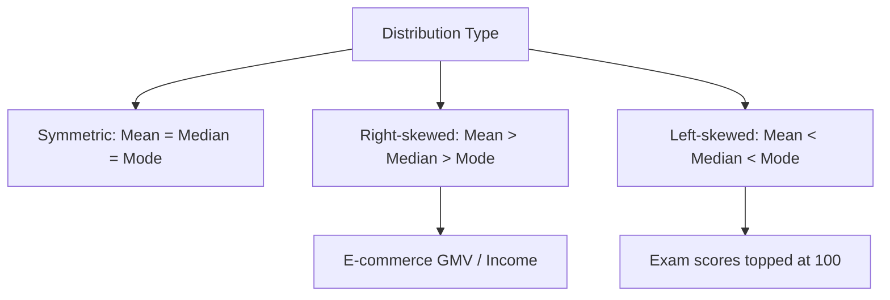

#### Interview Question

**Q:** Tu Swiggy ka analyst hai. CEO ne pucha "average delivery time kya hai?" — tu mean dega ya median?

**A:** Median. Delivery time right-skewed distribution hai — 95% orders 30-45 min mein deliver hote hain, 5% mein delays ho jaate hain (rain, traffic, partner shortage) — woh 90+ min cross kar jaate hain. Mean inflate ho jaayega in tail orders ki wajah se. Median 35 min batayega, mean 42 min batayega — customer experience median ke close hai. Top 2% analyst dono report karta — "median 35, mean 42, p95 78" — ye trio se management ko complete picture milti hai. Sirf mean = misleading. Sirf median = tail risk hide ho jaata hai.

---

### 1.2 Variance, standard deviation, IQR

#### Definition (kya hai?)

Spread / dispersion measures — data kitna spread out hai center se.

- **Variance** — $\sigma^2 = \frac{1}{n}\sum (x_i - \bar{x})^2$. Squared units mein hota hai.
- **Standard deviation (SD)** — $\sigma = \sqrt{\sigma^2}$. Same units as data. Default measure of spread.
- **IQR (Interquartile Range)** — Q3 − Q1. Middle 50% ka spread. Outlier-resistant.

#### Why?

Mean alone insufficient hai — tu ye nahi bata sakta ki "data tightly clustered around mean hai ya widely spread". Two cities same average AOV ₹500 — but City A ki SD ₹50 (tight), City B ki SD ₹400 (very volatile, mix of premium + budget customers). Inventory planning, pricing strategy alag ho jaati hai. SD outliers ke saath compromise hota hai — IQR robust alternative hai.

#### How (with code)?

```python
import numpy as np
import pandas as pd

orders_a = np.random.normal(500, 50, 1000)   # tight
orders_b = np.random.normal(500, 400, 1000)  # spread

for name, arr in [('A', orders_a), ('B', orders_b)]:
    q1, q3 = np.percentile(arr, [25, 75])
    print(f"City {name}: mean={arr.mean():.0f}, SD={arr.std():.0f}, "
          f"IQR={q3-q1:.0f}")

# Coefficient of variation — SD / mean — useful for cross-comparing
cv_a = orders_a.std() / orders_a.mean()
cv_b = orders_b.std() / orders_b.mean()
print(f"CV: A={cv_a:.2f}, B={cv_b:.2f}")  # higher = more volatile
```

#### Real-life Example

Razorpay ka risk team merchant transactions monitor karti hai. Ek merchant ka daily TPV mean ₹10L, SD ₹2L — normal. Ek din TPV ₹50L hua — that's 20 SDs away — fraud alert trigger. Z-score = (50 − 10) / 2 = 20. SD-based anomaly detection ka bread and butter. IQR ka use bhi karte hain — kyunki "extreme" merchants se pure SD calculation distort ho jaata. Robust statistics = stable alerts.

#### Diagram

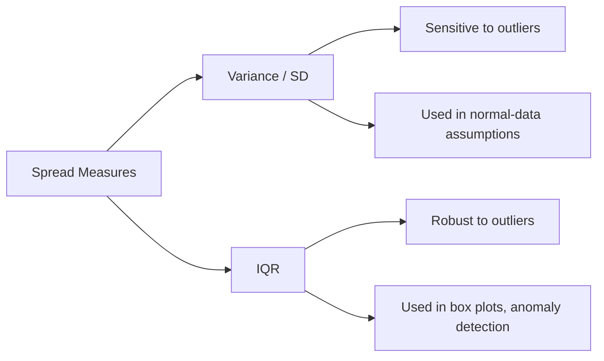

#### Interview Question

**Q:** Tu Paytm ka fraud analyst hai. SD-based outlier detection (3-sigma rule) deploy kiya — but false positives bahut zyada aa rahe hain. Kyun?

**A:** 3-sigma rule normal distribution assume karta hai. Payment data right-skewed hota hai (long tail of large transactions) — pure normal nahi hai. Plus, jo "outliers" alert karte hain woh pure SD calculation ko hi inflate kar dete hain — SD itself biased ho jaata hai (masking effect). Fix: (a) IQR-based outlier rule (Q3 + 1.5×IQR) — robust hai; (b) log-transform first, fir z-score — heavy tails normalize ho jaate hain; (c) MAD (median absolute deviation) use karo SD ke jagah — completely outlier-resistant. Top 2% analyst ye nuance samajhta hai — distribution-aware statistics chooses karta hai blindly formulas apply karne ke bajay.

---

### 1.3 Percentiles, quartiles, deciles

#### Definition (kya hai?)

Percentiles data ko ranked positions mein todte hain.

- **Percentile (Pk)** — k% data iske neeche hai. P50 = median.
- **Quartiles** — Q1 = P25, Q2 = P50, Q3 = P75. Box plots ka backbone.
- **Deciles** — 10 equal buckets. Cohort analysis mein useful (top decile customers).

P95, P99 latency reporting ka standard hai engineering aur operations mein.

#### Why?

Means lie, percentiles tell the truth. Swiggy ka SRE team mean latency report nahi karti — woh p95, p99 dikhati hai because long-tail latency hi user pain banata hai. Customer cohort analysis mein deciles ki LTV breakdown se top 10% revenue contributors identify hote hain — usually 60-70% revenue waha se aata hai (Pareto principle).

#### How (with code)?

```python
import numpy as np
import pandas as pd

latencies_ms = np.random.gamma(2, 30, 100000)  # right-skewed
percentiles = [50, 75, 90, 95, 99, 99.9]
for p in percentiles:
    val = np.percentile(latencies_ms, p)
    print(f"P{p}: {val:.0f} ms")

# Decile-based revenue Pareto
users = pd.DataFrame({
    'user_id': range(10000),
    'ltv': np.random.exponential(500, 10000)
})
users['decile'] = pd.qcut(users['ltv'], 10, labels=False) + 1
pareto = users.groupby('decile')['ltv'].sum() / users['ltv'].sum() * 100
print(pareto.round(1))   # top decile usually 40-50% revenue
```

#### Real-life Example

Meesho ka growth team customer LTV ke deciles banaye. Pata laga — top decile (top 10%) users 55% revenue contribute karte hain. Bottom 5 deciles sirf 8% — basically discount-tourists. Insight: marketing spend top 3 deciles ke lookalike acquisition pe focus, bottom-decile re-engagement pe paisa waste mat karo. Result — 6 months mein blended CAC 18% giraya, contribution margin positive shift hua.

#### Diagram

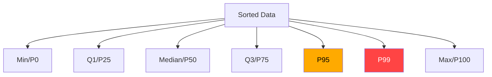

#### Interview Question

**Q:** Tu Flipkart ka SRE-side analyst hai. PM bola "average API latency 80ms hai, healthy hai." Tu kya add karega?

**A:** Average latency lying metric hai distributed systems mein. P95, P99 dekho — agar p99 800ms hai matlab har 100 users mein 1 ko 10× slow experience milti hai. At Flipkart scale (millions DAU), p99 = millions of bad experiences daily. Recommendation: SLI/SLO definition p95 ya p99 pe banao, mean nahi. Plus distribution shape dekho — bimodal hai? (Some users CDN cached, some not?) — phir segment by user-type aur fix karo. Top 2% analyst tail-aware hai always.

---

### 1.4 Skewness, kurtosis — when mean lies

#### Definition (kya hai?)

Distribution shape ke teen-char moments hote hain — center (mean), spread (SD), shape (skewness, kurtosis).

- **Skewness** — distribution kis side jhuki hui hai. $\gamma_1 = \frac{E[(X-\mu)^3]}{\sigma^3}$. Positive = right-skewed (long right tail), negative = left-skewed.
- **Kurtosis** — tails ki "heaviness". $\gamma_2 = \frac{E[(X-\mu)^4]}{\sigma^4} - 3$. High kurtosis = fat tails, more extreme outliers than normal.

Most business data right-skewed (income, GMV, session time, transaction amounts). Returns of stocks fat-tailed (high kurtosis).

#### Why?

Skewed data pe mean = misleading. Many statistical tests (t-test, OLS regression) assume approximate normality — heavy skew breaks them. Kurtosis na samjhne se "black swan" risk underestimate hota hai — financial models, insurance pricing, fraud detection sab fail.

#### How (with code)?

```python
import numpy as np
from scipy import stats
import pandas as pd

gmv = np.random.lognormal(mean=6, sigma=1.2, size=100000)  # typical e-commerce
print(f"Mean   : {gmv.mean():.0f}")
print(f"Median : {np.median(gmv):.0f}")
print(f"Skew   : {stats.skew(gmv):.2f}")        # high positive
print(f"Kurt   : {stats.kurtosis(gmv):.2f}")    # excess kurtosis, fat tail

# Log transform — normalize karta hai right-skew ko
log_gmv = np.log(gmv)
print(f"Log Skew: {stats.skew(log_gmv):.2f}")   # near 0 — normal-ish
```

#### Comparison Table

| Distribution | Skew | Kurt | Example |
|---|---|---|---|
| Normal | 0 | 0 | Heights, IQ |
| Lognormal | +ve | +ve | GMV, income |
| Exponential | +ve | high | Time between events |
| Stock returns | mild | very high | Daily NIFTY returns |
| Uniform | 0 | -ve | Random IDs |

#### Real-life Example

Sharechat ka analyst session time per user analyze kar raha tha. Mean 25 min — looked great. Skewness check kiya — 4.2 (heavily right-skewed). Distribution dive — 80% users ne 5 min se kam time spent kiya, but 2% power-users 5+ hours per day. Mean inflated by power-users. Insight: median session time 4 min — matlab average user disengaged hai, content discovery broken hai. Mean dekh ke "all good" report karte toh major retention crisis 6 months baad pakda jaata. Skewness saved the analyst.

#### Diagram

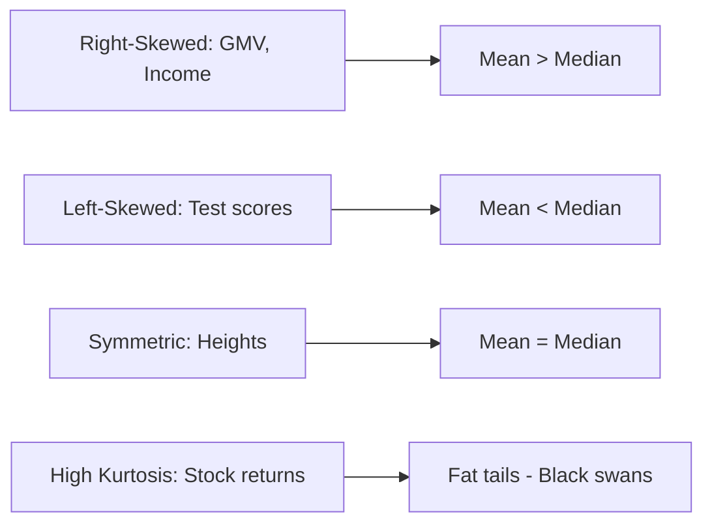

#### Interview Question

**Q:** Tu CRED ka analyst hai. Credit card spending data analyze kar raha — mean ₹45K/month, median ₹12K/month. Skewness 5.8. Kya implications hain product strategy ke liye?

**A:** Heavy right-skew confirms typical fintech pattern — power-spenders top decile mein concentrate hote hain. Three implications: (1) Product targeting — top 5% spenders are CRED Max candidates, completely different reward structure deserve karte hain; (2) Risk modeling — naive mean-based credit-limit increase wrong hoga, percentile-based dynamic limits set karo; (3) Reporting — board ko mean dikhana misleading, har spending bucket ka decile-wise revenue/risk dashboard banao. Plus log-transform ke baad regression run karo for any spending-prediction model — kyunki raw data pe linear regression ki normality assumption violate ho rahi hai.

---

## 2. Probability & Distributions

Probability data analyst ka second language hai. Bina iske tu hypothesis testing samajh nahi paayega, A/B test design nahi kar paayega, aur "statistical significance" tujhe black box lagega.

### 2.1 Sample space, conditional probability, Bayes' theorem

#### Definition (kya hai?)

- **Sample space (S)** — saare possible outcomes ka set. Coin toss: {H, T}.
- **Event (E)** — sample space ka subset. P(E) = |E| / |S| (classical).
- **Conditional probability** — $P(A|B) = \frac{P(A \cap B)}{P(B)}$. Given B happened, kya A ki probability?
- **Bayes' theorem** — $P(A|B) = \frac{P(B|A) \cdot P(A)}{P(B)}$. Prior + likelihood = posterior.

#### Why?

Conditional probability har real-world prediction ka backbone hai. Spam filter, recommendation system, fraud detection, medical diagnosis — sab Bayes pe khade hain. Analyst jo Bayesian thinking nahi karta woh "base rate fallacy" mein phasta hai.

#### How (with code)?

```python
# Bayes example — Razorpay fraud detection
# P(fraud) = 0.001 (1 in 1000 transactions)
# P(alert | fraud) = 0.95 (model catches 95% of fraud)
# P(alert | not fraud) = 0.05 (5% false positive)

p_fraud = 0.001
p_alert_given_fraud = 0.95
p_alert_given_not_fraud = 0.05

p_alert = (p_alert_given_fraud * p_fraud) + \
          (p_alert_given_not_fraud * (1 - p_fraud))

p_fraud_given_alert = (p_alert_given_fraud * p_fraud) / p_alert
print(f"P(fraud | alert) = {p_fraud_given_alert:.3f}")
# Output: 0.019 — only 1.9% of alerts are actual fraud!
```

#### Real-life Example

PhonePe ka fraud team naya ML model deploy kiya — 95% recall, 5% false positive rate. Sounds great. But Bayes batata hai — actual fraud rate 0.1% hai, so har alert mein actual fraud probability sirf ~2% hai. Operations team ne 100 cases manually review karne start kiye, sirf 2 me real fraud nikla. Resource waste. Solution: model ka precision threshold raise karo (0.05 → 0.01 false positive rate), ya tiered review (high-confidence alerts auto-block, low-confidence manual review). Bayesian thinking saved ₹50L/month operational cost.

#### Diagram

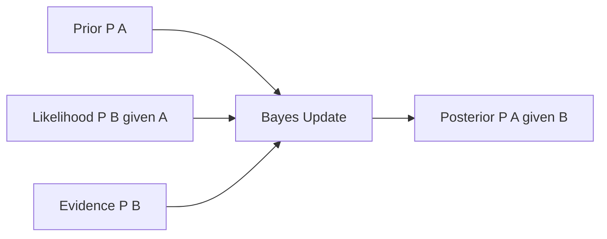

#### Interview Question

**Q:** Tu Swiggy ka analyst hai. Customer support model 99% accurate hai (real complaint detect karta hai). Daily 10K transactions, of which 100 are real complaints. Model 100 alerts deta hai. Tu in alerts ko trust karega?

**A:** Bayes lagaate hain. P(complaint) = 100/10000 = 1%. P(alert|complaint) = 0.99. P(alert|not complaint) = 0.01 (assuming symmetric). P(alert) = 0.99 × 0.01 + 0.01 × 0.99 ≈ 0.0198. P(complaint|alert) = (0.99 × 0.01) / 0.0198 = 0.5. Sirf 50% alerts genuine. Even 99% accuracy can give noisy signals when base rate low — base rate fallacy classic. Recommendation: precision metric maange, ya ensemble of two models for high-stakes flagging.

---

### 2.2 Normal, Binomial, Poisson, Exponential, Log-normal, Power law

#### Definition (kya hai?)

Distributions = mathematical templates for randomness.

- **Normal (Gaussian)** — bell curve. $X \sim N(\mu, \sigma^2)$. Heights, measurement errors, sums of independents (CLT).
- **Binomial** — n independent trials, each with prob p. $X \sim B(n,p)$. Conversion rates, click-through.
- **Poisson** — rare events in fixed interval. $X \sim Poisson(\lambda)$. Calls per hour, server crashes per day.
- **Exponential** — time between Poisson events. Session durations, time-to-failure.
- **Log-normal** — log(X) is normal. Income, GMV, file sizes.
- **Power law (Pareto)** — heavy-tailed. $P(X > x) \propto x^{-\alpha}$. City sizes, wealth, viral content reach.

#### Why?

Tu agar wrong distribution assume karta hai — wrong test apply karega, wrong CIs report karega. Each distribution ka mean, variance, MLE different formulas dete hain. Power law se generated data pe normal-based statistics fail karti hain (no defined mean for some α).

#### How (with code)?

```python
import numpy as np
from scipy import stats

# Binomial: 10K visitors to Flipkart, 3% buy
buys = stats.binom.rvs(n=10000, p=0.03, size=1000)
print(f"Expected buys: {0.03 * 10000} ± {np.sqrt(10000*0.03*0.97):.0f}")

# Poisson: Zomato customer support gets ~50 calls/hour avg
calls = stats.poisson.rvs(mu=50, size=24)  # 24 hours
print(f"Calls per hour: {calls.mean():.0f} ± {calls.std():.0f}")

# Lognormal: Sharechat session lengths
sessions = stats.lognorm.rvs(s=1.2, scale=np.exp(5), size=100000)
print(f"Sessions median: {np.median(sessions):.0f}s, "
      f"mean: {sessions.mean():.0f}s")

# Power law: viral video views
views = (np.random.pareto(a=1.5, size=10000) + 1) * 1000
print(f"Views: top 1% = {np.percentile(views, 99):.0f}, "
      f"median = {np.median(views):.0f}")
```

#### Comparison Table

| Distribution | Use Case | Mean | India Example |
|---|---|---|---|
| Normal | Aggregates, errors | μ | Average daily orders (large city) |
| Binomial | Pass/fail trials | np | Flipkart conversion rate |
| Poisson | Event count / unit time | λ | Swiggy calls per hour |
| Exponential | Time between events | 1/λ | Time between two app crashes |
| Lognormal | Multiplicative growth | $e^{\mu+\sigma^2/2}$ | GMV per user, salaries |
| Power law | Viral / scale-free | Often undefined | Sharechat views, follower count |

#### Real-life Example

Sharechat content analytics team ne content reach analyze ki — assume ki normal distribution hogi, mean+SD se "average post reach" report karte the. Reality check: distribution power-law hai. Top 0.1% videos cumulatively 80% reach drive karte hain, median post 200 views ka. Mean = ~50K (highly inflated by virals). Switching to median + percentile-based reporting completely changed creator monetization strategy — top decile creators ka separate revenue-share model bana, jo ₹120Cr/year creator ecosystem grow karne mein helped.

#### Diagram

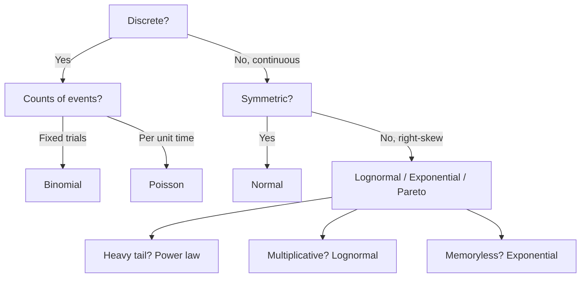

#### Interview Question

**Q:** Tu Zomato ka ops analyst hai. Restaurant calls per hour ki distribution Poisson assume karta hai — kab ye assumption galat hogi?

**A:** Poisson ki char assumptions: (a) events independent — call A se call B affect na ho; (b) constant rate — λ time pe stable; (c) no two events simultaneously; (d) rate doesn't depend on past. Real world mein violations: festival days pe rate 5× spike (non-stationary), one-incident triggering chain calls (clustering — restaurants down hone se cascade), aur lunch-dinner peaks → rate time-varying. Better fit: Negative Binomial (over-dispersion handle karta hai) ya Hawkes process (self-exciting events). Top 2% analyst rate constancy first test karta hai (variance-to-mean ratio — Poisson mein 1 hota hai, real data mein often 3-5).

---

### 2.3 Central Limit Theorem & Law of Large Numbers

#### Definition (kya hai?)

- **Law of Large Numbers (LLN)** — sample mean → population mean as n → ∞. $\lim_{n \to \infty} \bar{X}_n = \mu$.
- **Central Limit Theorem (CLT)** — sample means ki distribution approximately normal hoti hai (regardless of underlying distribution shape) for large n. $\bar{X}_n \sim N(\mu, \sigma^2/n)$ for n ≥ 30.

#### Why?

CLT statistics ka **single most important** theorem hai. Iski wajah se hum confidence intervals bana sakte hain, hypothesis tests run kar sakte hain, A/B test results interpret kar sakte hain — even when underlying data is wildly non-normal. CLT ke bina inferential statistics doesn't exist.

#### How (with code)?

```python
import numpy as np
import matplotlib.pyplot as plt

# Underlying — heavily skewed (lognormal, like GMV)
np.random.seed(42)
population = np.random.lognormal(mean=5, sigma=1.5, size=1000000)

# Take many samples of size n, compute mean of each
sample_means_30 = [np.random.choice(population, 30).mean() 
                    for _ in range(5000)]
sample_means_500 = [np.random.choice(population, 500).mean() 
                     for _ in range(5000)]

print(f"Population mean : {population.mean():.1f}")
print(f"Sample-mean (n=30) mean: {np.mean(sample_means_30):.1f}, "
      f"SD: {np.std(sample_means_30):.1f}")
print(f"Sample-mean (n=500) mean: {np.mean(sample_means_500):.1f}, "
      f"SD: {np.std(sample_means_500):.1f}")
# SD shrinks by sqrt(n) — n=500 has SD ~sqrt(30/500) = 0.24× of n=30
```

#### Real-life Example

Flipkart Big Billion Days ke roz, real-time GMV monitoring dashboard chal raha tha. Underlying order-value distribution highly lognormal (long tail of ₹50K+ orders). But hourly GMV ke moving average pe CLT directly apply hota hai — har ghante ka mean approximately normal banta hai (millions of orders summed). So team confidently 95% CI band bana paayi: "current run-rate ₹820Cr ± ₹20Cr". Without CLT, ye "is current GMV anomalously low?" answer dene mein 2 hours lagte. With CLT, instant. Real-time decisions = real money.

#### Diagram

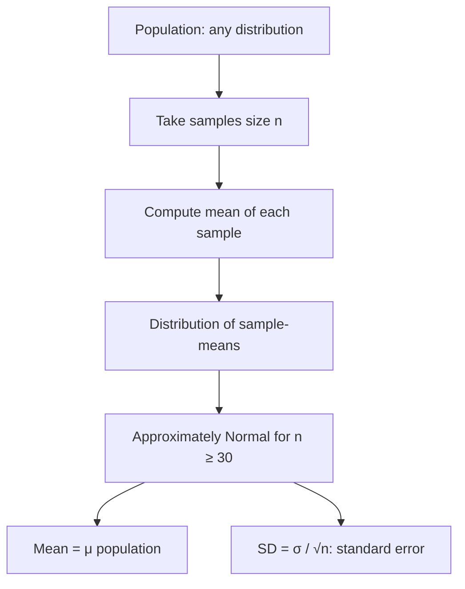

#### Interview Question

**Q:** A/B test mein conversion rates compare kar raha hai. Underlying data binary (0/1, converted or not). CLT apply karega kya?

**A:** Yes — but conditions matter. Binary outcome ka mean = conversion rate. Sample mean ki distribution CLT se approximately normal hoti hai for large n. Rule of thumb — np ≥ 10 aur n(1−p) ≥ 10. Agar conversion rate 0.5% hai, np = 10 reach karne ke liye n = 2000 chahiye. Low conversion rates pe sample size requirements high. Iska practical implication: small experiments low-conversion products mein under-powered hote hain, false negatives common. Top 2% analyst pre-experiment power calculation karta hai — chahe MDE 5%, alpha 0.05, power 0.8 — toh n per arm = how much? Sample size design mein CLT fundamental hai.

---

## 3. Inferential Statistics

Descriptive sample tak limited hai. Inferential se tu population ke baare mein dawe karta hai. Yahan se top 2% analyst banta hai.

### 3.1 Population vs sample, sampling techniques, bias types

#### Definition (kya hai?)

- **Population** — complete set of interest. e.g., Swiggy ke all 50M users.
- **Sample** — subset jo tu actually data collect karta hai. 1000 users.
- **Sampling techniques** — Simple random, stratified, cluster, systematic, weighted.
- **Bias types** — selection bias, survivorship bias, recall bias, response bias, undercoverage, sampling bias.

#### Why?

99% analytics work sample pe hota hai — population entire chhuni nahi. Agar sample biased hai, conclusions garbage. "Survey ne kaha 80% users happy hain" — agar survey sirf active users ko bhejti, churned users excluded — survivorship bias. True satisfaction much lower.

#### How (with code)?

```python
import pandas as pd
import numpy as np

users = pd.DataFrame({
    'user_id': range(100000),
    'tier': np.random.choice(['Tier1','Tier2','Tier3'], 
                              p=[0.3, 0.4, 0.3], size=100000),
    'monthly_spend': np.random.lognormal(5, 1, 100000)
})

# Simple random sample — may underrepresent rare segments
srs = users.sample(n=1000, random_state=42)

# Stratified sample — proportional from each tier
stratified = users.groupby('tier', group_keys=False).apply(
    lambda x: x.sample(int(len(x) * 0.01))
)
print(stratified['tier'].value_counts(normalize=True).round(2))
```

#### Bias Comparison Table

| Bias type | Cause | Fix |
|---|---|---|
| Selection | Non-random sample | Random / stratified sampling |
| Survivorship | Only "survivors" tracked | Include churned/dead cohort |
| Recall | Memory error in self-report | Behavioral data, short windows |
| Response | Voluntary respondents | Incentive parity, follow-ups |
| Undercoverage | Frame misses segment | Multi-channel sampling |

#### Real-life Example

Paytm Money ne investor satisfaction survey ki — 85% positive. Champagne popped. 6 months baad churn 22%. Investigation revealed survey link active users ko email pe gaya, active users by definition satisfied. True population mein 35% disengaged users the — woh email open hi nahi karte. Selection bias. Fix: in-app survey for all logged-in users (last 90 days), oversampling rare cohorts, weighted aggregation. New satisfaction number: 62%. Painful but actionable.

#### Diagram

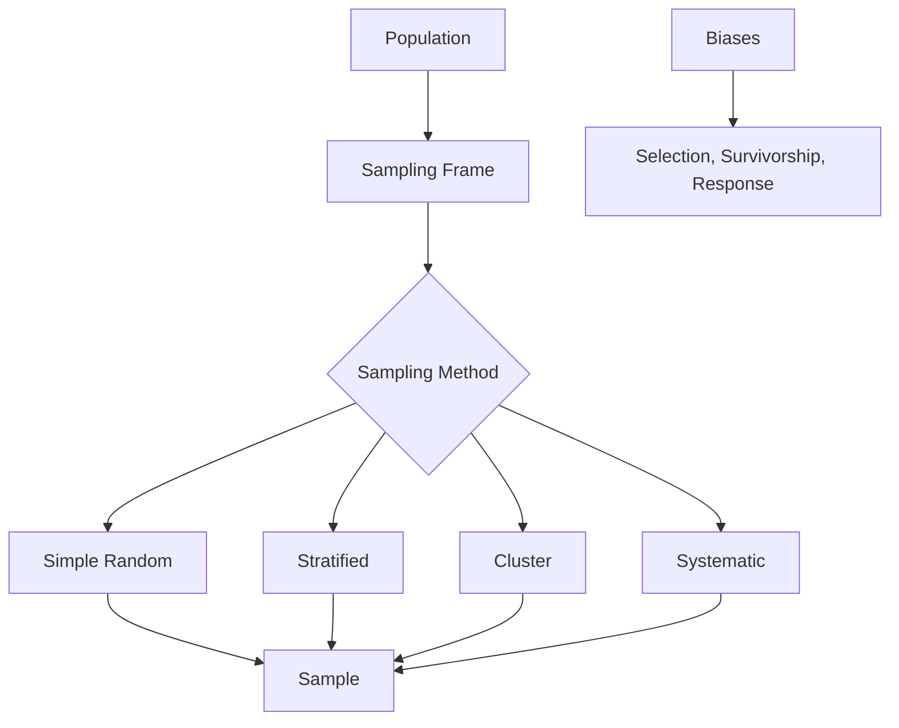

#### Interview Question

**Q:** Tu Meesho ka analyst hai. Reseller-success survey planning kar raha — kaunsi sampling strategy aur kyun?

**A:** Stratified sampling. Reseller base hugely heterogeneous — Tier-1/Tier-2/Tier-3 city, GMV deciles, tenure (new/old), category. Simple random underrepresent karega rare-but-important groups (e.g., top decile high-GMV resellers). Stratified by (city tier × GMV decile × tenure bucket) ensures each segment represented. Then weighted aggregation back to population. Plus, selection-bias mitigation — non-respondents ko follow-up call (small sample) for representativeness check. Costlier but defensible.

---

### 3.2 Standard error & confidence intervals

#### Definition (kya hai?)

- **Standard error (SE)** — sampling distribution of statistic ka SD. For mean: $SE = \sigma/\sqrt{n}$.
- **Confidence interval (CI)** — range jisme parameter likely lies. 95% CI: $\bar{x} \pm 1.96 \cdot SE$.
- **Interpretation** — "If we repeated experiment 100 times, 95 of those CIs would contain true mean." NOT "95% chance true mean is in this CI" (frequentist).

#### Why?

Point estimates without CI are useless. "Conversion rate 3.2%" tells nothing — could be 2.5%-3.9% or 3.0%-3.4%, drastically different decisions. CI quantifies uncertainty. Top 2% analyst reports estimates with CIs always.

#### How (with code)?

```python
import numpy as np
from scipy import stats

orders = np.random.normal(420, 120, size=500)  # n=500 daily orders
mean = orders.mean()
se = orders.std(ddof=1) / np.sqrt(len(orders))
ci_low, ci_high = stats.t.interval(0.95, len(orders)-1, mean, se)
print(f"AOV = {mean:.1f}, 95% CI = [{ci_low:.1f}, {ci_high:.1f}]")

# For proportion (conversion rate)
n, x = 10000, 320  # 320 conversions out of 10K visitors
p = x / n
se_p = np.sqrt(p * (1-p) / n)
ci_low_p, ci_high_p = p - 1.96*se_p, p + 1.96*se_p
print(f"CR = {p:.3%}, 95% CI = [{ci_low_p:.3%}, {ci_high_p:.3%}]")
```

#### Real-life Example

CRED A/B test kar raha tha new homepage. Old: 4.2% click-through. New: 4.5% click-through. 0.3% absolute lift seemed meaningful. But sample size was small (n=2000 per arm) — CI of difference was [−0.6%, +1.2%]. Zero in CI means lift NOT statistically distinguishable from no-effect. Recommended: n=10000 per arm to detect 0.3% lift with 80% power. Without CI thinking, team would have rolled out a possibly-neutral change site-wide. CI saved engineering effort + protected baseline.

#### Diagram

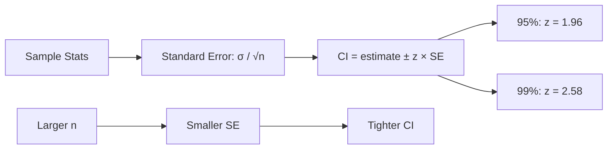

#### Interview Question

**Q:** "95% CI mein 0 nahi hai" ka matlab kya hai (effect size CI ke liye)?

**A:** Matlab effect statistically significant hai 5% level pe — dual to p < 0.05. 0 nahi hai means "no-effect" hypothesis ko reject karte hain. But CI zyada informative hai bare p-value se: width batati hai estimate ki precision (narrow CI = high confidence in magnitude), aur direction batati hai (sign of bounds). Best practice: A/B test result mein point estimate + CI dono report karo, just p-value never. Top 2% analyst CI ko "decision-relevant range" ki tarah use karta hai — agar entire CI minimum-detectable-effect ke neeche hai, business-irrelevant chahe statistically significant ho.

---

### 3.3 Hypothesis testing — null/alternate, p-values, type I/II

#### Definition (kya hai?)

- **Null hypothesis (H₀)** — default "no effect" claim. e.g., "new feature ne conversion nahi badhaya."
- **Alternate hypothesis (H₁)** — kuch effect hai claim. "new feature ne conversion badhaya."
- **p-value** — P(observing data this extreme | H₀ true). Small p → unlikely under H₀ → reject H₀.
- **Type I error (α)** — false positive. H₀ true tha but reject kar diya. Conventionally α = 0.05.
- **Type II error (β)** — false negative. H₁ true tha but reject nahi kar paaye. Power = 1 − β.

#### Why?

A/B testing, feature launch decisions, fraud detection thresholds — sab hypothesis testing pe khade hain. Without p-value framework, "kuch difference dikha" subjective opinion ban jaati hai.

#### How (with code)?

```python
import numpy as np
from scipy import stats

# Two-sample t-test — A/B conversion rate
control = np.random.binomial(1, 0.040, 5000)
variant = np.random.binomial(1, 0.045, 5000)

t, p = stats.ttest_ind(control, variant)
print(f"t = {t:.3f}, p = {p:.4f}")
# Or for proportions specifically:
from statsmodels.stats.proportion import proportions_ztest
counts = [control.sum(), variant.sum()]
nobs = [len(control), len(variant)]
z, p_z = proportions_ztest(counts, nobs)
print(f"z = {z:.3f}, p = {p_z:.4f}")
```

#### Real-life Example

Razorpay tested new checkout flow. Old: 78% completion. New: 79.8%. n=20K each arm. p = 0.003 — significant. Lift = 1.8% absolute ≈ ₹6Cr/year revenue. Rollout. But guard: type I error possible — re-run experiment in different segment or holdout city. Confirmation = ₹6Cr/year confidence. Without hypothesis testing rigor, team would've shipped any positive-looking experiment, alpha-inflation by chance, false-positive launches eroding actual product.

#### Type I vs Type II Table

| | H₀ True | H₀ False |
|---|---|---|
| **Reject H₀** | Type I error (α) | Correct (Power) |
| **Fail to reject** | Correct | Type II error (β) |

#### Diagram

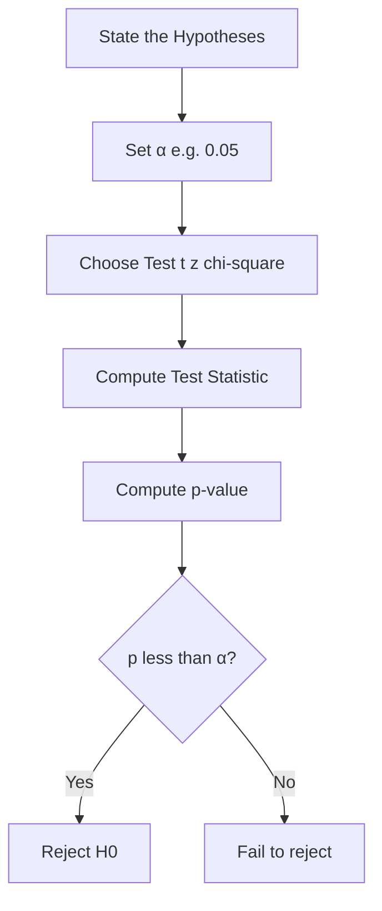

#### Interview Question

**Q:** "p = 0.04, so 96% chance my variant is better" — is statement is wrong?

**A:** Bilkul galat. p-value is P(data | H₀), NOT P(H₀ | data). Bayesian flip lagega for that interpretation. Frequentist p = 0.04 sirf itna kehta hai: agar H₀ true ho, to itna ya zyada extreme data dekhne ki probability 4% thi. "96% chance variant is better" Bayesian posterior hota hai — uske liye prior chahiye, posterior distribution compute karna padta hai. Top 2% analyst p-value misinterpretation se bachta hai — common mistakes include: (a) p < 0.05 = "important effect" (p sirf significance batata, magnitude nahi); (b) high p = "no effect" (could be underpowered); (c) p = probability of null (it isn't).

---

### 3.4 t-test, z-test, chi-square, ANOVA, Mann-Whitney

#### Definition (kya hai?)

Different tests for different data structures:

| Test | Use Case | Assumption |
|---|---|---|
| **z-test** | Compare means, σ known, n large | Normal, known variance |
| **t-test** | Compare means, σ unknown | Approx normal |
| **Chi-square** | Categorical independence | Counts, large expected |
| **ANOVA** | 3+ group means | Normal, equal variance |
| **Mann-Whitney U** | Compare distributions, non-parametric | Independent samples |

#### Why?

Wrong test = wrong conclusion. T-test on heavily skewed data with small n → unreliable. Chi-square on small counts → unstable. Top analysts diagnostic checks (normality, variance equality) test selection se pehle karte hain.

#### How (with code)?

```python
import numpy as np
from scipy import stats

# t-test: AOV across two cities
mumbai = np.random.normal(580, 90, 200)
delhi  = np.random.normal(560, 95, 200)
t, p = stats.ttest_ind(mumbai, delhi, equal_var=False)  # Welch
print(f"t-test: t={t:.2f}, p={p:.4f}")

# Chi-square: category vs gender
obs = np.array([[120, 80], [100, 100], [60, 40]])  # 3 cats × 2 gen
chi2, p_chi, dof, exp = stats.chi2_contingency(obs)
print(f"Chi2={chi2:.2f}, p={p_chi:.4f}")

# ANOVA: 4 cities AOV
cities = [np.random.normal(m, 80, 200) for m in [580, 560, 540, 600]]
f, p_anova = stats.f_oneway(*cities)
print(f"ANOVA F={f:.2f}, p={p_anova:.4f}")

# Mann-Whitney: skewed session times
a = np.random.lognormal(4, 1, 500)
b = np.random.lognormal(4.1, 1, 500)
u, p_mw = stats.mannwhitneyu(a, b)
print(f"MW U={u:.0f}, p={p_mw:.4f}")
```

#### Real-life Example

Zomato analyzed delivery time by 3 partner types — own fleet, third-party A, third-party B. Direct ANOVA F-test ne reject H₀ kiya (p < 0.001). But session times heavily right-skewed — ANOVA's normality assumption violated. Switched to Kruskal-Wallis (non-parametric ANOVA). Same conclusion confirmed, but more defensible. Tukey HSD post-hoc batata hai which pair differs — pata laga own fleet 6 min faster than both 3rd-party. Sourcing decision: increase own fleet share by 15% in metros, projected ₹40Cr/year cost saved on customer churn.

#### Diagram

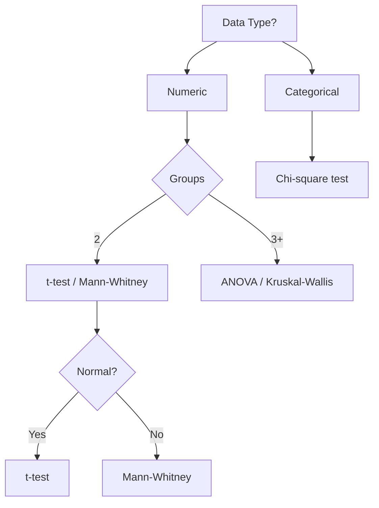

#### Interview Question

**Q:** A/B test pe small sample (n=80 per arm), heavily skewed user-revenue data. t-test ya Mann-Whitney?

**A:** Mann-Whitney U. Three reasons: (1) t-test assumes approximate normality; small n + skewed = CLT not kicked in; (2) outlier-resistant — heavy tails don't dominate the test statistic; (3) tests stochastic dominance, often more business-aligned ("does variant produce larger revenue more often?"). Caveat: Mann-Whitney specifically tests P(X > Y) ≠ 0.5, not means equality strictly. Pair with bootstrap CI on mean for full picture. Top 2% analyst test diagnostics first — Shapiro-Wilk for normality, Levene's for variance equality — phir test choose karta hai.

---

### 3.5 Multiple testing problem — Bonferroni, FDR

#### Definition (kya hai?)

Jab tu multiple hypotheses ek dataset pe test karta hai, false-positive probability inflate ho jaati hai. 20 independent tests at α=0.05 → P(at least 1 false positive) = 1 − 0.95²⁰ ≈ 64%.

- **Bonferroni correction** — α / k. Strict, controls Family-Wise Error Rate (FWER). Conservative.
- **Benjamini-Hochberg (FDR)** — controls False Discovery Rate. Less conservative, popular in genomics, A/B testing platforms.

#### Why?

Real-world experiments rarely have 1 hypothesis. "Check 30 metrics for variant impact" — without correction, 1-2 will look "significant" by chance alone. P-hacking ka root cause.

#### How (with code)?

```python
import numpy as np
from statsmodels.stats.multitest import multipletests

# 20 hypotheses tested, raw p-values
raw_p = np.array([0.001, 0.008, 0.02, 0.03, 0.04, 0.045, 0.05,
                  0.06, 0.08, 0.1, 0.12, 0.15, 0.2, 0.25, 0.3,
                  0.4, 0.5, 0.6, 0.7, 0.9])

# Bonferroni
reject_bf, p_bf, _, _ = multipletests(raw_p, alpha=0.05, method='bonferroni')
# FDR (BH)
reject_fdr, p_fdr, _, _ = multipletests(raw_p, alpha=0.05, method='fdr_bh')

print("Bonferroni rejects:", reject_bf.sum())
print("FDR rejects:       ", reject_fdr.sum())
```

#### Real-life Example

Flipkart growth team A/B tested new homepage — 25 sub-metrics monitor kiya (CTR, AOV, bounce, scroll depth, etc.). Raw analysis ne 4 metrics ko "significant" dikhaya. Without correction, team excited. Analyst applied BH-FDR correction at 5% — sirf 1 metric (CTR) survived. Decision changed: instead of complex multi-metric narrative ("variant improved 4 things"), focused on single robust finding ("CTR improved 8%, all else flat"). Cleaner story to leadership, less false-claims, replicated in next experiment.

#### Comparison Table

| Method | Controls | Pros | Cons |
|---|---|---|---|
| Bonferroni | FWER | Simple, conservative | Loses power with many tests |
| Holm-Bonferroni | FWER | Slightly less conservative | Still strict |
| BH-FDR | FDR | More power, modern default | Allows few false discoveries |
| Storey q-value | FDR | Adaptive | Complex |

#### Diagram

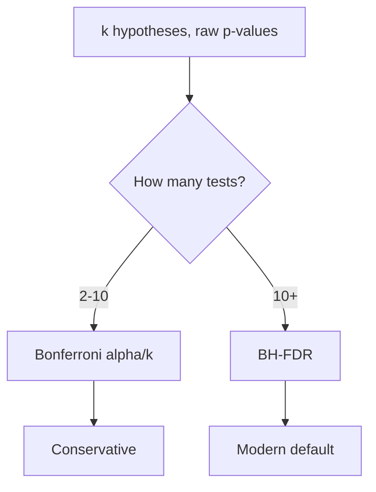

#### Interview Question

**Q:** Tu Sharechat ka A/B platform analyst hai. PMs har experiment mein 30 metrics dekhte hain. Best practice?

**A:** Three layers. (1) Pre-register: experiment se pehle define — primary metric (1, with full alpha=0.05), secondary metrics (2-3, alpha-spent), exploratory (rest, no inference claims, just signal). (2) Multiple testing correction: BH-FDR at 0.05 across secondary set. Exploratory metrics raw report karo with explicit "exploratory, no inference" tag. (3) Power analysis: primary metric pe powered for MDE; secondary CIs will be wider, accept that. Top 2% analyst is rigorous — "30 metrics all significant" kabhi nahi bolega.

---

## 4. Correlation vs Causation

Yahan se asli senior-analyst territory shuru hoti hai. Correlation finding easy hai — every Excel grad kar leta hai. Causation establish karna PhD-level rigor maangta hai.

### 4.1 Pearson, Spearman, Kendall correlation

#### Definition (kya hai?)

Correlation = strength + direction of relationship between two variables.

- **Pearson (r)** — linear relationship. $r = \frac{cov(X,Y)}{\sigma_X \sigma_Y}$. Range [−1, 1]. Assumes continuous + normal-ish.
- **Spearman (ρ)** — rank-based. Monotonic (not just linear). Robust to outliers.
- **Kendall (τ)** — concordant-pair-based. More robust for small n with ties.

#### Why?

Pearson outliers + non-linear by skewed data badly affected hota hai. Spearman/Kendall robust alternatives. Choosing right correlation is half the battle.

#### How (with code)?

```python
import numpy as np
import pandas as pd
from scipy import stats

# Simulate ad spend vs sales (Razorpay merchant)
spend = np.random.uniform(10000, 100000, 200)
sales = 0.8 * spend + np.random.normal(0, 10000, 200)
spend[0], sales[0] = 1000000, 50000  # outlier

print(f"Pearson : {stats.pearsonr(spend, sales).statistic:.3f}")
print(f"Spearman: {stats.spearmanr(spend, sales).statistic:.3f}")
print(f"Kendall : {stats.kendalltau(spend, sales).statistic:.3f}")
# Pearson hit by outlier; Spearman/Kendall stable
```

#### Real-life Example

Swiggy analyst tested correlation between restaurant rating and order volume. Pearson r = 0.42 — moderate. But scatter plot showed clearly non-linear shape (J-curve — below 3.5 stars order vol drops sharply, above 4 stars saturates). Pearson underestimated relationship. Spearman ρ = 0.71 — much stronger because monotonic ho ke bhi non-linear. Insight: rating-quality investment se diminishing returns above 4.2 stars; below 3.5 stars critical recovery zone — restaurant retention investments shifted toward bottom-rated cohort, ₹15Cr/year save kiye on restaurant churn.

#### Comparison Table

| Correlation | Captures | Robust to outliers | Use when |
|---|---|---|---|
| Pearson | Linear only | No | Continuous, normal-ish, no outliers |
| Spearman | Monotonic | Yes | Skewed, outliers, ordinal data |
| Kendall | Monotonic, concordance | Yes (more) | Small n, many ties |

#### Diagram

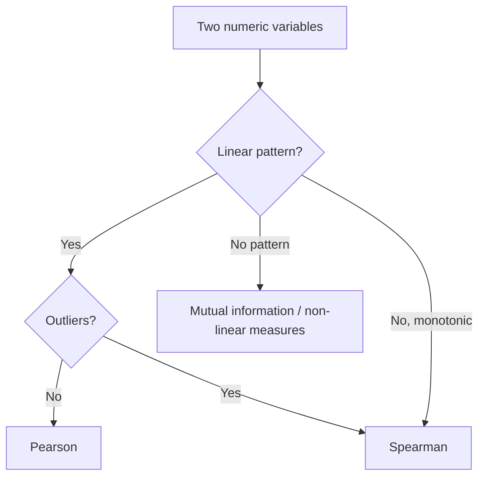

#### Interview Question

**Q:** Pearson r = 0, kya matlab variables independent hain?

**A:** Nahi. Pearson r = 0 sirf "no linear relationship" batata hai. Strong non-linear (e.g., U-shape: y = x²) mein r ≈ 0 hota hai but variables clearly related. Independence check ke liye: (a) Spearman/Kendall — picks up monotonic non-linear; (b) mutual information — captures any relationship; (c) scatter plot — visual gold standard. Top 2% analyst kabhi sirf single correlation number pe rely nahi karta — visualization first, correlation second, multiple metrics third.

---

### 4.2 Confounders, lurking variables, Simpson's paradox

#### Definition (kya hai?)

- **Confounder** — third variable jo X aur Y dono ko affect karta hai, spurious correlation banaata hai. e.g., ice-cream sales and drowning correlate because both are caused by hot weather.
- **Lurking variable** — unobserved confounder. Sneakier — tu data mein nahi dekh raha but driving relationship.
- **Simpson's paradox** — overall trend reverses when data segmented by group. Most famous statistical paradox.

#### Why?

Correlation interpret karne mein analyst log most fail yahan karte hain — confounders ignore karte hain. "Premium users have higher LTV — let's convert all to premium!" — but premium users self-select (richer baseline). Causation conclusion catastrophic.

#### How (with code)?

```python
import pandas as pd
import numpy as np

# Simpson's paradox — CRED reward redemption rate
data = pd.DataFrame({
    'tier':    ['Gold']*10000 + ['Platinum']*1000,
    'old_ux':  [0]*5000 + [1]*5000 + [0]*200 + [1]*800,
    'redeem':  ([1]*200 + [0]*4800) + ([1]*400 + [0]*4600) + 
               ([1]*40 + [0]*160) + ([1]*200 + [0]*600)
})

# Aggregate
print("Aggregate redeem rate by UX:")
print(data.groupby('old_ux')['redeem'].mean())
# Old UX (0) might look better

# By tier
print("\nBy tier:")
print(data.groupby(['tier','old_ux'])['redeem'].mean())
# Within each tier, new UX (1) likely better — mix shifted
```

#### Real-life Example

CRED ne new reward UX rolled out. Aggregate redemption rate dropped 8% — looks bad, considered rollback. Analyst ne Simpson's paradox check kiya — segmented by user tier. Within Gold tier, new UX +5% redemption. Within Platinum tier, new UX +12% redemption. Aggregate gira because rollout coincided with massive Gold-tier acquisition campaign — overall mix shifted toward lower-redeeming tier. New UX actually better in every segment! Without segment analysis, valuable improvement would have been killed. Simpson's paradox literally saved the launch.

#### Diagram

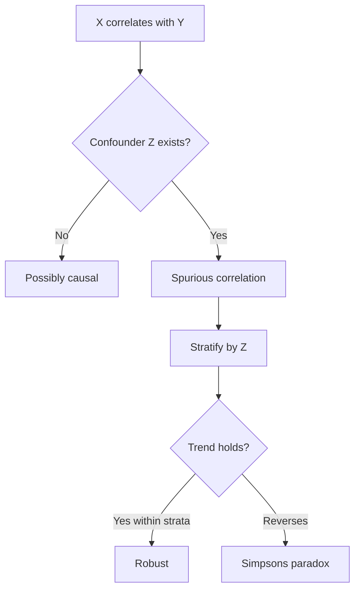

#### Causation Test Framework

| Method | What it does | When to use |
|---|---|---|
| RCT (A/B test) | Random assignment removes confounders | Gold standard |
| Diff-in-Diff | Compare trend changes across groups | Quasi-experiment |
| Instrumental Variables | Use external shock as instrument | Endogeneity |
| Propensity Score Matching | Match treated-control on covariates | Observational data |
| Regression Discontinuity | Threshold-based local randomization | Cutoff policies |

#### Interview Question

**Q:** Tu Zomato ka analyst hai. Aggregate data dikha raha hai — Pro members 30% higher AOV than non-Pro. CMO kehta hai "saare ko Pro convert karo". Tu kaise respond karega?

**A:** Selection bias warning. Pro members self-select — already higher engagement, higher income, higher pre-Pro AOV. "Pro causes high AOV" bilkul galat causal claim. Sahi answer: A/B test — random subset of comparable non-Pro users ko free Pro trial offer karo (treatment). Compare 90-day AOV change vs control (no offer). Causal lift = treatment minus control AOV change. Often ye number 30% se much smaller hota hai — perhaps 5-8%. Decision: Pro economics ko us 5-8% lift pe base karo, 30% pe nahi. Plus heterogeneity check — kis segment mein lift highest, target wahin. Top 2% analyst confounders ko name karta hai aur causal experiments propose karta hai.

---

> **Bottom line:** Statistics ka mastery analyst ka math moat hai. Mean-median-mode tak ki samajh kahin nahi le jaayegi — but distributions, hypothesis testing, multiple comparisons, aur causal thinking — yahin pe top 2% analyst average dashboard-jockey ko outclass karta hai. Har formula ko apne company ke real data pe try kar, har test ko Indian unicorn ka case banake socho — phir 6 mahine mein tu CFO ke saamne confidently CI report karega aur PM ke confounding-ignorant claim ko 30 second mein takedown karega. Math is the moat. Build it.
