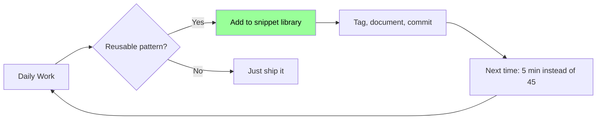
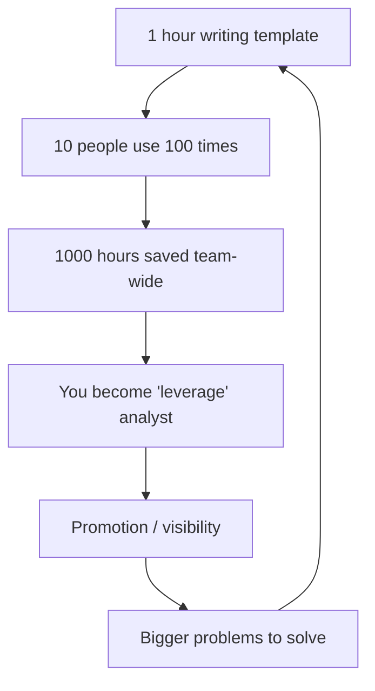
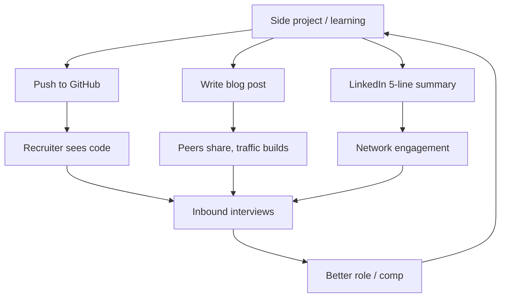
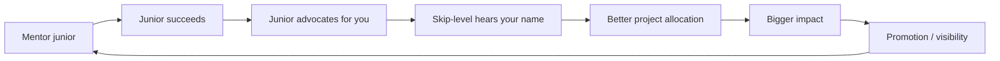
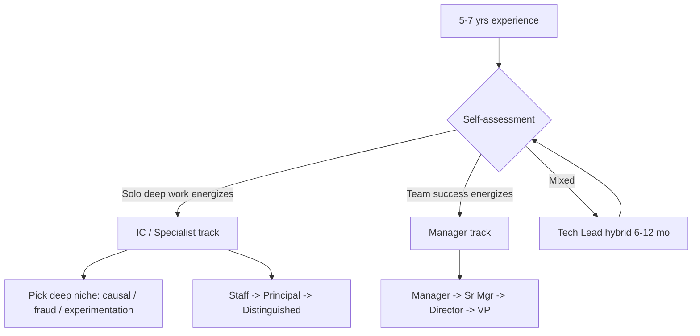
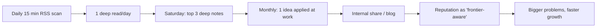
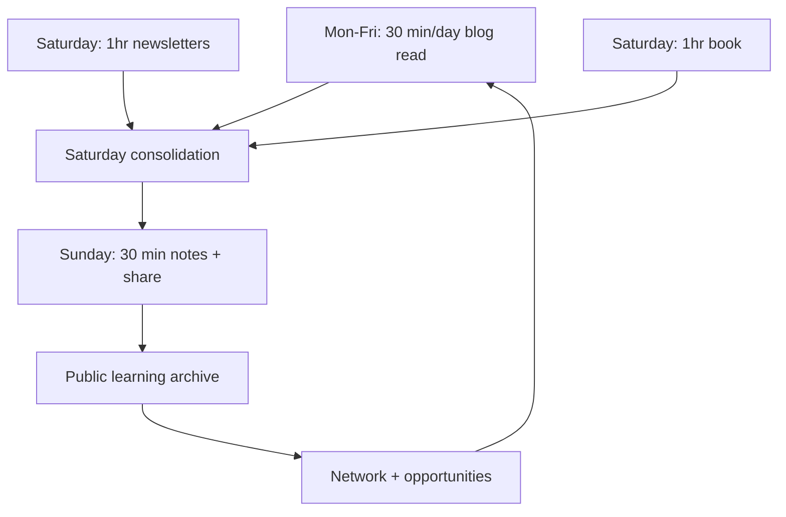
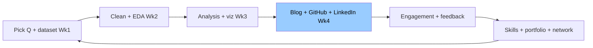

# Top 2% Habits & Career

Habits compound. Top 2% analyst usually has 3-5 habits running in the background that no one sees but everyone benefits from. Tu agar daily 8 ghante kaam karta hai aur sirf tickets close karta hai — tu replaceable hai. Top 2% wala same 8 ghante mein 6 hours assigned work karta hai, 1 hour apna snippet library + documentation maintain karta hai, aur 1 hour public learning (blog draft, side dataset, ek industry post). Saal khatam hone tak woh banda 200+ hours of compounded leverage le ke ja raha hota hai — tu phir bhi same Jira board pe ho.

Ye subject sirf "career advice" nahi hai — ye system design hai apni career ka. Ek Razorpay analyst jo 2 saal mein Stripe ja raha hai vs ek banda jo 5 saal se same TCS dashboard team mein hai — dono ka IQ same hai, intent same hai, mehnat bhi shayad same. Difference sirf habits hai. Yahan hum cover karenge: working smart (snippet library, templates, docs as multiplier), career acceleration (portfolio, mentoring, specialize vs management), aur top-2% habits (industry blogs, weekly reading rhythm, monthly side analysis). Sab Hinglish mein, Indian context ke saath, real Twitter/X handles aur Substacks ke recommendations ke saath.

---

## 1. Working Smart

Working hard sab karte hain. Working smart matlab apni mehnat ko reusable banao — ek baar likha, dus baar use ho. Yahan se top 2% aur baaki ka gap khulta hai.

### 1.1 Personal SQL/Python snippet library

#### Definition (kya hai?)

Snippet library matlab apna personal repository (GitHub private repo, Notion, ya local folder) jahan tu apne tested, reusable code blocks rakhta hai. Examples — cohort retention SQL template, AARRR funnel query skeleton, A/B test power calculator Python script, pandas date-bucketing snippet, mermaid flow generator. Har baar zero se likhne ki zarurat nahi — tu copy-paste karke 80% kaam aur deeper analysis pe focus karta hai.

#### Why?

Aam analyst har naye task pe Stack Overflow + ChatGPT + last week ka query khojta hai — har baar 30-45 minutes overhead. Top 2% analyst ke paas 50-100 battle-tested snippets ready hote hain. Same 1-hour task usse 15 minutes mein khatam hota hai. Saal mein 200+ hours saved — woh hours side analysis, blogs, mentoring mein invest hote hain. Compounding flywheel yahin start hota hai.

Doosra angle — knowledge consolidation. Jab tu cohort retention 3rd time likh raha hota hai, tu edge cases samajhta hai (timezone handling, NULL signups, partial cohorts). Library mein woh learnings codify ho jaate hain — agle analyst ko (ya future-self ko) ye bug dobara nahi pakadne padte.

#### How?

Folder structure simple rakh:

```
snippets/
├── sql/
│   ├── retention_cohort.sql
│   ├── funnel_aarrr.sql
│   ├── window_running_total.sql
│   ├── sessionize_events.sql
│   └── ab_test_metrics.sql
├── python/
│   ├── ab_power_calc.py
│   ├── ltv_cohort.py
│   ├── seasonality_decompose.py
│   └── pandas_date_helpers.py
└── README.md (index + usage notes)
```

Har snippet ke top pe comment block — usage, parameters, gotchas, last tested on (date + warehouse). Private GitHub repo banao, weekly commit karo. 6 mahine baad tu ek mini library ka maintainer hai.

#### Real-life Example

Razorpay ka ek senior analyst (let's call him Rohan) ne 2 saal mein 80-snippet library banayi. Jab Postman ne usse hire kiya, Day-1 pe usne wahi library use karke pehle hi week mein "merchant activation funnel" deliver kar diya — jo team 3 hafte se atki hui thi. Manager impressed, 6 mahine mein lead analyst promotion. Library Rohan ki "secret weapon" thi — bina kisi ko bole, har project pe 3x productivity.

#### Diagram



#### Interview Question

**Q:** Tu apni snippet library kaise structure karta hai aur kaise maintain karta hai?

**A:** Private GitHub repo, do top-level folders — sql/ aur python/. Har file ek atomic problem solve karti hai (retention cohort, funnel, window-based metrics). Top-of-file comment mein — purpose, inputs/outputs, warehouse compatibility (BigQuery vs Snowflake), last-verified date. Maintenance: har Friday 30 min "library hour" — naye snippets add, purane refactor, broken ones flag. README mein index rakha hua hai with one-liner per snippet — Cmd+F se 5 second mein dhund leta hoon. Bonus — main har snippet ke saath ek minimal sample dataset (10-row CSV) bhi commit karta hoon, taaki kisi bhi naye warehouse mein test kar sakun. 18 mahine mein 90+ snippets ho gaye, har naye project pe baseline 30-40% kaam already done hota hai.

---

### 1.2 Reusable templates, documentation as multiplier

#### Definition (kya hai?)

Templates matlab structured starting points — analysis brief template, A/B test design doc, weekly business review (WBR) deck skeleton, RCA (root cause analysis) writeup format, dashboard naming convention, dbt model docstring boilerplate. Documentation as multiplier matlab — jo kaam tu ek baar dhang se document karta hai, woh team ke 10 logo ke 100 ghante bachata hai (aur tujhe "go-to person" status milta hai bina extra effort ke).

#### Why?

Indian analytics teams aksar tribal knowledge pe chalti hain — "Shubham se pucho", "Priya ko dhundo, usne pichle saal kuch likha tha". Tu agar 3-4 templates introduce kar deta hai aur dashboards/queries ko consistently document karta hai — tu silently team ka force multiplier ban jaata hai. Manager ko ye dikhta hai. Promotions, ratings, internal mobility — sab yahin se aate hain.

Doosra reason — apna bhi time bachta hai. Tu 6 mahine baad apne hi dashboard ko dekhta hai aur "kya soch ke banaya tha?" ki situation mein nahi padta.

#### How?

5 templates jo har analyst ke paas hone chahiye:

1. **Analysis brief** (1-pager) — Question, hypothesis, data sources, methodology, expected output, stakeholder
2. **A/B test design doc** — Hypothesis, primary + guardrail metrics, sample size calc, duration, ramp plan, decision criteria
3. **RCA template** — What broke, when, who detected, root cause (5 whys), impact (₹/users), action items, owner
4. **WBR (Weekly Business Review) deck** — North Star metric, drivers, anomalies, asks, decisions
5. **Dashboard README** — Audience, refresh cadence, owner, source tables, known caveats, last reviewed date

Documentation rule: agar koi cheez tu 2nd time explain kar raha hai Slack pe — woh document banao. 3rd time tak it should be linkable.

#### Real-life Example

Postman ka ek analyst, Ananya, ne 2023 mein "dashboard README convention" introduce kiya — har dashboard ke description field mein 5-line spec. 6 mahine mein PMs ne dashboard support tickets 60% kam ho gaye (logo ne khud-hi answers dhundh liye). Woh "documentation queen" ban gayi — aur next promotion cycle mein staff analyst ban gayi. Asli kaam analytical thi, but visibility multiplier documentation tha.

#### Diagram



#### Interview Question

**Q:** "Documentation as multiplier" — concrete example de, kab tune kuch document kiya jo team ke liye game-changer ban gaya.

**A:** Mere previous role mein, har quarter naye PMs onboard hote the aur same 5 dashboards ke baare mein same questions puchte the — "ye metric kahan se aa raha hai", "refresh kab hota hai", "X column ka definition kya hai". Maine ek 2-page "Analytics Onboarding doc" likha — 5 critical dashboards, har ek ka owner, source, refresh, top 3 known caveats. Notion pe pin kiya. Pehle quarter mein 6 nayepe shared, har ek se 2-3 hours saved (estimate). Phir manager ne wahi format adopt kiya pure org ke liye. 9 mahine mein meri "go-to documentation person" identity bani — aur jab senior analyst role open hua, manager ne directly nominate kiya. 4 hours ka effort, career-shifting return.

---

## 2. Career Acceleration

Skills hone se job milti hai. Visibility hone se career banti hai. Yahan trick hai — visibility ko fake ya manipulative nahi karna, real kaam ke through earn karna.

### 2.1 Public portfolio — GitHub + blog + LinkedIn

#### Definition (kya hai?)

Public portfolio teen pillar pe khada hota hai:

- **GitHub** — code, side projects, snippet library (public version), Jupyter notebooks of analyses
- **Blog** — Medium / Substack / personal site jahan tu analyses, learnings, tutorials likhta hai
- **LinkedIn** — professional updates, learnings, project highlights, network engagement

Ye sab ek "public proof of skill" banate hain. Resume ek 1-page claim hai, portfolio ek 100-page proof hai.

#### Why?

Recruiters India mein ab passive hiring 70% LinkedIn + GitHub se karte hain. Razorpay, CRED, Postman, Stripe India, PhonePe — sabki talent team analysts ko unke public footprint se filter karti hai. Tu agar 2 candidates ho — same college, same 3-year experience — but ek ke paas 5 GitHub repos + 10 blog posts + active LinkedIn hai, dusra zero hai — interview call pehle wale ko jaayega 9/10 baar.

Doosra angle — writing forces clarity. Jab tu blog likhta hai "How I built a customer churn model for an Indian D2C", tu apne assumptions explain karne mein khud-hi gaps pakadta hai. Public se feedback aata hai, tu sharper hota hai. Free mentorship at scale.

#### How?

**GitHub:**
- Profile README pe pinned repos — best 3-5 projects with proper README
- Har project ka README structure: Problem, Data, Approach, Findings, Tech stack, Reproducibility steps
- Notebooks (`.ipynb`) ke saath HTML/PDF export bhi commit karo, taaki recruiter ko run karne ki zarurat na pade

**Blog:**
- Substack ya Hashnode (free + dev-friendly) — Medium ka paywall avoid karo
- Cadence: 1 post per month minimum. 6-8 mahine mein traction milni shuru hoti hai
- Post types: case studies (anonymized), tool reviews (dbt vs Dataform), learnings (5 SQL bugs that cost me a week), opinion pieces

**LinkedIn:**
- 2 posts per week — short learnings, project snippets, charts (Indian data — IPL, elections, RBI data, MCA filings)
- Engagement > broadcasting: 5 thoughtful comments per day on senior analysts' posts. Network organically build hota hai
- Indian analyst voices to follow: @aakashg0, @PratikDevdas (data twitter India), @ravi_handa (career), @paragagrawal (CXO POV)

#### Real-life Example

Krishna, ek Bangalore-based analyst, 2022 mein 0 followers tha. Usne "Indian unicorn metrics dashboard" project banaya — public Tableau dashboard with 50+ Indian unicorns ke MCA filings se nikaale gaye revenue/loss data. GitHub pe code public, LinkedIn pe screenshots posted. 2 mahine mein post 50K views, 10 inbound recruiter messages, 3 interview offers — including one from a YC-backed fintech jo seedha senior analyst role offer kiya (₹38L from ₹22L). Single project, 3 weekends ka effort, 70% comp jump.

#### Diagram



#### Interview Question

**Q:** Public portfolio kyu zaruri hai jab tujhe already job hai?

**A:** Job security illusion hai — layoffs, restructuring, manager change, company pivot — har 12-18 mahine mein kuch na kuch shake-up hota hai. Public portfolio "optionality" deta hai — jab tu market mein nahi bhi hai, recruiters tujhe approach karte hain warm. Mere case mein, mere current role ka offer mere ek blog post se aaya tha — hiring manager ne mera "Cricket IPL bowler economy rate" wala analysis padha tha. 3 saal pehle likha, 2 saal baad job mila. Compounding — tu jitna jaldi start karega, utna jaldi network compound hoga. Aur frankly, writing/sharing forces 10x deeper learning than passive consumption — to portfolio is also self-development tool, not just job-hunting tool.

---

### 2.2 Mentoring juniors, internal visibility

#### Definition (kya hai?)

Mentoring juniors matlab — junior analysts (apni team ya cross-team) ko technical guidance, career advice, code review dena. Internal visibility matlab — apne kaam ko org ke andar (presentations, internal blog, demo days, all-hands) properly showcase karna. Dono linked hain — jab tu junior ko mentor karta hai, woh tujhe org mein advocate karta hai, tera reputation organically grow hota hai.

#### Why?

Promotion decisions India ki product companies mein 60% manager + 40% peer/skip-level feedback pe hote hain. Tu agar sirf apne manager ko impress karta hai, peers tujhe "neutral" rate karenge, promotion atak jaata hai. Mentoring juniors ka direct impact hai promotion ratings pe — junior log calibration meetings mein "X really helped me ramp up" bolte hain, woh signal manager + skip-level dono ko pahonchta hai.

Doosra angle — teaching forces mastery. Jab tu junior ko window functions explain karta hai, tu khud edge cases samajhta hai jo solo coding mein miss kar deta. Mentor ban ke tu khud 2x faster grow karta hai.

#### How?

**Mentoring tactics:**
- Office hours — har Friday 1-hour open slot junior analysts ke liye. Calendar block kar do
- Code review — 2-3 junior PRs/queries weekly review karo, constructive feedback do
- Onboarding buddy — har naye joiner ke liye first-30-days buddy ban jao (manager appreciate karega)
- 1:1 career chats — junior ke saath quarterly 30-min chat — career goals, blockers, advice

**Internal visibility tactics:**
- Internal Slack channels mein learnings share karo (#analytics-learnings type) — 1 post/week
- "Lunch & Learn" host karo — koi tool, technique, ya analysis demo. 30-min, 10-15 attendees, recording shared
- All-hands / town-hall mein 5-min "spotlight" demo offer karo. Manager ko bata do — woh nominate karega
- Quarterly internal blog post — "How we measured X" type. Confluence ya Notion org-wide

#### Real-life Example

Priya, Flipkart Data Science team mein analyst II thi (2 saal experience). Usne 2023 mein "SQL Patterns for Analysts" series shuru ki — har 2 weeks ek 30-min internal session. 6 mahine mein attendance 50+ pahonch gayi, recording 200+ views per session. Skip-level VP ne notice kiya, usse "analytics enablement" charter diya — basically internal coach role. 1 saal mein analyst II → senior analyst → staff analyst, 3 levels ka jump 18 mahine mein. Asli analytical work toh chal hi raha tha — but internal visibility ne uska compounding rate 3x kar diya.

#### Diagram



#### Interview Question

**Q:** Tu senior banne ke liye sirf apna kaam acha karna kaafi nahi hai — aur kya zaruri hai?

**A:** Senior level pe transition ka asli signal hai — "force multiplier" ban jaana. Matlab tu sirf apne 8 hours productive nahi hai — tu doosron ke 80 hours productive bana raha hai. 3 areas mein concrete: (1) mentoring — juniors ke liye onboarding doc, code review, weekly office hours; (2) tooling/templates — reusable starters jo team adopt kare; (3) internal visibility — Lunch & Learn, internal blog posts, demo days. Mere case mein, maine "analytics onboarding playbook" likha aur 3 juniors ko 30/60/90 plan se ramp kiya — senior promotion calibration mein manager ne specifically ye cite kiya. Without this, technical skill ke baad bhi senior tag stuck rehta — promotion karne wale dekh rahe hote hain "kya ye scale karega ya solo IC rahega?"

---

### 2.3 When to specialize vs go management

#### Definition (kya hai?)

5-7 saal experience ke baad har analyst ko ek fork milta hai:

- **Specialist (IC track)** — Senior → Staff → Principal → Distinguished analyst. Deep expertise (causal inference, experimentation platform, ML for analytics, specific domain like fintech/marketplace). No direct reports.
- **Manager (people track)** — Senior → Manager → Sr. Manager → Director → VP. Team leadership, roadmap, hiring, performance management. Less hands-on coding.

Both paths are valid. Wrong fork pe jaane se 3-5 saal waste ho jaate hain career mein.

#### Why?

India mein default assumption hai "manager banoge to bada banoge" — ye galat hai. Modern product companies (Razorpay, CRED, Stripe, Postman, Atlassian) IC track ko equal weight dete hain — Staff/Principal analysts ka comp Director-level se compete karta hai. But tu agar coding/analysis love nahi karta aur sirf "career growth" ke liye IC banta hai, tu plateau hit karega Staff level pe (jahan deep technical chops chahiye).

Reverse bhi true — tu agar people management ka skill nahi hai (1:1s, conflict resolution, hiring, perf reviews) aur sirf "title" ke liye manager banta hai — tu burnout + low team rating mein fasega.

#### How?

Self-assessment framework — 5 honest questions:

1. **Energy source** — Solo deep-work se energy milti hai ya team se baat karke?
2. **Recent satisfaction** — Pichle 6 mahine ka sabse satisfying moment — ek tough query crack karna tha ya ek struggling teammate ko unblock karna?
3. **Reading preferences** — Naya technical blog padhna pasand hai ya leadership/management book?
4. **Failure tolerance** — Kya tu 6-month uncertainty handle kar sakta hai (people decisions ka feedback loop slow hota hai)?
5. **Career hero** — Tera role model ek deep technical legend hai (DJ Patil, Hilary Mason) ya ek leader (Reid Hoffman, Indra Nooyi)?

Agar 4/5 IC-leaning hain → specialize. Agar 4/5 management-leaning → people track. Agar mixed — try "tech lead" hybrid role (1-2 reports + IC work) for 6-12 months as a sandbox.

**Specialization picks (high-leverage in India 2026):**
- Causal inference & experimentation — A/B testing platforms (Razorpay, Swiggy, CRED need this)
- Marketing analytics & MMM — fintech, D2C, e-commerce
- Fraud & risk analytics — fintech, banking, lending
- Product analytics for SaaS — Postman, Freshworks, Zoho
- Data platform / analytics engineering — dbt, Snowflake, modern stack

**Management red flags:**
- Tu meetings se exhausted ho jata hai
- Conflict avoid karta hai
- Hiring/firing decisions paralyze karte hain
- Tu phir bhi "main coding karunga side mein" sochta hai (manager role mein ye possible nahi)

#### Real-life Example

Vikram, ek Razorpay analyst, 6 saal mein senior analyst ban gaya. Manager track offer hua. Usne 3 mahine try kiya — 4 reports, weekly 1:1s, hiring loop. 3 mahine baad realize hua ki uska "best day" tha jab kisi technical problem mein 4 hours dive maara, "worst day" tha jab 2 reports ke beech conflict resolve karna pada. Voluntarily IC track pe wapas aaya, "Staff Analyst — Experimentation Platform" role create kiya. 2 saal mein Stripe ne uss specialization ke liye usko ₹1.2Cr+ pe hire kiya — same comp jo Razorpay ka Director earn kar raha tha, but bina people-management overhead ke. Specialist track works, agar tu fit hai.

#### Diagram



#### Interview Question

**Q:** Tu kal manager role offer hua. Decide kaise karega?

**A:** Pehle 3 din rukunga, emotion se nahi, framework se decide karunga. Self-assessment — pichle 6 mahine ka log dekhunga, kab energized tha kab drained. Agar pattern dikha "hands-on technical = energy, people coordination = drain" — IC stay karunga. Phir career compass — 5 saal baad kya banna chahta hoon? Agar woh role ek Principal Analyst hai — manager detour 2-3 saal cost karega. Agar woh role ek Director / VP Analytics hai — manager step zaruri hai. Third — sandbox option discuss karunga current manager se — "Tech Lead" role with 1-2 dotted-line reports for 6 months, taaki without commitment test kar sakun. Decision blind nahi lunga — public Blind/LinkedIn pe similar transitions wale 3-4 logo se 30-min chats karunga, dono tracks ka real picture sunne ke baad commit karunga.

---

## 3. Top-2% Habits

Skills + visibility se tu top 10% ban sakta hai. Top 2% banne ke liye ek aur layer chahiye — continuous learning rhythm jo 5-10 saal compound hota rahe.

### 3.1 Industry blogs — Netflix, Airbnb, Spotify, Uber tech blogs

#### Definition (kya hai?)

Top product/data companies apne engineering + analytics learnings public blogs pe share karte hain. Ye world-class case studies hote hain — production-tested approaches, real numbers, candid post-mortems. Free PhD-level content, daily updated.

Must-read tech/data blogs:

- **Netflix Tech Blog** — recommendations, A/B testing, causal inference (Netflix is the gold standard)
- **Airbnb Engineering & Data** — Knowledge Repo, experimentation, search ranking
- **Spotify Engineering** — events platform, ML for music, experimentation
- **Uber Engineering** — Michelangelo (ML platform), experimentation, geospatial
- **LinkedIn Engineering** — feed ranking, A/B at scale
- **Stripe** — fraud, risk, payments analytics
- **Doordash Engineering** — marketplace analytics, dispatch optimization
- **Meta Engineering / Research** — causal inference, ads measurement

Indian additions: **Razorpay Engineering**, **Flipkart Tech Blog**, **Zomato Engineering**, **Swiggy Bytes**, **CRED Engineering**.

#### Why?

Indian analyst ka biggest gap — local company ke practices se 3-5 saal pichhe rehte hain global frontier se. Ek Netflix blog post jo causal inference pe likhi gayi — woh 2 saal baad Indian unicorn mein "best practice" banegi. Tu agar abhi padh ke seekh leta hai, tu woh 2-saal head start ka beneficiary hai. Salary negotiations, interview answers, design proposals — sab pe edge.

#### How?

**RSS feed setup:**
- Tool: Feedly (free) ya Inoreader
- Folders: "tech-blogs" (Netflix, Airbnb, Uber, Spotify, Stripe, Doordash, Meta, LinkedIn, Pinterest, Lyft)
- Cadence: Daily 15-min scan headlines, 1 post per day deep read
- Saturday morning ritual — week ke top 3 articles ko deeply padho, notes lo (Notion/Obsidian)

**Note-taking format:**

```
Title: [Post title]
Source: [Company blog]
Date read: 2026-04-30
Key insight (1 line):
Methodology / approach:
What I'd steal for my work:
Open questions:
Link:
```

6 mahine mein tu 50+ posts ka summary library banayega — apna personal "frontier knowledge" archive.

#### Real-life Example

Ankit, ek CRED analyst, Netflix Tech Blog ka regular reader tha. 2024 mein Netflix ne "Causal Inference at Netflix" series likhi — diff-in-diff, synthetic control, regression discontinuity. Ankit ne notes liye, internal CRED mein "Causal Inference Reading Group" host kiya, 6 weeks tak weekly session. Phir us framework ko CRED ke RewardX feature evaluation pe apply kiya — proper causal estimate diya jo earlier "before-after" naive tha. Result — RewardX rollout decision based on rigorous estimate, ₹4Cr campaign saved (woh feature actually negative impact dikha rahi thi). Director level pe visibility, next year Principal Analyst promotion. Single Netflix blog series, executed locally — career jump.

#### Diagram



#### Interview Question

**Q:** Tu industry trends kaise track karta hai?

**A:** Maine systematic setup banaya hai — Feedly mein 15 tech blogs subscribed hain (Netflix, Airbnb, Uber, Stripe, Razorpay, Swiggy etc.), daily 15 min scan, 1 deep read. Saturday subah 1-hour "frontier review" — week ke top 3 articles deep notes. Notes Notion mein structured format mein — key insight, method, what I'd steal, open questions. Last 18 mahine mein 60+ posts archived hain. Iska direct ROI — 3 mahine pehle Netflix ke "switchback experiments for marketplace" wala post padha tha, jab humare team mein delivery partner allocation experiment ka design pucha gaya, maine wahi framework propose kiya — saved 2 weeks of design time, manager openly cited in skip-level review. Trend tracking sirf hobby nahi hai — direct career leverage hai.

---

### 3.2 Newsletters & books — weekly reading rhythm

#### Definition (kya hai?)

Newsletters matlab curated weekly emails analysts ke liye — best content already filtered, opinion + analysis + links ke saath. Books matlab foundational texts jo 5+ saal relevant rehti hain — depth provide karti hain jo blogs nahi de sakte.

**Must-subscribe newsletters:**
- **Locally Optimistic** — analytics community, modern data stack, career
- **Benn Stancil's Newsletter** — sharpest data industry commentary
- **SeattleDataGuy** — data engineering + analytics career
- **Lenny's Newsletter** — product management (analyst ke liye PM context essential)
- **The Analytics Engineering Roundup** (dbt) — modern analytics engineering
- **Tristan Handy's newsletter** — data industry strategy
- **Indian Substacks** — "The Ken" (deep India tech reporting), "Tigerfeathers", "The Morning Context", Aravind Voggu's data writeups, Kunal Shah's frame breaks

**Must-read books (analyst's foundation library):**
1. **Storytelling with Data** — Cole Knaflic. Visualization aur narrative ka bible
2. **Trustworthy Online Controlled Experiments** — Ron Kohavi et al. A/B testing ki Bible (Microsoft/Airbnb learnings)
3. **Causal Inference: The Mixtape** — Scott Cunningham. Free online, causal inference accessible language mein
4. **The Pyramid Principle** — Barbara Minto. McKinsey ka structured communication framework
5. **Lean Analytics** — Croll & Yoskovitz. Stage-wise startup metrics framework
6. **Naked Statistics** — Charles Wheelan. Statistical intuition refresher
7. **Designing Data-Intensive Applications** — Martin Kleppmann. Systems context for analysts working with data engineers
8. **The Field Guide to Understanding Human Error** — Sidney Dekker. RCA + post-mortem mindset
9. **High Output Management** — Andy Grove. Career-defining for IC + future managers
10. **The Almanack of Naval Ravikant** — leverage, compounding, career philosophy

**YouTube channels** for visual learners:
- **StatQuest with Josh Starmer** — stats/ML concepts explained simply
- **Krish Naik** — Indian DS/ML content, hands-on
- **Alex The Analyst** — SQL, Power BI, career advice
- **Luke Barousse** — data analyst job market, tools, projects

**Indian Twitter/X analyst voices to follow:**
- @aakashg0 — data + product
- @PratikDevdas — Indian startup data commentary
- @analyticsindia — community
- @ravi_handa — career advice
- @paragagrawal — CXO POV on analytics
- @nikhilkamathcio — investing + data lens
- @sandeep_bhagat — fintech analytics
- @Ravisrivastava — ML/analytics India

#### Why?

Information overload ka real solution — high-signal curators. Ek banda pure week ka analytics internet padh ke 800-word digest deta hai — tu 10 min mein top 1% awareness paa leta hai. Compound effect — 52 weeks × 10 min = 9 hours/year, but knowledge depth 100+ hours-equivalent.

Books ka role alag hai — depth + permanence. Blogs aur newsletters "what's new" hai, books "what's true". Tu agar "Trustworthy Online Controlled Experiments" deep padh leta hai, tu next 10 saal A/B testing ke har conversation mein top 5% expert hai.

#### How?

**Weekly reading rhythm template:**

| Day | Activity | Time |
|-----|----------|------|
| Mon-Fri | Daily blog scan + 1 deep read | 30 min/day |
| Sat | Newsletter digest (3-4 newsletters) | 1 hour |
| Sat | Book reading (current book) | 1 hour |
| Sun | Notes consolidation, weekly tweet/LinkedIn share | 30 min |

Total: ~5 hours/week. 250 hours/year. Equivalent to a part-time MBA in compounding knowledge.

**Books — 1 per 6 weeks pace.** Annual goal: 8 books. Mix: 4 technical, 2 communication/storytelling, 2 career/leadership.

**Notes:** Marginalia in Kindle, weekly transferred to Notion under "book-notes/[book-name].md" — searchable later. Re-read top 3 books every 2 saal (forgetting curve).

#### Real-life Example

Sneha, ek Bangalore product analyst, 2022 mein structured reading habit shuru ki — 2 newsletters daily skim, 1 book per 6 weeks. 18 mahine mein 12 books padhi (heavy ones — DDIA, Trustworthy Experiments, Pyramid Principle). Side effect — uska tweet thread "How A/B testing actually works at Indian startups" Kohavi book ke notes pe based — 30K impressions, 2 podcast invites, 1 inbound CTO chat se Series-A startup ka Head of Analytics role offered. Books ne sirf knowledge nahi di, woh distillation ka raw material the — public sharing ne distribution. Comp jump 60%, role jump 2 levels.

#### Diagram



#### Interview Question

**Q:** Tujhe ek data analyst ko 10 books recommend karne ko boli — tera list kya hoga?

**A:** Foundation: "Storytelling with Data" (Knaflic) for viz, "Pyramid Principle" (Minto) for structured communication, "Naked Statistics" (Wheelan) for statistical intuition. Core technical: "Trustworthy Online Controlled Experiments" (Kohavi) — A/B testing bible, "Causal Inference: The Mixtape" (Cunningham) — causal methods, "Designing Data-Intensive Applications" (Kleppmann) — systems context. Business: "Lean Analytics" (Croll/Yoskovitz) for stage-wise metrics, "High Output Management" (Grove) for any IC future-leader. Career philosophy: "The Almanack of Naval Ravikant" — leverage thinking, "Deep Work" (Newport) — focus discipline. Order of reading: Storytelling → Pyramid → Naked Stats → Lean Analytics → Trustworthy Experiments → Mixtape → DDIA → Grove → Naval → Newport. Pacing: 6 weeks per book, notes in Notion. 18 mahine mein analyst's mental model fundamentally shifts — work pe direct dikhta hai.

---

### 3.3 One side analysis per month — public

#### Definition (kya hai?)

Side analysis matlab — apne free time mein, public dataset pe, ek end-to-end mini-project: question define karo, data collect karo, analyze karo, write up karo, publicly share karo (GitHub + blog + LinkedIn). Goal — sirf 1 per month, but quality > quantity.

Examples (Indian context):
- **Cricket IPL data analysis** — bowler economy rate vs match phase, batsman strike rate decomposition by venue, toss impact RDD
- **Indian unicorn metrics dashboard** — MCA filings se public revenue/loss, headcount trends across 100+ unicorns, sector benchmarks
- **Mumbai property prices RDD** — metro line ka opening boundary cutoff use karke property price impact estimate
- **Election data analysis** — voter turnout vs weather, candidate finance disclosures, swing constituencies
- **Indian stock market** — NSE Nifty 50 sectoral rotation, dividend yield investing backtest, IPO performance post-listing
- **Cricket fantasy** — Dream11 lineup optimizer, captain pick algorithm
- **Restaurant data** — Zomato scraped reviews ka sentiment analysis (legal note: respect ToS), price vs rating elasticity by city
- **Public transport** — Mumbai locals/Delhi metro ridership patterns, BMTC bus routes optimization
- **Climate data** — IMD se city-wise pollution trends, monsoon prediction RMSE benchmarks
- **Movie data** — Bollywood box office ka YouTube trailer views se prediction

#### Why?

Side analysis 4 cheezein deta hai simultaneously: (1) skill sharpening — work mein same domain repeat hota hai, side analysis variety; (2) portfolio assets — har analysis ek public artifact hai jo recruiter dekh sake; (3) network — public sharing engagement laata hai, peers + seniors connect karte hain; (4) confidence — "I can take a question end-to-end" wala feeling, jo work mein bigger asks ke liye prepare karta hai.

Doosra angle — career insurance. Tu agar layoff ho gaya, tu agle din 12 public analyses ke saath market mein utar sakta hai. Hire karne wale candidate ko ye "self-starter, ships in public" signal sabse trustworthy hota hai.

#### How?

**Monthly cadence template:**

- **Week 1** — Question + data sourcing. Question precise (e.g., "Does IPL toss winner have higher win probability in evening matches?"). Dataset identify (Cricsheet, public APIs, Kaggle, government open data — data.gov.in)
- **Week 2** — Cleaning + EDA. Notebook mein document har step. Surprises log karo
- **Week 3** — Core analysis + visualization. Mermaid/matplotlib charts, key findings 3-5 bullets
- **Week 4** — Writeup + publish. Blog post (1500-2500 words), GitHub repo (notebook + data + README), LinkedIn post (5-line summary + chart)

**Tooling stack:**
- Data: Kaggle, data.gov.in, Cricsheet, MCA portal, NSE/BSE, RBI handbook, IMD
- Analysis: Python (pandas, statsmodels), DuckDB (local SQL), Jupyter/Quarto
- Viz: matplotlib, plotly, Datawrapper for embeds
- Hosting: GitHub Pages / Hashnode / Substack
- Sharing: LinkedIn (5-line + chart), Twitter/X (thread), relevant Slack/Discord communities

**Quality bar (Top 2% wala filter):**
- Question is non-obvious (not "average IPL score" — that's lazy)
- Methodology is rigorous (not just "I plotted X vs Y" — actual statistical test, causal framing, sensitivity analysis)
- Writeup has limitations section (acknowledges what could be wrong)
- Reproducibility — anyone can clone repo and run

#### Real-life Example

Manish, ek Mumbai-based mid-level analyst, 2023 mein "1 analysis per month" commit kiya. Topics: (1) Mumbai metro property prices RDD, (2) Cricket IPL Powerplay strategy clustering, (3) Indian unicorn revenue per employee benchmark, (4) Dream11 captain pick optimization, (5) BMC pothole complaint patterns, (6) Bollywood OTT release vs theatrical revenue. Har ek pe blog + GitHub + LinkedIn. 6 mahine mein LinkedIn following 200 → 8K. 9th month mein "Indian unicorn benchmark" post viral hua, 200K views, Bloomberg ka journalist quote kiya, 4 inbound recruiter messages, 1 Y Combinator startup ka Founding Analyst offer accepted (₹65L + ESOPs, prior comp ₹28L). Single side-project habit, 18-month payoff: 2.3x comp + founding role.

#### Diagram



#### Interview Question

**Q:** Side projects waste of time hain agar full-time job already hai — agree ya disagree?

**A:** Strongly disagree, but with nuance — wrong way side projects waste hain (random Kaggle competitions without writeup, half-finished notebooks). Right way side projects 4 ROIs dete hain: (1) skill diversification — work mein ek hi domain hota hai, side analysis variety expose karta hai (causal methods, geospatial, NLP); (2) public artifacts — 12 monthly analyses = 12 portfolio pieces, recruiters ke liye "show me" proof; (3) compounding network — public posts engagement laate hain, 18 mahine mein peers + seniors ka network organic banta hai; (4) optionality — layoff ya pivot zarurat ho, instant credibility. Mere case mein 2 saal mein 24 analyses publish kiye, last role ka offer ek post se aaya, 70% comp jump. Time investment: 4-6 hours/week. ROI: career-defining. Excuse "no time" actually "no priority" hai — har analyst ke paas Saturday morning hai, choice hai usse Netflix mein lagao ya compounding asset banao.

---

> **Bottom line:** Top 2% banne ka raaz scary skill nahi hai — boring consistency hai. Snippet library jo 18 mahine compound hoti hai, weekly reading rhythm jo 5 saal mein 250+ books equivalent banta hai, 1-side-analysis-per-month jo 24 portfolio pieces banata hai 2 saal mein, mentoring jo silently advocates banata hai org mein. Har individual habit small lagti hai — par 5 saal baad jab tu apne batchmate ke saath compare karta hai, gap exponential dikhega. Aaj se ek bhi habit pick kar — 90 days commit, phir agla. 5 saal baad tu khud apne aap ko top 2% mein dhundega, bina ye realize kiye ki kab hua.
