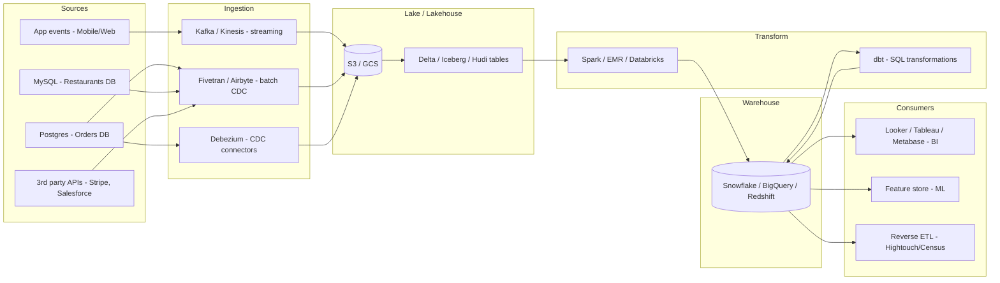
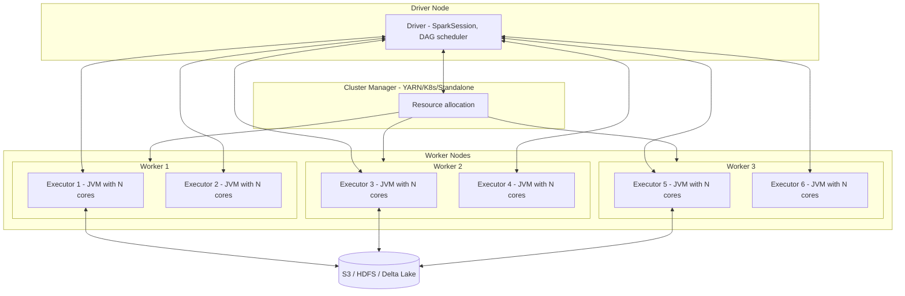

# Data Engineer — From Pipelines to Petabytes

Data Engineering 2026 mein woh role ban chuka hai jo har serious product company ko *chahiye hi chahiye*. Tu Razorpay ki settlement reports dekhta hai, Swiggy ke "you ordered 14 days ago" notifications dekhta hai, Zomato ke Hyperpure demand forecast dashboards dekhta hai — har jagah backstage ek **Data Engineer** baitha hai jo raw events ko clean, joined, aggregated tables mein convert kar raha hai. Bina DE ke, na Data Analyst dashboard bana sakta, na ML Engineer model train kar sakta. Tu literal foundation hai.

Iss doc ka goal: tujhe **fresher se senior DE** tak ka roadmap dena. Hum SQL, Spark, Airflow, dbt, Kafka, Snowflake — sab cover karenge. Theory + worked code + Indian product co war stories. Voice Hinglish hai, but SQL aur PySpark precise English mein — production-grade. End mein 30 interview questions aur ek pre-interview checklist.

> **Why this depth?** Razorpay senior DE round literal sawaal — "Explain Spark shuffle in detail, then show me a broadcast join in PySpark, then tell me kab broadcast tradeoff kharab hota hai." Swiggy pucchta hai — "Tu Kafka exactly-once kaise achieve karega Snowflake sink ke saath?" Surface-level rattu yahaan reject hai.

Chai-pani saath rakh, ye lamba safar hai — but har section ek interview round bachayega.

---

## 1. Why Data Engineering — vs DA, MLE, Backend

Pehle confusion clear kar lete hain. 4 roles, similar-sounding, *bahut* different day-to-day.

### 1.1 The four-role map

| Role | Primary output | Tools | Owns |
|------|----------------|-------|------|
| **Data Engineer (DE)** | Reliable pipelines, warehouses, contracts | Airflow, Spark, dbt, Kafka, Snowflake | "Data sahi time pe sahi shape mein pahunchi" |
| **Data Analyst (DA)** | Dashboards, reports, ad-hoc analysis | SQL, Tableau/Looker/Metabase, Excel | "Business question ka answer" |
| **ML Engineer (MLE)** | Trained + served models | PyTorch, MLflow, Sagemaker, Vertex | "Model accuracy + latency in prod" |
| **Backend Engineer** | Product APIs, transactional systems | Spring/Node, Postgres, Redis | "User-facing feature works" |

DE = **plumbing + reliability**. DA = **storytelling**. MLE = **modeling**. Backend = **product**. Overlap hota hai — chhoti companies mein DE+DA ek hi banda hota hai — but at scale ye alag teams banti hain.

### 1.2 What a DE actually does on a Tuesday

- 9:30 AM: PagerDuty alert — `daily_orders_fact` DAG failed at 4 AM. Open Airflow UI, check task logs. Source schema mein ek nayi column add ho gayi, dbt model fail.
- 10:30 AM: Schema fix push, backfill 1 day.
- 11:30 AM: Stand-up. ML team ka request — `user_360_features` mein add `avg_order_value_30d`. Tu dbt model design karta hai.
- 1:30 PM: Lunch.
- 2:30 PM: New Kafka topic for `payment_events_v2`. Producer team se contract finalise — schema, partition key, retention.
- 4:30 PM: Snowflake cost review — kal kis warehouse ne extra ₹40k credits jala diye? Tu query history dekhta hai, ek `SELECT *` cross join milta hai. PR raise karta hai partition pruning ke liye.
- 6:00 PM: Review junior DE ka dbt PR.

Day-to-day = **pipelines, schemas, costs, alerts**. Not flashy — but absolutely critical.

### 1.3 Indian product co stacks (2026 reality)

| Company | Orchestration | Compute | Warehouse | Streaming | Transform |
|---------|---------------|---------|-----------|-----------|-----------|
| **Razorpay** | Airflow on EKS | Spark on EMR | Snowflake | Kafka MSK | dbt Cloud |
| **Swiggy** | Airflow + Dagster pilot | Spark + Trino | BigQuery + Iceberg | Kafka + Flink | dbt Core |
| **Zomato** | Databricks Workflows | Databricks (Spark) | Databricks SQL (Delta) | Kafka | dbt + Databricks |
| **CRED** | Airflow | Spark + Athena | Snowflake | Kinesis + Kafka | dbt |
| **Paytm** | Oozie (legacy) + Airflow | Spark on Hadoop YARN | Hive + Snowflake | Kafka | dbt + custom Hive macros |
| **Flipkart** | Internal scheduler | Spark | BigQuery + internal | Kafka | dbt + custom |
| **PhonePe** | Airflow | Spark on Kubernetes | Druid + ClickHouse | Kafka | dbt |

Pattern: **Airflow + Spark + dbt + Kafka + (Snowflake | BigQuery | Databricks)**. Sikh le ye stack — 90% Indian product co DE roles isi ke around hain.

### 1.4 Salary bands (2026, Bangalore/Hyderabad benchmark)

| Experience | Tier-3 startup | Tier-2 product | Tier-1 (Razorpay/CRED/Swiggy) | FAANG India |
|------------|----------------|----------------|-------------------------------|-------------|
| Fresher (0 yr) | 8-12 LPA | 14-18 LPA | 22-28 LPA | 28-35 LPA |
| 2 yr | 14-20 LPA | 22-28 LPA | 32-42 LPA | 45-60 LPA |
| 5 yr | 25-35 LPA | 38-50 LPA | 55-75 LPA | 80 LPA-1.2 Cr |
| 8+ yr (Lead/Staff) | 45-60 LPA | 65-85 LPA | 90 LPA-1.4 Cr | 1.5-2.5 Cr |

DE pay closely tracks SDE because supply is scarce — most Indian CS grads aim Backend/Frontend/MLE. Pure DE specialists are *under-supplied*. Lever it.

---

## 2. The modern data stack

Ek mental model bana le. Saari pipelines is shape mein hoti hain:

> **Sources → Ingestion → Lake/Lakehouse → Transform → Warehouse → BI/ML**



Har box ka role:

- **Sources** — wahaan se raw data aata hai. Postgres (transactional), event streams (Kafka topics), 3rd-party APIs (Salesforce, Stripe, Mixpanel).
- **Ingestion** — copy-paste layer. Either streaming (Kafka, Kinesis) ya batch CDC (Fivetran, Airbyte, Debezium).
- **Lake/Lakehouse** — cheap object storage (S3/GCS) where raw + intermediate parquet/Delta/Iceberg tables live. Schema-on-read flexibility.
- **Transform** — Spark for heavy distributed computation, dbt for in-warehouse SQL.
- **Warehouse** — fast columnar OLAP DB for BI queries (Snowflake, BigQuery, Redshift).
- **Consumers** — BI tools, ML feature stores, reverse ETL (sending data *back* to Salesforce/HubSpot).

### 2.1 ETL vs ELT — the modern shift

Pehle (2010-2017): **ETL** — Extract → Transform (in Spark/Informatica) → Load (clean data into warehouse).

Ab (2018+): **ELT** — Extract → Load raw into warehouse → Transform inside warehouse using SQL (dbt).

**Kyu shift hua?**

1. Cloud warehouses (Snowflake, BigQuery) ab itne sasta + scalable hain ki raw data dump karna affordable hai.
2. SQL is universal — DA bhi transformations contribute kar sakta hai.
3. Storage-compute separation — store TB data, compute only when querying.
4. Time-travel + raw history — agar transformation logic galat tha, raw data se re-derive kar sakte hain.

ETL still relevant when: source data is HUGE (PB scale), or compliance requires masking *before* warehouse load (PII/PCI).

```text
Modern rule of thumb:
- Sub-TB scale, business team owns logic → ELT (dbt + warehouse)
- PB-scale, raw events, ML features → ETL (Spark + lakehouse)
- Real-time → streaming ETL (Flink, Kafka Streams)
```

### 2.2 The "two-tier" stack (lake + warehouse)

Bigger orgs run **both**:

- **Lakehouse tier** (S3 + Iceberg/Delta) — raw + bronze + silver tables, ML training data, compliance archive.
- **Warehouse tier** (Snowflake/BigQuery) — gold/serving tables, business BI, fast SQL.

Data flows lake → transform → warehouse. Some queries hit lake directly via Trino/Athena/Presto for ad-hoc. Razorpay literally runs this pattern: S3+Iceberg for ML, Snowflake for finance + BI.

---

## 3. SQL — deep dive for DE

DE ka 70% kaam SQL hai. Tu agar window functions, CTEs, recursion, aur query plans nahi samajhta — tu DE nahi ban sakta. Cross-link: tune `database-sql.md` aur `dbms-complete.md` zaroor padhna for fundamentals (joins, indexes, transactions).

### 3.1 Window functions — the DE superpower

Window functions row ko apne **window** ke context mein dekhne dete hain — bina rows collapse kiye. Aggregate function (`SUM`, `AVG`) GROUP BY mein rows ko collapse karta hai. Window function rows ko preserve karta hai aur har row ke liye computed value attach karta hai.

Generic syntax:

```sql
function_name(args) OVER (
    [PARTITION BY col1, col2, ...]
    [ORDER BY col3 [ASC|DESC]]
    [ROWS BETWEEN frame_start AND frame_end]
)
```

#### 3.1.1 ROW_NUMBER, RANK, DENSE_RANK

```sql
-- Swiggy: each user ka latest 3 orders nikalo
WITH ranked_orders AS (
    SELECT
        user_id,
        order_id,
        created_at,
        total_amount,
        ROW_NUMBER() OVER (
            PARTITION BY user_id
            ORDER BY created_at DESC
        ) AS rn
    FROM orders
    WHERE created_at >= CURRENT_DATE - INTERVAL '90 days'
)
SELECT user_id, order_id, created_at, total_amount
FROM ranked_orders
WHERE rn <= 3;
```

`ROW_NUMBER` = unique sequence (ties broken arbitrarily). `RANK` = gaps after ties (1, 2, 2, 4). `DENSE_RANK` = no gaps (1, 2, 2, 3). 90% time tujhe `ROW_NUMBER` chahiye.

#### 3.1.2 LAG / LEAD — previous/next row access

```sql
-- Razorpay: payment retry detection — ek user ke consecutive failed payments
SELECT
    user_id,
    payment_id,
    created_at,
    status,
    LAG(status) OVER (
        PARTITION BY user_id ORDER BY created_at
    ) AS prev_status,
    LAG(created_at) OVER (
        PARTITION BY user_id ORDER BY created_at
    ) AS prev_attempt_at,
    EXTRACT(EPOCH FROM (created_at - LAG(created_at) OVER (
        PARTITION BY user_id ORDER BY created_at
    ))) AS gap_seconds
FROM payments
WHERE status = 'failed';
```

`LEAD` is `LAG`'s mirror — looks at next row. Useful for "session" detection — gap > 30 min → new session.

#### 3.1.3 NTILE — bucketing

```sql
-- Swiggy: divide users into 10 spending deciles
SELECT
    user_id,
    total_lifetime_spend,
    NTILE(10) OVER (ORDER BY total_lifetime_spend DESC) AS spend_decile
FROM user_lifetime_metrics;
```

Decile 1 = top 10% spenders. Useful for marketing cohort segmentation.

#### 3.1.4 Running aggregates — SUM/AVG OVER

```sql
-- Cumulative GMV per restaurant per day
SELECT
    restaurant_id,
    order_date,
    daily_gmv,
    SUM(daily_gmv) OVER (
        PARTITION BY restaurant_id
        ORDER BY order_date
        ROWS BETWEEN UNBOUNDED PRECEDING AND CURRENT ROW
    ) AS cumulative_gmv,
    AVG(daily_gmv) OVER (
        PARTITION BY restaurant_id
        ORDER BY order_date
        ROWS BETWEEN 6 PRECEDING AND CURRENT ROW
    ) AS rolling_7d_avg_gmv
FROM daily_restaurant_gmv;
```

`ROWS BETWEEN` = row-based frame. `RANGE BETWEEN` = value-based frame (useful with timestamps). Production tip: `ROWS` is faster than `RANGE` — use it unless you specifically need value-window semantics.

### 3.2 CTEs — readable SQL

CTE = Common Table Expression. Subquery ka readable cousin.

```sql
-- Multi-step CTE for "Top 5 cuisines by GMV in Mumbai last month"
WITH last_month_orders AS (
    SELECT order_id, restaurant_id, total_amount
    FROM orders
    WHERE created_at >= DATE_TRUNC('month', CURRENT_DATE) - INTERVAL '1 month'
      AND created_at <  DATE_TRUNC('month', CURRENT_DATE)
),
mumbai_restaurants AS (
    SELECT restaurant_id, cuisine
    FROM restaurants
    WHERE city = 'Mumbai'
),
joined AS (
    SELECT mr.cuisine, lmo.total_amount
    FROM last_month_orders lmo
    JOIN mumbai_restaurants mr USING (restaurant_id)
)
SELECT cuisine, SUM(total_amount) AS gmv
FROM joined
GROUP BY cuisine
ORDER BY gmv DESC
LIMIT 5;
```

Each CTE = one logical step. Easy to debug — comment out lower CTEs and inspect upper ones.

#### 3.2.1 Recursive CTEs — hierarchies, graphs

```sql
-- Swiggy delivery partner referral tree — find all downstream referrals of a partner
WITH RECURSIVE referral_tree AS (
    -- anchor: starting partner
    SELECT partner_id, referrer_id, 1 AS depth
    FROM delivery_partners
    WHERE partner_id = 5001

    UNION ALL

    -- recursive step: find partners referred by current set
    SELECT dp.partner_id, dp.referrer_id, rt.depth + 1
    FROM delivery_partners dp
    JOIN referral_tree rt ON dp.referrer_id = rt.partner_id
    WHERE rt.depth < 10  -- safety cap
)
SELECT depth, COUNT(*) AS partners_at_depth
FROM referral_tree
GROUP BY depth
ORDER BY depth;
```

Recursive CTE = anchor + recursive step + UNION ALL. Always put a depth cap — infinite recursion is real if cycle exists.

### 3.3 Pivot / Unpivot

#### 3.3.1 Pivot — rows to columns

Standard SQL doesn't have `PIVOT`, but `CASE WHEN` pattern works everywhere:

```sql
-- Monthly GMV per cuisine, columns = Q1/Q2/Q3/Q4
SELECT
    cuisine,
    SUM(CASE WHEN EXTRACT(QUARTER FROM order_date) = 1 THEN gmv ELSE 0 END) AS q1,
    SUM(CASE WHEN EXTRACT(QUARTER FROM order_date) = 2 THEN gmv ELSE 0 END) AS q2,
    SUM(CASE WHEN EXTRACT(QUARTER FROM order_date) = 3 THEN gmv ELSE 0 END) AS q3,
    SUM(CASE WHEN EXTRACT(QUARTER FROM order_date) = 4 THEN gmv ELSE 0 END) AS q4
FROM monthly_cuisine_gmv
WHERE EXTRACT(YEAR FROM order_date) = 2025
GROUP BY cuisine;
```

Snowflake/BigQuery have native `PIVOT`:

```sql
-- Snowflake
SELECT *
FROM monthly_cuisine_gmv
PIVOT (SUM(gmv) FOR quarter IN ('Q1', 'Q2', 'Q3', 'Q4')) AS p;
```

#### 3.3.2 Unpivot — columns to rows

```sql
-- Wide → long for time-series tools
SELECT cuisine, quarter, gmv
FROM cuisine_quarterly_wide
UNPIVOT (gmv FOR quarter IN (q1, q2, q3, q4));
```

### 3.4 Date/time across dialects

DE ka peeda — har dialect ka date function alag hai.

| Operation | Postgres | Snowflake | BigQuery | Spark SQL |
|-----------|----------|-----------|----------|-----------|
| Current TS | `NOW()` | `CURRENT_TIMESTAMP()` | `CURRENT_TIMESTAMP()` | `current_timestamp()` |
| Truncate to day | `DATE_TRUNC('day', ts)` | `DATE_TRUNC('day', ts)` | `TIMESTAMP_TRUNC(ts, DAY)` | `date_trunc('day', ts)` |
| Add 7 days | `ts + INTERVAL '7 days'` | `DATEADD(day, 7, ts)` | `TIMESTAMP_ADD(ts, INTERVAL 7 DAY)` | `ts + INTERVAL 7 DAYS` |
| Day diff | `(d2 - d1)` (returns days) | `DATEDIFF(day, d1, d2)` | `DATE_DIFF(d2, d1, DAY)` | `datediff(d2, d1)` |
| Extract year | `EXTRACT(YEAR FROM ts)` | `YEAR(ts)` | `EXTRACT(YEAR FROM ts)` | `year(ts)` |
| Format | `TO_CHAR(ts, 'YYYY-MM-DD')` | `TO_CHAR(ts, 'YYYY-MM-DD')` | `FORMAT_TIMESTAMP('%F', ts)` | `date_format(ts, 'yyyy-MM-dd')` |

Production rule: **always store TIMESTAMP WITH TIMEZONE (UTC)**. Convert to IST at query time using `CONVERT_TIMEZONE` / `AT TIME ZONE`. Crores of bugs aate hain DST + timezone bhool ke.

### 3.5 Performance — query plans, indexes, materialised views

#### 3.5.1 EXPLAIN ANALYZE

```sql
EXPLAIN (ANALYZE, BUFFERS)
SELECT u.full_name, COUNT(o.order_id)
FROM users u
LEFT JOIN orders o ON o.user_id = u.user_id
WHERE u.created_at >= '2025-01-01'
GROUP BY u.full_name;
```

Decode plan: scan type (Seq vs Index), join algorithm (Hash vs Nested Loop vs Merge), rows planned vs actual (huge mismatch = stale stats), shared buffers (cache hits).

#### 3.5.2 Index strategy for DE

- **Single-column B-tree** — equality + range queries
- **Composite index** — order matters; left-most prefix rule
- **Covering index** (Postgres `INCLUDE`) — index includes non-key columns to avoid heap fetch
- **Partial index** — `WHERE status = 'pending'` for hot subset
- **BRIN** — block-range index for huge time-ordered tables (1000x smaller than B-tree)

DE-specific: warehouses (Snowflake, BigQuery, Redshift) **don't use traditional B-tree indexes**. They use **clustering / partitioning / sort keys** instead. Snowflake → micro-partition pruning + clustering keys. BigQuery → partition + cluster. Redshift → DISTKEY + SORTKEY.

#### 3.5.3 Materialised views

Regular view = stored query, computed on read. Materialised view = stored *result*, refreshed on schedule.

```sql
-- Snowflake
CREATE MATERIALIZED VIEW daily_gmv_mv AS
SELECT order_date, restaurant_id, SUM(total_amount) AS gmv, COUNT(*) AS orders
FROM orders
GROUP BY order_date, restaurant_id;
-- Snowflake auto-refreshes incrementally
```

Use when: same expensive aggregation repeatedly hit, source data changes slowly. Don't use when: source changes every second (refresh cost > benefit).

> Cross-link: SQL fundamentals → `database-sql.md`. Schema design + transactions → `dbms-complete.md`. Distributed warehouses ko deep mein samajhna hai → `da-data-warehousing.md`.

---

## 4. Data warehouses + lakehouses

Warehouse = OLAP DB optimised for analytical queries (columnar, MPP). Lake = cheap object storage with schema-on-read. Lakehouse = lake + warehouse-like ACID + transactional semantics.

### 4.1 Star schema

Centre = **fact table** (events, transactions). Spokes = **dimension tables** (entities — user, product, restaurant, time).

```sql
-- Fact: every order line item
CREATE TABLE fact_order_items (
    order_item_id     BIGINT,
    order_date_key    INT,             -- FK to dim_date
    user_key          BIGINT,          -- FK to dim_user
    restaurant_key    BIGINT,          -- FK to dim_restaurant
    item_key          BIGINT,          -- FK to dim_item
    quantity          INT,
    unit_price        NUMERIC(10, 2),
    discount          NUMERIC(10, 2),
    line_total        NUMERIC(10, 2)
);

-- Dimensions
CREATE TABLE dim_user (
    user_key       BIGINT PRIMARY KEY,
    user_id        BIGINT,
    full_name      VARCHAR(120),
    city           VARCHAR(80),
    signup_date    DATE,
    is_prime       BOOLEAN
);

CREATE TABLE dim_restaurant (
    restaurant_key BIGINT PRIMARY KEY,
    restaurant_id  BIGINT,
    name           VARCHAR(200),
    cuisine        VARCHAR(80),
    city           VARCHAR(80)
);

CREATE TABLE dim_date (
    date_key       INT PRIMARY KEY,    -- 20251102
    full_date      DATE,
    day_of_week    SMALLINT,
    quarter        SMALLINT,
    is_weekend     BOOLEAN,
    is_holiday     BOOLEAN
);
```

Star schema = denormalised dimensions (city stored *in* dim_user, not via FK to dim_city). Reason: warehouses optimise for **fewer joins**. Storage doubling is acceptable; query latency drop is huge.

### 4.2 Snowflake schema

Star schema *with* dimensions further normalised.

```text
fact_order_items → dim_user → dim_city → dim_state
                            → dim_signup_channel
```

Pros: less storage, easier dimension updates. Cons: more joins. **Modern warehouses (Snowflake, BQ) prefer star** — joins are cheap, storage is cheap, query simplicity wins.

### 4.3 Denormalisation tradeoff

OLTP (Postgres for orders) → normalised (3NF). OLAP (warehouse) → denormalised. Ek hi domain, do schemas — DE ka kaam hai dono ke beech transformation likhna.

```text
Rule of thumb:
- Read-heavy + analytical → denormalise
- Write-heavy + transactional → normalise
- Storage doubling for query speed → almost always worth it in OLAP
```

### 4.4 SCD — Slowly Changing Dimensions

Dimension records change over time (user moves city, restaurant cuisine updated). Kaise track karein? Three SCD types.

#### 4.4.1 SCD Type 1 — overwrite

Simply update — no history.

```sql
UPDATE dim_user SET city = 'Bengaluru' WHERE user_key = 10001;
```

Use when: history doesn't matter (typo correction, GDPR right-to-be-forgotten).

#### 4.4.2 SCD Type 2 — full history with effective dates

Add new row each change. Track via `valid_from`, `valid_to`, `is_current`.

```sql
CREATE TABLE dim_user_scd2 (
    user_sk         BIGSERIAL PRIMARY KEY,   -- surrogate key, unique per version
    user_id         BIGINT,                  -- natural key, repeats across versions
    full_name       VARCHAR(120),
    city            VARCHAR(80),
    valid_from      TIMESTAMP,
    valid_to        TIMESTAMP,
    is_current      BOOLEAN
);

-- User Aman moved from Pune to Bengaluru on 2025-11-01
-- Step 1: close current row
UPDATE dim_user_scd2
SET valid_to = '2025-11-01 00:00:00', is_current = FALSE
WHERE user_id = 8821 AND is_current = TRUE;

-- Step 2: insert new row
INSERT INTO dim_user_scd2(user_id, full_name, city, valid_from, valid_to, is_current)
VALUES (8821, 'Aman Verma', 'Bengaluru', '2025-11-01 00:00:00', '9999-12-31', TRUE);
```

Fact tables join on `user_sk` (the version-specific surrogate), so an order placed in October 2025 still shows Aman as Pune user, while November orders show Bengaluru.

dbt has a built-in `snapshots` feature exactly for SCD2 — see Section 7.

#### 4.4.3 SCD Type 3 — limited history (current + previous)

Add `previous_city` column. Only keeps one prior value.

```sql
ALTER TABLE dim_user ADD COLUMN previous_city VARCHAR(80);

UPDATE dim_user
SET previous_city = city, city = 'Bengaluru'
WHERE user_id = 8821;
```

Rare in practice — SCD2 is the default. SCD3 used for "did user just move?" type queries.

### 4.5 Warehouse comparison

| Feature | Snowflake | BigQuery | Redshift | Databricks SQL |
|---------|-----------|----------|----------|----------------|
| Compute model | Virtual warehouses (decoupled) | Slots (shared/reserved) | Cluster nodes (RA3 = decoupled) | SQL warehouses (decoupled) |
| Pricing | Per-second compute + storage | Per-byte scanned (on-demand) or slots | Per-node-hour | DBU per second |
| Storage | Snowflake-managed micro-partitions | Capacitor columnar | Column store | Delta Lake on cloud storage |
| Auto-scaling | Multi-cluster warehouses | Slots auto-allocate | Concurrency scaling clusters | Auto-scaling endpoints |
| Best for | Mid-large enterprise, multi-cloud | Ad-hoc + ML (Vertex), GCP shops | AWS-tied workloads | Lakehouse + ML, Spark-native |
| Indian users | Razorpay, CRED | Swiggy, Flipkart | Older AWS shops | Zomato, Hyperface |
| Gotcha | Credit consumption silent burner | Per-byte scanned can explode | VACUUM / sort key maintenance | Photon vs classic confusion |

### 4.6 Lakehouse — Delta vs Iceberg vs Hudi

Pre-2020: lake = parquet files in S3. Schema/ACID? Tu khud sambhal. Files corrupted? Bad luck.

Lakehouse formats add a **transaction log** on top of parquet — gives ACID, time travel, schema evolution, MERGE, optimistic concurrency.

| Format | Origin | Strength | Ecosystem |
|--------|--------|----------|-----------|
| **Delta Lake** | Databricks | Best Spark integration, mature | Databricks-native; OSS via Delta-OSS |
| **Apache Iceberg** | Netflix | Engine-neutral (Spark, Trino, Flink, Snowflake), best partition evolution | Snowflake + AWS Athena + Trino love it |
| **Apache Hudi** | Uber | Best CDC + upsert ergonomics, MoR vs CoW table types | Onehouse, AWS EMR |

```python
# PySpark + Delta example
from delta.tables import DeltaTable

# Time travel
df = spark.read.format("delta") \
    .option("versionAsOf", 42) \
    .load("s3://datalake/silver/orders")

# Upsert (MERGE)
target = DeltaTable.forPath(spark, "s3://datalake/silver/orders")
target.alias("t").merge(
    source=updates_df.alias("s"),
    condition="t.order_id = s.order_id"
).whenMatchedUpdateAll() \
 .whenNotMatchedInsertAll() \
 .execute()
```

#### 4.6.1 When to pick each

- **Delta** — already on Databricks, want zero-config Spark
- **Iceberg** — multi-engine (Trino + Spark + Snowflake reading same table), strict schema evolution needs
- **Hudi** — heavy upsert/CDC workloads, near-real-time freshness

2026 reality: **Iceberg is winning the open-source war**. Snowflake added Iceberg external tables. AWS S3 Tables is built on Iceberg. New greenfield → Iceberg.

---

## 5. Apache Spark — distributed transform engine

Spark = JVM-based distributed compute engine. PySpark = Python API. Spark SQL = SQL API. Same engine, different surfaces.

### 5.1 RDD → DataFrame → Dataset evolution

- **RDD** (2012) — Resilient Distributed Dataset. Low-level, no optimiser. Tu kaise execute hoga, *literally* tujhe likhna padega.
- **DataFrame** (2015) — Schema-aware, Catalyst optimiser. Like SQL table. Most DE work happens here.
- **Dataset** (2016, Scala/Java only) — DataFrame + compile-time type safety.

PySpark mein practically tu DataFrame use karta hai. Spark SQL strings bhi DataFrame ke alag interface hain.

### 5.2 Lazy evaluation + DAG

Spark transformations are **lazy**. Tu `df.filter(...)` likhta hai — kuch *execute* nahi hota. Sirf logical plan banta hai. Jab tu `.show()`, `.count()`, `.write()` call karta hai (an **action**) — tabhi Catalyst optimiser plan ko optimise karke physical plan generate karta hai aur DAG (Directed Acyclic Graph) of stages execute karta hai.

```python
# Nothing runs until .show()
orders = spark.read.parquet("s3://lake/orders/")
filtered = orders.filter("order_date = '2025-11-01'")
joined = filtered.join(users, "user_id")
agg = joined.groupBy("city").sum("total_amount")
agg.show()   # NOW everything runs, optimised end-to-end
```

Why lazy? Optimiser can:
- Push filters before joins (predicate pushdown)
- Combine narrow transformations into one stage
- Eliminate redundant operations
- Reorder joins by selectivity

### 5.3 Partitioning + shuffling — the perf killer

Spark splits data into **partitions** (typically ~128 MB each). Each partition = one task on one executor.

**Narrow transformation**: `map`, `filter`, `select` — same partition in/out. No data movement.

**Wide transformation**: `groupBy`, `join`, `distinct`, `repartition` — needs data from multiple partitions. **Triggers shuffle**.

Shuffle = serialise data, write to local disk, send across network, deserialise on receiver. **Most expensive operation in Spark**. 80% of Spark perf tuning = reducing shuffles.

```python
# Bad: 2 shuffles
orders.groupBy("user_id").sum("amount") \
      .groupBy("city").sum("sum(amount)")

# Better: pre-aggregate before second groupBy via repartition by city upstream
# Best: combine into one shuffle if possible
```

Tools to inspect:
- `df.explain(True)` — physical plan, look for `Exchange` (= shuffle)
- Spark UI → Stages tab → shuffle read/write metrics

### 5.4 Broadcast joins vs shuffle joins

Default join algo: **shuffle hash join / sort merge join**. Both shuffle both sides on join key.

If one side is *small* (< ~10 MB by default, configurable via `spark.sql.autoBroadcastJoinThreshold`), Spark broadcasts it to all executors → no shuffle on the big side.

```python
from pyspark.sql.functions import broadcast

# Big table joined with small dimension table
result = orders.join(
    broadcast(restaurants),   # restaurants is < 50 MB
    on="restaurant_id",
    how="left"
)
```

Rule: **broadcast small dim tables, shuffle-join big-big**. Don't broadcast a 5 GB table — driver/executor OOM.

### 5.5 Spark cluster anatomy



- **Driver** — runs your `main()`, builds DAG, schedules tasks. SparkContext lives here. Single point of failure.
- **Cluster manager** — YARN (Hadoop), Kubernetes (modern default), Mesos (dead), Standalone (dev only).
- **Worker nodes** — physical/VM machines that host executors.
- **Executor** — JVM process on a worker. Has N CPU cores + memory. Runs *tasks* (one task per core).
- **Task** — one unit of work on one partition.

Sizing rule of thumb:
- Executor: 4-5 cores, 16-32 GB memory
- Don't go beyond 5 cores per executor — JVM GC pressure
- Total executors = (cluster cores / cores per executor) - 1 (one for driver)

### 5.6 Three worked PySpark examples

#### 5.6.1 Aggregation — daily GMV per city

```python
from pyspark.sql import SparkSession
from pyspark.sql.functions import col, sum as _sum, count, to_date

spark = SparkSession.builder \
    .appName("daily_gmv_per_city") \
    .config("spark.sql.adaptive.enabled", "true") \
    .getOrCreate()

orders = spark.read.parquet("s3://lake/bronze/orders/")
restaurants = spark.read.parquet("s3://lake/bronze/restaurants/")

daily_gmv = (
    orders
        .join(restaurants.select("restaurant_id", "city"), on="restaurant_id")
        .withColumn("order_date", to_date(col("created_at")))
        .groupBy("order_date", "city")
        .agg(
            _sum("total_amount").alias("gmv"),
            count("order_id").alias("orders"),
        )
)

(daily_gmv
    .repartition("order_date")
    .write
    .mode("overwrite")
    .partitionBy("order_date")
    .parquet("s3://lake/silver/daily_gmv_by_city/"))
```

#### 5.6.2 Join — broadcast pattern

```python
from pyspark.sql.functions import broadcast

# 200M row order_items joined with 10K row product dim
order_items = spark.read.parquet("s3://lake/bronze/order_items/")
products = spark.read.parquet("s3://lake/bronze/products/")

joined = order_items.join(
    broadcast(products.select("product_id", "category", "is_veg")),
    on="product_id",
    how="left"
)

joined.write.mode("overwrite").parquet("s3://lake/silver/order_items_enriched/")
```

#### 5.6.3 Window — rank top items per restaurant

```python
from pyspark.sql.window import Window
from pyspark.sql.functions import row_number, sum as _sum

w = Window.partitionBy("restaurant_id").orderBy(col("revenue").desc())

top5 = (
    spark.read.parquet("s3://lake/silver/order_items_enriched/")
        .groupBy("restaurant_id", "product_id", "name")
        .agg(_sum("line_total").alias("revenue"))
        .withColumn("rn", row_number().over(w))
        .filter("rn <= 5")
        .drop("rn")
)

top5.write.mode("overwrite").parquet("s3://lake/gold/top5_items_per_restaurant/")
```

### 5.7 Adaptive Query Execution (AQE)

Spark 3.0+ feature. At runtime, after each shuffle, Spark looks at actual partition sizes and adjusts: coalesces small partitions, splits skewed partitions, dynamically converts shuffle joins to broadcast if one side becomes small after filter. Always enable: `spark.sql.adaptive.enabled = true`.

---

## 6. Workflow orchestration — Apache Airflow

Tujhe daily 200 pipelines chalane hain — kuch hourly, kuch ek doosre par depend karte hain, kuch alert chahiye agar fail hue. Yeh kaam orchestrator ka hai. Airflow industry default hai.

### 6.1 The DAG mental model

Airflow's central abstraction = **DAG** (Directed Acyclic Graph). Nodes = tasks. Edges = dependencies. No cycles allowed.

```text
extract_orders >> validate_orders >> [load_to_warehouse, send_metrics]
                                  >> notify_slack
```

A DAG runs on a **schedule** (cron expression or preset like `@daily`). Each run = one **DAG run**. Each task in that run = one **task instance** with state (queued, running, success, failed, up_for_retry, skipped).

### 6.2 Operators

Operator = template for a task. Some common ones:

- `PythonOperator` — runs a Python callable
- `BashOperator` — runs a shell command
- `BigQueryInsertJobOperator` — runs BQ SQL
- `SnowflakeOperator` — runs Snowflake SQL
- `SparkSubmitOperator` — submits Spark job to YARN/K8s
- `KubernetesPodOperator` — runs arbitrary container as pod (favourite of senior teams)
- `S3KeySensor` — waits for an S3 file to land (Sensor = polling task)
- `DbtCloudRunJobOperator` — triggers dbt Cloud job

### 6.3 Hooks, sensors, XComs

- **Hook** = thin wrapper around an external service's client (BigQueryHook, S3Hook). Operators use hooks under the hood.
- **Sensor** = task that waits for a condition. `S3KeySensor`, `ExternalTaskSensor`. Use `mode='reschedule'` not `'poke'` to free worker slots while waiting.
- **XCom** (cross-communication) = small piece of data passed between tasks. Pickled, stored in metadata DB. **Don't push large data via XCom** — push to S3, pass S3 path.

### 6.4 Scheduling + the catchup gotcha

```python
# DAG runs at 02:00 UTC daily
schedule = "0 2 * * *"
```

**The big trap**: Airflow's `start_date` + `catchup=True` (default in older versions) — when you deploy a DAG with `start_date='2024-01-01'`, Airflow will trigger one run *for every day since Jan 1*. Your warehouse explodes. Always set `catchup=False` unless you genuinely want backfill.

```python
DAG(
    dag_id="daily_gmv_pipeline",
    start_date=pendulum.datetime(2025, 11, 1, tz="Asia/Kolkata"),
    schedule="0 2 * * *",
    catchup=False,  # critical
    max_active_runs=1,
    ...
)
```

**Logical date vs run date**: A run scheduled at 02:00 on Nov 2 has `data_interval_start = 2025-11-01 02:00`, `data_interval_end = 2025-11-02 02:00`. Use these in queries — *not* "today" — so reruns are deterministic.

### 6.5 SLA, retries, alerting

```python
default_args = {
    "owner": "data-platform",
    "retries": 3,
    "retry_delay": timedelta(minutes=5),
    "retry_exponential_backoff": True,
    "max_retry_delay": timedelta(hours=1),
    "execution_timeout": timedelta(hours=2),
    "sla": timedelta(hours=4),
    "on_failure_callback": notify_pagerduty,
    "on_sla_miss_callback": notify_slack,
}
```

SLA != hard deadline; just triggers callback. Production alerting: route critical pipelines to PagerDuty (`on_failure_callback`), warning to Slack (`on_sla_miss_callback`).

### 6.6 End-to-end DAG example

```python
from __future__ import annotations
import pendulum
from airflow import DAG
from airflow.operators.python import PythonOperator
from airflow.providers.amazon.aws.sensors.s3 import S3KeySensor
from airflow.providers.snowflake.operators.snowflake import SnowflakeOperator
from airflow.operators.empty import EmptyOperator
from airflow.utils.trigger_rule import TriggerRule
from datetime import timedelta


def _push_metrics(**ctx):
    rows = ctx["ti"].xcom_pull(task_ids="load_to_snowflake", key="rows_loaded")
    # send to statsd / datadog
    print(f"Loaded {rows} rows into Snowflake")


with DAG(
    dag_id="daily_orders_etl",
    description="Land daily orders extract → validate → load to Snowflake → metrics",
    start_date=pendulum.datetime(2025, 11, 1, tz="Asia/Kolkata"),
    schedule="30 2 * * *",   # 02:30 IST daily
    catchup=False,
    max_active_runs=1,
    default_args={
        "owner": "data-platform",
        "retries": 3,
        "retry_delay": timedelta(minutes=5),
        "execution_timeout": timedelta(hours=2),
        "sla": timedelta(hours=4),
    },
    tags=["orders", "daily", "snowflake"],
) as dag:

    start = EmptyOperator(task_id="start")

    wait_for_extract = S3KeySensor(
        task_id="wait_for_extract",
        bucket_name="enginerd-lake",
        bucket_key="bronze/orders/dt={{ ds }}/_SUCCESS",
        aws_conn_id="aws_default",
        mode="reschedule",
        poke_interval=60,
        timeout=60 * 60 * 2,
    )

    validate = PythonOperator(
        task_id="validate_extract",
        python_callable=lambda **c: __import__("validators").run(c["ds"]),
    )

    load_to_snowflake = SnowflakeOperator(
        task_id="load_to_snowflake",
        snowflake_conn_id="snowflake_default",
        sql="""
            COPY INTO raw.orders
            FROM @s3_lake_stage/bronze/orders/dt={{ ds }}/
            FILE_FORMAT = (TYPE = PARQUET)
            ON_ERROR = 'ABORT_STATEMENT';
        """,
    )

    push_metrics = PythonOperator(
        task_id="push_metrics",
        python_callable=_push_metrics,
        trigger_rule=TriggerRule.ALL_DONE,   # always run, even on failure
    )

    end = EmptyOperator(task_id="end")

    start >> wait_for_extract >> validate >> load_to_snowflake >> push_metrics >> end
```

### 6.7 Airflow alternatives

- **Dagster** — asset-first model (declare *what* tables you produce, deps inferred). Better dev ergonomics, type safety. Swiggy piloting.
- **Prefect** — Pythonic, dynamic flows. Good for ML.
- **Argo Workflows** — K8s-native, YAML DAGs. ML training pipelines.
- **Mage** — opinionated, notebook-y. Smaller orgs.

Default for 2026: still **Airflow**. Indian product co market is 90% Airflow.

---

## 7. dbt — the analytics-engineering layer

dbt = "data build tool". Tu SQL `SELECT` likhta hai, dbt usse table/view banata hai, dependencies infer karta hai, tests chalata hai, docs generate karta hai. Replaced 80% of Spark ETL because warehouse compute became cheap.

### 7.1 Project structure

```text
my_dbt_project/
├── dbt_project.yml
├── models/
│   ├── staging/          # 1:1 with source, light renaming
│   │   ├── stg_orders.sql
│   │   └── stg_users.sql
│   ├── intermediate/     # joined, cleaned
│   │   └── int_orders_with_users.sql
│   └── marts/            # business-facing, gold
│       ├── core/
│       │   ├── fct_orders.sql
│       │   └── dim_users.sql
│       └── finance/
│           └── fct_daily_gmv.sql
├── snapshots/            # SCD2 tables
│   └── snap_users.sql
├── tests/                # custom tests
├── seeds/                # static CSVs (e.g., country_codes.csv)
├── macros/               # reusable Jinja
└── analyses/             # ad-hoc queries
```

### 7.2 Models

```sql
-- models/staging/stg_orders.sql
{{ config(materialized='view') }}

SELECT
    order_id,
    user_id,
    restaurant_id,
    total_amount,
    status,
    created_at AS ordered_at
FROM {{ source('raw', 'orders') }}
WHERE created_at >= '2024-01-01'
```

`{{ source('raw', 'orders') }}` — Jinja reference to declared source in `sources.yml`. dbt builds DAG from these refs.

```sql
-- models/marts/core/fct_orders.sql
{{ config(
    materialized='incremental',
    unique_key='order_id',
    on_schema_change='append_new_columns'
) }}

SELECT
    o.order_id,
    o.user_id,
    o.restaurant_id,
    o.total_amount,
    o.status,
    o.ordered_at,
    u.city AS user_city,
    r.cuisine
FROM {{ ref('stg_orders') }} o
LEFT JOIN {{ ref('stg_users') }} u USING (user_id)
LEFT JOIN {{ ref('stg_restaurants') }} r USING (restaurant_id)


  WHERE o.ordered_at > (SELECT MAX(ordered_at) FROM {{ this }})

```

Materialisations: `view` (default), `table`, `incremental`, `ephemeral`, `materialized_view`. Incremental = only process new rows.

### 7.3 Tests

```yaml
# models/marts/core/_core.yml
version: 2
models:
  - name: fct_orders
    columns:
      - name: order_id
        tests:
          - unique
          - not_null
      - name: total_amount
        tests:
          - not_null
          - dbt_utils.expression_is_true:
              expression: ">= 0"
      - name: user_id
        tests:
          - relationships:
              to: ref('dim_users')
              field: user_id
```

`dbt test` runs all tests. Fail → CI/CD blocks merge. **The single biggest reason dbt won.**

### 7.4 Snapshots — SCD2 made trivial

```sql
-- snapshots/snap_users.sql

{{
    config(
      target_schema='snapshots',
      unique_key='user_id',
      strategy='check',
      check_cols=['city', 'is_prime']
    )
}}

SELECT user_id, full_name, city, is_prime
FROM {{ source('raw', 'users') }}


```

dbt manages `dbt_valid_from`, `dbt_valid_to`, `dbt_scd_id` columns. `dbt snapshot` runs daily — captures changes automatically.

### 7.5 Macros

```sql
-- macros/cents_to_rupees.sql

    ({{ column_name }} / 100.0)::numeric(10, 2)


-- usage
SELECT order_id, {{ cents_to_rupees('total_amount_cents') }} AS total_amount
FROM {{ ref('stg_orders') }}
```

### 7.6 Medallion architecture

dbt + warehouse standard layout:

```text
Bronze  (raw / source)       — exactly as ingested, no transformation
Silver  (staging + intermediate) — cleaned, typed, joined
Gold    (marts)              — business-facing, aggregated, denormalised
```

Razorpay literal naming: `raw_*`, `stg_*`, `dim_* / fct_* / mart_*`. Zomato uses bronze/silver/gold.

### 7.7 Why dbt won

1. SQL — analysts can contribute, not just DEs
2. Git-native — PR review on data logic
3. Tests + docs out of the box
4. Lineage graph free
5. Incremental + snapshots solve hard problems
6. Cloud + Core both available

---

## 8. Streaming — Apache Kafka

Batch = "yesterday ka data 2 AM ko process karo". Streaming = "event aate hi process karo". Modern DE needs both.

### 8.1 Topics, partitions, consumer groups

- **Topic** = named log of events (`payment_events`, `order_placed`).
- **Partition** = ordered append-only file. Each topic split into N partitions for parallelism.
- **Producer** writes to a topic. Partition selected by: round-robin (no key), hash(key) (with key), custom partitioner.
- **Consumer** reads from one or more partitions. Tracks **offset** (position).
- **Consumer group** = set of consumers sharing the load. Each partition assigned to *one* consumer in the group. Group ID is the unit of work-sharing.

Math: parallelism = min(partitions, consumers in group). 12 partitions + 6 consumers → each consumer reads 2 partitions. 12 partitions + 24 consumers → 12 active, 12 idle. Plan partitions for *peak* parallelism, not present.

### 8.2 Offsets + delivery guarantees

Three semantics:

| Semantic | How | When |
|----------|-----|------|
| **At-most-once** | Commit offset *before* processing | Lossy ok (metrics, telemetry) |
| **At-least-once** | Commit offset *after* processing | Default; idempotent consumer required |
| **Exactly-once** | Transactional producer + idempotent + read-committed | Payments, settlements |

Exactly-once in Kafka: enable `enable.idempotence=true` on producer, use transactions API, consumer reads with `isolation.level=read_committed`. End-to-end exactly-once requires Kafka Streams or Flink — bare Kafka Producer + custom consumer = at-least-once with idempotency.

### 8.3 Kafka Connect

Framework for source/sink connectors. Pluggable JARs. Common ones:

- **Source**: Debezium (Postgres/MySQL CDC), JDBC source, S3 source
- **Sink**: S3 sink (lake), Snowflake sink, Elasticsearch sink, JDBC sink

Run Connect cluster in distributed mode → REST API to add/remove connectors. Senior teams self-manage; smaller use Confluent Cloud.

### 8.4 Kafka Streams vs Flink vs Spark Streaming

| Tool | Model | Strength | Weakness |
|------|-------|----------|----------|
| **Kafka Streams** | Library inside your app, stateful | Tight Kafka integration, no separate cluster | JVM-only, can't scale beyond JVM |
| **Apache Flink** | Stand-alone cluster, true streaming | Best low-latency + windowing + state, exactly-once | Operational complexity |
| **Spark Structured Streaming** | Micro-batch (technically continuous now) | Same code as batch, easy onboarding | Latency higher (100ms+) |

Indian product co usage:
- **Kafka Streams** — Razorpay payment routing (low latency)
- **Flink** — Swiggy live order tracking, Zomato dynamic pricing
- **Spark Structured Streaming** — when team already on Spark/Databricks

### 8.5 Worked Python producer + consumer

```python
# producer.py
from confluent_kafka import Producer
import json
import time

conf = {
    "bootstrap.servers": "kafka1:9092,kafka2:9092,kafka3:9092",
    "client.id": "order-events-producer",
    "enable.idempotence": True,
    "acks": "all",
    "compression.type": "lz4",
    "linger.ms": 20,
    "batch.size": 32 * 1024,
}
producer = Producer(conf)

def delivery_report(err, msg):
    if err is not None:
        print(f"Delivery failed for {msg.key()}: {err}")
    else:
        print(f"Delivered {msg.key()} to {msg.topic()}[{msg.partition()}]@{msg.offset()}")

events = [
    {"order_id": 1001, "user_id": 5, "amount": 499.0, "ts": time.time()},
    {"order_id": 1002, "user_id": 7, "amount": 1299.5, "ts": time.time()},
]

for ev in events:
    producer.produce(
        topic="order_placed_v1",
        key=str(ev["user_id"]).encode("utf-8"),
        value=json.dumps(ev).encode("utf-8"),
        callback=delivery_report,
    )
    producer.poll(0)

producer.flush(timeout=10)
```

```python
# consumer.py
from confluent_kafka import Consumer, KafkaError
import json

conf = {
    "bootstrap.servers": "kafka1:9092,kafka2:9092,kafka3:9092",
    "group.id": "order-amount-aggregator",
    "auto.offset.reset": "earliest",
    "enable.auto.commit": False,
    "isolation.level": "read_committed",
}
consumer = Consumer(conf)
consumer.subscribe(["order_placed_v1"])

try:
    while True:
        msg = consumer.poll(timeout=1.0)
        if msg is None:
            continue
        if msg.error():
            if msg.error().code() == KafkaError._PARTITION_EOF:
                continue
            raise Exception(msg.error())

        event = json.loads(msg.value().decode("utf-8"))
        # idempotent processing — upsert into a Postgres table or warehouse
        upsert_amount_aggregate(event)

        # commit only after successful processing → at-least-once
        consumer.commit(asynchronous=False)
finally:
    consumer.close()
```

Commit *after* processing = at-least-once. To achieve exactly-once for the sink, the upsert must be idempotent (e.g., PRIMARY KEY on `order_id`) — that way replays don't double-count.

---

## 9. Data quality + observability

Pipeline chal raha hai *bole to*. Output sahi hai *bole to*. Different things.

### 9.1 Tests on tables

Three categories:

- **Schema tests** — column exists, type correct, nullability
- **Constraint tests** — unique, not null, referential integrity, accepted values
- **Business tests** — `revenue >= 0`, `order_count` matches source ±1%

Tools:

- **dbt tests** — declarative, integrated. 90% of needs covered.
- **Great Expectations** — Python-first, more expressive. Heavy.
- **Soda** — YAML-first, lightweight, has a cloud UI.

```yaml
# Soda example
checks for fct_orders:
  - row_count > 0
  - duplicate_count(order_id) = 0
  - missing_count(user_id) = 0
  - avg(total_amount) between 100 and 5000
  - freshness(ordered_at) < 6h
```

### 9.2 Lineage + metadata

- **OpenLineage** — open standard, pipelines emit lineage events
- **Marquez** — reference OpenLineage backend, lineage graph UI
- **Atlan / DataHub / Alation** — enterprise data catalogs with lineage, glossary, ownership

War story: Razorpay finance team ek number ko question kiya — "yeh `net_revenue` kahaan se aaya?". Atlan lineage opened: source → staging → intermediate → mart → dashboard. 30 seconds debug, raise GitHub PR. Without lineage = 2 days of grep across 200 dbt models.

### 9.3 Anomaly detection

Hard schema tests miss soft issues:
- Row count *should* be ~50k/day. Today: 12k. Sad.
- Average order value historically ₹450. Today: ₹4500. Pipeline bug or actual?
- New column appeared in source. Schema drift.

Tools: dbt Cloud's freshness + row-count checks, Monte Carlo, Bigeye, Lightup. Even simple cron + statsd + 3-sigma alert works.

```sql
-- Simple anomaly check in dbt as a custom test
SELECT 1 AS validation_failed
WHERE (
    SELECT COUNT(*) FROM {{ ref('fct_orders') }}
    WHERE ordered_at::date = CURRENT_DATE - 1
) < 0.5 * (
    SELECT AVG(daily_count) FROM (
        SELECT ordered_at::date AS d, COUNT(*) AS daily_count
        FROM {{ ref('fct_orders') }}
        WHERE ordered_at::date BETWEEN CURRENT_DATE - 30 AND CURRENT_DATE - 2
        GROUP BY 1
    ) t
)
```

> Cross-link: Reliability + observability concepts → `monitoring-observability.md`.

---

## 10. Production deployment + cost control

Pipelines work karte hain != pipelines profitable hain. Senior DE = cost-aware DE.

### 10.1 Resource sizing

Spark cluster:
- Start small (4 executors, 4 cores, 16 GB) and scale based on Spark UI metrics
- Auto-scaling: EMR managed scaling, Databricks autoscaling, K8s HPA on Spark Operator
- Don't over-provision driver — driver only orchestrates

Snowflake virtual warehouses:
- X-Small (1 credit/hr) for ad-hoc, dbt dev
- Small/Medium for production daily jobs
- Multi-cluster warehouses for high concurrency dashboards
- **Auto-suspend at 60s** — most under-used cost control

### 10.2 Snowflake credit + BigQuery slot patterns

Snowflake = **credit per second** the warehouse runs. Run a 5-second query on Large warehouse = 5 sec * (8 credits/hr / 3600) * 8 = ~0.011 credits. 100k such queries per day = 1100 credits = ~$3300/day.

BigQuery on-demand = **per byte scanned**. ₹6.25/TB scanned (2026 India price). `SELECT *` on a 10 TB table = ₹62.5 per execution. Reservations = flat slot capacity.

### 10.3 Cost-aware patterns

```sql
-- BAD: scans everything
SELECT * FROM fact_order_items WHERE order_date = '2025-11-01';

-- GOOD: column projection + partition pruning
SELECT order_id, line_total FROM fact_order_items
WHERE order_date = '2025-11-01';
```

- **Column projection** — never `SELECT *` in OLAP. Pay only for columns you read.
- **Partition pruning** — partition by `order_date`. Filter on partition column → only relevant partitions scanned.
- **Clustering keys** (Snowflake) / **clustering** (BigQuery) — co-locate related rows in micro-partitions.
- **Result cache** — Snowflake caches identical queries for 24h. BigQuery same.
- **Materialised views** — pre-compute heavy aggregates.

### 10.4 Partition column choice

Rule: pick a column that's:
1. **Frequently filtered** (`WHERE order_date = ...`)
2. **Low cardinality vs row count** (~ <2000 partitions ideal)
3. **Monotonically increasing** for time-series (date, month)

Bad partition: `user_id` (millions of partitions = metadata explosion). Good: `order_date` or `order_month`.

Razorpay incident (plausible): junior engineer partitioned `transactions` by `merchant_id` (200k merchants). Snowflake performance tanked due to partition metadata pressure. Repartitioned by `transaction_date`, clustered by `merchant_id` — query latency 8s → 400ms.

---

## 11. Top 30 Data Engineer interview questions

| # | Question | What they're testing |
|---|----------|----------------------|
| 1 | Difference between OLTP and OLAP? | Foundational |
| 2 | ETL vs ELT — when to pick which? | Modern stack literacy |
| 3 | Star schema vs snowflake schema vs OBT | Modeling judgement |
| 4 | Explain SCD Type 1, 2, 3 with example | Modeling depth |
| 5 | Window functions — write a query for top-3 per group | SQL practical |
| 6 | Difference between RANK, DENSE_RANK, ROW_NUMBER | SQL detail |
| 7 | Recursive CTE — find all descendants in a hierarchy | SQL advanced |
| 8 | Spark — narrow vs wide transformations | Spark internals |
| 9 | What is a shuffle in Spark? How to reduce shuffles? | Spark perf |
| 10 | Broadcast join — when does Spark choose it, when do you force it? | Spark perf |
| 11 | Spark partitioning — how to pick partition column for a 1 TB table? | Spark perf |
| 12 | Driver OOM — what happened, how do you fix? | Spark debugging |
| 13 | Airflow — what is `data_interval_start`, why use it over `today`? | Airflow correctness |
| 14 | Airflow `catchup=True` gotcha — what happens? | Airflow gotcha |
| 15 | Sensor in `poke` vs `reschedule` mode — difference? | Airflow practical |
| 16 | dbt incremental model — what is `is_incremental()` and `unique_key`? | dbt practical |
| 17 | dbt snapshot vs SCD2 — how does dbt manage it? | dbt depth |
| 18 | Kafka — what's a partition? How does ordering work? | Kafka basics |
| 19 | Consumer group — what happens when one consumer dies? | Kafka rebalancing |
| 20 | Exactly-once delivery — how do you achieve it? | Streaming depth |
| 21 | Snowflake virtual warehouse — what are auto-suspend / auto-resume? | Snowflake cost |
| 22 | Snowflake `SELECT *` on 10 TB table — what's the cost? | Cost awareness |
| 23 | BigQuery — slot reservations vs on-demand — which when? | BQ pricing |
| 24 | Delta Lake — explain the transaction log, how does time travel work? | Lakehouse |
| 25 | Iceberg vs Delta vs Hudi — pick one for a multi-engine setup | Lakehouse choice |
| 26 | What is a CDC? How does Debezium work with Postgres? | Ingestion |
| 27 | Schema evolution — how do you add a non-nullable column safely? | Production reality |
| 28 | A pipeline took 3h yesterday, today 12h — debug strategy? | DE judgement |
| 29 | `daily_active_users` number doesn't match between two dashboards — what do you do? | Cross-team |
| 30 | Design a pipeline for "Swiggy daily restaurant payouts" end-to-end | Open-ended design |

Tip for #30: clarify scope (functional + non-functional), draw the pipeline (source → ingestion → storage → transform → warehouse → consumer), discuss SLAs (T+1?), data quality (reconciliation with payment gateway), schema (fact + dim), idempotency (rerun safety), monitoring, cost. Same loop as system design.

---

## 12. Pre-interview checklist + what to learn next

### 12.1 Pre-interview checklist (1 week out)

- [ ] Window functions — solve 10 LeetCode/StrataScratch SQL window problems
- [ ] Recursive CTE — write 1 hierarchy + 1 reachability query
- [ ] PySpark on local — boot a SparkSession, read parquet, do groupBy, write back
- [ ] Spark UI — understand Stages, Tasks, Shuffle Read/Write columns
- [ ] Airflow — boot up via `astro dev start` or Docker compose, ship a 3-task DAG
- [ ] dbt — clone `jaffle_shop`, run `dbt build`, modify a model, add a test
- [ ] Kafka — `confluent-kafka-python` producer + consumer end to end
- [ ] Snowflake — free trial account, run COPY INTO from S3, write a window query
- [ ] Read 1 incident postmortem from Razorpay/Stripe blog — how did data pipeline fail?
- [ ] Re-read your resume — for every bullet, prepare a STAR (Situation, Task, Action, Result) story

### 12.2 What to learn next

- **DBMS depth** — `dbms-complete.md` for transactions, isolation, indexes B-tree internals
- **Python depth** — `python-mastery.md` for generators, asyncio, packaging
- **System design** — `system-design-basics.md` for scale + tradeoffs (CAP, sharding, caching)
- **System design advanced** — `system-design-advanced.md` for distributed consensus, hot-cold partitioning
- **ML Engineer track** — `ml-engineer.md` if you want to bridge into MLE roles
- **Classical ML for DE** — `genai-classical-ml.md` to converse intelligently with DS/MLE peers
- **Analyst depth** — `da-data-warehousing.md` and `da-dbt-modeling.md` for warehouse modeling sharpness
- **Cloud platforms** — `cloud-platforms.md` (AWS/GCP/Azure DE-specific services)
- **Container + K8s** — `docker-containers.md`, `kubernetes-orchestration.md` (Spark on K8s, Airflow on K8s)
- **CI/CD** — `cicd-pipelines.md` for dbt CI, dataform-style data CI/CD
- **Observability** — `monitoring-observability.md` (data pipelines me Prometheus/Grafana usage)

---

## Closing

Data Engineering ek **leverage** career hai. Tu ek pipeline likhta hai — 5 DA team us pe dashboards banate hain, 3 ML teams features kheechte hain, 1 finance team revenue book karta hai. Ek banda ka kaam, 50 banda ka output. Yahi reason hai ki Indian product co DEs ko backend SDEs ke barabar ya zyada pay karte hain — supply scarce, leverage huge.

Tu agar fresher hai: SQL + Python + ek portfolio project (dbt + Airflow + Snowflake free trial) ban set kar le. 6 mahine mein interview-ready ho jayega. Existing backend dev hai? Spark + Airflow add kar — DE switch easy hai. ML engineer hai? Tu already 60% DE hai — bas dbt + warehouse modeling sikh.

End mein ek baat: DE ka asli kaam **trust banana** hai. Numbers correct ho, pipeline reliable ho, alerts time pe aaye. Tu joh dashboard CFO dekh raha hai — uska last digit tujh pe depend karta hai. Itni responsibility, itna leverage. Lock in kar.
