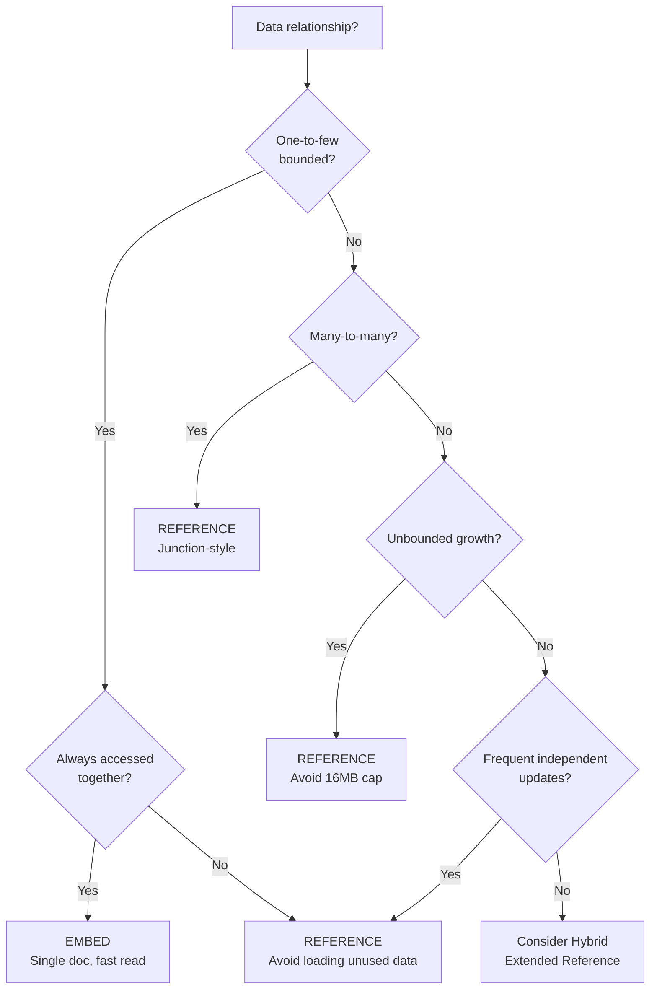
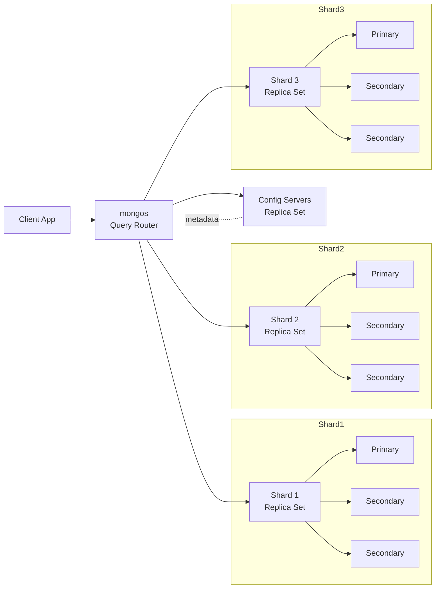
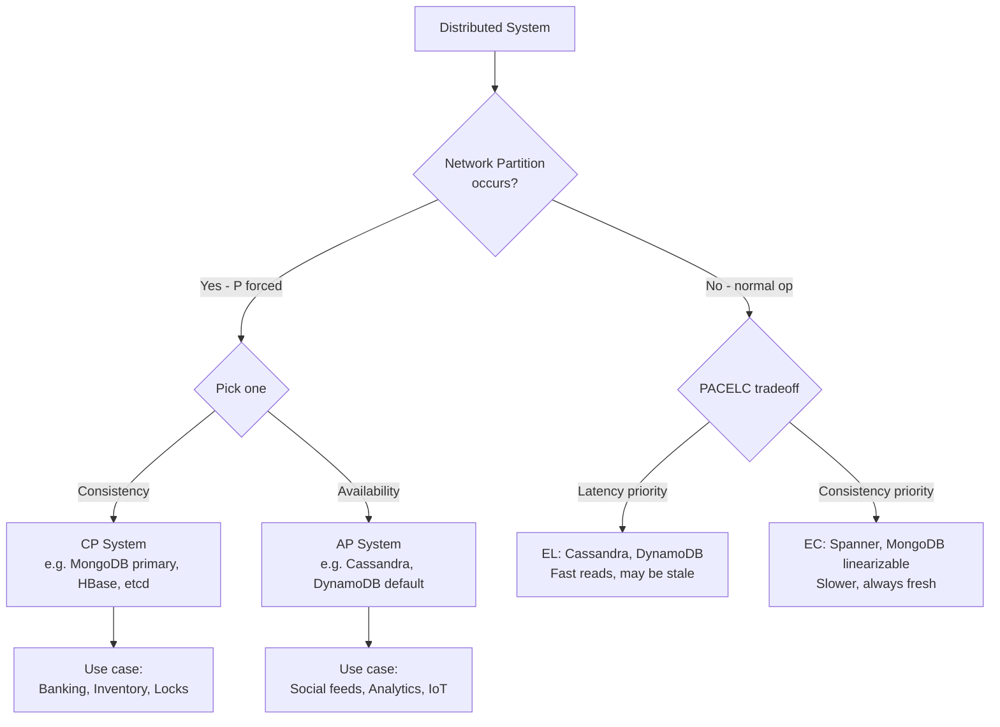

# NoSQL

NoSQL basically tab use hota hai jab tumhe schema flexibility chahiye, ya scale itna bada hai ki SQL feel slow lagta hai. Naam thoda misleading hai — "NoSQL" ka matlab "No SQL" nahi, balki "Not Only SQL" hai. Ye ek umbrella term hai jiske neeche document stores (MongoDB), key-value (Redis, DynamoDB), wide-column (Cassandra, HBase), aur graph DBs (Neo4j) sab aate hain. Har family ka apna sweet spot hai, but interview ke liye MongoDB-style document model sabse zyada poocha jata hai kyunki wo modern web/mobile apps ke saath naturally fit baith jata hai.

NoSQL ka rise mainly 2009-2012 ke around hua jab Web 2.0 companies (Google, Amazon, Facebook) ko realize hua ki relational DBs vertical scaling pe choke kar rahe hain. Joins distribute karne mushkil hain, schema migrations downtime maangti hain, aur user-generated content ka shape predictable nahi hota. Toh logon ne CAP theorem ko seriously le ke alag-alag tradeoffs vali databases banayi — Dynamo paper (Amazon, 2007) aur BigTable paper (Google, 2006) is movement ke seminal papers hain. Tu agar IIT-level interview de raha hai, in dono papers ke ideas ko surface-level samajhna must hai.

Is module mein hum teen pillars cover karenge: (1) Document model — kab embed karna hai kab reference, schema-less ka actual matlab kya hai. (2) MongoDB ka practical toolkit — CRUD se le ke aggregation pipeline aur sharding tak. (3) CAP theorem aur uska modern extension PACELC, jo distributed systems design ka backbone hai. Code MongoDB shell aur Node.js driver dono mein hoga, comments Hinglish mein, taaki tum interview mein bhi yahi vocabulary use kar sako.

---

## 1. Document model

### 1.1 Schema-less vs schema-flexible, embedding vs referencing — tradeoffs

#### Definition

Document model mein data ek "document" mein store hota hai — typically JSON ya BSON (Binary JSON) format mein. Ek document ek self-contained unit hai jo nested fields, arrays, aur sub-documents rakh sakta hai. Relational world ka row equivalent hai, but row se zyada powerful — kyunki row flat hota hai, document hierarchical.

"Schema-less" thoda marketing term hai. Practically MongoDB, Couchbase jaise document DBs **schema-flexible** hain, schema-less nahi. Matlab database engine schema enforce nahi karta, but tumhare application code ko to pata hona chahiye ki document mein kya fields hain. MongoDB 3.6+ mein **JSON Schema validators** add hue — tum ab bhi explicit schema laga sakte ho per-collection basis pe, but ye optional hai.

**Embedding** matlab related data ko ek hi document ke andar nest karna. **Referencing** matlab document A mein document B ki `_id` store karna (foreign key jaisa) aur runtime pe alag query maar ke fetch karna.

#### Why?

Schema-flexibility ka asli faayda agile development mein hai. Sochiye tum ek e-commerce app bana rahe ho — kal product mein "warranty_period" field add karni hai. SQL mein `ALTER TABLE products ADD COLUMN warranty_period INT;` chalana padega, jo bade tables pe lock le sakta hai aur production downtime de sakta hai. MongoDB mein bas naya field aage se documents mein insert karne lago, purane documents mein wo field absent rahega — application code mein default handle kar lo. Ye iterative development ko 5x faster bana deta hai jab requirements clear nahi hain.

Embedding ka faayda performance hai. Ek hi document fetch karne mein ek hi disk seek lagta hai. Agar tu ek user ka profile dikha raha hai aur uski last 5 addresses bhi chahiye, embedded array mein wo zero extra round-trip mein mil jayegi. Lekin embedding ka cost ye hai ki document size badhta jata hai (MongoDB ka hard limit 16MB per document hai), aur agar embedded data alag-alag jagah se share ho raha hai to duplication aur consistency issues aate hain.

Referencing tab use karte ho jab data truly many-to-many hai, ya jab embedded data ka size unbounded hai (jaise "user ke saare comments" — koi user 10 comment kare, koi 10 lakh kare). Reference store karke alag query maaro, ya MongoDB ke `$lookup` aggregation se join karo (relational join ka equivalent, but slower).

#### How?

```javascript
// MongoDB shell — embedding example
// User document mein addresses array embed kiya
// Reason: ek user ki addresses bounded hain (5-10 max)
// aur hamesha user ke saath hi fetch hoti hain

db.users.insertOne({
  _id: ObjectId(),
  name: "Ratnesh Kumar",
  email: "ratnesh@example.com",
  // embedded sub-documents — ye flat structure se zyada natural hai
  addresses: [
    {
      type: "home",
      line1: "Plot 42, Sector 21",
      city: "Noida",
      pincode: "201301",
      isDefault: true
    },
    {
      type: "office",
      line1: "Cyber Hub, Tower B",
      city: "Gurgaon",
      pincode: "122002",
      isDefault: false
    }
  ],
  // schema-flexible: kal "phone_verified" field add karna ho, no migration needed
  createdAt: new Date()
});

// Embedded data fetch karna — single round trip
// Pura user with addresses ek hi query mein
const user = db.users.findOne({ email: "ratnesh@example.com" });
// user.addresses[0].city => "Noida"

// Embedded array ke andar update karna — positional operator '$'
db.users.updateOne(
  { email: "ratnesh@example.com", "addresses.type": "home" },
  // $ matched array element ko refer karta hai
  { $set: { "addresses.$.pincode": "201305" } }
);
```

```javascript
// Referencing example — orders aur products
// Products ko alag collection mein rakha kyunki:
// 1. Product data multiple orders mein share hota hai
// 2. Product details (price, stock) frequently update hote hain
// 3. Embed karte to har order mein product ki copy honi padti — sync nightmare

db.products.insertOne({
  _id: ObjectId("64a1b2c3d4e5f6a7b8c9d0e1"),
  sku: "LAPTOP-DELL-XPS-13",
  name: "Dell XPS 13",
  price: 95000,
  stock: 47
});

db.orders.insertOne({
  _id: ObjectId(),
  userId: ObjectId("64a1b2c3d4e5f6a7b8c9d0a0"),
  // reference store kiya — sirf ID, pura product nahi
  items: [
    {
      productId: ObjectId("64a1b2c3d4e5f6a7b8c9d0e1"),
      quantity: 1,
      // priceAtPurchase ko embed kiya — kyunki ye historical snapshot hai
      // product.price kal change ho jaye, order ka price wahi rehna chahiye
      priceAtPurchase: 95000
    }
  ],
  totalAmount: 95000,
  status: "PENDING"
});

// Reference resolve karna — $lookup (left outer join equivalent)
db.orders.aggregate([
  { $match: { status: "PENDING" } },
  // unwind se array ko explode karte hain — har item alag document
  { $unwind: "$items" },
  {
    $lookup: {
      from: "products",            // jis collection se join karna hai
      localField: "items.productId", // local key
      foreignField: "_id",          // foreign key
      as: "productDetails"          // joined data is field mein aayega
    }
  }
]);
```

```javascript
// Node.js driver example — production-grade pattern
import { MongoClient } from 'mongodb';

const client = new MongoClient(process.env.MONGO_URI);
await client.connect();
const db = client.db('ecommerce');

// Hybrid pattern — kuch embed, kuch reference
// "Extended reference" pattern — frequently-needed fields duplicate karo
async function createOrder(userId, items) {
  // products fetch karke unka name+price embed karte hain order mein
  // Reason: order list page pe product name dikhana hai, lekin
  // har order ke liye products collection hit karna mehenga hai
  const productIds = items.map(i => i.productId);
  const products = await db.collection('products')
    .find({ _id: { $in: productIds } })
    .toArray();

  // map bana liya quick lookup ke liye
  const productMap = new Map(products.map(p => [p._id.toString(), p]));

  const orderItems = items.map(item => {
    const product = productMap.get(item.productId.toString());
    return {
      productId: product._id,           // reference (canonical link)
      productName: product.name,        // duplicated (for fast reads)
      priceAtPurchase: product.price,   // historical snapshot
      quantity: item.quantity
    };
  });

  return db.collection('orders').insertOne({
    userId,
    items: orderItems,
    totalAmount: orderItems.reduce((s, i) => s + i.priceAtPurchase * i.quantity, 0),
    createdAt: new Date()
  });
}
```

**Tradeoff cheat sheet:**

| Scenario | Embed | Reference |
|---|---|---|
| One-to-few (user → addresses) | Yes | No |
| One-to-many bounded (post → top 10 comments) | Yes | No |
| One-to-many unbounded (user → all transactions) | No | Yes |
| Many-to-many (students ↔ courses) | No | Yes |
| Data accessed together always | Yes | No |
| Data updated independently often | No | Yes |
| Data shared across documents | No | Yes |

#### Real-life Example

Zomato ke restaurant page sochiye. Restaurant document mein menu items embed kar sakte ho — kyunki ek restaurant ka menu typically 50-200 items ka hota hai (bounded), aur jab bhi restaurant page khologe, menu chahiye hi (always-together access). Menu ko alag collection mein daloge to har page load pe 2 queries chalengi — unnecessary latency.

But reviews? Reviews ko reference karna better. Ek popular restaurant pe 50,000 reviews ho sakte hain — embed karte to document 16MB cap cross kar jata, aur har review write par poora restaurant document rewrite hota. Reviews ko alag `reviews` collection mein rakho, `restaurantId` se index karo, aur paginated fetch karo.

Orders mein hybrid pattern — order ke time pe item ka name aur price snapshot le ke embed karo (denormalize), but `productId` bhi rakho reference ke liye taaki return/refund flow mein product details fetch ho sake.

#### Diagram



#### Interview Q&A

**Q: "Schema-less aur schema-flexible mein difference kya hai? MongoDB mein schema enforce kaise karoge?"**

Schema-less ka literal matlab hota hai database engine ko zero idea hai documents ke shape ka — ye early MongoDB ka marketing pitch tha. Reality mein har application ke paas implicit schema hota hi hai (application code mein), bas database wo enforce nahi karta. Schema-flexible ka matlab hai database optionally schema enforce kar sakta hai, but mandatory nahi banata. MongoDB 3.6 se `$jsonSchema` validator aa gaya — collection-level pe rules define kar sakte ho jaise "email field required hai aur string honi chahiye, age 0-150 ke beech int honi chahiye". Validation strict ya moderate ho sakti hai. Production mein main hamesha validator lagata hoon — ye type errors aur typos ko DB level pe pakad leta hai, aur new developer onboarding mein collection ka contract clear rehta hai.

Practical pattern ye hai ki application layer pe Mongoose ya Zod jaise schema libraries use karo (compile-time + runtime safety), aur DB pe `$jsonSchema` (last line of defense). Dono milke paranoid-level safety dete hain. Pure schema-less approach sirf prototyping mein theek hai — production mein ye eventually data quality nightmare ban jata hai. Ek baar maine ek startup pe dekha tha jahan 6 alag-alag formats mein "phone number" stored tha — `"+91-..."`, `"91..."`, `"..."`, with spaces, without — refactor karne mein 2 hafte lage. Validator hota to ye hota hi nahi.

**Q: "Embedding ka 16MB limit kyun? Aur agar limit cross ho rahi hai to kya karoge?"**

16MB limit BSON format ka design choice hai — MongoDB ke creators ne ye decide kiya tha to prevent runaway documents jo memory aur network choke kar dein. Working set memory mein fit hona chahiye, network packets reasonable size ke hone chahiye, aur replication lag minimize hona chahiye — ye sab is limit ke peeche reasons hain. Agar tum 16MB cross kar rahe ho to ye design smell hai — matlab tum embedding ka misuse kar rahe ho.

Solutions: (1) Bucket pattern — agar tum sensor readings ya time-series data store kar rahe ho, ek document mein 1 hour ke 60 readings rakho instead of poori day ke 86,400. Har bucket alag document, with timestamp range. (2) GridFS — large files (videos, big images) ke liye MongoDB ka built-in tool jo file ko 255KB chunks mein todke alag collection mein store karta hai. (3) Outright split — embed ko reference mein convert karo. Agar `post.comments` array bahut bada ho raha hai, alag `comments` collection banao with `postId` reference. Ye relational approach hai but at this scale wahi sahi hai.

**Q: "Ek e-commerce app design karo — products, orders, users — schema kaise plan karoge?"**

Pehle access patterns identify karunga (ye NoSQL design ka golden rule hai — query patterns drive schema, not entities). Users ko apni collection mein — bounded data jaise name, email, addresses (embed, max 5-10 addresses). Products alag collection — kyunki cross-cutting concern hain (catalog browsing, search, admin updates). Orders alag, with extended reference pattern — order items mein `productId` reference + `productName` + `priceAtPurchase` snapshot embed karunga. Ye duplication intentional hai — order historical record hai, product price kal change ho jaye order history ka snapshot wahi rehna chahiye.

Reviews ko alag collection — unbounded growth + heavy read traffic. Cart ko users ke andar embed karunga — single user ke cart mein bounded items, always-together access, aur cart abandoned ho jaye to bhi data choti si hai. Wishlist same logic se embed. Lekin agar wishlist 1000+ items support karni ho (rare), to alag collection. Inventory ko products ke andar `stock` field se manage karunga, atomic operations (`$inc`) ke saath. Notifications, audit logs — ye event-stream type data hai, alag collection with TTL index taaki purane data auto-delete ho.

**Q: "Polymorphic data MongoDB mein kaise handle karoge? Jaise ek `events` collection mein different event types — login, purchase, page_view — sab ek hi collection mein?"**

Ye MongoDB ka strong suit hai — flexible schema yahan shine karta hai. Main `type` field discriminator ki tarah use karunga aur `payload` ya `data` field mein type-specific fields rakhunga. Sab events common fields rakhenge — `eventId`, `userId`, `timestamp`, `type` — aur `data` object polymorphic hoga. Indexing carefully karna padega — `{ type: 1, timestamp: -1 }` compound index har event-type ki time-ordered query fast banayega.

Alternative pattern: per-type collections (`events_login`, `events_purchase`). Faayda — har collection ka apna optimized index. Nuksaan — cross-type queries (jaise "user ki last 50 activities chronologically") ka aggregation costly. Mein generally single collection prefer karta hoon with discriminator field, kyunki most queries either type-specific filter karti hain ya cross-type aggregation karti hain. Application layer pe type-specific TypeScript types/Mongoose discriminators use karke type safety bhi achi mil jati hai. Validation ke liye `$jsonSchema` mein conditional rules likh sakte ho — `if type == "purchase" then data.amount required`.

---

## 2. MongoDB basics

### 2.1 CRUD, aggregation pipeline, indexes, sharding intro

#### Definition

CRUD — Create, Read, Update, Delete — basic data operations. MongoDB mein ye `insertOne/insertMany`, `find/findOne`, `updateOne/updateMany`, `deleteOne/deleteMany` ke through hote hain. Sab operations BSON documents pe kaam karte hain aur JSON-like query language use karte hain.

**Aggregation pipeline** MongoDB ka data processing framework hai — Unix pipes ki tarah, har stage previous stage ka output input ki tarah leta hai aur transform karke aage bhejta hai. Stages hain `$match` (filter), `$group` (group by), `$project` (select fields), `$sort`, `$lookup` (join), `$unwind` (array explode), aur 30+ aur. Ye SQL ke `GROUP BY`, `JOIN`, window functions sab cover karta hai.

**Indexes** B-tree (default) ya specialized data structures (geospatial 2dsphere, text, hashed) hain jo query speed badhate hain. Bina index ke MongoDB collection scan karta hai — O(n). Index ke saath O(log n).

**Sharding** horizontal scaling ka mechanism hai — data ko multiple servers (shards) mein distribute karna based on shard key. Har shard ek replica set hota hai. `mongos` query router queries ko correct shard pe route karta hai.

#### Why?

CRUD obvious hai — bina ye nahi chal sakta. Lekin MongoDB CRUD mein nuances hain — `updateOne` vs `findOneAndUpdate`, atomic operators (`$set`, `$inc`, `$push`), upserts, write concerns. Ye sab samajhna zaroori hai kyunki ek galat update production mein data corrupt kar sakta hai.

Aggregation pipeline isliye matter karta hai kyunki real-world queries simple `find` se zyada hoti hain. "Last 30 days mein top 10 products by revenue, grouped by category" jaisi query SQL mein 30-line CTE banta hai — MongoDB mein ye 6-stage pipeline hai, parallel-execution-optimized, aur MongoDB engine isko shards pe distribute kar sakta hai.

Indexes life-saver hain. Maine ek startup mein dekha tha jahan ek `users.find({ email })` query 800ms le rahi thi 50 lakh users pe — `email` field pe index nahi tha. Index lagaya, query 2ms ho gayi. But indexes free nahi hain — write penalty padta hai (har insert/update mein index update karna), storage badhti hai, aur over-indexing query planner ko confuse karta hai.

Sharding tab chahiye jab single machine ka RAM/disk/CPU saturate ho raha ho. Pre-sharding, vertical scaling (bigger machine) try karte hain — sasta aur simple. Sharding operationally complex hai — shard key selection ek baar galat ho gaya to re-sharding nightmare hai (MongoDB 5.0 se zone-based re-sharding aaya, but still painful).

#### How?

```javascript
// ============ CRUD ============

// CREATE — single aur bulk
db.products.insertOne({
  sku: "PHN-IPHONE-15",
  name: "iPhone 15",
  price: 79900,
  tags: ["smartphone", "apple", "5g"],
  stock: 100
});

// Bulk insert — significantly faster than loop
db.products.insertMany([
  { sku: "PHN-S24", name: "Galaxy S24", price: 74999, stock: 50 },
  { sku: "PHN-PIX-8", name: "Pixel 8", price: 59999, stock: 30 }
], { ordered: false }); // ordered:false → ek fail ho to baki continue karein

// READ — find queries
// Equality + range + array element match
db.products.find({
  price: { $gte: 50000, $lte: 80000 },  // range
  tags: "smartphone",                     // array contains
  stock: { $gt: 0 }                       // in stock
});

// Projection — sirf zaroori fields fetch karo (network bandwidth bachta hai)
db.products.find(
  { price: { $lte: 80000 } },
  { name: 1, price: 1, _id: 0 }  // 1=include, 0=exclude
);

// Sort + limit + skip (pagination)
db.products.find({}).sort({ price: -1 }).skip(20).limit(10);
// NOTE: deep skip slow hai — large pagination ke liye cursor-based pagination use karo

// UPDATE — atomic operators zaroori hain
db.products.updateOne(
  { sku: "PHN-IPHONE-15" },
  {
    $set: { price: 78900 },           // field overwrite
    $inc: { stock: -1 },              // atomic decrement
    $push: { tags: "discounted" },    // array append
    $currentDate: { lastModified: true }
  }
);

// Upsert — exists to update, nahi to insert
db.inventory.updateOne(
  { sku: "PHN-IPHONE-15" },
  { $inc: { stock: 10 } },
  { upsert: true }
);

// DELETE
db.products.deleteOne({ sku: "PHN-OLD-MODEL" });
db.products.deleteMany({ stock: 0, lastSold: { $lt: ISODate("2023-01-01") } });

// ============ Aggregation Pipeline ============

// Real query: "Last 30 days mein top 5 categories by revenue"
db.orders.aggregate([
  // Stage 1: Filter — pipeline ka pehla stage hamesha $match hona chahiye
  // (taaki index use ho aur dataset jaldi reduce ho)
  {
    $match: {
      status: "COMPLETED",
      createdAt: { $gte: new Date(Date.now() - 30 * 24 * 60 * 60 * 1000) }
    }
  },
  // Stage 2: Array ko explode karo — har order item alag document
  { $unwind: "$items" },
  // Stage 3: Products se join — category lane ke liye
  {
    $lookup: {
      from: "products",
      localField: "items.productId",
      foreignField: "_id",
      as: "product"
    }
  },
  { $unwind: "$product" }, // $lookup array return karta hai, single object banao
  // Stage 4: Category-wise group, revenue sum
  {
    $group: {
      _id: "$product.category",
      totalRevenue: { $sum: { $multiply: ["$items.quantity", "$items.priceAtPurchase"] } },
      orderCount: { $sum: 1 },
      uniqueCustomers: { $addToSet: "$userId" } // set — duplicates hatao
    }
  },
  // Stage 5: Set ka size nikalo
  {
    $project: {
      category: "$_id",
      totalRevenue: 1,
      orderCount: 1,
      uniqueCustomerCount: { $size: "$uniqueCustomers" },
      _id: 0
    }
  },
  // Stage 6: Sort + limit
  { $sort: { totalRevenue: -1 } },
  { $limit: 5 }
]);

// ============ Indexes ============

// Single field index
db.users.createIndex({ email: 1 }, { unique: true });

// Compound index — order matters! ESR rule: Equality, Sort, Range
// Query: find({ status: "active", age: { $gte: 18 } }).sort({ createdAt: -1 })
// Optimal index:
db.users.createIndex({ status: 1, createdAt: -1, age: 1 });
// Reason: status (equality) → createdAt (sort) → age (range) — ESR

// Partial index — sirf kuch documents pe index (storage save karta hai)
db.orders.createIndex(
  { userId: 1, createdAt: -1 },
  { partialFilterExpression: { status: "ACTIVE" } }
);

// TTL index — documents auto-delete after expireAfterSeconds
db.sessions.createIndex(
  { lastActivity: 1 },
  { expireAfterSeconds: 3600 } // 1 hour
);

// Text index — full-text search
db.articles.createIndex({ title: "text", body: "text" });
db.articles.find({ $text: { $search: "mongodb sharding" } });

// Geospatial
db.places.createIndex({ location: "2dsphere" });
db.places.find({
  location: {
    $near: {
      $geometry: { type: "Point", coordinates: [77.2090, 28.6139] }, // Delhi
      $maxDistance: 5000 // 5km
    }
  }
});

// Index analysis — explain() se query plan dekho
db.users.find({ email: "ratnesh@example.com" }).explain("executionStats");
// "winningPlan.stage" === "IXSCAN" hona chahiye, "COLLSCAN" nahi
// "totalKeysExamined" ≈ "nReturned" hona chahiye (high selectivity)

// ============ Sharding (admin-side overview) ============

// Shard key choose karna sabse important decision hai
// Good shard key: high cardinality + even distribution + query-aligned

// Range-based sharding — default
sh.shardCollection("ecommerce.orders", { userId: 1, createdAt: 1 });
// userId pehla — same user ke orders same shard pe (data locality)
// createdAt second — time-based queries efficient

// Hashed sharding — even distribution but range queries inefficient
sh.shardCollection("analytics.events", { eventId: "hashed" });

// Zone sharding — geographic data routing
sh.addShardTag("shard0", "IN");
sh.addShardTag("shard1", "US");
sh.addTagRange("ecommerce.users", { region: "IN" }, { region: "IN￿" }, "IN");
```

```javascript
// Node.js — production patterns
import { MongoClient } from 'mongodb';

const client = new MongoClient(process.env.MONGO_URI, {
  maxPoolSize: 50,           // connection pool
  minPoolSize: 10,
  maxIdleTimeMS: 30000,
  serverSelectionTimeoutMS: 5000
});

// Transactions — ACID across multiple documents (replica set required)
async function transferMoney(fromUserId, toUserId, amount) {
  const session = client.startSession();
  try {
    await session.withTransaction(async () => {
      const accounts = client.db('bank').collection('accounts');

      // Atomic deduction with balance check
      const debitResult = await accounts.updateOne(
        { userId: fromUserId, balance: { $gte: amount } }, // balance check inline
        { $inc: { balance: -amount } },
        { session }
      );
      if (debitResult.modifiedCount === 0) {
        throw new Error('Insufficient balance'); // transaction abort hoga
      }

      await accounts.updateOne(
        { userId: toUserId },
        { $inc: { balance: amount } },
        { session }
      );

      // Audit log
      await client.db('bank').collection('transfers').insertOne({
        from: fromUserId, to: toUserId, amount, timestamp: new Date()
      }, { session });
    }, {
      readConcern: { level: 'snapshot' },
      writeConcern: { w: 'majority' },
      readPreference: 'primary'
    });
  } finally {
    await session.endSession();
  }
}

// Bulk operations — high-throughput writes
async function bulkUpsertProducts(products) {
  const bulk = client.db('shop').collection('products').initializeUnorderedBulkOp();
  for (const p of products) {
    bulk.find({ sku: p.sku }).upsert().updateOne({ $set: p });
  }
  return bulk.execute(); // single round-trip, parallel execution
}

// Change streams — real-time data updates (MongoDB 3.6+)
async function watchOrders() {
  const changeStream = client.db('shop').collection('orders').watch([
    { $match: { 'fullDocument.status': 'PLACED' } }
  ], { fullDocument: 'updateLookup' });

  for await (const change of changeStream) {
    // Notification system, cache invalidation, etc.
    console.log('New order:', change.fullDocument);
  }
}
```

#### Real-life Example

Swiggy ka backend imagine karo. Order placement flow mein:

1. **CRUD**: Order create hoti hai (`insertOne`), restaurant ko notify (`updateOne` on restaurant doc to push pending order), delivery partner assign hote hi `updateOne` on order doc to set partnerId.

2. **Aggregation**: Daily revenue report — `$match` (today's orders) → `$group` by restaurant → `$sort` by revenue. Restaurant dashboard pe live charts ye pipeline se aate hain.

3. **Indexes**: `{ userId: 1, createdAt: -1 }` — user ki order history fast load. `{ location: "2dsphere" }` — pas wale restaurants find. `{ status: 1, createdAt: 1 }` partial index sirf "PENDING" orders pe — order tracking dashboard fast.

4. **Sharding**: 50 crore orders/year scale pe single MongoDB instance handle nahi kar sakta. Shard key `{ city: 1, _id: 1 }` — har city ka data alag shard pe (Bangalore ka load Mumbai ke shard pe nahi padta), `_id` se even distribution within city. Query "Mumbai mein aaj ke orders" automatically sirf Mumbai shard hit karegi (shard targeting).

#### Diagram



#### Interview Q&A

**Q: "Aggregation pipeline aur SQL ke beech mapping karo. Konse stages SQL ke konse clauses ke equivalent hain?"**

`$match` SQL ka `WHERE` hai — filtering. `$group` matlab `GROUP BY` plus aggregate functions (`$sum`, `$avg`, `$min`, `$max`). `$project` is `SELECT` clause, fields decide karta hai. `$sort` obviously `ORDER BY`. `$limit` aur `$skip` `LIMIT/OFFSET`. `$lookup` `LEFT OUTER JOIN`. `$unwind` ka SQL mein direct equivalent nahi — ye array ko rows mein explode karta hai (PostgreSQL ka `unnest()` closest hai).

Lekin pipeline SQL se zyada powerful hai kuch jagah. `$facet` ek single pipeline mein multiple parallel sub-pipelines run karta hai — ek query mein "total count, top 10 products, price histogram" sab ek saath nikal sakte ho. `$bucket` aur `$bucketAuto` histogram bucketing automatic karte hain. Window functions (`$setWindowFields` from 5.0+) running totals, moving averages provide karte hain. Performance perspective se MongoDB pipeline shards pe parallel execute hota hai aur query optimizer reorder bhi karta hai (e.g., `$match` ko jitna possible ho upar push karta hai).

Practical tip: pipeline mein hamesha `$match` aur `$project` jaldi rakho — data volume kam hota jata hai pipeline mein, aur memory pressure ghatti hai. `$lookup` aur `$unwind` mehenge hain — agar bach sakte ho to denormalize karke avoid karo.

**Q: "Index design karo — `find({ status, category }).sort({ createdAt: -1 }).limit(20)` ke liye optimal index kya hoga aur kyun?"**

ESR rule lagayenge — Equality, Sort, Range. Yahan equality hai `status` aur `category` (dono exact match), sort hai `createdAt`, range nahi hai. Toh optimal index `{ status: 1, category: 1, createdAt: -1 }` hoga. Equality fields pehle (kyunki ye sabse selective hain aur scan range ko narrow karte hain), phir sort field (taaki MongoDB ko separate sort step na karna pade — index ke order mein hi data return ho jaye), phir range fields (jo result set ko further filter karte hain but index range scan banate hain).

Sort direction matter karta hai — `createdAt: -1` index `createdAt: 1` query pe bhi kaam karega kyunki MongoDB index dono direction mein traverse kar sakta hai. Lekin compound index mein, agar tum sort multi-field karte ho jaise `sort({ a: 1, b: -1 })`, to index `{ a: 1, b: -1 }` chahiye — pure direction match nahi to in-memory sort hoga.

Verify karne ke liye `explain("executionStats")` chalao. `winningPlan.stage` should be `IXSCAN` (index scan), not `COLLSCAN` (collection scan). `totalKeysExamined` `nReturned` ke close hona chahiye — agar 10000 keys examine ho rahe hain 20 documents ke liye to selectivity kharab hai. `executionTimeMillis` 10ms se kam hona chahiye well-indexed query ke liye on reasonable hardware.

**Q: "Sharding kab nahi karna chahiye? Aur agar shard key galat choose ho gaya to kya hota hai?"**

Sharding mat karo agar single replica set ka working set RAM mein fit ho raha hai, write throughput single primary se sambhal raha hai, aur disk space adequate hai. Premature sharding operational nightmare hai — backups complex, queries jo shard key target nahi karti scatter-gather (sab shards hit) banti hain, aur cross-shard transactions slow + 2-phase commit overhead. MongoDB ki recommendation hai — pehle vertical scale (bigger machine), phir read scaling (replica set with secondary reads), aur sharding last resort.

Galat shard key ka biggest issue **hot shards** hai. Agar tum `createdAt` pe shard karte ho monotonic-increasing field hone ke karan, sare nayi writes latest shard pe jayengi — distribution pointless ho jata hai. `_id` (ObjectId, monotonic) bhi same problem. Achi keys high cardinality + frequent values + query-aligned hoti hain. `{ userId: 1 }` accha hai user-centric apps mein. Compound `{ region: 1, userId: 1 }` aur better — geographic + per-user locality.

MongoDB 4.4 se **refinable shard keys** aaye (suffix add kar sakte ho), aur 5.0 se **resharding** (full key change with online operation) aaya — but ye hours-to-days lag sakta hai depending on data volume aur cluster ko stress karta hai. Ek baar production startup mein mujhe 800GB collection reshard karna pada — 36 hours laga, peak hours mein latency spike hua, aur disk usage 1.5x temporarily ho gaya. Toh shard key choice ko interview mein bahut seriously treat karna chahiye — design phase mein hi 3-4 query patterns sketch karke validate karo.

**Q: "Transactions MongoDB mein kab use karoge? SQL transactions se kya alag hai?"**

MongoDB 4.0 se multi-document transactions support hain (replica sets pe), 4.2 se sharded clusters pe bhi. Single-document operations hamesha atomic hote hain (BSON document level pe), toh simple cases mein transaction zaroori nahi. Use case multi-document atomicity hai — money transfer (debit one account, credit another), inventory + order (stock decrement + order create), audit logging with main operation.

SQL transactions se differences: (1) Default isolation level snapshot hai (similar to REPEATABLE READ), customizable nahi as much. (2) Transaction time limit default 60 seconds — agar lamba chala to abort. Ye intentional hai to prevent long-running transactions blocking. (3) Cross-shard transactions 2-phase commit use karte hain — slow, network-heavy. MongoDB ka philosophy hai "design schema such that you don't need transactions" — embedding aur denormalization naturally atomicity provide karte hain (single document update atomic hai).

Practical rule: agar tumne MongoDB use karte hue 10% se zyada operations transactions mein wrap karne pad rahe ho, to ya schema design wrong hai (over-normalized) ya tumhare use case ke liye relational DB better choice tha. Banking, financial systems jahan hard ACID chahiye — Postgres/MySQL pehle consider karo.

---

## 3. CAP theorem

### 3.1 Consistency, Availability, Partition tolerance — pick 2; PACELC extension

#### Definition

CAP theorem (Eric Brewer, 2000; formally proven by Gilbert-Lynch, 2002) states ki distributed system mein in teen guarantees mein se ek saath sirf do mil sakte hain:

- **Consistency (C)**: Har read sabse latest write return karega ya error. Sab nodes pe data ek hi time pe same dikhe (linearizability).
- **Availability (A)**: Har request response milegi (success ya failure), but timeout nahi hoga. System hamesha responsive.
- **Partition tolerance (P)**: Network partition (nodes ke beech communication break) hone par bhi system kaam karta rahega.

Real-world distributed systems mein partitions inevitable hain — network failures hote hi hain. Toh practically choice CP vs AP ke beech hoti hai. CA system "single node" jaisa hota hai — distributed nahi.

**PACELC** (Daniel Abadi, 2012) CAP ka realistic extension hai: **If P**artition, choose **A** or **C**; **E**lse (normal operation), choose **L**atency or **C**onsistency. Matlab partition na bhi ho, tab bhi tradeoff hai — strong consistency latency cost karti hai (multiple nodes ko coordinate karna padta hai).

#### Why?

CAP samajhna isliye zaroori hai kyunki har distributed database ek conscious choice hai is spectrum pe. MongoDB default mein CP-leaning hai (primary-based, strong consistency on primary reads). Cassandra AP-leaning hai (eventual consistency, multi-master). DynamoDB tunable hai. Agar tumhe nahi pata tumhari DB kahan baithi hai, tum production mein silent data loss ya unexpected unavailability face karoge.

PACELC ye realize karwata hai ki "consistency vs latency" tradeoff har distributed write pe hota hai, partition na bhi ho. Agar tumne strong consistency choose ki hai (`writeConcern: majority`, `readConcern: linearizable`), har operation mein cross-node round-trips lagenge — 5-50ms additional latency depending on geography. Eventual consistency me writes single node pe accept ho jate hain, async replicate hote hain — fast, but reader stale data dekh sakta hai 50ms-2sec ke liye.

Real-world consequences: banking ko strong consistency chahiye (account balance kabhi negative ya inflated nahi dikhna chahiye). Social media feed eventual consistency se kaam chal jata hai (5 second purana like count chalega). Inventory mein strict consistency vs latency tradeoff dynamic — flash sale mein eventual consistency ne Amazon ko 1999 mein famous overselling problem diya tha, jo unhone Dynamo paper mein discuss kiya.

#### How?

```javascript
// MongoDB — write concerns (consistency tuning)
import { MongoClient } from 'mongodb';
const client = new MongoClient(process.env.MONGO_URI);

// Write concern: w=1 (default) — primary acknowledge kare to ok
// Fast but agar primary crash ho before replication, write lost ho sakta hai
await db.collection('analytics').insertOne(
  { event: 'page_view', timestamp: new Date() },
  { writeConcern: { w: 1 } }
);

// Write concern: w='majority' — majority replica set members acknowledge karein
// Slower (network hop to secondaries) but durable
// Banking, orders ke liye yahi chahiye
await db.collection('transfers').insertOne(
  { from: 'A', to: 'B', amount: 1000 },
  { writeConcern: { w: 'majority', wtimeout: 5000 } }
);

// Read concern: kis level ka data padhna hai
// 'local' — primary se as-is (fast, may include unreplicated writes)
// 'majority' — sirf majority-acknowledged data (no rollback risk)
// 'linearizable' — strongest, sequential consistency (slowest)
const tx = await db.collection('accounts').findOne(
  { userId: 'A' },
  { readConcern: { level: 'majority' } }
);

// Read preference — kahan se padho
// 'primary' — strong consistency (default)
// 'secondary' — eventually consistent, primary load kam
// 'nearest' — lowest latency, geographically close
const products = await db.collection('products')
  .find({})
  .readPref('secondary') // catalog reads — staleness ok hai
  .toArray();

// Transactional write with strong guarantees
async function strongTransfer(from, to, amount) {
  const session = client.startSession();
  await session.withTransaction(async () => {
    // ... transfer logic ...
  }, {
    readConcern: { level: 'snapshot' },
    writeConcern: { w: 'majority', j: true }, // j: journaled to disk
    readPreference: 'primary'
  });
  await session.endSession();
}
```

```javascript
// Cassandra — AP example (Node.js driver)
// Cassandra default mein eventually consistent hai, but tunable
import { Client } from 'cassandra-driver';

const client = new Client({
  contactPoints: ['node1', 'node2', 'node3'],
  localDataCenter: 'datacenter1',
  keyspace: 'social'
});

// Consistency level QUORUM — majority replicas confirm karein
// (replication factor 3 mein, 2 nodes confirm karna padega)
await client.execute(
  'INSERT INTO posts (id, user_id, content) VALUES (?, ?, ?)',
  [postId, userId, content],
  { consistency: cassandra.types.consistencies.quorum }
);

// Consistency ONE — sirf 1 replica confirm kare
// Fast, but partition mein stale read ka risk
await client.execute(
  'SELECT * FROM posts WHERE user_id = ?',
  [userId],
  { consistency: cassandra.types.consistencies.one }
);

// Tunable per-query — same DB, different needs ke liye different levels
```

```javascript
// PACELC demonstration — latency cost of consistency
async function measureConsistencyCost() {
  const iterations = 1000;
  const doc = { _id: 'test-doc', counter: 0 };

  // Setup
  await db.collection('bench').insertOne(doc);

  // Test 1: Fast/Latency-optimized (PACELC: EL)
  console.time('w=1, readPref=secondary');
  for (let i = 0; i < iterations; i++) {
    await db.collection('bench').updateOne(
      { _id: 'test-doc' },
      { $inc: { counter: 1 } },
      { writeConcern: { w: 1 } }
    );
  }
  console.timeEnd('w=1, readPref=secondary');
  // Expected: ~2-5ms per op

  // Test 2: Consistency-optimized (PACELC: EC)
  console.time('w=majority, linearizable');
  for (let i = 0; i < iterations; i++) {
    await db.collection('bench').updateOne(
      { _id: 'test-doc' },
      { $inc: { counter: 1 } },
      { writeConcern: { w: 'majority', j: true } }
    );
    await db.collection('bench').findOne(
      { _id: 'test-doc' },
      { readConcern: { level: 'linearizable' } }
    );
  }
  console.timeEnd('w=majority, linearizable');
  // Expected: ~15-50ms per op (3-10x slower)
  // Ye real cost hai consistency ka — har request pe paid karna padta hai
}
```

#### Real-life Example

**ATM withdrawal (CP system)**: Tumhara bank account ek strong consistency system hai. Agar tum ATM se 5000 nikalo aur same time pe spouse online 5000 transfer kare, system overdraft prevent karega — koi ek operation fail hogi, but balance accurate rahega. Ye CP hai — partition mein agar bank's central system unreachable ho, ATM "service unavailable" dikhayega rather than allow karke later reconcile karna. Paisa critical hai, downtime acceptable hai.

**Instagram likes (AP system)**: Tum kisi photo ko like karte ho, like count update hota hai. Agar Instagram ka ek data center disconnect ho jaye, dusre data center pe like still register hoga — tumhe error nahi milega. Few seconds ke liye different users ko different counts dikh sakte hain (eventual consistency), but kisi ko service unavailable nahi milega. Ye AP hai — availability priority hai, perfect consistency afford kar sakte hain to sacrifice.

**Amazon DynamoDB (PACELC: PA/EL)**: DynamoDB by default partition hone pe availability prefer karta hai (PA), aur normal operation mein latency prefer karta hai over consistency (EL — eventual reads default). But tum strong consistency opt-in kar sakte ho `ConsistentRead=true` flag se — but that's 2x cost in capacity units aur higher latency. Amazon ne ye conscious tradeoff diya hai because most product catalog reads, recommendations, etc. mein eventual consistency theek hai.

**Google Spanner (CP, but with tricks)**: Spanner CP system hai globally distributed, but Google ne TrueTime API se atomic-clock-synchronized timestamps use karke linearizability achieve ki — fundamental physics ke against ja ke nahi, but expensive infrastructure se. Most companies Spanner-level consistency afford nahi kar sakti.

#### Diagram



#### Interview Q&A

**Q: "CAP theorem mein 'pick 2' galat kyun hai? Modern interpretation kya hai?"**

Original "pick 2" framing misleading hai kyunki real distributed systems mein P optional nahi hai — networks fail karte hi hain, light speed limit hai, packets lost hote hain. Toh practically choice C aur A ke beech hoti hai **partition ke time pe**. CA system jaise some define karte hain (e.g., "single-node Postgres") technically distributed hi nahi hai — toh CAP wahan applicable nahi.

Modern understanding: CAP ek **dynamic tradeoff** hai. Same system different operations mein different choices kar sakta hai. MongoDB mein tum per-query basis pe write/read concern adjust karte ho — money transfer pe `w:majority` (CP-leaning), analytics insert pe `w:1` (AP-leaning). Cassandra mein `consistency` parameter har query pe set hota hai. Ye realization important hai — "MongoDB CP hai" ya "Cassandra AP hai" oversimplification hai.

PACELC isliye relevant hai — partitions rare hain (months mein ek baar maybe), but latency-vs-consistency tradeoff har request pe hota hai. Real production mein 99% time PACELC ka 'ELC' part dominant decision hota hai. Interview mein agar tum sirf CAP discuss karoge, mid-level lagoge — PACELC mention karna senior-level signaling hai.

**Q: "MongoDB ko CP ya AP system bolun? Justify karo."**

MongoDB **default mein CP-leaning** hai with primary-replica architecture. Single primary writes accept karta hai, secondaries replicate karte hain. Partition hone pe — agar primary majority side mein hai, wo continue karta hai. Agar primary minority side mein, wo automatic step down ho jata hai (no writes accept) aur majority side ek naya primary elect karti hai. Minority side reads fail karenge (writeConcern majority requirement) — availability sacrifice, consistency preserved.

Lekin "CP-leaning" isliye kaha — tunable hai. Read preference `primary` use karoge to strong consistency, `secondary` use karoge to eventual consistency (AP-flavor). Write concern `w:1` AP-leaning hai (data lost ho sakta hai if primary fails before replication). Toh ek hi MongoDB cluster mein different collections, different operations CP ya AP behavior dikha sakti hain.

PACELC mein MongoDB ko **PC/EC** classify karte hain default settings pe — partition mein consistency, normal mein bhi consistency (over latency). Cassandra **PA/EL** hai — opposite. DynamoDB **PA/EL** by default but `ConsistentRead=true` se PC/EC achieve kar sakte ho. Interview mein iska practical answer hai: "MongoDB design CP-leaning hai with strong defaults towards consistency, but per-operation tunable hai PACELC spectrum pe."

**Q: "Eventual consistency ko application code mein kaise handle karoge? Stale reads ka problem solve karne ke patterns?"**

Eventual consistency means writes propagate karne mein time lagta hai (typically milliseconds, sometimes seconds). Patterns:

(1) **Read-your-own-writes (RYW)**: User ne kuch likha hai to usko apna data fresh dikhao. Implementation — same user ke reads primary se karo (write ke baad), ya session token track karke "after timestamp X" guarantee do. MongoDB mein causal consistency sessions ye automatic karte hain.

(2) **Compensation/Retry**: Stale read pe optimistic update karo, conflict detect ho to retry. Version numbers (`if-match` headers, optimistic locking with `version` field). Maine ek inventory system mein dekha tha — `decrementStock` operation `{ stock: { $gte: 1 } }` filter ke saath atomic decrement karta tha, fail ho to retry max 3 times. Eventual consistency tolerate kar liya, but logical correctness preserved.

(3) **CRDT (Conflict-free Replicated Data Types)**: Counters, sets, maps jaise data structures jo merge-friendly hain. Like-count for posts — last-write-wins ya additive counters use karo. Redis CRDT modules, Riak built-in CRDTs.

(4) **Idempotency**: Saari critical writes idempotent banao — duplicate request safe ho. Order placement mein client-generated UUID, server `upsert` ya `insert with unique constraint`. Eventual consistency mein retries inevitable hain, idempotency ke bina double-charge type bugs aate hain.

(5) **User-perceived consistency**: UI level pe "optimistic update" — user ka action immediate dikhao locally, background mein sync karo. Twitter ka like button — turant red ho jata hai, server confirmation alag se hota hai. Ye eventual consistency ko user se hide karta hai.

**Q: "Real-world example do jahan partition tolerance critical hai. Cross-region deployment mein kya considerations hain?"**

Cross-region deployment mein partition risk significant hai — undersea cables cut hote hain (2008 mein Mediterranean cable cuts ne Middle East internet outage diya tha), AWS regions ke beech network blips hote hain (2017 mein S3 us-east-1 outage), aur even within-region availability zones kabhi-kabhi disconnect hoti hain.

Practical considerations: (1) **Read locality** — har region mein read replicas rakho. Mumbai users Mumbai replica se padhein, US users US replica se. Latency drop dramatic — 200ms to 5ms. But consistency model accept karna padega (eventual ya bounded staleness). (2) **Write routing** — global writes complicated. Single primary in one region (simpler, but write latency for distant users) vs multi-master (complex conflict resolution). MongoDB Atlas global clusters zone-based sharding karte hain — Indian users ka data India shard pe primary, US users ka US shard pe.

(3) **Quorum tuning** — replication factor 3, write concern `majority` ka matlab 2 nodes confirm. Agar 3 regions hain, ye fast hai. But globally distributed mein 5 regions, `w:3` mean trans-Pacific latency. Tradeoff: durability vs latency. (4) **Failover automation** — primary region down ho to secondary region promote karna. Manual vs automated. Automated faster but split-brain risk (both regions thinking they're primary). External coordination service (Zookeeper, etcd) is must.

CAP-wise, cross-region deployments mostly AP-leaning hote hain practical reasons se — strong global consistency ka latency unacceptable hota hai consumer apps mein. Banking, financial systems jahan strong consistency must hai, single-region pe stay karte hain ya Spanner-level infrastructure invest karte hain. Interview mein ye nuanced answer "depends on business criticality" senior signaling hai — junior log "Cassandra is AP, MongoDB is CP" ratte hue answer dete hain bina context ke.

---

## Resources & further reading

**Foundational papers:**
- *Dynamo: Amazon's Highly Available Key-value Store* (DeCandia et al., 2007) — AP system ka blueprint, eventual consistency aur consistent hashing introduce kiye.
- *Bigtable: A Distributed Storage System for Structured Data* (Chang et al., 2006) — wide-column store ka foundation, HBase aur Cassandra is paper se inspired.
- *CAP Twelve Years Later: How the Rules Have Changed* (Eric Brewer, 2012) — CAP creator ka own update, "pick 2" misconception clarify kiya.
- *PACELC: A New Way to Think About Replicated Database Systems* (Daniel Abadi, 2012) — PACELC framework ka original paper.
- *Spanner: Google's Globally-Distributed Database* (Corbett et al., 2012) — TrueTime aur global consistency ka novel approach.

**Books:**
- *Designing Data-Intensive Applications* — Martin Kleppmann (the Bible for distributed systems)
- *MongoDB: The Definitive Guide* — Bradshaw, Brazil, Chodorow (3rd edition, official-quality)
- *Seven Databases in Seven Weeks* — Redmond & Wilson (NoSQL family tour)
- *Database Internals* — Alex Petrov (B-trees, LSM-trees, replication internals)

**Official documentation:**
- MongoDB Manual: https://www.mongodb.com/docs/manual/
- MongoDB University free courses (M001 Basics, M201 Performance, M312 Diagnostics)
- DynamoDB Developer Guide
- Cassandra documentation

**Talks & blogs:**
- Jepsen tests by Kyle Kingsbury (https://jepsen.io) — distributed DB consistency testing, eye-opening
- "What Every Programmer Should Know About Distributed Systems" — Kyle Kingsbury talks
- High Scalability blog (http://highscalability.com)
- Aphyr's blog — partition testing case studies
- MongoDB engineering blog — sharding internals, WiredTiger storage

**Tools to play with:**
- MongoDB Compass — GUI for MongoDB
- Robo 3T — lightweight MongoDB GUI
- Studio 3T — advanced query/migration tool
- MongoDB Atlas free tier — sandbox cluster for experimentation
- Local Docker — `docker run -d -p 27017:27017 mongo:7` for instant local

**Practice problems for interview prep:**
- LeetCode database problems (mostly SQL, but schema design transferable)
- Design ride-sharing schema (Uber/Ola style) — embed vs reference exercise
- Design Twitter/Instagram feed — fan-out on read vs write tradeoff
- Design Zomato restaurant search with geospatial + text indexes
- Design a TTL-based session store with sharding strategy
- Calculate optimal indexes for given query patterns (ESR rule application)
