# SQL (Deep)

Dekh bhai, SQL ek aisi language hai jo har backend engineer ko aati honi chahiye — chahe tu Node.js me kaam kare, ya Java Spring me, ya Python Django me, neeche kahin na kahin Postgres ya MySQL baith ke crores rows handle kar raha hota hai. SQL basically tumhe rows aur columns se baat karna sikhata hai. Database me crores rows hain — tu kaise sahi data nikale, fast, woh SQL me skill hai. Aur jab tu Flipkart, Razorpay, Swiggy jaisi product company me interview dene jata hai, toh log "SELECT * FROM users" wala SQL nahi puchhte — woh puchhte hain "isolation level kaunsa lagayega aur kyu", "yeh query slow hai, EXPLAIN ANALYZE dikha", "kya tu BCNF tak normalize karega ya 3NF pe ruk jaayega".

Is module me hum bilkul zameen se shuru karenge — CRUD basics — aur slowly tujhe le jaayenge advanced territory me: indexing internals (B-tree vs hash), transactions ke ACID properties aur isolation anomalies (dirty read, phantom read, etc.), subqueries ka correlated vs non-correlated drama, views vs materialized views ka tradeoff, triggers ka real production use, normalization forms (1NF se BCNF tak), ER diagrams, aur sabse important — query optimization aur EXPLAIN ANALYZE padhna. Har topic me real-life e-commerce/banking/social media examples honge, mermaid diagrams honge, aur interview Q&A honge jo tujhe FAANG aur Indian product unicorns me kaam aayenge.

Ek baat yaad rakhna — SQL likhna easy hai, SQL fast likhna hard hai. Production me 100ms ki query 10s ki ho jaati hai jab data badhta hai, agar tune index aur joins theek se nahi socha. Toh chal, shuru karte hain.

## 1. CRUD basics

### 1.1 SELECT, INSERT, UPDATE, DELETE — syntax, common pitfalls, RETURNING

#### Definition

CRUD ka full form hai Create, Read, Update, Delete. SQL me yeh respectively INSERT, SELECT, UPDATE, DELETE hote hain. Yeh chaaron statements DML (Data Manipulation Language) ka core hain. RETURNING clause Postgres ka ek powerful feature hai (MySQL me nahi hota directly, wahan LAST_INSERT_ID() ya OUTPUT use karte hain SQL Server me) jo INSERT/UPDATE/DELETE ke baad affected rows wapas return kar deta hai bina dobara SELECT maare.

#### Why?

Soch tu ek e-commerce app bana raha hai. User signup karta hai — INSERT chahiye. Login karta hai — SELECT chahiye to verify. Profile update karta hai — UPDATE chahiye. Account delete karta hai — DELETE (ya soft delete via UPDATE). Yeh chaar operations 90% backend code me chalte hain. Lekin galat likha toh:

- `UPDATE` bina `WHERE` ke = poori table update ho jaayegi (haan, yeh bahut log production me kar chuke hain, including senior engineers)
- `DELETE` bina `WHERE` = saari rows gone, FK cascade chala toh aur tables bhi affected
- `SELECT *` production me = unnecessary network bandwidth aur memory waste
- INSERT karke phir SELECT karna ID nikalne ke liye = 2 round trips, jab RETURNING se 1 me ho sakta tha

#### How?

```sql
-- ============ SELECT ============
-- Basic select: kisi table se columns nikalna
SELECT id, name, email, created_at
FROM users
WHERE status = 'active'           -- filter lagaya
  AND created_at > '2024-01-01'   -- date filter
ORDER BY created_at DESC           -- latest pehle
LIMIT 50 OFFSET 0;                 -- pagination ka pehla page

-- DISTINCT — duplicates hatao
SELECT DISTINCT city FROM users;

-- Aggregations ke saath
SELECT 
  city,
  COUNT(*) AS user_count,         -- har city me kitne users
  AVG(age) AS avg_age              -- average age
FROM users
GROUP BY city
HAVING COUNT(*) > 100              -- HAVING is for aggregate filter, WHERE is before group
ORDER BY user_count DESC;

-- ============ INSERT ============
-- Single row insert
INSERT INTO users (name, email, password_hash, created_at)
VALUES ('Ratnesh', 'ratnesh@example.com', '$2b$10$xyz...', NOW());

-- Multi-row insert (yeh single row se 5-10x faster hota hai for bulk)
INSERT INTO orders (user_id, product_id, qty, amount)
VALUES 
  (101, 5001, 2, 1499.00),
  (101, 5002, 1, 799.00),
  (102, 5003, 3, 2199.00);

-- INSERT ... SELECT (data copy karna ek table se doosri me)
INSERT INTO archived_orders (order_id, user_id, amount, archived_at)
SELECT id, user_id, amount, NOW()
FROM orders
WHERE created_at < NOW() - INTERVAL '1 year';

-- ON CONFLICT (Postgres ka upsert) — agar already exist karta hai toh kya karna hai
INSERT INTO user_preferences (user_id, theme, language)
VALUES (101, 'dark', 'hi')
ON CONFLICT (user_id)               -- agar primary/unique key clash ho
DO UPDATE SET 
  theme = EXCLUDED.theme,           -- naya value le lo
  language = EXCLUDED.language,
  updated_at = NOW();

-- RETURNING — yeh kamaal ka feature hai
INSERT INTO orders (user_id, amount, status)
VALUES (101, 1999.00, 'pending')
RETURNING id, created_at;           -- naye order ka id aur timestamp wapas mil gaya

-- ============ UPDATE ============
-- Basic update — WHERE bhul gaya toh game over
UPDATE users 
SET status = 'inactive', updated_at = NOW()
WHERE last_login < NOW() - INTERVAL '6 months';

-- Multiple columns ek hi UPDATE me
UPDATE products
SET price = price * 0.9,           -- 10% discount
    stock = stock - 1,
    updated_at = NOW()
WHERE id = 5001 AND stock > 0;     -- safety check, stock zero na ho

-- UPDATE with RETURNING — old aur new dono dekh sakte ho
UPDATE accounts
SET balance = balance - 500
WHERE id = 101 AND balance >= 500
RETURNING id, balance AS new_balance;

-- ============ DELETE ============
-- Hard delete
DELETE FROM session_tokens
WHERE expires_at < NOW();

-- Soft delete (recommend, especially for user data)
UPDATE users 
SET deleted_at = NOW(), email = CONCAT('deleted_', id, '@deleted.com')
WHERE id = 101;

-- DELETE with RETURNING (Postgres) — audit ke liye useful
DELETE FROM cart_items
WHERE user_id = 101 AND added_at < NOW() - INTERVAL '30 days'
RETURNING id, product_id, added_at;
```

**Common pitfalls jo tu actual production me face karega:**

1. **WHERE bhulna** — UPDATE/DELETE me sabse ghatak galti. Postgres me `BEGIN; UPDATE ...; ROLLBACK;` use karke pehle test kar.
2. **SELECT \*** — schema change hua toh app crash, plus bandwidth waste. Always explicit columns.
3. **NULL comparisons** — `WHERE col = NULL` kabhi nahi chalta, `IS NULL` use karo.
4. **Implicit type casting** — `WHERE user_id = '101'` jab user_id integer hai — Postgres me yeh slow ho jaata hai because index use nahi hota.
5. **Bulk INSERT vs row-by-row** — 10000 rows insert karne hain toh ek statement me daal, loop me mat daal — 100x speed difference.

#### Real-life Example: E-commerce order placement

Flipkart pe tu "Place Order" button dabata hai. Backend kya karta hai:

```sql
-- Step 1: Stock check (SELECT)
SELECT id, stock, price 
FROM products 
WHERE id IN (5001, 5002) FOR UPDATE;   -- row lock le liya, race condition se bachne ke liye

-- Step 2: Order create (INSERT with RETURNING)
INSERT INTO orders (user_id, total_amount, status, created_at)
VALUES (101, 2298.00, 'pending', NOW())
RETURNING id;     -- ID 7700001 mila

-- Step 3: Order items insert
INSERT INTO order_items (order_id, product_id, qty, price)
VALUES 
  (7700001, 5001, 2, 1499.00),
  (7700001, 5002, 1, 799.00);

-- Step 4: Stock kam karo (UPDATE)
UPDATE products 
SET stock = stock - 2 
WHERE id = 5001;

UPDATE products 
SET stock = stock - 1 
WHERE id = 5002;

-- Step 5: Cart se hatao (DELETE)
DELETE FROM cart_items 
WHERE user_id = 101 AND product_id IN (5001, 5002);
```

Yeh sab ek transaction me hota hai — agar beech me kuch fail hua toh saara rollback. Yeh aage transactions wale section me dekhenge.

#### Diagram

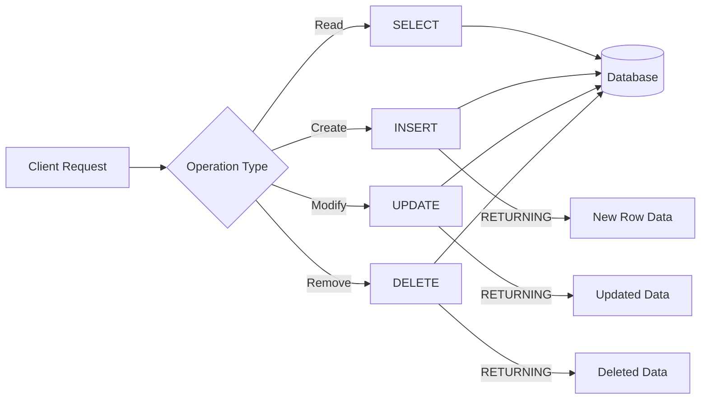

#### Interview

**Q: SELECT \* production me kyu nahi use karna chahiye?**

Dekh, teen reasons hain. Pehla — bandwidth. Agar tujhe sirf id aur name chahiye lekin tu \* karega toh poori row network pe aayegi, including BLOB, TEXT columns. Doosra — schema brittleness. Kal koi developer column add karega aur tera ORM mapping break ho jaayega ya tera frontend extra fields expose karega (security issue bhi). Teesra — query optimizer. Postgres covering indexes use kar sakta hai jab tu specific columns maange — \* karne pe heap fetch karna padega har baar. Senior engineers har query me explicit column list likhte hain, even agar 20 columns ho.

**Q: INSERT ke baad new ID kaise nikalega — RETURNING vs LAST_INSERT_ID() vs SELECT?**

Postgres me RETURNING clause sabse clean hai — atomic operation me hi ID mil jaata hai, no race condition, no extra round trip. MySQL me LAST_INSERT_ID() function hai jo connection-level state rakhta hai — yaani agar tune pool use kiya aur connection share hua toh galti ho sakti hai (although typically it's session-safe). SQL Server me OUTPUT clause hota hai. Agar RETURNING available hai use it — performance aur safety dono ke liye best.

**Q: UPDATE statement bina WHERE kabhi galti se chal gaya — kya karega?**

First — panic mat kar. Agar transaction me tha aur abhi commit nahi hua, ROLLBACK maar do, bach gaya. Agar commit ho gaya, toh point-in-time recovery (PITR) use kar — Postgres me WAL logs se restore kar sakte ho specific timestamp tak. Agar woh bhi nahi hai, last backup se restore karo. Production me prevent karne ke liye: (1) `safe-updates` mode MySQL me on rakho jo WHERE require karta hai key column pe, (2) Reviews mandatory karo prod queries pe, (3) Migration tools jaise Liquibase/Flyway use karo.

**Q: Bulk insert 1 lakh rows — kaise karega?**

Sabse pehle, 1 lakh INSERT statements mat likh — woh 1 lakh round trips hai. Options: (1) `INSERT INTO ... VALUES (...), (...), (...)` — multi-row insert, batch of 1000-5000 per statement. (2) Postgres me `COPY` command — sabse fast, CSV se directly load. (3) UNLOGGED table me daal pehle, then INSERT INTO real_table SELECT FROM unlogged — WAL skip ho jaata hai. (4) Indexes pehle drop kar, data load kar, phir indexes wapas bana — kyunki har INSERT pe index update hota hai. Production me main typically COPY use karta hu, isse 10 lakh rows 30 second me jaate hain.

---

## 2. Joins

### 2.1 INNER, LEFT, RIGHT, FULL OUTER, CROSS, SELF — visual venn-diagram explanations

#### Definition

JOIN ek aisa SQL operation hai jo do (ya zyada) tables ko connect karta hai kisi common column ke basis pe — usually foreign key. Real world me data normalize karke alag tables me rakha jaata hai (users, orders, products), aur jab tujhe combined info chahiye toh JOIN use hoti hai. Different join types data ko different tarike se merge karte hain.

- **INNER JOIN** — sirf matching rows dono tables se
- **LEFT JOIN** — left table ki saari rows + matching from right (na mile toh NULL)
- **RIGHT JOIN** — right table ki saari rows + matching from left
- **FULL OUTER JOIN** — dono tables ki saari rows, mismatch pe NULL
- **CROSS JOIN** — Cartesian product, har row of A x har row of B
- **SELF JOIN** — table apne aap se join, hierarchical data ke liye (employee-manager, etc.)

#### Why?

Database normalize karne pe data multiple tables me bat jata hai. Order me sirf user_id hota hai, name nahi. Agar tujhe "kis user ne kya order kiya" dikhana hai, toh `orders` aur `users` ko join karna padega. Bina join ke tu N+1 query problem me phasega — pehle orders nikalega, phir har order ke liye separate user query maarega — 1000 orders = 1001 queries. Join karke ek query me kaam ho jaata hai.

#### How?

```sql
-- Schema setup ke liye assume karo:
-- users(id, name, city)
-- orders(id, user_id, product_id, amount, created_at)
-- products(id, name, category)

-- ============ INNER JOIN ============
-- Sirf woh users jinhone order kiya hai
SELECT u.name, o.id AS order_id, o.amount
FROM users u
INNER JOIN orders o ON u.id = o.user_id
WHERE o.created_at > '2024-01-01';

-- ============ LEFT JOIN ============
-- Saare users + agar order kiya toh details, warna NULL
-- Yeh sabse common hai — "saare users dikha, with their order count"
SELECT 
  u.id,
  u.name,
  COUNT(o.id) AS total_orders,        -- jo users ne order nahi kiya, unke liye 0
  COALESCE(SUM(o.amount), 0) AS lifetime_value
FROM users u
LEFT JOIN orders o ON u.id = o.user_id
GROUP BY u.id, u.name;

-- ============ RIGHT JOIN ============
-- Yeh practically LEFT JOIN ka mirror hai. Senior devs RIGHT JOIN avoid karte hain
-- because mental model confusing hota hai. Ise LEFT JOIN se rewrite karo.
SELECT u.name, o.amount
FROM users u
RIGHT JOIN orders o ON u.id = o.user_id;
-- Same as:
SELECT u.name, o.amount
FROM orders o
LEFT JOIN users u ON u.id = o.user_id;

-- ============ FULL OUTER JOIN ============
-- Dono ki saari rows. Useful for finding mismatches.
-- Example: students aur courses dono dikha, even if student no course or course no student
SELECT s.name, c.title
FROM students s
FULL OUTER JOIN enrollments e ON s.id = e.student_id
FULL OUTER JOIN courses c ON e.course_id = c.id;

-- Orphan detection — jin orders me user delete ho gaya
SELECT o.*
FROM orders o
LEFT JOIN users u ON o.user_id = u.id
WHERE u.id IS NULL;          -- LEFT JOIN + IS NULL = "right me match nahi mila"

-- ============ CROSS JOIN ============
-- Cartesian product — har row x har row
-- 100 users x 50 products = 5000 rows
-- Yeh dangerous hai bina filter ke! Use case: combinations generate karna
SELECT u.name, p.name AS product
FROM users u
CROSS JOIN products p
WHERE p.category = 'recommended';

-- Practical CROSS JOIN: dates fill karna missing days me
SELECT d.date, COALESCE(s.revenue, 0) AS revenue
FROM generate_series('2024-01-01'::date, '2024-12-31', '1 day') d(date)
LEFT JOIN sales s ON s.date = d.date;

-- ============ SELF JOIN ============
-- Employee-manager hierarchy
-- employees(id, name, manager_id)
SELECT 
  e.name AS employee,
  m.name AS manager
FROM employees e
LEFT JOIN employees m ON e.manager_id = m.id;

-- Find users in same city
SELECT u1.name, u2.name, u1.city
FROM users u1
INNER JOIN users u2 ON u1.city = u2.city AND u1.id < u2.id;
-- u1.id < u2.id — duplicates aur self-pairs avoid karne ke liye

-- ============ Multiple JOINs chained ============
-- E-commerce: order details with user and product
SELECT 
  u.name AS customer,
  o.id AS order_id,
  p.name AS product,
  oi.qty,
  oi.price
FROM orders o
INNER JOIN users u ON o.user_id = u.id
INNER JOIN order_items oi ON oi.order_id = o.id
INNER JOIN products p ON oi.product_id = p.id
WHERE o.created_at > NOW() - INTERVAL '30 days';
```

**Pitfalls jo tu rookie banke karega:**

1. **Cartesian by mistake** — JOIN condition bhul gaya, do tables CROSS JOIN ho gayi, 1 lakh x 1 lakh = 10 billion rows. Database hang.
2. **WHERE vs ON in OUTER JOIN** — LEFT JOIN me WHERE clause right table pe lagaya toh effectively INNER JOIN ban gaya. Filter ON me dalna padega.
3. **NULL matching** — `t1.col = t2.col` NULL=NULL ko match nahi karta. Use `IS NOT DISTINCT FROM` ya `COALESCE`.
4. **Duplicates** — agar join key unique nahi hai, rows multiply hote hain. SUM/COUNT galat ho jaata hai.

#### Real-life Example: Banking — joint accounts statement

Bank me tujhe customer ka full account statement chahiye, including:
- Customer details
- Account info
- Transactions
- Counterparty info (kis ko paisa bheja)

```sql
SELECT 
  c.name AS customer,
  a.account_number,
  a.balance,
  t.txn_id,
  t.amount,
  t.txn_type,
  COALESCE(c2.name, 'External') AS counterparty
FROM customers c
INNER JOIN accounts a ON a.customer_id = c.id
LEFT JOIN transactions t ON t.account_id = a.id
LEFT JOIN accounts a2 ON a2.id = t.counterparty_account_id
LEFT JOIN customers c2 ON c2.id = a2.customer_id
WHERE c.id = 101
  AND t.txn_date BETWEEN '2024-01-01' AND '2024-12-31'
ORDER BY t.txn_date DESC;
```

#### Diagram

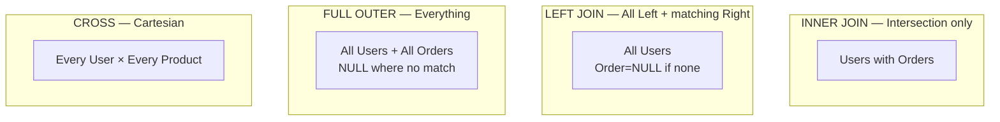

#### Interview

**Q: LEFT JOIN aur INNER JOIN me practical difference kab matter karta hai?**

Jab tujhe "missing data" track karna ho. Example: tu dashboard bana raha hai jo dikhata hai "saare users aur unke order counts". INNER JOIN se sirf woh users aayenge jinhone order kiya — jo users signup karke kabhi order nahi kiya, woh disappear ho jaayenge. LEFT JOIN se saare users aayenge, with COUNT(orders) = 0 for non-buyers. Doosra use case — orphan detection. `LEFT JOIN parent ON ... WHERE parent.id IS NULL` se woh child rows milti hain jinka parent delete ho gaya. Yeh data integrity audits me bahut kaam aata hai.

**Q: Yeh query slow kyu hai?**

```sql
SELECT u.name, COUNT(o.id) 
FROM users u LEFT JOIN orders o ON u.id = o.user_id
WHERE o.created_at > '2024-01-01' GROUP BY u.id;
```

Trick question hai. WHERE clause LEFT JOIN ko effectively INNER JOIN bana raha hai — kyunki jis user ka order nahi hai, uska o.created_at NULL hoga aur WHERE clause use filter out kar dega. Agar tu actually LEFT semantic chahta hai, condition ON clause me daal: `LEFT JOIN orders o ON u.id = o.user_id AND o.created_at > '2024-01-01'`. Slowness ka ek aur reason — orders.user_id pe index nahi hoga toh full table scan hoga. EXPLAIN ANALYZE chala ke nested loop ya hash join dekh.

**Q: SELF JOIN vs Recursive CTE — kab kya?**

SELF JOIN ek level deep ke liye theek hai — employee aur direct manager. Lekin agar tujhe poori hierarchy chahiye (CEO → VP → Director → Manager → Engineer), toh recursive CTE use kar:

```sql
WITH RECURSIVE org_tree AS (
  SELECT id, name, manager_id, 1 AS level
  FROM employees WHERE manager_id IS NULL
  UNION ALL
  SELECT e.id, e.name, e.manager_id, ot.level + 1
  FROM employees e JOIN org_tree ot ON e.manager_id = ot.id
)
SELECT * FROM org_tree;
```

Yeh adjacency list traversal hai. Alternatively, Closure Table pattern ya Materialized Path use kar sakte ho — woh design choice hai.

**Q: 4 tables ka JOIN — order kaise decide karega query plan?**

Postgres ka query planner cost-based hai — woh statistics dekhke decide karta hai (ANALYZE chala ke updated stats rakho). Tu hint nahi de sakta directly (MySQL me STRAIGHT_JOIN hota hai). Lekin tu help kar sakta hai: (1) Smallest table ko driver banane ka try karega planner usually, (2) join columns pe indexes honi chahiye, (3) WHERE me selective filter daal de — kam rows filter karke planner ko nudge kar. Agar tu sure hai planner galat kar raha hai, `SET enable_nestloop = off` etc. flags hain testing ke liye, lekin production me avoid karo.

---

## 3. Indexing

### 3.1 B-tree, hash, composite, covering, partial — when each helps, when each hurts

#### Definition

Index database ki ek auxiliary data structure hai jo rows ko fast locate karne me help karta hai — bilkul book ke index jaisa. Bina index ke `WHERE id = 5001` query poori table scan karegi (sequential scan). Index ke saath O(log n) me row mil jaati hai. Lekin index muft ka nahi hai — har INSERT/UPDATE/DELETE pe index bhi update karna padta hai, plus disk space lagta hai. Toh indexes strategically banao.

Types:
- **B-tree** — default, sorted, range queries, equality, ORDER BY — sab support karta hai
- **Hash** — sirf equality (=), range nahi, but very fast for exact lookup
- **Composite** — multiple columns ka combined index — left-most prefix rule
- **Covering** — query ke saare columns index me hi hain, table touch nahi karna padta
- **Partial** — sirf certain rows pe index (WHERE condition), space bachta hai
- Aur bhi: GIN/GiST (full-text, JSONB), BRIN (huge sequential data)

#### Why?

100 crore rows wali users table me `WHERE email = 'x@y.com'` chala — bina index ke 100 crore rows scan karegi, 30 second lagega. B-tree index ke saath log2(10^9) ≈ 30 disk reads, 5 ms me ho jaayega. Yeh 6000x speedup hai. Production me without indexes nothing scales.

Lekin galat indexes mat banao:
- Har column pe index = INSERT slow ho jaata hai (5 columns indexed = 5 trees update)
- Cardinality kam wale columns pe index useless (gender column on M/F — 50% rows match, full scan hi tez)
- Composite index galat order me = waste

#### How?

```sql
-- ============ B-tree (default) ============
-- Postgres me ye default hai
CREATE INDEX idx_users_email ON users(email);

-- B-tree range queries bhi handle karta hai
CREATE INDEX idx_orders_created ON orders(created_at);
-- Yeh queries fast hongi:
SELECT * FROM orders WHERE created_at > '2024-01-01';
SELECT * FROM orders WHERE created_at BETWEEN ... AND ...;
SELECT * FROM orders ORDER BY created_at DESC LIMIT 10;

-- ============ Hash index ============
-- Sirf equality, range nahi
CREATE INDEX idx_session_token ON sessions USING HASH (token);
-- Use case: session lookup by random token, never range query
SELECT * FROM sessions WHERE token = 'abc123xyz';

-- ============ Composite index ============
-- Multiple columns
CREATE INDEX idx_orders_user_status ON orders(user_id, status);

-- Yeh queries fast hongi (left-most prefix rule):
SELECT * FROM orders WHERE user_id = 101;                       -- index use ✓
SELECT * FROM orders WHERE user_id = 101 AND status = 'paid';   -- index use ✓
-- Lekin yeh slow:
SELECT * FROM orders WHERE status = 'paid';                     -- index use NAHI ✗
-- Reason: composite index sorted by user_id first, status second.
-- status alone search = full scan of "phone book by city, then street".

-- ============ Covering index ============
-- INCLUDE clause se non-key columns add kar sakte ho (Postgres 11+)
CREATE INDEX idx_users_email_covering ON users(email) INCLUDE (name, city);
-- Yeh query "index-only scan" karegi — table heap touch nahi karegi:
SELECT name, city FROM users WHERE email = 'x@y.com';

-- ============ Partial index ============
-- Sirf active users pe index banao, deleted/inactive ko skip karo
CREATE INDEX idx_users_active_email ON users(email) 
WHERE deleted_at IS NULL AND status = 'active';

-- Use case: 1 crore users me 5 lakh active. Index size 20x chhota.
-- Lekin query me bhi same WHERE include karna padega:
SELECT * FROM users WHERE email = 'x@y.com' 
  AND deleted_at IS NULL AND status = 'active';

-- ============ Functional/Expression index ============
-- Case-insensitive search
CREATE INDEX idx_users_email_lower ON users(LOWER(email));
SELECT * FROM users WHERE LOWER(email) = 'ratnesh@example.com';

-- ============ Unique index ============
-- Constraint ke saath
CREATE UNIQUE INDEX idx_users_email_unique ON users(email);

-- ============ GIN index for JSONB ============
CREATE INDEX idx_user_prefs ON users USING GIN (preferences);
SELECT * FROM users WHERE preferences @> '{"theme": "dark"}';

-- ============ Index ki health dekho ============
-- Postgres me unused indexes find karo
SELECT 
  schemaname, tablename, indexname,
  idx_scan AS times_used,
  pg_size_pretty(pg_relation_size(indexrelid)) AS size
FROM pg_stat_user_indexes
WHERE idx_scan = 0;        -- jo kabhi use nahi hua, drop kar do
```

**Kab index help karta hai:**

- High selectivity column (email, phone, user_id) — ek query thodi rows return kare
- ORDER BY columns
- JOIN columns (foreign keys)
- WHERE clauses me used columns
- Range queries (B-tree)

**Kab index hurt karta hai:**

- Low cardinality (gender, boolean) — full scan tez
- Small tables (< 1000 rows) — full scan instant
- Write-heavy tables jaha read kam ho — index maintenance overhead
- Galat order composite index
- Function laga ke query: `WHERE LOWER(email) = ...` me normal `email` index nahi use hoga, expression index chahiye

#### Real-life Example: Social media feed query

Instagram-like app me feed query:

```sql
-- Bina index ke yeh 10 second lega 1 crore posts wali table me
SELECT p.id, p.content, p.created_at, u.name, u.avatar
FROM posts p
INNER JOIN users u ON u.id = p.user_id
WHERE p.user_id IN (
  SELECT followed_id FROM follows WHERE follower_id = 101
)
AND p.created_at > NOW() - INTERVAL '7 days'
ORDER BY p.created_at DESC
LIMIT 50;

-- Required indexes:
CREATE INDEX idx_follows_follower ON follows(follower_id);
CREATE INDEX idx_posts_user_created ON posts(user_id, created_at DESC);
-- ^ Yeh composite index magic karta hai:
-- (1) user_id se filter (kis follow pe)
-- (2) created_at DESC se sort already done in index
-- (3) LIMIT 50 = sirf 50 entries scan
-- 10 second se 50 millisecond ho jaata hai
```

#### Diagram

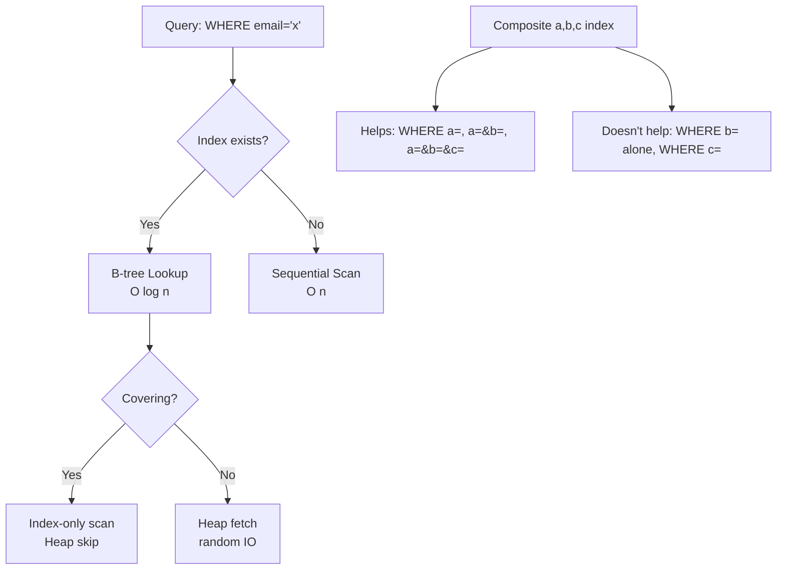

#### Interview

**Q: Composite index `(a, b, c)` kab kab use hota hai?**

Left-most prefix rule. Index use hoga jab WHERE me hai: (a), (a, b), (a, b, c), aur ORDER BY a, ORDER BY a,b. NAHI use hoga: (b), (c), (b, c) alone — kyunki B-tree pehle a se sort hai, b ke liye seek karne ka koi point nahi without a. Agar tujhe (b) alone bhi tez chahiye, toh separate index `(b)` bana ya order ulta kar de `(b, a, c)` agar dono use cases support karne hain. Real interview tip: yeh question 9/10 product company me aata hai, especially Razorpay, PhonePe, Swiggy — kyunki payments/orders me composite indexes critical hain.

**Q: Hash index vs B-tree — Postgres me default kya hai aur kyu?**

Default B-tree hai. Reasons: (1) B-tree equality bhi support karta hai aur range bhi — versatile. (2) Hash index Postgres me historically WAL-logged nahi tha (replication issue) — Postgres 10+ me yeh fix hua. (3) Hash sirf `=` use case me marginally faster hai but jab tak collision nahi ho. Practically 99% cases me B-tree hi use karte hain. Hash use kar sakte ho only when tu sure hai column pe sirf equality lookups honge aur benchmark me actual diff dikha.

**Q: Index banane se INSERT slow kyu hota hai?**

Har index ek separate B-tree hai. INSERT pe naya row table me jaata hai (heap), aur har index ke tree me bhi naya entry add karna padta hai — log(n) operation per index. 5 indexes hain toh 5 tree updates. UPDATE me bhi same — agar indexed column update kiya, old position se hata ke new position me daalna padta hai (Postgres me HOT update kabhi-kabhi optimize karta hai). Practical impact: write-heavy tables (e.g., logs, events) me sirf 1-2 critical index rakho, baaki nahi. Read-heavy tables (catalog, products) me 5-10 indexes bhi acceptable.

**Q: Yeh query slow hai kyu?** `SELECT * FROM orders WHERE LOWER(email) = 'x@y.com'` — `email` pe index hai.

Index `email` pe hai, lekin query `LOWER(email)` pe filter kar rahi hai. Function apply hone se Postgres B-tree ka use nahi kar sakta — kyunki tree sorted hai original `email` ke according, LOWER(email) ke according nahi. Solution: (1) Functional index banao: `CREATE INDEX idx ON orders(LOWER(email))`. (2) Ya app level pe email ko hamesha lowercase store karo. Production me option 2 better hai consistency ke liye, aur store karte time CHECK constraint laga do `CHECK (email = LOWER(email))`.

---

## 4. Transactions (ACID)

### 4.1 ACID properties, isolation levels (READ UNCOMMITTED → SERIALIZABLE), anomalies (dirty/non-repeatable/phantom)

#### Definition

Transaction ek logical unit of work hai jo multiple SQL statements ko ek atomic group bana deta hai — ya saare succeed, ya saare fail. Bank transfer ka classic example: A ka 500 minus, B ka 500 plus. Beech me crash hua toh dono ya kuch nahi.

ACID = Atomicity, Consistency, Isolation, Durability:
- **Atomicity** — all or nothing, partial state nahi
- **Consistency** — DB constraints (FK, CHECK, NOT NULL) hamesha valid
- **Isolation** — concurrent transactions ek dusre ko interfere na karein
- **Durability** — commit ke baad data crash-proof, disk pe persisted

Isolation levels (kam strict se zyada strict):
1. **READ UNCOMMITTED** — dusri transaction ka uncommitted data dikh sakta hai (dirty read)
2. **READ COMMITTED** — sirf committed data dikhta hai (Postgres default)
3. **REPEATABLE READ** — same query ka same result transaction me (MySQL InnoDB default)
4. **SERIALIZABLE** — transactions ek ke baad ek hue jaise hi result

Anomalies:
- **Dirty Read** — committed na hue change pad liya
- **Non-repeatable Read** — same row dobara padha, value alag (kisi ne update kiya beech me)
- **Phantom Read** — same WHERE pe dobara query, naye rows dikhe (kisi ne INSERT kiya)
- **Lost Update** — do transactions same row update kar rahe, ek ka change overwrite

#### Why?

Banking, e-commerce, payments — sab me consistent state critical hai. Bina transactions ke:
- Order place hua, payment fail — order ban gaya, paisa nahi katta
- A se B ko transfer — A ka katta, B ko nahi mila (network drop ho gaya)
- Concurrent users same product khareed rahe — stock 1 hai, dono ko bech diya

Isolation level decide karta hai performance vs correctness ka tradeoff. SERIALIZABLE strongest hai but slowest. READ COMMITTED tez but anomalies allow karta hai.

#### How?

```sql
-- ============ Basic Transaction ============
BEGIN;        -- transaction start (also: START TRANSACTION)

UPDATE accounts SET balance = balance - 500 WHERE id = 101;
UPDATE accounts SET balance = balance + 500 WHERE id = 102;

-- Sab theek hai? COMMIT karo
COMMIT;
-- Galti? ROLLBACK
-- ROLLBACK;

-- ============ SAVEPOINT — partial rollback ============
BEGIN;
INSERT INTO orders (...) VALUES (...);

SAVEPOINT before_items;
INSERT INTO order_items (...) VALUES (...);  -- yeh fail ho gaya
-- ROLLBACK TO SAVEPOINT before_items;        -- bas yeh hatao, order rakho
COMMIT;

-- ============ Isolation level set karo ============
-- Per-session
SET TRANSACTION ISOLATION LEVEL SERIALIZABLE;

-- Per-transaction
BEGIN ISOLATION LEVEL REPEATABLE READ;
SELECT * FROM accounts WHERE id = 101;
-- ... kuch logic
SELECT * FROM accounts WHERE id = 101;   -- guaranteed same value as above
COMMIT;

-- ============ Pessimistic locking — SELECT FOR UPDATE ============
BEGIN;
SELECT balance FROM accounts WHERE id = 101 FOR UPDATE;
-- Ab is row pe lock hai, koi aur transaction wait karega
-- Calculate naya balance, check sufficient
UPDATE accounts SET balance = balance - 500 WHERE id = 101;
COMMIT;     -- lock release

-- SELECT FOR SHARE — read lock, aur transactions read kar sakte but update nahi
SELECT * FROM accounts WHERE id = 101 FOR SHARE;

-- SKIP LOCKED — job queue pattern me bahut useful
-- Multiple workers ek hi queue se jobs uthate hain
BEGIN;
SELECT id, payload FROM job_queue 
WHERE status = 'pending'
ORDER BY created_at 
LIMIT 1
FOR UPDATE SKIP LOCKED;     -- jo locked hai woh skip, agla mil jaayega
-- Process job
UPDATE job_queue SET status = 'done' WHERE id = ?;
COMMIT;

-- ============ Optimistic locking — version column ============
-- Lock nahi lete, balance pe version check
BEGIN;
SELECT balance, version FROM accounts WHERE id = 101;
-- Application me calculate kiya new_balance, version_was = 5
UPDATE accounts 
SET balance = ?, version = version + 1
WHERE id = 101 AND version = 5;          -- agar koi aur ne update kar diya, yeh 0 rows update karega
-- App check karega: agar 0 rows updated, retry karo
COMMIT;

-- ============ Anomaly demonstrations ============
-- DIRTY READ scenario (only at READ UNCOMMITTED, jo Postgres me hota hi nahi)
-- T1: BEGIN; UPDATE accounts SET balance = 100 WHERE id = 1;  (no commit)
-- T2: SELECT balance FROM accounts WHERE id = 1;  -- READ UNCOMMITTED me 100 dikhega
-- T1: ROLLBACK;
-- T2 ne phantom data padha jo kabhi tha hi nahi.

-- NON-REPEATABLE READ
-- T1: BEGIN; SELECT balance FROM accounts WHERE id = 1;  -- 1000
-- T2: BEGIN; UPDATE accounts SET balance = 500 WHERE id = 1; COMMIT;
-- T1: SELECT balance FROM accounts WHERE id = 1;  -- READ COMMITTED me 500 (changed!)
-- REPEATABLE READ aur SERIALIZABLE me 1000 hi rahega T1 ke andar.

-- PHANTOM READ
-- T1: BEGIN; SELECT COUNT(*) FROM orders WHERE user_id = 101;  -- 5
-- T2: INSERT INTO orders (user_id, ...) VALUES (101, ...); COMMIT;
-- T1: SELECT COUNT(*) FROM orders WHERE user_id = 101;  -- 6 (phantom!)
-- SERIALIZABLE me yeh prevent hota hai.
```

**Postgres specific notes:**
- Default level: READ COMMITTED
- READ UNCOMMITTED Postgres me actually READ COMMITTED jaisa hi behave karta hai (no dirty read possible)
- REPEATABLE READ + SERIALIZABLE MVCC use karte hain — readers writers ko block nahi karte
- Deadlock detection automatic hai — Postgres ek transaction ko abort kar deta hai

#### Real-life Example: Banking transfer

```sql
-- Razorpay/UPI transfer — A se B ko 500 INR
CREATE OR REPLACE FUNCTION transfer(
  from_acc INT, 
  to_acc INT, 
  amt DECIMAL
) RETURNS BOOLEAN AS $$
DECLARE 
  from_bal DECIMAL;
BEGIN
  -- Lock dono accounts (consistent order to avoid deadlock)
  IF from_acc < to_acc THEN
    SELECT balance INTO from_bal FROM accounts 
      WHERE id = from_acc FOR UPDATE;
    PERFORM 1 FROM accounts WHERE id = to_acc FOR UPDATE;
  ELSE
    PERFORM 1 FROM accounts WHERE id = to_acc FOR UPDATE;
    SELECT balance INTO from_bal FROM accounts 
      WHERE id = from_acc FOR UPDATE;
  END IF;
  
  -- Sufficient balance check
  IF from_bal < amt THEN
    RAISE EXCEPTION 'Insufficient funds';
  END IF;
  
  -- Debit aur Credit
  UPDATE accounts SET balance = balance - amt WHERE id = from_acc;
  UPDATE accounts SET balance = balance + amt WHERE id = to_acc;
  
  -- Audit log
  INSERT INTO transactions (from_acc, to_acc, amount, status)
  VALUES (from_acc, to_acc, amt, 'success');
  
  RETURN TRUE;
END;
$$ LANGUAGE plpgsql;

-- Usage
SELECT transfer(101, 102, 500.00);
```

Yahan deadlock prevention ke liye accounts lock karne ka order fixed hai (lower id pehle). Agar do transactions reverse direction me hain (101→102 aur 102→101), bina order ke deadlock guarantee.

#### Diagram

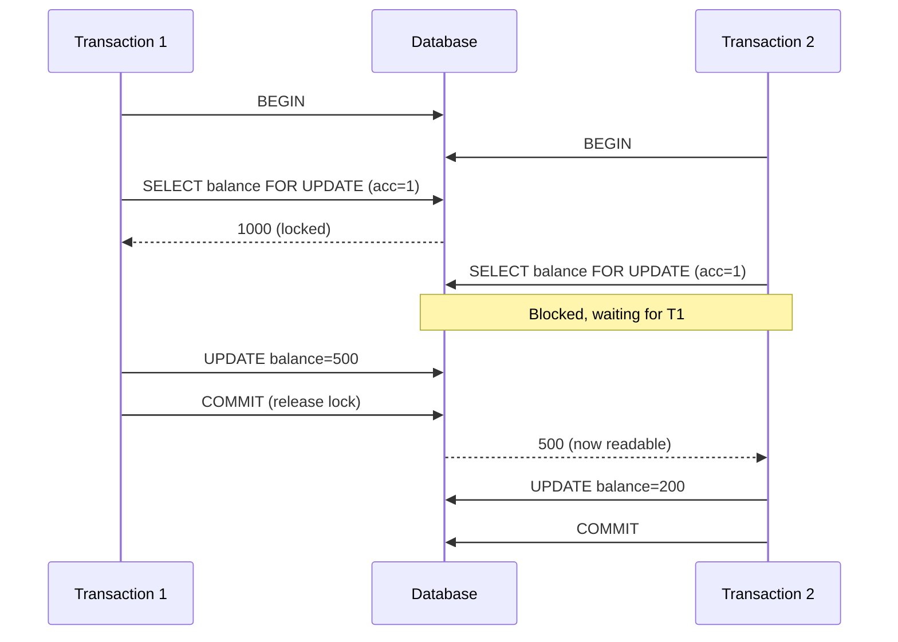

#### Interview

**Q: ACID kya hai aur har property kyu zaroori hai?**

A — Atomicity: bank transfer me agar debit ho gaya aur credit fail toh rollback se dono undo. C — Consistency: FK violation, NOT NULL violation pe transaction abort, DB invalid state me nahi jaata. I — Isolation: do users simultaneously last seat book kar rahe — isolation prevent karta hai dono ko hi seat assign hone se. D — Durability: commit ke baad power gaya toh bhi data WAL me persist ho chuka hai. Real interview me yeh basic puchhne ke baad woh follow up karenge — "agar tu DBA hai aur server crash hua mid-transaction, kya hota hai?" — bata: WAL replay hota hai recovery pe, committed transactions reapply, uncommitted rolled back.

**Q: Phantom read aur non-repeatable read me kya difference hai?**

Non-repeatable read me same existing row dobara padhne pe value change milti hai — kyunki kisi ne UPDATE ya DELETE kiya. Phantom read me row set itself change ho jaata hai — kyunki naya INSERT hua hai jo tera WHERE clause match karta hai. Repeatable read level non-repeatable prevent karta hai (existing rows pe snapshot lock) lekin phantoms allow kar sakta hai (Postgres me MVCC ki wajah se phantoms bhi prevent ho jaate hain mostly). Serializable dono prevent karta hai. Practical: agar tu count/sum kar raha hai aur exact answer chahiye — Serializable lo, performance hit accept kar.

**Q: Pessimistic vs Optimistic locking — kab kya?**

Pessimistic (SELECT FOR UPDATE): jab conflict probability high ho — high contention rows like inventory of hot product, account balance during sale. Lock pehle, then operation. Slow under contention but correct. Optimistic (version column): jab conflict rare ho — like user profile editing, where chances of two simultaneous edits are low. Try, check version, retry on conflict. Faster under low contention. Banking me usually pessimistic — paisa critical hai. Social media bio update — optimistic. Razorpay payments me pessimistic with row-level locks.

**Q: Deadlock kab hota hai aur kaise handle karte ho?**

Deadlock tab hota hai jab T1 lock A le ke B chahta hai, T2 lock B le ke A chahta hai — circular wait. Postgres detect karke ek transaction ko abort karta hai with `deadlock detected` error. Prevention: (1) Hamesha resources fixed order me lock karo (e.g., lower account id pehle). (2) Transactions chhote rakho — kam time lock hold karo. (3) Application me retry logic — agar deadlock error mile, transaction retry kar (idempotent banao). Real production me main mostly ordered locking + retry-with-backoff combination use karta hu.

---

## 5. Advanced SQL

### 5.1 Subqueries (correlated, scalar, EXISTS, IN)

#### Definition

Subquery ek query ke andar doosri query hoti hai — usually parentheses me. Types:
- **Scalar subquery** — single value return karti hai, kahin bhi use kar sakte ho (SELECT, WHERE)
- **Non-correlated subquery** — outer query se independent, ek baar evaluate
- **Correlated subquery** — har outer row ke liye dobara evaluate hoti hai (slow!)
- **EXISTS / NOT EXISTS** — sirf check karti hai row hai ya nahi
- **IN / NOT IN** — list me match check

#### Why?

Complex queries me data ko hierarchically express karne ka best tarika. Without subqueries tu temp tables ya multiple roundtrips karna padega. Lekin galat type ki subquery (correlated when EXISTS would do) production me nightmare hai — N rows × M lookups = N×M operations.

#### How?

```sql
-- ============ Scalar subquery ============
-- Single value return, SELECT clause me
SELECT 
  u.name,
  u.email,
  (SELECT COUNT(*) FROM orders o WHERE o.user_id = u.id) AS order_count,
  (SELECT MAX(created_at) FROM orders o WHERE o.user_id = u.id) AS last_order
FROM users u;
-- Beware: yeh correlated hai, har user ke liye dobara chalegi.
-- Better: LEFT JOIN with GROUP BY

-- WHERE me scalar subquery
SELECT * FROM products
WHERE price > (SELECT AVG(price) FROM products);
-- Yeh non-correlated, ek baar AVG calculate, then compare

-- ============ IN subquery ============
SELECT * FROM users
WHERE id IN (
  SELECT user_id FROM orders WHERE amount > 10000
);
-- Yeh users dega jinhone kabhi bhi 10k+ ka order kiya

-- NOT IN with NULLs — gotcha!
SELECT * FROM users
WHERE id NOT IN (SELECT user_id FROM blocked_users);
-- Agar blocked_users.user_id me ek bhi NULL hai, RESULT EMPTY!
-- Reason: NULL comparison undefined. Use NOT EXISTS instead.

-- ============ EXISTS / NOT EXISTS ============
-- Yeh boolean check karta hai — usually faster than IN for large subqueries
SELECT * FROM users u
WHERE EXISTS (
  SELECT 1 FROM orders o WHERE o.user_id = u.id AND o.amount > 10000
);

-- NOT EXISTS — anti-join pattern
SELECT u.* FROM users u
WHERE NOT EXISTS (
  SELECT 1 FROM orders o WHERE o.user_id = u.id
);
-- "Users jinhone kabhi order nahi kiya"

-- ============ Correlated subquery ============
-- Outer query ki value reference karti hai inner me
-- Har row ke liye dobara chalti hai — slow!
SELECT u.name,
  (SELECT amount FROM orders o 
   WHERE o.user_id = u.id 
   ORDER BY created_at DESC LIMIT 1) AS last_order_amount
FROM users u;

-- Better with LATERAL JOIN
SELECT u.name, last_o.amount
FROM users u
LEFT JOIN LATERAL (
  SELECT amount FROM orders o 
  WHERE o.user_id = u.id 
  ORDER BY created_at DESC LIMIT 1
) last_o ON true;

-- ============ Subquery in FROM clause (derived table) ============
SELECT category, avg_price
FROM (
  SELECT category, AVG(price) AS avg_price
  FROM products
  GROUP BY category
) AS cat_stats
WHERE avg_price > 1000;

-- ============ CTE (WITH clause) — readable subquery ============
WITH high_value_users AS (
  SELECT user_id, SUM(amount) AS total
  FROM orders
  GROUP BY user_id
  HAVING SUM(amount) > 100000
)
SELECT u.name, hv.total
FROM users u
INNER JOIN high_value_users hv ON u.id = hv.user_id;
```

#### Real-life Example: E-commerce — find inactive users

"Saare users dikha jinhone last 90 days me koi order nahi kiya, lekin pehle kabhi spend kiya hai > 5000"

```sql
SELECT u.name, u.email, prev.total_spent
FROM users u
INNER JOIN LATERAL (
  SELECT SUM(amount) AS total_spent
  FROM orders o
  WHERE o.user_id = u.id
) prev ON prev.total_spent > 5000
WHERE NOT EXISTS (
  SELECT 1 FROM orders o
  WHERE o.user_id = u.id 
    AND o.created_at > NOW() - INTERVAL '90 days'
);
```

#### Diagram

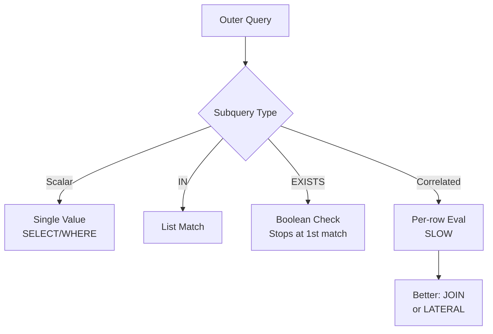

#### Interview

**Q: IN vs EXISTS — performance ka kya difference hai?**

Modern query planners (Postgres 9+) often unhe equivalent treat karte hain — both convert to semi-join. Lekin nuances: (1) NULL handling — IN with NULL in subquery = unexpected empty result; EXISTS NULLs ignore karta hai. (2) Subquery large hai — EXISTS short-circuits at first match, IN entire list materialize kar sakta hai (depending on planner). Practical: NOT EXISTS for anti-joins (because NOT IN with NULLs broken hai). EXISTS for "any match" queries. IN for small static lists. Zyada important — EXPLAIN ANALYZE chala ke actual plan dekho instead of guessing.

**Q: Correlated subquery production me kab acceptable hai?**

Almost never agar outer query bahut rows return karti hai. 1 lakh users × correlated subquery = 1 lakh evaluations. Acceptable jab outer query selective hai (e.g., WHERE id = 5 — sirf 1 row). Bigger picture me — usually rewrite as JOIN with GROUP BY, or LATERAL JOIN, or window function. LATERAL is Postgres ka secret weapon — correlated semantics with optimized execution. Senior dev test: query me correlated subquery dikhe to kasm khao "EXPLAIN dekhne ke baad hi accept karunga".

**Q: CTE vs Subquery — kya prefer karega?**

CTE readability ke liye great hai, especially nested logic. Postgres 11 tak CTE optimization fence tha (planner CTE me push down nahi kar sakta tha) — Postgres 12+ me automatic inlining hota hai unless `MATERIALIZED` keyword. So aaj kal CTE same speed as subquery, plus readable. Recursive CTE alag chiz hai — graph traversal, hierarchy. WITH RECURSIVE syntax. Bas overuse mat kar — 5-level nested CTE bhi bad code smell hai.

**Q: `WHERE id IN (SELECT ...)` aur `JOIN` me kya difference?**

Logically often equivalent (semi-join). Difference: (1) JOIN duplicates produce kar sakta hai agar inner side me multiple match — IN nahi. (2) JOIN se inner table ke columns SELECT me use kar sakte ho, IN se nahi. Example: agar tujhe order count chahiye saath me, JOIN better. Sirf filter chahiye, IN/EXISTS cleaner. Performance modern Postgres me almost same.

---

### 5.2 Views (regular vs materialized)

#### Definition

View ek named query hai jo virtual table jaisi behave karti hai. Tu uspe SELECT chala sakta hai jaise koi normal table ho, but actual storage nahi hota — har baar underlying tables se compute hota hai.

**Materialized View** alag — yeh actual data store karta hai, snapshot. Faster query but stale data — refresh karna padta hai.

#### Why?

- Complex query ko reusable banane ke liye
- Permission isolation — view de do, underlying tables hide
- Aggregations precompute ke liye (materialized)
- Schema abstraction — table structure change kiya, view interface stable

#### How?

```sql
-- ============ Regular View ============
CREATE VIEW active_users AS
SELECT id, name, email, created_at
FROM users
WHERE deleted_at IS NULL AND status = 'active';

-- Use kar
SELECT * FROM active_users WHERE created_at > '2024-01-01';

-- View update karna
CREATE OR REPLACE VIEW active_users AS
SELECT id, name, email, created_at, last_login
FROM users
WHERE deleted_at IS NULL AND status = 'active';

-- Updatable view (Postgres) — INSERT/UPDATE/DELETE bhi ho sakta hai agar simple ho
INSERT INTO active_users (name, email) VALUES ('test', 'test@x.com');

-- ============ Materialized View ============
CREATE MATERIALIZED VIEW user_order_stats AS
SELECT 
  u.id AS user_id,
  u.name,
  COUNT(o.id) AS order_count,
  SUM(o.amount) AS lifetime_value,
  MAX(o.created_at) AS last_order_date
FROM users u
LEFT JOIN orders o ON o.user_id = u.id
GROUP BY u.id, u.name;

-- Index materialized view pe bhi banao!
CREATE UNIQUE INDEX idx_uos_user ON user_order_stats(user_id);

-- Refresh karna
REFRESH MATERIALIZED VIEW user_order_stats;

-- Concurrent refresh (read available during refresh, needs unique index)
REFRESH MATERIALIZED VIEW CONCURRENTLY user_order_stats;
```

#### Real-life Example: E-commerce dashboard

Daily revenue dashboard har baar 10 crore orders aggregate kare = 30 second query. Materialized view banao, raat ko refresh — milliseconds me load.

```sql
CREATE MATERIALIZED VIEW daily_revenue AS
SELECT 
  DATE_TRUNC('day', created_at) AS day,
  COUNT(*) AS orders,
  SUM(amount) AS revenue,
  COUNT(DISTINCT user_id) AS unique_buyers
FROM orders
WHERE status = 'paid'
GROUP BY 1;

-- Cron job nightly:
-- REFRESH MATERIALIZED VIEW CONCURRENTLY daily_revenue;
```

#### Diagram

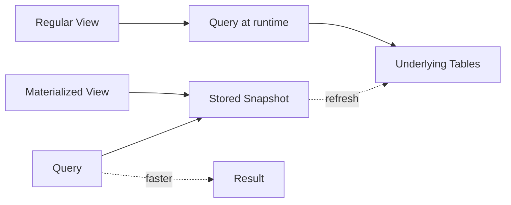

#### Interview

**Q: Materialized view aur cache me kya difference?**

Materialized view DB-managed cache hai, with strong typing aur indexing. Cache (Redis/Memcached) app-level hai, flexible but consistency manage karna padta hai. MV pros: SQL me hi rehta hai, joins/aggregations support, indexes laga sakte ho. Cons: refresh pattern manual (or trigger-based), DB load badhta hai refresh pe. Cache pros: faster, scale alag se. Cons: cache invalidation hard problem hai. Production me dono use hote hain — MV slow analytical queries ke liye, Redis hot path ke liye.

**Q: View se DB performance kaam ho sakti hai?**

Haan, agar tu views ko nest karta jaaye — view of view of view — query planner ko sab inline karke optimize karna padta hai, complex plans bante hain. 5-level deep view = 50 join query under the hood. Best practice: 1-2 level deep, complex aggregation me materialized view use karo.

**Q: Materialized view kaise refresh karte ho efficiently?**

Options: (1) `REFRESH MATERIALIZED VIEW` — full recompute, view locked during refresh. (2) `REFRESH MATERIALIZED VIEW CONCURRENTLY` — reads available during refresh, but needs unique index aur slower. (3) Incremental refresh — Postgres me built-in nahi, but tools/extensions hain (pg_ivm), or manually via triggers maintain karo. Practical: nightly cron CONCURRENTLY refresh, with fallback alert if refresh fails.

---

### 5.3 Stored procedures

#### Definition

Stored procedure DB ke andar stored named code block hai — usually PL/pgSQL Postgres me. Function vs procedure: function returns value (use in SELECT), procedure (Postgres 11+) does work, no return needed, can manage transactions inside.

#### Why?

- Business logic DB ke paas — network latency kam
- Atomic complex operations
- Reusable across applications
- Fine-grained permissions (user procedure call kar sakta hai but tables direct nahi)

Cons: testing harder, version control harder, vendor lock-in (PL/pgSQL Postgres only).

#### How?

```sql
-- ============ Function ============
CREATE OR REPLACE FUNCTION get_user_lifetime_value(p_user_id INT)
RETURNS DECIMAL AS $$
DECLARE
  total DECIMAL;
BEGIN
  SELECT COALESCE(SUM(amount), 0) INTO total
  FROM orders
  WHERE user_id = p_user_id AND status = 'paid';
  
  RETURN total;
END;
$$ LANGUAGE plpgsql;

-- Use
SELECT name, get_user_lifetime_value(id) FROM users;

-- ============ Procedure (Postgres 11+) ============
CREATE OR REPLACE PROCEDURE place_order(
  p_user_id INT,
  p_product_id INT,
  p_qty INT,
  OUT p_order_id INT
) AS $$
DECLARE
  v_price DECIMAL;
  v_stock INT;
BEGIN
  -- Stock check with lock
  SELECT price, stock INTO v_price, v_stock
  FROM products WHERE id = p_product_id FOR UPDATE;
  
  IF v_stock < p_qty THEN
    RAISE EXCEPTION 'Insufficient stock';
  END IF;
  
  -- Insert order
  INSERT INTO orders (user_id, total_amount, status)
  VALUES (p_user_id, v_price * p_qty, 'pending')
  RETURNING id INTO p_order_id;
  
  -- Insert items
  INSERT INTO order_items (order_id, product_id, qty, price)
  VALUES (p_order_id, p_product_id, p_qty, v_price);
  
  -- Update stock
  UPDATE products SET stock = stock - p_qty WHERE id = p_product_id;
  
  COMMIT;
EXCEPTION
  WHEN OTHERS THEN
    ROLLBACK;
    RAISE;
END;
$$ LANGUAGE plpgsql;

-- Call
CALL place_order(101, 5001, 2, NULL);
```

#### Real-life Example: Banking — interest calculation

Monthly batch job har savings account pe interest credit kare:

```sql
CREATE OR REPLACE PROCEDURE credit_monthly_interest() AS $$
DECLARE
  rec RECORD;
  v_interest DECIMAL;
BEGIN
  FOR rec IN SELECT id, balance, interest_rate FROM accounts 
             WHERE type = 'savings' AND status = 'active'
  LOOP
    v_interest := rec.balance * rec.interest_rate / 12;
    UPDATE accounts SET balance = balance + v_interest WHERE id = rec.id;
    INSERT INTO transactions (account_id, type, amount, description)
    VALUES (rec.id, 'interest', v_interest, 'Monthly interest credit');
    
    -- Commit per 1000 to avoid huge transaction
    IF rec.id % 1000 = 0 THEN COMMIT; END IF;
  END LOOP;
  COMMIT;
END;
$$ LANGUAGE plpgsql;
```

#### Diagram

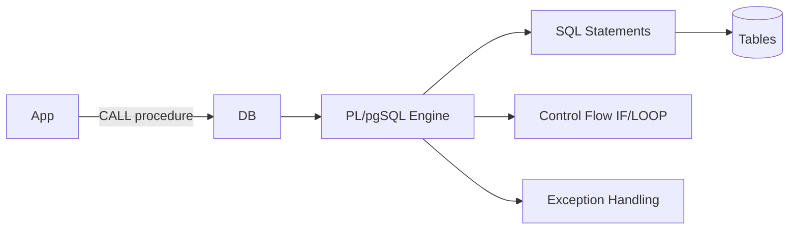

#### Interview

**Q: Stored procedure kab use karoge vs application code?**

SP use karo jab: (1) Heavy data manipulation jaha network roundtrips dominate karein (e.g., 10000 rows process), (2) Atomic complex ops (place_order), (3) Legacy systems jaha multiple apps same logic chahiye. Avoid jab: (1) Modern microservices architecture — logic distributed, DB centralizing wrong, (2) Testing/CI complex ho jaata hai SP ke saath, (3) Vendor lock-in concern. Indian product startups me trend hai — minimal SP, mostly app-side. Banking me extensive SP usage common hai.

**Q: Function vs Procedure — Postgres me?**

Function pure-ish hai — returns value, can be used in SELECT. Stored procedure (introduced Postgres 11) can manage transactions (BEGIN/COMMIT inside), no return mandatory, called via CALL. Function ke andar transaction nahi control kar sakte. Practically — read-mostly use function, transactional batch ops use procedure.

---

### 5.4 Triggers (BEFORE/AFTER, row-level vs statement)

#### Definition

Trigger automatic code hai jo kisi event pe fire hota hai — INSERT/UPDATE/DELETE pe. Types:
- **BEFORE trigger** — operation se pehle, NEW data modify kar sakta hai
- **AFTER trigger** — operation ke baad, audit/notification ke liye
- **INSTEAD OF** — view pe, original op replace kar deta hai
- **Row-level** — har affected row pe fire (FOR EACH ROW)
- **Statement-level** — pure statement pe ek baar fire (FOR EACH STATEMENT)

#### Why?

- Audit logging (kis ne kab kya kiya)
- Maintain denormalized data (counts, sums updated automatically)
- Validation beyond CHECK constraints
- Cascading actions DB-level

Cons: hidden behavior — debug karna mushkil hai, performance impact, side effects.

#### How?

```sql
-- ============ Trigger function ============
CREATE OR REPLACE FUNCTION audit_user_changes() RETURNS TRIGGER AS $$
BEGIN
  INSERT INTO user_audit (user_id, operation, old_data, new_data, changed_at)
  VALUES (
    COALESCE(NEW.id, OLD.id),
    TG_OP,                         -- INSERT/UPDATE/DELETE
    row_to_json(OLD),
    row_to_json(NEW),
    NOW()
  );
  RETURN COALESCE(NEW, OLD);
END;
$$ LANGUAGE plpgsql;

-- Trigger attach
CREATE TRIGGER trg_user_audit
AFTER INSERT OR UPDATE OR DELETE ON users
FOR EACH ROW
EXECUTE FUNCTION audit_user_changes();

-- ============ BEFORE trigger — modify data ============
CREATE OR REPLACE FUNCTION normalize_email() RETURNS TRIGGER AS $$
BEGIN
  NEW.email := LOWER(TRIM(NEW.email));
  NEW.updated_at := NOW();
  RETURN NEW;
END;
$$ LANGUAGE plpgsql;

CREATE TRIGGER trg_normalize_email
BEFORE INSERT OR UPDATE ON users
FOR EACH ROW
EXECUTE FUNCTION normalize_email();

-- ============ Maintain denormalized count ============
CREATE OR REPLACE FUNCTION update_post_comment_count() RETURNS TRIGGER AS $$
BEGIN
  IF TG_OP = 'INSERT' THEN
    UPDATE posts SET comment_count = comment_count + 1 WHERE id = NEW.post_id;
  ELSIF TG_OP = 'DELETE' THEN
    UPDATE posts SET comment_count = comment_count - 1 WHERE id = OLD.post_id;
  END IF;
  RETURN COALESCE(NEW, OLD);
END;
$$ LANGUAGE plpgsql;

CREATE TRIGGER trg_post_comment_count
AFTER INSERT OR DELETE ON comments
FOR EACH ROW
EXECUTE FUNCTION update_post_comment_count();

-- ============ Statement-level trigger ============
CREATE OR REPLACE FUNCTION log_bulk_operations() RETURNS TRIGGER AS $$
BEGIN
  INSERT INTO operation_log (table_name, operation, occurred_at)
  VALUES (TG_TABLE_NAME, TG_OP, NOW());
  RETURN NULL;       -- statement-level me NULL return
END;
$$ LANGUAGE plpgsql;

CREATE TRIGGER trg_orders_bulk_log
AFTER INSERT OR UPDATE OR DELETE ON orders
FOR EACH STATEMENT          -- ek baar per statement
EXECUTE FUNCTION log_bulk_operations();
```

#### Real-life Example: Social media — like count maintained via trigger

Instagram-like app me har post pe likes count chahiye. Bina denormalization, COUNT(*) FROM likes har baar = slow. Trigger se denormalize:

```sql
CREATE TABLE posts (
  id SERIAL PRIMARY KEY,
  user_id INT,
  content TEXT,
  likes_count INT DEFAULT 0
);

CREATE TABLE likes (
  user_id INT,
  post_id INT,
  PRIMARY KEY (user_id, post_id)
);

CREATE OR REPLACE FUNCTION update_likes_count() RETURNS TRIGGER AS $$
BEGIN
  IF TG_OP = 'INSERT' THEN
    UPDATE posts SET likes_count = likes_count + 1 WHERE id = NEW.post_id;
  ELSIF TG_OP = 'DELETE' THEN
    UPDATE posts SET likes_count = likes_count - 1 WHERE id = OLD.post_id;
  END IF;
  RETURN NULL;
END;
$$ LANGUAGE plpgsql;

CREATE TRIGGER trg_likes_count
AFTER INSERT OR DELETE ON likes
FOR EACH ROW
EXECUTE FUNCTION update_likes_count();
```

Now query is just `SELECT likes_count FROM posts WHERE id = X` — instant.

#### Diagram

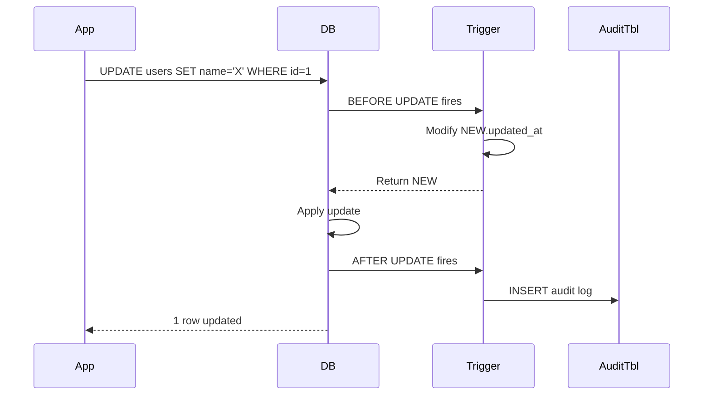

#### Interview

**Q: Trigger ke kya nuksaan hain production me?**

(1) Hidden behavior — naya developer table dekh ke samajh nahi paayega ki INSERT pe peeche kya kya ho raha hai. Documentation mandatory. (2) Performance — har row pe extra work, especially row-level triggers in bulk inserts (1 lakh rows = 1 lakh trigger executions). (3) Cascading triggers — trigger ne update kiya, dusra trigger fire, infinite loop possibility. (4) Testing complex — SP/trigger logic test karna hard. (5) Replication issues — kuch DBs me trigger replicate nahi hota. Senior engineers triggers minimal use karte hain — only for audit logs and tightly coupled denormalization.

**Q: BEFORE vs AFTER trigger — kab kya?**

BEFORE: data modify karna ho (set updated_at, normalize email), validation jo CHECK se nahi hota (cross-table). Tu NEW return karke modified data persist kar sakta hai. AFTER: side effects, audit logs, dependent tables update — original op already done, RETURN NEW vs OLD doesn't affect main op. Practical: validation BEFORE, logging AFTER.

**Q: Row-level vs statement-level trigger?**

Row-level: har affected row pe fire — useful for per-row audit, denormalization. Bulk update of 10k rows = 10k trigger calls (slow). Statement-level: ek baar per statement, regardless of rows affected — useful for "operation happened" notification, bulk audit. Postgres me transition tables (REFERENCING NEW TABLE AS new_rows) statement triggers me batch processing allow karte hain, jo row triggers se faster ho sakta hai bulk me.

---

## 6. Database design

### 6.1 Normalization (1NF, 2NF, 3NF, BCNF) & denormalization

#### Definition

Normalization redundancy hatane ka systematic process hai — data ek hi jagah, ek hi tarah store ho. Normal forms (NF) hierarchy:

- **1NF**: Atomic values (no arrays/lists in columns), unique rows, ordered columns irrelevant
- **2NF**: 1NF + no partial dependencies (non-key column poori composite key pe depend kare, not part)
- **3NF**: 2NF + no transitive dependencies (non-key column dusre non-key pe depend nahi kare)
- **BCNF**: stricter 3NF — har functional dependency me LHS superkey hona chahiye

**Denormalization** opposite hai — performance ke liye redundancy intentionally add karna.

#### Why?

Normalization se: data integrity, less storage, easier updates (one place to change). Denormalization se: faster reads, fewer joins, but harder updates (multiple places to update, consistency risk).

#### How?

```sql
-- ============ UNNORMALIZED (bad) ============
CREATE TABLE orders_bad (
  order_id INT,
  customer_name TEXT,
  customer_phone TEXT,
  customer_address TEXT,
  product_names TEXT,           -- "Phone, Charger, Cover" — NOT 1NF!
  product_prices TEXT,          -- "10000, 500, 200"
  total DECIMAL
);
-- Problems: customer info repeats, product list non-atomic, hard to query

-- ============ 1NF — Atomic columns ============
CREATE TABLE orders_1nf (
  order_id INT,
  product_id INT,
  customer_name TEXT,
  customer_phone TEXT,
  customer_address TEXT,
  product_name TEXT,
  product_price DECIMAL,
  quantity INT,
  PRIMARY KEY (order_id, product_id)
);
-- Atomic: haan. But customer info still repeats, product info bhi.

-- ============ 2NF — Remove partial dependency ============
-- Composite key (order_id, product_id). product_name depends only on product_id (partial).
-- customer_name depends only on order_id (partial).
-- Split:
CREATE TABLE customers (
  id INT PRIMARY KEY,
  name TEXT,
  phone TEXT,
  address TEXT
);

CREATE TABLE products (
  id INT PRIMARY KEY,
  name TEXT,
  price DECIMAL,
  category TEXT,           -- still 3NF issue, dekho aage
  category_description TEXT
);

CREATE TABLE orders (
  id INT PRIMARY KEY,
  customer_id INT REFERENCES customers(id),
  total DECIMAL,
  created_at TIMESTAMP
);

CREATE TABLE order_items (
  order_id INT REFERENCES orders(id),
  product_id INT REFERENCES products(id),
  qty INT,
  price_at_purchase DECIMAL,    -- snapshot, products.price change ho sakta
  PRIMARY KEY (order_id, product_id)
);

-- ============ 3NF — Remove transitive dependency ============
-- products.category_description depends on category, not directly on id.
-- Split:
CREATE TABLE categories (
  name TEXT PRIMARY KEY,
  description TEXT
);

CREATE TABLE products_3nf (
  id INT PRIMARY KEY,
  name TEXT,
  price DECIMAL,
  category_name TEXT REFERENCES categories(name)
);

-- ============ BCNF ============
-- 3NF allows some edge cases. BCNF strict: every FD has superkey LHS.
-- Example violation:
-- enrollments(student, course, instructor)
-- FD: instructor → course (each instructor teaches one course)
-- FD: (student, course) → instructor — primary key
-- (student, instructor) → course — alt key
-- instructor alone determines course — but instructor not superkey. Violates BCNF.
-- Decompose:
CREATE TABLE instructors (instructor TEXT PRIMARY KEY, course TEXT);
CREATE TABLE enrollments (student TEXT, instructor TEXT, 
  PRIMARY KEY (student, instructor),
  FOREIGN KEY (instructor) REFERENCES instructors(instructor));

-- ============ DENORMALIZATION examples ============
-- Common pattern: cached aggregates
ALTER TABLE posts ADD COLUMN comments_count INT DEFAULT 0;
ALTER TABLE posts ADD COLUMN likes_count INT DEFAULT 0;
-- Maintained via triggers or app code

-- Snapshot data
ALTER TABLE order_items ADD COLUMN product_name_snapshot TEXT;
-- Reason: product naam change ho sakta but old order ka history sahi rahe

-- Pre-joined column
ALTER TABLE orders ADD COLUMN customer_name TEXT;
-- Sirf jab join itni costly ho ki worth it ho
```

#### Real-life Example: E-commerce schema evolution

Startup phase: ek `orders` table sab kuch contained — 1NF violation. Scale ke saath split: customers, products, orders, order_items (3NF). Reads slow hue 5 joins ki wajah se. Denormalize: `orders.customer_email_snapshot`, `order_items.product_name_snapshot`, `posts.likes_count`. Reads tez, writes thoda complex (triggers maintain karte hain).

#### Diagram

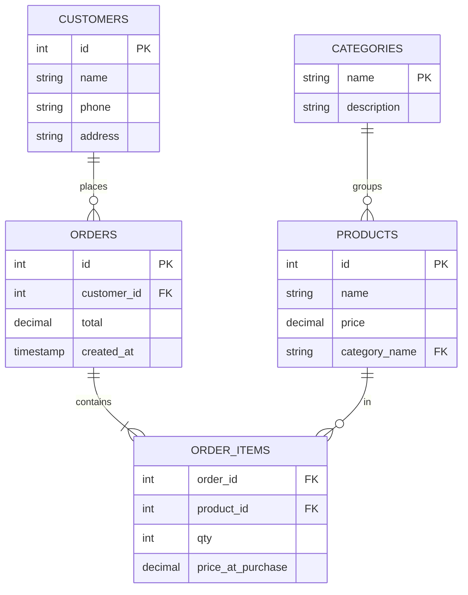

#### Interview

**Q: 3NF tak normalize karein ya BCNF? Real production me?**

Most products 3NF tak ja ke ruk jaate hain — woh practical sweet spot hai. BCNF rare cases me strictly required jab 3NF me anomaly bachi ho. Real-world: 3NF normalize karo schema design phase me, then strategically denormalize for read performance. Banking me strict normalization (BCNF if needed) — data integrity > performance. Social media me heavy denormalization — counts, snapshots, caches everywhere.

**Q: Denormalization ka kya cost hai?**

Cost: (1) Writes me update multiple places — likes_count post pe maintain, like INSERT/DELETE me update, trigger ya app logic. Bug = inconsistent state. (2) Storage badhta hai. (3) Schema migration complex hota hai. Worth it jab read:write ratio bahut high hai aur join cost real bottleneck hai. Always start normalized, denormalize when measured. "Premature denormalization" common mistake.

**Q: Update anomaly, insert anomaly, delete anomaly kya hain?**

Unnormalized table me: (1) Update anomaly — customer ne phone change kiya, multiple rows me update karna padega; ek bhul gaya = inconsistent. (2) Insert anomaly — naya product add karna chahta hu but order nahi hai abhi tak — null primary key issue. (3) Delete anomaly — last order delete kiya us product ka, product info bhi gayi. Normalization yeh teen prevent karta hai by separating concerns into different tables.

**Q: Functional dependency aur multi-valued dependency me kya?**

Functional dependency (FD): X → Y means X uniquely determines Y. id → name. Multi-valued dependency (MVD): X →→ Y means each X has set of Y values, independent of other columns. Used in 4NF. Practical example: student → courses (set), student → hobbies (set). Same table me dono = redundancy. 4NF me alag tables. 5NF (PJ/NF) further nuance hai — interview me rare.

---

### 6.2 ER diagrams (entities, relationships, cardinality)

#### Definition

ER (Entity-Relationship) diagram database design ka visual representation hai. Components:
- **Entity** — real-world object (User, Order, Product) — table banta hai
- **Attribute** — entity ki property (name, email) — column banta hai
- **Relationship** — entities ke beech connection (User places Order)
- **Cardinality** — relationship ki nature: 1:1, 1:N, M:N

#### Why?

Code likhne se pehle schema design karo. ER diagram team ko clear karta hai entities aur relationships. Galat design baad me migrate karna painful hai.

#### How?

ER notation samajh:
- 1:1 — User ↔ Profile (har user ek profile)
- 1:N — User → Orders (ek user, many orders)
- M:N — Students ↔ Courses (kaafi students, kaafi courses) → junction table chahiye

```sql
-- 1:1 — separate tables OR same table
-- Option A: separate
CREATE TABLE users (id SERIAL PRIMARY KEY, email TEXT);
CREATE TABLE user_profiles (
  user_id INT PRIMARY KEY REFERENCES users(id),
  bio TEXT, avatar_url TEXT
);
-- Option B: combine in users table (if always queried together)

-- 1:N — FK on "many" side
CREATE TABLE orders (
  id SERIAL PRIMARY KEY,
  user_id INT REFERENCES users(id),    -- FK pointing to "1" side
  amount DECIMAL
);

-- M:N — junction table
CREATE TABLE students (id SERIAL PRIMARY KEY, name TEXT);
CREATE TABLE courses (id SERIAL PRIMARY KEY, title TEXT);
CREATE TABLE enrollments (
  student_id INT REFERENCES students(id),
  course_id INT REFERENCES courses(id),
  enrolled_at TIMESTAMP DEFAULT NOW(),
  PRIMARY KEY (student_id, course_id)
);
```

#### Real-life Example: Social media schema

Instagram-like app entities: User, Post, Comment, Like, Follow.
- User 1:N Post
- User 1:N Comment
- User M:N User (follows — junction)
- User M:N Post (likes — junction)
- Post 1:N Comment

#### Diagram

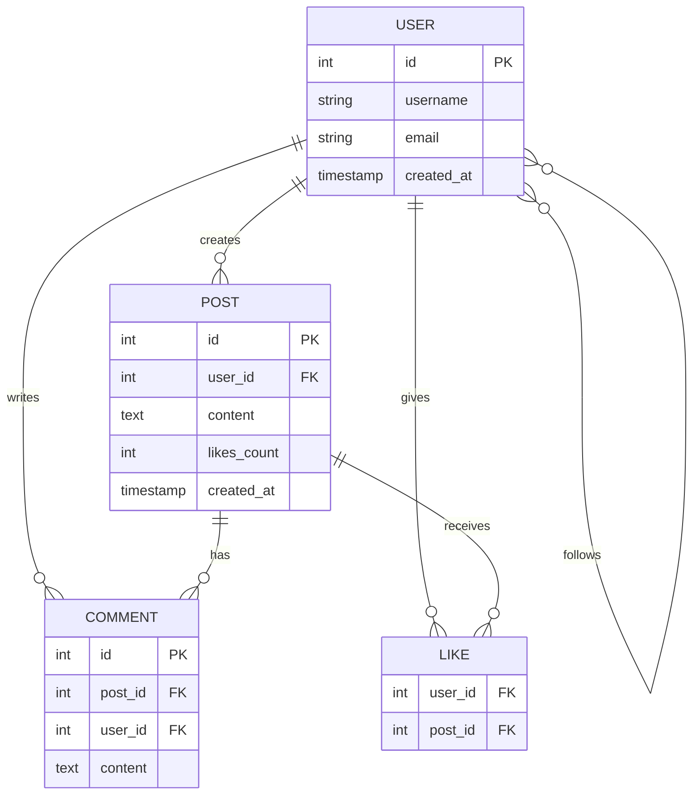

#### Interview

**Q: M:N relationship kaise model karte ho?**

Junction (associative) table. `students` aur `courses` ke beech `enrollments` table — har row ek (student, course) pair. Composite primary key ya separate id. Junction table me extra attributes bhi rakh sakte ho — `enrolled_at`, `grade`. Sometimes junction itself becomes entity (Order is junction of Customer and Product, but Order itself has lifecycle). FK indexes mandatory dono sides pe.

**Q: 1:1 relationship kab same table me, kab alag?**

Same table jab: dono attributes always together access hote hain, total size manageable. Alag jab: (1) Optional relationship — sirf 30% users ka profile filled hai, NULL columns waste space. (2) Sensitive data isolation — passwords, payment_info alag table me with stricter access. (3) Vertical partitioning — heavy text columns alag rakho, hot path tez ho. (4) Different update patterns.

**Q: Weak entity kya hai?**

Weak entity woh hai jo apne aap unique nahi hai — depends on parent entity. Example: `order_items` apne aap kuch nahi, `order` ke saath hi meaningful. PK usually composite (order_id, line_no). FK on parent. Parent delete = child cascade delete typically.

**Q: ERD me cardinality notations kaunsi hain?**

Crow's foot notation popular hai: line for "one", crow's foot (three lines) for "many", circle for "optional zero", bar for "mandatory one". `||--o{` Mermaid me one-to-many, `}o--o{` many-to-many. UML me 1, 0..1, 1..*, 0..* explicit ranges.

---

### 6.3 Schema design (PK, FK, constraints, naming conventions)

#### Definition

Schema design me primary keys, foreign keys, constraints, indexes, aur naming consistently set karte ho. Choices yahan baad me migrate karna mehnga hai.

#### Why?

Acche schema se: query simple, data integrity guaranteed, indexes natural. Galat schema = "users table me JSON blob me sab kuch" type horror stories.

#### How?

```sql
-- ============ Primary Keys ============
-- Option 1: Auto-increment integer (BIGSERIAL recommend for scale)
CREATE TABLE users (
  id BIGSERIAL PRIMARY KEY,
  ...
);

-- Option 2: UUID
CREATE TABLE orders (
  id UUID PRIMARY KEY DEFAULT gen_random_uuid(),
  ...
);
-- Pros: globally unique, no enumeration, works in distributed systems
-- Cons: 16 bytes vs 8, slower joins, random insertion = B-tree page splits

-- Option 3: Natural key (rare)
CREATE TABLE countries (
  iso_code CHAR(2) PRIMARY KEY,
  name TEXT
);

-- Option 4: ULID/KSUID — sortable + unique (best of both)
-- Postgres extension or app-level generation

-- ============ Foreign Keys ============
CREATE TABLE orders (
  id BIGSERIAL PRIMARY KEY,
  user_id BIGINT NOT NULL,
  product_id BIGINT NOT NULL,
  CONSTRAINT fk_orders_user FOREIGN KEY (user_id) 
    REFERENCES users(id) ON DELETE RESTRICT ON UPDATE CASCADE,
  CONSTRAINT fk_orders_product FOREIGN KEY (product_id)
    REFERENCES products(id) ON DELETE RESTRICT
);

-- ON DELETE options:
-- CASCADE — parent delete = child delete (use carefully)
-- RESTRICT/NO ACTION — block parent delete if children exist (default safe)
-- SET NULL — child FK ko NULL set
-- SET DEFAULT — default value

-- ============ Constraints ============
CREATE TABLE products (
  id BIGSERIAL PRIMARY KEY,
  sku VARCHAR(50) NOT NULL UNIQUE,           -- unique constraint
  name VARCHAR(200) NOT NULL,                -- not null
  price DECIMAL(10,2) NOT NULL CHECK (price >= 0),  -- check constraint
  stock INT NOT NULL DEFAULT 0 CHECK (stock >= 0),
  category VARCHAR(50) NOT NULL,
  status VARCHAR(20) NOT NULL DEFAULT 'active' 
    CHECK (status IN ('active', 'inactive', 'discontinued')),
  created_at TIMESTAMP NOT NULL DEFAULT NOW(),
  updated_at TIMESTAMP NOT NULL DEFAULT NOW()
);

-- Composite unique
ALTER TABLE order_items 
ADD CONSTRAINT uk_order_product UNIQUE (order_id, product_id);

-- Exclusion constraint (Postgres) — overlapping ranges roko
CREATE TABLE bookings (
  room_id INT,
  during TSRANGE,
  EXCLUDE USING gist (room_id WITH =, during WITH &&)
);

-- ============ Naming conventions ============
-- Consistent rule book:
-- Tables: lowercase, snake_case, plural (users, order_items)
-- Columns: lowercase, snake_case, singular (user_id, created_at)
-- PK: id
-- FK: <table_singular>_id (user_id, product_id)
-- Index: idx_<table>_<columns> (idx_orders_user_status)
-- Unique: uk_<table>_<columns>
-- Foreign key constraint: fk_<table>_<reference>
-- Check: chk_<table>_<rule>

-- Audit columns standard:
-- created_at TIMESTAMP NOT NULL DEFAULT NOW()
-- updated_at TIMESTAMP NOT NULL DEFAULT NOW()  -- maintain via trigger
-- created_by BIGINT REFERENCES users(id)
-- deleted_at TIMESTAMP NULL                    -- soft delete

-- ============ Generated columns ============
CREATE TABLE products_v2 (
  id BIGSERIAL PRIMARY KEY,
  price DECIMAL,
  tax_rate DECIMAL,
  total_price DECIMAL GENERATED ALWAYS AS (price * (1 + tax_rate)) STORED
);

-- ============ Partial unique constraint ============
-- Only one active session per user
CREATE UNIQUE INDEX uk_active_session 
ON sessions(user_id) 
WHERE status = 'active';
```

#### Real-life Example: Razorpay-like payment schema

```sql
CREATE TABLE merchants (
  id BIGSERIAL PRIMARY KEY,
  name VARCHAR(200) NOT NULL,
  email VARCHAR(255) NOT NULL UNIQUE,
  status VARCHAR(20) NOT NULL DEFAULT 'pending' 
    CHECK (status IN ('pending', 'active', 'suspended')),
  created_at TIMESTAMP NOT NULL DEFAULT NOW()
);

CREATE TABLE payments (
  id UUID PRIMARY KEY DEFAULT gen_random_uuid(),     -- UUID for public IDs
  merchant_id BIGINT NOT NULL REFERENCES merchants(id),
  amount DECIMAL(12,2) NOT NULL CHECK (amount > 0),
  currency CHAR(3) NOT NULL DEFAULT 'INR',
  status VARCHAR(20) NOT NULL DEFAULT 'created'
    CHECK (status IN ('created', 'authorized', 'captured', 'failed', 'refunded')),
  idempotency_key VARCHAR(100) NOT NULL,              -- duplicate prevent
  created_at TIMESTAMP NOT NULL DEFAULT NOW(),
  CONSTRAINT uk_merchant_idempotency UNIQUE (merchant_id, idempotency_key)
);

CREATE INDEX idx_payments_merchant_status ON payments(merchant_id, status);
CREATE INDEX idx_payments_created ON payments(created_at DESC);
```

#### Diagram

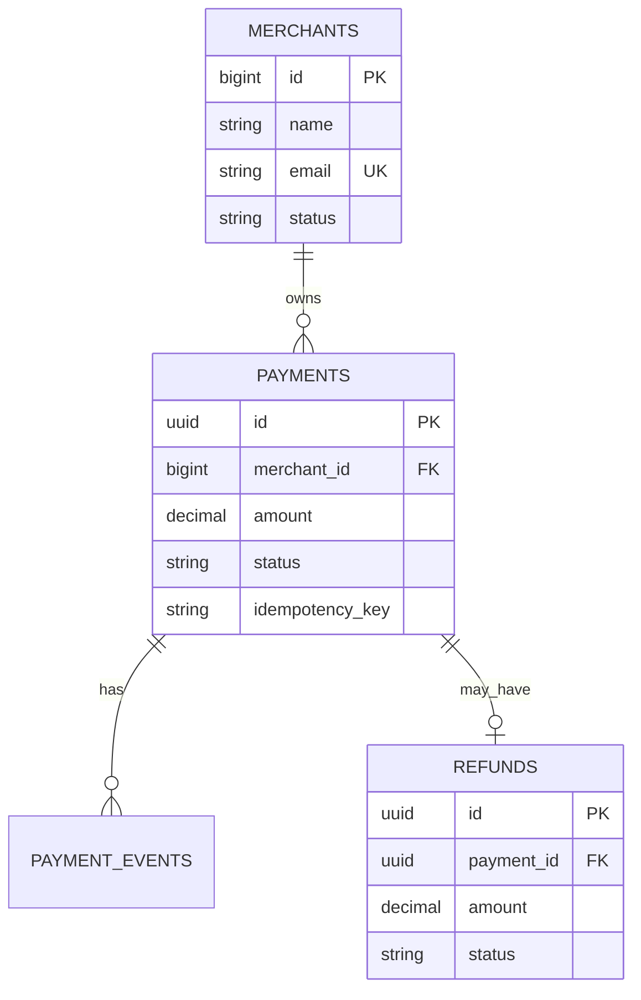

#### Interview

**Q: UUID vs Integer PK — pros and cons?**

Integer (BIGSERIAL): 8 bytes, sequential = B-tree friendly, fast joins, easy to debug. Cons: enumerable (security), not globally unique (sharding issue). UUID: 16 bytes, globally unique, distributed-friendly. Cons: random = page splits in B-tree (UUID v7/ULID solve this with timestamp prefix), bigger index, harder visual debug. Practical: internal IDs integer, public IDs UUID. Or use ULID/UUID v7 — sortable random.

**Q: ON DELETE CASCADE — kab use, kab nahi?**

Use jab parent ke bina child meaningless ho — order delete = order_items delete (data integrity), user delete = sessions delete. Avoid jab business meaning matters — user delete pe orders cascade = audit trail gone. Banking me cascade kabhi nahi — audit/compliance. Soft delete preferred. Always think: "agar gallti se parent delete hua, kya cascade ne data destroy kar diya?"

**Q: Soft delete vs hard delete?**

Soft delete (deleted_at column NULL/timestamp) for: user data (GDPR ke liye actual delete still needed), audit trail, possible restoration. Hard delete for: temporary data, expired tokens, log rotation. Soft delete cons: queries me `WHERE deleted_at IS NULL` everywhere — easy to forget, partial indexes help. Mostly soft for business entities, hard for ephemeral.

**Q: NOT NULL columns add karna existing table me kaise?**

Multi-step: (1) Column add NULLable with default, (2) Backfill existing rows in batches, (3) ALTER COLUMN SET NOT NULL after all populated. Postgres 11+ me default value with NOT NULL is fast (no rewrite for default). Production me long-running ALTER blocks — use CONCURRENTLY where supported, ya off-peak windows, ya use tools like pt-online-schema-change (MySQL) / pg_repack.

---

### 6.4 Query optimization (EXPLAIN/EXPLAIN ANALYZE, query plans, common smells)

#### Definition

Query optimization slow queries ko fast banane ka art hai. EXPLAIN se planner ka plan dikhta hai (estimated). EXPLAIN ANALYZE actually query chalata hai aur real numbers deta hai.

#### Why?

Production me 80% performance issues queries hi hote hain. Index missing, bad join order, cartesian explosion, N+1, stale stats — sab EXPLAIN ANALYZE me dikhta hai. Aur senior interview me yeh aata hi aata hai.

#### How?

```sql
-- ============ EXPLAIN — estimated plan ============
EXPLAIN SELECT * FROM orders WHERE user_id = 101;
-- Output:
-- Index Scan using idx_orders_user_id on orders  
--   (cost=0.42..8.44 rows=2 width=64)
--   Index Cond: (user_id = 101)

-- cost=0.42..8.44 — startup cost..total cost (arbitrary units)
-- rows=2 — estimated rows
-- width=64 — average row size bytes

-- ============ EXPLAIN ANALYZE — actual execution ============
EXPLAIN ANALYZE SELECT * FROM orders WHERE user_id = 101;
-- Output:
-- Index Scan using idx_orders_user_id on orders 
--   (cost=0.42..8.44 rows=2 width=64) (actual time=0.024..0.027 rows=3 loops=1)
--   Index Cond: (user_id = 101)
-- Planning Time: 0.075 ms
-- Execution Time: 0.054 ms

-- actual time=startup..total ms
-- rows= actual rows
-- loops= node executed kitni baar

-- ============ EXPLAIN ANALYZE with details ============
EXPLAIN (ANALYZE, BUFFERS, VERBOSE, FORMAT TEXT)
SELECT u.name, COUNT(o.id) 
FROM users u
LEFT JOIN orders o ON o.user_id = u.id
WHERE u.created_at > '2024-01-01'
GROUP BY u.id, u.name;

-- BUFFERS — kitne pages read (shared hit/read = cache vs disk)
-- VERBOSE — detail with column lists

-- ============ Common scan types ============
-- Seq Scan — full table scan, slow for large tables
-- Index Scan — B-tree traversal + heap fetch
-- Index Only Scan — covering index, no heap fetch (best!)
-- Bitmap Heap Scan — multiple index conditions OR'd
-- Nested Loop Join — outer loop x inner loop (good for small + indexed)
-- Hash Join — build hash on smaller, probe with larger (good for big tables)
-- Merge Join — both sorted, merge (good when already sorted)

-- ============ Common smells aur fixes ============

-- SMELL 1: Sequential Scan on big table
-- "Seq Scan on orders ... rows=10000000"
-- Fix: index banao, ya selective WHERE add karo

-- SMELL 2: Estimated rows vs actual rows mismatch
-- Estimated: rows=10  Actual: rows=10000
-- Fix: ANALYZE table; — stats update karo
ANALYZE orders;
-- Or auto-vacuum settings tune karo

-- SMELL 3: Nested Loop with high outer rows
-- Nested Loop  (rows=100000)
-- Each outer row triggers inner — 100000 * lookup = slow
-- Fix: planner ko hash join karne do — usually statistics update se theek hota hai

-- SMELL 4: Function on indexed column
-- Index NOT used: WHERE LOWER(email) = ...
-- Fix: functional index ya store normalized

-- SMELL 5: OR conditions
-- WHERE col1 = X OR col2 = Y — index merge nahi hota easily
-- Fix: UNION ALL me split karo
SELECT * FROM t WHERE col1 = X
UNION ALL
SELECT * FROM t WHERE col2 = Y AND col1 != X;

-- SMELL 6: LIKE '%pattern%' — leading wildcard
-- B-tree index use nahi hota
-- Fix: trigram index (pg_trgm extension) for substring search
CREATE EXTENSION pg_trgm;
CREATE INDEX idx_users_name_trgm ON users USING gin (name gin_trgm_ops);

-- SMELL 7: SELECT * with ORDER BY LIMIT
-- Sometimes Postgres can't push LIMIT down through joins efficiently
-- Fix: subquery to limit first, then join

-- SMELL 8: DISTINCT to dedupe
-- DISTINCT pe sort/hash chalega — expensive
-- Fix: actual cause find karo (bad join making duplicates), use GROUP BY, EXISTS

-- ============ pg_stat_statements — find slow queries ============
CREATE EXTENSION pg_stat_statements;

SELECT 
  query,
  calls,
  total_exec_time,
  mean_exec_time,
  max_exec_time
FROM pg_stat_statements
ORDER BY total_exec_time DESC
LIMIT 20;
```

#### Real-life Example: Slow query hunt

E-commerce dashboard slow ho gaya. Query: 

```sql
SELECT u.email, SUM(o.amount) total
FROM users u
LEFT JOIN orders o ON o.user_id = u.id
WHERE u.signup_source = 'organic'
GROUP BY u.id, u.email
HAVING SUM(o.amount) > 10000
ORDER BY total DESC LIMIT 100;
```

EXPLAIN ANALYZE shows:
- Seq Scan on users (cost=0.0..50000 rows=2000000) — index missing on signup_source
- HashAggregate (rows=2000000)
- 30 second execution

Fixes:
1. `CREATE INDEX idx_users_signup_source ON users(signup_source) WHERE signup_source = 'organic'` — partial index since 'organic' is dominant value
2. `CREATE INDEX idx_orders_user_amount ON orders(user_id) INCLUDE (amount)` — covering for sum
3. After: Index Scan, Hash Join, 200ms execution.

#### Diagram

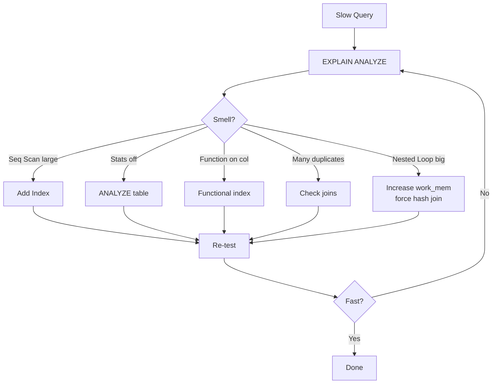

#### Interview

**Q: EXPLAIN aur EXPLAIN ANALYZE me kya difference?**

EXPLAIN sirf planner ka estimated plan dikhata hai — query nahi chalti. Fast, safe (production me bhi chala sakte ho). EXPLAIN ANALYZE actually query execute karta hai aur real numbers (actual time, actual rows) dikhata hai. Production me ANALYZE chalana risky for UPDATE/DELETE — use BEGIN; EXPLAIN ANALYZE ...; ROLLBACK; — query chalti hai but rollback. EXPLAIN ANALYZE pe BUFFERS option add karna usually — disk vs cache hits dikhata hai.

**Q: Query plan me Nested Loop, Hash Join, Merge Join — kab kaunsa best?**

Nested Loop: chhota outer × indexed inner. Best for selective queries, < 1000 outer rows. Hash Join: equality joins, hash table fits memory. Best for big-big joins. Build cost on smaller side. Merge Join: dono sides sorted (or sortable cheaply). Good for huge sorted data, but sort cost expensive. Planner statistics aur work_mem ke base pe choose karta hai. Production tip: agar planner Nested Loop pick kar raha hai bade dataset pe, stats stale hain — ANALYZE chala.

**Q: Query 1 lakh rows me 50ms hai, 1 crore me 30 second — kyu?**

Likely complexity issue. Possibilities: (1) Sequential scan — 100x data = 100x time. Fix: index. (2) Nested loop join — rows × inner = quadratic. Fix: hash join via stats/work_mem. (3) Sort spilling to disk — work_mem chhota. Increase or add index for sorted output. (4) DISTINCT/GROUP BY without index. EXPLAIN ANALYZE compare karo dono sizes pe — operator level pe time identify ho jaata hai.

**Q: pg_stat_statements vs slow query log — kya use karte ho?**

pg_stat_statements aggregate stats — top N slowest by total time, mean time. Production-friendly, low overhead. slow query log specific queries above threshold log karta hai — useful for debugging specific incidents. Both complementary. Datadog/New Relic APM bhi production me crucial — actual app-level visibility. Practical workflow: alert fires (latency p99 high) → APM se trace → DB se pg_stat_statements top queries → EXPLAIN ANALYZE → fix → deploy → monitor.

---

## Resources & further reading

- **Use The Index, Luke!** — https://use-the-index-luke.com — Markus Winand ki classic guide on indexing across databases. Free aur excellent. SQL performance ke liye must-read.
- **PostgreSQL official docs** — https://www.postgresql.org/docs/ — har feature ka authoritative reference. EXPLAIN, isolation levels, indexes — sab yahan deep me.
- **SQL Performance Explained** — Markus Winand ki book. Indexing ka bible. Har database engineer ke desk pe honi chahiye.
- **Designing Data-Intensive Applications** — Martin Kleppmann. SQL beyond — distributed systems, replication, consistency. Senior level interviews ke liye golden.
- **High Performance MySQL** — Baron Schwartz et al. MySQL specific lekin internals universally applicable.
- **The Art of PostgreSQL** — Dimitri Fontaine. Advanced Postgres patterns aur idioms.
- **PostgreSQL Internals** — Egor Rogov ki series. B-tree, MVCC, WAL — sab deep.
- **Hussein Nasser YouTube channel** — practical database engineering videos, indexing demos, transaction visualizations.
- **CMU 15-445 Database Systems course** — Andy Pavlo ka legendary course, free online. Production engineers bhi yahan padhke design samajhte hain.
- **pgAdmin / DBeaver** — local Postgres explore karne ke liye GUI tools.
- **pgMustard / explain.depesz.com** — EXPLAIN ANALYZE output ka visual interpretation.

Bhai, end-to-end SQL master karne me time lagega — but nightly 1 hour padh aur ek query pe EXPLAIN ANALYZE chala, 6 mahine me tu apne team ka SQL go-to ban jaayega. Interview me confidence khud aa jaayegi.

---

## Bonus: Production war stories aur deep dives

Yeh section optional reading hai — lekin agar tu serious hai SQL ke baare me, isko padh. Yeh real production scenarios hain jo har Indian product company me kabhi na kabhi face hote hain.

### War story 1: The 2 AM page — connection pool exhausted

Razorpay-style payment company me Sunday raat 2 baje pager bajta hai. p99 latency 50ms se 30 second. Logs me "could not get connection from pool, timeout 5000ms". Engineer login karta hai, Postgres dashboard kholta hai — connections 200/200 (max_connections), 180 me state "idle in transaction".

Diagnosis: kisi developer ne naya endpoint deploy kiya jo BEGIN karta hai but COMMIT/ROLLBACK exception path me bhul gaya. App exception, but transaction open chod diya gaya. Connection pool me return hua, lekin Postgres ke liye woh "idle in transaction" hai — VACUUM block kar raha, locks hold ho rahe.

Fix immediate: `SELECT pg_terminate_backend(pid) FROM pg_stat_activity WHERE state = 'idle in transaction' AND xact_start < NOW() - INTERVAL '1 minute'`. Long term: `idle_in_transaction_session_timeout = '60s'` set kar do Postgres me, framework level pe transaction wrapper ensure karo (try/finally with rollback).

Lesson: Transactions hamesha try-with-resources / context manager me wrap karo. Postgres `idle_in_transaction_session_timeout` lifesaver hai. Aur `pg_stat_activity` view hamesha incident me pehla query hai.

### War story 2: The N+1 query disaster

Swiggy-jaisi food delivery app me listing page slow ho gaya — 3 second load time. APM trace dikha rahi 200+ DB calls per request. Code me ORM:

```python
restaurants = Restaurant.objects.filter(city='Bangalore').limit(50)
for r in restaurants:
    print(r.cuisine.name)        # har iteration me ek query
    print(r.owner.name)          # aur ek
    print(r.dishes.count())      # aur ek
```

50 restaurants × 3 lazy loads = 150+ extra queries. Classic N+1.

Fix: `select_related('cuisine', 'owner').prefetch_related('dishes')` — ORM ko bata do related data eagerly fetch karna hai. Underlying SQL me yeh JOIN ya separate IN query me bante hain. 200 queries → 4 queries. Latency 3s → 200ms.

Lesson: ORM se generated queries always log karo dev me. `EXPLAIN` chala ke dekho production me kya jaa raha hai. ORM convenient hai but hidden cost.

### War story 3: The deadlock storm

Banking ledger me deadlock errors spike. Customer support tickets aane lage "transfer failed". Investigation me dikha: ek transfer flow A→B account lock karta tha, doosra refund flow B→A. Concurrent run me circular wait. Postgres detect kar ke kuch transactions abort kar raha — but client retry without backoff = aur deadlocks.

Fix: (1) Account lock order standardize — hamesha lower account_id pehle lock. (2) Client side retry with exponential backoff + jitter. (3) Transaction me work minimize — pre-validate karo BEFORE BEGIN, lock ke andar sirf critical writes.

Lesson: Distributed locking aur deadlock prevention design choice hai, accident nahi. Document karo lock order. Test concurrent paths.

### Deep dive: MVCC (Multi-Version Concurrency Control)

Postgres readers writers ko block nahi karte, vice versa bhi. Reason: MVCC. Har row me hidden columns hote hain — `xmin` (created by which transaction id), `xmax` (deleted/updated by which xid). Naya transaction snapshot dekhta hai based on its xid — sirf woh rows visible jo (xmin <= my_xid AND committed) AND (xmax IS NULL OR xmax > my_xid).

UPDATE actually new version create karta hai — old row marked deleted (xmax set), new row inserted. Iska side effect: bloat. Dead rows tab tak rakhe jaate hain jab tak koi transaction unhe dekh sakti hai. VACUUM clean karta hai. AUTOVACUUM background me chalta hai.

Issues to know:
- **Bloat** — heavy update tables me table size badh jaata hai actual data se kahin zyada. `pg_repack` extension se rebuild karo.
- **Long-running transactions** — pranay-ji ne 6 ghante se BEGIN chod diya hai? VACUUM uske baad ke dead rows clean nahi kar paayega — bloat explosion.
- **txid wraparound** — Postgres xid 32-bit, ~4 billion ke baad wraparound. AUTOVACUUM freeze old rows kar deta hai. Critical infra concern at scale.

### Deep dive: Connection pooling

Postgres process-per-connection hai — har connection 5-10 MB RAM. 1000 connections = 10 GB just for connections. Solution: pgbouncer / pgpool-II.

Modes:
- **Session pooling** — client ko ek backend connection assign, transaction across.
- **Transaction pooling** — har transaction me alag backend possible. Most efficient. But session features (PREPARE, SET) issues.
- **Statement pooling** — har statement alag backend. Most aggressive, most limitations.

Production me typical: pgbouncer transaction pooling, pool size 20-50 per app instance, max Postgres connections 200-500.

### Deep dive: Replication

Read scaling ke liye Postgres me replicas:
- **Streaming replication** — primary se WAL stream replicas pe, near-real-time.
- **Logical replication** — table-level, version-flexible (different Postgres versions).
- **Synchronous vs asynchronous** — sync = primary commit waits replica ack (no data loss but slower); async = standard, possible small lag.

Replicas pe read queries route karo (analytics, reports). Writes always primary. Replication lag monitor karo — `SELECT pg_last_wal_replay_lag()`. Stale read tolerable nahi hai toh primary se padho.

### Deep dive: Sharding strategies

100 crore users pe single Postgres node nahi sambhalta. Sharding:
- **Hash sharding** — user_id hash → shard number. Even distribution, but range queries hard.
- **Range sharding** — user_id 0-1Cr shard 1, 1Cr-2Cr shard 2. Range easy, hot shard risk.
- **Geo sharding** — Indian users India shard, US users US shard. Latency benefit.

Cross-shard joins painful — usually denormalize ya app-level orchestration. Distributed transactions (2PC) Postgres supports lekin operationally complex. Most product cos: shard such that single business operation = single shard. E.g., user-level data colocate.

Tools: Citus (Postgres extension), Vitess (MySQL), or app-level sharding (Razorpay style).

### Deep dive: Window functions

Window functions advanced analytics ke liye magic. Subquery/correlated se 10x faster.

```sql
-- Har user ka latest order
SELECT user_id, order_id, amount, created_at
FROM (
  SELECT *, ROW_NUMBER() OVER (PARTITION BY user_id ORDER BY created_at DESC) rn
  FROM orders
) t WHERE rn = 1;

-- Running total
SELECT order_id, amount, 
       SUM(amount) OVER (ORDER BY created_at) AS cumulative_total
FROM orders;

-- Rank within category
SELECT product_id, category, price,
       RANK() OVER (PARTITION BY category ORDER BY price DESC) AS rank_in_cat
FROM products;

-- LAG/LEAD — pichle row ka value
SELECT date, revenue,
       LAG(revenue) OVER (ORDER BY date) AS prev_day,
       revenue - LAG(revenue) OVER (ORDER BY date) AS day_change
FROM daily_sales;
```

### Final interview tips

- SQL questions me whiteboard pe schema bana, ER diagram banao before query.
- "Optimize this query" type questions me hamesha pehle indexes maango/check karo, then EXPLAIN ANALYZE mention karo.
- Trade-offs articulate karo — "main hash join expect karunga because both tables large hain, but if outer is selective < 1000 rows, nested loop with inner index better".
- Real numbers de — "10ms acceptable for primary key lookup, 100ms for indexed range query, > 1s investigate".
- Senior interview me they want to see system thinking — connection pooling, replication, MVCC ka mention if relevant.

Bas yeh sab padh aur practice kar — chal apna agla EXPLAIN ANALYZE chala aur next layer me chal.

Ek aakhri gyaan — interview me confidence se zyada important hai honesty. Agar tujhe kuch nahi pata, bol "main yeh nahi jaanta but main socha kar batata hu". Senior interviewers fake gyaan turant pakad lete hain. SQL ek aisa subject hai jaha 10 saal ke seasoned dev bhi naya kuch seekhte rehte hain — query planner ki nayi optimization, naya isolation edge case, naya index type. Curious raho. Production me jab koi query slow ho, debug karne baith — woh tujhe theory se kahin zyada sikhayega. Sab logon ne ek baar production me UPDATE bina WHERE chalaya hai (ya almost chalaya hai) — galti se seekho aur agla galat kam karne se pehle two-three baar soch lo. SQL me speed aur safety dono critical hain. Best of luck bhai, ja interview crack kar.
