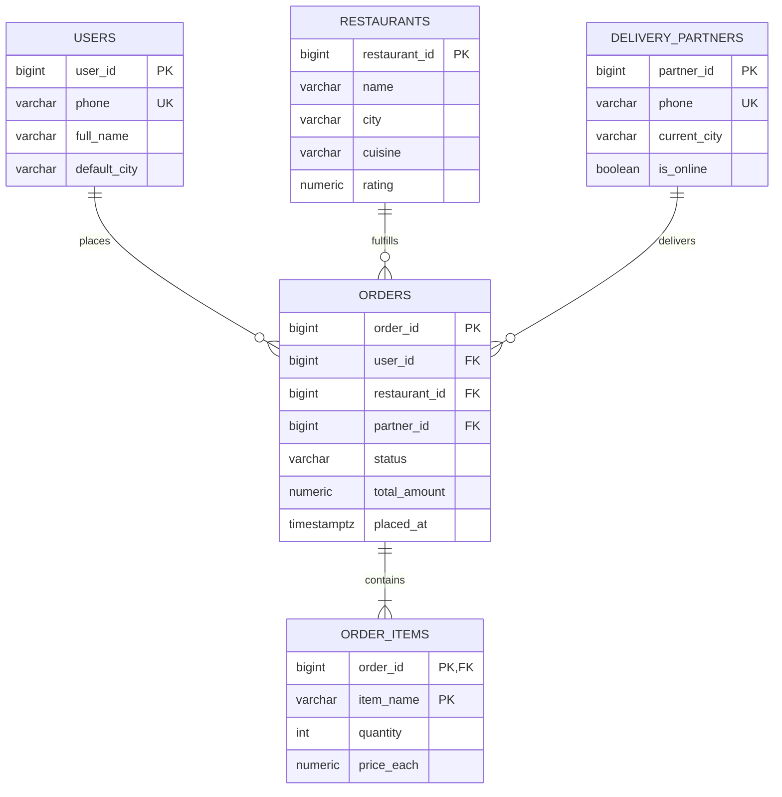
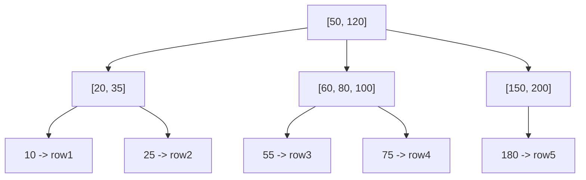
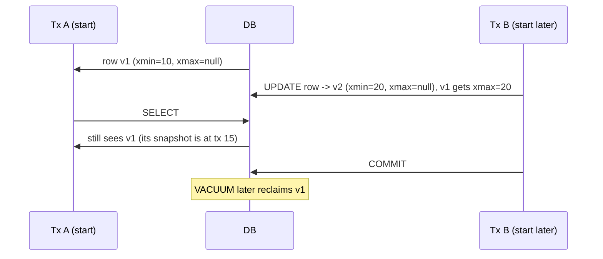

# Database Management Systems — From Placement to Production

DBMS ek aisa subject hai jo *har* product company interview mein aata hai — TCS NQT ke MCQs se le ke Razorpay/Flipkart ke senior rounds tak. DSA tujhe round 1 clear karayega, system design tujhe senior banayega, lekin DBMS *har* round mein chhupke baitha rehta hai. "Design a URL shortener" — kaunsa index? "Why is this query slow?" — `EXPLAIN ANALYZE` chala. "What if two users book the last seat?" — isolation level batao. Tu agar DBMS pe weak hai, tu beech mein atak jayega, aur interviewer ka confidence tujh pe gir jayega.

Iss subject ka goal: tujhe relational thinking deni hai — schema design, normalization, indexes, transactions, locks, joins, aur scale pe DB choices. Hum ek hi domain — **Swiggy Orders system** — pe har concept apply karenge taki cheezein compound karein. Ek table tujhe normalize karte time milegi, wahi table indexes mein dobara aayegi, transactions mein wahi orders update hongi, aur joins mein wahi delivery partners merge honge.

> **Why this depth?** Razorpay senior interviews mein literal sawaal aata hai — "Explain phantom read with a SQL example, then show me how SERIALIZABLE prevents it." Flipkart pucchta hai — "Yeh query 800ms le rahi, kaunsa covering index banaoge?" Surface-level rattu yahaan kaam nahi karega.

Chai-pani saath rakh, ye thoda lamba safar hai but har section ek interview question solve karne layak hai.

---

## 1. Why DBMS matters for placement (and production)

Pehle ye baat seedhi kar lete hain — **kyu** DBMS itna important hai jab tu Next.js, React, Node.js sab sikh raha hai? Kyuki har frontend, har API, har microservice, har analytics dashboard — ek na ek DB se baat kar raha hai. Aur DB ke paas tera business ka **single source of truth** baitha hai.

### 1.1 The interview reality

Tu jab 6-8 round ka product company loop face karega, kuch yeh hota hai:

| Round | DB question type | Example |
|-------|------------------|---------|
| Online assessment | SQL puzzle | "Write a query for second-highest salary" |
| Technical screen | Schema design | "Design tables for an e-commerce cart" |
| LLD round | Transactions | "Two users adding to cart simultaneously — race condition?" |
| HLD round | DB choice + scale | "Why Postgres for orders, Cassandra for analytics?" |
| Bar raiser / hiring manager | Trade-offs | "When would you denormalize?" |

DSA tu kitna bhi strong hai, agar tu schema-level reasoning nahi kar sakta, tu SDE-1 + reject hai. Real talk — Razorpay, CRED, Atlassian, Stripe ke India teams ne mujhe khud bola hai (ya unke interview reports public hain) ki **schema + indexing + transactions** unka top filter hai.

### 1.2 The production reality

Production mein 80% performance issues database se aate hain. Tu code mein for-loop optimize karega 200ms se 150ms tak — wahaan koi missing index 800ms add kar raha hai. Tu Redis cache lagayega — woh bhi DB ke saamne kheloka hai. To DBMS samajhna sirf interview prep nahi hai, ye tujhe **lifetime ka leverage** deta hai.

### 1.3 What you'll know after this doc

- Schema design from a real product spec
- Normalization aur kab denormalize karna sahi
- Index ke andar B-tree ka real shape — kyu O(log N), kab O(N)
- ACID ka har letter, real Postgres SQL ke saath
- Lock types, deadlock scenarios, MVCC at a high level
- Joins ka algorithm-level breakdown — hash vs merge vs nested loop
- CAP / PACELC ka DB-specific lens
- Top 30 questions ka jhatpat answer

Chal shuru karte hain.

---

## 2. The relational model — fundamentals from scratch

### 2.1 Why "relational"?

Edgar Codd ne 1970 mein paper diya — "A Relational Model of Data for Large Shared Data Banks." Wahi paper aaj bhi RDBMS ki neev hai. Idea simple hai: data ko **tables** (relations) mein store karo, jahaan har row ek "fact" hai. Tables ke beech relationships keys ke through banao, queries declarative SQL mein likho — *"kya chahiye"* batao, *"kaise lao"* DB engine pe chhod do.

Compared to:
- **Hierarchical (XML, IMS)** — tree structure, parent-child only
- **Document (Mongo, Couch)** — JSON blobs, denormalized by default
- **Graph (Neo4j)** — nodes + edges first-class
- **KV (Redis, Dynamo)** — just `get/set` by key

Relational ka **superpower**: arbitrary joins. Tu schema banayega aaj, kal koi naya question pucchega ("kaun se restaurants ke 10 saal ke loyal users hain?") — bina schema badle, ek query likh ke jawab nikal sakta hai.

### 2.2 Tables, rows, columns — the basics

Ek **table** = ek entity ka collection. Ek **row** = us entity ka ek instance. Har **column** = us instance ka ek attribute.

```sql
CREATE TABLE users (
    user_id      BIGSERIAL PRIMARY KEY,
    phone        VARCHAR(15) UNIQUE NOT NULL,
    email        VARCHAR(255) UNIQUE,
    full_name    VARCHAR(120) NOT NULL,
    created_at   TIMESTAMPTZ DEFAULT NOW()
);
```

Yahaan:
- `user_id` is the **primary key** — har row ko uniquely identify karta hai
- `phone` is a **candidate key** — wo bhi unique hai, PK ban sakta tha
- `BIGSERIAL` = auto-increment 64-bit int (Postgres syntax)
- `TIMESTAMPTZ` = timestamp with timezone — production mein hamesha ye use kar, plain `TIMESTAMP` se panga hota hai

> **Pro tip:** Production mein PK as auto-increment integer (`BIGSERIAL`) vs UUID — dono valid hain. Integer indexes chhote hain, joins fast. UUID distributed-friendly hai (no central counter), but 16 bytes vs 8, aur random insert order index fragmentation badhata hai. Razorpay/CRED jaise fintechs UUIDv7 use kar rahe hain — time-ordered UUID, best of both.

### 2.3 Keys — primary, foreign, candidate, surrogate, natural

Sab keys ka difference samajh — interview mein direct sawaal aata hai.

| Key type | Definition | Example |
|----------|-----------|---------|
| **Primary key (PK)** | Unique + non-null, identifies row | `user_id` |
| **Candidate key** | Could be PK; unique but we picked another | `phone`, `email` |
| **Foreign key (FK)** | Points to PK of another table | `orders.user_id` references `users.user_id` |
| **Composite key** | PK made of >1 column | `(order_id, item_id)` in `order_items` |
| **Surrogate key** | Artificial, no business meaning | `BIGSERIAL` ID |
| **Natural key** | Real-world identifier | `phone`, `aadhaar`, `gst_number` |
| **Super key** | Any superset that uniquely IDs row | `(user_id, phone)` |

Surrogate vs natural — interview classic. Natural keys (e.g., `phone`) seem nice, but phones change, marriages change names, GST gets re-issued. Surrogate keys (auto-int) are stable forever. Default to surrogate, *plus* a UNIQUE constraint on the natural key.

### 2.4 The Swiggy Orders schema — our running example

Yeh schema poora doc mein use hoga. Read carefully.

```sql
CREATE TABLE restaurants (
    restaurant_id   BIGSERIAL PRIMARY KEY,
    name            VARCHAR(200) NOT NULL,
    city            VARCHAR(80)  NOT NULL,
    cuisine         VARCHAR(80),
    rating          NUMERIC(2,1) DEFAULT 0.0,
    is_active       BOOLEAN DEFAULT TRUE,
    created_at      TIMESTAMPTZ DEFAULT NOW()
);

CREATE TABLE users (
    user_id         BIGSERIAL PRIMARY KEY,
    phone           VARCHAR(15) UNIQUE NOT NULL,
    full_name       VARCHAR(120) NOT NULL,
    default_city    VARCHAR(80),
    created_at      TIMESTAMPTZ DEFAULT NOW()
);

CREATE TABLE delivery_partners (
    partner_id      BIGSERIAL PRIMARY KEY,
    full_name       VARCHAR(120) NOT NULL,
    phone           VARCHAR(15) UNIQUE NOT NULL,
    current_city    VARCHAR(80),
    is_online       BOOLEAN DEFAULT FALSE
);

CREATE TABLE orders (
    order_id        BIGSERIAL PRIMARY KEY,
    user_id         BIGINT NOT NULL REFERENCES users(user_id),
    restaurant_id   BIGINT NOT NULL REFERENCES restaurants(restaurant_id),
    partner_id      BIGINT REFERENCES delivery_partners(partner_id),
    status          VARCHAR(20) NOT NULL DEFAULT 'PLACED',
    total_amount    NUMERIC(10,2) NOT NULL,
    placed_at       TIMESTAMPTZ DEFAULT NOW(),
    delivered_at    TIMESTAMPTZ
);

CREATE TABLE order_items (
    order_id        BIGINT NOT NULL REFERENCES orders(order_id),
    item_name       VARCHAR(150) NOT NULL,
    quantity        INT NOT NULL CHECK (quantity > 0),
    price_each      NUMERIC(10,2) NOT NULL,
    PRIMARY KEY (order_id, item_name)
);
```

Note kar:
- `orders.partner_id` nullable hai — order placed hote hi koi partner assigned nahi hota
- `order_items` ka PK composite hai — `(order_id, item_name)`
- Har FK `REFERENCES` clause ke saath declared — referential integrity DB enforce karega

### 2.5 ER diagram of our system



Cardinality samajh:
- **One-to-many (1:N)**: ek user ne kai orders place kiye (`USERS ||--o{ ORDERS`)
- **Many-to-many (M:N)**: would need a join table (e.g., `users <-> favourite_restaurants`)
- **One-to-one (1:1)**: rare — usually flatten kar do, lekin secret stuff jaise `user_kyc_data` for `users` mein useful

### 2.6 Constraints — the safety net

Constraints DB-level rules hain. Application bug se DB ko bachane ka tarika.

```sql
ALTER TABLE orders
    ADD CONSTRAINT chk_total_positive CHECK (total_amount >= 0),
    ADD CONSTRAINT chk_status_valid
        CHECK (status IN ('PLACED','COOKING','OUT_FOR_DELIVERY','DELIVERED','CANCELLED'));
```

Common constraints:
- `NOT NULL` — ye column khaali nahi reh sakta
- `UNIQUE` — duplicates nahi
- `CHECK` — custom predicate
- `FOREIGN KEY` — referential integrity, with `ON DELETE CASCADE / SET NULL / RESTRICT`
- `DEFAULT` — value if you don't insert one

> **Why it matters:** "Application layer pe validate kar lenge na" — yahi galti production mein tujhe rulayegi. Service A ka bug, Service B ne row insert kiya — DB constraint na ho to garbage data permanently. Hamesha **defense in depth**: application checks + DB constraints.

---

## 3. Normalization — 1NF, 2NF, 3NF, BCNF

Normalization = redundancy hatao + update/insert/delete anomalies prevent karo. Ye ek **process** hai jisme tu ek dirty table ko progressively saaf karta hai.

### 3.1 The pain of bad design

Maan le humne starting mein lazy ho ke ek "orders" table banaya:

```sql
-- BAD DESIGN — sab kuch ek table mein
CREATE TABLE orders_bad (
    order_id        BIGINT,
    user_phone      VARCHAR(15),
    user_name       VARCHAR(120),
    restaurant_name VARCHAR(200),
    restaurant_city VARCHAR(80),
    items           TEXT,         -- "Burger:2, Fries:1, Coke:1"
    total           NUMERIC(10,2)
);
```

Iss design ke teen anomalies:

1. **Insert anomaly**: naya restaurant add karna hai (no orders yet)? Cannot — table only has rows when orders exist.
2. **Update anomaly**: restaurant ne city change ki? 50,000 rows update karne padenge. Ek miss = inconsistent state.
3. **Delete anomaly**: last order of a restaurant delete kiya — restaurant ka data bhi gayab.

Plus `items` ek string mein? You can't query "kitne burgers bike hai is mahine?" without parsing strings. Disaster.

### 3.2 First Normal Form (1NF)

**Rule:** Every column has atomic values. No repeating groups, no arrays-as-strings.

`items TEXT` violates 1NF. Fix: split into a child table.

```sql
CREATE TABLE order_items (
    order_id    BIGINT,
    item_name   VARCHAR(150),
    quantity    INT,
    PRIMARY KEY (order_id, item_name)
);
```

Now har row ek single fact hai. Queryable. Filterable. Indexable.

> **Caveat for modern Postgres:** JSONB and array columns "technically" violate strict 1NF, but Postgres treats them as atomic with operators. Pragmatic 1NF: don't shove CSV-strings, but JSONB for genuinely schemaless data is fine.

### 3.3 Second Normal Form (2NF)

**Rule:** 1NF + every non-key column depends on the *whole* primary key (no partial dependencies).

Sirf composite-key wali tables mein 2NF relevant hota hai. Example — assume humne galti se yeh table banaya:

```sql
-- BAD — restaurant_city sirf order_id pe depend karta hai, item_name pe nahi
CREATE TABLE order_items_bad (
    order_id        BIGINT,
    item_name       VARCHAR(150),
    quantity        INT,
    restaurant_city VARCHAR(80),    -- partial dependency!
    PRIMARY KEY (order_id, item_name)
);
```

`restaurant_city` `order_id` pe depend karta hai but `item_name` pe nahi. Fix: move it out.

```sql
-- GOOD — restaurant_city orders mein hai, where it belongs
CREATE TABLE order_items (
    order_id    BIGINT,
    item_name   VARCHAR(150),
    quantity    INT,
    PRIMARY KEY (order_id, item_name)
);
-- And orders.restaurant_id -> restaurants.city
```

### 3.4 Third Normal Form (3NF)

**Rule:** 2NF + no transitive dependencies. Non-key column should not depend on another non-key column.

Bad example:

```sql
CREATE TABLE orders_bad (
    order_id        BIGINT PRIMARY KEY,
    user_id         BIGINT,
    user_phone      VARCHAR(15),  -- depends on user_id, not order_id
    user_name       VARCHAR(120), -- same
    total           NUMERIC(10,2)
);
```

Yahaan `user_phone` aur `user_name` `user_id` pe depend karte hain (transitive). Fix: split into `users` table, store only `user_id` FK.

Our `orders` schema from Section 2.4 is already in 3NF. 

### 3.5 BCNF — Boyce-Codd Normal Form

**Rule:** 3NF + every functional dependency `X → Y` has X as a superkey.

3NF aur BCNF mein 95% cases mein no difference hai. BCNF stricter hai — edge case jab ek non-key column doosre key column ko determine karta hai.

Example:

```
TABLE: course_teacher (student_id, course, teacher)
PK: (student_id, course)
FD: teacher -> course   (each teacher teaches exactly one course)
```

`teacher` superkey nahi hai but `course` ko determine karta hai. BCNF violation. Fix: split into `(student_id, teacher)` and `(teacher, course)`.

> **Interview reality:** 3NF aane tak 99% production designs theek ho jaate hain. BCNF tujhe academic depth ke liye chahiye, real schemas mein rare hai.

### 3.6 Higher normal forms (4NF, 5NF) — TL;DR

- **4NF**: removes multi-valued dependencies. E.g., a person ke multiple phones aur multiple emails — don't put in one table cross-product style.
- **5NF / Project-Join NF**: very rare; about decomposing tables that can't be reconstructed without spurious tuples.

Practically: 3NF/BCNF tak ja, then stop. Anything more is academia.

### 3.7 When to denormalize on purpose

Yeh wo section hai jahan academic-only candidates phans jaate hain. Senior interviewer pucchega — "Aapne sab normalize kiya, but I see this query is a 5-table join run 10K times/sec. What now?"

**Reasons to denormalize:**

1. **Read-heavy workload** — joins mehnga hai. Pre-compute karke ek table mein rakh.
2. **Aggregations** — daily revenue per restaurant. Don't compute on every dashboard hit; store daily snapshots.
3. **Time-series / analytics** — OLAP DBs (Snowflake, BigQuery) wide tables prefer karte hain.
4. **NoSQL document stores** — Mongo mein embedded documents = denormalized by design.
5. **Caching layers** — Redis mein "user:123:order_summary" denormalized blob.

Example for Swiggy:

```sql
-- For homepage dashboard (read-heavy)
CREATE TABLE restaurant_stats_daily (
    restaurant_id   BIGINT,
    stat_date       DATE,
    total_orders    INT,
    total_revenue   NUMERIC(12,2),
    avg_rating      NUMERIC(2,1),
    PRIMARY KEY (restaurant_id, stat_date)
);
```

Ye normalized tables se *derived* hai, but ek nightly job se populate hota hai. Read time pe blazing fast.

> **Pro tip:** "Normalize until it hurts, denormalize until it works." — start normalized, measure, then add denormalized cache tables / materialized views where needed.

---

## 4. Indexes — what they are, when to use, when to NOT

Indexes interview ka **#1 topic** hai. Razorpay, Atlassian, Walmart — sab pucchte hain. Ek index basically ek separate data structure hai jo DB column(s) ko sorted-like access deta hai, taaki `WHERE` clause O(log N) mein resolve ho instead of O(N) full scan.

### 4.1 The B-tree primer

99% relational indexes B-tree (or B+tree) hain. PG, MySQL InnoDB, SQL Server, Oracle — sab default B+tree.



Properties:
- **Balanced**: har leaf root se same distance pe
- **Sorted**: in-order traversal sorted output
- **Wide fanout**: ek node mein hundreds of keys (disk page = 8KB typically). Depth typically 3-4 even for billions of rows.
- **O(log N)** lookup, range scan, insert, delete

Ek 8KB node mein agar 200 keys fit ho jaate hain, depth 4 = 200^4 = 1.6 billion rows. To 4 disk reads se billion rows mein lookup. Yahi magic hai.

### 4.2 Creating an index

```sql
-- Single-column index on orders.user_id
CREATE INDEX idx_orders_user_id ON orders(user_id);

-- Query that benefits:
SELECT * FROM orders WHERE user_id = 12345;
```

Without index: full table scan, O(N). With index: B-tree lookup → row pointer → fetch row. O(log N + 1).

### 4.3 Composite indexes — leftmost prefix rule

Multi-column index. **Order matters.**

```sql
CREATE INDEX idx_orders_user_status_placed
    ON orders(user_id, status, placed_at DESC);
```

This index helps:

| Query WHERE | Uses index? |
|-------------|-------------|
| `user_id = 12` | Yes (full prefix) |
| `user_id = 12 AND status = 'DELIVERED'` | Yes |
| `user_id = 12 AND status = 'X' AND placed_at > NOW() - INTERVAL '7 days'` | Yes (best case) |
| `status = 'DELIVERED'` | No (skips leftmost `user_id`) |
| `placed_at > '2024-01-01'` | No |
| `user_id = 12 AND placed_at > '2024-01-01'` | Partially (uses `user_id` only, then filters) |

> **Pro tip — the "leftmost prefix" rule:** Composite index `(A, B, C)` works only if your query filters on `A`, or `A+B`, or `A+B+C`. Skip A, index unused. Order columns by **selectivity** (most-filtering first) and **how the query filters**.

### 4.4 Covering indexes (INCLUDE)

A covering index = index that contains *all* columns the query needs, so the DB never touches the actual table heap.

```sql
-- Query: most common dashboard query
SELECT order_id, total_amount
FROM orders
WHERE user_id = 12345 AND status = 'DELIVERED';

-- Covering index
CREATE INDEX idx_orders_user_status_cover
    ON orders(user_id, status)
    INCLUDE (order_id, total_amount);
```

Postgres / SQL Server `INCLUDE` clause se non-key columns add karte hain. Index ko *covering* banata hai — index-only scan possible.

> **Flipkart anecdote:** Senior interviewer ne bola — "This dashboard query is 800ms. The table has 500M rows. What index?" Answer: covering index with `INCLUDE`. Heap access skip ho gaya, query 4ms. *Wahaan se hire confirmed.*

### 4.5 Partial indexes

Index sirf un rows pe banao jo aksar query hote hain.

```sql
-- 99% of queries are for active orders
CREATE INDEX idx_orders_active
    ON orders(placed_at DESC)
    WHERE status IN ('PLACED', 'COOKING', 'OUT_FOR_DELIVERY');
```

Smaller index = faster lookups + lesser disk + lesser maintenance overhead.

### 4.6 Other index types

| Type | When to use |
|------|------------|
| **B-tree** | Default, range + equality |
| **Hash** | Equality only (Postgres `USING HASH`); rarely used since B-tree handles equality fine |
| **GIN** | Full-text search, JSONB, arrays |
| **GiST** | Geospatial (PostGIS), range types |
| **BRIN** | Very large tables with naturally-ordered data (e.g., time-series); tiny size |
| **Bitmap** | Low-cardinality columns; PG creates these on-the-fly internally |

### 4.7 EXPLAIN ANALYZE walkthrough

The single most valuable Postgres command for performance work.

```sql
EXPLAIN ANALYZE
SELECT o.order_id, o.total_amount, r.name
FROM orders o
JOIN restaurants r ON r.restaurant_id = o.restaurant_id
WHERE o.user_id = 12345
  AND o.status = 'DELIVERED'
ORDER BY o.placed_at DESC
LIMIT 20;
```

Output (annotated):

```
Limit  (cost=0.86..15.42 rows=20 width=84) (actual time=0.04..0.32 rows=20 loops=1)
  ->  Nested Loop  (cost=0.86..186.70 rows=256 width=84) (actual time=0.04..0.30 rows=20)
        ->  Index Scan Backward using idx_orders_user_placed on orders o
              Index Cond: (user_id = 12345)
              Filter: (status = 'DELIVERED'::text)
              Rows Removed by Filter: 3
        ->  Index Scan using restaurants_pkey on restaurants r
              Index Cond: (restaurant_id = o.restaurant_id)
Planning Time: 0.21 ms
Execution Time: 0.41 ms
```

Key things to read:
- **`Index Scan` vs `Seq Scan`** — first good, second usually bad (unless tiny table)
- **`actual time`** — real time taken (in ms)
- **`rows`** vs **`Rows Removed by Filter`** — agar filter ne 95% rows hata diye, index suboptimal hai
- **`Nested Loop` / `Hash Join` / `Merge Join`** — Section 7 mein detail
- **Planning Time** vs **Execution Time** — ratio dekhna useful for short queries

### 4.8 When NOT to index

Indexes free nahi hain:
- **Write overhead**: every INSERT/UPDATE/DELETE updates all relevant indexes
- **Disk space**: indexes can be 30-100% of table size
- **Cache pollution**: more indexes = more pages competing for shared buffer

Don't index:
1. **Tiny tables** (<10K rows) — full scan is fine
2. **Low-cardinality columns alone** (e.g., `is_active` boolean) — use partial indexes instead
3. **Heavily updated columns** if read pattern doesn't justify the write cost
4. **Columns with wildcards on the left** — `WHERE name LIKE '%pizza%'` won't use a normal B-tree

> **Anti-pattern:** "Sab columns pe index laga do" — junior mistake. 20 indexes = 20x write amplification. Production databases sometimes have *fewer* but smarter indexes.

---

## 5. Transactions and ACID

Transactions DB ka soul hain. Bina transactions ke ek bank, ek e-commerce, ek booking system kuch nahi chal sakta. Razorpay/CRED jaise fintech interviews mein ye section literal life-or-death hai.

### 5.1 What is a transaction?

A transaction is a unit of work — multiple statements grouped together — that **either all succeed or all fail**. No partial state.

```sql
BEGIN;

UPDATE accounts SET balance = balance - 1000 WHERE id = 'A';
UPDATE accounts SET balance = balance + 1000 WHERE id = 'B';

COMMIT;  -- or ROLLBACK on error
```

Real-world analogy: bank transfer. A se 1000 debit, B mein 1000 credit. Beech mein power gayi? Either both should happen or neither. Yeh **atomicity** hai — ACID ka A.

### 5.2 ACID — letter by letter

| Letter | Meaning | What ensures it |
|--------|---------|-----------------|
| **A — Atomicity** | All or nothing | Write-Ahead Log (WAL), undo logs |
| **C — Consistency** | DB stays in valid state (constraints, FKs hold) | Constraints + transaction logic |
| **I — Isolation** | Concurrent transactions don't see each other's mid-state | Locks, MVCC |
| **D — Durability** | Once COMMIT returns, data survives crash | WAL fsync to disk |

Ekek pe ek line:

- **Atomicity**: tu BEGIN... ROLLBACK; karega — saari changes gayab. Crash hua mid-transaction — DB recovery WAL replay karega aur incomplete tx undo.
- **Consistency**: agar tu schema mein `CHECK (balance >= 0)` likha hai, transaction commit nahi karega agar wo violate ho raha hai.
- **Isolation**: tu aur main same row update kar rahe — kaun pehle commit karega, doosra wait karega ya newer state dekhega — isolation level decide karta hai.
- **Durability**: COMMIT ke baad bijli gayi, server crash hua — data wahi rahega.

### 5.3 The 4 read anomalies

Without strong isolation, concurrent transactions may misbehave. 4 classical anomalies:

#### Anomaly 1: Dirty read

T1 ne update kiya but commit nahi kiya, T2 ne wo "dirty" value padh li.

```
T1: UPDATE accounts SET balance = 0 WHERE id = 'A';   -- not committed
T2: SELECT balance FROM accounts WHERE id = 'A';      -- reads 0 (DIRTY)
T1: ROLLBACK;                                          -- T2 had wrong data!
```

#### Anomaly 2: Non-repeatable read

T2 ne ek row do baar padhi, beech mein T1 ne update kar diya — alag values mile.

```
T2: SELECT balance FROM accounts WHERE id = 'A';   -- 1000
T1: UPDATE accounts SET balance = 500 WHERE id = 'A';   COMMIT;
T2: SELECT balance FROM accounts WHERE id = 'A';   -- 500 — same query, diff answer!
```

#### Anomaly 3: Phantom read

T2 ne ek query (range) ki, T1 ne naya row insert kiya, T2 ne wahi query repeat — naya phantom row aaya.

```
T2: SELECT count(*) FROM orders WHERE status = 'PLACED';   -- 100
T1: INSERT INTO orders (..., status) VALUES (..., 'PLACED');   COMMIT;
T2: SELECT count(*) FROM orders WHERE status = 'PLACED';   -- 101 — ghost!
```

Difference between non-repeatable and phantom:
- Non-repeatable = same row, different value
- Phantom = different rowset (insertions/deletions in range)

#### Anomaly 4: Lost update

T1 aur T2 dono ne ek row read ki, dono ne update kiya — last writer wins, pehle wala "lost".

```
T1: SELECT balance FROM accounts WHERE id = 'A';   -- 1000
T2: SELECT balance FROM accounts WHERE id = 'A';   -- 1000
T1: UPDATE accounts SET balance = 1000 - 100;   COMMIT;   -- 900
T2: UPDATE accounts SET balance = 1000 - 200;   COMMIT;   -- 800 (T1's debit lost!)
```

### 5.4 Isolation levels

SQL standard defines 4 levels. Higher = more safety, less concurrency.

| Level | Dirty | Non-repeatable | Phantom | Lost update |
|-------|-------|----------------|---------|-------------|
| **READ UNCOMMITTED** | Possible | Possible | Possible | Possible |
| **READ COMMITTED** | Prevented | Possible | Possible | Possible |
| **REPEATABLE READ** | Prevented | Prevented | Possible (SQL std) / Prevented (PG) | Prevented |
| **SERIALIZABLE** | Prevented | Prevented | Prevented | Prevented |

Postgres default: **READ COMMITTED**. MySQL InnoDB default: **REPEATABLE READ**. Oracle: **READ COMMITTED**.

### 5.5 Setting isolation levels — Postgres

```sql
-- Per transaction
BEGIN ISOLATION LEVEL SERIALIZABLE;
SELECT count(*) FROM orders WHERE restaurant_id = 5 AND status = 'PLACED';
INSERT INTO orders (user_id, restaurant_id, total_amount) VALUES (1, 5, 250);
COMMIT;

-- Or set for the session
SET TRANSACTION ISOLATION LEVEL REPEATABLE READ;
```

> **Razorpay anecdote:** Senior round mein literally pucha gaya — "I have a payment + ledger update — what isolation level?" Answer: SERIALIZABLE for ledger correctness, with retry-on-serialization-failure. They want you to *justify* the level, not just name it.

### 5.6 SAVEPOINT — partial rollback

```sql
BEGIN;
INSERT INTO orders (...) VALUES (...);
SAVEPOINT after_order;
INSERT INTO order_items (...) VALUES (...);
-- oh, item insert failed, but want to keep order?
ROLLBACK TO SAVEPOINT after_order;
COMMIT;
```

Rare in interviews but production-useful.

---

## 6. Locks and concurrency control

Concurrency control = isolation kaise *implement* hoti hai. Two big approaches: **pessimistic (locking)** and **optimistic (MVCC + retry)**.

### 6.1 Pessimistic locking

"Pehle lock le lo, then operate." Other transactions wait.

```sql
-- Row-level exclusive lock
BEGIN;
SELECT * FROM accounts WHERE id = 'A' FOR UPDATE;   -- locks the row
-- doosri tx ye row read/write nahi kar sakti is FOR UPDATE
UPDATE accounts SET balance = balance - 100 WHERE id = 'A';
COMMIT;   -- lock released
```

Postgres locking modes (most-used):

| Mode | Conflicts with | Use |
|------|---------------|-----|
| `FOR UPDATE` | Other UPDATE/DELETE/FOR UPDATE | Most common write-intent lock |
| `FOR NO KEY UPDATE` | Weaker; allows FK-only locks to coexist | UPDATE not changing PK |
| `FOR SHARE` | UPDATE/DELETE; not other SHARE | Read-protect against changes |
| `FOR KEY SHARE` | Weakest read lock | FK validation reads |

### 6.2 Optimistic concurrency control (OCC)

"Lock mat lo, just try, validate at commit." Faster when conflicts are rare.

```sql
-- Version column trick
UPDATE accounts
SET balance = 900, version = version + 1
WHERE id = 'A' AND version = 5;

-- Application checks rows-affected; if 0, retry.
```

OR use Postgres SERIALIZABLE — internally OCC; on conflict it raises `serialization_failure`, app retries.

### 6.3 Row-level vs table-level locks

| Granularity | Pros | Cons |
|-------------|------|------|
| **Row-level** | High concurrency | Overhead; bookkeeping |
| **Page-level** | Mid | Some DBs (SQL Server) |
| **Table-level** | Cheap | Kills concurrency |

Postgres mostly row-level for DML; table locks for DDL (`ALTER TABLE`).

### 6.4 Deadlocks

Two transactions waiting on each other → deadlock.

```
T1: lock(row 1); wants(row 2)
T2: lock(row 2); wants(row 1)
        -- both stuck forever
```

Postgres detects deadlocks (default 1s) and aborts one with `ERROR: deadlock detected`. Application must retry.

**Avoidance:**
1. Always lock rows in the *same order* across all code paths
2. Keep transactions short
3. Use lower isolation when safe

```sql
-- Bad
BEGIN; UPDATE A; UPDATE B; COMMIT;
BEGIN; UPDATE B; UPDATE A; COMMIT;   -- deadlock prone

-- Good
BEGIN; UPDATE A; UPDATE B; COMMIT;
BEGIN; UPDATE A; UPDATE B; COMMIT;   -- consistent order
```

### 6.5 MVCC — Multi-Version Concurrency Control

Postgres, Oracle, MySQL InnoDB ka core. Idea: **readers don't block writers, writers don't block readers**.

How:
- Har row mein invisible columns: `xmin` (created by tx) aur `xmax` (deleted/updated by tx)
- UPDATE = create new row version + mark old version's `xmax`
- Each transaction sees a *snapshot* — only rows where `xmin` ≤ self ≤ `xmax`
- Background `VACUUM` cleans up dead rows

Diagram:



> **Why it matters:** MVCC = no read locks needed for normal SELECTs. That's why Postgres scales reads beautifully even under heavy write load.

### 6.6 Race conditions — a real example

**Problem:** "Last seat" booking. Two users, one seat.

**Naive (broken):**
```sql
-- Tx A and Tx B both run this:
SELECT seat_count FROM shows WHERE id = 1;   -- returns 1
-- application: "okay, 1 seat available, book it"
UPDATE shows SET seat_count = seat_count - 1 WHERE id = 1;
-- both succeed. seat_count = -1. Disaster.
```

**Fix 1: SELECT FOR UPDATE (pessimistic):**
```sql
BEGIN;
SELECT seat_count FROM shows WHERE id = 1 FOR UPDATE;
-- Tx B blocks here
UPDATE shows SET seat_count = seat_count - 1 WHERE id = 1;
COMMIT;
```

**Fix 2: Atomic UPDATE with predicate (optimistic):**
```sql
UPDATE shows SET seat_count = seat_count - 1
WHERE id = 1 AND seat_count > 0;
-- check rows-affected; if 0, no seat
```

**Fix 3: SERIALIZABLE isolation:**
```sql
BEGIN ISOLATION LEVEL SERIALIZABLE;
SELECT seat_count FROM shows WHERE id = 1;
UPDATE shows SET seat_count = seat_count - 1 WHERE id = 1;
COMMIT;   -- one of two will fail with serialization_failure; retry
```

All three valid. Trade-offs: pessimistic blocks longer, atomic UPDATE is simplest, SERIALIZABLE most "correct" but needs retry logic.

---

## 7. Joins and query optimization

Join types interview MCQs aur bohot SQL puzzles mein aate hain. Algorithm-level samajh tujhe senior interviews mein bachayega.

### 7.1 Join types

Take two tables: `orders (o)` and `delivery_partners (p)`, joined on `partner_id`.

| Join | What returns |
|------|--------------|
| **INNER JOIN** | Only matching rows from both |
| **LEFT JOIN** | All from left + matching right (unmatched right = NULL) |
| **RIGHT JOIN** | All from right + matching left |
| **FULL OUTER JOIN** | All from both (unmatched = NULL) |
| **CROSS JOIN** | Cartesian product (every L × every R) |
| **SELF JOIN** | Table joined to itself (e.g., employees → manager) |
| **SEMI JOIN** | Implemented via `EXISTS`/`IN`; only L rows that have a match |
| **ANTI JOIN** | `NOT EXISTS`/`NOT IN`; L rows with no match |

```sql
-- INNER JOIN: orders that have an assigned partner
SELECT o.order_id, p.full_name
FROM orders o
INNER JOIN delivery_partners p ON p.partner_id = o.partner_id;

-- LEFT JOIN: all orders, partner if assigned
SELECT o.order_id, p.full_name
FROM orders o
LEFT JOIN delivery_partners p ON p.partner_id = o.partner_id;

-- ANTI JOIN: orders with no partner assigned (still pending)
SELECT o.order_id
FROM orders o
WHERE NOT EXISTS (
    SELECT 1 FROM delivery_partners p WHERE p.partner_id = o.partner_id
);
```

### 7.2 Join algorithms

The planner picks one of three based on table sizes, indexes, sort orders.

#### Nested loop join

```python
for row_l in left_table:
    for row_r in right_table:
        if match(row_l, row_r):
            output(row_l, row_r)
```

- O(N × M) worst case
- O(N × log M) if right has index on join key
- Best when: one side small, other has index. Default for small joins.

#### Hash join

```python
hash_table = build_hash(smaller_table, on=join_key)
for row in larger_table:
    matches = hash_table.lookup(row.join_key)
    for m in matches:
        output(row, m)
```

- O(N + M) — linear, fast
- Build phase needs memory (`work_mem` in PG)
- Best when: large tables, no useful index, equality join

#### Merge join

```python
sort(left, by=join_key)
sort(right, by=join_key)
i, j = 0, 0
while i < len(left) and j < len(right):
    # advance pointers based on comparison
    ...
```

- O(N log N + M log M) for sorting + O(N + M) merge
- Free if both sides already sorted (e.g., index)
- Best when: large tables, both pre-sorted, range joins

### 7.3 When does the planner pick which?

Planner uses **statistics** (`ANALYZE` rakhte hain rows-per-bucket info) + **cost model**.

Heuristics:
- Small × small → nested loop
- Small × big with index on big → indexed nested loop
- Big × big without indexes → hash join
- Big × big both sorted → merge join

Force a join type for testing (Postgres):

```sql
SET enable_hashjoin = off;
EXPLAIN ANALYZE SELECT ...;
```

### 7.4 Query optimization checklist

When a query is slow, walk this list:

1. **Run `EXPLAIN ANALYZE`** — actuals vs estimates
2. **Look for `Seq Scan` on big tables** — missing index?
3. **Look for `Rows Removed by Filter`** — index could be more selective
4. **Check estimate vs actual rows** — if 100x off, run `ANALYZE table`
5. **Check join type** — hash for big-big, nested loop for small-big
6. **Sort step** — could an index avoid the sort?
7. **LIMIT pushdown** — `ORDER BY x LIMIT 10` should use the index, not sort all
8. **`SELECT *`** — fetching unused columns wastes IO; covering index helps
9. **CTE (`WITH`)** — older PG materialised CTEs (optimization fence); newer PG inlines
10. **Subqueries** — sometimes rewrite as joins for better plan

Example tune:

```sql
-- Slow
SELECT * FROM orders WHERE EXTRACT(YEAR FROM placed_at) = 2024;

-- Fast (index-usable)
SELECT * FROM orders
WHERE placed_at >= '2024-01-01' AND placed_at < '2025-01-01';
```

Functions on indexed columns kill the index. Always rewrite as range.

---

## 8. CAP and PACELC — DB selection lens

System design overlap, but here we focus on what it means for your DB choice.

### 8.1 CAP refresher

In a distributed DB, during a network **P**artition, you must choose:
- **C — Consistency**: every read sees the latest write
- **A — Availability**: every request gets a non-error response

CAP = pick 2 of 3. P is unavoidable in real networks. So real choice is **CP vs AP**.

| DB | Default classification |
|----|------------------------|
| Postgres (single node) | CA (no partition since no replicas) |
| Postgres (sync replication) | CP |
| MongoDB | CP (with majority read concern) |
| Cassandra | AP |
| DynamoDB | tunable (default AP-leaning) |
| Redis Cluster | AP-leaning |

### 8.2 PACELC — the missing piece

CAP only covers partition behaviour. **PACELC** adds: *"Else (when no partition), Latency or Consistency?"*

- **PA/EL** = AP under partition + Latency in normal ops (Cassandra, Dynamo)
- **PC/EC** = CP under partition + Consistency in normal ops (Postgres-sync)
- **PA/EC** = AP under partition + Consistency in normal ops (some configs)

This is more useful in real-world DB choice.

### 8.3 Indian product company DB choices

| Company / use | Likely DB | Why |
|---|---|---|
| Razorpay payments | Postgres | ACID, ledger correctness |
| Flipkart catalog | Mongo / ES | Document-shaped, search-heavy |
| Hotstar live counters | Cassandra/Redis | High write throughput, AP ok |
| Swiggy orders | Postgres + Redis | Transactional + cached lookups |
| Zomato analytics | BigQuery / Snowflake | OLAP, columnar |
| Dream11 leaderboards | Redis (sorted sets) | sub-ms reads |
| CRED ledger | Postgres + double-entry | strict consistency |

### 8.4 OLTP vs OLAP

| Aspect | OLTP | OLAP |
|--------|------|------|
| Workload | Many small reads/writes | Few huge analytical reads |
| Schema | Normalized | Star/snowflake (denormalized) |
| Storage | Row-oriented | Column-oriented |
| Latency | ms | seconds-minutes ok |
| Examples | Postgres, MySQL, Mongo | Snowflake, BigQuery, Redshift, ClickHouse |

Production: typically OLTP DB → CDC → OLAP warehouse for dashboards.

---

## 9. Top 30 DBMS interview questions (with one-line answers)

| # | Question | Answer |
|---|----------|--------|
| 1 | Difference between PRIMARY KEY and UNIQUE? | PK is unique + not null + clustering hint; UNIQUE allows one NULL (Postgres) and isn't clustering |
| 2 | What is a foreign key with ON DELETE CASCADE? | Deleting parent row also deletes child rows referencing it |
| 3 | Define 1NF, 2NF, 3NF, BCNF in one line each | 1NF: atomic columns; 2NF: no partial dep on composite PK; 3NF: no transitive dep; BCNF: every FD's LHS is a superkey |
| 4 | Why denormalize? | Read-heavy workloads, joins too costly, analytics, NoSQL document stores |
| 5 | What is a B-tree index? | Self-balancing tree, sorted, O(log N) lookup, default for relational DBs |
| 6 | What is a covering index? | Index that contains all columns needed by a query → index-only scan, no heap fetch |
| 7 | Leftmost-prefix rule? | Composite index `(A,B,C)` is used only if query filters on A first; skipping A means index unused |
| 8 | When NOT to add an index? | Tiny tables, heavy writes with rare reads, low-cardinality alone, LIKE '%foo%' |
| 9 | Define ACID. | Atomicity (all-or-nothing), Consistency (constraints hold), Isolation (concurrency), Durability (survives crash) |
| 10 | What is a dirty read? | Reading uncommitted data from another transaction |
| 11 | Non-repeatable read vs phantom read? | Non-repeatable: same row, diff value. Phantom: same range query, different rowset |
| 12 | Default isolation in Postgres / MySQL? | Postgres: READ COMMITTED; MySQL InnoDB: REPEATABLE READ |
| 13 | What is SERIALIZABLE? | Transactions appear to run one-after-another; strongest level; may abort on conflict |
| 14 | What is MVCC? | Multi-version concurrency: writers don't block readers; rows have xmin/xmax versions |
| 15 | Pessimistic vs optimistic locking? | Pessimistic: lock first (FOR UPDATE); Optimistic: try-then-validate (version columns) |
| 16 | What is a deadlock? Resolution? | Two tx wait on each other's locks; DB detects + aborts one; app retries |
| 17 | Difference between JOIN and UNION? | JOIN combines columns sideways; UNION stacks rows vertically |
| 18 | INNER vs LEFT JOIN? | INNER returns matches only; LEFT returns all left rows, NULLs for unmatched right |
| 19 | What's a hash join vs merge join? | Hash builds in-memory hash on small side; merge requires both sides sorted on join key |
| 20 | What does EXPLAIN ANALYZE do? | Runs the query and shows the actual plan + actual times + row counts |
| 21 | What is normalization good for vs harmful? | Good: eliminates anomalies, smaller tables. Harmful: more joins, slower reads at scale |
| 22 | OLTP vs OLAP? | OLTP: many small tx, row-oriented, normalized. OLAP: few big aggregates, columnar, denormalized |
| 23 | CAP theorem in one line? | Distributed DB can guarantee any 2 of Consistency, Availability, Partition tolerance — partition unavoidable, so pick CP or AP |
| 24 | What is sharding? | Splitting a table across multiple DBs by key (e.g., user_id % N) for horizontal scale |
| 25 | Replication: sync vs async? | Sync: primary waits for replica ack (consistent, slower); Async: primary returns immediately (faster, may lose data on failover) |
| 26 | What's a materialized view? | A view stored as a real table; refreshed on schedule; speeds up complex aggregates |
| 27 | DELETE vs TRUNCATE vs DROP? | DELETE: row-by-row, transactional, fires triggers. TRUNCATE: fast, no triggers, no WHERE. DROP: removes table entirely |
| 28 | What is a stored procedure? | Precompiled SQL block stored in DB; can be called by name; useful for batch logic |
| 29 | Trigger vs constraint? | Constraint: declarative rule. Trigger: imperative function fired on INSERT/UPDATE/DELETE |
| 30 | Why use UUID over auto-increment? | UUID: client-generatable, distributed-friendly, no central counter. Cost: bigger index, random insert order. UUIDv7 is the modern compromise |

---

## 10. Pre-interview checklist

Last 60 seconds before you walk into the room — mentally tick these:

- [ ] Can I draw an ER diagram for a given problem in 5 minutes?
- [ ] Do I know 1NF / 2NF / 3NF rules cold + can give a bad-table example for each?
- [ ] Can I explain when to denormalize and give a concrete example?
- [ ] Do I know what a B-tree looks like and why depth is small?
- [ ] Can I design a composite index given a query, applying leftmost-prefix?
- [ ] Can I explain covering indexes + when they help?
- [ ] Can I read an `EXPLAIN ANALYZE` output and identify the bottleneck?
- [ ] Can I name + define ACID, all 4 letters?
- [ ] Can I name 4 isolation levels + which anomaly each prevents?
- [ ] Can I write a SQL example for dirty / non-repeatable / phantom / lost-update?
- [ ] Do I know default isolation in Postgres (RC) and MySQL (RR)?
- [ ] Can I explain MVCC at a high level (xmin/xmax, snapshot)?
- [ ] Can I explain pessimistic (FOR UPDATE) vs optimistic (version) locking?
- [ ] Do I know how to prevent deadlock (consistent ordering, short tx)?
- [ ] Can I explain hash join vs merge join vs nested loop + when each wins?
- [ ] Can I distinguish INNER / LEFT / RIGHT / FULL / CROSS / SEMI / ANTI joins?
- [ ] Do I know CAP + PACELC + can give an example DB for each quadrant?
- [ ] Can I justify Postgres vs Mongo vs Cassandra for a given use case?
- [ ] Do I know OLTP vs OLAP + the typical CDC pipeline?
- [ ] Will I narrate trade-offs out loud — not just answer "yes/no"?

If 18+ checked, walk in confident. DBMS rewards depth more than memorization — agar tu *kyu* samajh raha hai, tu jeet jayega.

---

## What to learn next

DBMS strong ho gaya — ab compounding effect ke liye yeh order follow kar:

- **`lld-design`** — schema sa class diagrams banao; same Strategy / Factory thinking that clean tables need
- **`system-design-basics`** — DB choice ko app architecture ke saath tie kar; client-server, caching, API design
- **`system-design-advanced`** — sharding, replication, consensus (Raft / Paxos), event sourcing, CQRS — DBMS knowledge yahaan multiply hoti hai

DBMS ek subject nahi hai jo tu ratta maar ke chhod de — ye tere har kaam ka backbone hai. Schema design strong hai to feature ship karna saral, indexes samajh hai to performance issues 5 min mein resolve, transactions clear hai to concurrent bugs production mein nahi aate. Yeh wahi knowledge hai jo tujhe SDE-1 se SDE-3 tak le jayegi. All the best — chai pee, schema banaa, query likh, repeat.
