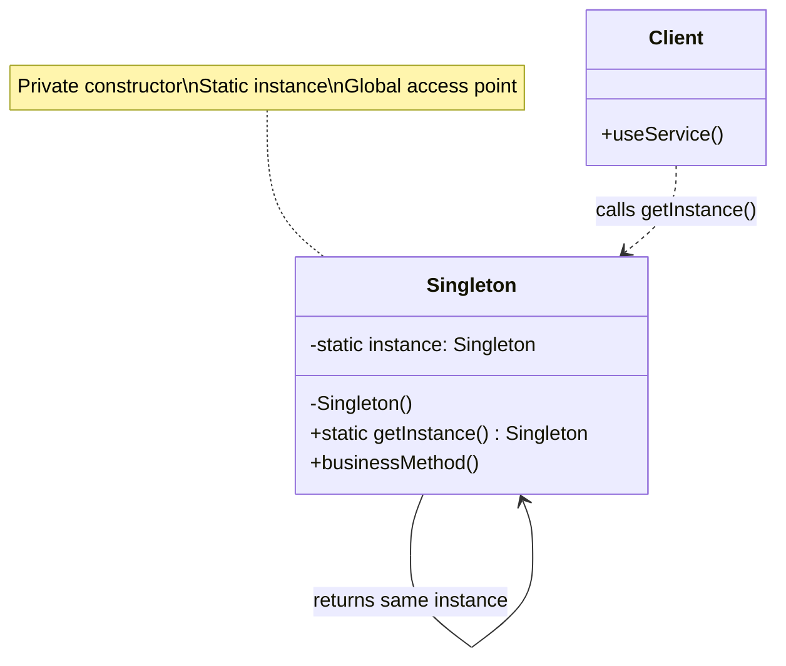
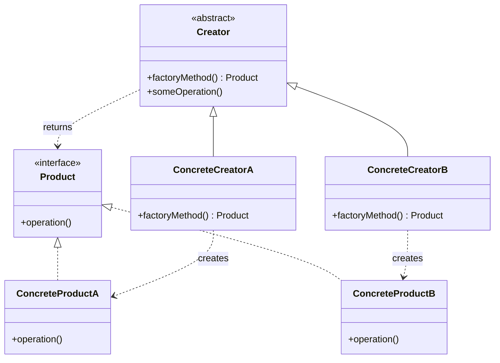
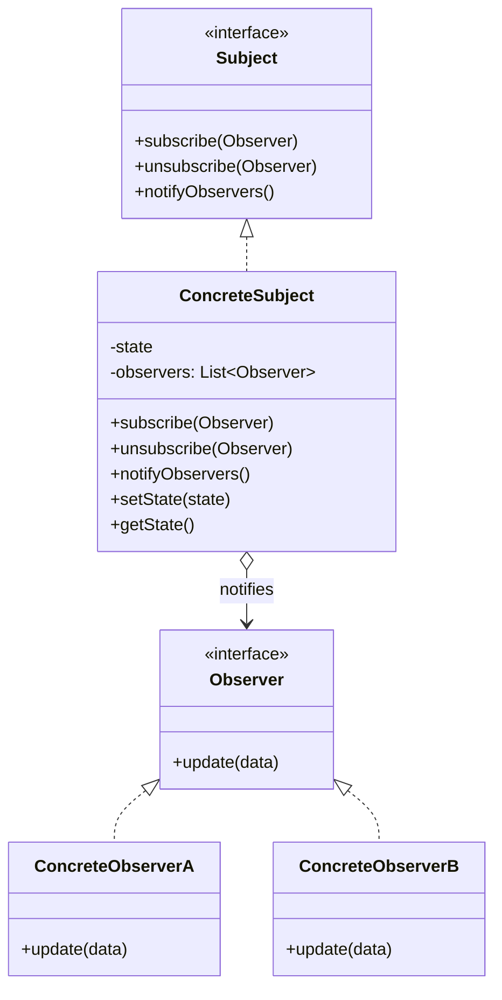
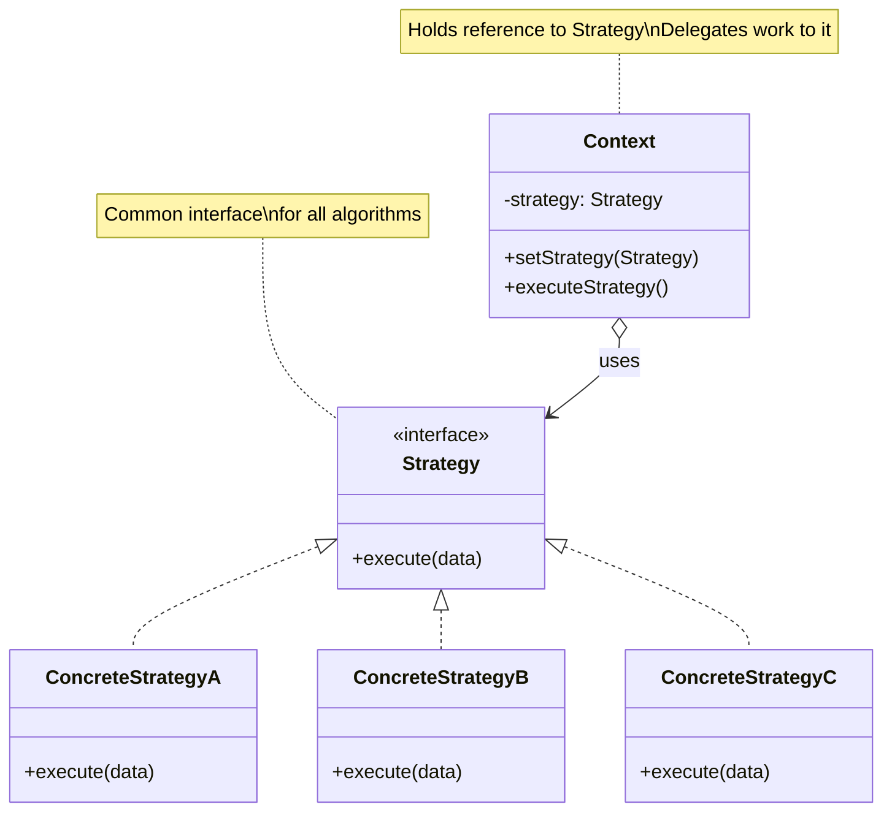

# Design Patterns

Design patterns basically common problems ke battle-tested solutions hain. Pehle ke developers ne yeh mistakes already kar li hain — tu unka faayda utha. 1994 mein chaar legends — Erich Gamma, Richard Helm, Ralph Johnson, John Vlissides — jinhe industry "Gang of Four" (GoF) kehti hai, unhone ek kitaab likhi: "Design Patterns: Elements of Reusable Object-Oriented Software". Yeh kitaab software engineering ki Bible ban gayi. Inhone 23 patterns ko teen categories mein divide kiya: Creational (object banane ke tareeke), Structural (objects ko compose karne ke tareeke), aur Behavioral (objects ke beech communication ke tareeke).

Patterns kyun matter karte hain? Pehli baat — vocabulary. Jab tu interview mein bolega "isko Strategy pattern se solve karte hain", interviewer immediately samajh jayega. Yeh ek shared language hai senior engineers ke beech. Doosri baat — patterns tujhe sikhate hain ki coupling kam kaise rakhi jaye, cohesion high kaise rakhi jaye, aur change ke liye code ko open kaise rakha jaye (Open-Closed Principle). Teesri baat — almost every framework tu use karta hai (Spring, React, Angular, Django, Rails) inhi patterns ki neev pe khada hai. Spring ka `BeanFactory` literally Factory pattern hai. React ka `useState` Observer pattern ka spiritual cousin hai. Node ka `EventEmitter` pure Observer hai.

Lekin ek warning bhi hai: patterns are tools, not rules. Junior developer ki ek classic galti hoti hai — naya pattern seekha, ab use har jagah thokenge. "Singleton everywhere", "Factory for every class". Yeh anti-pattern ban jata hai — over-engineering. GoF khud kehte the: "Prefer composition over inheritance", aur "use patterns only when the problem demands them". Toh sikh, samajh, aur tabhi use kar jab problem genuinely demand kare. Is module mein hum chaar most-asked patterns deeply cover karenge: Singleton, Factory (Method + Abstract), Observer, aur Strategy. In chaaron pe interview mein 80% questions aate hain.

---

## 1. Singleton

### 1.1 When valid, when smell — eager vs lazy, double-checked locking, enum singleton in Java; thread safety

#### Definition

Singleton ek creational pattern hai jo guarantee karta hai ki ek class ka **sirf ek hi instance** poori application mein exist karega, aur uss instance ko access karne ka ek **global access point** milega. Definition simple hai, lekin implementation mein dragons chhupe hain — thread safety, lazy loading, serialization, reflection, classloader issues.

Formally: "Ensure a class has only one instance, and provide a global point of access to it." — GoF.

Singleton ko log "easy pattern" samajhte hain, but production mein yeh sabse zyada bug-prone pattern hai. Multi-threaded environment mein agar tune galat implementation likhi, toh do instances ban sakte hain. Reflection se private constructor bypass ho sakta hai. Serialization/deserialization ke baad naya instance ban jata hai. Iss saari complexity ki wajah se Joshua Bloch (Effective Java ka author) ne enum-based singleton recommend kiya.

#### Why?

Kuch resources genuinely shared hone chahiye:

- **Configuration manager** — application config ek hi jagah load ho, sab use kare
- **Database connection pool** — multiple pools banane ka koi matlab nahi
- **Logger** — ek hi logger instance jo file pe likhe (race conditions na ho)
- **Cache** — ek hi cache jo sabko serve kare
- **Hardware access** — printer spooler, GPU driver — ek hi access point chahiye

Lekin Singleton ek **smell** bhi ho sakta hai jab:

- Tu use global state ke liye use kar raha hai (testability mar jati hai — mock karna mushkil)
- Domain objects ke liye use kar raha hai (User, Product — yeh kabhi singleton nahi hone chahiye)
- Tightly coupled code likhne ka shortcut bana raha hai
- Dependency injection se solve ho sakta hai but tu lazy hai

Modern frameworks (Spring, Angular) Singleton ko **container manage** karta hai — tu khud nahi banata. Spring mein default scope hi `singleton` hai. Toh manually Singleton likhne ki zaroorat aaj kal kam ho gayi hai, but interview mein yeh classic question hai.

#### How?

Chal step-by-step dekhte hain Java mein. Each version ki problem aur solution.

**Version 1: Eager Initialization (Simplest, Thread-Safe)**

```java
public class EagerSingleton {
    // Class load hote hi instance ban jata hai — JVM guarantee karta hai thread safety
    private static final EagerSingleton INSTANCE = new EagerSingleton();

    // Private constructor — bahar se koi naya instance nahi bana sakta
    private EagerSingleton() {
        // Reflection attack se bachne ke liye check
        if (INSTANCE != null) {
            throw new IllegalStateException("Singleton already initialized");
        }
    }

    public static EagerSingleton getInstance() {
        return INSTANCE;
    }
}
```

**Pros**: Thread-safe by JVM (class loading is atomic). Simple.
**Cons**: Agar instance heavy hai aur kabhi use nahi hua, toh memory waste. No exception handling during construction.

**Version 2: Lazy Initialization (NOT Thread-Safe — DON'T USE)**

```java
public class LazySingleton {
    private static LazySingleton instance;

    private LazySingleton() {}

    // BUG: Two threads simultaneously call kar sakte hain — do instances ban sakte hain
    public static LazySingleton getInstance() {
        if (instance == null) {           // Thread A aur B dono yahan null dekh sakte hain
            instance = new LazySingleton(); // Dono naya banayenge — DISASTER
        }
        return instance;
    }
}
```

Yeh classic interview trap hai. Race condition hai. Mat use kar production mein.

**Version 3: Synchronized Method (Thread-Safe but Slow)**

```java
public class SynchronizedSingleton {
    private static SynchronizedSingleton instance;

    private SynchronizedSingleton() {}

    // Pura method synchronized — har call pe lock lagta hai, even after instance bana
    public static synchronized SynchronizedSingleton getInstance() {
        if (instance == null) {
            instance = new SynchronizedSingleton();
        }
        return instance;
    }
}
```

**Pros**: Thread-safe.
**Cons**: Performance terrible — har `getInstance()` call pe lock acquire-release hota hai, even when instance already exist karta hai. 99% time waste.

**Version 4: Double-Checked Locking (DCL) — The Classic**

```java
public class DCLSingleton {
    // VOLATILE bahut critical hai — bina iske ye toot jata hai
    private static volatile DCLSingleton instance;

    private DCLSingleton() {}

    public static DCLSingleton getInstance() {
        if (instance == null) {                          // First check (no lock) — fast path
            synchronized (DCLSingleton.class) {           // Lock lo
                if (instance == null) {                   // Second check (with lock) — safety
                    instance = new DCLSingleton();        // Yahan create hoga
                }
            }
        }
        return instance;
    }
}
```

`volatile` keyword kyun zaroori hai? Jab `new DCLSingleton()` execute hota hai, JVM teen kaam karta hai:
1. Memory allocate
2. Constructor run
3. Reference assign

Without `volatile`, JVM step 2 aur 3 ko reorder kar sakta hai (instruction reordering optimization). Result: Thread A ne reference assign kar diya (step 3), but constructor abhi pura nahi hua (step 2). Thread B ne `instance != null` dekha aur half-constructed object use karna shuru kar diya. **Crash ya weird bugs.**

`volatile` guarantee karta hai ki writes/reads memory mein dikhe aur reordering na ho.

**Version 5: Bill Pugh / Initialization-on-Demand Holder (Recommended Lazy)**

```java
public class BillPughSingleton {
    private BillPughSingleton() {}

    // Inner static class — class tabhi load hoti hai jab pehli baar reference kiya jaye
    private static class SingletonHolder {
        private static final BillPughSingleton INSTANCE = new BillPughSingleton();
    }

    public static BillPughSingleton getInstance() {
        return SingletonHolder.INSTANCE; // Yahan SingletonHolder load hoga — lazy + thread-safe
    }
}
```

Yeh elegant solution hai. JVM ki class-loading semantics pe rely karta hai — koi explicit synchronization nahi chahiye. Lazy loading milti hai. Thread-safe hai. Bill Pugh (University of Maryland) ne yeh design diya tha.

**Version 6: Enum Singleton (Joshua Bloch's Recommendation — BEST)**

```java
public enum EnumSingleton {
    INSTANCE;

    // Apne methods yahan likh — ye singleton hai
    public void doSomething() {
        System.out.println("Working from enum singleton");
    }
}

// Usage
EnumSingleton.INSTANCE.doSomething();
```

**Why is this the best?**
1. **Reflection-proof**: `Constructor.setAccessible(true)` se enum bypass nahi hota — JVM specifically rokta hai
2. **Serialization-safe**: Default serialization se naya instance nahi banta — `readResolve()` automatic handle hota hai
3. **Thread-safe**: Enum initialization JVM-guaranteed atomic hai
4. **Concise**: 3 lines of code

Effective Java, Item 3: "A single-element enum type is the best way to implement a singleton."

**TypeScript / JavaScript Version**

```typescript
class ConfigManager {
    private static instance: ConfigManager | null = null;
    private config: Map<string, string> = new Map();

    // Private constructor — bahar se new nahi kar sakte
    private constructor() {
        // Heavy initialization — load from file ya env
        this.config.set("apiUrl", process.env.API_URL || "");
    }

    public static getInstance(): ConfigManager {
        // JS single-threaded hai (mostly) — thread safety issue nahi
        if (!ConfigManager.instance) {
            ConfigManager.instance = new ConfigManager();
        }
        return ConfigManager.instance;
    }

    public get(key: string): string | undefined {
        return this.config.get(key);
    }
}

// Usage
const config = ConfigManager.getInstance();
console.log(config.get("apiUrl"));
```

JavaScript mein thread safety ka jhanjhat nahi hai (event loop single-threaded hai), but module-level variables already singleton-like behavior dete hain. Modern JS mein log seedha module pattern use karte hain:

```typescript
// configManager.ts
const config = new Map<string, string>();
config.set("apiUrl", process.env.API_URL || "");

export function get(key: string): string | undefined {
    return config.get(key);
}

// Yeh module ek hi baar load hoga — natural singleton
```

#### Real-life Example

1. **Java Runtime**: `Runtime.getRuntime()` — JVM ka runtime singleton. Saari memory, processors info yahan se milti hai.

2. **Spring Framework**: Default bean scope `singleton` hai. `@Component`, `@Service`, `@Repository` se annotated classes container ke liye singleton hote hain. Spring khud DCL aur ConcurrentHashMap se manage karta hai.

3. **Node.js modules**: `require()` ka result cache hota hai — pehli baar load hone ke baad same instance return hota hai. `require('./db')` har file mein same `db` object dega.

4. **React Context Providers**: Theme provider, Auth provider — ek hi instance pure tree mein share hota hai (effectively singleton per provider).

5. **Logger libraries**: Log4j, Winston — application-wide logger usually singleton hota hai.

6. **Database connection pool**: HikariCP, Sequelize ka pool — singleton ke jaisa behave karta hai.

#### Diagram



#### Interview Q&A

**Q1: Singleton ko break kaise kar sakte ho? Kaise prevent karoge?**

Singleton ko teen tareeke se todh sakte ho. Pehla — **Reflection**: `Constructor<Singleton> c = Singleton.class.getDeclaredConstructor(); c.setAccessible(true); Singleton s = c.newInstance();` — yeh private constructor bypass kar deta hai. Prevention: constructor mein check karo `if (INSTANCE != null) throw new IllegalStateException()`. Doosra — **Serialization**: Singleton ko serialize karke deserialize karne pe naya object banta hai. Prevention: `readResolve()` method override karo jo existing INSTANCE return kare. Teesra — **Cloning**: Agar `Cloneable` implement kiya hai, `clone()` naya object dega. Prevention: `clone()` override karke `CloneNotSupportedException` throw karo. In sab problems ka one-shot solution: **Enum Singleton**. JVM enum ke liye reflection, serialization aur cloning sab handle karta hai automatically. Isi liye Joshua Bloch enum recommend karte hain.

**Q2: Double-Checked Locking mein `volatile` kyun zaroori hai?**

`volatile` keyword do guarantees deta hai — visibility aur ordering. Visibility: ek thread ne write kiya toh doosri thread immediately dekh paayegi (CPU cache se nahi, main memory se padhegi). Ordering: JVM `volatile` writes/reads ke around instructions reorder nahi kar sakta. DCL mein critical issue yeh hai — `instance = new Singleton()` ek atomic operation nahi hai. Yeh teen steps hai: memory allocate, constructor run, reference assign. JVM step 2 aur 3 ko swap kar sakta hai (legal optimization hai single-threaded perspective se). Without `volatile`, Thread B null check pass kar sakta hai (step 3 ho gaya) but constructor still incomplete (step 2 pending). Yeh half-initialized object access karke crash ya undefined behavior dega. `volatile` rokta hai is reordering ko aur happens-before relationship establish karta hai. Java 5 (JSR-133) ke pehle `volatile` bhi DCL ko fully fix nahi karta tha — but Java 5+ mein safe hai.

**Q3: Singleton anti-pattern kyun mana jata hai sometimes?**

Singleton ko anti-pattern teen kaaran se kehte hain. **Testability ka dushman**: Singleton global state introduce karta hai. Unit tests mein tu mock nahi kar sakta easily. Test order matter karne lagta hai (ek test ne state set ki, doosre test pe dikh rahi hai). Dependency Injection use karke iska solution milta hai. **Tight coupling**: Code direct `Singleton.getInstance()` call karta hai — abstraction nahi. Agar kal ko tujhe do instances chahiye (e.g., do databases), tu phasega. **SOLID violation**: Single Responsibility violate hota hai — class do kaam karti hai: apna business logic + apne lifecycle ka management. Modern approach: DI container (Spring, Guice, NestJS) use kar — usse bolo "is class ka singleton scope rakho", and inject karwa lo. Tujhe khud `getInstance()` likhne ki zaroorat nahi. Singleton genuinely tab valid hai jab resource genuinely shared aur unique ho — Logger, ConnectionPool, Cache.

**Q4: Spring Singleton aur GoF Singleton mein kya difference hai?**

Yeh subtle but important distinction hai. **GoF Singleton** JVM-wide hota hai — pure JVM mein ek hi instance, koi bhi class us tak access kar sakti hai static method se. Code-level guarantee. **Spring Singleton** container-wide hota hai — ek Spring `ApplicationContext` mein ek hi instance. Agar tune do `ApplicationContext` banaye (rare but possible), to do instances honge — ek per context. Plus, Spring container manage karta hai lifecycle: creation, dependency injection, destruction. Tu khud `new` nahi karta — `@Autowired` se inject hota hai. Yeh testability fix kar deta hai — tests mein tu different bean register kar sakta hai (mock). Spring use ConcurrentHashMap internally singleton beans store karne ke liye, with double-checked locking. Toh practically: Spring app mein tu rarely apna manual Singleton likhega — `@Service`, `@Component` lagao, Spring handle karega. Manual Singleton sirf tab jab framework outside ho ya legacy code mein.

---

## 2. Factory

### 2.1 Factory Method + Abstract Factory — when each, real examples (Logger.getLogger, Calendar.getInstance)

#### Definition

**Factory Method Pattern**: "Define an interface for creating an object, but let subclasses decide which class to instantiate. Factory Method lets a class defer instantiation to subclasses." — GoF.

**Abstract Factory Pattern**: "Provide an interface for creating families of related or dependent objects without specifying their concrete classes." — GoF.

Simple words: Factory tujhe `new` keyword se mukti deta hai. Tu interface ke against code likhta hai, factory tujhe correct concrete class ka instance return karta hai. Factory Method ek single product banata hai. Abstract Factory product family banata hai (related products together).

Difference samajh — agar tujhe sirf "Button" banana hai based on platform (Windows ya Mac), Factory Method use kar. Agar tujhe pura UI kit banana hai (Button + Checkbox + ScrollBar — sab Windows-style ya sab Mac-style), Abstract Factory use kar.

#### Why?

`new` keyword tightly couples client code to concrete classes. Example:

```java
PaymentProcessor p = new RazorpayProcessor(); // Razorpay se tightly coupled
```

Kal ko Stripe pe shift karna hai? Pura code badalna padega. Factory abstraction deta hai:

```java
PaymentProcessor p = PaymentFactory.create("razorpay"); // Configuration-driven
```

Factory pattern do principles enable karta hai:
1. **Open-Closed Principle**: New types add karne ke liye existing code modify nahi karna padta — sirf factory mein ek case add hota hai.
2. **Dependency Inversion**: High-level modules concrete classes pe depend nahi karte — abstraction pe depend karte hain.

Real benefits:
- **Testing**: Mock factory inject kar sakte ho — actual DB connection ke bajaye fake one.
- **Configuration-driven**: Runtime pe decide ho ki kaunsi class instantiate ho.
- **Complex construction logic**: Object banane mein 10 parameters lagte hain? Factory hide karega complexity.
- **Caching/pooling**: Factory chahe to existing instance return kare instead of new.

#### How?

**Factory Method — Simple Static Factory**

```java
// Product interface
public interface Notification {
    void send(String message);
}

// Concrete products
public class EmailNotification implements Notification {
    @Override
    public void send(String message) {
        System.out.println("Email bheja: " + message);
    }
}

public class SmsNotification implements Notification {
    @Override
    public void send(String message) {
        System.out.println("SMS bheja: " + message);
    }
}

public class PushNotification implements Notification {
    @Override
    public void send(String message) {
        System.out.println("Push bheja: " + message);
    }
}

// Factory class — yeh decide karega kaunsa banayega
public class NotificationFactory {
    public static Notification create(String type) {
        // Switch ya if-else — based on type return karenge
        return switch (type.toLowerCase()) {
            case "email" -> new EmailNotification();
            case "sms"   -> new SmsNotification();
            case "push"  -> new PushNotification();
            default      -> throw new IllegalArgumentException("Unknown type: " + type);
        };
    }
}

// Client code
public class App {
    public static void main(String[] args) {
        // Client ko EmailNotification class ka pata bhi nahi — sirf interface jaanta hai
        Notification n = NotificationFactory.create("email");
        n.send("Order confirmed");
    }
}
```

**Factory Method — True GoF Style (with subclasses)**

True Factory Method pattern subclasses use karta hai. Each creator subclass apna product decide karta hai.

```java
// Creator (abstract class)
public abstract class Dialog {
    // Template method — yeh logic same rehta hai
    public void renderDialog() {
        Button okButton = createButton(); // Factory method — subclass decide karega
        okButton.render();
        okButton.onClick();
    }

    // Factory method — subclass override karega
    protected abstract Button createButton();
}

public interface Button {
    void render();
    void onClick();
}

public class WindowsButton implements Button {
    public void render() { System.out.println("Windows button rendered"); }
    public void onClick() { System.out.println("Windows click"); }
}

public class MacButton implements Button {
    public void render() { System.out.println("Mac button rendered"); }
    public void onClick() { System.out.println("Mac click"); }
}

// Concrete creators
public class WindowsDialog extends Dialog {
    @Override
    protected Button createButton() {
        return new WindowsButton(); // Windows-specific
    }
}

public class MacDialog extends Dialog {
    @Override
    protected Button createButton() {
        return new MacButton(); // Mac-specific
    }
}

// Client
public class Application {
    private Dialog dialog;

    public void initialize(String os) {
        // Runtime pe dialog choose hota hai
        dialog = os.equals("Windows") ? new WindowsDialog() : new MacDialog();
    }

    public void render() {
        dialog.renderDialog();
    }
}
```

**Abstract Factory — Family of Products**

Ab maan le tujhe Button + Checkbox + Menu — tinon platform-specific chahiye. Abstract Factory:

```java
// Abstract products
public interface Button { void paint(); }
public interface Checkbox { void paint(); }
public interface Menu { void paint(); }

// Windows family
public class WinButton implements Button {
    public void paint() { System.out.println("Windows button"); }
}
public class WinCheckbox implements Checkbox {
    public void paint() { System.out.println("Windows checkbox"); }
}
public class WinMenu implements Menu {
    public void paint() { System.out.println("Windows menu"); }
}

// Mac family
public class MacButton implements Button {
    public void paint() { System.out.println("Mac button"); }
}
public class MacCheckbox implements Checkbox {
    public void paint() { System.out.println("Mac checkbox"); }
}
public class MacMenu implements Menu {
    public void paint() { System.out.println("Mac menu"); }
}

// Abstract Factory — family banane ka contract
public interface GUIFactory {
    Button createButton();
    Checkbox createCheckbox();
    Menu createMenu();
}

// Concrete factories — har family ka apna factory
public class WindowsFactory implements GUIFactory {
    public Button createButton()     { return new WinButton(); }
    public Checkbox createCheckbox() { return new WinCheckbox(); }
    public Menu createMenu()         { return new WinMenu(); }
}

public class MacFactory implements GUIFactory {
    public Button createButton()     { return new MacButton(); }
    public Checkbox createCheckbox() { return new MacCheckbox(); }
    public Menu createMenu()         { return new MacMenu(); }
}

// Client
public class Application {
    private final GUIFactory factory;

    public Application(GUIFactory factory) {
        this.factory = factory; // Constructor injection — DI principle
    }

    public void renderUI() {
        // Saare components same family ke — guaranteed compatibility
        factory.createButton().paint();
        factory.createCheckbox().paint();
        factory.createMenu().paint();
    }

    public static void main(String[] args) {
        String os = System.getProperty("os.name").toLowerCase();
        GUIFactory factory = os.contains("win") ? new WindowsFactory() : new MacFactory();
        new Application(factory).renderUI();
    }
}
```

Notice — Abstract Factory ka USP: tu galti se Windows button + Mac checkbox mix nahi kar sakta. Family integrity guaranteed hai.

**TypeScript Version (Factory Method)**

```typescript
// Product interface
interface PaymentGateway {
    process(amount: number): Promise<{ success: boolean; txId: string }>;
}

class StripeGateway implements PaymentGateway {
    async process(amount: number) {
        // Stripe API call
        return { success: true, txId: `stripe_${Date.now()}` };
    }
}

class RazorpayGateway implements PaymentGateway {
    async process(amount: number) {
        // Razorpay API call
        return { success: true, txId: `rzp_${Date.now()}` };
    }
}

class PaytmGateway implements PaymentGateway {
    async process(amount: number) {
        return { success: true, txId: `paytm_${Date.now()}` };
    }
}

// Factory
type GatewayType = "stripe" | "razorpay" | "paytm";

class PaymentGatewayFactory {
    // Map-based factory — switch se cleaner
    private static gateways: Record<GatewayType, () => PaymentGateway> = {
        stripe:   () => new StripeGateway(),
        razorpay: () => new RazorpayGateway(),
        paytm:    () => new PaytmGateway(),
    };

    static create(type: GatewayType): PaymentGateway {
        const factory = this.gateways[type];
        if (!factory) throw new Error(`Unknown gateway: ${type}`);
        return factory();
    }
}

// Client
const gateway = PaymentGatewayFactory.create("razorpay");
await gateway.process(1000);
```

#### Real-life Example

1. **`Calendar.getInstance()`** — Java standard library. `Calendar` abstract class hai. `getInstance()` factory method hai jo locale-specific calendar return karta hai — `GregorianCalendar` (most), `BuddhistCalendar` (Thailand), `JapaneseImperialCalendar` (Japan). Tu locale set kar, factory decide karega.

2. **`Logger.getLogger(String name)`** — `java.util.logging` aur SLF4J/Log4j sab mein. Yeh actually Singleton + Factory ka mix hai — same name pe call karoge to same logger milega (cached), naya name pe naya banega. Internal mein ConcurrentHashMap.

3. **`DriverManager.getConnection(url)`** — JDBC. URL ke prefix dekh ke (`jdbc:mysql://`, `jdbc:postgresql://`) appropriate driver use karta hai aur `Connection` return karta hai. Pure factory pattern.

4. **Spring's `BeanFactory` / `ApplicationContext`** — pura Spring ka core hi factory pattern pe khada hai. `context.getBean(MyService.class)` — Spring decide karta hai konsa instance dena hai (singleton, prototype, etc).

5. **React's `React.createElement()`** — JSX internally createElement call karta hai jo virtual DOM nodes banata hai. Factory for elements.

6. **Iterator pattern in Java collections** — `list.iterator()` factory method hai jo `Iterator` interface ka concrete implementation return karta hai (ArrayList ka iterator, LinkedList ka different).

7. **`ExecutorService` factories** — `Executors.newFixedThreadPool(10)`, `Executors.newCachedThreadPool()` — different ExecutorService implementations return karte hain.

8. **Abstract Factory in JDBC**: `Connection` interface se tu `Statement`, `PreparedStatement`, `CallableStatement` create karta hai — sab same database family ke. MySQL connection se MySQL-specific statements milte hain.

#### Diagram



#### Interview Q&A

**Q1: Factory Method aur Abstract Factory mein difference kya hai?**

Yeh classic interview question hai aur log galat answer dete hain. **Factory Method ek single product banata hai** — ek `createButton()` method jo `Button` return karta hai. Inheritance pe based hai — subclasses decide karte hain konsa concrete product banega. **Abstract Factory product family banata hai** — multiple related products together. Composition pe based hai — tu Factory object inject karta hai. Example: agar tujhe sirf platform-specific button chahiye, Factory Method enough hai (`WindowsDialog extends Dialog` apna `createButton()` override karega). Agar tujhe pura UI kit chahiye (Button + Checkbox + Menu, sab consistent), Abstract Factory use kar — `WindowsFactory` saare Windows components dega, `MacFactory` saare Mac components dega. Family integrity guaranteed. Practical rule: ek product = Factory Method, multiple related products = Abstract Factory. Often Abstract Factory internally Factory Methods use karta hai — yeh competing nahi, complementary patterns hain.

**Q2: `Logger.getLogger()` Singleton hai ya Factory? Explain.**

Trick question hai — yeh **dono hai** with a twist. Per name basis, yeh **Singleton-like** behave karta hai — `Logger.getLogger("com.app.UserService")` jitni baar bhi call karo, same instance milega. Internal mein ConcurrentHashMap hai jo name-to-Logger mapping rakhta hai. Lekin different names pe different instances banenge — toh strict Singleton nahi hai (Singleton means one instance per class). Yeh **Multiton** pattern hai actually — bounded set of instances, each keyed by some identifier. Aur creation logic factory ki tarah hai — `getLogger()` factory method hai. Toh accurate answer: "Logger.getLogger() Multiton + Factory hai. Per-name singleton, but name-based factory." Yeh real-world hai — pure patterns rarely milte hain, hybrid hote hain. SLF4J/Log4j2 same pattern follow karte hain. Naming bhi important — `getInstance()` (Singleton convention) nahi, `getLogger(name)` (Factory convention with key).

**Q3: Static Factory Method vs Constructor — kab kya use karoge?**

Static Factory Methods (jaise `Integer.valueOf(42)` vs `new Integer(42)`) ke 5 advantages hain (Effective Java, Item 1). **Pehla — naam de sakte ho**: `BigInteger.probablePrime()` zyada clear hai bajay `new BigInteger(int, int, Random)` ke. **Doosra — har call pe naya object zaroori nahi**: `Boolean.valueOf(true)` cached `TRUE` return karta hai, `new Boolean(true)` har baar naya. Memory benefit. **Teesra — subtype return kar sakte ho**: `Collections.unmodifiableList()` `List` interface return karta hai, internal class hide rehti hai. Flexibility milti hai implementation badalne ki. **Chautha — input parameters pe based different class return kar sakte ho**: `EnumSet.of()` based on size 64 elements ke neeche `RegularEnumSet`, upar `JumboEnumSet` return karta hai. **Paanchwa — class jo abhi exist nahi karti, woh return kar sakte ho** (service provider framework). Disadvantage: bina public/protected constructor ke class subclass nahi ho sakti, aur factory methods discover karna mushkil (constructors Javadoc mein top pe hote hain). General rule: agar simple object banana hai, constructor theek. Agar complex logic, caching, ya flexibility chahiye — static factory.

**Q4: Factory pattern testability kaise improve karta hai?**

Factory pattern dependency inversion enable karta hai — concrete classes pe nahi, interface pe depend karta hai. Testing mein iska direct fayda hai. Bina factory ke: `OrderService` ke andar `PaymentGateway p = new RazorpayGateway()` likha hai — test mein actual Razorpay API call jayegi (network, money, slow, flaky). Factory ke saath: `PaymentGateway p = paymentFactory.create(config.gateway)` — test mein tu `paymentFactory` ka mock pass kar de jo `MockGateway` return kare. `MockGateway.process()` test ke liye predictable response dega — true/false control mein. Modern frameworks (Spring, NestJS) is principle ko DI tak le jaate hain — tu factory bhi nahi likhta, container manage karta hai. `@Autowired PaymentGateway gateway` — production mein real implementation inject hoga, test mein `@MockBean` se mock. Iska deeper benefit: code naturally SOLID ho jata hai. SRP — class apna business logic karti hai, object creation factory ka kaam. OCP — naya gateway add karna hai, naya class banao + factory mein register, existing code untouched. Test coverage badhti hai because mocking trivial ho jati hai.

---

## 3. Observer

### 3.1 Observer pattern — Subject + Observer — used in EventEmitter (Node), DOM events, RxJS, React state

#### Definition

Observer Pattern: "Define a one-to-many dependency between objects so that when one object changes state, all its dependents are notified and updated automatically." — GoF.

Do roles hain:
- **Subject** (a.k.a. Observable, Publisher) — wo entity jiska state badalta hai
- **Observer** (a.k.a. Subscriber, Listener) — wo entities jo us state ko track karna chahti hain

Subject ek list rakhta hai apne observers ki. Jab kuch interesting hota hai, sab observers ko notify karta hai. Observer khud decide karta hai use information ka kya karna hai. Yeh decoupling ka king pattern hai — Subject ko nahi pata observers kya karenge, Observer ko nahi pata aur kaun observers hain.

Yeh pattern modern reactive programming ki neev hai. RxJS, ReactiveX (Java's RxJava), Vue's reactivity, MobX, Redux's `subscribe()` — sab Observer ke variations hain.

#### Why?

Tight coupling se bachne ke liye. Bina Observer ke kaise problem aati hai:

Maan le tujhe stock price track karna hai. Jab price change ho:
- Email alert bhejna hai
- Mobile push notification bhejna hai
- UI update karna hai
- Audit log mein likhna hai
- Trading bot ko bhej dena hai

Naive code:

```java
class Stock {
    void setPrice(double price) {
        this.price = price;
        emailService.alert(price);
        pushService.notify(price);
        ui.update(price);
        audit.log(price);
        tradingBot.signal(price);
        // Naya consumer aaya? Yahan add karo. Ab Stock class 6 cheezon ke baare mein jaanti hai.
    }
}
```

Problems:
1. **Tight coupling**: `Stock` har consumer pe depend kar raha hai.
2. **OCP violation**: Naya consumer = `Stock` class modify.
3. **Testing nightmare**: `Stock` test karne ke liye saare 5 services mock karne padenge.
4. **Single Responsibility violation**: `Stock` ka kaam price track karna hai, notification dispatching nahi.

Observer se solve:

```java
class Stock { // Subject
    List<PriceObserver> observers = new ArrayList<>();
    void subscribe(PriceObserver o) { observers.add(o); }
    void setPrice(double price) {
        this.price = price;
        observers.forEach(o -> o.onPriceChange(price));
    }
}
```

Ab `Stock` ko nahi pata kaun listening hai. Naya consumer aaya — `stock.subscribe(newConsumer)`. Stock untouched. **Pub-Sub on steroids.**

#### How?

**Java Implementation — Vanilla**

```java
// Observer interface
public interface StockObserver {
    void update(String symbol, double price);
}

// Subject interface
public interface StockSubject {
    void subscribe(StockObserver observer);
    void unsubscribe(StockObserver observer);
    void notifyObservers();
}

// Concrete Subject
public class Stock implements StockSubject {
    private final String symbol;
    private double price;
    // Observers ki list — CopyOnWriteArrayList thread-safe iteration ke liye
    private final List<StockObserver> observers = new CopyOnWriteArrayList<>();

    public Stock(String symbol, double price) {
        this.symbol = symbol;
        this.price = price;
    }

    @Override
    public void subscribe(StockObserver observer) {
        observers.add(observer);
    }

    @Override
    public void unsubscribe(StockObserver observer) {
        observers.remove(observer);
    }

    @Override
    public void notifyObservers() {
        // Sab observers ko inform karo
        for (StockObserver o : observers) {
            try {
                o.update(symbol, price);
            } catch (Exception e) {
                // Ek observer fail ho to baaki na fail ho — defensive programming
                System.err.println("Observer fail: " + e.getMessage());
            }
        }
    }

    public void setPrice(double newPrice) {
        if (this.price != newPrice) {
            this.price = newPrice;
            notifyObservers(); // State change pe notify
        }
    }
}

// Concrete Observers
public class EmailAlertObserver implements StockObserver {
    @Override
    public void update(String symbol, double price) {
        System.out.println("Email: " + symbol + " price = " + price);
    }
}

public class MobilePushObserver implements StockObserver {
    private final double threshold;

    public MobilePushObserver(double threshold) {
        this.threshold = threshold;
    }

    @Override
    public void update(String symbol, double price) {
        if (price > threshold) {
            System.out.println("Push: " + symbol + " crossed " + threshold);
        }
    }
}

public class AuditLogObserver implements StockObserver {
    @Override
    public void update(String symbol, double price) {
        System.out.println("Audit log: " + symbol + " @ " + price + " at " + System.currentTimeMillis());
    }
}

// Wiring
public class Main {
    public static void main(String[] args) {
        Stock reliance = new Stock("RELIANCE", 2500.0);

        // Multiple observers subscribe karte hain
        reliance.subscribe(new EmailAlertObserver());
        reliance.subscribe(new MobilePushObserver(2600.0));
        reliance.subscribe(new AuditLogObserver());

        reliance.setPrice(2550.0); // Sab notified
        reliance.setPrice(2650.0); // Sab notified, push observer threshold cross karega
    }
}
```

**Push vs Pull model**: Upar wala "push" model hai — Subject data observers ko bhejta hai (`update(symbol, price)`). "Pull" model mein Subject sirf bolta hai "kuch change hua", observer khud `subject.getState()` se data nikaalta hai. Push convenient hai but observer ko sab data milega chahiye na ho. Pull flexible hai but extra calls.

**TypeScript Implementation — Generic Observer**

```typescript
// Generic observer for any event type
type Observer<T> = (data: T) => void;

class EventEmitter<T> {
    // Listeners ki list — naye add hote hain, hatate bhi hain
    private listeners: Set<Observer<T>> = new Set();

    subscribe(observer: Observer<T>): () => void {
        this.listeners.add(observer);
        // Unsubscribe function return karte hain — RxJS pattern
        return () => this.listeners.delete(observer);
    }

    emit(data: T): void {
        // Copy banake iterate karte hain — agar callback ne unsubscribe kiya to issue na ho
        const snapshot = Array.from(this.listeners);
        for (const listener of snapshot) {
            try {
                listener(data);
            } catch (err) {
                console.error("Observer error:", err);
            }
        }
    }
}

// Usage — type-safe observer
interface PriceUpdate {
    symbol: string;
    price: number;
    timestamp: number;
}

const priceStream = new EventEmitter<PriceUpdate>();

// Subscribe karna — unsubscribe function milta hai
const unsubEmail = priceStream.subscribe(update => {
    console.log(`Email: ${update.symbol} = ${update.price}`);
});

const unsubAudit = priceStream.subscribe(update => {
    console.log(`Audit: ${JSON.stringify(update)}`);
});

priceStream.emit({ symbol: "INFY", price: 1500, timestamp: Date.now() });

// Cleanup
unsubEmail(); // Email observer hata diya
priceStream.emit({ symbol: "INFY", price: 1550, timestamp: Date.now() }); // Sirf audit
```

**Memory Leak Warning**: Observer pattern ka biggest gotcha — listeners hatana bhul gaye, garbage collection nahi hogi. Long-running app mein listeners accumulate karte hain, memory grow karti hai. React mein `useEffect` ka cleanup function isi liye exist karta hai. RxJS mein `Subscription.unsubscribe()` zaroori hai.

#### Real-life Example

1. **Node.js EventEmitter** — Pure Observer pattern. `events` module. `emitter.on('event', callback)` — subscribe. `emitter.emit('event', data)` — notify. Saara Node ecosystem (HTTP server, streams, child_process) iss pe khada hai.
   ```js
   const EventEmitter = require('events');
   const emitter = new EventEmitter();
   emitter.on('userSignup', (user) => sendWelcomeEmail(user));
   emitter.on('userSignup', (user) => createDefaultProfile(user));
   emitter.emit('userSignup', { id: 1, email: 'a@b.com' });
   ```

2. **DOM Events** — Browser ka entire event system Observer hai. `element.addEventListener('click', handler)` — subscribe. Browser internal mein event aane pe sab listeners ko notify karta hai. `removeEventListener` — unsubscribe.

3. **RxJS Observables** — Reactive streams. `Observable` (Subject) `Subscriber` (Observer) ko events emit karta hai. Plus operators: `map`, `filter`, `debounce`. Angular framework deeply RxJS pe based hai.

4. **React state updates** — Strictly speaking React internally Observer-like hai. `useState` ka setter call hua, React subscribed components ko re-render karta hai. Redux mein `store.subscribe(listener)` literal Observer hai. `useSyncExternalStore` hook bhi yahi pattern hai.

5. **Spring's ApplicationEvent** — Spring framework mein `ApplicationEventPublisher` aur `@EventListener`. Loosely coupled communication beech ke beans mein.

6. **Java's Swing / AWT** — `ActionListener`, `MouseListener` — Observer pattern. Button pe click hua, saare listeners notified.

7. **WebSocket subscriptions** — Server publishes, multiple clients subscribed. Stock tickers, chat messages, live scores.

8. **Database triggers / change data capture** — Table mein change hua, listeners (other systems) notified.

9. **Vue 3 reactivity** — `ref`, `reactive`, `watch`, `computed` — Proxy-based but conceptually Observer. Dependency tracking hota hai.

#### Diagram



#### Interview Q&A

**Q1: Observer pattern mein memory leak kaise hota hai aur kaise prevent karoge?**

Memory leak Observer ka classic problem hai. Subject observers ki strong references rakhta hai. Agar observer unsubscribe nahi hua, garbage collector use clean nahi kar sakta — Subject ne reference pakdi hai. Long-running applications (servers, single-page apps) mein yeh slowly memory eat karta hai. **Real example**: React component subscribe karta hai event emitter pe, component unmount ho gaya but unsubscribe nahi kiya — emitter still callback ko call karega, "setState on unmounted component" warning. Memory bhi leak hogi. **Solutions**: (1) **Explicit unsubscribe**: React mein `useEffect` cleanup function — `return () => emitter.off(handler)`. RxJS mein `subscription.unsubscribe()`. Angular mein `takeUntil(destroy$)` pattern. (2) **Weak references**: Java mein `WeakReference<Observer>` use kar — agar observer kahin aur strongly referenced nahi hai, GC clean kar dega. Spring's event listener proxies weak refs use karte hain. (3) **AutoCloseable / try-with-resources**: Subscription ko `AutoCloseable` bana, `try` block end pe auto close. (4) **Bounded lifetime**: Component-scoped observers — component destroy hote hi observers bhi destroy. Modern frameworks isi liye lifecycle hooks dete hain — `useEffect` cleanup, `ngOnDestroy`, etc.

**Q2: Push vs Pull observer mein kya farq hai?**

**Push model**: Subject data observer ko explicitly bhejta hai — `observer.update(symbol, price, timestamp, volume)`. Convenient — observer ko data ke liye nahi puchhna padta. Lekin coupling badh jata hai — Subject decide karta hai kya bhejna hai. Agar naya field chahiye, signature change. Plus, observer ko shayad pure data ki zaroorat na ho — bandwidth waste. Most useful jab data small hai aur observers usually use karte hain. Node EventEmitter, DOM events — push model. **Pull model**: Subject sirf bolta hai "kuch change hua" — `observer.update(this)`. Observer apni zaroorat ke hisab se Subject ko query karta hai — `subject.getPrice()`, `subject.getVolume()`. Decoupling acchi — Subject ko nahi pata observer kya use karega. Lekin extra round-trips, complexity. RxJS hybrid hai — typed payloads (push) but selective operators (filter, map) se pull-like behavior. **Practical advice**: Default push, agar data heavy hai ya partial use hai to pull. Modern reactive systems (RxJS, Reactor) push by default with operators for filtering — best of both.

**Q3: Observer aur Pub-Sub pattern mein difference hai kya?**

Subtle but important difference hai. **Observer pattern**: Subject aur Observer ek-doosre ko directly jaante hain. Observer Subject pe `subscribe()` call karta hai. Coupling exists — observer hold karta hai subject ka reference (ya ulta). Same process, in-memory. **Pub-Sub pattern**: Publisher aur Subscriber ek-doosre ko nahi jaante. Beech mein ek **broker** (message bus, event bus, topic) hota hai. Publisher topic pe message bhejta hai, broker subscribers ko deliver karta hai. Decoupling complete — publisher ko nahi pata kaun subscribers hain (ya hain bhi ya nahi). Often distributed (Kafka, RabbitMQ, Redis Pub-Sub, Google Pub-Sub). Async by nature. **Differences summary**: (1) Observer = synchronous mostly, Pub-Sub = async usually. (2) Observer = same process, Pub-Sub = distributed often. (3) Observer = direct knowledge, Pub-Sub = broker mediates. (4) Observer = simpler, Pub-Sub = scalable but complex. **Spectrum**: GoF Observer → Java events → Spring ApplicationEvent → Local event bus (Guava EventBus) → Distributed Pub-Sub (Kafka). Coupling decrease karta jata hai, complexity badhti jati hai. Interview answer: Observer is in-process pattern, Pub-Sub is architectural pattern often distributed via broker.

**Q4: React's useState Observer pattern hai? Explain karo.**

Sort of — yeh exactly GoF Observer nahi, but spiritually same hai. Jab tu `const [count, setCount] = useState(0)` likhta hai, React internally is component ko us state ka subscriber bana deta hai. Jab `setCount(5)` call hota hai (Subject ka state change), React notify karta hai us component ko (Observer) — re-render trigger karke. Multiple components agar `useContext` ya `useSyncExternalStore` se same state subscribe kar rahe hain, sab notify hote hain — pure one-to-many. Lekin GoF Observer se differences hain: (1) Tu manually `subscribe`/`unsubscribe` nahi karta — React lifecycle handle karta hai. (2) Notification "render schedule" hai, immediate callback nahi — batched. (3) Reconciliation step (virtual DOM diff) Observer pattern mein nahi hai, React-specific hai. **Redux clearer Observer hai**: `store.subscribe(listener)` literal Observer API hai. Jab `dispatch` hota hai, saare subscribed listeners called. React-Redux library iska use karta hai connect/useSelector ke liye. **MobX bhi**: observable state, reaction observers. **Modern reactive frameworks (Vue, Solid, Svelte)** sab variations of Observer hain — fine-grained reactivity ke liye. Toh interview answer: "useState reactive paradigm hai jo Observer ki neev pe based hai. Subject = state, Observers = subscribed components, notify = re-render trigger."

---

## 4. Strategy

### 4.1 Plug-and-play algorithms — payment gateway example, sorting strategies, validation strategies

#### Definition

Strategy Pattern: "Define a family of algorithms, encapsulate each one, and make them interchangeable. Strategy lets the algorithm vary independently from clients that use it." — GoF.

Simple words: Tujhe ek kaam karna hai (sort karna, payment process karna, compress karna), aur multiple algorithms hain. Strategy bolta hai — har algorithm ko ek class bana de, sab same interface implement karein, runtime pe inject karo. Client code algorithm interface ke against likhega — concrete algorithm change karna trivial.

Yeh "if-else" hell ka killer hai. Jab tu likh raha ho:
```
if (type == "credit") { ... }
else if (type == "debit") { ... }
else if (type == "upi") { ... }
else if (type == "wallet") { ... }
```

— yeh Strategy pattern ke liye scream kar raha hai. Har case alag class banao, polymorphism use karo, conditionals khatam.

#### Why?

1. **Open-Closed Principle**: Naya algorithm add karna hai? Naya class banao implementing the interface. Existing code untouched.

2. **Single Responsibility**: Har algorithm apni class mein. Pehle ek mega-method 500 lines ki thi — ab 10 classes 50-50 lines ki.

3. **Testability**: Har strategy independently test ho. Client class ko mock strategy se test kar sakte ho.

4. **Runtime flexibility**: User config ke based pe strategy select kar — feature flags, A/B testing.

5. **Replaces inheritance with composition**: Bina inheritance ke behavior reuse kar sakta hai. "Has-a strategy" > "Is-a algorithm".

Strategy aur Factory often saath chalte hain — Factory tujhe right Strategy deta hai, Strategy us algorithm ko execute karta hai.

#### How?

**Java Example — Payment Gateway Strategy**

```java
// Strategy interface — sab payment methods iska contract follow karenge
public interface PaymentStrategy {
    PaymentResult pay(BigDecimal amount, String accountId);
    boolean supports(BigDecimal amount); // Limits check kar sakta hai
}

// Result POJO
public record PaymentResult(boolean success, String transactionId, String message) {}

// Concrete strategies
public class CreditCardStrategy implements PaymentStrategy {
    private final String cardNumber;
    private final String cvv;
    // Constructor

    @Override
    public PaymentResult pay(BigDecimal amount, String accountId) {
        // Credit card gateway call — Stripe, etc.
        // Real code mein actual API call
        System.out.println("Credit card se " + amount + " pay kiya");
        return new PaymentResult(true, "cc_" + System.nanoTime(), "OK");
    }

    @Override
    public boolean supports(BigDecimal amount) {
        // Credit card mein typically high limit
        return amount.compareTo(new BigDecimal("500000")) <= 0;
    }
}

public class UpiStrategy implements PaymentStrategy {
    private final String vpa; // user@bank

    public UpiStrategy(String vpa) { this.vpa = vpa; }

    @Override
    public PaymentResult pay(BigDecimal amount, String accountId) {
        // UPI flow — NPCI ka API
        System.out.println("UPI se " + amount + " pay kiya to " + vpa);
        return new PaymentResult(true, "upi_" + System.nanoTime(), "OK");
    }

    @Override
    public boolean supports(BigDecimal amount) {
        // UPI per-transaction limit ~1 lakh (varies)
        return amount.compareTo(new BigDecimal("100000")) <= 0;
    }
}

public class WalletStrategy implements PaymentStrategy {
    private final String walletProvider; // Paytm, PhonePe

    public WalletStrategy(String walletProvider) { this.walletProvider = walletProvider; }

    @Override
    public PaymentResult pay(BigDecimal amount, String accountId) {
        System.out.println("Wallet (" + walletProvider + ") se " + amount + " pay kiya");
        return new PaymentResult(true, "wlt_" + System.nanoTime(), "OK");
    }

    @Override
    public boolean supports(BigDecimal amount) {
        // Wallet typically smaller limits
        return amount.compareTo(new BigDecimal("20000")) <= 0;
    }
}

public class NetBankingStrategy implements PaymentStrategy {
    @Override
    public PaymentResult pay(BigDecimal amount, String accountId) {
        System.out.println("Net banking se " + amount + " pay kiya");
        return new PaymentResult(true, "nb_" + System.nanoTime(), "OK");
    }

    @Override
    public boolean supports(BigDecimal amount) {
        return true; // Koi specific limit nahi
    }
}

// Context — yeh class strategy use karti hai
public class PaymentProcessor {
    private PaymentStrategy strategy;

    // Setter — strategy runtime pe change kar sakte hain
    public void setStrategy(PaymentStrategy strategy) {
        this.strategy = strategy;
    }

    public PaymentResult processPayment(BigDecimal amount, String accountId) {
        if (strategy == null) {
            throw new IllegalStateException("Strategy set nahi hai bhai");
        }
        if (!strategy.supports(amount)) {
            return new PaymentResult(false, null, "Amount strategy ke limit mein nahi hai");
        }
        return strategy.pay(amount, accountId);
    }
}

// Client
public class CheckoutService {
    public static void main(String[] args) {
        PaymentProcessor processor = new PaymentProcessor();

        // Order 1: Choti payment — UPI use kar
        processor.setStrategy(new UpiStrategy("user@paytm"));
        processor.processPayment(new BigDecimal("500"), "ORDER001");

        // Order 2: Badi payment — credit card
        processor.setStrategy(new CreditCardStrategy("1234...", "123"));
        processor.processPayment(new BigDecimal("250000"), "ORDER002");

        // Order 3: Wallet
        processor.setStrategy(new WalletStrategy("PhonePe"));
        processor.processPayment(new BigDecimal("1500"), "ORDER003");
    }
}
```

**TypeScript — Sorting Strategies**

```typescript
// Strategy interface
interface SortStrategy<T> {
    sort(data: T[]): T[];
    name: string;
}

// Concrete strategies
class BubbleSortStrategy<T> implements SortStrategy<T> {
    name = "BubbleSort";

    sort(data: T[]): T[] {
        // Choti list ke liye okay — O(n^2)
        const arr = [...data]; // Mutate na karein input
        const n = arr.length;
        for (let i = 0; i < n - 1; i++) {
            for (let j = 0; j < n - i - 1; j++) {
                if (arr[j] > arr[j + 1]) {
                    [arr[j], arr[j + 1]] = [arr[j + 1], arr[j]];
                }
            }
        }
        return arr;
    }
}

class QuickSortStrategy<T> implements SortStrategy<T> {
    name = "QuickSort";

    sort(data: T[]): T[] {
        // Average O(n log n) — production ke liye accha
        if (data.length <= 1) return [...data];
        const pivot = data[Math.floor(data.length / 2)];
        const left = data.filter(x => x < pivot);
        const middle = data.filter(x => x === pivot);
        const right = data.filter(x => x > pivot);
        return [...this.sort(left), ...middle, ...this.sort(right)];
    }
}

class NativeSortStrategy<T> implements SortStrategy<T> {
    name = "NativeSort";

    sort(data: T[]): T[] {
        // V8 ka TimSort — best for most production cases
        return [...data].sort();
    }
}

// Context
class DataSorter<T> {
    constructor(private strategy: SortStrategy<T>) {}

    setStrategy(strategy: SortStrategy<T>): void {
        this.strategy = strategy;
    }

    sort(data: T[]): T[] {
        console.log(`Using ${this.strategy.name}`);
        const start = performance.now();
        const result = this.strategy.sort(data);
        const elapsed = performance.now() - start;
        console.log(`Sorted ${data.length} items in ${elapsed.toFixed(2)}ms`);
        return result;
    }
}

// Usage — runtime decision based on size
const data = [5, 2, 8, 1, 9, 3, 7, 4, 6];
const sorter = new DataSorter<number>(new BubbleSortStrategy());

if (data.length < 50) {
    sorter.setStrategy(new BubbleSortStrategy()); // Choti list
} else if (data.length < 100000) {
    sorter.setStrategy(new QuickSortStrategy()); // Medium
} else {
    sorter.setStrategy(new NativeSortStrategy()); // Bigger — native engine fastest
}
sorter.sort(data);
```

**Validation Strategies — Real-World Form Validation**

```typescript
// Strategy
interface ValidationStrategy {
    validate(value: string): { valid: boolean; error?: string };
}

class EmailValidation implements ValidationStrategy {
    validate(value: string) {
        // Simplified regex — real mein RFC 5322 use karo
        const re = /^[^\s@]+@[^\s@]+\.[^\s@]+$/;
        return re.test(value)
            ? { valid: true }
            : { valid: false, error: "Invalid email format" };
    }
}

class PhoneValidation implements ValidationStrategy {
    validate(value: string) {
        // Indian 10-digit
        const re = /^[6-9]\d{9}$/;
        return re.test(value)
            ? { valid: true }
            : { valid: false, error: "Invalid Indian phone number" };
    }
}

class PanCardValidation implements ValidationStrategy {
    validate(value: string) {
        // PAN format: 5 letters, 4 digits, 1 letter
        const re = /^[A-Z]{5}[0-9]{4}[A-Z]$/;
        return re.test(value)
            ? { valid: true }
            : { valid: false, error: "Invalid PAN format" };
    }
}

class AadhaarValidation implements ValidationStrategy {
    validate(value: string) {
        // 12 digits, Verhoeff checksum (simplified)
        const re = /^\d{12}$/;
        return re.test(value)
            ? { valid: true }
            : { valid: false, error: "Aadhaar 12 digits hone chahiye" };
    }
}

// Context
class FormField {
    constructor(
        public name: string,
        private strategies: ValidationStrategy[]
    ) {}

    validate(value: string): { valid: boolean; errors: string[] } {
        const errors: string[] = [];
        for (const strategy of this.strategies) {
            const result = strategy.validate(value);
            if (!result.valid && result.error) errors.push(result.error);
        }
        return { valid: errors.length === 0, errors };
    }
}

// Usage
const emailField = new FormField("email", [new EmailValidation()]);
const phoneField = new FormField("phone", [new PhoneValidation()]);
const panField = new FormField("pan", [new PanCardValidation()]);

console.log(emailField.validate("user@example.com")); // valid
console.log(phoneField.validate("9876543210"));        // valid
console.log(panField.validate("ABCDE1234F"));          // valid
```

#### Real-life Example

1. **Java's `Comparator`** — Pure Strategy pattern. `Collections.sort(list, comparator)` — comparator is Strategy. Tu different comparators pass kar — alphabetical, numerical, reverse, custom.
   ```java
   List<Person> people = ...;
   people.sort(Comparator.comparing(Person::getAge));     // Strategy 1
   people.sort(Comparator.comparing(Person::getName));    // Strategy 2
   people.sort(Comparator.comparing(Person::getSalary).reversed()); // Strategy 3
   ```

2. **Spring's `AuthenticationProvider`** — Different auth strategies (DB, LDAP, OAuth2, JWT). Same interface. Spring Security configuration mein strategies plug-in.

3. **`java.util.zip`** — `Deflater` mein different compression levels (NO_COMPRESSION, BEST_SPEED, BEST_COMPRESSION) — strategy variants.

4. **JavaScript Array methods with callbacks** — `Array.prototype.sort(compareFn)`, `filter(predicate)`, `map(mapper)`, `reduce(reducer)` — function-based strategy pattern. Functional flavor.

5. **Express.js middleware** — Each middleware is essentially a strategy. Plug different auth/logging/parsing strategies.

6. **Passport.js authentication** — `passport.use(new LocalStrategy(...))`, `new GoogleStrategy(...)`, `new FacebookStrategy(...)` — literal Strategy pattern in name and implementation.

7. **Stripe Connect / Payment routing** — Different payout strategies based on geography, business type. Stripe internally uses strategy-based routing.

8. **Logger appenders (Log4j, Logback)** — File appender, Console appender, Network appender — different output strategies.

9. **Redux `combineReducers`** — Each reducer is a strategy for handling a slice of state.

10. **AWS SDK / Boto3 retry strategies** — `StandardRetryStrategy`, `AdaptiveRetryStrategy` — different backoff approaches.

#### Diagram



#### Interview Q&A

**Q1: Strategy pattern aur State pattern mein kya difference hai? Structure same dikhta hai.**

Yeh classic gotcha question hai. Structurally dono **identical** hain — context object jo abstract interface ka reference rakhta hai, multiple concrete implementations. UML diagram literally same banta hai. Difference **intent** mein hai. **Strategy**: Algorithms interchangeable hain — "do same thing, different ways". Client decide karta hai konsi strategy use karni hai. Strategies usually independent — ek dusre ke baare mein nahi jaante. State change usually external trigger pe (user choice, config). Example: Sort kar — bubble, quick, merge — sab same kaam, different efficiency. Client pe depend karta hai. **State**: Object ka behavior badalta hai uske internal state ke saath — "I am in different states". State transitions internal hote hain — current state next state decide karta hai. States often ek dusre ke baare mein jaante hain (transitions). Example: Order workflow — Placed → Paid → Shipped → Delivered. Order class ka behavior har state mein different — `cancel()` Placed mein allowed hai, Shipped mein nahi. Transitions order ke logic se hote hain. **Memory hack**: Strategy = "how to do" (algorithm choice), State = "what to do based on what I am" (lifecycle behavior). Strategy is stateless usually, State is the state itself.

**Q2: Strategy pattern ki kab zaroorat nahi hai? Over-engineering kab hota hai?**

Strategy hammer mat bana — har conditional ko strategy mein convert karna anti-pattern hai. **Avoid Strategy when**: (1) **Algorithms rarely change**: Agar tu jaanta hai ki sirf 2 algorithms kabhi honge aur dono simple hain, plain `if-else` zyada readable. Premature abstraction. (2) **Algorithms tightly coupled to context**: Strategy ko context ka pura state chahiye to access karne ke liye, lots of getters/setters. Encapsulation tut rahi hai. Indication ki shayad Strategy nahi, refactoring kuch aur chahiye. (3) **Single algorithm with parameters**: Agar bas behavior parameters se control ho raha hai (e.g., compression level 1-9), function arguments enough hain — strategies banane ki need nahi. (4) **First-class functions available**: Java 8+ ya JS mein, lambda/function pass karna often Strategy class banane se simpler. `list.sort((a, b) -> a.age - b.age)` — implicit strategy hai. Full class banane ki need tab jab strategy ke pass khud state ho ya complex setup ho. (5) **YAGNI**: "We might add more algorithms later" — speculative. Add when actually needed. Refactoring se Strategy introduce karna easy hai. **Sign that Strategy is right**: Multiple existing algorithms, runtime selection needed, OCP being violated by current code, algorithms have non-trivial size/state.

**Q3: Strategy pattern ko functional programming mein kaise express karte hain?**

Functional languages mein Strategy pattern often **ek function** se solve hota hai — kyunki functions first-class citizens hain. **Java 8+ example**: Pehle `Comparator` interface ka instance banana padta tha — anonymous class, lambda, method reference. Aaj: `list.sort(Comparator.comparingInt(Employee::getSalary))`. Yeh Strategy hai — interchangeable algorithm — but boilerplate-free. Lambda hi strategy hai. **JavaScript**: Higher-order functions naturally Strategy support karte hain. `array.filter(predicate)`, `array.sort(compareFn)`, `array.map(mapper)` — predicate, compareFn, mapper — sab strategies. Kya tu OOP class banayega `Predicate`, `Comparator`, `Mapper`? Functional way mein bas function dena. **Haskell/Scala** type-classes aur higher-kinded types se aur powerful — strategy + type-safety ka best. **Trade-offs**: Function-as-strategy concise hai but jab strategy mein internal state ho (counters, configs, dependencies), class better hai. E.g., RetryStrategy jise max attempts, backoff config, metrics chahiye — class as strategy zyada clean. Pure stateless strategies (predicates, mappers, comparators) function as strategy. **Hybrid approach**: Modern Java/TS mein interface with single abstract method (functional interface, FI) — class likhna ho ya lambda, dono possible. Best of both worlds. Spring's `Function<T,R>`, Java's `Predicate<T>` — OOP Strategy with FP ergonomics.

**Q4: Real production code mein Strategy + Factory + DI kaise saath kaam karte hain? Example do.**

Yeh senior-level question hai. Production mein patterns akele nahi aate — ek pure system bante hain. Maan le payment processing example. **Setup**: `PaymentStrategy` interface (Strategy). `CreditCardStrategy`, `UpiStrategy`, `WalletStrategy` concrete implementations. **Spring DI ke saath**:
```java
@Service
public class CreditCardStrategy implements PaymentStrategy { ... }

@Service
public class UpiStrategy implements PaymentStrategy { ... }

@Component
public class PaymentStrategyFactory {
    private final Map<String, PaymentStrategy> strategies;

    // Spring saari beans ko Map mein inject karta hai — bean name -> bean
    public PaymentStrategyFactory(List<PaymentStrategy> strategyList) {
        this.strategies = strategyList.stream()
            .collect(Collectors.toMap(
                s -> s.getClass().getSimpleName().replace("Strategy", "").toLowerCase(),
                Function.identity()
            ));
    }

    public PaymentStrategy getStrategy(String type) {
        return Optional.ofNullable(strategies.get(type.toLowerCase()))
            .orElseThrow(() -> new IllegalArgumentException("Unknown: " + type));
    }
}

@Service
public class PaymentService {
    private final PaymentStrategyFactory factory;

    public PaymentService(PaymentStrategyFactory factory) {
        this.factory = factory; // DI
    }

    public PaymentResult pay(PaymentRequest req) {
        PaymentStrategy strategy = factory.getStrategy(req.getMethod());
        return strategy.pay(req.getAmount(), req.getAccount());
    }
}
```
Yahan saare patterns mil rahe hain: **Strategy** = different payment algorithms, **Factory** = string se Strategy resolve karna, **DI** = Spring container saari strategies aur factory inject karta hai. **Open-Closed**: Naya payment method? Naya `@Service class CryptoStrategy implements PaymentStrategy` likho — Spring auto-detect karega, factory mein add ho jayega. Existing code untouched. **Testing**: PaymentService test karne ke liye factory mock karo, expected strategy return karwao. Production mein log shows ki saare GoF patterns ka power tab khulta hai jab yeh framework ke saath align ho — Spring iss type ke composition ko first-class support deta hai.

---

## Resources & further reading

- **Gang of Four (GoF) book**: "Design Patterns: Elements of Reusable Object-Oriented Software" — Erich Gamma, Richard Helm, Ralph Johnson, John Vlissides (1994). Bible. Density ke wajah se beginner ke liye dense, but reference ke liye must-have.
- **Head First Design Patterns** — Eric Freeman, Elisabeth Robson. Visual, fun, beginner-friendly. Singleton, Factory, Observer, Strategy sab cover hote hain pizza-store style examples se.
- **Effective Java** — Joshua Bloch. Item 1 (static factory methods), Item 3 (enum singleton), Item 16 (favor composition) — pattern principles deeply. Java pe likhne wale ke liye must.
- **Clean Code** & **Clean Architecture** — Robert C. Martin (Uncle Bob). SOLID principles, jin pe patterns based hain.
- **Refactoring** — Martin Fowler. Patterns introduce karne ka systematic approach.
- **refactoring.guru** — Online resource, har pattern visual diagrams + multi-language code examples ke saath. Free tier kaafi accha hai.
- **SourceMaking** — Patterns + anti-patterns + refactoring techniques.
- **Java Concurrency in Practice** — Brian Goetz. Thread-safe Singleton aur Observer ke deep details ke liye essential.
- **You Don't Know JS Yet** — Kyle Simpson. JS-specific implementation idioms.
- **Awesome Design Patterns (GitHub)** — Curated list of pattern resources across languages.
- **Spring Framework source code** — Real-world usage of patterns. `BeanFactory`, `ApplicationContext` reading se sikhne ko bahut milta hai.
- **React source code** (specifically Fiber reconciler) — Observer pattern at scale.
- **RxJS documentation** — Observer pattern with operators, marble diagrams.

Ek baat yaad rakh: patterns sikhne se zyada important hai unhe **identify karna**. Existing codebases mein dekh — Spring, Express, React, Django — har jagah ye patterns chhupe hain. Jab tu code padhega aur "yeh Factory hai", "yeh Strategy hai" identify karne lagega, tabhi tu samjhega ki seniors kya code likhte hain. Aur jab khud likhega, problem solve karne ka pehla instinct conditional nahi, abstraction hoga. Yahin se senior engineer banta hai.

### A few extra words on practical mindset

Patterns ko ek kit ki tarah dekho — toolbox mein 23 tools hain, lekin tu har screw ke liye drill nahi nikaalega. Pehle samajh ki problem actually kya hai. **Symptom recognition** zaroori hai: long if-else chains (Strategy ya Chain of Responsibility), object construction blowing up complexity (Factory ya Builder), behavior ko propagate karna multiple consumers tak (Observer), expensive single-instance resources (Singleton), behavior change kar with internal state (State), incompatible interfaces (Adapter), wrap functionality without subclassing (Decorator). Jab tu codebase mein review karta hai, in symptoms ko spot karna seekh — yahi senior engineer ka pattern matching hai.

Doosri baat — **patterns ke saath SOLID principles internalize kar**. Patterns SOLID ka manifestation hain. Strategy = OCP + DIP. Factory = DIP + SRP. Observer = OCP + LSP. Singleton (rightly used) = controlled SRP for shared resources. Jab tu pattern likh raha ho but SOLID violate ho raha ho, ruk ja — kuch galat hai. Patterns are means, not ends.

Teesri baat — modern frameworks pattern boilerplate kam karte hain. Spring tujhe DI deta hai — Factory + Singleton mostly built-in. React/Vue/Solid Observer ke variations natively dete hain. Pattern manually likhne ki need rare hoti ja rahi hai. Lekin samajhna fir bhi zaroori hai — kyunki framework debug karte time, ya custom abstractions banate time, in patterns ka knowledge differentiator hai. Aur interview mein toh poochenge hi — yahin se aata hai "yeh banda fundamentals jaanta hai" wala impression. Practice kar — apne side projects mein deliberately patterns implement kar, fir refactor kar simpler version mein, dono ka diff samajh. Yeh exercise tujhe pattern ka real-world judgment dega.
