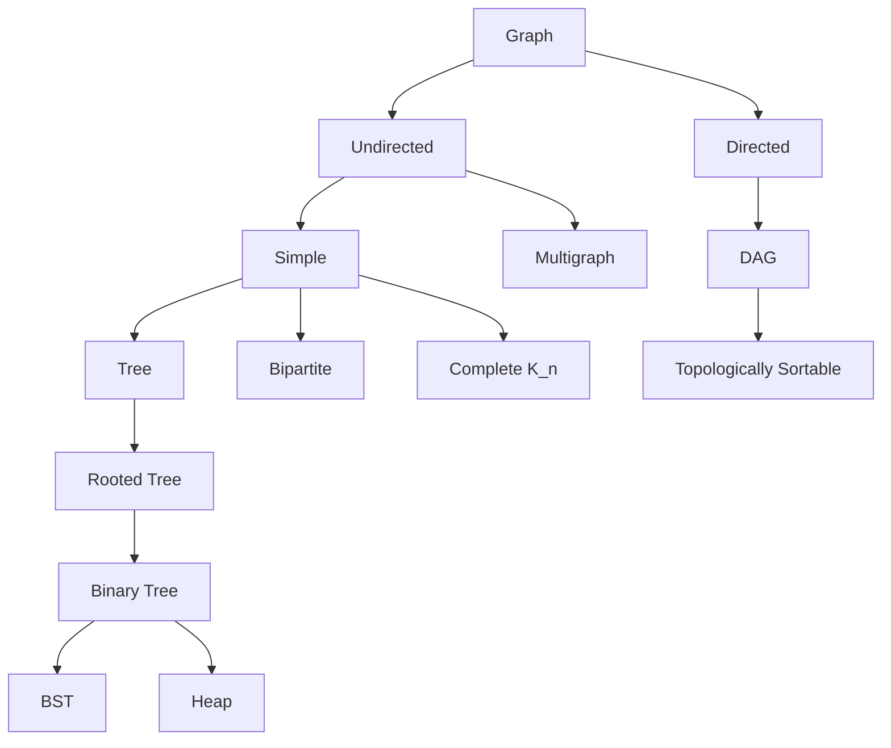
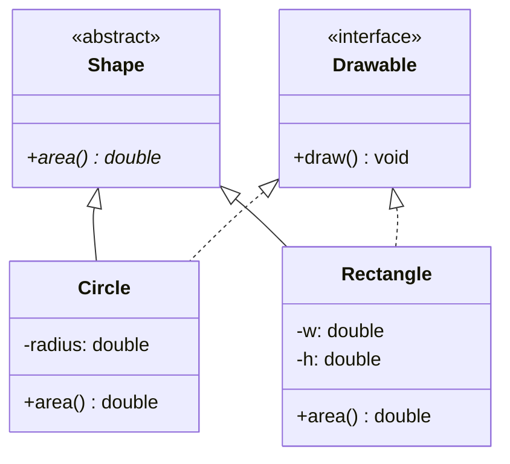

# Discrete Mathematics + Advanced OOP — The Hidden Foundations

Bhai, sach bata du? DSA tu padh leta hai, system design ke 14 patterns ratta maar leta hai, lekin jab interviewer puchta hai *"Prove that your algorithm terminates"* ya *"Show me the equivalence relation your union-find induces"* — tab tu blank ho jaata hai. Wajah simple hai: **Discrete Math** ko tu skip kar gaya. Aur LLD round mein jab woh bolta hai *"Refactor this with LSP-safe inheritance"*, to tu rote-learning ke saath SOLID ratta to bol deta hai par apply nahi kar paata. Wajah: **Advanced OOP** kabhi pillar-by-pillar apne haath se nahi likha.

Iss subject ka iraada: in dono Layer-0 holes ko ek hi shot mein band karna. Pehla half pure math hai — set theory, logic, combinatorics, graph theory, number theory, relations — GATE CSE ka complete paper-1 syllabus aur Google/Goldman/Adobe interview ka silent prerequisite. Doosra half OOP ko aage le jaata hai jahaan `clean-code-solid` chhoda tha — 4 pillars deeper, UML notation, GoF design patterns ka full survey, aur woh ek line jo 90% senior engineers galat samajhte hain: **"favour composition over inheritance."**

Voice rule: Hinglish mein samjhaunga, lekin jab notation likhna hai (∀, ∃, ⊕, U_n, GCD), aur jab Java code likhna hai, tab pure precise English. Math is unforgiving; code is unambiguous. Chai pani saath rakh, A4 sheet aur pen le, kyunki yahan dry reading se kuch nahi hoga — kalam chalega tabhi yaad rahega.

---

# PART 1 — DISCRETE MATHEMATICS

## 1. Why Discrete Math is the silent prerequisite

### 1.1 The GATE CSE dependency

GATE CSE ka official syllabus padh — Section 2 ka naam hi hai **"Discrete Mathematics"**. Weightage: 13-15 marks consistently har year. Topics jo har paper mein appear karte hain:

- Propositional and first-order logic
- Sets, relations, functions, partial orders, lattices
- Monoids, groups (abstract algebra basics)
- Graphs: connectivity, matching, colouring
- Combinatorics: counting, recurrence, generating functions, asymptotics

Aur ye sirf 13 marks ka direct chunk nahi hai — Algorithms section (15 marks), DBMS (8 marks), Theory of Computation (8 marks) sab implicitly Discrete Math pe hi khade hain. Tu DM strong kar le, GATE ka 35-40 mark pool free unlock ho jaata hai.

### 1.2 Product interview ka silent ask

Tu sochta hai SDE interviews mein discrete math nahi puchte? Galat. Bas wrapper alag hota hai:

- **Google OA / phone screen**: "Count the number of ways to climb n stairs taking 1, 2, or 3 steps." → Ye Tribonacci hai, **recurrence relation** ka problem.
- **Goldman Sachs quant round**: "What's the expected number of coin tosses to see HHH consecutively?" → **Markov chain + state machine + linear algebra**.
- **Amazon SDE-2**: "Given a directed graph of dependencies, find a valid build order." → **Topological sort = partial order linearisation**.
- **Microsoft**: "How many distinct binary search trees with n nodes?" → **Catalan number** = C(2n,n)/(n+1).
- **Adobe / Atlassian**: "Modular exponentiation — compute a^b mod m efficiently." → **Number theory + Fermat's little theorem**.

Discrete math ka knowledge interview mein direct theorem-prove form mein nahi aata, but apply form mein hamesha aata hai. Tu pehchan nahi paayega ki *"yaar ye to inclusion-exclusion hai"* agar tune kabhi formal tarike se padha hi nahi.

### 1.3 DSA implicit foundations

Har major DSA topic ek discrete-math concept ka coding wrapper hai:

| DSA topic | Underlying discrete math |
|-----------|--------------------------|
| Hash maps | Set theory + functions |
| Graphs (BFS, DFS, Dijkstra) | Graph theory |
| Disjoint set union | Equivalence relations |
| Recursion + DP | Recurrence relations |
| Bit manipulation | Boolean algebra + propositional logic |
| Modular arithmetic in problems | Number theory |
| Counting paths / arrangements | Combinatorics |
| Tree traversals | Rooted-tree formal definition |
| Backtracking termination proof | Well-ordering principle |

Bina foundation ke tu *coder* ban sakta hai, *engineer* nahi. The difference shows up in design rounds.

### 1.4 The 6-week target

- Week 1-2: Set theory + Logic.
- Week 3: Combinatorics (deeper than aptitude).
- Week 4: Graph theory.
- Week 5: Number theory.
- Week 6: Relations + revision + GATE PYQs.

Daily 90 min — 60 min concept, 30 min problem solving from `Rosen — Discrete Mathematics and Its Applications` ya GATE PYQ. Iss subject ka end-result: tu kisi bhi proof / counting / structure question ko ek formal lens se dekh paayega.

---

## 2. Set theory — the language of everything

Set theory ek aisa neev hai jispe baaki sara structure khada hota hai. Database joins, hash sets, type systems, probability sample spaces — sab set operations hain in disguise.

### 2.1 Definitions

A **set** is an unordered collection of distinct elements. Notation:

- `S = {1, 2, 3}` — roster form.
- `S = {x | x is even, x < 10}` — set-builder form.
- `∅` ya `{}` — empty set.
- `|S|` — cardinality (size). `|{1,2,3}| = 3`.
- `x ∈ S` means x is an element; `x ∉ S` means it isn't.

> **Definition (subset):** A ⊆ B if every element of A is also in B. If A ⊆ B and A ≠ B, then A is a **proper subset**: A ⊂ B.

### 2.2 Power set and cardinality

> **Theorem:** For a finite set S with |S| = n, the **power set** P(S) (set of all subsets) has |P(S)| = 2^n elements.

**Proof sketch:** Har element ke 2 choices hain — include ya exclude. Total = 2 × 2 × ... n times = 2^n.

> **Worked example:** S = {a, b, c}. Power set?
> P(S) = {∅, {a}, {b}, {c}, {a,b}, {a,c}, {b,c}, {a,b,c}}. Count = 8 = 2³. ✓

This is why subset enumeration in code is `for mask in 0..(1<<n)-1` — bitmask = subset indicator.

### 2.3 Set operations

For sets A and B:

- **Union** (A ∪ B): elements in A or B or both. `{1,2} ∪ {2,3} = {1,2,3}`.
- **Intersection** (A ∩ B): elements in both. `{1,2} ∩ {2,3} = {2}`.
- **Difference** (A \ B ya A − B): in A but not in B. `{1,2,3} \ {2} = {1,3}`.
- **Complement** (A^c ya A'): elements in universal set U but not in A.
- **Symmetric difference** (A △ B ya A ⊕ B): `(A ∪ B) \ (A ∩ B)` — in either but not both.

> **Cardinality formula (2 sets):** `|A ∪ B| = |A| + |B| − |A ∩ B|` — basic inclusion-exclusion.

### 2.4 De Morgan's laws

> **Theorem (De Morgan):**
> - `(A ∪ B)^c = A^c ∩ B^c`
> - `(A ∩ B)^c = A^c ∪ B^c`

In English: complement of union = intersection of complements. Yaad rakhne ka tarika: "complement bantata hai aur ∪ ↔ ∩ flip karta hai."

These laws have a logic-twin (next section) and a code-twin: `!(a || b) === (!a && !b)`. Same idea, three syntaxes.

### 2.5 Cartesian product

> **Definition:** `A × B = {(a,b) | a ∈ A, b ∈ B}` — set of all ordered pairs.

`{1,2} × {x,y} = {(1,x), (1,y), (2,x), (2,y)}`. `|A × B| = |A| × |B|`.

This is the basis of:
- Relations (subsets of A × B).
- 2D coordinate plane (ℝ × ℝ).
- SQL CROSS JOIN.

### 2.6 Applications in DBMS — joins are set operations

| SQL | Set operation |
|-----|---------------|
| `SELECT * FROM A` | Set A |
| `INNER JOIN ON A.id = B.id` | Filtered intersection on key |
| `LEFT JOIN` | A with matching B (preserving A) |
| `UNION` | A ∪ B (deduplicates) |
| `UNION ALL` | Multiset union (no dedup) |
| `INTERSECT` | A ∩ B |
| `EXCEPT` ya `MINUS` | A \ B |
| `CROSS JOIN` | A × B |

Jab SQL likhta hai *"give me users who placed orders but never reviewed"* — woh `Users ∩ Orderers \ Reviewers` set algebra hai.

### 2.7 Identities cheat sheet

- **Idempotent:** A ∪ A = A; A ∩ A = A.
- **Commutative:** A ∪ B = B ∪ A; A ∩ B = B ∩ A.
- **Associative:** (A ∪ B) ∪ C = A ∪ (B ∪ C).
- **Distributive:** A ∩ (B ∪ C) = (A ∩ B) ∪ (A ∩ C).
- **Absorption:** A ∪ (A ∩ B) = A.
- **Identity:** A ∪ ∅ = A; A ∩ U = A.

Ratta nahi, derive karna seekh — har identity Venn diagram pe verify ho sakti hai 30 seconds mein.

---

## 3. Propositional + Predicate Logic

Logic is the rulebook for *valid reasoning*. Code conditions, mathematical proofs, SAT solvers, type-checkers — sab yahin se aate hain.

### 3.1 Propositions and connectives

A **proposition** is a declarative statement that is either **true** ya **false** (not both).

- "5 is prime" → T (proposition).
- "x + 1 = 3" → not a proposition until x is fixed (it's an *open formula*).
- "Close the door!" → command, not a proposition.

Connectives:

| Symbol | Name | Read as |
|--------|------|---------|
| ¬p | Negation | "not p" |
| p ∧ q | Conjunction | "p and q" |
| p ∨ q | Disjunction | "p or q" (inclusive) |
| p → q | Implication | "if p then q" |
| p ↔ q | Biconditional | "p iff q" |
| p ⊕ q | XOR | "p xor q" |

### 3.2 Truth tables

The mother of all logic tools. For 2 variables, 4 rows; for n variables, 2^n rows.

```
p   q   p∧q   p∨q   p→q   p↔q   p⊕q
T   T    T     T     T     T     F
T   F    F     T     F     F     T
F   T    F     T     T     F     T
F   F    F     F     T     T     F
```

**Implication ki trick row 3** (F → T = T): "If pigs fly, then 2+2=4." Pigs nahi udte, par statement tab bhi T hai. Why? Implication says "if antecedent is true, then consequent must be true" — if antecedent is false, the implication vacuously holds.

### 3.3 Tautology, contradiction, contingency

- **Tautology**: always true. Example: `p ∨ ¬p` (law of excluded middle).
- **Contradiction**: always false. Example: `p ∧ ¬p`.
- **Contingency**: sometimes true, sometimes false. Example: `p → q`.

> **Worked check:** Is `(p → q) ↔ (¬p ∨ q)` a tautology?
> Build truth table, check both columns identical row-by-row. Yes, always equal — tautology. This is the **implication-disjunction equivalence**, used to eliminate `→` from formulas.

### 3.4 Logical equivalences cheat sheet

Sets ke identities ka logic version:

- **Commutative:** p ∧ q ≡ q ∧ p; p ∨ q ≡ q ∨ p.
- **Associative:** (p ∧ q) ∧ r ≡ p ∧ (q ∧ r).
- **Distributive:** p ∧ (q ∨ r) ≡ (p ∧ q) ∨ (p ∧ r).
- **De Morgan's:** ¬(p ∧ q) ≡ ¬p ∨ ¬q; ¬(p ∨ q) ≡ ¬p ∧ ¬q.
- **Double negation:** ¬¬p ≡ p.
- **Implication elimination:** p → q ≡ ¬p ∨ q.
- **Contrapositive:** p → q ≡ ¬q → ¬p (super important — basis of proof by contrapositive).
- **Biconditional:** p ↔ q ≡ (p → q) ∧ (q → p).

### 3.5 Predicate logic — adding quantifiers

Propositional logic mein "x > 0" likh nahi sakte because x is a variable. Predicate logic introduces:

- **Predicate** P(x): a statement about x. Example: `P(x): x > 0`.
- **Universal quantifier** ∀x P(x): "for all x, P(x) holds."
- **Existential quantifier** ∃x P(x): "there exists an x such that P(x) holds."

> **Example:** Domain = integers.
> - `∀x (x² ≥ 0)` → True.
> - `∃x (x² = 2)` → False (no integer squares to 2).
> - `∀x ∃y (x + y = 0)` → True (additive inverse exists).

### 3.6 Negation rules — flip the quantifier

> **Theorem:**
> - `¬(∀x P(x)) ≡ ∃x ¬P(x)`
> - `¬(∃x P(x)) ≡ ∀x ¬P(x)`

In English: "not all are P" = "some are not P." "There is no P" = "all are not P." This is the most common interview gotcha — interviewer pucchega "negate this statement" and 60% candidates galti karte hain.

> **Worked example:** Negate "Every student passed the exam."
> Original: `∀x (Student(x) → Passed(x))`.
> Negation: `∃x (Student(x) ∧ ¬Passed(x))` — "there exists a student who did not pass." Note the ∧ — implication ka negation conjunction banta hai.

### 3.7 Inference rules — the proof toolkit

Ek argument valid hai agar conclusion logically follow karta hai premises se. Standard rules:

| Rule | Form | Meaning |
|------|------|---------|
| **Modus Ponens** | p, p → q ⊢ q | Detach the consequent |
| **Modus Tollens** | ¬q, p → q ⊢ ¬p | Contrapositive in action |
| **Hypothetical Syllogism** | p → q, q → r ⊢ p → r | Transitivity of implication |
| **Disjunctive Syllogism** | p ∨ q, ¬p ⊢ q | Eliminate the false disjunct |
| **Addition** | p ⊢ p ∨ q | Weaken |
| **Simplification** | p ∧ q ⊢ p | Project |
| **Conjunction** | p, q ⊢ p ∧ q | Combine |
| **Resolution** | p ∨ q, ¬p ∨ r ⊢ q ∨ r | The basis of SAT solvers |

> **Worked example (Modus Tollens):**
> Premise 1: "If it rains, the ground is wet." (R → W)
> Premise 2: "The ground is not wet." (¬W)
> Conclusion: "It did not rain." (¬R) ✓

### 3.8 Why logic matters in code

- `if (a && !b)` — Boolean algebra.
- Loop invariants — predicate logic.
- SQL `WHERE` clauses — predicate logic over rows.
- Type theory in Haskell/Rust — propositions-as-types (Curry-Howard).
- Solver-based testing (Z3) — SAT/SMT solvers running resolution.

Tu jitna logic deeper karega, code utna sharper hoga. Conditional statement likhne se pehle truth table mentally bana — silly bugs 50% drop ho jaate hain.

---

## 4. Combinatorics — counting without listing

Aptitude mein P&C ka basic dekha tha. Yahan deeper jaate hain — Stirling, pigeonhole, inclusion-exclusion, recurrences, generating functions, Catalan numbers. Ye saare DSA-relevant hain.

### 4.1 Quick recap from aptitude-quant

- **Permutation** (order matters): `P(n,r) = n! / (n−r)!`.
- **Combination** (order doesn't): `C(n,r) = n! / (r! (n−r)!)`.
- **With repetition**, n choices for each of r slots → n^r.
- **Multinomial**: arrangements of `n` items with k_i repeats = `n! / (k_1! k_2! ... k_m!)`.

Aage ye foundation maan ke chalte hain.

### 4.2 Stirling numbers (briefly)

Two flavours:

> **Stirling numbers of the second kind**, S(n, k): number of ways to partition a set of n distinct objects into k non-empty unlabelled subsets.

- S(4, 2) = 7. (Partition {1,2,3,4} into 2 groups.)
- Recurrence: `S(n, k) = k · S(n−1, k) + S(n−1, k−1)`.
- Closed form involves alternating sum: `S(n, k) = (1/k!) Σ_{j=0..k} (−1)^j C(k,j) (k−j)^n`.

GATE pe occasional question. Interview mein direct rare, but the *idea* of partitioning shows up in clustering, parallel job assignment, etc.

> **Stirling numbers of the first kind**, c(n, k): number of permutations of n elements with k cycles. More niche.

### 4.3 Pigeonhole principle — small but mighty

> **Pigeonhole Principle (PHP):** If n+1 pigeons are placed into n holes, at least one hole contains ≥ 2 pigeons.

> **Generalised PHP:** If N objects are placed into k boxes, at least one box contains ≥ ⌈N/k⌉ objects.

Looks trivial, lekin proofs mein ye magic karta hai.

> **Worked problem 1:** Show that among any 13 people, at least 2 share a birth month.
> **Solution:** 13 pigeons (people), 12 holes (months). 13 > 12 → at least 2 in one hole. ✓

> **Worked problem 2:** A drawer has 10 black and 10 white socks. Minimum picks to guarantee a matching pair?
> **Solution:** 3. Worst case: pick 1 black + 1 white → 2 colours. Third pick must repeat one colour. ✓

> **Worked problem 3 (classic):** Show that in any group of 6 people, either 3 know each other or 3 are mutual strangers.
> **Solution:** Pick person A. A has 5 others. By PHP, at least 3 are either friends or strangers (5 split into 2 buckets, ⌈5/2⌉ = 3). Say 3 friends — if any two of them know each other, those 2 + A form a friend triangle. Else all 3 are mutual strangers. ✓ (This is **Ramsey number R(3,3) = 6**.)

### 4.4 Inclusion-Exclusion principle (PIE)

For 2 sets you saw `|A ∪ B| = |A| + |B| − |A ∩ B|`. Generalised:

> **PIE for n sets:** `|A_1 ∪ ... ∪ A_n| = Σ|A_i| − Σ|A_i ∩ A_j| + Σ|A_i ∩ A_j ∩ A_k| − ... + (−1)^(n−1) |A_1 ∩ ... ∩ A_n|`.

Alternating sum — odd intersections add, even subtract.

> **Worked problem:** How many integers in [1, 100] are divisible by 2, 3, or 5?
> - |A_2| = 50, |A_3| = 33, |A_5| = 20.
> - |A_2 ∩ A_3| = ⌊100/6⌋ = 16. |A_2 ∩ A_5| = 10. |A_3 ∩ A_5| = 6.
> - |A_2 ∩ A_3 ∩ A_5| = ⌊100/30⌋ = 3.
> - Total = 50 + 33 + 20 − 16 − 10 − 6 + 3 = **74**.

> **Worked problem (derangements):** How many permutations of {1,2,...,n} have no fixed point (i.e., D(n))?
> - PIE gives: `D(n) = n! Σ_{k=0..n} (−1)^k / k!`.
> - For n=4: D(4) = 9. (Out of 24 permutations of 1,2,3,4 — only 9 send no element to itself.)
> - As n→∞, D(n)/n! → 1/e ≈ 0.368. Beautiful.

### 4.5 Recurrence relations

Ek recurrence is a formula expressing a_n in terms of earlier terms.

**Linear homogeneous recurrence (order 2):** `a_n = c_1 a_{n−1} + c_2 a_{n−2}`.

**Solving via characteristic equation:** Substitute `a_n = r^n`. Get `r² = c_1 r + c_2`. Solve quadratic. Roots r_1, r_2 (distinct) → general solution `a_n = α r_1^n + β r_2^n`. Use initial conditions to find α, β.

> **Worked example (Fibonacci):** F_n = F_{n−1} + F_{n−2}, F_0 = 0, F_1 = 1.
> - Char. eq.: r² = r + 1 → r² − r − 1 = 0.
> - Roots: r = (1 ± √5) / 2. Call them φ (golden ratio) and ψ.
> - Closed form (Binet): `F_n = (φ^n − ψ^n) / √5`.

If roots repeat (r_1 = r_2 = r), solution is `(α + βn) r^n`.

**Non-homogeneous case:** `a_n = c_1 a_{n−1} + f(n)`. Solve homogeneous part + find a particular solution; sum them.

Master theorem for divide-and-conquer: `T(n) = a T(n/b) + f(n)` — directly used to analyse merge sort, Karatsuba, FFT.

### 4.6 Generating functions (intro)

For a sequence (a_0, a_1, a_2, ...), the **ordinary generating function (OGF)** is:

`G(x) = Σ a_n x^n = a_0 + a_1 x + a_2 x² + ...`

GFs convert recurrences into algebraic equations.

> **Example:** Fibonacci GF: `F(x) = x / (1 − x − x²)`. Expand → coefficients = F_n.

GF mastery is a deep skill — for placement, knowing the *idea* (sequence ↔ formal power series) is enough to handle one or two GATE PYQs.

### 4.7 Catalan numbers — the DSA superstar

> **Definition:** `C_n = C(2n, n) / (n+1) = (2n)! / (n! (n+1)!)`.

First few: 1, 1, 2, 5, 14, 42, 132, 429, ...

**Recurrence:** `C_{n+1} = Σ_{i=0..n} C_i · C_{n−i}`. Convolution form — exactly what shows up in DP problems.

Catalan numbers count an absurdly long list of objects:

- Number of binary trees with n nodes (the canonical DSA fact).
- Number of valid parenthesisations of n+1 factors (matrix chain).
- Number of monotonic lattice paths from (0,0) to (n,n) not crossing the diagonal.
- Number of triangulations of an (n+2)-gon.
- Number of Dyck words of length 2n (n X's and n Y's, every prefix has ≥ Y's of X's).

> **Interview punchline:** Anytime tu see "ways to balance n parentheses" ya "distinct BSTs from n nodes" — answer is C_n. Memorise first 6 Catalan numbers (1, 1, 2, 5, 14, 42).

---

## 5. Graph theory — the structure of relationships

Graphs are everywhere — roads, social networks, dependency graphs, web links, neural networks. Discrete graph theory is what makes algorithms like Dijkstra, max-flow, and PageRank possible.

### 5.1 Definitions

> **Definition:** A **graph** G = (V, E) is a pair where V is a set of **vertices** (nodes) and E ⊆ V × V is a set of **edges**.

- **Undirected graph**: edges are unordered pairs `{u, v}`.
- **Directed graph (digraph)**: edges are ordered pairs `(u, v)` — direction matters.
- **Simple graph**: no self-loops, no multi-edges.
- **Multigraph**: parallel edges allowed.
- **Weighted graph**: each edge has a real-valued weight.

**Degree** of a vertex v, deg(v): number of edges incident on v. For digraph, split into **in-degree** and **out-degree**.

> **Handshake lemma:** Σ deg(v) = 2|E|. Sum of degrees is always even — every edge contributes 2.

**Path**: sequence of vertices v_0, v_1, ..., v_k where each consecutive pair is connected by an edge. **Cycle**: a path that returns to its start, with no repeats otherwise.

### 5.2 Special graph types

- **Complete graph K_n**: every pair of vertices connected. |E| = C(n, 2) = n(n−1)/2.
- **Bipartite graph**: V = V_1 ⊔ V_2, edges only between V_1 and V_2. (No odd-length cycles ↔ bipartite.)
- **Complete bipartite K_{m,n}**: every V_1 vertex connected to every V_2 vertex.
- **Planar graph**: can be drawn in plane with no edge crossings. K_5 and K_{3,3} are not planar (Kuratowski's theorem).
- **Tree**: connected, acyclic, undirected. |E| = |V| − 1.

### 5.3 Euler vs Hamilton

> **Euler path**: visits every **edge** exactly once. **Euler circuit**: Euler path that returns to start.
> **Hamilton path**: visits every **vertex** exactly once. **Hamilton circuit**: returns to start.

> **Euler's theorem (1736, Königsberg bridges):** A connected graph has an Euler circuit iff every vertex has even degree. It has an Euler path iff exactly 0 or 2 vertices have odd degree.

Yaad rakh: Euler is **edge-based** and has a clean polynomial-time check (degrees). Hamilton is **vertex-based** and is **NP-complete** — no known efficient algorithm. Big difference.

### 5.4 Connectivity, cut vertices, bridges

- **Connected** (undirected): every pair of vertices has a path between them.
- **Strongly connected** (directed): every pair has a directed path both ways.
- **Cut vertex (articulation point)**: removing it disconnects the graph.
- **Bridge**: an edge whose removal disconnects the graph.

Articulation points and bridges are computed in O(V + E) using **Tarjan's DFS-based algorithm** with discovery times + low-link values. Common interview problem at Amazon, Google.

### 5.5 Trees — formal

> **Tree definition (equivalent characterisations):**
> 1. Connected and acyclic.
> 2. Connected with |V| − 1 edges.
> 3. Acyclic with |V| − 1 edges.
> 4. Unique path between any two vertices.

Sub-types:
- **Rooted tree**: one vertex designated root; gives parent/child structure.
- **Binary tree**: each node has ≤ 2 children.
- **Binary search tree (BST)**: in-order traversal yields sorted sequence; for every node, left subtree < node < right subtree.
- **Balanced tree**: height = O(log n). Examples: AVL, red-black, B-trees.
- **Spanning tree**: subset of edges that connects all vertices and forms a tree.

**Minimum spanning tree (MST)**: spanning tree with minimum total edge weight. Algorithms: **Kruskal's** (DSU-based) and **Prim's** (priority-queue).

### 5.6 Graph colouring

> **Definition (proper k-colouring):** Assign colours to vertices so adjacent vertices differ. **Chromatic number χ(G)** = min k for which a proper colouring exists.

- Bipartite ↔ χ(G) ≤ 2.
- For K_n, χ = n.

> **Four-colour theorem (1976, Appel-Haken):** Every planar graph is 4-colourable. First major theorem proved with computer assistance — controversial in pure-math circles back then. Practical impact: every flat map can be coloured with 4 colours such that no two adjacent regions share colour.

Graph colouring is **NP-hard** in general (deciding χ ≤ k for k ≥ 3). Used in register allocation in compilers, scheduling, frequency assignment in cell towers.

### 5.7 Visualising — class hierarchy of common graphs



---

## 6. Number theory — the math of integers

Number theory is the foundation of cryptography, hashing, and a chunk of competitive programming. Indian interview asks: GCD, modular arithmetic, primes, modular inverse, RSA.

### 6.1 Divisibility and GCD

> **Definition:** a divides b (written `a | b`) if there exists integer k with b = a·k.

Properties:
- a | 0 for all a ≠ 0.
- 1 | a for all a.
- If a | b and b | c, then a | c (transitivity).
- If a | b and a | c, then a | (mb + nc) for any integers m, n.

> **Greatest Common Divisor (GCD):** gcd(a, b) = largest positive integer that divides both.

> **Euclidean algorithm:** `gcd(a, b) = gcd(b, a mod b)` and `gcd(a, 0) = a`.

```java
int gcd(int a, int b) {
    return b == 0 ? a : gcd(b, a % b);
}
```

Time complexity: O(log min(a, b)) — Lamé's theorem ties it to Fibonacci.

> **Extended Euclidean:** finds integers x, y with `ax + by = gcd(a, b)`. Used to compute modular inverses.

### 6.2 Modular arithmetic

> **Definition:** `a ≡ b (mod n)` iff n divides (a − b). "a is congruent to b mod n."

This defines an equivalence relation on integers, partitioning ℤ into n classes: {0, 1, ..., n−1}.

Properties (super useful in problems):
- (a + b) mod n = ((a mod n) + (b mod n)) mod n.
- (a · b) mod n = ((a mod n) · (b mod n)) mod n.
- (a^k) mod n can be computed with **modular exponentiation** in O(log k).

```java
long power(long a, long b, long mod) {
    long res = 1; a %= mod;
    while (b > 0) {
        if ((b & 1) == 1) res = res * a % mod;
        a = a * a % mod;
        b >>= 1;
    }
    return res;
}
```

### 6.3 Primes and Sieve of Eratosthenes

> **Definition:** A prime p > 1 has no divisors other than 1 and p.

There are infinitely many primes (Euclid's classic proof). Density: π(n) ~ n / ln n (Prime Number Theorem).

**Sieve of Eratosthenes** generates all primes up to n in O(n log log n):

```java
boolean[] sieve(int n) {
    boolean[] isPrime = new boolean[n + 1];
    Arrays.fill(isPrime, true);
    isPrime[0] = isPrime[1] = false;
    for (int i = 2; (long) i * i <= n; i++) {
        if (isPrime[i]) {
            for (int j = i * i; j <= n; j += i) isPrime[j] = false;
        }
    }
    return isPrime;
}
```

### 6.4 Fermat's little theorem

> **Theorem (Fermat):** If p is prime and gcd(a, p) = 1, then `a^(p−1) ≡ 1 (mod p)`.

Equivalently, `a^p ≡ a (mod p)` for all integers a.

**Use 1: Primality testing.** Pick random a, check if a^(p−1) ≡ 1 (mod p). Quick but has Carmichael-number false positives — Miller-Rabin fixes this.

**Use 2: Modular inverse for prime mod.** Since `a · a^(p−2) ≡ 1 (mod p)`, we get `a^(−1) ≡ a^(p−2) (mod p)`.

### 6.5 Modular inverse

`a · x ≡ 1 (mod n)` — find x. The inverse exists iff gcd(a, n) = 1.

Two methods:
1. **Fermat (when n prime)**: `x = a^(n−2) mod n`.
2. **Extended Euclidean (general)**: solve ax + ny = 1, return x mod n.

Modular inverse is essential for `nCr mod p` computations in competitive programming.

### 6.6 RSA — the cryptography pay-off

> **RSA in 6 lines:**
> 1. Pick two large primes p, q. Let N = p·q.
> 2. Compute φ(N) = (p−1)(q−1) (Euler totient).
> 3. Pick e coprime to φ(N). Public key = (N, e).
> 4. Compute d ≡ e^(−1) (mod φ(N)). Private key = (N, d).
> 5. Encrypt: c = m^e mod N.
> 6. Decrypt: m = c^d mod N.

Why it works: Euler's theorem `m^φ(N) ≡ 1 (mod N)` ensures m^(ed) ≡ m. Why it's secure: factoring N = p·q is computationally hard for 2048+ bit primes — best classical algorithms are subexponential.

Bina number theory (modular arithmetic, Fermat, inverse), RSA literally cannot be understood. Yahi reason hai cryptography textbooks pehle 80 pages number theory mein spend karte hain.

---

## 7. Relations + Functions — the bridge to abstract algebra

### 7.1 Relations defined

> **Definition:** A **binary relation** R from set A to set B is a subset of A × B. R ⊆ A × B. We write `aRb` if `(a, b) ∈ R`.

Special case: relation **on** A means R ⊆ A × A.

### 7.2 Properties (RST + more)

For a relation R on set A:

| Property | Definition |
|----------|------------|
| **Reflexive** | ∀a (a, a) ∈ R |
| **Irreflexive** | ∀a (a, a) ∉ R |
| **Symmetric** | (a, b) ∈ R → (b, a) ∈ R |
| **Antisymmetric** | (a, b) ∈ R ∧ (b, a) ∈ R → a = b |
| **Transitive** | (a, b) ∈ R ∧ (b, c) ∈ R → (a, c) ∈ R |

Examples:
- `=` on ℤ: reflexive, symmetric, transitive.
- `≤` on ℤ: reflexive, antisymmetric, transitive (NOT symmetric).
- `<` on ℤ: irreflexive, antisymmetric, transitive.
- "is sibling of" on people: symmetric, not reflexive (you're not your own sibling), not transitive.

### 7.3 Equivalence relations + classes

> **Equivalence relation**: reflexive ∧ symmetric ∧ transitive.

An equivalence relation **partitions** A into disjoint **equivalence classes** [a] = {x ∈ A | x R a}.

Examples:
- Modular congruence `a ≡ b (mod n)` partitions ℤ into n classes.
- "Has same age as" partitions a group of people into age-buckets.
- Disjoint Set Union (DSU) data structure literally maintains an equivalence relation on the fly.

### 7.4 Partial orders + Hasse diagrams

> **Partial order**: reflexive ∧ antisymmetric ∧ transitive. Often denoted ≤.

A set with a partial order is called a **poset**.

Examples:
- (ℕ, |) — divisibility on naturals.
- (P(S), ⊆) — subset relation on power set.
- Course prerequisites (DAG-shaped).

A **Hasse diagram** is a Venn-style picture of a finite poset where:
- Vertices = elements.
- An edge (no arrowhead) connects a to b (b drawn above a) if `a ≤ b` AND there's no c strictly between.

> **Worked example (divisors of 12):** Elements = {1, 2, 3, 4, 6, 12}. Hasse:

```
        12
       /  \
      4    6
     / \  / \
      2    3
       \  /
        1
```

**Total order (chain)** is a partial order where every two elements are comparable. **Antichain** is a set where no two elements are comparable.

**Topological sort** of a DAG = linearisation of a partial order — a key algorithm.

### 7.5 Functions

> **Function** f: A → B is a relation where every a ∈ A is related to **exactly one** b ∈ B.

- **Injective (one-to-one)**: f(a_1) = f(a_2) → a_1 = a_2.
- **Surjective (onto)**: ∀b ∈ B, ∃a with f(a) = b.
- **Bijective**: both injective and surjective. Bijections have inverses.

Counting: number of functions A → B with |A|=m, |B|=n is `n^m`. Number of injective functions is `n!/(n−m)!` (a permutation). Number of surjective is given by Stirling numbers of the second kind times factorials — `n! · S(m, n)`.

> **Pigeonhole revisited:** If |A| > |B|, no injection A → B can exist.

---

# PART 2 — ADVANCED OOP + DESIGN PATTERNS

## 8. The 4 pillars — depth pass

OOP ka chaar pillars naam tu sun chuka hai. Ab hum thoda aur deeper denge — har pillar ka *kya hai*, *kyun chahiye*, *common galti*, aur Java code with both bad and good versions.

### 8.1 Encapsulation

**Definition:** Bundling data (fields) and the methods that act on it inside a single unit (class), and **restricting direct access** to the data.

- **Why:** Invariants stay enforced. External code can't put your object in a corrupted state.
- **How (Java):** `private` fields, `public` getters/setters, validation in setters.

Bad version:

```java
class BankAccount {
    public double balance;  // anyone can mutate
}

// somewhere:
account.balance = -1000;  // garbage state, no check
```

Good version:

```java
class BankAccount {
    private double balance;

    public double getBalance() { return balance; }

    public void deposit(double amount) {
        if (amount <= 0) throw new IllegalArgumentException("amount > 0");
        balance += amount;
    }

    public void withdraw(double amount) {
        if (amount <= 0) throw new IllegalArgumentException("amount > 0");
        if (amount > balance) throw new IllegalStateException("insufficient");
        balance -= amount;
    }
}
```

**Getter/setter design rules:**
1. Don't auto-generate setters for every field — exposes mutability you might not want.
2. If a setter has no validation logic, ask whether the field should be `final` (set in constructor only).
3. Prefer **immutable objects** — fewer bugs, thread-safe by default.
4. Don't return mutable internal collections directly; return `Collections.unmodifiableList(...)` or a defensive copy.

### 8.2 Abstraction

**Definition:** Exposing only the *essential* behaviour and hiding the *implementation*.

Encapsulation aur abstraction confuse ho jaate hain — yahaan key distinction:

| | Encapsulation | Abstraction |
|---|---------------|-------------|
| **What it hides** | Data (state) | Implementation (how) |
| **Mechanism** | Access modifiers (`private`, `public`) | Interfaces, abstract classes |
| **Question it answers** | "Who can touch this field?" | "What behaviour does this thing offer?" |
| **Goal** | Maintain invariants | Reduce coupling to implementation |

Example: `List<Integer> list = new ArrayList<>();` — the variable type `List` is the **abstraction**. `ArrayList` is the **implementation**. You can swap to `LinkedList` without breaking callers — that's abstraction's pay-off.

### 8.3 Inheritance

**Definition:** A mechanism where a class (subclass) acquires the fields and methods of another class (superclass).

- **Java syntax**: `class Dog extends Animal { ... }`.
- **Use when**: clear is-a relationship + LSP holds (substitutability).
- **Avoid when**: you only want code reuse — use **composition** instead.

Composition warning (preview of Section 12): inheritance creates strong coupling. Subclass depends on the superclass's internal contract, not just public API. Change the superclass, half your subclasses break. **"Composition over inheritance"** is the modern wisdom.

### 8.4 Polymorphism

**Definition:** Same interface, different behaviour depending on actual object type.

Two flavours:

**Compile-time polymorphism (overloading):** Multiple methods with same name, different parameter lists, resolved at compile time.

```java
class MathUtil {
    int add(int a, int b) { return a + b; }
    double add(double a, double b) { return a + b; }
    int add(int a, int b, int c) { return a + b + c; }
}
```

**Runtime polymorphism (overriding):** Subclass redefines a superclass method; resolved at runtime via the actual object's type.

```java
abstract class Shape {
    abstract double area();
}
class Circle extends Shape {
    double r;
    double area() { return Math.PI * r * r; }
}
class Square extends Shape {
    double s;
    double area() { return s * s; }
}

Shape s = new Circle();   // declared Shape
System.out.println(s.area());  // calls Circle's area, not Shape's
```

Runtime polymorphism is **the engine** behind every GoF design pattern — Strategy, State, Template, Visitor. Without it, OOP collapses to plain structs.

---

## 9. SOLID — applied with code

`clean-code-solid` mein theory dekha. Yahaan code mein har principle ka **violator** + **fix** dekhte hain. Java throughout.

### 9.1 SRP — Single Responsibility Principle

> A class should have **one reason to change**.

**Violator:**

```java
class Invoice {
    private List<Item> items;

    double calculateTotal() { /* ... */ }     // business
    void saveToDatabase() { /* SQL ... */ }    // persistence
    void sendEmail(String to) { /* SMTP */ }   // notification
    String renderHTML() { /* HTML ... */ }     // presentation
}
```

Three reasons to change: tax rule update (calculateTotal), DB migration (saveToDatabase), brand redesign (renderHTML). One class, three distinct responsibilities — recipe for merge conflicts and bugs.

**Fix:**

```java
class Invoice {
    private List<Item> items;
    double calculateTotal() { /* business only */ }
}

class InvoiceRepository {
    void save(Invoice inv) { /* SQL */ }
}

class InvoiceMailer {
    void send(Invoice inv, String to) { /* SMTP */ }
}

class InvoiceRenderer {
    String renderHTML(Invoice inv) { /* presentation */ }
}
```

Each class has one reason to change.

### 9.2 OCP — Open/Closed Principle

> Software entities should be **open for extension, closed for modification**.

**Violator:**

```java
class DiscountService {
    double apply(Order o, String customerType) {
        if (customerType.equals("REGULAR")) return o.total() * 0.95;
        if (customerType.equals("PREMIUM")) return o.total() * 0.85;
        if (customerType.equals("VIP"))     return o.total() * 0.70;
        return o.total();
    }
}
```

Adding "STUDENT" tier requires editing this class. Class is "closed for extension."

**Fix (Strategy pattern):**

```java
interface DiscountStrategy {
    double apply(double total);
}

class RegularDiscount implements DiscountStrategy {
    public double apply(double t) { return t * 0.95; }
}
class PremiumDiscount implements DiscountStrategy {
    public double apply(double t) { return t * 0.85; }
}
// Add StudentDiscount without touching DiscountService.

class DiscountService {
    double apply(Order o, DiscountStrategy strategy) {
        return strategy.apply(o.total());
    }
}
```

New strategy = new class. Existing code untouched.

### 9.3 LSP — Liskov Substitution Principle

> Objects of subclass should be substitutable for objects of superclass without breaking the program.

**Violator (the classic Square-Rectangle):**

```java
class Rectangle {
    protected int w, h;
    public void setW(int w) { this.w = w; }
    public void setH(int h) { this.h = h; }
    public int area() { return w * h; }
}

class Square extends Rectangle {
    @Override
    public void setW(int w) { this.w = w; this.h = w; }
    @Override
    public void setH(int h) { this.h = h; this.w = h; }
}

void test(Rectangle r) {
    r.setW(5);
    r.setH(10);
    assert r.area() == 50;  // PASSES for Rectangle, FAILS for Square (returns 100)
}
```

A `Square` is a Rectangle mathematically, but **not behaviourally** — Square's setters violate Rectangle's contract that w and h are independent. LSP broken.

**Fix:** Don't inherit. Use composition or a common interface like `Shape` with `area()` only — drop the mutable setters.

```java
interface Shape { int area(); }

class Rectangle implements Shape {
    private final int w, h;
    public Rectangle(int w, int h) { this.w = w; this.h = h; }
    public int area() { return w * h; }
}

class Square implements Shape {
    private final int side;
    public Square(int s) { this.side = s; }
    public int area() { return side * side; }
}
```

Both implement `Shape`. Neither extends the other. No LSP problem because no inheritance contract to violate.

### 9.4 ISP — Interface Segregation Principle

> Clients should not be forced to depend on methods they do not use.

**Violator:**

```java
interface Worker {
    void work();
    void eat();
    void sleep();
}

class HumanWorker implements Worker { /* all 3 fine */ }

class RobotWorker implements Worker {
    public void work() { /* yes */ }
    public void eat() { throw new UnsupportedOperationException(); }   // smell
    public void sleep() { throw new UnsupportedOperationException(); } // smell
}
```

`Robot` shouldn't have to implement `eat`. The interface is **fat**.

**Fix (split):**

```java
interface Workable { void work(); }
interface Eatable   { void eat(); }
interface Sleepable { void sleep(); }

class HumanWorker implements Workable, Eatable, Sleepable { /* all 3 */ }
class RobotWorker implements Workable { /* only what applies */ }
```

### 9.5 DIP — Dependency Inversion Principle

> High-level modules should not depend on low-level modules. Both should depend on **abstractions**.

**Violator:**

```java
class MySQLRepository {
    void save(Order o) { /* MySQL JDBC */ }
}

class OrderService {
    private MySQLRepository repo = new MySQLRepository();  // hard-coded
    void place(Order o) { repo.save(o); }
}
```

Tomorrow you migrate to Postgres or want to mock for tests — you have to edit `OrderService`.

**Fix (depend on interface, inject):**

```java
interface OrderRepository {
    void save(Order o);
}

class MySQLOrderRepository implements OrderRepository { /* JDBC */ }
class PostgresOrderRepository implements OrderRepository { /* JDBC */ }
class InMemoryOrderRepository implements OrderRepository { /* test stub */ }

class OrderService {
    private final OrderRepository repo;
    public OrderService(OrderRepository repo) { this.repo = repo; }  // inject
    void place(Order o) { repo.save(o); }
}
```

Now `OrderService` is decoupled from any specific DB. Spring, Guice, and every modern DI framework exists to automate this injection.

---

## 10. UML notation — speaking the language of design

Whiteboard pe class diagram banana LLD interview ka 30% hai. Symbols ka grammar samajh.

### 10.1 Class diagram basics

A class is drawn as a 3-part box:

```
+---------------------+
|     ClassName       |
+---------------------+
| - field1: Type      |
| - field2: Type      |
+---------------------+
| + method1(): Type   |
| + method2(p: T): R  |
+---------------------+
```

Visibility prefixes:
- `+` public
- `-` private
- `#` protected
- `~` package-private

### 10.2 Relationships

| Relationship | Symbol | Meaning |
|--------------|--------|---------|
| **Association** | `A ──── B` | A uses/has-a-reference-to B |
| **Aggregation** | `A ◇──── B` (hollow diamond at A) | A "has-a" B but B exists independently |
| **Composition** | `A ◆──── B` (filled diamond at A) | A "owns" B; B's lifecycle tied to A |
| **Inheritance** | `A ────▷ B` (hollow triangle at B) | A extends B (A is-a B) |
| **Implementation** | `A ----▷ B` (dashed + hollow triangle) | A implements interface B |
| **Dependency** | `A ----> B` (dashed arrow) | A momentarily uses B (in a method param) |

**Example mental model:**
- `Car ◆──── Engine` — engine destroyed with car (composition).
- `University ◇──── Student` — students exist independently of university (aggregation).
- `Dog ────▷ Animal` — Dog extends Animal (inheritance).
- `OrderService ----▷ OrderRepository` — implements interface.

### 10.3 Mini class diagram example



### 10.4 Sequence diagrams — when to use

Sequence diagrams show **time-ordered interaction** between objects. Use when:
- Multi-object collaboration to fulfil a use case (e.g., placing an order touches Cart, OrderService, PaymentGateway, NotificationService).
- Async flows where ordering matters.
- Showing a bug's root cause "X called Y before Z was ready."

Notation: vertical lifelines per object, horizontal arrows = method calls (solid for sync, dashed for return/async). Activation boxes show when an object is "doing work."

### 10.5 State diagrams (briefly)

State diagram = nodes are states, edges are events that cause transitions. Use when an object has finite distinct modes: `Order: NEW → PAID → SHIPPED → DELIVERED → REFUNDED`. For traffic-light, vending-machine, TCP-connection — state diagrams are unbeatable. Code-side this maps to the **State pattern** (covered next).

---

## 11. GoF Design Patterns survey

23 classic patterns from the *Gang of Four* book (Gamma, Helm, Johnson, Vlissides, 1994). Hum yahaan one-paragraph each + one-line code idea + when-to-use de rahe hain. Deep dives `design-patterns.md` mein hai already. Patterns marked **(already)** have full implementation in adjacent subjects.

### 11.1 Creational patterns (object creation)

**1. Singleton (already):** Ensure a class has exactly one instance globally accessible. Use for shared resources like configuration, logger, connection pool. *Caveat: hard to test, easy to abuse — prefer DI.*

```java
class Config {
    private static volatile Config inst;
    private Config() {}
    public static Config get() {
        if (inst == null) {
            synchronized (Config.class) {
                if (inst == null) inst = new Config();
            }
        }
        return inst;
    }
}
```

**2. Factory Method:** Define an interface for creating an object, but let subclasses decide which class to instantiate. Use when client shouldn't know concrete classes.

```java
interface Notification { void send(String msg); }
abstract class NotificationFactory {
    abstract Notification create();
}
class SMSFactory extends NotificationFactory {
    Notification create() { return new SMSNotification(); }
}
```

**3. Abstract Factory:** Provide an interface for creating *families* of related objects without specifying their concrete classes. Use for cross-platform UI toolkits, multi-cloud SDK abstractions.

```java
interface UIFactory { Button createButton(); Menu createMenu(); }
class WindowsUIFactory implements UIFactory { /* ... */ }
class MacUIFactory     implements UIFactory { /* ... */ }
```

**4. Builder:** Construct complex objects step-by-step; useful when the object has many optional parameters. Use to escape "telescoping constructor" hell.

```java
Pizza p = new Pizza.Builder()
    .size("large")
    .addTopping("cheese")
    .addTopping("olives")
    .build();
```

**5. Prototype:** Create new objects by cloning an existing one (the prototype). Use when constructing is expensive (DB hit, network call) and most config is shared.

```java
Document doc = template.clone();
doc.setTitle("Q3 Report");
```

### 11.2 Structural patterns (object composition)

**6. Adapter:** Convert one interface to another that clients expect. Use to integrate legacy code or third-party libraries.

```java
class XMLToJSONAdapter implements JSONReader {
    private XMLReader xml;
    public JSON read() { return convert(xml.read()); }
}
```

**7. Decorator (already):** Attach additional responsibilities to an object dynamically by wrapping. Use when subclass-explosion would result. Example: `BufferedInputStream(FileInputStream(...))` in Java I/O.

**8. Facade:** Provide a unified, simpler interface to a subsystem. Use to hide complex multi-step orchestration. *Spring's `JdbcTemplate` is a facade over raw JDBC.*

```java
class OrderFacade {
    void placeOrder(Cart c) {
        inventory.reserve(c);
        payment.charge(c);
        shipping.schedule(c);
        notification.send(c);
    }
}
```

**9. Proxy:** Provide a placeholder for another object to control access. Variants: virtual proxy (lazy load), protection proxy (auth), remote proxy (RPC stub). Hibernate's lazy-loaded entities are virtual proxies.

```java
class ImageProxy implements Image {
    private RealImage real;
    private final String path;
    public void display() {
        if (real == null) real = new RealImage(path);  // lazy
        real.display();
    }
}
```

**10. Composite:** Compose objects into tree structures to represent part-whole hierarchies; treat individual objects and compositions uniformly. Used in file systems, GUI widget trees, expression trees.

```java
interface FSNode { long size(); }
class File implements FSNode { public long size() { return bytes; } }
class Directory implements FSNode {
    List<FSNode> children;
    public long size() { return children.stream().mapToLong(FSNode::size).sum(); }
}
```

### 11.3 Behavioural patterns (object communication)

**11. Strategy (already):** Encapsulate interchangeable algorithms. Already shown in OCP fix above.

**12. Observer (already):** One-to-many dependency where a subject's state change notifies all observers. Pub-sub at the object level. Java's `PropertyChangeListener`, JS DOM events, Redux subscribers.

**13. State (already):** Allow an object to alter its behaviour when its internal state changes. Each state is a class implementing the same interface; the context delegates to the current state object. TCP connection, ATM, document workflow.

**14. Iterator:** Provide a way to access elements of an aggregate sequentially without exposing its underlying representation. Java's `Iterator<T>`. Use when you want clients to traverse without knowing the data structure.

```java
for (Order o : orders) { /* don't care if list, set, or stream */ }
```

**15. Chain of Responsibility:** Pass a request along a chain of handlers; each handler decides to process it or pass on. Spring/Express middleware, exception handler chains, request validators.

```java
abstract class Handler {
    Handler next;
    void handle(Request r) {
        if (canHandle(r)) process(r);
        else if (next != null) next.handle(r);
    }
}
```

**16. Mediator:** Define an object that encapsulates how a set of objects interact, reducing direct coupling. Use when you have N objects with N² connections — funnel through one mediator. Air-traffic control, chatroom server.

```java
class ChatRoom {
    void send(User from, String msg) { /* deliver to all subscribers */ }
}
```

### 11.4 The remaining GoF (one-liners)

- **Template Method:** Define algorithm skeleton in a base class, defer steps to subclasses. (`HttpServlet.service()` calls `doGet`/`doPost`.)
- **Visitor:** Add operations to objects without modifying them; double-dispatch via `accept(visitor)`. Used in AST traversals, compilers.
- **Command:** Encapsulate a request as an object — useful for queues, undo stacks, GUI buttons.
- **Memento:** Capture and restore an object's internal state without violating encapsulation. Undo functionality.
- **Interpreter:** Define a grammar and an interpreter for sentences in that language. Niche; regex engines, formula evaluators.
- **Flyweight:** Share fine-grained objects to save memory. `String.intern()` is flyweight.
- **Bridge:** Decouple abstraction from implementation so both can vary independently. Two parallel hierarchies linked by composition.

---

## 12. "Favour composition over inheritance"

Senior engineers ki sabse ratta-maara line. Reason and counter-reason both samajh.

### 12.1 Why classical inheritance is overused

Inheritance ke side-effects:

1. **Tight coupling.** Subclass depends on superclass's *internal* implementation, not just public API. Parent change → child breaks. (The "fragile base class" problem.)
2. **Encapsulation leak.** Protected fields are visible to all subclasses — encapsulation jaata hai.
3. **Static binding.** Inheritance is fixed at compile time. Composition lets behaviour swap at runtime.
4. **Diamond problem.** Multiple inheritance (where allowed, e.g., C++) creates ambiguity. Java tries to dodge it via interface-only multiple-inheritance, but default methods reintroduced complications.
5. **LSP violations creep in.** Square-Rectangle-style traps wherever a subclass narrows a superclass behavioural contract.

Composition (a class **has-a** other class via field/constructor injection) avoids all of the above:

```java
// Composition wins
class Stack<T> {
    private final List<T> store = new ArrayList<>();
    public void push(T x) { store.add(x); }
    public T pop() { return store.remove(store.size() - 1); }
    public int size() { return store.size(); }
}
```

vs

```java
// Inheritance leaks ArrayList's full API (set, get, add at index, ...)
class Stack<T> extends ArrayList<T> {
    public void push(T x) { add(x); }
    public T pop() { return remove(size() - 1); }
    // user can still call .get(0), .add(0, x) — bypasses Stack semantics
}
```

The composition version exposes only stack semantics. The inheritance version inherits all of `ArrayList`'s public methods — semantic leakage.

### 12.2 When inheritance still wins

- Pure **is-a** with **LSP holding**. `LinkedHashMap` extends `HashMap` because it genuinely is one with extra ordering — every HashMap operation works identically.
- **Template Method pattern**, where you genuinely want subclasses to fill in algorithm steps. Spring's `AbstractController`, JUnit's `@Before`/`@After` lifecycle.
- **Sealed hierarchies** (Java 17+ `sealed`) — when you want a *closed* set of subclasses (e.g., `sealed class Event permits OrderPlaced, OrderShipped`).

The rule isn't "never inherit" — it's "default to composition, inherit only when is-a + LSP both hold."

---

## 13. Top 25 OOP + Discrete Math interview questions

| # | Question | One-line answer / hint |
|---|----------|------------------------|
| 1 | Difference between abstraction and encapsulation | Abstraction hides *how*; encapsulation hides *what* (state) |
| 2 | When does LSP fail? | When subclass narrows / strengthens preconditions or weakens postconditions |
| 3 | Composition vs aggregation in UML | Composition: lifecycle tied (filled diamond); aggregation: independent (hollow) |
| 4 | What is the cardinality of P(P(∅))? | |P(∅)| = 1; |P({∅})| = 2 |
| 5 | Negate "All swans are white" | "Some swan is not white" → ∃x (Swan(x) ∧ ¬White(x)) |
| 6 | Why is `p → q ≡ ¬p ∨ q`? | Truth table proof; lets you eliminate implication |
| 7 | When is BFS shortest-path correct? | Unweighted (or unit-weight) graphs |
| 8 | Why is GCD(a,b) = GCD(b, a mod b)? | Any common divisor of a, b also divides a mod b, and vice versa |
| 9 | Compute 2^10 mod 7 quickly | Fermat: 2^6 ≡ 1 (mod 7); 2^10 = 2^6 · 2^4 = 16 mod 7 = 2 |
| 10 | When does inheritance beat composition? | Genuine is-a + LSP holds (e.g., LinkedHashMap extends HashMap) |
| 11 | Singleton in multithreaded Java without synchronized? | Initialization-on-demand-holder idiom OR enum singleton |
| 12 | When to use Strategy vs State? | Strategy: client picks algorithm; State: object self-transitions |
| 13 | Pigeonhole: minimum people to guarantee 3 share a birthday? | 365·2 + 1 = 731 |
| 14 | How many distinct BSTs with 5 nodes? | C_5 = 42 |
| 15 | Difference between `extends` and `implements` in Java | Single inheritance vs multiple interface implementation |
| 16 | Why use Builder instead of telescoping constructor? | Readability + optional params + immutability |
| 17 | Modus Tollens example | "If rain → wet; not wet → not rain" |
| 18 | Why is Hamilton path NP-complete but Euler path is P? | Euler depends on degree parity; Hamilton has no such local check |
| 19 | When to use Composite pattern? | Tree-structured part-whole where leaf and node share API (FS, AST) |
| 20 | Equivalence relation example in code | Disjoint Set Union (`find(a) == find(b)`) |
| 21 | Why does DI enable testability? | Replace real deps with mocks/stubs without changing class code |
| 22 | What's a tautology? Give one. | Always-true formula. `p ∨ ¬p`, `(p ∧ (p → q)) → q` |
| 23 | Compute C(10, 3) | 120 |
| 24 | What's a partial order vs total order? | Partial: not all pairs comparable; total: every pair comparable |
| 25 | Inclusion-Exclusion for 3 sets formula | \|A ∪ B ∪ C\| = sum singles − sum pairs + triple |

---

## 14. Pre-interview checklist

### 14.1 Discrete Math 24-hour-before checklist

- [ ] Logic equivalences (De Morgan's, contrapositive, implication↔disjunction) on flashcards.
- [ ] Set identities (distributive, absorption) verified on Venn.
- [ ] Pigeonhole worked-problems sketched on paper (3 minimum).
- [ ] Inclusion-Exclusion 3-set formula recall.
- [ ] Euclidean GCD coded once from scratch.
- [ ] Sieve of Eratosthenes coded once from scratch.
- [ ] Modular exponentiation (power) coded once from scratch.
- [ ] Catalan first 6 numbers (1, 1, 2, 5, 14, 42) memorised.
- [ ] Tree formal definition (4 equivalents) recall.
- [ ] Equivalence relation = R + S + T → partition into classes.

### 14.2 OOP 24-hour-before checklist

- [ ] Encapsulation vs abstraction clear (table from Section 8.2).
- [ ] All five SOLID examples — explain violator + fix in 60 sec each.
- [ ] Square-Rectangle LSP story rehearsed.
- [ ] UML symbols (composition ◆, aggregation ◇, inheritance △, dependency ╌→) drawn correctly.
- [ ] Pick 3 GoF patterns to deeply discuss — Strategy, Observer, Singleton baseline.
- [ ] Rehearse "composition over inheritance" with Stack-vs-ArrayList example.
- [ ] One real-world LLD problem walkthrough mentally (parking lot or splitwise).

### 14.3 Survival mantras inside the room

- Interviewer math question pe — definition pehle clear bol, phir worked example, phir generalisation.
- Interviewer OOP question pe — naam mat ratta maar, code/diagram pe move kar 30 sec ke andar.
- Both fronts — galat answer dene se zyada bura confidently galat answer dena hai. "Let me reason through it..." se shuru kar.

---

## What to learn next

Discrete Math + Advanced OOP solid ho gaya? Two layer-0 holes plug ho gaye. Now build upward:

1. **`aptitude-quant`** — agar service-company route bhi rakhna hai parallel mein, quant ka 80-second drill chalu rakh. Combinatorics yahaan padha tha woh aptitude mein speed-format mein refresh hoga.
2. **`lld-design`** — Discrete Math ka relations + OOP pillars + UML sab combine hoke LLD interview mein direct apply hote hain. Parking Lot, Splitwise, BookMyShow walk-throughs udhar hain.
3. **`system-design-basics`** — set theory + graph theory ka direct extension. Sharding ↔ partitioning (set theory), service dependency graphs ↔ DAG, consistent hashing ↔ modular arithmetic.
4. **`clean-code-solid`** — SOLID ki line-by-line code review style yahaan deeper hai. SRP-OCP-LSP-ISP-DIP ke 50+ pages of refactoring stories.
5. **`design-patterns`** — Section 11 ka full implementation, every GoF pattern with Java code + when-not-to-use anti-patterns.

Math foundations + OOP fluency milke tujhe **engineer** banate hain, **coder** se ek level upar. Yahaan ka time invested har subsequent subject mein compounding return dega — promise.
