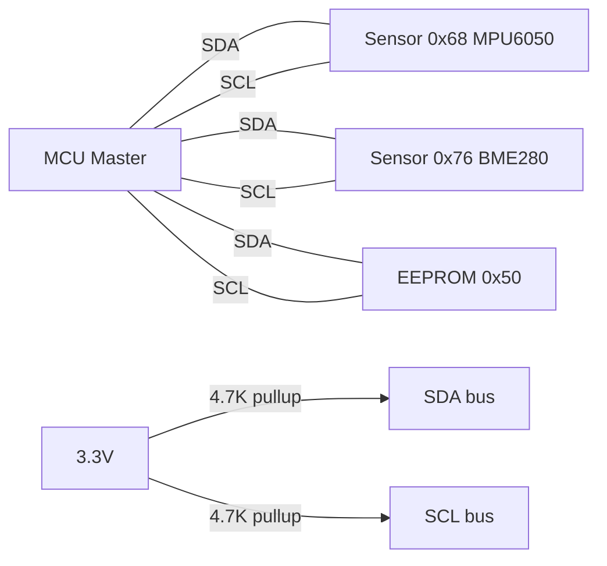
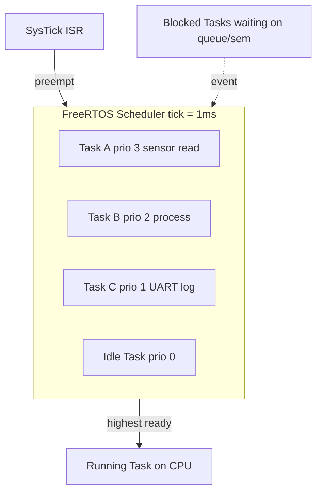
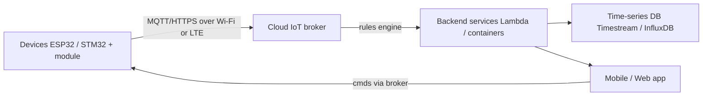
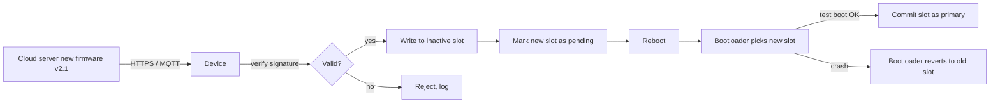

# Embedded / IoT Engineering — From Blinking LED to Production OTA

Bhai, ek baat seedhi suna deta hoon: India mein next 10 saal ki engineering wave **hardware** pe hai. Ola Electric ki Krishnagiri factory mein har scooter mein 40+ ECUs hain — har ECU ke peeche ek embedded engineer baitha hai jo C likh raha hai. Ather ke fast charger mein STM32 chip pe firmware chal raha hai. Boat ke earbuds mein Bluetooth stack ka tuning embedded log kar rahe hain. ISRO ke Chandrayaan-3 ke lander pe jo guidance code chala — wo C / Ada mein likha tha, RTOS pe. DRDO ke missile guidance, Mahindra Electric ke battery management, BHEL ke smart grid — sab embedded.

Aur software-only roles ki bheed mein — jahaan har doosra banda React + Node + MongoDB clone bana raha hai — embedded engineer **scarce supply** hai. Demand high, supply kam, salary 8-25 LPA fresher at chip companies, PSU mein lifetime job security. Yeh subject tujhe **Layer 1** dega — wo level jahaan tu transistor se shuru karke OTA update tak full stack samajhega.

Iss subject ka goal: tu `printf("Hello")` likhne wala college kid se nikal ke wahaan jaayega jahaan tu STM32 ka register-level code likhega, FreeRTOS pe producer-consumer chalayega, ESP32 ko AWS IoT pe MQTT publish karayega, aur production firmware ko OTA update karna jaanega. Hum casual "Arduino IDE pe blink upload kar diya, hogaya" wala hobbyist embedded se nikal ke **register / HAL / RTOS / cloud** ka serious stack samjhenge.

> **Why this depth?** Qualcomm India Bangalore ke embedded interview mein literal sawaal aata hai — "Explain the volatile keyword and show me a bug that occurs without it." NXP Noida pucchta hai — "Design an I2C driver in C, with timeout handling." Ola Electric pucchta hai — "How would you implement OTA on an STM32 with 256KB flash?" Surface-level "Arduino kar liya" yahaan bilkul nahi chalega.

Chai garam kar le, soldering iron warm rakh, aur logic analyser pass rakh — yeh ~1000 lines ka safar hai. Hum mostly **C (C99/C11)** assume karenge for code, kyuki embedded ki 90% production code C mein hai. C++ jahan zaroori hai (modern HALs, Zephyr) wahaan alag se mark karenge.

---

## 1. Why Embedded / IoT — career, market, paisa

### 1.1 The hardware-startup wave

India ka EV revolution + IoT consumer boom + space privatisation = embedded engineers ki demand jo last 5 saal mein 4x ho gayi hai. Ek snapshot:

| Company | Domain | Fresher CTC (LPA) | Stack |
|---------|--------|------------------|-------|
| **Ola Electric** | EV scooters, ECUs | 8-15 | STM32, AUTOSAR-lite, CAN |
| **Ather Energy** | EV scooters, fast chargers | 10-18 | NXP S32K, FreeRTOS, MQTT |
| **Mahindra Electric** | EV cars, BMS | 8-14 | TI C2000, CAN, ISO 26262 |
| **Boat Lifestyle** | Audio wearables | 6-12 | BES2300, Bluetooth, DSP |
| **Tata Elxsi** | Services for OEMs | 6-10 | Diverse — automotive, medical |
| **KPIT** | Automotive software | 5-9 | AUTOSAR, ADAS, Linux |
| **Capgemini Engineering** | Embedded services | 5-8 | Mixed |

Yeh sab Bangalore / Pune / Hyderabad / Chennai mein concentrated hain. Pune ka KPIT alone 8000+ embedded engineers rakhta hai. Bangalore mein Ola, Ather, Bosch — saare 5km radius mein.

### 1.2 The chip companies — paisa wahaan hai

Asli embedded paisa **chip design / IP / SDK** companies mein hai. Inka kaam: silicon design + reference firmware + customer support. Ye companies fresher salary highest deti hain in embedded:

| Company | Location | Fresher CTC (LPA) | What they do |
|---------|----------|------------------|--------------|
| **Qualcomm India** | Bengaluru, Hyderabad | 15-25 | Snapdragon, modem, IoT chips |
| **NXP Semiconductors** | Noida, Bengaluru | 12-22 | Automotive (S32, i.MX), MCU |
| **Texas Instruments** | Bengaluru | 12-20 | MSP430, C2000, Sitara |
| **ARM India** | Bengaluru | 14-22 | Cortex-M, Cortex-A IP |
| **Intel India** | Bengaluru | 12-20 | x86, FPGA, IoT |
| **Analog Devices** | Bengaluru | 12-18 | Mixed-signal, DSP |
| **STMicroelectronics** | Greater Noida | 10-16 | STM32, sensors |
| **Renesas** | Bengaluru | 10-15 | RH850, automotive |

In companies mein tu **production silicon** pe kaam karega — jo phone tu use kar raha hai, uske 5G modem ka firmware ka chunk tune likha hoga. Yeh prestigious aur paisa-wala combo hai.

### 1.3 Defence / space / ISRO — prestige path

ISRO / DRDO / BEL salary high nahi (5-8 LPA fresher), but:
- Lifetime job security (government employment)
- Pension + medical + housing benefits
- Working on India ka space / defence — pride factor
- Patents / publications opportunity
- Stress kam (compared to private)

Entry: ISRO ICRB exam (every year ~December), DRDO entry-level scientist (RAC), BEL via GATE.

### 1.4 PSU pull via GATE

BHEL / BEL / NTPC / IOCL / GAIL — sab GATE CSE ya ECE score se hire karte hain. Embedded role mostly ECE side se. CTC 6-12 LPA + perks (4-bedroom flat in metro for senior engineers, free electricity, healthcare).

GATE CSE strategy ke liye → cross-link `gate-cse` subject.

### 1.5 The IoT consumer wave

Consumer IoT — smart locks, smart bulbs, fitness bands, smart speakers — yeh segment India mein 2030 tak $50B+ hone wala hai. Jio Smart Home, Boat, Noise, Crossbeats, Mivi — sab yahaan hire kar rahe hain. Salary thodi kam (6-12 LPA fresher) but startup equity + fast growth.

### 1.6 The role landscape

Embedded engineer matlab kya kya kar sakta hai:

- **Firmware Engineer** — bare-metal C, RTOS, drivers (peripheral level)
- **Embedded Systems Engineer** — full system, hardware-software co-design
- **IoT Engineer** — device + cloud + mobile app
- **Linux Kernel / BSP Engineer** — Yocto, device tree, kernel modules
- **Embedded Security Engineer** — secure boot, code signing, crypto on MCU
- **AUTOSAR Engineer** — automotive-specific (Bosch, KPIT)
- **DSP Engineer** — audio, video, signal processing on ARM Cortex-M / DSP

Pehla 3 saal mein tu pick karega — generalist firmware se start, fir specialise.

---

## 2. C / C++ for embedded — the language layer

### 2.1 Why C still rules

Tu modern AI ka zamana hai, log Rust / Go / Python sab seekh rahe hain. Lekin embedded mein **C still rules** kyuki:

- **Predictable memory** — `malloc` rare hai, stack-allocated everything; tu byte-by-byte jaanta hai
- **No garbage collector** — GC ka pause real-time mein death hai (motor controller pe 50ms pause = scooter crash)
- **Direct hardware access** — pointer cast karke register address pe likh sakte ho
- **Deterministic execution time** — har function ka WCET (worst-case execution time) nikal sakta hai
- **Tiny footprint** — bare-metal C runtime ~2KB, Rust binary 20KB+, Java JVM se baat hi mat kar
- **Decades of tooling** — every MCU vendor's HAL is in C

> **Reality check:** Linux kernel = C. FreeRTOS = C. Zephyr = C with C++ bindings. STM32 HAL = C. ESP-IDF = C. AUTOSAR Classic = C. Tu agar embedded mein serious hai, C tera primary language hai.

### 2.2 Modern C++ in embedded — yes, but careful

C++ embedded mein aaya hai — Zephyr supports it, modern STM32 HAL aata hai cpp wrapper ke saath, NXP MCUXpresso default cpp project banata hai. Use cases:

- **Classes for HALs** — `class GPIO`, `class UART` cleaner than function-pointer-laden C
- **RAII for resource management** — destructor mein peripheral disable
- **Templates for generic drivers** — same SPI driver for 8/16/32-bit data widths
- **Constexpr for compile-time config** — register addresses, pin maps

But pitfalls:

- **Exceptions** — disable kar do (`-fno-exceptions`); throw / catch ka overhead 2KB+ binary, unpredictable timing
- **RTTI** — disable (`-fno-rtti`); `dynamic_cast` aata hai with vtable bloat
- **STL containers** — `std::vector` / `std::map` heap pe allocate karte hain; use `etl` (Embedded Template Library) ya custom static-allocator versions
- **Heavy templates** — code bloat; har template instantiation = alag binary section
- **Virtual functions** — vtable lookup adds 1 indirection; usually ok but in ISR avoid

Cross-link → `cpp-mastery` subject for full modern C++ depth.

### 2.3 Memory model — stack vs heap in 64KB RAM

Bhai, embedded mein RAM 64KB ya 256KB hota hai (compare with desktop ka 16GB). Ek typical STM32F4 ka layout:

```
+-----------------------+ 0x20020000  <- end of RAM (128KB total)
|        Stack          | grows down
|         |             |
|         v             |
|      ...gap...        |
|         ^             |
|         |             |
|         Heap          | grows up (if used)
+-----------------------+
|     .bss (zeros)      | uninitialized globals
+-----------------------+
|     .data (init)      | initialized globals (copied from flash)
+-----------------------+ 0x20000000  <- start of RAM
```

Stack — fast, bounded, automatic. Heap — slow, fragmenting, dangerous in long-running embedded systems. **Rule of thumb for embedded:** avoid `malloc` after init. Allocate everything statically or on stack. Production firmware mein dynamic allocation = code review red flag.

```c
// AVOID in embedded
char *buf = malloc(256);  // can fail; can fragment over years

// PREFER
static char buf[256];     // BSS section, zeroed at startup, deterministic
```

### 2.4 The `volatile` keyword — interview ka favorite gotcha

Yeh embedded interview ka **most-asked** sawaal hai. Concept:

`volatile` compiler ko bolta hai — "Bhai, iss variable ko optimize mat kar; har baar memory se padh."

Without `volatile`, compiler aggressive optimization karega aur tera hardware register polling loop break ho jaayega.

```c
// BUGGY — without volatile
uint32_t *status_reg = (uint32_t *)0x40020000;
while (*status_reg == 0) {  // compiler may cache *status_reg in a register!
    // wait for hardware to set the bit
}
// loop may NEVER exit because compiler reads status_reg ONCE and reuses

// FIXED — with volatile
volatile uint32_t *status_reg = (volatile uint32_t *)0x40020000;
while (*status_reg == 0) {  // compiler MUST re-read each iteration
    // hardware will eventually set it
}
```

When to use `volatile`:
1. **Memory-mapped registers** — hardware can change without CPU writing
2. **Variables shared between ISR and main code**
3. **Variables shared between threads** (use atomics in modern C/C++ instead)

When NOT enough:
- `volatile` does NOT make access atomic. For 64-bit on 32-bit CPU, use `atomic` types or disable interrupts.

### 2.5 Bit manipulation — embedded ka roti-pani

Hardware registers bit-level configure hote hain. `Set / clear / toggle / check` ka muhavra rat lo:

```c
// Set bit 3
reg |= (1U << 3);

// Clear bit 3
reg &= ~(1U << 3);

// Toggle bit 3
reg ^= (1U << 3);

// Check bit 3
if (reg & (1U << 3)) { /* set */ }

// Set multi-bit field (bits 4-7) to value 0xA, preserving others
reg &= ~(0xF << 4);    // clear field
reg |=  (0xA << 4);    // write new value
```

`1U` likhna habit banao (unsigned) — `1 << 31` undefined behavior hai on signed int, `1U << 31` defined hai.

### 2.6 ISRs — interrupt service routines, the rules

Interrupt aati hai = CPU current code chhod ke ISR mein jaata hai = jaldi se nikalna hai.

**ISR rules (rat lo):**

1. **Short** — microseconds, not milliseconds
2. **No `malloc`** — heap functions usually not reentrant
3. **No `printf`** — slow, may itself disable interrupts
4. **No floating-point** (unless FPU saved properly via compiler flag)
5. **Use `volatile` for shared variables** between ISR and main
6. **Defer heavy work** — set a flag, let main loop / RTOS task do the work

```c
volatile uint8_t button_pressed = 0;

void EXTI0_IRQHandler(void) {
    EXTI->PR |= EXTI_PR_PR0;     // clear pending bit (hardware-specific)
    button_pressed = 1;          // flag, that's it
}

int main(void) {
    while (1) {
        if (button_pressed) {
            button_pressed = 0;
            handle_button();      // heavy work here, in main loop
        }
    }
}
```

---

## 3. Microcontrollers — the silicon you'll touch

### 3.1 8-bit MCUs — the entry point

**ATmega328P** (Arduino Uno's chip): 8-bit AVR core, 16 MHz, 32KB flash, 2KB RAM. 40-pin DIP, beginner-friendly.

8-bit relevance aaj 2026 mein:
- Ultra-low-cost products (toys, simple sensors)
- Educational
- 8051 still in some legacy embedded (China-origin chips)

> **Career angle:** Tu agar fresher hai aur Arduino se shuru kiya, that's fine. Lekin **interview mein STM32 / ESP32 zaroor jaanna chahiye**. 8-bit pe tera comfort dikha lo, but production 32-bit ARM hai.

### 3.2 32-bit ARM Cortex-M — the modern default

ARM Cortex-M family = the de-facto MCU architecture today. Variants:

| Core | Use case | Example chips |
|------|----------|---------------|
| **Cortex-M0/M0+** | Ultra-low-power, simple | STM32F0, nRF52810 |
| **Cortex-M3** | General-purpose | STM32F1, LPC1768 |
| **Cortex-M4** | DSP, FPU available | STM32F4, NXP K64 |
| **Cortex-M7** | High-performance | STM32H7, i.MX RT |
| **Cortex-M33** | TrustZone, secure | STM32L5, nRF5340 |
| **Cortex-M55/M85** | AI/ML on edge (Helium) | Alif Ensemble |

Top 3 you'll meet most:

1. **STM32 (STMicroelectronics)** — biggest ecosystem, STM32CubeIDE free, ST HAL excellent. Industry default.
2. **ESP32 (Espressif)** — Wi-Fi + Bluetooth on chip, Xtensa core (not Cortex but close), $3 module. IoT favourite.
3. **nRF52 (Nordic)** — Bluetooth Low Energy specialist. Wearables, smart locks.

### 3.3 GPIO programming — register vs HAL

**GPIO** = General Purpose I/O. Pin ko input / output configure karke read / write karna.

**Register-level (bare-metal):**

```c
// STM32F4 — toggle PA5 (LED on Nucleo board)
#define RCC_AHB1ENR   (*(volatile uint32_t *)0x40023830)
#define GPIOA_MODER   (*(volatile uint32_t *)0x40020000)
#define GPIOA_ODR     (*(volatile uint32_t *)0x40020014)

void led_init(void) {
    RCC_AHB1ENR |= (1U << 0);     // enable GPIOA clock
    GPIOA_MODER &= ~(0x3 << 10);  // clear MODER5 bits
    GPIOA_MODER |=  (0x1 << 10);  // set as output (01)
}

void led_toggle(void) {
    GPIOA_ODR ^= (1U << 5);
}
```

**HAL (Hardware Abstraction Layer) — STM32 HAL example:**

```c
#include "stm32f4xx_hal.h"

GPIO_InitTypeDef gpio_cfg = {0};

void led_init(void) {
    __HAL_RCC_GPIOA_CLK_ENABLE();
    gpio_cfg.Pin   = GPIO_PIN_5;
    gpio_cfg.Mode  = GPIO_MODE_OUTPUT_PP;
    gpio_cfg.Pull  = GPIO_NOPULL;
    gpio_cfg.Speed = GPIO_SPEED_FREQ_LOW;
    HAL_GPIO_Init(GPIOA, &gpio_cfg);
}

void led_toggle(void) {
    HAL_GPIO_TogglePin(GPIOA, GPIO_PIN_5);
}
```

Trade-off:
- **Register** — small, fast, no abstraction; you must read 1500-page reference manual
- **HAL** — readable, portable across STM32 family, but ~2x code size + slower

> **Pro tip:** Production firmware mein HAL theek hai for non-critical paths. Tight timing loops (motor PWM, audio DSP) mein register-level. Interview mein dono dikhana — "I know HAL, but I can drop to registers when needed."

### 3.4 Worked example — Blink LED on STM32 with HAL

Full minimum-runnable on a Nucleo-F411 board:

```c
#include "stm32f4xx_hal.h"

static void clock_init(void) {
    RCC_OscInitTypeDef osc = {0};
    RCC_ClkInitTypeDef clk = {0};

    osc.OscillatorType = RCC_OSCILLATORTYPE_HSI;
    osc.HSIState = RCC_HSI_ON;
    osc.PLL.PLLState = RCC_PLL_NONE;
    HAL_RCC_OscConfig(&osc);

    clk.ClockType = RCC_CLOCKTYPE_HCLK | RCC_CLOCKTYPE_SYSCLK;
    clk.SYSCLKSource = RCC_SYSCLKSOURCE_HSI;
    clk.AHBCLKDivider = RCC_SYSCLK_DIV1;
    HAL_RCC_ClockConfig(&clk, FLASH_LATENCY_0);
}

int main(void) {
    HAL_Init();
    clock_init();

    __HAL_RCC_GPIOA_CLK_ENABLE();
    GPIO_InitTypeDef g = {
        .Pin   = GPIO_PIN_5,
        .Mode  = GPIO_MODE_OUTPUT_PP,
        .Pull  = GPIO_NOPULL,
        .Speed = GPIO_SPEED_FREQ_LOW,
    };
    HAL_GPIO_Init(GPIOA, &g);

    while (1) {
        HAL_GPIO_TogglePin(GPIOA, GPIO_PIN_5);
        HAL_Delay(500);              // ms
    }
}

void SysTick_Handler(void) { HAL_IncTick(); }
```

`HAL_Delay` blocks (busy-loop on `SysTick`). Production mein RTOS task ke andar `vTaskDelay` use karoge.

### 3.5 ESP32 — IoT favourite

ESP32 = Espressif's superstar:
- Dual-core Xtensa LX6 at 240 MHz
- Wi-Fi 2.4 GHz + Bluetooth 4.2 / BLE on-chip
- 520KB SRAM, 4MB+ flash typical
- ~$3-5 module retail (ESP32-WROOM)
- ESP-IDF (vendor SDK, C-based, FreeRTOS built in) ya Arduino-core
- Wide adoption: Boat earbuds, smart bulbs, ESP-NOW mesh

Quick blink on ESP32 with ESP-IDF:

```c
#include "freertos/FreeRTOS.h"
#include "freertos/task.h"
#include "driver/gpio.h"

#define LED_PIN  GPIO_NUM_2

void app_main(void) {
    gpio_reset_pin(LED_PIN);
    gpio_set_direction(LED_PIN, GPIO_MODE_OUTPUT);

    while (1) {
        gpio_set_level(LED_PIN, 1);
        vTaskDelay(pdMS_TO_TICKS(500));
        gpio_set_level(LED_PIN, 0);
        vTaskDelay(pdMS_TO_TICKS(500));
    }
}
```

Notice: ESP-IDF mein FreeRTOS already running, `app_main` is a task, `vTaskDelay` non-blocking.

### 3.6 Choosing a microcontroller — power / memory / peripherals matrix

| Need | Pick | Why |
|------|------|-----|
| Wi-Fi + cheap | ESP32 | Wi-Fi onboard, $3 |
| Bluetooth-only wearable | nRF52832 | BLE specialist, low power |
| Battery-life critical | STM32L0 / nRF52 | µA sleep currents |
| DSP / motor control | STM32F4 / TI C2000 | FPU + DSP instructions |
| Automotive | NXP S32K / Renesas RH850 | AEC-Q100 qualified |
| AI on edge | Alif M55 / STM32N6 | Helium / NPU |
| High-end IoT gateway | i.MX RT (Cortex-M7) | 600 MHz, lots of peripherals |

Decision factors:
1. **Power budget** — sleep current, active current
2. **Memory** — flash for code, RAM for runtime
3. **Peripherals** — how many UARTs / I2C / SPI / ADC needed
4. **Connectivity** — Wi-Fi / BLE / LoRa / cellular
5. **Cost** — at scale (10K+ units)
6. **Ecosystem** — SDK quality, community
7. **Certifications** — automotive (AEC-Q100), medical (IEC 62304)

---

## 4. Communication protocols — UART, SPI, I2C, CAN, MQTT

### 4.1 UART — the simplest serial

UART = Universal Asynchronous Receiver-Transmitter. 2 wires (TX, RX), no clock signal — both ends agreed on baud rate (9600, 115200 typical).

- 1:1 connection
- Asynchronous (no shared clock)
- Baud rate must match exactly (±2% tolerance)
- Frame: start bit + 8 data bits + optional parity + stop bit

```c
// STM32 HAL — send a string over USART2
UART_HandleTypeDef huart2;

void uart_init(void) {
    huart2.Instance = USART2;
    huart2.Init.BaudRate = 115200;
    huart2.Init.WordLength = UART_WORDLENGTH_8B;
    huart2.Init.StopBits = UART_STOPBITS_1;
    huart2.Init.Parity = UART_PARITY_NONE;
    huart2.Init.Mode = UART_MODE_TX_RX;
    HAL_UART_Init(&huart2);
}

void uart_send(const char *s) {
    HAL_UART_Transmit(&huart2, (uint8_t *)s, strlen(s), HAL_MAX_DELAY);
}
```

Use cases:
- Debug logging (printf over UART → USB-to-Serial → terminal)
- GPS modules (NMEA sentences)
- Bluetooth modules (HC-05 AT commands)
- Modem AT commands

### 4.2 SPI — fast, 4-wire master-slave

SPI = Serial Peripheral Interface. 4 wires:

- **SCLK** — clock (master generates)
- **MOSI** — Master Out Slave In
- **MISO** — Master In Slave Out
- **CS / SS** — Chip Select (per-slave, active-low)

Speeds: 10-50 MHz typical, up to 100+ MHz on modern MCUs.

Use cases: SD cards, displays (ILI9341 LCD), flash chips (W25Q), high-speed sensors (LSM6DSO).

```c
// Read 1 byte from SPI flash at address 0
uint8_t cmd[4] = {0x03, 0x00, 0x00, 0x00};   // READ command + 24-bit addr
uint8_t rx[5]  = {0};

HAL_GPIO_WritePin(GPIOA, GPIO_PIN_4, GPIO_PIN_RESET);     // CS low
HAL_SPI_Transmit(&hspi1, cmd, 4, HAL_MAX_DELAY);
HAL_SPI_Receive(&hspi1, rx, 1, HAL_MAX_DELAY);
HAL_GPIO_WritePin(GPIOA, GPIO_PIN_4, GPIO_PIN_SET);       // CS high
```

SPI modes (CPOL / CPHA combination): mode 0, 1, 2, 3. Sensor datasheet bataata hai which mode. Mismatch = garbage data.

### 4.3 I2C — 2-wire multi-slave

I2C = Inter-Integrated Circuit (Philips, 1982). 2 wires:

- **SDA** — Serial Data
- **SCL** — Serial Clock

Both lines pulled up via 4.7KΩ resistors. Multiple slaves on same bus, each with 7-bit address.

Speeds: 100 kHz (standard), 400 kHz (fast), 1 MHz (fast+).



Use cases: temperature / humidity sensors (BME280, SHT30), accelerometer (MPU6050), RTC (DS1307), small EEPROM (24LC256), OLED displays (SSD1306).

### 4.4 Worked example — I2C sensor read in C (BME280)

```c
#include "stm32f4xx_hal.h"

#define BME280_ADDR    (0x76 << 1)    // STM32 HAL expects shifted address
#define BME280_CHIP_ID_REG  0xD0

I2C_HandleTypeDef hi2c1;

uint8_t bme280_read_chip_id(void) {
    uint8_t reg = BME280_CHIP_ID_REG;
    uint8_t id  = 0;

    // 1. send register address
    HAL_I2C_Master_Transmit(&hi2c1, BME280_ADDR, &reg, 1, 100);
    // 2. read 1 byte back
    HAL_I2C_Master_Receive(&hi2c1, BME280_ADDR, &id, 1, 100);

    return id;   // should be 0x60 for BME280
}

int32_t bme280_read_temp_raw(void) {
    uint8_t reg = 0xFA;   // temp MSB register
    uint8_t buf[3];

    HAL_I2C_Master_Transmit(&hi2c1, BME280_ADDR, &reg, 1, 100);
    HAL_I2C_Master_Receive(&hi2c1, BME280_ADDR, buf, 3, 100);

    // 20-bit temperature reading, MSB-first
    return (int32_t)((buf[0] << 12) | (buf[1] << 4) | (buf[2] >> 4));
}
```

Datasheet pad ke compensation formula apply karna hota hai raw value ko Celsius mein convert karne ke liye. Yeh datasheet-driven coding embedded ka daily kaam hai.

### 4.5 CAN — automotive ka standard

CAN = Controller Area Network. Bosch ne 1986 mein bana ke car industry pe lagaya. Differential pair (CAN_H, CAN_L), multi-master, message-based.

- Speeds: 125 kbps (low-speed), 500 kbps (high-speed), 1 Mbps. CAN-FD up to 5 Mbps.
- 11-bit (standard) or 29-bit (extended) message ID
- No addressing — broadcast; nodes filter by ID
- Built-in arbitration: lower ID = higher priority

Every car since ~1995 has CAN. EV scooters / cars have multiple CAN buses (powertrain, body, infotainment). If you join Ola / Ather / Mahindra Electric, **CAN is your daily life**.

```c
// STM32 HAL — send a CAN frame
CAN_TxHeaderTypeDef tx_hdr;
uint8_t data[8] = {0x01, 0x02, 0x03, 0x04, 0x05, 0x06, 0x07, 0x08};
uint32_t tx_mailbox;

tx_hdr.StdId = 0x123;
tx_hdr.IDE   = CAN_ID_STD;
tx_hdr.RTR   = CAN_RTR_DATA;
tx_hdr.DLC   = 8;
HAL_CAN_AddTxMessage(&hcan1, &tx_hdr, data, &tx_mailbox);
```

### 4.6 MQTT — IoT pub/sub

MQTT = Message Queuing Telemetry Transport. Lightweight pub/sub over TCP, designed for high-latency / low-bandwidth networks. Default port 1883 (or 8883 with TLS).

Key concepts:

- **Broker** — central server (Mosquitto, AWS IoT Core, HiveMQ)
- **Topic** — string hierarchy, e.g., `home/livingroom/temperature`
- **Publisher** — device sending data to a topic
- **Subscriber** — device / app receiving data from a topic
- **QoS levels** — 0 (fire-and-forget), 1 (at-least-once), 2 (exactly-once)
- **Retained messages** — broker keeps last message per topic
- **Last Will and Testament (LWT)** — message broker sends if device disconnects abruptly

```c
// ESP-IDF MQTT publish (pseudo, simplified)
esp_mqtt_client_config_t cfg = {
    .broker.address.uri = "mqtt://test.mosquitto.org:1883",
};
esp_mqtt_client_handle_t client = esp_mqtt_client_init(&cfg);
esp_mqtt_client_start(client);

// ... wait for MQTT_EVENT_CONNECTED ...

esp_mqtt_client_publish(client, "enginerd/test/temp", "27.5", 0, 1, 0);
```

---

## 5. RTOS — FreeRTOS deep dive

### 5.1 Why an RTOS?

Bare-metal mein "super loop" karte hain:

```c
while (1) {
    read_sensor();
    process();
    send_uart();
    update_display();
}
```

Issue: agar `update_display()` 200ms le, sensor 200ms tak read nahi hoga. Real-time application (motor control, audio, BLE stack) mein yeh fail hota hai.

**RTOS** = preemptive scheduler — multiple tasks "simultaneously" chalte hain (interleaved on single core). High-priority task immediately CPU le leta hai when ready.

### 5.2 FreeRTOS — the de-facto

FreeRTOS = Richard Barry, 2003. AWS-acquired in 2017, now under MIT license. Used in: ESP-IDF, STM32CubeMX integration, Nordic SDK, NXP MCUXpresso.

Core primitives:

- **Task** — function that runs concurrently
- **Queue** — FIFO for inter-task communication
- **Semaphore** — signalling / counting
- **Mutex** — mutual exclusion (with priority inheritance)
- **Software timer** — periodic / one-shot callbacks
- **Event group** — bit-flag synchronisation
- **Notification** — lightweight task-to-task signal

### 5.3 Task scheduling — visualised



Higher priority number = higher priority (in FreeRTOS). Idle task runs when nothing else is ready (also handles cleanup).

### 5.4 Worked example — Producer-consumer with FreeRTOS queues

```c
#include "FreeRTOS.h"
#include "task.h"
#include "queue.h"

static QueueHandle_t sensor_queue;

typedef struct {
    uint32_t timestamp_ms;
    int16_t  temp_centidegrees;
} sensor_sample_t;

static void producer_task(void *pv) {
    sensor_sample_t sample;
    while (1) {
        sample.timestamp_ms = xTaskGetTickCount();
        sample.temp_centidegrees = read_temp_sensor();    // your I2C read

        // send to queue; block max 100ms if full
        if (xQueueSend(sensor_queue, &sample, pdMS_TO_TICKS(100)) != pdPASS) {
            // queue full — drop or log
        }
        vTaskDelay(pdMS_TO_TICKS(500));      // 2 Hz sampling
    }
}

static void consumer_task(void *pv) {
    sensor_sample_t s;
    while (1) {
        // wait forever for next sample
        if (xQueueReceive(sensor_queue, &s, portMAX_DELAY) == pdPASS) {
            printf("[%lu ms] temp = %d.%02d C\n",
                   s.timestamp_ms,
                   s.temp_centidegrees / 100,
                   s.temp_centidegrees % 100);
        }
    }
}

int main(void) {
    HAL_Init();
    clock_init();
    i2c_init();
    uart_init();

    sensor_queue = xQueueCreate(16, sizeof(sensor_sample_t));

    xTaskCreate(producer_task, "prod", 512, NULL, 3, NULL);
    xTaskCreate(consumer_task, "cons", 512, NULL, 2, NULL);

    vTaskStartScheduler();    // never returns
    while (1) {}              // safety
}
```

Notice: `pdMS_TO_TICKS` converts ms to scheduler ticks. Stack size in `xTaskCreate` is in **words (4 bytes on 32-bit)** — 512 words = 2KB stack.

### 5.5 Stack overflow + watchdog

**Stack overflow** = task stack exceeded its allocated size. Symptoms: random crashes, weird behavior. FreeRTOS has hooks:

```c
void vApplicationStackOverflowHook(TaskHandle_t xTask, char *pcTaskName) {
    // Hard-fault here; log and reset
    NVIC_SystemReset();
}
```

Configure `configCHECK_FOR_STACK_OVERFLOW = 2` in `FreeRTOSConfig.h`.

**Watchdog** = independent hardware timer. If main code doesn't "kick" (refresh) it within timeout, MCU resets. Critical for unattended embedded — if code hangs, watchdog brings system back.

```c
// STM32 IWDG (independent watchdog)
HAL_IWDG_Init(&hiwdg);

while (1) {
    do_work();
    HAL_IWDG_Refresh(&hiwdg);    // "kick" the dog
}
```

Production mein watchdog hamesha enable. Refresh from a single dedicated task that monitors others — agar koi task hang ho jaaye, watchdog reset karega.

### 5.6 Other RTOS

- **Zephyr (Linux Foundation, Google-backed)** — modern, modular, supports Cortex-M / RISC-V / x86. Industrial / IoT. Bigger learning curve than FreeRTOS but more features (BLE stack, networking, file systems built in).
- **VxWorks (Wind River)** — defence-grade, certified for aerospace. ISRO Chandrayaan? VxWorks. F-35 fighter jet? VxWorks. Expensive licence.
- **ThreadX (Microsoft, formerly Express Logic)** — Azure RTOS, royalty-free since 2019.
- **NuttX** — POSIX-like RTOS, used by PX4 drone autopilot.
- **µC/OS-III (Micrium)** — old-school, used in medical devices. Now Silicon Labs.

For Indian career: FreeRTOS pakka, Zephyr highly recommended.

---

## 6. Linux on embedded — when MCU isn't enough

### 6.1 RTOS vs Embedded Linux — the choice

| Factor | RTOS (FreeRTOS) | Embedded Linux |
|--------|-----------------|----------------|
| RAM | 4KB-1MB | 64MB+ |
| Flash | 32KB-2MB | 128MB+ |
| Cores | Cortex-M | Cortex-A (A7/A53/A72) |
| Boot time | ms | seconds |
| Cost | $1-5 chip | $5-20 SoC + DRAM |
| Real-time | Hard real-time | Soft (PREEMPT_RT for hard) |
| Use case | Sensor node, motor ctrl | Gateway, IoT camera, infotainment |

If you need: TCP/IP + Wi-Fi + USB + display + filesystem + multiple processes — Linux. If: tiny battery sensor with BLE — RTOS.

### 6.2 Yocto / Buildroot — building custom distros

Aap Raspberry Pi pe pre-built Raspbian flash kar sakte ho — that's fine for hobby. Production custom hardware mein tum apna **own minimal Linux distro** chahiye, sirf jo packages chahiye, signed kernel, locked-down rootfs.

Two tools dominate:

- **Yocto Project** — meta-layer-based, very flexible, steep learning curve. Used by automotive, industrial.
- **Buildroot** — simpler, makefile-based, faster to start. Used by smaller IoT products.

Yocto recipe `(.bb file)` looks like:

```
SUMMARY = "My IoT sensor app"
LICENSE = "MIT"
SRC_URI = "git://github.com/me/sensor-app.git;branch=main"
S = "${WORKDIR}/git"

inherit cmake

DEPENDS = "mosquitto cjson"
```

### 6.3 Device Tree

Modern Linux on ARM = device tree. `.dts` file describes hardware (which I2C bus, which GPIO pins, what's connected). Kernel reads it at boot.

```
i2c1: i2c@40005400 {
    compatible = "st,stm32-i2c";
    reg = <0x40005400 0x400>;
    clock-frequency = <100000>;

    bme280@76 {
        compatible = "bosch,bme280";
        reg = <0x76>;
    };
};
```

Yeh hardware + driver-loading abstract karta hai — same kernel binary multiple boards pe chala sakte ho, sirf DTB (device tree blob) badal ke.

### 6.4 Kernel modules

`.ko` (kernel object) = dynamically loadable kernel code.

```c
#include <linux/module.h>
#include <linux/kernel.h>

static int __init my_init(void) {
    pr_info("Hello from kernel\n");
    return 0;
}

static void __exit my_exit(void) {
    pr_info("Bye\n");
}

module_init(my_init);
module_exit(my_exit);
MODULE_LICENSE("GPL");
```

`insmod my.ko` to load, `rmmod my` to unload. Drivers are typically modules.

### 6.5 U-Boot — the bootloader

Linux khud directly nahi boot hota; pehle bootloader RAM mein kernel load karta hai, parameters set karta hai, fir kernel ko jump karta hai. **U-Boot** = Universal Boot Loader, dominant on embedded ARM.

Boot sequence:

```
Power on → ROM bootloader (in chip) → U-Boot in flash → loads kernel + DTB + rootfs → kernel boots → init/systemd → user-space
```

U-Boot CLI mein tu interactive karke kernel kahaan se load ho, what bootargs pass karne hain control kar sakta hai. Production mein scripted (`bootcmd`).

---

## 7. IoT cloud — connecting devices to backend

### 7.1 The 3-tier IoT stack



### 7.2 AWS IoT Core — India ka favourite

AWS IoT Core = managed MQTT broker + device shadow + rules + jobs. India mein highest market share (Ola, Ather, Boat ke backends mostly AWS).

Key concepts:

- **Thing** — registered device (with name + cert)
- **Certificate + private key** — device authenticates with mTLS
- **Policy** — what topics device can publish / subscribe
- **Device Shadow** — JSON document with `desired` and `reported` state, persists when device offline
- **Rules engine** — SQL-like, route MQTT messages to Lambda / DynamoDB / S3
- **Jobs** — orchestrate actions (firmware update) across fleet

### 7.3 Azure IoT Hub

Microsoft's competitor. Strong in industrial / Manufacturing (factory automation). Concepts mirror AWS:

- IoT Hub = MQTT/AMQP broker
- Device twin = shadow equivalent
- Direct methods = invoke device-side function
- DPS (Device Provisioning Service) = zero-touch onboarding

### 7.4 Edge computing

Sometimes you don't want every sample to hit cloud (bandwidth / latency / privacy). Run logic on a **gateway / edge** device:

- **AWS Greengrass** — Lambda functions on edge device, syncs with cloud
- **Azure IoT Edge** — Docker modules at edge

Use case: 100 sensors in factory → gateway aggregates / filters / runs ML inference → only summary to cloud.

### 7.5 Worked example — ESP32 publish to AWS IoT Core (C, ESP-IDF)

```c
#include "esp_log.h"
#include "esp_wifi.h"
#include "mqtt_client.h"
#include "esp_tls.h"

extern const uint8_t aws_root_ca_pem_start[]   asm("_binary_aws_root_ca_pem_start");
extern const uint8_t aws_root_ca_pem_end[]     asm("_binary_aws_root_ca_pem_end");
extern const uint8_t cert_pem_start[]          asm("_binary_cert_pem_start");
extern const uint8_t cert_pem_end[]            asm("_binary_cert_pem_end");
extern const uint8_t key_pem_start[]           asm("_binary_key_pem_start");
extern const uint8_t key_pem_end[]             asm("_binary_key_pem_end");

static const char *TAG = "AWS_IOT";
static esp_mqtt_client_handle_t client;

static void mqtt_event_handler(void *arg, esp_event_base_t base,
                               int32_t event_id, void *event_data) {
    if (event_id == MQTT_EVENT_CONNECTED) {
        ESP_LOGI(TAG, "Connected to AWS IoT");
        esp_mqtt_client_subscribe(client, "device/01/cmd", 1);
    } else if (event_id == MQTT_EVENT_DATA) {
        esp_mqtt_event_handle_t e = event_data;
        ESP_LOGI(TAG, "rx topic=%.*s data=%.*s",
                 e->topic_len, e->topic, e->data_len, e->data);
    }
}

void aws_iot_start(void) {
    esp_mqtt_client_config_t cfg = {
        .broker.address.uri = "mqtts://YOUR_ENDPOINT.iot.ap-south-1.amazonaws.com:8883",
        .broker.verification.certificate = (const char *)aws_root_ca_pem_start,
        .credentials = {
            .authentication = {
                .certificate = (const char *)cert_pem_start,
                .key         = (const char *)key_pem_start,
            },
        },
    };
    client = esp_mqtt_client_init(&cfg);
    esp_mqtt_client_register_event(client, ESP_EVENT_ANY_ID, mqtt_event_handler, NULL);
    esp_mqtt_client_start(client);
}

void publish_temp(float t) {
    char buf[64];
    snprintf(buf, sizeof(buf), "{\"temp\":%.2f}", t);
    esp_mqtt_client_publish(client, "device/01/temp", buf, 0, 1, 0);
}
```

`ap-south-1` = Mumbai region. Production mein `aws-iot-device-sdk-embedded-C` use karoge for shadow + jobs + OTA.

---

## 8. Sensors + actuators — the I/O of physical world

### 8.1 Common sensors

| Sensor | What | Interface | Typical address / pinout |
|--------|------|-----------|--------------------------|
| **BME280** | Temp / humidity / pressure | I2C | 0x76 / 0x77 |
| **MPU6050** | Accel + gyro (6-axis) | I2C | 0x68 / 0x69 |
| **MPU9250** | Accel + gyro + mag (9-axis) | I2C / SPI | 0x68 |
| **DHT22** | Temp / humidity | 1-Wire | Single GPIO pin |
| **DS18B20** | Temp (waterproof) | 1-Wire | Single GPIO pin |
| **HC-SR04** | Ultrasonic distance | Trigger + Echo | 2 GPIO pins |
| **MAX30102** | Heart rate / SpO2 | I2C | 0x57 |
| **VL53L0X** | Time-of-flight distance | I2C | 0x29 |
| **MQ-2 / MQ-135** | Gas (smoke / CO2) | Analog | ADC pin |
| **PIR (HC-SR501)** | Motion | GPIO | Digital high/low |

### 8.2 Actuators

- **Relay (5V module)** — switch high-voltage AC loads (lights, fans). GPIO drives module's transistor.
- **DC motor + L298N driver** — PWM controls speed, GPIO direction. PWM 1-20 kHz.
- **Servo (SG90)** — position-controlled. PWM 50 Hz, pulse 1-2 ms = 0-180°.
- **Stepper + A4988** — STEP + DIR pins, microstep config. Precise position control.
- **Solenoid** — momentary switch (door lock). Drive via MOSFET, flyback diode mandatory.
- **Buzzer (passive)** — tone via PWM frequency.
- **WS2812 / NeoPixel LED** — single-wire serial protocol; tight 800kHz timing → use DMA or dedicated lib.

### 8.3 PWM example — servo control (STM32)

```c
TIM_HandleTypeDef htim2;

void servo_init(void) {
    // TIM2 channel 1 on PA0; assume timer running at 1 MHz, period 20000 = 20ms = 50Hz
    HAL_TIM_PWM_Start(&htim2, TIM_CHANNEL_1);
}

void servo_write_angle(uint16_t deg) {
    if (deg > 180) deg = 180;
    // 1ms pulse = 0°, 2ms = 180°, so 1000 + (deg * 1000 / 180) us
    uint32_t pulse_us = 1000 + (deg * 1000UL) / 180;
    __HAL_TIM_SET_COMPARE(&htim2, TIM_CHANNEL_1, pulse_us);
}
```

---

## 9. Embedded testing — making sure firmware works

### 9.1 Unit testing on host with Unity / CMock

You can't run hardware tests every push. Solution: abstract hardware behind interfaces, test logic on host PC.

```c
// driver_under_test.c
int parse_command(const char *s) {
    if (strcmp(s, "ON") == 0) return 1;
    if (strcmp(s, "OFF") == 0) return 0;
    return -1;
}

// test_driver.c
#include "unity.h"
#include "driver_under_test.h"

void test_parse_on(void) {
    TEST_ASSERT_EQUAL(1, parse_command("ON"));
}
void test_parse_off(void) {
    TEST_ASSERT_EQUAL(0, parse_command("OFF"));
}
void test_parse_garbage(void) {
    TEST_ASSERT_EQUAL(-1, parse_command("HELLO"));
}

int main(void) {
    UNITY_BEGIN();
    RUN_TEST(test_parse_on);
    RUN_TEST(test_parse_off);
    RUN_TEST(test_parse_garbage);
    return UNITY_END();
}
```

Compile with host gcc, run, get pass/fail. Add to CI.

**CMock** generates mocks for headers — for example, mock `i2c.h` so driver test doesn't need real I2C hardware.

### 9.2 Hardware-in-the-loop (HIL)

CI server has actual MCU board + test harness. Flash firmware via JTAG, drive inputs (signal generator), measure outputs (logic analyser, ADC). Run regression tests overnight.

Companies: dSPACE, NI VeriStand, Speedgoat. India: KPIT / Tata Elxsi run HIL labs for clients.

### 9.3 JTAG / SWD debugging

JTAG (5+ pins) and SWD (2 pins, ARM-specific) are the "debug doors" into MCU. Plug in a debugger probe (J-Link, ST-Link, DAPLink), and:

- Halt CPU at any time
- Set breakpoints, step instruction-by-instruction
- Read / write memory + registers
- Flash firmware

GDB integration:

```bash
arm-none-eabi-gdb firmware.elf
(gdb) target remote localhost:2331    # J-Link GDB server
(gdb) load
(gdb) monitor reset
(gdb) break main
(gdb) continue
```

### 9.4 Logic analyser + scope

- **Logic analyser (Saleae, DSLogic, $50-200)** — capture digital signals, decode UART / SPI / I2C / CAN. Bug bahut quickly find hota hai jab tu actual bus traffic dekhe.
- **Oscilloscope** — analog signals, glitches, ringing, power rail noise.
- **Multimeter** — voltage, continuity. Always step 1.

Production debug ka golden rule: "Trust the scope, not the code." Hardware kabhi bhi datasheet jaisa nahi behave karta.

---

## 10. Production deployment + OTA

### 10.1 Bootloader basics

Microcontroller flash 2 partitions mein divide:

```
+------------------+ Flash end
|   App Slot B     |  (alternative app, for OTA)
+------------------+
|   App Slot A     |  (current running app)
+------------------+
|   Bootloader     |  (small, immutable)
+------------------+ Flash start
```

**Bootloader's job:**
1. Boot karte time check karna konsa slot valid hai (CRC / signature verify)
2. Branch to that slot
3. If both invalid → recovery mode (UART / USB DFU)

Reset vector → bootloader → app jump.

### 10.2 OTA (Over-The-Air) updates

Production embedded ka **most-asked** interview question. Flow:



Steps in detail:

1. Device polls / subscribes for firmware updates (MQTT topic / HTTPS)
2. Server has `firmware_v2.1.bin` + signature (Ed25519 / ECDSA)
3. Device downloads in chunks (4-32 KB), writes to inactive flash slot
4. Verify CRC + cryptographic signature
5. Set "boot pending" flag, reboot
6. Bootloader sees pending → boots new slot, sets "test mode" flag
7. New firmware boots, runs self-test, calls `confirm_boot()` → flag cleared
8. If new firmware crashes (watchdog reset before confirm), bootloader sees flag still set → reverts to old slot (rollback)

Vendor frameworks:
- **MCUboot** — open-source, Zephyr-default, supports image signing + slot management
- **AWS IoT OTA Library** — for ESP32 / STM32 with AWS backend
- **ESP-IDF OTA** — built-in for ESP32

### 10.3 Firmware versioning + rollback

Semantic versioning: `MAJOR.MINOR.PATCH`. Embedded mein bhi:

```c
#define FIRMWARE_VERSION_MAJOR  2
#define FIRMWARE_VERSION_MINOR  1
#define FIRMWARE_VERSION_PATCH  0
#define FIRMWARE_BUILD          __DATE__ " " __TIME__
```

Header in flash mein: magic number + version + size + CRC + signature. Bootloader parses ye header before jumping.

Rollback policies:
- Auto-rollback if crash before confirm
- Manual rollback via cloud command
- Anti-rollback counter: prevent downgrade to known-vulnerable version

### 10.4 Code signing for security

Without signing, malicious firmware can be injected. With signing:

1. Firmware built → SHA-256 hash → ECDSA signed with vendor private key
2. Public key burned into MCU's secure flash / OTP at factory
3. Bootloader verifies signature before boot
4. If signature invalid → refuse boot

Modern MCUs (STM32 with TrustZone, nRF5340) have **secure boot ROM** that verifies bootloader itself — chain of trust from silicon up.

> **Pro tip:** Indian medical / automotive / fintech IoT (smart locks, payment terminals) is mandated to have signed firmware + secure boot. Yeh skill instantly hire-worthy hai.

---

## 11. Top 30 Embedded / IoT Interview Questions

| # | Question | Quick answer |
|---|----------|--------------|
| 1 | Why is `volatile` used? | Tell compiler to re-read variable from memory each time, prevent optimization that breaks hardware-register / ISR-shared variables |
| 2 | Difference between `volatile` and `const volatile`? | `const volatile` = code can't write, but hardware can change (e.g., status register read-only) |
| 3 | What's an ISR? Rules for writing one? | Interrupt Service Routine. Short, no malloc, no printf, mark shared vars `volatile`, defer heavy work |
| 4 | Stack vs heap on MCU — which to prefer? | Stack — bounded, deterministic, fast. Avoid heap in production embedded |
| 5 | What does `static` mean inside a function? | Variable persists across calls, not re-initialised each call |
| 6 | Bit-set / bit-clear macros | `reg \|= (1U << n)` set, `reg &= ~(1U << n)` clear |
| 7 | UART vs SPI vs I2C? | UART async 1:1; SPI fast 4-wire master-slave; I2C 2-wire multi-slave with addresses |
| 8 | I2C pull-up resistor — why? | Open-drain bus; pull-ups (~4.7K) for SDA/SCL to idle high |
| 9 | What's CAN's main advantage? | Multi-master, message-priority arbitration, robust differential signalling for automotive |
| 10 | MQTT QoS levels? | 0 fire-and-forget, 1 at-least-once, 2 exactly-once |
| 11 | Why would you choose RTOS over super-loop? | Multiple tasks with different priorities, real-time response, blocking I/O without freezing other work |
| 12 | What is priority inversion? | Low-prio task holds mutex needed by high-prio; medium-prio runs in between. Solve: priority inheritance (FreeRTOS mutex does this) |
| 13 | FreeRTOS task vs ISR communication? | Use `xQueueSendFromISR`, `xSemaphoreGiveFromISR` (the FromISR variants), check `xHigherPriorityTaskWoken` |
| 14 | Watchdog purpose? | Hardware timer that resets MCU if main loop hangs; safety mechanism |
| 15 | Stack overflow detection in FreeRTOS? | `configCHECK_FOR_STACK_OVERFLOW = 2` + `vApplicationStackOverflowHook` |
| 16 | What's a race condition in embedded? | Shared variable accessed by ISR + main without atomicity. Fix: disable IRQ, atomic types, or queue |
| 17 | Endianness — what is it, how to check? | Byte order of multi-byte value. Check: `int x=1; if(*(char*)&x==1) /* little-endian */` |
| 18 | Difference between `#define` and `const`? | `#define` text replacement, no type. `const` typed, scoped, debugger-visible |
| 19 | Why avoid `malloc` in embedded? | Heap fragmentation over years, non-deterministic timing, can fail silently |
| 20 | What's a memory-mapped peripheral? | Hardware register at fixed address; cast pointer to write/read, mark `volatile` |
| 21 | DMA — what + when to use? | Direct Memory Access; CPU-free data transfer between memory and peripheral. Use for high-throughput SPI / ADC / UART |
| 22 | What is a device tree? | Hardware description in Linux/U-Boot; lets same kernel run on multiple boards |
| 23 | OTA rollback strategy? | Two flash slots; new image written to inactive; bootloader test-boots and reverts on crash |
| 24 | Code signing on MCU? | Hash firmware → sign with vendor private key → bootloader verifies with stored public key before boot |
| 25 | Difference between Cortex-M3 and Cortex-M4? | M4 has DSP instructions + optional FPU; M3 is integer-only |
| 26 | What does "real-time" mean? | Deterministic timing — response within bounded latency, hard real-time = miss = system failure |
| 27 | TCP vs UDP for IoT? | TCP for reliable (MQTT, OTA download); UDP for low-latency telemetry, CoAP |
| 28 | What is CoAP? | Constrained Application Protocol — RESTful, runs over UDP, designed for tiny IoT devices |
| 29 | LoRa vs Wi-Fi vs BLE — which when? | LoRa long-range low-data; Wi-Fi local high-data; BLE short-range low-power |
| 30 | How do you debug a hard fault? | Read fault registers (HFSR, CFSR, MMFAR), get PC/LR from stack frame, map to source via .map file |

---

## 12. Pre-interview checklist + What to learn next

### 12.1 The 1-week pre-interview drill

Ek hafte mein ye sab ek baar revise:

**Day 1 — C language:**
- `volatile`, `static`, `const`, `extern`
- Pointer arithmetic, function pointers, struct padding
- Bit manipulation idioms

**Day 2 — Microcontroller basics:**
- GPIO register write (pick STM32 or ESP32)
- Timer + PWM
- ADC read

**Day 3 — Communication protocols:**
- UART, SPI, I2C — frame formats, when to use which
- One I2C sensor read code from memory
- CAN basics

**Day 4 — RTOS:**
- FreeRTOS task / queue / mutex / semaphore
- Priority inversion + inheritance
- Producer-consumer code from memory

**Day 5 — IoT + cloud:**
- MQTT pub/sub, QoS, retain, LWT
- AWS IoT shadow, rules, jobs
- TLS / certificates basics

**Day 6 — Production topics:**
- Bootloader 2-slot scheme
- OTA flow + rollback
- Watchdog + brown-out detection
- Code signing

**Day 7 — Mock interview:**
- Solve top 30 questions verbally
- Write I2C driver code on whiteboard
- Explain volatile bug example

### 12.2 The portfolio that gets you hired

Resume ke liye 2-3 projects:

1. **Real product on STM32 / ESP32** — e.g., smart plug with Wi-Fi + AWS IoT + mobile app. Code on GitHub, schematic, photos, demo video.
2. **FreeRTOS-based multi-task project** — show producer-consumer, mutex, queues. README explaining task priorities.
3. **Simple OTA implementation** — even on ESP32 with built-in OTA library. Demonstrate signature verification.

Bonus: write 1-2 blog posts ("How I implemented MCUboot on STM32") — recruiters search.

### 12.3 What to learn next

Embedded sikhne ke baad expand:

- **`cpp-mastery`** — for modern C++ in HALs, RAII, templates for drivers
- **`os-complete`** — kernel concepts (scheduling, paging, ISRs) — interview gold for Linux BSP / kernel jobs
- **`networks-complete`** — TCP/IP stack, Wi-Fi, LTE — IoT cloud foundation
- **`gate-cse`** — for PSU / BHEL / BEL embedded path; ECE-side GATE if hardware-heavy
- **`docker-containers`** + **`kubernetes-orchestration`** — for cloud-side IoT backend (gateway / Greengrass)
- **`system-design-basics`** — for IoT system design questions (fleet management, telemetry pipelines)

### 12.4 The 2-year roadmap

If you're in 2nd year of college now:

- **Year 2 H2:** Arduino → STM32 Nucleo → ESP32. Build 2 small projects.
- **Year 3 H1:** FreeRTOS, I2C/SPI sensors, basic IoT to AWS. 1 portfolio project.
- **Year 3 H2:** Internship at Tata Elxsi / KPIT / Capgemini Engg / startup. Real industry exposure.
- **Year 4 H1:** GATE prep (if PSU path) OR deep-dive into chip company prep (Qualcomm / NXP / TI).
- **Year 4 H2:** Full-time placements.

Remember: embedded mein job switching software ki tarah easy nahi hai — domain knowledge sticky hai. Sahi pehli company chuno (chip co > consumer IoT > services).

---

Bhai, yahaan tak aagaye toh ek baat samajh le — embedded engineer banna marathon hai, sprint nahi. Ek register ka bug 3 din mein milta hai. Ek flaky I2C bus ka troubleshoot week le sakta hai. Linux kernel pe contribution submit karne mein months lagte hain. Lekin paisa, prestige, aur job security — long-term mein top-tier. India ka next decade EV + IoT + space + defence ka hai. Tu agar abhi C + STM32 + FreeRTOS + AWS IoT pe foundation rakh le, tu next 10 saal demand-side rahega.

Solder iron uthao. Logic analyser plug karo. STM32 board pe blink se shuru karo. Aur har bug ka root cause dhoondo — embedded mein "shayad chala gaya" wala mindset crash karwata hai literally.

All the best.
