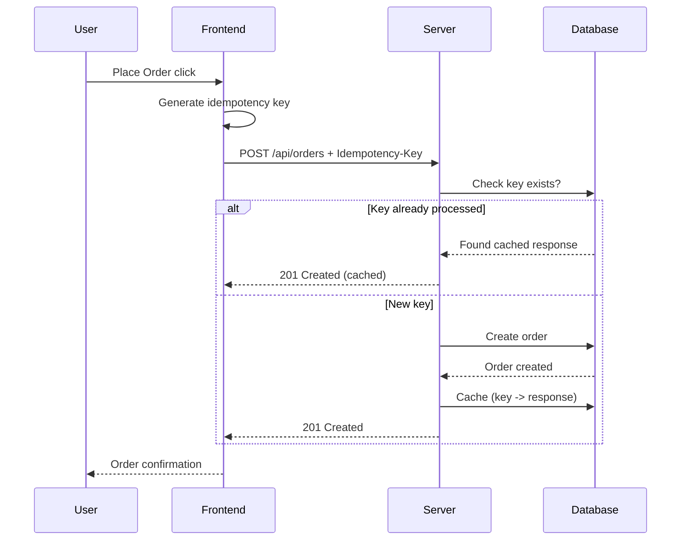
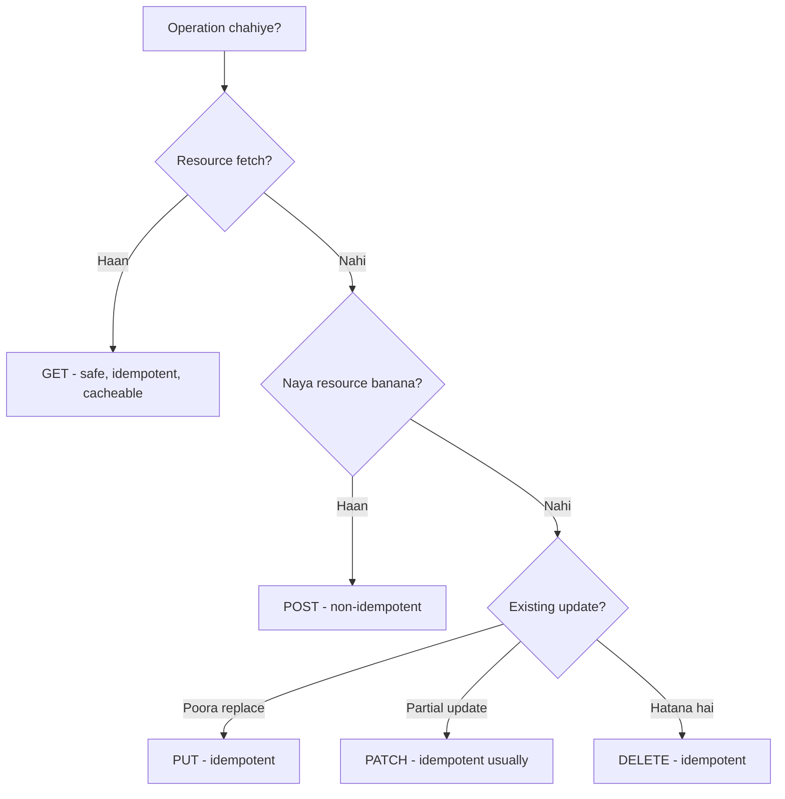
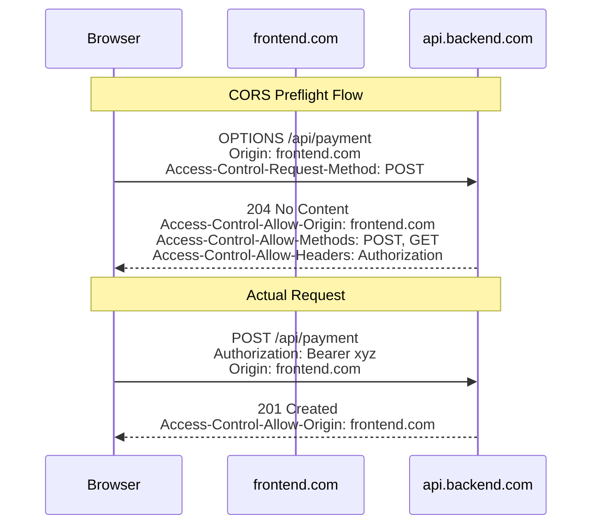
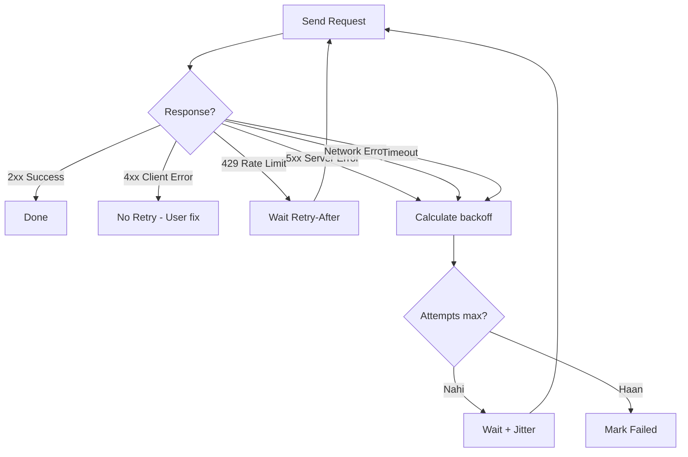
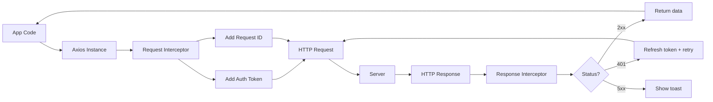

# Frontend API Integration

Bhai, frontend banana sirf UI design karna nahi hai. Asli kaam tab shuru hota hai jab tu apne button click ko backend ke saath connect karta hai — login authenticate karna, cart mein item add karna, payment ka status fetch karna, real-time notification dikhana. Ye sab "API integration" ke through hota hai. Frontend aur backend basically do alag-alag duniya hain — frontend browser mein chalta hai (user ke device par), backend kisi data center mein. Inke beech baat-cheet HTTP protocol ke through hoti hai, aur is conversation ko structured banane ke liye REST, GraphQL jaisi conventions use karte hain.

Product companies (Zomato, Swiggy, Razorpay, Flipkart) jab frontend engineer hire karti hain, toh wo dekhte hain ki tu API ko sirf "call kar leta hai" ya tu samajhta hai ki network kaisa behave karta hai. Network kabhi reliable nahi hota — user metro mein hai, signal aata-jaata rehta hai, server kabhi 500 throw karta hai, kabhi rate-limit hit ho jaata hai. Production-grade frontend engineer wo hai jo loading state, error state, retry logic, timeout, race conditions, stale data, optimistic updates — sab handle karta hai. Aur ye sab tab tak nahi seekh sakta jab tak tujhe REST principles, HTTP semantics, headers, auth flows, aur fetch/axios ki internals nahi pata.

Is module mein hum 5 bade topics deeply cover karenge — REST APIs ki philosophy, HTTP methods ki semantics, headers aur authentication, error handling with retries aur exponential backoff, aur Axios vs Fetch ka real comparison with interceptors aur cancellation. Har subtopic mein definition, "why" ka logic, runnable code, real-life Zomato/Razorpay-style example, Mermaid diagram, aur interview-style Q&A milega. Chal shuru karte hain.

---

## 1. REST APIs

### 1.1 Resources, idempotency, status codes (REST principles deeply)

#### Definition

REST ka full form hai **Representational State Transfer**. Ye Roy Fielding ne 2000 mein apni PhD thesis mein propose kiya tha. Simple bhasha mein — REST ek **architectural style** hai jo HTTP ke upar build hota hai, jisme tu apne backend ko "resources" ke collection ki tarah model karta hai, aur har resource ko ek unique URL (URI) deta hai. Phir HTTP methods (GET, POST, PUT, DELETE) use karke un resources par operations perform karta hai.

REST ke 6 core constraints hain — **client-server separation**, **statelessness**, **cacheability**, **layered system**, **uniform interface**, aur optional **code-on-demand**. Inme se sabse important interview ke liye hain — statelessness aur uniform interface. Statelessness ka matlab — server ko har request ko independent treat karna chahiye. Server tujhe yaad nahi rakhta ki tune pichli baar kya bheja tha. Tujhe har request mein apna context (auth token, user ID) khud bhejna padta hai.

**Idempotency** ka matlab hai — same request ko 1 baar bhejo ya 100 baar, server ka final state same hona chahiye. GET, PUT, DELETE idempotent hain. POST nahi hai (kyunki har POST ek naya resource banata hai). PATCH technically idempotent ho sakta hai, depend karta hai implementation par.

**Status codes** — server response ke saath ek 3-digit number bhejta hai jo bata raha hota hai ki request ka kya hua. 2xx = success, 3xx = redirection, 4xx = client ki galti, 5xx = server ki galti.

#### Why?

Bhai socha hai kabhi, agar REST nahi hota toh kya hota? Pehle SOAP hota tha — XML-based, bhari-bhakkam, har endpoint apna custom protocol. Tujhe har API ke liye alag client library generate karni padti thi. REST ne sab kuch standardize kar diya — same HTTP, same methods, same status codes. Ab tu Zomato ka API call kare ya Razorpay ka, dono ka mental model same hai.

Idempotency kyun important hai? Imagine kar — tu Razorpay pe payment kar raha hai, tune "Pay 500" button daba diya. Request gayi, network slow hua, tujhe response nahi mila. Tune dobara dabaya. Agar payment API idempotent nahi hota toh tujhse 1000 cut ho jaate. Idempotency keys (jo Stripe aur Razorpay use karte hain) yahi solve karte hain. Tu ek unique key bhejta hai har payment ke saath, server check karta hai "ye key pehle dekhi thi kya?" agar haan — wahi response wapas bhej deta hai bina double-charge kiye.

Status codes kyun? Frontend ko tarike se decide karna hota hai ki UI mein kya dikhana hai. 200? Success toast. 401? Login screen pe bhej do. 403? "Permission nahi hai" message. 404? "Page not found". 500? "Kuch garbar hai, baad mein try karo". Agar tu sab 200 return karega aur error body mein chupayega, toh frontend logic spaghetti ban jayega.

#### How? (with code)

```javascript
// REST resource design example - blog API
// Resources: users, posts, comments

// GET /api/posts          -> saari posts list (collection)
// GET /api/posts/42       -> ek specific post (item)
// POST /api/posts         -> nayi post banao
// PUT /api/posts/42       -> poori post replace karo (idempotent)
// PATCH /api/posts/42     -> partial update (sirf title change karo)
// DELETE /api/posts/42    -> post delete karo (idempotent)

// Frontend mein status code handle karna
async function fetchPost(postId) {
  // Backend ko call lagao
  const response = await fetch(`/api/posts/${postId}`);

  // Status code ke basis pe alag-alag handle karo
  if (response.status === 200) {
    // Success - data return karo
    return await response.json();
  } else if (response.status === 401) {
    // Token expire ho gaya - login pe bhejo
    window.location.href = '/login';
    throw new Error('Authentication required');
  } else if (response.status === 403) {
    // Permission nahi hai
    throw new Error('Aap is post ko nahi dekh sakte');
  } else if (response.status === 404) {
    // Post exist hi nahi karti
    throw new Error('Post nahi mili');
  } else if (response.status >= 500) {
    // Server ki galti hai - retry karna safe hai
    throw new Error('Server down hai, thodi der baad try karo');
  }
}

// Idempotency key bhejna - payment ke liye critical
async function makePayment(amount, idempotencyKey) {
  const response = await fetch('/api/payments', {
    method: 'POST',
    headers: {
      'Content-Type': 'application/json',
      // Ye key server ko bolti hai - duplicate request ignore karo
      'Idempotency-Key': idempotencyKey
    },
    body: JSON.stringify({ amount })
  });
  return response.json();
}
```

#### Real-life Example (with code)

Zomato ki order placement flow lo. Tu cart mein 3 items add karta hai, address select karta hai, "Place Order" daba deta hai. Frontend ko ek POST /api/orders bhejni hoti hai. Lekin yahan asli challenge hai — agar user double-click kar de toh? Ya network slow ho aur user "Place Order" 3 baar daba de? Tujhe duplicate orders prevent karne hain.

```javascript
// Zomato-style order placement with idempotency
import { v4 as uuidv4 } from 'uuid';

class OrderService {
  constructor(authToken) {
    this.authToken = authToken;
    this.baseURL = 'https://api.zomato-clone.com';
  }

  // Order place karo - idempotent banao
  async placeOrder(cartItems, address, paymentMethod) {
    // Har attempt ke liye unique idempotency key generate karo
    // Agar user ne 3 baar click kiya, teeno me wahi key jayegi
    const idempotencyKey = uuidv4();

    // Order body taiyaar karo
    const orderPayload = {
      items: cartItems.map(item => ({
        dishId: item.id,
        quantity: item.qty,
        customizations: item.customizations
      })),
      deliveryAddress: address,
      paymentMethod,
      placedAt: new Date().toISOString()
    };

    try {
      // POST /api/orders - resource creation
      const response = await fetch(`${this.baseURL}/api/orders`, {
        method: 'POST',
        headers: {
          'Content-Type': 'application/json',
          'Authorization': `Bearer ${this.authToken}`,
          'Idempotency-Key': idempotencyKey
        },
        body: JSON.stringify(orderPayload)
      });

      // Status code ke according handle karo
      switch (response.status) {
        case 201: // Created - order safal banaa
          return { success: true, order: await response.json() };

        case 400: // Bad request - shayad cart empty hai
          const error400 = await response.json();
          return { success: false, error: error400.message };

        case 402: // Payment required - card decline hua
          return { success: false, error: 'Payment fail ho gaya' };

        case 409: // Conflict - shayad item out of stock
          return { success: false, error: 'Kuch items unavailable hain' };

        case 429: // Too many requests - rate limit
          return { success: false, error: 'Thoda ruk ke try karo' };

        default:
          if (response.status >= 500) {
            // Server error - safely retry kar sakte hain
            // (kyunki POST idempotent banaaya hai key se)
            throw new Error('SERVER_ERROR_RETRY');
          }
          throw new Error('Unknown error');
      }
    } catch (err) {
      if (err.message === 'SERVER_ERROR_RETRY') {
        // Same idempotency key ke saath retry karo
        // Server agar pehli baar safal hua tha toh wahi response milega
        return this.retryWithBackoff(orderPayload, idempotencyKey);
      }
      throw err;
    }
  }

  async retryWithBackoff(payload, key, attempt = 1) {
    if (attempt > 3) throw new Error('Max retries reached');

    // Exponential backoff - 1s, 2s, 4s
    const delay = Math.pow(2, attempt - 1) * 1000;
    await new Promise(resolve => setTimeout(resolve, delay));

    // Same key ke saath retry - duplicate order nahi banegi
    return this.placeOrder(payload.items, payload.deliveryAddress, payload.paymentMethod);
  }
}
```

#### Diagram



#### Interview Question

**Q: REST aur RESTful mein difference kya hai? Kya tu apni Zomato API ko truly RESTful kahega?**

Bhai ye sawal interviewer log isliye puchte hain kyunki 90% APIs jo "REST" claim karti hain, wo actually RESTful nahi hain. REST ek architectural style hai jo Roy Fielding ne propose kiya. RESTful ka matlab hai — REST ke saare constraints follow karna, including HATEOAS (Hypermedia as the Engine of Application State). HATEOAS ka matlab — server response mein next possible actions ke links bheje. Jaise tu ek order fetch kare aur response mein "cancel", "track", "rate" ke URLs aaye, taaki client ko hardcode na karna pade.

Real world mein 99% companies (Zomato, Flipkart, Razorpay sab) HATEOAS skip kar deti hain. Wo "Level 2 maturity" tak hi jaate hain Richardson Maturity Model ke according — yaani resources + HTTP verbs + status codes. Iska reason practical hai — HATEOAS frontend ko complex bana deta hai aur mobile apps ko discovery ki zaroorat nahi hoti, wo to hardcoded endpoints use karte hain. Toh main interview mein bolunga ki "humari API REST principles follow karti hai par technically Level 2 hai, full HATEOAS nahi hai".

Doosra angle — agar API stateful hai (jaise session cookies pe depend karti hai), toh wo RESTful nahi hai. REST ka core constraint statelessness hai. Maine dekha hai bahut companies session-based auth use karti hain aur khud ko REST kehte hain — technically galat hai. Pure REST mein har request self-contained honi chahiye, har request mein auth token bhejna chahiye (Bearer token jaisa).

Practical interview tip — agar interviewer ye puche, toh trade-offs ki baat kar. Bol ki "true RESTful banane se discoverability badhti hai par complexity bhi badhti hai. Production mein hum pragmatic approach lete hain — resources, methods, status codes follow karte hain, lekin HATEOAS skip karte hain because mobile clients aur SPAs ko fixed endpoints chahiye performance ke liye". Ye answer dikhata hai ki tu sirf theory nahi, real-world tradeoffs samajhta hai.

---

## 2. HTTP methods

### 2.1 GET, POST, PUT, PATCH, DELETE — semantics, when to use which

#### Definition

HTTP methods (verbs bhi bolte hain) wo actions hain jo tu kisi resource par perform karna chahta hai. Har method ki apni semantics hain — kuch safe hain (data nahi badalte), kuch idempotent hain (multiple times call karne se same effect), kuch dono hain.

- **GET** — resource fetch karo. Safe + idempotent. Body nahi hota request mein (technically allowed but use mat kar).
- **POST** — naya resource banao ya non-idempotent action perform karo. Na safe, na idempotent.
- **PUT** — resource ko fully replace karo. Idempotent (same body bhejo 100 baar, same state).
- **PATCH** — resource ko partially update karo. Idempotent ho sakta hai (depends on payload format).
- **DELETE** — resource hatao. Idempotent (already deleted resource pe DELETE karne se 404 ya 204 milega, state same hi rahega).

#### Why?

Methods ki semantics follow karna isliye zaroori hai kyunki HTTP infrastructure (browsers, CDNs, proxies, load balancers) in semantics par bharosa karta hai. Browser GET requests ko cache kar sakta hai. CDN GET requests ko edge pe cache karta hai. Proxy server timeout pe GET aur PUT ko safely retry kar sakta hai, lekin POST ko nahi.

Imagine kar agar tu DELETE ke jagah GET use kare resource hatane ke liye (jaise GET /api/delete-user/42). Phir koi crawler ya browser prefetcher tujhe accidentally users ko delete kar dega. Real example — kaafi saal pehle Google Web Accelerator (jo links prefetch karta tha) ne websites ke "delete" links GET pe khole the, aur poora data udwa diya tha.

PATCH vs PUT ka difference samjho. PUT means "ye lo poora object, isse replace kar do". Agar tu PUT karega aur kuch fields nahi bheji, toh wo fields null ho jayengi. PATCH means "sirf ye fields update karo, baaki ko mat chedo". Bandwidth bhi save hota hai aur partial updates safe hote hain.

#### How? (with code)

```javascript
// User profile API - sahi method ka use
const API = 'https://api.example.com';

// GET - profile fetch karo (safe, idempotent, cacheable)
async function getProfile(userId) {
  const res = await fetch(`${API}/users/${userId}`, {
    method: 'GET',
    // GET mein body nahi hota
    headers: { 'Accept': 'application/json' }
  });
  return res.json();
}

// POST - naya user banao (na safe, na idempotent)
async function createUser(userData) {
  const res = await fetch(`${API}/users`, {
    method: 'POST',
    headers: { 'Content-Type': 'application/json' },
    // POST mein body chahiye - naya resource ka data
    body: JSON.stringify(userData)
  });
  // 201 Created milega, Location header mein naya URL
  return res.json();
}

// PUT - poora user replace karo (idempotent)
async function replaceUser(userId, fullUserData) {
  const res = await fetch(`${API}/users/${userId}`, {
    method: 'PUT',
    headers: { 'Content-Type': 'application/json' },
    // Saari fields bhejo - jo nahi bhejega wo null ho jayega
    body: JSON.stringify(fullUserData)
  });
  return res.json();
}

// PATCH - sirf email update karo (partial, efficient)
async function updateEmail(userId, newEmail) {
  const res = await fetch(`${API}/users/${userId}`, {
    method: 'PATCH',
    headers: { 'Content-Type': 'application/json' },
    // Sirf jo change karna hai wo bhejo
    body: JSON.stringify({ email: newEmail })
  });
  return res.json();
}

// DELETE - user hatao (idempotent)
async function deleteUser(userId) {
  const res = await fetch(`${API}/users/${userId}`, {
    method: 'DELETE'
    // Body usually nahi hota, 204 No Content milta hai
  });
  return res.status === 204;
}
```

#### Real-life Example (with code)

Swiggy ke "Favorites" feature ko model karte hain. User restaurants ko favorite kar sakta hai, list dekh sakta hai, remove kar sakta hai, aur poori list reorder kar sakta hai.

```javascript
// Swiggy Favorites Manager
class FavoritesManager {
  constructor(token) {
    this.token = token;
    this.baseURL = 'https://api.swiggy-clone.com/v1';
    this.headers = {
      'Content-Type': 'application/json',
      'Authorization': `Bearer ${token}`
    };
  }

  // GET - saari favorites fetch karo
  // Idempotent + safe + cacheable - browser/CDN cache kar sakta hai
  async getFavorites() {
    const res = await fetch(`${this.baseURL}/favorites`, {
      method: 'GET',
      headers: this.headers
    });

    if (res.status === 304) {
      // Not Modified - cache se data lo
      return this.cachedFavorites;
    }

    const data = await res.json();
    this.cachedFavorites = data;
    return data;
  }

  // POST - naya favorite add karo
  // Non-idempotent - 2 baar call karoge to error ya duplicate
  async addFavorite(restaurantId) {
    const res = await fetch(`${this.baseURL}/favorites`, {
      method: 'POST',
      headers: this.headers,
      body: JSON.stringify({ restaurantId, addedAt: Date.now() })
    });

    if (res.status === 409) {
      // Conflict - already favorite hai
      throw new Error('Pehle se hi favorites mein hai');
    }
    if (res.status !== 201) {
      throw new Error('Add nahi ho paaya');
    }
    return res.json();
  }

  // DELETE - favorite hatao
  // Idempotent - 2 baar delete karoge to bhi same final state
  async removeFavorite(favoriteId) {
    const res = await fetch(`${this.baseURL}/favorites/${favoriteId}`, {
      method: 'DELETE',
      headers: this.headers
    });

    // 204 No Content ya 404 Not Found - dono acceptable
    // Final state - resource gone
    return res.status === 204 || res.status === 404;
  }

  // PATCH - favorite ka note update karo (partial update)
  // Sirf jo field change karni hai wo bhejo
  async updateFavoriteNote(favoriteId, note) {
    const res = await fetch(`${this.baseURL}/favorites/${favoriteId}`, {
      method: 'PATCH',
      headers: this.headers,
      // Sirf 'note' field bhej rahe hain
      // Baaki fields (restaurantId, addedAt) untouched rahengi
      body: JSON.stringify({ note })
    });
    return res.json();
  }

  // PUT - poori favorites list reorder karo (full replace)
  // User ne drag-drop kiya, naya order bhejna hai
  async reorderFavorites(orderedIds) {
    const res = await fetch(`${this.baseURL}/favorites/order`, {
      method: 'PUT',
      headers: this.headers,
      // Poori order list bhej rahe hain - replace operation
      body: JSON.stringify({ order: orderedIds })
    });
    return res.json();
  }
}

// Usage
const favs = new FavoritesManager('user-token-xyz');
await favs.addFavorite('restaurant-101');     // POST
await favs.getFavorites();                     // GET
await favs.updateFavoriteNote('fav-1', 'Best biryani'); // PATCH
await favs.reorderFavorites(['fav-3', 'fav-1', 'fav-2']); // PUT
await favs.removeFavorite('fav-2');            // DELETE
```

#### Diagram



#### Interview Question

**Q: Tu kab POST use karega aur kab PUT? Aur agar mujhe ek "toggle like" feature banana hai, toh kaunsa method?**

Pehla part — POST tab use karega jab tu naya resource banaa raha hai aur uska URL server decide karega. Jaise POST /api/posts — server post ID generate karega aur tujhe Location header mein /api/posts/42 wapas dega. PUT tab use karega jab tu khud URL specify kar raha hai aur poora resource replace kar raha hai. Jaise PUT /api/users/42 — tu bol raha hai "is exact ID pe ye user data daal do, agar exist karta hai toh replace, nahi karta toh banao". PUT idempotent hai isliye, POST nahi.

Toggle like wala scenario interesting hai. Most companies POST use karti hain — POST /api/posts/42/like aur POST /api/posts/42/unlike, do alag endpoints. Iska reason — semantically clear hai aur user intent capture hota hai. Agar tu sirf ek toggle endpoint banayega (POST /api/posts/42/toggle-like), toh idempotency tutti hai — 2 baar call karne se state flip ho jayega, jo network retry ke case mein khatarnak hai.

Better approach — PUT use kar with idempotent payload. PUT /api/posts/42/like with body { liked: true }. Ab 100 baar bhi call kar, final state liked=true hi rahega. Ye REST principles ke saath bhi align hota hai. Twitter aur Instagram ka API kuch aisa hi karta hai — PUT/DELETE pair use karte hain like/unlike ke liye, ya idempotent POST with explicit state.

Interview mein bonus point — tu mention kar sakta hai PATCH bhi consider kiya jaa sakta hai agar like ek bigger object ka part hai (like reaction type — heart, thumbs up, fire). PATCH /api/posts/42 with body { myReaction: 'heart' }. Real production mein dependent karta hai backend team ki design preferences pe, lekin idempotency ka concept har jagah apply hota hai.

---

## 3. Headers & auth

### 3.1 Common headers, Bearer tokens, CORS, cookies, preflight

#### Definition

HTTP headers metadata hain — request aur response ke saath jaane wali extra information jo body ka part nahi hai. Headers batate hain ki content kis format mein hai (Content-Type), kaun bhej raha hai (Authorization), kya response cache ho sakta hai (Cache-Control), aur bahut kuch.

**Bearer tokens** — modern auth ka standard. Jab user login karta hai, server ek JWT (JSON Web Token) ya opaque token deta hai. Frontend uss token ko `Authorization: Bearer <token>` header mein har request ke saath bhejta hai. Server token verify karta hai aur user identify karta hai.

**CORS (Cross-Origin Resource Sharing)** — browser ki security feature. By default browser ek origin (https://zomato.com) se doosre origin (https://api.zomato.com) pe AJAX request nahi karne deta — Same-Origin Policy. CORS wo mechanism hai jisse server bata sakta hai "haan, mujhe ye origin se requests accept hain".

**Cookies** — chote text data jo browser store karta hai aur har same-origin request ke saath automatically bhejta hai. Auth ke liye, CSRF protection ke saath, ya session management ke liye use hote hain.

**Preflight** — CORS ka extra step. Browser kuch "non-simple" requests (jaise PUT, DELETE, ya custom headers wali) bhejne se pehle ek OPTIONS request bhejta hai server ko, ye check karne ke liye ki "kya tu mujhse ye request accept karega?".

#### Why?

Headers kyun important? Kyunki body se kayi cheezein bahar rakhni padti hain. Agar tu auth token body mein bheje, toh GET requests mein nahi bhej sakta (GET mein body nahi hota technically). Plus, headers proxies aur middleware (nginx, CDN) ko intercept aur modify karne dete hain bina body padhe — performance ke liye crucial.

Bearer token vs cookies wala debate samajh — cookies automatic chali jaati hain, jisse CSRF (Cross-Site Request Forgery) attack ho sakta hai. Bearer tokens manually attach karne padte hain, JS code se. Isliye SPAs (React, Vue) Bearer tokens prefer karte hain — secure aur stateless. Lekin agar tu HTTP-only cookie use kare, toh JS access nahi kar sakti, toh XSS se token chori nahi ho sakti. Trade-off hai.

CORS kyun? Imagine kar agar CORS na hota — tu malicious-site.com khole, wo background mein tere bank ke API pe request bhej de aur tera paisa transfer kar de (kyunki tera browser bank cookies automatically attach karega). Same-Origin Policy ye prevent karta hai. CORS controlled way mein cross-origin allow karta hai.

Preflight kyun zaroori? Browser ko safe rehna hai. Agar koi malicious site PUT /api/delete-account bhejne lage tere bank ko, toh browser pehle OPTIONS bhejta hai. Bank kahega "Access-Control-Allow-Origin sirf bank.com hai", browser request abort kar dega. Preflight basically gatekeeper hai.

#### How? (with code)

```javascript
// Common headers ka use
async function fetchWithHeaders(url, token) {
  const res = await fetch(url, {
    method: 'GET',
    headers: {
      // Content type response mein kya format chahiye
      'Accept': 'application/json',

      // Auth - Bearer token
      'Authorization': `Bearer ${token}`,

      // Custom header - tracking ke liye
      'X-Request-ID': crypto.randomUUID(),

      // Client info
      'X-Client-Version': '2.3.1',

      // Cache control
      'Cache-Control': 'no-cache'
    },
    // Cookies bhejna ya nahi - cross-origin ke liye
    credentials: 'include'  // ya 'same-origin', 'omit'
  });

  // Response headers padhna
  const requestId = res.headers.get('X-Request-ID');
  const rateLimit = res.headers.get('X-RateLimit-Remaining');

  return res.json();
}

// CORS handle karna - server side example (Express)
// app.use((req, res, next) => {
//   res.setHeader('Access-Control-Allow-Origin', 'https://myapp.com');
//   res.setHeader('Access-Control-Allow-Methods', 'GET, POST, PUT, DELETE');
//   res.setHeader('Access-Control-Allow-Headers', 'Content-Type, Authorization');
//   res.setHeader('Access-Control-Allow-Credentials', 'true');
//   if (req.method === 'OPTIONS') return res.sendStatus(204);
//   next();
// });

// Cookie set karna (server response mein)
// Set-Cookie: session=abc123; HttpOnly; Secure; SameSite=Strict; Max-Age=3600

// Frontend mein cookie-based auth
async function loginWithCookie(email, password) {
  const res = await fetch('/api/login', {
    method: 'POST',
    headers: { 'Content-Type': 'application/json' },
    body: JSON.stringify({ email, password }),
    // Important - cookies receive aur send karne ke liye
    credentials: 'include'
  });
  // Server Set-Cookie header bhej dega, browser auto store karega
  return res.ok;
}
```

#### Real-life Example (with code)

Razorpay-style payment gateway integration banate hain. Yahan auth, CORS, aur secure headers sab milte hain.

```javascript
// Razorpay-style API client with full auth
class PaymentAPIClient {
  constructor() {
    this.baseURL = 'https://api.payments.com/v1';
    this.accessToken = null;
    this.refreshToken = null;
    this.tokenExpiry = null;
  }

  // Login - JWT tokens lene ke liye
  async login(email, password) {
    const res = await fetch(`${this.baseURL}/auth/login`, {
      method: 'POST',
      headers: {
        'Content-Type': 'application/json',
        'X-Client-Type': 'web-spa'
      },
      // credentials include for cross-origin cookie
      // (refresh token HttpOnly cookie mein aata hai)
      credentials: 'include',
      body: JSON.stringify({ email, password })
    });

    if (!res.ok) throw new Error('Login fail');

    const data = await res.json();
    // Access token short-lived hota hai (15 min)
    this.accessToken = data.accessToken;
    this.tokenExpiry = Date.now() + (data.expiresIn * 1000);
    // Refresh token HttpOnly cookie mein hai - JS access nahi kar sakti
    return data.user;
  }

  // Token refresh - silent reauth
  async refreshAccessToken() {
    // Refresh token cookie mein already hai - browser bhej dega
    const res = await fetch(`${this.baseURL}/auth/refresh`, {
      method: 'POST',
      credentials: 'include',  // cookie bhejne ke liye
      headers: { 'X-Client-Type': 'web-spa' }
    });

    if (res.status === 401) {
      // Refresh token bhi expire ho gaya - relogin chahiye
      this.accessToken = null;
      window.location.href = '/login';
      throw new Error('Session expired');
    }

    const data = await res.json();
    this.accessToken = data.accessToken;
    this.tokenExpiry = Date.now() + (data.expiresIn * 1000);
  }

  // Authenticated request banane ka helper
  async authFetch(endpoint, options = {}) {
    // Token expire ho raha hai? Refresh karo
    if (Date.now() > this.tokenExpiry - 60000) {
      await this.refreshAccessToken();
    }

    // Idempotency key - critical for payments
    const idempotencyKey = options.method === 'POST'
      ? crypto.randomUUID()
      : undefined;

    const headers = {
      'Content-Type': 'application/json',
      'Accept': 'application/json',
      // Bearer token - main auth mechanism
      'Authorization': `Bearer ${this.accessToken}`,
      // Tracing ke liye - har request unique ID
      'X-Request-ID': crypto.randomUUID(),
      // Client fingerprint
      'X-Client-Version': '3.2.1',
      ...(idempotencyKey && { 'Idempotency-Key': idempotencyKey }),
      ...options.headers
    };

    const res = await fetch(`${this.baseURL}${endpoint}`, {
      ...options,
      headers
    });

    // 401 - token invalid ho gaya, refresh aur retry
    if (res.status === 401 && !options._retried) {
      await this.refreshAccessToken();
      return this.authFetch(endpoint, { ...options, _retried: true });
    }

    return res;
  }

  // Payment create karo - sensitive operation
  async createPayment(amount, currency, customerId) {
    const res = await this.authFetch('/payments', {
      method: 'POST',
      body: JSON.stringify({ amount, currency, customerId })
    });

    if (!res.ok) {
      const err = await res.json();
      throw new Error(err.message);
    }
    return res.json();
  }
}

// Usage
const client = new PaymentAPIClient();
await client.login('user@example.com', 'pass123');
const payment = await client.createPayment(50000, 'INR', 'cust_xyz');
```

#### Diagram



#### Interview Question

**Q: Mujhe samjha — JWT ko localStorage mein store karna chahiye ya cookie mein? Aur CORS me preflight kab hota hai aur kab nahi?**

JWT storage ka debate evergreen hai. localStorage mein store karne ka pro — simple, JS access kar sakti hai easily, har frontend framework ke saath kaam karta hai. Con — XSS attack se vulnerable hai. Agar koi malicious script tere page pe inject ho gayi (npm package ki vulnerability se ya user-generated content se), toh wo localStorage padh sakti hai aur token chura sakti hai. Ek baar token chori ho gaya, attacker tere user ke account pe sab kuch kar sakta hai.

HttpOnly cookies mein store karne ka pro — JS access nahi kar sakti, toh XSS se safe. Browser automatically attach kar deta hai requests ke saath. Con — CSRF (Cross-Site Request Forgery) ka risk hai, kyunki cookies har request pe automatic chali jaati hain even malicious sites se. Solve karne ke liye SameSite=Strict ya SameSite=Lax flag aur CSRF tokens use karte hain. Modern best practice — refresh token HttpOnly Secure SameSite=Strict cookie mein, access token memory mein (in-memory variable). Page refresh pe access token gum, refresh token se naya bana lo. Best of both worlds.

Preflight ka rule yaad rakh — preflight tabhi nahi hota jab request "simple" ho. Simple request ka definition — method GET/HEAD/POST ho, aur headers sirf "CORS-safelisted" hoon (Accept, Accept-Language, Content-Language, Content-Type with value application/x-www-form-urlencoded ya multipart/form-data ya text/plain). Agar tu Content-Type: application/json bheje, toh preflight hoga. Agar tu Authorization header bheje, preflight hoga. Agar method PUT, DELETE, PATCH ho, preflight hoga. Custom headers (X-Anything) ho, preflight hoga.

Real interview answer — main bolunga "main HttpOnly cookie + access token in memory pattern follow karta hoon production grade SPAs ke liye. Preflight optimize karne ke liye Access-Control-Max-Age header use karta hoon (preflight response cache, 10 minutes default). Aur agar bahut sare requests ho rahi hain same origin pe, toh CORS ko bypass karne ke liye reverse proxy use karna better hai — apne backend ko same origin pe expose kar do nginx ke through". Ye answer bahut professional sound karta hai.

---

## 4. Error handling

### 4.1 Network errors, retries, timeouts, exponential backoff

#### Definition

Network reliability ek myth hai. Production frontend mein 3 tarah ke errors aate hain — **network errors** (request server tak pohnchi hi nahi — DNS fail, TCP timeout, browser offline), **HTTP errors** (server ne response diya, par 4xx ya 5xx hai), aur **application errors** (200 mila, par response body mein logical error hai).

**Retry** — fail hui request ko dobara try karna. Lekin sirf safe operations pe (idempotent ones) ya idempotency key ke saath.

**Timeout** — kitni der wait karega request ka response. Default fetch ka timeout nahi hota — request infinite hang ho sakti hai!

**Exponential backoff** — retry ke beech wait time ko exponentially badhana. Pehle attempt ke baad 1s ruko, doosre ke baad 2s, phir 4s, 8s. Plus thoda **jitter** (randomness) add karo taaki saare clients ek saath retry na karein aur server ko aur load na de.

#### Why?

Network errors handle nahi karne se app crash ho sakti hai. User metro mein hai, signal gaya, request fail hui — agar tune sirf `await fetch()` likha hai bina try-catch, toh tera promise reject hoga aur agar uncaught hai toh console mein scary errors aayenge ya UI freeze ho sakti hai. Production mein har API call try-catch mein wrap honi chahiye.

Retry kyun? Kyunki transient errors common hain — server temporarily overloaded, DB connection blip, network glitch. Ek silent retry user experience bahut better kar deta hai. Lekin retry ka logic complicated hai — kab retry karna hai, kab nahi. 5xx pe retry safe hai usually, 4xx pe nahi (kyunki client ki galti hai). 429 (rate limit) pe Retry-After header dekho.

Exponential backoff kyun? Linear retry (har 1 second) thundering herd problem create karta hai. Server down hua, 1 lakh users har second retry kar rahe hain — server kabhi recover nahi kar payega. Exponential backoff with jitter retry attempts ko spread out karta hai over time, server ko breathing room deta hai.

Timeout kyun? Without timeout, ek slow request poora frontend hang kar sakti hai. User UI freeze dekhta hai, frustrated ho jaata hai. Production mein har fetch ka timeout hona chahiye — typically 10-30 seconds depending on operation.

#### How? (with code)

```javascript
// Production-grade fetch wrapper with retry, timeout, backoff
async function robustFetch(url, options = {}, config = {}) {
  const {
    maxRetries = 3,
    timeoutMs = 10000,
    retryableStatuses = [408, 429, 500, 502, 503, 504]
  } = config;

  let lastError;

  for (let attempt = 0; attempt <= maxRetries; attempt++) {
    // AbortController for timeout
    const controller = new AbortController();
    const timeoutId = setTimeout(() => controller.abort(), timeoutMs);

    try {
      const response = await fetch(url, {
        ...options,
        signal: controller.signal
      });

      clearTimeout(timeoutId);

      // Successful - return karo
      if (response.ok) return response;

      // Retryable status code? Retry karo
      if (retryableStatuses.includes(response.status)) {
        // 429 ke case mein server bata sakta hai kab retry karna hai
        const retryAfter = response.headers.get('Retry-After');
        const delay = retryAfter
          ? parseInt(retryAfter) * 1000
          : calculateBackoff(attempt);

        console.warn(`Attempt ${attempt + 1} failed with ${response.status}, retrying in ${delay}ms`);
        await sleep(delay);
        lastError = new Error(`HTTP ${response.status}`);
        continue;
      }

      // Non-retryable error - throw karo
      throw new Error(`HTTP ${response.status}`);

    } catch (err) {
      clearTimeout(timeoutId);
      lastError = err;

      // Timeout ya network error - retry karo
      if (err.name === 'AbortError' || err.message.includes('network')) {
        if (attempt < maxRetries) {
          const delay = calculateBackoff(attempt);
          console.warn(`Network error, retrying in ${delay}ms`);
          await sleep(delay);
          continue;
        }
      }

      // Last attempt ya non-retryable - throw
      throw err;
    }
  }

  throw lastError;
}

// Exponential backoff with jitter
function calculateBackoff(attempt) {
  const baseDelay = 1000; // 1 second
  const maxDelay = 30000; // 30 seconds cap
  const exponential = Math.min(baseDelay * Math.pow(2, attempt), maxDelay);
  // Jitter - 0% to 30% random extra
  const jitter = exponential * 0.3 * Math.random();
  return Math.floor(exponential + jitter);
}

function sleep(ms) {
  return new Promise(r => setTimeout(r, ms));
}

// Usage
try {
  const res = await robustFetch('/api/users/42', {}, {
    maxRetries: 3,
    timeoutMs: 5000
  });
  const user = await res.json();
} catch (err) {
  if (err.name === 'AbortError') {
    showToast('Request timeout - check your connection');
  } else {
    showToast('Could not load user');
  }
}
```

#### Real-life Example (with code)

WhatsApp Web jaisa message sending feature banate hain. Ye must handle hone wala scenario hai — message bhejna, fail hone pe automatically retry, network wapas aane pe queue se bhejna.

```javascript
// WhatsApp-style message sender with offline queue
class MessageSender {
  constructor() {
    this.queue = []; // Failed messages queue
    this.isOnline = navigator.onLine;
    this.setupNetworkListeners();
  }

  setupNetworkListeners() {
    // Network wapas aane pa queue process karo
    window.addEventListener('online', () => {
      console.log('Network wapas aaya - queue process karte hain');
      this.isOnline = true;
      this.processQueue();
    });

    window.addEventListener('offline', () => {
      console.log('Offline ho gaye');
      this.isOnline = false;
    });
  }

  // Main send function
  async sendMessage(chatId, text) {
    // Local message banao with pending status
    const message = {
      id: crypto.randomUUID(),
      chatId,
      text,
      status: 'pending',
      createdAt: Date.now(),
      attempts: 0
    };

    // UI mein tick lagao - "sending"
    this.renderMessage(message);

    if (!this.isOnline) {
      // Offline hai - queue mein daal do
      message.status = 'queued';
      this.queue.push(message);
      this.renderMessage(message);
      return;
    }

    return this.attemptSend(message);
  }

  // Actual send with retry logic
  async attemptSend(message) {
    const maxAttempts = 5;

    while (message.attempts < maxAttempts) {
      message.attempts++;

      // Timeout - 10 seconds per attempt
      const controller = new AbortController();
      const timeoutId = setTimeout(() => controller.abort(), 10000);

      try {
        const res = await fetch('/api/messages', {
          method: 'POST',
          headers: {
            'Content-Type': 'application/json',
            'Idempotency-Key': message.id  // Duplicate prevent
          },
          body: JSON.stringify({
            chatId: message.chatId,
            text: message.text,
            clientId: message.id
          }),
          signal: controller.signal
        });

        clearTimeout(timeoutId);

        if (res.ok) {
          // Successful - status update karo
          const data = await res.json();
          message.status = 'sent';
          message.serverId = data.id;
          this.renderMessage(message);
          return message;
        }

        // 4xx errors - non-retryable
        if (res.status >= 400 && res.status < 500 && res.status !== 429) {
          message.status = 'failed';
          message.error = `Client error ${res.status}`;
          this.renderMessage(message);
          throw new Error(message.error);
        }

        // 5xx ya 429 - retry karo
        const delay = this.getRetryDelay(message.attempts, res);
        console.log(`Attempt ${message.attempts} fail, retrying in ${delay}ms`);
        await sleep(delay);

      } catch (err) {
        clearTimeout(timeoutId);

        // Offline ho gaye? Queue mein daalo
        if (!navigator.onLine) {
          message.status = 'queued';
          this.queue.push(message);
          this.renderMessage(message);
          return;
        }

        // Timeout ya network error - retry
        if (err.name === 'AbortError' || err.message.includes('fetch')) {
          if (message.attempts < maxAttempts) {
            const delay = this.getRetryDelay(message.attempts);
            await sleep(delay);
            continue;
          }
        }

        // Max attempts reached - mark as failed
        message.status = 'failed';
        this.renderMessage(message);
        throw err;
      }
    }
  }

  // Exponential backoff with jitter
  getRetryDelay(attempt, response = null) {
    // Server bola ho kab retry karna hai
    if (response) {
      const retryAfter = response.headers.get('Retry-After');
      if (retryAfter) return parseInt(retryAfter) * 1000;
    }

    const base = 1000;
    const max = 30000;
    const exp = Math.min(base * Math.pow(2, attempt - 1), max);
    const jitter = Math.random() * exp * 0.3;
    return Math.floor(exp + jitter);
  }

  // Network aane par queue process karo
  async processQueue() {
    while (this.queue.length > 0 && this.isOnline) {
      const msg = this.queue.shift();
      msg.attempts = 0; // Reset attempts
      try {
        await this.attemptSend(msg);
      } catch (err) {
        console.error('Queue message fail', msg.id);
      }
    }
  }

  renderMessage(msg) {
    // UI update logic - tick marks etc
    console.log(`Message ${msg.id}: ${msg.status}`);
  }
}

function sleep(ms) {
  return new Promise(r => setTimeout(r, ms));
}

// Usage
const sender = new MessageSender();
await sender.sendMessage('chat-101', 'Hello bhai');
```

#### Diagram



#### Interview Question

**Q: Tu ek POST request retry kaise karega safely? Aur bata "thundering herd" problem kya hai?**

POST request ko safely retry karne ke liye idempotency keys must hain. Without idempotency key, agar tu POST /api/payments ko retry kare aur original request actually safal thi (sirf response client tak nahi pohncha tha network glitch se), toh customer ka double charge ho jayega. Stripe, Razorpay sab payment APIs Idempotency-Key header support karte hain. Tu client side pe ek UUID generate karta hai, har retry mein wahi UUID bhejta hai. Server ek window ke andar (usually 24 hours) us key ko cache karta hai with response. Same key dobara aaya — cached response wapas, naya operation nahi.

Retry logic mein careful hona zaroori hai status codes ke saath. 4xx errors generally retry nahi karne hote — except 408 (Request Timeout), 425 (Too Early), 429 (Too Many Requests). 5xx errors retry safe hain usually, lekin 501 (Not Implemented) aur 505 (Version Not Supported) nahi. Network errors (fetch ne reject kiya) — definitely retry. Timeout errors — retry, lekin idempotency key zaroor.

Thundering herd ek classic distributed systems problem hai. Imagine kar — koi central service down hua. 1 lakh clients connected the. Sab same time pe error mile aur retry karne lage. Service jab recover karne ki koshish karta hai, 1 lakh requests ka stampede aata hai aur dobara crash ho jaata hai. Solution — exponential backoff with jitter. Backoff retries ko spread karta hai over time. Jitter (randomness) ensure karta hai ki sab clients exact same time pe na retry karein. Common formula — `delay = min(base * 2^attempt + random(0, base), max)`. AWS aur Google "Decorrelated Jitter" recommend karte hain — `delay = min(max, random(base, lastDelay * 3))`.

Real production mein hum **circuit breaker pattern** bhi use karte hain. Agar consecutive 10 requests fail ho gayi, circuit "open" ho jaata hai aur 30 seconds tak koi request nahi jaati — turant fail kar deta hai locally. 30 seconds baad "half-open" state mein 1 test request bhejta hai, agar safal — circuit "closed" wapas, normal traffic shuru. Ye pattern Netflix Hystrix se popular hua. Frontend mein hum react-query ya SWR jaisi libraries use karte hain jo ye sab patterns built-in dete hain — staleTime, retryDelay, exponentialBackoff, sab configurable hain.

---

## 5. Axios vs Fetch

### 5.1 When to use which, interceptors, defaults, request cancellation

#### Definition

**Fetch** — modern browsers ka built-in API. Promise-based, low-level, minimal. ES6+ ke saath aaya. No external dependency.

**Axios** — popular npm library jo XMLHttpRequest ke upar built hai (originally), browser aur Node.js dono mein chalti hai. Bahut features built-in hain — interceptors, automatic JSON parsing, request/response transformations, request cancellation, automatic retry support via plugins, default configs.

**Interceptors** — middleware functions jo har request ya response pe automatically run hote hain. Typical use — har request mein auth token add karna, har 401 response pe token refresh karna, errors ko global toast mein dikhana.

**Defaults** — common settings (base URL, headers, timeout) ek jagah configure karna, taaki har request mein repeat na karna pade.

**Request cancellation** — pending request ko abort karna. Useful jab user navigate kar gaya page se, ya rapid search mein pehli requests ko cancel karna ho.

#### Why?

Fetch vs Axios ka debate context-dependent hai. Fetch ka pro — zero dependency, modern, native. Con — kuch features missing hain — automatic JSON parsing nahi (`res.json()` manually call karna), HTTP error pe reject nahi karta (4xx, 5xx pe bhi promise resolve hota hai), no built-in interceptors, request progress events (upload progress) nahi support karta directly, timeout built-in nahi (AbortController use karna padta hai).

Axios ka pro — saara boilerplate already done hai. Interceptors, defaults, automatic JSON, error rejection on 4xx/5xx, upload/download progress events, easy cancellation, transformation pipelines. Con — bundle size badhta hai (~14KB minified gzipped), external dependency.

Production mein decision factors — agar tu lightweight library bana raha hai aur har KB matter karta hai, fetch use kar with thin wrapper. Agar tu bada SPA bana raha hai with complex auth flows, Axios use kar — interceptors zindagi aasaan kar dete hain. Kayi teams custom wrapper banaate hain — fetch ke upar Axios-like API.

Interceptors kyun important? Imagine kar — tere paas 50 API endpoints hain. Har ek mein tu auth token manually add kare, har ek mein 401 handle kare, har ek mein loading spinner toggle kare. Spaghetti ban jayega. Interceptors ek jagah ye sab handle karte hain — DRY principle.

Cancellation kyun? Search box mein tu type kar raha hai — "p", "pi", "piz", "pizza". Har keystroke pe API call hoti hai. Race condition aa sakta hai — "p" ka response "pizza" ke baad aaya, UI mein wrong results dikhenge. Cancellation se purane requests abort kar dete hain.

#### How? (with code)

```javascript
// Axios setup with interceptors
import axios from 'axios';

// Default instance configure karo
const api = axios.create({
  baseURL: 'https://api.example.com/v1',
  timeout: 10000,
  headers: {
    'Content-Type': 'application/json',
    'X-Client-Version': '2.0.1'
  }
});

// Request interceptor - har request se pehle chalega
api.interceptors.request.use(
  (config) => {
    // Auth token add karo har request mein
    const token = localStorage.getItem('accessToken');
    if (token) {
      config.headers.Authorization = `Bearer ${token}`;
    }
    // Request ID for tracing
    config.headers['X-Request-ID'] = crypto.randomUUID();
    // Request start time - latency measure karne ke liye
    config.metadata = { startTime: Date.now() };
    return config;
  },
  (error) => Promise.reject(error)
);

// Response interceptor - har response ke baad chalega
api.interceptors.response.use(
  (response) => {
    // Latency log karo
    const duration = Date.now() - response.config.metadata.startTime;
    console.log(`${response.config.url} took ${duration}ms`);
    return response;
  },
  async (error) => {
    const originalRequest = error.config;

    // 401 - token expire ho gaya
    if (error.response?.status === 401 && !originalRequest._retry) {
      originalRequest._retry = true;
      try {
        // Naya token lo
        const { data } = await axios.post('/auth/refresh', {}, {
          withCredentials: true
        });
        localStorage.setItem('accessToken', data.token);
        // Original request retry karo new token ke saath
        originalRequest.headers.Authorization = `Bearer ${data.token}`;
        return api(originalRequest);
      } catch (refreshErr) {
        window.location.href = '/login';
      }
    }

    // Network error
    if (!error.response) {
      showToast('Network problem - check your connection');
    }
    // Server error
    else if (error.response.status >= 500) {
      showToast('Server issue - try again later');
    }

    return Promise.reject(error);
  }
);

// Request cancellation with AbortController (Axios v0.22+)
const controller = new AbortController();
api.get('/users', { signal: controller.signal });
// Kahin se bhi cancel kar do
controller.abort();

// Fetch ke saath same kaam manually
async function fetchWrapper(url, options = {}) {
  const token = localStorage.getItem('accessToken');
  const controller = new AbortController();
  const timeoutId = setTimeout(() => controller.abort(), 10000);

  try {
    const res = await fetch(url, {
      ...options,
      headers: {
        'Content-Type': 'application/json',
        ...(token && { 'Authorization': `Bearer ${token}` }),
        ...options.headers
      },
      signal: options.signal || controller.signal
    });

    clearTimeout(timeoutId);

    if (!res.ok) {
      // Fetch reject nahi karta 4xx/5xx pe - manually throw karo
      throw { response: { status: res.status, data: await res.json() } };
    }
    return res.json();
  } finally {
    clearTimeout(timeoutId);
  }
}

function showToast(msg) { console.log('Toast:', msg); }
```

#### Real-life Example (with code)

Flipkart-style search with debouncing aur cancellation. User type karta hai — purane requests cancel hoti hain, sirf last waala result show hota hai.

```javascript
// Flipkart-style search with cancellation
import axios from 'axios';

class ProductSearch {
  constructor() {
    this.api = axios.create({
      baseURL: 'https://api.flipkart-clone.com',
      timeout: 5000
    });

    // Auth interceptor
    this.api.interceptors.request.use(config => {
      const token = sessionStorage.getItem('token');
      if (token) config.headers.Authorization = `Bearer ${token}`;
      return config;
    });

    // Error interceptor - global handling
    this.api.interceptors.response.use(
      res => res,
      err => {
        // Cancellation error - silent ignore
        if (axios.isCancel(err)) {
          console.log('Request cancelled - ignoring');
          return Promise.reject({ cancelled: true });
        }
        return Promise.reject(err);
      }
    );

    this.currentController = null;
    this.debounceTimer = null;
  }

  // Debounced search with cancellation
  search(query, callback) {
    // Pichli pending request cancel karo
    if (this.currentController) {
      this.currentController.abort();
    }

    // Pichla debounce timer cancel karo
    if (this.debounceTimer) {
      clearTimeout(this.debounceTimer);
    }

    // 300ms debounce - itni jaldi typing karte rahega toh wait
    this.debounceTimer = setTimeout(async () => {
      if (!query.trim()) {
        callback({ results: [] });
        return;
      }

      // Naya AbortController for is request
      this.currentController = new AbortController();

      try {
        const res = await this.api.get('/search', {
          params: { q: query, limit: 20 },
          signal: this.currentController.signal
        });

        callback({ results: res.data.products });

      } catch (err) {
        if (err.cancelled) {
          // User ne aur type kiya - ignore karo
          return;
        }
        callback({ error: err.message });
      } finally {
        this.currentController = null;
      }
    }, 300);
  }

  // Product detail fetch with retry
  async getProduct(productId, retries = 3) {
    let lastError;

    for (let i = 0; i < retries; i++) {
      try {
        const res = await this.api.get(`/products/${productId}`);
        return res.data;
      } catch (err) {
        lastError = err;

        // 4xx error - retry mat karo
        if (err.response && err.response.status < 500) {
          throw err;
        }

        // Exponential backoff
        const delay = Math.pow(2, i) * 1000 + Math.random() * 500;
        await new Promise(r => setTimeout(r, delay));
      }
    }

    throw lastError;
  }

  // Cart mein add karo - with optimistic update
  async addToCart(productId, quantity = 1) {
    // Idempotency key for safe retry
    const idempotencyKey = crypto.randomUUID();

    return this.api.post(
      '/cart/items',
      { productId, quantity },
      {
        headers: { 'Idempotency-Key': idempotencyKey }
      }
    );
  }
}

// React component example
// function SearchBar() {
//   const [results, setResults] = useState([]);
//   const searchRef = useRef(new ProductSearch());
//
//   const handleChange = (e) => {
//     searchRef.current.search(e.target.value, ({ results, error }) => {
//       if (results) setResults(results);
//       if (error) showError(error);
//     });
//   };
//
//   return <input onChange={handleChange} />;
// }

// Usage
const search = new ProductSearch();
search.search('laptop', ({ results, error }) => {
  if (results) console.log('Found:', results.length);
  if (error) console.error('Search failed:', error);
});

// User types more
search.search('laptop dell', (data) => {
  // Pehli request automatically cancel ho gayi
  console.log('Latest results');
});
```

#### Diagram



#### Interview Question

**Q: Tu Axios kab choose karega aur fetch kab? Ek search bar mein race condition kaise prevent karega?**

Decision matrix simple hai. Fetch use karunga jab — small project hai, bundle size critical hai (PWA, mobile web), simple GET/POST hain bina complex auth ke, ya modern features (streams, request priority) chahiye jo fetch native support karta hai. Axios use karunga jab — bada SPA hai with complex auth flows (token refresh, multiple retry strategies), team mein consistency chahiye via interceptors, file upload progress chahiye, ya legacy browser support chahiye (Axios IE11 tak chalti thi, fetch nahi). Real production mein hum kaafi baar custom wrapper banaate hain — fetch ke upar interceptor pattern implement kar dete hain, bundle size aur convenience dono milte hain.

Interceptors ki power isliye matter karti hai kyunki authentication patterns complex ho jaate hain. Token refresh ka silent flow — request 401 throw karti hai, interceptor catch karta hai, refresh token call karta hai, naya access token set karta hai, original request retry karta hai — sab transparent. Without interceptors, har API call mein ye boilerplate likhna padega ya har component mein.

Search bar ki race condition classic problem hai. Solution multi-layered hai. Pehla — debouncing. User type kar raha hai "p", "pi", "piz", "pizza" — har keystroke pe API call mat lagao. 300ms wait karo, agar usne aur type kiya toh timer reset, nahi kiya toh API call. Doosra — request cancellation. AbortController use karo. Naya keystroke aaya, purani pending request abort kar do. Tisra — request sequence tracking. Har request ko ek incrementing ID do, response aane pe check karo "ye latest request ka response hai ya purana?". Agar purana, ignore karo.

Production-grade implementation — main TanStack Query (formerly React Query) ya SWR use karta hoon. Inhone ye sab solve kar diya hai built-in — automatic deduplication, automatic cancellation on unmount, stale-while-revalidate, background refetching, infinite queries, pagination, sab kuch. Custom code 95% case mein avoid kar sakte ho. Lekin interview mein ye sab samjhana zaroori hai because interviewer dekhna chahta hai ki tu fundamentals samajhta hai, sirf library use nahi karta. "Library use karta hoon" sufficient nahi, "library kya solve kar rahi hai aur kyun" — wo asli answer hai.

---

## Resources & further reading

- **MDN Web Docs** — Fetch API, Headers, AbortController. Best primary source for browser APIs.
- **REST API Tutorial** by restfulapi.net — Roy Fielding ki thesis ka digestible version, REST constraints aur Richardson Maturity Model.
- **Axios Documentation** — github.com/axios/axios. Interceptors aur cancellation par detailed examples.
- **TanStack Query (React Query) Docs** — production-grade data fetching patterns. Stale-while-revalidate, mutations, optimistic updates.
- **MDN CORS Article** — preflight, credentials, allow-headers ki deep coverage.
- **Stripe API Documentation** — Idempotency keys ka best real-world example. Industry standard pattern.
- **AWS Architecture Blog** — "Exponential Backoff and Jitter" par seminal article.
- **High Performance Browser Networking** by Ilya Grigorik — HTTP/1.1, HTTP/2, HTTP/3 ki internals. Free online.
- **HTTP Status Code Reference** — httpstatuses.com for quick reference.
- **JWT.io** — JWT structure, signing algorithms, security best practices.
- **OWASP Cheat Sheet Series** — Authentication, Session Management, CSRF Prevention, JWT.
- **web.dev** — Google ke production-grade patterns for fetch, service workers, offline support.

Bhai is module ko ek baar nahi, do baar padh. Pehli baar concepts ke liye, doosri baar code ko line-by-line type karke. Frontend interviews mein API integration ka section often deciding factor hota hai — aur ye topics tujhe Zomato, Swiggy, Razorpay, Flipkart, Cred jaisi companies ke interviews mein 100% milenge. Best of luck.
