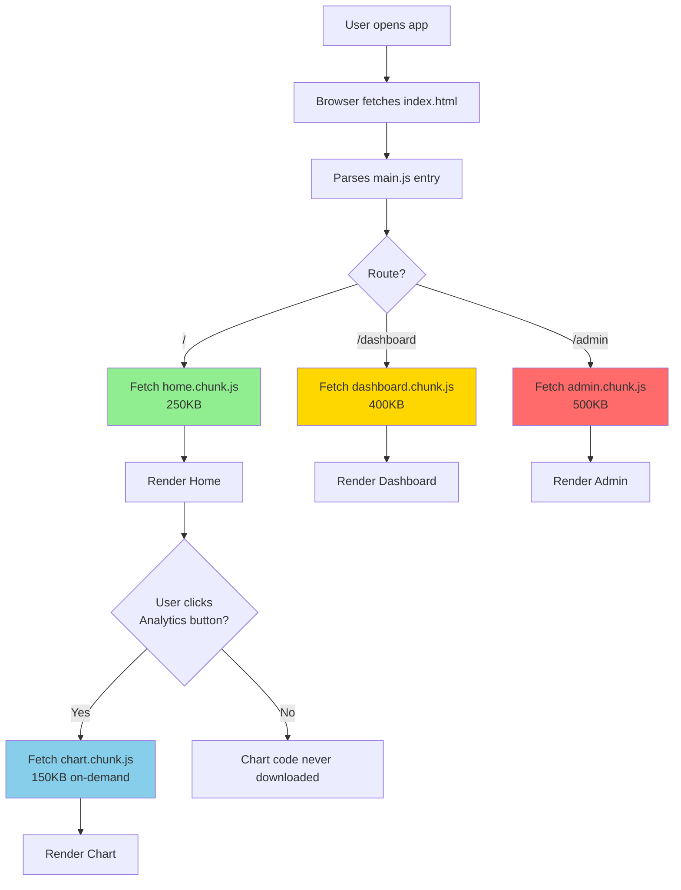
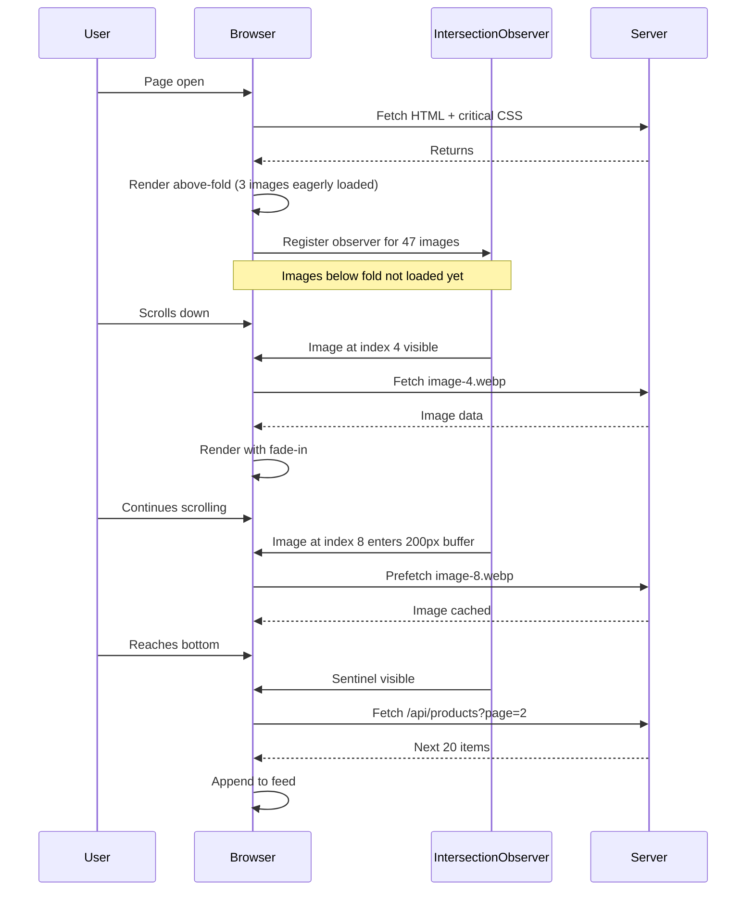
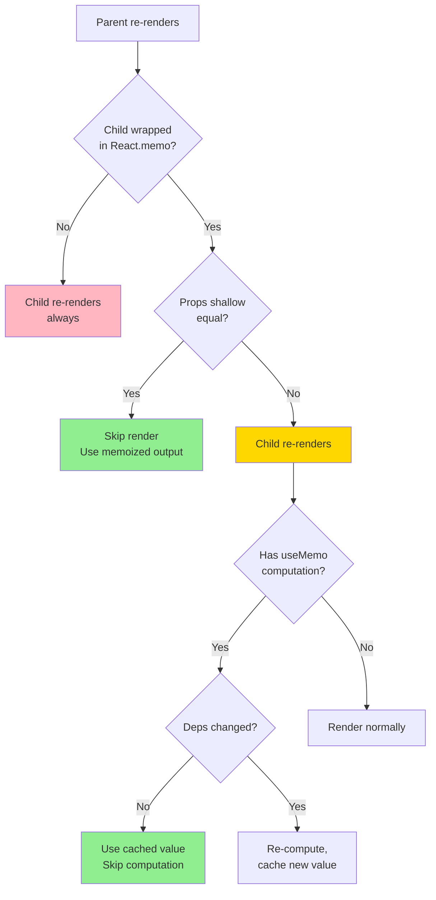
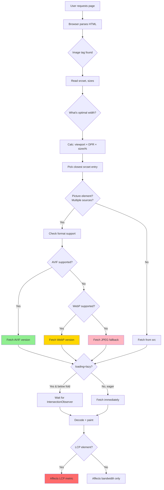

# Frontend Performance

Dekh bhai, ek baat seedhi suun le — Frontend Performance basically tumhare app ki **feel** decide karta hai. Code working hai, features sab ban gaye, par jab user ne button click kiya aur 4 second laga response ko render hone me — bhai woh user UN-install kar dega, review me 1-star degaa, aur kabhi wapas nahi aayega. Performance is not a "nice to have" — yeh literally tumhari conversion rate, retention, aur revenue se directly tied hai. Amazon ne calculate kiya tha ki har 100ms ki latency unko 1% sales loss deti hai. Walmart ne dekha 1 second improvement = 2% conversion lift. Yeh numbers fancy nahi hai, yeh business reality hai.

Ab Google ne 2020 me **Core Web Vitals** introduce kiye — teen metrics jo basically "user experience ka health checkup" hain. Pehla hai **LCP (Largest Contentful Paint)** — page ka sabse bada visible element kitni jaldi paint hua, target 2.5s. Doosra hai **INP (Interaction to Next Paint)** — yeh FID ka 2024 wala upgrade hai, basically user ne click/tap kiya to next frame paint hone me kitna laga, target under 200ms. Teesra hai **CLS (Cumulative Layout Shift)** — page load hone ke baad kitna content jhatka maar ke shift hua (jaise tu button click karne wala tha aur ad load ho gaya, button neeche khisak gaya), target under 0.1. In teeno ko Google search ranking me bhi use karta hai, matlab SEO bhi affect hota hai.

Is module me hum 4 broad weapons explore karenge — **Code Splitting** (bundle ko tukdo me todo, sirf zarurat ka load karo), **Lazy Loading** (jab dikhe tab load karo, pehle se nahi), **Memoization** (compute ek baar, reuse kar lo), aur **Image Optimization** (images sabse bada bottleneck hain web pe, yeh handle karna life-changing hai). Har technique ko hum production-grade level pe samjhenge — kab use karna hai, kab NOT use karna hai (premature optimization is the root of all evil — Knuth bola tha), aur Core Web Vitals pe iska kya impact hai. Chal shuru karte hain.

---

## 1. Code Splitting

### 1.1 Route-based, component-based — webpack/vite chunks

#### Definition

Code splitting ka matlab hai tumhare poore JavaScript bundle ko chhote-chhote chunks me todna, taaki user ko sirf wahi code initially download karna pade jo woh use kar raha hai. Imagine kar — tumhari app me 50 pages hain, total bundle 5MB ka hai. Agar user sirf homepage dekhne aaya, toh 5MB download karwana criminal hai. Code splitting ke baad homepage shayad 200KB me load ho jayega, baaki 4.8MB tab load hoga jab user un pages pe navigate karega.

Technically, **Webpack/Vite/Rollup jaise bundlers** dynamic `import()` statement ko dekh ke automatically bundle ko split karte hain. Har dynamic import ek alag chunk file generate karta hai (jaise `chunk-abc123.js`). Browser in chunks ko on-demand fetch karta hai. Two main strategies hain:

1. **Route-based splitting** — Har route ek alag chunk. `/home`, `/dashboard`, `/settings` — sab apne-apne bundle.
2. **Component-based splitting** — Heavy components (jaise modal, chart library, video player) ko alag chunk me daal do, jab user actually trigger kare tabhi load ho.

#### Why? (Iska Mathlab Kya Faayda?)

Bhai problem yeh hai ki **JavaScript parse aur execute karna mehnga hota hai** — especially low-end Android phones pe (Jio Phone, budget Samsung). 1MB JavaScript ko parse karne me ek mid-range Android ko 1-2 second lag jaate hain. Yeh seedha tumhare **LCP aur INP** ko maarta hai.

Concrete benefits:

- **Faster Initial Load** → Initial bundle chhota = LCP improve hota hai (target < 2.5s)
- **Better Caching** → Vendor chunk (React, lodash etc.) alag rakho, woh kabhi nahi badlta. Sirf app code badalta hai. User ko sab kuch dobara download nahi karna padta.
- **Parallel Fetching** → HTTP/2 multiple chunks parallel me fetch kar sakta hai
- **Reduced TBT (Total Blocking Time)** → Main thread free rehta hai, INP improve hota hai
- **Pay for what you use** → Admin dashboard ka code aam user ko kyun download karwaye?

Catch yeh hai ki **over-splitting** bhi galat hai — har chote component ko split karoge to network requests badh jayenge, waterfall ban jayega, aur actually slower ho jayega. Sweet spot dhundhna padta hai.

#### How? (Code with Hinglish comments)

**Example 1: Route-based splitting in React + Vite**

```jsx
// app/router.jsx
// React Router v6+ ke saath route-based code splitting
import { createBrowserRouter, RouterProvider } from 'react-router-dom';
import { lazy, Suspense } from 'react';

// Yeh dekho — lazy() ke andar dynamic import() use kar rahe hain
// Vite/Webpack isko dekh ke automatically alag chunk bana dega
const Home = lazy(() => import('./pages/Home'));
const Dashboard = lazy(() => import('./pages/Dashboard'));
const Settings = lazy(() => import('./pages/Settings'));
const AdminPanel = lazy(() => import('./pages/AdminPanel')); // bhari hai, sirf admin ko load hona chahiye

// Router config — har route apna chunk get karega
const router = createBrowserRouter([
  {
    path: '/',
    // Suspense fallback — jab tak chunk download nahi hua, loader dikhao
    element: (
      <Suspense fallback={<div className="spinner">Loading...</div>}>
        <Home />
      </Suspense>
    ),
  },
  {
    path: '/dashboard',
    element: (
      <Suspense fallback={<DashboardSkeleton />}>
        <Dashboard />
      </Suspense>
    ),
  },
  {
    path: '/settings',
    element: (
      <Suspense fallback={<div>Loading settings...</div>}>
        <Settings />
      </Suspense>
    ),
  },
  {
    path: '/admin',
    // Admin panel sirf admins use karte hain — split karna 100% justified
    element: (
      <Suspense fallback={<AdminSkeleton />}>
        <AdminPanel />
      </Suspense>
    ),
  },
]);

export default function App() {
  return <RouterProvider router={router} />;
}
```

**Example 2: Component-based splitting (Heavy modal/chart)**

```jsx
// components/Analytics.jsx
import { lazy, Suspense, useState } from 'react';

// Chart library bahut bhari hoti hai (recharts ~150KB, chart.js ~80KB)
// Isko sirf tab load karo jab user "View Analytics" click kare
const HeavyChart = lazy(() =>
  // Magic comment — Webpack ko hint dete hain chunk ka naam
  import(/* webpackChunkName: "heavy-chart" */ './HeavyChart')
);

// Modal bhi lazy load — kyunki modal initially dikhta nahi hai
const ExportModal = lazy(() => import('./ExportModal'));

export default function Analytics() {
  const [showChart, setShowChart] = useState(false);
  const [showExportModal, setShowExportModal] = useState(false);

  return (
    <div>
      <h1>Analytics Dashboard</h1>

      {/* Button click hone tak chart ka code download bhi nahi hua */}
      <button onClick={() => setShowChart(true)}>
        View Analytics Chart
      </button>

      <button onClick={() => setShowExportModal(true)}>
        Export Data
      </button>

      {/* Conditional rendering — true hone pe chunk fetch hoga */}
      {showChart && (
        <Suspense fallback={<ChartSkeleton />}>
          <HeavyChart />
        </Suspense>
      )}

      {showExportModal && (
        <Suspense fallback={null}>
          <ExportModal onClose={() => setShowExportModal(false)} />
        </Suspense>
      )}
    </div>
  );
}
```

**Example 3: Vite config for manual chunking**

```js
// vite.config.js
import { defineConfig } from 'vite';
import react from '@vitejs/plugin-react';

export default defineConfig({
  plugins: [react()],
  build: {
    rollupOptions: {
      output: {
        // Manual chunks — vendor libraries ko alag rakho
        // Iska faida: jab tum apna code update karte ho, vendor chunk cached rehta hai
        manualChunks: {
          // React aur React DOM ek vendor chunk me
          'react-vendor': ['react', 'react-dom', 'react-router-dom'],
          // UI library alag chunk
          'ui-vendor': ['@mui/material', '@emotion/react'],
          // Utility libraries alag
          'utils-vendor': ['lodash-es', 'date-fns', 'axios'],
        },
      },
    },
    // Chunk size warning threshold — 500KB se bada chunk ho to warn karo
    chunkSizeWarningLimit: 500,
  },
});
```

**Example 4: Webpack config (legacy projects me dikhta hai)**

```js
// webpack.config.js
module.exports = {
  // ... other config
  optimization: {
    splitChunks: {
      chunks: 'all', // Sync + async dono chunks ko split karo
      cacheGroups: {
        // node_modules ko vendor chunk me daalo
        vendor: {
          test: /[\\/]node_modules[\\/]/,
          name: 'vendors',
          priority: 10,
          reuseExistingChunk: true,
        },
        // Common code (jo multiple jagah use ho raha hai) ko common chunk me
        common: {
          minChunks: 2, // 2+ jagah use ho to common me daalo
          name: 'common',
          priority: 5,
          reuseExistingChunk: true,
        },
      },
    },
    // Runtime ko alag chunk — chhota hota hai, inline bhi kar sakte ho
    runtimeChunk: 'single',
  },
};
```

**Example 5: Preloading critical chunks**

```jsx
// Smart preloading — user ke hover karte hi next route ka chunk fetch kar lo
import { lazy } from 'react';

const Dashboard = lazy(() => import('./Dashboard'));

function NavLink() {
  // Hover pe preload — jab user click karega tab tak chunk ready
  const handleMouseEnter = () => {
    // Yeh import statement same module ko refer karta hai
    // Browser ise prefetch kar lega
    import('./Dashboard');
  };

  return (
    <a href="/dashboard" onMouseEnter={handleMouseEnter}>
      Go to Dashboard
    </a>
  );
}
```

#### Real-life Example

Socho tu **Flipkart** ki tarah ek e-commerce site bana raha hai. Pages hain:
- Home page (product grid)
- Product Detail Page (PDP)
- Cart
- Checkout (with payment gateway integration)
- Seller Dashboard (sirf sellers use karte hain)
- Admin Panel (sirf internal team)

Without code splitting tumhara bundle 3MB ka ho jayega. Ek normal user jo bas browse karne aaya hai — usko payment gateway ka SDK (Razorpay/Stripe ~200KB), seller dashboard ka code (~500KB), admin charts library (~300KB) — sab download karna padega. **Yeh insane hai.**

With route-based splitting:
- Home page chunk: 250KB (product grid + filters)
- PDP chunk: 180KB (image gallery + reviews)
- Checkout chunk: 350KB (forms + Razorpay SDK) — sirf checkout pe load hoga
- Seller dashboard: 500KB chunk — kabhi load hi nahi hoga aam user ke liye
- Admin panel: 300KB — same

Result: Initial load 250KB + vendor 180KB = ~430KB. **LCP 4.2s se 1.8s ho gaya**. Mobile users ki bounce rate 30% gir gayi.

Real-world case: **Tinder** ne 2017 me apna PWA banaya, code splitting aggressively use kiya — initial JS payload 90% kam hua, session length 25% badh gayi. **Twitter Lite** ne similar approach se 65% bandwidth save kiya.

#### Diagram



#### Interview Q&A

**Q: Code splitting kaise actually kaam karta hai under the hood? Webpack/Vite kya magic karte hain?**

Bhai jab tu `import('./Module')` likhta hai (note: dynamic import, static nahi), to bundler isko ek "split point" treat karta hai. Webpack/Vite is module aur uske dependencies ko ek alag file me daal dete hain — jaise `chunk-abc123.js`. Original code me yeh dynamic import ek **Promise return karne wala function** ban jaata hai, jo internally `<script>` tag inject karta hai (ya `import()` directly, modern browsers me). Browser script load karta hai, parse karta hai, evaluate karta hai, aur Promise resolve hota hai jisme module ka exports milta hai.

Webpack manifest file maintain karta hai jo bataati hai kaunsa chunk kaunsi file me hai. Hash-based file naming (`chunk-abc123.js`) cache busting ke liye hota hai — content badle to hash badle, naya file URL, browser fresh fetch karega. Vite production me Rollup use karta hai aur dev me native ESM use karta hai jo aur efficient hota hai. Tree-shaking bhi yahan kick in hota hai — unused exports remove ho jaate hain.

**Q: Code splitting ka downside kya hai? Kab NOT use karna chahiye?**

Sabse bada downside hai **request waterfall** — agar tu har chote component ko split kar dega, browser ko 50 alag chunks fetch karne padenge, har request ka network overhead (DNS, TCP, TLS handshake — even with HTTP/2). Yeh actually slower ho sakta hai. Rule of thumb: chunks under 20KB merge karna better hai (gzip ke baad).

Doosra issue hai **loading states ka UX** — har split point pe Suspense fallback dikhta hai, agar bahut sare nested splits hain to user ko cascading spinners dikhenge ("loading… loading… loading…"). Solution: skeleton screens use karo, aur preloading karo critical paths ke liye.

NOT use karna chahiye jab: (1) component above-the-fold hai aur LCP me contribute karta hai, (2) component ka size 10-15KB se kam hai, (3) component har page pe use hota hai (overhead se faida nahi), (4) tumhara user base mostly fast network pe hai aur initial bundle already chhota hai.

**Q: Vendor chunking aur runtime chunking ka kya importance hai?**

Vendor chunking ka logic simple hai — React, lodash, axios jaise libraries **rarely change** karte hain. Tumhara application code daily change hota hai. Agar tu sab kuch ek bundle me daal de, to har deploy pe user ko 500KB ka React bhi dobara download karna padega. Vendor ko alag rakho, browser cache pe hash same rahega, sirf app code re-download hoga (maybe 50KB).

Runtime chunk Webpack ka manifest hota hai — yeh batata hai ki kaunsa module kaunsi file me hai. Agar yeh main bundle me embed ho jaaye, to har baar koi bhi chunk add/remove hone pe main bundle ka hash change hoga, even if app code waisa ka waisa hai. Runtime ko alag chunk banane se yeh problem solve hoti hai. Production me runtime chunk inline bhi kar sakte ho HTML me (bahut chhota hota hai, ~2KB), ek extra request bachti hai.

**Q: Core Web Vitals pe code splitting ka concrete impact kya hai?**

LCP pe direct impact hai — initial bundle chhota = JavaScript parse/execute fast = main thread free = LCP element jaldi paint hoga. Lekin caveat hai: agar tumhara LCP element ek lazy-loaded component hai (jaise hero banner ek lazy chunk me hai), to LCP **kharab** ho jayega kyunki extra round-trip lagega chunk fetch karne me. **Above-the-fold critical components ko NEVER lazy load karo.**

INP pe impact: chhote chunks = chhota main thread blocking time per interaction. Jab user click karta hai, agar woh interaction ek lazy-loaded handler trigger karta hai, to first time slow hoga (chunk fetch). Solution: predictive preloading — hover/focus pe chunk prefetch kar lo. CLS pe direct impact nahi hota code splitting ka, lekin indirectly — Suspense fallbacks ko same dimension ka rakho jaisa final component hoga, warna layout shift hoga.

---

## 2. Lazy Loading

### 2.1 Images (loading="lazy", IntersectionObserver), components (React.lazy), data

#### Definition

Lazy loading ek **performance pattern** hai jisme tum resources ko **tab load karte ho jab unki actual zaroorat ho** — pehle nahi. Yeh "JIT (Just-In-Time)" approach hai, "AOT (Ahead-Of-Time)" ke opposite. Code splitting bhi technically lazy loading ka ek form hai (lazy loading of code), par yahan hum broader concept dekhenge:

1. **Image Lazy Loading** — Images sirf tab load ho jab woh viewport me dikhne wali ho. Native HTML attribute `loading="lazy"` ya `IntersectionObserver` API use karke.
2. **Component Lazy Loading** — React.lazy + Suspense, Vue's defineAsyncComponent — components on-demand mount karna.
3. **Data Lazy Loading** — Pagination, infinite scroll, virtualization — data ko chunks me fetch karna instead of poora dataset ek baar me.

Concept ka core hai: **don't pay the cost until you need to.** Bandwidth, memory, CPU — sab finite hain, especially mobile pe. Lazy loading inhe respect karta hai.

#### Why? (Iska Mathlab Kya Faayda?)

Aaj ek average webpage **2.2MB** ka hai (HTTP Archive 2024). Iska 60% **images** hote hain. Agar tumhare page pe 50 images hain aur user sirf top 3 dekh ke chala gaya — to baaki 47 images ka data **bilkul waste** gaya. Mobile user ka data plan, battery, CPU — sab burn hua bina kisi reason ke.

Concrete benefits:

- **LCP Improvement** → Above-the-fold critical resources ko priority milti hai, baaki defer
- **Bandwidth Saving** → User ko utna hi data download karna padta hai jitna woh actually consume kare
- **Memory Reduction** → DOM me kam image elements = kam memory = kam jank
- **Faster TTI (Time to Interactive)** → Main thread jaldi free hota hai
- **Battery Friendly** → Mobile pe images decode karna CPU intensive hai
- **Lower Bounce Rate** → Tezi se page interactive ho to user ruke

INP pe direct impact: agar tumne 100 images aur 20 heavy components ek saath mount kar diye, browser ka main thread block ho jayega, click responses 500ms+ ho jayenge. Lazy loading se yeh problem solve hoti hai.

#### How? (Code with Hinglish comments)

**Example 1: Native image lazy loading (modern, recommended)**

```html
<!-- Sabse simple way — bas attribute add kar do, browser khud handle karega -->
<!-- Chrome 76+, Firefox 75+, Safari 15.4+ supported -->


<!-- Above the fold image — eager + high priority. LCP candidate hai. -->


<!-- Below fold — lazy load. width/height MUST do warna CLS aayega. -->

<!-- Browser intelligently fetch karega jab image viewport ke ~250px paas aayegi -->
```

**Example 2: IntersectionObserver based lazy loading (custom control)**

```jsx
// hooks/useLazyImage.js
// Custom hook — jab tujhe more control chahiye (placeholder, fade-in, error handling)
import { useEffect, useRef, useState } from 'react';

export function useLazyImage(src, options = {}) {
  const imgRef = useRef(null);
  const [isLoaded, setIsLoaded] = useState(false);
  const [isInView, setIsInView] = useState(false);

  useEffect(() => {
    const img = imgRef.current;
    if (!img) return;

    // IntersectionObserver banao — viewport intersect detect karega
    const observer = new IntersectionObserver(
      (entries) => {
        entries.forEach((entry) => {
          if (entry.isIntersecting) {
            // Image viewport me aa gayi — ab load karo
            setIsInView(true);
            // Observer disconnect karo, kaam ho gaya
            observer.unobserve(entry.target);
          }
        });
      },
      {
        // rootMargin — image viewport ke 200px pehle se load karo
        // Smooth scroll experience ke liye
        rootMargin: options.rootMargin || '200px',
        threshold: options.threshold || 0,
      }
    );

    observer.observe(img);

    // Cleanup — component unmount pe observer detach
    return () => observer.disconnect();
  }, [options.rootMargin, options.threshold]);

  return { imgRef, isInView, isLoaded, setIsLoaded };
}

// Usage component
export function LazyImage({ src, alt, placeholder, className }) {
  const { imgRef, isInView, isLoaded, setIsLoaded } = useLazyImage(src);

  return (
    <div className={`lazy-image-wrapper ${className}`}>
      {/* Placeholder — blur/skeleton — pehle se dikhta hai */}
      {!isLoaded && (
        <div
          className="placeholder"
          style={{ backgroundImage: `url(${placeholder})` }}
        />
      )}

       setIsLoaded(true)}
        style={{
          opacity: isLoaded ? 1 : 0,
          transition: 'opacity 0.3s ease-in-out',
        }}
      />
    </div>
  );
}
```

**Example 3: Component lazy loading with React.lazy**

```jsx
// app/Profile.jsx
import { lazy, Suspense, useState } from 'react';

// Heavy components ko lazy load karo
// VideoPlayer ka chunk only fetch hoga jab user video tab pe click kare
const VideoPlayer = lazy(() => import('./VideoPlayer'));
const PhotoGallery = lazy(() => import('./PhotoGallery'));
const Comments = lazy(() => import('./Comments'));

export default function Profile({ userId }) {
  const [activeTab, setActiveTab] = useState('photos');

  return (
    <div>
      <nav>
        <button onClick={() => setActiveTab('photos')}>Photos</button>
        <button onClick={() => setActiveTab('videos')}>Videos</button>
        <button onClick={() => setActiveTab('comments')}>Comments</button>
      </nav>

      <Suspense fallback={<TabSkeleton />}>
        {/* Sirf active tab ka component mount hoga, baaki ka chunk download bhi nahi */}
        {activeTab === 'photos' && <PhotoGallery userId={userId} />}
        {activeTab === 'videos' && <VideoPlayer userId={userId} />}
        {activeTab === 'comments' && <Comments userId={userId} />}
      </Suspense>
    </div>
  );
}

// Skeleton component for graceful loading
function TabSkeleton() {
  return (
    <div className="skeleton-grid">
      {/* Same dimensions as actual content — CLS prevent karne ke liye */}
      {[1, 2, 3, 4].map((i) => (
        <div key={i} className="skeleton-card" />
      ))}
    </div>
  );
}
```

**Example 4: Data lazy loading with infinite scroll**

```jsx
// hooks/useInfiniteScroll.js
import { useEffect, useState, useRef, useCallback } from 'react';

export function useInfiniteScroll(fetchFn) {
  const [items, setItems] = useState([]);
  const [page, setPage] = useState(1);
  const [loading, setLoading] = useState(false);
  const [hasMore, setHasMore] = useState(true);
  const sentinelRef = useRef(null);

  // Fetch logic — page badhne pe naye items lao
  const loadMore = useCallback(async () => {
    if (loading || !hasMore) return;

    setLoading(true);
    try {
      const newItems = await fetchFn(page);
      if (newItems.length === 0) {
        setHasMore(false);
      } else {
        setItems((prev) => [...prev, ...newItems]);
        setPage((p) => p + 1);
      }
    } catch (err) {
      console.error('Fetch failed:', err);
    } finally {
      setLoading(false);
    }
  }, [page, loading, hasMore, fetchFn]);

  // Sentinel element — jab yeh visible ho, next page fetch karo
  useEffect(() => {
    const sentinel = sentinelRef.current;
    if (!sentinel) return;

    const observer = new IntersectionObserver(
      (entries) => {
        if (entries[0].isIntersecting) {
          loadMore();
        }
      },
      { rootMargin: '100px' }
    );

    observer.observe(sentinel);
    return () => observer.disconnect();
  }, [loadMore]);

  return { items, loading, hasMore, sentinelRef };
}

// Usage in feed
function ProductFeed() {
  const fetchProducts = async (page) => {
    const res = await fetch(`/api/products?page=${page}&limit=20`);
    return res.json();
  };

  const { items, loading, hasMore, sentinelRef } = useInfiniteScroll(fetchProducts);

  return (
    <div>
      {items.map((product) => (
        <ProductCard key={product.id} product={product} />
      ))}

      {/* Sentinel — jab yeh viewport me aaye to next batch load karo */}
      <div ref={sentinelRef} style={{ height: 1 }} />

      {loading && <Spinner />}
      {!hasMore && <p>No more products</p>}
    </div>
  );
}
```

**Example 5: Route-level prefetching with hover**

```jsx
// Smart lazy loading + prefetching
const Dashboard = lazy(() => import('./Dashboard'));

function NavMenu() {
  const prefetched = useRef(false);

  // Hover pe prefetch — user ke click karne tak chunk ready
  // Yeh "predictive lazy loading" hai
  const handleHover = () => {
    if (prefetched.current) return;
    prefetched.current = true;

    // Yeh import statement same chunk reference karta hai
    // Browser ise low-priority me fetch karega
    import('./Dashboard').catch(() => {
      // Network failed — silently ignore, jab actual click hoga tab retry hoga
      prefetched.current = false;
    });
  };

  return (
    <Link to="/dashboard" onMouseEnter={handleHover} onFocus={handleHover}>
      Dashboard
    </Link>
  );
}
```

#### Real-life Example

Le **Instagram feed** ka example. Tumhare feed me 1000 posts ho sakte hain, har post me 1-10 images. Agar Instagram sab kuch ek baar me load kar de, app crash ho jayegi (memory exhausted), bandwidth khatam, battery dead.

Instagram ka actual approach (reverse-engineered):
1. **Initial load**: Sirf top 5-10 posts ka HTML aur thumbnails (~50KB each, blurred)
2. **Image lazy loading**: `IntersectionObserver` use karke jaise-jaise scroll karte ho, full-res images load hoti hain
3. **Infinite scroll**: Jab tu page ke end ke pass aata hai, next batch fetch hoti hai
4. **Component lazy loading**: Stories, Reels, DM — sab alag chunks
5. **Predictive prefetching**: Tu jis post pe rukta hai, uske aas-paas wale assets prefetch hote hain
6. **Virtualization**: 1000 DOM nodes nahi rakhte, sirf ~30 visible + buffer. React-window ya intersection-based recycling.

Result: Initial load 1.5s, smooth 60fps scroll, 200MB memory (vs 2GB without lazy).

Indian context: **JioCinema, Hotstar** during IPL. Live match ke saath highlights, stats, scorecard, related videos — sab hote hain. Without lazy loading, 4G connection pe app freeze ho jaye. Lazy loading ki wajah se hi smooth chalti hai.

#### Diagram



#### Interview Q&A

**Q: `loading="lazy"` aur IntersectionObserver me kya difference hai? Kab kaunsa use karna chahiye?**

Native `loading="lazy"` browser-level optimization hai — bina koi JavaScript likhe kaam karta hai, performant hai (browser ke C++ engine me implemented), aur progressive enhancement deta hai. Modern browsers (Chrome 76+, Safari 15.4+, Firefox 75+) sab support karte hain. Iska bada plus hai ki yeh **paint-blocking nahi hai**, browser threshold khud decide karta hai (usually viewport ke 1250-2500px paas).

IntersectionObserver tab use karo jab tujhe **fine-grained control** chahiye — custom threshold, custom rootMargin, blur-up placeholder transitions, error retry logic, analytics tracking ("kaunsi image kitne user dekhte hain"), ya jab tu non-image elements ko lazy load karna chahta hai (videos, iframes, ads, components).

Best practice: **Default native `loading="lazy"` use karo** kyunki simpler hai, baaki cases ke liye IntersectionObserver. Don't reinvent the wheel jab tak need na ho. **NEVER lazy load above-the-fold images** — yeh LCP destroy karega. Use `loading="eager"` aur `fetchpriority="high"` hero images ke liye.

**Q: React.lazy aur Suspense ke saath kya pitfalls hain production me?**

Sabse common pitfall hai **Suspense boundary placement**. Agar tum top level pe ek hi Suspense rakhte ho, to har lazy component ka loading state poore page ko cover kar dega. Granular Suspense boundaries lagao — har section ka apna fallback ho.

Doosra issue hai **error handling** — lazy import fail ho sakta hai (network glitch, deploy ke baad chunk hash mismatch). React.lazy native error UI nahi deta. Tujhe ErrorBoundary wrap karna padega aur retry mechanism implement karna padega:

```jsx
const Dashboard = lazy(() =>
  import('./Dashboard').catch((err) => {
    // Chunk load fail — page reload se hash mismatch fix ho sakta hai
    if (err.name === 'ChunkLoadError') {
      window.location.reload();
    }
    throw err;
  })
);
```

Teesra issue: **SSR support**. React.lazy SSR me React 18+ tak proper support nahi karta tha. Next.js use karta hai to `next/dynamic` use karo, jo SSR-aware hai. Chautha: **flash of loading state** — agar tumhara chunk 50ms me load ho gaya, fallback flash karega aur jankay lagega. Solution: minimum delay add karo fallback me, ya skeleton with same dimensions.

**Q: Infinite scroll vs pagination vs "Load More" button — kya use karna chahiye aur kyun?**

Yeh debate UX vs performance ka classic hai. **Infinite scroll** (Instagram, Twitter, TikTok) engagement ke liye great hai — endless dopamine loop. Lekin issues hain: footer kabhi reach nahi hota, deep linking break hota hai (URL me page number nahi), accessibility issues (keyboard users phas jaate hain), aur memory leak hota hai agar virtualization nahi kiya.

**Pagination** (Google search, Amazon products) tab better hai jab content discoverable aur navigable hona chahiye. URL me `?page=5` hota hai, share kar sakte ho, browser back button kaam karta hai, footer accessible hai. SEO bhi better hota hai.

**Load More button** (Pinterest, YouTube) hybrid hai — infinite scroll ka feel par user explicit control me hai. Footer accessible hai, performance better hai (har scroll pe trigger nahi hota), aur older devices pe smooth chalti hai.

Performance perspective se: pagination sabse simple hai. Infinite scroll virtualization ke saath karna padta hai (react-window, react-virtuoso) warna 1000+ DOM nodes pe browser laggy ho jayega. INP suffer karega.

**Q: Lazy loading Core Web Vitals ko kaise affect karta hai?**

LCP pe **negative impact** ho sakta hai agar tumne LCP element ko hi lazy load kar diya. Hero image ya hero video — yeh NEVER lazy load karo. `loading="eager"` aur `fetchpriority="high"` use karo. Below-the-fold lazy loading actually LCP ko **improve** karta hai kyunki bandwidth aur main thread free milte hain critical content ke liye.

CLS pe critical impact: lazy-loaded images ke liye `width` aur `height` attributes MANDATORY hain, ya CSS aspect-ratio. Warna jab image load hogi, surrounding content shift hoga, CLS spike hoga (target < 0.1). Skeleton placeholders use karo jo same dimensions occupy karen.

INP pe positive impact: kam DOM nodes = kam reconciliation time = faster interaction response. Lekin jab user lazy component trigger karta hai (button click → modal load), first interaction slow ho sakta hai. Solution: predictive prefetching on hover/focus.

---

## 3. Memoization

### 3.1 React.memo, useMemo, useCallback — actual benefit (and when premature)

#### Definition

Memoization ek **classic CS optimization** hai — function ka output cache karo input ke against, taaki same input pe dobara expensive compute na karna pade. Mathematical functions me yeh "pure function caching" hai.

React me 3 main APIs hain memoization ke liye:

1. **`React.memo(Component)`** — Higher-order component jo functional component ko wrap karta hai. Props change na ho to re-render skip kar deta hai.
2. **`useMemo(fn, deps)`** — Hook jo expensive computation ka result cache karta hai. Deps change na ho to wahi cached value return karta hai.
3. **`useCallback(fn, deps)`** — Hook jo function reference stable rakhta hai across renders. Basically `useMemo(() => fn, deps)` ka shortcut hai.

Core idea: **Reference equality matters in React.** Jab parent re-render hota hai, har object/array/function naya banta hai (new reference). Yeh children me prop comparison fail karta hai, unnecessary re-renders cause karta hai.

**IMPORTANT**: Yeh sab tools hain, weapons nahi. **Premature optimization** memoization me sabse common mistake hai. Useless memoization actually code slower banata hai (overhead of comparison + memory allocation).

#### Why? (Iska Mathlab Kya Faayda?)

React ka default behavior hai: state/props change → component re-render → poora subtree re-render. Most cases me yeh fast hai (React's diffing is optimized). Lekin kabhi-kabhi:

- Component me **expensive computation** hai (jaise 10,000 items pe filter+sort)
- Component **bahut bada hai** (1000+ DOM nodes wala table)
- Component bahut **frequently re-render** hota hai (parent har second update ho raha hai)
- **Reference props** child memoization break kar rahe hain

In cases me memoization concrete benefit deta hai:

- **Fewer re-renders** → CPU saved, INP improves
- **Cached computations** → Expensive math/filter results stored
- **Stable references** → Child components ki memoization actually kaam karti hai
- **Better UX** → 60fps animations, smooth scroll

But (and this is huge): React 19 me **React Compiler** automatic memoization karega, manual memoization slowly obsolete ho rahi hai. Aaj ke React 18 me bhi, ज्यादातर apps me memoization unnecessarily lagi hoti hai.

#### How? (Code with Hinglish comments)

**Example 1: React.memo basic usage**

```jsx
// components/ExpensiveList.jsx
import React, { memo } from 'react';

// Yeh component bahut bada hai — 1000 items render karta hai
// Parent har baar re-render ho to yeh bhi re-render hoga, even if items same hain
function ExpensiveList({ items, onItemClick }) {
  console.log('ExpensiveList rendered'); // Debug — kitni baar render hua

  return (
    <ul>
      {items.map((item) => (
        <li key={item.id} onClick={() => onItemClick(item.id)}>
          {item.name} - ₹{item.price}
        </li>
      ))}
    </ul>
  );
}

// React.memo wrap — props shallow equal hain to skip re-render
// Default comparison: Object.is for each prop
export default memo(ExpensiveList);

// Custom comparison function — jab default kaam na kare
export const DeepEqualList = memo(
  ExpensiveList,
  (prevProps, nextProps) => {
    // True return karoge to skip render, false to render
    // Yahan deep comparison kar rahe hain — careful, expensive ho sakta hai
    return (
      prevProps.items.length === nextProps.items.length &&
      prevProps.items.every(
        (item, i) =>
          item.id === nextProps.items[i].id &&
          item.price === nextProps.items[i].price
      ) &&
      prevProps.onItemClick === nextProps.onItemClick
    );
  }
);
```

**Example 2: useMemo for expensive computation**

```jsx
// pages/Analytics.jsx
import { useState, useMemo } from 'react';

function Analytics({ transactions }) {
  const [filter, setFilter] = useState('all');
  const [searchTerm, setSearchTerm] = useState('');

  // Expensive computation — 10,000 transactions ko filter + sort + aggregate
  // Without useMemo: har keystroke pe yeh re-compute hoga (search box me typing slow ho jayegi)
  const stats = useMemo(() => {
    console.log('Computing stats...'); // Debug

    // Step 1: Filter
    const filtered = transactions.filter((t) => {
      if (filter !== 'all' && t.category !== filter) return false;
      if (searchTerm && !t.description.toLowerCase().includes(searchTerm.toLowerCase())) {
        return false;
      }
      return true;
    });

    // Step 2: Aggregate — total, average, by category
    const total = filtered.reduce((sum, t) => sum + t.amount, 0);
    const average = filtered.length ? total / filtered.length : 0;

    const byCategory = filtered.reduce((acc, t) => {
      acc[t.category] = (acc[t.category] || 0) + t.amount;
      return acc;
    }, {});

    // Step 3: Sort
    const sorted = [...filtered].sort((a, b) => b.amount - a.amount);

    return { total, average, byCategory, sorted };
    // Deps array — sirf in values change hone pe re-compute karo
  }, [transactions, filter, searchTerm]);

  return (
    <div>
      <input
        value={searchTerm}
        onChange={(e) => setSearchTerm(e.target.value)}
        placeholder="Search transactions..."
      />
      <select value={filter} onChange={(e) => setFilter(e.target.value)}>
        <option value="all">All</option>
        <option value="food">Food</option>
        <option value="travel">Travel</option>
      </select>

      <h2>Total: ₹{stats.total}</h2>
      <h3>Average: ₹{stats.average.toFixed(2)}</h3>

      {/* Top 10 transactions */}
      {stats.sorted.slice(0, 10).map((t) => (
        <div key={t.id}>{t.description}: ₹{t.amount}</div>
      ))}
    </div>
  );
}
```

**Example 3: useCallback for stable function references**

```jsx
// pages/TodoApp.jsx
import { useState, useCallback, memo } from 'react';

// Memoized child — props shallow equal to skip
const TodoItem = memo(function TodoItem({ todo, onToggle, onDelete }) {
  console.log('TodoItem rendered:', todo.id);
  return (
    <li>
      <input
        type="checkbox"
        checked={todo.done}
        onChange={() => onToggle(todo.id)}
      />
      {todo.text}
      <button onClick={() => onDelete(todo.id)}>Delete</button>
    </li>
  );
});

function TodoApp() {
  const [todos, setTodos] = useState([]);
  const [input, setInput] = useState('');

  // BAD: Without useCallback — har render pe new function reference
  // Memoized TodoItem fail karega memoization, har item re-render hoga
  // const handleToggle = (id) => setTodos(...);

  // GOOD: useCallback — function reference stable
  // useState ka setter inherently stable hai (deps me daalne ki zaroorat nahi)
  const handleToggle = useCallback((id) => {
    setTodos((prev) =>
      prev.map((t) => (t.id === id ? { ...t, done: !t.done } : t))
    );
  }, []); // Empty deps — setter stable hai, kuch external use nahi kar rahe

  const handleDelete = useCallback((id) => {
    setTodos((prev) => prev.filter((t) => t.id !== id));
  }, []);

  const handleAdd = useCallback(() => {
    if (!input.trim()) return;
    setTodos((prev) => [
      ...prev,
      { id: Date.now(), text: input, done: false },
    ]);
    setInput('');
  }, [input]); // input change pe new function — but yeh callback prop nahi hai child ka

  return (
    <div>
      <input value={input} onChange={(e) => setInput(e.target.value)} />
      <button onClick={handleAdd}>Add</button>

      <ul>
        {todos.map((todo) => (
          <TodoItem
            key={todo.id}
            todo={todo}
            onToggle={handleToggle} // Stable reference — TodoItem memo kaam karega
            onDelete={handleDelete}
          />
        ))}
      </ul>
    </div>
  );
}
```

**Example 4: When NOT to memoize (premature optimization)**

```jsx
// BAD CODE — useless memoization
function UserCard({ user }) {
  // Yeh useMemo bilkul useless hai
  // String concatenation O(1) hai, useMemo ka overhead zyada hai
  const fullName = useMemo(
    () => `${user.firstName} ${user.lastName}`,
    [user.firstName, user.lastName]
  );

  // Useless useCallback — yeh function child ko prop me jaa nahi raha
  const handleClick = useCallback(() => {
    console.log('clicked');
  }, []);

  // Useless React.memo wrapping — yeh component anyway sirf parent change pe render hoga
  return <div onClick={handleClick}>{fullName}</div>;
}

// GOOD CODE — sirf zaroorat ho to memoize
function UserCard({ user }) {
  const fullName = `${user.firstName} ${user.lastName}`;
  const handleClick = () => console.log('clicked');
  return <div onClick={handleClick}>{fullName}</div>;
}

// Memoize ONLY in these cases:
// 1. Component bahut frequently re-render hota hai (parent har 100ms update)
// 2. Computation actually expensive hai (>1ms, profiler se measured)
// 3. Component bahut bada hai (hundreds of DOM nodes)
// 4. Reference equality matters for downstream memoized children
```

**Example 5: Custom hook with proper memoization**

```jsx
// hooks/useFilteredData.js
import { useMemo } from 'react';

// Custom hook jo expensive filtering encapsulate karta hai
export function useFilteredData(data, filters) {
  // Memoize filter function
  const filtered = useMemo(() => {
    if (!data) return [];

    return data.filter((item) => {
      // Multiple filter conditions
      if (filters.category && item.category !== filters.category) return false;
      if (filters.minPrice && item.price < filters.minPrice) return false;
      if (filters.maxPrice && item.price > filters.maxPrice) return false;
      if (filters.searchTerm) {
        const term = filters.searchTerm.toLowerCase();
        if (!item.name.toLowerCase().includes(term)) return false;
      }
      return true;
    });
  }, [data, filters.category, filters.minPrice, filters.maxPrice, filters.searchTerm]);
  // Note: filters.searchTerm wagairah individually depend kar rahe hain
  // Agar 'filters' object directly pass karte deps me, har render pe naya reference hoga

  // Aggregate stats memoize
  const stats = useMemo(() => {
    const total = filtered.reduce((sum, i) => sum + i.price, 0);
    const avg = filtered.length ? total / filtered.length : 0;
    return { total, avg, count: filtered.length };
  }, [filtered]);

  return { filtered, stats };
}
```

#### Real-life Example

**Case Study: Zomato Restaurant List Page**

Page pe 500 restaurants hain, har card complex hai (image, ratings, cuisine tags, delivery time, offers, fav button). User type karta hai search box me — "biryani". Without memoization:

- Har keystroke pe parent state update
- Parent ka filter logic re-execute hota hai
- 500 RestaurantCard re-render hote hain
- Each card 5-10ms render time
- Total: 2500-5000ms blocking
- Search input feels frozen, INP > 1000ms (terrible)

With memoization:
- `useMemo` for filtered list (sirf jab `searchTerm` change ho)
- `React.memo` for RestaurantCard (sirf jab uska restaurant prop change ho)
- `useCallback` for `onFavorite`, `onAddToCart` handlers (stable refs)
- Result: Sirf matching cards re-render, INP < 100ms, smooth typing

**But here's the twist** — agar Zomato 50 restaurants render karta (not 500), memoization ki zaroorat hi nahi padti. React virtual DOM diffing 50 cards ke liye 5ms me ho jaata. Memoization ne actually overhead add kiya hota.

**Lesson**: Memoize when measured slow, not preemptively.

**React Compiler era**: React 19 ka React Compiler automatically memoize karega — manual `useMemo`/`useCallback` slowly obsolete hote jayenge. Already Meta apne production apps me use kar raha hai. Future me yeh boilerplate khatam ho jayega.

#### Diagram



#### Interview Q&A

**Q: React.memo, useMemo, useCallback — teeno ka difference exact me kya hai?**

`React.memo` ek **HOC (Higher Order Component)** hai jo functional component ko wrap karta hai. Yeh component ke level pe optimization karta hai — props change na ho to render skip karta hai. Internal me shallow comparison karta hai (`Object.is` har prop pe). Use case: child component jo bade subtree render karta hai aur parent unnecessarily re-render ho raha hai.

`useMemo` ek **hook** hai jo **value memoize** karta hai. Expensive computation ka result cache karta hai based on dependency array. Use case: filtering 10,000 items, complex calculations, derived data. `useMemo(() => expensiveFn(), [deps])` ka matlab hai "yeh value compute karo, deps na badle to cached return karo."

`useCallback` ek **hook** hai jo **function reference memoize** karta hai. Basically `useMemo(() => fn, deps)` ka syntactic sugar. Functions to har render pe new banti hain naturally — useCallback unhe stable reference deta hai. Use case: function ko prop me memoized child ko bhej rahe ho, ya effect dependency me hai.

Key insight: **Inka asli faida tabhi milta hai jab combined use karo**. `useCallback` akela bekar hai agar child `React.memo` nahi hai. `React.memo` akela kaam nahi karega agar tum naye objects/arrays/functions inline pass kar rahe ho. Triangle hai — sab kuch saath kaam karta hai.

**Q: "Premature memoization" se kya nuksaan hota hai? Cost-benefit analysis kaise karoge?**

Premature memoization ke specific costs hain:
1. **Memory overhead** — har memoized value/function ka cache memory me rakhna padta hai
2. **Comparison overhead** — har render pe deps array compare karna padta hai (shallow equality)
3. **Code complexity** — readability suffer karti hai, deps array maintain karna pain
4. **Bug surface** — stale closures, missing deps from linter, cache invalidation issues
5. **Compiler limitations** — React Compiler optimize nahi kar paata jab manual memoization already ho

Real measurement: Meta ke engineers ne benchmark kiya — average React app me 80-90% memoization useless hai. Profiler use karke verify karo.

**Decision framework**:
- Component re-renders > 16ms le raha hai? Profiler check karo.
- Yes? Causes identify karo — expensive computation? Heavy subtree?
- Computation expensive hai (> 1ms)? `useMemo` lagao.
- Subtree bada hai aur prop change rare hai? `React.memo` lagao.
- Memoized child me callback prop hai? `useCallback` lagao.
- Otherwise: **don't memoize**.

**Q: useMemo aur useCallback ki dependency array galat ho jaaye to kya hota hai?**

Dependency array memoization ka heart hai — galat hua to bugs guarantee hain. Two types of mistakes:

**Missing dependency** (most common): Tum kisi variable ko useMemo/useCallback ke andar use karte ho par deps me nahi daalte. React useless cached value use karega — **stale closure bug**. Function purane state ko reference karega, latest nahi. ESLint plugin (`react-hooks/exhaustive-deps`) yeh detect karta hai, **NEVER disable karo**.

```jsx
// BUG — userId deps me nahi
const fetchUser = useCallback(() => {
  fetch(`/api/users/${userId}`); // userId stale hoga
}, []); // Should be [userId]
```

**Unstable dependency**: Tum object/array/function ko deps me daal dete ho jo har render pe naya banta hai. Memoization useless ho jaata hai — har render pe re-compute hoga.

```jsx
// BUG — { type: 'admin' } har render pe naya object
const filtered = useMemo(() => filter(users, { type: 'admin' }), [users, { type: 'admin' }]);

// FIX — primitive deps ya stable reference
const filterConfig = useMemo(() => ({ type: 'admin' }), []);
const filtered = useMemo(() => filter(users, filterConfig), [users, filterConfig]);
```

Solution: ESLint plugin enable karo, primitive deps prefer karo, stable references banao with useMemo, ya state machine pattern use karo (useReducer for related state).

**Q: React 19 ka React Compiler aane ke baad memoization ka future kya hai?**

React Compiler (formerly React Forget) ek **build-time tool** hai jo automatically memoize karta hai. Yeh tumhare components ko analyze karta hai aur compile time pe `useMemo`/`useCallback`/`React.memo` equivalents inject kar deta hai — bina manual annotation ke. Babel/SWC plugin ki tarah kaam karta hai.

Iska impact: **manual memoization ki need 90% khatam ho jayegi**. Tum simple, idiomatic code likh sakte ho — compiler optimize karega. Meta apne production me already use kar raha hai (Instagram, Threads), 60%+ components automatically optimized ho gaye.

Lekin compiler:
- Pure functions assume karta hai — side effects galat jagah hain to optimize nahi karega
- Rules of React strictly follow karne padenge
- Some patterns (mutation, complex closures) optimize nahi honge

**Strategy 2026 me**:
- New code: don't manually memoize, compiler handle karega
- Existing code: gradually adopt compiler, manual memoization remove karte jao
- Performance critical sections: profile karke verify karo

CWV impact: compiler INP improve karega significantly bina developer effort ke. Yeh democratization hai performance ka.

---

## 4. Image Optimization

### 4.1 srcset, picture, AVIF/WebP, responsive images, CDN, blur placeholder

#### Definition

Image optimization basically **right image, right size, right format, right time** dene ki kala hai. Web pe images **60% bandwidth** consume karte hain (HTTP Archive 2024). Ek unoptimized image (4MB JPEG) tumhari poori page performance maar sakta hai. Optimization me multiple techniques hain:

1. **Format Selection**: AVIF (best, 50% smaller than JPEG), WebP (95% browser support, 30% smaller), JPEG (universal fallback), PNG (transparency only)
2. **Responsive Images**: `srcset` aur `sizes` attribute — browser device ke hisaab se best image fetch kare
3. **Art Direction**: `<picture>` element — different images for different viewports/conditions
4. **CDN Delivery**: Cloudinary, imgix, Vercel Image, Next/Image — automatic optimization at edge
5. **Lazy Loading**: Already covered, but image-specific aspects
6. **Placeholders**: Blur (LQIP - Low Quality Image Placeholder), color, skeleton — perceived performance
7. **Compression**: Quality vs size trade-off — usually 70-80% quality is sweet spot

Goal: **Fast LCP, low CLS, low bandwidth, good visual quality**.

#### Why? (Iska Mathlab Kya Faayda?)

Statistics speak:
- Average mobile page weight: 2.2MB, of which 1.3MB is images
- LCP element 70% of the time is an image (per HTTP Archive)
- 4G median speed in India: ~13 Mbps. 4MB image = 2.5 seconds to load
- Tier 2/3 cities pe 3G common hai — same image takes 30 seconds

Concrete benefits of optimization:
- **LCP improvement**: Hero image 2MB se 200KB ho jaye — LCP 5s se 1.5s
- **Bandwidth savings**: Crores of users pe yeh massive cost saving (CDN bills, data plans)
- **Better SEO**: Google ranks fast pages higher, especially mobile
- **CLS prevention**: Width/height aur aspect-ratio se layout shifts zero
- **Battery savings**: Image decode CPU intensive hai, optimized images = less work
- **Better UX in slow networks**: Tier 2/3 cities, Jio Phones, rural areas

Real impact: **Pinterest** ne progressive image loading + WebP migrate karke load time 40% ghata diya, sign-ups 15% badh gaye. **Walmart** ne ek-ek MB optimize karke billions ka revenue impact dekha.

#### How? (Code with Hinglish comments)

**Example 1: Responsive images with srcset**

```html
<!-- Browser ko multiple sizes do, woh device ke hisaab se best chunega -->
<!-- DPR (device pixel ratio) aur viewport size dono consider karega -->


<!--
  Yeh kaise kaam karta hai:
  - srcset: list of available image sizes (file path + actual width)
  - sizes: tells browser ki different viewports pe image kitni width occupy karegi
  - Browser calculates: viewport size × DPR × sizes = required width
  - Phir srcset me se sabse closest match select karta hai
  - 1080p phone (375px viewport, 3x DPR) ke liye:
    sizes says 100vw = 375px, × 3 DPR = 1125px → 1200w image select hoga
  - Desktop (1920px, 1x DPR):
    sizes says 1200px, × 1 = 1200px → 1200w image select hoga
  - 4K display (1920px, 2x DPR):
    sizes says 1200px, × 2 = 2400px → 2000w image select hoga (closest)
-->
```

**Example 2: Picture element for art direction + format fallback**

```html
<!-- <picture> element — browser sources me se first matching pick karta hai -->

<picture>
  <!-- AVIF — sabse modern, sabse chhota (~50% smaller than JPEG) -->
  <!-- Chrome 85+, Firefox 93+, Safari 16.4+ -->
  <source
    type="image/avif"
    srcset="
      hero-400.avif 400w,
      hero-800.avif 800w,
      hero-1200.avif 1200w
    "
    sizes="(max-width: 600px) 100vw, 1200px"
  />

  <!-- WebP — 95% browsers support, 30% smaller than JPEG -->
  <source
    type="image/webp"
    srcset="
      hero-400.webp 400w,
      hero-800.webp 800w,
      hero-1200.webp 1200w
    "
    sizes="(max-width: 600px) 100vw, 1200px"
  />

  <!-- JPEG fallback — universal support, oldest browsers -->
  
</picture>

<!--
  Art direction example — mobile pe portrait crop, desktop pe landscape
  Different aspect ratios for different devices
-->
<picture>
  <source
    media="(max-width: 600px)"
    srcset="hero-mobile-portrait.webp"
  />
  <source
    media="(min-width: 601px)"
    srcset="hero-desktop-landscape.webp"
  />
  
</picture>
```

**Example 3: Next.js Image component (modern best practice)**

```jsx
// app/page.jsx
import Image from 'next/image';

// Next.js ka Image component — automatic optimization, lazy loading, format selection
// Build time pe images optimize hote hain, runtime pe srcset auto-generate
export default function Page() {
  return (
    <main>
      {/* Above-the-fold hero image — priority lagao taaki preload ho */}
      <Image
        src="/hero.jpg"
        alt="Hero"
        width={1200}
        height={600}
        priority // LCP candidate — preload karo
        placeholder="blur" // Blur placeholder while loading
        blurDataURL="data:image/jpeg;base64,/9j/4AAQ..." // Tiny base64 blur
        sizes="(max-width: 768px) 100vw, 1200px"
        quality={85} // Default 75, raise for hero
      />

      {/* Below-the-fold images — lazy load by default */}
      <div className="grid">
        {products.map((p) => (
          <Image
            key={p.id}
            src={p.image}
            alt={p.name}
            width={400}
            height={300}
            // priority nahi diya — automatically lazy load hoga
            placeholder="blur"
            blurDataURL={p.blurDataURL}
            sizes="(max-width: 600px) 50vw, 25vw"
          />
        ))}
      </div>
    </main>
  );
}

// next.config.js
module.exports = {
  images: {
    // Allowed external image domains
    remotePatterns: [
      { protocol: 'https', hostname: 'cdn.example.com' },
    ],
    // Format priority — AVIF first, WebP fallback
    formats: ['image/avif', 'image/webp'],
    // Device sizes for srcset generation
    deviceSizes: [640, 750, 828, 1080, 1200, 1920, 2048, 3840],
    imageSizes: [16, 32, 48, 64, 96, 128, 256, 384],
  },
};
```

**Example 4: Custom blur placeholder (LQIP)**

```jsx
// components/BlurImage.jsx
import { useState } from 'react';

// Custom blur-up image — manual implementation
function BlurImage({ src, blurSrc, alt, width, height }) {
  const [isLoaded, setIsLoaded] = useState(false);

  return (
    <div
      style={{
        position: 'relative',
        width,
        height,
        overflow: 'hidden',
      }}
    >
      {/* Tiny blurred image — fast load (10-20KB) */}
      {/* Yeh CSS blur filter se aur smooth ho jaata hai */}
      

      {/* Full quality image — load hone pe fade in */}
       setIsLoaded(true)}
        style={{
          position: 'relative',
          width: '100%',
          height: '100%',
          objectFit: 'cover',
          opacity: isLoaded ? 1 : 0,
          transition: 'opacity 0.3s',
        }}
      />
    </div>
  );
}

// Server side: generate blur placeholder
// import { getPlaiceholder } from 'plaiceholder';
// const { base64 } = await getPlaiceholder('/path/to/image.jpg');
// // base64 is tiny ~1KB blur data URL
```

**Example 5: CDN with on-the-fly optimization (Cloudinary example)**

```jsx
// utils/cloudinary.js
// Cloudinary URL builder — on-the-fly transformations
function cloudinaryUrl(publicId, options = {}) {
  const {
    width,
    height,
    quality = 'auto', // q_auto — Cloudinary intelligent quality
    format = 'auto', // f_auto — best format for browser (AVIF/WebP/JPEG)
    crop = 'fill',
    dpr = 'auto', // dpr_auto — device pixel ratio se adjust
  } = options;

  const transformations = [
    `w_${width}`,
    height && `h_${height}`,
    `c_${crop}`,
    `q_${quality}`,
    `f_${format}`,
    `dpr_${dpr}`,
  ]
    .filter(Boolean)
    .join(',');

  return `https://res.cloudinary.com/yourcloud/image/upload/${transformations}/${publicId}`;
}

// Usage — automatic responsive images
function ProductImage({ publicId, alt }) {
  const src = cloudinaryUrl(publicId, { width: 400, height: 300 });

  // Multiple widths for srcset
  const srcSet = [400, 600, 800, 1200]
    .map((w) => `${cloudinaryUrl(publicId, { width: w })} ${w}w`)
    .join(', ');

  return (
    
  );
}

// Cloudinary URL example:
// Original: /upload/sample.jpg (5MB JPEG)
// Optimized: /upload/w_400,h_300,c_fill,q_auto,f_auto,dpr_auto/sample.jpg (45KB AVIF)
// 99% size reduction, 0 build-time work
```

**Example 6: Aspect ratio for CLS prevention**

```css
/* Prevent layout shift — image area reserved before load */

/* Modern approach — aspect-ratio */
.product-image {
  width: 100%;
  aspect-ratio: 16 / 9; /* Reserve space, image jab bhi load ho, no shift */
  background: #f0f0f0; /* Skeleton color */
  object-fit: cover;
}

/* Old approach — padding hack */
.image-wrapper {
  position: relative;
  width: 100%;
  padding-bottom: 56.25%; /* 16:9 ratio = 9/16 = 56.25% */
}
.image-wrapper img {
  position: absolute;
  inset: 0;
  width: 100%;
  height: 100%;
  object-fit: cover;
}
```

```html
<!-- HTML me bhi width/height MUST do -->
<!-- Browser yeh use karta hai aspect ratio infer karne ke liye -->

<!-- CSS me width 100% kar sakte ho, browser aspect ratio maintain karega -->
```

#### Real-life Example

**Case Study: Myntra Product Listing Page**

Myntra pe ek listing page pe ~60 product cards hote hain, har product me 1 image (hero) + thumbnails. Without optimization:

- 60 images × 500KB each (high-res JPEG) = **30MB**
- 4G pe load time: ~25 seconds
- Mobile data plan ka 30MB ek page pe — user pissed
- LCP > 8s, CLS > 0.5 (images jhatka maar ke aati hain)
- Bounce rate 70%

With full optimization:

1. **Format**: AVIF primary, WebP fallback, JPEG legacy. AVIF saves 50% over JPEG.
2. **Responsive sizes**: 400w mobile, 600w tablet, 800w desktop. Browser fetches relevant.
3. **CDN**: Cloudfront/Cloudinary — edge caching, on-the-fly transforms
4. **Lazy loading**: Above fold (4-6 cards) eager, baaki lazy with IntersectionObserver
5. **Blur placeholder**: 1KB base64 blur per image, fades to full
6. **Aspect ratio**: CSS reserves space, zero CLS

Numbers after optimization:
- Average image: 25KB (AVIF, mobile size)
- Initial load: 6 images × 25KB = 150KB
- LCP: 1.8s (was 8s)
- CLS: 0.02 (was 0.5)
- Lighthouse: 95+ (was 30)
- Mobile bounce rate: 35% (was 70%)
- Conversion: 40% lift

**Indian context**: Lot of Tier 2/3 users on 3G/4G with limited data plans. Image optimization literally decides whether they can use your app or not. JioMart/Meesho/ShareChat ne yeh recognize kiya — aggressive image optimization se hi unka Bharat reach possible hua.

#### Diagram



#### Interview Q&A

**Q: AVIF vs WebP vs JPEG — kab kaunsa use karna chahiye? Trade-offs explain karo.**

**JPEG** (1992) — universal support, har browser, har OS, har device. Lossy compression with chroma subsampling. Best for photos. Issues: no transparency, relatively large file sizes vs modern formats. Sweet spot quality 70-80%.

**WebP** (2010, Google) — 25-35% smaller than JPEG at similar quality. Lossy + lossless modes. Transparency support. **95%+ browser support** as of 2024 (everything except very old Safari). Default for modern web. Compression algorithm based on VP8 video codec.

**AVIF** (2019, AOMedia) — 50% smaller than JPEG, 30% smaller than WebP. HDR support, wide color gamut, transparency. **Browser support 90%+** in 2024 (Chrome 85+, Firefox 93+, Safari 16.4+). Encoding is **slower** (CPU-intensive on server side), but decoding is fast. Based on AV1 video codec. Future-proof.

**Strategy 2024-26**:
```html
<picture>
  <source type="image/avif" srcset="..." />
  <source type="image/webp" srcset="..." />
  
</picture>
```

Production CDN (Cloudinary, imgix, Next/Image) auto-negotiates format via `Accept` header — `f_auto` ya equivalent. Manual `<picture>` only when CDN unavailable.

**Edge cases**: SVG for logos/icons (vector, scales infinitely). PNG for screenshots needing pixel-perfect quality. JPEG-XL is on horizon but Chrome dropped support, future uncertain.

**Q: srcset aur sizes attribute exactly kaise kaam karte hain? Browser kya algorithm follow karta hai?**

`srcset` browser ko available image variants ki list deta hai with their **actual pixel widths** (`w` descriptor). `sizes` browser ko batata hai ki **layout me image kitni width occupy karegi** different viewport conditions me.

Algorithm:
1. Browser viewport width detect karta hai
2. `sizes` ke media conditions evaluate karta hai (top to bottom, first match wins)
3. Resulting CSS width nikaalta hai (e.g., "100vw" → 375px on phone)
4. Device Pixel Ratio multiply karta hai (3x DPR phone → 1125 effective pixels needed)
5. `srcset` me se **smallest variant ≥ required width** select karta hai
6. (Some browsers — Chrome — bandwidth-aware: slower connection pe smaller image bhi pick kar sakte hain)

```html

```

iPhone 13 (390px viewport, 3x DPR):
- sizes match: `(max-width: 600px) 100vw` → 390px
- × DPR 3 = 1170px needed
- srcset: 400w (too small), 800w (too small), 1200w (just enough) → **1200w selected**

Common mistake: `sizes` na dena. Default value `100vw` hai, jo aksar wrong hai (especially desktop pe jab image sirf 50% width occupy karti hai). Always specify `sizes` correctly — image inspect element me check karo `currentSrc` property.

**Q: Image optimization Core Web Vitals ko kaise impact karta hai? Specific numbers do.**

**LCP impact (massive)**: 70%+ pages me LCP element ek image hota hai. Optimization se direct improvement:
- 2MB JPEG → 200KB AVIF = 90% smaller payload
- 4G (10 Mbps) pe download: 1.6s → 0.16s
- LCP improvement: ~1.4s
- + `fetchpriority="high"` se early discovery, `priority` (Next.js) preload, `loading="eager"`

**CLS impact (critical)**: Images without dimensions = layout shift. Aspect ratio missing = jab image load hoti hai, content shifts. Solution: `width` + `height` HTML attributes (modern browsers auto-derive aspect-ratio), or CSS `aspect-ratio`. CLS 0.5 → 0.02 with proper dimensions.

**INP impact (indirect)**: Less obvious but real. Heavy images = main thread blocked during decode. Off-thread decoding helps (`decoding="async"`). Image-heavy infinite scroll me lazy loading se INP 500ms → 100ms.

Specific tactics for each:
- **LCP < 2.5s**: Use AVIF/WebP, `fetchpriority="high"` on hero, preload via `<link rel="preload" as="image" imagesrcset="..." imagesizes="...">`, eager loading above-fold
- **CLS < 0.1**: Width/height on every img, aspect-ratio CSS, skeleton placeholders with same dimensions
- **INP < 200ms**: `decoding="async"`, lazy loading below-fold, smaller images = faster decode

Real measurement (Lighthouse): unoptimized site 35 score, optimized 95+. Difference is image optimization 80% of the time.

**Q: Indian context me image optimization extra kyun important hai? Specific challenges?**

India market unique hai:
1. **Network diversity**: Tier 1 cities pe fiber/5G, Tier 2/3 pe 4G/3G, rural pe 2G bhi. Same app sab pe chalna chahiye.
2. **Device diversity**: Flagship Android se lekar ₹5000 ka entry-level (1GB RAM, slow CPU). Image decode CPU-intensive hai.
3. **Data sensitivity**: Even on Jio (cheapest), users data conscious hain. 30MB page = "yeh app data eat karta hai" reputation.
4. **Browser fragmentation**: UC Browser, Opera Mini, JioBrowser still relevant. Test karna padta hai across.

Optimization strategies for Bharat:
- **Aggressive lazy loading**: Sirf strict above-fold eager
- **Lower default quality**: 70% acceptable for photos, less for thumbnails
- **Save-Data header check**: `if (navigator.connection?.saveData) { use lower quality }`
- **Connection-aware**: `navigator.connection.effectiveType` — 2G/3G pe ultra-low quality
- **Service Worker caching**: Repeat visits me images local se serve
- **Progressive JPEG**: Slow connections pe gradual reveal
- **CDN edge in India**: Cloudfront, Akamai, Cloudflare ke India POPs use karo

Real success story: **Hotstar/JioCinema** during IPL — peak 25M concurrent users. Image optimization was non-negotiable. Adaptive bitrate, format negotiation, edge caching at every Indian POP. Without this, infrastructure costs 10x and UX trash.

**Bottom line**: India-first design me image optimization architecture decision hai, post-hoc optimization nahi. Mobile-first, data-conscious, connection-aware approach mandatory.

---

## Resources & further reading

### Official Documentation
- **web.dev/vitals** — Google's Core Web Vitals deep dive (LCP, INP, CLS)
- **web.dev/articles/lcp** — Optimizing Largest Contentful Paint
- **web.dev/articles/inp** — Interaction to Next Paint guide
- **web.dev/articles/cls** — Cumulative Layout Shift fixes
- **react.dev/reference/react/memo** — React.memo official docs
- **react.dev/reference/react/useMemo** — useMemo deep dive
- **react.dev/reference/react/useCallback** — useCallback patterns
- **react.dev/reference/react/lazy** — React.lazy + Suspense
- **developer.mozilla.org/en-US/docs/Web/HTML/Element/picture** — Picture element MDN
- **developer.mozilla.org/en-US/docs/Web/API/IntersectionObserver** — IO API docs

### Tools & Libraries
- **Lighthouse** — Chrome DevTools built-in performance auditor
- **WebPageTest.org** — Real-world performance testing across networks/devices
- **PageSpeed Insights** — Google's CWV diagnosis tool
- **Bundle Analyzer** (`webpack-bundle-analyzer`, `rollup-plugin-visualizer`) — Visualize chunks
- **Chrome DevTools Performance Panel** — Profile rendering, INP, layout shifts
- **React DevTools Profiler** — Component render frequencies
- **Plaiceholder** — Generate blur placeholders server-side
- **Sharp** — Node.js image processing (resize, format conversion)
- **Squoosh.app** — Google's interactive image compression tool
- **Cloudinary, imgix, Vercel Image** — CDN with on-the-fly transforms

### Books & Long-form Reads
- **High Performance Browser Networking** by Ilya Grigorik — Deep network internals
- **Web Performance in Action** by Jeremy Wagner — Practical playbook
- **Designing for Performance** by Lara Hogan — Cultural + technical balance

### Blogs & Talks
- **Addy Osmani's blog** (addyosmani.com) — Image optimization, JS bundle strategies
- **Jake Archibald's blog** (jakearchibald.com) — Service workers, async, caching
- **Khan Academy Engineering** — Real-world perf studies
- **Smashing Magazine performance category** — Practical articles
- **Google Chrome DevRel YouTube** — Web Vitals talks, debugging walkthroughs

### React-Specific
- **react.dev/learn/render-and-commit** — How React renders, why memoization matters
- **React Compiler docs** (react.dev) — Future of automatic memoization
- **Dan Abramov's blog** (overreacted.io) — Deep React internals
- **Kent C. Dodds blog** (kentcdodds.com) — Practical React optimization

### Community
- **r/reactjs** — Active discussions on performance patterns
- **Twitter/X**: Follow @addyosmani, @aerotwist, @\_developit, @jaffathecake
- **Performance.now() Conference** — Annual perf-focused conference talks (free on YouTube)

### Indian Context
- **Sarthak Shrivastava's talks** — Indian dev community perf perspective
- **GeeksforGeeks Performance section** — India-friendly explanations
- **Zomato/Swiggy/Flipkart engineering blogs** — Real Indian-scale case studies

Bhai, ek baat yaad rakh — performance is a journey, not a destination. Tools, browsers, devices, formats — sab evolve ho rahe hain. Aaj ka best practice kal outdated ho jaye. Constantly measure, profile, iterate. **Don't optimize blindly, optimize what's measured slow.** Lighthouse score 100 chasing me lag jaaoge bina user impact ke. Real users pe RUM (Real User Monitoring) lagao — Vercel Analytics, SpeedCurve, DataDog RUM — actual field data dekho. CrUX (Chrome User Experience Report) data Google dikhata hai PageSpeed Insights me — wahi truth hai.

Ek aur tip: performance budgets set karo — "homepage JavaScript 200KB se zyada nahi", "LCP image 100KB se zyada nahi". CI me enforce karo. Yeh culture banata hai team me. Nahi to har feature add hoga, koi remove nahi karega, ek din realize karoge ki app 5MB ka ho gaya.

Last thing: accessibility aur performance dono saath chalti hain. Lazy loaded images ka `alt` text MUST. Skeletons ka `aria-busy="true"`. Keyboard navigation memoized components me bhi kaam karna chahiye. Performance for everyone, not just users on fast networks.

Ab tu ready hai interviews ke liye. CWV explain kar sakta hai, code splitting strategies bata sakta hai, memoization ka actual benefit + premature optimization warning samajh chuka hai, image optimization ki poori palette tujhe pata hai. Ab production me lagao, profile karo, iterate karo. **Speed is a feature.**
