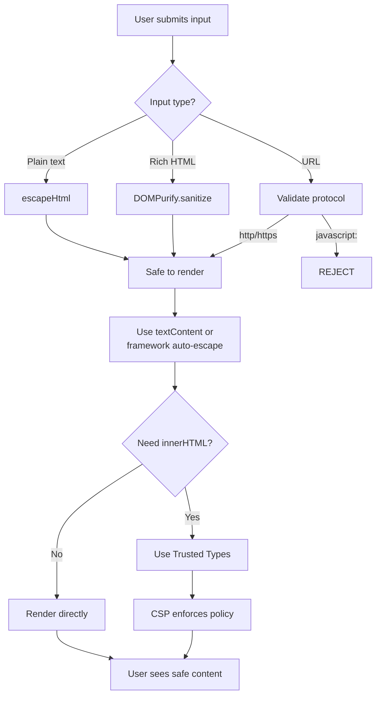
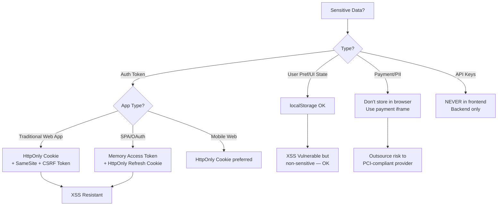
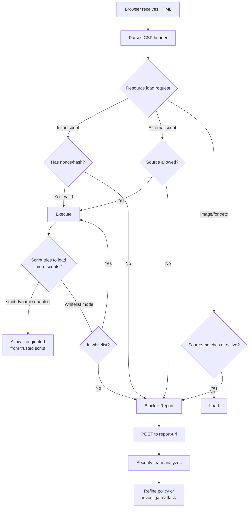

# Frontend Security

Bhai, frontend security ek aisa topic hai jo har senior interview me poocha jaata hai, lekin junior devs aksar ignore kar dete hain. Frontend security basically tumhe attackers se bachata hai jo tumhare users ke data ko churaane ki koshish kar rahe hain. XSS, CSRF — yeh sirf interview ke topics nahi, real production me yeh dikkat aati hai. Agar tu ek e-commerce ya banking app banaa raha hai, aur tune sanitization sahi se nahi ki, toh ek attacker tumhare user ka session token uda sakta hai aur uske naam pe payment kar sakta hai. Yeh actually hota hai — British Airways pe 2018 me Magecart attack ne 380,000 cards leak kar diye, sirf ek malicious script ki wajah se jo unke checkout page pe inject ho gayi thi.

Is module me hum chaar core areas cover karenge: XSS prevention (sabse purana aur sabse common attack), CSRF protection (cookies aur tokens ka game), Secure storage (kahan rakhe tokens, kahan na rakhe), aur Content Security Policy (CSP — last line of defense). Har topic me hum dekhenge ki theory kya hai, real attack kaise hota hai, aur production-grade code kaise likha jaata hai. Senior dev hone ka matlab yeh hai ki tu sirf "use DOMPurify" nahi bolega — tu samjhega ki kyun, kab, aur kis trade-off ke saath.

Important baat: security ek layered approach hai. Ek bhi layer fail ho, toh baaki layers chahiye. Iska matlab hai ki tu input sanitize bhi karega, output escape bhi karega, CSP bhi lagayega, aur cookies ko bhi properly configure karega. "Defense in depth" — yeh phrase yaad rakh, interview me zaroor poochenge.

---

## 1. XSS Prevention

### 1.1 Reflected, Stored, DOM XSS; Sanitization; Auto-escaping in Frameworks

#### Definition

XSS yaani Cross-Site Scripting — yeh ek aisa attack hai jisme attacker tumhare website pe malicious JavaScript inject kar deta hai, jo phir kisi aur user ke browser me execute hoti hai. Iske teen flavours hote hain:

1. **Reflected XSS**: Attack payload URL ya request me aata hai, server use response me wapas "reflect" karta hai, aur browser execute kar deta hai. Example: search query me `<script>` daal diya, aur server ne use HTML me daal diya bina escape kiye.

2. **Stored XSS** (sabse khatarnaak): Payload database me store ho jaata hai. Har user jo woh page dekhta hai, uske browser me script chalti hai. Comments section, profile bio, forum posts — yeh aam jagah hain.

3. **DOM-based XSS**: Yeh server ko involve hi nahi karta. Pure client-side hai. Tumhara JavaScript URL fragment ya kisi user input ko padhta hai aur usse `innerHTML` me daal deta hai. Server logs me kuchh nahi dikhega — debugging ka nightmare.

#### Why?

Sochne ki baat yeh hai ki agar attacker tumhare domain pe JavaScript chala paaya, toh game over hai. Same-origin policy ke andar woh JS:
- `document.cookie` padh sakta hai (agar cookie HttpOnly nahi hai)
- `localStorage` se tokens chura sakta hai
- User ke naam pe API calls kar sakta hai (because session cookie automatically jaati hai)
- Keylogger laga sakta hai
- Phishing form dikha sakta hai jo legitimate dikhta hai

OWASP Top 10 me XSS hamesha top 5 me rehta hai. Twitter ka 2010 ka "onMouseOver" worm yaad hai? Ek tweet pe hover karne se woh tweet auto-retweet ho jaata tha — pure stored XSS chain. 5 minute me lakhon accounts affected hue the.

#### How?

Frontend pe XSS rokne ki strategy multi-layer hai. Chal step-by-step dekhte hain.

**Step 1: Input validation (lekin yeh primary defense nahi hai)**

```javascript
// Yeh sirf basic check hai — XSS prevention nahi
function isValidUsername(input) {
  // Sirf alphanumeric aur underscore allow
  return /^[a-zA-Z0-9_]{3,20}$/.test(input);
}
```

**Step 2: Output encoding — yeh asli defense hai**

Jab bhi user data ko HTML me daal raha hai, context ke hisaab se encode kar:

```javascript
// HTML context me escape karne ka function
function escapeHtml(unsafe) {
  // Yeh chaar character XSS ke main culprits hain
  return unsafe
    .replace(/&/g, "&amp;")   // pehle & — order important hai
    .replace(/</g, "&lt;")    // tag start ko block karo
    .replace(/>/g, "&gt;")    // tag end ko block karo
    .replace(/"/g, "&quot;")  // attribute me quotes
    .replace(/'/g, "&#039;"); // single quotes bhi
}

// Usage
const userComment = '<script>alert("hacked")</script>';
const safeComment = escapeHtml(userComment);
// Output: &lt;script&gt;alert(&quot;hacked&quot;)&lt;/script&gt;
document.getElementById('comments').innerHTML = safeComment;
// Browser ab isko text ki tarah render karega, script execute nahi hogi
```

**Step 3: Sanitization for rich content (DOMPurify)**

Agar tujhe HTML allow karna hai (jaise blog editor), toh DOMPurify use kar:

```html
<!DOCTYPE html>
<html>
<head>
  <title>Safe Blog Editor</title>
  <script src="https://cdn.jsdelivr.net/npm/dompurify@3.0.6/dist/purify.min.js"></script>
</head>
<body>
  <div id="user-content"></div>
  <script>
    // User ne yeh content submit kiya — clearly malicious
    const userInput = `
      <p>Hello! Yeh mera blog hai.</p>
      
      <script>alert('XSS')<\/script>
      <a href="javascript:alert('xss')">Click me</a>
    `;

    // DOMPurify se sanitize karo — yeh sirf safe HTML rakhega
    const cleanHtml = DOMPurify.sanitize(userInput, {
      ALLOWED_TAGS: ['p', 'b', 'i', 'em', 'strong', 'a', 'img'],
      ALLOWED_ATTR: ['href', 'src', 'alt'],
      // javascript: URLs ko block karo
      FORBID_ATTR: ['onerror', 'onclick', 'onload']
    });

    // Ab safe hai yeh innerHTML me daalna
    document.getElementById('user-content').innerHTML = cleanHtml;
    // Output me sirf <p>Hello! Yeh mera blog hai.</p> aur clean /<a> rahega
  </script>
</body>
</html>
```

**Step 4: DOM-based XSS prevention**

```javascript
// GALAT WAY — DOM XSS ka invitation card
function loadFromHash() {
  const hash = window.location.hash.substring(1);
  // Agar URL hai #, toh boom
  document.getElementById('content').innerHTML = hash;
}

// SAHI WAY — textContent use karo
function loadFromHashSafe() {
  const hash = window.location.hash.substring(1);
  // textContent kabhi HTML interpret nahi karta
  document.getElementById('content').textContent = hash;
}

// Aur safer — decodeURIComponent ke saath validation
function loadFromHashSafest() {
  const hash = decodeURIComponent(window.location.hash.substring(1));
  // Whitelist approach — sirf expected format allow karo
  if (/^[a-zA-Z0-9-]+$/.test(hash)) {
    document.getElementById('content').textContent = hash;
  }
}
```

**Step 5: Framework-level auto-escaping**

React, Vue, Angular sab default me auto-escape karte hain:

```jsx
// React me yeh SAFE hai
function Comment({ userInput }) {
  // React JSX me {} ke andar sab kuch escape ho jaata hai
  return <div>{userInput}</div>;
  // userInput = '<script>alert(1)</script>' ho, toh bhi text render hoga
}

// Yeh DANGEROUS hai — naam hi dangerouslySetInnerHTML hai
function UnsafeComment({ html }) {
  // React explicitly warn kar raha hai — "dangerously"
  return <div dangerouslySetInnerHTML={{ __html: html }} />;
  // Iska use sirf tab kar jab tune DOMPurify se sanitize kiya ho
}

// Sahi pattern with sanitization
import DOMPurify from 'dompurify';

function SafeRichContent({ html }) {
  const clean = DOMPurify.sanitize(html);
  return <div dangerouslySetInnerHTML={{ __html: clean }} />;
}
```

**Step 6: Trusted Types API (modern browsers)**

```javascript
// CSP me trusted-types directive set karne ke baad
if (window.trustedTypes && trustedTypes.createPolicy) {
  const policy = trustedTypes.createPolicy('app-policy', {
    createHTML: (input) => DOMPurify.sanitize(input)
  });

  // Ab innerHTML pe direct string assign nahi kar sakta
  // element.innerHTML = userInput; // TypeError throw karega
  element.innerHTML = policy.createHTML(userInput); // Yeh chalega
}
```

#### Real-life Example

**British Airways Magecart Attack (2018)**: Attackers ne BA ke checkout page pe ek 22-line ka JavaScript inject kiya. Jab user card details fill karta tha, woh script form data ko `baways.com` (typo domain) pe bhej deti thi. 380,000 card details leak hue, BA ko £20 million ka GDPR fine laga. Yeh stored XSS ka classic case tha — third-party script (jo baad me compromise ho gayi) ke through inject hua. Iska sabak: Subresource Integrity (SRI) hashes use karo, third-party scripts ko CSP me strictly limit karo.

**Twitter onMouseOver Worm (2010)**: Tweet me JavaScript inject ho jaati thi via `onMouseOver` attribute. Jaise hi koi tweet pe hover karta, woh tweet uske account se auto-retweet ho jaata. 5 minute me lakhon tweets — including White House aide aur Sarah Brown (UK PM ki wife). Stored XSS ki power yahaan dikhi.

**Fortnite XSS (2019)**: Check Point researchers ne ek Epic Games subdomain pe XSS dhoonda. Single click se attacker pura Fortnite account hijack kar sakta tha — V-Bucks, payment info, sab kuch. Reflected XSS + OAuth flow ka combination tha.

#### Diagram



#### Interview Q&A

**Q1: Reflected aur Stored XSS me kya difference hai aur kaunsa zyada dangerous hai?**

Reflected XSS me payload har request me URL ya form data ke through aata hai, aur server immediately use response me reflect kar deta hai. Attacker ko victim ko ek crafted link pe click karwana padta hai — phishing email, malicious ad, etc. Stored XSS me payload database me persist ho jaata hai — comment, forum post, profile field — aur har user jo woh page dekhta hai automatically affected hota hai. Stored zyada khatarnaak hai kyunki social engineering ki zarurat nahi, scale automatic hai. Twitter worm stored tha, isiliye 5 minute me itna spread hua. Lekin reflected bhi underestimate mat kar — agar admin panel pe hai, toh ek targeted email se attacker poora system uda sakta hai.

**Q2: React me `dangerouslySetInnerHTML` kab use karna chahiye aur kaise safely?**

Naam hi se clear hai — React tujhe warn kar raha hai ki yeh dangerous hai. Use sirf tab kar jab tujhe truly raw HTML render karna ho, jaise CMS-driven blog content ya markdown rendered output. Safe usage ka pattern: pehle DOMPurify ya sanitize-html jaise library se input clean karo, allowed tags aur attributes whitelist define karo, aur phir set karo. Bonus: CSP me `script-src 'self'` rakho — agar sanitization bypass bhi ho jaaye, browser inline scripts execute nahi karega. Aur ek baat — agar tu markdown render kar raha hai, `react-markdown` jaise libraries use kar jo by default safe hain, instead of converting to HTML aur phir dangerouslySetInnerHTML karne ke.

**Q3: DOM-based XSS server-side defenses se kaise alag hai aur ise kaise detect karte hain?**

DOM XSS purely client-side hai — server ko payload kabhi nahi dikhta. URL fragment (`#`), `document.referrer`, `window.name`, `localStorage` — yeh sources hain. Sinks hain `innerHTML`, `document.write`, `eval`, `setTimeout(string)`, `location.href`. Server-side WAF iss attack ko nahi pakad sakta kyunki request pure normal lagti hai. Detection ke liye static analysis tools jaise ESLint with `no-unsanitized` plugin, dynamic tools jaise OWASP ZAP, aur runtime monitoring with Trusted Types use karte hain. Browser DevTools ke "Issues" tab me bhi DOM XSS warnings aate hain agar Trusted Types violate ho. Production me CSP report-uri se reports collect karo.

**Q4: Framework auto-escaping pe blindly trust karna theek hai?**

Nahi, bilkul nahi. Auto-escaping HTML context me kaam karti hai, lekin context-specific bypasses possible hain. Agar tu user input ko `href` attribute me daal raha hai, framework escape karega quotes, lekin `javascript:alert(1)` URL ko nahi rokega. CSS me, JavaScript context me, ya URL parameters me different escaping rules hain. React me `style` attribute object leta hai (string nahi) iss reason se. Angular me `[innerHTML]` use karo toh sanitization automatic hai, lekin `bypassSecurityTrustHtml` se override kar sakte ho. Senior dev hone ka matlab yeh samajhna hai — auto-escape ek default safety net hai, lekin context-sensitive scenarios me explicit sanitization aur output encoding zaroori hai.

---

## 2. CSRF Basics

### 2.1 SameSite Cookies, CSRF Tokens, Double-Submit Cookie Pattern

#### Definition

CSRF yaani Cross-Site Request Forgery — isme attacker victim ke browser ko trick karta hai ki woh kisi authenticated site pe unwanted request bheje. XSS me attacker tumhare site pe code chala raha hai. CSRF me attacker apne site se tumhare site pe request bhej raha hai — using victim ki session cookies. Browser default me cookies har request ke saath bhejta hai (jab tak SameSite na set ho), isiliye attacker `<form>` ya `` se request fire kar sakta hai.

Simple example: tu `bank.com` pe logged in hai. Attacker ne `evil.com` pe yeh form rakha hai:

```html
<form action="https://bank.com/transfer" method="POST">
  <input name="to" value="attacker_account">
  <input name="amount" value="100000">
</form>
<script>document.forms[0].submit()</script>
```

Tune `evil.com` visit kiya — form auto-submit hua, browser ne tumhari `bank.com` cookie attach ki, aur paisa transfer ho gaya.

#### Why?

CSRF state-changing operations pe attack karta hai — money transfer, password change, settings update, post create. Read operations pe usually impact nahi hota (kyunki attacker response nahi padh sakta — same-origin policy hai). Lekin agar tumhara API GET request pe state change kar raha hai (which is REST anti-pattern), toh GET pe bhi CSRF possible hai.

Real impact: 2008 me Netflix pe CSRF tha — attacker DVD queue modify kar sakta tha, shipping address change kar sakta tha. ING Direct (bank) pe bhi CSRF tha jisme attacker funds transfer kar sakta tha. YouTube me 2008 me CSRF se almost har user action attacker control kar sakta tha.

Aaj ke time me modern browsers ne SameSite cookies se CSRF ko bahut reduce kar diya hai, lekin yeh baseline hai — defense in depth ke liye tokens bhi chahiye.

#### How?

**Method 1: SameSite Cookies (browser-level defense)**

```javascript
// Server-side (Express.js example)
app.use(session({
  secret: 'super-secret-key',
  cookie: {
    httpOnly: true,      // JS access nahi
    secure: true,        // sirf HTTPS
    sameSite: 'strict',  // cross-site requests me cookie nahi jaati
    maxAge: 3600000
  }
}));

// SameSite ke values:
// 'strict' - cookie sirf same-site requests me jaati hai (most secure)
// 'lax'    - top-level navigation (link click) me jaati hai, but POST forms me nahi
// 'none'   - har jagah jaati hai (must use Secure flag)
```

Chrome 80+ se default `Lax` hai agar tune set nahi kiya. Yeh basic CSRF se bachata hai, lekin subdomain attacks ya legacy browsers ke liye tokens chahiye.

**Method 2: CSRF Token (Synchronizer Token Pattern)**

```html
<!DOCTYPE html>
<html>
<head><title>Bank Transfer</title></head>
<body>
  <form id="transfer-form" action="/api/transfer" method="POST">
    <!-- Server ne yeh token render kiya, attacker ko nahi pata -->
    <input type="hidden" name="csrf_token" value="a3f7b9c2d8e4f1a6b5c9d2e7f4a8b3c6">
    <input name="to" placeholder="Receiver account">
    <input name="amount" type="number">
    <button type="submit">Transfer</button>
  </form>

  <script>
    // AJAX requests ke liye token header me bhejo
    document.getElementById('transfer-form').addEventListener('submit', async (e) => {
      e.preventDefault();
      const formData = new FormData(e.target);
      const token = formData.get('csrf_token');

      const response = await fetch('/api/transfer', {
        method: 'POST',
        headers: {
          'Content-Type': 'application/json',
          'X-CSRF-Token': token  // Server isko verify karega
        },
        credentials: 'include',
        body: JSON.stringify({
          to: formData.get('to'),
          amount: formData.get('amount')
        })
      });

      const result = await response.json();
      console.log('Transfer status:', result);
    });
  </script>
</body>
</html>
```

Server-side verification:

```javascript
// Express.js with csurf middleware
const csrf = require('csurf');
const csrfProtection = csrf({ cookie: true });

app.get('/transfer', csrfProtection, (req, res) => {
  // Token generate karke template me bhejo
  res.render('transfer', { csrfToken: req.csrfToken() });
});

app.post('/api/transfer', csrfProtection, (req, res) => {
  // Middleware automatically token verify karega
  // Agar invalid hua toh 403 throw karega
  // Yahan business logic — paisa transfer
  res.json({ status: 'success' });
});
```

**Method 3: Double-Submit Cookie Pattern**

Yeh stateless approach hai — server ko session me token store nahi karna padta.

```javascript
// Step 1: Login ke baad server ek random token cookie me set karta hai
// Set-Cookie: csrf_token=abc123; SameSite=Lax; Secure

// Step 2: Frontend cookie se token padhta hai aur header me bhejta hai
function getCsrfTokenFromCookie() {
  // document.cookie se csrf_token nikaalo
  const match = document.cookie.match(/csrf_token=([^;]+)/);
  return match ? match[1] : null;
}

async function makeApiCall(url, data) {
  const csrfToken = getCsrfTokenFromCookie();

  const response = await fetch(url, {
    method: 'POST',
    headers: {
      'Content-Type': 'application/json',
      // Yeh header attacker set nahi kar sakta cross-origin se
      'X-CSRF-Token': csrfToken
    },
    credentials: 'include',  // cookie bhi automatically jaayegi
    body: JSON.stringify(data)
  });

  return response.json();
}

// Step 3: Server check karta hai ki cookie value === header value
// Attacker apne site se tumhari cookie nahi padh sakta (same-origin policy)
// Aur custom header set nahi kar sakta bina CORS preflight ke
```

Server-side:

```javascript
function csrfMiddleware(req, res, next) {
  const cookieToken = req.cookies.csrf_token;
  const headerToken = req.headers['x-csrf-token'];

  // Dono match hone chahiye
  if (!cookieToken || !headerToken || cookieToken !== headerToken) {
    return res.status(403).json({ error: 'CSRF token mismatch' });
  }

  // Constant-time comparison use karo timing attacks rokne ke liye
  const crypto = require('crypto');
  const a = Buffer.from(cookieToken);
  const b = Buffer.from(headerToken);

  if (a.length !== b.length || !crypto.timingSafeEqual(a, b)) {
    return res.status(403).json({ error: 'CSRF token mismatch' });
  }

  next();
}
```

**Method 4: Custom Header Approach (for pure JSON APIs)**

```javascript
// Agar API sirf JSON accept karti hai aur custom header require karti hai,
// toh CSRF auto-mitigated hai because:
// 1. <form> tag custom headers nahi bhej sakta
// 2. fetch/XHR custom header ke liye CORS preflight chahiye
// 3. Attacker ka origin allowed nahi hoga

fetch('/api/sensitive-action', {
  method: 'POST',
  headers: {
    'Content-Type': 'application/json',
    'X-Requested-With': 'XMLHttpRequest'  // Custom header
  },
  credentials: 'include'
});

// Server side:
app.post('/api/sensitive-action', (req, res) => {
  if (req.headers['x-requested-with'] !== 'XMLHttpRequest') {
    return res.status(403).send('Forbidden');
  }
  // Process request
});
```

#### Real-life Example

**ING Direct CSRF (2008)**: WhiteHat Security ne ING Direct (bank) pe CSRF dhoonda jisme attacker user ke account se apne account me funds transfer kar sakta tha. Sirf ek malicious image tag — `` — agar logged-in user uss page ko visit karta, transfer ho jaata. Patch ke baad ING ne CSRF tokens implement kiye.

**YouTube CSRF (2008)**: Researchers ne dhoondha ki YouTube ke almost har user-action endpoint pe CSRF tha — videos rate karna, share karna, "favourites" me add karna, comments post karna, contact list flush karna. Attacker ek crafted page se user ka pura YouTube experience hijack kar sakta tha.

**WordPress 4.7 CSRF (2017)**: Plugin auto-update mechanism me CSRF tha. Ek attacker admin ko malicious page pe le jaata, aur arbitrary plugin install ho jaata — basically RCE through CSRF. WordPress ne nonces (their CSRF tokens) ko strengthen kiya.

**Recent: TikTok (2020)**: Check Point researchers ne TikTok pe SMS-based CSRF dhoondha — attacker target ke phone number pe TikTok ke through SMS bhej sakta tha jisme malicious link hota. CSRF + open redirect chain tha.

#### Diagram

```mermaid
sequenceDiagram
    participant V as Victim Browser
    participant E as Evil Site
    participant B as Bank.com
    
    V->>B: Login (gets session cookie)
    B-->>V: Set-Cookie: session=xyz; SameSite=Lax
    Note over V: User logged in
    V->>E: Visits evil.com
    E-->>V: HTML with auto-submit form to bank.com
    V->>B: POST /transfer (with cookie)
    Note over V,B: SameSite=Lax blocks POST<br/>OR CSRF token missing<br/>403 Forbidden
    B-->>V: Reject request
    
    Note over V,B: With proper defense:<br/>1. SameSite cookies<br/>2. CSRF token check<br/>3. Origin header check
```

#### Interview Q&A

**Q1: SameSite cookies CSRF ko fully solve kar deti hain?**

Lagbhag, lekin pura nahi. `SameSite=Strict` se cross-site requests me cookie nahi jaati, jo CSRF ko effectively block kar deta hai. Lekin issues hain: pehla, `Strict` user experience tod sakta hai — agar koi external link se tumhari site pe aata hai (Google search se), woh logged-out dikhega. Isiliye `Lax` zyada common hai. Doosra, `Lax` GET top-level navigation me cookie bhejta hai, toh agar tumhara endpoint GET pe state change karta hai (which it shouldn't), CSRF possible hai. Teesra, subdomain attacks — agar `evil.bank.com` compromise hai, woh same-site count hota hai. Chautha, legacy browsers (IE11, old Safari) SameSite ignore karte hain. Iss reason se defense in depth: SameSite + CSRF tokens + Origin header check.

**Q2: Synchronizer Token vs Double-Submit Cookie — kab kaunsa use karein?**

Synchronizer Token pattern me server token ko session/database me store karta hai. Stateful hai, isiliye horizontally scale karte time tricky hota hai (sticky sessions ya shared session store chahiye). Doosri taraf, more secure hai kyunki token completely server-controlled hai. Double-Submit me server ko store nahi karna padta — token cookie aur header dono me bhejta hai, server compare karta hai. Stateless hai, microservices/JWT-based architectures ke liye perfect. Lekin double-submit me ek subtle bug — agar attacker ne subdomain se cookie inject ki (cookie tossing attack), bypass possible hai. Mitigation: `__Host-` prefix cookies use karo, jo subdomain set nahi kar sakta. Mera default recommendation: stateful apps me synchronizer token, stateless/SPA me signed double-submit (HMAC with server secret).

**Q3: GET requests pe CSRF protection chahiye?**

REST principles ke according GET idempotent aur safe hona chahiye — yaani state change nahi karna chahiye. Agar tu yeh follow kar raha hai, GET pe CSRF impact zero hai (attacker response read nahi kar sakta same-origin policy ki wajah se). Lekin reality me kuchh APIs GET pe state change karte hain (legacy code, "logout via GET", etc.). Aise endpoints pe CSRF lagana zaroori hai. Better solution: refactor karo — sensitive operations POST/PUT/DELETE pe move karo. Ek aur scenario: agar GET response me sensitive data hai jo attacker side-channel se leak kar sakta hai (timing, response size), toh `Lax` SameSite cookie kaafi nahi — token check chahiye. Login forms pe bhi CSRF token rakho — login CSRF se attacker tumhe apne account me login karwa sakta hai, jisse subsequent activities track ho jaayein.

**Q4: SPA me CSRF kaise handle karte hain jab tu JWT use kar raha hai?**

Pehli baat — agar JWT localStorage me hai aur Authorization header me bhejta hai, toh CSRF auto-mitigated hai (kyunki cookie nahi hai, browser auto-attach nahi karta). Lekin tab tu XSS ke prati zyada vulnerable hai. Better pattern: JWT ko HttpOnly cookie me rakho — XSS se safe — aur CSRF ke liye double-submit token use karo. Code: login pe server JWT cookie set kare aur ek random CSRF token bhi cookie me set kare (non-HttpOnly). Frontend uss CSRF token ko cookie se padh ke `X-CSRF-Token` header me bheje. Server header aur cookie compare kare. Bonus: cookie ko `__Host-` prefix de aur `SameSite=Strict` rakho. Aur har sensitive operation ke liye `Origin` header bhi check karo — should match expected domain. Yeh layered defense hai jo XSS aur CSRF dono se bachata hai.

---

## 3. Secure Storage

### 3.1 localStorage vs httpOnly Cookies, What NOT to Store, Token Handling

#### Definition

Browser me data store karne ke multiple options hain: `localStorage`, `sessionStorage`, `IndexedDB`, cookies, in-memory variables. Har ek ka security profile alag hai. "Secure storage" ka matlab yeh decide karna ki sensitive data (auth tokens, PII, payment info) kahan rakhe taaki XSS, CSRF, aur physical access se safe rahe.

Key insight: **JavaScript-accessible storage (localStorage, sessionStorage, regular cookies) XSS ke prati vulnerable hai**. Agar attacker JS chala paaya tumhare domain pe, woh sab kuch padh sakta hai. HttpOnly cookies JS se accessible nahi hain — yeh XSS-resistant hain.

#### Why?

Sensitive data leak hone ke consequences:
- **Auth tokens leak**: attacker user ke naam pe API calls karega, account takeover
- **PII leak**: GDPR fines, regulatory issues, reputation damage
- **Payment info**: PCI-DSS violation, direct financial loss
- **API keys**: backend abuse, billing attacks

Industry me aksar dekha jaata hai ki devs `localStorage.setItem('token', jwt)` likh dete hain — convenient hai, kaam karta hai. Lekin ek XSS vulnerability mil jaaye — sab tokens chori. Slack me 2019 me ek bug tha jisme SAML response handling ke through tokens leak ho sakte the.

#### How?

**Comparison: Storage Options**

```javascript
// 1. localStorage — JS accessible, persistent, ~5-10MB
localStorage.setItem('user_pref', 'dark_mode');
const pref = localStorage.getItem('user_pref');
// XSS vulnerable, page close ke baad bhi rehta hai

// 2. sessionStorage — JS accessible, tab-scoped
sessionStorage.setItem('temp_data', 'value');
// XSS vulnerable, tab band toh data gaya

// 3. Regular cookie — JS accessible, server bhi padh sakta
document.cookie = "user_id=123; path=/";
// XSS vulnerable, automatically server pe jaata hai

// 4. HttpOnly cookie — JS access NAHI, server pe set hota hai
// document.cookie pe nahi dikhega
// Set-Cookie: auth_token=xyz; HttpOnly; Secure; SameSite=Strict
// XSS-RESISTANT, yeh sensitive tokens ke liye recommended

// 5. In-memory (closure variable) — JS accessible, page reload pe gaya
let inMemoryToken = null;
function setToken(t) { inMemoryToken = t; }
// XSS vulnerable but page reload pe clear, short-lived
```

**Pattern 1: HttpOnly Cookie + CSRF Token (most secure for web apps)**

```javascript
// Frontend: login flow
async function login(email, password) {
  const response = await fetch('/api/login', {
    method: 'POST',
    credentials: 'include',  // cookies enable
    headers: { 'Content-Type': 'application/json' },
    body: JSON.stringify({ email, password })
  });

  // Server ne yeh response headers set kiye hain:
  // Set-Cookie: auth_token=xyz; HttpOnly; Secure; SameSite=Strict; Path=/
  // Set-Cookie: csrf_token=abc; Secure; SameSite=Strict; Path=/
  
  // Frontend ko auth_token dikhta nahi (HttpOnly), aur dikhna nahi chahiye
  // CSRF token cookie se padh ke header me bhejna hai

  if (!response.ok) throw new Error('Login failed');
  return response.json();
}

// Authenticated API call
async function getProfile() {
  const csrfToken = document.cookie
    .split('; ')
    .find(row => row.startsWith('csrf_token='))
    ?.split('=')[1];

  const response = await fetch('/api/profile', {
    credentials: 'include',
    headers: {
      'X-CSRF-Token': csrfToken
    }
  });
  // auth_token cookie automatically jaayegi
  // CSRF token header me jaayega
  return response.json();
}
```

**Pattern 2: In-Memory Access Token + HttpOnly Refresh Token (for SPAs)**

```javascript
// Yeh pattern OAuth flows me popular hai
class AuthManager {
  constructor() {
    // Access token sirf memory me — page reload pe gaya
    this.accessToken = null;
    this.tokenExpiry = null;
  }

  async login(email, password) {
    const res = await fetch('/api/login', {
      method: 'POST',
      credentials: 'include',
      body: JSON.stringify({ email, password })
    });
    const data = await res.json();
    
    // Short-lived access token memory me
    this.accessToken = data.accessToken;
    this.tokenExpiry = Date.now() + (data.expiresIn * 1000);
    
    // Long-lived refresh token HttpOnly cookie me hai (server ne set kiya)
    // JS use access nahi kar sakta — XSS proof
  }

  async getAccessToken() {
    // Token expire ho gaya, refresh karo
    if (!this.accessToken || Date.now() >= this.tokenExpiry - 60000) {
      await this.refreshToken();
    }
    return this.accessToken;
  }

  async refreshToken() {
    // Refresh endpoint HttpOnly cookie use karega
    const res = await fetch('/api/refresh', {
      method: 'POST',
      credentials: 'include'
    });
    if (!res.ok) {
      this.accessToken = null;
      throw new Error('Session expired');
    }
    const data = await res.json();
    this.accessToken = data.accessToken;
    this.tokenExpiry = Date.now() + (data.expiresIn * 1000);
  }

  async apiCall(url, options = {}) {
    const token = await this.getAccessToken();
    return fetch(url, {
      ...options,
      headers: {
        ...options.headers,
        'Authorization': `Bearer ${token}`
      }
    });
  }

  logout() {
    this.accessToken = null;
    this.tokenExpiry = null;
    // Server ko bhi batao taaki refresh token revoke ho
    return fetch('/api/logout', { method: 'POST', credentials: 'include' });
  }
}

const auth = new AuthManager();
```

**What NOT to Store in Browser**

```javascript
// GALAT — kabhi mat karo
localStorage.setItem('jwt', token);                    // XSS = takeover
localStorage.setItem('credit_card', '4111111111111111'); // PCI violation
localStorage.setItem('password', 'mypass123');         // Never
localStorage.setItem('aws_access_key', '...');         // Backend secret
localStorage.setItem('ssn', '123-45-6789');            // PII
sessionStorage.setItem('api_secret_key', '...');       // Same problem

// Yeh sab BACKEND ya secure cookie me hone chahiye
```

**Safe to Store**

```javascript
// Yeh store karna theek hai (non-sensitive)
localStorage.setItem('theme', 'dark');
localStorage.setItem('language', 'hi');
localStorage.setItem('last_visited', '/dashboard');
localStorage.setItem('ui_preferences', JSON.stringify({
  sidebar: 'collapsed',
  fontSize: 'medium'
}));

// Public identifiers (jo URL me bhi dikhte hain) bhi theek hain
sessionStorage.setItem('current_workspace_id', 'ws_123');
```

**Pattern 3: Encrypted Storage (jab koi option na ho)**

```javascript
// Web Crypto API se encryption — last resort
async function encryptedStore(key, value, password) {
  const encoder = new TextEncoder();
  const passwordKey = await crypto.subtle.importKey(
    'raw',
    encoder.encode(password),
    'PBKDF2',
    false,
    ['deriveKey']
  );

  const salt = crypto.getRandomValues(new Uint8Array(16));
  const aesKey = await crypto.subtle.deriveKey(
    {
      name: 'PBKDF2',
      salt: salt,
      iterations: 100000,
      hash: 'SHA-256'
    },
    passwordKey,
    { name: 'AES-GCM', length: 256 },
    false,
    ['encrypt']
  );

  const iv = crypto.getRandomValues(new Uint8Array(12));
  const encrypted = await crypto.subtle.encrypt(
    { name: 'AES-GCM', iv: iv },
    aesKey,
    encoder.encode(value)
  );

  // Store encrypted data + salt + iv
  const data = {
    salt: Array.from(salt),
    iv: Array.from(iv),
    ciphertext: Array.from(new Uint8Array(encrypted))
  };
  localStorage.setItem(key, JSON.stringify(data));
}

// Lekin yaad rakh — agar attacker XSS exploit kar paaya, woh password bhi
// intercept kar sakta hai. Yeh sirf physical access se bachata hai
```

#### Real-life Example

**Slack OAuth Tokens (2019)**: Slack ke ek SAML implementation me bug tha jisme attacker ek crafted SAML response se user ke session token leak kar sakta tha. Tokens localStorage me store the, aur ek XSS chain ke through extract kiye ja sakte the. Slack ne quickly migrate kiya HttpOnly cookies pe.

**Reddit Mobile App (2020)**: Reddit ne disclose kiya ki kuchh users ke API tokens AsyncStorage (mobile localStorage equivalent) me leak ho gaye the third-party SDK ke through. Tokens revoke kiye gaye, sessions force-logout hue.

**Common Pattern in Indian Startups**: Bahut saari fintech startups initial days me JWT localStorage me rakhte hain — convenient hai, easy refresh. Phir security audit me yeh flag hota hai. Razorpay, Cred jaisi mature companies HttpOnly cookies + refresh token pattern use karti hain.

**Magento / Adobe Commerce (2022)**: Magecart-style attacks me attackers ne payment forms pe JS inject kiya jo card numbers ko `localStorage` se aur input fields se intercept karke C2 server pe bhejta. Iss reason se PCI-DSS payment iframes (Stripe Elements jaisa) ka use mandatory hota jaa raha hai — sensitive data tumhari domain me aata hi nahi.

#### Diagram



#### Interview Q&A

**Q1: localStorage me JWT store karne ke kya risks hain aur alternative kya hai?**

localStorage purely JavaScript-accessible hai — koi bhi script jo tumhari origin pe chal rahi hai (including third-party libraries, ads, browser extensions in some cases) usko padh sakti hai. Ek XSS vulnerability — chahe woh tumhari code me ho ya kisi npm package me — attacker ko poora token de deti hai. Yeh JWT 1+ hour valid hota hai usually, toh attacker ko significant window milti hai. Plus, localStorage persistent hai — page band karne ke baad bhi rehta hai. Alternative pattern: HttpOnly cookie me JWT, ya better, in-memory access token (short-lived, like 5 min) + HttpOnly refresh token cookie (long-lived). Refresh token rotation bhi implement karo — har refresh pe naya token, purana invalidate. Yeh pattern OWASP aur Auth0 dono recommend karte hain. Trade-off: implementation slightly complex hota hai, lekin security gain massive hai.

**Q2: HttpOnly cookies ke saath bhi kya XSS impact hai?**

HttpOnly cookie XSS se token leak nahi hone deti, lekin attacker phir bhi user ke naam pe actions kar sakta hai jab tak page open hai — kyunki browser cookie automatically attach karta hai. Iska matlab hai HttpOnly XSS ko fully solve nahi karta, sirf token theft prevent karta hai. Token theft persistent attack enable karta hai (attacker apne machine se use kar sakta hai), jabki HttpOnly ke saath attacker ko victim ke browser me hi rehna padta hai. Defense in depth: CSP se XSS rokho, HttpOnly se token theft rokho, SameSite + CSRF token se cross-site abuse rokho, short-lived tokens + refresh rotation se blast radius limit karo, aur server-side anomaly detection se suspicious activity catch karo. Sab milke ek robust system banaate hain.

**Q3: localStorage vs sessionStorage vs IndexedDB — security perspective se kya difference hai?**

Teeno JavaScript-accessible hain, toh XSS perspective se equally vulnerable. Differences scope aur capacity me hain. localStorage origin-scoped hai aur persistent, ~5-10MB. sessionStorage tab-scoped (har tab ka separate) aur tab close pe clear, similar capacity. IndexedDB origin-scoped, persistent, much larger (browser-dependent, often hundreds of MB), aur structured data store kar sakta hai. Subdomain attacks me localStorage zyada risky hai kyunki origin includes subdomain — agar `evil.yoursite.com` compromise hua, woh main domain ka localStorage nahi padh sakta (different origin), but cookies me path/domain matter karte hain. Practical recommendation: sensitive data kisi me bhi mat rakho. Non-sensitive UI state ke liye localStorage. Per-tab temporary state ke liye sessionStorage. Bulk app data (offline support, file caching) ke liye IndexedDB — but encrypt karo agar PII hai.

**Q4: Refresh token rotation kya hai aur kyun zaroori hai?**

Refresh token rotation me har baar jab refresh token use hota hai (access token renew karne ke liye), server naya refresh token issue karta hai aur purana invalidate kar deta hai. Iska bada fayda detection hai — agar attacker ne refresh token chura liya aur use kiya, toh original user jab refresh karega toh uska token invalid hoga (kyunki attacker ne already use kar liya). Server detect kar sakta hai "reuse" — same refresh token ko twice use kiya gaya — aur poori token family revoke kar sakta hai (suspected breach). User ko force logout karke re-authenticate karayega. OAuth 2.1 spec me yeh recommended pattern hai. Implementation me track karna padta hai token "families" — har login se ek family, har rotation me link, aur reuse detection. Auth0, Okta, AWS Cognito sab support karte hain. SPA security ke liye yeh almost mandatory hai aaj ke time me.

---

## 4. Content Security Policy (CSP)

### 4.1 Directives (default-src, script-src, etc.), Nonces, Hashes, Report-uri

#### Definition

Content Security Policy ek HTTP response header (ya `<meta>` tag) hai jo browser ko batata hai ki kaunse sources se resources (scripts, styles, images, fonts, frames) load karne hain. Yeh XSS aur data injection attacks ke against last line of defense hai. Agar tumhari sanitization kahin fail ho gayi aur attacker ne `<script>alert(1)</script>` inject kar diya, CSP browser ko bolega "yeh inline script execute mat kar" — attack neutralized.

CSP basically whitelist-based approach hai. Tu explicitly batata hai "scripts sirf yahan se load hone chahiye, styles yahan se" — baaki sab block.

#### Why?

XSS prevention me sanitization perfect nahi hoti. Ek bug, ek edge case, ek third-party library mein vulnerability — attack ho sakta hai. CSP yeh blast radius limit karta hai. Even if attacker injects script, browser execute nahi karega agar policy violate hoti hai.

Real numbers: Google ne 2016 me research publish ki — CSP deploy karne ke baad, XSS impact significantly reduce hua. GitHub, Twitter, Slack — sab strict CSP use karte hain. Agar tumhari site pe CSP nahi hai, security review me yeh red flag hai.

CSP additional benefits:
- Mixed content prevention (HTTPS site pe HTTP resources block)
- Clickjacking prevention (`frame-ancestors`)
- Form submission control (`form-action`)
- Plugin restrictions (`object-src`)

#### How?

**Basic CSP Setup**

```javascript
// Express.js me CSP set karna
app.use((req, res, next) => {
  res.setHeader(
    'Content-Security-Policy',
    "default-src 'self'; " +
    "script-src 'self' https://cdn.jsdelivr.net; " +
    "style-src 'self' 'unsafe-inline' https://fonts.googleapis.com; " +
    "img-src 'self' data: https:; " +
    "font-src 'self' https://fonts.gstatic.com; " +
    "connect-src 'self' https://api.example.com; " +
    "frame-ancestors 'none'; " +
    "base-uri 'self'; " +
    "form-action 'self'"
  );
  next();
});
```

**Important Directives Explained**

```html
<!-- HTML me <meta> tag se bhi set kar sakte ho, but header preferred -->
<meta http-equiv="Content-Security-Policy" content="
  default-src 'self';
  script-src 'self' 'nonce-randomNonceHere';
  style-src 'self';
  img-src 'self' https: data:;
  font-src 'self';
  object-src 'none';
  base-uri 'self';
  form-action 'self';
  frame-ancestors 'none';
  upgrade-insecure-requests;
  report-uri /csp-report
">

<!-- Yahan kya kya ho raha hai:
default-src 'self'      -> Default fallback, sirf same origin
script-src              -> Scripts kahan se load honge
style-src               -> Stylesheets aur inline styles
img-src                 -> Images
font-src                -> Web fonts
object-src 'none'       -> <object>, <embed>, <applet> block
base-uri 'self'         -> <base> tag hijack se bachao
form-action 'self'      -> Forms sirf same origin pe submit
frame-ancestors 'none'  -> Tumhari site iframe me embed nahi ho sakti (clickjacking)
upgrade-insecure-requests -> HTTP requests automatically HTTPS
report-uri              -> Violations yahan report ho
-->
```

**Nonce-based CSP (recommended for inline scripts)**

```javascript
// Server-side: har request pe naya random nonce generate karo
const crypto = require('crypto');

app.use((req, res, next) => {
  // 16 bytes random, base64 encoded
  res.locals.cspNonce = crypto.randomBytes(16).toString('base64');
  
  res.setHeader(
    'Content-Security-Policy',
    `default-src 'self'; ` +
    `script-src 'self' 'nonce-${res.locals.cspNonce}' 'strict-dynamic'; ` +
    `style-src 'self' 'nonce-${res.locals.cspNonce}'; ` +
    `object-src 'none'; ` +
    `base-uri 'self';`
  );
  next();
});

app.get('/', (req, res) => {
  res.send(`
    <!DOCTYPE html>
    <html>
    <head>
      <title>Secure Page</title>
      <!-- Nonce attribute add karo har inline script/style pe -->
      <style nonce="${res.locals.cspNonce}">
        body { font-family: sans-serif; }
      </style>
    </head>
    <body>
      <h1>Welcome</h1>
      
      <!-- Yeh execute hoga — nonce match karta hai -->
      <script nonce="${res.locals.cspNonce}">
        console.log('Legitimate inline script');
      </script>
      
      <!-- Yeh BLOCK hoga — nonce nahi hai -->
      <!-- <script>alert('XSS attempt')</script> -->
      
      <!-- External script — nonce ya 'self' chahiye -->
      <script nonce="${res.locals.cspNonce}" src="/app.js"></script>
    </body>
    </html>
  `);
});
```

**Hash-based CSP (for static inline scripts)**

```html
<!DOCTYPE html>
<html>
<head>
  <!-- Agar inline script static hai, hash use karo -->
  <!-- Pehle script ka SHA-256 hash calculate karo -->
</head>
<body>
  <!-- Server header:
       Content-Security-Policy: script-src 'sha256-RFWPLDbv2BY+rCkDzsE+0fr8ylGr2R2faWMhq4lfEQc='
  -->
  <script>console.log('Hello');</script>
  <!-- Browser khud calculate karega hash aur match karega -->
</body>
</html>
```

```javascript
// Hash generate karne ka script (build time)
const crypto = require('crypto');

function generateCspHash(scriptContent) {
  const hash = crypto
    .createHash('sha256')
    .update(scriptContent, 'utf8')
    .digest('base64');
  return `'sha256-${hash}'`;
}

const inlineScript = "console.log('Hello');";
console.log(generateCspHash(inlineScript));
// Output: 'sha256-RFWPLDbv2BY+rCkDzsE+0fr8ylGr2R2faWMhq4lfEQc='
// Yeh CSP me daalo
```

**'strict-dynamic' Pattern (modern, scalable)**

```javascript
// 'strict-dynamic' ka matlab: jis script ko nonce/hash mila hai,
// woh dynamically aur scripts load kar sakta hai (without explicit whitelist)

const csp = `
  script-src 'nonce-${nonce}' 'strict-dynamic' 'unsafe-inline' https:;
  object-src 'none';
  base-uri 'none';
`;

// Browsers jo 'strict-dynamic' support karte hain:
//   nonce-matched script execute hoga
//   uss script ne jo aur scripts load kiye, woh bhi execute honge
//   'unsafe-inline' aur 'https:' ignore hote hain (sirf old browsers ke liye fallback)

// Browsers jo 'strict-dynamic' nahi samajhte:
//   'unsafe-inline' aur 'https:' fallback ke roop me kaam karte hain
//   Yeh backwards compatibility ke liye hai
```

**CSP Reporting**

```javascript
// Report-uri (legacy) ya report-to (modern)
const csp = `
  default-src 'self';
  script-src 'self';
  report-uri /api/csp-report;
  report-to csp-endpoint;
`;

// report-to ke saath Report-To header bhi chahiye
res.setHeader('Report-To', JSON.stringify({
  group: 'csp-endpoint',
  max_age: 10886400,
  endpoints: [{ url: 'https://example.com/api/csp-report' }]
}));

// Endpoint jo violations receive karega
app.post('/api/csp-report', express.json({
  type: ['application/csp-report', 'application/reports+json']
}), (req, res) => {
  const report = req.body['csp-report'] || req.body;
  
  // Production me yeh logging system me bhejo (Sentry, Datadog, etc.)
  console.log('CSP Violation:', {
    documentUri: report['document-uri'],
    violatedDirective: report['violated-directive'],
    blockedUri: report['blocked-uri'],
    sourceFile: report['source-file'],
    lineNumber: report['line-number']
  });
  
  res.status(204).end();
});
```

**Report-Only Mode (deployment strategy)**

```javascript
// Pehle Report-Only mode me deploy karo — violations log honge
// par block nahi honge. Yeh testing ke liye perfect hai.

res.setHeader(
  'Content-Security-Policy-Report-Only',
  "default-src 'self'; report-uri /csp-report"
);

// Reports analyze karo, policy refine karo, phir enforcement mode me move karo
res.setHeader(
  'Content-Security-Policy',
  "default-src 'self'; report-uri /csp-report"
);
```

**Complete Production CSP Example**

```javascript
// Production-grade CSP for a SPA
function buildCsp(nonce) {
  return [
    `default-src 'self'`,
    `script-src 'self' 'nonce-${nonce}' 'strict-dynamic' https:`,
    `style-src 'self' 'nonce-${nonce}' https://fonts.googleapis.com`,
    `img-src 'self' data: https: blob:`,
    `font-src 'self' https://fonts.gstatic.com`,
    `connect-src 'self' https://api.example.com wss://realtime.example.com`,
    `media-src 'self' https://cdn.example.com`,
    `object-src 'none'`,                    // Flash, Java applets — block
    `frame-src 'self' https://www.youtube.com`,  // Embedded videos
    `frame-ancestors 'self'`,                // Clickjacking protection
    `form-action 'self'`,                    // Forms sirf yahin
    `base-uri 'self'`,                       // <base> hijacking se bachao
    `manifest-src 'self'`,                   // PWA manifest
    `worker-src 'self' blob:`,               // Service workers
    `upgrade-insecure-requests`,             // HTTP -> HTTPS auto
    `block-all-mixed-content`,               // Mixed content fully block
    `report-uri /api/csp-report`,
    `report-to csp-endpoint`
  ].join('; ');
}
```

#### Real-life Example

**Google's CSP Adoption (2016 onwards)**: Google ne research publish ki ki traditional whitelist-based CSP often bypass ho jaata hai (jaise JSONP endpoints through). Unhone `strict-dynamic` + nonces approach develop kiya. Production me deploy karne ke baad, 95%+ XSS attack vectors mitigated hue Google products me.

**GitHub CSP**: GitHub ka CSP extremely strict hai — `script-src` me sirf specific nonces. Agar tu GitHub ka source dekhta hai, har inline script ka nonce hai. Yeh unke security culture ka core hai.

**Trello (Atlassian) Incident (2018)**: Trello me ek third-party analytics script compromise hua, malicious code inject kar raha tha. Trello ke CSP ne `connect-src` restrict kiya tha — script data exfiltrate nahi kar paayi external domains pe. CSP report-uri se quickly detect hua, mitigated within hours.

**Magecart Attacks aur CSP**: Magecart-style attacks (jaise British Airways) me, agar BA ne strict CSP `connect-src` directive set kiya hota — sirf legitimate domains allow — toh attacker ka data exfiltration block ho jaata. Yeh case study ab har web security training me padhaya jaata hai.

**Twitter (2020 Bitcoin Hack)**: Internal admin tools pe CSP bypass through legacy code paths exploit hua tha (officially admin compromise tha, but lateral movement me CSP gaps role play kiye). Twitter ne post-incident CSP review karke major hardening kiya.

#### Diagram



#### Interview Q&A

**Q1: Nonce vs Hash — kab kaunsa use karein CSP me?**

Nonce dynamic content ke liye perfect hai — har request pe naya random nonce, server-side render karte time inject karo har inline script/style pe. Yeh SPAs aur server-rendered apps me kaam karta hai jab tu HTML control kar raha hai. Disadvantage: cacheable static HTML me kaam nahi karta — kyunki nonce har baar change hota hai. Hash static inline scripts ke liye hai — script content fix hai, hash pre-compute kiya, CSP me daala. Advantage: HTML ko CDN pe cache kar sakte ho. Disadvantage: agar script slightly bhi change hua, hash mismatch — build process me hash regenerate karna padta hai. Practical approach: dynamic apps me nonce + `strict-dynamic`, static sites me hashes for known scripts. External scripts ke liye dono nahi chahiye — `script-src` me URL ya `'self'` daalo. Bonus tip: `'unsafe-inline'` kabhi mat use karo production me — yeh poori CSP defense ko nullify kar deta hai for inline scripts.

**Q2: CSP deploy karne ka safe approach kya hai existing app me?**

Yeh tricky hai kyunki strict CSP existing functionality tod sakti hai — third-party scripts, inline event handlers (`onclick=""`), inline styles, `eval()` calls. Approach: pehle `Content-Security-Policy-Report-Only` header use karo with permissive policy. Production traffic pe deploy karo, violations report endpoint pe log honge. Kuchh din ya weeks data collect karo. Reports analyze karo — kya legitimate scripts hain jo block ho rahe? Unke liye nonces add karo ya whitelist update karo. Inline event handlers ko external listeners me migrate karo. `eval()` ko `JSON.parse()` ya safer alternatives se replace karo. Jab violations zero ya manageable level pe aa jaayein, enforcement mode (`Content-Security-Policy`) pe switch karo. Iterate karo — security policies living documents hain. Tools jaise Google's CSP Evaluator, Mozilla Observatory help karte hain policy strength check karne me.

**Q3: `'unsafe-inline'` aur `'unsafe-eval'` ke risks aur alternatives?**

`'unsafe-inline'` script-src me hone se sab inline scripts execute honge — yaani XSS protection lagbhag zero ho gayi. Attacker `<script>` inject karega aur browser chala dega. Alternative: nonces ya hashes use karo har legitimate inline script ke liye. `'unsafe-eval'` `eval()`, `Function()`, `setTimeout(string)`, `setInterval(string)` jaise dynamic code execution allow karta hai. Yeh attack surface badhata hai — ek user-controlled string `eval()` me jaaye, RCE hai. Alternative: dynamic code execution avoid karo. JSON parsing ke liye `JSON.parse()` use karo. Templates ke liye proper templating libraries (Handlebars, EJS) jo runtime me eval nahi karte. Modern frameworks (React, Vue 3 production builds) eval-free hain. Agar legacy code me eval hai, refactor karo. Last resort me, agar truly need hai, `'unsafe-eval'` allow karo with strict other directives — but interview me yeh red flag hai, justify karna padega.

**Q4: CSP report-uri se kya useful info milti hai aur production me kaise use karte hain?**

CSP violation reports me yeh fields hote hain: `document-uri` (kahan hua), `violated-directive` (kaunsa rule break hua), `blocked-uri` (kaunsa resource block hua), `source-file` aur `line-number` (kahan se trigger hua), `original-policy` (full policy string). Production me yeh data multiple use cases me kaam aata hai. Pehla, attack detection — agar suddenly multiple users se same suspicious URL block ho raha hai, koi XSS attempt ho sakta hai, ya tumhari site pe Magecart-style injection ho sakti hai. Doosra, policy debugging — naye features deploy karte time new resources add hote hain, reports help karti hain policy update karne me. Teesra, third-party drift — analytics scripts aksar new domains add karte hain, reports se pata chalta hai. Practical setup: reports ko Sentry, Datadog, ya custom backend me bhejo. Aggregate by violation type. Alerts set karo on anomaly detection (sudden spike). Volume bahut hota hai initially — sampling apply karo (10% reports collect). Senior devs CSP reports ko security monitoring ka first-class signal treat karte hain.

---

## Resources & Further Reading

- **OWASP Cheat Sheets**: XSS Prevention, CSRF Prevention, Content Security Policy — must-read for senior devs (cheatsheetseries.owasp.org)
- **MDN Web Docs**: Content Security Policy reference, SameSite cookies, HttpOnly flag — authoritative documentation
- **Google Web Fundamentals**: Strict CSP guide by Lukas Weichselbaum — modern CSP patterns explained
- **PortSwigger Web Security Academy**: Free hands-on labs for XSS, CSRF, CORS — practical interview prep
- **DOMPurify GitHub**: Documentation aur examples — sanitization library jisko production me trust kar sakte ho
- **Auth0 Blog**: "Token-based authentication" series — JWT storage patterns, refresh token rotation deep dive
- **Snyk Vulnerability DB**: Recent XSS, CSRF, CSP bypass CVEs — real-world examples se seekho
- **CSP Evaluator (Google)**: csp-evaluator.withgoogle.com — apni CSP ki strength test karo
- **Mozilla Observatory**: observatory.mozilla.org — overall security headers grade karta hai
- **Books**: "The Tangled Web" by Michal Zalewski — browser security ka bible. "Web Application Security" by Andrew Hoffman — modern coverage.
- **Conferences**: OWASP Global, DEF CON Web Hacking talks YouTube pe — latest attack patterns
- **Twitter follows**: @lcamtuf, @garethheyes, @0xInfection — frontend security researchers jo regularly publish karte hain
- **Practice**: HackerOne, Bugcrowd public reports padho — real bugs jo paid out hue hain, learning gold mine hai
