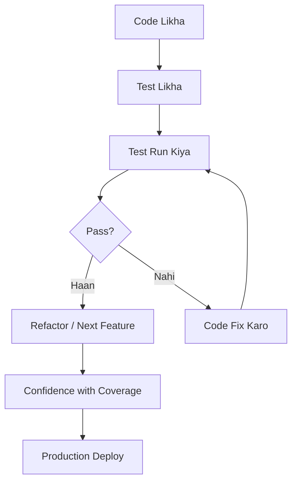
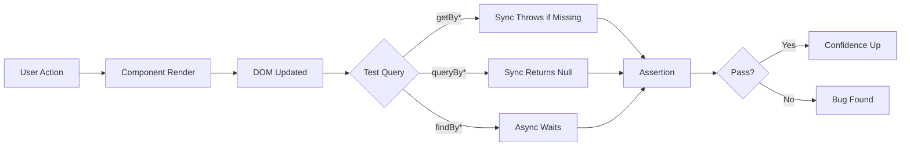
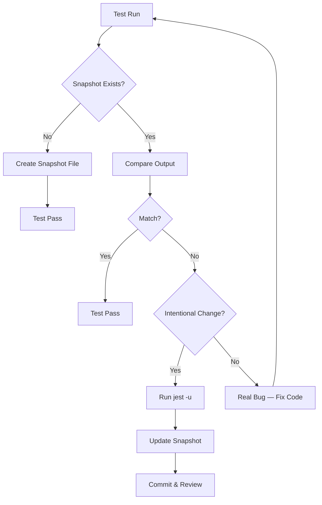
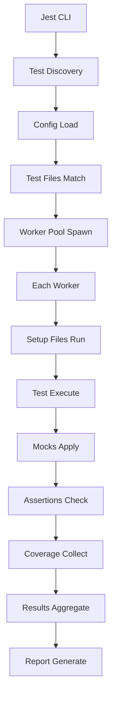
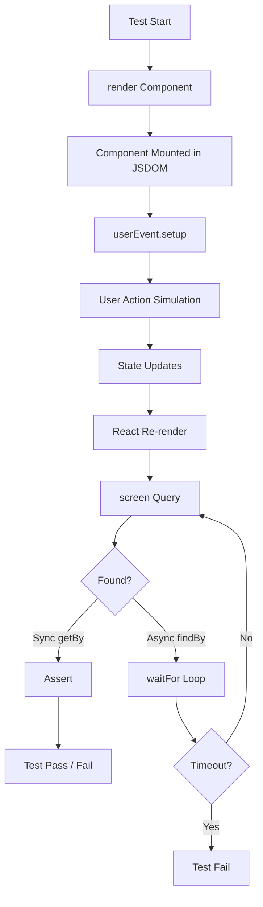

# Frontend Testing

Dekh bhai, testing basically tumhare code ka safety net hai. Tu naya feature add karta hai, koi cheez break ho jaati hai aur tujhe pata bhi nahi chalta — testing yahi rokta hai. Frontend mein testing thoda alag flavor ka hota hai because tu sirf functions test nahi kar raha, tu DOM test kar raha hai, user interactions test kar raha hai, async behavior test kar raha hai, aur kabhi kabhi to network calls bhi mock karke test karta hai.

Most product companies (Atlassian, Razorpay, Swiggy, Microsoft, Google) interview mein testing ke baare mein deeply puchti hain. Reason simple hai — agar tu apna code test nahi kar sakta, to tu confidence ke saath production mein deploy nahi kar sakta. Aur jab tera dashboard 2 lakh users use kar rahe hote hain, ek chhota sa untested edge case poora business gira sakta hai. Ek baar Razorpay ke ek payment flow mein untested race condition aaya tha — 30 minutes ke liye payments fail hue, lakhon ka loss. Tabse unka rule hai — har critical path tested.

Is module mein hum chaar major topics cover karenge — Unit testing (pure logic level), Component testing (React Testing Library philosophy), Snapshot testing (kab use karein, kab nahi), aur Tools (Jest + RTL deep dive). End tak tu bata sakega ki kis cheez ke liye kaunsa test likhna hai aur kyun. Chal shuru karte hain.

---

## 1. Unit Testing

### 1.1 Pure Functions, Mocking Basics, Fast Feedback Loop

#### Definition

Unit testing matlab apne code ke smallest testable unit ko isolate karke test karna. "Smallest unit" usually ek function ya ek class hota hai. Pure function woh hota hai jo same input ke liye same output deta hai, aur koi side effect nahi karta — na kisi global variable ko modify karta hai, na DOM touch karta hai, na network call karta hai. Pure functions test karna sabse aasaan hai because woh deterministic hote hain.

Mocking matlab — jab tera function kisi external dependency pe rely kar raha ho (jaise API call, database, ya kisi aur module ka function), to test mein us dependency ko fake "mock" object se replace kar dena. Isse test fast bhi rehta hai aur deterministic bhi.

Fast feedback loop matlab — tu code likhta hai, save karta hai, aur 1-2 second mein test result aa jaata hai. Yahi developer productivity ka secret hai. Agar test 30 second lagaye to tu chai peene chala jaayega aur flow toot jaayega.

#### Why?

Pehla — bugs jaldi pakad mein aate hain. Production mein bug fix karne ka cost 100x hota hai compared to development time mein. Yeh well-known industry stat hai (IBM ka research bhi yahi bolta hai).

Doosra — refactoring ka confidence milta hai. Bina tests ke tu kabhi bhi 5 saal purana code touch karne se darega. Tests honge to tu boldly refactor kar sakta hai — agar kuch toota, test red ho jaayega.

Teesra — documentation ke roop mein kaam karta hai. Naya banda team mein aaya, woh tests padh ke samajh jaayega ki function expected behaviour kya hai.

Chautha — fast feedback loop developer ke flow ko maintain karta hai. TDD (Test Driven Development) follow karne wale log isi feedback loop ke fan hote hain.

#### How?

Chal ek pure function likhte hain — discount calculator. Yeh ecommerce mein bahut common hai.

```javascript
// file: src/utils/discount.js

// Pure function — same input pe same output, koi side effect nahi
export function calculateDiscount(price, discountPercent, isPremiumUser) {
  // Edge case handle karte hain pehle
  if (price < 0) {
    throw new Error('Price negative nahi ho sakta');
  }
  if (discountPercent < 0 || discountPercent > 100) {
    throw new Error('Discount 0 se 100 ke beech mein hona chahiye');
  }

  // Premium user ko extra 5% milta hai
  let effectiveDiscount = discountPercent;
  if (isPremiumUser) {
    effectiveDiscount = Math.min(discountPercent + 5, 100);
  }

  // Final price calculate karte hain
  const discountAmount = (price * effectiveDiscount) / 100;
  const finalPrice = price - discountAmount;

  // Round off to 2 decimal places
  return Math.round(finalPrice * 100) / 100;
}
```

Ab iska Jest test:

```javascript
// file: src/utils/discount.test.js
import { calculateDiscount } from './discount';

describe('calculateDiscount', () => {
  // Happy path test
  test('normal user ko correct discount lagana chahiye', () => {
    // 1000 ka 10% discount = 100, final = 900
    expect(calculateDiscount(1000, 10, false)).toBe(900);
  });

  test('premium user ko extra 5% milna chahiye', () => {
    // 1000 ka 10% + 5% = 15% = 150 discount, final = 850
    expect(calculateDiscount(1000, 10, true)).toBe(850);
  });

  // Edge cases — yeh interview mein bahut points dilate hain
  test('discount cap 100% pe lagna chahiye for premium', () => {
    // 98% + 5% = 103%, but capped at 100%
    expect(calculateDiscount(1000, 98, true)).toBe(0);
  });

  test('zero price ke liye zero return karna chahiye', () => {
    expect(calculateDiscount(0, 50, true)).toBe(0);
  });

  // Error cases
  test('negative price pe error throw karna chahiye', () => {
    expect(() => calculateDiscount(-100, 10, false)).toThrow('Price negative nahi ho sakta');
  });

  test('invalid discount percent pe error throw karna chahiye', () => {
    expect(() => calculateDiscount(1000, 150, false)).toThrow();
    expect(() => calculateDiscount(1000, -5, false)).toThrow();
  });
});
```

Ab mocking ka example dekhte hain. Suppose tera function ek API call karta hai:

```javascript
// file: src/services/userService.js
import axios from 'axios';

export async function fetchUserOrders(userId) {
  // Real API call — test mein isko mock karenge
  const response = await axios.get(`/api/users/${userId}/orders`);

  // Sirf paid orders return karenge
  return response.data.filter(order => order.status === 'paid');
}
```

```javascript
// file: src/services/userService.test.js
import axios from 'axios';
import { fetchUserOrders } from './userService';

// Pura axios module mock kar diya — koi real network call nahi hogi
jest.mock('axios');

describe('fetchUserOrders', () => {
  // Har test ke pehle mock reset karte hain — warna leakage hoga
  beforeEach(() => {
    jest.clearAllMocks();
  });

  test('paid orders ko filter karke return karna chahiye', async () => {
    // Mock response set karte hain
    const mockOrders = [
      { id: 1, status: 'paid', amount: 500 },
      { id: 2, status: 'pending', amount: 300 },
      { id: 3, status: 'paid', amount: 700 },
    ];
    axios.get.mockResolvedValueOnce({ data: mockOrders });

    const result = await fetchUserOrders('user_123');

    // Verify karte hain ki sahi URL hit hua
    expect(axios.get).toHaveBeenCalledWith('/api/users/user_123/orders');
    // Sirf paid orders return hone chahiye
    expect(result).toHaveLength(2);
    expect(result.every(order => order.status === 'paid')).toBe(true);
  });

  test('API failure pe error throw karna chahiye', async () => {
    axios.get.mockRejectedValueOnce(new Error('Network error'));
    await expect(fetchUserOrders('user_123')).rejects.toThrow('Network error');
  });
});
```

#### Real-life Example

Soch tu ek chef hai aur tu ek naya gulab jamun recipe try kar raha hai. Pure function matlab — same ingredients, same temperature, same time, to har baar same gulab jamun banega. Mocking matlab — tujhe real customer ko serve karne se pehle, tu khud taste karke verify karega ki recipe sahi hai. Customer ki jagah tu khud "mock customer" ban gaya. Fast feedback loop matlab — agar tu har gulab jamun ke baad 2 ghante wait kare cooling ke liye, tu kabhi recipe perfect nahi karega. Quick taste test, quick adjust, repeat.

Ya phir ek aur analogy — Dabbawala ka system. Mumbai ke dabbawale daily 2 lakh tiffins deliver karte hain with 99.9999% accuracy. Unka system har step pe verify karta hai (color codes, route checks). Yahi unit testing hai — har chhota step verify karte chalo, end mein system reliable rahega.

#### Diagram



#### Interview Q&A

**Q1: Pure function aur impure function mein difference kya hai? Testing ke perspective se kyun matter karta hai?**

Pure function woh hota hai jo (a) same input ke liye hamesha same output deta hai, aur (b) koi side effect nahi karta. Impure function global state modify karta hai, network call karta hai, DOM access karta hai, ya `Math.random()` / `Date.now()` use karta hai. Testing perspective se pure function dream hai — tu just input do, output check karo, ho gaya. Impure function ke saath tujhe pehle environment setup karna padta hai, dependencies mock karni padti hain, aur tests flaky ho sakte hain.

For example, `calculateTax(amount, rate)` pure hai. But `saveTaxToDB(amount)` impure hai — DB pe depend karta hai. Senior engineers always functional core, imperative shell pattern follow karte hain — business logic pure functions mein, side effects boundary pe. Isse 80% code easily testable ho jaata hai.

Real example — Razorpay ka payment validator pure functions mein likha hai (amount validation, currency check, signature verify). Database calls aur API calls separate layer mein hain. Result? Unka core test suite 5000+ tests 30 second mein run hota hai.

**Q2: Mocking ke kya disadvantages hain? Kab mock nahi karna chahiye?**

Mocking ke teen major problems hain. Pehla — over-mocking. Agar tu sab kuch mock kar dega, to tu apne mocks test kar raha hai, real code nahi. Doosra — implementation coupling. Mock karte time tu specific function calls expect karta hai (`expect(api.get).toHaveBeenCalledWith(...)`). Agar tu refactor karega aur internal API change karega, to test break hoga even though behavior same hai. Teesra — mocks reality se diverge ho sakte hain. Tera mock kehta hai API 200 return karta hai, but real API 500 throw karti hai — test pass, production fail.

Best practice — sirf external boundaries mock karo (HTTP, DB, file system, time). Apne code ke andar wale modules ko generally mock mat karo. Agar tu apne hi function ko mock kar raha hai, sign hai ki tera architecture coupling zyada hai aur tujhe extract karna chahiye.

Kab nahi mock karna — pure utility functions, in-memory data structures, simple validators. Inhe direct test karo. Mock sirf tab jab dependency slow ho ya non-deterministic ho.

**Q3: Fast feedback loop ke liye kya practices follow karte ho?**

Pehla — tests ko parallelize karna. Jest by default workers spawn karta hai (`--maxWorkers=50%`). Doosra — watch mode (`jest --watch`). Sirf changed files ke tests run hote hain. Teesra — focused tests during development (`describe.only`, `test.only`). Sirf jis area pe kaam kar rahe ho woh run karo. Chautha — slow tests ko separate suite mein daalo. Integration tests aur E2E tests separately run karo, unit tests CI ke har push pe run karo.

Mein personally TDD strict follow karta hu critical logic ke liye — pehle test likhta hu (red), phir minimal code likhta hu (green), phir refactor karta hu. Iska feedback loop 5-10 second ka rehta hai. 8 ghante mein 50-100 micro-iterations ho jaate hain — quality dramatically improves.

**Q4: Code coverage 100% achieve karna chahiye ya nahi?**

Yeh classic trap question hai. Answer hai — coverage important hai but goal nahi hai. 100% coverage matlab har line execute hui test mein, but yeh guarantee nahi karta ki har case tested hai. For example, `if (x > 0) return 'positive';` ek test se 100% line coverage de dega, but tu negative aur zero case miss kar gaya.

Industry mein generally 70-80% coverage healthy maana jaata hai with focus on critical paths having 95%+. Atlassian, Microsoft jaisi companies mein critical billing/auth code 100% coverage maintain karte hain because woh business critical hai. UI components mein 60-70% bhi acceptable hai.

Better metric hai mutation testing (Stryker.js) — tools jo deliberately tera code break karte hain (mutate) aur dekhte hain ki tests catch karte hain ya nahi. Yeh real test quality measure karta hai. Coverage just floor hai, ceiling nahi.

---

## 2. Component Testing

### 2.1 React Testing Library Philosophy — Test Behavior, Not Implementation; Queries (getBy, findBy, queryBy)

#### Definition

Component testing matlab tu apne React component ko render karta hai (virtual DOM mein), uske saath interact karta hai (click, type, etc.), aur verify karta hai ki UI expected behavior dikha raha hai. React Testing Library (RTL) ka core philosophy hai — "Test the way your user uses your app." Matlab tu tab tak test mat likh jab tak tu user perspective se nahi soch raha.

Old school Enzyme library tujhe component ke internal state aur props directly access karne deti thi. RTL bolti hai — bhul ja yeh sab. User ko `useState` ka pata nahi hai. User ko bas dikhta hai — button hai, click karne pe popup khulta hai. Bas wahi test kar.

Queries teen flavors mein aati hain — `getBy*` (sync, throws if not found), `queryBy*` (sync, returns null if not found), aur `findBy*` (async, waits for element to appear).

#### Why?

Pehla — tests stable rehte hain refactoring ke baad. Agar tu `useState` se `useReducer` mein switch kare, tera test break nahi hoga because test sirf UI behavior dekh raha hai, internal state nahi.

Doosra — tests confidence dete hain ki app actually user ke liye kaam karta hai. Implementation tests sirf yeh batate hain ki tera code "kuch karta hai", behavior tests batate hain ki "sahi karta hai".

Teesra — accessibility automatically improve hoti hai. RTL `getByRole`, `getByLabelText` jaise queries promote karti hai jo accessibility tree use karti hain. Agar tu yeh queries use karega, tujhe forced hai accessible code likhne ke liye. Win-win.

#### How?

Ek LoginForm component banate hain:

```tsx
// file: src/components/LoginForm.tsx
import { useState } from 'react';

interface LoginFormProps {
  onLogin: (email: string, password: string) => Promise<void>;
}

export function LoginForm({ onLogin }: LoginFormProps) {
  // State management — RTL test mein yeh expose nahi hoga
  const [email, setEmail] = useState('');
  const [password, setPassword] = useState('');
  const [error, setError] = useState<string | null>(null);
  const [loading, setLoading] = useState(false);

  const handleSubmit = async (e: React.FormEvent) => {
    e.preventDefault();
    setError(null);

    // Basic validation — empty check
    if (!email || !password) {
      setError('Email aur password dono required hain');
      return;
    }

    setLoading(true);
    try {
      await onLogin(email, password);
    } catch (err) {
      setError('Login failed. Credentials check karo.');
    } finally {
      setLoading(false);
    }
  };

  return (
    <form onSubmit={handleSubmit}>
      <label htmlFor="email">Email</label>
      <input
        id="email"
        type="email"
        value={email}
        onChange={(e) => setEmail(e.target.value)}
      />

      <label htmlFor="password">Password</label>
      <input
        id="password"
        type="password"
        value={password}
        onChange={(e) => setPassword(e.target.value)}
      />

      <button type="submit" disabled={loading}>
        {loading ? 'Logging in...' : 'Login'}
      </button>

      {error && <p role="alert">{error}</p>}
    </form>
  );
}
```

Ab RTL ke saath proper test:

```tsx
// file: src/components/LoginForm.test.tsx
import { render, screen } from '@testing-library/react';
import userEvent from '@testing-library/user-event';
import { LoginForm } from './LoginForm';

describe('LoginForm', () => {
  test('user fields fill karke submit kar sakta hai', async () => {
    // userEvent setup karte hain — yeh real user interactions simulate karta hai
    const user = userEvent.setup();
    const mockLogin = jest.fn().mockResolvedValueOnce(undefined);

    render(<LoginForm onLogin={mockLogin} />);

    // getByLabelText use kar rahe hain — accessibility friendly query
    const emailInput = screen.getByLabelText(/email/i);
    const passwordInput = screen.getByLabelText(/password/i);
    const submitButton = screen.getByRole('button', { name: /login/i });

    // User actions simulate karte hain
    await user.type(emailInput, 'rahul@example.com');
    await user.type(passwordInput, 'secret123');
    await user.click(submitButton);

    // Verify karte hain ki onLogin sahi args ke saath call hua
    expect(mockLogin).toHaveBeenCalledWith('rahul@example.com', 'secret123');
    expect(mockLogin).toHaveBeenCalledTimes(1);
  });

  test('empty fields pe error dikhana chahiye', async () => {
    const user = userEvent.setup();
    const mockLogin = jest.fn();

    render(<LoginForm onLogin={mockLogin} />);

    // Bina kuch type kiye submit kar diya
    await user.click(screen.getByRole('button', { name: /login/i }));

    // role="alert" wale element ko dhundte hain
    const errorMessage = screen.getByRole('alert');
    expect(errorMessage).toHaveTextContent(/email aur password dono required hain/i);

    // onLogin call nahi hona chahiye
    expect(mockLogin).not.toHaveBeenCalled();
  });

  test('loading state dikhna chahiye during submit', async () => {
    const user = userEvent.setup();
    // Yeh promise resolve nahi karenge — pending rakhenge
    let resolveLogin: () => void;
    const mockLogin = jest.fn(
      () => new Promise<void>((resolve) => { resolveLogin = resolve; })
    );

    render(<LoginForm onLogin={mockLogin} />);

    await user.type(screen.getByLabelText(/email/i), 'a@b.com');
    await user.type(screen.getByLabelText(/password/i), 'pass');
    await user.click(screen.getByRole('button', { name: /login/i }));

    // Button text "Logging in..." mein change ho gaya hoga
    expect(screen.getByRole('button')).toHaveTextContent(/logging in/i);
    expect(screen.getByRole('button')).toBeDisabled();

    // Ab promise resolve karte hain
    resolveLogin!();
  });

  test('API failure pe error message dikhna chahiye', async () => {
    const user = userEvent.setup();
    const mockLogin = jest.fn().mockRejectedValueOnce(new Error('Invalid creds'));

    render(<LoginForm onLogin={mockLogin} />);

    await user.type(screen.getByLabelText(/email/i), 'a@b.com');
    await user.type(screen.getByLabelText(/password/i), 'wrong');
    await user.click(screen.getByRole('button', { name: /login/i }));

    // findBy* async hai — yeh wait karega element appear hone tak
    const errorAlert = await screen.findByRole('alert');
    expect(errorAlert).toHaveTextContent(/login failed/i);
  });

  test('queryBy null return karta hai jab element absent ho', () => {
    render(<LoginForm onLogin={jest.fn()} />);

    // Initially error nahi hai — queryByRole null return karega
    const errorAlert = screen.queryByRole('alert');
    expect(errorAlert).toBeNull();

    // getByRole hota to throw karta — isiliye queryBy use karte hain
    // assertion-of-absence ke liye
  });
});
```

Queries summary table:

| Query Type | Match Found | Match Not Found | Async? | Use Case |
|-----------|-------------|-----------------|--------|----------|
| `getBy*` | Element return | Throws error | No | Element should be present |
| `queryBy*` | Element return | Returns null | No | Assertion of absence |
| `findBy*` | Promise resolves | Promise rejects (after timeout) | Yes | Wait for async element |
| `getAllBy*` | Array return | Throws error | No | Multiple elements |
| `findAllBy*` | Promise → array | Promise rejects | Yes | Multiple async elements |

Query priority (RTL recommendation order):
1. `getByRole` (best — accessibility tree)
2. `getByLabelText` (forms ke liye)
3. `getByPlaceholderText`
4. `getByText` (non-interactive elements)
5. `getByDisplayValue`
6. `getByAltText` (images)
7. `getByTitle`
8. `getByTestId` (last resort)

#### Real-life Example

Imagine tu ek restaurant manager hai aur tu naya waiter train kar raha hai. Implementation testing matlab tu yeh check kare ki "waiter ne left hand se plate uthayi ya right hand se" — irrelevant. Behavior testing matlab tu check kare ki "customer ko time pe sahi food mila ya nahi" — yeh matter karta hai.

RTL bolti hai — agar customer khush hai (UI sahi dikh raha hai aur sahi behave kar raha hai), to internal mechanics matter nahi karte. Tu kal waiter ko trolley dega instead of plates, customer ko farak nahi padega — same way refactoring component internals shouldn't break tests.

Queries ke liye analogy — `getBy` matlab "Mujhe definitely chahiye, nahi mila to bhadak jaaunga." `queryBy` matlab "Hai ya nahi check karna hai, dono cases acceptable hain." `findBy` matlab "Aayega zaroor, bas thoda wait karna padega" — jaise tu Swiggy pe khana order karta hai, 30 min wait karta hai, phir aata hai.

#### Diagram



#### Interview Q&A

**Q1: RTL aur Enzyme mein fundamental difference kya hai? Industry kyun RTL ki taraf shift hui?**

Enzyme component ke implementation details expose karti thi — `wrapper.state()`, `wrapper.instance()`, shallow rendering, `wrapper.find('MyComponent').prop('foo')`. Yeh sab internal hai. Result yeh hota tha ki tu refactoring karta to tests break ho jaate even though user-facing behavior unchanged tha.

RTL ne paradigm flip kar diya — sirf woh test karo jo user dekhta hai aur karta hai. Internal state, lifecycle methods, component tree structure — yeh sab off-limits hai. Side effect yeh hai ki tests slow ho jaate hain (full mount required, no shallow), but reliable bahut zyada hote hain.

Industry shift ke teen reasons — (1) Hooks aaye, class components decline hue, Enzyme ne hooks support late add kiya. (2) React 18 concurrent features ke saath shallow rendering reliable nahi raha. (3) Kent C. Dodds (RTL author) ne strong philosophical case banaya — "the more your tests resemble the way your software is used, the more confidence they can give you." Yeh quote literally har testing meetup mein quote hota hai.

**Q2: `getBy`, `queryBy`, `findBy` ka use case kab kis ka hai? Concrete examples do.**

`getBy` use karo jab element definitely present hona chahiye. For example login form mein email input always render hota hai — `getByLabelText('Email')`. Agar nahi mila, fail karo loudly.

`queryBy` use karo sirf assertion-of-absence ke liye. For example, error message tab dikhta hai jab API fail ho. Initially absent hai, so `expect(screen.queryByRole('alert')).toBeNull()`. Agar tu yahan `getBy` use karega, test crash ho jaayega.

`findBy` use karo jab element async aane wala hai. Jaise API call ke baad data render hota hai — `await screen.findByText('Welcome Rahul')`. Yeh internally `waitFor` use karta hai, by default 1000ms timeout. `findBy` essentially `getBy + waitFor` ka shortcut hai.

Common bug — log `await` use nahi karte `findBy` ke saath, then test pass hota hai falsely (Promise object truthy hota hai). ESLint rule `testing-library/await-async-query` is bug ko catch karta hai.

**Q3: `userEvent` aur `fireEvent` mein kya difference hai?**

`fireEvent` low-level DOM event dispatcher hai. `fireEvent.click(button)` literally `dispatchEvent` call karta hai. Yeh single event fire karta hai, real user behavior simulate nahi karta.

`userEvent` higher level abstraction hai jo realistic user interaction simulate karta hai. For example `user.click(button)` actually `pointerdown`, `mousedown`, `pointerup`, `mouseup`, `click` — saari events sequence mein fire karta hai, just like real browser. `user.type(input, 'hello')` har character ke liye `keydown`, `keypress`, `input`, `keyup` events fire karta hai.

Practical impact — `fireEvent.change(input, { target: { value: 'hello' } })` instantly value set kar deta hai, but real user typing mein har keystroke ke validation logic test nahi hota. `userEvent.type` se tu actually validation, debouncing, autofocus shifting — yeh sab edge cases catch karta hai.

RTL v14+ mein `userEvent.setup()` mandatory hai before each test (or use `userEvent.setup()` per test). Modern best practice — `userEvent` use karo unless tujhe specifically low-level event chahiye.

**Q4: Component tests slow ho jaate hain large codebase mein. Optimize kaise karoge?**

Pehla — Jest configuration tune karo. `testEnvironment: 'jsdom'` heavy hai. Agar tera test pure logic hai (no DOM), `node` environment use karo — 5-10x faster. RTL specifically requires jsdom, but utility tests `node` mein chala sakte ho.

Doosra — `testEnvironmentOptions` mein selectively load karo. JSDOM by default bahut sare APIs load karta hai. `customExportConditions: ['node', 'node-addons']` se faster startup.

Teesra — parallelize karo. `--maxWorkers=50%` (CI), `--maxWorkers=4` (local). But CI shared runner pe over-parallelize mat karo.

Chautha — heavy mocks shared rakhonge. `jest.setup.js` mein common mocks (next/router, next/image, intersection observer) ek baar setup karo, har test mein dobara mat karo.

Paancha — selective execution. Modified files ke tests sirf run karo development mein (`--onlyChanged`). CI mein full suite, but split across multiple shards (e.g., 4 parallel jobs) and merge coverage.

Atlassian ne apna 50000+ test suite originally 45 minute le raha tha. Jest config tuning + sharding + caching layer add karke 8 minute pe le aaye. Yeh real-world impact hai.

---

## 3. Snapshot Testing

### 3.1 When Useful, When Dangerous, Snapshot Maintenance

#### Definition

Snapshot testing matlab — tu apne component ya data structure ka serialized form generate karta hai (JSON ya HTML-like string), aur isse file mein store karta hai. Next time test run hota hai, current output ko stored snapshot se compare karta hai. Mismatch hua to test fail.

Jest mein `expect(component).toMatchSnapshot()` likhne se `__snapshots__/` folder mein ek `.snap` file ban jaati hai. Yeh file Git mein commit karte hain — taaki team ke saath share ho.

Inline snapshots bhi hote hain — `toMatchInlineSnapshot()` — jismein snapshot test file ke andar hi inline likhda hua hota hai. Yeh small snapshots ke liye better hai.

#### Why?

Use case — agar tera component complex JSX render karta hai aur tujhe verify karna hai ki output unintentionally change na ho. Manual assertion likhna painful hai (ek-ek element check karna), snapshot ek shortcut hai.

Doosra use case — error messages, API response shapes, configuration objects ka snapshot. In cheezon ka exact structure matter karta hai.

But — snapshot testing dangerous bhi hai. Beginners snapshot ko silver bullet samajh lete hain aur 100 snapshots commit kar dete hain bina dekhe. Phir koi bhi UI change pe 100 snapshots fail hote hain, log "Update all snapshots" press karke pass karwa lete hain — testing ka point hi gaya.

#### How?

Achha snapshot example — error response shape lock karna:

```javascript
// file: src/api/errorMapper.test.js
import { mapApiError } from './errorMapper';

describe('mapApiError', () => {
  test('500 error ka standard shape generate karta hai', () => {
    const apiError = {
      status: 500,
      data: { message: 'Internal Server Error', traceId: 'abc-123' },
    };

    const mapped = mapApiError(apiError);

    // Snapshot — agar shape change hua future mein, fail hoga
    // Yeh mostly stable rehne wala data structure hai
    expect(mapped).toMatchInlineSnapshot(`
      {
        "code": "SERVER_ERROR",
        "displayMessage": "Kuch galat ho gaya, thodi der mein try karo",
        "isRetryable": true,
        "severity": "high",
        "traceId": "abc-123",
      }
    `);
  });
});
```

Component snapshot — careful approach:

```tsx
// file: src/components/Button/Button.test.tsx
import { render } from '@testing-library/react';
import { Button } from './Button';

describe('Button snapshot', () => {
  test('primary variant ka snapshot', () => {
    const { container } = render(
      <Button variant="primary" size="medium">
        Click Me
      </Button>
    );

    // container.firstChild — sirf button element ka snapshot, full DOM nahi
    // Smaller, focused snapshot — review karna easy
    expect(container.firstChild).toMatchInlineSnapshot(`
      <button
        class="btn btn-primary btn-medium"
        type="button"
      >
        Click Me
      </button>
    `);
  });
});
```

Dangerous snapshot — **mat karo yeh:**

```tsx
// BAD: pura page snapshot
test('homepage renders correctly', () => {
  const { container } = render(<HomePage />);
  // Yeh 500 line ka snapshot banayega — useless
  expect(container).toMatchSnapshot();
});
```

Yeh kyun bura hai? Pehla — 500 line ka snapshot review karte time koi nahi padhta, bas "u" press karke update kar deta hai. Doosra — har minor change pe diff bahut bada hota hai. Teesra — snapshot mein dynamic data (timestamps, IDs, random values) hua to test flaky ho jaata hai.

Better approach — snapshots focused rakhonge:

```tsx
test('user card displays name and email', () => {
  const user = { id: 1, name: 'Rahul', email: 'rahul@example.com' };
  render(<UserCard user={user} />);

  // Specific assertions — clear intent
  expect(screen.getByRole('heading')).toHaveTextContent('Rahul');
  expect(screen.getByText('rahul@example.com')).toBeInTheDocument();

  // Optionally, sirf ek small section ka snapshot for structure lock
  expect(screen.getByTestId('user-badge')).toMatchInlineSnapshot(`
    <span data-testid="user-badge" class="badge-active">
      Active
    </span>
  `);
});
```

Dynamic data handle karne ke liye serializers:

```javascript
// jest.config.js
module.exports = {
  snapshotSerializers: ['./serializers/dateSerializer.js'],
};

// serializers/dateSerializer.js
module.exports = {
  // Date objects ko consistent string mein convert karte hain
  test: (val) => val instanceof Date,
  print: () => '"<DATE>"',
};
```

Ya inline mein property matchers:

```javascript
test('user creation response', () => {
  const user = createUser({ name: 'Rahul' });

  expect(user).toMatchSnapshot({
    // id aur createdAt dynamic hain — sirf type check karenge
    id: expect.any(String),
    createdAt: expect.any(Date),
    // baaki properties exact match honi chahiye
  });
});
```

Snapshot maintenance rules:

1. **Snapshot fail hua to padho.** Diff actually review karo. Agar intentional change hai, update karo (`jest -u`). Agar unintentional, code fix karo.
2. **Snapshot ko PR mein review karo.** Reviewer ko clearly samajh aana chahiye ki kyun change hua.
3. **Inline snapshots prefer karo small snapshots ke liye.** Same file mein dikhna review easier banata hai.
4. **Snapshots ko version control mein commit karo.** Bina commit ke point hi nahi hai.
5. **Stale snapshots clean karo.** `jest --ci` mein agar koi snapshot ka usage delete ho gaya, woh "obsolete" mark hota hai. Time-to-time `jest -u` se cleanup karo.

#### Real-life Example

Snapshot testing soch ke dekho — tu ek artist hai aur tu apni painting ka photo har week leta hai. Photo dekh ke tu confirm karta hai ki kuch unintentional change to nahi hua (paani gir gaya, dust accumulate ho gaya). Yeh useful hai.

But agar tu pure museum ka panoramic photo har week leta hai, aur kal photo mein ek light bulb fuse ho gaya, to tu poora panorama review karega? Nahi yaar. Tu specific paintings ke focused photos lega — task-specific snapshots.

Dangerous snapshot example — Atlassian ki ek team ne Confluence ke pure page renderer ka snapshot le liya. Snapshot 8000 line ka tha. Agle 6 mahine mein 50 PRs mein "snapshot updated" diff aaya, koi nahi padhta tha. Phir ek PR mein actual visual bug introduce ho gaya — snapshot pass ho gaya because reviewer ne 8000 line ka diff scroll kar diya. Lesson — snapshot kaam tab karta hai jab tu actually padhe.

#### Diagram



#### Interview Q&A

**Q1: Snapshot testing kab use karna chahiye aur kab avoid karna chahiye?**

Use karo jab — (a) data shapes lock karna ho jo rarely change ho (API error mappers, config transformations), (b) small focused components ka structure verify karna ho, (c) generated code (parser output, AST) test karna ho. In cases mein snapshot tujhe boilerplate assertion likhne se bachata hai.

Avoid karo jab — (a) component bahut bada hai (>50 lines of rendered output), (b) component frequently change hota hai, (c) component mein dynamic data hai (dates, IDs, random values), (d) tu actually behavior test karna chahta hai (use RTL queries instead). 

Practical rule — agar tu snapshot dekh ke 30 second mein samajh nahi paaya ki kya ho raha hai, snapshot useless hai. Granular assertions se replace karo.

**Q2: Snapshot tests flaky ho rahe hain — debug kaise karoge?**

Step 1 — dynamic data identify karo. Common culprits — `Date.now()`, `Math.random()`, UUIDs, system locale-dependent date strings. Snapshot ko deterministic banane ke liye yeh sab mock karo (`jest.useFakeTimers()`, mock UUID generator).

Step 2 — environment differences check karo. Local mein pass, CI mein fail — usually node version difference ya OS-specific line endings. `.gitattributes` mein `*.snap text eol=lf` set karo.

Step 3 — order-dependent state check karo. Agar snapshot global state pe depend karta hai jo previous tests modify karte hain, fix karo. Tests independent hone chahiye — `beforeEach` mein clean state ensure karo.

Step 4 — async issues. Agar snapshot async render ke before le rahe ho, partial output capture hoga. `await waitFor(...)` use karo before snapshot.

**Q3: "Update all snapshots" anti-pattern kya hai? Team mein kaise prevent karoge?**

Anti-pattern yeh hai ki developers snapshot fail hone pe blindly `jest -u` chala dete hain bina diff dekhe. Result — real bugs mask ho jaate hain. Maine ek startup mein dekha tha jahan login button ka color accidentally background color jaisa ho gaya tha (invisible button), snapshot test pass ho gaya because update karte time koi nahi padha.

Prevention strategies — (1) PR review process mein snapshot diffs ko explicitly call out. Reviewer ko har snapshot change explain karna padega PR description mein. (2) Snapshot files ko code owner protected banao — UI team ke approve bina merge na ho. (3) Smaller snapshots prefer karo — bade snapshots review karna painful, isiliye log skip karte hain. Inline snapshots ka use karo. (4) Visual regression testing add karo (Chromatic, Percy) — yeh visual diff dikhata hai, log actually dekh paate hain. (5) Mutation testing introduce karo — yeh real test quality measure karta hai.

**Q4: Inline snapshot vs external snapshot — kab kya?**

External snapshot (`toMatchSnapshot()`) — separate `.snap` file mein store hota hai. Use karo jab snapshot bada hai (10+ lines) ya multiple tests mein same structure use ho rahi hai. Disadvantage — context switching karna padta hai test file aur snapshot file ke beech.

Inline snapshot (`toMatchInlineSnapshot()`) — same test file mein literal string ke roop mein. Use karo small snapshots ke liye. Advantage — review easy, context same file mein. Disadvantage — bada snapshot test file ko clutter karta hai.

Personally mein 95% cases mein inline use karta hu. External sirf tab jab snapshot 20+ lines ka ho aur multiple tests mein refer ho. Most senior teams (Stripe, Linear) inline-first approach follow karti hain because PR diffs cleaner hote hain.

---

## 4. Tools

### 4.1 Jest — Config, Matchers, Mocks

#### Definition

Jest Facebook ne banaya tha React ke liye, but ab JS/TS testing ka de-facto standard hai. Iske teen pillar hain — (1) test runner (tests find karta hai, run karta hai, parallelize karta hai), (2) assertion library (`expect`, matchers), (3) mocking framework (`jest.fn`, `jest.mock`, timer mocks).

Config — `jest.config.js` ya `package.json` ke `jest` key mein. Yeh Jest ko batata hai test files kahan dhundhne hain, environment kya hona chahiye, transforms kya use karne hain (TypeScript compile karne ke liye `ts-jest` ya `babel-jest`), aur kaunsi files ignore karni hain.

Matchers — `expect(value).toBe(value)` jaise assertions. Built-in 50+ matchers hote hain, aur tu custom bhi likh sakta hai.

Mocks — function ya module ko fake karne ka mechanism. `jest.fn()` se mock function, `jest.mock('module')` se entire module mock.

#### Why?

Pehla — zero config setup. `npm install jest` aur seedha test likh sakta hai. Other tools (Mocha + Chai + Sinon + Istanbul) mein 4 tools combine karne padte the.

Doosra — speed. Jest watch mode incredible fast hai. Ek 5000 test suite mein agar tu ek file modify kare, sirf related tests run hote hain — under 2 seconds.

Teesra — snapshot testing built-in. Coverage built-in. Mocking built-in. Sab kuch ek tool mein.

Chautha — community. NPM pe `jest-` prefix wale 2000+ packages hain. Har problem ka solution preexisting hai.

#### How?

Complete Jest config for Next.js + TypeScript project:

```javascript
// file: jest.config.js
const nextJest = require('next/jest');

// Next.js ka helper — automatically next.config.js aur .env load karta hai
const createJestConfig = nextJest({
  dir: './',
});

/** @type {import('jest').Config} */
const customJestConfig = {
  // Setup file — har test ke pehle run hota hai
  setupFilesAfterEach: ['<rootDir>/jest.setup.js'],

  // Test environment — DOM tests ke liye jsdom, pure logic ke liye node
  testEnvironment: 'jsdom',

  // Module aliases — Next.js ke @ alias support
  moduleNameMapper: {
    '^@/(.*)$': '<rootDir>/src/$1',
    // CSS imports ko mock karte hain — actual CSS load nahi karenge
    '\\.(css|less|scss)$': 'identity-obj-proxy',
    // Image imports
    '\\.(png|jpg|svg)$': '<rootDir>/__mocks__/fileMock.js',
  },

  // Test file patterns
  testMatch: [
    '**/__tests__/**/*.(ts|tsx|js)',
    '**/*.(test|spec).(ts|tsx|js)',
  ],

  // Coverage config
  collectCoverageFrom: [
    'src/**/*.{ts,tsx}',
    '!src/**/*.d.ts',
    '!src/**/*.stories.tsx',
    '!src/**/index.ts', // barrel files exclude
  ],
  coverageThreshold: {
    global: {
      branches: 75,
      functions: 80,
      lines: 80,
      statements: 80,
    },
  },

  // Performance
  maxWorkers: '50%',
  testTimeout: 10000,
};

module.exports = createJestConfig(customJestConfig);
```

```javascript
// file: jest.setup.js
import '@testing-library/jest-dom'; // custom matchers like toBeInTheDocument

// Mock Next.js router globally
jest.mock('next/navigation', () => ({
  useRouter: () => ({ push: jest.fn(), replace: jest.fn() }),
  usePathname: () => '/',
  useSearchParams: () => new URLSearchParams(),
}));

// Mock IntersectionObserver — JSDOM mein available nahi hota
global.IntersectionObserver = class {
  observe() {}
  unobserve() {}
  disconnect() {}
};

// Reset all mocks before each test
beforeEach(() => {
  jest.clearAllMocks();
});
```

Matchers deep dive:

```javascript
// file: src/utils/matchers.test.js

describe('Jest matchers', () => {
  test('equality matchers', () => {
    // toBe — Object.is comparison (primitive equality)
    expect(2 + 2).toBe(4);

    // toEqual — deep equality (objects, arrays)
    expect({ a: 1, b: 2 }).toEqual({ a: 1, b: 2 });

    // toStrictEqual — toEqual + extra checks (undefined props, types)
    expect({ a: 1 }).toStrictEqual({ a: 1 });
    // toEqual pass karega yeh, toStrictEqual fail
    // expect({ a: 1, b: undefined }).toStrictEqual({ a: 1 });
  });

  test('truthiness matchers', () => {
    expect(true).toBeTruthy();
    expect(null).toBeFalsy();
    expect(undefined).toBeUndefined();
    expect(null).toBeNull();
    expect(NaN).toBeNaN();
  });

  test('number matchers', () => {
    expect(0.1 + 0.2).toBeCloseTo(0.3); // floating point hack
    expect(10).toBeGreaterThan(5);
    expect(5).toBeLessThanOrEqual(5);
  });

  test('string matchers', () => {
    expect('hello world').toMatch(/world/);
    expect('rahul@example.com').toMatch(/^[\w.]+@[\w.]+$/);
  });

  test('array matchers', () => {
    expect([1, 2, 3]).toContain(2);
    expect([{ id: 1 }, { id: 2 }]).toContainEqual({ id: 1 });
    expect([1, 2, 3]).toHaveLength(3);
  });

  test('object matchers', () => {
    const user = { id: 1, name: 'Rahul', email: 'r@x.com' };
    // Partial match — sirf yeh fields verify hote hain
    expect(user).toMatchObject({ name: 'Rahul' });
    // Property existence
    expect(user).toHaveProperty('email');
    expect(user).toHaveProperty('email', 'r@x.com');
  });

  test('exception matchers', () => {
    const throwError = () => { throw new Error('Bad input'); };
    expect(throwError).toThrow();
    expect(throwError).toThrow('Bad input');
    expect(throwError).toThrow(/bad/i);
  });

  test('async matchers', async () => {
    await expect(Promise.resolve(42)).resolves.toBe(42);
    await expect(Promise.reject(new Error('fail'))).rejects.toThrow('fail');
  });
});
```

Mocks deep dive:

```javascript
// file: src/services/notifier.js
import emailService from './emailService';
import smsService from './smsService';

export async function notifyUser(userId, message) {
  const user = await getUser(userId);

  if (user.preferEmail) {
    return emailService.send(user.email, message);
  } else {
    return smsService.send(user.phone, message);
  }
}
```

```javascript
// file: src/services/notifier.test.js
import { notifyUser } from './notifier';
import emailService from './emailService';
import smsService from './smsService';

// Module-level mock — saare functions auto-mocked
jest.mock('./emailService');
jest.mock('./smsService');

describe('notifyUser', () => {
  test('email preference par email service call hota hai', async () => {
    // Specific mock implementation
    emailService.send.mockResolvedValue({ success: true });

    await notifyUser({ preferEmail: true, email: 'a@b.com' }, 'Hello');

    // Verify karte hain
    expect(emailService.send).toHaveBeenCalledWith('a@b.com', 'Hello');
    expect(emailService.send).toHaveBeenCalledTimes(1);
    expect(smsService.send).not.toHaveBeenCalled();
  });

  test('mock function — manual fn() creation', () => {
    // jest.fn() — standalone mock function
    const callback = jest.fn();
    callback('arg1', 'arg2');
    callback('arg3');

    expect(callback).toHaveBeenCalledTimes(2);
    expect(callback.mock.calls[0]).toEqual(['arg1', 'arg2']); // first call args
    expect(callback.mock.calls[1]).toEqual(['arg3']);

    // Return value control
    const calc = jest.fn()
      .mockReturnValueOnce(10)  // first call
      .mockReturnValueOnce(20)  // second call
      .mockReturnValue(30);     // all subsequent
    expect(calc()).toBe(10);
    expect(calc()).toBe(20);
    expect(calc()).toBe(30);
    expect(calc()).toBe(30);
  });

  test('timer mocks — setTimeout / setInterval', () => {
    jest.useFakeTimers();
    const callback = jest.fn();

    setTimeout(callback, 5000);
    expect(callback).not.toHaveBeenCalled();

    // Time fast-forward — actual 5 second wait nahi karna
    jest.advanceTimersByTime(5000);
    expect(callback).toHaveBeenCalled();

    jest.useRealTimers(); // cleanup
  });
});
```

#### Real-life Example

Jest soch ek high-end Swiss army knife hai. Pehle alag-alag tools chahiye the — Mocha (knife), Chai (scissors), Sinon (corkscrew), Istanbul (file). Ek hi handle pe sab kuch — convenient, fast, reliable. Beginner ke liye easy, expert ke liye powerful.

Mocking analogy — bollywood film ka stunt double. Real actor (real API) khatarnaak scenes mein nahi jaata, stunt double (mock) jaata hai. Audience (test) ko farak nahi padta jab tak stunt double convincing acting kare.

#### Diagram



#### Interview Q&A

**Q1: `jest.mock` aur `jest.fn` mein difference kya hai?**

`jest.fn()` ek standalone mock function banata hai. Use karte ho jab tujhe simple callback ya function reference chahiye test mein — for example, component ko `onClick` prop pass karna. Yeh function automatically `mock.calls`, `mock.results` jaise properties expose karta hai.

`jest.mock('module')` poore module ko replace karta hai. Jest hoisting ke through ensure karta hai ki yeh top-level pe execute ho before any imports — isiliye `jest.mock` calls test file ke top pe likhne padte hain (ya `import` ke baad bhi chalta hai due to Babel transform). Module ke saare exports automatically `jest.fn()` ban jaate hain.

Combination common hai — `jest.mock('./api')` se module mock karo, phir `api.fetchUser.mockResolvedValue(...)` se specific behavior set karo.

Edge case — manual mocks `__mocks__` folder mein. Agar `__mocks__/myModule.js` exists, `jest.mock('./myModule')` automatically uska content use karega.

**Q2: Jest config mein `transform` kya karta hai? Babel vs SWC?**

`transform` Jest ko batata hai ki source files ko execute karne se pehle kaise compile karna hai. Modern JS/TS features (JSX, TS types, ES modules) Node directly understand nahi karta — transformer chahiye.

Default option — `babel-jest`. Tera `.babelrc` ya `babel.config.js` use karta hai. Reliable but slow because Babel JS mein likha hua hai.

Alternative — `@swc/jest`. SWC Rust mein likha hai, 5-10x faster. Same Babel functionality (TS, JSX, decorators).

`ts-jest` — TypeScript ke liye dedicated. Type checking bhi karta hai run time pe (slow). Most teams isolated TS check (`tsc --noEmit`) separately run karte hain CI mein, aur Jest mein faster transformer use karte hain.

Next.js ka `next/jest` helper automatically SWC use karta hai (since Next 12+). Yeh sabse fast option hai for Next projects.

**Q3: Test isolation kaise ensure karte ho? Tests dependent na rahein ek doosre pe.**

Pehla — `beforeEach` mein state reset karo. `jest.clearAllMocks()` saare mock call counts reset karta hai. `jest.resetAllMocks()` mock implementations bhi clear karta hai. `jest.restoreAllMocks()` original implementations bhi restore karta hai (spies ke liye).

Doosra — module-level state avoid karo ya carefully reset karo. Agar tera module ka top-level `let cache = {}` hai, har test ke baad cache clear karo using `jest.resetModules()`.

Teesra — global state changes (DOM, localStorage, sessionStorage) ko `afterEach` mein cleanup karo. RTL ka `cleanup` automatically call hota hai modern versions mein.

Chautha — random ordering use karo. `jest --randomize` se tests random order mein chalte hain. Agar tests order-dependent hain, fail karenge — bug expose ho jaayega.

Paancha — async leaks. `--detectOpenHandles` flag se Jest batayega kaunse async operations test ke baad bhi running hain. Common culprits — unmocked timers, unclosed sockets, pending promises.

**Q4: Custom matcher kaise likhte hain? Real example do.**

Custom matchers tab useful hote hain jab tu repeatedly same complex assertion likh raha ho. Example — verify ki ek string valid Indian phone number hai.

```javascript
// file: jest.setup.js
expect.extend({
  toBeValidIndianPhone(received) {
    const phoneRegex = /^(\+91|91|0)?[6-9]\d{9}$/;
    const pass = typeof received === 'string' && phoneRegex.test(received);

    if (pass) {
      return {
        pass: true,
        message: () => `expected ${received} NOT to be a valid Indian phone`,
      };
    } else {
      return {
        pass: false,
        message: () => `expected ${received} to be a valid Indian phone (10 digits, starts 6-9)`,
      };
    }
  },
});

// TypeScript ke liye type augmentation chahiye
declare global {
  namespace jest {
    interface Matchers<R> {
      toBeValidIndianPhone(): R;
    }
  }
}
```

Usage:

```javascript
test('user phone is valid', () => {
  expect('9876543210').toBeValidIndianPhone();
  expect('+919876543210').toBeValidIndianPhone();
  expect('1234567890').not.toBeValidIndianPhone(); // starts with 1, invalid
});
```

`@testing-library/jest-dom` library tons of custom matchers provide karti hai (`toBeInTheDocument`, `toHaveTextContent`, `toBeDisabled`) — yeh sab same mechanism use karti hain.

---

### 4.2 React Testing Library — render, user-event, screen

#### Definition

React Testing Library (RTL) Jest ke saath use hone wali specialized library hai jo React components test karne ke liye optimized hai. Iska "kernel" `dom-testing-library` hai (framework agnostic), aur RTL React-specific bindings provide karta hai.

Three core APIs:
- **`render`** — component ko virtual DOM mein mount karta hai. Returns object with `container`, `rerender`, `unmount`, `baseElement`, and queries.
- **`screen`** — globally accessible queries object. `screen.getByRole(...)` use karke document.body se queries karte hain. Modern best practice — `screen` use karo, render ke return value se queries destructure mat karo.
- **`userEvent`** — realistic user interaction simulator. v14+ mein `userEvent.setup()` mandatory hai before each test.

#### Why?

`render` zaruri hai because Jest ke `jsdom` environment mein React component render karne ke liye mounting needed hai. RTL `render` ReactDOM.createRoot internally use karta hai (React 18+).

`screen` use karne ka reason — code consistency. Different render calls ke beech mein queries share karne ke liye `screen` cleaner hai. Plus jab tu `rerender` use karta hai, queries automatically updated DOM pe kaam karti hain.

`userEvent` is critical because real user interactions test karna chahiye, low-level events nahi. Agar tu `fireEvent.click` use karega, tu missing browser behaviors (focus shifts, hover states) test nahi kar paayega.

#### How?

Complete real-world example — TodoList component:

```tsx
// file: src/components/TodoList.tsx
import { useState } from 'react';

interface Todo {
  id: string;
  text: string;
  done: boolean;
}

export function TodoList() {
  const [todos, setTodos] = useState<Todo[]>([]);
  const [input, setInput] = useState('');
  const [filter, setFilter] = useState<'all' | 'active' | 'done'>('all');

  const addTodo = () => {
    if (!input.trim()) return;
    setTodos([...todos, { id: crypto.randomUUID(), text: input.trim(), done: false }]);
    setInput('');
  };

  const toggleTodo = (id: string) => {
    setTodos(todos.map(t => t.id === id ? { ...t, done: !t.done } : t));
  };

  const deleteTodo = (id: string) => {
    setTodos(todos.filter(t => t.id !== id));
  };

  const filteredTodos = todos.filter(t => {
    if (filter === 'active') return !t.done;
    if (filter === 'done') return t.done;
    return true;
  });

  return (
    <div>
      <h1>My Todos</h1>

      <div role="group" aria-label="Add todo">
        <label htmlFor="todo-input">New todo</label>
        <input
          id="todo-input"
          value={input}
          onChange={(e) => setInput(e.target.value)}
          onKeyDown={(e) => e.key === 'Enter' && addTodo()}
        />
        <button onClick={addTodo}>Add</button>
      </div>

      <div role="group" aria-label="Filter">
        <button onClick={() => setFilter('all')} aria-pressed={filter === 'all'}>All</button>
        <button onClick={() => setFilter('active')} aria-pressed={filter === 'active'}>Active</button>
        <button onClick={() => setFilter('done')} aria-pressed={filter === 'done'}>Done</button>
      </div>

      {filteredTodos.length === 0 ? (
        <p>No todos to show</p>
      ) : (
        <ul>
          {filteredTodos.map(todo => (
            <li key={todo.id}>
              <input
                type="checkbox"
                id={`todo-${todo.id}`}
                checked={todo.done}
                onChange={() => toggleTodo(todo.id)}
              />
              <label htmlFor={`todo-${todo.id}`}>{todo.text}</label>
              <button onClick={() => deleteTodo(todo.id)} aria-label={`Delete ${todo.text}`}>
                Delete
              </button>
            </li>
          ))}
        </ul>
      )}
    </div>
  );
}
```

Comprehensive test:

```tsx
// file: src/components/TodoList.test.tsx
import { render, screen } from '@testing-library/react';
import userEvent from '@testing-library/user-event';
import { TodoList } from './TodoList';

// crypto.randomUUID() jsdom mein available hai (Node 19+), warna mock karte
beforeAll(() => {
  if (!globalThis.crypto?.randomUUID) {
    globalThis.crypto = { randomUUID: () => Math.random().toString() } as any;
  }
});

describe('TodoList', () => {
  test('initially empty state dikhata hai', () => {
    render(<TodoList />);
    expect(screen.getByRole('heading', { name: /my todos/i })).toBeInTheDocument();
    expect(screen.getByText(/no todos to show/i)).toBeInTheDocument();
    // List empty hai to ul render hi nahi hua
    expect(screen.queryByRole('list')).not.toBeInTheDocument();
  });

  test('user todo add kar sakta hai input + button se', async () => {
    const user = userEvent.setup();
    render(<TodoList />);

    const input = screen.getByLabelText(/new todo/i);
    const addButton = screen.getByRole('button', { name: /add/i });

    await user.type(input, 'Buy groceries');
    await user.click(addButton);

    // Todo list mein appear hua
    expect(screen.getByText('Buy groceries')).toBeInTheDocument();
    // Input clear ho gaya
    expect(input).toHaveValue('');
    // "No todos" message gone
    expect(screen.queryByText(/no todos/i)).not.toBeInTheDocument();
  });

  test('Enter key se bhi todo add hota hai', async () => {
    const user = userEvent.setup();
    render(<TodoList />);

    const input = screen.getByLabelText(/new todo/i);
    await user.type(input, 'Read book{Enter}');

    expect(screen.getByText('Read book')).toBeInTheDocument();
  });

  test('empty input pe add nahi hota', async () => {
    const user = userEvent.setup();
    render(<TodoList />);

    await user.click(screen.getByRole('button', { name: /add/i }));
    expect(screen.getByText(/no todos/i)).toBeInTheDocument();

    // Sirf spaces bhi nahi count honi chahiye
    await user.type(screen.getByLabelText(/new todo/i), '   ');
    await user.click(screen.getByRole('button', { name: /add/i }));
    expect(screen.getByText(/no todos/i)).toBeInTheDocument();
  });

  test('todo toggle aur delete kaam karta hai', async () => {
    const user = userEvent.setup();
    render(<TodoList />);

    // Pehle add karte hain
    await user.type(screen.getByLabelText(/new todo/i), 'Test todo');
    await user.click(screen.getByRole('button', { name: /add/i }));

    // Checkbox toggle
    const checkbox = screen.getByRole('checkbox');
    expect(checkbox).not.toBeChecked();
    await user.click(checkbox);
    expect(checkbox).toBeChecked();

    // Delete — aria-label use karke target karte hain
    const deleteBtn = screen.getByRole('button', { name: /delete test todo/i });
    await user.click(deleteBtn);

    // Todo gayab ho gaya
    expect(screen.queryByText('Test todo')).not.toBeInTheDocument();
    expect(screen.getByText(/no todos/i)).toBeInTheDocument();
  });

  test('filter buttons sahi todos dikhate hain', async () => {
    const user = userEvent.setup();
    render(<TodoList />);

    // 3 todos add karte hain, 1 ko done mark karte hain
    const input = screen.getByLabelText(/new todo/i);
    const addBtn = screen.getByRole('button', { name: /^add$/i });

    for (const text of ['Task 1', 'Task 2', 'Task 3']) {
      await user.clear(input);
      await user.type(input, text);
      await user.click(addBtn);
    }

    // Pehla checkbox check karte hain
    const checkboxes = screen.getAllByRole('checkbox');
    await user.click(checkboxes[0]);

    // "Active" filter — sirf 2 dikhne chahiye
    await user.click(screen.getByRole('button', { name: /active/i }));
    expect(screen.queryByText('Task 1')).not.toBeInTheDocument();
    expect(screen.getByText('Task 2')).toBeInTheDocument();
    expect(screen.getByText('Task 3')).toBeInTheDocument();

    // "Done" filter — sirf 1
    await user.click(screen.getByRole('button', { name: /^done$/i }));
    expect(screen.getByText('Task 1')).toBeInTheDocument();
    expect(screen.queryByText('Task 2')).not.toBeInTheDocument();

    // Active button ka aria-pressed false hona chahiye
    expect(screen.getByRole('button', { name: /active/i })).toHaveAttribute('aria-pressed', 'false');
    expect(screen.getByRole('button', { name: /^done$/i })).toHaveAttribute('aria-pressed', 'true');
  });
});
```

Async testing with API call:

```tsx
// file: src/components/UserProfile.tsx
import { useEffect, useState } from 'react';

export function UserProfile({ userId }: { userId: string }) {
  const [user, setUser] = useState<{ name: string; email: string } | null>(null);
  const [loading, setLoading] = useState(true);
  const [error, setError] = useState<string | null>(null);

  useEffect(() => {
    fetch(`/api/users/${userId}`)
      .then(res => {
        if (!res.ok) throw new Error('User not found');
        return res.json();
      })
      .then(data => setUser(data))
      .catch(err => setError(err.message))
      .finally(() => setLoading(false));
  }, [userId]);

  if (loading) return <p>Loading...</p>;
  if (error) return <p role="alert">{error}</p>;
  if (!user) return null;

  return (
    <div>
      <h2>{user.name}</h2>
      <p>{user.email}</p>
    </div>
  );
}
```

```tsx
// file: src/components/UserProfile.test.tsx
import { render, screen } from '@testing-library/react';
import { UserProfile } from './UserProfile';

describe('UserProfile', () => {
  beforeEach(() => {
    // global fetch mock
    global.fetch = jest.fn();
  });

  test('user data load hone tak loading dikhata hai', async () => {
    (global.fetch as jest.Mock).mockResolvedValueOnce({
      ok: true,
      json: async () => ({ name: 'Rahul', email: 'r@x.com' }),
    });

    render(<UserProfile userId="123" />);

    // Initially loading
    expect(screen.getByText(/loading/i)).toBeInTheDocument();

    // findBy* — async query, waits for element
    expect(await screen.findByRole('heading', { name: 'Rahul' })).toBeInTheDocument();
    expect(screen.getByText('r@x.com')).toBeInTheDocument();

    // Loading gayab ho gaya
    expect(screen.queryByText(/loading/i)).not.toBeInTheDocument();
  });

  test('API failure pe error dikhata hai', async () => {
    (global.fetch as jest.Mock).mockResolvedValueOnce({ ok: false });

    render(<UserProfile userId="invalid" />);

    const errorMsg = await screen.findByRole('alert');
    expect(errorMsg).toHaveTextContent(/user not found/i);
  });
});
```

#### Real-life Example

RTL ko soch ke dekho — tu ek QA tester hai jo new banking app test kar raha hai. Tujhe app ke source code se matlab nahi, tu sirf ek user ki tarah app use karta hai. Login screen pe ja, credentials daal, submit karo, balance dikhna chahiye. Internal Redux state ka kya, kaunse hooks use ho rahe — tujhe nahi pata. Yahi RTL philosophy hai.

`screen` matlab tu app screen pe dekh raha hai — `screen.getByRole('button')` matlab "screen pe ek button dhundo." Real life mein bhi tu literally screen pe dekh ke button dhundta hai.

`userEvent` matlab tu actual user actions kar raha hai. `user.click(button)` matlab tu maus uthayega, button pe le jaayega, click karega. `fireEvent.click` matlab tu directly button ke `onClick` ko trigger kar raha hai — yeh teleportation hai, real user behavior nahi.

#### Diagram



#### Interview Q&A

**Q1: `screen` use karna kyun preferred hai destructured queries se?**

`render(<Component />)` ka return value mein queries hoti hain — `const { getByText } = render(...)`. Yeh kaam karta hai but kuch problems hain.

Pehla — har new render mein dobara destructure karna padta hai. Multiple components ya re-renders mein verbose ho jaata hai. `screen.getByText` kahin se bhi kaam karta hai.

Doosra — `screen` document.body pe queries karta hai, jo more accurate hai. Render container sirf component subtree dekhta hai. Agar tera component portal use kare (modal, tooltip), woh body ke bahar render hota hai — destructured queries miss kar dengi, `screen` pakad legi.

Teesra — code review ke liye consistent. Pura codebase same pattern use karta hai. Linting easy.

Exception — `within()` use karo jab tujhe specific subtree mein scope karna ho. Like `within(modal).getByText('Confirm')` — sirf modal ke andar dhundega.

**Q2: `act()` warnings kab aati hain aur kaise resolve karte ho?**

`act()` warning aati hai jab tu state update trigger karta hai but assertion karne se pehle React ko commit karne ka chance nahi deta. JSDOM mein effects synchronous nahi hote, async timing matter karta hai.

RTL automatically `render` aur `userEvent` ke andar `act` wrap karti hai — most cases mein tujhe explicit `act` use nahi karna chahiye.

Common scenarios jahan warning aati hai —
1. Async operation jo test mein await nahi kiya. Solution — `await user.click(...)`, `await screen.findBy*(...)`.
2. State update timer mein ya promise mein hua jo test ne await nahi kiya. Solution — `await waitFor(() => expect(...))`.
3. Component external library use karta hai jo state update karti hai (e.g., react-query background refetch). Solution — wrap in `act` ya configure library to disable background updates in tests.

Anti-pattern — warning ko `console.error` mock karke suppress karna. Yeh real bugs hide karta hai.

**Q3: `waitFor` aur `findBy` mein kya difference hai?**

`findBy*` is essentially `getBy* + waitFor` shortcut. Use karo jab tujhe ek element appear hone ka wait karna hai — `await screen.findByText('Loaded!')`.

`waitFor` general purpose hai — koi bhi assertion eventually pass hone tak wait karta hai. Use karo jab tujhe element ke alawa kuch test karna hai — `await waitFor(() => expect(api.fetch).toHaveBeenCalledTimes(2))`.

Difference timing semantics mein hai. `findBy` element appearance pe focus karta hai — DOM mutation observer use karta hai (efficient). `waitFor` polling karta hai (default 50ms intervals, 1000ms timeout).

Best practices —
- Element appearance ke liye → `findBy`
- Element disappearance ke liye → `waitForElementToBeRemoved`
- Custom assertion ke liye → `waitFor`
- Function call verification ke liye → `waitFor` with `expect(mock).toHaveBeenCalled()`

Avoid karo `waitFor` mein side effects — sirf assertions hone chahiye, kyunki callback multiple times execute hota hai.

**Q4: Provider-wrapped components kaise test karte ho? (Redux, Theme, React Query)**

Custom render utility banao jo saare providers wrap kare. Yeh DRY principle follow karta hai.

```tsx
// file: src/test-utils.tsx
import { render, RenderOptions } from '@testing-library/react';
import { Provider } from 'react-redux';
import { ThemeProvider } from 'styled-components';
import { QueryClient, QueryClientProvider } from '@tanstack/react-query';
import { configureStore } from '@reduxjs/toolkit';
import { rootReducer } from './store';

interface CustomRenderOptions extends Omit<RenderOptions, 'wrapper'> {
  preloadedState?: any;
  theme?: any;
}

export function renderWithProviders(ui: React.ReactElement, options: CustomRenderOptions = {}) {
  const { preloadedState, theme = defaultTheme, ...renderOptions } = options;

  // Har test ke liye fresh store — isolation
  const store = configureStore({ reducer: rootReducer, preloadedState });
  // Fresh query client — caching issues avoid
  const queryClient = new QueryClient({
    defaultOptions: { queries: { retry: false, gcTime: 0 } },
  });

  function Wrapper({ children }: { children: React.ReactNode }) {
    return (
      <Provider store={store}>
        <QueryClientProvider client={queryClient}>
          <ThemeProvider theme={theme}>
            {children}
          </ThemeProvider>
        </QueryClientProvider>
      </Provider>
    );
  }

  return {
    store,
    queryClient,
    ...render(ui, { wrapper: Wrapper, ...renderOptions }),
  };
}

// Re-export everything from RTL
export * from '@testing-library/react';
export { renderWithProviders as render };
```

Usage:

```tsx
import { render, screen } from '@/test-utils';

test('user dashboard with redux state', () => {
  render(<Dashboard />, {
    preloadedState: { user: { name: 'Rahul', plan: 'premium' } },
  });

  expect(screen.getByText(/welcome rahul/i)).toBeInTheDocument();
  expect(screen.getByText(/premium plan/i)).toBeInTheDocument();
});
```

Yeh pattern Redux docs, React Query docs, aur Kent C. Dodds' blog mein recommended hai. Production codebases mein universal hai.

---

## Resources & Further Reading

- **Kent C. Dodds Blog** — testing-library author. Read "Common mistakes with React Testing Library" and "Write tests. Not too many. Mostly integration."
- **Jest Docs** — `jestjs.io`. Specifically configuration, matchers, mock functions sections.
- **Testing Library Docs** — `testing-library.com`. Query priorities cheat sheet bookmark karke rakho.
- **MSW (Mock Service Worker)** — `mswjs.io`. Network mocking ka modern way. Jest mocks se better for API-heavy components.
- **Jest Dom Custom Matchers** — `@testing-library/jest-dom` GitHub. 30+ DOM-specific matchers.
- **Testing JavaScript Course** — Kent C. Dodds (paid but exhaustive). Free alternatives — Robin Wieruch's blog, FullStackOpen.
- **Atlassian Engineering Blog** — testing-at-scale articles.
- **YouTube — Jack Herrington's "Test Like a Pro"** — practical patterns.
- **Book — "Effective Software Testing" by Mauricio Aniche** — language-agnostic but excellent principles.
- **Practice — TestingJavascript.com challenges** aur Frontend Masters' "Testing Web Apps" course.

Last advice — testing skills 80% practice se aati hain, 20% theory se. Apne side project mein 50+ tests likh, alag-alag scenarios cover karke. Interview mein jab senior engineer puchega "tu ne kya test kiya tha?", tujhe blank nahi hona chahiye.
