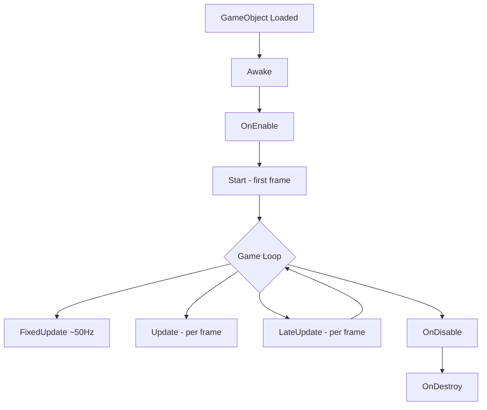
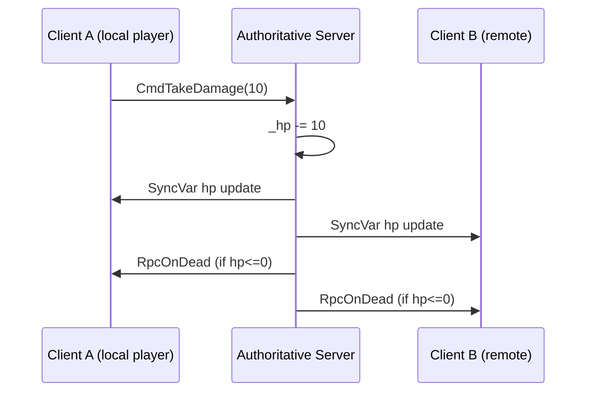

# Game Development with Unity + Unreal — Mobile to AAA

Game dev India mein ek **niche but loud** career hai. Tu kabhi BGMI khelta hai, Ludo King, Free Fire, Carrom Pool, Dream11 fantasy, MPL rummy, Real Cricket — yeh sab games **engineers ne C# ya C++ mein code karke** ship kiye hain. India ka game industry 2025 mein **3.5 billion USD** size ka hai, aur har saal **5,000+ engineers** hire ho rahe hain — Krafton India (BGMI ke makers), Dream11, MPL, Junglee Games, Nazara, Octro (Teen Patti Gold), GameOn, Hi-Tech Animation, Studio Sirah, Lila Games. Tu agar coding karta hai aur games khelne ka shauk hai, yeh aaj tak ka sabse mazedaar career path hai — kyunki tu jo banata hai usko khelta bhi hai.

Yeh doc tujhe **Unity (C#)** aur **Unreal Engine (C++)** dono mein zero se mid-level tak le jayegi. Mobile + indie ke liye Unity dominant hai (Krafton ka State of Survival, MPL, Ludo King, Among Us — sab Unity). Console + AAA + photoreal mobile (BGMI, Fortnite, Black Myth Wukong) — Unreal. Tu agar Indian gaming startup mein SDE-1 role chahta hai, **Unity + C# tera path hai**. Agar AAA studios (Ubisoft Pune, Rockstar India, Epic India) ya BGMI-tier shooters chahta hai, **Unreal + C++** ke bina aage nahi badh sakta.

13 sections, runnable code, real engine APIs. Chal shuru karte hain.

---

## 1. Why Game Dev as a career in India

### 1.1 Industry size aur scope

India gaming numbers (FY25):

| Metric | Value |
|--------|-------|
| Total gamers | 600M+ |
| Paying gamers | 150M+ |
| Real-money gaming (RMG) market | $2.6B |
| Casual + mid-core games revenue | $0.9B |
| Engineers hired/year | 5,000-7,000 |
| Studios in India | 900+ |

Real-money gaming (Dream11, MPL, Junglee, RummyCircle) **revenue mein top hai** — but yahan game logic + economy + anti-cheat + payment integration ka kaam hota hai, pure 3D rendering nahi. Casual + mid-core (BGMI, Free Fire, Ludo King, Carrom Pool) ka **engineer count zyada hai** kyunki rendering, networking, animations, VFX — sab native engine work hota hai.

### 1.2 Hiring stats + salary bands (2025)

| Company | Stack | Fresher (LPA) | 2-5 yr (LPA) | 5+ yr (LPA) |
|---------|-------|---------------|--------------|-------------|
| Krafton India (BGMI) | Unreal + C++ | 15-25 | 35-60 | 70-130 |
| Dream11 | Unity + Backend | 8-15 | 20-40 | 45-80 |
| MPL | Unity + Backend | 7-13 | 18-35 | 40-75 |
| Junglee Games | Unity + Cocos | 6-12 | 16-30 | 35-65 |
| Nazara | Unity | 5-10 | 14-26 | 30-55 |
| Octro (Teen Patti) | Unity + Cocos | 6-11 | 15-28 | 32-60 |
| Lila Games (Survival) | Unity + UE5 | 8-14 | 20-38 | 40-70 |
| Hi-Tech Animation | Unreal | 6-10 | 15-28 | 30-55 |
| Ubisoft Pune | Unreal + Anvil | 10-18 | 24-45 | 50-95 |

**Krafton India is the premium tier** — they pay AAA-level packages because BGMI revenue (~$200M+/yr from India alone) funds aggressive hiring. Dream11 + MPL pay well kyunki high-margin RMG hai. Indie/casual studios (Nazara, Octro) lower bands but **lifestyle + creative freedom** zyada.

### 1.3 Unity vs Unreal — kya seekhna chahiye?

| Dimension | Unity | Unreal |
|-----------|-------|--------|
| Language | C# | C++ + Blueprints |
| Sweet spot | Mobile + casual + indie + AR/VR | AAA + console + photoreal mobile |
| Learning curve | Low (1-2 mahine se productive) | Steep (4-6 mahine) |
| Asset Store | Massive | Marketplace, smaller |
| Royalty | Free up to $200K, then per-seat | 5% after $1M lifetime revenue |
| India hiring volume | High (mobile dominates) | Medium (premium roles) |
| Source code access | Engine source paid | Free engine source on GitHub |
| Top games India | BGMI Lite, Ludo King, MPL, Among Us | BGMI, Fortnite, Black Myth |

**Faisla:** Tu fresher hai aur kahin bhi placement chahta hai → **Unity pakad**. Tu console / AAA / Krafton-tier shooter ke liye serious hai → **Unreal seekh**. Best engineers dono jaante hain — Unity pe prototype banao, Unreal pe AAA ship karo.

### 1.4 Mobile game economics in India

BGMI ke baare mein soch — **15M daily active users** at peak. ARPU (avg revenue per user) ~$0.5-1 — chhota lagta hai but volume × frequency = $200M+/year. UC (in-game currency), royal pass, gun skins, emotes — sab **game-as-service** monetization. India mein **pay-to-win** allowed nahi hota easily — log paisa cosmetics pe denge, advantage pe nahi (CoD Mobile ka India launch isi pe slow tha).

Casual side — Ludo King ka 2024 revenue $40M+, 90% via ads. **Ad mediation, IAP funnels, retention curves, LTV/CAC math** — yeh game devs ko **product-team ke saath** kaam karwati hai. Tu agar pure code monkey banna chahta hai to bhi business samajhna padega.

---

## 2. Unity essentials — C#

### 2.1 C# basics jo Unity mein roz dikhte hain

C# Java/C++ ke beech ka language hai — managed memory (GC), strong typing, properties, events, generics, async/await. Unity 2022+ pe **C# 9.0** support karti hai.

```csharp
// Properties — backing field auto-generated
public class Player {
    public int Health { get; private set; } = 100;
    public string Name { get; set; }

    // Auto event — observers subscribe karte hain
    public event System.Action<int> OnHealthChanged;

    public void TakeDamage(int amount) {
        Health -= amount;
        OnHealthChanged?.Invoke(Health);   // null-safe invoke
    }
}
```

### 2.2 Generics + collections

```csharp
using System.Collections.Generic;

List<Enemy> enemies = new List<Enemy>();
Dictionary<string, int> scores = new Dictionary<string, int>();

scores["ratnesh"] = 1500;
foreach (var (name, score) in scores) {
    Debug.Log($"{name} -> {score}");
}
```

### 2.3 Async / await — rare in gameplay, common in IO

Unity mein gameplay loop **frame-based** hai, isliye `async/await` pure C# style se kam use hota hai. But for **network calls, file IO, addressables loading** — useful.

```csharp
using UnityEngine.Networking;
using System.Threading.Tasks;

public async Task<string> FetchLeaderboardAsync(string url) {
    using var req = UnityWebRequest.Get(url);
    var op = req.SendWebRequest();
    while (!op.isDone) await Task.Yield();
    if (req.result != UnityWebRequest.Result.Success) return null;
    return req.downloadHandler.text;
}
```

But **gameplay code mein coroutines (`IEnumerator` + `yield return`) zyada use hote hain** kyunki frame-tied control milta hai.

### 2.4 MonoBehaviour lifecycle — Unity ka heart

Har Unity script `MonoBehaviour` se inherit karta hai. Engine **specific named methods automatically call karti hai**.

```csharp
using UnityEngine;

public class PlayerController : MonoBehaviour {
    // Called once when GameObject is loaded — references init karo yahan
    void Awake() {
        Debug.Log("Awake — earliest hook");
    }

    // Called once after Awake, before first frame — game logic init
    void Start() {
        Debug.Log("Start");
    }

    // Called every frame — input + non-physics logic
    void Update() {
        if (Input.GetKeyDown(KeyCode.Space)) Jump();
    }

    // Called at fixed interval (default 50 Hz) — physics + Rigidbody
    void FixedUpdate() {
        // physics movement
    }

    // Called every frame after Update — camera follow, late corrections
    void LateUpdate() { }

    // Called when GameObject is destroyed — cleanup
    void OnDestroy() {
        Debug.Log("Cleanup");
    }

    void Jump() { /* ... */ }
}
```

**Lifecycle order (full):** `Awake → OnEnable → Start → FixedUpdate (loop) → Update (loop) → LateUpdate (loop) → OnDisable → OnDestroy`. Memorize this — interview pakka pucha jata hai.



### 2.5 GameObject + Component architecture

Unity ka core philosophy = **composition over inheritance**. Ek `GameObject` empty hai — uspe **Components** lagao (Transform, MeshRenderer, Rigidbody, your Script). Behaviour = sum of components.

```csharp
// Get component on same GameObject
Rigidbody rb = GetComponent<Rigidbody>();

// Get component on child
Animator anim = GetComponentInChildren<Animator>();

// Add component dynamically
gameObject.AddComponent<AudioSource>();

// Find another GameObject (avoid in Update — slow)
GameObject enemy = GameObject.FindWithTag("Enemy");
```

**Pro tip:** `GameObject.Find` aur `FindObjectsOfType` Update mein **mat call kar** — O(N) scene scan hota hai. Cache karo `Awake` ya `Start` mein.

### 2.6 Prefabs — reusable templates

Prefab ek **GameObject template** hai jo project mein file ban jata hai. Ek baar setup karo, hazaar baar instantiate karo.

```csharp
public class EnemySpawner : MonoBehaviour {
    public GameObject enemyPrefab;   // assign in Inspector
    public Transform spawnPoint;

    public void SpawnOne() {
        Instantiate(enemyPrefab, spawnPoint.position, Quaternion.identity);
    }
}
```

### 2.7 ScriptableObjects — designer-friendly data containers

Game data (weapon stats, level configs, dialog lines) **code mein hardcode mat kar**. ScriptableObject mein daal — designer Inspector se tweak kar sakta hai, code change/recompile nahi.

```csharp
using UnityEngine;

[CreateAssetMenu(fileName = "Weapon", menuName = "Game/Weapon")]
public class WeaponData : ScriptableObject {
    public string weaponName;
    public int damage;
    public float fireRate;
    public AudioClip fireSound;
    public GameObject projectilePrefab;
}
```

Project mein right-click → Create → Game → Weapon → naya `.asset` file banta hai. Inspector mein tweak kar.

### 2.8 Worked example — spawn enemies on a timer

```csharp
using System.Collections;
using UnityEngine;

public class WaveSpawner : MonoBehaviour {
    [SerializeField] private GameObject enemyPrefab;
    [SerializeField] private Transform[] spawnPoints;
    [SerializeField] private float spawnInterval = 2.0f;
    [SerializeField] private int maxEnemies = 20;

    private int _spawnedCount = 0;

    void Start() {
        StartCoroutine(SpawnLoop());
    }

    private IEnumerator SpawnLoop() {
        while (_spawnedCount < maxEnemies) {
            yield return new WaitForSeconds(spawnInterval);
            SpawnAtRandom();
            _spawnedCount++;
        }
        Debug.Log("Wave complete");
    }

    private void SpawnAtRandom() {
        int idx = Random.Range(0, spawnPoints.Length);
        Transform p = spawnPoints[idx];
        Instantiate(enemyPrefab, p.position, p.rotation);
    }
}
```

`SerializeField` private hote hue bhi Inspector mein dikhata hai (encapsulation maintain). Coroutine `WaitForSeconds` non-blocking hai — frame stall nahi hota.

---

## 3. Unity — physics + collisions

Unity ke 2 physics engines hain:
- **3D physics** (PhysX backend) — `Rigidbody`, `BoxCollider`, etc.
- **2D physics** (Box2D backend) — `Rigidbody2D`, `BoxCollider2D`, etc.

### 3.1 Rigidbody — physics-driven movement

`Rigidbody` add karne se GameObject **gravity, force, collision** ka subject ban jata hai.

```csharp
using UnityEngine;

[RequireComponent(typeof(Rigidbody))]
public class BallLauncher : MonoBehaviour {
    private Rigidbody _rb;

    void Awake() {
        _rb = GetComponent<Rigidbody>();
    }

    public void Launch(Vector3 direction, float power) {
        _rb.AddForce(direction.normalized * power, ForceMode.Impulse);
    }
}
```

`ForceMode` options: `Force` (continuous, mass-aware), `Impulse` (instant, mass-aware), `Acceleration` (continuous, mass-ignore), `VelocityChange` (instant, mass-ignore).

### 3.2 Colliders

Collider = shape jo collision detect karta hai. Trigger = collision detect karta hai but physics response nahi.

| Collider | Use case |
|----------|----------|
| BoxCollider | Crates, walls, simple props |
| SphereCollider | Balls, projectiles, blast radius |
| CapsuleCollider | Player + humanoid characters |
| MeshCollider | Complex static geometry (level meshes) |
| TerrainCollider | Auto-attached on Terrain |

**Rule:** MeshCollider expensive hai (per-triangle check) — moving objects pe **kabhi mat use kar**. Compound BoxColliders use kar instead.

### 3.3 Layers + collision matrix

Unity mein 32 layers hain. Edit → Project Settings → Physics → **Layer Collision Matrix** mein decide kar sakte ho **kaunsa layer kis layer se collide karega**. Performance bachata hai — e.g., bullets sirf enemies se collide, decorations se nahi.

```csharp
// Bit-mask check via LayerMask
public LayerMask enemyMask;

void OnCollisionEnter(Collision c) {
    if ((enemyMask.value & (1 << c.gameObject.layer)) != 0) {
        // it's an enemy
    }
}
```

### 3.4 Triggers vs collisions

```csharp
// Physical collision — both objects have collider, at least one has Rigidbody
void OnCollisionEnter(Collision collision) {
    Debug.Log($"Hit {collision.gameObject.name}");
    ContactPoint cp = collision.contacts[0];
    // bounce, damage, sfx
}

// Trigger — one collider has `isTrigger = true`
void OnTriggerEnter(Collider other) {
    Debug.Log($"Entered zone with {other.gameObject.name}");
}
```

**Trigger** use kar jab **physics response nahi chahiye** — pickup zones, kill volumes, checkpoints.

### 3.5 Worked example — pickup item on collision

```csharp
using UnityEngine;

public class HealthPickup : MonoBehaviour {
    [SerializeField] private int healAmount = 25;
    [SerializeField] private AudioClip pickupSfx;

    void OnTriggerEnter(Collider other) {
        if (!other.CompareTag("Player")) return;

        var hp = other.GetComponent<PlayerHealth>();
        if (hp == null) return;

        hp.Heal(healAmount);
        if (pickupSfx != null) AudioSource.PlayClipAtPoint(pickupSfx, transform.position);
        Destroy(gameObject);
    }
}

public class PlayerHealth : MonoBehaviour {
    public int CurrentHp { get; private set; } = 100;
    public int MaxHp = 100;
    public void Heal(int amt) {
        CurrentHp = Mathf.Min(CurrentHp + amt, MaxHp);
    }
}
```

Player GameObject pe `Tag = "Player"` lagao + `Rigidbody` + `CapsuleCollider`. Pickup pe `SphereCollider` with `isTrigger = true`. Player chalke pickup pe jaate hi heal + destroy + sfx.

---

## 4. Unity — input + UI

### 4.1 Legacy Input vs New Input System

Unity 2 input systems offer karta hai:

| | Legacy (`Input.GetKey`) | New Input System (`InputAction`) |
|---|------------------------|----------------------------------|
| Setup | Zero, just call API | Package install + asset config |
| Devices | Keyboard, mouse, joystick | + gamepad, touch, VR, custom rebinding |
| Action mapping | Manual | Asset-driven, swappable schemes |
| Multiplayer local | Hard | Built-in PlayerInput |
| Future | Maintenance only | Recommended 2025+ |

New Input System ka asset banao → actions define kar (Move, Jump, Fire) → bindings (WASD, gamepad LS, etc.) → callbacks bind kar.

```csharp
using UnityEngine;
using UnityEngine.InputSystem;

public class PlayerInputHandler : MonoBehaviour {
    [SerializeField] private InputActionReference moveAction;
    [SerializeField] private InputActionReference jumpAction;

    private Vector2 _moveInput;

    void OnEnable() {
        moveAction.action.Enable();
        jumpAction.action.Enable();
        jumpAction.action.performed += OnJump;
    }

    void OnDisable() {
        jumpAction.action.performed -= OnJump;
        moveAction.action.Disable();
        jumpAction.action.Disable();
    }

    void Update() {
        _moveInput = moveAction.action.ReadValue<Vector2>();
        // apply to character controller / rigidbody
    }

    private void OnJump(InputAction.CallbackContext ctx) {
        Debug.Log("Jump pressed");
    }
}
```

### 4.2 Canvas + UI elements

Unity UI = **Canvas** GameObject jiske niche **RectTransform** use hoke `Image`, `Text`, `Button`, `Slider`, etc. layout hote hain.

| Render Mode | Use case |
|-------------|----------|
| Screen Space - Overlay | HUD, menus (default) |
| Screen Space - Camera | UI affected by post-processing |
| World Space | 3D billboards (health bars over enemies) |

**TextMeshPro** use kar (`TMP_Text`) — default `Text` blurry hota hai.

### 4.3 EventSystem

EventSystem GameObject **scene mein 1 hona chahiye** — UI ke saare clicks, taps, gamepad navigation handle karta hai. Naya UI add karte time auto-create ho jata hai.

### 4.4 Worked example — jump on button press

```csharp
using UnityEngine;
using UnityEngine.UI;

[RequireComponent(typeof(Rigidbody))]
public class JumpController : MonoBehaviour {
    [SerializeField] private Button jumpButton;
    [SerializeField] private float jumpForce = 7f;

    private Rigidbody _rb;
    private bool _grounded = true;

    void Awake() {
        _rb = GetComponent<Rigidbody>();
        jumpButton.onClick.AddListener(TryJump);
    }

    private void TryJump() {
        if (!_grounded) return;
        _rb.AddForce(Vector3.up * jumpForce, ForceMode.Impulse);
        _grounded = false;
    }

    void OnCollisionEnter(Collision c) {
        if (c.contacts[0].normal.y > 0.7f) _grounded = true;
    }
}
```

UI Button Inspector mein khali rakh — code se `AddListener` lagaya. Mobile pe iss tarah on-screen jump button banaya jata hai.

---

## 5. Unity — animations

### 5.1 Animator + State Machine

Unity animations **Animator Controller** mein state machine ke roop mein organize hote hain. State = ek animation clip. Transitions parameters (bool, trigger, float, int) pe trigger hote hain.

Typical setup: `Idle → Run → Jump → Fall → Land`. Transitions condition: `Speed > 0.1` (Idle → Run), `IsJumping == true` (Run → Jump).

```csharp
public class CharacterAnimator : MonoBehaviour {
    private Animator _anim;
    private static readonly int SpeedHash = Animator.StringToHash("Speed");
    private static readonly int JumpHash = Animator.StringToHash("Jump");

    void Awake() => _anim = GetComponent<Animator>();

    public void SetSpeed(float speed) => _anim.SetFloat(SpeedHash, speed);
    public void TriggerJump() => _anim.SetTrigger(JumpHash);
}
```

`Animator.StringToHash` cache kar — string lookup har frame avoid karta hai.

### 5.2 Blend trees

Multiple animations ek parameter pe **blend** karna — e.g., Idle (speed=0), Walk (speed=2), Run (speed=5). Blend tree smooth transitions deta hai single parameter se.

### 5.3 Animation events

Animation timeline pe specific frame pe **C# function call** trigger kar sakte ho — e.g., footstep sfx at frame 12, hit detection at frame 18 of attack anim. Inspector → Animation window → Add event → method name type.

```csharp
public void OnFootstep() {
    AudioSource.PlayClipAtPoint(footstepSfx, transform.position);
}
```

### 5.4 Mecanim vs Playables

Mecanim = state-machine UI workflow. Playables API = code-driven, low-level — cinematic systems, custom animation graphs. 95% gameplay Mecanim use karta hai.

---

## 6. Unity — multiplayer

### 6.1 Networking landscape

| Solution | Pricing | Authoritative server? | India-friendly? |
|----------|---------|-----------------------|-----------------|
| **Mirror** | Free, OSS | Optional | Yes — host on AWS Mumbai, free |
| **Photon Fusion 2** | Pay-per-CCU | Built-in | Yes — Photon cloud has SG/Mumbai |
| **Unity Netcode for GameObjects** | Free, Unity-blessed | Optional | Yes |
| **Nakama (Heroic Labs)** | Free OSS + paid cloud | Yes | Yes |
| **PlayFab** | Microsoft, MMO-scale | Yes | Yes (Azure India) |

**Mirror** = entry point. Free, **same API jaisa Unity ka old UNet (so legacy tutorials work)**, AWS pe khud host kar sakte ho — Indian indie studios isi pe MPL-tier multiplayer banate hain.

**Photon Fusion** = production-grade, predictive rollback netcode, paid lekin **MPL/Junglee level studios isi pe hain**. Lag compensation built-in.

### 6.2 Authoritative server vs P2P

| Model | Pros | Cons | When |
|-------|------|------|------|
| **Authoritative server** | Cheat-resistant, single source of truth | Server costs, dev effort | RMG (MPL, Dream11), competitive PVP |
| **Listen server (host = client)** | Cheap, easy | Host has unfair latency advantage | Co-op, casual (Among Us) |
| **P2P with NAT punch** | Zero server cost | Cheating trivial, sync hard | Friend-only games |

**RMG mein authoritative server mandatory hai** — varna anti-cheat impossible, license/regulation issue.

### 6.3 Worked example — Mirror client-server position sync

```csharp
using Mirror;
using UnityEngine;

public class NetworkedPlayer : NetworkBehaviour {
    [SyncVar(hook = nameof(OnHpChanged))]
    private int _hp = 100;

    [SerializeField] private float speed = 5f;

    void Update() {
        if (!isLocalPlayer) return;     // only local owner sends input

        float h = Input.GetAxis("Horizontal");
        float v = Input.GetAxis("Vertical");
        Vector3 move = new Vector3(h, 0, v) * speed * Time.deltaTime;
        transform.Translate(move);

        if (Input.GetKeyDown(KeyCode.K)) CmdTakeDamage(10);
    }

    [Command]    // runs on server, called from client
    private void CmdTakeDamage(int dmg) {
        _hp -= dmg;       // SyncVar auto-replicates to all clients
        if (_hp <= 0) {
            RpcOnDead();
        }
    }

    [ClientRpc] // runs on every client
    private void RpcOnDead() {
        Debug.Log($"{netId} died");
    }

    private void OnHpChanged(int oldHp, int newHp) {
        Debug.Log($"HP: {oldHp} -> {newHp}");
    }
}
```



`[Command]` = client → server. `[ClientRpc]` = server → all clients. `[SyncVar]` = server-owned variable jo automatically clients pe replicate hoti hai. Yeh Mirror ka entire networking model hai — 90% multiplayer games iss pattern pe hain.

### 6.4 Lag compensation + tick rate

Competitive games **fixed tick rate** pe chalti hain (server 30/60 Hz). Client-side prediction + server reconciliation + interpolation = smooth gameplay despite 100ms latency. Photon Fusion ka **predict-and-rollback netcode** built-in hai — Mirror mein khud likhna padta hai (`NetworkTransform` class).

---

## 7. Unreal — C++ + Blueprints

### 7.1 Class hierarchy

Unreal C++ ka type system **deep inheritance** pe based hai.

```
UObject                       // root, GC managed, reflection
  └── AActor                  // can be placed in world (has Transform)
        └── APawn             // can be possessed by Controller
              └── ACharacter  // Pawn + CapsuleComponent + CharacterMovement
```

| Class | Purpose | Example |
|-------|---------|---------|
| `UObject` | Reflection root, GC | `UWeaponData` (data asset) |
| `AActor` | World entity | Door, pickup, projectile |
| `APawn` | Controllable entity | Vehicle, drone |
| `ACharacter` | Humanoid | Player, NPC |
| `APlayerController` | Input → Pawn | Local player camera + input |
| `AGameMode` | Server-only rules | Match flow, scoring |
| `AGameState` | Replicated state | Match timer, scores visible to all |

### 7.2 UPROPERTY + UFUNCTION reflection

Unreal ka reflection system **macros** pe based hai. `UPROPERTY` aur `UFUNCTION` Engine ko bolta hai ki yeh field/function:
- Editor mein dikhao (`EditAnywhere`, `BlueprintReadWrite`)
- GC manage kare (`UPROPERTY()` on UObject pointers)
- Network pe replicate kare (`Replicated`)
- Blueprint mein expose ho (`BlueprintCallable`)

```cpp
// MyCharacter.h
#pragma once

#include "CoreMinimal.h"
#include "GameFramework/Character.h"
#include "MyCharacter.generated.h"

UCLASS()
class MYGAME_API AMyCharacter : public ACharacter {
    GENERATED_BODY()

public:
    AMyCharacter();

    UPROPERTY(EditAnywhere, BlueprintReadWrite, Category = "Stats")
    float MaxHealth = 100.f;

    UPROPERTY(VisibleAnywhere, BlueprintReadOnly, Replicated, Category = "Stats")
    float CurrentHealth = 100.f;

    UFUNCTION(BlueprintCallable, Category = "Stats")
    void TakeDamage(float Amount);

protected:
    virtual void BeginPlay() override;
    virtual void Tick(float DeltaTime) override;
    virtual void GetLifetimeReplicatedProps(TArray<FLifetimeProperty>& OutLifetimeProps) const override;
};
```

```cpp
// MyCharacter.cpp
#include "MyCharacter.h"
#include "Net/UnrealNetwork.h"

AMyCharacter::AMyCharacter() {
    PrimaryActorTick.bCanEverTick = true;
    bReplicates = true;
}

void AMyCharacter::BeginPlay() {
    Super::BeginPlay();
    CurrentHealth = MaxHealth;
}

void AMyCharacter::Tick(float DeltaTime) {
    Super::Tick(DeltaTime);
}

void AMyCharacter::TakeDamage(float Amount) {
    if (HasAuthority()) {       // server-only
        CurrentHealth = FMath::Max(0.f, CurrentHealth - Amount);
    }
}

void AMyCharacter::GetLifetimeReplicatedProps(TArray<FLifetimeProperty>& OutLifetimeProps) const {
    Super::GetLifetimeReplicatedProps(OutLifetimeProps);
    DOREPLIFETIME(AMyCharacter, CurrentHealth);
}
```

`HasAuthority()` = "am I the server?" (or single-player). Replication writes server-side, propagates to clients.

### 7.3 Blueprints — visual scripting

Blueprints = node-based visual scripting. Designer-friendly. Compile to bytecode, run on UE VM. **Slower than C++ but iteration is instant** (no compile).

| Use Blueprint | Use C++ |
|---------------|---------|
| UI logic, simple gameplay events | Combat math, AI loops, networking core |
| Designer-tweakable behaviour | Performance-critical Tick code |
| Prototyping | Engine extensions, plugins |
| Cosmetic / UX flow | Replication, savegame core |

**Pro pattern:** C++ mein base class likh, Blueprint mein extend kar (BP_MyCharacter). Designer Inspector mein values tweak kare, programmer logic provide kare. AAA studios isi pattern pe hain.

### 7.4 GameplayFramework

Unreal mein har match ka skeleton fixed hai:

| Class | Lives where | What |
|-------|-------------|------|
| `AGameModeBase` | Server only | Rules, win condition, spawn logic |
| `AGameStateBase` | Server + replicated to clients | Score, match time |
| `APlayerController` | Each player (server + owning client) | Input, camera ownership |
| `APlayerState` | Each player (server + replicated) | Player name, score, ping |
| `APawn` / `ACharacter` | Server + replicated | The body each player drives |
| `AHUD` | Local client only | UI overlay (legacy, UMG zyada modern) |

### 7.5 Worked example — spawn projectile on key press

```cpp
// MyCharacter.h (additions)
UPROPERTY(EditDefaultsOnly, Category = "Combat")
TSubclassOf<class AProjectile> ProjectileClass;

UFUNCTION(Server, Reliable)
void ServerFire();

void Fire();
```

```cpp
// MyCharacter.cpp (additions)
#include "Projectile.h"

void AMyCharacter::Fire() {
    if (!HasAuthority()) {
        ServerFire();   // RPC to server
        return;
    }
    if (!ProjectileClass) return;

    FVector SpawnLoc = GetActorLocation() + GetActorForwardVector() * 100.f;
    FRotator SpawnRot = GetActorRotation();
    GetWorld()->SpawnActor<AProjectile>(ProjectileClass, SpawnLoc, SpawnRot);
}

void AMyCharacter::ServerFire_Implementation() {
    Fire();
}

// In SetupPlayerInputComponent
void AMyCharacter::SetupPlayerInputComponent(UInputComponent* PlayerInputComponent) {
    Super::SetupPlayerInputComponent(PlayerInputComponent);
    PlayerInputComponent->BindAction("Fire", IE_Pressed, this, &AMyCharacter::Fire);
}
```

```cpp
// Projectile.h
UCLASS()
class MYGAME_API AProjectile : public AActor {
    GENERATED_BODY()

public:
    AProjectile();

    UPROPERTY(VisibleAnywhere)
    class USphereComponent* CollisionComp;

    UPROPERTY(VisibleAnywhere)
    class UProjectileMovementComponent* MovementComp;

protected:
    UFUNCTION()
    void OnHit(UPrimitiveComponent* HitComp, AActor* OtherActor,
               UPrimitiveComponent* OtherComp, FVector NormalImpulse,
               const FHitResult& Hit);
};
```

```cpp
// Projectile.cpp
AProjectile::AProjectile() {
    CollisionComp = CreateDefaultSubobject<USphereComponent>(TEXT("CollisionComp"));
    CollisionComp->InitSphereRadius(8.f);
    CollisionComp->OnComponentHit.AddDynamic(this, &AProjectile::OnHit);
    RootComponent = CollisionComp;

    MovementComp = CreateDefaultSubobject<UProjectileMovementComponent>(TEXT("MoveComp"));
    MovementComp->UpdatedComponent = CollisionComp;
    MovementComp->InitialSpeed = 3000.f;
    MovementComp->MaxSpeed = 3000.f;
    MovementComp->bRotationFollowsVelocity = true;

    InitialLifeSpan = 3.f;
    bReplicates = true;
}

void AProjectile::OnHit(UPrimitiveComponent* HitComp, AActor* OtherActor,
                        UPrimitiveComponent* OtherComp, FVector NormalImpulse,
                        const FHitResult& Hit) {
    if (OtherActor && OtherActor != this) {
        // damage logic
        Destroy();
    }
}
```

This is **production-style** — `Server, Reliable` RPC ensures projectile spawns server-side, replicates to all clients. `bReplicates = true` on actor + projectile component = clients dekh sakte hain.

---

## 8. Unreal — Niagara + materials

### 8.1 Niagara — VFX system

Niagara = node-graph VFX engine, replaced old Cascade. GPU-friendly, complex effects (smoke, fire, magic, blood splatter).

| Concept | Meaning |
|---------|---------|
| Emitter | Spawns + simulates particles |
| System | Collection of emitters |
| Module | Stack of operations (spawn rate, velocity, color over life) |

**Use case:** BGMI ka muzzle flash, smoke grenade, blood spray — sab Niagara. Designer-driven mostly.

```cpp
// Spawn a Niagara system from C++
UNiagaraComponent* Effect = UNiagaraFunctionLibrary::SpawnSystemAtLocation(
    GetWorld(),
    HitVfxAsset,
    HitLocation,
    HitRotation
);
```

### 8.2 Materials + shader graph

Material = shader + parameters. Unreal ka **Material Editor** node-graph hai — drag textures, math nodes, output to base color / metallic / roughness / normal / emissive.

Material Instance = pre-set material with **tweakable parameters** at runtime. **Performance principle:** instances cheap (parameter change), unique materials expensive (shader recompile).

```cpp
// Set a material parameter from C++
UMaterialInstanceDynamic* DynMat = MeshComp->CreateDynamicMaterialInstance(0);
DynMat->SetVectorParameterValue("BaseColor", FLinearColor::Red);
DynMat->SetScalarParameterValue("Roughness", 0.3f);
```

`MaterialInstanceDynamic` = runtime instance, har actor ka apna copy. Hit flash, damage tint, team color — sab isse.

---

## 9. Cross-engine — shaders + 3D math

### 9.1 Vectors + matrices

Game dev ka **roj ka math** vectors + matrices hai. Position, direction, rotation, scale — sab vector/matrix.

```csharp
// Unity C#
Vector3 a = new Vector3(1, 0, 0);
Vector3 b = new Vector3(0, 1, 0);

float dot = Vector3.Dot(a, b);          // 0 — perpendicular
Vector3 cross = Vector3.Cross(a, b);    // (0,0,1) — perpendicular to both
float angle = Vector3.Angle(a, b);      // 90 degrees
Vector3 dir = (target.position - transform.position).normalized;
```

```cpp
// Unreal C++
FVector A(1, 0, 0);
FVector B(0, 1, 0);
float Dot = FVector::DotProduct(A, B);          // 0
FVector Cross = FVector::CrossProduct(A, B);    // (0,0,1)
FVector Dir = (Target->GetActorLocation() - GetActorLocation()).GetSafeNormal();
```

**Dot product** = how aligned two vectors are. Use cases: AI vision cone (`dot > 0.7` = within ~45 deg), reflect math, camera facing.
**Cross product** = perpendicular vector. Use cases: surface normals, side-step direction, torque.

### 9.2 Coordinate systems

| Space | Origin | Used for |
|-------|--------|----------|
| **World** | Scene origin (0,0,0) | Final position |
| **Local** | Parent's origin | Hierarchy (gun on player hand) |
| **View / Camera** | Camera | Lighting calc, screen-relative effects |
| **Screen** | Top-left (or center) | UI, mouse clicks |
| **Clip / NDC** | -1 to 1 cube | After projection, before viewport |

Unity left-handed, **Unreal left-handed but Z-up** (Unity Y-up). UE Z = up, X = forward, Y = right. Yeh confusion freshers ko marwata hai — context switch pe **document karke rakh**.

```csharp
// Unity — local to world
Vector3 worldPos = transform.TransformPoint(localPos);
Vector3 localPos = transform.InverseTransformPoint(worldPos);
```

### 9.3 Quaternions for rotation

Euler angles (`pitch, yaw, roll`) gimbal lock dete hain. Quaternions (`x, y, z, w`) — 4D rotation representation, smooth interpolation, no gimbal lock. Internally engine quaternions hi use karti hai.

```csharp
// Unity
Quaternion targetRot = Quaternion.LookRotation(direction);
transform.rotation = Quaternion.Slerp(transform.rotation, targetRot, Time.deltaTime * 5f);
```

```cpp
// Unreal
FRotator LookRot = (TargetLoc - GetActorLocation()).Rotation();
SetActorRotation(FMath::RInterpTo(GetActorRotation(), LookRot, DeltaTime, 5.f));
// FQuat used internally; FRotator is a friendly wrapper
```

**Slerp = spherical interpolation**, smooth 360-deg motion. **Lerp on quaternions** wrong — angles speed up/slow down weirdly.

### 9.4 Shaders — vertex + fragment basics

GPU har frame **per-vertex** + **per-pixel** shader chalata hai. Vertex shader = vertex position transform (model → world → view → clip space). Fragment (pixel) shader = pixel color compute.

```hlsl
// Unity ShaderLab (HLSL-flavored), URP simple unlit shader
Shader "Custom/SimpleUnlit" {
    Properties {
        _Color ("Color", Color) = (1,1,1,1)
    }
    SubShader {
        Tags { "RenderType"="Opaque" }
        Pass {
            HLSLPROGRAM
            #pragma vertex vert
            #pragma fragment frag
            #include "Packages/com.unity.render-pipelines.universal/ShaderLibrary/Core.hlsl"

            float4 _Color;
            struct Attributes { float4 positionOS : POSITION; };
            struct Varyings { float4 positionCS : SV_POSITION; };

            Varyings vert(Attributes IN) {
                Varyings OUT;
                OUT.positionCS = TransformObjectToHClip(IN.positionOS.xyz);
                return OUT;
            }

            float4 frag(Varyings IN) : SV_Target {
                return _Color;
            }
            ENDHLSL
        }
    }
}
```

Unreal mein equivalent **Material Editor** se generate hota hai — usually programmer custom HLSL `.usf` shader rare cases mein likhta hai.

---

## 10. Performance + optimisation

### 10.1 Draw calls + batching

Har "draw call" = CPU → GPU command. **Mobile pe target ~100 draw calls/frame**, PC pe 1000-2000.

| Technique | What it does |
|-----------|--------------|
| **Static batching** | Static meshes with same material → 1 mesh at build |
| **Dynamic batching** | Small moving meshes auto-combined (Unity) |
| **GPU instancing** | Same mesh, different transforms, 1 draw call |
| **SRP Batcher** | Unity URP/HDRP — same shader variant batched |

**Rule:** **Materials kam rakh.** 50 enemies same material = batch hota hai. 50 enemies har ek ka unique material = 50 draw calls.

### 10.2 Frustum culling + occlusion culling

- **Frustum culling** — camera ke bahar wale objects skip (engine auto-does).
- **Occlusion culling** — kisi object ke peeche chhupe objects skip. Unity **bake** karta hai (Window → Rendering → Occlusion Culling). Unreal **Hierarchical Z-buffer** auto.

### 10.3 LOD — Level of Detail

Door se kam triangles, paas se zyada. LOD0 (full detail) → LOD1 (half) → LOD2 (quarter) → cull. Both engines mein auto-system hai (Unity LODGroup component, Unreal **Auto LOD** + **Nanite** in UE5 — Nanite = no manual LODs needed for static meshes).

### 10.4 Mobile-specific gotchas

| Issue | Fix |
|-------|-----|
| Texture memory | Compress: ASTC (iOS + modern Android), ETC2 (older Android). 50% saving. |
| Overdraw (transparent stacking) | Reduce particles, alpha test instead of alpha blend, frame debugger |
| Shader complexity | URP / Mobile shaders, no per-pixel lights >1, no real-time shadows on cheap devices |
| Garbage collection spikes | Object pooling (no `Instantiate`/`Destroy` in hot loops); avoid per-frame `new`, string concat |
| Battery / heat | Cap frame rate (`Application.targetFrameRate = 60`), drop to 30 if device hot |

**Object pooling pattern (Unity):**

```csharp
public class BulletPool : MonoBehaviour {
    [SerializeField] private GameObject prefab;
    [SerializeField] private int initialSize = 50;
    private Queue<GameObject> _pool = new();

    void Awake() {
        for (int i = 0; i < initialSize; i++) {
            var go = Instantiate(prefab, transform);
            go.SetActive(false);
            _pool.Enqueue(go);
        }
    }

    public GameObject Get() {
        if (_pool.Count == 0) return Instantiate(prefab, transform);
        var go = _pool.Dequeue();
        go.SetActive(true);
        return go;
    }

    public void Return(GameObject go) {
        go.SetActive(false);
        _pool.Enqueue(go);
    }
}
```

BGMI har bullet, every grenade, har VFX — pool karta hai. `Instantiate`/`Destroy` har frame = GC death.

### 10.5 Profilers

- **Unity Profiler** — frame timeline, GC alloc, draw calls, memory.
- **Unreal Insights / `stat unit`, `stat scenerendering`** — same flavor.
- **RenderDoc** — GPU frame capture, pixel-by-pixel shader inspection. Cross-engine free tool.

---

## 11. Publishing

### 11.1 Steam (PC)

- **Steamworks SDK** integrate (achievements, leaderboards, cloud saves, friends invites).
- **Steam Direct fee** = $100 one-time per game.
- Revenue split: **Valve 30% / dev 70%** (drops to 75% after $10M, 80% after $50M).
- India dev community — Steam India page exists, INR pricing supported, no extra paperwork.

### 11.2 Play Store / App Store

- **Play Store** — $25 one-time, **AAB upload** (Android App Bundle), Google generates per-device APKs. Revenue split 30% (15% for first $1M).
- **App Store** — $99/year, IPA upload via Xcode/Transporter, revenue same 30% (15% small biz).
- **In-app purchase APIs** — Google Play Billing, StoreKit2. Sandbox testing first.
- **GST + IT Act compliance** — RMG India mein **state-specific** (Tamil Nadu, AP, Telangana ban rummy, Karnataka in flux). Real-money logic pe legal team ke saath kaam karna padega.

### 11.3 Console (Sony / Microsoft / Nintendo)

| Console | Program | Cost | Approval |
|---------|---------|------|----------|
| PlayStation | PartnerNet | NDA, ~$2K dev kit | Studio review |
| Xbox | ID@Xbox | Free (qualifying studios) | Studio review |
| Nintendo Switch | Developer Portal | NDA, ~$0-500 | Strict, indie-friendly post-2018 |

**India studios reach console rare** — Krafton's Cookie Run console ports, Studio Sirah, Mighty Bear Games (Singapore but India team) — couple of dozen total. Unreal pe AAA console = top 1% job.

### 11.4 WebGL deployment

Unity → WebGL build target → `index.html` + `.wasm` + `.data` files. Host on itch.io, CrazyGames, Poki — instant audience. Unreal WebGL **dropped post-UE4.27**, browser games yahan se Unity-only practically.

`build size` matters — WebGL builds 30-100 MB normal hote hain. Compression (Brotli) + asset stripping mandatory.

---

## 12. Top 30 Game Dev interview questions

| # | Question | Crisp answer |
|---|----------|--------------|
| 1 | Unity MonoBehaviour lifecycle order? | `Awake → OnEnable → Start → FixedUpdate → Update → LateUpdate → OnDisable → OnDestroy` |
| 2 | Update vs FixedUpdate? | Update = per frame (variable dt). FixedUpdate = fixed interval (default 0.02s) for physics + Rigidbody. |
| 3 | When use Awake vs Start? | Awake = self-init / GetComponent (runs even if disabled). Start = first frame after enable, can reference others. |
| 4 | GameObject vs Component? | GameObject = container with Transform. Components = behaviour/data attached. Composition over inheritance. |
| 5 | Prefab purpose? | Reusable GameObject template; instantiate at runtime; edits propagate to instances. |
| 6 | ScriptableObject use case? | Designer-tweakable shared data assets (weapon stats, level configs) — no MonoBehaviour, no scene attachment. |
| 7 | Coroutine vs async/await in Unity? | Coroutine = `IEnumerator + yield`, frame-tied, single-threaded. async = Task, IO-friendly, needs care with Unity main-thread API. |
| 8 | Rigidbody vs CharacterController? | Rigidbody = full physics. CharacterController = capsule + collide-and-slide, no rigidbody simulation, simpler humanoid movement. |
| 9 | Trigger vs Collision? | Trigger = isTrigger=true, no physics response, `OnTriggerEnter`. Collision = physics response, `OnCollisionEnter`. |
| 10 | Prevent unnecessary draw calls? | Use atlases, share materials, GPU instancing, static batching, fewer unique shaders. |
| 11 | Object pooling — why? | Avoid Instantiate/Destroy GC spikes; reuse inactive instances; critical on mobile. |
| 12 | Mirror Command vs ClientRpc? | Command = client→server. ClientRpc = server→all clients. SyncVar = server-owned auto-replicated field. |
| 13 | Authoritative server — why? | Single source of truth; cheat-resistant; mandatory for RMG (MPL, Dream11) and competitive PVP. |
| 14 | Quaternion vs Euler? | Quaternion = 4D, no gimbal lock, smooth Slerp. Euler = readable but gimbal-lock at 90deg, bad for interpolation. |
| 15 | Dot vs cross product? | Dot = alignment scalar (vision cone, angle). Cross = perpendicular vector (normals, torque). |
| 16 | Unreal C++ class hierarchy? | UObject → AActor → APawn → ACharacter. UObject = GC, AActor = world transform, APawn = controllable. |
| 17 | UPROPERTY purpose? | Reflection — editor expose, GC tracking, replication, Blueprint expose. Macros drive Unreal's reflection. |
| 18 | Blueprint vs C++ — when? | C++ = perf-critical, networking core, AI tick. Blueprint = UI flow, designer-driven, prototyping, simple events. |
| 19 | GameMode vs GameState? | GameMode = server-only rules (win condition, spawn). GameState = replicated match state (score, time). |
| 20 | UE Replication: Reliable vs Unreliable RPC? | Reliable = guaranteed (TCP-like), use for critical events. Unreliable = best-effort (UDP-like), use for frequent updates. |
| 21 | Niagara vs Cascade? | Niagara = modern, GPU-friendly, node-graph, replaced Cascade in UE4.25+. Cascade = legacy. |
| 22 | Material vs Material Instance? | Material = shader def. MaterialInstance = parameter override, cheap to swap, no recompile. |
| 23 | LOD strategy on mobile? | LOD0 short range, LOD1-2 farther, cull beyond. Reduces tris + texture sampling. UE5 Nanite auto-handles for static. |
| 24 | Frustum vs occlusion culling? | Frustum = outside camera = skip (auto). Occlusion = behind opaque = skip (baked or runtime). |
| 25 | Texture compression for Android/iOS? | ASTC (modern), ETC2 (older Android), no PVRTC anymore. Saves 50-75% memory. |
| 26 | Coordinate handedness — Unity vs Unreal? | Unity = left-handed, Y-up. Unreal = left-handed, Z-up, X-forward. Conversion required for shared assets. |
| 27 | What is delta time, why use? | `Time.deltaTime` = seconds since last frame; multiply movement by it for frame-rate-independent motion. |
| 28 | Lag compensation — what + why? | Server rewinds time to validate hits at client's view. Fair across latencies. Photon Fusion + UE built-in. |
| 29 | What is tick rate? | Server simulation Hz (30/60). Higher = more responsive + costlier bandwidth/CPU. |
| 30 | Memory leak on level reload — common cause? | Static fields holding references; un-unsubscribed events; Coroutines not stopped on destroy. |

---

## 13. Pre-interview checklist + what's next

### 13.1 30-day prep checklist

- [ ] Build **2 Unity games** end-to-end and ship to itch.io: a 2D platformer + a 3D top-down shooter. Public links go on resume.
- [ ] Build **1 small Unreal game** in C++ (third-person shooter prototype) — focus on `ACharacter`, RPC, projectile spawn.
- [ ] Implement **object pooling** in your Unity build; profile before/after with Unity Profiler — show GC drops in interview.
- [ ] Multiplayer demo with **Mirror** — 2 clients moving + chat sync. Hosted on AWS Mumbai EC2 free tier.
- [ ] Memorize: MonoBehaviour lifecycle order, RPC types, GameplayFramework classes.
- [ ] Read Unity's **DOTS / ECS Best Practices** doc (high-perf systems).
- [ ] One LeetCode-medium per day in C# or C++ (gameplay + DSA both pucha jata hai).
- [ ] Watch **Brackeys + Code Monkey** (Unity), **Mathew Wadstein + Unreal Sensei** (Unreal) — channel grind.
- [ ] Crash-free rate on your published game > 99%; share telemetry screenshot in interview.

### 13.2 Code review red flags to avoid

| Anti-pattern | Why bad | Do instead |
|--------------|---------|------------|
| `GameObject.Find` in `Update` | O(N) scene scan per frame | Cache reference in `Awake` |
| `new Vector3(...)` in tight loop | GC alloc spike | Reuse local, struct stack alloc |
| `Instantiate` / `Destroy` in hot loop | Massive GC churn | Object pool |
| `string` concat in `Update` | GC garbage | StringBuilder, format once |
| `OnGUI` for production UI | Slow IMGUI | UGUI Canvas / UI Toolkit |
| `!!` style force-cast in C# (`as` then NRE) | NullReferenceException | `if (... is X x)` pattern check |
| Ignoring `HasAuthority()` in UE | Cheats, desync | Always gate state writes server-side |
| Unity main-thread-only API on Task thread | Crash | Use `UniTask` or marshal to main thread |
| Unique material per actor | Draw call explosion | MaterialPropertyBlock / MaterialInstanceDynamic |
| Real-time shadow on every light | FPS death on mobile | Bake shadows, 1 dynamic dir light max |

### 13.3 Reading + watching list (free, high quality)

- **Unity Learn** — official courses, Compose-pathway equivalent: https://learn.unity.com
- **Unreal Engine Online Learning** — Epic Games portal, free
- **Mirror docs** — open-source networking tutorials
- **Game Programming Patterns** by Robert Nystrom (free online book) — must-read
- **Catlike Coding tutorials** — deep Unity rendering + shaders
- **Tom Looman blog** — Unreal C++ AAA-grade content

### 13.4 What to learn next (links into your roadmap)

- **`cpp-mastery`** → Unreal mein C++ smart pointers (`TWeakObjectPtr`, `TSharedPtr`), templates, move semantics — all there. Yahan strong → Unreal jobs unlock.
- **`system-design-basics`** → "Design Among Us / Dream11 contest backend" — matchmaking, leaderboards, anti-cheat, payment integration. Game backend HLD.
- **`lld-design`** → Game systems class diagram (inventory, ability tree, achievements). LLD interviews mein games favorite topic hai.
- **`networks-complete`** → UDP, NAT, jitter, packet loss, reconciliation algorithms. Multiplayer = networking deep dive.
- **`design-patterns`** → State machine (animator), Observer (events), Object pool, Component (Unity ECS) — sab patterns games mein roz dikhte hain.

### 13.5 Closing thought

Game dev India mein 2025 mein ek **chhota but tagda industry** hai. 5,000 hires/year compared to 50,000 web/Android — but per-engineer creative leverage zyada. Tu Unity seekh le, ek live game ship kar de itch.io ya Play Store pe, ek Unreal C++ prototype banale GitHub pe — Krafton, MPL, Dream11, Junglee, Lila ke saare fresher slots tere reach mein hain. Aur most importantly — tu jo banata hai usko apna doost khelta hai, Discord pe screenshot share karta hai, Reddit r/IndianGaming pe upvote milta hai. Yeh feeling Excel formula likhne se nahi milti. Yahan se shuru kar — engine pakad, ek game ship kar, **interview karna easy ho jayega**.
