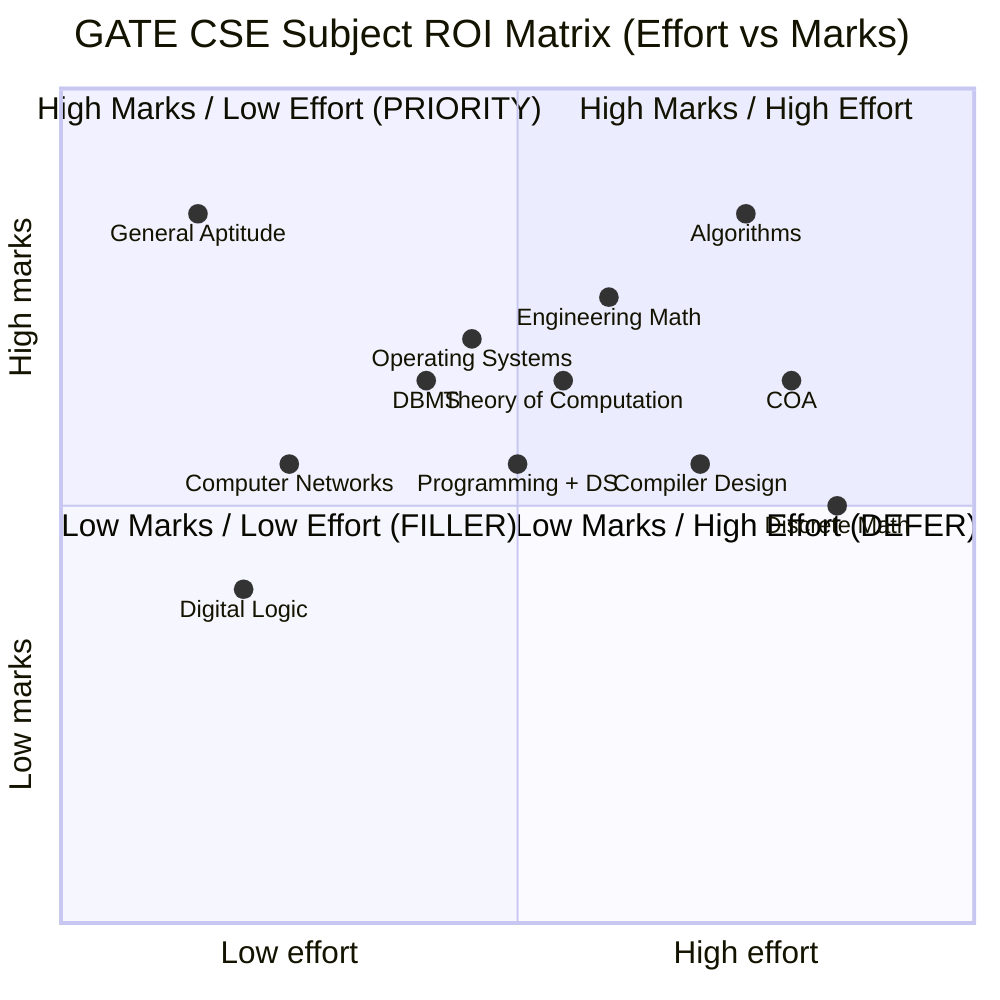

# GATE CSE Complete Prep — From Syllabus to Score 85+

Bhai, GATE CSE ko hum log accidentally **"academic exam"** samajh ke ignore kar dete hain — woh galti tujhe karni nahi hai. Ye ek single test hai jisme **~200,000 aspirants** har saal baithte hain, aur ye **ek hi score** teen alag duniya kholta hai jo product company offers se bhi mehnga ho sakta hai: IIT/IISc Mtech, PSU recruitment (BHEL/IOCL/ONGC type), aur direct PhD admission. Aur uske upar — GATE CSE syllabus aur product company core CS rounds ka **80% overlap** hai. Tu GATE prep karega, tujhe Razorpay/Atlassian ke senior rounds bhi free mein clear ho jayenge.

Iss doc ka goal: tujhe GATE CSE ka **strategic + tactical** layer dena hai. Strategic — kya unlock hota hai, kis tier mein kya milta hai, ROI kahan se aata hai. Tactical — har subject mein PYQ-driven topics, marking-scheme ka math, aur 12-month plan jo mock-test discipline pe bana hai. Yeh ek complete playbook hai — fundamentals ke deep-dive ke liye `dbms-complete`, `os-complete`, `networks-complete`, `discrete-math-oop` cross-reference karega.

Ek baat seedhi: GATE CSE pass karna **luck nahi hai**, but pure rote prep bhi nahi hai — ye **selective depth + rigorous mock discipline** ka game hai. Tu agar 12 mahine 4 ghante daily disciplined hai, tu top 1000 mein aa sakta hai (PSU eligible). 6 ghante + mock discipline + 30 mocks = top 200 (NIT/IIIT). 8 ghante + 50 mocks + 1-2 yr extended prep = top 50 (IIT Bombay/Madras Mtech). Chai-pani saath rakh, calculator side mein, aur ye doc end tak padh.

---

## 1. What GATE CSE actually unlocks — beyond the academic frame

### 1.1 Teen alag career paths, ek hi test

GATE CSE 2026 score (valid 3 saal) ke saath tu inn paths mein se kisi bhi ek (ya teeno) ko target kar sakta hai. Sab paths same test, alag-alag rank brackets pe trigger hote hain.

| Path | Required AIR (All India Rank) | Outcome | Salary impact |
|------|--------------------------------|---------|---------------|
| **IIT/IISc Mtech (top tier)** | Top 100 | IIT Bombay/Delhi/Madras/Kanpur/Kharagpur/IISc Bangalore | Direct entry to FAANG / research labs / $150K+ post-Mtech roles |
| **NIT/IIIT Mtech** | Top 500-1000 | NIT Trichy/Warangal/Surathkal, IIIT Hyderabad/Allahabad | Better placements than 90% of B.Tech engineering colleges |
| **PSU recruitment (premium)** | Top 1000-2000 | BHEL, IOCL, ONGC, SAIL, NTPC, GAIL | 6-12 LPA + government benefits + job security |
| **Direct PhD (rare)** | Top 50 + research interest | IIT/IISc PhD with stipend | ₹37,000-42,000/month stipend during PhD |
| **Foreign PhD (indirect)** | Strong AIR + GRE | Top 200 unis worldwide accept GATE as supplementary signal | $30K-50K/yr stipend + tuition waiver |

### 1.2 IIT Mtech — what really happens after rank

Top 100 AIR ke baad tu IIT Mtech ke liye eligible hai. Ye 2-year program hai jo essentially tujhe **branded reset** deta hai. Kyu valuable?

- **Brand stamp:** IIT Bombay Mtech graduate ka resume FAANG India / Microsoft / Adobe / Goldman ke recruiters seedha shortlist karte hain. Same for product startups.
- **Specialization:** AI/ML, Systems, Theory, Networks — IIT mein deep specialization tracks. Tu B.Tech mein generalist tha, Mtech specialist banta hai.
- **Stipend:** ₹12,400/month MHRD scholarship for full 2 years. So Mtech essentially **paid hai** — tuition + stipend.
- **Placement delta:** IIT Mtech 2024 average package ~₹22 LPA, top quartile ~₹40 LPA+. Compare to median tier-2 B.Tech: ~₹4-6 LPA.

### 1.3 PSU recruitment — the underrated path

Most aspirants is path ko ignore karte hain because "PSU = boring sarkari job" wala perception hai. Reality:

- **BHEL Engineer Trainee:** ₹60,000 starting + DA + HRA = ~₹10 LPA in-hand at entry. Permanent, pensionable.
- **IOCL Officer Trainee:** ₹70,000 starting + production bonus + free housing = ~₹12-14 LPA effective.
- **ONGC AEE:** ₹65,000 starting + offshore allowance (if posted) can push it to ₹15 LPA.
- **NTPC Executive Trainee:** ₹60,000-65,000 + benefits.

Inn jobs ka **real value** salary nahi — **work-life balance + job security + spouse posting + medical for family** hai. Ek IT services engineer ₹6 LPA pe 14 ghante grind karta hai. PSU engineer same money mein 8-9 ghante structured kaam karta hai. Long-term wealth comparable, lifestyle 2x better.

### 1.4 Indirect benefit — product company prep ka free side-effect

GATE CSE syllabus ka 80% **product company core CS rounds** ke saath overlap karta hai:

| GATE topic | Product company round |
|-----------|----------------------|
| Algorithms (DP, Greedy, Graph) | DSA round (Google/Atlassian/Razorpay) |
| OS (process, thread, sync) | Systems / LLD round (Microsoft, Amazon) |
| DBMS (normalization, transactions) | DB round (every product co) |
| Computer Networks | Senior round at network-heavy products |
| COA (cache, pipelining) | Performance / systems round |

Matlab GATE prep tujhe **automatically** product company-ready bhi banata hai. Tu agar GATE 1000-2000 rank laaya, tu Razorpay/Flipkart/CRED ke DSA + DBMS + OS rounds bhi clear kar lega.

### 1.5 Salary delta summary

| Outcome | Year-1 CTC | Year-3 CTC | Year-5 CTC |
|---------|------------|------------|------------|
| TCS/Infy direct (no GATE) | 3.5-4 LPA | 6-7 LPA | 9-12 LPA |
| Tier-2 product co (DSA path) | 8-12 LPA | 14-20 LPA | 22-35 LPA |
| PSU via GATE | 8-10 LPA | 12-14 LPA | 16-20 LPA |
| IIT Mtech post-graduation | 18-25 LPA | 28-45 LPA | 45-80 LPA+ |
| Top FAANG via Mtech research path | 35-50 LPA | 60-90 LPA | 1-1.5 Cr+ |

GATE ek meritocratic gateway hai — tier-2/3 college students ke liye **brand reset** ka sabse legitimate route. IIT label B.Tech mein nahi mila — Mtech mein le le.

---

## 2. GATE CSE 2026 — exact structure aur marking math

### 2.1 The big picture

GATE CSE 2026 (paper code **CS**) IIT Roorkee organize kar raha hai (rotational responsibility). Test February 2026 ke first/second week mein hota hai (multiple slots). Result March end tak.

| Parameter | Value |
|-----------|-------|
| Total questions | 65 |
| Total marks | 100 |
| Duration | 3 hours (180 min) |
| Mode | Computer-based test (CBT) |
| Sections | General Aptitude (GA) + Core CS |
| Negative marking | Yes, on MCQ only |
| Calculator | On-screen virtual calculator only |
| Language | English |

### 2.2 Question type breakdown

| Q-type | Count | Marks each | Total marks | Negative marking |
|--------|-------|------------|-------------|------------------|
| 1-mark MCQ (4 options, 1 correct) | 35 | 1 | 35 | -1/3 |
| 2-mark MCQ (4 options, 1 correct) | 15 | 2 | 30 | -2/3 |
| 1-mark MSQ (4 options, multiple correct) | 5 | 1 | 5 | None |
| 2-mark MSQ (4 options, multiple correct) | 5 | 2 | 10 | None |
| 1-mark NAT (numerical answer) | 5 | 1 | 5 | None |
| 2-mark NAT (numerical answer) | 5 | 2 | 10 | None (sometimes) |
| **Total** | **70 (approx slot)** | — | **100** | — |

> **Note:** Exact split per slot vary karta hai (`±1-2 questions`), but total = 65 questions, 100 marks. NAT + MSQ ka kuch slots mein 30-35 marks tak hota hai, jo **scoring zone** hai (no negative).

### 2.3 GA + CS subject split

| Section | Marks | Notes |
|---------|-------|-------|
| **General Aptitude (GA)** | 15 | 5 × 1-mark + 5 × 2-mark; quant + verbal + logical |
| **Engineering Mathematics** | ~13 | Linear algebra + calculus + probability + discrete-ish |
| **Core CS Subjects** | ~72 | All 9-10 CS subjects compete here |

### 2.4 Negative marking math

Sirf **MCQ** pe negative marking hai. NAT / MSQ pe nahi.

- 1-mark MCQ galat: -1/3 (~ -0.33)
- 2-mark MCQ galat: -2/3 (~ -0.67)
- 1-mark MCQ correct: +1
- 2-mark MCQ correct: +2
- NAT/MSQ galat: 0 (no penalty)
- NAT/MSQ correct: +1 / +2

**Strategic implication:** NAT aur MSQ pe **always attempt** kar — even if uncertain. MCQ pe attempt karne ka rule of thumb: agar tu **2 options eliminate** kar saka, tab attempt kar (probability 50%, expected value positive). Random guessing on 4-option MCQ → expected -0.083, long-run negative. Mock practice mein attempt-rate calibrate kar.

### 2.5 Qualifying cutoff vs scoring rank

- **Qualifying marks (CSE):** Around 25-30 marks (out of 100). Tu 30 paaya = GATE qualified, but rank 50,000+. Useless for IIT/PSU.
- **PSU cutoff:** Around 55-65 marks → AIR 1000-2000.
- **NIT Mtech cutoff:** Around 60-70 marks → AIR 500-1000.
- **IIT Mtech cutoff:** Around 75-85 marks → AIR 100-500.
- **Top 100:** ~85-95 marks. Single-digit AIR mein ~95+ chahiye.

Ye cutoffs **year-by-year vary** karte hain because difficulty + normalization. But ballpark sahi hai.

### 2.6 Normalization explained

GATE multiple slots mein hota hai (morning/afternoon, kabhi 2 days). Difficulty equal nahi hoti. To official "**Normalized Score**" formula use hota hai jo slot difficulty adjust karta hai. Tu apna actual marks dekhega + normalized score (out of 100). Rank normalized score pe bana hota hai.

Don't obsess over normalization — focus pure marks pe rakh, normalization apne aap fair ho jayega.

---

## 3. Subject-wise weightage table aur ROI matrix

### 3.1 Subject-wise marks distribution (5-year average, 2020-2024)

| # | Subject | Avg marks | Range | Difficulty | Marks per prep-hour (ROI) |
|---|---------|-----------|-------|------------|---------------------------|
| 1 | Algorithms | 13 | 12-15 | High | Medium |
| 2 | Theory of Computation (TOC) | 9 | 8-10 | Medium | **High** |
| 3 | Operating Systems | 9 | 8-10 | Medium | **High** |
| 4 | DBMS | 9 | 8-10 | Medium | **High** |
| 5 | Computer Org & Architecture (COA) | 9 | 8-10 | High | Medium |
| 6 | Compiler Design | 8 | 7-9 | Medium | Medium |
| 7 | Programming + Data Structures | 8 | 7-9 | Medium | Medium |
| 8 | Computer Networks | 7 | 6-8 | Low | **Very high** |
| 9 | Discrete Mathematics | 7 | 6-8 | High | Low |
| 10 | Engineering Mathematics | 13 | 11-15 | Medium | Medium |
| 11 | Digital Logic | 6 | 5-7 | Low | **Very high** |
| 12 | General Aptitude | 15 | 14-16 | Low | **Very high** |
| **Total** | — | **~113** | — | — | — |

(Sum > 100 because of overlap rounding; actual paper = exactly 100.)

### 3.2 Subject ROI matrix — marks per prep-hour



### 3.3 Strategic prep order

Based on ROI matrix:

1. **Phase 1 (PRIORITY):** GA, Networks, DLD, OS, DBMS — high marks, lower effort. Lock these in early.
2. **Phase 2 (CORE):** Algorithms, TOC, Engg Math — medium effort, high marks. Bulk of prep time here.
3. **Phase 3 (DEEP):** COA, Compiler Design, Discrete Math — high effort, medium marks. Selective depth.
4. **Phase 4 (POLISH):** Programming + DS — usually mixed with Algorithms prep. Don't allocate separate time.

### 3.4 80/20 prediction

If you can master only 60% of the syllabus, focus on:

- Algorithms (asymptotic + DP + greedy)
- OS (scheduling + sync + paging)
- DBMS (normalization + transactions)
- Networks (subnet + TCP)
- TOC (regular + CFG)
- Engg Math (linear algebra + probability)
- GA (full)

This 60% gives you ~70-75 marks → AIR 500-1000 → PSU + NIT eligible.

---

## 4. Algorithms — GATE-specific tactics

### 4.1 Why Algorithms is the king

Algorithms 12-15 marks dega (sometimes 16). Aur ye subject **gateway** hai — agar tu Algorithms strong hai, DSA bhi clear, programming + DS bhi clear, aur TOC ka pumping lemma analysis bhi free mein. Tu Algorithms kachra kar diya = 25 marks gone.

### 4.2 Topic-wise breakdown (5-year PYQ analysis)

| Topic | Avg marks | Q-type | Difficulty |
|-------|-----------|--------|------------|
| Asymptotic notation (Big-O, Theta, Omega) | 2-3 | MCQ + NAT | Medium |
| Recurrence relations | 2 | MCQ | Medium |
| Divide & Conquer (merge sort, quicksort) | 1-2 | MCQ | Easy |
| Greedy (Kruskal, Prim, Huffman) | 2 | MCQ + NAT | Medium |
| Dynamic Programming (LCS, knapsack, matrix chain) | 2-3 | NAT + MSQ | High |
| Graph algorithms (BFS, DFS, Dijkstra, Bellman-Ford) | 2 | MCQ | Medium |
| Searching + Sorting | 1 | MCQ | Easy |
| Hashing | 1 | MCQ | Easy |

### 4.3 Asymptotic analysis — the 4-mark question type

Yeh GATE ka favourite. Format: **"Find the time complexity of T(n) = ..."** ya code snippet de ke complexity ask karta hai.

**Worked example (PYQ-style, 2-mark NAT):**

```
T(n) = 2T(n/2) + n*log(n)
```

By **Master Theorem** (extended case):
- a = 2, b = 2, f(n) = n log n
- n^(log_b a) = n^1 = n
- f(n) / n = log n → falls in **Case 2 with logarithmic factor**

Formula: `T(n) = Theta(n^(log_b a) * log^(k+1) n)` where k = exponent of log in f(n) = 1.

Answer: `T(n) = Theta(n * log^2 n)`.

**Marking-scheme tip:** Examiners give partial credit only on full-form answers like `n log^2 n` (not approximate or hand-wavy `n log n`). Always show:
1. Identify a, b, f(n)
2. Compute n^(log_b a)
3. Compare with f(n)
4. Apply correct Master case (1, 2 with logs, 3 + regularity)

### 4.4 Greedy / DP / D&C — 3-marker patterns

GATE loves these patterns:

- **Activity selection / interval scheduling:** Sort by finish time, greedy pick.
- **Huffman coding:** Build min-heap, pop 2 smallest, sum, push back. Total cost = sum of internal node weights.
- **0/1 Knapsack DP table:** Be careful about row/col indexing. PYQ asks "what is dp[i][j]?" mid-table.
- **Matrix chain multiplication:** dp[i][j] = min over k of dp[i][k] + dp[k+1][j] + p_{i-1}*p_k*p_j.
- **LCS:** dp[i][j] = (s1[i] == s2[j]) ? dp[i-1][j-1]+1 : max(dp[i-1][j], dp[i][j-1]).

### 4.5 Worked DP example (2-mark NAT, 2022-style)

```
Strings: s1 = "ABCBDAB", s2 = "BDCAB"
Find LCS length.
```

DP table (rows = s1, cols = s2):

|   | "" | B | D | C | A | B |
|---|----|----|----|----|----|----|
| "" | 0 | 0 | 0 | 0 | 0 | 0 |
| A | 0 | 0 | 0 | 0 | 1 | 1 |
| B | 0 | 1 | 1 | 1 | 1 | 2 |
| C | 0 | 1 | 1 | 2 | 2 | 2 |
| B | 0 | 1 | 1 | 2 | 2 | 3 |
| D | 0 | 1 | 2 | 2 | 2 | 3 |
| A | 0 | 1 | 2 | 2 | 3 | 3 |
| B | 0 | 1 | 2 | 2 | 3 | **4** |

Answer: 4 (LCS = "BCAB" or "BDAB").

### 4.6 Cross-link

Detailed DSA practice (LeetCode-style problem solving) is in `dsa-mastery` and the algorithm theory in `discrete-math-oop`. For GATE, focus on **table-construction discipline** — neat, complete, and correct.

---

## 5. DBMS — GATE-specific tactics

### 5.1 Topic-wise breakdown

| Topic | Avg marks | Q-type | Difficulty |
|-------|-----------|--------|------------|
| Normalization (1NF-BCNF, 4NF) | 2-3 | MCQ + NAT | Medium |
| Functional dependencies + closure | 2 | MCQ | Medium |
| Transactions + isolation | 2-3 | MCQ + MSQ | High |
| Conflict serializability | 1-2 | MCQ + NAT | Medium |
| Indexing (B-tree, B+ tree) | 1-2 | NAT | Medium |
| Relational algebra + SQL | 1-2 | MCQ | Easy |
| ER model | 1 | MCQ | Easy |

### 5.2 Normalization — guaranteed 2-mark

**Pattern:** Diya hua relation R(A, B, C, D, E) with FDs `{AB → C, C → D, D → E}`. Find highest normal form.

**Approach:**

1. Find candidate keys via attribute closure.
2. For each FD, check: LHS contains a candidate key? → BCNF check.
3. If not BCNF: is RHS a prime attribute? → 3NF check.
4. Continue down to 2NF (partial dependency on composite key) and 1NF (atomic values).

**Example:** R(A, B, C, D), FDs `{AB → CD, D → A}`.
- Candidate keys: AB, BD (verify by closure).
- FD `AB → CD`: AB is super key. OK.
- FD `D → A`: D alone is not super key, but A is **prime** (part of AB). 3NF satisfied, BCNF violated.
- **Highest NF: 3NF.**

### 5.3 Transactions + isolation (PYQ-heavy)

Anomalies that GATE tests:

- **Dirty read:** T1 writes uncommitted, T2 reads, T1 rolls back. T2 saw garbage.
- **Non-repeatable read:** T1 reads X, T2 updates X, T1 reads X again — different.
- **Phantom read:** T1 reads set with predicate, T2 inserts new row matching predicate, T1 re-reads — phantom.
- **Lost update:** T1 reads X, T2 reads X, both write — one lost.

| Isolation level | Dirty | Non-rep | Phantom |
|-----------------|-------|---------|---------|
| READ UNCOMMITTED | Yes | Yes | Yes |
| READ COMMITTED | No | Yes | Yes |
| REPEATABLE READ | No | No | Yes |
| SERIALIZABLE | No | No | No |

GATE asks: "Which anomaly is allowed at REPEATABLE READ?" → Phantom.

### 5.4 Conflict serializability

Construct **precedence graph** from schedule:
- Nodes = transactions.
- Edge T_i → T_j if T_i operation precedes a conflicting T_j operation (read-write, write-read, write-write on same data item).
- Cycle? Not conflict-serializable. Acyclic? Topological order = equivalent serial schedule.

### 5.5 Query optimisation

GATE-relevant:
- **Selection pushdown:** Push σ before joins.
- **Projection pushdown:** Reduce columns early.
- **Join order:** Smallest intermediate result first (estimate via cardinality).
- **Cost estimation:** Block transfers + seek cost. NAT-style numericals.

### 5.6 Cross-link

For deep DBMS — schema design, real PostgreSQL examples, MVCC, B-tree internals — read `dbms-complete`. For GATE, the surface 12 topics above are sufficient. Don't waste time on production-grade DB tuning details that don't appear in MCQ format.

---

## 6. Operating Systems — GATE-specific tactics

### 6.1 Topic-wise breakdown

| Topic | Avg marks | Q-type | Difficulty |
|-------|-----------|--------|------------|
| Process scheduling (FCFS, SJF, RR, MLFQ) | 2-3 | NAT | Medium |
| Synchronization (semaphore, mutex, monitor) | 2-3 | MCQ + MSQ | High |
| Deadlock (detection + Banker's algo) | 1-2 | NAT + MCQ | Medium |
| Memory management (paging, segmentation) | 2-3 | NAT | Medium |
| Virtual memory (page replacement: LRU, FIFO, Optimal) | 1-2 | NAT | Medium |
| File systems | 1 | MCQ | Easy |
| Disk scheduling | 1 | NAT | Easy |

### 6.2 Process scheduling — direct numericals

GATE ka favourite. Format: "Given processes with arrival + burst times, find avg waiting time / turnaround time using {SJF preemptive / RR with quantum 2 / etc}."

**Worked example (SJF preemptive, 2-mark NAT):**

| Process | Arrival | Burst |
|---------|---------|-------|
| P1 | 0 | 7 |
| P2 | 2 | 4 |
| P3 | 4 | 1 |
| P4 | 5 | 4 |

Gantt chart (SRTF):
```
| P1 | P2 | P3 | P2 | P4 | P1 |
0    2    4    5    7    11   16
```

Completion times: P1=16, P2=7, P3=5, P4=11.
Turnaround = Completion − Arrival.
Waiting = Turnaround − Burst.

| Process | TAT | WT |
|---------|-----|-----|
| P1 | 16 | 9 |
| P2 | 5 | 1 |
| P3 | 1 | 0 |
| P4 | 6 | 2 |

Avg WT = (9+1+0+2)/4 = **3.0**.

### 6.3 Synchronization — code-completion type

GATE shows producer-consumer or reader-writer skeleton with `wait()` / `signal()` blanks; you fill in.

**Producer-consumer skeleton:**

```c
semaphore mutex = 1, full = 0, empty = N;

producer() {
    wait(empty);    // wait if buffer full
    wait(mutex);    // enter critical section
    add_item();
    signal(mutex);
    signal(full);   // signal item available
}

consumer() {
    wait(full);     // wait if buffer empty
    wait(mutex);
    remove_item();
    signal(mutex);
    signal(empty);
}
```

Common error in MCQ traps: swapping `wait(mutex)` and `wait(empty)` order → causes deadlock if buffer full.

### 6.4 Memory management — paging numericals (guaranteed 2-mark)

**Pattern:** "32-bit virtual address, 4 KB page size, 2-level page table. Each PTE = 4 bytes. Find size of inner page table."

- Page size = 4 KB = 2^12 → offset = 12 bits.
- Virtual address = 32 bits → page number = 20 bits.
- 2-level: outer = 10 bits, inner = 10 bits.
- Inner page table = 2^10 entries × 4 bytes = **4 KB**.

Always show: page size → offset bits → VPN bits → split → entries × PTE size.

### 6.5 Page replacement — LRU/Optimal/FIFO

Reference string + frame count given; compute page faults.

**Example:** Reference: 7,0,1,2,0,3,0,4,2,3,0,3,2. Frames: 3. Algorithm: LRU.

Trace:
```
7      → 7         FAULT
0      → 7,0       FAULT
1      → 7,0,1     FAULT
2      → 0,1,2     FAULT (evict 7, LRU)
0      → 1,2,0     hit (no fault)
3      → 2,0,3     FAULT (evict 1)
... and so on
```

Count faults systematically. GATE asks for exact count → **9 faults** for this string with LRU+3 frames.

### 6.6 Cross-link

Deep dive — Linux kernel internals, mmap, ext4, real production debugging — `os-complete`. For GATE, mathematical numericals are king.

---

## 7. Computer Networks — GATE-specific tactics

### 7.1 Topic-wise breakdown

| Topic | Avg marks | Q-type | Difficulty |
|-------|-----------|--------|------------|
| Subnetting + CIDR | 2 | NAT | Easy |
| TCP (sliding window, congestion) | 2 | NAT + MCQ | Medium |
| UDP vs TCP | 1 | MCQ | Easy |
| Routing (Distance vector, Link state) | 1 | MCQ | Medium |
| HTTP / DNS / Email protocols | 1 | MCQ | Easy |
| Ethernet, MAC, ARP | 1 | MCQ | Easy |

### 7.2 Subnet math — guaranteed 2-mark

**Pattern:** "An IPv4 network 192.168.10.0/24 needs to be split into 4 equal subnets. What is the third subnet's broadcast address?"

- /24 has 256 addresses. Split into 4 → /26 each (64 addresses).
- Subnets:
  - Subnet 1: 192.168.10.0 - 192.168.10.63 (broadcast .63)
  - Subnet 2: 192.168.10.64 - 192.168.10.127 (broadcast .127)
  - **Subnet 3: 192.168.10.128 - 192.168.10.191** (broadcast .191)
  - Subnet 4: 192.168.10.192 - 192.168.10.255

Answer: **192.168.10.191**.

Always memorize: /24 → 256, /25 → 128, /26 → 64, /27 → 32, /28 → 16, /29 → 8, /30 → 4.

### 7.3 TCP sliding window + RTT

**Pattern:** "Sender uses sliding window of size 8, RTT = 100 ms, segment size 1 KB. Maximum throughput?"

- Window 8 segments × 1 KB = 8 KB per RTT.
- Throughput = 8 KB / 100 ms = 80 KB/s = **640 kbps** (using 8 bits/byte).

For **bandwidth-delay product (BDP)** problems:
- Optimal window size = bandwidth × RTT.
- E.g., 10 Mbps link, 50 ms RTT → BDP = 10×10^6 × 0.05 / 8 = 62,500 bytes ≈ 62.5 KB.

### 7.4 Distance vector vs Link state

| Aspect | Distance Vector | Link State |
|--------|-----------------|------------|
| Information shared | Neighbours' tables | Full topology |
| Convergence | Slow | Fast |
| Count-to-infinity | Yes | No |
| Algorithm | Bellman-Ford | Dijkstra |
| Example | RIP | OSPF |

GATE asks: "Why does count-to-infinity occur in DV?" → Routers update based on neighbours without knowing full topology.

### 7.5 Cross-link

Deep production-grade networking (TLS, BGP, modern QUIC, real packet captures) → `networks-complete`. For GATE: subnet + TCP windows + protocol comparison are 80% of marks.

---

## 8. COA — GATE-specific tactics

### 8.1 Topic-wise breakdown

| Topic | Avg marks | Q-type | Difficulty |
|-------|-----------|--------|------------|
| Pipelining (hazards, speedup, efficiency) | 2-3 | NAT | High |
| Cache memory (hit ratio, mapping) | 2-3 | NAT | High |
| Floating-point representation (IEEE 754) | 1-2 | MCQ + NAT | Medium |
| Number systems + arithmetic | 1 | MCQ | Easy |
| Instruction formats + addressing modes | 1 | MCQ | Medium |
| Memory hierarchy | 1 | MCQ | Medium |

### 8.2 Pipelining numericals

**Pattern:** "5-stage pipeline, each stage 2 ns. Without pipeline, instruction takes 10 ns. Find speedup for 100 instructions."

- Without pipeline: 100 × 10 = 1000 ns.
- With pipeline: (5 + 100 − 1) × 2 = 208 ns.
- Speedup = 1000 / 208 ≈ **4.81**.

**Hazard adjustments:** If branch hazards cause 20% stall, effective speedup drops:
- Add stall cycles to pipeline cycle count.
- New time = (104 + stall_cycles) × 2 ns.

### 8.3 Cache hit ratio + mapping

**Pattern:** "32 KB cache, 4-way set associative, 64-byte lines. Find number of sets."

- Lines per cache = 32 KB / 64 B = 512 lines.
- Sets = 512 / 4 = **128 sets**.
- Set index bits = log2(128) = 7.
- Offset bits = log2(64) = 6.
- Tag bits = 32 − 7 − 6 = 19 (for 32-bit address).

**Hit ratio:**
- AMAT (Avg Memory Access Time) = HitTime + MissRate × MissPenalty.
- Example: H = 1 ns, MissRate = 5%, MissPenalty = 100 ns → AMAT = 1 + 0.05×100 = **6 ns**.

### 8.4 Floating-point representation

IEEE 754 single-precision (32-bit):
- Sign: 1 bit
- Exponent: 8 bits, bias = 127
- Mantissa: 23 bits (24 with implicit leading 1)

**Example:** Represent -6.5.
- 6.5 = 110.1 (binary) = 1.101 × 2^2.
- Sign = 1.
- Exponent = 2 + 127 = 129 = 10000001.
- Mantissa = 10100000000000000000000.
- Final: `1 10000001 10100000000000000000000`.

Common GATE Q: "Find the smallest positive normalized number in IEEE 754 single precision." → 2^(-126) ≈ 1.18 × 10^-38.

### 8.5 Number systems

Occasional. 2's complement, signed magnitude, range calculations. E.g., n-bit 2's complement range = [-2^(n-1), 2^(n-1) − 1].

---

## 9. Compiler Design + Theory of Computation

### 9.1 Compiler Design topic breakdown

| Topic | Avg marks | Q-type |
|-------|-----------|--------|
| Lexical analysis (NFA → DFA, RegEx) | 1-2 | MCQ |
| Parsing (LL(1), LR(0), SLR, LALR) | 2-3 | MCQ + NAT |
| Syntax-directed translation (SDT) | 1-2 | MCQ |
| Intermediate code + optimization | 1 | MCQ |
| Runtime environment (activation records) | 1 | MCQ |

### 9.2 Parsing — LL vs LR

| Parser | Direction | Lookahead | Grammar class | Strength |
|--------|-----------|-----------|---------------|----------|
| LL(1) | Left-to-right, leftmost derivation | 1 token | Restricted | Simple, top-down |
| LR(0) | Left-to-right, rightmost reverse | 0 | Small | Bottom-up, no lookahead |
| SLR(1) | Same as LR(0) + FOLLOW set | 1 | Larger | Compromise |
| LALR(1) | Same as LR(1) merged | 1 | Most practical | Used in YACC |
| LR(1) | Canonical | 1 | Most powerful | Largest table |

**Common GATE question:** "Is grammar G LL(1)?" Test:
- For each non-terminal A → α | β, check FIRST(α) ∩ FIRST(β) = ∅.
- If ε ∈ FIRST(α), then FIRST(β) ∩ FOLLOW(A) = ∅.

### 9.3 SDT example

```
E → E1 + T  { E.val = E1.val + T.val }
E → T       { E.val = T.val }
T → T1 * F  { T.val = T1.val * F.val }
T → F       { T.val = F.val }
F → (E)     { F.val = E.val }
F → digit   { F.val = digit.lexval }
```

GATE asks: "Compute E.val for `2 + 3 * 4`." → Bottom-up: F=2, T=2; F=3, T=3; F=4, T=3*4=12; E=2+12=**14**.

### 9.4 TOC topic breakdown

| Topic | Avg marks | Q-type |
|-------|-----------|--------|
| Regular languages (RegEx, DFA, NFA) | 2-3 | MCQ + MSQ |
| Pumping lemma (regular + CFL) | 1-2 | MCQ |
| Context-free grammars + PDA | 2-3 | MCQ |
| Decidability + Halting problem | 1-2 | MCQ |
| Closure properties | 1 | MSQ |

### 9.5 Pumping lemma — regular

**Statement:** If L is regular, ∃ p ≥ 1 such that any string w ∈ L with |w| ≥ p can be split as w = xyz where:
1. |xy| ≤ p
2. |y| ≥ 1
3. ∀ i ≥ 0, xy^i z ∈ L.

**Use:** To prove L is **not** regular, assume regular, find a w that violates pumping.

**Example:** L = {a^n b^n | n ≥ 0} not regular. Choose w = a^p b^p. Then xy is all a's, pumping y gives more a's than b's. Contradiction.

### 9.6 Decidability hierarchy

```
Recursive (decidable) ⊂ Recursively enumerable (semi-decidable) ⊂ All languages
```

- **Decidable:** TM halts on all inputs (yes/no).
- **Semi-decidable (RE):** TM halts on yes inputs; may loop on no.
- **Halting problem:** Undecidable, but RE.
- **Equivalence of TMs:** Undecidable AND not RE.

### 9.7 Cross-link

Compiler + TOC deep dive in upcoming `compiler-toc` subject. For GATE: parsing tables + pumping lemma + decidability are the 3 pillars.

---

## 10. Discrete Math + Engineering Math

### 10.1 Discrete Math topics

| Topic | Avg marks | Q-type |
|-------|-----------|--------|
| Set theory + relations | 1 | MCQ |
| Functions + recurrence | 1-2 | MCQ + NAT |
| Graph theory (planarity, coloring, Euler/Hamiltonian) | 2-3 | MCQ + NAT |
| Combinatorics (permutation, combination) | 1-2 | NAT |
| Lattices + Boolean algebra | 1-2 | MCQ |
| Probability (Bayes, expected value) | 2-3 | NAT |

### 10.2 Graph theory key results

- **Euler tour exists** ⟺ all vertices have even degree (or exactly 2 odd, then path).
- **Hamiltonian:** No simple test; NP-complete.
- **Chromatic number χ(G):** Minimum colors. χ(K_n) = n. Bipartite ⟺ χ=2 ⟺ no odd cycles.
- **Planarity:** Kuratowski's theorem. Planar ⟹ V − E + F = 2.

### 10.3 Combinatorics common formulas

- Permutations: P(n,r) = n!/(n-r)!
- Combinations: C(n,r) = n!/(r!(n-r)!)
- Stars and bars: x1 + x2 + ... + xk = n, non-neg solutions = C(n+k-1, k-1).
- Inclusion-exclusion: |A ∪ B| = |A| + |B| − |A ∩ B|.

### 10.4 Engineering Math topics

| Topic | Avg marks | Q-type |
|-------|-----------|--------|
| Linear algebra (eigenvalues, rank, determinant) | 3-4 | MCQ + NAT |
| Calculus (limits, continuity, derivatives) | 2 | MCQ |
| Probability (Bayes, conditional, distributions) | 3-4 | NAT |
| Numerical methods (occasional) | 1 | MCQ |

### 10.5 Eigenvalue problem (NAT-type)

Given A = [[2,1],[1,2]]. Find eigenvalues.
- det(A − λI) = (2−λ)^2 − 1 = 0
- λ = 2 ± 1 → **λ = 1, 3**.

### 10.6 Bayes' theorem (NAT-type)

P(A|B) = P(B|A) × P(A) / P(B).

**Example:** Disease prevalence 1%. Test sensitivity 99%, specificity 95%. Person tests positive — what's actual probability of disease?
- P(D) = 0.01, P(¬D) = 0.99
- P(+|D) = 0.99, P(+|¬D) = 0.05
- P(+) = 0.99×0.01 + 0.05×0.99 = 0.0099 + 0.0495 = 0.0594
- P(D|+) = 0.99×0.01 / 0.0594 ≈ **0.1667** (16.7%)

Counterintuitive — most positive tests are false positives when prevalence is low.

### 10.7 Cross-link

Discrete math + foundational OOP → `discrete-math-oop`. Probability foundations → `da-statistics-foundations`.

---

## 11. General Aptitude (GA) — 15 marks free

### 11.1 GA structure

15 marks across 10 questions:
- 5 × 1-mark
- 5 × 2-mark

Topics:
- **Quantitative aptitude:** Percentages, ratios, time-speed-distance, profit-loss.
- **Logical reasoning:** Series, syllogism, blood relations, puzzles.
- **Verbal ability:** Reading comprehension, vocabulary, error spotting.
- **Data interpretation:** Charts, graphs, tables.

### 11.2 Why GA is the highest ROI section

- Low effort: 30-40 hours of prep enough.
- High marks: 15 / 100 = 15% of paper.
- Low difficulty: Same as TCS NQT / CAT prelims level.
- No negative for NAT subset within GA.

If you ignore GA → you lose 12-13 marks → AIR drops by 1000+.

### 11.3 Sample question types

**Quant (1-mark):** "If 30% of x = 60, find 75% of x."
- 30% of x = 60 → x = 200
- 75% of 200 = **150**

**Logical (2-mark):** Series puzzle. "2, 6, 12, 20, 30, ?" → Differences: 4, 6, 8, 10, **12** → 30+12 = **42**.

**Verbal (1-mark):** "Choose the synonym of 'Ephemeral'": (a) Eternal (b) Brief (c) Solid (d) Hidden → **(b) Brief**.

### 11.4 Cross-link

For full prep:
- Quant fundamentals: `aptitude-quant`
- Logical: `aptitude-logical`
- Verbal + RC: `aptitude-verbal`

GA prep = direct overlap with placement aptitude. Two birds, one stone.

---

## 12. The 12-month prep plan

### 12.1 Macro phases

| Months | Focus | Hours/day | Mock tests |
|--------|-------|-----------|------------|
| 1-3 | Foundations: Algorithms + OS + DBMS | 4-5 | 0 (just topic tests) |
| 4-6 | Networks + COA + Discrete + Programming | 4-5 | 2-3 sectional/week |
| 7-9 | Compiler + TOC + DLD + Engg Math | 5-6 | 1 full-length/week |
| 10-12 | Pure mock + revision + GA polish | 6-7 | 30+ full-length |

### 12.2 Detailed monthly breakdown

**Month 1 — Algorithms (Phase 1)**
- Asymptotic notation, recurrences, Master Theorem
- Sorting + Searching analysis
- 50 PYQs from Algorithms section

**Month 2 — OS (Phase 1)**
- Process scheduling: FCFS, SJF, RR, MLFQ — with hand-traced numericals
- Synchronization: semaphores, classical problems
- Memory + paging numericals
- 40 PYQs from OS

**Month 3 — DBMS (Phase 1)**
- Normalization 1NF→BCNF→4NF
- FD closure, candidate keys
- Transactions + isolation + serializability
- 40 PYQs from DBMS

**Month 4 — Computer Networks**
- Subnet math drilling (50 problems)
- TCP sliding window numericals
- Routing comparison
- 30 PYQs from CN

**Month 5 — COA**
- Pipelining numericals (50 problems)
- Cache mapping (direct, set-associative, fully associative)
- Floating-point IEEE 754
- 40 PYQs from COA

**Month 6 — Discrete Math + Programming/DS**
- Graph theory + combinatorics + probability
- Linked list, tree, hashing — programmatic problems
- 40 PYQs

**Month 7 — Compiler Design**
- Lexical → Parsing (LL, SLR, LALR table construction)
- SDT
- 30 PYQs

**Month 8 — TOC**
- Regular languages + DFA/NFA conversions
- CFG normal forms (CNF, GNF)
- Decidability + reductions
- 30 PYQs

**Month 9 — Digital Logic + Engineering Math**
- DLD: K-maps, multiplexers, sequential circuits, finite-state machines
- Engg Math: Linear algebra (eigenvalues), probability (Bayes)
- 40 PYQs combined

**Month 10 — Mock test phase 1**
- 8-10 full-length mocks
- Per-mock analysis: which topics failed, time-per-question, accuracy
- Fix top 3 weak topics each week

**Month 11 — Mock test phase 2**
- 10-12 full-length mocks
- Mix of test series: GATE Overflow, Made Easy, Ace
- Push consistency: aim for 65+ marks every mock

**Month 12 — Final revision + 10 mocks**
- Daily 1 subject revision (20-30 mins each)
- 1 mock every other day
- Last 1 week: no new topics, only revision + sleep

### 12.3 Daily structure (months 1-9)

```
Morning (2h):    Concept + theory + textbook reading
Afternoon (1h):  Solved examples
Evening (1.5h):  PYQ practice on the day's topic
Night (30 min):  Flashcard / formula revision
```

### 12.4 Mock test discipline

**Rule:** Minimum 30 full-length mocks before exam day. This is non-negotiable.

After each mock:
1. Identify which topics caused fails.
2. Re-attempt those PYQs on weekend.
3. Track time-per-section (don't blow 60 min on Algorithms).
4. Calibrate attempt rate vs accuracy.

Tu agar 30 mocks nahi diya, tu actual exam mein time-pressure se collapse hoga. Real GATE 3 hours mein 65 questions = mental marathon. Train karke ja.

---

## 13. Mock test platforms

### 13.1 Free / freemium platforms

| Platform | Strength | Cost |
|----------|----------|------|
| **GATE Overflow** | Best PYQ archive (1990s-2024 all years), community discussions | Free |
| **GeeksforGeeks GATE** | Topic-wise quizzes, decent quality | Free + premium |
| **NPTEL course videos** | Free IIT lectures (especially for TOC, Compiler, Algorithms) | Free |
| **Made Easy YouTube** | Free preview lectures + topic explainers | Free |

### 13.2 Paid test series (highly recommended)

| Platform | Cost | Why |
|----------|------|-----|
| **Made Easy GATE Test Series** | ₹3,000-5,000 | Standard reference, accurate difficulty |
| **Ace Academy** | ₹3,000-4,500 | Strong on numerical questions |
| **Aptitude Test (GATE Overflow paid mocks)** | ₹500-1,500 | Cheapest, decent quality |
| **Unacademy GATE+** | ₹4,000-6,000 | Live classes + mock series |

### 13.3 Strategy

Don't buy 3 test series. Pick 1 paid + GATE Overflow free. Quality > quantity. Drill PYQs first, then mocks.

---

## 14. PSU recruitment through GATE

### 14.1 Score thresholds (approximate, 2024 cycle)

| PSU | GATE CSE marks for shortlist | AIR range | Final selection |
|-----|------------------------------|-----------|-----------------|
| **BHEL Engineer Trainee** | 55-65 | ~1500-2500 | GATE 85% + Interview 15% |
| **IOCL Officer Trainee** | 60-70 | ~800-1500 | GATE 85% + GD/PI 15% |
| **ONGC AEE** | 65-75 | ~500-1000 | GATE 80% + Interview 20% |
| **SAIL Management Trainee** | 50-60 | ~2000-3000 | GATE only (sometimes) |
| **NTPC Executive Trainee** | 60-70 | ~1000-2000 | GATE + Interview |
| **GAIL Executive Trainee** | 60-70 | ~1000-2000 | GATE 85% + Interview |
| **HPCL** | 55-65 | ~1500-2500 | GATE + Interview |
| **PowerGrid** | 55-65 | ~1500-2500 | GATE + Interview |

### 14.2 Application timeline

- GATE result: March 16, 2026 (approx)
- PSU notifications: March-April 2026 (each PSU has separate window)
- Document verification: May-June 2026
- Interview / GD: July-August 2026
- Final offer: September-November 2026
- Joining: December 2026 - January 2027

**Critical:** PSU applications start *immediately* after GATE result. Don't sleep — track each PSU's career page from March 15 onwards.

### 14.3 Document checklist

- GATE 2026 score card (downloaded PDF)
- 10th, 12th certificates + mark sheets
- All semester mark sheets (B.Tech)
- Provisional / final degree certificate
- Caste certificate (if applicable)
- PWD certificate (if applicable)
- Aadhaar + PAN
- Passport-size photos (10-15)
- Email + phone verified for each PSU portal
- Cover letter / SOP (some PSUs ask)

### 14.4 Interview prep for PSU

PSU interviews are **less technical**, more **HR + GD**. Focus:
- Technical: Basic CS fundamentals + final-year project
- HR: Why this PSU, why not private, willingness to relocate (be honest)
- Current affairs: Indian economy, energy sector basics (for IOCL/ONGC), power sector (for NTPC/PowerGrid)

PSU interviewers are typically senior engineers / HR. They want **stable, mature, government-fit** candidates. Don't oversell aggression.

---

## 15. Top 30 GATE CSE recurring topics — must master

| # | Topic | Subject | Frequency (5-yr) |
|---|-------|---------|------------------|
| 1 | Asymptotic notation + recurrences | Algorithms | 100% |
| 2 | DP problems (knapsack/LCS/MCM) | Algorithms | 100% |
| 3 | Greedy (MST, Huffman) | Algorithms | 90% |
| 4 | Graph traversal + shortest path | Algorithms | 90% |
| 5 | Process scheduling numericals | OS | 100% |
| 6 | Semaphore + producer-consumer | OS | 95% |
| 7 | Page replacement algorithms | OS | 95% |
| 8 | Paging numericals | OS | 100% |
| 9 | Normalization (BCNF / 3NF) | DBMS | 100% |
| 10 | FD closure + candidate keys | DBMS | 100% |
| 11 | Conflict serializability | DBMS | 90% |
| 12 | Isolation levels + anomalies | DBMS | 85% |
| 13 | Subnet math + CIDR | CN | 100% |
| 14 | TCP sliding window | CN | 90% |
| 15 | Pipelining speedup | COA | 100% |
| 16 | Cache mapping + AMAT | COA | 100% |
| 17 | IEEE 754 floating point | COA | 80% |
| 18 | LL(1) / SLR(1) parsing | Compiler | 95% |
| 19 | NFA → DFA conversion | TOC / Compiler | 90% |
| 20 | Pumping lemma applications | TOC | 85% |
| 21 | CFG / PDA equivalence | TOC | 80% |
| 22 | Decidability hierarchy | TOC | 90% |
| 23 | Eigenvalues + rank | Engg Math | 100% |
| 24 | Bayes / conditional probability | Engg Math | 95% |
| 25 | Calculus limits | Engg Math | 80% |
| 26 | Graph chromatic / planarity | Discrete | 85% |
| 27 | Combinatorics + inclusion-exclusion | Discrete | 80% |
| 28 | Boolean algebra + K-map | DLD | 100% |
| 29 | Sequential circuits / FSM | DLD | 90% |
| 30 | Multiplexer / decoder | DLD | 85% |

If you cover these 30 topics deeply, you're already at ~75-80 marks territory.

---

## 16. Pre-exam checklist

### 16.1 D-7 to D-1 checklist

- [ ] Admit card downloaded + 3 printouts
- [ ] Photo ID (Aadhaar / PAN / Passport / Driving License)
- [ ] Exam centre route checked (Google Maps offline)
- [ ] Reach centre 1 hour before slot
- [ ] No new topics in last 7 days
- [ ] Daily 1 mock for last 5 days
- [ ] Sleep 7-8 hours each day from D-7
- [ ] Avoid social media doom-scroll
- [ ] Light revision: formula sheets only
- [ ] Healthy meals — no street food risk

### 16.2 Exam day rules

- Eat heavy breakfast (test is 3 hours)
- Reach 1 hour early — biometric + frisking takes time
- Read instruction screen carefully (3 min) before clock starts
- Strategy:
  - First pass: easy MCQ + NAT (40 min) → ~30 questions
  - Second pass: medium 2-mark MCQ + MSQ (60 min) → ~25 questions
  - Third pass: hard / uncertain (60 min) → ~10 questions
  - Last 20 min: review marked questions, double-check NAT answers
- Mark for review aggressively in first pass
- Don't blow 15 min on one question — flag and move on
- For MCQ uncertainty: attempt only if 2 options eliminated

### 16.3 What to learn next (cross-links)

GATE prep tujhe ek strong CS foundation deta hai. Post-GATE (or in parallel for product co interviews):

- **`dbms-complete`** — production-grade SQL, MVCC, real Postgres, schema design
- **`os-complete`** — Linux internals, kernel, real syscall debugging
- **`networks-complete`** — TLS, BGP, modern QUIC, packet captures
- **`discrete-math-oop`** — graph theory deeper + OOP foundations
- **`compiler-toc`** — full compiler pipeline + advanced TOC
- **DSA practice** — LeetCode 200+ problems (target product co interviews)
- **`system-design-basics`** then **`system-design-advanced`** — for senior product roles
- **`faang-india-prep`** — if you're combining GATE prep with FAANG India loops

### 16.4 Realistic outcome scenarios

| Effort | Mocks | Likely AIR | Outcome |
|--------|-------|------------|---------|
| 2 hrs/day, 6 months | 5-10 | 10,000+ | Just qualified, no use |
| 4 hrs/day, 9 months | 15-20 | 3000-5000 | Some PSU eligibility (low-tier) |
| 5 hrs/day, 12 months | 30+ | 800-2000 | PSU + NIT Mtech |
| 6 hrs/day, 12 months + selective extension | 40+ | 300-800 | IIT Mtech (mid-tier) |
| 7-8 hrs/day, 14-18 months | 50+ | <200 | Top IIT/IISc Mtech |

Tu kis bracket mein hai — honestly self-assess kar. Bracket-jump karna ho to early start kar (2nd / 3rd year B.Tech se) aur 12-month plan ko 18-month plan banade.

### 16.5 Final pep talk

GATE CSE ek **multi-path lever** hai. Tier-2/3 college student ke liye sabse legitimate brand-reset route. PSU job ka stability + Mtech ka brand stamp + product company prep ka free side-effect — teen alag careers ek hi exam se. ROI of 12 months disciplined prep = 5-10 saal ka career delta.

Tu agar 8 ghante daily kaam kar raha hai (B.Tech college + side projects + GATE), tu burnout ke kareeb hai. Schedule rest. Schedule chai. Schedule mocks. Don't schedule scrolling. 200,000 log isi exam mein baith rahe — top 1000 mein aana hai = top 0.5%. Discipline > talent. Mock count > IQ.

Lage raho. Best of luck for GATE 2026.

---

## Appendix — formula cheatsheet

### Algorithms
- Master Theorem cases (a, b, f(n))
- Sum of geometric series: S = a(r^n − 1)/(r − 1)
- Stirling's approximation: log(n!) ≈ n log n

### OS
- CPU utilization (RR with quantum q): depends on context-switch overhead
- Effective access time (paging, with TLB): EAT = h × (TLB + Mem) + (1 − h) × (TLB + 2×Mem)
- Working set size for thrashing avoidance

### DBMS
- B+ tree fan-out: order m → keys per node up to m − 1
- Index lookup cost: O(log_m N) for B+ tree

### CN
- Throughput = WindowSize / RTT
- BDP = Bandwidth × RTT
- Hamming distance, CRC polynomial division

### COA
- Pipeline speedup = nk / (k + n − 1) for k-stage, n instructions
- AMAT = HitTime + MissRate × MissPenalty

### TOC
- Pumping length p, |xy| ≤ p, |y| ≥ 1, xy^iz ∈ L
- Rice's theorem: any non-trivial property of RE languages is undecidable

### Engg Math
- Eigenvalue: det(A − λI) = 0
- Bayes: P(A|B) = P(B|A)P(A)/P(B)

Memorize these; build flashcards. Daily 5-min revision = compound advantage.

---

End of GATE CSE Complete Prep playbook. Cross-references active. Lage raho.
