# Agent Foundations

Dekh bhai, agar tu LLM ke saath sirf ek chatbot bana raha hai jo input leta hai aur output deta hai, toh tu sirf 20% potential use kar raha hai. Real magic tab shuru hoti hai jab tu LLM ko ek **agent** bana deta hai — yaani ek aisa system jo soch sakta hai, decide kar sakta hai, tools use kar sakta hai, aur multi-step problems khud solve kar sakta hai. Agent basically ek LLM hai jo loop me chal raha hai — tools call karta hai, observe karta hai, fir next action decide karta hai. ReAct yahin se start hota hai.

Yeh guide tujhe Agent Foundations ke teen core pillars samjhayegi: **Core Agent Patterns** (kaise sochna chahiye agent ko), **Tool Use & Function Calling** (kaise external world se interact karna hai), aur **Memory Systems** (kaise context yaad rakhna hai across turns aur sessions). Har subtopic me hum definition se start karenge, fir "kyun important hai" wala intuition, fir Python code jo tu actually run kar sakta hai, ek real-life analogy, ek mermaid diagram, aur ek interview-style Q&A jo tujhe FAANG/top startup interviews me kaam aayega.

Yeh content IIT-level depth ke saath likha hai — matlab assumption hai ki tu LLM basics jaanta hai (transformer, prompting, tokens) aur ab production-grade agentic systems banana seekhna chahta hai. Code snippets minimal hain par conceptually complete — copy-paste karke tweak kar lena. Chal shuru karte hain.

---

## 1. Core Agent Patterns

Agent patterns matlab woh "design templates" jo decide karte hain ki LLM apna reasoning aur action ko kaise structure karega. Yeh patterns LangGraph, AutoGen, CrewAI jaisi frameworks ki neev hain. Agar tu yeh 6 patterns samajh gaya, toh kisi bhi agent framework ka source code padhna easy ho jayega.

### 1.1 ReAct (Reason + Act loop)

**Definition:** ReAct ka full form hai **Reasoning + Acting**. Yeh ek prompting pattern hai jisme LLM alternately "Thought" (kya sochna hai) aur "Action" (kya karna hai) generate karta hai, aur har action ke baad ek "Observation" milta hai jo wapas context me feed hota hai. Yaani ek loop chalta hai: Thought -> Action -> Observation -> Thought -> Action -> ... jab tak final answer nahi mil jata.

**Why:** Pure prompting me LLM ek shot me sab kuch generate karta hai, aur agar usko external info chahiye (jaise current weather, ya database lookup), toh hallucinate kar deta hai. ReAct usko ek structured way deta hai ki "ruk, sochna, tool use kar, result dekh, fir aage badh." Yeh interpretability bhi badhata hai — tu actually trace kar sakta hai ki agent ne kya socha aur kyun.

**How:**

```python
# ReAct loop ko hum manually likh rahe hain — koi framework nahi
import json
from openai import OpenAI

client = OpenAI()

# Hamare tools — abhi ke liye dummy
def search_web(query: str) -> str:
    # asli code me yahan SerpAPI ya Tavily call hota
    return f"Search result for '{query}': Python 3.13 released October 2024"

def calculator(expr: str) -> str:
    # eval prod me mat use karna — yahan demo ke liye
    return str(eval(expr))

TOOLS = {"search_web": search_web, "calculator": calculator}

SYSTEM = """Tu ek ReAct agent hai. Har turn me yeh format follow kar:
Thought: <kya sochna hai>
Action: <tool_name>
Action Input: <tool ka argument JSON me>

Jab final answer mil jaye toh likh:
Thought: <reasoning>
Final Answer: <answer>
"""

def react_loop(question: str, max_steps: int = 5):
    # messages list — yahin hamara "scratchpad" build hota jata hai
    messages = [
        {"role": "system", "content": SYSTEM},
        {"role": "user", "content": question},
    ]
    for step in range(max_steps):
        resp = client.chat.completions.create(
            model="gpt-4o", messages=messages, stop=["Observation:"]
        )
        text = resp.choices[0].message.content
        print(f"Step {step}:\n{text}")

        # Final answer mil gaya?
        if "Final Answer:" in text:
            return text.split("Final Answer:")[-1].strip()

        # Action parse karo
        action = text.split("Action:")[1].split("\n")[0].strip()
        action_input = text.split("Action Input:")[1].strip()

        # Tool call karo
        tool_fn = TOOLS[action]
        observation = tool_fn(json.loads(action_input).get("query") or action_input)

        # Observation ko scratchpad me daalo
        messages.append({"role": "assistant", "content": text})
        messages.append({"role": "user", "content": f"Observation: {observation}"})
    return "Max steps reached"

# Usage
# print(react_loop("Python 3.13 kab release hua aur uske 6 mahine baad konsi date hogi?"))
```

**Real-life Example:** Soch tu ek detective hai jo crime scene par pahuncha. Tu ek baar me sab kuch nahi solve karega — pehle tu socheega "blood pattern dekhna chahiye" (Thought), fir actually dekhega (Action), fir kuch observe karega ("yeh sui ka mark hai"), fir aage socheega "ab toxicology report mangwani chahiye." Yeh exactly ReAct hai.

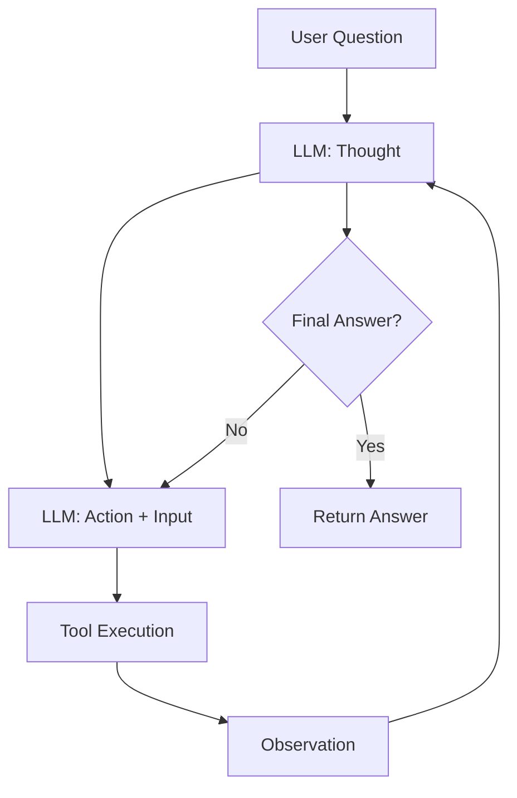

**Interview Q&A:**

*Q: ReAct ka biggest weakness kya hai aur production me kaise handle karega?*

ReAct ka sabse bada problem hai **error compounding** — agar step 2 me galat tool call hua, toh step 3, 4, 5 sab us galat observation pe based hain. Aur agar LLM tool selection me confuse ho jata hai (jaise 10 tools available hain), toh accuracy gir jati hai. Production me tu ismein **max_steps cap**, **per-step timeout**, **tool call validation** (Pydantic schema), aur **fallback to simpler agent** jaise guardrails laga. Plus, observability critical hai — har Thought/Action/Observation log kar with trace IDs (LangSmith ya OpenLLMetry use kar). Aur jab tool count zyada ho, RAG-based tool retrieval lagao — yaani query ke base pe top-K relevant tools select karo, sab nahi.

### 1.2 Reflexion (self-critique and retry)

**Definition:** Reflexion ek pattern hai jisme agent apne previous attempt ko **self-critique** karta hai, ek "reflection" generate karta hai (ki kya galat hua, kya improve karna chahiye), aur fir retry karta hai improved strategy ke saath. Yeh basically reinforcement learning ka linguistic version hai — gradient descent ki jagah natural language feedback.

**Why:** Real tasks me first attempt almost never perfect hota — coding me bug aata hai, search me wrong query hoti hai, math me arithmetic galti. Bina reflection ke agent same galti repeat karta hai. Reflexion explicit "lesson learned" memory build karta hai jo next attempt me prepend hota hai. Original Reflexion paper (Shinn et al. 2023) ne HumanEval pe GPT-4 ki performance 80% se 91% tak push ki sirf reflection layer add karke.

**How:**

```python
# Reflexion = Actor + Evaluator + Self-Reflection
def reflexion_agent(task: str, max_trials: int = 3):
    reflections = []  # accumulated lessons learned
    for trial in range(max_trials):
        # Actor: task solve karne ki koshish
        prompt = f"Task: {task}\n"
        if reflections:
            prompt += "Previous reflections (in se seekh):\n"
            for r in reflections:
                prompt += f"- {r}\n"
        attempt = llm(prompt)

        # Evaluator: kya yeh sahi hai?
        eval_prompt = f"Task: {task}\nAttempt: {attempt}\nKya yeh correct hai? PASS/FAIL aur reason."
        evaluation = llm(eval_prompt)

        if "PASS" in evaluation:
            return attempt  # ho gaya bhai

        # Self-Reflection: kya galat hua, next time kya karna chahiye?
        reflect_prompt = f"""Tu fail ho gaya. 
        Task: {task}
        Tera attempt: {attempt}
        Evaluator feedback: {evaluation}
        Ek concise reflection likh — kya galti hui aur next time kya different karega."""
        reflection = llm(reflect_prompt)
        reflections.append(reflection)
    return attempt  # last attempt return kar do
```

**Real-life Example:** Tu CP (competitive programming) practice kar raha hai. Pehla attempt — TLE aaya. Tu socha "shayad O(n^2) chal raha hai, optimize karna padega." Doosra attempt — Wrong Answer. Tu socha "edge case n=0 handle nahi kiya." Teesra attempt — AC. Yeh reflections tujhe har trial pe better banate hain. Same agent ke saath hota hai.

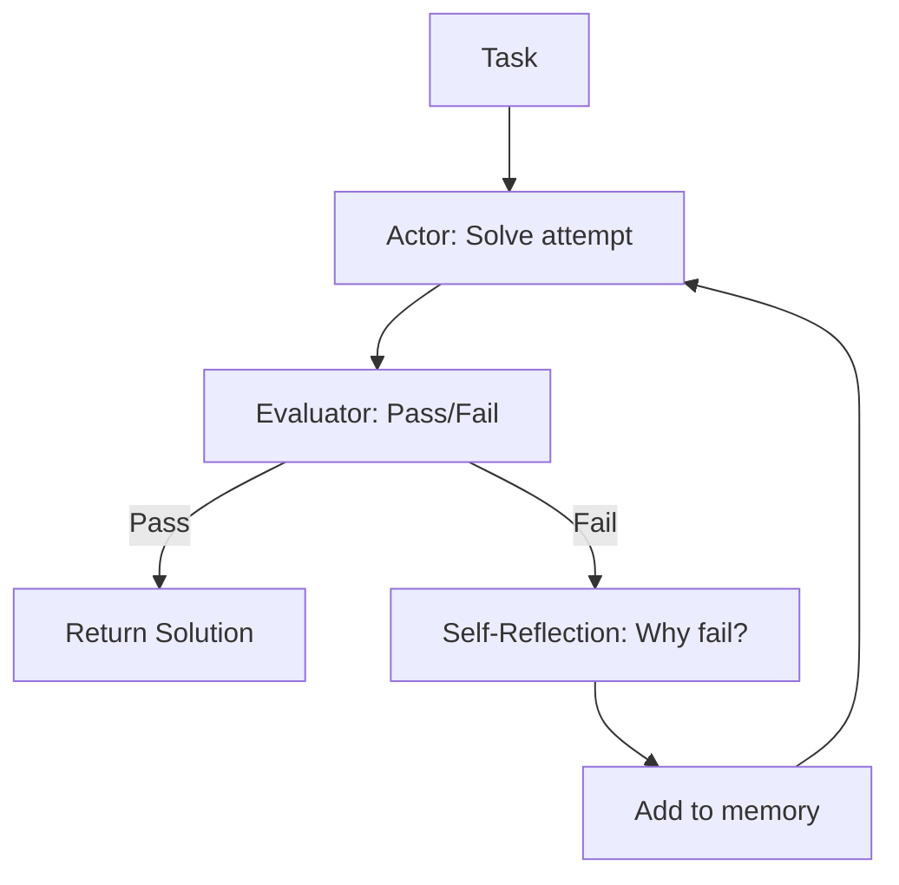

**Interview Q&A:**

*Q: Reflexion aur ReAct me fundamental difference kya hai?*

ReAct ek **single-trial** loop hai — ek hi attempt me thought-action-observation karte hue solution tak pahunchna. Reflexion **multi-trial** hai — pura task ek baar try karta hai, fail hone par overall strategy reflect karta hai, aur fir scratch se retry karta hai with accumulated lessons. ReAct fine-grained reasoning deta hai per-step level pe, Reflexion meta-level learning deta hai across attempts. Production me dono ko combine karte hain — har trial andar ReAct loop chalta hai, aur Reflexion outer loop me wrapper hota hai. Cost-wise Reflexion zyada expensive hai kyunki multiple full attempts hote hain, isliye ise critical tasks (code generation, complex reasoning) ke liye reserve rakhte hain.

### 1.3 Plan-and-Execute

**Definition:** Is pattern me agent pehle ek **complete plan** banata hai (multi-step todo list), fir ek alag executor agent ya same agent un steps ko sequentially (ya parallelly) execute karta hai. Planning aur execution decoupled hote hain — planner badi LLM ho sakti hai (GPT-4), executors choti aur fast (GPT-4o-mini, Haiku).

**Why:** ReAct me har step pe LLM rethink karta hai — yeh slow aur costly ho sakta hai jab task structure already obvious ho. Plan-and-Execute upfront thinking karta hai, fir execution fast hota hai. Plus, plan inspectable hota hai — user dekh sakta hai "yeh agent kya kya karne wala hai" before kuch execute ho. LangChain ka `plan_and_execute` aur BabyAGI is pattern par based hain.

**How:**

```python
def plan_and_execute(goal: str):
    # Step 1: Planner — full plan generate karo
    plan_prompt = f"""Goal: {goal}
    Ek step-by-step plan likh JSON array format me. Har step me:
    - id: number
    - action: kya karna hai
    - tool: konsa tool use karna hai (search/calc/code)
    - depends_on: list of step ids jin pe yeh depend karta hai
    """
    plan = json.loads(llm(plan_prompt))

    # Step 2: Executor — har step execute karo
    results = {}
    for step in plan:
        # dependencies ke results inject karo
        context = {dep: results[dep] for dep in step["depends_on"]}
        exec_prompt = f"Step: {step['action']}\nContext: {context}\nTool: {step['tool']}"
        result = execute_with_tool(exec_prompt, step["tool"])
        results[step["id"]] = result

    # Step 3: Synthesizer — final answer banao
    final = llm(f"Goal: {goal}\nAll step results: {results}\nGive final answer.")
    return final
```

**Real-life Example:** Soch tu ghar shift kar raha hai. Tu pehle ek pura plan banata hai: "1. Boxes khareedo, 2. Saamaan pack karo, 3. Truck book karo, 4. Naya address pe shift karo, 5. Unpack karo." Phir tu (ya tera helper) ek-ek step execute karte ja. Tu har step pe re-plan nahi karta — plan upfront hai. Bas agar koi step fail hua (truck cancel ho gaya) tab re-plan karte ho. Yahi Plan-and-Execute hai.

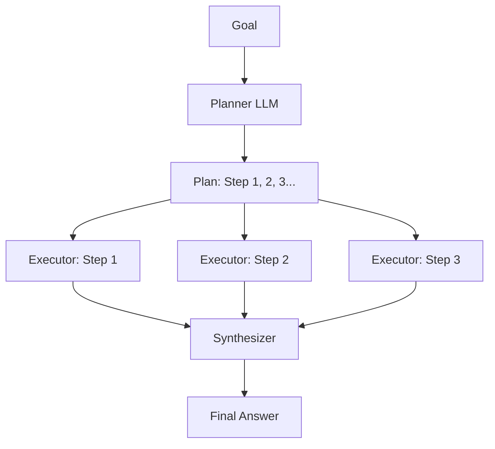

**Interview Q&A:**

*Q: Plan-and-Execute ke kya tradeoffs hain ReAct ke comparison me?*

Plan-and-Execute ka **pro** hai cost efficiency — planner ek hi baar bada model use karta hai, executors small models, parallel execution possible. **Con** hai rigidity — agar plan banate waqt agent ko sab info nahi thi, toh execution me galat plan revealed hota hai. Real production me **hybrid** use hota hai: plan banao, par har major step ke baad re-plan check ho ("kya plan abhi bhi sahi hai given new info?"). Yeh "Plan-Execute-Replan" pattern LangGraph me built-in hai. Aur agar task highly exploratory hai (research, debugging), tab pure ReAct better hai. Structured tasks (form filling, ETL pipeline, content generation) ke liye Plan-and-Execute jeetta hai.

### 1.4 Tree of Thoughts

**Definition:** Tree of Thoughts (ToT) me agent linear chain ke bajaye **multiple parallel reasoning paths** explore karta hai, ek tree structure me. Har node ek partial solution hai, har edge ek "next thought." Agent BFS ya DFS use karke promising branches explore karta hai aur dead-ends prune karta hai. Yashunari Yao et al. ka 2023 paper.

**Why:** Kuch problems me single linear reasoning insufficient hai — chess, Sudoku, creative writing, math olympiad. Inme tujhe alag-alag approaches try karne padte hain aur best wala chunna padta hai. CoT (Chain of Thought) me ek path follow karte ho; ToT me multiple paths simultaneously evaluate karte ho. ToT paper ne Game of 24 puzzle pe GPT-4 ki accuracy 4% (CoT) se 74% (ToT) tak push ki.

**How:**

```python
from heapq import heappush, heappop

def tree_of_thoughts(problem: str, max_depth: int = 4, beam_width: int = 3):
    # Beam search over thought tree
    # Har node: (negative_score, thought_path)
    frontier = [(-1.0, [])]  # initial empty path

    for depth in range(max_depth):
        new_frontier = []
        for neg_score, path in frontier:
            # Generate next possible thoughts (branch karo)
            candidates = llm(f"""Problem: {problem}
            Current reasoning so far: {path}
            Generate {beam_width} different next steps. JSON list.""")
            candidates = json.loads(candidates)

            for cand in candidates:
                new_path = path + [cand]
                # Evaluator se score lo: kitna promising hai yeh path?
                score = float(llm(f"Rate 0-1: {new_path} for {problem}"))
                # Terminal check
                if "SOLVED" in cand:
                    return new_path
                heappush(new_frontier, (-score, new_path))

        # Top beam_width branches keep karo
        frontier = []
        for _ in range(min(beam_width, len(new_frontier))):
            frontier.append(heappop(new_frontier))

    return frontier[0][1]  # best path
```

**Real-life Example:** Tu chess khel raha hai. Tu sirf "queen move karoon" nahi sochta — tu sochta hai "agar queen e4 jaye, opponent kya karega? agar f6, toh main kya karoon?" Yeh tree explore karta hai tera dimaag, alpha-beta pruning karke unpromising branches drop karta hai. Stockfish bhi yahi karta hai. ToT exactly yahi behavior LLM ko deta hai linguistic reasoning ke liye.

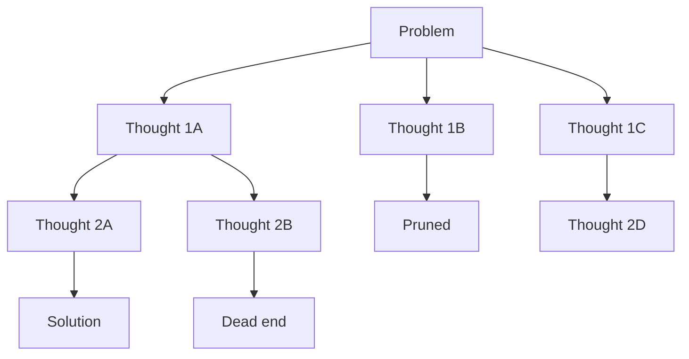

**Interview Q&A:**

*Q: ToT bahut expensive hai — kab use karna chahiye production me?*

Sahi observation. ToT me agar branching factor 5 aur depth 4 hai, toh 5^4 = 625 LLM calls minimum (worst case). Production me iska use **selective** karte hain: (1) high-stakes one-off decisions jaise legal contract analysis, financial planning, (2) offline batch processing jahan latency matter nahi karti, (3) creative tasks jaha multiple variants generate karne hi hain. Real-time chatbot me ToT use karna pagalpan hai. Optimization ke liye **early pruning** important hai — har depth pe sirf top-K branches keep karo (beam search). Aur evaluator ko sasta model rakho (Haiku ya local model), generator ko bada (Opus, GPT-4). Anthropic ka research suggest karta hai ToT-style diverse sampling ko parallel test-time compute ke through scale karna — OpenAI ka o1 model basically internal ToT-like search hi karta hai.

### 1.5 Chain of Verification

**Definition:** Chain of Verification (CoVe) ek pattern hai jisme LLM apne initial answer ke baad **verification questions** generate karta hai, un questions ka independently jawab deta hai (without seeing original answer to avoid bias), aur fir final answer revise karta hai inconsistencies ke basis pe. Meta AI ka 2023 paper.

**Why:** LLMs hallucination problem — bahut confidence ke saath galat facts likh dete hain. CoVe yeh kam karta hai by forcing self-verification. Original draft me bias ho sakta hai (LLM apne previous claim ko justify karega), isliye verification questions independently answer karne hote hain. Paper ne factual accuracy 23% se 60% tak improve ki Wikidata-based questions pe.

**How:**

```python
def chain_of_verification(question: str):
    # Step 1: Baseline answer
    draft = llm(f"Q: {question}\nGive a detailed answer.")

    # Step 2: Verification questions generate karo
    vq_prompt = f"""Original Q: {question}
    Draft answer: {draft}
    Generate 3-5 verification questions to fact-check key claims in the draft.
    Output as JSON list."""
    verification_qs = json.loads(llm(vq_prompt))

    # Step 3: Har verification Q ka independent answer (CRITICAL: draft mat dikhao)
    verified_facts = {}
    for vq in verification_qs:
        # Sirf vq pass karo, draft nahi — bias rokne ke liye
        ans = llm(f"Q: {vq}\nGive concise factual answer.")
        verified_facts[vq] = ans

    # Step 4: Final answer revise karo verification ke basis pe
    final_prompt = f"""Original Q: {question}
    Initial draft: {draft}
    Verified facts: {verified_facts}
    Revise the answer. Remove any claims that contradict verified facts.
    Mark uncertain claims with [unverified]."""
    final = llm(final_prompt)
    return final
```

**Real-life Example:** Tu academic paper likh raha hai. Pehle tu ek draft likhta hai citations ke saath. Fir tu ek-ek citation alag se verify karta hai — paper actually exist karta hai? Author name sahi hai? Year sahi hai? Claim actually paper me hai? Yeh independent verification step hi CoVe hai. Bina iske academic fraud ho jata hai, bina iske LLM hallucination ho jata hai.

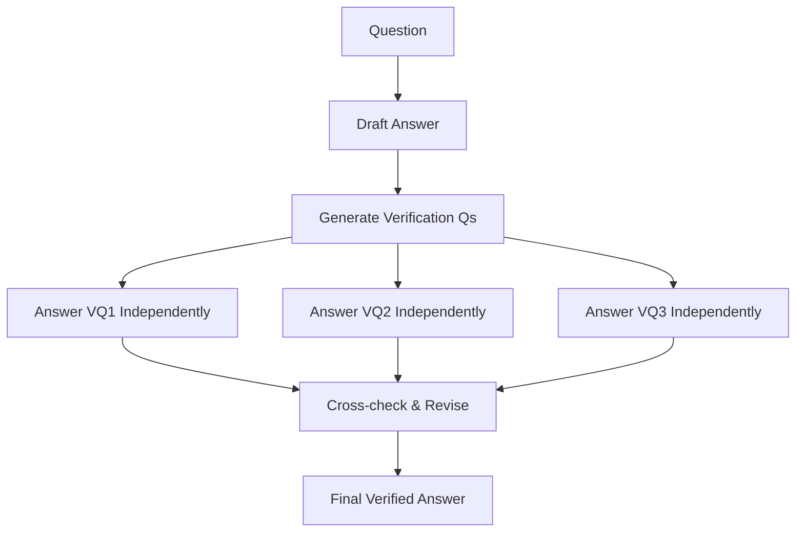

**Interview Q&A:**

*Q: CoVe latency 4x kar deta hai — kya yeh worth hai?*

Depends on domain. **High-trust domains** (medical, legal, financial advice, citations) me yeh non-negotiable hai — ek hallucinated fact se brand reputation aur lawsuit dono lag sakte hain. **Casual domains** (creative writing, brainstorming) me overkill hai. Optimization techniques: (1) Verification questions sirf un claims pe generate karo jo "factual" hain (numbers, names, dates) — opinions skip karo, ek classifier se filter karo. (2) Verification answers ko cache karo — same fact baar-baar verify mat karo. (3) Parallel API calls use karo verification ke liye. (4) Cheaper model use karo verification ke liye (yeh thodi counterintuitive hai but works because verification simpler hai than original generation). Production RAG systems me CoVe ko **citation grounding** ke saath combine karte hain — har claim ko source document me find karna mandatory.

### 1.6 Tool use as the central primitive

**Definition:** Modern agent design me **tools hi the most fundamental abstraction hain**, prompts ya chains nahi. Har capability — search, code execution, database query, API call, even another LLM — ek tool ke roop me model hota hai with strict input/output schema. Agent ka kaam basically "right tool with right arguments at right time" decide karna hai.

**Why:** Pre-tool era me agent capabilities prompt-engineering me embed thi (jaise "act as a calculator"). Yeh fragile aur unbounded tha. Tools introduce karne se: (1) Capabilities composable ho gayi — naya tool add karo, agent ko retrain nahi karna. (2) Sandboxing possible — code execution sandbox me, DB queries read-only roles ke saath. (3) Determinism aa gaya — calculator deterministic, LLM nahi. (4) Cost optimization — tool calls track ho sakte hain. OpenAI ka function calling, Anthropic ka tool_use, MCP (Model Context Protocol) — sab is paradigm pe based hain.

**How:**

```python
# Tool ko first-class abstraction banao
from pydantic import BaseModel, Field
from typing import Callable

class Tool(BaseModel):
    name: str
    description: str
    input_schema: dict  # JSON schema
    fn: Callable

    class Config:
        arbitrary_types_allowed = True

# Definition
class WeatherInput(BaseModel):
    city: str = Field(description="City name in English")
    units: str = Field(default="celsius", description="celsius or fahrenheit")

def get_weather(city: str, units: str = "celsius") -> dict:
    # asli code me weather API
    return {"city": city, "temp": 28, "units": units}

weather_tool = Tool(
    name="get_weather",
    description="Get current weather for a city. Use only for weather queries.",
    input_schema=WeatherInput.model_json_schema(),
    fn=get_weather,
)

# Agent loop me tool dispatch
def run_agent(question: str, tools: list[Tool]):
    tool_specs = [{"name": t.name, "description": t.description,
                   "input_schema": t.input_schema} for t in tools]
    tool_map = {t.name: t.fn for t in tools}

    messages = [{"role": "user", "content": question}]
    while True:
        resp = client.messages.create(
            model="claude-3-5-sonnet", messages=messages, tools=tool_specs
        )
        if resp.stop_reason == "end_turn":
            return resp.content[0].text
        # Tool use detect karo
        for block in resp.content:
            if block.type == "tool_use":
                result = tool_map[block.name](**block.input)
                messages.append({"role": "assistant", "content": resp.content})
                messages.append({"role": "user", "content": [{
                    "type": "tool_result", "tool_use_id": block.id,
                    "content": json.dumps(result)
                }]})
```

**Real-life Example:** Soch tu ek manager hai office me. Tujhe har skill khud nahi aati — tu CFO se finance puchta hai, lawyer se legal, engineer se tech. Har "specialist" ek tool hai with clear input (your question) aur clear output (their expert answer). Tera kaam hai sahi specialist ko sahi waqt par sahi sawal puchna. Yahi agent ka kaam hai with tools.

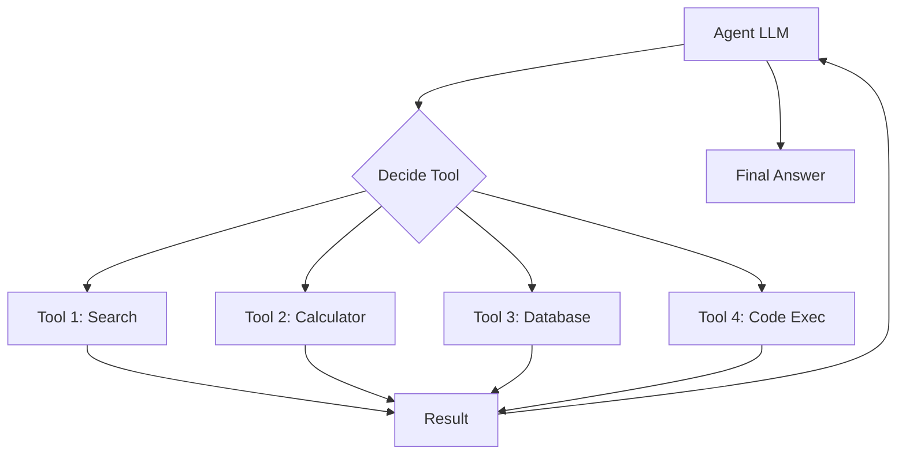

**Interview Q&A:**

*Q: Agent ke paas 100 tools hain — kaise scale karoge tool selection?*

Yeh **tool retrieval** problem hai aur production agents ka biggest scaling challenge. 5-10 tools tak LLM context me sab daal sakte hain. 100+ tools ke liye approaches: (1) **Hierarchical tools** — tools ko categories me group karo, pehle category select ho fir specific tool. (2) **RAG-based tool selection** — har tool ka description embed kar lo vector DB me, query aane par top-K relevant tools ko hi LLM context me daalo. (3) **Tool registry as MCP server** — Model Context Protocol use karke tools dynamically discover karo. (4) **Specialized agents** — alag-alag domains ke alag agents banao (research agent, coding agent), aur ek router top-level pe decide kare konsa agent invoke karna hai. Anthropic ki recent research suggest karti hai ki "code as actions" pattern (jisme agent Python code likhta hai jo tools ko library functions ki tarah call karta hai) better scale karta hai 1000+ tools tak.

---

## 2. Tool Use & Function Calling

Tools agent ki neev hain par **achhe tools design karna ek kala hai**. Aksar log API ko hi tool bana ke daal dete hain aur fir wonder karte hain ki agent kyun confuse ho raha hai. Yahan hum dekhenge ki tool design, selection, parallelization, error handling, aur result formatting ka kya impact hota hai agent performance pe.

### 2.1 Designing good tools (names, types, descriptions)

**Definition:** Tool design matlab us interface ko define karna jo LLM aur external system ke beech sit karta hai. Isme aata hai: tool ka **name** (descriptive aur unique), **parameters** ka type aur description, aur tool ka **overall description** (kab use karna hai, kab nahi).

**Why:** LLM tool description ko padhta hai aur usi base pe decide karta hai konsa tool kab use karna hai. Agar description ambiguous hai, LLM galat tool call karega. Agar parameter description weak hai, LLM galat input dega. Anthropic ki research dikhati hai ki tool description quality 30%+ accuracy difference la sakti hai. Yeh literally prompt engineering hai but tool ke liye.

**How:**

```python
# BAD tool design — pareshani
def get_data(id, type="default"):
    """Gets data."""
    pass

# GOOD tool design — clear, typed, well-documented
class GetUserOrderInput(BaseModel):
    user_id: str = Field(
        description="User ka unique ID, format 'usr_XXXX'. NOT email or username.",
        pattern=r"^usr_[A-Z0-9]+$"
    )
    order_status: Literal["pending", "shipped", "delivered", "cancelled"] = Field(
        description="Order status filter. Use 'pending' for unfulfilled orders."
    )
    limit: int = Field(default=10, ge=1, le=100,
        description="Max orders to return, between 1 and 100.")

def get_user_orders(user_id: str, order_status: str, limit: int = 10) -> list[dict]:
    """
    Retrieve a list of orders for a specific user filtered by status.

    Use this tool when:
    - User wants to see their order history
    - Question is about a specific order's tracking/status
    - You need order details to answer billing questions

    Do NOT use this tool when:
    - User is asking about products (use search_products instead)
    - User wants to PLACE an order (use create_order)
    - Question is about general policies (use knowledge_base)

    Returns: List of order dicts with keys: order_id, status, total, created_at
    """
    # implementation
    pass
```

**Real-life Example:** Tu ek naye intern ko kaam dene wala hai. Agar tu bole "data nikal de," intern confused hoga — kaun sa data, kahan se, kis format me. Agar tu bole "users table se pichle 7 din ke active users ka email aur signup date nikal, CSV format me, sorted by signup date desc" — toh intern direct execute karega. Tools ke saath bhi same — LLM "intern" hai jo description padhke kaam karta hai.

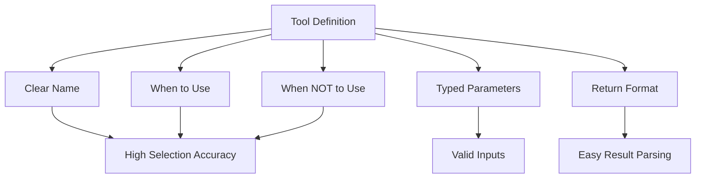

**Interview Q&A:**

*Q: Tool descriptions kitne detailed hone chahiye? Token cost bhi toh hai.*

Yeh classic tradeoff hai. Anthropic ki guidelines recommend karti hain "as detailed as a junior engineer onboarding doc." Concretely: tool name 3-5 words, top-level description 2-4 sentences with concrete examples, har parameter ka 1-line description with format/constraints, aur "when to use / when not to use" section if confusion possible. Token-wise yeh 100-300 tokens per tool aata hai. 10 tools = 1-3K tokens — context window me yeh acceptable hai given accuracy gains. Optimization: **tool retrieval** (top-K relevant tools hi load karo per query), **tool description compression** with embeddings if same tool baar-baar use hota hai, aur **example-based descriptions** (5 example queries jo is tool ko trigger karein, kyunki LLMs examples se zyada seekhte hain rules se).

### 2.2 Tool selection strategies

**Definition:** Tool selection matlab agent kaise decide karta hai available N tools me se konsa (ya konse multiple) call karna hai. Strategies: pure-LLM selection, embedding-based retrieval, hierarchical routing, learned routing, aur hybrid approaches.

**Why:** Galat tool select hua = galat answer. Aur agar agent har query pe sab tools consider karta hai context me, latency aur cost dono badhte hain. Selection strategy directly determine karti hai accuracy aur efficiency.

**How:**

```python
# Strategy 1: Embedding-based tool retrieval
from sentence_transformers import SentenceTransformer
import numpy as np

class ToolRetriever:
    def __init__(self, tools: list[Tool]):
        self.tools = tools
        self.encoder = SentenceTransformer("all-MiniLM-L6-v2")
        # tool description ko embed kar lo upfront
        descriptions = [f"{t.name}: {t.description}" for t in tools]
        self.tool_embeddings = self.encoder.encode(descriptions)

    def retrieve(self, query: str, top_k: int = 5) -> list[Tool]:
        q_emb = self.encoder.encode([query])[0]
        # cosine similarity
        sims = self.tool_embeddings @ q_emb / (
            np.linalg.norm(self.tool_embeddings, axis=1) * np.linalg.norm(q_emb)
        )
        top_indices = np.argsort(sims)[-top_k:][::-1]
        return [self.tools[i] for i in top_indices]

# Strategy 2: Hierarchical routing
def hierarchical_select(query: str):
    # Level 1: category select karo
    category = llm(f"Q: {query}\nCategory: [search, compute, db, comm]")
    # Level 2: us category ke andar specific tool
    tools_in_cat = TOOLS_BY_CATEGORY[category]
    tool = llm(f"Q: {query}\nTools: {tools_in_cat}\nWhich tool?")
    return tool
```

**Real-life Example:** Hospital me jab tu jata hai, receptionist (level 1 router) decide karta hai general medicine, surgery, ya ortho. Fir us department ka senior doctor (level 2) decide karta hai konsa specialist dekhega. Sab doctors ek hi room me nahi baithe — that would be chaotic aur expensive. Hierarchical tool selection isi tarah scale karta hai.

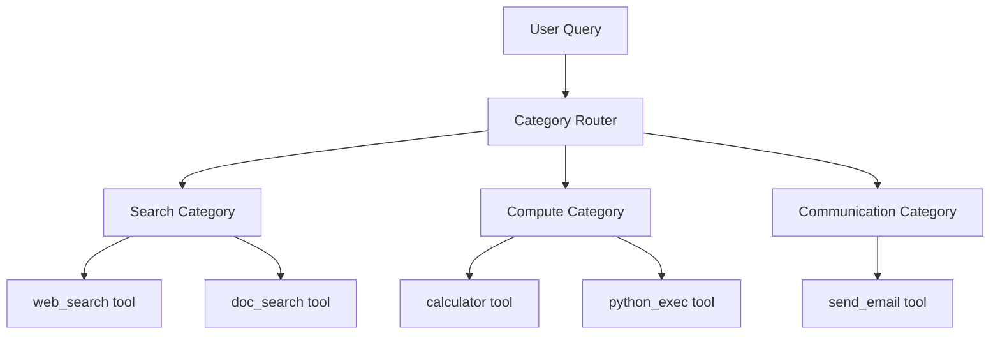

**Interview Q&A:**

*Q: Embedding-based retrieval me semantic mismatch ho jata hai — query me "weather" hai par tool ka naam "atmospheric_data" hai. Solution?*

Yeh real problem hai. Solutions: (1) **Synonym expansion** in tool description — "Get weather (also: temperature, climate, atmospheric conditions, forecast)". (2) **HyDE (Hypothetical Document Embeddings)** — pehle LLM se ek hypothetical tool description generate karwao query ke base pe, fir us description ka embedding match karo with actual tools. (3) **Query rewriting** — query ko expand/normalize karo before retrieval. (4) **Multi-vector embeddings** — har tool ke liye multiple embeddings (name, description, example queries), max similarity lo. (5) **Hybrid retrieval** — embedding + BM25 keyword search combine karo with reciprocal rank fusion. Production me typically hybrid + LLM re-ranking sabse robust hota hai. Cost: extra 50-100ms latency, but accuracy 15-25% improvement.

### 2.3 Parallel tool calls

**Definition:** Parallel tool calling matlab ek hi LLM turn me multiple independent tools simultaneously invoke karna, sequential ke bajaye. OpenAI GPT-4, Claude 3+ models native parallel tool calls support karte hain.

**Why:** Bahut sare tasks me independent sub-queries hote hain. "Mumbai aur Delhi ka current weather batao" — yeh 2 alag get_weather calls hain jo parallel ho sakti hain. Sequentially 2x latency, parallel me 1x. Real-world agentic workflows me 5-10x speedup easily milta hai.

**How:**

```python
import asyncio

async def parallel_tool_executor(tool_calls: list[dict]):
    """Multiple tool calls ko asyncio.gather se parallel run karo."""
    async def run_one(call):
        tool_fn = TOOLS[call["name"]]
        # CPU-bound tools ke liye run_in_executor use karo
        if asyncio.iscoroutinefunction(tool_fn):
            return await tool_fn(**call["arguments"])
        else:
            loop = asyncio.get_event_loop()
            return await loop.run_in_executor(None, lambda: tool_fn(**call["arguments"]))

    results = await asyncio.gather(*[run_one(c) for c in tool_calls],
                                    return_exceptions=True)
    return results

# Agent loop me
async def agent_with_parallel_tools(question: str):
    messages = [{"role": "user", "content": question}]
    while True:
        resp = client.messages.create(model="claude-3-5-sonnet",
                                       messages=messages, tools=tool_specs)
        # Multiple tool_use blocks ho sakte hain — sab parallel chala
        tool_uses = [b for b in resp.content if b.type == "tool_use"]
        if not tool_uses:
            return resp.content[0].text

        tool_calls = [{"name": tu.name, "arguments": tu.input} for tu in tool_uses]
        results = await parallel_tool_executor(tool_calls)

        # Saare results ek message me daalo
        tool_results = [{
            "type": "tool_result", "tool_use_id": tu.id,
            "content": json.dumps(r) if not isinstance(r, Exception) else f"Error: {r}",
            "is_error": isinstance(r, Exception)
        } for tu, r in zip(tool_uses, results)]
        messages.append({"role": "assistant", "content": resp.content})
        messages.append({"role": "user", "content": tool_results})
```

**Real-life Example:** Tu travel plan kar raha hai. Tujhe pata karna hai flight prices, hotel availability, aur weather forecast — teen alag-alag chizein. Tu ek-ek karke sequential nahi karta — tu ek tab me Skyscanner kholta hai, doosre me Booking, teesre me weather.com. Sab parallel. Yeh exactly parallel tool calling hai — independent queries ko serialize mat karo.

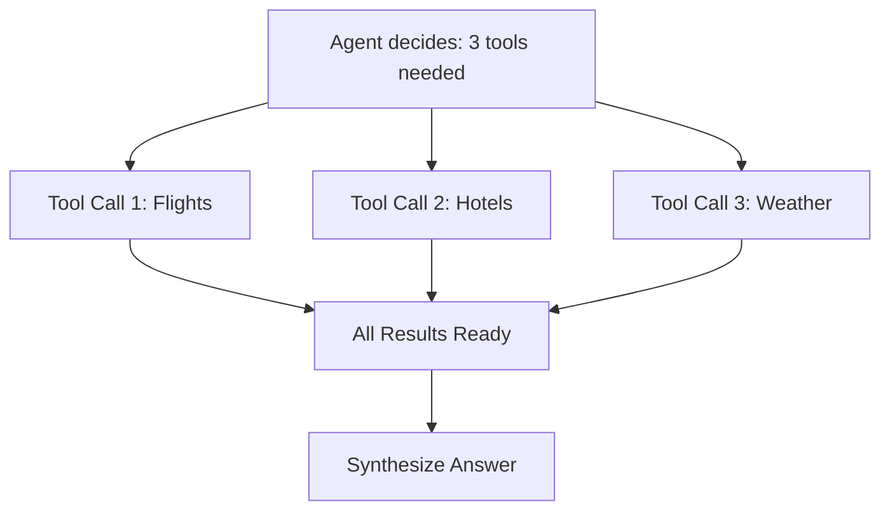

**Interview Q&A:**

*Q: Parallel tool calls ke kya pitfalls hain?*

Pehla, **dependency detection** — agar tool 2 ko tool 1 ka result chahiye, parallel safe nahi hai. LLM kabhi-kabhi galat parallel call kar deta hai (jaise "search for X then summarize" — search aur summarize parallel nahi ho sakte). Solution: explicit DAG of tool calls construct karo before execution. Doosra, **rate limiting** — parallel calls API rate limits hit kar sakte hain easily. Per-tool semaphore use karo (`asyncio.Semaphore(5)` per API). Teesra, **error handling** — agar 3 me se 1 fail ho gaya, agent decide kare retry kare ya partial results pe proceed kare. `return_exceptions=True` use karo `gather` me. Chautha, **observability** — parallel calls me trace ID propagate karna padta hai correctly har span ke liye, varna debugging nightmare. OpenTelemetry context propagation use karo.

### 2.4 Error handling and recovery

**Definition:** Agent ke context me error handling matlab tools fail hone par ya unexpected output dene par agent ka graceful behavior — retry, fallback, replan, ya user ko inform karna. Yeh distributed systems error handling se zyada complex hai kyunki LLM ka behavior non-deterministic hai.

**Why:** Production me tools fail karte hain — network errors, API rate limits, invalid inputs, timeouts. Agar agent crash kar gaya har error pe, useless hai. Robust error handling = production-grade agent.

**How:**

```python
from tenacity import retry, stop_after_attempt, wait_exponential
import logging

class ToolExecutor:
    def __init__(self):
        self.logger = logging.getLogger("agent.tools")

    @retry(stop=stop_after_attempt(3),
           wait=wait_exponential(multiplier=1, min=2, max=10))
    async def _call_with_retry(self, tool_fn, args):
        return await tool_fn(**args)

    async def execute(self, tool_call: dict, agent_messages: list):
        tool_name = tool_call["name"]
        args = tool_call["arguments"]

        try:
            # Step 1: input validation
            tool = TOOLS[tool_name]
            validated = tool.input_schema_class(**args)  # Pydantic validation

            # Step 2: retry with exponential backoff
            result = await self._call_with_retry(tool.fn, validated.dict())

            # Step 3: output validation
            if tool.output_schema:
                tool.output_schema(**result)

            return {"status": "success", "result": result}

        except ValidationError as e:
            # LLM ne galat input diya — usse bata do, retry karne do
            return {"status": "error", "type": "validation",
                    "message": f"Invalid input: {e}. Please fix and retry."}

        except RateLimitError:
            # Rate limit hit — agent ko bata do, alternative tool try kare ya wait
            return {"status": "error", "type": "rate_limit",
                    "message": "Rate limited. Try again in 30s or use different tool."}

        except TimeoutError:
            return {"status": "error", "type": "timeout",
                    "message": "Tool took too long. Try with smaller scope."}

        except Exception as e:
            self.logger.exception(f"Unexpected error in {tool_name}")
            # Critical error — agent ko stop karna chahiye ya escalate
            return {"status": "error", "type": "unknown",
                    "message": f"Unexpected error: {str(e)}. Please try alternative approach."}
```

**Real-life Example:** Tu Uber book kar raha hai. App ne show kar diya cab — tu tap karta hai, error aata hai "payment failed." App tujhe option deta hai retry, payment method change karo, ya cash select karo. App crash nahi karta. Agar tu 3 baar retry karke fail hua, app suggest karta hai "switch to Auto" — yeh fallback hai. Yahi pattern agents me chahiye — har tool failure ko meaningful actionable feedback me convert karo agent ke liye.

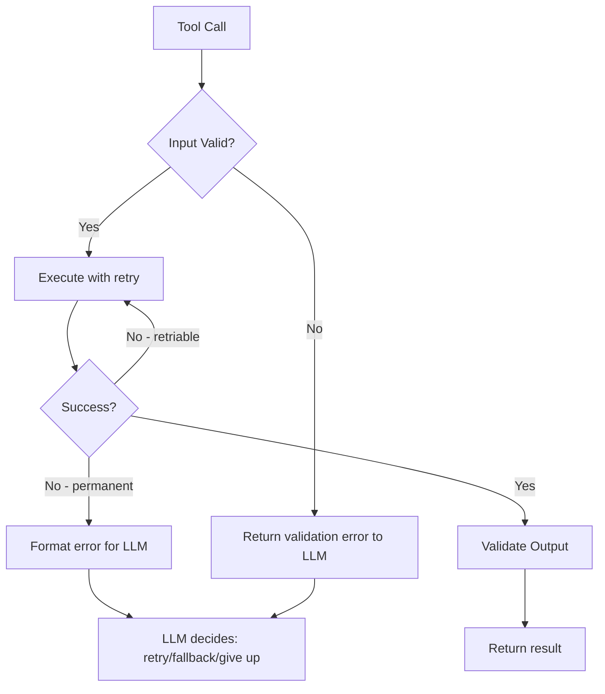

**Interview Q&A:**

*Q: Agent infinite loop me phans gaya — same tool repeatedly fail ho raha hai aur retry kar raha hai. Kaise rokoge?*

Yeh agentic systems ka classic failure mode hai — "doom loop." Defense in depth approach: (1) **Hard step limit** — max 20-30 tool calls per task, hit hone pe abort. (2) **Repetition detector** — same tool with same args within last 3 calls? Force agent to try something else by injecting message: "You've tried this 3 times. Try a different approach." (3) **Per-tool failure budget** — same tool 5 baar fail ho gaya within session, disable that tool for rest of session, agent ko bata do. (4) **Cost cap** — total tokens ya $ amount limit cross hone pe abort. (5) **Human escalation** — N consecutive errors ke baad user ko involve karo. (6) **Stuck detection via embeddings** — agent ke recent thoughts ka embedding check karo, agar high similarity to earlier thoughts (i.e., circular reasoning), abort. LangGraph ka `recursion_limit` aur custom interrupts yeh handle karte hain. Production me observability dashboard pe "stuck agents" alert lagao.

### 2.5 Tool result formatting

**Definition:** Tool result formatting matlab tool ke raw output ko aise structure karna ki LLM usse efficiently parse aur use kar sake. Includes: token-efficient encoding, important info highlighting, error vs success differentiation, aur LLM-friendly types (avoid binary blobs, encourage structured JSON or markdown).

**Why:** Tool ka raw output aksar massive aur noisy hota hai (jaise SQL query result of 10K rows, ya HTML page ka full markup). Yeh sab LLM context me daalna = tokens waste, reasoning poor. Smart formatting context efficiency aur reasoning quality dono badhata hai.

**How:**

```python
def format_sql_result(rows: list[dict], query: str) -> str:
    """SQL result ko LLM-friendly format me convert karo."""
    if not rows:
        return "Query executed successfully but returned 0 rows."

    n = len(rows)
    # Agar result bahut bada hai, summarize karo
    if n > 50:
        sample = rows[:10]
        cols = list(sample[0].keys())
        summary = (
            f"Query returned {n} rows. Showing first 10:\n\n"
            f"| {' | '.join(cols)} |\n"
            f"|{'|'.join(['---'] * len(cols))}|\n"
        )
        for row in sample:
            summary += f"| {' | '.join(str(row[c]) for c in cols)} |\n"
        summary += f"\n... and {n - 10} more rows. To see specific rows, refine query."
        return summary

    # Chota result — sab dikhao as markdown table
    cols = list(rows[0].keys())
    table = f"| {' | '.join(cols)} |\n|{'|'.join(['---'] * len(cols))}|\n"
    for row in rows:
        table += f"| {' | '.join(str(row[c]) for c in cols)} |\n"
    return table

def format_web_search(results: list[dict]) -> str:
    """Web search results — sirf relevant chunks rakho."""
    formatted = []
    for i, r in enumerate(results[:5], 1):
        # Title, URL, aur snippet (first 200 chars)
        snippet = r["snippet"][:200]
        formatted.append(f"[{i}] {r['title']}\nURL: {r['url']}\n{snippet}\n")
    return "\n".join(formatted)

def format_error(err: Exception, suggestion: str = None) -> str:
    """Errors ko LLM-actionable banao."""
    out = f"ERROR ({type(err).__name__}): {str(err)}"
    if suggestion:
        out += f"\nSuggestion: {suggestion}"
    return out
```

**Real-life Example:** Tu boss ko quarterly report submit kar raha hai. Tu raw Excel file forward nahi karta jisme 50 sheets aur 100K rows ho. Tu summary likhta hai — "Q3 revenue 15% up, top 3 products ABC contribute 60%, regional split attached." Boss ko digest karne layak format. LLM bhi same — usse digestible format do, raw dump nahi.

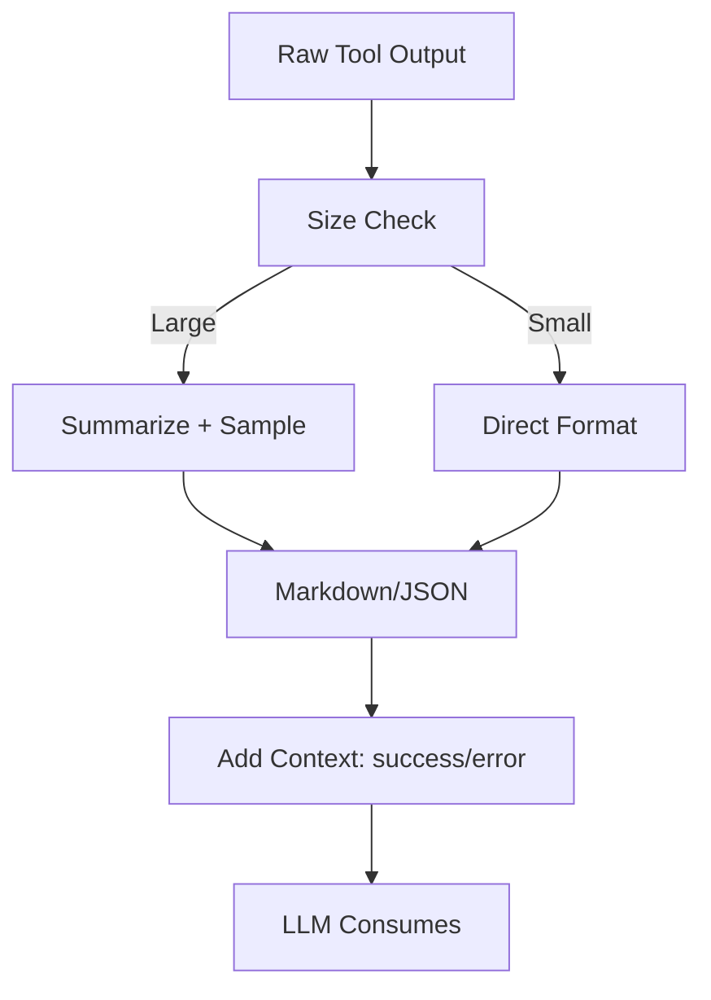

**Interview Q&A:**

*Q: Tool ne 100MB ka PDF return kiya — kaise handle karoge agent ke context me?*

Direct context me daalna impossible — 100MB ~ millions of tokens, koi context window nahi support karega. Approach: (1) **Tool ke level pe summarization** — tool internally PDF ko process kare aur sirf summary + key sections return kare. (2) **Reference-based pattern** — tool full content ko temp storage me save kare aur reference ID return kare. Agent baad me alag tools (`search_pdf`, `get_section`, `extract_table`) call karke specific parts retrieve kare. Yeh "indirection" pattern hai jo Anthropic ka research recommend karta hai for large outputs. (3) **Streaming/chunking** — agar agent ko progressively process karna hai, chunked iterator return karo aur agent loop me chunks process ho. (4) **Multi-modal handling** — agar PDF me images hain, separately extract karke vision model se describe karwao. (5) **Agentic chunking** — first pass me PDF ka outline/TOC return karo, agent decide kare konsa section detail me chahiye. Production document AI systems sab is pattern pe based hain.

---

## 3. Memory Systems

Agent without memory = goldfish. Har turn me sab kuch reset ho jata hai. Real-world agents ko different timescales pe yaad rakhna padta hai — current conversation, user preferences, learned facts, past task outcomes. Memory systems yahi structured rakhne ka tarika hain.

### 3.1 Short-term (conversation buffer)

**Definition:** Short-term memory matlab current conversation/session ke turns ka buffer jo LLM context me directly inject hota hai. Simplest form: sab messages ki list. Production me limited window with various truncation strategies.

**Why:** LLM stateless hai — without explicit message history, har turn naya conversation hai. Buffer maintain karna mandatory hai for any multi-turn interaction. But context window finite hai (200K tokens for Claude, 128K GPT-4o), aur cost linearly badhta hai with context size — toh smart management chahiye.

**How:**

```python
from collections import deque
from datetime import datetime

class ConversationBuffer:
    def __init__(self, max_messages: int = 20, max_tokens: int = 8000):
        self.messages = deque(maxlen=max_messages)
        self.max_tokens = max_tokens
        self.token_counter = TokenCounter()  # tiktoken etc

    def add(self, role: str, content: str):
        msg = {"role": role, "content": content, "ts": datetime.now()}
        self.messages.append(msg)
        # Token-based truncation
        self._truncate_by_tokens()

    def _truncate_by_tokens(self):
        # System message ko hamesha rakho
        # Old messages drop karo agar token limit cross
        while self._total_tokens() > self.max_tokens and len(self.messages) > 2:
            # First user/assistant pair drop karo (system rakho)
            for i, m in enumerate(self.messages):
                if m["role"] != "system":
                    del self.messages[i]
                    break

    def _total_tokens(self) -> int:
        return sum(self.token_counter.count(m["content"]) for m in self.messages)

    def get_messages(self) -> list[dict]:
        return [{"role": m["role"], "content": m["content"]} for m in self.messages]

# Sliding window strategy
class SlidingWindowBuffer(ConversationBuffer):
    """Last N turns hi rakho, baki drop."""
    pass

# Summary buffer strategy
class SummaryBuffer(ConversationBuffer):
    """Old messages ko summarize karke ek 'system summary' message me convert karo."""
    def _truncate_by_tokens(self):
        if self._total_tokens() > self.max_tokens:
            old = list(self.messages)[:-5]  # last 5 keep karo as-is
            recent = list(self.messages)[-5:]
            summary = llm(f"Summarize: {old}")
            self.messages = deque([
                {"role": "system", "content": f"Earlier conversation summary: {summary}"}
            ] + recent)
```

**Real-life Example:** Tu friend ke saath ek 2-ghante ki conversation me hai. Tu pehle 10 minutes ki har detail yaad nahi rakhta — tera dimaag automatically "gist" extract karta hai aur recent 5-10 minutes ka detail rakhta hai. Important moments yaad rehte hain (jab usne kuch shocking bola), routine baat dheere se fade ho jati hai. LLM agent ka short-term memory bhi isi tarah design hota hai.

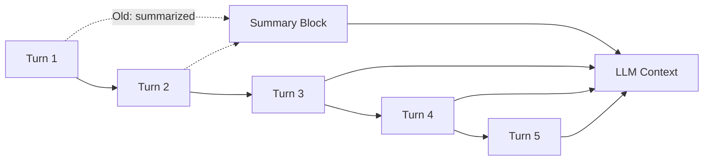

**Interview Q&A:**

*Q: Sliding window me recent N rakhne se important early context lost ho jata hai. Better approach?*

Sahi point. Hybrid strategies use karte hain production me: (1) **Summary + recent** — old messages summarize ho jate hain ek compressed block me, recent N detail me. LangChain ka `ConversationSummaryBufferMemory` yeh karta hai. (2) **Importance-weighted retention** — har message ko score karo (LLM se ya heuristics se), low-importance drop pehle. (3) **Topic-segmented** — conversation ko topics me split karo, har topic ka summary alag, current topic detail me. (4) **Vector-based recall** — sab messages embed karke store karo, current query ke base pe relevant past messages retrieve karo (effectively long-term me convert kar diya). Modern systems jaise ChatGPT memory feature combination use karte hain — recent buffer + extracted facts in long-term store + topic summaries.

### 3.2 Long-term (vector store + summary)

**Definition:** Long-term memory matlab persistent store jo sessions ke beech survive karta hai. Typical implementation: facts/preferences/past_interactions ko embed karke vector DB (Pinecone, Weaviate, Chroma, pgvector) me store karna, plus structured summaries SQL/document store me. Query time pe relevant memories retrieve karke context me inject karna.

**Why:** User-specific personalization (tera naam, preferences, past projects), learned domain knowledge, aur cross-session context — yeh sab without long-term memory impossible hai. ChatGPT ka "Memory" feature, Claude Projects, aur custom agents sab long-term memory pe heavily depend karte hain.

**How:**

```python
from chromadb import PersistentClient

class LongTermMemory:
    def __init__(self, user_id: str):
        self.user_id = user_id
        client = PersistentClient(path=f"./mem/{user_id}")
        self.collection = client.get_or_create_collection("memories")
        self.encoder = SentenceTransformer("all-MiniLM-L6-v2")

    def store(self, text: str, metadata: dict = None):
        emb = self.encoder.encode([text])[0].tolist()
        meta = {"user_id": self.user_id, "ts": str(datetime.now()), **(metadata or {})}
        self.collection.add(
            embeddings=[emb],
            documents=[text],
            metadatas=[meta],
            ids=[f"mem_{datetime.now().timestamp()}"]
        )

    def recall(self, query: str, top_k: int = 5) -> list[str]:
        q_emb = self.encoder.encode([query])[0].tolist()
        results = self.collection.query(
            query_embeddings=[q_emb],
            n_results=top_k,
            where={"user_id": self.user_id}  # user isolation important
        )
        return results["documents"][0]

# Agent integration
def agent_with_memory(user_id: str, question: str):
    mem = LongTermMemory(user_id)
    relevant_memories = mem.recall(question, top_k=3)

    system = f"""You are a personal assistant.
    Relevant past context about the user:
    {chr(10).join(f'- {m}' for m in relevant_memories)}
    """
    messages = [{"role": "system", "content": system},
                {"role": "user", "content": question}]
    response = llm(messages)

    # Naye facts extract karke store karo (after conversation)
    facts = extract_facts(question, response)
    for fact in facts:
        mem.store(fact)
    return response
```

**Real-life Example:** Tu ek therapist ke paas regular jata hai. Therapist ke paas tere notes hain — pichli sessions me kya discuss hua, tere recurring patterns, family background. Har session start me wo tera file dekhti hai aur context me aati hai. Yeh long-term memory hai. Bina iske, har session pehle session jaisa lagega — koi growth nahi.

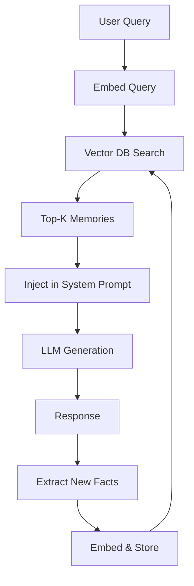

**Interview Q&A:**

*Q: Long-term memory me stale/contradictory facts ho jaate hain — "user lives in Mumbai" 2 saal pehle, ab Bangalore. Kaise handle karoge?*

Yeh **memory consolidation** problem hai aur seriously hard hai. Approaches: (1) **Timestamps everywhere** — har memory pe ts, retrieval me recency boost karo (exponential decay). (2) **Contradiction detection** — naya fact store karne se pehle existing memories se contradict karta hai check karo (LLM se), agar yes toh old ko mark obsolete. (3) **Periodic consolidation** — background job jo memories ko cluster karke duplicates merge kare aur conflicts resolve kare LLM ke through. (4) **Versioning** — memories immutable, naya version add ho with reference to old. Retrieval me latest version use ho. (5) **Confidence scores** — har memory pe confidence, repeated mentions confidence badhayein, contradictions ghatayein. Real production systems (jaise Letta/MemGPT) explicit memory management functions provide karte hain — agent khud `update_memory`, `delete_memory` call kar sakta hai jab usse pata chale fact change hua.

### 3.3 Episodic vs semantic memory

**Definition:** Cognitive science se uthayi gayi distinction. **Episodic memory** = specific experiences/events with time and context ("Tuesday ko user ne X puchha tha"). **Semantic memory** = abstract facts/knowledge without specific context ("user prefers Python over Java"). Dono different storage aur retrieval patterns chahiye.

**Why:** Episodic se "kab kya hua" answer milta hai (debugging, history queries). Semantic se "user kaisa hai" (personalization). Dono ko ek hi store me daalna confusion paida karta hai — episodic me overflow ho jata hai, aur abstract patterns lost ho jate hain. Separation karne se retrieval bhi targeted hota hai.

**How:**

```python
class EpisodicMemory:
    """Specific events/conversations with full context."""
    def store_episode(self, episode: dict):
        # Full conversation snippet, timestamp, user state
        self.db.insert({
            "type": "episode",
            "ts": episode["ts"],
            "summary": episode["summary"],
            "full_transcript": episode["transcript"],
            "tools_used": episode["tools"],
            "outcome": episode["outcome"],
        })

    def recall_recent(self, days: int = 7):
        return self.db.query(type="episode", ts_gte=now() - days)

class SemanticMemory:
    """Distilled facts/preferences."""
    def upsert_fact(self, fact: str, confidence: float):
        # Existing fact se contradict toh nahi karta? check karo
        existing = self.db.query(type="fact", embedding_similar=fact)
        if existing:
            # Resolve conflict
            self.db.update(existing.id, fact=fact, confidence=confidence)
        else:
            self.db.insert({"type": "fact", "fact": fact, "confidence": confidence})

# Memory consolidation: episodic -> semantic
def consolidate(episodic: EpisodicMemory, semantic: SemanticMemory):
    """Periodic job: recent episodes se patterns nikalo aur semantic me daalo."""
    recent = episodic.recall_recent(days=7)
    patterns = llm(f"""From these recent interactions:
    {recent}
    Extract stable user preferences/facts (not one-off events).
    Format: JSON list of facts.""")
    for fact in json.loads(patterns):
        semantic.upsert_fact(fact["text"], fact["confidence"])
```

**Real-life Example:** Tu 10 saal ka pichla incident yaad karta hai — "Goa trip me beach pe friends ke saath sunset" — yeh episodic. Tu yeh fact yaad rakhta hai — "main seafood pasand karta hoon" — yeh semantic. Episodic se semantic banta hai over time — bahut saari Goa/seafood-related episodes consolidate hoke generic preference ban gayi. Same in agents.

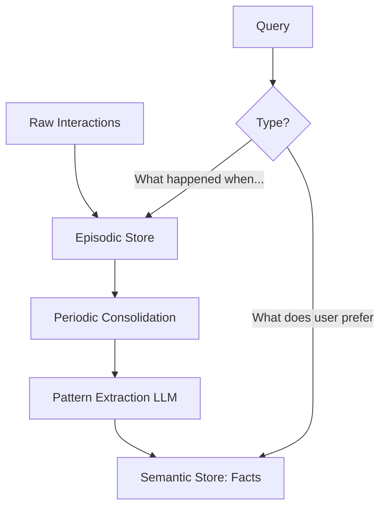

**Interview Q&A:**

*Q: Production me episodic vs semantic split kab justify hota hai? Overhead worth hai?*

Yeh depend karta hai use case pe. **Conversational assistants** (ChatGPT-style) jahan multi-month relationship hai user ke saath — definitely worth it. **Single-task agents** (jaise ek code review bot) — overkill, simple buffer enough hai. **Customer support agents** — episodic critical hai for "what did we discuss last call" queries, semantic for "this customer prefers email contact" type stable preferences. Implementation cost: 2x storage, 2x query complexity, but retrieval accuracy 30-40% better targeted queries pe (per Letta benchmarks). Practical advice: start simple with single store, jab "stale facts" aur "context overflow" complaints aane lage tab split karo. MemGPT-style frameworks yeh distinction built-in dete hain so adoption easier.

### 3.4 Memory consolidation strategies

**Definition:** Memory consolidation matlab raw memories (interactions, facts) ko process karke compressed, organized, aur higher-level representation me convert karna. Strategies: summarization, clustering, hierarchical aggregation, importance-based pruning, aur contradiction resolution.

**Why:** Without consolidation, memory store unbounded grow karta hai aur retrieval slow + noisy ho jata hai. Plus, raw episodes me redundancy hoti hai — user ne 50 baar mention kiya "I'm a Python developer," yeh ek fact me consolidate hona chahiye. Consolidation human sleep me hota hai — REM sleep me episodic memories semantic me convert hoti hain. Agents me yeh explicit job hota hai.

**How:**

```python
class MemoryConsolidator:
    def __init__(self, store):
        self.store = store

    def consolidate_daily(self):
        """Daily background job — recent memories ko process karo."""
        recent = self.store.get_recent(hours=24)

        # Strategy 1: Cluster similar memories
        clusters = self._cluster_by_similarity(recent, threshold=0.85)
        for cluster in clusters:
            if len(cluster) > 1:
                merged = self._merge_cluster(cluster)
                self.store.replace(cluster, merged)

        # Strategy 2: Hierarchical summarization
        # 100 raw memories -> 10 day-summaries -> 1 week-summary
        if self.store.count_at_level(0) > 100:
            chunks = self.store.get_chunks_at_level(0, chunk_size=10)
            for chunk in chunks:
                summary = llm(f"Summarize these memories: {chunk}")
                self.store.add_at_level(1, summary, parent_ids=[m.id for m in chunk])

        # Strategy 3: Importance-based pruning
        for mem in self.store.get_at_level(0):
            score = self._importance_score(mem)
            if score < 0.2 and mem.age_days > 30:
                self.store.archive(mem)

    def _importance_score(self, mem) -> float:
        # Heuristics: recency, access_count, explicit_user_marked, emotional_weight
        recency = exp(-mem.age_days / 30)
        access = log(1 + mem.access_count)
        emotion = mem.emotional_intensity  # detected via classifier
        return 0.4 * recency + 0.3 * access + 0.3 * emotion

    def _merge_cluster(self, cluster: list) -> dict:
        prompt = f"Merge these similar memories into one concise statement:\n{cluster}"
        merged_text = llm(prompt)
        return {"text": merged_text, "source_ids": [m.id for m in cluster],
                "ts": max(m.ts for m in cluster)}
```

**Real-life Example:** Soch tu 6 saal IIT me hai. Tujhe har lecture word-by-word yaad nahi — semester end me concepts crystallize ho jate hain ("Chapter 5 ka theme yeh tha"). Year end me bigger themes ("yeh pura year algorithms par focus tha"). Graduation pe overall ("CS degree ne mujhe X kind of thinking sikhayi"). Yeh hierarchical consolidation hai — detail neeche, abstraction upar. Dimaag automatically karta hai; agent me explicit code se karna padta hai.

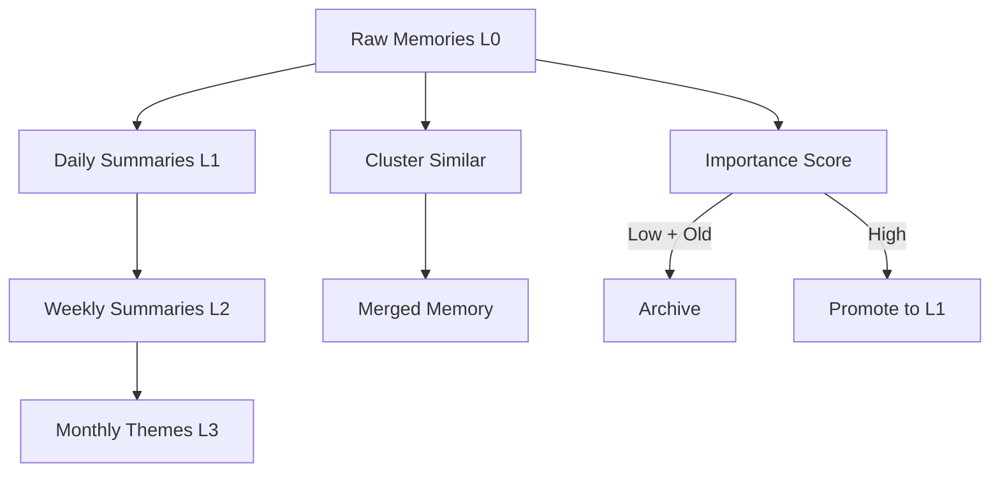

**Interview Q&A:**

*Q: Consolidation me information loss hota hai — kab kab bekar consolidation se important detail udd jati hai. Mitigation?*

Real risk hai. Mitigations: (1) **Lossless archival** — original raw memories archive me always rakho (cheap object storage, S3), consolidated versions hot store me. Agar deep dive chahiye, archive se retrieve kar sakte ho. (2) **Reversible summarization** — summary me source IDs reference karo so traceability rahe. (3) **Sensitive memory tagging** — kuch memories ko "do not consolidate" mark karo (legal info, exact quotes, etc.). (4) **Human-in-the-loop** for critical memories — important fact extraction par user confirmation lo. (5) **Test-time selective expansion** — agent agar feel kare current context insufficient hai, explicitly older detailed memories request kare. MemGPT's "page in" mechanism yeh karta hai. (6) **Multi-resolution storage** — same content different abstraction levels pe parallelly rakho, query type ke base pe right level pick karo.

### 3.5 MemGPT-style memory hierarchies

**Definition:** MemGPT (Berkeley, 2023) ka core idea hai operating system ka virtual memory paradigm LLMs pe apply karna. **Main context** = RAM (limited, fast access, in LLM context window). **External context** = Disk (large, slow, in vector DB). Agent explicitly memory management functions call karta hai — "read this from disk," "save this to disk," "evict that from RAM" — like how OS pages memory.

**Why:** Naive long-term memory me retrieval reactive hota hai (query aaye toh search karo). MemGPT proactive control deta hai — agent decide karta hai kab kya memory load karna hai based on conversation flow. Yeh "infinite context" illusion paida karta hai bounded context window me.

**How:**

```python
# Simplified MemGPT-style implementation
class MemGPTAgent:
    def __init__(self, persona: str):
        self.main_context = {
            "system": "You are a memory-managed agent.",
            "persona": persona,
            "recent_messages": [],  # last K messages
            "core_memory": "",  # always-in-context user/agent state, limited size
        }
        self.recall_storage = VectorDB("recall")  # past conversation messages
        self.archival_storage = VectorDB("archival")  # arbitrary facts

    def get_memory_tools(self):
        return [
            Tool(name="core_memory_append",
                 description="Add to core memory (always visible). Use for stable user facts.",
                 fn=self._core_append),
            Tool(name="core_memory_replace",
                 description="Replace section of core memory.",
                 fn=self._core_replace),
            Tool(name="recall_search",
                 description="Search past conversation history for specific info.",
                 fn=self._recall_search),
            Tool(name="archival_insert",
                 description="Store a long-term fact/document.",
                 fn=self._archival_insert),
            Tool(name="archival_search",
                 description="Search long-term storage for relevant info.",
                 fn=self._archival_search),
        ]

    def _core_append(self, content: str, section: str = "user"):
        if section not in self.main_context["core_memory"]:
            self.main_context["core_memory"] += f"\n[{section}] "
        self.main_context["core_memory"] += content + "\n"
        # Size check — agar exceed kar gaya, pressure agent to consolidate
        if len(self.main_context["core_memory"]) > MAX_CORE_SIZE:
            self._trigger_memory_pressure()

    def _recall_search(self, query: str) -> list[str]:
        return self.recall_storage.query(query, top_k=5)

    def step(self, user_msg: str):
        self.main_context["recent_messages"].append({"role": "user", "content": user_msg})
        # Recall storage me bhi store karo for future search
        self.recall_storage.add(user_msg)

        # Compose context for LLM
        ctx = self._compose_context()
        response = llm_with_tools(ctx, self.get_memory_tools())
        # Yeh response me memory tool calls bhi ho sakte hain — execute already
        self.main_context["recent_messages"].append({"role": "assistant", "content": response})
        self.recall_storage.add(response)

        # Context overflow check
        if self._token_count() > MAIN_CTX_LIMIT:
            self._evict_old_messages()
        return response
```

**Real-life Example:** Soch tu ek lawyer ho jiske paas chote desk hai (RAM = main context) aur ek bada filing cabinet (disk = archival storage). Active case ke documents desk pe — quickly accessible. Old cases cabinet me. Naya client aaya, tu cabinet se uske past files nikaalta hai aur desk pe rakhta hai. Desk full hua, oldest cases wapas cabinet me. Tu actively decide karta hai kya kahan jaye — yeh MemGPT ka explicit memory control hai.

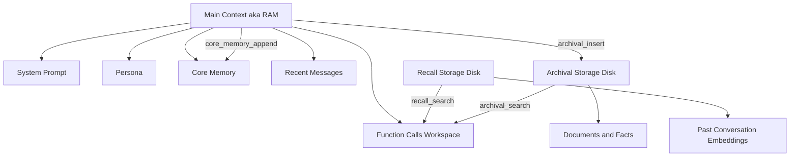

**Interview Q&A:**

*Q: MemGPT vs simple RAG-based memory — kab MemGPT worth the complexity?*

Simple RAG-based memory me agent passive hai — query aati hai, system top-K relevant memories inject karta hai, LLM generate karta hai. MemGPT me agent active hai — wo decide karta hai konsi memory kab fetch ya store karni hai, multiple memory tiers manage karta hai, aur "out of context" se "in context" explicitly move karta hai. **MemGPT worth it** for: (1) Long-running agents (weeks/months of interaction), (2) Tasks requiring multi-hop memory reasoning ("recall the project we discussed in March, then find related document from June"), (3) Self-editing memory (user kahta hai "remember that I prefer Sundays for meetings" — agent ko explicitly core memory me daalna chahiye). **Simple RAG enough** for: short-session agents, FAQ bots, single-task agents. Trade-off: MemGPT me 2-3x more LLM calls per turn (memory management overhead), but qualitatively better long-context behavior. Letta (MemGPT successor) production-ready implementation provide karta hai.

---

## Resources & further reading

- **ReAct: Synergizing Reasoning and Acting in Language Models** — Yao et al., 2022 (https://arxiv.org/abs/2210.03629). Foundational paper, original ReAct prompting pattern. Padhna mandatory hai agent dev ke liye.
- **Reflexion: Language Agents with Verbal Reinforcement Learning** — Shinn et al., 2023 (https://arxiv.org/abs/2303.11366). Self-critique aur retry loop ka theoretical aur empirical foundation.
- **Toolformer: Language Models Can Teach Themselves to Use Tools** — Schick et al., 2023 (https://arxiv.org/abs/2302.04761). Self-supervised tool-use training. Tool design principles ke liye useful.
- **MemGPT: Towards LLMs as Operating Systems** — Packer et al., 2023 (https://arxiv.org/abs/2310.08560). Memory hierarchy paradigm. Letta framework iska successor hai.
- **Tree of Thoughts: Deliberate Problem Solving with Large Language Models** — Yao et al., 2023 (https://arxiv.org/abs/2305.10601). ToT formalization aur Game of 24 results.
- **Chain-of-Verification Reduces Hallucination in Large Language Models** — Dhuliawala et al., 2023 (https://arxiv.org/abs/2309.11495). CoVe pattern with empirical hallucination reduction.
- **Plan-and-Solve Prompting** — Wang et al., 2023 (https://arxiv.org/abs/2305.04091). Plan-and-execute pattern formalization.
- **Anthropic's "Building Effective Agents"** blog post — practical patterns including augmented LLM, prompt chaining, routing, parallelization, orchestrator-workers, evaluator-optimizer. Saari current best practices ka summary.
- **LangGraph documentation** — production agent framework, state machines + memory + interrupts. ReAct, Plan-Execute, Reflexion sab built-in templates.
- **MCP (Model Context Protocol)** specification — standardized tool/resource interface from Anthropic. Future of tool ecosystems.
- **Cognitive Architectures for Language Agents (CoALA)** — Sumers et al., 2024 — taxonomy of agent designs jisme memory, planning, action all formal terms me defined hain.
- **Lilian Weng's "LLM Powered Autonomous Agents"** blog post — comprehensive overview, often cited as the canonical agent reference.

Bas itna start ke liye kaafi hai. Yeh sab implement karke production me deploy kar — fir advanced topics jaise multi-agent systems, RLHF for agents, aur world models aate hain. Lekin foundations strong rakh — bina inke advanced systems samajh nahi aayenge.
