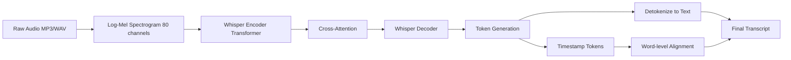
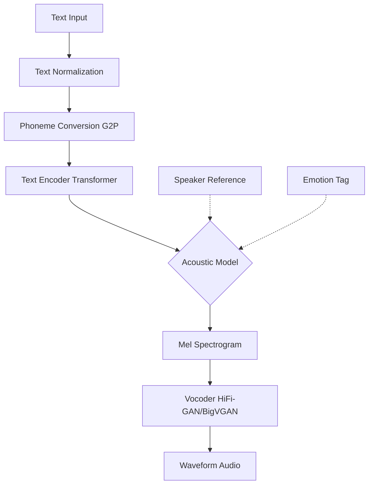
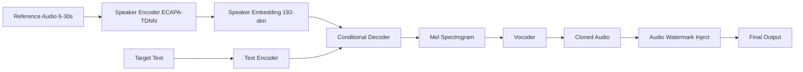
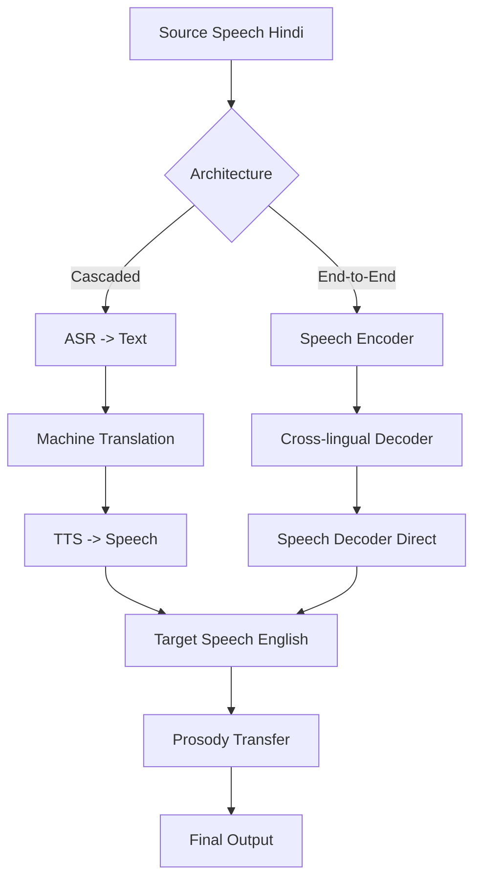
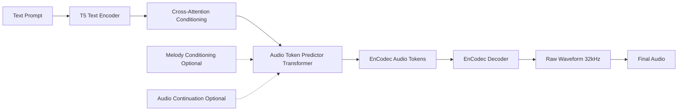
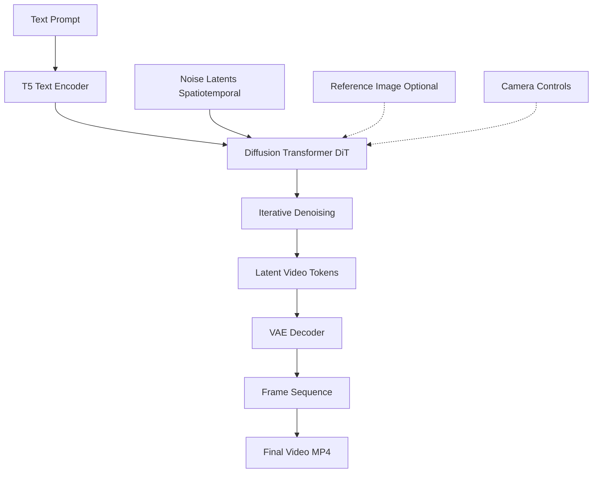
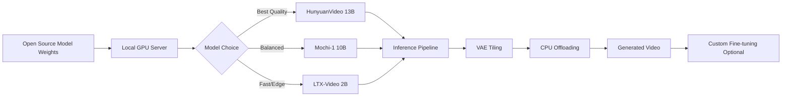
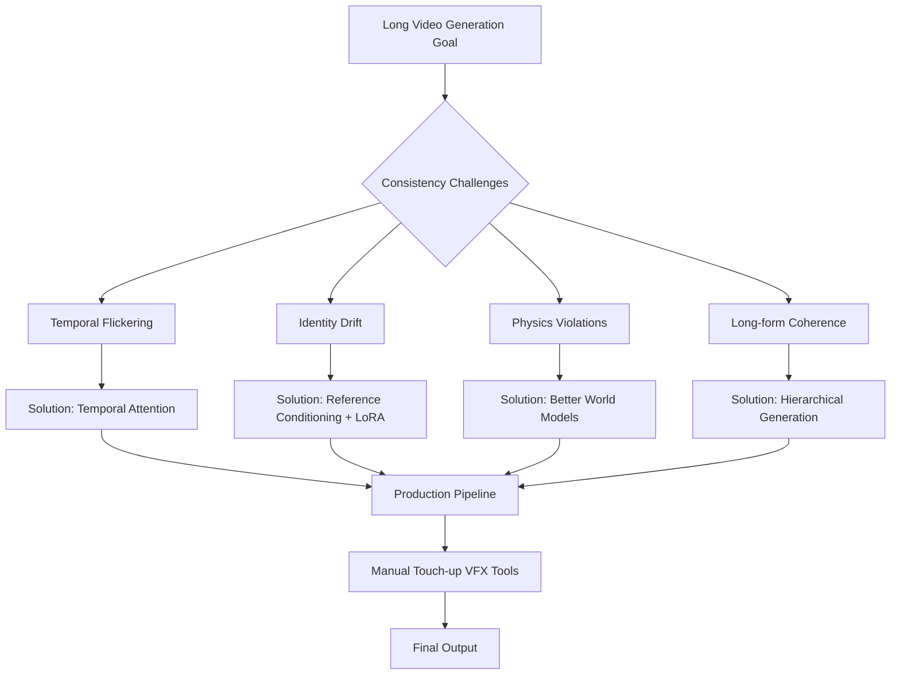

# Audio & Video Models

Audio aur video gen AI ka next frontier hai — Whisper se 10 minute ka audio 10 second me transcribe ho jata hai, Sora se text se video bann jaata hai. Bhai, jo kaam pehle weeks lagta tha — podcast transcription, dubbing, video editing, animation — woh ab API call me ho raha hai. Yeh sirf "cool demos" nahi hai; yeh ek poora industry shift hai jaha audio-video creation ki marginal cost zero ki taraf jaa rahi hai.

Is guide me hum 8 critical subtopics cover karenge — Whisper se lekar Sora tak, voice cloning se lekar HunyuanVideo tak. Har subtopic me tujhe definition milegi, "why" milega (yaani business/technical justification), "how" milega Python code ke saath (whisper, transformers, diffusers libraries), real-life example, mermaid diagram, aur interview-style Q&A. Senior dev se intern wali baat — no fluff, sirf kaam ki cheez.

Ek baat dimaag me bitha le — audio aur video models compute-heavy hote hain. Inference latency, GPU memory, aur cost — yeh teeno design decisions drive karte hain. Toh sirf "kaise chalana hai" nahi, "kab use karna hai aur kab nahi" — yeh bhi seekhna hai.

---

## 1. Audio Models

### 1.1 Whisper (ASR)

**Definition.** Whisper OpenAI ka open-source Automatic Speech Recognition (ASR) model hai jo 99 languages me audio ko text me convert karta hai. Yeh ek encoder-decoder Transformer hai jo 680,000 hours ke multilingual, multitask supervised data pe trained hai. Multitask matlab — ek hi model transcription, translation, language identification, aur voice activity detection sab kar sakta hai.

**Why.** Pehle ASR ke liye tujhe Google Speech API ya AWS Transcribe pe paisa dena padta tha — per minute charge, vendor lock-in, privacy issues. Whisper ne yeh sab tod diya. Local pe chala, free, aur accent-robust hai. Indian English, Hinglish, code-switched audio — sab handle kar leta hai. Production me podcast transcription, meeting notes, subtitle generation, voice-activated agents — sab Whisper se ban rahe hain. `whisper-large-v3` ka WER (Word Error Rate) Hindi pe ~10-12% hai, jo ki paid services ke barabar ya better hai.

**How.**

```python
# Whisper inference using openai-whisper library
import whisper

# Model load — 'tiny', 'base', 'small', 'medium', 'large-v3' options hain
# large-v3 sabse accurate, but ~3GB VRAM chahiye
model = whisper.load_model("large-v3")

# Audio file transcribe karo — language auto-detect ho jaati hai
# fp16=False agar CPU pe chala rahe ho
result = model.transcribe(
    "podcast_episode.mp3",
    language="hi",          # Hindi force kar diya, warna auto-detect
    task="transcribe",      # ya "translate" agar English chahiye
    word_timestamps=True,   # word-level timing — subtitle banane ke liye clutch
    fp16=True               # GPU pe half-precision — 2x speed up
)

# Output dictionary mil jaata hai — 'text', 'segments', 'language'
print(result["text"])

# Segments me start/end timestamps hote hain — SRT/VTT banane ke liye
for seg in result["segments"]:
    print(f"[{seg['start']:.2f} -> {seg['end']:.2f}] {seg['text']}")
```

Production me `faster-whisper` use karna — yeh CTranslate2 backend pe chalta hai, 4x faster aur half memory leta hai. Streaming use case ke liye `whisper-streaming` ya `whisper.cpp` (C++ port) dekh.

**Real-life example.** Ek edtech startup ne Whisper ko apne lecture platform me integrate kiya. Faculty Hindi me padhata hai, Whisper transcribe karta hai, phir GPT se summary aur quiz generate hote hain. Pehle yeh kaam manual tha — har lecture pe 2 ghante. Ab 3 minute me ho jaata hai. Cost? Sirf GPU bill — kuch hazaar rupay mahine ke.

**Mermaid Diagram.**



**Interview Q&A.**

*Q: Whisper itna robust kyu hai compared to older ASR models?*
Bhai, do reasons hain. Pehla — scale of data. 680k hours ka diverse, weakly-supervised data — internet se scrape kiya hua, multiple languages, accents, noise conditions. Yeh "in-the-wild" robustness deta hai. Doosra — multitask training. Same model translation, transcription, language ID, voice activity detection sab seekhta hai. Yeh shared representations zyada generalize karte hain. Older models like DeepSpeech ya wav2vec2 ya toh single-task the ya kam data pe trained the. Whisper ne basically GPT-2 wala "scale + diverse data" lesson ASR pe apply kiya.

*Q: Whisper ka biggest weakness kya hai production me?*
Hallucination, especially silence ya non-speech audio pe. Agar 30-second chunk me sirf background music hai, Whisper kabhi-kabhi random text generate kar deta hai — "Thanks for watching!" type ka, kyunki training data me YouTube videos the. Solution? VAD (Voice Activity Detection) preprocessing — Silero VAD ya pyannote use karke pehle silence chunks hata do, phir Whisper pe daalo. Doosra issue — long audio pe chunking artifacts. 30-second hard limit hai (model architecture constraint). Long audio sliding window se process hota hai, aur boundary pe words drop ho sakte hain. `condition_on_previous_text=False` set karna helps.

*Q: faster-whisper vs openai-whisper vs whisper.cpp — kab kya use karu?*
Production GPU server pe — faster-whisper, no question. CTranslate2 quantization (int8) se memory aadha aur speed double. Edge device ya laptop pe — whisper.cpp, kyunki yeh GGML format me hai aur CPU pe bhi reasonable speed deta hai. Research/prototyping pe — openai-whisper, kyunki cleanest API hai. Browser me chalana hai — transformers.js ka whisper port use kar.

---

### 1.2 TTS — ElevenLabs, OpenAI TTS, Coqui, F5-TTS

**Definition.** Text-to-Speech (TTS) models text input lete hain aur natural-sounding speech audio output dete hain. Modern neural TTS me text encoder + acoustic model + vocoder ka pipeline hota hai, ya end-to-end models jaise VALL-E, F5-TTS jo direct text se waveform generate karte hain. ElevenLabs aur OpenAI TTS closed-source hosted APIs hain; Coqui XTTS-v2 aur F5-TTS open-source alternatives hain.

**Why.** Audiobooks, podcasts, IVR systems, accessibility tools, dubbing, voice agents — har jagah TTS chahiye. 5 saal pehle TTS robotic lagta tha — "Microsoft Sam" yaad hai? Aaj ElevenLabs ki voice se human distinguish karna mushkil hai. Cost economics bhi badal gayi — ek voice actor ko ghante ke 5000 rupay dene pade, TTS me same kaam 5 rupay me. Multilingual support, emotion control, prosody — sab handle ho raha hai.

**How.**

```python
# Coqui XTTS-v2 — open-source, voice cloning bhi karta hai
from TTS.api import TTS
import torch

device = "cuda" if torch.cuda.is_available() else "cpu"

# XTTS-v2 multilingual model — 17 languages, including Hindi
tts = TTS("tts_models/multilingual/multi-dataset/xtts_v2").to(device)

# Reference audio se voice clone — 6 second ka clean sample chahiye
tts.tts_to_file(
    text="Bhai, yeh TTS bilkul natural lag raha hai!",
    speaker_wav="my_voice_sample.wav",  # reference voice
    language="hi",                      # Hindi
    file_path="output.wav",
    speed=1.0
)

# OpenAI TTS API — production-grade, low latency
from openai import OpenAI
client = OpenAI()

response = client.audio.speech.create(
    model="tts-1-hd",          # 'tts-1' faster, 'tts-1-hd' better quality
    voice="nova",              # alloy, echo, fable, onyx, nova, shimmer
    input="Hello, this is a test of OpenAI TTS.",
    speed=1.0
)
response.stream_to_file("openai_output.mp3")
```

F5-TTS naya kid hai block pe — flow matching based, super fast, zero-shot voice cloning karta hai. Hugging Face pe `SWivid/F5-TTS` check kar.

**Real-life example.** Ek YouTube creator hai jo finance content banata hai. Pehle khud record karta tha — 4 ghante editing, retakes, audio cleanup. Ab script likhta hai, ElevenLabs se apni cloned voice me audio generate karta hai (15 minute), aur direct video pe daal deta hai. Output time 4 ghante se 30 minute pe aa gaya. Subscribers ko pata bhi nahi chala.

**Mermaid Diagram.**



**Interview Q&A.**

*Q: ElevenLabs vs Coqui XTTS — kya tradeoff hai?*
ElevenLabs quality me top tier hai — emotion, prosody, breathing sounds, sab natural. But closed API, per-character pricing (1 lakh chars ~$22), data leaves your server. Coqui XTTS open-source hai, self-host kar sakte ho, free after GPU cost, but quality thodi peeche hai — especially emotion aur long-form coherence. Decision framework — agar low volume + premium quality chahiye (ads, audiobooks), ElevenLabs. Agar high volume + cost-sensitive + privacy critical (call center, regional language IVR), Coqui ya F5-TTS self-hosted.

*Q: TTS me "vocoder" kya kaam karta hai aur HiFi-GAN itna popular kyu hai?*
Acoustic model text se mel-spectrogram banata hai — yeh frequency-time representation hai, audio nahi. Vocoder mel-spectrogram se actual waveform (raw audio samples) generate karta hai. Pehle Griffin-Lim use hota tha — fast but robotic. WaveNet aaya — beautiful quality but autoregressive, super slow. HiFi-GAN GAN-based hai — non-autoregressive, parallel generation, 100x faster than WaveNet, aur quality comparable. Production me HiFi-GAN ya BigVGAN default hai. Latest research me diffusion vocoders (WaveGrad) bhi aa rahe hain but inference cost high hai.

*Q: Streaming TTS kaise implement karoge low-latency voice agent ke liye?*
Bhai, latency budget tight hota hai voice agents me — total 800ms se kam chahiye end-to-end. TTS portion 200-300ms hona chahiye. Strategy — sentence-level chunking, jaise hi LLM se first sentence aaye, immediately TTS pe bhejo. ElevenLabs ka WebSocket API streaming support karta hai — chunks aate jaate hain. Self-hosted ke liye, F5-TTS ka streaming variant ya StreamSpeech use kar. Buffer management important — TTS output ko 100ms chunks me browser pe bhej, MediaSource API se play kar. First-byte-latency optimize karna critical hai.

---

### 1.3 Voice Cloning

**Definition.** Voice cloning ek aisi technique hai jisme kisi specific person ki voice ko few seconds ke audio sample se replicate kiya jaata hai. Modern zero-shot voice cloning models (XTTS-v2, F5-TTS, VALL-E, Tortoise) 3-30 seconds ke reference audio se kaafi accurate clone bana lete hain. Underlying technique speaker embedding extraction + conditional generation hai.

**Why.** Use cases bahut hain — personalized audiobooks (apni dada ji ki awaaz me), dubbing (Shahrukh Khan ki voice me Hollywood movie), accessibility (ALS patients ki original voice preserve karna), content scaling (creators ki khud ki voice me bulk content). But ethical concerns bhi hain — fraud, deepfakes, non-consensual cloning. Industry me consent + watermarking (audio watermarking jaise AudioSeal) standard practices ban rahe hain.

**How.**

```python
# F5-TTS ya XTTS-v2 ke saath voice cloning
from TTS.api import TTS

tts = TTS("tts_models/multilingual/multi-dataset/xtts_v2").to("cuda")

# Step 1: Reference audio prepare karo
# Best practices: 6-30 seconds, clean, single speaker, no background music
# 24kHz ya higher sample rate, mono channel
reference_audio = "speaker_sample.wav"

# Step 2: Speaker embedding extract aur clone generate
tts.tts_to_file(
    text="Yeh meri cloned voice hai. Realistic lag rahi hai na?",
    speaker_wav=reference_audio,
    language="en",
    file_path="cloned_output.wav"
)

# Advanced — Hugging Face transformers se VALL-E style cloning
from transformers import VitsModel, AutoTokenizer
import torch

# Speaker conditioning ke liye, embedding extract karo
# (yeh VALL-E ka simplified flow hai — actual implementation complex hai)
def clone_voice_pipeline(reference_path, target_text):
    # 1. Reference audio se speaker embedding (e.g., ECAPA-TDNN se)
    # 2. Target text encode
    # 3. Conditional decoder se mel-spec generate
    # 4. Vocoder se waveform
    pass
```

**Real-life example.** Ek startup ne ALS patients ke liye voice banking solution banaya. Diagnosis ke turant baad, patient apni voice ke 30 minute record karta hai. Phir disease progress hone pe jab woh bol nahi paata, communication device uski original voice me speak karta hai. Yeh emotional impact bahut bada hai — family ko apne loved one ki "asli" awaaz sunne milti hai.

**Mermaid Diagram.**



**Interview Q&A.**

*Q: Zero-shot vs few-shot voice cloning me kya difference hai?*
Zero-shot — ek 3-10 second sample se clone, no fine-tuning. Speaker encoder embedding nikaalta hai, decoder usse condition karta hai. XTTS-v2, VALL-E, F5-TTS yeh approach use karte hain. Quality decent hoti hai but speaker fidelity perfect nahi hota. Few-shot/fine-tuning — 5-30 minute ka data leke model fine-tune karte ho specific speaker pe. Tortoise-TTS aur custom ElevenLabs voices yeh karte hain. Quality near-perfect hoti hai, but data + compute lagta hai. Production tip — celebrities/branded voices ke liye fine-tune, regular users ke liye zero-shot.

*Q: Voice cloning me ethical safeguards kaise implement karoge?*
Multi-layer defense. Layer 1 — consent verification: cloning karne se pehle reference voice owner ka explicit verbal consent record karo, multi-factor identity verification. Layer 2 — audio watermarking: AudioSeal jaise techniques se inaudible watermark embed karo har generated audio me, jo detector se identify ho sake. Layer 3 — usage logging: har clone request log, abuse detection. Layer 4 — model-level controls: rate limits, suspicious pattern detection (e.g., political figures ke names + cloning request flag). Layer 5 — legal: ToS me clear ban on impersonation, cooperation with law enforcement.

*Q: Cross-lingual voice cloning — Hindi sample se English output — kaise kaam karta hai?*
Bhai, yeh tricky hai. XTTS-v2 aur similar models me speaker encoder language-independent embeddings extract karta hai — yaani timbre, pitch, formants jo language pe nahi depend karte. Decoder language-conditioned hota hai — phonemes target language ke use karta hai but speaker embedding apply karta hai. Result — speaker ki "voice character" preserve, lekin English bolne ka pattern. Limitation — speaker ka specific accent transfer nahi hota perfectly. Indian-accented Hindi sample se Indian-accented English mile, yeh guarantee nahi.

---

### 1.4 Speech-to-Speech Models

**Definition.** Speech-to-Speech (S2S) models direct ek language ya speaker ke speech ko doosri language/speaker ke speech me convert karte hain — bina intermediate text representation ke (cascaded) ya text wala intermediate use karke. End-to-end S2S preserves prosody, emotion, breathing — jo cascaded ASR→MT→TTS me lost ho jaati hai. Examples: Meta's SeamlessM4T, Translatotron, GPT-4o (multimodal voice), Moshi.

**Why.** Real-time multilingual conversation — yeh holy grail hai. Imagine — tu Hindi me bol raha hai, doosra banda French me sun raha hai, both real-time, both with emotion intact. Cascaded systems me 3 model ka latency stack hota hai (ASR + MT + TTS) — easily 2-3 seconds. End-to-end S2S 200-500ms tak aa sakta hai. GPT-4o Voice Mode aur Moshi (Kyutai) ne yeh demonstrate kiya — turn-taking, interruptions, laughter — sab natural feel karta hai.

**How.**

```python
# SeamlessM4T se speech-to-speech translation
from transformers import AutoProcessor, SeamlessM4Tv2Model
import torchaudio
import torch

processor = AutoProcessor.from_pretrained("facebook/seamless-m4t-v2-large")
model = SeamlessM4Tv2Model.from_pretrained("facebook/seamless-m4t-v2-large")

# Input audio load karo — Hindi me bol raha hai
audio, sr = torchaudio.load("hindi_input.wav")
# 16kHz pe resample — model requirement
audio = torchaudio.functional.resample(audio, sr, 16000)

# Process — input English audio chahiye output me
audio_inputs = processor(audios=audio, return_tensors="pt", sampling_rate=16000)

# Generate translated speech — tgt_lang se target language set
audio_array = model.generate(**audio_inputs, tgt_lang="eng")[0].cpu().numpy().squeeze()

# Save output
torchaudio.save("english_output.wav", torch.tensor(audio_array).unsqueeze(0), 16000)

# Real-time streaming variant ke liye Moshi check karo
# Moshi full-duplex hai — user bolte waqt model bhi listen+respond kar sakta hai
```

**Real-life example.** Ek call center company ne SeamlessM4T deploy kiya — Indian agents English bolte hain, but customers regional languages me. Pehle agents ko translator se baat karni padti thi (3-way call, slow). Ab S2S real-time karta hai — agent English me bole, customer ko Tamil me sunai de, Tamil reply English me agent ko mile. Average call time 12 minute se 7 minute pe aa gaya.

**Mermaid Diagram.**



**Interview Q&A.**

*Q: End-to-end S2S vs cascaded S2S — production me kya choose karoge?*
Depends on requirements. Cascaded (ASR + MT + TTS) — modular, debug karna easy, har component swap kar sakte ho, mature tech. But latency high (2-3s), prosody loss, error compounding (ASR error MT pe propagate hoti hai). End-to-end — low latency (300-500ms), prosody preserved, emotion transfer, but black box, debug mushkil, less language coverage. Production framework — agar latency critical (live conversation, voice agents), end-to-end. Agar accuracy critical aur language pair complex (low-resource), cascaded with best-in-class components.

*Q: Full-duplex conversation models (Moshi) kaise different hain regular voice agents se?*
Regular voice agents turn-based hain — tu bol, model sune, model bole, tu sune. Half-duplex. Real human conversation me overlap hota hai — interruptions, backchannels ("hmm", "haan"), laughter mid-sentence. Moshi (Kyutai labs) full-duplex hai — 2 audio streams parallel process karta hai — user input aur model output simultaneously. Architecture me dual streams + temporal modeling. Latency 160ms tak — practically instantaneous. Yeh "talking AI" ka future hai — call centers, language tutors, mental health bots, sab transform honge.

*Q: S2S me prosody transfer kaise hota hai end-to-end models me?*
Speech encoder direct acoustic features capture karta hai — pitch contour, energy, speaking rate, pauses. Decoder cross-lingual hota hai but acoustic conditioning input se receive karta hai. Effectively, "what was said" target language me translate hota hai, "how it was said" source se transfer hota hai. SeamlessExpressive aur Translatotron-3 me explicit prosody encoder + style transfer hota hai. Limitation — agar source language ka prosody pattern target me natural nahi hai (e.g., Mandarin tones se English), unnatural lag sakta hai. Active research area hai.

---

### 1.5 Audio Diffusion (AudioLDM, MusicGen)

**Definition.** Audio diffusion models image diffusion (Stable Diffusion) ke principles ko audio domain me apply karte hain. Text prompt se sound effects, music, ambient audio generate karte hain. AudioLDM (Latent Diffusion for Audio) text-to-audio generic model hai. MusicGen (Meta) specifically music generation ke liye, autoregressive transformer-based hai jo audio tokens (EnCodec) predict karta hai.

**Why.** Royalty-free music, sound effects for games/films, podcast intros, ambient sounds for meditation apps — yeh sab pehle expensive licensing ya manual creation thi. Ab text prompt se "uplifting electronic music with piano, 120 BPM, 30 seconds" likho aur ho gaya. Game developers ke liye procedural sound generation, indie filmmakers ke liye custom scores, Spotify ki AI DJ — sab is tech pe based hain.

**How.**

```python
# MusicGen se music generation
from transformers import MusicgenForConditionalGeneration, AutoProcessor
import scipy.io.wavfile

processor = AutoProcessor.from_pretrained("facebook/musicgen-medium")
model = MusicgenForConditionalGeneration.from_pretrained("facebook/musicgen-medium")

# Text prompt se music — multiple prompts batch me
inputs = processor(
    text=["upbeat lo-fi hip hop with rain sounds", "epic orchestral battle music"],
    padding=True,
    return_tensors="pt"
)

# Generate — max_new_tokens audio length control karta hai
# 256 tokens ~ 5 seconds at 32kHz
audio_values = model.generate(**inputs, max_new_tokens=512, do_sample=True, guidance_scale=3.0)

# Save — sampling rate model config se
sampling_rate = model.config.audio_encoder.sampling_rate
scipy.io.wavfile.write("lofi_output.wav", rate=sampling_rate, data=audio_values[0, 0].cpu().numpy())

# AudioLDM se sound effects
from diffusers import AudioLDM2Pipeline
import torch

pipe = AudioLDM2Pipeline.from_pretrained("cvssp/audioldm2", torch_dtype=torch.float16).to("cuda")

# Sound effect prompt
prompt = "thunder and heavy rain in a forest"
audio = pipe(
    prompt,
    num_inference_steps=200,
    audio_length_in_s=10.0,
    guidance_scale=3.5
).audios[0]

scipy.io.wavfile.write("thunder.wav", rate=16000, data=audio)
```

**Real-life example.** Ek mobile game studio ne MusicGen integrate kiya. Pehle har level ke liye composer hire karte the — 2 weeks per track, 50k rupay. Ab game's narrative engine prompt generate karta hai (e.g., "tense underwater exploration, dark synth, 90 BPM"), MusicGen real-time score banata hai. 200+ unique tracks generate hue, cost 95% reduce hua, aur dynamic music har playthrough me different feel deta hai.

**Mermaid Diagram.**



**Interview Q&A.**

*Q: AudioLDM (diffusion) vs MusicGen (autoregressive) — architectural tradeoff?*
AudioLDM latent diffusion hai — VAE se compressed latent space me diffusion chalata hai, phir VAE decode. Parallel generation, fast inference, but quality music ke liye lower (general audio ke liye better). MusicGen autoregressive transformer hai — EnCodec se audio ko discrete tokens me convert karta hai, transformer next token predict karta hai jaise LLM. Sequential, slower, but musical structure aur long-term coherence better. Rule of thumb — sound effects, ambient, foley → AudioLDM. Music with structure (melody, rhythm, progression) → MusicGen ya Stable Audio.

*Q: Audio diffusion me copyright/training data issues kaise handle karte hain?*
Yeh open legal problem hai. MusicGen 20k hours licensed music pe trained — Meta ne Shutterstock, Pond5 se license liya. Stable Audio similar approach. But generated output kabhi-kabhi training data ko closely resemble karta hai (memorization). Mitigation strategies — (1) training data deduplication, (2) output similarity check against training set (audio fingerprinting), (3) provenance metadata embed karna (C2PA standard), (4) opt-out mechanisms artists ke liye. Production me deploy karne se pehle, ek dedicated copyright filter pipeline hona chahiye — output ko Shazam/AcoustID jaise APIs se check karo before serving.

*Q: Text-to-music me melody/style transfer kaise achieve karte hain?*
MusicGen-Melody variant me dual conditioning hai — text prompt + reference audio. Reference audio se chromagram (pitch class profile) extract hota hai, jo melody ko represent karta hai. Transformer text + chromagram dono pe condition karke generate karta hai — naya music banta hai jo melody follow karta hai but style text se aata hai. Yaani tu humming kar sakta hai aur "in the style of jazz piano" specify kar sakta hai. Stable Audio 2.0 me audio-to-audio inpainting bhi hai — ek section me music replace karna without disturbing rest.

---

## 2. Video Generation

### 2.1 Sora, Veo, Runway, Pika (Conceptual)

**Definition.** Yeh frontier closed-source text-to-video models hain. Sora (OpenAI) — diffusion transformer architecture, 60 second tak coherent video, physics-aware. Veo (Google DeepMind) — comparable capabilities, integrated with Google ecosystem. Runway Gen-3 — production-focused, popular among filmmakers, image-to-video aur video-to-video features. Pika — consumer-friendly, social media optimized, lipsync feature popular.

**Why.** Yeh sab "video se shoot karna" wala paradigm tod rahe hain. Marketing teams ad campaigns generate kar rahe hain bina shoots ke. Film pre-viz days me ho raha hai instead of weeks. Storytelling democratize ho rahi hai — koi bhi storyboard se actual video bana sakta hai. But limitations bhi serious hain — finger anatomy, object permanence, long-form coherence, controlling specific actions. Industry me "AI augments, doesn't replace" wala stance hai, but augmentation 10x productivity de raha hai.

**How.** Yeh models closed APIs hain, toh conceptual access via APIs hota hai. Sora ChatGPT subscription me available, Runway/Pika ka apna platform hai.

```python
# Runway Gen-3 API conceptual usage (actual API may vary)
import requests

# Authentication
headers = {"Authorization": f"Bearer {RUNWAY_API_KEY}"}

# Text-to-video generation request
payload = {
    "model": "gen3-alpha",
    "prompt": "A samurai walking through a misty bamboo forest at dawn, cinematic, slow motion",
    "duration_seconds": 10,
    "aspect_ratio": "16:9",
    "seed": 42,                    # reproducibility ke liye
    "watermark": False             # paid tier me
}

response = requests.post(
    "https://api.runwayml.com/v1/generations",
    headers=headers,
    json=payload
)
job_id = response.json()["id"]

# Polling — generation me 1-3 minute lagte hain typically
import time
while True:
    status = requests.get(f"https://api.runwayml.com/v1/generations/{job_id}", headers=headers)
    if status.json()["status"] == "completed":
        video_url = status.json()["output"]["url"]
        break
    time.sleep(10)

# Image-to-video — character consistency ke liye reference image
img_to_vid_payload = {
    "model": "gen3-alpha",
    "prompt": "Character walks forward and waves",
    "init_image_url": "https://example.com/character.png",
    "duration_seconds": 5
}
```

**Real-life example.** Ek D2C brand ne Black Friday campaign ke liye 50 product videos chahiye the — 50 different scenarios, 5 days me. Traditional shoot — 3 weeks, 25 lakh budget. Runway + Sora combination se — 5 days, 4 lakh budget (mostly API costs + 1 prompt engineer). ROI insane tha. Quality "good enough for social media" thi — full broadcast quality nahi, but Instagram/Meta ads ke liye perfect.

**Mermaid Diagram.**



**Interview Q&A.**

*Q: Sora itna better kyu hai older video models se?*
Three breakthroughs. Pehla — Diffusion Transformer (DiT) architecture instead of U-Net. Transformers scale better with data and compute. Doosra — spatiotemporal patches. Sora video ko 3D patches me tokenize karta hai (space x time), unified processing. Yeh "world model" jaisi understanding deta hai — physics, object persistence. Teesra — massive scale of training data plus re-captioning (DALL-E 3 wali technique — auto-generated detailed captions improve text-video alignment). Combination of these three Sora ko categorical jump deta hai.

*Q: Video gen models me "controllability" challenge kya hai?*
Text prompt se "what" specify ho jaata hai — kya scene hai, kya character hai. But "how" — exact camera movement, character ka specific action timing, scene transition — yeh control mushkil hai. Filmmakers ko frame-level control chahiye. Solutions emerging hain — (1) ControlNet-style conditioning (depth, pose, edge maps), (2) multi-prompt timeline (alag prompts alag time ranges ke liye), (3) keyframe interpolation (start frame + end frame, model interpolate kare), (4) video-to-video editing. Runway aur Pika is direction me invest kar rahe hain heavily.

*Q: Sora vs Veo vs Runway — kis use case me kaunsa best?*
Sora — research-grade quality, longest coherent shots (60s), best physics understanding. Use for cinematic content, storytelling. Veo — strong on photorealism, Google ecosystem integration (YouTube Shorts), good for ad-tech. Runway Gen-3 — most production-ready toolset, image-to-video, video editing features, lipsync. Use for filmmaker workflows. Pika — social-media optimized, fastest iteration, mobile-friendly. Use for short-form content. Honestly, serious teams sab use karte hain — har model ka strength different hai, prompt karke compare karte hain, best output choose.

---

### 2.2 Open-Source — Mochi, HunyuanVideo, LTX

**Definition.** Open-source video generation models jo locally run ho sakte hain. Mochi-1 (Genmo) — 10B parameter DiT, Apache 2.0 license, kaafi competitive Sora se. HunyuanVideo (Tencent) — 13B parameter, multimodal, strong cinematic quality. LTX-Video (Lightricks) — 2B parameter, real-time generation possible, fastest open-source option. Yeh sab self-hosting enable karte hain — privacy, customization, no API costs.

**Why.** Closed APIs me 3 problems hain — (1) cost scale up nahi karta startups ke liye, (2) data privacy — proprietary scripts/storyboards external server pe jaate hain, (3) customization nahi — apne brand assets, characters pe fine-tune nahi kar sakte. Open-source models inko solve karte hain. But tradeoff — GPU infrastructure chahiye (24-80 GB VRAM), engineering effort lagta hai, quality thodi peeche hai still.

**How.**

```python
# HunyuanVideo inference — diffusers library use karke
from diffusers import HunyuanVideoPipeline, HunyuanVideoTransformer3DModel
from diffusers.utils import export_to_video
import torch

# Model load — bf16 me memory optimize
transformer = HunyuanVideoTransformer3DModel.from_pretrained(
    "tencent/HunyuanVideo",
    subfolder="transformer",
    torch_dtype=torch.bfloat16
)

pipe = HunyuanVideoPipeline.from_pretrained(
    "tencent/HunyuanVideo",
    transformer=transformer,
    torch_dtype=torch.float16
)

# Memory optimizations — single GPU pe chalane ke liye essential
pipe.vae.enable_tiling()              # VAE tiling — large frames handle
pipe.enable_model_cpu_offload()       # CPU offload jab GPU me jagah nahi
pipe.enable_sequential_cpu_offload()  # extreme low VRAM mode

# Generate
prompt = "A cyberpunk samurai standing on a Tokyo rooftop at night, neon lights reflecting"
output = pipe(
    prompt=prompt,
    height=720,
    width=1280,
    num_frames=129,                   # ~5 seconds at 24fps
    num_inference_steps=50,
    guidance_scale=6.0
).frames[0]

export_to_video(output, "cyberpunk.mp4", fps=24)

# Mochi-1 similar pattern, but architecture optimized for 4-second clips
# LTX-Video real-time variant — 5x faster, but quality thodi kam
```

**Real-life example.** Ek game studio ne HunyuanVideo self-host kiya 4xH100 server pe. In-game cutscenes generate karte hain dynamically based on player choices. Pehle pre-rendered cutscenes the (limited variety). Ab har playthrough me unique cutscenes. Data privacy critical thi — game's storyline trade secret hai. Self-hosted solution se yeh issue solve hua. Cost — server $5000/month, but ROI within 2 months.

**Mermaid Diagram.**



**Interview Q&A.**

*Q: Self-hosted video gen ka realistic infrastructure cost kya hai?*
Bhai, plan carefully. Minimum viable — single H100 (80GB) box, ~$2000/month rented (Lambda Labs, RunPod). HunyuanVideo at 720p 5-second clip — ~5 minutes inference. Yaani 1 hour me ~12 videos. Production scale — 4-8 H100s, with batching aur pipeline parallelism. Engineering effort — model loading optimization, VAE tiling, prompt caching, queue management. Realistic monthly cost for ~1000 videos/month — $5-10k infrastructure + 1 ML engineer time. Compare with Runway API at similar volume — $15-30k. Self-host break-even at scale, not at startup phase.

*Q: HunyuanVideo vs Mochi vs LTX — kab kaunsa choose karu?*
HunyuanVideo — highest quality, longest coherent generation (5+ seconds), best for cinematic/marketing content. 13B params, 80GB VRAM (with offloading 40GB possible). Mochi — Apache 2.0 license (commercial-friendly), 10B params, good balance. Use for B2B SaaS where licensing matters. LTX-Video — 2B params, real-time generation possible (24GB VRAM enough), quality lower but acceptable for social/UGC. Use for high-volume, low-cost-per-video apps (e.g., user-generated avatar videos). Decision tree — start with use case quality requirement → match to model size → check VRAM availability.

*Q: Fine-tuning open-source video models pe — practical hai?*
Full fine-tuning bahut expensive hai (weeks on multi-GPU clusters). LoRA fine-tuning practical hai — character consistency ke liye, brand style ke liye, specific motion patterns ke liye. Mochi aur HunyuanVideo dono LoRA support karte hain. Dataset — 50-200 short video clips of target style/character, captions ke saath. Training — 1-2 days on 4xA100. Use cases — branded character generators (e.g., mascot videos), style transfer (specific cinematographer's look), niche domains (medical, scientific visualization). Production tip — start with prompt engineering, only fine-tune when prompts insufficient.

---

### 2.3 Animation and Consistency Challenges

**Definition.** Video generation me consistency matlab — frames ke beech coherent hona. Three types — (1) Temporal consistency: object same dikhe frame-to-frame, no flickering. (2) Identity consistency: character ka chehra, kapde same rahe across scenes. (3) Physical consistency: gravity, momentum, object interactions realistic ho. Animation challenges include — long-form coherence (>10 seconds), complex motion (dancing, fighting), fine motor actions (typing, instruments).

**Why.** Yeh challenges video gen models ko "novelty toys" se "production tools" me convert hone se rok rahe hain. Filmmaker ko character ka chehra movie bhar same chahiye. Advertiser ko product exact dikhna chahiye har shot me. Animator ko predictable physics chahiye. Without solving consistency, video gen sirf B-roll/social media tak limited rahega — main content nahi ban paayega.

**How.**

```python
# Character consistency — IP-Adapter / reference image conditioning
from diffusers import StableVideoDiffusionPipeline
from PIL import Image
import torch

# Stable Video Diffusion image-to-video — character ka first frame reference
pipe = StableVideoDiffusionPipeline.from_pretrained(
    "stabilityai/stable-video-diffusion-img2vid-xt",
    torch_dtype=torch.float16,
    variant="fp16"
).to("cuda")

# Character reference image
character_img = Image.open("character_reference.png").resize((1024, 576))

# Generate video from image — character identity preserved kyunki same first frame
frames = pipe(
    character_img,
    num_frames=25,
    fps=7,
    motion_bucket_id=127,        # motion intensity — higher = more movement
    noise_aug_strength=0.02,     # input image fidelity — lower = more faithful
    decode_chunk_size=8          # memory management
).frames[0]

# Multi-shot consistency — ControlNet pose + reference identity
# Practical pattern — generate keyframes separately with same character reference,
# then use video interpolation models (RIFE, FILM) to fill between keyframes
def generate_consistent_scene(character_ref, scene_prompts, pose_videos):
    keyframes = []
    for prompt, pose_seq in zip(scene_prompts, pose_videos):
        # Each shot — same character reference, different prompt + poses
        frames = pipe(character_ref, num_frames=25, ...).frames[0]
        keyframes.append(frames)

    # Interpolate transitions
    final_video = interpolate_frames(keyframes, target_fps=24)
    return final_video
```

**Real-life example.** Ek animation studio ne short film banaya AI tools se. Main character "Aria" ka identity consistency tha sabse bada problem. Solution stack — (1) Aria ka detailed reference sheet generate kiya Midjourney + character LoRA se. (2) HunyuanVideo me LoRA fine-tune kiya 30 Aria images pe. (3) Har scene me reference image conditioning + LoRA se generate. (4) Manual touch-up Premiere Pro me. 12 minute ka short film 6 weeks me banaya — traditional 6 month lagta. Quality festival-grade thi.

**Mermaid Diagram.**



**Interview Q&A.**

*Q: Temporal consistency kaise enforce karte hain video diffusion me?*
Multiple techniques layered hote hain. Architecture level — temporal attention layers spatial attention ke saath, jo neighboring frames pe attend karte hain. Training level — temporal loss functions (e.g., optical flow consistency loss). Inference level — (1) noise conditioning shared across frames (initial noise correlated, not independent), (2) cross-frame attention windows, (3) classifier-free guidance with motion conditioning. Post-processing — frame interpolation models (RIFE, FILM), temporal smoothing filters. Production stack me sab combined hote hain. Sora ka secret was unified spatiotemporal patches — yeh fundamentally consistency problem ko address karta hai.

*Q: Multi-shot character consistency me state-of-the-art kya hai?*
Open problem hai still. Current best practices — (1) Character LoRA training: 20-50 reference images pe model fine-tune. Industry standard ban raha hai. (2) IP-Adapter ya InstantID — face embedding extract karke conditioning, no fine-tuning needed but quality lower. (3) Reference-based generation — har shot me first frame reference se start karna. (4) Hybrid approach — keyframe generation manually controlled, in-between AI generated. Production tip — for high-stakes content (ads, films), invest in character LoRA + manual review pipeline. For UGC scale, IP-Adapter zero-shot acceptable hai.

*Q: Video gen models physics kab tak crack karenge — practical kab usable hoga complex action ke liye?*
Honest take — "world model" wala paradigm slowly emerge ho raha hai. Sora ne basic physics show kiya (water splashes, gravity), but complex interactions (rope dynamics, fluid simulation, breaking objects) abhi flaky hain. Direction — combining diffusion with physics simulators (PINNs — Physics-Informed Neural Networks), 3D-aware generation (NeRF-based intermediate representations), reinforcement learning from physics simulations. Realistic timeline — 2-3 years me action sequences (sports, combat) production-ready honge. Currently — fine for ambient, dialogue scenes, simple movements. Avoid for complex stunts, mechanical interactions. Plan production accordingly.

---

## Resources & Further Reading

**Audio Models:**
- Whisper paper: "Robust Speech Recognition via Large-Scale Weak Supervision" (Radford et al., 2022) — read this if you want to understand the multitask training paradigm.
- faster-whisper GitHub: github.com/SYSTRAN/faster-whisper — production deployment ke liye must-use.
- Coqui XTTS-v2: github.com/coqui-ai/TTS — open-source TTS deep dive.
- F5-TTS: github.com/SWivid/F5-TTS — flow matching TTS, latest research.
- AudioLDM2: cvssp.github.io/audioldm2/ — text-to-audio diffusion.
- MusicGen: huggingface.co/facebook/musicgen-large — music generation.
- SeamlessM4T: ai.meta.com/research/seamless-communication/ — multilingual S2S.
- Moshi (Kyutai): github.com/kyutai-labs/moshi — full-duplex conversational AI.

**Video Models:**
- Sora technical report: openai.com/research/video-generation-models-as-world-simulators
- HunyuanVideo: github.com/Tencent/HunyuanVideo — open-source flagship.
- Mochi-1: github.com/genmoai/models — Apache 2.0, commercial-friendly.
- LTX-Video: github.com/Lightricks/LTX-Video — real-time generation.
- Stable Video Diffusion: stability.ai/stable-video-diffusion — image-to-video baseline.
- DiT paper: "Scalable Diffusion Models with Transformers" (Peebles & Xie, 2023) — yeh padh, Sora ka foundation hai.

**Deployment & Optimization:**
- diffusers library docs: huggingface.co/docs/diffusers — pipelines, optimizations.
- ComfyUI: github.com/comfyanonymous/ComfyUI — node-based workflow for video gen.
- vLLM for audio: emerging, watch this space.

**Ethics & Safety:**
- AudioSeal (Meta): github.com/facebookresearch/audioseal — audio watermarking.
- C2PA: c2pa.org — content provenance standard.
- Partnership on AI synthetic media guidelines.

Bhai, yeh field har 3 mahine me transform ho raha hai. Papers padhta reh, GitHub trending check karta reh, aur sabse important — apne hands dirty kar. Whisper local pe chala, MusicGen se ek song bana, HunyuanVideo se ek clip generate kar. Theory + practice combination se hi tu actually senior level pe pahunchega is domain me.
