# Classical Machine Learning

Bhai, suno. Tu Gen AI seekhne aaya hai, transformers, diffusion models, RLHF — sab kuch chamakdaar lagta hai. Lekin agar tu classical ML skip karke seedha LLM fine-tuning pe jump karega, toh ek din production me debug karte waqt tujhe samajh nahi aayega ki tera model overfit kyun ho raha hai, ya validation loss kyun NaN aa raha hai. Classical ML basically Gen AI ka "language" samjhne ka step hai. Bias-variance, regularization, train/val split — yeh fundamentals deep learning me bhi same chalte hain. Bas scale aur architecture badalte hain.

Yeh guide tujhe senior dev ki tarah baithakar samjhaayega — pehle definition, fir intuition, fir code (sklearn/numpy), fir real-life example, fir diagram, aur fir interview me kya poocha jaata hai. Tu intern hai, main tera mentor. Galti karna allowed hai, lekin galat concept seekhna nahi. Hum 11 subtopics cover karenge — supervised, unsupervised, aur evaluation metrics. Har ek pe deep dive jo IIT-level interview crack karne ke liye chahiye.

Ek baat yaad rakh: ML me model banana easy hai, sahi metric choose karna mushkil hai. Aur production me model deploy karna toh aur bhi mushkil. Toh chal, shuruaat karte hain.

---

## 1. Supervised Learning

Supervised learning matlab tere paas labeled data hai — input `X` aur uska answer `y`. Tu function `f` seekhna chahta hai jo `f(X) ≈ y` de. Yahi 80% industry ML hai. Spam detection, fraud detection, price prediction, image classification — sab supervised hai. Gen AI me bhi pretraining unsupervised hota hai, lekin fine-tuning (SFT, RLHF) basically supervised hi hai.

### 1.1 Linear & Logistic Regression (Derive from Scratch)

**Definition:** Linear regression ek aisa model hai jo continuous output predict karta hai using linear combination of features: `y = w·x + b`. Logistic regression classification ke liye hai — output ko sigmoid se squash karke probability bana deta hai: `p = σ(w·x + b)`.

**Why:** Yeh ML ka "Hello World" hai. Har advanced model — neural networks, transformers — internally bahut saare linear/logistic units ka stack hai. Agar tujhe yeh derivation samajh me aa gayi, toh backpropagation samajhna 10x easy ho jaayega.

**How (derivation):** Linear regression me hum MSE loss minimize karte hain — `L = (1/n) Σ(y_pred - y)²`. Gradient descent se weights update karte hain: `w := w - η · ∂L/∂w`. Logistic regression me cross-entropy loss use hota hai kyunki MSE non-convex ho jaata hai sigmoid ke saath.

```python
import numpy as np

# Linear regression scratch se — koi sklearn nahi
class LinearRegressionScratch:
    def __init__(self, lr=0.01, epochs=1000):
        self.lr = lr  # learning rate, chhota rakh warna diverge ho jaayega
        self.epochs = epochs

    def fit(self, X, y):
        n, d = X.shape
        self.w = np.zeros(d)  # weights ko zero se start karte hain
        self.b = 0.0
        for _ in range(self.epochs):
            y_pred = X @ self.w + self.b
            # Gradient calculate karo — chain rule lagaake
            dw = (2/n) * X.T @ (y_pred - y)
            db = (2/n) * np.sum(y_pred - y)
            # Weights update — yahi gradient descent ka dil hai
            self.w -= self.lr * dw
            self.b -= self.lr * db

    def predict(self, X):
        return X @ self.w + self.b

# Logistic regression — sirf sigmoid aur loss change hota hai
def sigmoid(z):
    # Numerical stability ke liye clipping kar
    return 1 / (1 + np.exp(-np.clip(z, -500, 500)))

class LogisticRegressionScratch:
    def __init__(self, lr=0.1, epochs=1000):
        self.lr, self.epochs = lr, epochs

    def fit(self, X, y):
        n, d = X.shape
        self.w, self.b = np.zeros(d), 0.0
        for _ in range(self.epochs):
            z = X @ self.w + self.b
            p = sigmoid(z)
            # Cross-entropy gradient — derive karke dekh, beautiful hai
            dw = (1/n) * X.T @ (p - y)
            db = (1/n) * np.sum(p - y)
            self.w -= self.lr * dw
            self.b -= self.lr * db
```

**Real-life Example:** Tu ek e-commerce startup me hai. CEO bolti hai — "Bhai, predict kar ki next month sales kitni hogi." Tu features banata hai: pichhle mahine ki sales, marketing spend, season. Linear regression fit karta hai. Agar problem classification hoti — "yeh user buy karega ya nahi?" — toh logistic regression lagti.

**Mermaid Diagram:**

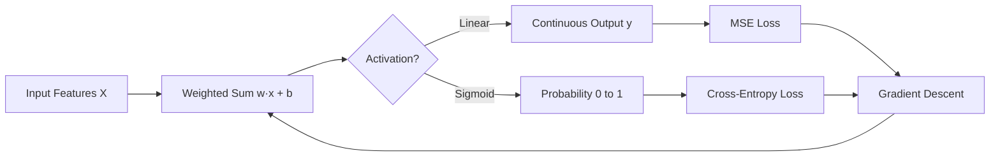

**Interview Q&A:**

*Q: Linear regression me MSE kyun, MAE kyun nahi?* MSE differentiable hai everywhere, smooth gradient milta hai. MAE pe x=0 par derivative undefined hai, optimization mushkil. Lekin MAE outliers ke liye robust hai — yeh tradeoff samajhna important hai. Production me agar tera data noisy hai aur outliers hain, toh Huber loss try kar — best of both worlds.

*Q: Logistic regression me MSE kyun nahi use karte?* Sigmoid + MSE non-convex loss surface deta hai, multiple local minima. Cross-entropy + sigmoid convex hai, gradient descent guaranteed global minimum tak pahunchta hai. Plus, cross-entropy ka gradient `(p - y)` hota hai — clean aur sigmoid ka derivative cancel ho jaata hai chain rule me.

*Q: Multicollinearity kya hai?* Jab do features highly correlated hote hain, weights unstable ho jaate hain — chhota sa data change kare toh weights flip kar jaate hain. Solution: VIF check kar, ya ek feature drop kar, ya regularization (L2) lagaa.

---

### 1.2 Decision Trees, Random Forests, XGBoost, LightGBM

**Definition:** Decision tree ek flowchart hai jo data ko recursively split karta hai based on feature thresholds. Random forest = bahut saare decision trees ka ensemble (bagging). XGBoost aur LightGBM gradient boosting frameworks hain — sequential trees jo previous tree ki galti correct karte hain.

**Why:** Tabular data pe yeh models aaj bhi deep learning ko beat karte hain. Kaggle competitions me 70% winners XGBoost/LightGBM use karte hain. Industry me — fraud detection, credit scoring, churn prediction — sab pe yahi chalte hain.

**How:** Decision tree me har split pe Gini impurity ya entropy minimize hoti hai. Random forest me each tree random subset of features aur rows pe train hota hai (bootstrap aggregation). Boosting me har naya tree previous ensemble ke residuals fit karta hai.

```python
from sklearn.tree import DecisionTreeClassifier
from sklearn.ensemble import RandomForestClassifier
import xgboost as xgb
import lightgbm as lgb

# Decision tree — simple aur interpretable
dt = DecisionTreeClassifier(max_depth=5, min_samples_leaf=20)
# max_depth zaruri hai, warna overfit ho jaayega — tree har row yaad kar lega
dt.fit(X_train, y_train)

# Random forest — variance reduce karta hai averaging se
rf = RandomForestClassifier(
    n_estimators=200,    # 200 trees, jitna zyada utna stable
    max_depth=10,
    n_jobs=-1,           # saare CPU cores use kar, time bachega
    random_state=42
)
rf.fit(X_train, y_train)

# XGBoost — gradient boosting ka king
xgb_model = xgb.XGBClassifier(
    n_estimators=500,
    learning_rate=0.05,  # chhota lr + zyada trees = better generalization
    max_depth=6,
    early_stopping_rounds=50,  # validation loss improve nahi hua toh ruk ja
    eval_metric='logloss'
)
xgb_model.fit(X_train, y_train, eval_set=[(X_val, y_val)], verbose=False)

# LightGBM — XGBoost se faster, leaf-wise growth karta hai
lgb_model = lgb.LGBMClassifier(
    n_estimators=500,
    learning_rate=0.05,
    num_leaves=31,       # depth ke jagah leaves control karta hai
    n_jobs=-1
)
lgb_model.fit(X_train, y_train)
```

**Real-life Example:** Banking me credit scoring — kisko loan dena hai? Logistic regression baseline hota hai, lekin XGBoost 5-10% better AUC deta hai. Feature importance bhi milti hai — "income" aur "credit_history" sabse important. Regulator ko explain karne ke liye SHAP values use karta hai.

**Mermaid Diagram:**

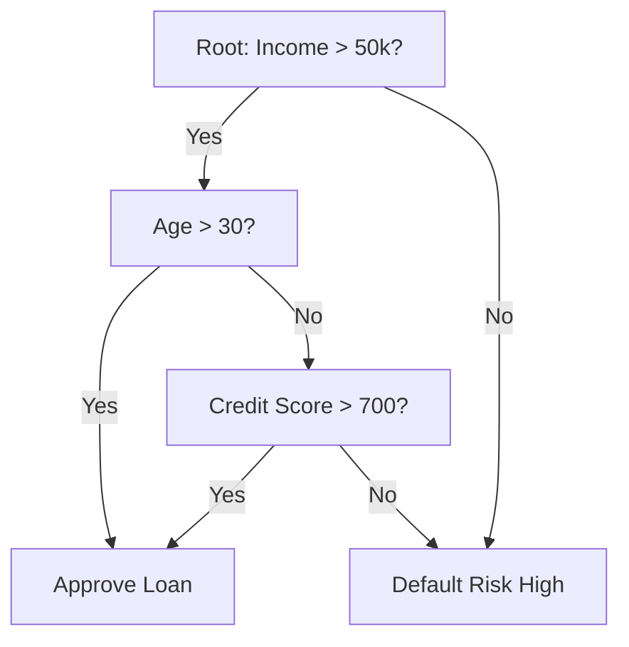

**Interview Q&A:**

*Q: Random forest vs XGBoost — kab kya use karein?* Random forest parallel hai, fast train hota hai, hyperparameter tuning kam chahiye. Baseline ke liye perfect. XGBoost sequential hai, slow but more accurate, regularization built-in hai. Production me agar accuracy critical hai aur tujhe time hai tune karne ka, XGBoost. Agar quick prototype chahiye, RF.

*Q: XGBoost overfitting kaise rokta hai?* Multiple ways — `learning_rate` (shrinkage), `max_depth` limit, `subsample` (row sampling), `colsample_bytree` (column sampling), `lambda`/`alpha` (L2/L1 on leaf weights), aur `early_stopping_rounds`. Mix and match kar based on validation curve.

*Q: LightGBM XGBoost se kyun faster hai?* Histogram-based splitting (continuous features ko bins me daalta hai), leaf-wise tree growth (depth-wise nahi), aur GOSS (Gradient-based One-Side Sampling). Lekin small dataset pe leaf-wise overfit kar sakta hai, careful rehna.

---

### 1.3 SVMs (Concept), k-NN

**Definition:** SVM (Support Vector Machine) ek classifier hai jo do classes ke beech maximum margin hyperplane dhundta hai. Kernel trick se non-linear boundaries bhi handle karta hai. k-NN (k-Nearest Neighbors) lazy learner hai — training me kuch nahi karta, prediction time pe k nearest points dekhta hai aur majority vote karta hai.

**Why:** SVM small-medium datasets pe excellent hai, especially text classification me (TF-IDF + linear SVM). k-NN baseline ke liye great hai aur recommender systems ka backbone hai (collaborative filtering). Plus, embeddings ki similarity search basically k-NN hi hai — Gen AI me vector databases (Pinecone, FAISS) yahi karte hain.

**How:** SVM me hum `||w||²` minimize karte hain subject to margin constraints. Soft margin me slack variables `ξ` allow karte hain. Kernel trick: `K(x,y) = φ(x)·φ(y)` — high-dimensional space me dot product compute karte hain bina explicit mapping ke. k-NN me bas distance metric (Euclidean, cosine) aur `k` choose karna hota hai.

```python
from sklearn.svm import SVC
from sklearn.neighbors import KNeighborsClassifier
from sklearn.preprocessing import StandardScaler

# SVM ke liye scaling MUST hai, warna dominant feature hijack kar legi
scaler = StandardScaler()
X_train_s = scaler.fit_transform(X_train)
X_test_s = scaler.transform(X_test)

# RBF kernel — non-linear boundary banata hai
svm = SVC(
    kernel='rbf',
    C=1.0,           # regularization — chhota C = bigger margin, more bias
    gamma='scale',   # RBF ka spread, auto-set ho jaata hai
    probability=True # probability chahiye toh, slow ho jaayega
)
svm.fit(X_train_s, y_train)

# k-NN — k odd rakhna binary classification me, taaki tie na ho
knn = KNeighborsClassifier(
    n_neighbors=5,
    weights='distance',  # closer neighbors ko zyada vote do
    metric='cosine'      # high-dim embeddings ke liye cosine best hai
)
knn.fit(X_train_s, y_train)

# Embeddings similarity search — Gen AI me yahi pattern hai
def find_similar(query_vec, db_vecs, k=5):
    # Cosine similarity manually
    sims = db_vecs @ query_vec / (
        np.linalg.norm(db_vecs, axis=1) * np.linalg.norm(query_vec) + 1e-9
    )
    top_k = np.argsort(sims)[-k:][::-1]
    return top_k, sims[top_k]
```

**Real-life Example:** Tu ek RAG system bana raha hai. User query aati hai, tu use embed karta hai, fir vector DB me k-NN search karta hai top-5 relevant chunks ke liye. Yahi k-NN hai, bas FAISS/HNSW se 10 million vectors me 1ms me kar leta hai.

**Mermaid Diagram:**

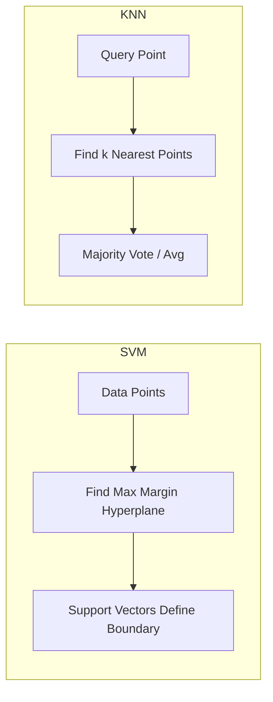

**Interview Q&A:**

*Q: SVM me kernel trick kya hai?* Linear SVM sirf linearly separable data handle kar sakta hai. Kernel trick ke through hum data ko higher-dimensional space me implicitly map karte hain jahan linearly separable ho jaaye. RBF kernel infinite-dimensional space me map karta hai. Computation low rehti hai kyunki hum φ(x) explicitly compute nahi karte, sirf dot product.

*Q: k-NN ka time complexity kya hai?* Training O(1) — bas data store karta hai. Prediction O(n·d) per query — saare points se distance. Large datasets pe useless. Solution: KD-tree, Ball-tree, ya approximate nearest neighbors (FAISS, HNSW, ScaNN). Production me yahi use hote hain.

*Q: SVM vs Logistic Regression?* Dono linear classifiers hain. SVM margin maximize karta hai (geometric), LR likelihood (probabilistic). SVM probabilities natively nahi deta (Platt scaling needed). Small datasets aur high-dim features (text) pe SVM often better. Large datasets pe LR scalable hai, especially with SGD.

---

### 1.4 Bias-Variance Tradeoff, Regularization (L1, L2, Dropout)

**Definition:** Bias = model ki simplifying assumption ki wajah se error (underfitting). Variance = training data me chhote changes se prediction me badi swing (overfitting). Total error = Bias² + Variance + Irreducible noise. Regularization variance kam karne ka technique hai — L1 (Lasso, sparse weights), L2 (Ridge, small weights), Dropout (random neurons off in NN).

**Why:** Yeh ML ka **most important concept** hai. Har debugging session, har production failure, har Kaggle leaderboard climb — sab is tradeoff ke around hai. Gen AI me bhi same — LLM fine-tuning me LoRA basically L2-style regularization hai. Dropout transformers me standard hai.

**How:** Bias zyada toh model bigger banao (more features, more depth). Variance zyada toh regularization, more data, ya simpler model. L1 weights ko exactly zero kar deta hai (feature selection). L2 weights chhote rakhta hai (smooth). Dropout NN me randomly neurons off karta hai — ek tarah ka ensemble.

```python
from sklearn.linear_model import Ridge, Lasso, ElasticNet
import torch.nn as nn

# Ridge — L2 regularization, weights chhote rakhta hai
ridge = Ridge(alpha=1.0)  # alpha jitna zyada, regularization utna strong
ridge.fit(X_train, y_train)

# Lasso — L1, kuch weights exactly zero kar dega
lasso = Lasso(alpha=0.1)
lasso.fit(X_train, y_train)
print(f"Non-zero features: {(lasso.coef_ != 0).sum()}")  # feature selection free me

# ElasticNet — L1 + L2 dono, best of both
en = ElasticNet(alpha=0.1, l1_ratio=0.5)

# PyTorch me dropout
class MLPWithDropout(nn.Module):
    def __init__(self):
        super().__init__()
        self.fc1 = nn.Linear(784, 256)
        self.dropout = nn.Dropout(0.5)  # 50% neurons random off during training
        self.fc2 = nn.Linear(256, 10)
    def forward(self, x):
        x = torch.relu(self.fc1(x))
        x = self.dropout(x)  # eval mode me automatically off ho jaata hai
        return self.fc2(x)

# Loss me L2 manually bhi add kar sakte hain (weight decay)
optimizer = torch.optim.AdamW(model.parameters(), lr=1e-3, weight_decay=0.01)
# weight_decay = L2 regularization
```

**Real-life Example:** Tune ek model banaya, train accuracy 99%, val accuracy 70% — classic overfitting (high variance). Solutions: data augmentation, dropout, early stopping, simpler model. Dusri side, train 60%, val 60% — underfitting (high bias). Solution: deeper model, more features, less regularization.

**Mermaid Diagram:**

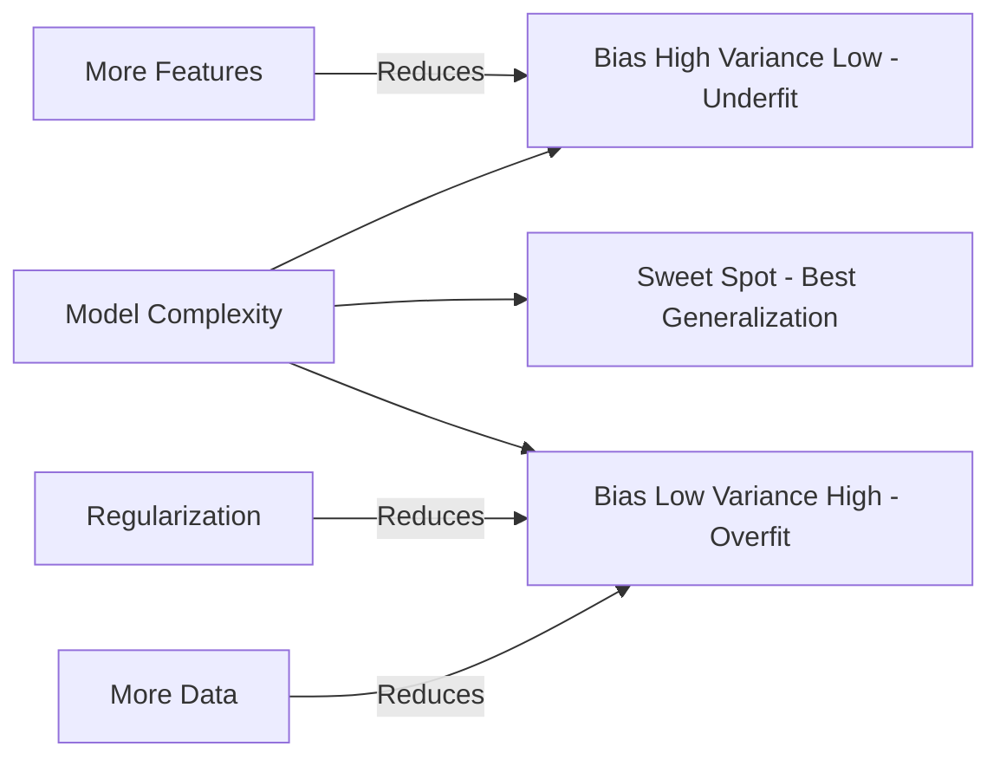

**Interview Q&A:**

*Q: L1 vs L2 — kab kya?* L1 sparse solutions deta hai — jab features bahut hain aur tujhe pata hai sirf kuch matter karte hain (feature selection bhi free me). L2 dense, smooth solutions deta hai — jab saare features thoda-thoda contribute karte hain. ElasticNet dono mix karta hai. Practice me L2 default, L1 jab interpretability chahiye.

*Q: Dropout exactly kaise kaam karta hai?* Training me har forward pass me randomly p% neurons ko 0 set karta hai, baaki ko `1/(1-p)` se scale karta hai (inverted dropout). Eval me sab on hote hain, no scaling. Effectively yeh ek implicit ensemble train karta hai — har mini-batch alag sub-network. Test time pe averaging effect milta hai.

*Q: Bias-variance decomposition mathematically?* `E[(y - f̂(x))²] = (E[f̂(x)] - f(x))² + Var(f̂(x)) + σ²`. Pehla term bias², doosra variance, teesra irreducible noise. Practice me cross-validation se estimate karte hain — train error low + val error high = variance. Dono high = bias.

---

### 1.5 Train/Val/Test Splits, Cross-Validation

**Definition:** Train set pe model fit hota hai. Validation set pe hyperparameters tune hote hain. Test set pe final unbiased evaluation hoti hai — sirf ek baar use karna. Cross-validation (k-fold) me data ko k parts me divide karke k baar train karte hain, har baar ek part validation banta hai.

**Why:** Bina proper split ke tu kabhi nahi jaanega ki model generalize karta hai ya rat-mug raha hai. Test set leak — most common production blunder. Time series me random split karna mat — temporal leakage hota hai.

**How:** Standard split 70/15/15 ya 80/10/10. K-fold (k=5 ya 10) chhote datasets pe. Stratified k-fold imbalanced classes ke liye. Time series me TimeSeriesSplit — chronological order maintain hota hai.

```python
from sklearn.model_selection import (
    train_test_split, KFold, StratifiedKFold,
    TimeSeriesSplit, cross_val_score
)

# Basic split — pehle test alag karo, fir train se val
X_temp, X_test, y_temp, y_test = train_test_split(
    X, y, test_size=0.15, stratify=y, random_state=42
)
# stratify zaruri hai imbalanced data me — class proportions maintain
X_train, X_val, y_train, y_val = train_test_split(
    X_temp, y_temp, test_size=0.176, stratify=y_temp, random_state=42
)

# K-fold cross-validation — small dataset ke liye gold standard
skf = StratifiedKFold(n_splits=5, shuffle=True, random_state=42)
scores = cross_val_score(model, X_train, y_train, cv=skf, scoring='roc_auc')
print(f"AUC: {scores.mean():.3f} +/- {scores.std():.3f}")

# Time series — NEVER random shuffle
tscv = TimeSeriesSplit(n_splits=5)
for train_idx, val_idx in tscv.split(X):
    # Train always before val in time — yahi rule hai
    X_tr, X_v = X[train_idx], X[val_idx]
    # ... model train karo
```

**Real-life Example:** Tune stock price model banaya, random split kiya, 95% accuracy aayi. Production me deploy kiya — total disaster. Reason: future ka data train me leak ho gaya. Time series me TimeSeriesSplit must hai. Aur ek baat — group split bhi hota hai, agar same user ke multiple rows hain toh user-level split kar.

**Mermaid Diagram:**

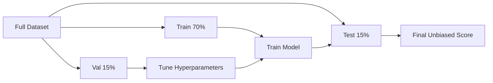

**Interview Q&A:**

*Q: Cross-validation aur train/val/test me kya difference?* Train/val/test single split hai — fast but high variance estimate. K-fold CV multiple splits karta hai, more robust score, lekin k times train karna padta hai. Production pipeline me CV nested hota hai — outer loop test ke liye, inner loop hyperparameter tuning ke liye.

*Q: Data leakage kya hai aur kaise avoid karein?* Test data ki information train me chali jaaye = leakage. Common cases: scaling pe full data fit kiya, feature engineering me future info, target leakage (feature jo target ke baad compute hota hai). Rule: test set ko sirf evaluation ke liye dekho, training pipeline (scaler, encoder) sirf train pe fit karo.

*Q: Stratified split kab use karein?* Imbalanced classification (90-10 split of classes) me. Random split me chhota class kabhi val me 0% bhi ho sakta hai — metric meaningless. Stratified har split me class proportions maintain karta hai. Regression me bin-based stratification kar sakte hain (target ko bins me daalo).

---

## 2. Unsupervised Learning

Unsupervised matlab labels nahi hain. Tu sirf `X` se patterns dhundhta hai. Clustering, dimensionality reduction, anomaly detection — sab yahi hai. Gen AI me pretraining basically self-supervised (technically) hai, lekin philosophy unsupervised hai — koi human label nahi.

### 2.1 K-means, DBSCAN, Hierarchical Clustering

**Definition:** K-means data ko `k` clusters me divide karta hai based on Euclidean distance to centroids. DBSCAN density-based hai — dense regions ko clusters bolta hai, sparse points ko noise. Hierarchical clustering ek tree (dendrogram) banata hai — agglomerative (bottom-up) ya divisive (top-down).

**Why:** Customer segmentation, anomaly detection, image compression — ye sab clustering hain. Embeddings clustering Gen AI me bhi useful hai — similar documents group karne ke liye.

**How:** K-means: random centroids → assign points to nearest centroid → recompute centroids → repeat till convergence. DBSCAN: `eps` (radius) aur `min_samples` se density define karte hain. Hierarchical: distance matrix banao, sabse close pairs merge karte jaao.

```python
from sklearn.cluster import KMeans, DBSCAN, AgglomerativeClustering
from sklearn.preprocessing import StandardScaler
import numpy as np

X_scaled = StandardScaler().fit_transform(X)  # clustering pe scaling MUST

# K-means — fast but k pehle se decide karna hai
km = KMeans(n_clusters=5, n_init=10, random_state=42)
# n_init=10 — 10 random initializations try karega, best wala lega
labels_km = km.fit_predict(X_scaled)

# Optimal k dhundhne ke liye elbow method
inertias = []
for k in range(2, 11):
    inertias.append(KMeans(n_clusters=k, n_init=10).fit(X_scaled).inertia_)
# Plot karke "elbow" dhundh — jahaan se curve flat hone lage

# DBSCAN — k specify nahi karna, noise auto-detect
db = DBSCAN(eps=0.5, min_samples=5)
# eps tuning critical hai — k-distance plot dekh
labels_db = db.fit_predict(X_scaled)
print(f"Clusters: {len(set(labels_db)) - (1 if -1 in labels_db else 0)}")
print(f"Noise points: {(labels_db == -1).sum()}")

# Hierarchical — dendrogram visualize kar sakte hain
agg = AgglomerativeClustering(n_clusters=5, linkage='ward')
# 'ward' variance minimize karta hai, 'average'/'single'/'complete' bhi options
labels_hc = agg.fit_predict(X_scaled)
```

**Real-life Example:** Tu marketing team me hai. CMO bolti — "Customers ko segment karo." Tu features banata hai — purchase frequency, avg spend, recency. K-means se 5 segments — "high-value loyalists", "churners", "bargain hunters", etc. Har segment ke liye alag campaign. ROI 3x ho jaata hai.

**Mermaid Diagram:**

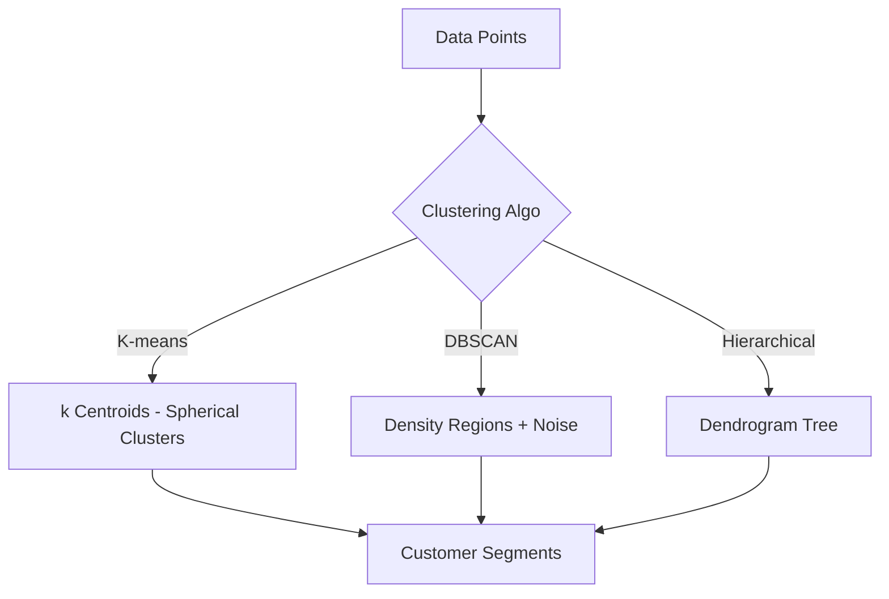

**Interview Q&A:**

*Q: K-means ki limitations?* Spherical clusters assume karta hai (Euclidean distance), `k` pehle se chahiye, outliers se sensitive hai, local minima me phans sakta hai. Non-convex clusters (moons shape) pe fail hota hai — DBSCAN better. Initialization important hai — k-means++ default hai sklearn me, smarter than random.

*Q: DBSCAN ke parameters kaise tune karein?* `eps` ke liye k-distance plot — har point ka k-th nearest neighbor distance plot karo, "knee" pe eps set karo. `min_samples` typically `2 * dim` rakhte hain. High-dimensional data pe DBSCAN struggle karta hai — curse of dimensionality, distances meaningless ho jaate hain.

*Q: Hierarchical kab use karein?* Jab k pehle se nahi pata aur tujhe cluster structure visualize karna hai (dendrogram). Small dataset (<10k points) — O(n²) memory aur O(n³) time complexity. Biological taxonomy, document hierarchies me classic use case.

---

### 2.2 PCA, t-SNE, UMAP — Visualize Embeddings

**Definition:** PCA (Principal Component Analysis) linear dimensionality reduction — variance maximize karne wali directions dhundhta hai. t-SNE non-linear, local structure preserve karta hai — visualization ke liye great. UMAP newer, faster, global + local structure dono preserve karta hai.

**Why:** 768-dim BERT embeddings dekhne ke liye 2D me project karna padta hai. PCA fast aur deterministic, t-SNE pretty plots, UMAP modern default. Curse of dimensionality bhi solve karte hain — 1000 features ko 50 PCA components tak reduce karke training tez.

**How:** PCA covariance matrix ka eigendecomposition karta hai — top-k eigenvectors choose karte hain. t-SNE high-dim me probabilities define karta hai (Gaussian), low-dim me Student-t distribution use karta hai, KL divergence minimize karta hai. UMAP topological manifold approximate karta hai.

```python
from sklearn.decomposition import PCA
from sklearn.manifold import TSNE
import umap  # pip install umap-learn

# PCA — fastest, linear, interpretable
pca = PCA(n_components=2)
X_pca = pca.fit_transform(X_scaled)
print(f"Variance explained: {pca.explained_variance_ratio_.sum():.2%}")
# 90% variance preserve karne ke liye kitne components chahiye?
pca_full = PCA(n_components=0.90)  # 0-1 me float matlab variance threshold
X_reduced = pca_full.fit_transform(X_scaled)

# t-SNE — beautiful visualization, slow, non-deterministic
tsne = TSNE(
    n_components=2,
    perplexity=30,    # 5-50 range, neighbors ka effective number
    learning_rate='auto',
    n_iter=1000,
    random_state=42
)
X_tsne = tsne.fit_transform(X_scaled)
# WARNING: t-SNE pe distances meaningless hain, sirf cluster shapes dekho

# UMAP — modern default for embeddings
um = umap.UMAP(
    n_neighbors=15,   # local vs global tradeoff
    min_dist=0.1,     # cluster compactness
    n_components=2,
    metric='cosine'   # embeddings ke liye cosine often better
)
X_umap = um.fit_transform(X_scaled)

# BERT/sentence embeddings visualize karne ka classic pipeline
# embeddings = model.encode(sentences)  # shape (n, 768)
# X_2d = umap.UMAP(metric='cosine').fit_transform(embeddings)
# plt.scatter(X_2d[:, 0], X_2d[:, 1], c=labels)
```

**Real-life Example:** Tune sentence-transformers se 10k product descriptions ko embed kiya — 384-dim vectors. UMAP se 2D me project kiya, color by category. Plot dekhke pata chala "electronics" aur "appliances" overlap ho rahe — feature engineering ka clue mil gaya.

**Mermaid Diagram:**

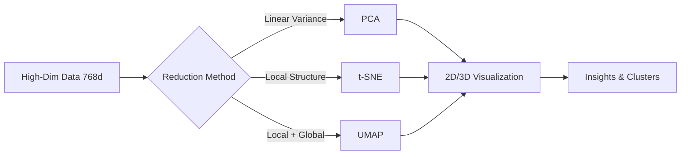

**Interview Q&A:**

*Q: PCA vs t-SNE — kab kya?* PCA fast, deterministic, distances preserved, linear only. Use for preprocessing (reducing features before ML). t-SNE non-linear, slow, only for visualization, distances me sirf local trust kar. Production pipeline me PCA, EDA me t-SNE/UMAP.

*Q: t-SNE me perplexity kya hai?* Effectively kitne neighbors consider karne hain har point ke liye. Low perplexity (5) — very local structure, plot fragmented. High (50) — global, points blob ban jaate. Typical 30. Sensitive parameter — multiple values try kar.

*Q: UMAP t-SNE se kyun better hai often?* Faster (10x+), global structure better preserve karta hai, deterministic with seed, supports new data transform (t-SNE doesn't natively). Disadvantage: theoretically newer, hyperparameter intuition develop hone me time.

---

### 2.3 Autoencoders

**Definition:** Autoencoder ek neural network hai jo input ko compress karta hai (encoder) aur fir reconstruct karta hai (decoder). Bottleneck layer me compressed representation milti hai. Variants: vanilla AE, denoising AE, sparse AE, variational AE (VAE — Gen AI ka foundation).

**Why:** Dimensionality reduction non-linearly. Anomaly detection — anomalies high reconstruction error denge. Pretraining for downstream tasks. VAE generative models ka base hai — Stable Diffusion ke latents bhi VAE se aate hain.

**How:** Encoder `f(x) → z`, decoder `g(z) → x̂`. Loss = `||x - x̂||²` (reconstruction). VAE me encoder mean/variance predict karta hai, KL divergence regularizer add hota hai.

```python
import torch
import torch.nn as nn

class Autoencoder(nn.Module):
    def __init__(self, input_dim=784, latent_dim=32):
        super().__init__()
        # Encoder — input ko bottleneck tak shrink kar
        self.encoder = nn.Sequential(
            nn.Linear(input_dim, 128),
            nn.ReLU(),
            nn.Linear(128, 64),
            nn.ReLU(),
            nn.Linear(64, latent_dim)  # yeh compressed representation
        )
        # Decoder — bottleneck se wapas reconstruct kar
        self.decoder = nn.Sequential(
            nn.Linear(latent_dim, 64),
            nn.ReLU(),
            nn.Linear(64, 128),
            nn.ReLU(),
            nn.Linear(128, input_dim),
            nn.Sigmoid()  # pixels [0,1] me hain toh
        )

    def forward(self, x):
        z = self.encoder(x)
        x_recon = self.decoder(z)
        return x_recon, z

# Training loop — sirf input chahiye, label nahi
model = Autoencoder()
optimizer = torch.optim.Adam(model.parameters(), lr=1e-3)
criterion = nn.MSELoss()

for epoch in range(50):
    for x_batch in train_loader:
        x_recon, z = model(x_batch)
        loss = criterion(x_recon, x_batch)  # input ko khud reconstruct kar
        optimizer.zero_grad()
        loss.backward()
        optimizer.step()

# Anomaly detection — high reconstruction error = anomaly
def detect_anomaly(model, x, threshold):
    with torch.no_grad():
        x_recon, _ = model(x)
        error = ((x - x_recon)**2).mean(dim=1)
    return error > threshold
```

**Real-life Example:** Credit card fraud detection. Normal transactions pe AE train karte hain. Fraud transactions reconstruction me fail karenge — high error. Threshold set karke flag karte hain. Imbalanced data me supervised se better often.

**Mermaid Diagram:**

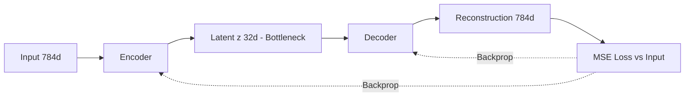

**Interview Q&A:**

*Q: Autoencoder vs PCA?* Linear AE with MSE loss = PCA exactly (in span). Non-linear AE (with ReLU etc.) PCA se zyada powerful — non-linear manifolds capture kar sakta hai. Lekin training mehnat lagti hai, PCA closed-form hai.

*Q: Variational Autoencoder kya alag karta hai?* VAE encoder deterministic z nahi deta, distribution `q(z|x)` deta hai (mean + variance). Sampling karte hain reparameterization trick se. Loss me KL divergence add hota hai jo latent space ko `N(0, I)` ke close rakhta hai. Result: smooth, sample-able latent space — yahi generative power deta hai. Stable Diffusion me image first VAE se latent me jaati hai, fir diffusion latent pe hota hai.

*Q: Denoising autoencoder kaise kaam karta hai?* Input me noise add karte hain, output me clean version reconstruct karte hain. Yeh AE ko robust features seekhne pe force karta hai — sirf identity function nahi seekh sakta. BERT bhi conceptually masked denoising autoencoder hai.

---

## 3. Evaluation Metrics

Bhai, suno — yeh sabse underrated topic hai. Log model architectures pe ghante lagaate hain, lekin metric galat choose karte hain aur production me bomb fail hota hai. Sahi metric domain pe depend karta hai, na ki accuracy default.

### 3.1 Accuracy, Precision, Recall, F1, ROC-AUC, PR-AUC

**Definition:** Accuracy = correct predictions / total. Precision = TP / (TP + FP) — predicted positives me se kitne actually positive. Recall = TP / (TP + FN) — actual positives me se kitne pakde. F1 = harmonic mean of P and R. ROC-AUC = area under TPR vs FPR curve. PR-AUC = area under precision-recall curve.

**Why:** Imbalanced data pe accuracy useless hai — 99% negative class me model "all negative" predict kare toh 99% accuracy. Fraud, disease detection me precision-recall tradeoff matter karta hai. ROC-AUC threshold-independent ranking quality measure karta hai.

**How:** Confusion matrix banao — TP, FP, TN, FN. Sklearn me sab built-in hai. ROC curve different thresholds pe TPR-FPR plot karta hai. PR curve precision-recall plot. Imbalanced me PR-AUC ROC-AUC se zyada informative.

```python
from sklearn.metrics import (
    accuracy_score, precision_score, recall_score, f1_score,
    roc_auc_score, average_precision_score, classification_report,
    confusion_matrix, precision_recall_curve, roc_curve
)

y_pred = model.predict(X_test)
y_proba = model.predict_proba(X_test)[:, 1]  # positive class probability

# Basic metrics — imbalanced me ek-ek karke dekho
print(f"Accuracy:  {accuracy_score(y_test, y_pred):.3f}")
print(f"Precision: {precision_score(y_test, y_pred):.3f}")  # FP minimize
print(f"Recall:    {recall_score(y_test, y_pred):.3f}")     # FN minimize
print(f"F1:        {f1_score(y_test, y_pred):.3f}")

# Threshold-independent
print(f"ROC-AUC:   {roc_auc_score(y_test, y_proba):.3f}")
print(f"PR-AUC:    {average_precision_score(y_test, y_proba):.3f}")

# Multi-class — macro vs weighted matter karta hai
print(classification_report(y_test, y_pred))
# macro = unweighted avg (chhote class ko equal weight)
# weighted = support-weighted (imbalanced me biased towards majority)

# Threshold tuning — default 0.5 hamesha best nahi
prec, rec, thresh = precision_recall_curve(y_test, y_proba)
# Business-specific tradeoff dekh ke threshold choose kar
# Example: fraud me recall > 0.95 chahiye, precision sacrifice ok
```

**Real-life Example:** Tu cancer screening model bana raha hai. Accuracy 95% sun ke khush mat ho — agar 5% me cancer hai aur tera model "no cancer" predict kare toh 95% accuracy lekin recall 0%. Yahan recall critical hai — ek bhi cancer miss nahi hona chahiye, false alarms (low precision) acceptable hain — doctor confirm kar lega.

**Mermaid Diagram:**

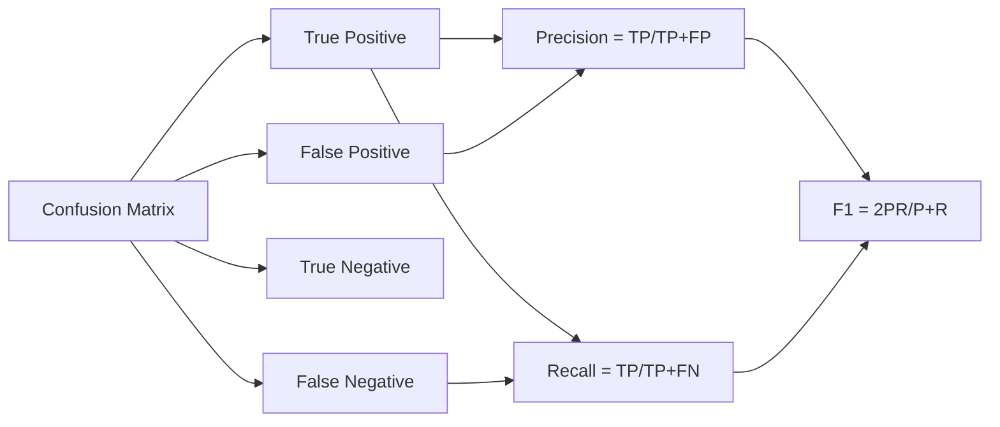

**Interview Q&A:**

*Q: ROC-AUC vs PR-AUC?* ROC-AUC TPR vs FPR — balanced data pe great, imbalanced me misleading kyunki TN dominate karta hai. PR-AUC precision vs recall — minority class focused, imbalanced me preferred. Fraud detection me PR-AUC report kar, generic ranking me ROC-AUC.

*Q: F1 score harmonic mean kyun, simple average kyun nahi?* Harmonic mean low values ko penalize karta hai zyada. Agar P=1.0, R=0.0, simple avg = 0.5 (misleading), F1 = 0. Both should be high — harmonic mean iska natural fit hai. F-beta variants me beta>1 recall ko zyada weight, beta<1 precision ko.

*Q: Multi-class me macro vs micro vs weighted?* Macro: per-class metric ka unweighted avg — chhote class ko equal weight, imbalanced me preferred agar tu sab classes ko equal care karta hai. Micro: globally TP/FP count — accuracy ke equivalent hota hai effectively. Weighted: support se weight — majority class dominated.

---

### 3.2 MSE, MAE, R²

**Definition:** MSE (Mean Squared Error) = average of squared differences. MAE (Mean Absolute Error) = average of absolute differences. R² = 1 - (SS_res / SS_tot) — model variance explained ka fraction.

**Why:** Regression me yahi default metrics hain. MSE outliers ko zyada penalize karta hai (squared), MAE robust hai. R² interpretable — "model variance ka 80% explain karta hai" — non-technical stakeholders ko samjhana easy.

**How:** Sklearn `mean_squared_error`, `mean_absolute_error`, `r2_score`. RMSE (root MSE) often report hota hai because units same hote hain target ke. MAPE (mean absolute percentage error) when scale matters.

```python
from sklearn.metrics import (
    mean_squared_error, mean_absolute_error, r2_score,
    mean_absolute_percentage_error
)
import numpy as np

y_pred = model.predict(X_test)

mse = mean_squared_error(y_test, y_pred)
rmse = np.sqrt(mse)  # same units as target, interpret karna easy
mae = mean_absolute_error(y_test, y_pred)
r2 = r2_score(y_test, y_pred)
mape = mean_absolute_percentage_error(y_test, y_pred)

print(f"RMSE: {rmse:.2f}")  # average error in target units
print(f"MAE:  {mae:.2f}")
print(f"R²:   {r2:.3f}")    # 1.0 perfect, 0.0 mean baseline, negative = worse than mean
print(f"MAPE: {mape:.2%}")

# Custom — Huber loss (MSE + MAE hybrid, outlier robust)
def huber_loss(y_true, y_pred, delta=1.0):
    error = y_true - y_pred
    abs_error = np.abs(error)
    quadratic = np.minimum(abs_error, delta)
    linear = abs_error - quadratic
    return (0.5 * quadratic**2 + delta * linear).mean()

# Adjusted R² — features ki count adjust karta hai
def adjusted_r2(r2, n, p):
    # n = samples, p = features
    return 1 - (1 - r2) * (n - 1) / (n - p - 1)
```

**Real-life Example:** House price prediction. RMSE = 50,000 INR matlab average error 50k. R² = 0.85 matlab variance ka 85% explain. Lekin 10 crore ke ghar pe 50k error chhota, 30 lakh ke ghar pe 50k bahut bada — yahaan MAPE better metric hai (relative error).

**Mermaid Diagram:**

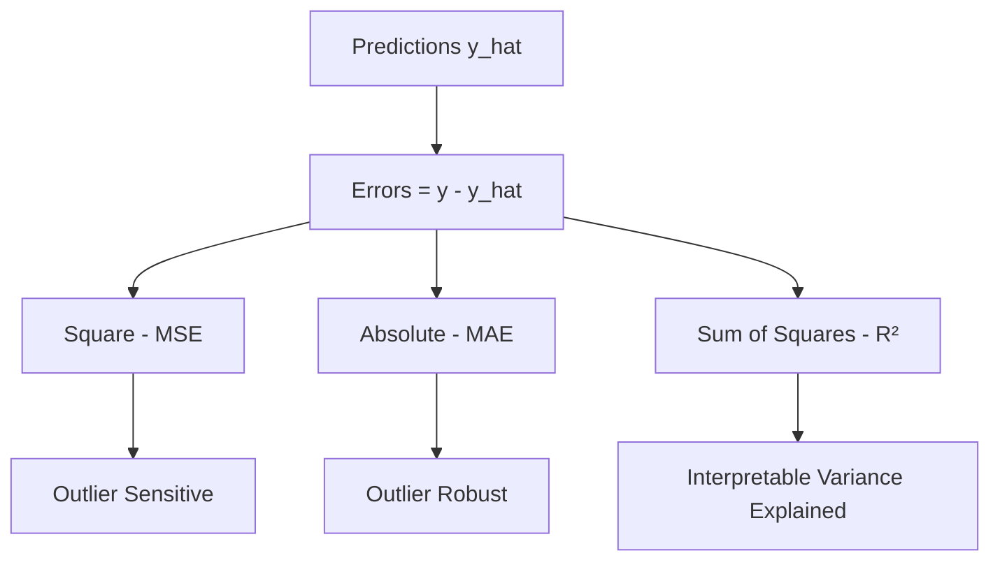

**Interview Q&A:**

*Q: MSE vs MAE — kab kya?* MSE outliers ko square karta hai — outliers se sensitive, lekin gradient smooth hai (differentiable everywhere). MAE robust to outliers, lekin x=0 pe non-differentiable. Production me agar outliers genuine signal hain (fraud) toh MSE, agar noise hain toh MAE ya Huber.

*Q: R² negative kab hota hai?* Jab model mean baseline se bhi worse hai. R² = 1 - SS_res/SS_tot. Agar model SS_res > SS_tot, R² negative. Yeh out-of-sample evaluation me hota hai jab model garbage hai ya distribution shift hua hai.

*Q: Adjusted R² kyun?* Plain R² features add karne pe hamesha increase ya same rehta hai — useless features bhi add karo, R² nahi girega. Adjusted R² penalty lagaata hai number of features pe — model comparison ke liye fair hai.

---

### 3.3 Why Metric Choice Matters More Than Model Choice

**Definition:** Metric tera optimization target hai. Galat metric choose ki, toh perfect model bhi galat problem solve karega. Right metric = business outcome ka mathematical proxy.

**Why:** Senior dev hone ka matlab — pehla din pe metric pe baith ke ghanto baat karna stakeholders ke saath. Cancer screening me F1 sahi nahi, recall@high-precision sahi hai. Recommender me NDCG, click-through rate, ya long-term retention. Generative models me BLEU galat, human eval ya pairwise preference sahi.

**How:** Pehle business goal samjho. Fir cost matrix banao — FP ki cost vs FN ki cost kya hai. Fir metric design karo. Threshold tuning bhi business-driven hota hai. A/B test production me final arbiter hota hai.

```python
# Custom business metric — fraud detection example
def business_metric(y_true, y_pred_proba, threshold=0.5,
                    cost_fn=1000, cost_fp=10, gain_tp=500):
    """
    FN: fraud miss kiya — 1000 INR loss
    FP: legit ko fraud bola — 10 INR loss (customer friction)
    TP: fraud caught — 500 INR saved
    """
    y_pred = (y_pred_proba >= threshold).astype(int)
    tp = ((y_pred == 1) & (y_true == 1)).sum()
    fp = ((y_pred == 1) & (y_true == 0)).sum()
    fn = ((y_pred == 0) & (y_true == 1)).sum()
    return tp * gain_tp - fp * cost_fp - fn * cost_fn

# Threshold sweep — best business outcome dhundh
thresholds = np.linspace(0.01, 0.99, 99)
profits = [business_metric(y_val, y_proba_val, t) for t in thresholds]
best_thresh = thresholds[np.argmax(profits)]
print(f"Optimal threshold: {best_thresh:.2f}")
# Yeh 0.5 default se almost hamesha alag hota hai

# Generative model evaluation — multi-metric
def evaluate_generation(model, prompts, references):
    metrics = {}
    metrics['bleu'] = compute_bleu(model, prompts, references)
    metrics['rouge'] = compute_rouge(model, prompts, references)
    metrics['bert_score'] = compute_bertscore(model, prompts, references)
    # Lekin asli truth — human eval ya LLM-as-judge
    metrics['human_pref'] = pairwise_human_eval(model, prompts)
    return metrics
```

**Real-life Example:** Maine ek startup me dekha — team ne 6 mahine F1 optimize karke model banaya. Production me business loss badh gaya. Reason: F1 precision aur recall ko equal weight deta tha, lekin business me FN ki cost FP se 100x thi. Custom cost-weighted metric banane ke baad model ne ROI 4x kiya, F1 even drop hua. Lesson: metric is the problem definition.

**Mermaid Diagram:**

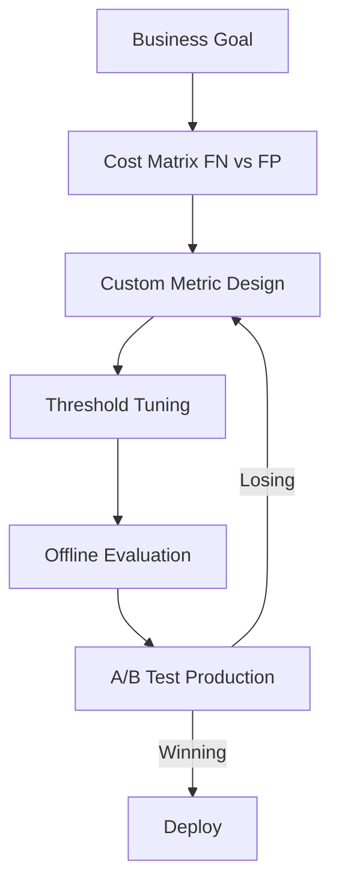

**Interview Q&A:**

*Q: Tu kaise decide karega which metric to use?* Step 1: Business goal samjho — FP/FN ki real cost kya hai. Step 2: Data dekho — imbalanced? Outliers? Ranking ya classification? Step 3: Stakeholders ke saath align — non-tech ko interpretable metric chahiye (R², accuracy). Step 4: Multiple metrics report karo — primary + diagnostic. Step 5: Production A/B test final truth.

*Q: Offline metric high lekin production me poor — kyun?* Common reasons: distribution shift (train/prod data alag), label leakage offline, metric proxy galat (clicks ≠ satisfaction), feedback loops (recommender me popularity bias amplify hota hai), ya selection bias (training data filtered hua tha). Solution: counterfactual evaluation, online A/B, monitoring.

*Q: Generative models me metric kya hai?* Old: BLEU, ROUGE — n-gram overlap, paraphrasing me fail. New: BERTScore, BLEURT — semantic. Modern: LLM-as-judge (GPT-4 grading), pairwise human preference, reward model scores. Production me task-specific — code me execution accuracy, summarization me factuality. Single metric dekh ke kabhi mat decide kar.

---

## Resources & Further Reading

Bhai, yeh saari theory yaad rakh — but actual mastery practice se aati hai. Yeh resources se shuruaat kar:

**Books:**
- *Hands-On Machine Learning with Scikit-Learn, Keras, and TensorFlow* by Aurélien Géron — practical, code-first, end-to-end pipelines.
- *The Elements of Statistical Learning* by Hastie, Tibshirani, Friedman — math heavy, IIT-level rigor, free PDF online.
- *Pattern Recognition and Machine Learning* by Bishop — Bayesian perspective, foundational.
- *Designing Machine Learning Systems* by Chip Huyen — production ML, MLOps, metric selection chapters gold hain.

**Courses:**
- Andrew Ng's *Machine Learning Specialization* (Coursera) — fundamentals.
- *CS229* Stanford lecture notes — derivations from scratch.
- *Fast.ai Practical Deep Learning* — top-down approach.

**Papers (must read):**
- *XGBoost: A Scalable Tree Boosting System* (Chen & Guestrin, 2016).
- *LightGBM: A Highly Efficient Gradient Boosting Decision Tree* (Ke et al., 2017).
- *UMAP: Uniform Manifold Approximation and Projection* (McInnes et al., 2018).
- *Auto-Encoding Variational Bayes* (Kingma & Welling, 2013) — VAE original.

**Tools to master:**
- `scikit-learn` — classical ML standard.
- `xgboost`, `lightgbm`, `catboost` — gradient boosting trio.
- `optuna` — hyperparameter tuning, Bayesian search.
- `mlflow` / `wandb` — experiment tracking, production ke liye must.
- `shap` — model explanation, interview me poocha jaata hai.

**Practice:**
- Kaggle competitions — tabular wale problems se shuru kar (Titanic, House Prices, fir Featured comps).
- Implement everything from scratch ek baar — linear regression, k-means, decision tree. Concept clear ho jaayega.
- Open source contribute — sklearn, xgboost issues pe haath aazma.

Yaad rakh — Gen AI ka 80% theory classical ML hi hai. Embeddings = features. Pretraining = unsupervised. Fine-tuning = supervised. RLHF = reinforcement + supervised. Tu yahan strong hai toh transformers samajhna walk in the park hai. Ja, code likh, debug kar, fail kar, fir se kar. Yahi raasta hai.
