# Cloud & Infrastructure for AI

Dekh bhai, AI ka asli khel models likhne mein nahi hai — woh toh ek hafte mein koi bhi bachcha kar deta hai. Asli engineering tab shuru hoti hai jab tujhe yeh model production mein chalana hai, scale karna hai, aur paisa bhi nahi udana hai. AI workload pe GPU mehnga aur scarce hai. Smart engineer Modal ya RunPod pe spot instances chalata hai aur 70% cost bachata hai. Jo bewakoof hai woh AWS pe on-demand A100 boot karke 24x7 chalu rakhta hai aur month end pe CFO se danda khata hai.

Is guide mein hum teen baari cheezein cover karenge — pehla, kaunse cloud platforms tujhe knowledge mein rakhne hain (AWS, GCP, Azure, aur naye-naye GPU specialists jaise Modal/RunPod). Doosra, containerization ka pura science — Docker se lekar Kubernetes tak, GPU operator se lekar KServe tak. Teesra, CI/CD ka AI-specific flavour — kyunki normal CI/CD se kaam nahi chalega, tujhe eval-gated deployments aur prompt versioning karni padegi.

Yeh guide IIT-level intern ke liye likhi hai jo abhi-abhi join hua hai aur usko production-grade infra build karni hai. Har subtopic mein definition, why-it-matters, code/CLI examples, real-world story, mermaid diagram, aur interview Q&A milegi. Padh, samajh, haath chala — kyunki cloud bills sirf padhne se kam nahi hote.

---

## 1. Cloud Platforms

Cloud platforms AI ka backbone hai. Hyperscalers (AWS, GCP, Azure) tujhe end-to-end stack dete hain — storage, compute, managed model APIs, MLOps. Specialized providers (Modal, RunPod, Replicate, Lambda Labs) tujhe sirf GPU compute dete hain par kaafi sasta aur developer-friendly interface ke saath. Choice depend karti hai workload pe — agar tu enterprise mein hai aur compliance chahiye toh hyperscaler. Agar tu startup mein hai aur fast iterate karna hai toh specialized provider.

### 1.1 AWS (Bedrock, SageMaker, EC2 GPU, Lambda)

**Definition:** AWS ka AI stack chaar layer ka hai. **Bedrock** — fully managed foundation model API (Claude, Llama, Titan, Mistral). **SageMaker** — full ML platform (training, hosting, pipelines, feature store). **EC2 GPU** — raw VM instances with GPUs (p4d, p5, g5 family). **Lambda** — serverless functions, often used for orchestration aur lightweight inference.

**Why:** AWS sabse purana aur sabse mature cloud hai. Enterprise compliance (HIPAA, SOC2, FedRAMP) yahaan default mein milta hai. Bedrock ka sabse bada plus — same API se multiple foundation models switch kar sakta hai bina vendor lock-in ke. SageMaker tab use kar jab tujhe custom model train karna hai aur full lifecycle manage karna hai. EC2 raw control deta hai par tu khud hi sab manage karega — driver, CUDA, scaling. Lambda tab acha hai jab tu RAG pipeline ka thin orchestrator chahiye, har request 15 min se chhota ho aur tujhe cold-start tolerable ho.

**How:**

```bash
# Bedrock se Claude call karna — boto3 ke through
aws bedrock-runtime invoke-model \
  --model-id anthropic.claude-3-5-sonnet-20241022-v2:0 \
  --body '{"messages":[{"role":"user","content":"Hello"}],"max_tokens":100,"anthropic_version":"bedrock-2023-05-31"}' \
  --content-type application/json \
  output.json
```

```python
# SageMaker pe model deploy karna — endpoint create
import boto3
from sagemaker.huggingface import HuggingFaceModel

# IAM role chahiye jismein S3 + ECR access ho
role = "arn:aws:iam::123456789:role/SageMakerRole"

# HuggingFace model wrap karke deploy
hf_model = HuggingFaceModel(
    model_data="s3://my-bucket/model.tar.gz",  # trained weights yahaan
    role=role,
    transformers_version="4.37.0",
    pytorch_version="2.1.0",
    py_version="py310",
)

# g5.xlarge — A10G GPU, hourly ~$1.0 on-demand
predictor = hf_model.deploy(
    initial_instance_count=1,
    instance_type="ml.g5.xlarge",
    endpoint_name="llm-prod-v1",
)

# Inference call
response = predictor.predict({"inputs": "What is RAG?"})
print(response)
```

```yaml
# EC2 spot fleet for training — 70% discount
LaunchTemplate:
  ImageId: ami-0abc...  # Deep Learning AMI (Ubuntu 22.04, CUDA 12.4)
  InstanceType: p4d.24xlarge  # 8x A100 40GB
  InstanceMarketOptions:
    MarketType: spot
    SpotOptions:
      MaxPrice: "12.00"  # on-demand $32/hr, spot ~$10/hr
      InstanceInterruptionBehavior: stop
```

**Real-life Example:** Ek fintech startup ne RAG-based document QA banaya. Production mein Bedrock pe Claude Sonnet use kar rahe the (per-token pricing). Embeddings ke liye SageMaker pe self-hosted bge-large endpoint chala rahe the (g5.xlarge, ~$700/month flat). Document ingestion async tha — S3 event Lambda trigger karta tha jo Textract se PDF parse karke pgvector mein dump karta tha. Total infra cost month $4k tha, jisme 60% Bedrock token cost tha. Jab usage 5x bada, unhone Bedrock provisioned throughput le liya — fixed monthly cost par burst safe.

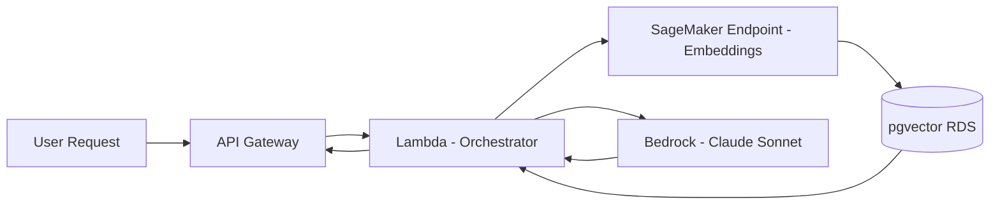

**Interview Q&A:**

*Q: Bedrock vs SageMaker — kab kya use karega?*

Bedrock tab use kar jab tujhe foundation models chahiye API ke through, bina infra manage kiye. Token-based pricing hai, scaling automatic, latency P99 ~2s. Tu bas API call karta hai. SageMaker tab use kar jab tujhe custom model train ya fine-tune karna hai, ya tujhe specific GPU/region/network config chahiye. SageMaker mein tu endpoint khud manage karta hai — auto-scaling rules likhne padte hain, instance type choose karna padta hai. Cost predictable hai (hourly) par utilization 70%+ rakhna padega warna paisa burn hoga. Mature teams hybrid karte hain — Bedrock for general reasoning, SageMaker for specialized fine-tuned domain models.

*Q: EC2 spot interruption se kaise bachega training mein?*

Teen strategies hain. Pehla — checkpointing every N steps S3 pe (PyTorch ka `torch.save` ya HuggingFace ka `Trainer.save_state`). Spot terminate hone se 2 min pehle metadata service notify karta hai, tu graceful save kar le. Doosra — diversification: instance pool mein multiple types (p4d, p5, p4de) aur multiple AZs daal, taaki ek pool dry ho jaye toh dusra try kare. Teesra — capacity blocks for ML use kar jab strict deadline ho — yeh reserved spot hai, pre-purchased. Aur agar tera training distributed hai (DDP/FSDP), toh elastic launcher (torchelastic) use kar jo node failure handle kare automatically.

---

### 1.2 GCP (Vertex AI, Cloud Run, GKE)

**Definition:** Google Cloud ka AI stack. **Vertex AI** — unified ML platform (Gemini API, Model Garden, training jobs, endpoints, pipelines). **Cloud Run** — serverless containers, request-based billing, scale to zero. **GKE** — Google Kubernetes Engine, managed Kubernetes with deep GPU/TPU integration.

**Why:** Google ka core strength — TPUs aur Gemini models. Agar tu massive training kar raha hai, TPU v5p / Trillium pe per-chip cost A100 se kam padta hai (provided tu XLA-friendly code likh sakta hai). Vertex AI Model Garden mein 200+ open models pre-deployed hai, ek click pe endpoint mil jata hai. Cloud Run ka killer feature — GPU support recently aaya hai (L4 GPU), aur scale-to-zero hai, toh low-traffic inference ke liye perfect. GKE production-grade Kubernetes deta hai with autopilot mode (no node management), aur GPU operator built-in hai.

**How:**

```python
# Vertex AI pe Gemini call
from google.cloud import aiplatform
from vertexai.generative_models import GenerativeModel

aiplatform.init(project="my-project", location="us-central1")

# Gemini 2.0 Flash — fast aur sasta
model = GenerativeModel("gemini-2.0-flash-001")
response = model.generate_content(
    "Explain Kubernetes to a 10-year-old",
    generation_config={"temperature": 0.7, "max_output_tokens": 500},
)
print(response.text)
```

```yaml
# Cloud Run service with GPU — YAML deployment
apiVersion: serving.knative.dev/v1
kind: Service
metadata:
  name: llm-inference
  annotations:
    run.googleapis.com/launch-stage: BETA
spec:
  template:
    metadata:
      annotations:
        # GPU attach — L4 24GB
        run.googleapis.com/accelerator: nvidia-l4
        # Min instance 0 = scale to zero, paisa bachao
        autoscaling.knative.dev/minScale: "0"
        autoscaling.knative.dev/maxScale: "10"
    spec:
      containerConcurrency: 4  # 4 parallel requests per container
      containers:
      - image: gcr.io/my-project/vllm-server:latest
        resources:
          limits:
            nvidia.com/gpu: "1"
            memory: "32Gi"
            cpu: "8"
        env:
        - name: MODEL_NAME
          value: "meta-llama/Llama-3.1-8B-Instruct"
```

```bash
# GKE cluster banao GPU node pool ke saath
gcloud container clusters create llm-cluster \
  --zone us-central1-a \
  --num-nodes 2

# GPU node pool — A100 80GB
gcloud container node-pools create gpu-pool \
  --cluster llm-cluster \
  --accelerator type=nvidia-a100-80gb,count=1,gpu-driver-version=latest \
  --machine-type a2-ultragpu-1g \
  --num-nodes 1 \
  --enable-autoscaling --min-nodes 0 --max-nodes 4 \
  --spot  # spot pricing — 60% off
```

**Real-life Example:** Ek e-commerce company ne product image search banaya — user image upload karta hai, similar SKUs return hote hain. Embeddings model (CLIP-ViT-L) ko Cloud Run pe L4 GPU pe deploy kiya. Traffic uneven tha — din mein peak, raat mein near-zero. Scale-to-zero feature ne unka bill 80% kam kar diya compared to GKE always-on. Cold start ~15s tha (model load), par unhone min-instances=1 ek peak hour ke liye scheduled rakha. Bigger fine-tuning jobs Vertex AI Custom Training pe TPU v5e pe chalate the — 8x cost savings vs A100 equivalent.

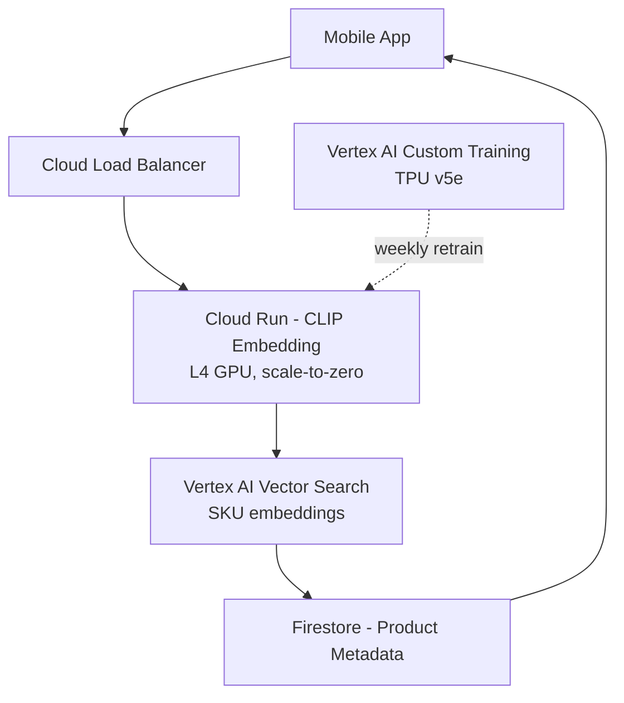

**Interview Q&A:**

*Q: TPU vs GPU — kab TPU choose karega?*

TPU choose kar jab tu large-scale training kar raha hai, tera framework JAX ya PyTorch/XLA hai, aur tu Google Cloud pe locked-in ho. TPU v5p ek pod mein 8960 chips connect kar sakta hai high-speed ICI fabric pe — yeh GPU NVLink se zyada scalable hai for very large models. Throughput per dollar 1.5-3x better hai LLaMA-style training pe. Lekin tradeoffs hai — ecosystem chhota hai (CUDA ka level matching nahi), debugging tough hai, custom kernels likhna mushkil hai. Inference ke liye TPU rarely use karte hain — GPUs zyada flexible hai, cheaper for spiky workloads, aur har cloud pe hai. Rule of thumb: training >$100k budget aur model >7B params, TPU evaluate kar. Warna stick to GPU.

*Q: Cloud Run vs GKE — when to switch?*

Cloud Run start kar jab tu prototype build kar raha hai, traffic predictable nahi hai, aur tujhe operational simplicity chahiye. Single container, request-based billing, automatic scaling. Limitations — 60 min request timeout (recently 60 min se badha), per-instance concurrency limited, no sidecars (well, sidecars ab support hai). GKE pe move kar jab tujhe stateful workloads hain, multiple containers per pod chahiye (sidecar logging, service mesh), GPUs pe heavy workloads with custom scheduling, ya production needs strict SLA with horizontal pod autoscaling tuned to custom metrics. Hidden cost — GKE Autopilot mein per-pod billing hota hai, jo Cloud Run-style hi feel hota hai but Kubernetes flexibility ke saath. Kaafi teams Cloud Run se start karke 18 months baad GKE pe migrate karte hain jab complexity badhti hai.

---

### 1.3 Azure (AI Foundry, OpenAI Service)

**Definition:** Microsoft ka AI cloud. **Azure OpenAI Service** — OpenAI ke models (GPT-4o, o1, o3, embeddings) Azure region mein hosted, with enterprise compliance. **AI Foundry** (formerly AI Studio) — unified workspace for building, evaluating, deploying GenAI apps. **Azure ML** — full MLOps platform similar to SageMaker.

**Why:** Azure ka USP — OpenAI exclusive partnership. Tu OpenAI ke latest models Azure region mein deploy kar sakta hai with data residency, BYOK (bring your own key), private networking. For enterprise (specifically Microsoft shops with E5 licenses), yeh default choice ban gaya hai. AI Foundry mein tujhe prompt flow visual builder, evaluation runs, content safety filters, aur agent framework (Semantic Kernel integration) milta hai. Pricing OpenAI ki API se thoda zyada hai, par compliance benefits paise se zyada bharta hai.

**How:**

```python
# Azure OpenAI se chat — official SDK
from openai import AzureOpenAI

client = AzureOpenAI(
    api_key="<your-key>",
    api_version="2024-10-21",
    azure_endpoint="https://my-resource.openai.azure.com",
)

# Note — model nahi, deployment name use hota hai
response = client.chat.completions.create(
    model="gpt-4o-prod",  # yeh deployment name hai, banaya tune
    messages=[{"role": "user", "content": "Explain LoRA fine-tuning"}],
    temperature=0.3,
    max_tokens=800,
)
print(response.choices[0].message.content)
```

```bash
# Azure CLI se OpenAI deployment banao
az cognitiveservices account deployment create \
  --resource-group rg-ai-prod \
  --name my-resource \
  --deployment-name gpt-4o-prod \
  --model-name gpt-4o \
  --model-version "2024-08-06" \
  --model-format OpenAI \
  --sku-capacity 100 \
  --sku-name "Standard"  # ya "ProvisionedManaged" for PTUs
```

```yaml
# AI Foundry prompt flow — flow.dag.yaml
inputs:
  question:
    type: string
outputs:
  answer:
    type: string
    reference: ${llm_node.output}
nodes:
- name: retrieve_context
  type: python
  source:
    type: code
    path: retrieve.py
  inputs:
    query: ${inputs.question}
- name: llm_node
  type: llm
  source:
    type: code
    path: prompt.jinja2
  inputs:
    deployment_name: gpt-4o-prod
    temperature: 0.2
    context: ${retrieve_context.output}
    question: ${inputs.question}
  connection: aoai_connection
  api: chat
```

**Real-life Example:** Ek bada Indian bank ne customer support copilot banaya. Strict RBI compliance — data India mein rehna chahiye. Azure OpenAI ka India South region use kiya GPT-4o ke liye. PTU (Provisioned Throughput Units) le liye — fixed monthly cost ($30k/month for 100 PTUs) but predictable latency aur no rate limits. AI Foundry mein prompt flow design kiya — retrieve from Azure AI Search index of policies, generate response, content safety filter (block PII leakage), log to App Insights. Eval suite har deploy pe automatically run hota tha 200 golden questions pe.

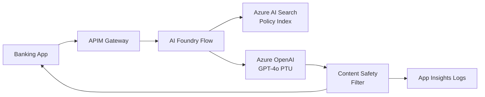

**Interview Q&A:**

*Q: PTU vs Pay-as-you-go (PAYG) Azure OpenAI mein — kab kya?*

PAYG default hai — per-token billing, shared capacity. Tujhe rate limits milte hain (TPM, RPM) per deployment. Latency variable, P99 spike kar sakta hai jab region mein load high ho. PTU (Provisioned Throughput Unit) tab le jab tera traffic predictable hai, latency-sensitive hai (sub-second P99), ya tu high volume pe hai. PTU me dedicated capacity reserve hoti hai — minimum commitment 100 PTUs, monthly ya yearly contract. Break-even roughly 30-40 million tokens/day pe PAYG se sasta padta hai. Hybrid bhi possible hai — PTU for production traffic, PAYG fallback for spillover. Azure mein "spillover" feature ab beta mein hai jo automatic routing karta hai.

*Q: Azure OpenAI vs OpenAI API — security difference?*

OpenAI API par tera data OpenAI ke servers pe jata hai — terms of service guarantee karta hai data training mein use nahi hoga, par data residency US default hai. Azure OpenAI pe data tere chosen Azure region mein rehta hai — India South, Sweden Central, jahaan tu chahega. Network isolation through Private Endpoints (no public internet exposure). Customer-managed encryption keys (CMK) supported. AAD (Azure AD) integration for auth — no static API keys required. Audit logs Azure Monitor mein. For regulated industries (healthcare HIPAA, finance, government FedRAMP High), Azure OpenAI hi viable option hai. Catch — model availability lag karti hai. Latest OpenAI model release ke 2-6 hafte baad Azure pe aata hai.

---

### 1.4 Modal, Replicate, RunPod, Lambda Labs

**Definition:** Specialized AI/GPU clouds. **Modal** — Python-native serverless GPU platform with sub-second cold starts. **Replicate** — model hosting marketplace, "Docker Hub for AI models" with HTTP API. **RunPod** — GPU rental at low prices, both serverless aur dedicated pods. **Lambda Labs** — focused on training-class GPUs (H100, B200) with cheap cluster pricing.

**Why:** Hyperscalers GPU markup heavy lagate hain. A100 AWS pe $4/hr, Modal pe $1.50/hr same hardware. RunPod pe community cloud pe $0.79/hr. Lambda Labs pe H100 cluster pre-built milta hai $2/hr (vs AWS $12/hr). Yeh saving accumulate karta hai jab tu month bhar GPUs chala raha hai. Modal ka killer feature — `@app.function(gpu="A100")` decorator likhke kuch bhi GPU pe chala sakta hai, no Docker, no Kubernetes. Replicate pe COG framework se model package karke deploy 5 min mein. RunPod me serverless workers spin up 4-5 sec mein. Lambda Labs training clusters bohot popular hain academic/research labs mein.

**How:**

```python
# Modal pe LLM inference deploy karna
import modal

# Image define — Python deps + model weights
image = (
    modal.Image.debian_slim()
    .pip_install("vllm==0.6.3", "torch==2.4.0")
    .run_commands("pip install flash-attn --no-build-isolation")
)

app = modal.App("llm-server")

# A100 80GB pe deploy, scale-to-zero default
@app.cls(
    image=image,
    gpu="A100-80GB",
    container_idle_timeout=120,  # 2 min idle ke baad shutdown
    allow_concurrent_inputs=10,  # 10 parallel requests per container
)
class LLMServer:
    @modal.enter()  # container startup
    def load_model(self):
        from vllm import LLM
        self.llm = LLM(model="meta-llama/Llama-3.1-8B-Instruct")
    
    @modal.method()
    def generate(self, prompt: str, max_tokens: int = 200):
        from vllm import SamplingParams
        params = SamplingParams(temperature=0.7, max_tokens=max_tokens)
        result = self.llm.generate([prompt], params)
        return result[0].outputs[0].text

# Local se invoke
@app.local_entrypoint()
def main():
    server = LLMServer()
    print(server.generate.remote("What is RAG?"))
```

```yaml
# RunPod serverless worker — handler.py + Dockerfile
# handler.py
import runpod
from transformers import pipeline

# Model load on cold start
generator = pipeline("text-generation", model="microsoft/phi-3.5-mini")

def handler(event):
    prompt = event["input"]["prompt"]
    result = generator(prompt, max_new_tokens=200)
    return {"output": result[0]["generated_text"]}

runpod.serverless.start({"handler": handler})
```

```python
# Replicate se hosted model call
import replicate

# Public model use karna — text-to-image
output = replicate.run(
    "black-forest-labs/flux-schnell",
    input={"prompt": "An IIT student debugging code at 3am"},
)
print(output)  # URL of generated image

# Custom model push — cog framework
# cog.yaml define + cog push r8.im/username/my-model
```

**Real-life Example:** Ek YC-funded AI video startup ka problem — Stable Diffusion video generation, har request ko ~30s lagte the H100 pe, traffic bursty (Tweet viral hua toh 1000x spike). AWS pe min 1 always-on H100 ($98/hr provisioned) afford nahi kar sakte the. Modal pe shift kiya — scale-to-zero, cold start 8s (model warm pre-loaded volume mount se), per-request billing $0.04. Monthly bill $14k se $2.8k pe aaya, aur burst handling 100 concurrent requests automatic. Long fine-tuning runs Lambda Labs ke H100 8x cluster pe — $24/hr vs AWS p5 $98/hr. Total infra savings 75%.

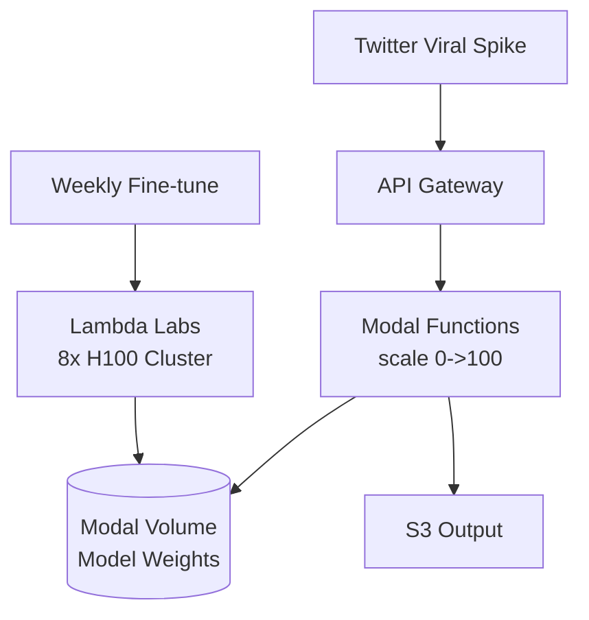

**Interview Q&A:**

*Q: Modal vs hyperscaler serverless (Lambda/Cloud Run) for AI?*

Modal AI-first design hai. GPU first-class citizen hai (Lambda mein GPU nahi, Cloud Run mein recently L4 only). Modal mein cold start engineered for ML — model weights persistent volumes mein cache hote hain, container init mein bas pointer load hota hai (not full download from S3). Sub-second cold start practical hai 30B model pe bhi. Pricing per-second, very granular. Tradeoffs — Modal ek startup hai, enterprise compliance (HIPAA, SOC2 Type 2 hai) limited compared to AWS. Vendor lock-in moderate — code Python decorators pe likha hai, port karna refactoring requires. For early-stage startups Modal is no-brainer. For enterprise stick with hyperscaler par expect 3-5x higher cost.

*Q: Spot/community cloud GPU reliability — production mein use kar sakte hain?*

Production user-facing latency-sensitive workload mein community/spot avoid kar — eviction risk hai. Lekin batch workloads (training, embedding generation, async inference jobs) ke liye perfect hai. Strategy — checkpoint frequently (every 5-10 min training step), aur multi-region/multi-provider failover. RunPod community cloud pe individual GPU host kabhi bhi disconnect kar sakta hai (host owner power off karta hai), but RunPod ka secure cloud ($1.50-2/hr range) datacenter-hosted hai aur 99.9% uptime SLA deta hai. Hybrid approach — production critical path pe Modal/secure cloud, batch pe community/spot. Smart engineer cost-aware queue routing likhta hai (Celery/Temporal) jo job priority dekh ke route kare.

---

## 2. Containerization & Orchestration

Containers ML world ka standard packaging format ban gaye hain. CUDA versions, Python deps, system libraries — sab ko ek immutable image mein lock karna critical hai for reproducibility. Kubernetes massive scale pe orchestration deta hai but learning curve sharp hai. Modern tooling (KServe, Ray Serve, NVIDIA GPU Operator) Kubernetes pe AI workloads ko first-class banata hai — pehle GPU sharing, model loading, autoscaling — sab solved patterns hai.

### 2.1 Docker for ML (CUDA images, multi-stage)

**Definition:** Docker container packaging tool hai jo apps with dependencies ko portable image mein wrap karta hai. ML ke liye base images NVIDIA CUDA/cuDNN runtime ke saath aate hain. Multi-stage builds image size kam karte hain — build ke time heavy compilers use karte hain, final stage mein only runtime artifacts.

**Why:** ML mein dependency hell real hai. Tensorflow 2.15 ko CUDA 12.2 chahiye, PyTorch 2.4 ko CUDA 12.4 chahiye, but tu unhe sath chala nahi sakta unless container isolation ho. Production deploy karte time tu nahi chahta ki "works on my machine" syndrome ho — Docker image ek hi binary hai jo dev, staging, production sab jagah chalti hai. Multi-stage builds critical hain — naive PyTorch image 8GB hota hai, optimized 2GB. Smaller image = faster pull = faster cold start = less bandwidth cost.

**How:**

```dockerfile
# Multi-stage Dockerfile for vLLM serving
# Stage 1: Builder — yahaan compile/install hota hai
FROM nvidia/cuda:12.4.1-devel-ubuntu22.04 AS builder

# System deps — build tools
RUN apt-get update && apt-get install -y \
    python3.11 python3-pip git build-essential \
    && rm -rf /var/lib/apt/lists/*  # cache clean — image size kam

# Python deps — wheel install with build extras
WORKDIR /build
COPY requirements.txt .
RUN pip install --user --no-cache-dir -r requirements.txt

# Stage 2: Runtime — minimal image, sirf zaroori cheez
FROM nvidia/cuda:12.4.1-runtime-ubuntu22.04 AS runtime

# Sirf Python runtime, build tools nahi
RUN apt-get update && apt-get install -y \
    python3.11 \
    && rm -rf /var/lib/apt/lists/*

# Builder se copy — only installed packages
COPY --from=builder /root/.local /root/.local
ENV PATH=/root/.local/bin:$PATH

# Non-root user — security best practice
RUN useradd -m -u 1000 mluser
USER mluser

WORKDIR /app
COPY --chown=mluser:mluser app/ ./

# Health check endpoint
HEALTHCHECK --interval=30s --timeout=10s --start-period=120s \
  CMD python3 -c "import requests; requests.get('http://localhost:8000/health').raise_for_status()"

EXPOSE 8000
CMD ["python3", "-m", "vllm.entrypoints.openai.api_server", \
     "--model", "meta-llama/Llama-3.1-8B-Instruct", \
     "--port", "8000"]
```

```bash
# Build with BuildKit — parallel layers, cache mounts
DOCKER_BUILDKIT=1 docker build \
  --target runtime \
  --tag my-llm-server:v1.2.3 \
  --cache-from my-llm-server:latest \
  .

# Image size check — multi-stage = chhoti image
docker images my-llm-server
# my-llm-server  v1.2.3  ...  2.1GB    (vs 8GB single-stage)

# Run with GPU
docker run --gpus all -p 8000:8000 my-llm-server:v1.2.3
```

**Real-life Example:** Ek company ka problem — naive Dockerfile use kar rahe the with `pytorch/pytorch:latest` base. Image 12GB tha, ECR pull time 4 min per node, autoscaling cold start 6 min total. Multi-stage rewrite kiya — dev deps (compilers, test frameworks) builder stage mein, runtime mein only inference deps. Final image 1.8GB. ECR pull time 45 sec, cold start 90 sec total. Autoscaling ab traffic spike ke 90 sec mein react karta tha vs 6 min — user latency P99 down 40%. Image size matter karta hai bhai!

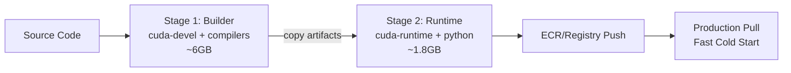

**Interview Q&A:**

*Q: CUDA devel vs runtime image — kab kya?*

CUDA devel image (`nvidia/cuda:12.4.1-devel-ubuntu22.04`) full CUDA toolkit include karta hai — `nvcc` compiler, header files, debugging tools. Tujhe yeh chahiye jab tu C++ extensions compile kar raha hai (xformers, flash-attn, custom CUDA kernels). Image ~6GB hota hai. CUDA runtime image (`nvidia/cuda:12.4.1-runtime-ubuntu22.04`) sirf shared libraries (libcudart, libcublas) include karta hai. Image ~3GB. Production inference ke liye runtime hi sufficient hai. Multi-stage pattern mein devel ko builder stage mein use kar, fir runtime stage mein wheels copy kar. Aur ek base image bhi hota hai (`nvidia/cuda:12.4.1-base-ubuntu22.04`) jo ekdum minimal hai — agar tu khud sab dependencies install karna chahta hai toh base se start kar.

*Q: Image size optimize karne ke 5 tricks?*

Pehla — multi-stage builds use kar, build deps runtime mein nahi. Doosra — `--no-cache-dir` pip ke saath, pip cache delete kar har layer mein. Teesra — apt-get lists clean kar (`rm -rf /var/lib/apt/lists/*`) same RUN command mein, warna previous layer mein bach jate hain. Chautha — distroless ya alpine base images consider kar (alpine glibc compatibility issues hain ML mein, careful rehna). Paanchwa — `.dockerignore` file likh — `.git`, `__pycache__`, `*.pyc`, datasets exclude kar, warna build context fat ho jata hai. Bonus — model weights image mein bake mat kar, runtime pe S3/HF Hub se download kar (or persistent volume mount kar). 7B model 14GB hai, image mein daalna pagalpan hai.

---

### 2.2 Kubernetes basics (pods, deployments, services)

**Definition:** Kubernetes (K8s) container orchestration platform hai — multiple containers across nodes manage karta hai. **Pod** — smallest deployable unit, ek ya zyada containers jo network/storage share karte hain. **Deployment** — declarative way to manage replicas of pods (rolling updates, rollback). **Service** — stable network endpoint (ClusterIP, NodePort, LoadBalancer) for accessing pods.

**Why:** Single Docker container chalana easy hai. 100 containers across 10 nodes with auto-recovery, rolling updates, load balancing — yeh humanly impossible hai manually. Kubernetes declarative model deta hai — tu YAML mein "main 5 replicas chahta hu" likhta hai, K8s ensure karta hai 5 chal rahe hain. Pod fail hua? Naya bana liya. Node down? Reschedule kar diya doosre node pe. AI workloads pe yeh critical hai kyunki GPUs scarce hain, scheduling complex hai (GPU affinity, multi-instance GPU sharing), aur scale large hai. Industry standard — agar tu serious production AI infra build kar raha hai, K8s skip nahi kar sakta.

**How:**

```yaml
# Deployment YAML — vLLM model serving
apiVersion: apps/v1
kind: Deployment
metadata:
  name: llama-vllm
  namespace: ai-prod
  labels:
    app: llama-vllm
spec:
  replicas: 3  # 3 pods chalenge
  selector:
    matchLabels:
      app: llama-vllm
  strategy:
    type: RollingUpdate
    rollingUpdate:
      maxSurge: 1       # ek extra pod allowed during update
      maxUnavailable: 0  # zero downtime
  template:
    metadata:
      labels:
        app: llama-vllm
    spec:
      # GPU node affinity — sirf GPU nodes pe schedule
      nodeSelector:
        nvidia.com/gpu.product: A100-SXM4-80GB
      containers:
      - name: vllm
        image: my-registry/vllm-server:v2.1.0
        ports:
        - containerPort: 8000
          name: http
        resources:
          requests:
            nvidia.com/gpu: 1
            memory: "60Gi"
            cpu: "8"
          limits:
            nvidia.com/gpu: 1
            memory: "70Gi"
            cpu: "12"
        # Liveness — pod stuck ho toh restart
        livenessProbe:
          httpGet:
            path: /health
            port: 8000
          initialDelaySeconds: 180  # model load 3 min
          periodSeconds: 30
        # Readiness — traffic accept karne ko ready hai?
        readinessProbe:
          httpGet:
            path: /health
            port: 8000
          initialDelaySeconds: 60
          periodSeconds: 10
        env:
        - name: HF_TOKEN
          valueFrom:
            secretKeyRef:
              name: huggingface-secret
              key: token
        volumeMounts:
        - name: model-cache
          mountPath: /root/.cache/huggingface
      volumes:
      - name: model-cache
        persistentVolumeClaim:
          claimName: hf-model-cache  # weights cache karna
---
# Service — internal load balancer for pods
apiVersion: v1
kind: Service
metadata:
  name: llama-vllm-svc
  namespace: ai-prod
spec:
  type: ClusterIP  # internal-only; ingress se external expose
  selector:
    app: llama-vllm
  ports:
  - port: 80
    targetPort: 8000
    protocol: TCP
---
# HPA — auto-scale based on GPU utilization
apiVersion: autoscaling/v2
kind: HorizontalPodAutoscaler
metadata:
  name: llama-vllm-hpa
spec:
  scaleTargetRef:
    apiVersion: apps/v1
    kind: Deployment
    name: llama-vllm
  minReplicas: 2
  maxReplicas: 20
  metrics:
  - type: Pods
    pods:
      metric:
        name: dcgm_gpu_utilization  # NVIDIA DCGM exporter se
      target:
        type: AverageValue
        averageValue: "70"  # 70%+ GPU util pe scale up
```

```bash
# Apply manifests
kubectl apply -f deployment.yaml

# Status check
kubectl get pods -n ai-prod -l app=llama-vllm
kubectl describe pod llama-vllm-xyz -n ai-prod

# Logs stream
kubectl logs -n ai-prod -l app=llama-vllm --tail=100 -f

# Rolling restart — config change ke baad
kubectl rollout restart deployment/llama-vllm -n ai-prod

# Rollback agar deploy bigda
kubectl rollout undo deployment/llama-vllm -n ai-prod
```

**Real-life Example:** Ek SaaS AI company 50+ models serve karti thi different customers ko. Initial design — har model EC2 instance pe directly. 50 EC2 instances manage karna chaos tha — driver updates, security patches, scaling scripts ad-hoc. K8s pe migrate kiya — har model ek Deployment, namespace per customer for isolation. Helm charts use kiye for templating (model name, GPU type, replica count parameterize). Ops team 2 engineer se 1 ho gayi (kyunki K8s self-heals). Spot instance integration karke (Karpenter autoscaler) cost 40% kam hua — Karpenter spot terminations dekh ke pods doosre node pe shift karta hai automatically, tera service barely notice karta hai.

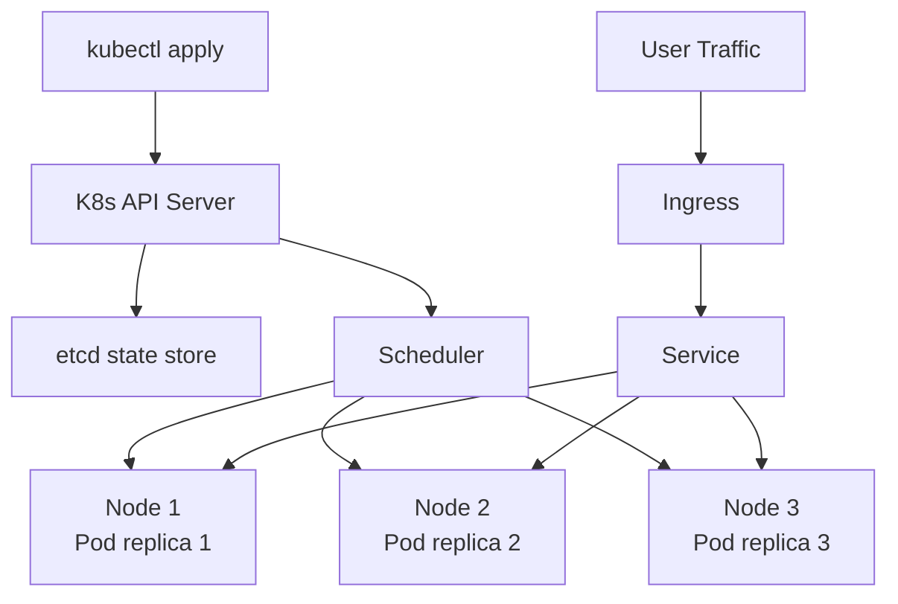

**Interview Q&A:**

*Q: Pod vs container vs deployment — bata simple example se?*

Container ek running instance hai tera Docker image ka — single process, isolated filesystem/network. Pod ek logical group of containers hai jo same node pe chalti hai aur localhost se communicate kar sakti hai. Mostly 1 container per pod hota hai, but sidecar pattern mein 2-3 containers (main app + log forwarder + service mesh proxy) ek pod mein. Deployment ek higher-level controller hai — woh kehta hai "main is pod template ke 5 replicas chahta hu, healthy state mein". Deployment ke under ReplicaSet controller chalta hai jo actual pod count maintain karta hai. Tu deployment ka YAML edit karta hai (image version change), ReplicaSet new pods banata hai purane wale terminate karta hai — rolling update. Kabhi tu seedha pods nahi banata, hamesha deployment se manage karte hain (ya Job/StatefulSet/DaemonSet specific cases mein).

*Q: requests vs limits resources mein — galti kahan kar sakte hain?*

Requests woh minimum guarantee hai — scheduler is field se decide karta hai pod kis node pe fit ho jaye. Limits hard ceiling hai — pod isse zyada use nahi kar sakta, OOMKilled hota hai memory limit cross karne pe, throttled hota hai CPU limit pe. Common galti — request kam, limit bohot zyada. Scheduler bohot pods ek node pe pack kar deta hai (kyunki request kam hai), fir spike pe sab limit tak claim karte hain, node OOM, sab pods crash. Doosri galti — GPU pe limits=requests rakhna mandatory hai (`nvidia.com/gpu: 1` dono mein), warna scheduler reject karta hai. Memory limit hamesha realistic rakh — model weights + KV cache + activations dekh ke 20% buffer add. CPU pe limit set hi mat kar inference workloads pe — throttling latency kharab karta hai, requests pe sufficient.

---

### 2.3 GPU operators (NVIDIA on K8s)

**Definition:** NVIDIA GPU Operator ek Kubernetes operator hai jo GPU drivers, container runtime (NVIDIA container toolkit), device plugin, monitoring (DCGM), aur MIG configuration sab automate karta hai. CRD-based — tu YAML likh ke "yeh node GPU node hai" declare karta hai, operator install/upgrade karta hai.

**Why:** Manual GPU setup pain hai. Har node pe driver install kar (kernel module compile), nvidia-docker setup kar, device plugin daemonset deploy kar, DCGM exporter for metrics, fabric manager for NVLink — yeh sab nodes ke across consistent rakhna manually impossible hai. GPU Operator ek single Helm chart se sab handle karta hai. Driver upgrade jab tu chahega without node reboot (with newer kernel modules driver). MIG (Multi-Instance GPU) config bhi YAML se manage hota hai — A100 ko 7 instances mein partition karke multiple workloads share kar sakte hain.

**How:**

```bash
# GPU Operator install via Helm
helm repo add nvidia https://helm.ngc.nvidia.com/nvidia
helm repo update

# Cluster-wide install — operator namespace banao
kubectl create namespace gpu-operator

# Default config — drivers, toolkit, device plugin sab install hoga
helm install gpu-operator nvidia/gpu-operator \
  --namespace gpu-operator \
  --set driver.version="550.90.07" \
  --set toolkit.version="v1.16.2-ubuntu22.04" \
  --set dcgmExporter.enabled=true \
  --set mig.strategy=mixed
```

```yaml
# MIG configuration — A100 80GB ko partition
apiVersion: v1
kind: ConfigMap
metadata:
  name: default-mig-parted-config
  namespace: gpu-operator
data:
  config.yaml: |
    version: v1
    mig-configs:
      # 7 chhote instances — small inference workloads
      all-1g.10gb:
        - devices: all
          mig-enabled: true
          mig-devices:
            "1g.10gb": 7
      # 3 medium instances + 1 small
      mixed-config:
        - devices: all
          mig-enabled: true
          mig-devices:
            "2g.20gb": 3
            "1g.10gb": 1
---
# Node label MIG config select karne ke liye
# kubectl label nodes <node-name> nvidia.com/mig.config=all-1g.10gb
```

```yaml
# Pod requesting MIG instance
apiVersion: v1
kind: Pod
metadata:
  name: small-inference
spec:
  containers:
  - name: app
    image: my-inference:latest
    resources:
      limits:
        # MIG-specific resource — 1/7 of A100
        nvidia.com/mig-1g.10gb: 1
```

```bash
# Verify GPU availability
kubectl get nodes -o json | jq '.items[].status.allocatable | with_entries(select(.key | startswith("nvidia.com/")))'

# DCGM metrics — Prometheus scrape karta hai
kubectl port-forward -n gpu-operator svc/dcgm-exporter 9400:9400
curl localhost:9400/metrics | grep DCGM_FI_DEV_GPU_UTIL
```

**Real-life Example:** Ek media company ke pas 4x A100 80GB nodes the. Single workload only 30% GPU use kar raha tha (small image classification model). Wastage massive — paisa burn ho raha tha. MIG enable kiya GPU Operator se — har A100 ko 7x 1g.10gb instances mein todh diya. Total 28 logical GPUs from 4 physical. Multiple teams' workloads ek hi node pe co-locate kar diye with isolation guarantees (MIG hardware-level partition hai, no noisy neighbor). GPU utilization 30% se 75% pohch gaya. Effectively 2.5x more compute from same hardware spend.

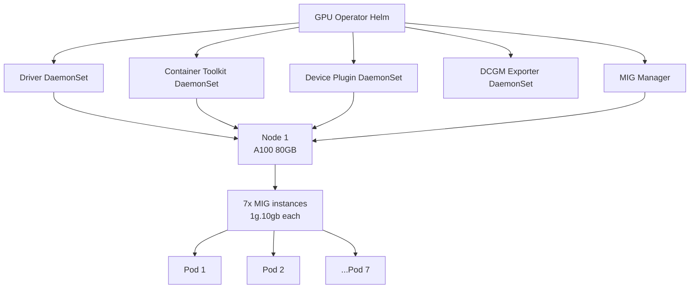

**Interview Q&A:**

*Q: MIG vs GPU sharing (time-slicing) — difference?*

MIG hardware-level partition hai — A100 / H100 ka SM (streaming multiprocessors) aur memory physically separated hai partitions mein. Strong isolation — ek partition crash ho ya OOM ho, doosre affect nahi hoga. Performance predictable, no contention. Sirf A100/A30/H100 family pe available. Time-slicing (NVIDIA's earlier sharing approach) software-level hai — multiple processes same GPU pe context-switch karte hain. Cheaper hardware (T4, V100, L4) pe support karta hai. Lekin no isolation — ek workload memory spike kare, doosra OOM ho jata hai. Latency unpredictable — context switch overhead. Production mein MIG use kar where available (especially A100/H100). Time-slicing dev/test environments mein theek hai jahan workloads predictable hain.

*Q: Driver upgrade strategy — production mein kaise?*

GPU Operator declarative driver versioning support karta hai. Helm values mein driver version bump kar — operator automatically older driver pods evict karega, new version install karega. Pre-condition — node drainable ho. Strategy: pehle staging cluster pe upgrade kar, smoke test (sample inference run) chala. Production pe rolling upgrade — ek node at a time, pod evict, driver upgrade, GPU available wait kar, fir next node. Operator built-in `node.kubernetes.io/exclude-disruption` taint use karta hai during upgrade. Risk — naye driver mein regression. Mitigation: keep last working version pinned, rollback Helm release ek command mein possible. CI mein tu nightly canary upgrade kar sakta hai isolated test cluster pe to detect issues early.

---

### 2.4 KServe, Ray Serve

**Definition:** **KServe** (formerly KFServing) Kubernetes-native model serving platform hai with standardized inference protocols (OpenAPI v2), autoscaling (Knative-based), canary rollouts, transformers/explainers. **Ray Serve** Ray ecosystem ka serving layer — Python-first, supports model composition, batching, streaming, fractional GPU.

**Why:** Raw Kubernetes deployments mein tujhe har model ke liye custom Dockerfile, service, HPA likhna padta hai. KServe abstract karta hai — `InferenceService` CRD diya, model storage location batayi, KServe ne pod, service, scaling, routing sab handle kar liya. Plus standardized API — same client code different model frameworks (PyTorch, TF, sklearn, ONNX) call kar sakta hai. Ray Serve ka USP — Pythonic API, complex pipelines easily express hote hain (e.g., embed → retrieve → rerank → generate ek deployment graph mein). Fractional GPU allocation built-in — 0.5 GPU per replica possible hai (memory/SM split).

**How:**

```yaml
# KServe InferenceService for HuggingFace model
apiVersion: serving.kserve.io/v1beta1
kind: InferenceService
metadata:
  name: llama-3-instruct
  namespace: ai-prod
spec:
  predictor:
    model:
      modelFormat:
        name: huggingface
      args:
        - --model_name=llama-3-instruct
        - --model_id=meta-llama/Llama-3.1-8B-Instruct
      resources:
        limits:
          nvidia.com/gpu: 1
          memory: "32Gi"
        requests:
          nvidia.com/gpu: 1
          memory: "30Gi"
    # Knative-based auto-scaling
    minReplicas: 0  # scale to zero
    maxReplicas: 10
    scaleTarget: 1   # target 1 concurrent request per pod
    scaleMetric: concurrency
  # Canary deployment — 10% traffic naye model ko
  predictor:
    canaryTrafficPercent: 10
```

```python
# Ray Serve — composable inference graph
import ray
from ray import serve
from transformers import pipeline

@serve.deployment(
    num_replicas=2,
    ray_actor_options={"num_gpus": 0.5},  # half GPU per replica
)
class Embedder:
    def __init__(self):
        self.model = pipeline("feature-extraction", 
                              model="sentence-transformers/all-MiniLM-L6-v2",
                              device=0)
    
    async def __call__(self, text: str):
        return self.model(text)[0][0]

@serve.deployment(
    num_replicas=1,
    ray_actor_options={"num_gpus": 1},
)
class Generator:
    def __init__(self):
        from vllm import LLM
        self.llm = LLM(model="meta-llama/Llama-3.1-8B-Instruct")
    
    async def __call__(self, prompt: str):
        from vllm import SamplingParams
        result = self.llm.generate([prompt], SamplingParams(max_tokens=200))
        return result[0].outputs[0].text

# Composition — RAG pipeline as graph
@serve.deployment
class RAGPipeline:
    def __init__(self, embedder, generator):
        self.embedder = embedder
        self.generator = generator
    
    async def __call__(self, query: str):
        # Step 1 — query embed
        emb = await self.embedder.remote(query)
        # Step 2 — vector search (pseudo)
        context = vector_search(emb)
        # Step 3 — generate
        prompt = f"Context: {context}\nQuestion: {query}\nAnswer:"
        return await self.generator.remote(prompt)

# Deploy graph
serve.run(RAGPipeline.bind(Embedder.bind(), Generator.bind()))
```

```bash
# KServe install
kubectl apply -f https://github.com/kserve/kserve/releases/download/v0.13.0/kserve.yaml

# Inference call
curl -v -H "Host: llama-3-instruct.ai-prod.example.com" \
  http://kserve-ingress/v2/models/llama-3-instruct/infer \
  -d '{"inputs": [{"name": "text", "data": ["What is K8s?"]}]}'
```

**Real-life Example:** Ek health-tech startup ne medical document understanding pipeline banai. Components — OCR (Tesseract), entity extraction (BioBERT), summarization (Llama-3-8B), structured output (Pydantic + JSON schema). Pehle har component ek separate FastAPI app tha — orchestration code spaghetti, retries inconsistent, GPU utilization bad. Ray Serve pe migrate kiya — sab 4 components ek deployment graph mein. Fractional GPU se BioBERT aur summarizer same A100 pe co-located (60-40 split). Internal latency 3x improve hua kyunki RPC overhead gaya, batching automatic ho gaya. Cost: 2 A100 nodes se 1 A100 node — 50% bachaaya.

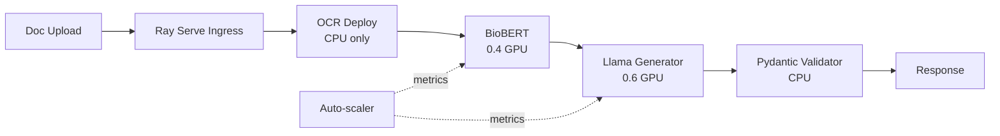

**Interview Q&A:**

*Q: KServe vs Ray Serve vs raw Kubernetes Deployment?*

Raw Deployment full control deta hai par boilerplate bohot hai — Dockerfile, service, HPA, ingress, monitoring sab tu likh. KServe declarative hai for standard patterns — single model serving, A/B test, canary. CRD-based, GitOps friendly. Best agar tu standard PyTorch/TF/HF model serve kar raha hai aur K8s native experience chahta hai. Limitations — custom logic (multi-model orchestration, complex preprocessing) mushkil hai. Ray Serve Python-first hai — multi-component pipelines, dynamic batching, fractional GPU, model composition built-in. Best agar pipeline complex hai (RAG, agent workflows). Tradeoff — Ray cluster manage karna extra ops complexity hai. Production teams hybrid use karte hain — single model serve KServe se, complex graphs Ray Serve pe.

*Q: Knative scale-to-zero AI workloads pe practical hai kya?*

Theoretically haan, practically depends. Cold start time bottleneck hai — 8B LLM weights load hone mein 60-180s lagte hain GPU memory mein. Yeh user-facing latency-sensitive workload ke liye unacceptable hai. Mitigations: pehla — model weights persistent volume pe cache kar (S3 se download once), pod startup pe sirf disk se load (still 30-60s). Doosra — minReplicas=1 rakh peak hours mein, scale-to-zero off-hours mein. Teesra — model warmup jobs use kar (pre-pull image to nodes, pre-load common weights). Async/batch workloads mein scale-to-zero perfect hai — user 30s wait kar lega doc processing pe. Real-time chat mein min 1 keep replicas. Hybrid pricing model bhi hai — provisioned base capacity + burst on scale-to-zero replicas for cost savings.

---

## 3. CI/CD for AI

CI/CD AI mein traditional software se zyada complex hai. Tu sirf code deploy nahi kar raha — model weights, prompts, eval scores, dataset versions sab artifacts hain. Eval-gated deployments mandatory hain — kyunki accuracy regress kar sakti hai prompt change se. Canary aur feature flags model switch ko safe banate hain — naya model 1% traffic pe try kar, metrics dekh, fir gradually 100%.

### 3.1 GitHub Actions / GitLab CI

**Definition:** GitHub Actions GitHub-native CI/CD platform hai with YAML-based workflows triggered by repo events. GitLab CI similar hai, GitLab repos ke liye. Both support self-hosted runners — important for AI workloads (GPU runners required).

**Why:** Manual deploy se bug-free production possible nahi hai. Automated pipelines deterministic hain — same input always same output. AI ke liye CI mein tests nahi sirf, eval suites bhi hain (golden questions pe model accuracy check). CD pipelines ko model registry integration chahiye — naya model artifact register karna, signature verify karna, deploy. GitHub Actions ka killer feature — matrix builds (multiple Python/CUDA combinations), reusable workflows, OIDC for cloud auth (no static secrets).

**How:**

```yaml
# .github/workflows/ml-deploy.yaml
name: ML Model Deploy Pipeline

on:
  push:
    branches: [main]
    paths:
      - 'models/**'
      - 'prompts/**'
  pull_request:
    branches: [main]

env:
  AWS_REGION: us-east-1
  ECR_REPO: 123456789.dkr.ecr.us-east-1.amazonaws.com/llm-inference

jobs:
  unit-tests:
    runs-on: ubuntu-latest
    steps:
      - uses: actions/checkout@v4
      - uses: actions/setup-python@v5
        with:
          python-version: '3.11'
          cache: 'pip'
      - run: pip install -r requirements-dev.txt
      - run: pytest tests/unit -v --cov=src --cov-fail-under=80
  
  eval-suite:
    needs: unit-tests
    runs-on: [self-hosted, gpu, a10g]  # GPU runner
    steps:
      - uses: actions/checkout@v4
      - run: pip install -r requirements.txt
      # Eval suite — 200 golden Q&A pe accuracy
      - name: Run Eval Suite
        id: eval
        env:
          OPENAI_API_KEY: ${{ secrets.OPENAI_API_KEY }}  # judge model
        run: |
          python scripts/run_evals.py --suite golden_v3 \
            --output eval-report.json
      # Eval gate — accuracy >= 0.85 chahiye
      - name: Check Eval Threshold
        run: |
          python -c "
          import json
          r = json.load(open('eval-report.json'))
          assert r['accuracy'] >= 0.85, f'Eval failed: {r[\"accuracy\"]}'
          print(f'Eval passed: {r[\"accuracy\"]}')
          "
      - uses: actions/upload-artifact@v4
        with:
          name: eval-report
          path: eval-report.json
  
  build-and-push:
    needs: eval-suite
    if: github.ref == 'refs/heads/main'
    runs-on: ubuntu-latest
    permissions:
      id-token: write  # OIDC ke liye
      contents: read
    steps:
      - uses: actions/checkout@v4
      # AWS auth via OIDC — no static creds
      - uses: aws-actions/configure-aws-credentials@v4
        with:
          role-to-assume: arn:aws:iam::123456789:role/GHActionsDeployRole
          aws-region: ${{ env.AWS_REGION }}
      - uses: aws-actions/amazon-ecr-login@v2
      - name: Build and push
        run: |
          IMAGE_TAG=${GITHUB_SHA::8}
          docker build -t $ECR_REPO:$IMAGE_TAG .
          docker push $ECR_REPO:$IMAGE_TAG
          # Tag latest only after eval pass
          docker tag $ECR_REPO:$IMAGE_TAG $ECR_REPO:latest
          docker push $ECR_REPO:latest
  
  deploy-canary:
    needs: build-and-push
    runs-on: ubuntu-latest
    environment: production  # manual approval gate
    steps:
      - uses: actions/checkout@v4
      - name: Deploy 10% canary
        run: |
          # Argo Rollouts ya manual kubectl
          kubectl set image deployment/llm-canary \
            vllm=$ECR_REPO:${GITHUB_SHA::8} -n ai-prod
          kubectl rollout status deployment/llm-canary -n ai-prod
```

```yaml
# .gitlab-ci.yml — equivalent in GitLab
stages:
  - test
  - eval
  - build
  - deploy

unit-test:
  stage: test
  image: python:3.11
  script:
    - pip install -r requirements-dev.txt
    - pytest tests/unit -v

eval-suite:
  stage: eval
  tags: [gpu-runner]  # GitLab runner with GPU
  script:
    - python scripts/run_evals.py --suite golden_v3
  artifacts:
    reports:
      junit: eval-report.xml
    paths:
      - eval-report.json
    when: always
```

**Real-life Example:** Ek prompt engineering team prompts.yaml mein 50+ prompts manage kar rahi thi. Direct prod commit habit thi — koi engineer prompt tweak karta tha, push karta tha, prod break ho jata tha (response format change ho jata tha). GitHub Actions pipeline banaya — har PR pe automated eval suite (300 test cases) chalti thi. Prompt change ka diff dikhata tha PR pe — aur eval score compare hota tha baseline se. Score regress hua toh PR block. Approval flow with 2 reviewers + automated check. Production incidents 8/month se 0/month ho gaye 3 months mein.

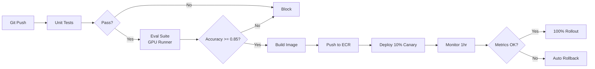

**Interview Q&A:**

*Q: Self-hosted runners GPU CI ke liye — pros/cons?*

GitHub-hosted runners pe GPU nahi hai (recently larger runners with GPU launched, expensive). Self-hosted runners tujhe GPU access deti hain at low cost — tu apna A10 ya T4 instance dedicate kar runner ke liye, monthly fixed cost. Pros — cheap, customizable (preinstalled CUDA, cached models), fast (warm runner = instant start). Cons — security (untrusted code GPU access mile, prompt injection risks, supply chain), maintenance (driver updates, runner version), capacity planning (peak time queue ban jata hai). Best practice — ephemeral runners (job ke baad VM destroy), separate runner pools for trusted/untrusted code, scale via cloud autoscaling (Karpenter for K8s-based runners). Production teams Modal/RunPod runners use karte hain — pay-per-use GPU CI without infra ownership.

*Q: Secrets management in CI for AI APIs?*

Static secrets (OpenAI keys, HF tokens) repo mein commit nahi karna — git history mein leak ho jate hain (BFG ya filter-repo se mushkil hai purge). Use GitHub Secrets/GitLab CI variables — encrypted at rest, masked in logs. Better — OIDC federation: CI workflow short-lived token le cloud provider se (AWS STS AssumeRoleWithWebIdentity, GCP Workload Identity Federation). Token 1hr valid, no static creds anywhere. For LLM API keys, vault integration use kar (HashiCorp Vault, AWS Secrets Manager) — runtime fetch via service principal. Audit logging mandatory — kaun kab kaunsa secret use kiya. Rotate keys quarterly automated. Aur eval suites ke liye — production keys mat use kar! Dev/test environment ke separate keys with usage limits.

---

### 3.2 Eval-gated deployments

**Definition:** Eval-gated deployment ek pipeline pattern hai jismein code/model/prompt change tab hi deploy hota hai jab automated eval suite pass kare quality threshold. Eval suite golden questions, regression cases, safety tests, latency benchmarks include karti hai.

**Why:** Traditional unit tests AI mein insufficient hain. Tu prompt change kiya, function returns same string format — unit test pass. Lekin response quality drop ho gayi 20% — kaise pakdega? Eval suite pakdegi. Industries jaise healthcare, finance mein regulatory requirement hai — tu prove kar tera model harm nahi kar raha. Eval-gated CD model accountability deti hai. Safety-specific evals — jailbreak detection, PII leakage, toxicity — separate gates hain critical hai.

**How:**

```python
# eval_runner.py — orchestrator
import json, asyncio, statistics
from pathlib import Path
from typing import List, Dict
from dataclasses import dataclass

@dataclass
class EvalCase:
    id: str
    input: str
    expected: str
    metric: str  # exact_match, rouge, llm_judge, regex
    weight: float = 1.0

@dataclass 
class EvalResult:
    case_id: str
    passed: bool
    score: float
    actual: str
    latency_ms: float

# LLM-as-judge — semantic eval
async def llm_judge(actual: str, expected: str, criteria: str) -> float:
    from openai import AsyncOpenAI
    client = AsyncOpenAI()
    prompt = f"""Score 0.0-1.0:
    Expected: {expected}
    Actual: {actual}
    Criteria: {criteria}
    Output ONLY the float score."""
    r = await client.chat.completions.create(
        model="gpt-4o-mini",
        messages=[{"role": "user", "content": prompt}],
        temperature=0,
    )
    return float(r.choices[0].message.content.strip())

# Eval suite runner
async def run_suite(model_endpoint: str, cases: List[EvalCase]) -> Dict:
    results = []
    for case in cases:
        actual, latency = await call_model(model_endpoint, case.input)
        if case.metric == "llm_judge":
            score = await llm_judge(actual, case.expected, "factual accuracy")
        elif case.metric == "exact_match":
            score = 1.0 if actual.strip() == case.expected.strip() else 0.0
        results.append(EvalResult(case.id, score >= 0.7, score, actual, latency))
    
    # Aggregate metrics
    return {
        "accuracy": sum(r.passed for r in results) / len(results),
        "mean_score": statistics.mean(r.score for r in results),
        "p95_latency_ms": statistics.quantiles([r.latency_ms for r in results], n=20)[18],
        "total_cases": len(results),
        "passed": sum(r.passed for r in results),
        "results": [r.__dict__ for r in results],
    }

# Gate logic — multiple thresholds
def gate(report: Dict, baseline: Dict) -> bool:
    # Hard thresholds
    if report["accuracy"] < 0.85:
        print(f"FAIL: accuracy {report['accuracy']} < 0.85")
        return False
    if report["p95_latency_ms"] > 3000:
        print(f"FAIL: P95 latency {report['p95_latency_ms']} > 3000ms")
        return False
    # Regression check vs baseline (don't drop more than 2%)
    if report["accuracy"] < baseline["accuracy"] - 0.02:
        print(f"REGRESSION: dropped from {baseline['accuracy']} to {report['accuracy']}")
        return False
    return True

if __name__ == "__main__":
    cases = [EvalCase(**c) for c in json.load(open("eval_cases.json"))]
    report = asyncio.run(run_suite("https://llm.api/v1/chat", cases))
    baseline = json.load(open("baseline_eval.json"))
    
    json.dump(report, open("eval-report.json", "w"), indent=2)
    
    if not gate(report, baseline):
        exit(1)
    print(f"Eval passed: {report['accuracy']:.3f} accuracy")
```

```yaml
# CI integration — eval-gate.yaml
- name: Run eval suite
  run: python eval_runner.py
  
- name: Update baseline if main branch
  if: github.ref == 'refs/heads/main' && success()
  run: |
    cp eval-report.json baseline_eval.json
    git add baseline_eval.json
    git commit -m "Update eval baseline [skip ci]"
    git push

- name: Comment PR with results
  if: github.event_name == 'pull_request'
  uses: actions/github-script@v7
  with:
    script: |
      const report = require('./eval-report.json');
      const baseline = require('./baseline_eval.json');
      const delta = (report.accuracy - baseline.accuracy) * 100;
      const body = `## Eval Report
      - Accuracy: ${(report.accuracy * 100).toFixed(1)}% (${delta >= 0 ? '+' : ''}${delta.toFixed(1)}%)
      - P95 Latency: ${report.p95_latency_ms.toFixed(0)}ms
      - Cases: ${report.passed}/${report.total_cases}`;
      github.rest.issues.createComment({
        issue_number: context.issue.number,
        owner: context.repo.owner,
        repo: context.repo.repo,
        body
      });
```

**Real-life Example:** Ek legal-tech startup contract analysis tool banati thi. Initial deployment process — engineer prompt tweak, push, manual spot-check 5 contracts, deploy. 3 hafte mein 2 incidents — naya prompt kuch contract types pe hallucinate karta tha, paying customer complain. Eval-gated CD lagaya — 500 contracts ka golden set, output structure validated (Pydantic schema), key fields LLM-judge se score (0-1). Threshold: accuracy >=0.92, no field accuracy <0.85, P95 latency <5s. Pipeline mein 4 deployments rejected pehle hafte — accuracy regression catch kiya pehle. Production incidents 6 months mein zero ho gaye.

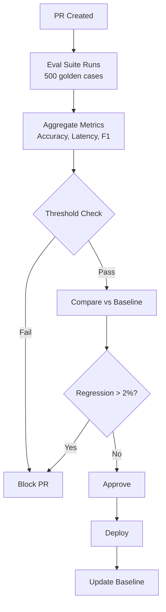

**Interview Q&A:**

*Q: LLM-as-judge reliable hai kya evals mein?*

Partially. Strengths — semantic equivalence judge kar sakta hai (rephrasings, factual claims), exact-match nahi pakad sakta. Scales easily — 1000s cases overnight. Weaknesses — bias (judge model apne style ko prefer karta hai, GPT-4 GPT-3.5 ko biased rate karta hai), positional bias (first option prefer), self-consistency issues. Best practices — multiple judges use kar (ensemble GPT-4 + Claude), pairwise comparison instead of absolute scores zyada reliable hai, calibrate against human-labeled subset (100 cases human labeled, judge correlation check kar). Critical decisions (regulatory, safety) pe pure LLM judge nahi — human-in-the-loop with judge as filter. For routine quality gates (fluency, format adherence), LLM judge sufficient with 90%+ correlation to human rate.

*Q: Eval suite drift ka problem aur solution?*

Eval drift dheere-dheere hota hai. Pehle suite challenging thi — model accuracy 70%. Tune kiya, ab 95%. Naye edge cases nahi add kiye, suite "easy" ban gayi for current model. Future regressions catch nahi honge. Solution — dynamic eval suite. Tier 1: stable golden questions (100-500 cases) — long-term regression detection. Tier 2: dynamically sourced from production failures (user thumbs-down feedback pe traces flag karke add kar). Tier 3: adversarial generation — periodically GPT-4 se naye challenging cases generate karwa for current model's weaknesses. Adversarial set monthly refresh. Diversity check — embedding cluster cases, ensure broad coverage across domains. Track suite-level metrics — average difficulty (1 - mean accuracy), should stay 0.15-0.30 for healthy gating.

---

### 3.3 A/B testing and canary releases for prompts/models

**Definition:** **A/B testing** — production traffic split between two versions, statistical comparison of metrics (engagement, accuracy, latency). **Canary release** — new version slowly receives traffic (1% → 10% → 50% → 100%) with automatic rollback on metric regression. Both critical for safe model/prompt rollouts.

**Why:** Eval suites synthetic data pe hote hain. Production traffic distribution alag hota hai — long-tail queries, real user intents, language mixes. Eval pass karne wala model production mein bigad sakta hai. Canary aur A/B test real traffic pe limited blast radius mein test karte hain. AI specifically — model drift subtle hota hai, sirf 1% queries pe regression ho sakti hai (e.g., particular language, specific intent). Canary se 1% pe pakdoge aur 99% users impacted nahi honge.

**How:**

```yaml
# Argo Rollouts canary deployment
apiVersion: argoproj.io/v1alpha1
kind: Rollout
metadata:
  name: llm-rollout
spec:
  replicas: 10
  strategy:
    canary:
      canaryService: llm-canary  # canary pods ka service
      stableService: llm-stable
      trafficRouting:
        istio:
          virtualService:
            name: llm-vs
      steps:
      - setWeight: 5     # 5% canary
      - pause: {duration: 10m}
      - analysis:        # automated analysis
          templates:
          - templateName: error-rate-check
          args:
          - name: service
            value: llm-canary
      - setWeight: 25
      - pause: {duration: 30m}
      - analysis:
          templates:
          - templateName: error-rate-check
          - templateName: latency-check
      - setWeight: 50
      - pause: {duration: 1h}
      - setWeight: 100   # full rollout
  selector:
    matchLabels:
      app: llm-server
  template:
    metadata:
      labels:
        app: llm-server
    spec:
      containers:
      - name: vllm
        image: my-registry/vllm:v2.0.0
---
# AnalysisTemplate — Prometheus query based gate
apiVersion: argoproj.io/v1alpha1
kind: AnalysisTemplate
metadata:
  name: error-rate-check
spec:
  args:
  - name: service
  metrics:
  - name: error-rate
    interval: 1m
    successCondition: result[0] < 0.02  # <2% error
    failureLimit: 3
    provider:
      prometheus:
        address: http://prometheus.monitoring:9090
        query: |
          sum(rate(http_requests_total{service="{{args.service}}",status=~"5.."}[5m]))
          /
          sum(rate(http_requests_total{service="{{args.service}}"}[5m]))
```

```python
# Application-level A/B test — prompt comparison
import random
import logging
from typing import Literal

PROMPT_A = "You are a helpful assistant. Answer concisely."
PROMPT_B = "You are an expert assistant. Provide detailed, accurate answers with reasoning."

def get_variant(user_id: str, traffic_split: float = 0.5) -> Literal["A", "B"]:
    """Deterministic split — same user always sees same variant."""
    # Hash-based assignment for consistency
    hash_val = hash(f"prompt-test-2026-04-{user_id}") % 100
    return "A" if hash_val < (traffic_split * 100) else "B"

async def chat(user_id: str, message: str):
    variant = get_variant(user_id)
    system_prompt = PROMPT_A if variant == "A" else PROMPT_B
    
    response = await llm_call(system_prompt, message)
    
    # Telemetry — log variant for analysis
    logging.info({
        "event": "chat_response",
        "user_id": user_id,
        "variant": variant,
        "tokens_in": response.usage.prompt_tokens,
        "tokens_out": response.usage.completion_tokens,
        "latency_ms": response.latency_ms,
    })
    return response.text, variant

# Statistical analysis SQL — par variant aggregate
"""
SELECT 
    variant,
    COUNT(*) as samples,
    AVG(thumbs_up::int) as csat_rate,
    PERCENTILE_CONT(0.95) WITHIN GROUP (ORDER BY latency_ms) as p95_latency,
    AVG(tokens_out) as avg_response_length
FROM chat_events
WHERE created_at > NOW() - INTERVAL '7 days'
GROUP BY variant;

-- Significance test — chi-square ya t-test
-- Sample size calculator: power.tt2n.test in R or scipy
"""
```

**Real-life Example:** Ek chatbot product nayi version of system prompt try karna chahti thi — purana prompt safe but boring responses, naya engaging but verbose. Direct A/B test 50-50 production pe — risky kyunki naye prompt ka edge case behavior unknown. Canary use kiya — 5% traffic on naya prompt 24hrs ke liye. Metrics monitor: thumbs-up rate, conversation length, escalation to human rate, latency. 5% pe metrics positive (CSAT +3%, escalation -8%). Bumped to 25% — same trends. 50% — confirmed statistical significance (p<0.01). Full rollout. Total cycle 5 days. Reverse case mein — 5% pe escalation +12% dikha, immediate auto-rollback Argo Rollouts ne kar diya, blast radius limited.

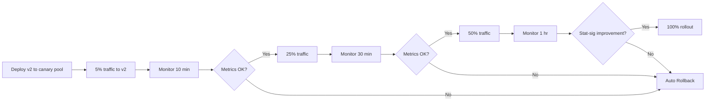

**Interview Q&A:**

*Q: A/B test sample size kaise determine karte hain GenAI mein?*

Statistical power analysis se. Pehle baseline metric measure kar — e.g., CSAT 70%. Effect size define kar jo detect karna chahta hai — minimum 2% absolute change. Significance level α=0.05, power 0.80 standard. Formula (proportion test): n = (z_α/2 + z_β)² × 2p(1-p) / d² — yahan p baseline 0.7, d effect 0.02. Roughly ~7000 samples per variant chahiye. Practical issues — GenAI metrics sparse hain (CSAT thumbs-up only 20% users dete hain), so true sample needed = 7000/0.2 = 35000 user interactions per variant. Pre-calculate test duration based on traffic. Avoid peeking — multiple comparison correction zaroori hai (sequential testing methods like SPRT, Bayesian). For latency P95, distribution-free tests (Mann-Whitney) better hain than t-test.

*Q: Canary rollback automation kaise?*

Argo Rollouts ya Flagger jaise tools metrics-based gates support karte hain. Strategy: defined SLOs (Service Level Objectives) per metric — error rate <2%, P95 latency <3s, downstream signal (e.g., user thumbs-down rate). Each step pe analysis runs query Prometheus/Datadog/CloudWatch, aggregates, compares against threshold. Failure pe automatic rollback (canary pods scaled to 0, all traffic to stable). Ek subtlety — short window mein noise hota hai. So failureLimit (kitne consecutive failures rollback trigger karein) configure kar — typical 3 consecutive 1-min failures = rollback. False positives bachne ke liye. Aur composite metrics use kar — single metric noisy ho sakti hai, multiple metrics aggregate (weighted score). Manual override hamesha rakh — engineer can force rollback via UI/CLI.

---

### 3.4 Feature flags (LaunchDarkly, Unleash) for prompt versions

**Definition:** Feature flags runtime configuration toggles hain jo code paths ya configurations ko enable/disable karte hain without redeploy. **LaunchDarkly** enterprise SaaS feature flag platform hai. **Unleash** open-source self-hostable alternative. AI mein flags use hote hain prompt versions, model selections, retrieval strategies switch karne ke liye dynamically.

**Why:** Hard-coded prompts deploy karna slow hai — code change → CI → build → deploy → 30 min cycle. Feature flag mein prompt centralized rakhne se runtime mein change ho jata hai (sub-second). Plus user segmentation milti hai — internal team naya prompt try kare pehle, fir beta users, fir GA. Targeting rules complex bhi ho sakte hain — "users in IN region with subscription_tier=premium". Kill switch capability — naya prompt break ho gaya, ek toggle se sab off without rollback. AI ke liye prompts versioning critical hai aur flags isko first-class banate hain.

**How:**

```python
# LaunchDarkly integration
import ldclient
from ldclient.config import Config
from ldclient.context import Context

# Init at startup
ldclient.set_config(Config("sdk-key-from-launchdarkly"))
client = ldclient.get()

PROMPTS = {
    "v1": "You are a helpful assistant. Answer concisely.",
    "v2": "You are an expert. Provide detailed answers with citations.",
    "v3_experimental": "Think step-by-step. Break down complex queries.",
}

async def get_prompt_for_user(user_id: str, region: str, tier: str) -> str:
    # Context — user attributes for targeting
    context = (
        Context.builder(user_id)
        .set("region", region)
        .set("tier", tier)
        .build()
    )
    
    # Variation — flag config returns prompt key
    prompt_version = client.variation(
        "chat-prompt-version",  # flag key
        context,
        "v1",  # default fallback
    )
    
    return PROMPTS.get(prompt_version, PROMPTS["v1"])

# Model selection flag — dynamic model routing
async def get_model_for_request(user_id: str, query_complexity: str):
    context = (
        Context.builder(user_id)
        .set("query_complexity", query_complexity)
        .build()
    )
    
    # JSON variation — complex config object
    config = client.variation_detail(
        "model-routing-config",
        context,
        {"model": "gpt-4o-mini", "temperature": 0.3}  # default
    )
    
    return config.value
```

```yaml
# Unleash self-hosted config — strategy-based flags
# unleash-strategies.yaml
flags:
  - name: chat-prompt-version
    type: string
    description: "Which prompt template version to use"
    variants:
      - name: v1-stable
        weight: 60
        payload:
          type: string
          value: "v1"
      - name: v2-detailed
        weight: 30
        payload:
          type: string
          value: "v2"
      - name: v3-experimental
        weight: 10
        payload:
          type: string
          value: "v3_experimental"
        # Targeting — only premium users in beta
        constraints:
          - contextName: tier
            operator: IN
            values: [premium]
          - contextName: beta_user
            operator: IN
            values: ["true"]
```

```python
# Unleash client
from UnleashClient import UnleashClient

unleash = UnleashClient(
    url="https://unleash.mycompany.com/api/",
    app_name="llm-service",
    custom_headers={"Authorization": "<token>"},
)
unleash.initialize_client()

def get_prompt(user_id: str, tier: str) -> str:
    variant = unleash.get_variant(
        "chat-prompt-version",
        context={"userId": user_id, "tier": tier},
    )
    if variant.enabled:
        return PROMPTS[variant.payload["value"]]
    return PROMPTS["v1"]
```

```bash
# CLI for ops — toggle kill switch
# LaunchDarkly REST API se prompt version off
curl -X PATCH \
  -H "Authorization: $LD_API_KEY" \
  -H "Content-Type: application/json" \
  https://app.launchdarkly.com/api/v2/flags/default/chat-prompt-version \
  -d '{"patch": [{"op": "replace", "path": "/environments/production/on", "value": false}]}'
```

**Real-life Example:** Ek customer support AI company prompts ko hard-code karke deploy karti thi. Naya prompt rollout cycle 2-3 din lagta tha (CI, staging, prod). LaunchDarkly integrate kiya — sab prompts flag config mein migrate kar diye. Ab prompt PMs UI se directly modify kar sakte the. Targeting rules — internal employees pe naya prompt 24hrs pehle test, fir 1% production rollout, fir 10%, fir 100%. One incident — ek prompt change response format break kar gayi. Kill switch flick kiya UI se, 3 seconds mein sab user purane prompt pe shift. Without flags yeh 30 min ka revert hota. Time-to-fix 99.5% reduce hua. Caveat — flags evals se replace nahi karte, dono lagao.

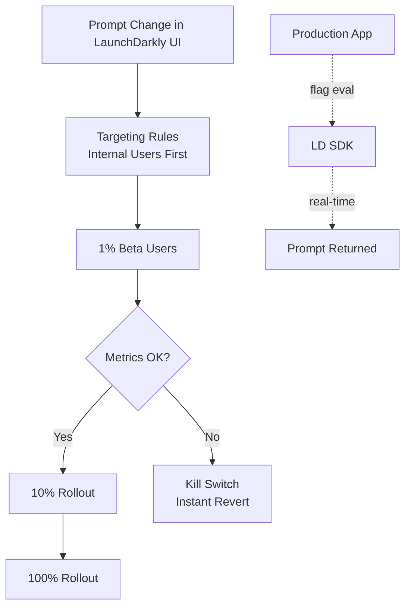

**Interview Q&A:**

*Q: Feature flags vs canary deployments — overlap kahan?*

Both gradual rollout enable karte hain par alag layers pe. Canary deployment infrastructure-level hai — naya container/pod traffic ka subset receive karta hai. Pod-level routing, network-level. Feature flags application-level hain — same pod, same code, runtime branch decide karta hai. Canary best for code/binary changes (new container image, new model weights). Flags best for config/prompt/feature toggles within same binary. Canary mein blast radius pod count se limited (e.g., 5 of 100 pods). Flags mein per-user/per-segment fine-grained control hai. Combined approach mature teams use karte hain — canary deploy with flags off, fir flags se gradual user rollout. Kill switch instant — flag toggle sub-second, canary rollback 1-2 min lagta hai pod scaling.

*Q: Flag debt aur isko manage kaise karein?*

Flag debt accumulates — temporary flag (rollout ke liye) production mein 2 saal stay karta hai, code mein orphaned references, "flag stale" alerts ignored. Realistic problem — large companies mein 1000s flags hote hain, code path complexity exponential. Mitigation: pehla — flag lifecycle policy (e.g., temporary flags 90 days max, fir cleanup mandatory). Doosra — automated flag scanning tool (LaunchDarkly's code refs feature) jo unused flags detect kare. Teesra — flag types categorize (release flag temporary, ops flag permanent like kill switch, experiment flag time-bound). Quarterly flag audit. Code review mein flag deletion mandatory after rollout complete. Don't nest flags — one flag conditional on another exponentially complex testing. AI prompts ke specific case — version control prompts in git also (single source of truth), flags sirf select active version, not store text.

---

## Resources & further reading

- **AWS AI/ML**: [AWS Bedrock documentation](https://docs.aws.amazon.com/bedrock/), [SageMaker Best Practices](https://docs.aws.amazon.com/sagemaker/), [EC2 GPU Instance Guide](https://docs.aws.amazon.com/ec2/)
- **GCP**: [Vertex AI Model Garden](https://cloud.google.com/vertex-ai/), [Cloud Run GPU](https://cloud.google.com/run/docs/configuring/services/gpu), [GKE AI Workloads](https://cloud.google.com/kubernetes-engine/docs/ai)
- **Azure**: [Azure OpenAI Service](https://learn.microsoft.com/azure/ai-services/openai/), [AI Foundry docs](https://learn.microsoft.com/azure/ai-foundry/)
- **Specialized clouds**: [Modal docs](https://modal.com/docs), [RunPod Serverless](https://docs.runpod.io/serverless/), [Replicate Cog framework](https://github.com/replicate/cog), [Lambda Labs](https://lambdalabs.com/service/gpu-cloud)
- **Containers & K8s**: [NVIDIA GPU Operator](https://github.com/NVIDIA/gpu-operator), [KServe documentation](https://kserve.github.io/website/), [Ray Serve guide](https://docs.ray.io/en/latest/serve/), [Kubernetes Patterns book by Bilgin Ibryam]
- **CI/CD**: [GitHub Actions for ML](https://docs.github.com/en/actions), [Argo Rollouts](https://argo-rollouts.readthedocs.io/), [Flagger](https://flagger.app/)
- **Eval & testing**: [OpenAI Evals](https://github.com/openai/evals), [Promptfoo](https://promptfoo.dev/), [DeepEval](https://github.com/confident-ai/deepeval), [Ragas for RAG eval](https://github.com/explodinggradients/ragas)
- **Feature flags**: [LaunchDarkly docs](https://docs.launchdarkly.com/), [Unleash](https://github.com/Unleash/unleash), [Feature Flag Best Practices by Pete Hodgson]
- **Books**: "Designing Machine Learning Systems" by Chip Huyen, "Reliable Machine Learning" by Cathy Chen et al., "Kubernetes in Action" by Marko Lukša
- **Conference talks**: KubeCon AI Day sessions, Ray Summit, MLOps Community talks on YouTube
