# Deep Learning Fundamentals

Bhai, deep learning ek aisa field hai jahan tu matrix multiplications ke through intelligence simulate karta hai. Yeh sirf "neural network ko fit kar do" wala kaam nahi hai — yeh ek complete engineering discipline hai jo linear algebra, calculus, optimization theory, aur systems engineering ko ek saath blend karti hai. Agar tu seriously GenAI me jaana chahta hai, toh PyTorch ke `model.fit()` jaise high-level abstractions pe rukna nahi hai. Tujhe samajhna hai ki gradient kaise flow karta hai, weights kaise update hote hain, aur ek single backward pass me kya kya internally chal raha hai.

Deep learning me 90% engineers PyTorch use to karte hain, but training loop khud likhne ki himmat sirf 10% rakhte hain. Tu top 2% me jaana hai, toh khud likhega — har ek line samjhe ga, har ek hyperparameter ka effect dekhega, aur jab production me model fail hoga, tu pinpoint kar paayega ki kahan vanishing gradient hai, kahan numerical instability hai, aur kahan tera optimizer choke kar raha hai.

Yeh guide tujhe perceptron se le ke distributed training tak le jaayegi. Har subtopic me theory, code, real-life analogy, aur interview questions milenge. Mehnat lagegi, but jab tu 1B parameter LLM ka pretraining loop debug kar raha hoga raat ke 3 baje, yeh foundation kaam aayega.

---

## 1. Neural Networks

Neural network basically ek differentiable function approximator hai. Tu input deta hai, weighted sums aur non-linearities ke through transform hota hai, aur output nikalta hai. Beauty yeh hai ki gradient descent ke through yeh function khud ko data ke according tune karta hai.

### 1.1 Perceptron, MLPs, universal approximation

**Definition**: Perceptron ek single-layer linear classifier hai — `y = sign(Wx + b)`. Multi-Layer Perceptron (MLP) me tu multiple linear layers ko non-linearity ke saath stack karta hai. Universal Approximation Theorem bolta hai ki ek single hidden layer wala MLP (sufficient width ke saath) kisi bhi continuous function ko arbitrary precision tak approximate kar sakta hai.

**Why**: Single perceptron sirf linearly separable problems solve kar sakta hai (XOR fail karta hai bhai, classic example). MLPs add karte hain non-linear decision boundaries. Universal approximation theorem theoretically powerful hai, but practically depth >> width — deep networks zyada efficient hote hain same expressivity ke liye.

**How**:

```python
import torch
import torch.nn as nn

class MLP(nn.Module):
    def __init__(self, in_dim=784, hidden=256, out_dim=10):
        super().__init__()
        # Linear layer = Wx + b, yeh affine transformation hai
        self.fc1 = nn.Linear(in_dim, hidden)
        self.fc2 = nn.Linear(hidden, hidden)
        self.fc3 = nn.Linear(hidden, out_dim)
        # ReLU non-linearity, isi se network "deep" ban-ta hai
        self.act = nn.ReLU()

    def forward(self, x):
        # x: (batch, 784) — flatten kiya hua MNIST image
        h1 = self.act(self.fc1(x))   # pehla hidden representation
        h2 = self.act(self.fc2(h1))  # dusra hidden representation
        return self.fc3(h2)          # logits, softmax baad me lagayenge
```

**Real-life Example**: Soch tu ek loan approval system bana raha hai. Single perceptron sirf bolega "salary > 50k? haan/na". MLP soch sakta hai — "agar salary thodi kam hai but credit score high hai aur EMI ratio low hai, toh approve". Yeh non-linear interactions seekhna MLP ka kaam hai.

**Mermaid Diagram**:

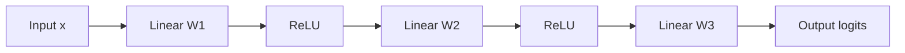

**Interview Q&A**:

*Q: Universal approximation theorem hai toh deep networks kyun, single wide layer kyun nahi?*
Theorem existence prove karta hai, efficiency nahi. Empirically, depth exponentially zyada efficient hai parameters-wise. Ek 10-layer network jo function approximate karta hai, usko single-layer me karne ke liye exponential neurons chahiye honge. Plus depth hierarchical features seekhne deti hai — pehli layer edges, dusri shapes, teesri objects. Yeh inductive bias powerful hai.

*Q: Bias term kyun chahiye Linear layer me?*
Bias allow karta hai network ko shift karne ki freedom dena. Without bias, decision boundary hamesha origin se pass karega. Real-world data me boundaries kahin bhi ho sakti hain, isliye bias essential hai. Mathematically, `Wx` sirf rotation/scale karta hai, `+ b` translation deta hai.

### 1.2 Activations (ReLU, GELU, SiLU, SwiGLU)

**Definition**: Activation functions non-linear transformations hain jo neural network ko expressive banati hain. Inke bina pura network ek bada linear transformation reh jaayega, chahe kitni bhi layers ho.

**Why**: Linear ke upar linear = linear. Toh non-linearity ke bina depth ka koi fayda nahi. Different activations different properties dete hain — gradient flow, saturation behavior, computational cost.

**How**:

```python
import torch
import torch.nn as nn
import torch.nn.functional as F

x = torch.randn(4, 8)

# ReLU: max(0, x). Simple, fast, but "dying ReLU" problem
relu = F.relu(x)

# GELU: x * Phi(x), smooth approximation. Transformers me default
gelu = F.gelu(x)

# SiLU (Swish): x * sigmoid(x). Smooth, non-monotonic
silu = F.silu(x)

# SwiGLU: gated variant, LLaMA aur PaLM me use hota hai
class SwiGLU(nn.Module):
    def __init__(self, dim, hidden):
        super().__init__()
        # Do parallel linear layers, ek gate banata hai
        self.w1 = nn.Linear(dim, hidden, bias=False)
        self.w2 = nn.Linear(dim, hidden, bias=False)
        self.w3 = nn.Linear(hidden, dim, bias=False)

    def forward(self, x):
        # SiLU(W1.x) ko W2.x se gate karte hain, phir project back
        return self.w3(F.silu(self.w1(x)) * self.w2(x))
```

**Real-life Example**: ReLU ek strict bouncer hai — negative input? bahar nikal. GELU ek diplomatic bouncer hai — slight negative ko thoda allow karta hai, smooth transition deta hai. SwiGLU ek smart bouncer hai jo dynamically decide karta hai kitna allow karna hai — yeh "gating" hi LLaMA jaise models ko itna powerful banaata hai.

**Mermaid Diagram**:

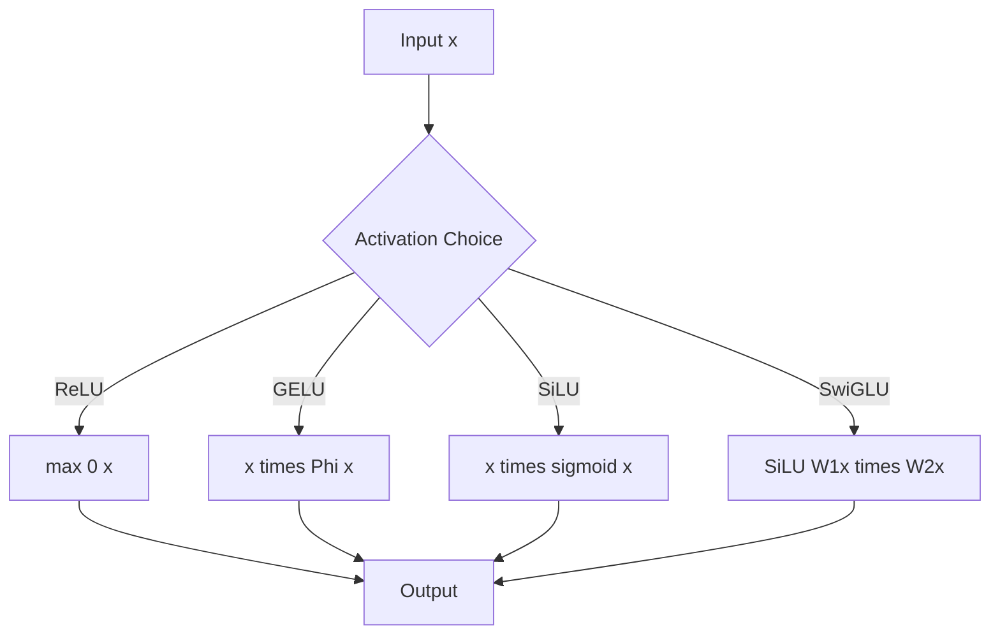

**Interview Q&A**:

*Q: Modern LLMs me ReLU kyun nahi, GELU/SwiGLU kyun?*
ReLU ka problem hai "dying neurons" — agar neuron ka output hamesha negative aata hai, gradient zero ho jaata hai aur woh permanently dead ho jaata hai. GELU smooth hai, gradient kabhi exactly zero nahi hota. SwiGLU adds gating which empirically Transformers me convergence aur final perplexity dono improve karta hai. PaLM paper ne show kiya tha SwiGLU > GELU > ReLU for LLM pretraining.

*Q: SiLU aur Swish me kya difference hai?*
Same cheez hai bhai, different names. Swish original paper ka naam tha (Ramachandran et al.), PyTorch me `nn.SiLU` ke naam se hai. Formula: `x * sigmoid(x)`. Iska ek beta parameter bhi tha original me but practically beta=1 hi use hota hai.

### 1.3 Forward & backward propagation manually

**Definition**: Forward pass me input se output tak compute karte hain. Backward pass me chain rule lagaa ke har parameter ke respect me loss ka gradient nikalte hain.

**Why**: Autograd is magic, but agar tu manually nahi samajhta, toh debug nahi kar paayega. Custom layers, custom loss, gradient surgery — sab ke liye yeh fundamental hai.

**How**:

```python
import torch

# Manual forward + backward, autograd ke bina
def manual_mlp_step(x, W1, b1, W2, b2, y_true):
    # Forward pass
    z1 = x @ W1 + b1                    # pre-activation layer 1
    a1 = torch.relu(z1)                 # activation
    z2 = a1 @ W2 + b2                   # pre-activation layer 2 (logits)
    # MSE loss for simplicity
    loss = ((z2 - y_true) ** 2).mean()

    # Backward pass — chain rule manually
    batch = x.shape[0]
    dz2 = 2 * (z2 - y_true) / batch     # dL/dz2
    dW2 = a1.T @ dz2                    # dL/dW2 = a1^T @ dz2
    db2 = dz2.sum(dim=0)                # dL/db2

    da1 = dz2 @ W2.T                    # gradient flow back to a1
    dz1 = da1 * (z1 > 0).float()        # ReLU derivative: 1 if z1>0 else 0
    dW1 = x.T @ dz1                     # dL/dW1
    db1 = dz1.sum(dim=0)                # dL/db1

    return loss, (dW1, db1, dW2, db2)
```

**Real-life Example**: Forward pass ek factory assembly line hai — raw material (input) se finished product (prediction) banta hai. Backward pass ek quality audit hai — agar product me defect hai (loss), tu reverse trace karta hai ki kaunsa step kitna responsible tha. Phir har step ko proportionally adjust karte hain. Yahi gradient descent ki philosophy hai.

**Mermaid Diagram**:

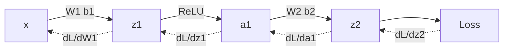

**Interview Q&A**:

*Q: Chain rule me intermediate values store kyun karne padte hain?*
Backward pass me tujhe forward ke intermediate activations chahiye honge — jaise `a1`, `z1` upar. Inhe "saved tensors" bolte hain PyTorch me. Yahi reason hai ki training me memory zyada lagti hai inference se. Gradient checkpointing technique inhi values ko discard karke recompute karti hai memory bachane ke liye.

*Q: Vanishing gradient kyun hota hai deep networks me?*
Chain rule me gradients multiply hote hain. Agar har layer ka local gradient <1 hai (sigmoid me max 0.25), toh 50 layers ke baad gradient effectively 0 ho jaata hai. ReLU isliye revolutionary tha — positive region me gradient exactly 1 hai, multiplication me decay nahi hota. Residual connections aur normalization bhi isi problem ko address karte hain.

### 1.4 Loss functions — MSE, cross-entropy, contrastive, triplet

**Definition**: Loss function quantify karta hai prediction kitna galat hai. Optimizer iss number ko minimize karta hai.

**Why**: Galat loss = galat objective = galat model. Regression me MSE, classification me cross-entropy, embeddings learn karne ke liye contrastive/triplet — task ke according choose karna padta hai.

**How**:

```python
import torch
import torch.nn.functional as F

# 1. MSE — regression
y_pred = torch.randn(32, 1)
y_true = torch.randn(32, 1)
mse = F.mse_loss(y_pred, y_true)

# 2. Cross-entropy — multi-class classification
# Note: PyTorch ka cross_entropy logits leta hai, softmax internally karta hai
logits = torch.randn(32, 10)            # 32 samples, 10 classes
labels = torch.randint(0, 10, (32,))    # ground truth class indices
ce = F.cross_entropy(logits, labels)

# 3. Contrastive loss — similar pairs paas, dissimilar door
def contrastive_loss(emb1, emb2, label, margin=1.0):
    # label=1 similar, label=0 dissimilar
    dist = F.pairwise_distance(emb1, emb2)
    # similar pairs ka distance minimize, dissimilar ka margin tak push
    loss = label * dist.pow(2) + (1 - label) * F.relu(margin - dist).pow(2)
    return loss.mean()

# 4. Triplet loss — anchor, positive, negative
def triplet_loss(anchor, positive, negative, margin=0.5):
    # anchor-positive close, anchor-negative far by atleast margin
    pos_dist = F.pairwise_distance(anchor, positive)
    neg_dist = F.pairwise_distance(anchor, negative)
    return F.relu(pos_dist - neg_dist + margin).mean()
```

**Real-life Example**: MSE ek strict teacher hai jo har galti ka square punishment deta hai (badi galti = exponentially badi sazaa). Cross-entropy probability distributions ka teacher hai. Contrastive/triplet loss face recognition jaise tasks me — soch tu Aadhaar verification bana raha hai, same person ke do photos ka embedding paas hona chahiye, different person ka door. Yahi face ID systems ka core hai.

**Mermaid Diagram**:

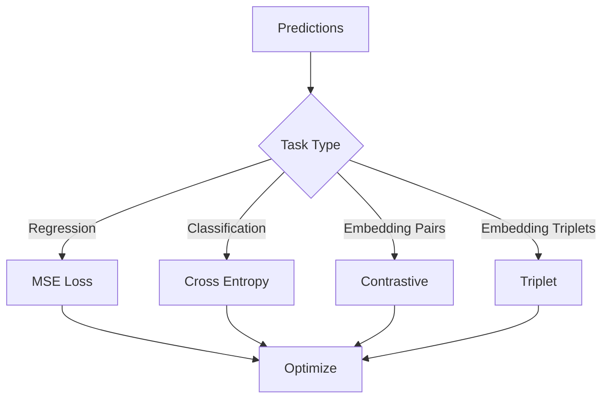

**Interview Q&A**:

*Q: Cross-entropy me logits directly pass karna chahiye ya softmax ke baad?*
Logits directly. PyTorch ka `F.cross_entropy` internally `log_softmax + nll_loss` combine karta hai for numerical stability. Agar tu manually softmax karke phir log lega, exp(large_number) overflow kar sakta hai. Always use `cross_entropy` on raw logits — yeh standard practice hai.

*Q: Triplet loss me hard negative mining kyun important hai?*
Random negatives easily distinguishable hote hain, model kuch nahi seekhta — gradient zero. Hard negatives woh hain jo anchor ke paas hain but different class. Yahi se model meaningfully embedding space ko shape karta hai. FaceNet paper ne yeh concept popularize kiya. Production me semi-hard mining (margin ke andar but positive se door) sweet spot hai — hard negatives unstable training de sakte hain.

---

## 2. Optimization

Optimization deep learning ka engine hai. Tu loss landscape me ek high-dimensional surface pe hai, aur tujhe lowest point dhundna hai. Different optimizers different strategies use karte hain.

### 2.1 SGD, momentum, Nesterov

**Definition**: SGD (Stochastic Gradient Descent) har step pe parameters ko gradient ki opposite direction me update karta hai. Momentum past gradients ka exponential moving average use karta hai. Nesterov "look-ahead" karta hai update karne se pehle.

**Why**: Plain SGD oscillate kar sakta hai narrow valleys me. Momentum consistent direction me speed pickup karta hai. Nesterov ek step "future" me dekh ke correct karta hai, theoretically better convergence rate.

**How**:

```python
import torch

# Manual implementation samajhne ke liye
def sgd_step(params, grads, lr=0.01):
    for p, g in zip(params, grads):
        p.data -= lr * g    # bas itna hi, simple subtract

def sgd_momentum_step(params, grads, velocities, lr=0.01, mu=0.9):
    for p, g, v in zip(params, grads, velocities):
        # v_t = mu * v_{t-1} + g_t
        v.mul_(mu).add_(g)
        # p = p - lr * v
        p.data -= lr * v

# PyTorch me
import torch.optim as optim

model = torch.nn.Linear(10, 1)
optimizer = optim.SGD(
    model.parameters(),
    lr=0.01,
    momentum=0.9,       # momentum coefficient
    nesterov=True,      # Nesterov accelerated
    weight_decay=1e-4,  # L2 regularization
)
```

**Real-life Example**: Plain SGD ek nasha karke chalta hua banda hai — har step pe direction badalta hai, slow progress. Momentum wala banda jo running me hai — ek baar speed pickup ki toh consistent direction me jaata hai. Nesterov wala banda jo turning se pehle dekhta hai — "agar main yahan jaaunga toh kya hoga", phir adjust karta hai. Highway driving me Nesterov hi safe hai.

**Mermaid Diagram**:

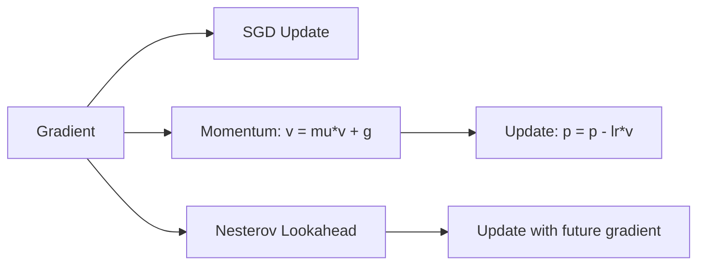

**Interview Q&A**:

*Q: Momentum coefficient 0.9 hi kyun default hai?*
Empirical sweet spot. 0.9 means roughly 10 step ki effective memory (1/(1-0.9)). Higher (0.99) zyada smooth but slower to react. Lower (0.5) almost like plain SGD. CNN training me 0.9 standard hai, transformer training me Adam-based optimizers prefer kiye jaate hain jahan momentum implicit hai beta1 me.

*Q: Nesterov practically itna popular kyun nahi?*
Theoretical advantage convex problems me clear hai (O(1/T^2) vs O(1/T)). Non-convex deep learning me difference marginal hai. Implementation thodi complex hai. Most practitioners just use Adam/AdamW jisme momentum-like behavior already hai. Computer vision me SGD+momentum (without Nesterov) abhi bhi gold standard hai ResNet-style training me.

### 2.2 Adam, AdamW, Lion

**Definition**: Adam adaptive learning rates per parameter use karta hai using first moment (mean) and second moment (variance) of gradients. AdamW decouples weight decay from gradient update. Lion ek naya optimizer hai jo sirf sign of gradient use karta hai with momentum.

**Why**: SGD ko per-parameter tuning chahiye; Adam adapts automatically. AdamW fixes a subtle bug in Adam where L2 regularization aur weight decay equivalent nahi hote. Lion memory efficient hai aur recent research me competitive hai.

**How**:

```python
import torch
import torch.optim as optim

model = torch.nn.Linear(10, 1)

# AdamW — modern standard for transformers
optimizer = optim.AdamW(
    model.parameters(),
    lr=3e-4,            # Karpathy constant, ek meme but valid starting point
    betas=(0.9, 0.95),  # transformers me beta2=0.95, CV me 0.999
    eps=1e-8,           # numerical stability
    weight_decay=0.1,   # decoupled weight decay
)

# Manual Adam logic samajhne ke liye
def adam_step(p, g, m, v, t, lr=1e-3, b1=0.9, b2=0.999, eps=1e-8):
    # m: first moment, v: second moment, t: timestep
    m.mul_(b1).add_(g, alpha=1 - b1)         # m = b1*m + (1-b1)*g
    v.mul_(b2).addcmul_(g, g, value=1 - b2)  # v = b2*v + (1-b2)*g^2
    # Bias correction since m, v initialized at 0
    m_hat = m / (1 - b1 ** t)
    v_hat = v / (1 - b2 ** t)
    p.data -= lr * m_hat / (v_hat.sqrt() + eps)
```

**Real-life Example**: SGD ek ek-size-fits-all gym trainer hai. Adam personal trainer hai jo har muscle ke liye different intensity deta hai based on past performance. AdamW wahi trainer hai but jo "diet" (regularization) ko alag se manage karta hai, mix nahi karta. Lion minimalist trainer hai jo bolta hai "just direction matters, magnitude is noise" — sirf sign use karta hai.

**Mermaid Diagram**:

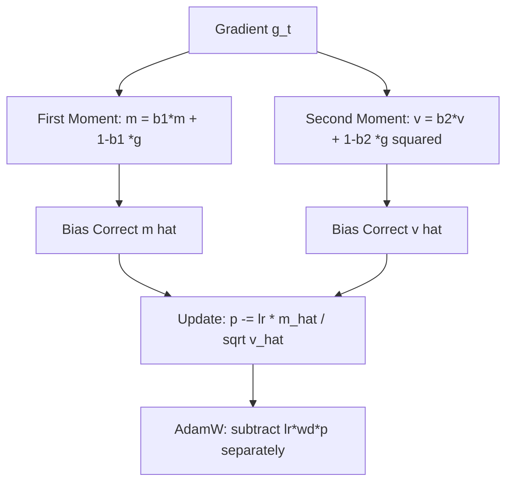

**Interview Q&A**:

*Q: Adam vs AdamW — practical difference kya hai?*
Adam me weight decay ko gradient me add kar dete hain (`grad += wd*p`), jo phir Adam ki adaptive scaling se affect hota hai. AdamW directly parameter se subtract karta hai (`p -= lr*wd*p`) — yeh "true" weight decay hai. Transformers me AdamW se 1-2% accuracy improvement common hai. Loshchilov & Hutter ka paper iss bug ko fix karta hai.

*Q: Lion optimizer ka USP kya hai?*
Lion (EvoLved Sign Momentum) Google ne 2023 me propose kiya. Sirf one momentum buffer maintain karta hai (vs Adam's two), so 50% memory savings. Update sign-based hai which provides implicit regularization. Transformers pe AdamW ke comparable ya better results, especially at scale. Caveat: lr aur weight_decay values different range me hain (lr usually 3-10x smaller than AdamW).

### 2.3 Learning rate schedules — cosine, warmup, one-cycle

**Definition**: Learning rate schedule training ke dauraan lr ko dynamically change karta hai. Common patterns: warmup (start small, ramp up), cosine decay (smooth decrease), one-cycle (rise then fall).

**Why**: Constant lr suboptimal hai. Start me low lr stability deta hai (warmup), middle me high lr exploration, end me low lr fine convergence. Schedule chosen karna often hyperparameter tuning se zyada impact karta hai.

**How**:

```python
import torch
from torch.optim.lr_scheduler import CosineAnnealingLR, OneCycleLR, LambdaLR

model = torch.nn.Linear(10, 1)
optimizer = torch.optim.AdamW(model.parameters(), lr=1e-3)

# 1. Cosine annealing — smooth decay to near zero
scheduler = CosineAnnealingLR(optimizer, T_max=10000, eta_min=1e-6)

# 2. Warmup + cosine — transformer training me standard
def warmup_cosine(step, warmup_steps=1000, total_steps=10000):
    if step < warmup_steps:
        return step / warmup_steps      # linear warmup
    # cosine decay from 1.0 to 0.1
    progress = (step - warmup_steps) / (total_steps - warmup_steps)
    return 0.1 + 0.9 * 0.5 * (1 + torch.cos(torch.tensor(progress * 3.14159)).item())

scheduler = LambdaLR(optimizer, lr_lambda=warmup_cosine)

# 3. One-cycle — fast.ai famous schedule
scheduler = OneCycleLR(
    optimizer,
    max_lr=1e-2,
    total_steps=10000,
    pct_start=0.3,          # 30% steps for warmup
    anneal_strategy='cos',
)

# Training loop me
for step in range(10000):
    # ... forward, backward, optimizer.step() ...
    scheduler.step()        # IMPORTANT: optimizer.step() ke baad
```

**Real-life Example**: Soch tu marathon dauda raha hai. Warmup = first 5km easy pace, body warm karna. Peak phase = middle 30km consistent fast pace. Cool down = last 7km gradually slow. Direct full speed pe nikalega toh 10km me cramps. Yahi LR schedule karta hai — model ko gradually warm-up, peak training, smooth landing.

**Mermaid Diagram**:

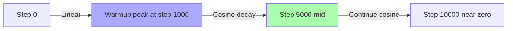

**Interview Q&A**:

*Q: Warmup zaroori kyun hai transformers ke liye?*
Initial steps me Adam ke second moment estimate unreliable hote hain (limited samples). Large lr + unreliable variance = unstable updates, often training diverges. Warmup ye estimates ko stabilize hone deta hai. Empirically, `warmup_steps = total_steps * 0.01` to `0.1` range works. GPT-3 paper me 375M tokens warmup tha (~0.3% of total).

*Q: Cosine vs linear decay?*
Cosine slower decay me upar rehta hai (zyada training high lr pe), sharp drop end me. Linear uniform decay. Empirically cosine 0.5-1% better LLM pretraining me. But Chinchilla compute-optimal training cosine schedule assume karke calculated tha — agar tu different schedule use karega, scaling laws ko re-derive karna padega technically.

### 2.4 Gradient clipping, mixed precision (fp16, bf16)

**Definition**: Gradient clipping gradients ki magnitude ko cap karta hai prevent explosion. Mixed precision training fp16/bf16 use karta hai forward/backward me, fp32 me weights maintain karta hai for stability.

**Why**: Exploding gradients training crash karte hain. Mixed precision 2x faster training + half memory deta hai modern GPUs pe (Tensor Cores).

**How**:

```python
import torch
from torch.cuda.amp import autocast, GradScaler

model = torch.nn.Linear(1024, 1024).cuda()
optimizer = torch.optim.AdamW(model.parameters(), lr=1e-3)
scaler = GradScaler()    # fp16 ke liye loss scaling

for batch in dataloader:
    x, y = batch
    optimizer.zero_grad()

    # Mixed precision context
    with autocast(dtype=torch.float16):    # ya torch.bfloat16
        out = model(x)
        loss = torch.nn.functional.mse_loss(out, y)

    # Loss scaling for fp16 (bf16 me skip kar sakte hain)
    scaler.scale(loss).backward()

    # Gradient clipping — unscale pehle zaroori hai
    scaler.unscale_(optimizer)
    torch.nn.utils.clip_grad_norm_(model.parameters(), max_norm=1.0)

    scaler.step(optimizer)
    scaler.update()
```

**Real-life Example**: Gradient clipping ek speed limiter hai gaadi me — chahe accelerator dabaaye, max 100 km/h se zyada nahi jaayegi. Without clipping, ek bad batch pure model ko explode kar sakta hai (NaN values). Mixed precision = same performance with smaller engine — fp16 me compute fast hota hai but precision loss hota hai, isliye fp32 master copy maintain karte hain critical operations ke liye.

**Mermaid Diagram**:

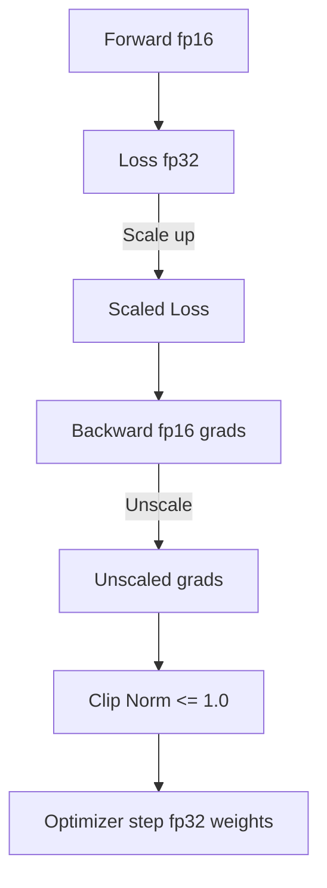

**Interview Q&A**:

*Q: fp16 vs bf16 — kab kaunsa use karna?*
fp16 me higher precision (10 mantissa bits) but lower range — overflow common, isliye loss scaling chahiye. bf16 me lower precision (7 mantissa bits) but same range as fp32 (8 exponent bits) — overflow nahi hota, loss scaling skip kar sakte hain. A100/H100 pe bf16 standard hai LLM training me. T4/V100 pe fp16 because they don't support bf16 natively.

*Q: Gradient clip norm 1.0 hi kyun default?*
Heuristic, but works well empirically for transformer training. Idea hai global gradient norm <= 1, so no single batch can cause huge update. CNN training me clip 5.0 ya higher common. RNN/LSTM training me clipping zaroori hi hai (otherwise exploding through time). Tu monitor kar pre-clip vs post-clip norms — agar har step pe aggressively clip ho raha hai, lr kam karna better hai.

### 2.5 Batch size dynamics

**Definition**: Batch size ek update me kitne samples use hote hain decide karta hai. Larger batch = better gradient estimate, smoother loss, but more memory aur compute per step.

**Why**: Generalization, memory, throughput, optimization dynamics — sab batch size se affected hote hain. Linear scaling rule, gradient noise scale, critical batch size — yeh sab production training me real concerns hain.

**How**:

```python
import torch

# Gradient accumulation — small per-step batch but large effective batch
model = torch.nn.Linear(1024, 1024).cuda()
optimizer = torch.optim.AdamW(model.parameters(), lr=1e-3)

micro_batch = 8         # GPU me kitna fit hota hai
accum_steps = 16        # effective batch = 8*16 = 128
effective_batch = micro_batch * accum_steps

optimizer.zero_grad()
for i, (x, y) in enumerate(dataloader):
    out = model(x)
    loss = torch.nn.functional.mse_loss(out, y) / accum_steps  # avg over accum
    loss.backward()     # gradients accumulate karte hain by default

    if (i + 1) % accum_steps == 0:
        # Linear scaling rule: lr ko effective batch ke proportional rakho
        # Effective lr = base_lr * (effective_batch / base_batch)
        torch.nn.utils.clip_grad_norm_(model.parameters(), 1.0)
        optimizer.step()
        optimizer.zero_grad()
```

**Real-life Example**: Batch size group decision banane jaisa hai. Batch=1 (SGD): ek banda decide kar raha hai, noisy but fast. Batch=10000: poori parliament debate kar rahi hai, smooth decision but slow aur stuck in local consensus. Sweet spot middle me hai — enough samples for reliable gradient, but small enough for stochasticity to escape local minima.

**Mermaid Diagram**:

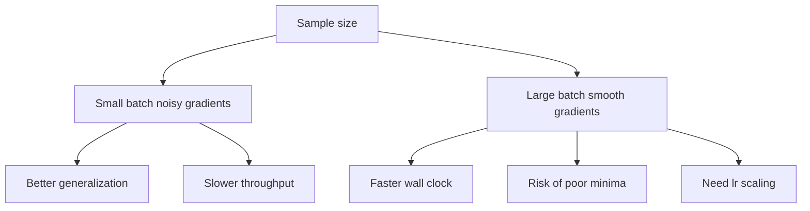

**Interview Q&A**:

*Q: Linear scaling rule kya hai?*
Goyal et al. 2017 — agar batch size ko k times badhaye, lr ko bhi k times badhao. Reasoning: ek effective step me k mini-batches ke gradients average ho rahe hain, toh effective gradient k times zyada confident hai, larger step le sakte hain. Practically up to a point — beyond critical batch size (~8K-32K for ImageNet), scaling breaks down. Warmup zaroori hai jab large lr use kar rahe ho.

*Q: Gradient accumulation aur DDP me batch size kaise count karte hain?*
Effective batch = `micro_batch * accum_steps * num_gpus`. Loss ko accum_steps se divide karna important hai — warna gradients k times scaled-up ho jaayenge. PyTorch me `loss.backward()` gradients ko accumulate karta hai by default (jab tak `zero_grad()` na karo). DDP me each GPU apna gradient compute karta hai, all-reduce automatically average karta hai.

---

## 3. Regularization & Stability

Yeh section model ko production-ready banane ke baare me hai. Training stable hona chahiye, model overfit nahi hona chahiye, aur deep networks training kar paane chahiye.

### 3.1 Dropout, layer norm, batch norm, RMS norm

**Definition**: Dropout randomly neurons "off" karta hai during training. Normalization layers (LN, BN, RMSNorm) activations ko normalize karte hain to stabilize training.

**Why**: Dropout overfitting prevent karta hai by ensemble-like behavior. Normalization gradient flow improve karta hai aur training accelerate karta hai.

**How**:

```python
import torch
import torch.nn as nn

# Dropout — training me hi active, eval me identity
class DropoutExample(nn.Module):
    def __init__(self):
        super().__init__()
        self.fc = nn.Linear(128, 128)
        self.drop = nn.Dropout(p=0.1)    # 10% neurons drop
    def forward(self, x):
        return self.drop(self.fc(x))

# BatchNorm — batch dimension pe normalize, CNNs me popular
bn = nn.BatchNorm1d(128)    # tracks running mean/var

# LayerNorm — last dim pe normalize, transformers ka favorite
ln = nn.LayerNorm(128)      # learnable gamma, beta

# RMSNorm — LayerNorm ka simplified version, no mean subtraction
class RMSNorm(nn.Module):
    def __init__(self, dim, eps=1e-6):
        super().__init__()
        self.weight = nn.Parameter(torch.ones(dim))
        self.eps = eps
    def forward(self, x):
        # Sirf RMS se normalize, mean subtract nahi karte (faster)
        rms = x.pow(2).mean(dim=-1, keepdim=True).sqrt()
        return self.weight * x / (rms + self.eps)

# LLaMA-style usage
norm = RMSNorm(4096)
```

**Real-life Example**: Dropout ek team me random members ko chhutti dene jaisa hai — bachi hui team adapt karna seekh leti hai, no single point of failure. BatchNorm ek class me sab students ko same scale pe lana — ek student 100/100 le aaya, ek 10/100, normalize karke comparable banao. LayerNorm me har student ki apni subjects ko normalize kar lo (per-sample). RMSNorm = LayerNorm minus extra steps, isliye LLaMA me prefer karte hain.

**Mermaid Diagram**:

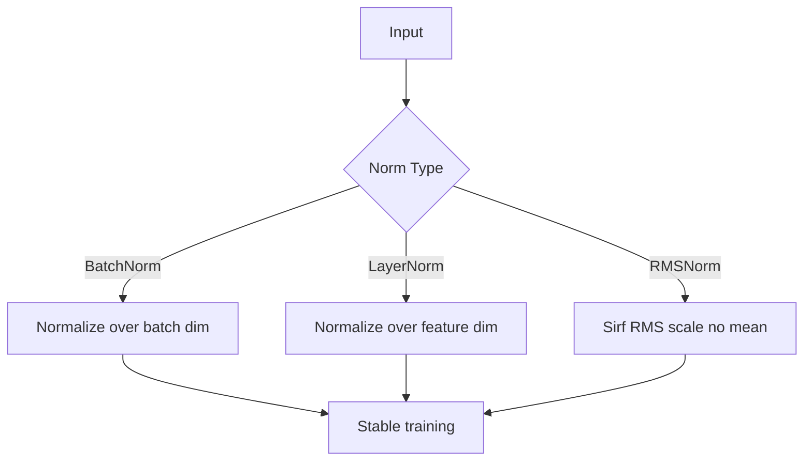

**Interview Q&A**:

*Q: Transformers me LayerNorm kyun, BatchNorm kyun nahi?*
Sequence data me batch dim pe normalize karna problematic hai — variable length sequences, padding, small batches at inference. LayerNorm per-sample independent hai, koi cross-sample dependency nahi. Plus transformers me batch size often small hota hai (memory-bound), BN ke statistics unreliable ho jaate hain. Industry me LayerNorm de-facto standard hai sequence models ke liye.

*Q: RMSNorm kyun adopt kar rahe hain modern LLMs?*
Mean subtraction expensive hai aur empirically marginal benefit. RMSNorm sirf RMS se divide karta hai, ~10-20% faster. LLaMA, T5, PaLM sab RMSNorm use karte hain. Quality almost same, throughput better. Yeh small optimizations hi LLM scale pe massive savings dete hain.

### 3.2 Weight decay

**Definition**: Weight decay parameters ki magnitude ko penalize karta hai loss me regularization term add karke (L2) ya direct decay karke (decoupled).

**Why**: Large weights = complex model = overfitting risk. Weight decay implicit prior hai chote weights ke favor me, generalization improve karta hai.

**How**:

```python
import torch
import torch.nn as nn

model = nn.Sequential(nn.Linear(128, 128), nn.LayerNorm(128), nn.Linear(128, 10))

# Common practice: norm aur bias ko weight decay se exclude karo
def get_param_groups(model, weight_decay=0.1):
    decay, no_decay = [], []
    for name, param in model.named_parameters():
        if not param.requires_grad:
            continue
        # 1D params (biases, norm gains) ko decay nahi karte
        if param.ndim <= 1 or name.endswith('.bias'):
            no_decay.append(param)
        else:
            decay.append(param)
    return [
        {'params': decay, 'weight_decay': weight_decay},
        {'params': no_decay, 'weight_decay': 0.0},
    ]

optimizer = torch.optim.AdamW(
    get_param_groups(model, weight_decay=0.1),
    lr=3e-4,
)
```

**Real-life Example**: Weight decay budget constraint hai — koi ek expense (weight) bahut bada nahi hona chahiye. Agar tu finance manage kar raha hai, monthly budget cap deta hai har category pe — same way model ke parameters pe cap hai. Bina iske, ek ya do features pura decision dominate kar lenge.

**Mermaid Diagram**:

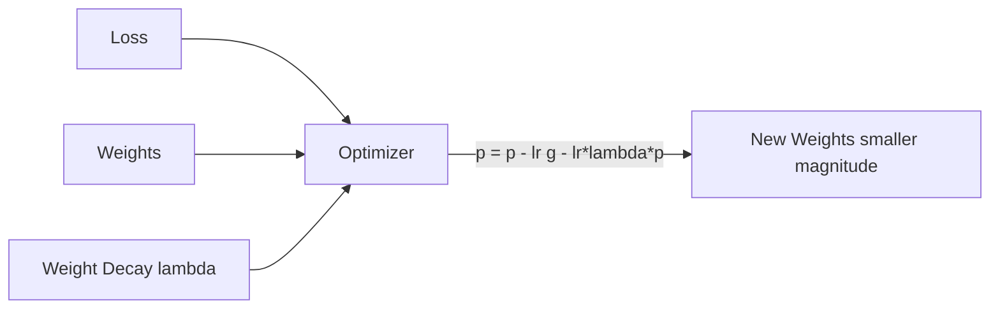

**Interview Q&A**:

*Q: Bias aur LayerNorm gains ko weight decay se kyun exclude karte hain?*
Inka role scaling/shifting hai, not feature interactions. Agar tu inhe decay karega, training instability aati hai (gain shrinks, activations distort). Karpathy ka nanoGPT, HuggingFace transformers, sab same pattern follow karte hain. Standard practice: only matrix-shaped params (>= 2D) decay karo.

*Q: Weight decay value 0.1 vs 0.01 — kaise decide karna?*
Model size aur data size pe depend karta hai. LLM pretraining me 0.1 common (GPT-3, LLaMA). Smaller models pe 0.01 ya 0.0 bhi acceptable. Fine-tuning me usually kam (0.01-0.05) — pretrained weights ko zyada disturb nahi karna. Tu ablation kar — train multiple values, validation loss compare kar.

### 3.3 Label smoothing

**Definition**: Hard labels (one-hot) ki jagah soft labels use karte hain. e.g., correct class ko 0.9, baaki classes me 0.1/(K-1) distribute.

**Why**: Hard labels overconfidence promote karte hain. Smoothed labels regularization deti hain, calibration improve karti hain, aur training stability badhati hain.

**How**:

```python
import torch
import torch.nn as nn
import torch.nn.functional as F

# PyTorch built-in
criterion = nn.CrossEntropyLoss(label_smoothing=0.1)

logits = torch.randn(32, 10)
labels = torch.randint(0, 10, (32,))
loss = criterion(logits, labels)

# Manual implementation samajhne ke liye
def label_smoothing_loss(logits, labels, smoothing=0.1, num_classes=10):
    # Smooth labels banao
    confidence = 1.0 - smoothing
    smooth_value = smoothing / (num_classes - 1)
    # one-hot * confidence + uniform * smoothing
    log_probs = F.log_softmax(logits, dim=-1)
    nll = -log_probs.gather(dim=-1, index=labels.unsqueeze(1)).squeeze(1)
    smooth_loss = -log_probs.mean(dim=-1)
    return (confidence * nll + smoothing * smooth_loss).mean()
```

**Real-life Example**: Hard labels exam me bolne jaisa hai "Yeh answer 100% correct, baaki 0%". Real life me uncertainty hoti hai. Label smoothing bolta hai "yeh answer 90% correct, baaki options bhi thoda thoda possible". Doctor diagnosis dega "90% pneumonia, 10% other respiratory" — yahi calibrated probabilities hain. Hard labels overconfident black-box bana dete hain.

**Mermaid Diagram**:

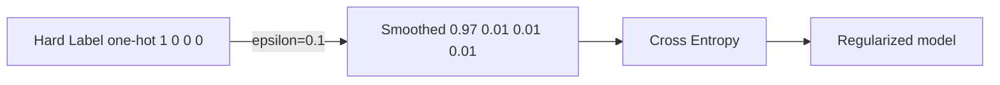

**Interview Q&A**:

*Q: Label smoothing kab use nahi karna?*
Distillation me — teacher already soft labels de raha hai, additional smoothing redundant hai. Calibration-critical applications me jahan exact probability matter karti hai. Inception paper ne 0.1 standardize kiya tha but har task me empirically validate karna chahiye. Small datasets pe sometimes hurts.

*Q: Label smoothing aur knowledge distillation related kaise hain?*
Dono soft labels use karte hain. Distillation me labels teacher network se aati hain (informed about class similarities), label smoothing me uniform distribution se. Hinton ka original distillation paper actually label smoothing ke effects discuss karta hai. Distillation generally superior because it captures class relationships, smoothing bas uniform spread karta hai.

### 3.4 Residual connections — why they matter

**Definition**: Residual connection layer ke output ko input ke saath add kar deti hai: `y = x + F(x)`. ResNet (He et al.) ne popularize kiya, ab har modern architecture me hai.

**Why**: Deep networks me gradient vanish ho jaata tha. Residual connection identity path provide karti hai — gradient direct flow kar sakta hai, layer ko sirf "delta" seekhna padta hai instead of full transformation.

**How**:

```python
import torch
import torch.nn as nn

# Pre-norm residual block (transformers me standard)
class ResidualBlock(nn.Module):
    def __init__(self, dim):
        super().__init__()
        self.norm = nn.LayerNorm(dim)
        self.fc1 = nn.Linear(dim, dim * 4)
        self.fc2 = nn.Linear(dim * 4, dim)
        self.act = nn.GELU()

    def forward(self, x):
        # Pre-norm: norm pehle, phir transform, phir add
        residual = x
        x = self.norm(x)
        x = self.fc2(self.act(self.fc1(x)))
        return residual + x    # yahi residual connection hai

# Post-norm (original transformer paper style)
class PostNormBlock(nn.Module):
    def __init__(self, dim):
        super().__init__()
        self.norm = nn.LayerNorm(dim)
        self.fc = nn.Linear(dim, dim)
    def forward(self, x):
        return self.norm(x + self.fc(x))
```

**Real-life Example**: Soch tu ek long email chain me hai (50+ replies). Bina residual ke, har reply pure context ko summarize kar ke forward karta hai — information loss hota hai. Residual connection me original email har step pe attached rehta hai, sirf increments add hote hain. Yahi reason hai 1000-layer ResNets train ho paate hain — gradient highway sa hai jo seedha pehli layer tak pahunchta hai.

**Mermaid Diagram**:

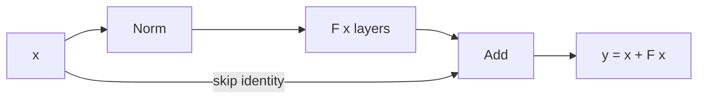

**Interview Q&A**:

*Q: Pre-norm vs post-norm — kaunsa better?*
Original transformer paper post-norm tha (LN after add). But large models me post-norm unstable, warmup zaroori. Pre-norm (LN before sublayer) more stable, no warmup needed for shallow models. GPT-2 onwards sab pre-norm. Cost: pre-norm me final output normalize nahi hota, last layer me explicit norm chahiye. Modern LLMs (LLaMA, GPT-4) pre-norm + final norm pattern use karte hain.

*Q: Residual connection bina deep network train kyun nahi hota?*
Gradient signal har layer pe attenuate hota hai (especially with sigmoid/tanh). 50+ layers me gradient effectively zero ban jaata hai pehli layer pe — woh kuch seekh nahi paati. Residual connection ek "highway" deti hai jahan gradient unchanged pass ho sakta hai. Mathematically: `dL/dx = dL/dy * (1 + dF/dx)` — that "1" guarantees minimum gradient flow.

### 3.5 Vanishing/exploding gradients

**Definition**: Vanishing gradient = backward pass me gradient itna chhota ho jaata hai ki early layers update nahi hote. Exploding = ulta, gradient itna bada ki weights NaN ho jaate hain.

**Why**: Chain rule me gradients multiply hote hain. Agar har factor <1, vanish; agar >1, explode. Both prevent learning.

**How**:

```python
import torch
import torch.nn as nn

# Diagnostic: gradient norms monitor karo
def diagnose_gradients(model):
    for name, p in model.named_parameters():
        if p.grad is not None:
            grad_norm = p.grad.norm().item()
            param_norm = p.norm().item()
            # Healthy ratio ~0.001-0.1
            print(f"{name}: param={param_norm:.4f}, grad={grad_norm:.6f}, ratio={grad_norm/param_norm:.6f}")

# Mitigation techniques
model = nn.Sequential(*[nn.Linear(256, 256) for _ in range(20)])

# 1. Proper initialization — Kaiming/Xavier
for m in model.modules():
    if isinstance(m, nn.Linear):
        nn.init.kaiming_normal_(m.weight, nonlinearity='relu')
        nn.init.zeros_(m.bias)

# 2. Gradient clipping for explosion
torch.nn.utils.clip_grad_norm_(model.parameters(), max_norm=1.0)

# 3. Use ReLU/GELU (not sigmoid) for gradient preservation
# 4. Add residual connections
# 5. LayerNorm/BatchNorm for activation stability
```

**Real-life Example**: Vanishing gradient ek long whisper game jaisa hai — message 50 logon ke through pass hota hai, end tak kuch reach hi nahi karta. Exploding gradient ek mic feedback loop hai — har layer sound amplify karti hai, kuch hi seconds me ear-splitting screech. Both situations me communication tut jaata hai, learning ruk jaati hai.

**Mermaid Diagram**:

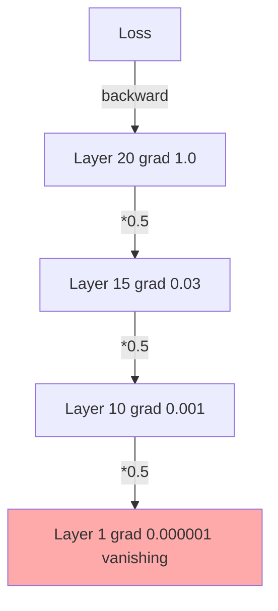

**Interview Q&A**:

*Q: Sigmoid kyun deep networks ke liye bad hai?*
Sigmoid ka derivative max value 0.25 hai (at x=0). Saturation regions me derivative ~0. 10 layers me 0.25^10 = 1e-6, gradient practically zero. ReLU me positive region me derivative exactly 1, no decay. Yahi reason hai 2012 (AlexNet) ke baad sigmoid output layer tak hi limited rahaa, hidden layers me ReLU dominate karta hai.

*Q: Initialization ka role kya hai?*
Variance preservation. Kaiming init ensure karta hai ki forward pass me activations ka variance constant rahe across layers. Xavier (Glorot) tanh ke liye, Kaiming (He) ReLU ke liye. Bad init = exponential decay/explosion of activations forward me, jo gradients ko bhi affect karta hai. Modern practice: PyTorch ka default Linear init Kaiming uniform hai, but tu explicitly verify kar le custom modules me.

---

## 4. PyTorch Mastery

PyTorch deep learning ka swiss-army knife hai. Yeh section tujhe basic se le ke distributed training tak le jaayega.

### 4.1 Tensors, autograd, nn.Module

**Definition**: Tensor PyTorch ka core data structure hai (multi-dim array with GPU support). Autograd automatic differentiation engine hai. nn.Module learnable layers/models ka base class hai.

**Why**: Tensors NumPy + GPU + gradients. Autograd manual backprop se bachata hai. nn.Module clean encapsulation deta hai parameters aur sub-modules ka.

**How**:

```python
import torch
import torch.nn as nn

# Tensors basics
x = torch.tensor([1.0, 2.0, 3.0], requires_grad=True)
y = x.pow(2).sum()    # y = 1 + 4 + 9 = 14
y.backward()           # autograd kicks in
print(x.grad)          # tensor([2., 4., 6.])  i.e., dy/dx = 2x

# Computation graph banta hai dynamically
a = torch.tensor(2.0, requires_grad=True)
b = a * 3
c = b ** 2            # c = 9*a^2
c.backward()
print(a.grad)         # 36 (dc/da = 18*a = 18*2 = 36)

# nn.Module — encapsulation + parameter tracking
class MyModel(nn.Module):
    def __init__(self, in_dim, out_dim):
        super().__init__()
        # Parameters automatically registered
        self.weight = nn.Parameter(torch.randn(in_dim, out_dim))
        self.bias = nn.Parameter(torch.zeros(out_dim))
        # Sub-modules bhi registered ho jaate hain
        self.norm = nn.LayerNorm(out_dim)

    def forward(self, x):
        return self.norm(x @ self.weight + self.bias)

model = MyModel(128, 64)
# Saare parameters ek baar me iterate karne ke liye
for name, p in model.named_parameters():
    print(name, p.shape, p.requires_grad)
```

**Real-life Example**: Tensor ek smart Excel sheet hai jo GPU pe chal sakti hai aur apna history yaad rakhti hai. Autograd accountant hai jo har transaction ka audit trail rakhta hai — jab final P&L (loss) galat aata hai, woh reverse trace kar ke har contributing transaction ka share calculate kar deta hai. nn.Module ek company hai jisme employees (parameters) aur departments (sub-modules) registered hain.

**Mermaid Diagram**:

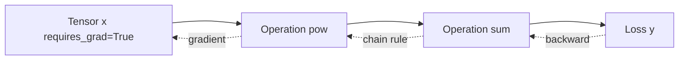

**Interview Q&A**:

*Q: `tensor.detach()` aur `tensor.data` me kya difference hai?*
`detach()` returns new tensor jo same data share karta hai but autograd graph se disconnected. `tensor.data` deprecated hai modern PyTorch me — directly underlying data access karta hai, but autograd ki perspective se silently incorrect ho sakta hai. Always use `.detach()`. Use case: targets ya intermediate values jo gradient receive nahi karne chahiye.

*Q: `nn.Parameter` aur regular tensor me kya difference?*
`nn.Parameter` is `torch.Tensor` subclass jo automatically `requires_grad=True` set karta hai aur `nn.Module` me set karne pe `module.parameters()` me register ho jaata hai. Regular tensor self-register nahi karta — `optimizer.parameters()` me dikhega nahi, train nahi hoga. Custom layers banaate waqt `nn.Parameter` use karna critical hai.

### 4.2 DataLoaders, custom datasets

**Definition**: Dataset class data ko represent karti hai (samples + labels). DataLoader batches banata hai, shuffling, parallelization handle karta hai.

**Why**: Modern training me data pipeline often bottleneck hota hai. Efficient loading + augmentation + multi-worker fetching essential hai GPU utilization ke liye.

**How**:

```python
import torch
from torch.utils.data import Dataset, DataLoader
import os

# Custom Dataset — image classification example
class ImageDataset(Dataset):
    def __init__(self, root, transform=None):
        self.root = root
        # File list eagerly load karo, but actual images lazily
        self.files = [f for f in os.listdir(root) if f.endswith('.jpg')]
        self.transform = transform

    def __len__(self):
        return len(self.files)

    def __getitem__(self, idx):
        # Yeh worker process me run hota hai
        path = os.path.join(self.root, self.files[idx])
        # PIL/OpenCV se image load
        from PIL import Image
        img = Image.open(path).convert('RGB')
        # Label filename se parse karte hain (example)
        label = int(self.files[idx].split('_')[0])
        if self.transform:
            img = self.transform(img)
        return img, label

# DataLoader configuration
dataset = ImageDataset('/path/to/images')
loader = DataLoader(
    dataset,
    batch_size=64,
    shuffle=True,
    num_workers=4,         # parallel data loading processes
    pin_memory=True,       # CPU->GPU transfer faster
    persistent_workers=True,  # workers ko har epoch recreate nahi karna
    drop_last=True,        # last incomplete batch drop kar do
    prefetch_factor=2,     # har worker 2 batches ahead fetch kare
)

for batch in loader:
    images, labels = batch
    # ... training step ...
```

**Real-life Example**: DataLoader Zomato delivery system hai. Tu (GPU) khaana khaa raha hai, har plate (batch) chahiye warm aur ready. Workers (delivery boys) parallel me kitchen (disk) se food prepare karke laate hain. Pin memory = pre-staged hot box jisme food ready rakhi hai pickup ke liye. Bina iss pipeline ke, tu har plate ke beech 5 minutes wait karega — GPU idle, MRR loss.

**Mermaid Diagram**:

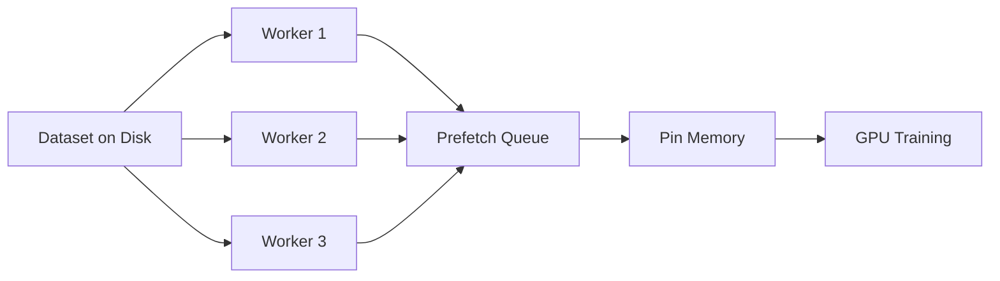

**Interview Q&A**:

*Q: `num_workers` kitne set karna chahiye?*
Heuristic: `num_cpu_cores / num_gpus_in_use`, capped around 4-8 per GPU. Too many workers = context switching overhead, RAM exhaustion. Too few = GPU idle waiting for data. Profile karo `nvidia-smi` se GPU utilization — agar <90%, data pipeline bottleneck hai. SSD vs HDD, image decode time, transforms ki complexity, sab affect karte hain.

*Q: `pin_memory=True` ka kya impact hai?*
Pinned (page-locked) memory CPU pe allocate hoti hai jise OS swap nahi karta. CUDA async transfers iss memory se directly DMA kar sakte hain, jo 2-3x faster hota hai pageable memory ke comparison me. Cost: physical RAM consume karta hai, agar tu memory-constrained hai, problem ho sakti hai. GPU training me almost always recommended.

### 4.3 Training loops (write your own first)

**Definition**: Training loop = forward pass, loss compute, backward pass, optimizer step ka cycle. PyTorch me explicit hota hai (Keras ke `fit()` jaisa nahi).

**Why**: Explicit loop = full control. Debugging, custom gradient manipulation, complex schedules — sab possible hote hain. High-level wrappers (Lightning, HuggingFace Trainer) baad me use kar, pehle khud likh.

**How**:

```python
import torch
import torch.nn as nn
from torch.utils.data import DataLoader

def train(model, loader, val_loader, epochs=10, lr=1e-3, device='cuda'):
    model = model.to(device)
    optimizer = torch.optim.AdamW(model.parameters(), lr=lr, weight_decay=0.1)
    scheduler = torch.optim.lr_scheduler.CosineAnnealingLR(optimizer, T_max=epochs * len(loader))
    criterion = nn.CrossEntropyLoss(label_smoothing=0.1)

    best_val_acc = 0.0
    for epoch in range(epochs):
        # ===== Training phase =====
        model.train()       # IMPORTANT: dropout/BN ke liye
        total_loss, total_correct, total_samples = 0, 0, 0

        for step, (x, y) in enumerate(loader):
            x, y = x.to(device, non_blocking=True), y.to(device, non_blocking=True)

            optimizer.zero_grad(set_to_none=True)    # set_to_none faster than 0
            logits = model(x)
            loss = criterion(logits, y)
            loss.backward()

            torch.nn.utils.clip_grad_norm_(model.parameters(), 1.0)
            optimizer.step()
            scheduler.step()

            # Metrics tracking
            total_loss += loss.item() * x.size(0)
            total_correct += (logits.argmax(-1) == y).sum().item()
            total_samples += x.size(0)

        train_loss = total_loss / total_samples
        train_acc = total_correct / total_samples

        # ===== Validation phase =====
        model.eval()
        val_correct, val_samples = 0, 0
        with torch.no_grad():       # gradients chahiye nahi, memory bachao
            for x, y in val_loader:
                x, y = x.to(device), y.to(device)
                logits = model(x)
                val_correct += (logits.argmax(-1) == y).sum().item()
                val_samples += x.size(0)
        val_acc = val_correct / val_samples

        print(f"Epoch {epoch}: train_loss={train_loss:.4f}, train_acc={train_acc:.4f}, val_acc={val_acc:.4f}")

        # Best model save karo
        if val_acc > best_val_acc:
            best_val_acc = val_acc
            torch.save(model.state_dict(), 'best.pt')
```

**Real-life Example**: Training loop ek student ka daily routine hai. `model.train()` = padhai mode (dropout active, learning new things). `optimizer.zero_grad()` = blackboard saaf, fresh start. Forward = problem solve karna. Loss = answer check karna. Backward = mistakes analyze karna. Optimizer step = correction karna. `model.eval()` = exam mode, no learning, sirf demonstrate.

**Mermaid Diagram**:

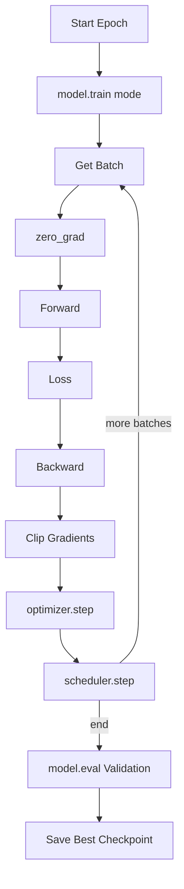

**Interview Q&A**:

*Q: `model.train()` aur `model.eval()` ka actual effect kya hai?*
Yeh sirf flag set karta hai (`self.training = True/False`). Affect karta hai un layers ko jinka behavior train/eval me different hai — Dropout (eval me identity), BatchNorm (eval me running stats use karta hai instead of batch stats). Agar tu eval me train mode chhod de, BatchNorm test batch ke statistics use karega — results inconsistent honge. Common bug.

*Q: `with torch.no_grad()` kyun chahiye eval me?*
Eval me gradient compute karne ki zaroorat nahi — yeh memory waste karta hai (intermediate activations save hote hain backward ke liye) aur slightly slower hota hai. `torch.no_grad()` autograd disable karta hai context me. Alternative: `@torch.inference_mode()` decorator (slightly faster, more restrictive). Production inference me always use karna chahiye.

### 4.4 GPU/CUDA basics, .to(device), pinned memory

**Definition**: CUDA Nvidia ka parallel computing platform hai. GPUs me thousands of cores hain, but memory aur compute model CPU se different hai.

**Why**: Deep learning training without GPU = years for what takes hours. Samajhna zaroori hai memory transfers, async execution, aur common pitfalls.

**How**:

```python
import torch

# Device detection
device = 'cuda' if torch.cuda.is_available() else 'cpu'
print(f"Device: {device}, GPU count: {torch.cuda.device_count()}")
print(f"Current device: {torch.cuda.current_device()}")
print(f"Device name: {torch.cuda.get_device_name(0)}")

# Tensor ko GPU pe le jaana
x = torch.randn(1000, 1000)
x_gpu = x.to('cuda')          # explicit transfer
x_gpu = x.cuda()              # shortcut
x = x.to(device, non_blocking=True)    # async if pinned

# Model ko GPU pe
model = torch.nn.Linear(100, 10).cuda()

# IMPORTANT: input device match hona chahiye
x = torch.randn(32, 100).cuda()    # ya .to(device)
out = model(x)    # works

# Common mistake: CPU input + GPU model = RuntimeError
# x_cpu = torch.randn(32, 100)
# out = model(x_cpu)    # ERROR: Expected all tensors on same device

# Memory monitoring
print(f"Allocated: {torch.cuda.memory_allocated() / 1e9:.2f} GB")
print(f"Reserved: {torch.cuda.memory_reserved() / 1e9:.2f} GB")

# Synchronization for accurate timing
torch.cuda.synchronize()    # wait for all kernels to complete

# Multi-GPU device specification
device_0 = torch.device('cuda:0')
device_1 = torch.device('cuda:1')
```

**Real-life Example**: CPU ek expert chef hai jo serially complex dishes banata hai. GPU 1000 line cooks hain jo simultaneously similar tasks kar sakte hain — jaise 1000 onions cut karna. Matrix multiplication exactly aisa hi parallel kaam hai. `.to(device)` ek truck hai jo data CPU kitchen se GPU kitchen le jaata hai — slow, isliye batch karke bhejo. Pinned memory = priority truck jo highway pe seedha jaata hai bina traffic me ruke.

**Mermaid Diagram**:

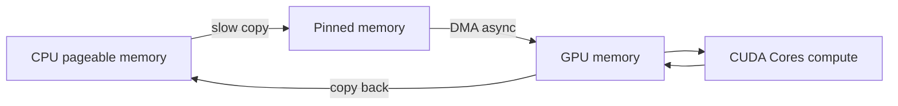

**Interview Q&A**:

*Q: `non_blocking=True` ka kya effect hai?*
Async transfer enable karta hai — CPU ko block kiye bina GPU pe data copy start hoti hai. Useful jab tu next batch prepare kar raha hai parallel me. But sirf pinned memory ke liye effective hai (pageable ke saath actually blocking hi rehta hai). DataLoader me `pin_memory=True` + `.to(device, non_blocking=True)` combination GPU utilization improve karta hai measurably.

*Q: GPU memory fragmentation kya hai aur kaise handle kare?*
PyTorch caching allocator memory blocks reuse karta hai, but different sizes ke alloc/free se fragmentation hota hai. Symptom: `OOM` despite total free memory available. Solutions: `torch.cuda.empty_cache()` (free unused but be careful — slow), `PYTORCH_CUDA_ALLOC_CONF=expandable_segments:True` env var (modern PyTorch), batch sizes consistent rakho, gradient checkpointing for large models. Production me explicit batch size schedule recommended.

### 4.5 torch.compile, FlashAttention

**Definition**: `torch.compile` PyTorch 2.0+ ka JIT compiler hai jo graphs ko optimize karta hai. FlashAttention ek IO-aware attention algorithm hai jo memory aur speed dono improve karta hai.

**Why**: Out-of-the-box PyTorch eager mode flexible hai but slow. Compilation kernels fuse karta hai, redundant ops eliminate karta hai. FlashAttention attention ki memory complexity O(n) tak laata hai (vs O(n^2)).

**How**:

```python
import torch
import torch.nn as nn
import torch.nn.functional as F

# torch.compile usage
model = nn.Sequential(
    nn.Linear(1024, 4096),
    nn.GELU(),
    nn.Linear(4096, 1024),
).cuda()

# Compile karo — first call slow (compilation), subsequent fast
compiled_model = torch.compile(
    model,
    mode='reduce-overhead',    # ya 'max-autotune', 'default'
    fullgraph=False,            # graph break allow karega
)

x = torch.randn(32, 1024, device='cuda')
y = compiled_model(x)    # 1st call: slow due to compilation
y = compiled_model(x)    # 2nd+ call: fast

# FlashAttention via PyTorch 2.0 SDPA
def flash_attention_example(q, k, v):
    # q, k, v: (batch, heads, seq, dim)
    # PyTorch 2.0+ automatically picks FlashAttention if available
    out = F.scaled_dot_product_attention(
        q, k, v,
        attn_mask=None,
        dropout_p=0.0,
        is_causal=True,        # decoder mask
    )
    return out

# Manual context manager se backend force kar sakte ho
from torch.nn.attention import sdpa_kernel, SDPBackend
with sdpa_kernel(SDPBackend.FLASH_ATTENTION):
    out = F.scaled_dot_product_attention(q, k, v, is_causal=True)
```

**Real-life Example**: Eager PyTorch ek interpreted language jaise Python hai — flexible but slow. `torch.compile` JIT compiler hai jaise PyPy ya V8 — runtime me hot paths ko optimize karta hai. FlashAttention SmartGPU hai jo softmax compute karte waqt har temporary matrix store nahi karta — block-wise process karta hai jaise tu paani ko cup-by-cup transfer kar raha hai instead of pura tank ek baar.

**Mermaid Diagram**:

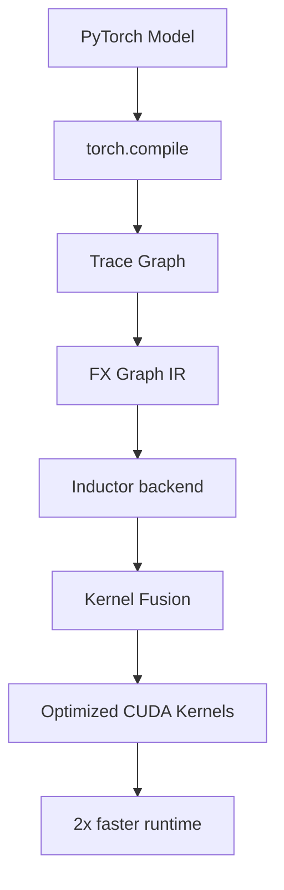

**Interview Q&A**:

*Q: `torch.compile` always use karna chahiye?*
Almost always for training. But caveats: first compile slow (warm-up time), dynamic shapes recompile trigger karte hain (use `dynamic=True` ya pad to fixed sizes), debugging complex ho jaata hai (graph breaks dekhne ke liye `TORCH_LOGS=graph_breaks` set karo). Inference me bhi useful but `torch.export` + AOT compilation production me preferred. Random functions (custom CUDA ops) sometimes compile fail kar sakte hain.

*Q: FlashAttention ka secret sauce kya hai?*
Standard attention me intermediate `QK^T` matrix `O(n^2)` memory leta hai — sequence 8K ke liye 64M elements per head. FlashAttention block-wise attention compute karta hai using online softmax algorithm — sirf blocks ko HBM se SRAM me laata hai, compute karta hai, output accumulate karta hai. Memory `O(n)`, compute same theoretical FLOPs but ~2-4x faster wall clock due to reduced memory bandwidth bottleneck. Tri Dao ka paper landmark contribution tha.

### 4.6 Saving/loading checkpoints, state_dict

**Definition**: state_dict ek dict hai jo parameters aur buffers ko key-value form me store karta hai. Checkpointing model state ko disk pe persist karta hai for resume/inference.

**Why**: Training crashes hote hain. Production deployment ke liye trained weights chahiye. Best model selection ke liye periodic save zaroori. Forgetting to save = days of compute lost.

**How**:

```python
import torch
import torch.nn as nn

model = nn.Linear(10, 1).cuda()
optimizer = torch.optim.AdamW(model.parameters())
scheduler = torch.optim.lr_scheduler.CosineAnnealingLR(optimizer, T_max=100)

# Saving — full training state
checkpoint = {
    'epoch': 5,
    'step': 1000,
    'model_state_dict': model.state_dict(),
    'optimizer_state_dict': optimizer.state_dict(),
    'scheduler_state_dict': scheduler.state_dict(),
    'best_val_loss': 0.234,
    'config': {'lr': 1e-3, 'batch_size': 64},   # reproducibility ke liye
    'rng_state': torch.get_rng_state(),
    'cuda_rng_state': torch.cuda.get_rng_state_all(),
}
torch.save(checkpoint, 'checkpoint_epoch5.pt')

# Loading — resume training
checkpoint = torch.load('checkpoint_epoch5.pt', map_location='cuda')
model.load_state_dict(checkpoint['model_state_dict'])
optimizer.load_state_dict(checkpoint['optimizer_state_dict'])
scheduler.load_state_dict(checkpoint['scheduler_state_dict'])
start_epoch = checkpoint['epoch'] + 1
torch.set_rng_state(checkpoint['rng_state'])

# Inference-only loading (no optimizer needed)
model = nn.Linear(10, 1)
model.load_state_dict(torch.load('model_only.pt', map_location='cpu'))
model.eval()

# Strict=False for partial loading (e.g., loading pretrained backbone)
incompatible = model.load_state_dict(checkpoint['model_state_dict'], strict=False)
print(f"Missing keys: {incompatible.missing_keys}")
print(f"Unexpected keys: {incompatible.unexpected_keys}")

# Best practice: model file aur metadata file separate
torch.save(model.state_dict(), 'model.pt')
import json
with open('model_config.json', 'w') as f:
    json.dump({'arch': 'mlp', 'in_dim': 10, 'out_dim': 1}, f)
```

**Real-life Example**: Checkpoint exam ki preparation me notes save karne jaise hai. Sirf model save karna = sirf answer key save karna. Full checkpoint = notes + your understanding + question patterns + RNG seed (luck factor) — sab kuch reproducible. Production me model versioning critical hai — agar production model break ho, tu instantly previous checkpoint pe rollback kar sakta hai.

**Mermaid Diagram**:

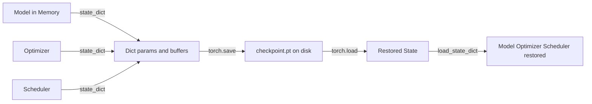

**Interview Q&A**:

*Q: `torch.save(model)` vs `torch.save(model.state_dict())` — difference?*
First serializes entire Python object including class definition (uses pickle). Brittle — code refactor break kar sakta hai loading. state_dict sirf parameters dictionary save karta hai — portable, version-stable, recommended approach. Always save state_dict + separately store config/architecture for reconstruction.

*Q: Checkpoint loading me `map_location` kya hai?*
Tells PyTorch where to load tensors. Without it, tensors load hote hain wahin jahan save hue the (e.g., GPU 0). Agar tu GPU 0 nahi hai (only CPU available, ya different GPU), error aata hai. `map_location='cpu'` always safe — phir manually `.to(device)` kar le. Multi-GPU me map_location dict bhi de sakte ho: `{'cuda:0': 'cuda:1'}`.

### 4.7 Distributed training intro (DDP)

**Definition**: DistributedDataParallel (DDP) data parallelism implement karta hai across multiple GPUs/nodes. Har process apni model copy chalata hai, gradients all-reduce hote hain.

**Why**: Single GPU me bade models nahi fit hote, ya training time prohibitive hota hai. DDP near-linear scaling deta hai across GPUs.

**How**:

```python
import torch
import torch.distributed as dist
import torch.nn as nn
from torch.nn.parallel import DistributedDataParallel as DDP
from torch.utils.data.distributed import DistributedSampler
from torch.utils.data import DataLoader
import os

def setup(rank, world_size):
    # NCCL backend GPUs ke liye, gloo CPU ke liye
    os.environ['MASTER_ADDR'] = 'localhost'
    os.environ['MASTER_PORT'] = '12355'
    dist.init_process_group('nccl', rank=rank, world_size=world_size)
    torch.cuda.set_device(rank)

def cleanup():
    dist.destroy_process_group()

def train_ddp(rank, world_size, dataset):
    setup(rank, world_size)

    # Sampler ensures each rank gets different subset
    sampler = DistributedSampler(dataset, num_replicas=world_size, rank=rank)
    loader = DataLoader(dataset, batch_size=32, sampler=sampler, pin_memory=True)

    model = nn.Linear(100, 10).to(rank)
    # DDP wrap karo — gradients automatically all-reduce honge
    model = DDP(model, device_ids=[rank])
    optimizer = torch.optim.AdamW(model.parameters(), lr=1e-3)

    for epoch in range(10):
        sampler.set_epoch(epoch)    # IMPORTANT: shuffling ke liye
        for x, y in loader:
            x, y = x.to(rank), y.to(rank)
            optimizer.zero_grad()
            loss = nn.functional.cross_entropy(model(x), y)
            loss.backward()    # gradients sync internally via all-reduce
            optimizer.step()

        # Save sirf rank 0 se (avoid race conditions)
        if rank == 0:
            torch.save(model.module.state_dict(), f'epoch_{epoch}.pt')

    cleanup()

# Run via torchrun:
# torchrun --nproc_per_node=4 train.py
# rank, world_size automatically set ho jaate hain os.environ me
```

**Real-life Example**: DDP ek 4-team cricket practice jaise hai. Har team apne ground pe practice karti hai (forward/backward), but har over ke baad sab teams milke strategy compare karte hain (all-reduce gradients) aur same updated playbook (synchronized weights) ke saath continue karte hain. Single GPU = one team, slow. 4 GPUs DDP = 4 teams parallel, ~3.5x faster (some sync overhead). 100 GPUs = 100 teams, but communication cost ZooM ho jaata hai, gradient compression aur pipeline parallelism chahiye.

**Mermaid Diagram**:

```mermaid
graph TD
    D[Dataset] --> DS[DistributedSampler]
    DS --> R0[Rank 0 GPU 0]
    DS --> R1[Rank 1 GPU 1]
    DS --> R2[Rank 2 GPU 2]
    DS --> R3[Rank 3 GPU 3]
    R0 -->|backward| AR[All-Reduce Gradients]
    R1 -->|backward| AR
    R2 -->|backward| AR
    R3 -->|backward| AR
    AR --> SYNC[Synchronized Update on all GPUs]
```

**Interview Q&A**:

*Q: DataParallel (DP) vs DistributedDataParallel (DDP) — kaunsa use karna?*
DDP always. DP single-process multi-thread hai, GIL bottleneck hai, scatter-gather overhead hai, ek GPU bottleneck banti hai. DDP multi-process hai (no GIL), all-reduce overlapped with backward pass (free!), proper scaling deti hai. DP basically deprecated hai modern PyTorch me. `torchrun` se launch karo, single-node multi-GPU me bhi DDP better.

*Q: All-reduce me communication kitna costly hai?*
Each backward pass me poore model ka gradient broadcast hota hai. 1B param model = 4GB (fp32) ya 2GB (fp16) per all-reduce. NVLink (intra-node) ~600 GB/s, InfiniBand (inter-node) ~25-50 GB/s. Isliye gradient bucketing (DDP automatically karta hai) aur overlap with backward critical hai. Beyond ~64 GPUs, communication dominate karne lagti hai — yahan se ZeRO, FSDP, ya pipeline parallelism kick in karte hain.

---

## 5. Classic Architectures

LLMs aur transformers se pehle yeh architectures era define karte the. Inko samajhna inductive bias aur historical context ke liye zaroori hai.

### 5.1 CNNs — just enough to understand inductive bias

**Definition**: Convolutional Neural Networks shared-weight filters use karte hain spatial features detect karne ke liye. Translation equivariance built-in hai.

**Why**: Images me local patterns matter karte hain (edges, textures, shapes). Fully connected layer parameter explosion + no spatial prior. CNN's inductive bias = "nearby pixels related, same patterns anywhere can occur".

**How**:

```python
import torch
import torch.nn as nn

# Basic CNN block
class ConvBlock(nn.Module):
    def __init__(self, in_ch, out_ch, kernel=3, stride=1):
        super().__init__()
        self.conv = nn.Conv2d(in_ch, out_ch, kernel_size=kernel,
                              stride=stride, padding=kernel//2, bias=False)
        self.bn = nn.BatchNorm2d(out_ch)
        self.act = nn.ReLU(inplace=True)
    def forward(self, x):
        return self.act(self.bn(self.conv(x)))

# Mini ResNet-style architecture
class MiniResNet(nn.Module):
    def __init__(self, num_classes=10):
        super().__init__()
        self.stem = ConvBlock(3, 64, kernel=7, stride=2)
        self.pool = nn.MaxPool2d(3, stride=2, padding=1)
        # Stages with increasing channels, decreasing spatial
        self.stage1 = nn.Sequential(ConvBlock(64, 128), ConvBlock(128, 128))
        self.stage2 = nn.Sequential(ConvBlock(128, 256, stride=2), ConvBlock(256, 256))
        self.stage3 = nn.Sequential(ConvBlock(256, 512, stride=2), ConvBlock(512, 512))
        self.gap = nn.AdaptiveAvgPool2d(1)    # global average pooling
        self.fc = nn.Linear(512, num_classes)

    def forward(self, x):
        # x: (B, 3, 224, 224)
        x = self.pool(self.stem(x))     # (B, 64, 56, 56)
        x = self.stage1(x)              # (B, 128, 56, 56)
        x = self.stage2(x)              # (B, 256, 28, 28)
        x = self.stage3(x)              # (B, 512, 14, 14)
        x = self.gap(x).flatten(1)      # (B, 512)
        return self.fc(x)
```

**Real-life Example**: CNN ek security camera system hai jo har frame me same patterns dhundhta hai — chahe person left side ho ya right, "face" detect hona chahiye. Filter ek "stamp" hai jo image pe slide karta hai, har location pe match check karta hai. Receptive field deeper layers me badh jaata hai — first layer edges dekhti hai, deeper layers full objects. Vision Transformers ke aane ke baad CNNs slowly replace ho rahe hain but mobile/edge devices pe still dominant.

**Mermaid Diagram**:

```mermaid
graph LR
    I[Image 3x224x224] --> C1[Conv 7x7 stride 2]
    C1 --> P[MaxPool]
    P --> S1[Stage 1: 56x56]
    S1 --> S2[Stage 2: 28x28]
    S2 --> S3[Stage 3: 14x14]
    S3 --> GAP[Global Avg Pool]
    GAP --> FC[FC -> classes]
```

**Interview Q&A**:

*Q: CNN ka inductive bias kya hai aur transformers se kaise different hai?*
CNN bias: locality (nearby pixels matter), translation equivariance (same pattern anywhere), hierarchy (small features compose into big ones). Transformers: minimal bias, sab tokens kisi bhi token se attend kar sakte hain. Result: CNNs less data me better generalize karte hain, transformers more data + scale me CNNs ko outperform karte hain (ViT ka famous result). Mobile me CNNs still preferred — efficiency aur small data me robustness.

*Q: Receptive field aur stride ka relation?*
Receptive field = ek output unit kitne input units ko "dekh" sakta hai. Each conv layer rf badhati hai by `(kernel-1)*product_of_previous_strides`. Stride 2 effectively rf double karta hai per layer. Pure 3x3 conv layers me rf slowly grow hota hai — 30 layers chahiye 224 image dekhne ke liye. Dilated convolutions ya self-attention rf ko tezi se badhate hain.

### 5.2 RNNs, LSTMs, GRUs — history, why they failed

**Definition**: RNN sequential data ko process karta hai hidden state maintain karke. LSTM (Long Short-Term Memory) gating mechanism add karta hai long-range dependencies handle karne ke liye. GRU LSTM ka simplified version hai.

**Why historical**: Pre-2017 NLP ka backbone the. Pre-transformer era me sequence-to-sequence translation, language modeling, sab inhi pe chalti thi.

**Why they failed**: Sequential nature parallelize nahi ho sakti — training slow. Long-range dependencies still struggle (despite gates). Transformer attention mechanism inhi limitations ko address karta hai.

**How**:

```python
import torch
import torch.nn as nn

# Simple RNN
rnn = nn.RNN(input_size=128, hidden_size=256, num_layers=2, batch_first=True)
x = torch.randn(32, 100, 128)    # (batch, seq, features)
out, hidden = rnn(x)             # out: (32, 100, 256), hidden: (2, 32, 256)

# LSTM — gates allow selective memory
class SimpleLSTM(nn.Module):
    def __init__(self, vocab_size, embed_dim=128, hidden=256, num_layers=2):
        super().__init__()
        self.embed = nn.Embedding(vocab_size, embed_dim)
        # LSTM internal: forget gate, input gate, output gate, cell state
        self.lstm = nn.LSTM(embed_dim, hidden, num_layers,
                            batch_first=True, dropout=0.2)
        self.fc = nn.Linear(hidden, vocab_size)

    def forward(self, x, state=None):
        # x: (batch, seq)
        emb = self.embed(x)              # (batch, seq, embed)
        out, state = self.lstm(emb, state)
        logits = self.fc(out)            # (batch, seq, vocab)
        return logits, state

# GRU — fewer gates than LSTM, slightly faster
gru = nn.GRU(input_size=128, hidden_size=256, num_layers=2, batch_first=True)

# Manual LSTM cell logic samajhne ke liye
def lstm_cell_step(x, h_prev, c_prev, params):
    # Concat and project to 4 gates simultaneously
    gates = x @ params['W_ih'] + h_prev @ params['W_hh'] + params['b']
    i, f, g, o = gates.chunk(4, dim=-1)
    i, f, o = torch.sigmoid(i), torch.sigmoid(f), torch.sigmoid(o)
    g = torch.tanh(g)
    # Cell state: forget old, add new
    c_new = f * c_prev + i * g
    # Hidden state: gated cell
    h_new = o * torch.tanh(c_new)
    return h_new, c_new
```

**Real-life Example**: RNN ek banda hai jo book paragraph-by-paragraph padh raha hai aur sirf ek small notebook me notes le raha hai (hidden state). 100 pages ke baad first page ka detail bhool gaya. LSTM ke paas same notebook + ek "cell state" — important cheezon ko explicit highlight karta hai jo bhulta nahi (gate mechanism). But fundamentally, ek single banda serial me padh raha hai = slow. Transformer 100 readers parallel me poori book ek saath padh ke notes share karte hain — yahi parallelism revolution hai.

**Mermaid Diagram**:

```mermaid
graph LR
    X1[x_1] --> H1[h_1]
    X2[x_2] --> H2[h_2]
    X3[x_3] --> H3[h_3]
    H1 --> H2
    H2 --> H3
    H1 -.long range struggle.-> H3
    style H1 fill:#faa
    style H3 fill:#faa
```

**Interview Q&A**:

*Q: LSTM ke gates ka role exactly kya hai?*
Forget gate (`f`): cell state ka kitna purana memory rakhna. Input gate (`i`): naye candidate (`g`) ka kitna add karna. Output gate (`o`): cell state ka kitna hidden state me expose karna. Yeh "soft" decisions sigmoid ke through learn hote hain. Cell state ek "highway" hai jo long-range info carry karta hai bina aggressive mutation ke. Theoretical advantage hai but practically 200+ tokens ke baad bhi LSTMs struggle karte hain.

*Q: Transformer attention ne RNNs ko obsolete kyun kar diya?*
Three reasons. (1) Parallelization — sequence ke saare tokens ek saath process hote hain, GPU fully utilize. RNN serial hai. (2) Direct connections — har token directly har dusre token se attend kar sakta hai, no information bottleneck through hidden state. (3) Scalability — attention ke parameters sequence length se independent hain (almost), trillion-param models possible. RNNs me hidden state size limited hai. "Attention is All You Need" 2017 me yeh demonstrate kiya, abhi tak unchallenged hai sequence modeling me.

### 5.3 Encoder-decoder seq2seq — bridge to transformers

**Definition**: Seq2seq architecture me encoder input sequence ko fixed/variable representation me convert karta hai, decoder usse output sequence generate karta hai. Translation, summarization me popular tha.

**Why**: Variable length input se variable length output mapping ke liye natural fit. Original RNN-based, lekin attention mechanism (Bahdanau) add hone ke baad performance jump hua — yahi se transformers evolve hue.

**How**:

```python
import torch
import torch.nn as nn

# RNN-based encoder-decoder with attention (precursor to transformer)
class Encoder(nn.Module):
    def __init__(self, vocab_size, embed_dim=256, hidden=512):
        super().__init__()
        self.embed = nn.Embedding(vocab_size, embed_dim)
        self.lstm = nn.LSTM(embed_dim, hidden, batch_first=True, bidirectional=True)

    def forward(self, x):
        emb = self.embed(x)
        # outputs: (B, src_len, 2*hidden), state: tuple
        outputs, state = self.lstm(emb)
        return outputs, state

class BahdanauAttention(nn.Module):
    def __init__(self, hidden):
        super().__init__()
        self.W_q = nn.Linear(hidden, hidden)
        self.W_k = nn.Linear(2 * hidden, hidden)    # bidir encoder
        self.v = nn.Linear(hidden, 1)

    def forward(self, query, keys):
        # query: (B, hidden), keys: (B, src_len, 2*hidden)
        q = self.W_q(query).unsqueeze(1)            # (B, 1, hidden)
        k = self.W_k(keys)                          # (B, src_len, hidden)
        scores = self.v(torch.tanh(q + k)).squeeze(-1)    # (B, src_len)
        weights = torch.softmax(scores, dim=-1)     # alignment weights
        context = (weights.unsqueeze(-1) * keys).sum(dim=1)
        return context, weights

class Decoder(nn.Module):
    def __init__(self, vocab_size, embed_dim=256, hidden=512):
        super().__init__()
        self.embed = nn.Embedding(vocab_size, embed_dim)
        self.attn = BahdanauAttention(hidden)
        self.lstm = nn.LSTM(embed_dim + 2 * hidden, hidden, batch_first=True)
        self.fc = nn.Linear(hidden, vocab_size)

    def forward(self, y_t, h_prev, encoder_outputs):
        # y_t: (B,), single token at time t
        emb = self.embed(y_t).unsqueeze(1)          # (B, 1, embed)
        context, attn_weights = self.attn(h_prev[0][-1], encoder_outputs)
        rnn_in = torch.cat([emb, context.unsqueeze(1)], dim=-1)
        out, state = self.lstm(rnn_in, h_prev)
        logits = self.fc(out.squeeze(1))
        return logits, state, attn_weights
```

**Real-life Example**: Seq2seq translation jaise samjho — encoder ek interpreter hai jo Hindi sentence ka "essence" ek mental representation me capture karta hai. Decoder dusra interpreter hai jo wahi essence se English sentence word-by-word generate karta hai. Pure RNN seq2seq me poora encoder ka output ek single vector me squash hota tha — long sentences me information loss. Attention ne yeh fix kiya — har output word generate karte waqt encoder ke saare hidden states pe re-look kar sakta hai. Yeh idea generalize karke transformer self-attention ban gaya.

**Mermaid Diagram**:

```mermaid
graph LR
    SRC[Source: main ghar ja raha hoon] --> E[Encoder LSTM]
    E --> H1[h1 h2 h3 h4 h5]
    H1 --> A[Attention]
    A --> D[Decoder LSTM]
    D --> OUT[I am going home]
    A -.alignments.-> H1
```

**Interview Q&A**:

*Q: Bahdanau vs Luong attention me kya difference?*
Bahdanau (2014) additive attention: `score = v^T tanh(W_q q + W_k k)`. Luong (2015) multiplicative: `score = q^T W k` ya `score = q^T k`. Multiplicative faster (single matmul), Bahdanau slightly more expressive. Transformer scaled dot-product attention essentially Luong + scaling factor + multi-head. Yahi evolution se modern attention aaya.

*Q: Seq2seq me teacher forcing kya hai?*
Training me decoder ko ground-truth previous token feed karte hain (instead of model's own prediction). Issue: inference me model apne predictions feed karta hai — distribution shift. Solution: scheduled sampling (gradually mix), ya autoregressive training as in GPT (still teacher forcing in training but causal mask). Modern LLMs me teacher forcing standard hai — exposure bias managed via large-scale training aur sampling techniques like nucleus sampling.

---

## Resources & further reading

Bhai yeh foundation hai, but seekhna kabhi rukta nahi. Niche kuch resources hain jo tujhe top 2% me le jaayenge.

**Books**:
- "Deep Learning" by Goodfellow, Bengio, Courville — classic textbook, theoretical depth
- "Dive into Deep Learning" (d2l.ai) — interactive, code-heavy, free online
- "Deep Learning with PyTorch" by Eli Stevens et al. — practical PyTorch focus

**Courses**:
- Andrej Karpathy's "Neural Networks: Zero to Hero" YouTube series — micrograd se le ke GPT tak khud build karte ho. Mandatory dekhna.
- Stanford CS231n (CNN for Vision) aur CS224n (NLP) — gold standard
- Fast.ai practical course — top-down approach, build first then theory

**Papers (must-read)**:
- "Attention is All You Need" (Vaswani 2017) — transformer ka birth certificate
- "Deep Residual Learning" (He 2015) — ResNet, residual connections
- "Adam: A Method for Stochastic Optimization" (Kingma 2014)
- "Layer Normalization" (Ba 2016)
- "FlashAttention" (Dao 2022) — modern efficient attention
- "Decoupled Weight Decay Regularization" (Loshchilov 2017) — AdamW

**Practical tools**:
- PyTorch official docs — `pytorch.org/docs`. Read source code of `nn.Module` once.
- Weights & Biases — experiment tracking
- HuggingFace transformers — pretrained models, but pehle khud transformer likh
- nanoGPT (Karpathy) — production-quality LLM training code in 300 lines

**Advanced reads**:
- "The Annotated Transformer" — line-by-line walkthrough
- "Scaling Laws for Neural Language Models" (Kaplan 2020)
- "Chinchilla" paper (Hoffmann 2022) — compute-optimal training

Last advice: papers padhna important hai, but code likhna usse zyada. Har ek concept ko nanoGPT/micrograd jaisa khud reimplement kar — yahi se intuition aati hai jo PDF padhne se nahi aati. Tu top 2% me jaana chahta hai, toh shortcuts nahi hain — bas consistent practice aur first-principles thinking. All the best, ab keyboard utha aur train kar.
