# Diffusion Models & Image Generation

Diffusion basically reverse process hai noise se signal banane ka. Image me random noise daalo, fir step-by-step usse clean karte jao — yahi DALL-E/Stable Diffusion/FLUX ka core hai. Pehle GANs ka raj tha image generation me, but woh training me bahut unstable the — mode collapse, vanishing gradients, discriminator-generator ka tug-of-war. Diffusion ne game change kar diya 2020 ke baad (DDPM paper se). Idea simple hai: ek clean image lo, usme thoda thoda Gaussian noise daalte jao har step pe (forward process), aur ek neural network ko train karo jo us noise ko predict kare aur reverse kare (reverse process). Inference time pe pure noise se start karo aur model step-by-step usse clean karke ek beautiful image bana de.

Yeh guide tujhe le jayegi diffusion theory ke first principles se le ke production-grade image generation tak. Hum DDPM, DDIM, score-based models, classifier-free guidance — saari math cover karenge. Fir Latent Diffusion (Stable Diffusion ka architecture) dekhenge jo VAE ke latent space me kaam karke 512x512 images ko 64x64 latents pe compress kar deta hai — 64x compute saving. SD3 aur FLUX ne flow matching aur rectified flow introduce kiye, jo DDPM se bhi tezi se converge karte hain. Practical side pe ControlNet (pose/depth se control), IP-Adapter (image-to-image conditioning), LoRA (cheap fine-tuning), ComfyUI workflow, aur prompt engineering — sab ek ek karke todenge.

Tu intern hai aur main senior dev — chal shuru karte hain. Math thodi heavy hai but har formula ke saath intuition aur code dunga, taaki tu sirf ratta na maare balki samjhe ki kyun.

## 1. Diffusion Theory

### 1.1 Forward and reverse diffusion processes

**Definition:** Forward process ek Markov chain hai jo clean image x_0 me dheere dheere Gaussian noise add karta hai T steps tak, jab tak image pure noise (x_T ~ N(0, I)) na ban jaye. Reverse process inverse hai — pure noise se start karke step by step denoise karta hai aur original distribution se sample generate karta hai.

**Why:** GANs me ek hi shot me image generate karni padti thi — generator ko full distribution learn karni padti thi. Diffusion me hum problem ko T chote chote denoising steps me todh dete hain. Har step pe model ko bas thoda sa noise predict karna hai — yeh much easier learning problem hai. Stability bhi mil jati hai aur diversity bhi.

**How:**

```python
# diffusers library se basic forward process
import torch
from diffusers import DDPMScheduler

# Scheduler banao — yeh noise schedule manage karta hai
# beta_start, beta_end define karte hain ki noise kitna add ho har step pe
scheduler = DDPMScheduler(
    num_train_timesteps=1000,  # T=1000 steps
    beta_start=0.0001,         # initial noise variance
    beta_end=0.02,             # final noise variance
    beta_schedule="linear"     # linearly badhega beta
)

# Forward process: q(x_t | x_0) = N(x_t; sqrt(alpha_bar_t)*x_0, (1-alpha_bar_t)*I)
# alpha_bar_t = prod(1 - beta_i) for i=1..t
# Closed form me direct x_0 se x_t le sakte hain — no loop needed
clean_image = torch.randn(1, 3, 64, 64)  # dummy clean image
noise = torch.randn_like(clean_image)     # epsilon ~ N(0, I)
timesteps = torch.tensor([500])           # t=500 par dekhenge

# Math: x_t = sqrt(alpha_bar_t) * x_0 + sqrt(1 - alpha_bar_t) * noise
noisy_image = scheduler.add_noise(clean_image, noise, timesteps)

# Reverse process: model ko train karo jo noise predict kare
# Loss: L = E[|| epsilon - epsilon_theta(x_t, t) ||^2]
# Yani simple MSE between true noise aur predicted noise
```

**Real-life Example:** Soch tu chai bana raha hai. Forward process — chai me chini, doodh, masala dheere dheere milate ja, ek waqt aisa aayega ki sab kuch mix ho gaya, original components nahi pehchane jaa sakte (pure noise). Reverse process — agar tujhe ulta jaana ho aur components recover karne ho step by step, tujhe har step pe figure out karna hoga "is mixture me kya add hua tha last step me?" Yahi diffusion model karta hai — har step pe predict karta hai "yahan kya noise add hua tha".

**Mermaid Diagram:**

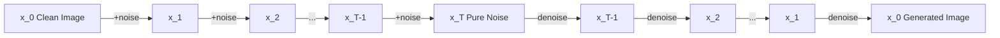

**Interview Q&A:**

*Q: Forward process me kya seekhna padta hai model ko?*

A: Forward process me kuch nahi seekhna — yeh fixed Markov chain hai with predefined betas. Tu directly noise add karta hai. Reverse process me network seekhta hai. Specifically, U-Net ko train karte hain jo input me noisy image x_t aur timestep t le, aur output me predict kare ki kitna noise (epsilon) us image me add hua tha. Loss function bahut simple hai — MSE between actual noise aur predicted noise. Iss reformulation ne diffusion ko trainable banaya — DDPM paper (Ho et al. 2020) ka core insight yahi tha.

*Q: Kyun Gaussian noise hi use karte hain, koi aur distribution kyun nahi?*

A: Mathematical convenience aur theoretical backing dono hain. Gaussian noise ka sum bhi Gaussian hota hai — isliye q(x_t | x_0) ka closed form mil jata hai, tujhe T baar loop chalane ki zarurat nahi forward me. Reverse process bhi small enough beta ke liye approximately Gaussian hi rehta hai (Sohl-Dickstein 2015 ne dikhaya). Other distributions like Bernoulli for discrete data ya uniform for categorical bhi kaam karte hain (D3PM paper) but Gaussian images ke liye natural fit hai because pixels continuous hote hain.

### 1.2 DDPM, DDIM

**Definition:** DDPM (Denoising Diffusion Probabilistic Models) original formulation hai jo stochastic sampling karta hai — har step me noise add hota hai reverse process me bhi. DDIM (Denoising Diffusion Implicit Models) deterministic variant hai jo same trained model use karke kam steps me sample kar sakta hai (50-100 steps vs 1000).

**Why:** DDPM amazing quality deta hai but slow — har image ke liye 1000 forward passes through U-Net. Production me yeh useless hai. DDIM ne dikhaya ki tu same model ko 50 steps me bhi run kar sakta hai with comparable quality. Yeh 20x speedup hai. Aaj saare modern samplers (Euler, DPM++, UniPC) is technique pe based hain.

**How:**

```python
from diffusers import DDPMScheduler, DDIMScheduler, UNet2DModel
import torch

# Same trained model — bas scheduler change karna hai
model = UNet2DModel.from_pretrained("google/ddpm-cat-256")

# DDPM: stochastic, 1000 steps, slow but high quality
ddpm_sched = DDPMScheduler(num_train_timesteps=1000)
ddpm_sched.set_timesteps(1000)

# DDIM: deterministic, can do 50 steps
ddim_sched = DDIMScheduler(num_train_timesteps=1000)
ddim_sched.set_timesteps(50)  # only 50 inference steps!

# Sampling loop — DDIM
sample = torch.randn(1, 3, 256, 256).to("cuda")
model = model.to("cuda")

for t in ddim_sched.timesteps:
    with torch.no_grad():
        # Model predict karta hai noise epsilon_theta
        noise_pred = model(sample, t).sample
    # Scheduler step — yeh DDIM update equation apply karta hai
    # x_{t-1} = sqrt(alpha_bar_{t-1}) * predicted_x_0 + direction_term
    sample = ddim_sched.step(noise_pred, t, sample).prev_sample

# DDIM ka math:
# x_{t-1} = sqrt(alpha_bar_{t-1}) * x_0_pred + sqrt(1 - alpha_bar_{t-1} - sigma^2) * eps_pred + sigma*z
# Jab sigma=0, deterministic ho jata hai — yahi DDIM ka magic hai
```

**Real-life Example:** DDPM vs DDIM samajh — DDPM jaise tu Mumbai se Delhi train me ja raha hai, har station pe ruk raha hai (1000 stops). DDIM jaise Rajdhani Express — sirf bade stations pe rukti hai (50 stops), but destination same. Quality almost barabar, time 20x kam.

**Mermaid Diagram:**

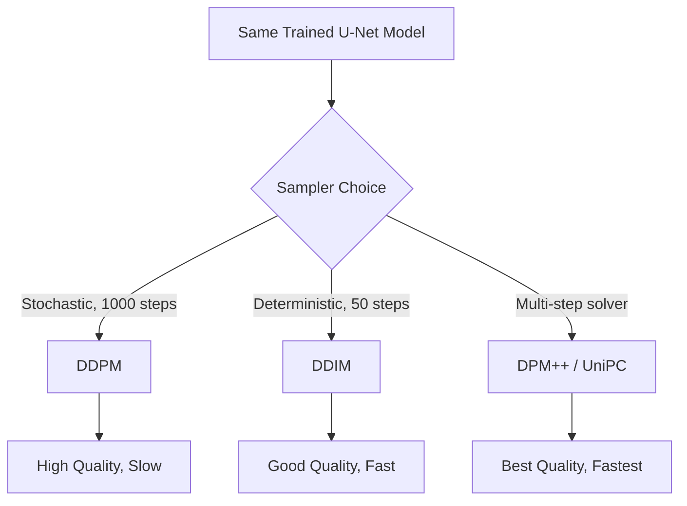

**Interview Q&A:**

*Q: DDIM deterministic kaise ban gaya jab DDPM stochastic hai?*

A: DDIM ne reverse process ko reformulate kiya non-Markovian way me. DDPM me variance term sigma_t^2 fixed tha (beta_t ya beta_tilde_t). DDIM me sigma ko parameter banaya — jab sigma=0, noise term gayab ho jata hai aur process deterministic ban jata hai. Important baat — same trained model use ho sakta hai dono ke liye because training objective same hi rehta hai (predict noise). Bas inference time pe sampling equation different hota hai. Yeh insight bahut powerful tha — koi retraining nahi.

*Q: Production me kaunsa sampler use karte ho aaj kal?*

A: Aaj kal DPM++ 2M Karras ya UniPC most popular hain — yeh higher-order solvers hain (DDIM first-order solver hai). 20-30 steps me high quality dete hain. Stable Diffusion WebUI aur ComfyUI me default Euler ancestral ya DPM++ hota hai. FLUX me flow matching ke liye Euler hi kaafi hai because path straight hota hai. Choice depend karta hai — speed chahiye to LCM (Latent Consistency Model) 4 steps, quality chahiye to DPM++ 30 steps.

### 1.3 Score-based models

**Definition:** Score-based models diffusion ko thoda alag angle se dekhte hain — instead of predicting noise directly, yeh log-density gradient (score function) predict karte hain: ∇_x log p(x). Yang Song ka NCSN (Noise Conditional Score Network) paper aur uske baad SDE-based formulation (Score SDE) ne dikhaya ki DDPM aur score-based models actually equivalent hain.

**Why:** Score-based view se hum diffusion ko continuous-time SDE (Stochastic Differential Equation) ke roop me dekh sakte hain. Yeh framework powerful hai — saare existing ODE/SDE solvers (Runge-Kutta, etc.) directly apply ho sakte hain sampling ke liye. Bhi yeh theoretically clean view deta hai why diffusion works.

**How:**

```python
import torch
import torch.nn as nn

# Score function: s_theta(x, t) = grad_x log p_t(x)
# Loss: denoising score matching
# E_t E_x0 E_xt|x0 [ lambda(t) * || s_theta(x_t, t) - grad_xt log q(x_t|x_0) ||^2 ]

# Connection to DDPM:
# score(x_t, t) = -epsilon_theta(x_t, t) / sqrt(1 - alpha_bar_t)
# Yani noise prediction aur score prediction equivalent hain — bas scaling factor

class ScoreNet(nn.Module):
    def __init__(self):
        super().__init__()
        # Time-conditional U-Net (same as DDPM)
        self.unet = UNet2DModel(...)
    
    def forward(self, x, t):
        # Output score directly
        return self.unet(x, t).sample

# SDE forward process: dx = f(x,t)dt + g(t)dW
# Reverse SDE: dx = [f(x,t) - g(t)^2 * score(x,t)]dt + g(t)d_bar_W
# Reverse ODE (probability flow): dx = [f(x,t) - 0.5*g(t)^2*score(x,t)]dt
# ODE deterministic hai — exact likelihood compute kar sakte ho

def sample_with_euler(score_model, num_steps=100):
    x = torch.randn(1, 3, 64, 64)  # x_T from prior
    dt = -1.0 / num_steps  # negative because time reverse ho raha hai
    for i in range(num_steps):
        t = 1.0 - i * (1.0 / num_steps)
        score = score_model(x, t)
        # Drift + diffusion terms
        drift = -0.5 * beta(t) * x - beta(t) * score  # for VP-SDE
        x = x + drift * dt
    return x
```

**Real-life Example:** Score function bata raha hai "data manifold ki taraf kaunsa direction hai". Soch tu pahad pe kho gaya hai foggy mein. Score function tujhe har point pe arrow deta hai "ghar ki taraf yeh direction hai". Tu bas us arrow ko follow karta jaa, gradually dense data region (where ghar/training images live) ki taraf pahuch jayega.

**Mermaid Diagram:**

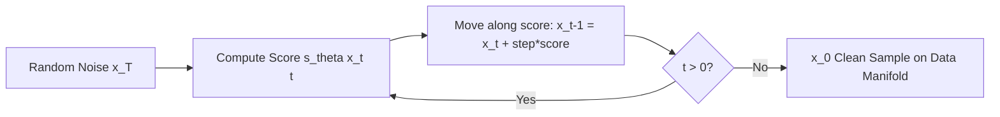

**Interview Q&A:**

*Q: DDPM aur score-based models me kya difference hai practically?*

A: Practically koi badi difference nahi — yeh same coin ke do sides hain. Tweedie's formula se score aur noise direct relate karte hain: score = -noise / sqrt(1 - alpha_bar_t). Same network architecture (U-Net), same training data, parameterization different. Theoretically score-based formulation cleaner hai because SDE/ODE framework deta hai. Practically log noise prediction (epsilon-prediction) ya v-prediction zyada use karte hain because scaling stable hoti hai. Modern frameworks like Karras EDM unified theory de chuke hain dono ka.

*Q: Probability flow ODE kya hai aur kab use karte hain?*

A: Probability flow ODE deterministic counterpart hai reverse SDE ka — same marginal distributions deta hai but stochasticity nahi hoti. Iska use case do hain — ek to exact likelihood compute kar sakte ho (NLL evaluation ke liye), aur dusra inversion possible hai (image se latent code recover karna for editing). Stable Diffusion me image-to-image, inpainting, prompt-to-prompt editing — sab probability flow ODE inversion pe based hai. DDIM bhi essentially probability flow ODE solver hi hai discrete time me.

### 1.4 Classifier-free guidance

**Definition:** Classifier-free guidance (CFG) ek technique hai jo conditional generation ko strong banati hai. Model ko dono modes me train karte hain — conditional (with prompt) aur unconditional (empty prompt). Inference time pe predicted noise ko interpolate karte hain conditional aur unconditional ke beech, jiska guidance scale w control karta hai.

**Why:** Pehle classifier guidance use hota tha — separate classifier train karke uska gradient use karte the steering ke liye. Yeh expensive aur unstable tha. CFG ne yeh problem solve ki — koi separate classifier nahi chahiye, same diffusion model dono kaam karta hai. Today saare text-to-image models (SD, FLUX, DALL-E) CFG use karte hain. Higher CFG = more prompt adherence, but artifacts bhi badh sakte hain.

**How:**

```python
from diffusers import StableDiffusionPipeline
import torch

pipe = StableDiffusionPipeline.from_pretrained(
    "runwayml/stable-diffusion-v1-5",
    torch_dtype=torch.float16
).to("cuda")

# Manual CFG implementation (pipeline internally yahi karta hai)
def cfg_sample(prompt, guidance_scale=7.5, num_steps=50):
    # Encode dono prompts — conditional aur unconditional
    text_emb = pipe.text_encoder(pipe.tokenizer(prompt))[0]
    uncond_emb = pipe.text_encoder(pipe.tokenizer(""))[0]  # empty prompt
    
    # Concat for batch processing — efficient
    combined_emb = torch.cat([uncond_emb, text_emb])
    
    latents = torch.randn(1, 4, 64, 64).to("cuda")
    pipe.scheduler.set_timesteps(num_steps)
    
    for t in pipe.scheduler.timesteps:
        # Same latent ko duplicate karke dono branches me bhejte hain
        latent_input = torch.cat([latents] * 2)
        
        # U-Net forward pass — output 2 noise predictions
        with torch.no_grad():
            noise_pred = pipe.unet(latent_input, t, combined_emb).sample
        
        # Split: pehla unconditional, dusra conditional
        noise_uncond, noise_cond = noise_pred.chunk(2)
        
        # CFG formula — yahi core hai
        # eps = eps_uncond + w * (eps_cond - eps_uncond)
        # w=1 means standard conditional, w>1 amplifies prompt direction
        noise_pred = noise_uncond + guidance_scale * (noise_cond - noise_uncond)
        
        latents = pipe.scheduler.step(noise_pred, t, latents).prev_sample
    
    return pipe.vae.decode(latents / 0.18215).sample

# Common values: guidance_scale=7.5 for SD, 3.5 for FLUX, 5-7 for SDXL
```

**Real-life Example:** Soch tu artist ko brief de raha hai painting ke liye. Guidance scale=1 means "thoda sa hint dunga, baaki tu apni creativity laga". Guidance scale=15 means "bilkul exact yehi banao, kuch deviation nahi". Pehle wala creative diverse output deta hai but prompt se hat sakta hai. Doosra prompt strictly follow karta hai but oversaturated, artifacted images banata hai. Sweet spot 6-8 ke beech hota hai — enough freedom but enough adherence.

**Mermaid Diagram:**

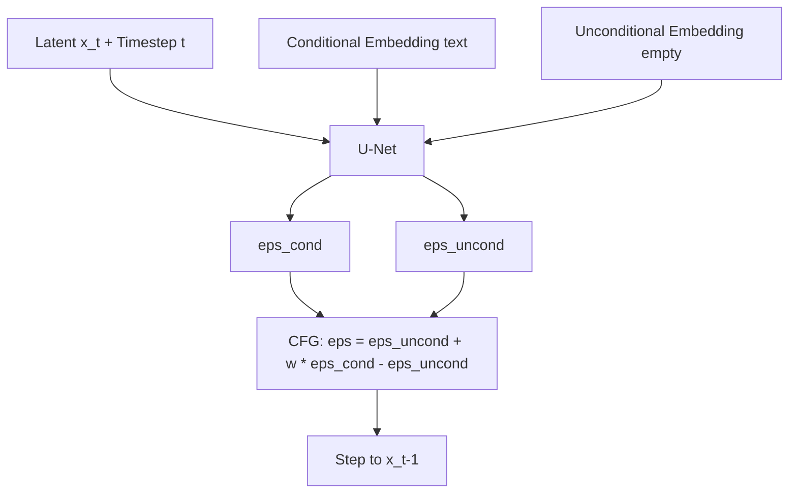

**Interview Q&A:**

*Q: CFG training me kya special karte ho?*

A: Training me condition dropout karte hain — random 10-20% iterations me text embedding ko drop kar dete hain (replace with empty/null embedding). Yeh model ko dono modes me capable banata hai — conditional aur unconditional. Bina iss dropout ke model unconditional generation nahi kar payega. Jonathan Ho ka original CFG paper (2022) ne yeh trick introduce ki. Important — dropout rate bahut zyada (50%+) karoge to conditional quality drop hogi, kam (5%) karoge to unconditional generation kharab hogi. 10% sweet spot hai zyadatar models me.

*Q: CFG ki tradeoffs kya hain aur recent improvements?*

A: High CFG (>10) se oversaturation, blown highlights, aur "burnt" look aata hai — prompt strictly follow hota hai but realism gayab. Low CFG (1-3) se diverse but prompt-divergent images. Recent improvements me rescaled CFG (Lin et al. 2024) jo std deviation ko clip karta hai over-saturation rokne ke liye, aur dynamic CFG (Karras EDM2) jo timestep ke saath w vary karta hai. FLUX me "guidance distillation" use kiya gaya hai — model directly w-conditioned ho gaya hai, isliye sirf ek forward pass chahiye, double nahi. Yeh 2x speedup hai inference me.

### 1.5 Latent diffusion (Stable Diffusion architecture)

**Definition:** Latent Diffusion Models (LDM) — Rombach et al. 2022 — diffusion process ko pixel space me karne ke bajaye compressed latent space me karte hain. Pehle ek VAE train karte hain jo 512x512x3 image ko 64x64x4 latent me compress kare. Fir us latent space me diffusion model train hota hai. Generation time pe latent se sample karke VAE decoder se image banate hain.

**Why:** Pixel-space diffusion (jaise original DDPM) bahut compute heavy hota hai — 256x256 image pe bhi training mahaengi. 512x512 ya 1024x1024 to bhul ja. LDM ne 8x spatial compression diya (64x compute saving). Stable Diffusion isi architecture pe based hai. SDXL, SD3 sab LDM family. Ek 80GB A100 pe SD ko fine-tune kar sakte ho — DALL-E 2 ke liye thousands of TPUs lagti thi.

**How:**

```python
from diffusers import AutoencoderKL, UNet2DConditionModel, DDIMScheduler
from transformers import CLIPTextModel, CLIPTokenizer
import torch

# 3 components LDM ke
# 1. VAE — image <-> latent encoder/decoder
vae = AutoencoderKL.from_pretrained("stabilityai/sd-vae-ft-mse")
# 2. U-Net — denoising in latent space (with cross-attention to text)
unet = UNet2DConditionModel.from_pretrained("runwayml/stable-diffusion-v1-5", subfolder="unet")
# 3. Text encoder — CLIP for prompt embedding
tokenizer = CLIPTokenizer.from_pretrained("openai/clip-vit-large-patch14")
text_encoder = CLIPTextModel.from_pretrained("openai/clip-vit-large-patch14")

# Training step
def training_step(image, prompt):
    # Step 1: encode image to latent (VAE encoder)
    # 512x512x3 image -> 64x64x4 latent (8x compression spatially)
    with torch.no_grad():
        latent = vae.encode(image).latent_dist.sample() * 0.18215  # scaling factor
    
    # Step 2: encode text
    tokens = tokenizer(prompt, padding="max_length", return_tensors="pt")
    text_emb = text_encoder(tokens.input_ids)[0]  # (1, 77, 768)
    
    # Step 3: sample timestep aur noise add karo latent me
    t = torch.randint(0, 1000, (1,))
    noise = torch.randn_like(latent)
    noisy_latent = scheduler.add_noise(latent, noise, t)
    
    # Step 4: U-Net predict noise — text emb cross-attention se inject hota hai
    # Cross-attention layers me Q=latent_features, K=V=text_emb
    noise_pred = unet(noisy_latent, t, encoder_hidden_states=text_emb).sample
    
    # Step 5: MSE loss
    loss = torch.nn.functional.mse_loss(noise_pred, noise)
    return loss

# Inference: pure noise (64x64x4) -> denoise -> VAE decode -> 512x512 image
```

**Real-life Example:** Soch tu video editing kar raha hai. Pixel space me edit karna jaise raw 4K footage me directly cuts lagana — bahut heavy, har frame full resolution me process. Latent space jaise pehle proxy/preview banao low resolution me, edits karo, fir final render full resolution me. Same idea LDM me — costly operations (diffusion denoising) compressed space me hote hain, expensive decode sirf ek baar end me.

**Mermaid Diagram:**

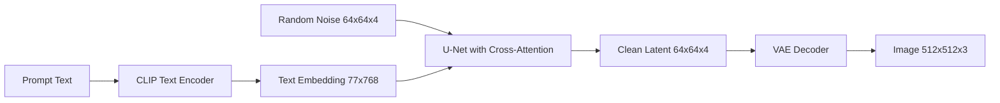

**Interview Q&A:**

*Q: VAE kyun pehle se train karte ho, end-to-end kyun nahi?*

A: VAE ko pehle train karte hain image reconstruction ke liye — perceptual loss + KL regularization + adversarial loss combo. Yeh general-purpose perceptual compressor banta hai. Fir VAE freeze karke uske latent space me diffusion train hota hai. End-to-end training me do problem hain — pehle, gradient flow VAE through diffusion bahut unstable ho jata hai, aur dusra, modular design se tu different diffusion models same VAE ke saath swap kar sakte ho. SD 1.5, 2.0, custom fine-tunes — sab same VAE share karte hain. SDXL ne better VAE introduce kiya higher fidelity ke liye but principle same.

*Q: Cross-attention kaise text ko inject karta hai diffusion me?*

A: U-Net ke har resolution block me cross-attention layer hota hai. Latent feature map se Query (Q) banti hai, text embedding se Key (K) aur Value (V) — yeh standard transformer cross-attention hai. Math: Attention(Q,K,V) = softmax(QK^T/sqrt(d))V. Yeh allow karta hai latent ke har spatial location ko relevant text tokens dekhne ka. Isliye agar prompt me "red car on left, blue sky" hai to model spatial layout sahi banata hai. SDXL me dual text encoders (CLIP-L + OpenCLIP-G) hain better text understanding ke liye, aur SD3 ne MM-DiT (Multimodal Diffusion Transformer) introduce kiya jo text aur image tokens ko jointly process karta hai self-attention me.

### 1.6 Flow matching, rectified flow (SD3, FLUX)

**Definition:** Flow matching ek alternative training paradigm hai diffusion ke jo continuous normalizing flows ki tradition se aaya. Idea — instead of learning noise prediction at each step, learn velocity field v(x,t) jo straight line follow kare data se noise tak. Rectified flow specifically straight paths optimize karta hai. SD3 (Stability AI) aur FLUX (Black Forest Labs) dono iska use karte hain.

**Why:** Traditional diffusion ka path curved hota hai noise se data tak — isliye 50+ steps lagte hain. Rectified flow straight path force karta hai — theoretically 1 step me bhi sample kar sakte ho (in practice 4-25 steps). Yeh training simpler hai, faster convergence, aur better scalability. FLUX 12B parameter model isi paradigm pe based hai aur SOTA quality deta hai.

**How:**

```python
from diffusers import FluxPipeline, StableDiffusion3Pipeline
import torch

# FLUX usage
pipe = FluxPipeline.from_pretrained(
    "black-forest-labs/FLUX.1-dev",
    torch_dtype=torch.bfloat16
).to("cuda")

# Flow matching training objective (conceptual)
def flow_matching_loss(x_0, model):
    # Sample t uniformly
    t = torch.rand(1)
    # Sample noise
    x_1 = torch.randn_like(x_0)  # noise (terminal distribution)
    
    # Linear interpolation — yahi rectified flow ka core
    # x_t = (1-t) * x_0 + t * x_1
    x_t = (1 - t) * x_0 + t * x_1
    
    # Target velocity — straight line ki direction
    # dx/dt = x_1 - x_0
    target_velocity = x_1 - x_0
    
    # Model predicts velocity v_theta(x_t, t)
    pred_velocity = model(x_t, t)
    
    # MSE loss on velocity
    loss = torch.nn.functional.mse_loss(pred_velocity, target_velocity)
    return loss

# Sampling — Euler ODE solver
def flow_sample(model, num_steps=25):
    x = torch.randn(1, 16, 128, 128)  # FLUX uses 16-channel latents
    dt = 1.0 / num_steps
    for i in range(num_steps):
        t = 1.0 - i * dt
        # Predict velocity, step backwards in time
        v = model(x, t)
        x = x - v * dt  # straight line means simple Euler is enough
    return x

# FLUX inference — 4 steps schnell, 25 steps dev
image = pipe(
    "A cinematic shot of a samurai in cherry blossom garden",
    num_inference_steps=25,
    guidance_scale=3.5,  # FLUX needs lower CFG than SD
    height=1024,
    width=1024
).images[0]
```

**Real-life Example:** Soch noise se data tak ka safar. Diffusion (DDPM) jaise tu mountain road pe drive kar raha hai — bahut curves, har turn pe steering adjust karna padta hai (isliye 1000 steps). Rectified flow jaise highway bana di — straight, smooth, 100 km/h pe nikal jao (4-25 steps kaafi). FLUX ne is highway ko aur smooth banaya — isliye production quality 4 steps me mil jati hai (FLUX schnell variant).

**Mermaid Diagram:**

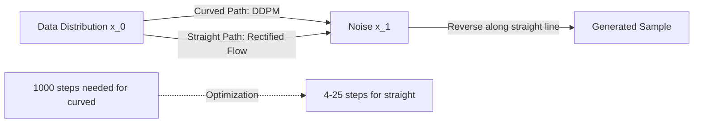

**Interview Q&A:**

*Q: Flow matching aur diffusion me theoretical relationship kya hai?*

A: Flow matching aur diffusion equivalent hain mathematically — dono continuous-time generative models hain. Diffusion stochastic SDE solve karta hai, flow matching deterministic ODE. Lipman et al. 2023 ne dikhaya ki any diffusion process ko equivalent flow matching objective me convert kar sakte hain. Practical difference training me hai — flow matching me velocity prediction simpler aur more numerically stable hai because variance schedules ka jhamela nahi. Rectified flow extra step me path ko literally straight banata hai — first iteration train karo, fir generated samples pe dobara train karo with straight target paths. SD3 paper me Esser et al. ne dikhaya ki yeh significantly better convergence deta hai diffusion se.

*Q: FLUX schnell 4 steps me kaise high quality deta hai?*

A: FLUX schnell distilled model hai. Pehle full FLUX (dev variant) ko train kiya jaata hai with rectified flow objective — 25-50 steps tak high quality. Fir step distillation karte hain — student model ko train karte hain ki teacher ke 25 steps ka output 4 steps me reproduce kare. Adversarial diffusion distillation (ADD) bhi use hota hai jo discriminator add karta hai — yeh perceptual quality preserve karta hai low step count pe. Result — schnell 4 steps me usable image deta hai, dev 25 steps me peak quality. Production me schnell costless drafts ke liye, dev final renders ke liye.

## 2. Practical Image Generation

### 2.1 Stable Diffusion / SDXL / FLUX usage

**Definition:** Stable Diffusion (SD), SDXL, aur FLUX teen alag generations ke open-source text-to-image models hain. SD 1.5 (2022) — 860M params, 512x512 native. SDXL (2023) — 3.5B params, 1024x1024 native, dual text encoder. FLUX (2024) — 12B params, rectified flow, SOTA quality. Sab diffusers library se accessible.

**Why:** Different use cases different model fit karte hain. SD 1.5 lightweight, super fast, runs on 6GB GPU, huge LoRA ecosystem. SDXL better quality, but 12GB+ VRAM chahiye. FLUX best quality but 24GB+ VRAM chahiye full precision me. Production me cost vs quality tradeoff dekhna padta hai.

**How:**

```python
from diffusers import StableDiffusionPipeline, StableDiffusionXLPipeline, FluxPipeline
import torch

# SD 1.5 — chhota tez
sd15 = StableDiffusionPipeline.from_pretrained(
    "runwayml/stable-diffusion-v1-5",
    torch_dtype=torch.float16,
    safety_checker=None  # production me carefully use karo
).to("cuda")
img1 = sd15("a cat astronaut on mars", num_inference_steps=25, guidance_scale=7.5).images[0]

# SDXL — quality jump, 1024x1024 native
sdxl = StableDiffusionXLPipeline.from_pretrained(
    "stabilityai/stable-diffusion-xl-base-1.0",
    torch_dtype=torch.float16,
    variant="fp16"
).to("cuda")
# SDXL me dual prompt — main aur 2nd prompt
img2 = sdxl(
    prompt="a cinematic shot of a cyberpunk samurai",
    prompt_2="masterpiece, ultra detailed",  # 2nd CLIP encoder ke liye
    num_inference_steps=30,
    guidance_scale=7.0,
    height=1024, width=1024
).images[0]

# FLUX — SOTA, but heavy
flux = FluxPipeline.from_pretrained(
    "black-forest-labs/FLUX.1-dev",
    torch_dtype=torch.bfloat16  # bf16 better for FLUX than fp16
).to("cuda")
img3 = flux(
    "A photo of a fluffy red panda eating bamboo, photorealistic",
    num_inference_steps=25,
    guidance_scale=3.5,  # FLUX likes lower CFG
    max_sequence_length=512  # T5 encoder tokens
).images[0]

# Memory optimization tips
flux.enable_model_cpu_offload()  # GPU me sirf active block
flux.vae.enable_slicing()  # batch decode chunks me
flux.vae.enable_tiling()  # large image tiled decode
```

**Real-life Example:** Yeh teen models jaise camera lineup hai. SD 1.5 = phone camera, har jagah le ja sakte ho, instant shots. SDXL = mirrorless camera, balanced quality and portability. FLUX = full-frame DSLR, professional shoots ke liye but heavy aur expensive. Use case decide karta hai — Instagram filter banane ke liye SD 1.5 enough, marketing campaign ke liye FLUX use karoge.

**Mermaid Diagram:**

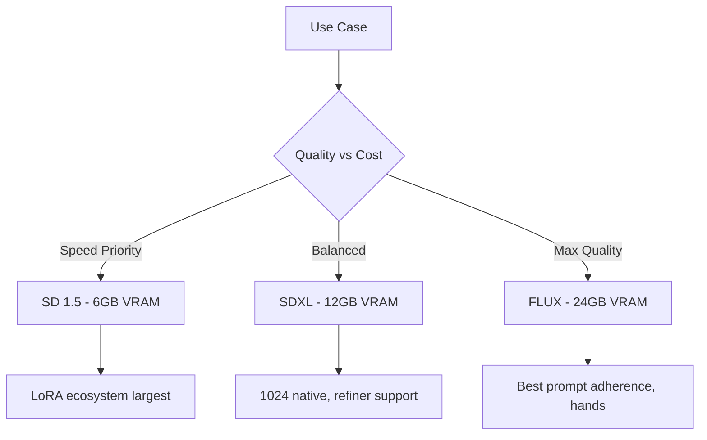

**Interview Q&A:**

*Q: SDXL ka refiner kya hota hai aur kab use karte ho?*

A: SDXL me do models hain — base aur refiner. Base full denoising karta hai noise se image tak. Refiner same architecture (smaller) jo base ke output ko pick karke last 20% denoising steps me detail enhance karta hai — texture, faces, hi-frequency stuff. Pipeline me tu base se start karta hai, denoising_end=0.8 set karta hai (80% steps tak base), fir output refiner ko bhejta hai jo last 20% complete karta hai. Quality slight better hoti hai but compute 1.5x. FLUX me ek hi unified model hai — refiner ki zarurat nahi. Production me main usually refiner skip kar deta hu unless final hero shots banane ho.

*Q: Production deployment me SD vs FLUX trade-off kaise dekhte ho?*

A: Latency, throughput, cost — teen factors. SD 1.5 ek A10 GPU pe 1-2 sec per image, FLUX dev ek A100 pe 8-10 sec. Cost difference 5-10x hai per image. Quality side pe FLUX clearly better hai (text rendering, hands, complex prompts) but SD 1.5 stylized art ke liye sufficient hai with good LoRAs. Production me main tier system rakhta hu — free users ko SD 1.5, paid users ko SDXL, premium users ko FLUX. Caching, batch inference (multiple prompts ek hi forward pass me), aur quantization (int8/int4 with bitsandbytes) cost kam karte hain. ComfyUI sandbox pe yeh sab tooling already mature hai.

### 2.2 ControlNet, IP-Adapter

**Definition:** ControlNet (Zhang et al. 2023) ek extension hai diffusion models ka jo additional conditioning provide karta hai — pose, depth, edges, scribbles. IP-Adapter (image prompting adapter) image-based conditioning deta hai — reference image se style/content transfer. Dono base model ko freeze rakhke parallel adapter network train karte hain.

**Why:** Pure text prompts se exact composition control mushkil hai. "Person standing left, looking right" type instructions diffusion miss karta hai. ControlNet se OpenPose skeleton, depth map, ya Canny edges directly provide kar ke layout enforce kar sakte ho. IP-Adapter se "is image jaisa style banao" type tasks easy hote hain. Together — image-to-image production workflows ka backbone.

**How:**

```python
from diffusers import StableDiffusionControlNetPipeline, ControlNetModel
from diffusers.utils import load_image
from controlnet_aux import OpenposeDetector, CannyDetector
import torch

# ControlNet pipeline setup
controlnet = ControlNetModel.from_pretrained(
    "lllyasviel/control_v11p_sd15_openpose",  # pose-conditioned
    torch_dtype=torch.float16
)
pipe = StableDiffusionControlNetPipeline.from_pretrained(
    "runwayml/stable-diffusion-v1-5",
    controlnet=controlnet,
    torch_dtype=torch.float16
).to("cuda")

# Step 1: source image se pose extract karo
source_img = load_image("source_pose.jpg")
openpose = OpenposeDetector.from_pretrained("lllyasviel/Annotators")
pose_map = openpose(source_img)  # skeleton image

# Step 2: pose ke saath generate karo
result = pipe(
    prompt="A samurai warrior in cherry blossom garden, cinematic",
    image=pose_map,  # control input
    num_inference_steps=30,
    guidance_scale=7.5,
    controlnet_conditioning_scale=1.0  # 0 means no control, 1 strict
).images[0]

# IP-Adapter — image as style reference
from diffusers import StableDiffusionPipeline
pipe2 = StableDiffusionPipeline.from_pretrained("runwayml/stable-diffusion-v1-5", torch_dtype=torch.float16).to("cuda")
pipe2.load_ip_adapter("h94/IP-Adapter", subfolder="models", weight_name="ip-adapter_sd15.bin")
pipe2.set_ip_adapter_scale(0.6)  # how much reference image influences

ref_image = load_image("style_reference.jpg")
result2 = pipe2(
    prompt="a portrait of a woman",
    ip_adapter_image=ref_image,  # style reference
    num_inference_steps=30
).images[0]

# ControlNet architecture insight
# - Base U-Net frozen
# - Trainable copy of encoder blocks made
# - Zero conv layers connect — initialized to zero so training stable start
# - Conditioning fed through trainable copy, summed into base U-Net at decoder
```

**Real-life Example:** Soch tu film director hai. Plain text prompt "two people fighting" jaise tu actor ko bol raha hai bina script ke. ControlNet jaise tu storyboard de raha hai — exact pose, camera angle, composition. IP-Adapter jaise tu mood-board de raha hai — "is reference image jaisa style chahiye". Production fashion shoot ho ya advertisement, exact composition aur consistent style chahiye — pure text se nahi milta, control adapters chahiye.

**Mermaid Diagram:**

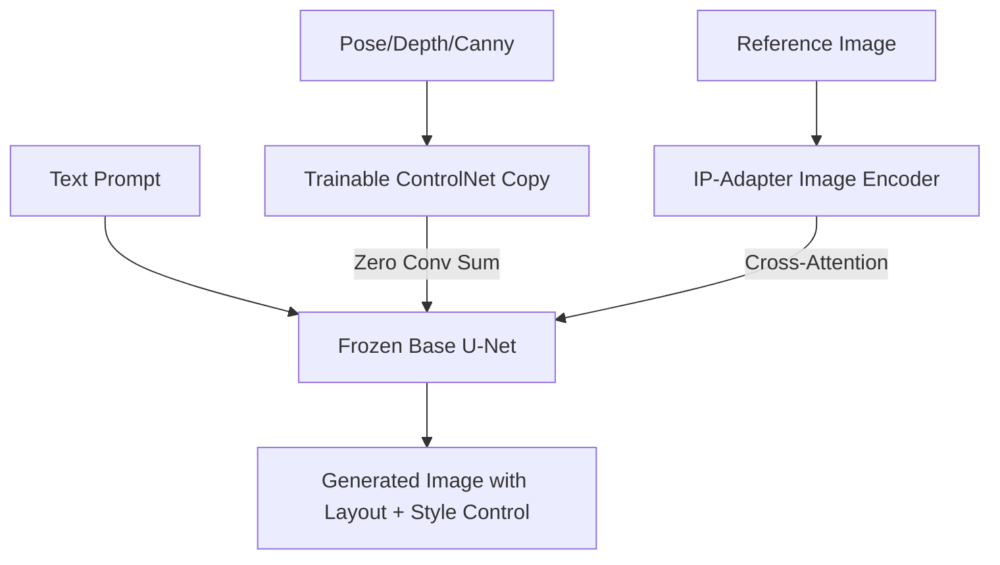

**Interview Q&A:**

*Q: ControlNet zero convolution kya hai aur kyun?*

A: ControlNet me trainable copy ke output ko zero-initialized 1x1 convolutions se base U-Net me inject karte hain. Zero init ka matlab — training start me ControlNet ka contribution literally zero hai, so base model ka behavior unchanged rehta hai. Training jaise progress karti hai, weights gradually grow karte hain aur control influence karta hai. Yeh stable training ensure karta hai — agar random init karte to base model ki quality immediately tank ho jati. Zhang et al. ka yeh trick critical insight tha ControlNet ko trainable banane me without breaking base.

*Q: IP-Adapter aur textual inversion me difference kya hai?*

A: Textual inversion ek specific concept ko learnable text token me encode karta hai — training required, hours lagte hain. IP-Adapter generic image encoder hai jo runtime me kisi bhi reference image ka embedding deta hai — no training, instant. Internally IP-Adapter me CLIP image encoder hai jo image se 16-32 tokens ka embedding banata hai, fir cross-attention me text tokens ke saath concat hota hai. Use case different hain — specific character/object recurring use ke liye textual inversion ya LoRA, one-off style transfer ke liye IP-Adapter. SDXL ke liye IP-Adapter Plus variant face preservation me bahut accha kaam karta hai.

### 2.3 LoRA training for diffusion

**Definition:** LoRA (Low-Rank Adaptation) — Hu et al. 2021 — efficient fine-tuning technique hai jisme original weights freeze rakhke chote rank-decomposed update matrices train karte hain: W' = W + BA where rank(BA) << rank(W). Diffusion me LoRA usually U-Net ke attention layers me apply karte hain — 1-10MB ka file train hota hai vs full model 5GB+.

**Why:** Full fine-tuning of diffusion model expensive (multi-GPU, hours/days, GBs storage per checkpoint). LoRA training ek consumer GPU pe 30 min me ho jati hai — RTX 3090 enough. Storage cost minimal — ek style/character ke liye 5MB ka LoRA. Multiple LoRAs combine kar sakte ho runtime me — different styles/characters mix.

**How:**

```python
from diffusers import StableDiffusionPipeline, DDPMScheduler
from peft import LoraConfig, get_peft_model
import torch
from torch.utils.data import DataLoader

# Setup base pipeline
pipe = StableDiffusionPipeline.from_pretrained("runwayml/stable-diffusion-v1-5")

# LoRA config — rank decide karta hai capacity vs size
lora_config = LoraConfig(
    r=16,                    # rank — 4 to 128, higher = more capacity
    lora_alpha=32,           # scaling factor, usually 2*r
    target_modules=["to_q", "to_k", "to_v", "to_out.0"],  # attention layers
    lora_dropout=0.0,
)

# Apply LoRA to U-Net
unet_with_lora = get_peft_model(pipe.unet, lora_config)
print(f"Trainable params: {sum(p.numel() for p in unet_with_lora.parameters() if p.requires_grad):,}")
# ~0.5M trainable vs 860M total — 0.06%

# Training loop (simplified)
optimizer = torch.optim.AdamW(unet_with_lora.parameters(), lr=1e-4)
scheduler = DDPMScheduler(num_train_timesteps=1000)

for epoch in range(10):
    for batch in dataloader:
        images, prompts = batch["image"], batch["prompt"]
        
        # Encode image to latent
        with torch.no_grad():
            latents = pipe.vae.encode(images).latent_dist.sample() * 0.18215
            text_emb = pipe.text_encoder(pipe.tokenizer(prompts, return_tensors="pt").input_ids)[0]
        
        # Forward diffusion
        noise = torch.randn_like(latents)
        t = torch.randint(0, 1000, (latents.shape[0],))
        noisy = scheduler.add_noise(latents, noise, t)
        
        # Predict noise — only LoRA weights update honge
        pred = unet_with_lora(noisy, t, encoder_hidden_states=text_emb).sample
        
        loss = torch.nn.functional.mse_loss(pred, noise)
        loss.backward()
        optimizer.step()
        optimizer.zero_grad()

# Save LoRA — only delta weights, ~10MB
unet_with_lora.save_pretrained("./my_style_lora")

# Inference with LoRA
pipe.load_lora_weights("./my_style_lora")
pipe.set_adapters(["default"], adapter_weights=[0.8])  # strength 0.8
img = pipe("a cat in <my_style>").images[0]

# LoRA math reminder
# Original: y = Wx + b
# LoRA: y = Wx + b + (BA)x where B is d_out x r, A is r x d_in
# Trainable params: r * (d_in + d_out) << d_in * d_out
```

**Real-life Example:** LoRA jaise photo editing me preset banana — Lightroom me ek bar adjustment karke save kar liya, fir kisi bhi photo pe apply kar sakte ho. Full fine-tuning jaise har baar manually har slider tweak karna. LoRA preset ek file me hai (10MB), share kar sakte ho friends ke saath, multiple presets stack kar sakte ho ek photo pe. Civitai pe lakhs LoRAs available hain — anime style, specific artist style, specific person ka face — sab plug-and-play.

**Mermaid Diagram:**

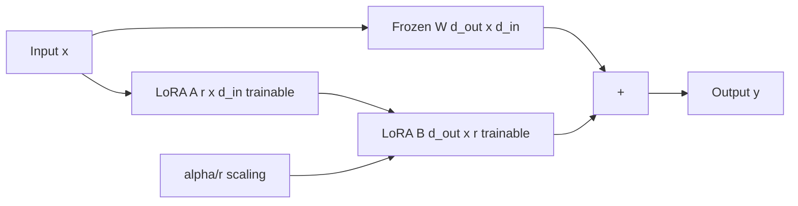

**Interview Q&A:**

*Q: LoRA rank kaise choose karte ho?*

A: Rank determines adapter capacity. Style transfer ke liye r=4-8 enough hota hai — chote dataset (10-50 images), simple variation. Character/face training ke liye r=16-32 — more identity details capture karne ho. Concept training (multi-object scene) ke liye r=64-128. Higher rank = better quality but bigger file aur overfitting risk. Practically main r=16 se start karta hu, dataset size aur output quality dekh ke adjust. SDXL me main usually r=32 use karta hu because model bigger hai. Alpha (scaling) usually 2*r rakhta hu — yeh effective learning rate control karta hai.

*Q: Multiple LoRAs combine karne me kya issues aate hain?*

A: Multiple LoRAs (e.g. character LoRA + style LoRA) combine karne me concept bleeding hota hai — character LoRA me bhi thoda style aur style LoRA me bhi thoda character lagta hai. Solution — adapter_weights tune karo (0.6 + 0.4 better than 1.0 + 1.0), aur regional prompting use karo (different LoRAs different image regions me). Recent technique Mix-of-Show ya Concept Sliders better composition allow karte hain. Production me main usually 2-3 LoRAs limit rakhta hu — 4+ se quality clearly degrade hoti hai. SDXL multiple LoRA handling SD 1.5 se better hai due to bigger model capacity.

### 2.4 ComfyUI, Diffusers library

**Definition:** Diffusers (Hugging Face) Python library hai diffusion models ke liye — programmatic API, training/inference, multiple model architectures support. ComfyUI node-based GUI hai diffusion workflows ke liye — visual graph banao, har node ek operation (VAE decode, KSampler, ControlNet) hai. Production me dono complementary — Diffusers backend, ComfyUI rapid prototyping/artist tooling.

**Why:** Diffusers code-first hai — best for production deployment, custom training, integration with ML pipelines. ComfyUI artist-friendly — non-programmers complex workflows bana sakte hain. Same models internally use hote hain — ComfyUI me jo workflow banao, Diffusers me port kar sakte ho.

**How:**

```python
# Diffusers — programmatic
from diffusers import StableDiffusionXLPipeline, DPMSolverMultistepScheduler
import torch

pipe = StableDiffusionXLPipeline.from_pretrained(
    "stabilityai/stable-diffusion-xl-base-1.0",
    torch_dtype=torch.float16
).to("cuda")

# Custom scheduler — DPM++ 2M Karras
pipe.scheduler = DPMSolverMultistepScheduler.from_config(
    pipe.scheduler.config,
    use_karras_sigmas=True,
    algorithm_type="dpmsolver++"
)

# Production-ready inference function
def generate(prompt, negative_prompt="", seed=None, steps=30, cfg=7.0):
    generator = torch.Generator("cuda").manual_seed(seed) if seed else None
    return pipe(
        prompt=prompt,
        negative_prompt=negative_prompt,
        num_inference_steps=steps,
        guidance_scale=cfg,
        generator=generator,
        height=1024, width=1024
    ).images[0]

# Batch processing for production
prompts = ["cat", "dog", "bird"] * 10
images = pipe(prompts, num_images_per_prompt=1).images
```

```text
# ComfyUI — equivalent workflow as JSON nodes (conceptual)
# 1. Load Checkpoint Node — model load
# 2. CLIP Text Encode (Positive) — prompt embedding
# 3. CLIP Text Encode (Negative) — negative prompt
# 4. Empty Latent Image — noise init
# 5. KSampler — model + positive + negative + latent + scheduler choice
# 6. VAE Decode — latent to image
# 7. Save Image — output to disk
# 
# Connect karo nodes ko UI me — zero code, 30 sec setup
```

```python
# Production tip — ComfyUI ka workflow JSON Diffusers me convert karo
import json
workflow = json.load(open("comfyui_workflow.json"))
# Parse nodes — extract model, prompt, sampler params
# Map to diffusers pipeline calls
# Now scriptable, batch-able, deployable as API

# FastAPI wrapper for production
from fastapi import FastAPI
app = FastAPI()

@app.post("/generate")
async def gen_endpoint(prompt: str, seed: int = 42):
    img = generate(prompt, seed=seed)
    # Save to S3, return URL
    return {"url": save_to_s3(img)}
```

**Real-life Example:** Diffusers vs ComfyUI jaise Photoshop scripting (JavaScript) vs Photoshop GUI. Designer GUI me work karega — drag drop, slider, real-time preview. Developer scripts likhega for batch processing 10000 images. Same kaam, alag interface. ComfyUI artists ke liye — workflow share karte hain JSON files me, "yeh workflow use karo character consistency ke liye". Diffusers backend developers ke liye — REST API banao, production deploy karo.

**Mermaid Diagram:**

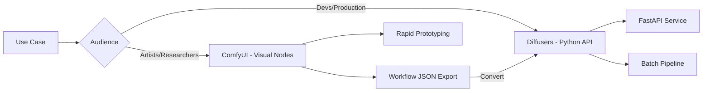

**Interview Q&A:**

*Q: Production deployment ke liye ComfyUI use karoge ya Diffusers?*

A: Production me Diffusers preferred hai — pure Python, easy to dockerize, async-friendly, integrates with FastAPI/Triton/vLLM. ComfyUI heavyweight Electron app hai with WebSocket server — production scale pe overhead aur stability issues. But ComfyUI prototype phase me invaluable hai — artists workflow design karte hain, fir engineers Diffusers code me port karte hain. Companies like Stability AI internally yahi flow follow karti hain. ComfyUI ka API mode (--listen flag) chhote scale pe deploy ho sakta hai but mature production ke liye Diffusers + custom orchestration better.

*Q: Diffusers library me memory optimization techniques kaunse hain?*

A: Several layers hain. Pehle, model.enable_model_cpu_offload() — sirf currently active block GPU me, baki CPU me. Yeh 24GB model 8GB GPU pe chala deta hai, but slower. Dusra, attention slicing aur xformers — attention computation chunks me, 50% memory reduce. Teesra, VAE tiling for large images — VAE encode/decode tiled fashion me. Chautha, fp16/bf16 precision — half memory. Aur extreme cases me bitsandbytes int8 quantization — 4x reduction with minor quality loss. Production me main usually fp16 + xformers + cpu_offload combo use karta hu — 80% throughput at 25% memory.

### 2.5 Prompt engineering for images

**Definition:** Prompt engineering image generation ke liye — natural language descriptions ko diffusion model ke liye effective format me craft karna. Includes positive prompts (kya chahiye), negative prompts (kya nahi chahiye), weighting syntax, style modifiers, technical photography terms, aur model-specific tricks.

**Why:** Same model, same seed — different prompt structure se drastically different quality. "a dog" vs "professional studio photograph of a golden retriever, soft natural lighting, 85mm lens, shallow depth of field, ultra detailed" — second prompt 10x better output. Prompt engineering production me skill hai jo cost (less retries) aur quality directly impact karti hai.

**How:**

```python
from diffusers import StableDiffusionXLPipeline
from compel import Compel, ReturnedEmbeddingsType
import torch

pipe = StableDiffusionXLPipeline.from_pretrained(
    "stabilityai/stable-diffusion-xl-base-1.0",
    torch_dtype=torch.float16
).to("cuda")

# Prompt structure framework — main yeh use karta hu
def build_prompt(subject, style, lighting, camera, quality):
    return f"{quality}, {style}, {subject}, {lighting}, {camera}"

prompt = build_prompt(
    subject="a samurai warrior holding a katana",
    style="cinematic, anime style, by Studio Ghibli",
    lighting="dramatic rim lighting, golden hour",
    camera="35mm film, shallow depth of field, bokeh",
    quality="masterpiece, best quality, ultra detailed, 8k"
)

# Negative prompt — common artifacts ko avoid karne ke liye
negative = "blurry, low quality, deformed, ugly, bad anatomy, extra fingers, watermark, signature, jpeg artifacts"

# Compel for advanced prompt weighting
compel = Compel(
    tokenizer=[pipe.tokenizer, pipe.tokenizer_2],
    text_encoder=[pipe.text_encoder, pipe.text_encoder_2],
    returned_embeddings_type=ReturnedEmbeddingsType.PENULTIMATE_HIDDEN_STATES_NON_NORMALIZED,
    requires_pooled=[False, True]
)

# Weighted prompt syntax — (term)1.3 = 1.3x emphasis
weighted_prompt = "(samurai warrior)1.3, cinematic, (katana)0.8, mountain background"
conditioning, pooled = compel(weighted_prompt)

img = pipe(
    prompt_embeds=conditioning,
    pooled_prompt_embeds=pooled,
    negative_prompt=negative,
    num_inference_steps=30,
    guidance_scale=7.0
).images[0]

# Model-specific tricks
# SD 1.5 — keyword stacking (anime, masterpiece, best quality)
# SDXL — natural language better, dual prompts (prompt_2 for technical)
# FLUX — full sentences, T5 understands long prompts (512 tokens)

flux_prompt = """A cinematic photograph of a samurai warrior standing on a 
cherry blossom covered hill at sunset. He is wearing traditional armor with 
intricate gold details. The composition uses the rule of thirds with him 
positioned on the left, creating negative space on the right showing distant 
mountains. Shot on Kodak Portra 400 film with shallow depth of field."""
# FLUX is amazing with this kind of detailed natural language
```

**Real-life Example:** Prompt engineering jaise Google search query banana. "shoes" vs "men's running shoes nike size 10 under 5000 rupees" — second query specific result deta hai. Image generation me bhi same — vague prompts vague results, specific prompts (with style references, technical terms, composition cues) production-quality results. Photographers ke vocabulary (85mm, golden hour, bokeh) seekhna padta hai because models ne photography books pe train kiya hai.

**Mermaid Diagram:**

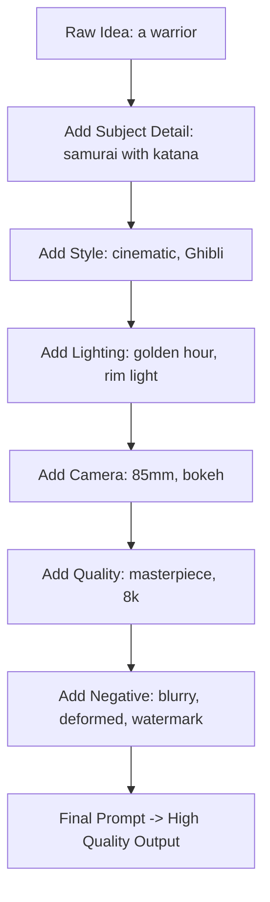

**Interview Q&A:**

*Q: Negative prompts kyun important hain aur kaise design karte ho?*

A: Negative prompts un attributes ko explicitly suppress karte hain jo model accidentally generate karta hai — common artifacts jaise "extra fingers", "deformed face", "watermark", "low quality". Yeh CFG ke unconditional branch ko replace karte hain — instead of empty string, "things to avoid" ki direction me push karte hain. Math me — eps_negative replaces eps_uncond in CFG formula. Design karne me main 3 categories rakhta hu — quality (blurry, jpeg artifacts, low res), anatomy (extra fingers, deformed hands, mutated), aur unwanted styles (cartoon if want photo, photo if want cartoon). FLUX me negative prompts kam zaruri hain because base quality already high hai. SD 1.5 me critical — kabhi 30+ negative tokens use karta hu.

*Q: Long prompts vs short prompts — kab kya use karte ho?*

A: Depends on model. SD 1.5 ka CLIP encoder 77 tokens limit deta hai — keyword stuffing kaam karta hai but actual sentence comprehension limited. Compel/long-prompt-weighting libraries 77+ tokens allow karti hain by chunking. SDXL me bhi 77 limit but dual encoders better. FLUX me T5-XXL hai jo 512 tokens handle karta hai — full paragraphs naturally process karta hai. Practical rule — SD 1.5 me 30-50 keyword tokens, SDXL me 50-75 mix of keywords + natural, FLUX me detailed paragraphs with composition + lighting + camera details. FLUX ke saath maine 200-token prompts use kiye hain with great results — text rendering, complex scenes, multiple subjects sab handle ho jata hai.

## Resources & further reading

- **DDPM**: Ho et al. "Denoising Diffusion Probabilistic Models" (2020) — original diffusion paper
- **DDIM**: Song et al. "Denoising Diffusion Implicit Models" (2021) — fast sampling
- **Score SDE**: Song et al. "Score-Based Generative Modeling through Stochastic Differential Equations" (2021)
- **Latent Diffusion**: Rombach et al. "High-Resolution Image Synthesis with Latent Diffusion Models" (2022) — Stable Diffusion paper
- **Classifier-Free Guidance**: Ho & Salimans "Classifier-Free Diffusion Guidance" (2022)
- **Flow Matching**: Lipman et al. "Flow Matching for Generative Modeling" (2023)
- **Rectified Flow**: Liu et al. "Flow Straight and Fast: Learning to Generate and Transfer Data with Rectified Flow" (2023)
- **SD3**: Esser et al. "Scaling Rectified Flow Transformers for High-Resolution Image Synthesis" (2024)
- **FLUX**: Black Forest Labs technical reports
- **ControlNet**: Zhang et al. "Adding Conditional Control to Text-to-Image Diffusion Models" (2023)
- **IP-Adapter**: Ye et al. "IP-Adapter: Text Compatible Image Prompt Adapter" (2023)
- **LoRA**: Hu et al. "LoRA: Low-Rank Adaptation of Large Language Models" (2021)
- **Diffusers Library**: huggingface.co/docs/diffusers
- **ComfyUI**: github.com/comfyanonymous/ComfyUI
- **Civitai**: civitai.com — community LoRAs and models
