# Fine-Tuning & Model Customization

Dekh bhai, fine-tuning basically pre-trained LLM ko tumhare specific task pe expert banata hai. GPT-4, Llama-3, Mistral — ye sab models internet ke trillions tokens pe train hue hain, par tumhara use case alag hai. Tumhe medical reports summarize karwane hain, ya legal contracts pe Q&A, ya code-review bot banana hai apni codebase ke style pe. Generic model 70% kaam karega, par last 30% accuracy ke liye fine-tuning chahiye. Pehle full fine-tuning hi option tha — 7B model ka full FT karne ke liye 8x A100 (80GB) chahiye thi, $20k+ ka kharcha. Phir LoRA aaya aur 7B model ek RTX 4090 (24GB) pe train hone laga. Aaj QLoRA se to 70B model bhi single A100 pe ho jata hai.

Ye pura field 4 sals me explode hua. SFT (Supervised Fine-Tuning) base hai — instruction-response pairs deke model ko sikhate hain "aise reply karna hai". Phir preference optimization (DPO, IPO, ORPO) — yaha model ko batate hain "ye answer accha, ye bura — ratio samjho". Phir quantization (GPTQ, AWQ, GGUF) — trained model ko chhota karke laptop pe chala lo. Aur ek crazy trend — model merging — bina training ke do fine-tuned models ke weights mathematically combine karke teesra better model bana lo. Ye guide pura pipeline cover karega, jaisa senior dev intern ko samjhata hai — code, math, intuition, sab.

Important mental model: fine-tuning teaching style change karta hai, knowledge nahi badalta. Agar tu Llama-3 ko Hindi me train karega aur usne pre-training me Hindi nahi dekhi, to fine-tuning se thoda improve hoga par fundamentally weak rahega. Knowledge inject karne ke liye continued pre-training chahiye (raw text pe causal LM loss). Fine-tuning is for behavior, format, style, task-specific patterns. Ye distinction interview me poochte hain — yaad rakh.

---

## 1. Supervised Fine-Tuning (SFT)

### 1.1 Full fine-tuning vs parameter-efficient

**Definition:** Full fine-tuning matlab model ke saare parameters update karna — agar 7B model hai, to 7 billion weights ka gradient compute karke update. Parameter-efficient fine-tuning (PEFT) me sirf chhota subset (0.1-2% parameters) update karte hain, baaki frozen rakhte hain.

**Why:** Full FT mehnga hai. 7B model ke liye memory math: weights (FP16) = 14GB, gradients (FP16) = 14GB, Adam optimizer states (m, v in FP32) = 56GB, activations = 10-30GB depending on batch size. Total ~100GB+ — ek A100 80GB me bhi nahi fit hota. Plus catastrophic forgetting — model apna general capability bhool jata hai. PEFT me sirf adapter weights train hote hain, original model untouched — to "forgetting" minimal hai aur memory me 2-3GB extra chahiye bas.

**How:**
```python
# Full FT — saare params trainable
from transformers import AutoModelForCausalLM
model = AutoModelForCausalLM.from_pretrained("meta-llama/Llama-3-8B")
for p in model.parameters():
    p.requires_grad = True  # default already True
# Optimizer 56GB le lega — RIP single GPU

# PEFT — sirf LoRA adapter
from peft import LoraConfig, get_peft_model
config = LoraConfig(r=16, lora_alpha=32, target_modules=["q_proj", "v_proj"])
model = get_peft_model(model, config)
model.print_trainable_parameters()
# trainable: 4M / 8B (0.05%) — yahi PEFT ka jadu
```

**Real-life Example:** Tu ek startup me hai, customer support bot banana hai. Tumhare paas 5000 chat transcripts hain. Full FT karne pe AWS bill $3000/run aata hai aur har experiment 8 ghante. LoRA pe switch kiya — same dataset, $80/run, 1 ghanta. Quality almost same (BLEU score 0.42 vs 0.44). Sensible decision: LoRA.

**Mermaid Diagram:**
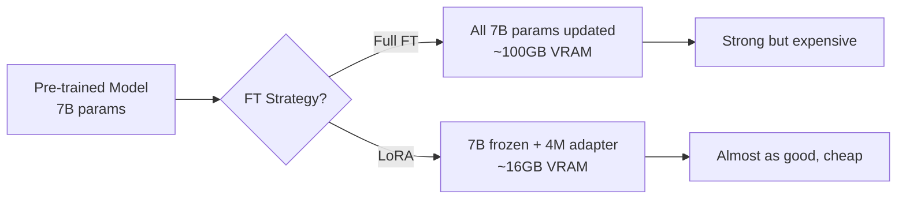

**Interview Q&A:** *"When would you actually do full fine-tuning over LoRA?"* — Honest answer: rarely. Full FT makes sense when (a) you have lots of data (100k+ examples) and want to deeply shift model behavior, (b) you're doing continued pre-training on a new domain (legal, medical) where vocabulary and patterns differ heavily, (c) you have compute budget and rank-bounded LoRA is plateauing. For most production use-cases, LoRA r=16 or r=32 matches full FT within 1-2% on benchmarks. Tülu 3 paper showed full FT slightly beats LoRA on math/reasoning tasks but ties on conversational quality.

*"What's catastrophic forgetting and how do you mitigate?"* — Jab tu narrow domain pe FT karta hai, model general capabilities bhool jata hai. Mitigation: (1) mix in 10-20% general instruction data (e.g. Tülu mix) with your domain data, (2) use LoRA — original weights frozen so general knowledge preserved, (3) lower learning rate (1e-5 instead of 1e-4), (4) early stopping on a held-out general benchmark like MMLU.

---

### 1.2 Instruction datasets — Alpaca, Dolly, OpenOrca, formatting

**Definition:** Instruction datasets are (instruction, input, output) triples used to teach a model how to follow human commands. Format mostly: `{"instruction": "Translate to French", "input": "Hello", "output": "Bonjour"}`.

**Why:** Pre-trained model is just a next-token predictor. It doesn't know that "Translate to French: Hello" should respond with "Bonjour" — it might continue with another translation example. Instruction tuning teaches the **format** of dialogue: when human asks, assistant answers. Alpaca (Stanford, 2023) was the first viral one — 52k examples generated using GPT-3. Dolly (Databricks) is human-written, 15k. OpenOrca (1M+) is GPT-4 reasoning chains on FLAN tasks. UltraChat, ShareGPT are conversational.

**How:**
```python
# Alpaca format
sample = {
    "instruction": "Summarize this article in 3 bullet points",
    "input": "OpenAI released GPT-4 today...",  # optional context
    "output": "- Bullet 1\n- Bullet 2\n- Bullet 3"
}

# Convert to prompt for training
def format_alpaca(sample):
    if sample["input"]:
        prompt = f"### Instruction:\n{sample['instruction']}\n\n### Input:\n{sample['input']}\n\n### Response:\n{sample['output']}"
    else:
        prompt = f"### Instruction:\n{sample['instruction']}\n\n### Response:\n{sample['output']}"
    return prompt

# IMPORTANT: loss only on response tokens, not instruction
# Else model sikhega instruction generate karna — bekaar
```

**Real-life Example:** Tumne 1000 customer queries collect kiye, agents ke responses bhi. Format me convert karna hai. Don't just dump raw chat — clean it: remove PII, fix typos, ensure responses are helpful and accurate. Garbage in → garbage out. 1000 high-quality samples > 50000 noisy samples — Lima paper proved this.

**Mermaid Diagram:**
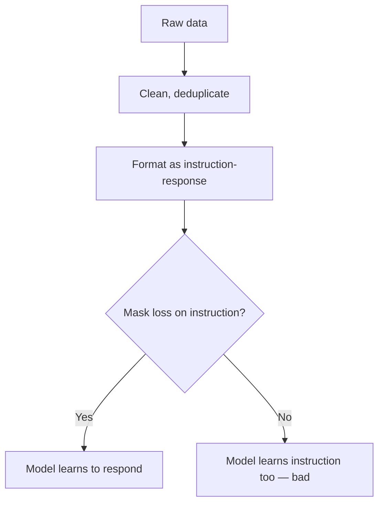

**Interview Q&A:** *"How much data do you need for SFT?"* — LIMA paper says 1000 high-quality examples can match 50k noisy ones. But realistically: 5k-10k for narrow task, 50k+ for broad assistant. Quality > quantity always. Filter aggressively — remove duplicates, low-quality outputs, refusals you don't want.

*"Should you mask the loss on the instruction tokens?"* — Yes, almost always. Compute cross-entropy loss only on the response tokens. If you don't mask, model also tries to predict the instruction, which (a) wastes capacity, (b) makes it learn to generate instructions which is wrong objective. SFTTrainer in TRL has `dataset_text_field` and you set `train_on_inputs=False` (or use `DataCollatorForCompletionOnlyLM`).

---

### 1.3 Chat templates — ChatML, Llama, Mistral

**Definition:** Chat templates are special token sequences that wrap multi-turn conversations. Each model family has its own — using wrong template = garbage output even on a perfectly fine-tuned model.

**Why:** Models are trained with specific delimiters. Llama-3 uses `<|begin_of_text|><|start_header_id|>user<|end_header_id|>...<|eot_id|>`. Mistral uses `[INST] ... [/INST]`. ChatML (used by GPT-4, Qwen) uses `<|im_start|>user\n...\n<|im_end|>`. Inference time pe agar tu apna custom format use karega, model confused ho jayega — kyunki training time pe usne ye exact tokens dekhe the role boundaries ke liye.

**How:**
```python
from transformers import AutoTokenizer

# ChatML format (Qwen, GPT-4 style)
tok = AutoTokenizer.from_pretrained("Qwen/Qwen2-7B")
messages = [
    {"role": "system", "content": "You are helpful."},
    {"role": "user", "content": "What is RAG?"},
    {"role": "assistant", "content": "RAG is..."}
]
text = tok.apply_chat_template(messages, tokenize=False)
# Output:
# <|im_start|>system
# You are helpful.<|im_end|>
# <|im_start|>user
# What is RAG?<|im_end|>
# <|im_start|>assistant
# RAG is...<|im_end|>

# Llama-3 format
tok_llama = AutoTokenizer.from_pretrained("meta-llama/Llama-3-8B-Instruct")
text = tok_llama.apply_chat_template(messages, tokenize=False)
# <|begin_of_text|><|start_header_id|>system<|end_header_id|>...

# Mistral
# [INST] What is RAG? [/INST] RAG is...</s>
```

**Real-life Example:** Bug story: I once fine-tuned a Mistral model and used ChatML template by mistake. Training loss went down nicely (looked fine!), but inference produced gibberish. Took 2 hours to debug. **Always** use `tokenizer.apply_chat_template()` and verify it matches what the base model expects. Print the formatted text once before training starts.

**Mermaid Diagram:**
```mermaid
graph LR
    A[Messages list] --> B[apply_chat_template]
    B --> C{Model family}
    C -->|Llama| D[<&#124;start_header_id&#124;>user...]
    C -->|Mistral| E["[INST]...[/INST]"]
    C -->|Qwen/GPT| F[<&#124;im_start&#124;>user]
```

**Interview Q&A:** *"What happens if you use the wrong chat template?"* — Inference quality drops drastically. Model might continue generating user turns, never stop, or output low-quality responses. The model learned to attend to specific delimiter tokens for role boundaries — without them, attention patterns are wrong.

*"How do you handle a model with no defined chat template?"* — Some base models (non-instruct) don't have one. You define your own in `tokenizer.chat_template` (Jinja syntax) and stick to it for training and inference. Save the tokenizer with the model so others use the same template.

---

### 1.4 HF transformers + trl SFTTrainer

**Definition:** Hugging Face's `transformers` is the core library; `trl` (Transformer Reinforcement Learning) provides high-level trainers like `SFTTrainer` that handle SFT, DPO, PPO with sensible defaults.

**Why:** Pure `transformers.Trainer` works but you have to handle data collation, loss masking, packing, all manually. SFTTrainer abstracts this — pass dataset, model, config, done. It also integrates with PEFT (LoRA) seamlessly.

**How:**
```python
from trl import SFTTrainer, SFTConfig
from datasets import load_dataset
from peft import LoraConfig
from transformers import AutoModelForCausalLM, AutoTokenizer

model = AutoModelForCausalLM.from_pretrained("mistralai/Mistral-7B-v0.1", torch_dtype="bfloat16")
tok = AutoTokenizer.from_pretrained("mistralai/Mistral-7B-v0.1")
tok.pad_token = tok.eos_token  # Mistral has no pad token

ds = load_dataset("HuggingFaceH4/ultrachat_200k", split="train_sft")

# LoRA config — simple and effective
peft_cfg = LoraConfig(
    r=16, lora_alpha=32, lora_dropout=0.05,
    target_modules=["q_proj","k_proj","v_proj","o_proj"],
    task_type="CAUSAL_LM"
)

# Training config
sft_cfg = SFTConfig(
    output_dir="./mistral-sft",
    num_train_epochs=3,
    per_device_train_batch_size=4,
    gradient_accumulation_steps=4,  # effective bs=16
    learning_rate=2e-4,
    bf16=True,
    logging_steps=10,
    save_steps=500,
    packing=True,  # multiple short samples in one seq — speedup
    max_seq_length=2048,
)

trainer = SFTTrainer(
    model=model, tokenizer=tok,
    args=sft_cfg, train_dataset=ds,
    peft_config=peft_cfg,
)
trainer.train()
trainer.save_model("./mistral-sft-final")
```

**Real-life Example:** Production training script pe maine ye exact setup use kiya — Mistral-7B + UltraChat-200k + LoRA r=16, 3 epochs. 8xA100 GPU, 14 ghante, $200 spot instance. Final model beat the base on MT-Bench by 1.3 points. Cost-effective.

**Mermaid Diagram:**
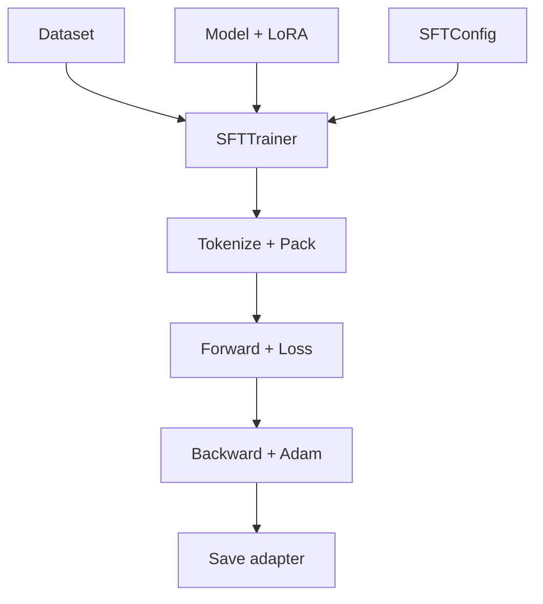

**Interview Q&A:** *"What is sequence packing and why use it?"* — Instead of padding short sequences with PAD tokens (wasted compute), packing concatenates multiple samples into one long sequence (with EOS between them) up to max_seq_length. Throughput goes up 2-4x for datasets with high length variance. Risk: cross-sample attention contamination — TRL handles this with attention masks.

*"How do you tune learning rate for SFT?"* — Full FT: 1e-5 to 5e-5 (low, model is fragile). LoRA: 1e-4 to 3e-4 (higher, only adapter weights). Use a warmup of 3-10% of total steps and cosine decay. For QLoRA with 4-bit base, lr can go up to 5e-4.

---

### 1.5 Axolotl, Unsloth, Llama-Factory

**Definition:** YAML/CLI based training frameworks that wrap transformers+trl+peft. You write a config file, they handle everything.

**Why:** SFTTrainer code becomes 200-300 lines for a real project. Axolotl reduces it to a 50-line YAML. Unsloth focuses on speed — 2x faster training and 50% less VRAM via custom Triton kernels. Llama-Factory has a web UI.

**How:**
```yaml
# axolotl config: mistral-lora.yml
base_model: mistralai/Mistral-7B-v0.1
model_type: MistralForCausalLM
load_in_4bit: true  # QLoRA
adapter: qlora
lora_r: 16
lora_alpha: 32
lora_dropout: 0.05
lora_target_modules:
  - q_proj
  - v_proj
  - k_proj
  - o_proj
datasets:
  - path: tatsu-lab/alpaca
    type: alpaca
sequence_len: 2048
sample_packing: true
gradient_accumulation_steps: 4
micro_batch_size: 4
num_epochs: 3
learning_rate: 0.0002
optimizer: adamw_bnb_8bit  # memory savings
lr_scheduler: cosine
warmup_steps: 100
bf16: auto
output_dir: ./out
```

```bash
# Run
accelerate launch -m axolotl.cli.train mistral-lora.yml

# Unsloth — same training, 2x faster
from unsloth import FastLanguageModel
model, tok = FastLanguageModel.from_pretrained(
    "unsloth/mistral-7b-bnb-4bit",
    max_seq_length=2048, load_in_4bit=True
)
model = FastLanguageModel.get_peft_model(model, r=16, target_modules=[...])
# Then standard SFTTrainer with this model
```

**Real-life Example:** Dell-AI team trained 200+ model variants for benchmarking using Axolotl YAML files in CI. Each experiment was a config change in git, easy to reproduce. With raw scripts, this would have been chaos.

**Mermaid Diagram:**
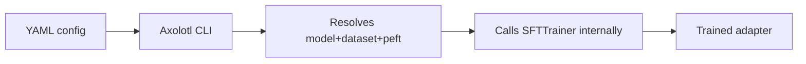

**Interview Q&A:** *"Why use Unsloth over vanilla TRL?"* — Speed and memory. Unsloth rewrites the attention and MLP backward passes in Triton (CUDA) with manual gradient computation, avoiding redundant operations. Result: 2x faster, 50-60% less VRAM. Drawback: only supports specific architectures (Llama, Mistral, Gemma, Qwen) and you need their patched model classes.

*"When does Axolotl break?"* — Cutting-edge architectures (e.g., a brand new Mamba variant) might not have a config preset. Then you fall back to direct TRL/transformers code. Axolotl is great for "standard" recipes, less great for novel research.

---

### 1.6 GPU memory math, gradient accumulation

**Definition:** Calculating exact VRAM usage for training. Gradient accumulation = simulate large batch by accumulating gradients over multiple micro-batches before stepping optimizer.

**Why:** OOM errors are the #1 frustration. Knowing the math = knowing what knob to turn.

**Memory components for training (FP16/BF16 mixed precision):**
- Weights: 2 bytes/param
- Gradients: 2 bytes/param
- Adam states (m, v in FP32): 8 bytes/param
- Master weights (FP32 copy): 4 bytes/param
- **Total: 16 bytes/param** for full FT
- Activations: depends on batch_size × seq_len × hidden_dim × num_layers (~2-10x weights memory typically)

**For 7B model full FT:** 7B × 16 = 112GB just for state. Plus activations 10-30GB. Total ~130-140GB → need 2x A100-80GB minimum.

**For 7B LoRA r=16:** Weights frozen (14GB FP16, no gradient). Adapter: 4M params × 16 = 64MB. Optimizer for adapter only. Activations same. Total ~20GB → fits on RTX 4090.

**For 7B QLoRA (4-bit base + LoRA):** Base weights 7B × 0.5 = 3.5GB. Adapter 64MB. Activations ~10GB. Total ~14GB → fits on RTX 3090.

**How:**
```python
# Gradient accumulation
# Goal: effective batch size 64, but only 8 fits in memory
per_device_batch_size = 8
gradient_accumulation_steps = 8
# effective_bs = 8 * 8 = 64

# Pseudocode of what trainer does:
optimizer.zero_grad()
for i in range(8):  # accumulation steps
    batch = next(dataloader)
    loss = model(batch).loss / 8  # divide by accum steps
    loss.backward()  # gradients accumulate
optimizer.step()  # update once after 8 backward passes
optimizer.zero_grad()

# Other memory tricks:
# 1. Gradient checkpointing — recompute activations in backward
model.gradient_checkpointing_enable()  # ~30% slower, 50% less activation memory

# 2. 8-bit optimizer
import bitsandbytes as bnb
optimizer = bnb.optim.AdamW8bit(model.parameters(), lr=2e-4)
# Adam states 8 bytes/param → 2 bytes/param (4x savings)

# 3. FlashAttention-2 — reduces activation memory
model = AutoModelForCausalLM.from_pretrained(..., attn_implementation="flash_attention_2")
```

**Real-life Example:** Mere ek client ke paas 4xA40 (48GB each) tha. 13B model full FT karna tha. Calculation: 13B × 16 bytes = 208GB → DDP nahi chalega (sab GPUs me poori state honi chahiye). FSDP/ZeRO-3 use kiya — model + optimizer state shard ho gaya across GPUs. 208/4 = 52GB per GPU → tight but worked with gradient checkpointing.

**Mermaid Diagram:**
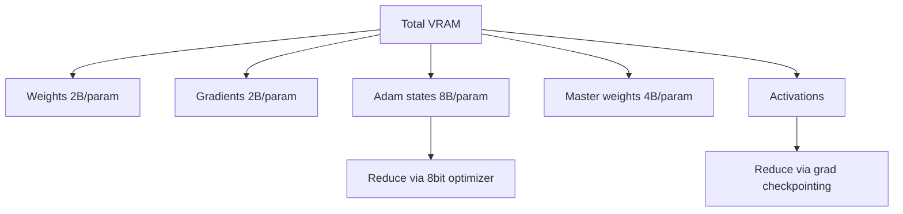

**Interview Q&A:** *"Why does gradient accumulation simulate larger batch but isn't exactly equivalent?"* — Mathematically equivalent for the gradient direction, but **batch normalization** stats differ (per micro-batch, not per effective batch). LayerNorm is fine since it normalizes per sample. Also, dropout patterns differ across micro-batches but that's actually beneficial (more regularization).

*"What's ZeRO and how does it differ from DDP?"* — DDP replicates the full model on each GPU. ZeRO (DeepSpeed) shards optimizer states (ZeRO-1), gradients (ZeRO-2), and weights (ZeRO-3) across GPUs. ZeRO-3 = FSDP in PyTorch. Trade-off: more communication, but enables training models larger than single-GPU memory.

---

## 2. Parameter-Efficient Fine-Tuning

### 2.1 LoRA — derive mathematically

**Definition:** Low-Rank Adaptation. Instead of updating weight matrix W (size d × k) directly, learn two small matrices A (d × r) and B (r × k) where r << min(d, k). Effective update: W' = W + BA.

**Why:** The Aghajanyan et al. (2020) paper showed that fine-tuning updates have low intrinsic rank — meaning the matrix ΔW that you'd add during full FT is well-approximated by a low-rank matrix. So instead of storing/computing the full ΔW (which has d×k = millions of params per layer), store BA (which has only r×(d+k) params).

**Math derivation:**
- Original forward: `y = Wx`
- After full FT: `y = (W + ΔW)x` where ΔW is dense d×k
- LoRA assumption: `ΔW ≈ BA` where A ∈ R^(r×k), B ∈ R^(d×r), r is the rank
- LoRA forward: `y = Wx + (BA)x = Wx + B(Ax)`
- Train only A, B; W is frozen

**Parameter count:** Full ΔW = d×k. LoRA = r×(d+k). For d=k=4096, r=16: full = 16M, LoRA = 131k → **122x reduction**.

**Initialization:** A ~ N(0, σ²), B = 0. Why? At init, BA = 0, so model behaves like base. Updates start from base, not random.

**Scaling:** LoRA paper introduced `α/r` scaling factor: `y = Wx + (α/r) × BA × x`. Common choice α = 2r (so factor = 2). This decouples r from learning rate — change r without retuning lr.

**How:**
```python
import torch
import torch.nn as nn

class LoRALinear(nn.Module):
    def __init__(self, in_dim, out_dim, r=16, alpha=32):
        super().__init__()
        self.W = nn.Linear(in_dim, out_dim, bias=False)
        self.W.weight.requires_grad = False  # FREEZE base
        # LoRA A and B
        self.A = nn.Parameter(torch.randn(r, in_dim) * 0.01)
        self.B = nn.Parameter(torch.zeros(out_dim, r))  # zero init
        self.scale = alpha / r

    def forward(self, x):
        # base forward + LoRA path
        return self.W(x) + (x @ self.A.T @ self.B.T) * self.scale

# Using peft library (recommended)
from peft import LoraConfig, get_peft_model
cfg = LoraConfig(
    r=16, lora_alpha=32, lora_dropout=0.05,
    target_modules=["q_proj", "v_proj"],  # only attn for memory
    bias="none", task_type="CAUSAL_LM"
)
model = get_peft_model(base_model, cfg)
```

**Real-life Example:** Stable Diffusion LoRAs. Civitai pe lakhon LoRA models hain — har ek 50-200MB ka. Base SDXL model 6GB. Tu ek artist style LoRA download karta hai, base model pe load karta hai, us style me images banta hai. Full SDXL fine-tuning hota to 6GB per style — storage nightmare. LoRA se 100MB per style, 60x compression.

**Mermaid Diagram:**
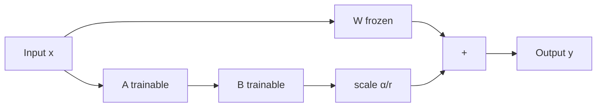

**Interview Q&A:** *"Why does LoRA work — the intuition behind low-rank assumption?"* — Most fine-tuning tasks don't require fundamentally rewiring the model. They're nudging it toward a specific style/domain. The "delta" between general model and fine-tuned model lives in a low-dimensional subspace. Empirically, r=8-32 captures 95%+ of full FT performance. For very different tasks (e.g., teaching a new language), you need higher rank.

*"What target modules to apply LoRA on?"* — Original paper: just q_proj and v_proj. Modern practice: all attention (q, k, v, o) plus all MLP (gate, up, down) for best quality. More targets = more params but better. For a starter: q_proj and v_proj is fine; for production: all linear layers.

---

### 2.2 QLoRA — 4-bit quantized LoRA

**Definition:** QLoRA = base model loaded in 4-bit (NF4 quantization), LoRA adapters in BF16 on top. Backward pass dequantizes 4-bit weights on-the-fly to compute gradients for LoRA.

**Why:** LoRA already saves on optimizer/gradient memory. But base model in FP16 still costs 14GB for 7B. QLoRA quantizes base to 4-bit → 3.5GB. 7B fine-tuning fits on a single 24GB consumer GPU. 70B fine-tuning on a single A100-80GB.

**Three innovations from QLoRA paper (Dettmers et al., 2023):**
1. **NF4** (NormalFloat-4): 4-bit data type optimized for normally-distributed weights (which neural network weights are, after pre-training). Uses 16 quantile-based levels instead of uniform.
2. **Double quantization**: Quantization constants themselves quantized (saves another 0.4 bits/param).
3. **Paged optimizers**: Use NVIDIA unified memory to swap optimizer states between GPU/CPU during gradient spikes.

**How:**
```python
from transformers import AutoModelForCausalLM, BitsAndBytesConfig
from peft import LoraConfig, get_peft_model, prepare_model_for_kbit_training

bnb_cfg = BitsAndBytesConfig(
    load_in_4bit=True,
    bnb_4bit_quant_type="nf4",       # NormalFloat 4
    bnb_4bit_compute_dtype="bfloat16", # compute in bf16
    bnb_4bit_use_double_quant=True,    # save 0.4 bits/param
)

model = AutoModelForCausalLM.from_pretrained(
    "meta-llama/Llama-3-70B",
    quantization_config=bnb_cfg,
    device_map="auto",
)
model = prepare_model_for_kbit_training(model)  # cast LayerNorms to FP32 etc.

lora_cfg = LoraConfig(
    r=64, lora_alpha=16,  # higher r common for QLoRA
    target_modules=["q_proj","k_proj","v_proj","o_proj","gate_proj","up_proj","down_proj"],
    bias="none", task_type="CAUSAL_LM"
)
model = get_peft_model(model, lora_cfg)
# Now train with SFTTrainer as usual
```

**Real-life Example:** Guanaco-65B was the QLoRA paper's flagship: trained on a single 48GB GPU in 24 hours, beat ChatGPT on Vicuna benchmark. Before QLoRA, 65B FT was reserved for big labs.

**Mermaid Diagram:**
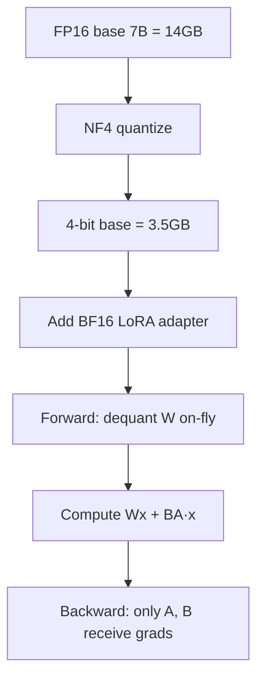

**Interview Q&A:** *"Doesn't 4-bit quantization hurt accuracy?"* — Slightly, but less than you'd think. NF4 is ~0.1-0.3% worse than FP16 base on benchmarks. After fine-tuning with LoRA on top, the trained model essentially matches FP16 LoRA performance (within noise). The LoRA adapter compensates for quantization error.

*"What's the difference between QLoRA inference and training?"* — Training: 4-bit base frozen, LoRA in BF16, Adam states in BF16/FP32. Inference: you can either keep 4-bit base + LoRA, or merge LoRA into BF16 model and re-quantize, or merge into 4-bit (some quality loss). For deployment, often merge to FP16 then quantize separately with GPTQ/AWQ.

---

### 2.3 DoRA, rsLoRA, LoRA+

**Definition:** Variants improving on vanilla LoRA. DoRA = Weight-Decomposed LoRA. rsLoRA = Rank-Stabilized LoRA. LoRA+ = different learning rates for A and B.

**Why:** LoRA at high rank degrades — the α/r scaling becomes weird; A and B have different optimal LRs. Researchers patched these.

**DoRA (Liu et al., 2024):** Decompose W into magnitude m (vector, per output dim) and direction d (unit vector matrix). LoRA only adapts direction; magnitude is a separate learned parameter. Result: 1-2% better than LoRA at same rank.

**rsLoRA (Kalajdzievski, 2023):** Vanilla LoRA scaling α/r is wrong for high r — gradients vanish. Use α/√r instead. Allows training with r=128+ effectively.

**LoRA+ (Hayou et al., 2024):** B has higher optimal LR than A (because B starts at zero). Use lr_B = 16 × lr_A. Free 1-2% improvement.

**How:**
```python
# DoRA via peft
from peft import LoraConfig
cfg = LoraConfig(r=16, lora_alpha=32, use_dora=True, target_modules=[...])

# rsLoRA — also a peft flag
cfg = LoraConfig(r=128, lora_alpha=128, use_rslora=True, target_modules=[...])

# LoRA+ — manual: separate param groups in optimizer
optimizer = torch.optim.AdamW([
    {"params": [p for n,p in model.named_parameters() if "lora_A" in n], "lr": 1e-4},
    {"params": [p for n,p in model.named_parameters() if "lora_B" in n], "lr": 16e-4},
])
```

**Real-life Example:** DoRA picked up by NVIDIA in 2024 for their Llama 3 fine-tuning recipes. ~1% gain on MMLU at same compute — at scale this matters.

**Mermaid Diagram:**
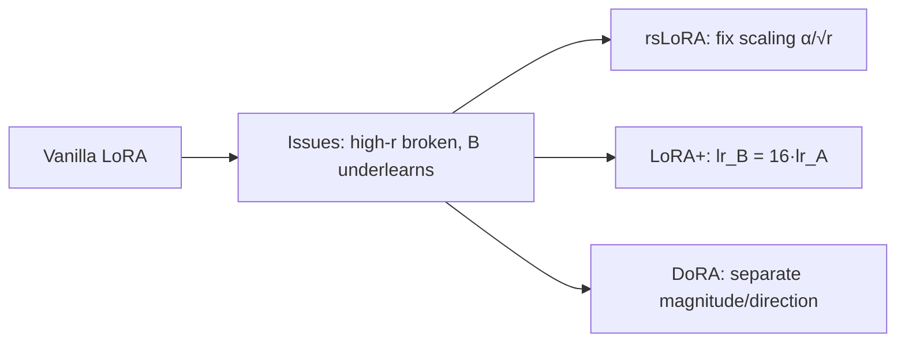

**Interview Q&A:** *"Should I always use DoRA over LoRA?"* — Almost — it's strictly better in quality, with ~5-10% slower training. For production, yes. For quick experiments, plain LoRA is fine. DoRA helps more at low rank (r=4-8) since direction-only adaptation is more powerful with magnitude separated.

*"Why does B initialize at zero?"* — So that BA = 0 at start, model output unchanged. If both A and B were random, the effective W' = W + BA at start would be random noise, hurting model immediately. Asymmetric init is critical.

---

### 2.4 Adapters, prefix tuning, prompt tuning

**Definition:** Pre-LoRA PEFT methods. Adapters insert small bottleneck MLPs between transformer layers. Prefix tuning adds learnable vectors to attention's K, V. Prompt tuning prepends learnable embeddings to input.

**Why historical:** Adapters (Houlsby et al., 2019) was first PEFT — insert (down → activation → up) bottleneck after each transformer layer. Worked but added inference latency. Prefix tuning (Li & Liang, 2021) and prompt tuning (Lester et al., 2021) — pure embedding-level, zero inference overhead, but less expressive. LoRA dominated all because it merges back into weights → zero overhead AND expressive.

**How:**
```python
# Adapter (conceptual)
class Adapter(nn.Module):
    def __init__(self, d, bottleneck=64):
        super().__init__()
        self.down = nn.Linear(d, bottleneck)
        self.up = nn.Linear(bottleneck, d)
    def forward(self, x):
        return x + self.up(F.relu(self.down(x)))  # residual

# Prompt tuning via peft
from peft import PromptTuningConfig, TaskType
cfg = PromptTuningConfig(
    task_type=TaskType.CAUSAL_LM,
    num_virtual_tokens=20,  # 20 learnable embedding vectors prepended
    prompt_tuning_init="TEXT",
    prompt_tuning_init_text="Classify sentiment:",
    tokenizer_name_or_path="gpt2"
)

# Prefix tuning
from peft import PrefixTuningConfig
cfg = PrefixTuningConfig(num_virtual_tokens=20, task_type="CAUSAL_LM")
# Adds learnable K, V at every layer's attention
```

**Real-life Example:** P-tuning v2 (a prefix tuning variant) was used by ChatGLM team to adapt their 6B model to many domain tasks with just 0.1% trainable params. For very narrow tasks (binary classification), prompt tuning with 20 tokens is enough.

**Mermaid Diagram:**
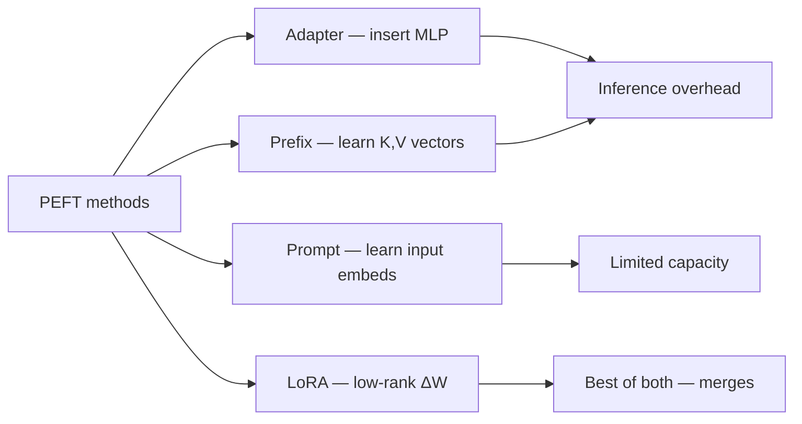

**Interview Q&A:** *"Why did LoRA win over adapters?"* — Three reasons: (1) LoRA can be merged into base weights post-training → zero inference latency, adapter cannot, (2) LoRA matches full FT quality at modest rank, adapters need bigger bottleneck, (3) LoRA mathematical formulation is cleaner (low-rank decomposition is well-studied).

*"When is prompt tuning still useful?"* — Multi-task serving. You can serve one base model and swap prompt vectors per task — extremely lightweight (20 vectors × 4096 dim = 80KB per task). For 1000 tasks, this is far better than 1000 LoRA adapters.

---

### 2.5 When PEFT vs full FT

**Definition:** Decision framework: PEFT for most cases, full FT for specific scenarios.

**PEFT when:**
- Limited compute/budget
- Multiple specialized models from one base (LoRA per customer)
- Dataset < 50k examples
- Behavior/style adaptation, not knowledge change
- Rapid experimentation

**Full FT when:**
- Domain shift large (medical, code, non-English)
- Dataset >> 100k examples
- Continued pre-training (raw text, not instruction)
- Need every last % of accuracy
- Compute budget allows

**Real-life Example:** OpenAI's models — they do full FT (and continued pre-training) for major releases like GPT-4 → GPT-4-turbo. They have the data and compute. A startup adapting Mistral-7B for customer support? LoRA, no question.

**Mermaid Diagram:**
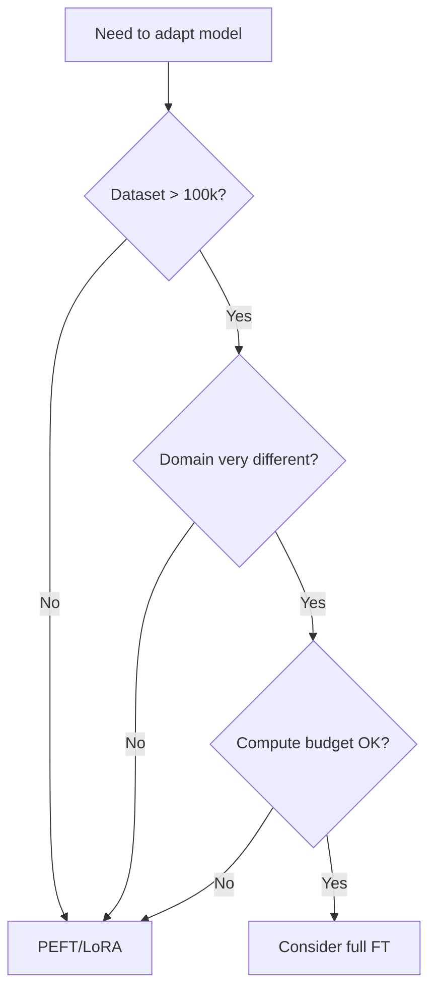

**Interview Q&A:** *"Has any modern paper shown LoRA worse than full FT?"* — Tülu 3 (Allen AI, 2024) compared on 12+ benchmarks. Full FT slightly better on math (GSM8K +1.5%) and coding (HumanEval +0.8%). Equal or LoRA better on conversational. Conclusion: for reasoning-heavy tasks, full FT wins by tiny margin if budget allows.

*"Can you do full FT after LoRA?"* — Yes — merge LoRA into base, then do another full FT pass. Useful for staged training: cheap LoRA exploration, then expensive final polish on best config. Many production pipelines do this.

---

### 2.6 Merging LoRA adapters

**Definition:** After training a LoRA adapter, you can mathematically fold it into base weights so there's no adapter overhead at inference. W_merged = W_base + (α/r) × BA.

**Why:** During training, separate base + adapter saves memory. At inference, you want a single forward pass with no extra matmul. Merging gives you exactly the same model in standard format, deployable to vLLM/TGI without LoRA support.

**How:**
```python
from peft import PeftModel
from transformers import AutoModelForCausalLM

base = AutoModelForCausalLM.from_pretrained("mistralai/Mistral-7B-v0.1", torch_dtype="bfloat16")
peft_model = PeftModel.from_pretrained(base, "./mistral-sft-final")
merged_model = peft_model.merge_and_unload()  # combines weights, removes adapter
merged_model.save_pretrained("./mistral-sft-merged")  # standard HF model

# Now this is a regular Mistral-7B with updated weights
# Deploy to vLLM, quantize with GPTQ, anything

# Multi-LoRA serving (without merging)
# Some inference servers (vLLM, TGI) support hot-swapping LoRA adapters
# Useful for multi-tenant: 100 customers, 100 LoRAs, one base model in memory
```

**Real-life Example:** A SaaS company has 50 customers, each with custom LoRA fine-tuned on their data. Two strategies:
1. Merge → 50 separate full models → 50 × 14GB = 700GB storage, can't fit in serving fleet.
2. Don't merge → 1 base in memory + 50 small LoRAs (~100MB each) loaded on demand.
Strategy 2 is the only viable one. vLLM's multi-LoRA support is critical here.

**Mermaid Diagram:**
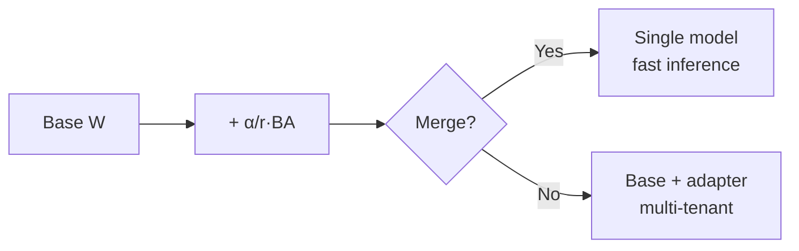

**Interview Q&A:** *"What's the downside of merging?"* — You lose the ability to swap adapters. If you're serving multiple variants (per-customer models), keep them as separate LoRAs. If you're deploying one final model to production, merge.

*"Can merging cause precision loss?"* — Slightly, since you're adding a low-rank update to FP16 weights and rounding. Negligible in practice. If using QLoRA (4-bit base), merging requires dequantizing first — merge in BF16, then re-quantize for deployment.

---

## 3. Preference Optimization

### 3.1 RLHF pipeline — SFT → reward model → PPO

**Definition:** Reinforcement Learning from Human Feedback. Three-stage process: (1) SFT a base model, (2) train a reward model on human preference comparisons, (3) use PPO RL to optimize SFT model against reward model.

**Why:** SFT teaches imitation but doesn't capture preferences. "Which of these two answers is better?" is easier for humans than writing a perfect answer. RLHF leverages this to align model with human preferences. ChatGPT (2022) was the breakthrough demonstrating this works at scale.

**Stages:**

**Stage 1 — SFT:** Standard instruction tuning. Output: π_SFT.

**Stage 2 — Reward Model (RM):** Collect (prompt, chosen, rejected) triples. Train a model that scores responses. Loss: maximize r(chosen) − r(rejected). Architecture: SFT model with classification head.

**Stage 3 — PPO:** Use RM as reward signal. Optimize π to maximize reward while staying close to π_SFT (KL penalty prevents reward hacking).

**Math:**
- RM loss: `L = -log σ(r(x, y_chosen) - r(x, y_rejected))`
- PPO objective: `E[r(x, y) - β·KL(π(y|x) || π_SFT(y|x))]`

**How:**
```python
# Stage 2: Reward model with TRL
from trl import RewardTrainer, RewardConfig
from transformers import AutoModelForSequenceClassification

rm = AutoModelForSequenceClassification.from_pretrained(
    "meta-llama/Llama-3-8B-Instruct", num_labels=1
)
# Dataset format: chosen and rejected responses
# {"chosen": "Good answer", "rejected": "Bad answer", "prompt": "Question?"}
trainer = RewardTrainer(
    model=rm, args=RewardConfig(...),
    train_dataset=preference_dataset
)
trainer.train()

# Stage 3: PPO with TRL
from trl import PPOTrainer, PPOConfig
ppo_cfg = PPOConfig(
    learning_rate=1e-5, batch_size=64,
    init_kl_coef=0.2,  # KL penalty strength
)
ppo_trainer = PPOTrainer(
    config=ppo_cfg, model=sft_model, ref_model=ref_model,  # ref = frozen SFT
    tokenizer=tok, reward_model=rm,
)
for batch in dataloader:
    response = ppo_trainer.generate(batch["query"])
    reward = rm(batch["query"], response).logits
    ppo_trainer.step(batch["query"], response, reward)
```

**Real-life Example:** OpenAI's InstructGPT paper (precursor to ChatGPT) used this exact pipeline. Hired ~40 contractors to label preferences. Trained 6B reward model. PPO'd 175B GPT-3. Result: human raters preferred InstructGPT over GPT-3 by 70%+.

**Mermaid Diagram:**
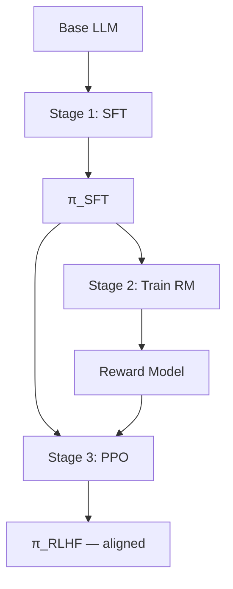

**Interview Q&A:** *"Why is PPO unstable?"* — Multiple reasons: (1) reward model is itself a learned approximation — model finds reward hacks, (2) policy can drift far from SFT in single update, KL penalty must be tuned, (3) on-policy RL needs new rollouts every step → expensive. Many implementations have subtle bugs. Hence DPO became popular.

*"What's the role of the reference model in PPO?"* — `ref_model` is the frozen SFT model. KL divergence from ref to current policy is added as penalty in reward: `r' = r - β·log(π(y|x)/π_ref(y|x))`. Prevents policy from going rogue chasing reward.

---

### 3.2 DPO — modern standard

**Definition:** Direct Preference Optimization. Replaces RM + PPO with a single supervised loss on preference pairs. Mathematically derived to be equivalent to RLHF under certain assumptions.

**Why:** RLHF is complex — three models (SFT, RM, PPO), unstable training, expensive rollouts. DPO (Rafailov et al., 2023) showed you can directly train on preferences with a clever loss derived from the PPO objective's closed-form solution. Simpler, more stable, often equal/better results. Now industry default.

**Math derivation (intuitively):**
- PPO optimal policy under KL constraint: `π*(y|x) = π_ref(y|x) · exp(r(x,y)/β) / Z(x)`
- Rearrange: `r(x,y) = β·log(π*(y|x)/π_ref(y|x)) + β·log Z(x)`
- Plug into RM Bradley-Terry loss, Z(x) cancels:
- **DPO loss:** `L = -log σ(β·[log π(y_w|x)/π_ref(y_w|x) - log π(y_l|x)/π_ref(y_l|x)])`

Where y_w = preferred (chosen), y_l = dispreferred (rejected). This is just a binary cross-entropy on log-ratios — fully supervised, no rollouts.

**How:**
```python
from trl import DPOTrainer, DPOConfig

dpo_cfg = DPOConfig(
    output_dir="./mistral-dpo",
    num_train_epochs=1,
    per_device_train_batch_size=2,
    learning_rate=5e-7,  # very low for DPO!
    beta=0.1,            # KL strength: 0.1-0.5 typical
    bf16=True,
)

# Dataset: {"prompt": ..., "chosen": ..., "rejected": ...}
trainer = DPOTrainer(
    model=sft_model,
    ref_model=None,  # if None, use peft adapter merging trick
    args=dpo_cfg,
    train_dataset=pref_dataset,
    tokenizer=tok,
    peft_config=lora_cfg,  # DPO with LoRA = cheap
)
trainer.train()
```

**Real-life Example:** Zephyr-7B (Hugging Face, 2023) was first major model showing DPO beats RLHF — Mistral-7B SFT'd on UltraChat, DPO'd on UltraFeedback. Beat Llama-2-70B-chat on MT-Bench. Single 16xA100 run. DPO became default for open community.

**Mermaid Diagram:**
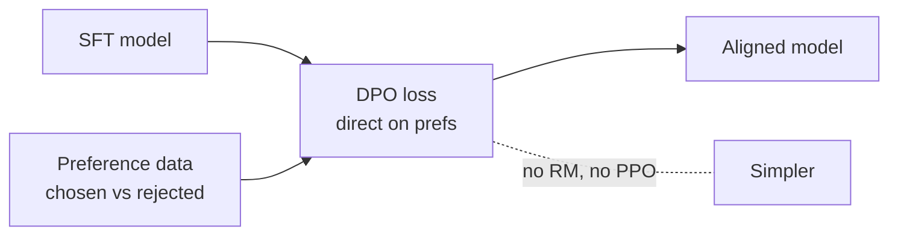

**Interview Q&A:** *"What's the right β for DPO?"* — β controls how much policy can deviate from reference. Higher β (0.5+) = stays closer to SFT, less aligned. Lower β (0.01) = more aligned to preferences, risk of degeneration. Sweet spot: 0.1-0.3 for chat. Tune on dev set.

*"Why is DPO learning rate so low (5e-7)?"* — DPO is a finer-grained update than SFT. Higher LR causes overfitting and degradation. Rule of thumb: DPO LR is 10-100x smaller than SFT LR.

---

### 3.3 IPO, KTO, ORPO, SimPO

**Definition:** DPO variants addressing specific weaknesses.

**IPO (Identity Preference Optimization):** DPO can over-fit when preferences are deterministic. IPO replaces sigmoid loss with squared loss → more robust. `L = (β·log_ratio - 0.5)²`.

**KTO (Kahneman-Tversky Optimization):** Doesn't need pairs. Just (prompt, response, "good"/"bad") binary labels. Inspired by prospect theory — losses weighted differently than gains. Practical when you have thumbs-up/down data, not pairs.

**ORPO (Odds Ratio Preference Optimization):** Combines SFT and preference learning in one stage. Single loss = SFT loss + λ × odds-ratio loss. Skips separate SFT pass. Great for resource-constrained setups.

**SimPO (Simple Preference Optimization):** No reference model needed (huge memory saving). Uses length-normalized log-probs as implicit reward. Simpler than DPO.

**How:**
```python
# All available in trl/peft

from trl import KTOTrainer, KTOConfig
# KTO dataset: {"prompt", "completion", "label": True/False}

from trl import ORPOTrainer, ORPOConfig
orpo_cfg = ORPOConfig(beta=0.1, ...)
# Combines SFT + preference; start from base, no separate SFT pass

# SimPO — newer, often via peft fork
# Loss: -log σ(β·(log π(yw)/|yw| - log π(yl)/|yl|) - γ)
# γ = target reward margin
```

**Real-life Example:** Mistral team's Zephyr-ORPO: combined SFT and preference in one stage. 50% less compute than SFT+DPO, similar quality. Now common in open-source pipelines.

**Mermaid Diagram:**
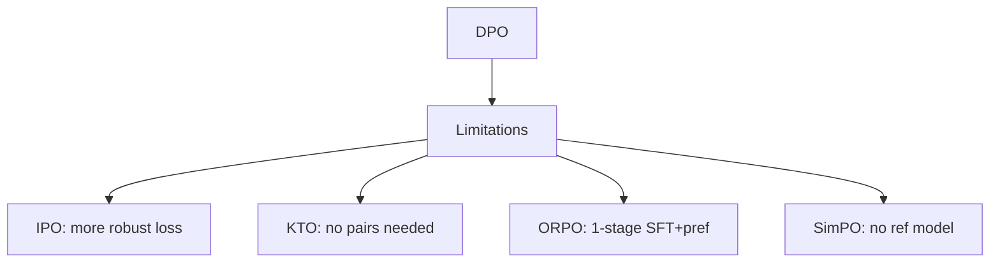

**Interview Q&A:** *"When to use KTO over DPO?"* — When data is thumbs-up/thumbs-down (production telemetry), not preference pairs. Easier to collect at scale. Slightly worse than DPO with paired data, much better than nothing.

*"Which method is the new default in 2025?"* — DPO still most common but ORPO gaining ground for resource efficiency. SimPO when memory-constrained. KTO for production telemetry-driven loops. There's no single winner — pick based on data shape.

---

### 3.4 Constitutional AI (Anthropic)

**Definition:** Anthropic's RLAIF (RL from AI Feedback) variant. Instead of human preferences, model self-critiques against a "constitution" (set of principles) to generate preference pairs.

**Why:** Human preference data is slow and expensive to collect at scale. Constitutional AI replaces humans with a strong AI critic. Two phases: (1) SFT phase — model generates response, critiques it against principles, revises; train on revisions. (2) RL phase — model generates two responses, an AI judge picks better according to constitution; train DPO/PPO on these.

**Constitution example principles:**
- "Choose the response that is more helpful and honest."
- "Choose the response that is less harmful."
- "Choose the response that better respects autonomy."

**How:**
```python
# Conceptual pipeline
def constitutional_step(prompt):
    # 1. Generate response
    response = model.generate(prompt)
    # 2. Self-critique
    critique_prompt = f"Critique this response per constitution: {response}"
    critique = model.generate(critique_prompt)
    # 3. Revise
    revise_prompt = f"Rewrite considering critique: {critique}"
    revised = model.generate(revise_prompt)
    return prompt, response, revised  # response→revised is a preference pair

# Train DPO on (prompt, revised_chosen, original_rejected) pairs
```

**Real-life Example:** Claude (Anthropic's flagship) trained with Constitutional AI. The model is notably good at refusing harmful requests with nuanced reasoning — direct result of constitution-based training.

**Mermaid Diagram:**
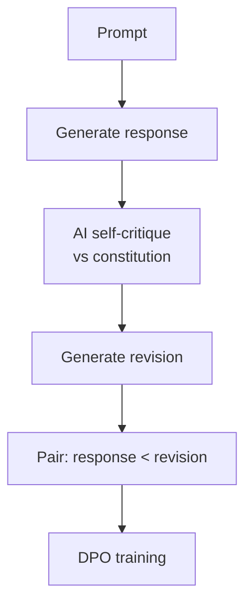

**Interview Q&A:** *"Is RLAIF as good as RLHF?"* — Roughly equivalent on quality benchmarks per Anthropic and Google papers. Cheaper to scale. Risk: AI judge has biases that get amplified. Best practice: use both — human data for ground truth on edge cases, AI feedback for scale.

*"What's the constitution actually?"* — A prompt template with principles. Anthropic published theirs — includes UN Declaration of Human Rights references, helpfulness/harmlessness/honesty principles, and edge case guidance. ~30-50 principles total.

---

### 3.5 Reward hacking — how to avoid

**Definition:** Model finds ways to maximize reward without genuinely satisfying intent. Classic RL problem.

**Examples in LLM RLHF:**
- Verbose outputs (longer = looks more thorough → higher reward)
- Formatting tricks (bullet points always score higher)
- Sycophancy (agree with user even when wrong → user "satisfaction" up)
- Refusing more to avoid harmful-content reward penalty
- Repeating user's query in answer (looks comprehensive)

**Why:** Reward model is a learned approximation. It has blind spots and biases. Policy exploits these blind spots.

**Mitigation:**
1. **KL penalty** — keep policy close to SFT. β=0.1+.
2. **Reward model ensembles** — average multiple RMs, harder to hack all simultaneously.
3. **Length normalization** — penalize verbose outputs.
4. **Diverse training data** — RM trained on broad data resists narrow hacks.
5. **Iterative training** — re-collect preferences against current model.
6. **Adversarial preferences** — explicitly include hacky examples as "rejected".

**How:**
```python
# Length-normalized DPO
def length_normalized_logprob(logprobs, length):
    return logprobs.sum() / length

# Adversarial pairs in dataset
# {"chosen": "Concise correct answer", "rejected": "Verbose padding answer"}

# Monitoring — check for reward hacking signs
def check_hacking(model):
    avg_length = avg_response_length(model)
    if avg_length > 2 * baseline_length:
        print("WARNING: model getting verbose, likely length-hacking")
    sycophancy_score = test_sycophancy(model)  # disagree probes
    if sycophancy_score > threshold:
        print("WARNING: model overly agreeable")
```

**Real-life Example:** Early LLaMA-2-Chat had a sycophancy issue — would agree with users on factually wrong claims. Tracked back to RM rewarding "user satisfaction signals" too heavily. Meta added adversarial data to fix in subsequent versions.

**Mermaid Diagram:**
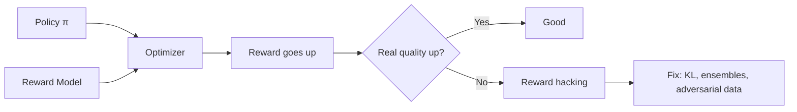

**Interview Q&A:** *"How do you detect reward hacking in production?"* — Several signals: (1) average response length increasing without quality gain, (2) divergence between RM score and held-out human eval, (3) policy entropy collapsing (always similar phrasing), (4) factuality benchmarks dropping while RM scores rise. Always evaluate on held-out tasks, not just RM score.

*"Can DPO have reward hacking?"* — Yes, just less obvious — it's implicit in the preference data. If your preference data has length bias (humans pick longer answers), DPO learns to be verbose. Same with formatting biases. Solution: balance preference data quality.

---

## 4. Quantization & Optimization

### 4.1 GPTQ, AWQ, SmoothQuant

**Definition:** Post-training quantization methods reducing model precision to 4-bit (sometimes 3, 2-bit) without significant accuracy loss.

**Why:** Inference cost dominates LLM economics. FP16 7B model = 14GB VRAM. 4-bit = 3.5GB. Fits on phone GPUs, faster inference (memory-bandwidth-bound), cheaper serving.

**GPTQ (Frantar et al., 2022):** Layer-by-layer quantization. For each layer, find quant weights that minimize reconstruction error using calibration data. Uses Optimal Brain Quantization — second-order info to compensate quant error in remaining weights. Best for GPU inference.

**AWQ (Lin et al., 2023):** Activation-aware. Observation: not all weights equally important — 1% of weights are "salient" (large activation magnitude). Protect those (keep in higher precision or scale them up before quantizing). Faster to compute than GPTQ, similar quality.

**SmoothQuant (Xiao et al., 2022):** For 8-bit quantization including activations. Activations have outliers that hurt quantization. Smoothly migrate outliers from activations to weights via diagonal scaling: A · W = (A/s) · (s·W). Now both quantize well.

**How:**
```python
# GPTQ via auto-gptq
from auto_gptq import AutoGPTQForCausalLM, BaseQuantizeConfig

quant_config = BaseQuantizeConfig(bits=4, group_size=128, desc_act=False)
model = AutoGPTQForCausalLM.from_pretrained("meta-llama/Llama-3-8B", quant_config)

# Calibration data — 128 samples enough usually
calib_data = [tokenizer(text, return_tensors="pt") for text in samples]
model.quantize(calib_data)
model.save_quantized("./llama3-8b-gptq-4bit")

# AWQ via autoawq
from awq import AutoAWQForCausalLM
model = AutoAWQForCausalLM.from_pretrained("meta-llama/Llama-3-8B")
model.quantize(tokenizer, quant_config={"w_bit": 4, "q_group_size": 128})
model.save_quantized("./llama3-8b-awq")
```

**Real-life Example:** TheBloke (HF user) provides GPTQ + AWQ versions of every popular open model. 100s of millions of downloads. Production serving stack: AWQ model + vLLM = 2-3x throughput vs FP16.

**Mermaid Diagram:**
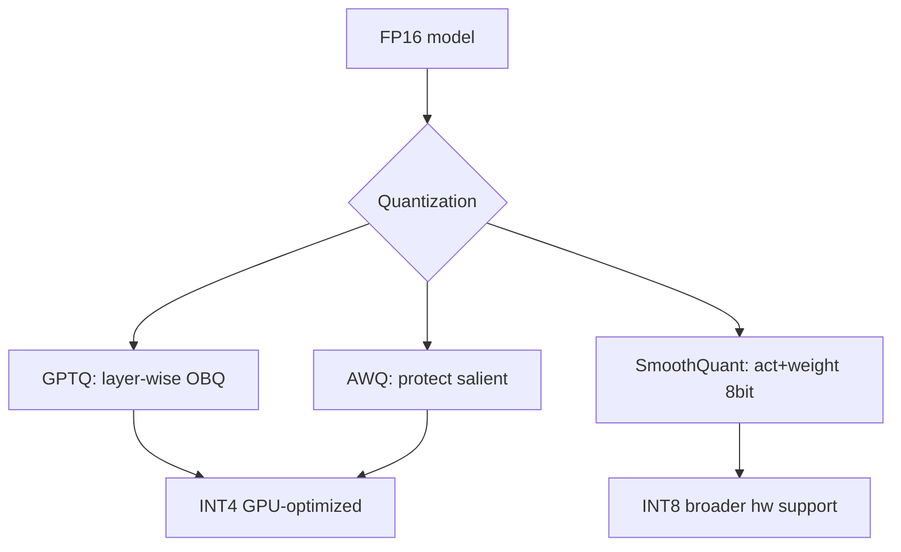

**Interview Q&A:** *"GPTQ vs AWQ — which to use?"* — Both ~equal quality at 4-bit. AWQ is faster to quantize and has slightly better latency on most hardware. GPTQ has wider library support. Default to AWQ for new projects, GPTQ if your serving stack only supports it.

*"What's calibration data and why does it matter?"* — Quantization minimizes error w.r.t. specific input distribution. If you calibrate on Wikipedia but serve code, error is higher on code. Use calibration data representative of production inputs. ~128-512 samples enough.

---

### 4.2 GGUF format

**Definition:** GPT-Generated Unified Format. Successor to GGML. Single-file format for quantized models, runs on CPU and GPU via llama.cpp. Supports k-quants (Q2_K, Q4_K, Q5_K, Q6_K, Q8_0) — varied quality/size tradeoffs.

**Why:** Designed for local/edge deployment. CPU-friendly (uses SIMD). Single file — no Python dependencies. Powers ollama, LM Studio, llama.cpp, mobile apps.

**Quantization tiers:**
- **Q2_K:** 2-bit, smallest, lowest quality
- **Q4_K_M:** 4-bit, medium — sweet spot, recommended default
- **Q5_K_M:** 5-bit, slightly better
- **Q6_K:** 6-bit, near-FP16 quality
- **Q8_0:** 8-bit, almost no loss

**How:**
```bash
# Convert HF model to GGUF
git clone https://github.com/ggerganov/llama.cpp
cd llama.cpp
python convert_hf_to_gguf.py /path/to/llama3-8b --outfile llama3-8b-f16.gguf

# Quantize to Q4_K_M
./llama-quantize llama3-8b-f16.gguf llama3-8b-Q4_K_M.gguf Q4_K_M

# Run
./llama-cli -m llama3-8b-Q4_K_M.gguf -p "Hello"

# Use in Python
from llama_cpp import Llama
llm = Llama(model_path="llama3-8b-Q4_K_M.gguf", n_gpu_layers=20)
out = llm("What is RAG?", max_tokens=128)
```

**Real-life Example:** Ollama's entire ecosystem runs on GGUF. Run Mixtral-8x7B on a M2 MacBook with 32GB RAM via Q4_K_M GGUF — would not fit in any other format. Major win for local AI.

**Mermaid Diagram:**
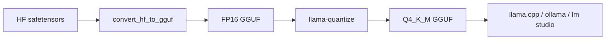

**Interview Q&A:** *"When to use GGUF vs GPTQ?"* — GGUF for CPU or local consumer GPU inference. GPTQ/AWQ for cloud GPU serving (vLLM, TGI). GGUF is more flexible (CPU+GPU offload), GPTQ is faster on dedicated GPUs.

*"What does the 'K' in Q4_K_M mean?"* — K-quants are an improved quantization scheme. Q4_K uses block-wise quantization with super-blocks of 256 weights. M = "medium" — uses more bits for important layers (attention output, MLP gate) and fewer for others. Smarter than uniform Q4.

---

### 4.3 bitsandbytes (8-bit, 4-bit)

**Definition:** Library by Tim Dettmers providing on-the-fly 8-bit and 4-bit quantization integrated into HF transformers. Used widely for QLoRA training.

**Why:** Enables loading large models in less memory immediately (one flag at load time). For training: 8-bit Adam, 8-bit base + LoRA, 4-bit base + LoRA (QLoRA). For inference: faster than FP16 due to memory bandwidth.

**8-bit (LLM.int8()):** Weight quantization with outlier handling — most weights INT8, outlier columns stay FP16. Mixed precision matmul.

**4-bit (NF4):** NormalFloat-4 — 4-bit data type optimized for normally distributed weights.

**How:**
```python
from transformers import AutoModelForCausalLM, BitsAndBytesConfig
import bitsandbytes as bnb

# 8-bit loading
model = AutoModelForCausalLM.from_pretrained(
    "meta-llama/Llama-3-8B",
    load_in_8bit=True,
    device_map="auto"
)

# 4-bit (NF4) with double quantization
bnb_cfg = BitsAndBytesConfig(
    load_in_4bit=True,
    bnb_4bit_quant_type="nf4",
    bnb_4bit_compute_dtype="bfloat16",
    bnb_4bit_use_double_quant=True
)
model = AutoModelForCausalLM.from_pretrained("...", quantization_config=bnb_cfg)

# 8-bit Adam optimizer (memory savings during training)
optimizer = bnb.optim.AdamW8bit(model.parameters(), lr=2e-4)
```

**Real-life Example:** QLoRA paper used bitsandbytes — released 2023, immediately enabled hobbyists to fine-tune Llama-65B on a single 48GB GPU. Democratized fine-tuning overnight.

**Mermaid Diagram:**
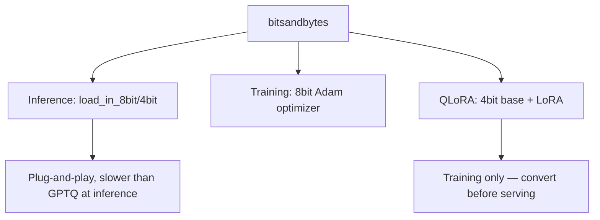

**Interview Q&A:** *"bnb 4-bit vs GPTQ for inference?"* — GPTQ/AWQ faster (custom CUDA kernels). bnb easier to use (single flag). Use bnb for training (QLoRA), GPTQ/AWQ for production serving.

*"What's the 8-bit optimizer doing?"* — Standard Adam stores momentum (m) and variance (v) per parameter in FP32 — 8 bytes/param. 8-bit Adam stores these in INT8 with block-wise dynamic quantization → 2 bytes/param. 4x optimizer memory savings for almost no quality loss.

---

### 4.4 Quantization-Aware Training

**Definition:** Train model with simulated quantization in forward pass — model learns weights that quantize well. Opposite of post-training quant (PTQ).

**Why:** PTQ takes a trained FP16 model and quantizes after. Some quality loss inevitable. QAT bakes quantization into training — model adapts. Better quality at extreme low bits (2-3 bit).

**How (conceptual):**
```python
# Fake-quantize during training: round in forward, straight-through estimator in backward
class FakeQuantize(torch.autograd.Function):
    @staticmethod
    def forward(ctx, x, bits):
        scale = (x.max() - x.min()) / (2**bits - 1)
        return torch.round(x / scale) * scale
    @staticmethod
    def backward(ctx, grad_output):
        return grad_output, None  # straight-through

# In linear layer, before matmul:
quantized_W = FakeQuantize.apply(self.W, 4)
output = x @ quantized_W
# Loss flows through fake-quant as if it weren't there (STE)
# Gradients update W to be more quant-friendly
```

**Real-life Example:** BitNet b1.58 (Microsoft, 2024) trained 3B model with 1.58-bit weights from scratch — ternary {-1, 0, 1}. Matches FP16 quality. Pure QAT — couldn't be done with PTQ. Future of efficient inference.

**Mermaid Diagram:**
```mermaid
graph LR
    A[FP weights] --> B[Fake-quantize forward]
    B --> C[Forward pass]
    C --> D[Loss]
    D --> E[Backward STE]
    E --> F[Update FP weights]
    F -.weights become quant-friendly.- A
```

**Interview Q&A:** *"PTQ vs QAT — when each?"* — PTQ for existing trained models (most cases). QAT when target precision is extreme (≤3 bits) and you control training. QAT is 5-10x more expensive (full training run).

*"What's the straight-through estimator?"* — Quantization is non-differentiable (round step has zero gradient almost everywhere). STE just passes the gradient through as if quantization were identity. Mathematically incorrect, empirically works very well.

---

### 4.5 Knowledge distillation

**Definition:** Train smaller "student" model to mimic larger "teacher" model. Loss combines hard labels (truth) and soft labels (teacher's output distribution).

**Why:** Inference cost. A 7B distilled student might match 70B teacher at 10x speed. Used for productionizing — train a big model carefully, distill to a deployable size.

**Loss:** `L = α·L_hard(student, truth) + (1-α)·L_soft(student, teacher)` where L_soft is KL divergence between student and teacher distributions, often with temperature scaling.

**How:**
```python
import torch.nn.functional as F

def distillation_loss(student_logits, teacher_logits, labels, T=2.0, alpha=0.5):
    # Hard loss: standard CE on ground truth
    hard = F.cross_entropy(student_logits, labels)
    # Soft loss: match teacher distribution
    soft_student = F.log_softmax(student_logits / T, dim=-1)
    soft_teacher = F.softmax(teacher_logits / T, dim=-1)
    soft = F.kl_div(soft_student, soft_teacher, reduction="batchmean") * (T ** 2)
    return alpha * hard + (1 - alpha) * soft

# Training loop
for batch in dataloader:
    with torch.no_grad():
        teacher_out = teacher(batch["input_ids"]).logits
    student_out = student(batch["input_ids"]).logits
    loss = distillation_loss(student_out, teacher_out, batch["labels"])
    loss.backward()
    optimizer.step()
```

**Real-life Example:** DistilBERT (HF, 2019) — 60% smaller than BERT, 60% faster, retains 97% of GLUE benchmark. Standard practice for production NLP. More recently, Llama-3.2-3B was distilled from Llama-3.1-70B.

**Mermaid Diagram:**
```mermaid
graph TD
    A[Big teacher 70B] --> B[Forward on data]
    C[Small student 7B] --> D[Forward on data]
    B --> E[Soft labels]
    D --> F[Student logits]
    E --> G[KL divergence]
    F --> G
    F --> H[CE with hard labels]
    G --> I[Combined loss]
    H --> I
```

**Interview Q&A:** *"Why does temperature T > 1 help distillation?"* — Higher T softens the teacher's distribution, exposing more information. With T=1, teacher might be 99% confident on top class — student only learns "top class is right". With T=4, distribution is flatter and student also learns "second-best is X, third-best is Y" — much richer signal.

*"Distillation vs fine-tuning small model directly?"* — Distillation usually wins because teacher provides richer signal than hard labels. Especially when ground truth labels are sparse — teacher generates dense supervision over all tokens.

---

### 4.6 Pruning, sparsity

**Definition:** Pruning removes weights (sets to zero) deemed unimportant. Sparsity = fraction of zeros. Structured pruning removes entire neurons/heads (hardware-friendly), unstructured prunes individual weights.

**Why:** Sparse models can be smaller and faster (with hardware support). 50% sparsity = 2x compression. Extreme sparsity (90%+) is research-grade — needs custom kernels.

**Types:**
- **Magnitude pruning:** zero out weights with smallest absolute value.
- **Wanda (Sun et al., 2023):** prune based on |W| × ||X|| (weight × activation norm). Better than magnitude alone.
- **SparseGPT (Frantar & Alistarh, 2023):** one-shot pruning to 50% with minimal loss.
- **N:M sparsity:** N out of every M weights are zero (e.g., 2:4 = 2 zeros every 4 weights). NVIDIA Ampere GPUs accelerate 2:4 sparse matmul natively → 2x speedup.

**How:**
```python
# Magnitude pruning
def prune_magnitude(model, sparsity=0.5):
    for name, param in model.named_parameters():
        if "weight" in name and param.dim() == 2:
            threshold = torch.quantile(param.abs().flatten(), sparsity)
            param.data[param.abs() < threshold] = 0

# Wanda — weight × activation
def wanda_score(W, X):  # X is calibration activations
    # score[i,j] = |W[i,j]| * ||X[:, j]||_2
    return W.abs() * X.norm(dim=0).unsqueeze(0)
# Prune lowest-score weights per row to target sparsity

# SparseGPT — uses inverse Hessian, like GPTQ
# Available in repo: github.com/IST-DASLab/sparsegpt
```

**Real-life Example:** NVIDIA Ampere (A100) and Hopper (H100) GPUs support 2:4 structured sparsity natively. Models compressed with 2:4 sparsity get 2x matmul speedup with no accuracy loss when done with SparseGPT. Used in NVIDIA's TensorRT-LLM optimizations.

**Mermaid Diagram:**
```mermaid
graph TD
    A[Dense model] --> B{Pruning method}
    B --> C[Magnitude — zero smallest]
    B --> D[Wanda — weight·activation]
    B --> E[SparseGPT — Hessian-aware]
    C --> F[50% sparse]
    D --> F
    E --> F
    F --> G[2:4 hardware accel]
    F --> H[Custom CUDA kernels]
```

**Interview Q&A:** *"Does pruning actually speed up inference?"* — Only with hardware support. Unstructured sparsity at 50% gives no speedup on standard CUDA matmul — same compute. With 2:4 structured sparsity on Ampere/Hopper, real 2x speedup. With custom kernels (e.g., DeepSparse), CPU inference can get speedups on unstructured sparsity.

*"Quantization vs pruning — which to use?"* — Quantization is more impactful and widely supported. 4-bit quantization gives 4x compression universally. Pruning gives 2x compression with hardware caveats. In practice: quantize first, then maybe prune. Combined GPTQ + 2:4 sparse used in production at NVIDIA.

---

## 5. Model Merging

### 5.1 Linear merging, SLERP

**Definition:** Combining weights of multiple fine-tuned models (same architecture) into one without further training. Linear = weighted average. SLERP = Spherical Linear Interpolation (better for interpolating directions in high-dim space).

**Why:** Crazy but it works. Two models fine-tuned for different tasks can be merged into one that does both. Better than multi-task training in many cases. Free generalization. Powering open-source leaderboards.

**Linear merge:** `W_merged = α·W_A + (1-α)·W_B`

**SLERP:** `W_merged = sin((1-t)·Ω)/sin(Ω) · W_A + sin(t·Ω)/sin(Ω) · W_B` where Ω = angle between flattened weight vectors. Preserves vector norms — empirically better than linear for fine-tuned models.

**How:**
```python
import torch

def linear_merge(state_dict_a, state_dict_b, alpha=0.5):
    merged = {}
    for k in state_dict_a:
        merged[k] = alpha * state_dict_a[k] + (1 - alpha) * state_dict_b[k]
    return merged

def slerp(t, w_a, w_b):
    w_a_flat = w_a.flatten()
    w_b_flat = w_b.flatten()
    dot = (w_a_flat / w_a_flat.norm()) @ (w_b_flat / w_b_flat.norm())
    omega = torch.acos(dot.clamp(-1, 1))
    if omega.abs() < 1e-6:
        return (1-t)*w_a + t*w_b  # nearly parallel
    sin_omega = torch.sin(omega)
    return (torch.sin((1-t)*omega)/sin_omega)*w_a + (torch.sin(t*omega)/sin_omega)*w_b
```

**Real-life Example:** Mergekit's SLERP merges of OpenChat + Marcoroni-7B beat both parents on Open LLM Leaderboard. Many top-10 models in 2024 were merges, not pure FTs.

**Mermaid Diagram:**
```mermaid
graph LR
    A[Model A weights] --> C[Merge]
    B[Model B weights] --> C
    C --> D{Method}
    D -->|Linear| E[αA + 1-α·B]
    D -->|SLERP| F[Geodesic interp]
    F --> G[Merged model]
```

**Interview Q&A:** *"Why is SLERP better than linear?"* — Fine-tuned weights live near the surface of a high-dim sphere (similar norms, different directions). Linear interpolation cuts through the sphere, can land in low-norm "dead" zones. SLERP travels along the sphere surface, preserving norm structure.

*"When does merging fail?"* — Models with different architectures or different vocabularies can't be merged. Models trained with very different objectives may produce broken merges. Fine-tunes from same base usually merge well; merging different base models doesn't work.

---

### 5.2 TIES merging, DARE

**Definition:** Advanced merging methods handling more than 2 models with conflict resolution.

**TIES (Yadav et al., 2023):** Three steps. (1) **Trim** — keep top-K% magnitude params per task delta, zero rest (reduces noise). (2) **Elect sign** — for each parameter, vote on majority sign across tasks. (3) **Merge** — average params with elected sign, ignoring conflicting ones.

**DARE (Yu et al., 2023):** **D**rop **A**nd **RE**scale. Randomly drop p% of task delta weights, rescale remaining by 1/(1-p). Reduces parameter interference. Often combined: DARE-TIES.

**How:**
```python
def ties_merge(base, models, top_k=0.2):
    # models: list of fine-tuned state dicts (same arch as base)
    deltas = [{k: m[k] - base[k] for k in base} for m in models]
    
    # Step 1: Trim each delta to top-k% magnitude
    trimmed = []
    for delta in deltas:
        flat = torch.cat([v.flatten() for v in delta.values()])
        threshold = torch.quantile(flat.abs(), 1 - top_k)
        trimmed.append({k: torch.where(v.abs() > threshold, v, 0) for k,v in delta.items()})
    
    # Step 2: Elect sign per parameter
    merged = {}
    for k in base:
        signs = torch.stack([torch.sign(t[k]) for t in trimmed]).sum(0)
        elected_sign = torch.sign(signs)
        # Step 3: Average values with elected sign only
        valid = torch.stack([
            torch.where(torch.sign(t[k]) == elected_sign, t[k], 0)
            for t in trimmed
        ])
        n = (valid != 0).sum(0).clamp(min=1)
        merged[k] = base[k] + valid.sum(0) / n
    return merged

# DARE — drop p% of deltas, rescale
def dare(delta, p=0.5):
    mask = torch.bernoulli(torch.full_like(delta, 1-p))
    return delta * mask / (1-p)
```

**Real-life Example:** Solar-10.7B by Upstage used DARE-TIES merging extensively. Many fine-tunes merged → topped Open LLM Leaderboard for months. Merging now standard step in model release pipelines.

**Mermaid Diagram:**
```mermaid
graph TD
    A[N fine-tuned models] --> B[Compute deltas vs base]
    B --> C[TIES: Trim top-K]
    C --> D[Elect sign by vote]
    D --> E[Average sign-aligned]
    B --> F[DARE: random drop+rescale]
    E --> G[Merged model]
    F --> G
```

**Interview Q&A:** *"Why does sign election help?"* — Different fine-tunes can update same parameter in opposite directions (one task wants +0.1, another wants -0.1). Naive average → 0, no learning. TIES picks the dominant direction → that task's improvement preserved.

*"Why does DARE work mathematically?"* — Random dropout of fine-tune deltas + rescaling preserves expectation: E[mask·δ/(1-p)] = δ. But variance of merge across tasks decreases when conflicting weights get dropped randomly. Net effect: less interference between tasks.

---

### 5.3 mergekit library

**Definition:** Charles Goddard's open-source library for model merging. YAML-config-driven. Implements all merge algorithms (linear, SLERP, TIES, DARE, Model Stock, Frankenmerge for layer concat).

**Why:** Doing merges from scratch is error-prone (state dict alignment, dtype issues). mergekit handles edge cases — different vocab sizes (with token alignment), tied embeddings, attention head reshaping for Frankenmerges.

**How:**
```yaml
# slerp-merge.yml
slices:
  - sources:
      - model: openchat/openchat-3.5
        layer_range: [0, 32]
      - model: mistralai/Mistral-7B-Instruct-v0.2
        layer_range: [0, 32]
merge_method: slerp
base_model: openchat/openchat-3.5
parameters:
  t: 0.5  # halfway between
dtype: bfloat16
```

```bash
pip install mergekit
mergekit-yaml slerp-merge.yml ./merged-model
# Output: ./merged-model — standard HF model, ready to use
```

```yaml
# DARE-TIES with 3 fine-tunes
models:
  - model: meta-llama/Llama-3-8B-Instruct
  - model: SomeFinetune/CodeLlama-3-8B
    parameters: { weight: 0.5, density: 0.5 }
  - model: SomeFinetune/MathLlama-3-8B
    parameters: { weight: 0.5, density: 0.5 }
merge_method: dare_ties
base_model: meta-llama/Llama-3-8B  # base model the fine-tunes diverge from
parameters: { int8_mask: true }
dtype: bfloat16
```

**Real-life Example:** Top of HF Open LLM Leaderboard in 2024 was dominated by mergekit-produced models. People upload YAML configs to recipe repos — full reproducibility.

**Mermaid Diagram:**
```mermaid
graph LR
    A[YAML config] --> B[mergekit-yaml]
    B --> C[Loads models]
    C --> D[Applies merge algorithm]
    D --> E[Saves HF-compatible model]
```

**Interview Q&A:** *"What is Frankenmerge?"* — Layer-stacking merge: take layers 0-15 from model A, 16-31 from model B → 32-layer model. Or duplicate layers: 0-31, 16-31 → 48-layer "deeper" model. Sometimes works due to redundancy, sometimes breaks. Models like Goliath-120B (frankenmerge of Llama-2-70B with itself) demonstrated viability.

*"Are merges deterministic?"* — Linear/SLERP/TIES yes. DARE no (random dropout). For reproducibility, set random seed. mergekit logs the seed used.

---

### 5.4 Why merged models often outperform

**Definition:** Empirical observation: merging multiple fine-tuned variants often beats any single fine-tune on diverse benchmarks.

**Why (theories):**
1. **Ensemble effect at weight level.** Like ensembling predictions, but in weight space — averaging reduces noise from any single FT run.
2. **Loss landscape geometry.** Fine-tunes from same base land in same loss basin. The "centroid" of multiple solutions is often a flatter, more generalizable minimum.
3. **Linear mode connectivity.** Wortsman et al. (2022) showed FT'd models from same pre-trained init are linearly connected — interpolating between them stays in low-loss region. Merging = interpolating to a "better" point.
4. **Task composition.** If model A is good at math and model B at coding, merging gives a model competent at both — even though no single training pass had this combined data.

**Practical recipe:**
1. Fine-tune base model with 5-10 different recipes (varying seeds, data, LR).
2. Evaluate each on diverse benchmarks.
3. Pick top 3-5.
4. Try linear, SLERP, TIES merges with various weights.
5. Evaluate; iterate.

**Real-life Example:** Hugging Face's Zephyr team explicitly used merging in their pipeline. Train multiple DPO variants → SLERP-merge → final model. Final score 1-3% above any single variant.

**Mermaid Diagram:**
```mermaid
graph TD
    A[Multiple FTs same base] --> B[Each in slightly different loss minimum]
    B --> C[Average/SLERP weights]
    C --> D[Lands in flat region]
    D --> E[Better generalization]
    A --> F[Different task expertise]
    F --> G[Composed in merge]
```

**Interview Q&A:** *"Is merging a free lunch?"* — Almost. Computationally near-free (no GPU training, just weight arithmetic). Quality often improves. Free lunch caveats: (1) merged model behavior is harder to debug than single FT, (2) some skills can degrade unpredictably, (3) reproducibility across mergekit versions occasionally inconsistent.

*"Could you merge models from different bases?"* — Generally no. Llama-3 merged with Mistral = garbage. They have different architectures, vocabs, tokenizers. Merging requires same base lineage. There's research on "model soup" across families using projection methods, but not production-ready.

*"How would you decide between fine-tuning more vs merging existing?"* — If you have already trained 5+ variants and have compute idle, merging is essentially free experimentation. If your training is the bottleneck, focus on better data/recipes. Best result usually: invest in good FT pipeline → produce 3-5 variants → merge top 2-3. Both axes.

---

## Resources & further reading

- **LoRA paper:** Hu et al., 2021 — "LoRA: Low-Rank Adaptation of Large Language Models" (arxiv 2106.09685)
- **QLoRA paper:** Dettmers et al., 2023 — "QLoRA: Efficient Finetuning of Quantized LLMs" (arxiv 2305.14314)
- **DPO paper:** Rafailov et al., 2023 — "Direct Preference Optimization: Your Language Model is Secretly a Reward Model" (arxiv 2305.18290)
- **Tülu 3 tech report:** Allen AI, 2024 — open-source post-training recipes, full FT vs LoRA comparisons
- **Llama 3 tech report:** Meta, 2024 — production-grade SFT + DPO + rejection sampling pipeline
- **InstructGPT paper:** Ouyang et al., 2022 — original RLHF for LLMs
- **Constitutional AI:** Bai et al., 2022 — Anthropic's RLAIF approach
- **Zephyr-7B paper:** Hugging Face, 2023 — DPO over RLHF demonstration
- **TIES merging:** Yadav et al., 2023 — "Resolving Interference When Merging Models" (arxiv 2306.01708)
- **DARE:** Yu et al., 2023 — "Language Models are Super Mario" (arxiv 2311.03099)
- **mergekit:** github.com/arcee-ai/mergekit
- **Axolotl:** github.com/OpenAccess-AI-Collective/axolotl
- **Unsloth:** github.com/unslothai/unsloth
- **Hugging Face TRL docs:** huggingface.co/docs/trl
- **PEFT library docs:** huggingface.co/docs/peft

Bhai, ye guide poora pipeline cover karta hai — base model uthane se leke production-ready aligned, quantized, merged model tak. Ek baar end-to-end khud bhi try kar — Mistral-7B uthao, Alpaca pe LoRA SFT, UltraFeedback pe DPO, AWQ-quantize, deploy. Pura cycle 1-2 din me complete ho jayega ek consumer GPU pe. Theory padhne se zyada haath gande karne se seekh hoti hai.
