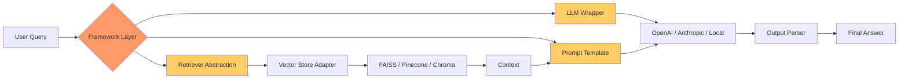
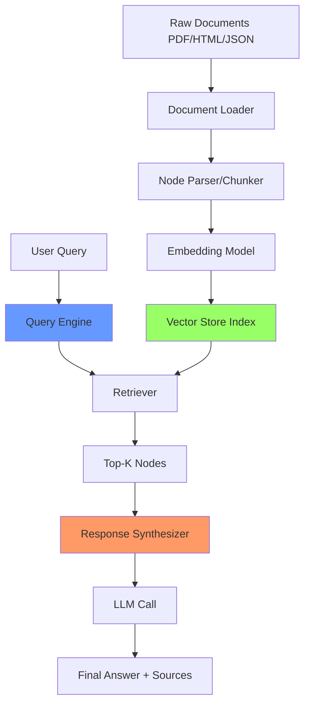
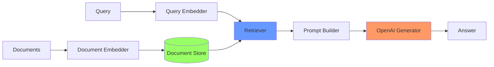
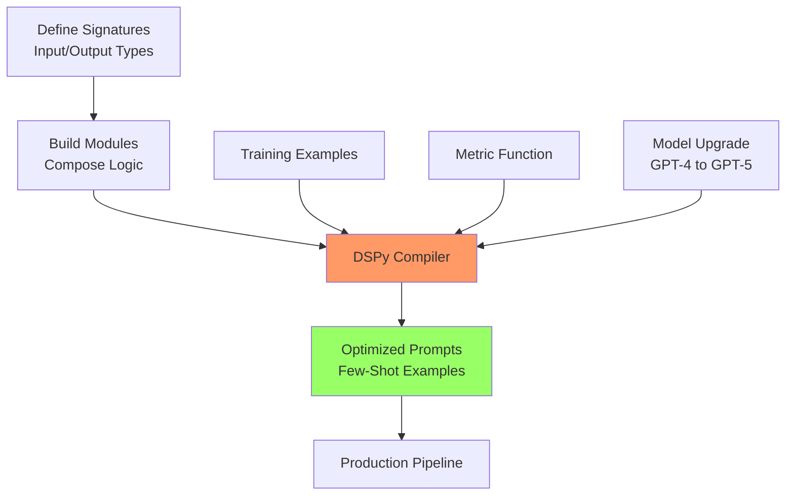
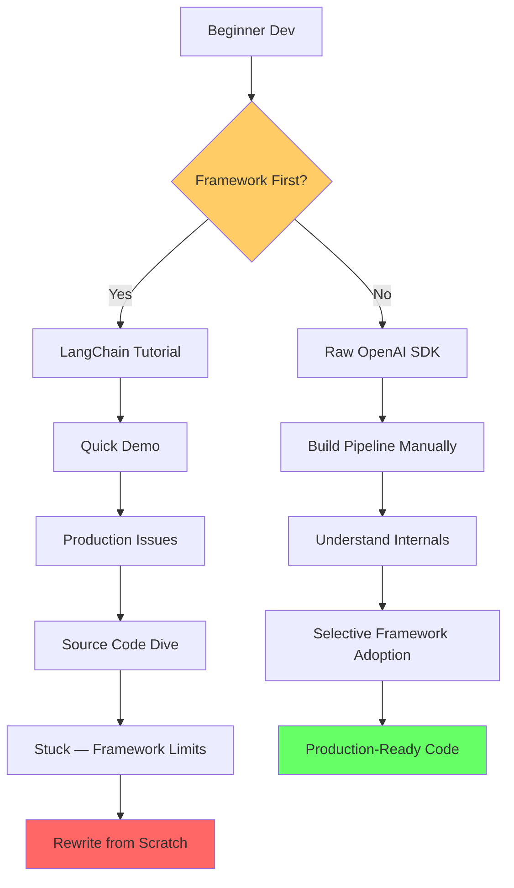

# LLM Frameworks (Use Critically, Not Religiously)

Dekh bhai, framework ek aisa cheez hai jo tumhare 50 lines of code ko 5 lines me convert kar deta hai. Sounds amazing, right? Par price ye hota hai ki tum andar kya ho raha hai woh nahi samajhte. Jab production me bug aata hai, jab latency 10 second ho jaati hai, jab token cost 100x explode kar jaati hai — tab tumhe debug karna padta hai woh code jo tumne kabhi padha hi nahi. Aur framework ke abstractions itne deep hote hain ki tum 5 layers neeche jaake bhi root cause nahi nikaal pate. Top 2% engineer woh hota hai jo raw build karne ke baad framework tak reach karta hai — usko pata hota hai ki framework kya hide kar raha hai, kahan optimize karna hai, aur kab framework ko bypass karke direct API call maarni hai.

LangChain, LlamaIndex, Haystack, DSPy — ye sab tools hain. Tools good servants hote hain, bad masters. Agar tum prototype banana chahte ho ek weekend me, framework lo. Agar tum production system bana rahe ho jisme reliability, observability, aur cost matter karte hain — pehle raw banao, fir selectively framework ka piece use karo. Senior engineers ka general rule: "Framework ko library ki tarah use karo, philosophy ki tarah nahi." Matlab cherry-pick the useful pieces (vector store wrappers, prompt templates) but apna control flow khud likho. Is guide me hum 5 frameworks ko critically dekhenge — kab kaam aate hain, kab disaster hote hain, aur raw equivalent kya hota hai.

Ek aur baat — frameworks fast move karte hain. LangChain ne 2023 me jo API tha, 2024 me deprecate ho gaya, 2025 me LangGraph aaya, ab phir kuch naya hoga. Jo developer framework par dependent hai uska code har 6 mahine me break hota hai. Jo developer raw understand karta hai uska code 5 saal chalta hai. Decide karo tumhe kya banna hai.

---

## 1. Frameworks Overview

LLM frameworks basically teen kaam karte hain: (1) prompt templating aur chaining, (2) external data integration (RAG, tools, APIs), aur (3) agent orchestration (LLM ko decisions lene dena). Har framework iska apna flavor leke aata hai. LangChain general-purpose hai, LlamaIndex RAG-focused, Haystack production-grade NLP pipelines ke liye, aur DSPy ek alag philosophy follow karta hai — prompt likhne ki bajaye prompt ko optimize karna sikhata hai. Hum har ek ko deeply dekhenge.

---

### 1.1 LangChain — when it helps, when it hurts

**Definition:** LangChain ek Python (aur JS) framework hai jo LLM applications banane ke liye abstractions deta hai — chains, agents, memory, retrievers, tools. Iska core philosophy hai "compose karo small pieces ko complex behavior banane ke liye." Iska graph-based successor LangGraph hai jo stateful agents ke liye banaya gaya hai.

**Why use it:** Agar tum jaldi prototype banana chahte ho — ek RAG bot, ek agent jo tools call kare, ek conversational memory wala chatbot — LangChain me 50 lines me ho jaata hai. Iska ecosystem huge hai: 700+ integrations (vector stores, LLMs, APIs). Documentation aur community bhi strong hai.

**Why it hurts:** LangChain ke abstractions leaky hain. Jab kuch break hota hai, tumhe 4-5 layers neeche jaana padta hai source code me. Iski API frequently change hoti hai (v0.1 se v0.2, v0.2 se v0.3 — sab major breaking changes). Token usage tracking, latency profiling, error handling — ye sab framework hide kar deta hai aur tumhe production me surprise milta hai. Senior devs ka common complaint: "LangChain me debug karna openai.ChatCompletion.create() debug karne se 10x harder hai."

**How — Framework code:**

```python
# LangChain me ek simple RAG pipeline
# pip install langchain langchain-openai langchain-community faiss-cpu

from langchain_openai import ChatOpenAI, OpenAIEmbeddings
from langchain_community.vectorstores import FAISS
from langchain_core.prompts import ChatPromptTemplate
from langchain_core.runnables import RunnablePassthrough
from langchain_core.output_parsers import StrOutputParser

# Step 1 — embeddings aur vector store setup
embeddings = OpenAIEmbeddings(model="text-embedding-3-small")
docs = ["Bhopal MP ki capital hai.", "Indore MP ka largest city hai."]
vectorstore = FAISS.from_texts(docs, embeddings)
retriever = vectorstore.as_retriever(search_kwargs={"k": 2})

# Step 2 — prompt template
prompt = ChatPromptTemplate.from_template(
    "Context ke basis pe answer do:\n{context}\n\nQuestion: {question}"
)

# Step 3 — LLM
llm = ChatOpenAI(model="gpt-4o-mini", temperature=0)

# Step 4 — chain banao (LCEL syntax — pipe operators)
chain = (
    {"context": retriever, "question": RunnablePassthrough()}
    | prompt
    | llm
    | StrOutputParser()
)

# Run
answer = chain.invoke("MP ki capital kya hai?")
print(answer)
```

**Same cheez raw me:**

```python
# Raw OpenAI + FAISS — koi framework nahi
import openai
import faiss
import numpy as np

client = openai.OpenAI()

# Step 1 — embeddings manually banao
docs = ["Bhopal MP ki capital hai.", "Indore MP ka largest city hai."]

def embed(texts):
    # OpenAI ka embedding API call
    resp = client.embeddings.create(model="text-embedding-3-small", input=texts)
    return np.array([d.embedding for d in resp.data], dtype="float32")

doc_vectors = embed(docs)

# Step 2 — FAISS index banao
index = faiss.IndexFlatL2(doc_vectors.shape[1])
index.add(doc_vectors)

# Step 3 — query handle karo
def rag(question, k=2):
    # Question ka embedding
    q_vec = embed([question])
    # Top-k similar docs nikalo
    distances, indices = index.search(q_vec, k)
    context = "\n".join([docs[i] for i in indices[0]])
    
    # Prompt manually banao
    messages = [
        {"role": "system", "content": "Tum ek helpful assistant ho."},
        {"role": "user", "content": f"Context:\n{context}\n\nQuestion: {question}"}
    ]
    
    # LLM call
    resp = client.chat.completions.create(
        model="gpt-4o-mini",
        messages=messages,
        temperature=0
    )
    return resp.choices[0].message.content

print(rag("MP ki capital kya hai?"))
```

Dekh, raw version 30 lines hai, framework version 25 lines hai. Bara difference nahi. Par raw version me tumhe pata hai EXACT kya ho raha hai — kab embedding ban rahi hai, kab API call ja rahi hai, kya prompt LLM ko ja raha hai. Framework version me ye sab `chain.invoke()` ke andar hide hai. Production me jab debug karna pade, raw version tumhe save karega.

**Real-life example:** Ek fintech startup ne LangChain use karke customer support bot banaya. 3 mahine me prototype ready, demo amazing. Production me launch kiya — pehle din ek customer ne weird query maari, agent infinite loop me chala gaya, $400 ka API bill 1 ghante me. Team ne LangChain source dive kiya — `AgentExecutor` ka loop logic itna nested tha ki samajhne me 2 din lage. Final fix? LangChain hata diya, raw OpenAI call + custom state machine likha. 200 lines, but fully understood.

**Mermaid Diagram:**



Orange boxes ye framework layer hai jo tumhare control me nahi hota — yahi pe debug pain hota hai.

**Interview Q&A:**

*Q1: LangChain kab use karna chahiye aur kab nahi?*
LangChain perfect hai jab tum (a) prototype bana rahe ho jisko production tak nahi le jaana, (b) tumhare team me junior devs hain jo abstractions chahiye, ya (c) tum LangSmith ka tracing/observability use karna chahte ho. LangChain avoid karo jab (a) latency critical hai (har abstraction layer 50-100ms add karta hai), (b) tum custom retry logic, error handling, ya streaming chahte ho jo framework ke way se match nahi karta, (c) tum library ka koi naya feature use karna chahte ho jo framework ne abhi support nahi kiya. Senior engineers usually LangChain ka prompt template aur output parser hi use karte hain, baaki sab raw likhte hain.

*Q2: LangChain Expression Language (LCEL) kya hai aur kyu introduce hua?*
LCEL ek declarative syntax hai jisme tum `|` (pipe) operator use karke chains banate ho — `prompt | llm | parser`. Ye Unix pipes se inspired hai. Iska benefit ye hai ki har component ek `Runnable` interface implement karta hai jisme `invoke()`, `batch()`, `stream()`, `ainvoke()` (async) sab built-in hain. Pehle LangChain me chains imperatively likhte the (`LLMChain`, `SequentialChain`) jo verbose aur inflexible tha. LCEL me composability better hai. Par downside — LCEL ka error message bahut bekaar hai, type errors run-time pe milte hain compile time pe nahi.

*Q3: Production me LangChain agent infinite loop me chala jaye to kya karoge?*
Sabse pehle `max_iterations` parameter set karna chahiye `AgentExecutor` me — by default ye 15 hota hai jo bahut zyada hai, hum usually 5 rakhte hain. Phir `early_stopping_method="generate"` set karo taaki max hit hone par bhi ek meaningful response mile. Token budget per request define karo with hard cap. Logging me har step ka tool call, intermediate observation, aur LLM thought capture karo (LangSmith ya custom callback handler se). Long-term solution — agar agent unreliable hai to LangGraph par migrate karo jo explicit state machine deta hai, ya raw FSM (finite state machine) likho jisme tum control flow fully own karte ho.

*Q4: LangChain vs raw OpenAI calls — performance difference?*
Benchmarks me LangChain typically 100-300ms extra latency add karta hai per request (abstraction layers, callback handlers, parsing). Memory usage bhi 2-3x zyada hota hai because of Pydantic validation aur object hierarchies. Raw OpenAI client direct HTTP call karta hai jo fastest path hai. Agar tumhare app me 1000 RPS hai aur har request pe 200ms extra add hota hai — that's expensive both in latency aur cost (more compute). High-scale production me senior engineers raw HTTP client (`httpx`) use karte hain with custom connection pooling.

---

### 1.2 LlamaIndex — strong for RAG/indexing

**Definition:** LlamaIndex (pehle GPT Index) ek data framework hai specifically banaya gaya hai LLM applications ke liye jo external data ke saath kaam karte hain. Iska focus hai data ingestion, indexing, aur retrieval — basically RAG ke liye purpose-built. LangChain general-purpose hai; LlamaIndex deeply RAG-optimized hai.

**Why use it:** Agar tumhe complex documents (PDFs with tables, knowledge graphs, multi-modal data) ko index karna hai aur query karna hai, LlamaIndex ke abstractions LangChain se behtar hain. Iske advanced features — Sub-Question Query Engine, Router Query Engine, Recursive Retrieval — ye sab production-grade RAG ke liye useful hain. Iska data connectors ka ecosystem (LlamaHub) bhi 300+ integrations rakhta hai.

**Why it can hurt:** Same problem jo LangChain ka — abstractions leaky hain. Iska "Index" abstraction kabhi-kabhi confusing ho jaata hai (VectorStoreIndex, SummaryIndex, TreeIndex, KeywordTableIndex — kya farak hai?). API churn bhi hai. Aur agar tumhara use case simple hai (single document, basic retrieval), LlamaIndex overkill hai.

**How — Framework code:**

```python
# LlamaIndex se PDF ka RAG bot
# pip install llama-index llama-index-llms-openai llama-index-embeddings-openai

from llama_index.core import VectorStoreIndex, SimpleDirectoryReader, Settings
from llama_index.llms.openai import OpenAI
from llama_index.embeddings.openai import OpenAIEmbedding

# Global settings
Settings.llm = OpenAI(model="gpt-4o-mini", temperature=0)
Settings.embed_model = OpenAIEmbedding(model="text-embedding-3-small")
Settings.chunk_size = 512
Settings.chunk_overlap = 50

# Step 1 — documents load karo (PDFs, txt, etc. auto-detect)
documents = SimpleDirectoryReader("./data").load_data()

# Step 2 — index banao (embeddings + vector store automatic)
index = VectorStoreIndex.from_documents(documents)

# Step 3 — query engine
query_engine = index.as_query_engine(similarity_top_k=3)

# Query
response = query_engine.query("Document me revenue kitna mention hua hai?")
print(response)
print("Sources:", response.source_nodes)
```

**Same cheez raw me:**

```python
# Raw — PDF parsing + chunking + embedding + retrieval manually
import openai
import faiss
import numpy as np
import pypdf
from pathlib import Path

client = openai.OpenAI()

# Step 1 — PDF parse karo
def load_pdf(path):
    reader = pypdf.PdfReader(path)
    return "\n".join([p.extract_text() for p in reader.pages])

# Step 2 — chunking — fixed-size with overlap
def chunk_text(text, chunk_size=512, overlap=50):
    words = text.split()
    chunks = []
    i = 0
    while i < len(words):
        chunk = " ".join(words[i:i + chunk_size])
        chunks.append(chunk)
        i += chunk_size - overlap
    return chunks

# Step 3 — embed all chunks
def embed(texts):
    resp = client.embeddings.create(
        model="text-embedding-3-small", input=texts
    )
    return np.array([d.embedding for d in resp.data], dtype="float32")

# Step 4 — pipeline
all_chunks = []
for pdf_path in Path("./data").glob("*.pdf"):
    text = load_pdf(pdf_path)
    chunks = chunk_text(text)
    all_chunks.extend(chunks)

vectors = embed(all_chunks)
index = faiss.IndexFlatL2(vectors.shape[1])
index.add(vectors)

# Step 5 — query
def query(question, k=3):
    q_vec = embed([question])
    distances, indices = index.search(q_vec, k)
    context = "\n---\n".join([all_chunks[i] for i in indices[0]])
    
    resp = client.chat.completions.create(
        model="gpt-4o-mini",
        messages=[
            {"role": "system", "content": "Sirf context se answer do."},
            {"role": "user", "content": f"Context:\n{context}\n\nQ: {question}"}
        ],
        temperature=0
    )
    return resp.choices[0].message.content, [all_chunks[i] for i in indices[0]]

answer, sources = query("Revenue kitna mention hua hai?")
print(answer)
```

Raw version me tum chunking strategy fully control kar sakte ho — semantic chunking, sliding window, recursive splitting. Tumhe samajh aata hai ki retrieval quality kyu ya kyu nahi accha hai. LlamaIndex me ye sab "magic" ke peeche hide hota hai — accha chalta hai default case me, par jab tweak karna ho to source dive karna padta hai.

**Real-life example:** Ek law firm ne 50,000 legal documents par RAG banaya. LlamaIndex se 2 hafte me prototype ready. Par accuracy 60% pe stuck thi. Investigation me pata laga ki default chunking legal clauses ko tod rahi thi (ek clause beech me cut ho raha tha). Custom chunking likhi (clause-aware splitter) — par LlamaIndex ke abstractions ke andar inject karna painful tha. End me team ne LlamaIndex hata diya, raw pipeline likha with `unstructured.io` for parsing aur custom semantic chunker. Accuracy 88% ho gayi. Lesson — domain-specific data me framework ke defaults rarely optimal hote hain.

**Mermaid Diagram:**



**Interview Q&A:**

*Q1: LlamaIndex me Index types kya kya hain aur kab kaunsa use karein?*
Char main types hain — VectorStoreIndex (default, embedding-based similarity search, most common), SummaryIndex (document me sequentially traverse karta hai, small docs ke liye), TreeIndex (hierarchical summarization, very long docs ke liye), aur KeywordTableIndex (keyword-based, jab embeddings unreliable ho jaise highly technical jargon). Production me 95% cases me VectorStoreIndex hi use hota hai. TreeIndex useful hai jab tumhe ek long book ka summary chahiye — pehle chunks summarize, fir summaries ka summary, recursive way me. KeywordTableIndex ab almost deprecated hai because embeddings improve ho gaye.

*Q2: LlamaIndex aur LangChain dono RAG karte hain — concrete difference kya hai?*
LangChain general framework hai with RAG as one feature. LlamaIndex RAG-first design hai. Concrete differences — (1) LlamaIndex ke retrievers zyada sophisticated hain (Recursive Retrieval, Auto-Merging Retrieval, Sentence Window Retrieval), (2) LlamaIndex me query transformations built-in hain (HyDE, query decomposition, multi-step query), (3) LangChain me agent capabilities aur tool integration zyada strong hai. Practical advice — agar tumhara use case predominantly RAG hai, LlamaIndex use karo. Agar tumhe agents, tool calling, complex workflows chahiye, LangChain use karo. Ya dono mix karo — LlamaIndex se retrieval, LangChain se orchestration.

*Q3: Sentence Window Retrieval kya hai aur kyu useful hai?*
Default retrieval me tum chunk return karte ho jisme query match hua. Problem — chunk boundary par information cut ho sakti hai. Sentence Window Retrieval me tum chote chunks (1 sentence) embed karte ho but retrieval ke time pe us sentence ke around ka window (5 sentences before, 5 after) return karte ho. Isse precision (matching) accha hota hai aur context bhi preserved rehta hai. Ye legal docs, medical records, technical docs me bahut useful hai jahan sentence-level precision chahiye but context bhi lose nahi karna.

*Q4: LlamaIndex ke saath observability kaise karte ho?*
LlamaIndex me callback system hai jo har step pe events fire karta hai — embedding, retrieval, LLM call, response synthesis. Tum custom callback handler likh sakte ho jo events ko log karta hai. Production me usually Phoenix (Arize) ya LangFuse use karte hain — ye OpenTelemetry-based hain aur LlamaIndex ke saath out of box integrate hote hain. Important metrics track karne hote hain — retrieval latency, embedding cache hit rate, retrieved chunks ki relevance score, hallucination rate (LLM ne context se hatke kya bola), token usage per query. Without observability, RAG system ko production me debug karna almost impossible hai.

---

### 1.3 Haystack

**Definition:** Haystack ek open-source NLP framework hai (deepset.ai banata hai) jo production-grade search aur QA systems ke liye design hua hai. Pre-LLM era me ye semantic search aur extractive QA ke liye famous tha (BERT-based). Ab Haystack 2.0 me LLMs aur generative AI deeply integrated hain. Iska USP hai — pipeline-based architecture jo modular aur production-ready hai.

**Why use it:** Haystack ka design "production-first" hai — har component clear interface follow karta hai, type-safe hai (Pydantic), aur deployable hai REST API ke through. Agar tum enterprise NLP system bana rahe ho jisme high-volume search, structured QA, document processing chahiye — Haystack solid choice hai. Iska Hayhooks (REST deployment) aur deepset Cloud (managed) ecosystem strong hai.

**Why it can hurt:** Haystack ka community LangChain/LlamaIndex se chota hai — to integrations kam hain aur Stack Overflow pe answers bhi kam milte hain. Iska learning curve thoda steeper hai — pipeline DSL samajhne me time lagta hai. Aur agar tum cutting-edge LLM features (latest tool calling, structured outputs) use karna chahte ho, Haystack me support thoda lag karta hai LangChain ke comparison me.

**How — Framework code:**

```python
# Haystack 2.x me RAG pipeline
# pip install haystack-ai

from haystack import Pipeline, Document
from haystack.components.embedders import OpenAITextEmbedder, OpenAIDocumentEmbedder
from haystack.components.retrievers import InMemoryEmbeddingRetriever
from haystack.document_stores.in_memory import InMemoryDocumentStore
from haystack.components.builders import PromptBuilder
from haystack.components.generators import OpenAIGenerator

# Step 1 — document store
doc_store = InMemoryDocumentStore()

# Step 2 — documents add karo (embedding ke saath)
docs = [
    Document(content="Bhopal MP ki capital hai."),
    Document(content="Indore MP ka largest city hai."),
]
doc_embedder = OpenAIDocumentEmbedder(model="text-embedding-3-small")
embedded_docs = doc_embedder.run(docs)["documents"]
doc_store.write_documents(embedded_docs)

# Step 3 — pipeline banao
template = """
Context ke basis pe answer do:

{{ doc.content }}

Question: {{ question }}
"""

pipe = Pipeline()
pipe.add_component("query_embedder", OpenAITextEmbedder(model="text-embedding-3-small"))
pipe.add_component("retriever", InMemoryEmbeddingRetriever(document_store=doc_store, top_k=3))
pipe.add_component("prompt_builder", PromptBuilder(template=template))
pipe.add_component("llm", OpenAIGenerator(model="gpt-4o-mini"))

# Connections — ye explicitly declare karna hota hai
pipe.connect("query_embedder.embedding", "retriever.query_embedding")
pipe.connect("retriever.documents", "prompt_builder.documents")
pipe.connect("prompt_builder.prompt", "llm.prompt")

# Run
result = pipe.run({
    "query_embedder": {"text": "MP ki capital kya hai?"},
    "prompt_builder": {"question": "MP ki capital kya hai?"}
})
print(result["llm"]["replies"][0])
```

**Same cheez raw me:** (Same as before — raw OpenAI + FAISS, lines reduce kar sakte ho.)

Haystack ka strength ye hai ki ye pipeline DAG (directed acyclic graph) explicitly maintain karta hai — har component ke inputs/outputs typed hain. Production deployment me ye predictable behavior deta hai. Par boilerplate zyada hai — same RAG LangChain me 10 lines me ho jaata hai, Haystack me 25 lines.

**Real-life example:** Ek German news agency ne Haystack use karke 10 million news articles par semantic search system banaya. Daily 50,000 queries handle karte hain. Choice Haystack ki kyu? — kyunki unhe REST API deployment, type safety, aur multi-language support chahiye tha (German + English). Haystack ka pipeline architecture unhe horizontal scaling allow karta hai — har component independently scale hota hai (embedder pool alag, retriever pool alag, LLM pool alag). LangChain me itna clean separation difficult hota.

**Mermaid Diagram:**



**Interview Q&A:**

*Q1: Haystack ka pipeline architecture LangChain se kaise alag hai?*
Haystack me pipeline ek explicit DAG hai — tum components add karte ho aur connections explicitly declare karte ho (`pipe.connect("a.output", "b.input")`). Type safety enforced hai — agar tumne mismatched types connect kiye, runtime error nahi, import time pe error milta hai. LangChain ka LCEL bhi DAG-like hai but linear pipe operator se, jisme branching aur merging zyada complex ho jaata hai. Haystack ka model production deployments ke liye behtar hai — tum pipeline ko serialize kar sakte ho, REST API ke through expose kar sakte ho, monitoring add kar sakte ho. LangChain me ye sab manual karna padta hai.

*Q2: Haystack 1.x aur 2.x me kya difference hai?*
Haystack 1.x BERT-era ka tha — extractive QA, dense passage retrieval, document stores like Elasticsearch + custom embedders. Architecture tightly coupled tha "Reader-Retriever" pattern me. Haystack 2.x complete rewrite hai — generative LLM-first, modular components, async support, type-safe pipelines. 2.x me har component standalone hai aur tum LLM-only pipelines bhi bana sakte ho without retrieval. Migration painful tha — 1.x ka koi code 2.x me directly nahi chalta. Lesson — production me jab framework choose karte ho, version stability dekho. Haystack abhi stable hai 2.x me.

*Q3: Haystack production deployment ke liye kya tools deta hai?*
Hayhooks ek tool hai jo Haystack pipeline ko REST API me convert karta hai automatically — tum pipeline define karte ho, FastAPI endpoint auto-generate hota hai. deepset Cloud managed offering hai jisme deployment, monitoring, A/B testing, evaluation sab built-in hai. Open-source me tum khud Docker me deploy kar sakte ho with proper resource isolation. Important production features Haystack me — telemetry/tracing (OpenTelemetry), pipeline serialization (YAML), versioning, aur evaluation harness (TruLens-style metrics).

*Q4: LangChain vs Haystack — final recommendation kab kya use karein?*
LangChain — fast prototyping, large ecosystem, latest LLM features, agent-heavy workflows, JS/TS support chahiye (Haystack only Python hai). Haystack — production-grade NLP system, type safety important, multilingual document processing, traditional NLP tasks (NER, summarization) bhi chahiye, deepset Cloud use karna hai. In practice, startups LangChain pick karte hain aur enterprises Haystack — kyunki enterprise me stability aur predictability matter karte hain, startups me speed.

---

### 1.4 DSPy — programming with LLMs

**Definition:** DSPy (Stanford NLP lab se) ek framework hai jiska philosophy bilkul different hai — instead of writing prompts, tum programs likhte ho jo LLM ko module ki tarah treat karte hain. DSPy compiler tumhare program ke prompts ko AUTOMATICALLY optimize karta hai using few-shot examples, instruction tuning, aur even fine-tuning. Tagline — "Programming, not prompting."

**Why use it:** Manual prompt engineering ek black art hai — tum hours spend karte ho prompt tweaks pe, aur ek model upgrade me sab break ho jaata hai. DSPy isse solve karta hai by treating prompts as parameters that can be optimized. Tum signature define karte ho ("input X se output Y banao"), DSPy compiler dataset par train hoke optimal prompts generate karta hai. Research-y feel hai par production me bhi use ho raha hai jab tumhe consistent quality chahiye across model upgrades.

**Why it's controversial:** DSPy ka learning curve steepest hai — paradigm shift hai (declarative programming, compilers, optimizers). Debugging tough hai because optimizer kya kar raha hai pat samajhna mushkil. Aur agar tumhare paas evaluation dataset nahi hai (which is most cases), DSPy ka biggest feature (auto-optimization) useless ho jaata hai.

**How — Framework code:**

```python
# DSPy me ek QA system
# pip install dspy-ai

import dspy

# Step 1 — LM configure karo
lm = dspy.LM(model="openai/gpt-4o-mini", api_key="...")
dspy.settings.configure(lm=lm)

# Step 2 — Signature define karo (input/output types declarative)
class GenerateAnswer(dspy.Signature):
    """Context se question ka answer do, short aur factual."""
    context: str = dspy.InputField(desc="relevant documents")
    question: str = dspy.InputField()
    answer: str = dspy.OutputField(desc="short factual answer")

# Step 3 — Module banao
class RAG(dspy.Module):
    def __init__(self, num_passages=3):
        super().__init__()
        self.retrieve = dspy.Retrieve(k=num_passages)
        self.generate_answer = dspy.ChainOfThought(GenerateAnswer)
    
    def forward(self, question):
        context = self.retrieve(question).passages
        prediction = self.generate_answer(context=context, question=question)
        return dspy.Prediction(context=context, answer=prediction.answer)

# Step 4 — Optimizer use karo (yahan magic hota hai)
from dspy.teleprompt import BootstrapFewShot

# Training examples chahiye
trainset = [
    dspy.Example(question="MP ki capital?", answer="Bhopal").with_inputs("question"),
    # ... more examples
]

# Metric define karo
def validate_answer(example, pred, trace=None):
    return example.answer.lower() in pred.answer.lower()

# Compile (optimize)
optimizer = BootstrapFewShot(metric=validate_answer)
compiled_rag = optimizer.compile(RAG(), trainset=trainset)

# Use
result = compiled_rag("MP ki capital kya hai?")
print(result.answer)
```

**Same cheez raw me:**

```python
# Raw — manual prompt engineering with few-shot
import openai
client = openai.OpenAI()

# Tumne manually craft kiya hua prompt — hours of tweaking
PROMPT = """Tum ek QA assistant ho. Context se question ka short factual answer do.

Examples:
Context: "Bhopal MP ki capital hai. Indore largest city hai."
Question: MP ki capital kya hai?
Answer: Bhopal

Context: "Mumbai Maharashtra ki capital hai."
Question: Maharashtra ki capital?
Answer: Mumbai

Context: {context}
Question: {question}
Answer:"""

def rag(question, context):
    prompt = PROMPT.format(context=context, question=question)
    resp = client.chat.completions.create(
        model="gpt-4o-mini",
        messages=[{"role": "user", "content": prompt}],
        temperature=0
    )
    return resp.choices[0].message.content
```

Difference clear hai — raw me TUM prompt engineering karte ho, DSPy me COMPILER karta hai. Agar tumhare paas evaluation dataset hai aur tum quality maximize karna chahte ho across model versions, DSPy game-changer hai. Without dataset, DSPy unnecessary complexity hai.

**Real-life example:** Stanford ka ek research team ne medical QA system banaya — initially raw GPT-3.5 prompts ke saath, accuracy 65%. Manual prompt engineering me 1 mahina spend kiya, 72% pe pahuche. Phir DSPy try kiya with 200 labeled examples — compiler ne automatically optimal prompts generate kiye, accuracy 81% ho gayi. Aur jab GPT-4 release hua, simply re-compile kiya — same code, naya optimal prompt for new model, accuracy 89%. Ye power hai DSPy ki — model agnostic optimization. Trade-off — initial setup aur dataset banane me 2 hafte gaye.

**Mermaid Diagram:**



**Interview Q&A:**

*Q1: DSPy ka core innovation kya hai compared to LangChain?*
LangChain me tum prompts manually likhte ho — strings me. DSPy me tum signatures (types) define karte ho aur logic ko module me likhte ho — actual prompt strings DSPy compiler generate karta hai based on training data. Ye paradigm "PyTorch for prompts" jaisa hai — tum architecture define karte ho, optimizer parameters (prompts) tune karta hai. Practical benefit — model upgrade pe tumhe prompts re-engineer nahi karne padte, just re-compile karo. Aur prompts data-driven hain, intuition-driven nahi.

*Q2: BootstrapFewShot optimizer kaise kaam karta hai?*
Algorithm simple hai conceptually — DSPy training examples par tumhare module ko run karta hai. Jo examples par module sahi answer deta hai (metric pass), unko few-shot demonstrations ki tarah save karta hai. Final compiled module me ye demonstrations prompt me automatically inject hote hain — to LLM ko better in-context examples milte hain. Advanced optimizers (MIPRO, COPRO) instructions ko bhi rewrite karte hain. Key insight — LLMs few-shot learning me strong hain, to acche examples hi sabse impactful prompt engineering technique hai. DSPy isse automate karta hai.

*Q3: DSPy kab over-engineering hai?*
Agar tumhare paas labeled dataset nahi hai, DSPy ka main feature unusable hai — to tum bas regular framework features use kar rahe ho with extra complexity. Agar tumhara use case simple hai (ek prompt, ek model, occasional change), manual prompt engineering faster aur readable hai. Agar tumhe interpretability chahiye (kya prompt LLM ko ja raha hai exactly), DSPy ka generated prompts kabhi-kabhi cryptic hote hain. DSPy worth it hai jab — high-volume production, frequent model upgrades, dataset available, aur quality critical hai.

*Q4: Production me DSPy ko deploy kaise karte hain?*
Compile step offline hota hai — usually CI/CD pipeline me. Compiled module ko serialize karte hain (pickle ya JSON), production server load karta hai aur inference karta hai. Compilation expensive hai (LLM calls karta hai optimizer), to har deploy pe nahi karte — periodic re-compile (weekly ya monthly, ya jab evaluation metric drop ho). Monitoring me both functional metric (accuracy) aur operational metric (latency, cost) track karne hote hain. DSPy ke generated prompts version control me check karna important hai — taaki regression detect ho.

---

### 1.5 Build raw before frameworks — why

**Definition:** "Build raw" matlab framework ka use karne se pehle direct LLM API (OpenAI SDK, Anthropic SDK) aur basic libraries (FAISS, NumPy, requests) se pure Python me apna pipeline likhna. No abstractions, no magic, full control.

**Why this matters (the philosophy):** Frameworks abstractions hain. Abstractions value tabhi deti hain jab tumhe underlying problem deeply samajh aata ho. Agar tum framework se shuru karte ho, tum abstractions ko karget treat karte ho — kuch break ho to "framework ka issue hoga" sochte ho instead of root cause find karne ke. Senior engineers ka unanimous advice — pehle 2-3 projects raw banao, fir framework adopt karo selectively. Ye "earn the right to use frameworks" wala mindset hai.

**Concrete benefits of raw build:**

1. **Debugging skill** — jab tumne raw banaya hai, tumhe pata hai exact kahan kya ho raha hai. Token usage, latency bottleneck, error source — sab visible hai.
2. **Cost optimization** — frameworks bahut sara waste karte hain — extra API calls (validation), extra tokens (verbose prompts), extra latency (parsing layers). Raw me tum har token ke liye accountable ho.
3. **Customization freedom** — production me tumhe weird custom logic chahiye hoti hai jo framework support nahi karta. Raw me tum kuch bhi likh sakte ho.
4. **Migration freedom** — agar OpenAI ka pricing change ho, ya Anthropic better ho jaye, raw code me 10 lines change karke switch kar lo. Framework code me deeply coupled hota hai.
5. **Interview signal** — senior interviews me framework knowledge zero credit milta hai. Jo raw understand karta hai, woh hire hota hai.

**How — Complete production-grade raw RAG (yahi build karke dikhao):**

```python
# Production-grade RAG without any framework
# Just openai + faiss + numpy + tenacity (retries)

import openai
import faiss
import numpy as np
import json
import logging
from dataclasses import dataclass
from typing import List, Optional
from tenacity import retry, stop_after_attempt, wait_exponential

logger = logging.getLogger(__name__)
client = openai.OpenAI()

@dataclass
class Document:
    """Ek chunk with metadata."""
    text: str
    source: str
    chunk_id: int
    embedding: Optional[np.ndarray] = None

@dataclass
class RAGConfig:
    """Sab configuration ek jagah."""
    embedding_model: str = "text-embedding-3-small"
    llm_model: str = "gpt-4o-mini"
    chunk_size: int = 512
    chunk_overlap: int = 50
    top_k: int = 3
    temperature: float = 0.0
    max_tokens: int = 500

class RAGPipeline:
    def __init__(self, config: RAGConfig):
        self.config = config
        self.documents: List[Document] = []
        self.index: Optional[faiss.IndexFlatL2] = None
    
    @retry(stop=stop_after_attempt(3), wait=wait_exponential(multiplier=1, max=10))
    def _embed_batch(self, texts: List[str]) -> np.ndarray:
        """Retry-wrapped embedding. Production me network failures hote hain."""
        resp = client.embeddings.create(
            model=self.config.embedding_model,
            input=texts
        )
        return np.array([d.embedding for d in resp.data], dtype="float32")
    
    def _chunk(self, text: str, source: str) -> List[Document]:
        """Sliding window chunking. Word-based, simple but effective."""
        words = text.split()
        chunks = []
        i = 0
        chunk_id = 0
        while i < len(words):
            chunk_text = " ".join(words[i:i + self.config.chunk_size])
            chunks.append(Document(
                text=chunk_text,
                source=source,
                chunk_id=chunk_id
            ))
            i += self.config.chunk_size - self.config.chunk_overlap
            chunk_id += 1
        return chunks
    
    def ingest(self, texts: List[tuple]) -> None:
        """texts: [(text, source), ...]. Sab chunks banao, embed karo, index karo."""
        for text, source in texts:
            self.documents.extend(self._chunk(text, source))
        
        # Batch embedding for efficiency (rate limits ka dhyan)
        BATCH = 100
        embeddings = []
        for i in range(0, len(self.documents), BATCH):
            batch = [d.text for d in self.documents[i:i + BATCH]]
            vecs = self._embed_batch(batch)
            for j, vec in enumerate(vecs):
                self.documents[i + j].embedding = vec
            embeddings.extend(vecs)
        
        all_vecs = np.array(embeddings, dtype="float32")
        self.index = faiss.IndexFlatL2(all_vecs.shape[1])
        self.index.add(all_vecs)
        logger.info(f"Indexed {len(self.documents)} chunks")
    
    def retrieve(self, question: str) -> List[Document]:
        q_vec = self._embed_batch([question])
        distances, indices = self.index.search(q_vec, self.config.top_k)
        return [self.documents[i] for i in indices[0]]
    
    @retry(stop=stop_after_attempt(3), wait=wait_exponential(multiplier=1, max=10))
    def _generate(self, messages: list) -> dict:
        resp = client.chat.completions.create(
            model=self.config.llm_model,
            messages=messages,
            temperature=self.config.temperature,
            max_tokens=self.config.max_tokens
        )
        return {
            "content": resp.choices[0].message.content,
            "input_tokens": resp.usage.prompt_tokens,
            "output_tokens": resp.usage.completion_tokens
        }
    
    def query(self, question: str) -> dict:
        retrieved = self.retrieve(question)
        context = "\n---\n".join([
            f"[Source: {d.source}#{d.chunk_id}]\n{d.text}" 
            for d in retrieved
        ])
        
        messages = [
            {"role": "system", "content": (
                "Tum ek factual QA assistant ho. Sirf context se answer do. "
                "Agar context me nahi hai, bolo 'Mujhe nahi pata'. "
                "Source citations include karo [Source: x] format me."
            )},
            {"role": "user", "content": f"Context:\n{context}\n\nQuestion: {question}"}
        ]
        
        result = self._generate(messages)
        return {
            "answer": result["content"],
            "sources": [{"source": d.source, "chunk_id": d.chunk_id} for d in retrieved],
            "tokens": {
                "input": result["input_tokens"],
                "output": result["output_tokens"]
            }
        }

# Use
config = RAGConfig(top_k=3, llm_model="gpt-4o-mini")
rag = RAGPipeline(config)
rag.ingest([
    ("Bhopal MP ki capital hai. Population around 2 million.", "wiki_mp"),
    ("Indore MP ka largest city hai by population.", "wiki_mp"),
])
result = rag.query("MP ki capital kya hai?")
print(json.dumps(result, indent=2))
```

Ye 100 lines hai. Production-ready. No framework. Tumhe pata hai EVERY token kahan ja raha hai, EVERY API call kab ho rahi hai, EVERY error kahan se aa raha hai. Tum ise easily extend kar sakte ho — semantic chunking add karo, hybrid retrieval (BM25 + dense) add karo, reranker add karo, streaming add karo. Framework me ye sab fight karke karna padta hai; raw me tum bas write karte ho.

**Real-life example:** Ek Series B startup ne 6 mahine LangChain me product banaya. Production me daily 10,000 queries. 3 mahine ke baad latency 5 seconds par chali gayi (because of nested abstractions), cost monthly $40K (because of inefficient prompts framework auto-generated kar raha tha). Senior engineer ne 2 hafte me raw rewrite kiya — 800 lines clean Python. Latency 1.2 seconds, cost $12K monthly. Same functionality. Lesson — framework ki productivity benefit short-term hota hai, long-term cost (latency + money + maintenance) zyada deti hai.

**Mermaid Diagram:**



**Interview Q&A:**

*Q1: Junior dev ko kya recommend karoge — framework first ya raw first?*
Definitely raw first. Reasons — (1) Frameworks abstractions hide karte hain — junior dev underlying concepts (embeddings, tokenization, retrieval, prompt structure) ko deeply samjhe bina UI use karta hai, jiska long-term harm hota hai. (2) Frameworks rapidly change hote hain, raw concepts permanent hain. Jo OpenAI API call karna jaanta hai, woh kal Anthropic, Gemini, kuch bhi seekh sakta hai — same fundamentals. (3) Interview signal — top companies framework knowledge zero count karti hain. Recommendation — pehle 3 raw projects banao (RAG, agent with tool calling, fine-tuning pipeline), uske baad selectively framework piece use karo.

*Q2: Frameworks me kya genuinely useful hai jo raw me painful hota hai?*
Honest answer — kuch cheezein genuinely useful hain. (1) Document loaders — PDF, HTML, DOCX parsing me framework loaders mature hain (LlamaIndex ka SimpleDirectoryReader). (2) Vector store wrappers — multiple stores (Pinecone, Weaviate, Qdrant) ke liye uniform interface useful hai migration ke time. (3) Streaming utilities — async streaming with proper backpressure handling tough hai raw me. (4) Observability integrations — LangSmith, LangFuse jaise tools framework ke saath out-of-box integrate hote hain. Pragmatic approach — framework ke ye specific pieces use karo, but core orchestration (control flow, prompting, error handling) raw rakho.

*Q3: Raw build ka biggest hidden challenge kya hota hai?*
Production me reliability — retries, rate limiting, error handling, timeout management. Frameworks me ye built-in hota hai (kabhi-kabhi badly), raw me tumhe manually implement karna padta hai. Specific challenges — (a) OpenAI rate limits (RPM, TPM) ko respect karna, exponential backoff with jitter, (b) network errors aur transient failures retry, (c) graceful degradation jab embedding service down ho, (d) token counting accurate (tiktoken use karo), (e) cost tracking aur budget alerts. Ye sab raw me karna mehnat ka kaam hai — but lifetime skill hai.

*Q4: Senior engineer raw aur framework me kaise balance karte hain?*
General pattern — "framework as library, not philosophy". Matlab framework ke specific functions/classes import karke use karo (e.g., `from langchain.text_splitter import RecursiveCharacterTextSplitter`), but tumhare overall architecture me framework ka assumption nahi hota. Tumhare main pipeline raw Python hai, framework helpers as utilities use hote hain. Iska benefit — framework ka 5% useful piece milta hai, 95% baggage avoid hota hai. Aur agar framework deprecated ho jaye, tumhe sirf utility piece replace karna padta hai, full rewrite nahi.

---

## Resources & further reading

- **OpenAI Cookbook** — [github.com/openai/openai-cookbook](https://github.com/openai/openai-cookbook) — best place for raw patterns; framework-free recipes.
- **LangChain Docs** — [python.langchain.com](https://python.langchain.com) — but read with critical eye; check version date on every page.
- **LlamaIndex Docs** — [docs.llamaindex.ai](https://docs.llamaindex.ai) — RAG-specific, with strong examples.
- **Haystack 2.0 Docs** — [docs.haystack.deepset.ai](https://docs.haystack.deepset.ai) — production-focused, type-safe pipelines.
- **DSPy Docs & Paper** — [dspy.ai](https://dspy.ai) + original Stanford paper "DSPy: Compiling Declarative Language Model Calls into Self-Improving Pipelines".
- **Anthropic's "Building Effective Agents"** (2024 essay) — most influential post on why to avoid framework over-engineering.
- **Hamel Husain's blog** — [hamel.dev](https://hamel.dev) — pragmatic advice on LLM evals and production systems.
- **Eugene Yan's writings** — [eugeneyan.com](https://eugeneyan.com) — applied ML in production, including RAG patterns.
- **FAISS docs** — [faiss.ai](https://faiss.ai) — vector search internals; raw understanding crucial.
- **Tiktoken** — OpenAI's tokenizer; raw understanding of tokens is foundational.
- **Phoenix (Arize)** — [phoenix.arize.com](https://phoenix.arize.com) — open-source observability for LLM apps; framework-agnostic.
- **LangFuse** — [langfuse.com](https://langfuse.com) — alternative observability platform.

**Final advice:** Framework choose mat karo, problem se shuru karo. Pehle apne use case ko paper pe likho — input, output, constraints (latency, cost, accuracy). Phir raw me sabse minimal version banao. Phir bottleneck identify karo. Phir us specific bottleneck ke liye framework piece evaluate karo. Ye disciplined approach tumhe top 2% me daalega — kyunki 98% developers framework first, problem second karte hain, aur isi liye unke systems brittle hote hain.
