# Working with LLM APIs

LLM API basically tumhe LLM intelligence ko ek HTTP call me ghussa deta hai. Kuch lines me tu apna agent build kar sakta hai — but production grade banane me 100 chhoti detail seekhni padti hain. Yeh guide tujhe senior-level intuition deta hai — kaise OpenAI, Anthropic, Gemini, aur local providers ko handle karna hai, kaise prompts ko engineer karna hai jaise sach me kaam karte hain (zero-shot se ReAct tak), aur kaise structured outputs nikalne hain bina production me 3am pe page hue.

Yeh document senior-dev-to-intern conversation ki tarah likha hai. Hum sirf "how to call" pe nahi rukenge — hum dekhenge token economics, streaming backpressure, JSON schema enforcement, retry strategies, aur prompt versioning ka real-world flow. Code snippets Python me hain (openai aur anthropic SDKs), Hinglish comments ke saath, taaki tu copy-paste karke samajh sake.

Ek baat yaad rakh — LLM API ek "deterministic function" nahi hai. Yeh ek probabilistic black box hai jo cost, latency, aur reliability tradeoffs ke saath aata hai. Tu jitna jaldi yeh mental model adopt karega, utna better engineer banega.

---

## 1. Provider APIs

LLM provider ek aisa SaaS hai jo tumhe ek model checkpoint ke saamne authenticated HTTPS endpoint deta hai. Tu prompt bhejta hai, woh tokens generate karke wapas bhejta hai. Bas isi flow ke around saari engineering hoti hai — auth, rate limits, retries, streaming, fallbacks. Provider choose karna ek architecture decision hai, na ki sirf "kaunsa cheap hai" wala question.

### 1.1 OpenAI API (chat, responses, structured outputs)

**Definition:** OpenAI API ek REST/SSE based service hai jo GPT family models (gpt-4o, gpt-4.1, o-series reasoning models) tak access deta hai. Teen primary surfaces hain — `chat.completions` (legacy but stable), `responses` (newer unified API jo tools, state, multimodal handle karta hai), aur Assistants API (stateful threads).

**Why:** OpenAI industry baseline hai. Agar tu kuch test kar raha hai aur reference quality chahiye, OpenAI se start karna safe bet hai. Tooling ecosystem (LangChain, LlamaIndex, Instructor) sab pehle yahin pe support deta hai. Structured outputs ke liye yeh sabse polished JSON Schema enforcement deta hai.

**How:**

```python
from openai import OpenAI

# Client initialize — env var OPENAI_API_KEY se key uthata hai
client = OpenAI()

# Chat Completions — classic interface, sab samajhte hain
response = client.chat.completions.create(
    model="gpt-4o-mini",
    messages=[
        {"role": "system", "content": "Tu ek senior backend engineer hai."},
        {"role": "user", "content": "Postgres me index kab use karna chahiye?"}
    ],
    temperature=0.3,        # creativity kam, deterministic zyada
    max_tokens=500          # output cap — billing safety net
)
print(response.choices[0].message.content)

# Structured output — JSON Schema enforce
from pydantic import BaseModel

class CodeReview(BaseModel):
    bugs: list[str]
    suggestions: list[str]
    severity: int  # 1-10

# parse() helper Pydantic schema ko bhej deta hai
parsed = client.beta.chat.completions.parse(
    model="gpt-4o-2024-08-06",
    messages=[{"role": "user", "content": "Review: def add(a,b): return a-b"}],
    response_format=CodeReview
)
review: CodeReview = parsed.choices[0].message.parsed
print(review.severity)
```

**Real-life example:** Ek SaaS ne customer support bot banaya. `chat.completions` use kiya, system prompt me product docs inject kiye, aur structured output se ticket category, urgency, aur suggested reply ek hi call me nikaal liye. 300ms median latency, 99.5% schema compliance.

**Mermaid:**

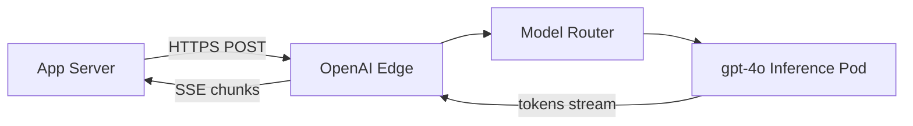

**Interview Q&A:**

*Q: Chat Completions aur Responses API me kya difference hai?*
Chat Completions stateless hai — har call me tu pura messages array bhejta hai. Responses API statefulness ka illusion deta hai (server side me previous_response_id tracking), tools first-class hain (web_search, file_search built in), aur multimodal inputs cleanly handle karta hai. Naye projects pe Responses API recommend hoti hai, lekin Chat Completions abhi bhi widely supported hai aur LangChain jaise libs mostly usi pe tuned hain.

*Q: Structured outputs aur JSON mode me farak?*
JSON mode bas guarantee karta hai ki output valid JSON hoga — schema match nahi karega zaroori. Structured outputs (response_format with strict=true) actually constrained decoding karta hai — model sirf wahi tokens emit kar sakta hai jo JSON Schema follow karein. Production me hamesha structured outputs use kar — JSON mode pe tu validation aur retry khud likhega.

---

### 1.2 Anthropic Claude API (messages, tool use, thinking)

**Definition:** Anthropic ka Messages API Claude family (Sonnet, Opus, Haiku) ko expose karta hai. Stateless conversation API jisme tool use, vision, prompt caching, aur "extended thinking" (Claude 3.7+) first-class hain.

**Why:** Claude ka strong suit lambe contexts (200K tokens), high-quality reasoning, aur instruction following hai. Coding aur agentic workflows me yeh OpenAI ko often beat karta hai. Prompt caching se repeated system prompts pe 90% cost cut milta hai.

**How:**

```python
import anthropic

client = anthropic.Anthropic()  # ANTHROPIC_API_KEY env se

# Basic message — system top-level parameter hai, messages me nahi
msg = client.messages.create(
    model="claude-sonnet-4-5",
    max_tokens=1024,
    system="Tu ek senior code reviewer hai. Sirf bugs bata.",
    messages=[
        {"role": "user", "content": "def divide(a,b): return a/b"}
    ]
)
print(msg.content[0].text)

# Extended thinking — model ko reasoning ke liye extra budget
msg = client.messages.create(
    model="claude-sonnet-4-5",
    max_tokens=8000,
    thinking={"type": "enabled", "budget_tokens": 5000},  # reasoning ke liye 5k tokens
    messages=[{"role": "user", "content": "Solve: A train problem..."}]
)
# msg.content me thinking blocks aur text blocks dono honge
for block in msg.content:
    if block.type == "thinking":
        print("REASONING:", block.thinking[:200])
    elif block.type == "text":
        print("ANSWER:", block.text)
```

**Real-life example:** Ek legal-tech startup ne 150-page contracts analyze karne ke liye Claude use kiya. 200K context me poora contract daala, prompt caching se baar-baar same contract pe 95% input cost bach gayi. Extended thinking ne edge case clauses pakad liye jo GPT-4o miss karta tha.

**Mermaid:**

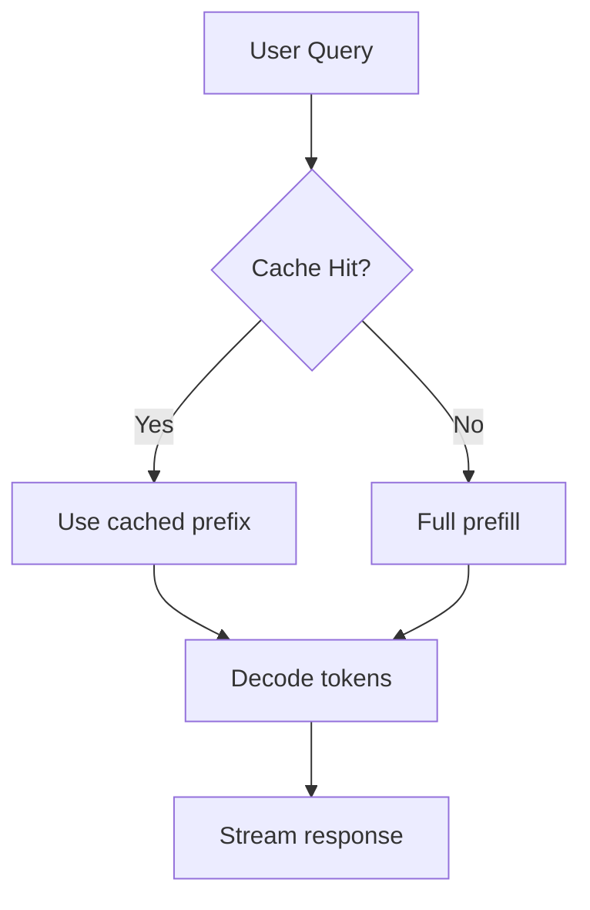

**Interview Q&A:**

*Q: Prompt caching kaise kaam karta hai Claude me?*
Tu message blocks pe `cache_control: {"type": "ephemeral"}` mark karta hai. Pehli call pe Anthropic woh prefix cache karta hai (5-min TTL, ya 1-hour with extended). Subsequent calls jo same prefix se start hote hain, woh cached KV-cache reuse karte hain — input tokens 10% cost pe charge hote hain. System prompts, tool definitions, aur large documents ideal candidates hain.

*Q: Extended thinking kab enable karein?*
Sirf complex reasoning tasks pe — math, multi-step planning, tricky debugging. Simple Q&A pe yeh waste of money aur latency hai. Budget_tokens tune kar — typically 2k-10k. Output me thinking blocks aate hain jo tu UI me hide kar sakta hai but final answer ke quality me jhalakta hai.

---

### 1.3 Google Gemini API

**Definition:** Google ka Gemini API (formerly PaLM) Gemini family models (1.5 Pro, 1.5 Flash, 2.0) tak access deta hai. AI Studio se quick prototyping, Vertex AI se enterprise deployment.

**Why:** Gemini ka USP — 1M+ token context window aur native multimodality. Video files directly pass kar sakte ho, woh frames extract karke samjhega. Flash variant cost-per-token me extremely competitive hai.

**How:**

```python
from google import genai
from google.genai import types

client = genai.Client(api_key="YOUR_KEY")

# Simple text generation
response = client.models.generate_content(
    model="gemini-2.0-flash",
    contents="Explain quantum tunneling in one paragraph"
)
print(response.text)

# Multimodal — image + text
import PIL.Image
img = PIL.Image.open("architecture.png")

response = client.models.generate_content(
    model="gemini-2.0-flash",
    contents=[img, "Yeh system diagram me bottleneck kahan hai?"]
)

# JSON output with schema
response = client.models.generate_content(
    model="gemini-2.0-flash",
    contents="List 3 Python web frameworks",
    config=types.GenerateContentConfig(
        response_mime_type="application/json",
        response_schema={
            "type": "array",
            "items": {"type": "object", "properties": {"name": {"type":"string"}, "stars": {"type":"integer"}}}
        }
    )
)
```

**Real-life example:** Ek video moderation platform ne Gemini ko use kiya — har upload ka 1-hour video directly bhejte hain, model frames analyze karke policy violations flag karta hai. Pehle yeh Whisper + GPT-4V chain tha, ab single API call.

**Mermaid:**

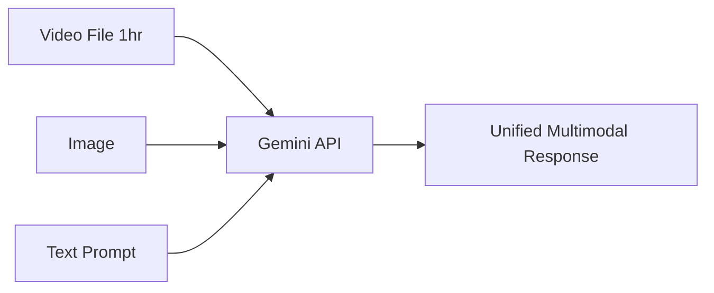

**Interview Q&A:**

*Q: Gemini ka 1M context kab use karna chahiye vs RAG?*
Long context "magic" lagta hai but uska bhi cost aur latency hai — 800K tokens ka prefill 30+ seconds le sakta hai. RAG abhi bhi superior hai jab tera knowledge base 10M+ tokens ka hai, ya tujhe citations chahiye, ya updates bahut hote hain. Long context ideal hai single-document deep analysis ke liye (codebase review, contract analysis).

*Q: AI Studio vs Vertex AI me difference?*
AI Studio prototyping ke liye hai — quick API key, generous free tier, but data Google training ke liye use ho sakta hai. Vertex AI production ke liye — IAM auth, VPC, data residency guarantees, no training opt-out by default, SLAs. Enterprise hamesha Vertex pe ja.

---

### 1.4 Together, Replicate, Groq, Fireworks

**Definition:** Yeh "inference providers" hain — open-source models (Llama, Mixtral, Qwen, DeepSeek) ko host karke OpenAI-compatible API deta hain. Tu khud GPU rent karne ki jagah inhi ke through scale kar sakta hai.

**Why:** Cost aur speed. Groq custom LPU hardware se 500+ tok/sec deta hai. Together aur Fireworks fine-tuning aur custom deployment offer karte hain. Replicate models ko containerize karke arbitrary inference deta hai.

**How:**

```python
# Groq — sabse fast inference (LPU based)
from groq import Groq
groq = Groq()
r = groq.chat.completions.create(
    model="llama-3.3-70b-versatile",
    messages=[{"role":"user","content":"Hi"}]
)
# 500 tok/sec — real-time use cases ke liye game changer

# Together — OpenAI compatible, bahut models
from openai import OpenAI
together = OpenAI(
    base_url="https://api.together.xyz/v1",
    api_key="TOGETHER_KEY"
)
r = together.chat.completions.create(
    model="meta-llama/Llama-3.3-70B-Instruct-Turbo",
    messages=[{"role":"user","content":"Solve x^2 = 16"}]
)

# Fireworks — production-grade, function calling support
fireworks = OpenAI(
    base_url="https://api.fireworks.ai/inference/v1",
    api_key="FW_KEY"
)
```

**Real-life example:** Ek voice agent startup ne Groq pe Llama-3.3-70B chalaya — TTFT 100ms, total latency 800ms phone call ke liye. OpenAI pe yeh 2-3 seconds hota tha, conversation natural nahi lagti thi.

**Mermaid:**

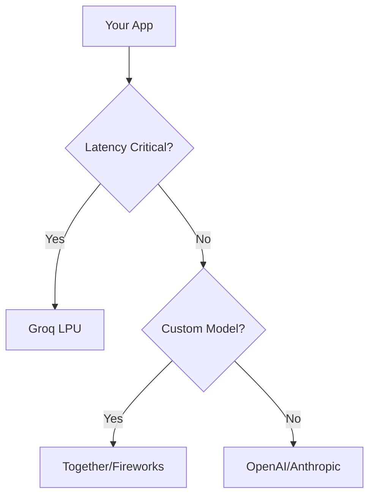

**Interview Q&A:**

*Q: Inference providers pe quality difference?*
Same open-weights model dene wale providers ke beech subtle differences hote hain — quantization (FP16 vs FP8 vs INT4), speculative decoding settings, sampling implementation. Together "Turbo" variants quantized hote hain — fast but slightly lower quality. Production me apna eval suite chala ke pick kar.

*Q: Vendor lock-in kaise avoid karein?*
OpenAI-compatible interface use kar (Together, Fireworks, Groq sab compatible hain). Apna code OpenAI SDK ke around abstraction me wrap kar — sirf base_url badalne se provider switch ho jaye. LiteLLM ek aisa hi router hai — 100+ providers ek interface me.

---

### 1.5 Ollama, LM Studio, llama.cpp (local)

**Definition:** Yeh tools tujhe LLM ko apne machine pe chalane dete hain — bina cloud, bina API key, bina data leakage. llama.cpp ek C++ inference engine hai (GGUF format). Ollama woh hi tool ko user-friendly CLI/HTTP server me wrap karta hai. LM Studio GUI hai.

**Why:** Privacy-sensitive workloads (medical, legal, internal corp data), edge deployments, offline development, aur cost-zero prototyping. M-series Macs aur consumer GPUs pe shockingly accha chalta hai.

**How:**

```bash
# Ollama install karke model pull karo
ollama pull llama3.2:3b
ollama serve  # localhost:11434 pe OpenAI-compatible API
```

```python
# Ab OpenAI SDK se use kar — base_url badal de
from openai import OpenAI

local = OpenAI(
    base_url="http://localhost:11434/v1",
    api_key="ollama"  # dummy — auth nahi chahiye
)

r = local.chat.completions.create(
    model="llama3.2:3b",
    messages=[{"role":"user","content":"Capital of India?"}]
)
print(r.choices[0].message.content)

# llama.cpp directly — Python binding
from llama_cpp import Llama
llm = Llama(
    model_path="./models/llama-3.2-3b-q4.gguf",
    n_ctx=4096,
    n_gpu_layers=-1  # saari layers GPU pe
)
out = llm("Q: What is 2+2? A:", max_tokens=10)
```

**Real-life example:** Ek hospital ne patient discharge summaries generate karne ke liye Ollama pe Llama-3-8B deploy kiya — sab kuch on-premise, HIPAA compliant, aur cloud bills zero. Quality 80% of GPT-4 par for that narrow task.

**Mermaid:**

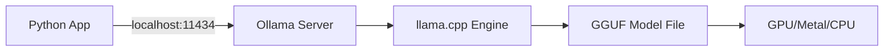

**Interview Q&A:**

*Q: Quantization formats — Q4, Q8, FP16 kya hai?*
GGUF models alag-alag bits per weight me aate hain. FP16 = full precision, biggest, best quality. Q8 = 8-bit, half size, near-lossless. Q4 = 4-bit, quarter size, noticeable quality drop on complex tasks but runs on 8GB RAM. Production me Q5_K_M ya Q6_K typically best tradeoff dete hain.

*Q: Local inference production-ready hai?*
Single-user desktop apps ke liye haan. Multi-user server ke liye risky — vLLM ya TGI use kar Ollama ki jagah, woh batching aur paged-attention proper karte hain. Ollama 1-2 concurrent requests me struggle karta hai under load.

---

### 1.6 Streaming responses (SSE, async generators)

**Definition:** Streaming matlab tokens ko jaise generate ho rahe hain, waise hi client ko bhejna — instead of full response complete hone ka wait karna. Implementation Server-Sent Events (SSE) protocol pe hoti hai — HTTP long-lived connection jisme `data: {...}\n\n` chunks aate hain.

**Why:** UX. ChatGPT-style typewriter effect feels 10x faster even when total time same hai. Time to First Token (TTFT) perceived latency drop kar deta hai. Lambe outputs (1000+ tokens) bina streaming ke 20+ seconds dead air feel karte hain.

**How:**

```python
from openai import OpenAI
client = OpenAI()

# Synchronous streaming — generator pattern
stream = client.chat.completions.create(
    model="gpt-4o-mini",
    messages=[{"role":"user","content":"Likh ek poem"}],
    stream=True
)
for chunk in stream:
    if chunk.choices[0].delta.content:
        print(chunk.choices[0].delta.content, end="", flush=True)

# Async — production servers ke liye
import asyncio
from openai import AsyncOpenAI
aclient = AsyncOpenAI()

async def stream_to_user(prompt: str):
    stream = await aclient.chat.completions.create(
        model="gpt-4o-mini",
        messages=[{"role":"user","content":prompt}],
        stream=True
    )
    # async for — backpressure friendly
    async for chunk in stream:
        delta = chunk.choices[0].delta.content
        if delta:
            yield delta  # FastAPI StreamingResponse me feed kar

# FastAPI me SSE endpoint
from fastapi import FastAPI
from fastapi.responses import StreamingResponse

app = FastAPI()

@app.post("/chat")
async def chat(prompt: str):
    async def event_gen():
        async for token in stream_to_user(prompt):
            # SSE format — frontend EventSource padh sakta hai
            yield f"data: {token}\n\n"
    return StreamingResponse(event_gen(), media_type="text/event-stream")
```

**Real-life example:** Ek code-completion plugin ne streaming use kiya — user typing karte ja raha hai, model complete kar raha hai, jaise hi user ne "accept" press kiya, stream cancel ho gayi. Bina streaming ke yeh feature usable hi nahi hota.

**Mermaid:**

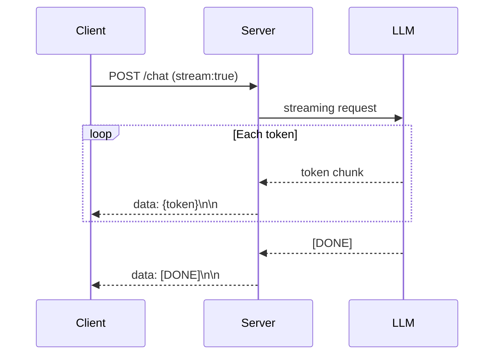

**Interview Q&A:**

*Q: Streaming me errors kaise handle karein?*
Streaming midway fail ho sakti hai — network drop, rate limit, content policy. SSE me tu custom event types bhej sakta hai (`event: error\ndata: {...}\n\n`). Client side pe partial response save kar — agar fail ho to user ko "regenerate" option de. Idempotency keys use kar taaki retry safe rahe.

*Q: Backpressure kya hai streaming context me?*
Agar tera client slow hai aur LLM fast tokens generate kar raha hai, buffer overflow ho sakta hai. Async generators (Python `async for`) automatically backpressure handle karte hain — consumer slow ho to producer await pe ruk jata hai. Sync code me manual queue management karna padta hai.

---

### 1.7 Token counting, context management

**Definition:** Token ek subword unit hai — model usi me sochta hai. Har model ka apna tokenizer hai (OpenAI: tiktoken cl100k/o200k, Claude: similar BPE). Context window = max input + output tokens jo ek call me handle ho sakte hain. Context management strategies decide karti hain ki long conversations me kya rakhna, kya drop karna.

**Why:** Cost tokens me charge hota hai. Latency tokens ke saath linearly badhti hai. Context overflow karne pe API hard error deti hai. Token-aware coding production system ki nervous system hai.

**How:**

```python
import tiktoken

# OpenAI tokenizer
enc = tiktoken.encoding_for_model("gpt-4o")
text = "Namaste duniya"
tokens = enc.encode(text)
print(len(tokens), tokens)  # ~4 tokens

# Cost estimation helper
def estimate_cost(prompt: str, max_out: int, model: str = "gpt-4o-mini") -> float:
    enc = tiktoken.encoding_for_model(model)
    in_tok = len(enc.encode(prompt))
    # gpt-4o-mini pricing — input $0.15/M, output $0.60/M
    return (in_tok * 0.15 + max_out * 0.60) / 1_000_000

# Conversation truncation — sliding window
def trim_history(messages: list, max_tokens: int = 4000) -> list:
    enc = tiktoken.encoding_for_model("gpt-4o")
    total = 0
    kept = []
    # System prompt hamesha rakhna
    system = [m for m in messages if m["role"] == "system"]
    others = [m for m in messages if m["role"] != "system"]
    # Latest se backwards traverse
    for m in reversed(others):
        t = len(enc.encode(m["content"]))
        if total + t > max_tokens:
            break
        kept.insert(0, m)
        total += t
    return system + kept

# Anthropic ka token counter — actual API endpoint
import anthropic
client = anthropic.Anthropic()
count = client.messages.count_tokens(
    model="claude-sonnet-4-5",
    messages=[{"role":"user","content":"Hello"}]
)
print(count.input_tokens)
```

**Real-life example:** Ek customer support bot 30+ message conversations handle karta tha — 8K context limit hit hota tha. Solution: latest 10 messages + summary of older ones (LLM se generated). Cost 60% drop, quality preserved.

**Mermaid:**

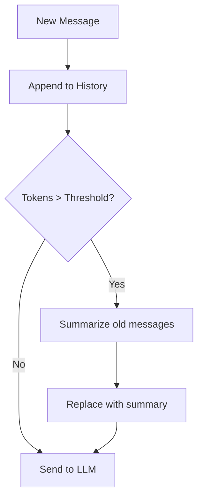

**Interview Q&A:**

*Q: Token count kyon vary karta hai providers me?*
Har model apne tokenizer pe trained hai. "Namaste" GPT-4o me 2 tokens, Claude me 3, Llama me 4 ho sakta hai. Cross-provider cost compare karte time same prompt ka different token count hoga. Hamesha provider ke actual tokenizer/API se measure kar.

*Q: Context window full ho raha hai — strategies?*
Three approaches: (1) Sliding window — oldest drop, latest rakho. (2) Summarization — old messages ko LLM se compress. (3) RAG — sab kuch vector DB me, query time pe relevant chunks fetch. Production me hybrid use hota hai — system + last N messages + RAG-retrieved context.

---

## 2. Prompt Engineering (Real)

Prompt engineering "magic words" nahi hai — yeh structured communication hai jisme tu LLM ke training distribution se align hoke desired behavior nikalta hai. Real prompt engineering me tu prompts ko code ki tarah treat karta hai — version control, eval, A/B test.

### 2.1 Zero-shot, few-shot, chain-of-thought

**Definition:** Zero-shot = bina example prompt — sirf instruction. Few-shot = task ke 2-5 examples deke pattern dikhana. Chain-of-thought (CoT) = model ko step-by-step sochne ke liye encourage karna ("Let's think step by step").

**Why:** Zero-shot quick hai but accuracy kam hoti hai complex tasks pe. Few-shot pattern learning enable karta hai. CoT reasoning tasks pe 20-40% accuracy boost deta hai (math, logic, multi-hop).

**How:**

```python
# Zero-shot
prompt_zero = "Classify sentiment: 'Movie boring tha'"

# Few-shot — examples se task define ho jaata hai
prompt_few = """Classify sentiment as positive/negative/neutral.

Text: "Khana lazeez tha" -> positive
Text: "Service slow thi" -> negative  
Text: "Theek thaak hai" -> neutral
Text: "Movie boring tha" ->"""

# Chain-of-thought — reasoning explicit
prompt_cot = """Q: Ramesh ke paas 23 apples the. 11 use kar diye, 6 aur kharide. Kitne hain?
A: Step by step sochta hun.
- Start: 23 apples
- Use kiye: 23 - 11 = 12
- Kharide: 12 + 6 = 18
- Final: 18 apples

Q: Sita ke paas 50 marbles the. 18 doston ko diye, fir 25 jeete. Kitne hain?
A: Step by step sochta hun."""

# Modern: zero-shot CoT — bas "think step by step" jodne se
from openai import OpenAI
client = OpenAI()
r = client.chat.completions.create(
    model="gpt-4o-mini",
    messages=[
        {"role":"system","content":"Answer step by step before final."},
        {"role":"user","content":"Train 60kmph chal rahi, 2.5hr me kitna distance?"}
    ]
)
```

**Real-life example:** Ek financial firm ne earnings reports classify karne ke liye few-shot use kiya — 5 labeled examples dene pe accuracy 70% se 92% gayi vs zero-shot. CoT activate karne pe reasoning traces audit-friendly bhi ho gaye.

**Mermaid:**

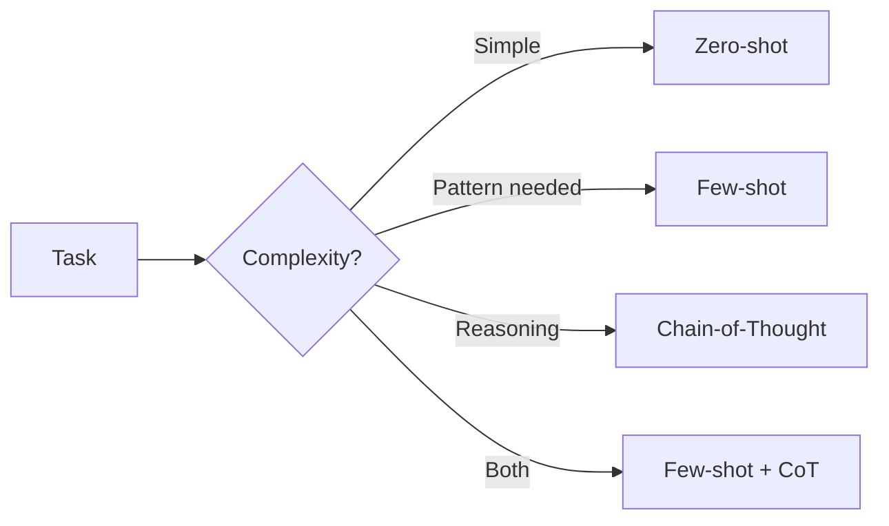

**Interview Q&A:**

*Q: Few-shot examples kitne dene chahiye?*
3-5 sweet spot hai. 1-2 me variance high hota hai, 10+ me diminishing returns aur context bloat. Examples diverse honi chahiye — har class/edge case represent ho. Order matters — recency bias hota hai, important class ko last me daal.

*Q: CoT modern reasoning models (o1, Claude thinking) me redundant hai?*
Haan, mostly. o1, o3, DeepSeek-R1, Claude with extended thinking khud internally CoT karte hain — explicit "think step by step" overhead deta hai. Non-reasoning models (gpt-4o, Claude Haiku) pe abhi bhi useful. Hybrid approach: agar latency-sensitive non-reasoning model use kar raha hai with CoT, ya reasoning model use kar without CoT.

---

### 2.2 Self-consistency, tree-of-thought

**Definition:** Self-consistency = same question ka multiple times CoT generate karna (high temperature), fir majority vote lena. Tree-of-thought (ToT) = reasoning ko tree me explore karna — har step pe multiple branches, evaluate, prune.

**Why:** Single CoT brittle hota hai — ek galat step se pura answer galat. Self-consistency variance kam karti hai — typically 5-15% accuracy gain hard reasoning pe. ToT planning tasks (Game of 24, crossword) pe state-of-the-art deta hai.

**How:**

```python
from collections import Counter
from openai import OpenAI
client = OpenAI()

def self_consistency(question: str, k: int = 5) -> str:
    answers = []
    for _ in range(k):
        # High temp se diversity
        r = client.chat.completions.create(
            model="gpt-4o-mini",
            messages=[
                {"role":"system","content":"Step by step solve, end with 'Final: <answer>'"},
                {"role":"user","content":question}
            ],
            temperature=0.9
        )
        text = r.choices[0].message.content
        # Final answer extract
        if "Final:" in text:
            ans = text.split("Final:")[-1].strip().split("\n")[0]
            answers.append(ans)
    # Majority vote
    return Counter(answers).most_common(1)[0][0]

# Tree-of-thought — simplified
def tot_step(state: str, k: int = 3) -> list[str]:
    """Ek state se k possible next steps generate karo"""
    r = client.chat.completions.create(
        model="gpt-4o",
        messages=[{
            "role":"user",
            "content":f"Current state: {state}\nGenerate {k} different next-step approaches."
        }]
    )
    # Parse k approaches
    return r.choices[0].message.content.split("\n\n")[:k]

def evaluate(state: str) -> float:
    """Heuristic — kitna promising hai yeh path"""
    r = client.chat.completions.create(
        model="gpt-4o-mini",
        messages=[{"role":"user","content":f"Rate 0-1 how promising: {state}"}]
    )
    try: return float(r.choices[0].message.content.strip())
    except: return 0.5
```

**Real-life example:** Ek competitive math tutoring app ne self-consistency lagayi — k=5, gpt-4o pe AMC problems pe accuracy 73% se 86% gayi. Cost 5x but yeh premium feature thi.

**Mermaid:**

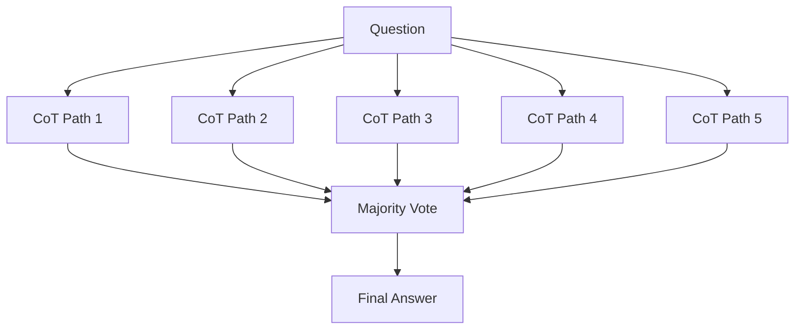

**Interview Q&A:**

*Q: Self-consistency vs ensembling different models?*
Self-consistency same model pe diverse sampling. Multi-model ensembling different models (GPT + Claude + Gemini) ke outputs combine karta hai — stronger because model biases diverge. Cost wise ensembling expensive, but production critical paths pe (medical, legal) justify hota hai.

*Q: ToT production me practical hai?*
Rarely. Combinatorial explosion — 5 branches × 5 depth = 3125 LLM calls. Use cases narrow hain — game playing, formal verification. Practical agentic systems me MCTS-lite (beam search with k=2-3) zyada common hai.

---

### 2.3 ReAct (Reasoning + Acting)

**Definition:** ReAct ek prompting framework hai jisme model alternately reasoning (Thought) aur action (tool call) karta hai. Pattern: `Thought → Action → Observation → Thought → ... → Answer`. Modern agents ka foundational pattern hai.

**Why:** Pure CoT external world se cut off hai — facts hallucinate karta hai. Pure tool-use (no reasoning) blindly tools call karta hai. ReAct dono ko combine karta hai — model sochta hai "mujhe X chahiye, isliye search karunga", action leta hai, observation se aage planning karta hai.

**How:**

```python
import json
from openai import OpenAI
client = OpenAI()

# Tools — actual functions
def web_search(q: str) -> str:
    return f"Mock results for: {q}"

def calculator(expr: str) -> str:
    try: return str(eval(expr))
    except: return "Error"

TOOLS = {"web_search": web_search, "calculator": calculator}

REACT_PROMPT = """Tu ek agent hai. Tools: web_search(q), calculator(expr).

Format strictly:
Thought: <kya sochta hai>
Action: <tool_name>
Action Input: <input>
(System Observation dega)
... repeat ...
Final Answer: <jawab>

Question: {q}
"""

def react_loop(question: str, max_steps: int = 5):
    history = REACT_PROMPT.format(q=question)
    for _ in range(max_steps):
        r = client.chat.completions.create(
            model="gpt-4o-mini",
            messages=[{"role":"user","content":history}],
            stop=["Observation:"]  # rukke observation hum dalenge
        )
        out = r.choices[0].message.content
        history += out
        
        if "Final Answer:" in out:
            return out.split("Final Answer:")[-1].strip()
        
        # Parse action
        if "Action:" in out and "Action Input:" in out:
            action = out.split("Action:")[1].split("\n")[0].strip()
            inp = out.split("Action Input:")[1].split("\n")[0].strip()
            obs = TOOLS.get(action, lambda x: "Unknown tool")(inp)
            history += f"\nObservation: {obs}\n"
    return "Max steps reached"

print(react_loop("Mumbai ki population kya hai? Aur usse 5% kya?"))
```

**Real-life example:** Perplexity ka core search agent ReAct based hai — query ko decompose karta hai, multiple searches fire karta hai, synthesis karta hai. LangChain ka original AgentExecutor bhi ReAct pattern pe tha.

**Mermaid:**

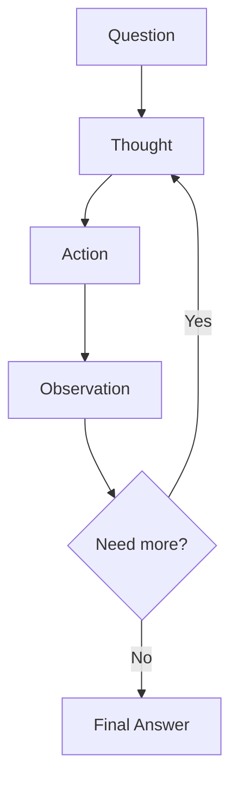

**Interview Q&A:**

*Q: ReAct vs modern function calling APIs?*
Old ReAct used pure text parsing — fragile. Modern providers (OpenAI tools, Claude tool use) native function calling dete hain — structured tool calls JSON me, no parsing brittleness. Concept same hai (reason → act → observe), but implementation cleaner. New code likh raha hai to native tool use kar, ReAct prompt template mat likh.

*Q: ReAct agents infinite loop me kab fans jaate hain?*
Common failure modes: same tool with same input baar baar (need deduplication), reasoning aur action diverge ho jaate hain, observation ko ignore karke agle step pe wahi galti. Mitigations: max_steps cap, repeat detection, "if last 2 actions identical, force final answer" rule.

---

### 2.4 Role/system prompts, persona conditioning

**Definition:** System prompt ek special message hai jo conversation start me ja ke model ka behavior set karta hai — role, tone, constraints, output format. Persona conditioning matlab model ko ek consistent character/expertise me lock karna.

**Why:** Same user prompt different system prompts ke saath bilkul different responses deta hai. Persona se brand voice consistent rehti hai, hallucination kam hoti hai (focused expertise se), aur jailbreak attempts ko resist karna easier hota hai.

**How:**

```python
# Bad — vague persona
bad_system = "Tu helpful AI hai."

# Good — specific, constrained
good_system = """Tu "Aria" hai — ek fintech support specialist for IndiaPay.

CONSTRAINTS:
- Sirf payment, refund, KYC topics pe respond kar
- Off-topic queries pe: "Yeh mera scope me nahi hai. /help check karein."
- Hindi-English mix me reply kar (user ke language match kar)
- Personal opinions mat de
- Confidential data (full card numbers, OTPs) kabhi mat repeat kar

KNOWLEDGE:
- KYC processing 24-48hrs leti hai
- Refunds 5-7 working days
- Max transaction limit Rs 1L per day

OUTPUT FORMAT:
- Crisp answers (max 3 sentences)
- Action items bullet me
- Empathy show kar but dramatic mat ho
"""

from openai import OpenAI
client = OpenAI()

r = client.chat.completions.create(
    model="gpt-4o-mini",
    messages=[
        {"role":"system","content":good_system},
        {"role":"user","content":"Mera refund 10 din se nahi aaya"}
    ]
)
```

**Real-life example:** Ek e-commerce ne customer support bot ka system prompt 50 line se 200 line kiya — escalation criteria, tone guidelines, product catalog summary, banned phrases. CSAT scores 30% improve hue, escalation rate 40% drop.

**Mermaid:**

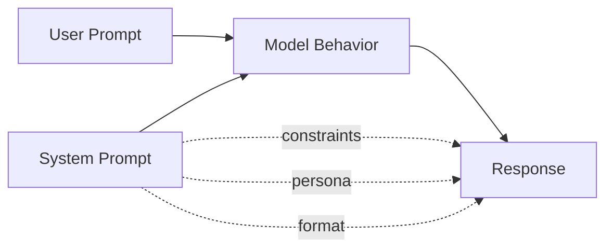

**Interview Q&A:**

*Q: Long system prompt vs short — tradeoffs?*
Long (1000+ tokens) — better instruction following, more constraints satisfiable, but cost har call me bharta hai. Use prompt caching (Anthropic) ya prompt caching (OpenAI) — system prompt cache hota hai. Short (100-200 tokens) — cheap but ambiguous behavior, edge cases miss honge. Production me long detailed system prompt + caching = best.

*Q: Persona drift kya hai aur kaise prevent karein?*
Long conversations me model gradually persona se hat sakta hai (user pressure, accumulated context). Mitigations: periodic system reminder injection (every 10 turns), output validation against persona rules, refusal classifier. Anthropic ke models is pe OpenAI se zyada robust hain typically.

---

### 2.5 XML tags vs JSON vs Markdown structuring

**Definition:** Prompts me structure dene ke teen popular conventions — XML tags (`<context>...</context>`), JSON (`{"context": "..."}`), aur Markdown (`## Context\n...`). Har provider ka thoda preference hai based on training data.

**Why:** Structured prompts me model better parse karta hai sections — kya context hai, kya instruction, kya example. Output structure bhi structured input se naturally emerge hota hai.

**How:**

```python
# XML — Anthropic recommends, robust to nesting
xml_prompt = """<task>
Summarize the document.
</task>

<document>
The Indian economy grew 7.2% in FY24...
</document>

<constraints>
- Max 3 bullets
- Sirf facts, no speculation
</constraints>

<output_format>
<summary>
- Bullet 1
- Bullet 2
- Bullet 3
</summary>
</output_format>"""

# Markdown — readable, OpenAI friendly
md_prompt = """# Task
Summarize the document.

## Document
The Indian economy grew 7.2% in FY24...

## Constraints
- Max 3 bullets
- Sirf facts

## Output Format
Markdown bullet list."""

# JSON — programmatic, but model parsing harder
json_prompt = """{
  "task": "summarize",
  "document": "The Indian economy grew 7.2%...",
  "constraints": ["max 3 bullets", "no speculation"]
}

Respond with summary."""
```

**Real-life example:** Anthropic team ne benchmark kiya — same prompt XML me 8% better instruction following vs Markdown on Claude. OpenAI internal docs Markdown prefer karte hain. Practical tip: provider-native style use kar.

**Mermaid:**

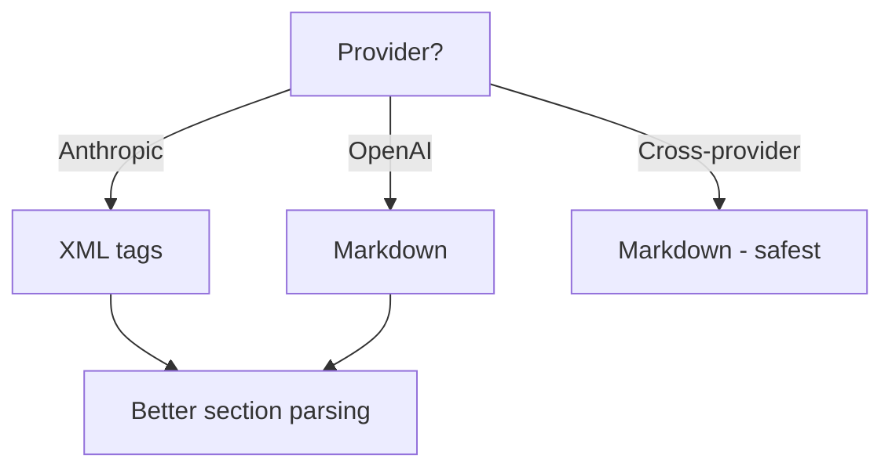

**Interview Q&A:**

*Q: Mixed structure — XML inside Markdown?*
Yes, common pattern. Markdown headings for top-level sections, XML tags for inline literal content jisme markdown chars conflict kar sakte hain (code blocks, user-provided text with #s). Especially useful for "untrusted" inputs — `<user_input>...</user_input>` makes injection attacks harder.

*Q: JSON output prompt me — best practice?*
JSON output mango XML/Markdown me prompt structure de kar — "Respond ONLY with JSON matching this schema: ...". Pure JSON prompts me model often confused — syntax me prompt khud likh raha hai vs woh respond kar raha hai. Better: prompt natural language me, output format JSON me.

---

### 2.6 Prompt chaining and decomposition

**Definition:** Complex task ko multiple smaller prompts me todna, har step ka output next step me feed karna. Decomposition matlab problem ko sub-problems me break karna; chaining matlab unhe pipeline me wire karna.

**Why:** Single mega-prompt me 10 cheezein karwane se model overwhelmed hota hai. Decomposed pipelines me har step focused hai, debug karna easy hai, alag-alag steps pe alag models use kar sakte ho (cheap for simple, strong for complex).

**How:**

```python
from openai import OpenAI
client = OpenAI()

def llm(prompt: str, model: str = "gpt-4o-mini") -> str:
    r = client.chat.completions.create(
        model=model,
        messages=[{"role":"user","content":prompt}]
    )
    return r.choices[0].message.content

# Single mega-prompt — bad
def bad_blog_gen(topic: str) -> str:
    return llm(f"Likh blog on {topic}: outline, intro, 3 sections, conclusion, SEO meta. 1500 words.")

# Chained — better
def good_blog_gen(topic: str) -> dict:
    # Step 1: outline (cheap model)
    outline = llm(f"Generate 5-section outline for blog on: {topic}", "gpt-4o-mini")
    
    # Step 2: research (strong model, parallel possible)
    research = llm(f"Research key facts for outline:\n{outline}", "gpt-4o")
    
    # Step 3: each section likho (parallel)
    sections = []
    for section_title in outline.split("\n"):
        if not section_title.strip(): continue
        s = llm(f"Topic: {topic}\nSection: {section_title}\nFacts: {research}\n\nWrite 200 words.", "gpt-4o-mini")
        sections.append(s)
    
    # Step 4: SEO meta (cheap)
    meta = llm(f"SEO title and description for: {topic}", "gpt-4o-mini")
    
    return {
        "outline": outline,
        "sections": sections,
        "meta": meta
    }
```

**Real-life example:** Ek legal doc analyzer pehle single 10K-token prompt deta tha — clauses identify + risks + summary + recommendations. Output inconsistent. Chained me 4 steps banaye — har clause ko independently analyze, fir aggregate. Quality stable, cost similar (parallel execution).

**Mermaid:**

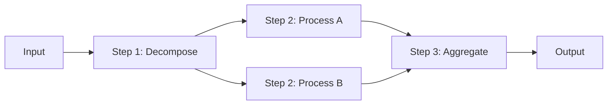

**Interview Q&A:**

*Q: Chain me error propagation kaise handle karein?*
Each step ka output validate kar (schema check, sanity check) before passing forward. Ek step fail ho to retry that step alone, full chain mat re-run kar (cost). Step-level caching karo — same input same output deterministic ho idempotency ke liye.

*Q: Kab chain karna chahiye, kab single prompt?*
Single prompt agar task simple aur model capable hai. Chain when: (a) intermediate outputs reusable hain (b) different sub-tasks me different model strengths chahiye (c) parallelism se latency drop ho sakti hai (d) tu intermediate quality monitor karna chahta hai. Trade-off: latency adds (sequential), failure modes badhte hain.

---

### 2.7 Prompt versioning and A/B testing

**Definition:** Prompt versioning matlab prompts ko code ki tarah git me track karna, version IDs assign karna, environments me deploy karna. A/B testing = production traffic ko multiple prompt versions me split karke metrics compare karna.

**Why:** Prompts business logic encode karte hain — unka uncontrolled change banking-grade incidents leke aata hai. "Maine prompt tweak kiya, abhi accuracy gir gayi" debugging nightmare hai bina version control. A/B testing data-driven prompt evolution enable karta hai.

**How:**

```python
# Simple file-based versioning
# prompts/support_v1.md, prompts/support_v2.md

import os, hashlib, json
from datetime import datetime

class PromptRegistry:
    def __init__(self, dir="prompts/"):
        self.dir = dir
        self.cache = {}
    
    def load(self, name: str, version: str = "latest") -> dict:
        path = f"{self.dir}{name}_{version}.md"
        with open(path) as f:
            content = f.read()
        h = hashlib.sha256(content.encode()).hexdigest()[:8]
        return {"content": content, "version": version, "hash": h, "name": name}

# A/B test routing — feature flag pattern
import random
def route_prompt(user_id: str, experiment: str) -> str:
    # Sticky assignment — same user same variant
    hash_val = int(hashlib.md5(f"{user_id}{experiment}".encode()).hexdigest(), 16)
    return "v1" if hash_val % 100 < 50 else "v2"  # 50/50 split

# Logging for analysis
def log_call(user_id: str, prompt_version: str, prompt_hash: str, 
             input_text: str, output: str, latency_ms: int, cost: float):
    record = {
        "ts": datetime.utcnow().isoformat(),
        "user_id": user_id,
        "prompt_version": prompt_version,
        "prompt_hash": prompt_hash,
        "input_len": len(input_text),
        "output_len": len(output),
        "latency_ms": latency_ms,
        "cost_usd": cost
    }
    # Push to DWH (Snowflake/BigQuery/etc)
    print(json.dumps(record))

# Production usage
def handle_query(user_id: str, query: str):
    registry = PromptRegistry()
    version = route_prompt(user_id, "support_prompt_2025q2")
    prompt_meta = registry.load("support", version)
    
    start = datetime.utcnow()
    # ... LLM call with prompt_meta["content"] ...
    response = "..."
    latency = (datetime.utcnow() - start).total_seconds() * 1000
    
    log_call(user_id, version, prompt_meta["hash"], query, response, int(latency), 0.001)
    return response
```

**Real-life example:** Ek SaaS ne LangSmith use kiya — har prompt change pe staging me eval suite run hota hai (200 test cases), pass karne pe canary deployment 5% traffic, metrics dashboards monitor, fir 100% rollout. Bina is process ke quarterly outages hote the.

**Mermaid:**

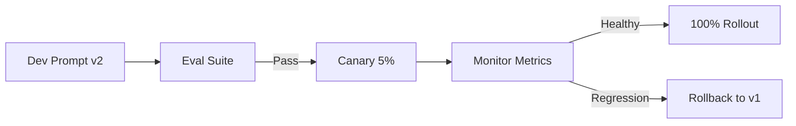

**Interview Q&A:**

*Q: Eval metrics konse track karein?*
Multi-tier — (1) deterministic checks: schema compliance, length, banned words. (2) LLM-as-judge: relevance, helpfulness on rubric. (3) Business metrics: CSAT, conversion, escalation rate. (4) Cost/latency: p50/p95 token counts, $ per call. Single metric pe optimize kabhi mat kar — Goodhart's law lag jaata hai.

*Q: Tools — kya use karein prompt mgmt ke liye?*
LangSmith (LangChain), Humanloop, PromptLayer, Helicone — managed solutions. DIY: git + S3 + custom dashboard. Notion docs me prompts mat rakh — woh source of truth ban ke regret aayega. Programmatically loadable hona chahiye.

---

## 3. Structured Outputs & Function Calling

LLM ka raw output text hai. Production systems ko structured data chahiye — JSON, types, schemas. Structured outputs aur function calling layer woh hai jo LLM ko deterministic software pipeline me safely embed karta hai.

### 3.1 JSON mode, JSON Schema enforcement

**Definition:** JSON mode = guarantee that output is syntactically valid JSON. JSON Schema enforcement = guarantee output matches a specific schema (field names, types, enums). Modern providers constrained decoding implement karte hain — sirf wahi tokens emit hote hain jo grammar follow karein.

**Why:** Bina enforcement, LLM "JSON" kabhi-kabhi markdown me wrap karta hai (```json ... ```), kabhi trailing comma deta hai, kabhi field miss. Production pipeline crash. Schema enforcement reliability 99%+ pe pakka karta hai.

**How:**

```python
from openai import OpenAI
client = OpenAI()

# Plain JSON mode — syntactic only
r = client.chat.completions.create(
    model="gpt-4o-mini",
    response_format={"type": "json_object"},
    messages=[
        {"role":"system","content":"Output JSON. Field: name, age."},
        {"role":"user","content":"Ratnesh, 25 saal"}
    ]
)
# r.choices[0].message.content valid JSON guaranteed

# Strict schema enforcement — structured outputs
schema = {
    "type": "object",
    "properties": {
        "name": {"type":"string"},
        "age": {"type":"integer", "minimum":0, "maximum":150},
        "skills": {"type":"array","items":{"type":"string"}}
    },
    "required": ["name","age","skills"],
    "additionalProperties": False
}

r = client.chat.completions.create(
    model="gpt-4o-2024-08-06",
    response_format={
        "type": "json_schema",
        "json_schema": {
            "name": "person_extract",
            "strict": True,  # Constrained decoding ON
            "schema": schema
        }
    },
    messages=[{"role":"user","content":"Extract: Ratnesh 25 Python+SQL"}]
)

import json
data = json.loads(r.choices[0].message.content)
# data guaranteed schema-compliant
```

**Real-life example:** Ek resume parser ne pehle JSON mode use kiya — 8% calls me schema mismatch (extra fields, wrong types), retry logic complex. Strict structured outputs pe shift kiya — failure rate 0.1%, code 60% simpler.

**Mermaid:**

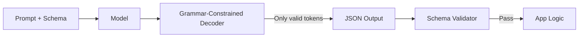

**Interview Q&A:**

*Q: Structured outputs vs function calling — same cheez?*
Related but different. Function calling = model decides to invoke a tool with structured args (response is "tool call"). Structured outputs = model's final answer text is structured. Function calling internally uses structured generation. New code: structured outputs for "give me data", function calling for "execute action".

*Q: Limitations of strict schema?*
First call latency thoda zyada (schema compilation). Recursive schemas, complex unions limited support. `additionalProperties: false` mandatory hai strict mode me. Optional fields trickier — `required: [...]` me sab fields list karne padte hain, optional ke liye union with null.

---

### 3.2 Pydantic + Instructor library

**Definition:** Pydantic Python ka data validation library hai — type hints se runtime validation. Instructor library Pydantic ko OpenAI/Anthropic SDKs ke saath integrate karta hai — tu Pydantic class de, woh schema generate, API call, parse, validate, retry sab automate karta hai.

**Why:** Hand-written JSON Schema painful hai. Pydantic native Python types deta hai (`int`, `Optional[str]`, `Literal`, nested models). Instructor magic glue hai — 5 lines me production-grade structured extraction.

**How:**

```python
from pydantic import BaseModel, Field
from typing import Literal
import instructor
from openai import OpenAI

# Instructor se client patch — dropin replacement
client = instructor.from_openai(OpenAI())

class Skill(BaseModel):
    name: str
    years: int = Field(ge=0, le=50, description="Years of experience")
    level: Literal["beginner","intermediate","expert"]

class Resume(BaseModel):
    """Extracted resume info"""
    full_name: str
    email: str | None = None
    skills: list[Skill]
    summary: str = Field(max_length=200)

# Magic — pass model class as response_model
resume: Resume = client.chat.completions.create(
    model="gpt-4o-mini",
    response_model=Resume,
    max_retries=3,  # Validation fail pe auto retry with errors
    messages=[
        {"role":"user","content":"Ratnesh, ratnesh@x.com, 5 yrs Python expert, 2 yrs SQL intermediate"}
    ]
)

print(resume.full_name)  # "Ratnesh"
print(resume.skills[0].name)  # "Python"
# IDE autocomplete, type safety, runtime validation — sab free

# Anthropic ke saath same pattern
import anthropic
aclient = instructor.from_anthropic(anthropic.Anthropic())
resume = aclient.messages.create(
    model="claude-sonnet-4-5",
    max_tokens=1024,
    response_model=Resume,
    messages=[{"role":"user","content":"..."}]
)
```

**Real-life example:** Ek hiring platform 1000+ resumes/day parse karta tha. Hand-rolled JSON Schema me bugs lagatar — phone field "+91 98..." vs "9876..." formats. Pydantic validators (custom regex) Instructor ke retries ke saath — 99.7% accuracy, 100 lines code.

**Mermaid:**

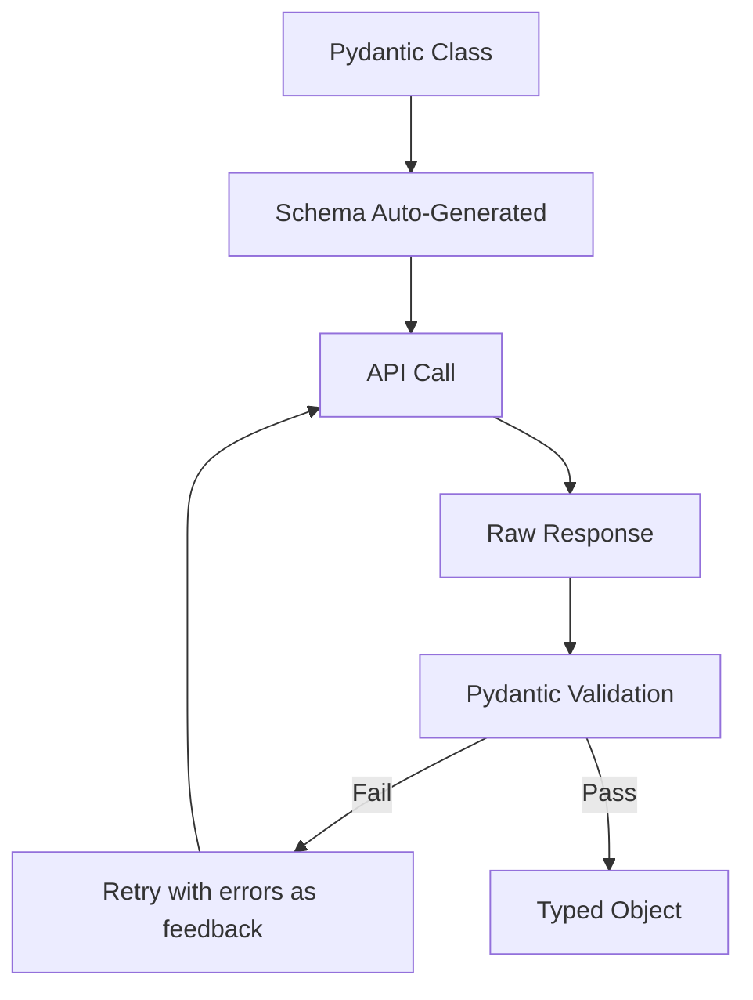

**Interview Q&A:**

*Q: Instructor vs raw structured outputs — kab kya?*
Raw structured outputs simple cases me sufficient. Instructor wins jab — (a) cross-provider switch chahiye (Anthropic, Cohere, Mistral, etc support), (b) validators chahiye (custom regex, business rules), (c) retry logic chahiye, (d) streaming with partial validation. Production me Instructor de-facto standard hai Python me.

*Q: Pydantic validators model behavior kaise affect karte hain?*
Validators runtime me run hote hain — agar fail, Instructor exception ko prompt me feedback ki tarah deta hai aur model se retry karwata hai. E.g., `@field_validator('email') def must_be_company_email(cls, v): if not v.endswith('@x.com'): raise ValueError(...)`. Model second attempt me correct karta hai. Sirf format validators rakh — semantic ones (jaise "name is real person") bahar handle kar.

---

### 3.3 OpenAI function calling, Claude tool use

**Definition:** Function calling/tool use = model ko tools (Python functions ya APIs) declare karte ho schemas ke saath; model decide karta hai kab call karna hai, kya arguments dene hain. Output me structured tool_call object aata hai jo tu execute karta hai aur result wapas feed karta hai.

**Why:** Agent ka core mechanic. Without it, tu prompt hacking se "Action: search('xyz')" parse karta tha — fragile. Native tool calling deterministic hai, multi-tool parallel calling karta hai, model fine-tuned hai isi pe.

**How:**

```python
from openai import OpenAI
import json

client = OpenAI()

def get_weather(city: str) -> str:
    return f"{city}: 28C, sunny"

def book_flight(origin: str, dest: str, date: str) -> str:
    return f"Booked {origin}->{dest} on {date}"

tools = [
    {
        "type": "function",
        "function": {
            "name": "get_weather",
            "description": "Get current weather for a city",
            "parameters": {
                "type": "object",
                "properties": {"city": {"type":"string"}},
                "required": ["city"]
            }
        }
    },
    {
        "type": "function",
        "function": {
            "name": "book_flight",
            "description": "Book a flight ticket",
            "parameters": {
                "type": "object",
                "properties": {
                    "origin": {"type":"string"},
                    "dest": {"type":"string"},
                    "date": {"type":"string","format":"date"}
                },
                "required": ["origin","dest","date"]
            }
        }
    }
]

messages = [{"role":"user","content":"Mumbai weather check kar, fir Delhi flight book kar tomorrow"}]

while True:
    r = client.chat.completions.create(
        model="gpt-4o-mini",
        messages=messages,
        tools=tools
    )
    msg = r.choices[0].message
    messages.append(msg.model_dump(exclude_none=True))
    
    if not msg.tool_calls:
        print("Final:", msg.content)
        break
    
    # Tool calls execute karo (parallel ho sakte hain)
    for tc in msg.tool_calls:
        fn = {"get_weather": get_weather, "book_flight": book_flight}[tc.function.name]
        args = json.loads(tc.function.arguments)
        result = fn(**args)
        messages.append({
            "role": "tool",
            "tool_call_id": tc.id,
            "content": str(result)
        })

# Claude tool use — similar concept, slightly different shape
import anthropic
ac = anthropic.Anthropic()
claude_tools = [{
    "name": "get_weather",
    "description": "...",
    "input_schema": {"type":"object","properties":{"city":{"type":"string"}},"required":["city"]}
}]
resp = ac.messages.create(
    model="claude-sonnet-4-5",
    max_tokens=1024,
    tools=claude_tools,
    messages=[{"role":"user","content":"Weather in Mumbai?"}]
)
# resp.content me tool_use blocks honge
```

**Real-life example:** Ek travel chatbot ne 12 tools expose kiye (search flights, hotels, weather, currency, etc). Claude 3.5 Sonnet parallel tool calling se 4 tools simultaneously fire karta tha — search round-trip 3s se 800ms aaya.

**Mermaid:**

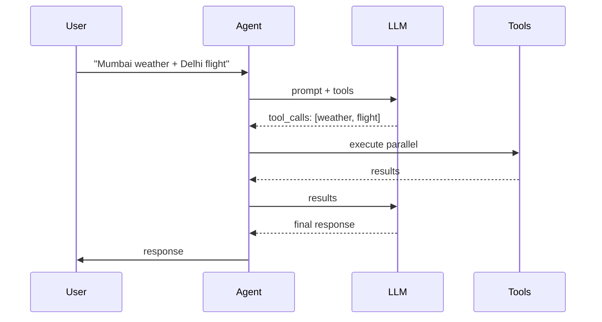

**Interview Q&A:**

*Q: Tool calling pe model accha kaise banaye?*
Tool descriptions detailed likh — when to use, when NOT to use, examples. Parameter descriptions specific (units, formats). Avoid overlapping tools. Model evaluation suite me edge cases — wrong tool, wrong args, hallucinating tool not in list. fine-tuning rarely needed if good descriptions + frontier model.

*Q: Multi-step tool agent me failure modes?*
Stuck loops (same tool repeatedly), wrong tool selection, hallucinating arguments not in schema (less with strict mode), context overflow over many turns, partial failure handling (one of 3 parallel tools failed). Mitigations: max iterations cap, tool result truncation, structured "thought" between calls, observability logs.

---

### 3.4 Outlines, Guidance, lm-format-enforcer

**Definition:** Yeh open-source libraries hain jo client-side me constrained generation enforce karti hain — local models (Llama, Mistral) pe bhi structured output guarantee. Outlines (.txt foundation) regex/CFG/Pydantic schemas support karta hai. Guidance (Microsoft) templating + control flow. lm-format-enforcer logits manipulation se schema enforce karta hai.

**Why:** Hosted providers structured outputs dete hain — local models pe? Pure prompting unreliable. Yeh libraries token sampling stage pe intervene karti hain — sirf valid next tokens allow karti hain, model "force" deterministically valid output me guide hota hai.

**How:**

```python
# Outlines — Pydantic native
import outlines
from pydantic import BaseModel

model = outlines.models.transformers("meta-llama/Llama-3.2-3B-Instruct")

class Character(BaseModel):
    name: str
    age: int
    job: str

# Generator constrained to schema
generator = outlines.generate.json(model, Character)
char = generator("Generate a fictional character")
# char.name, char.age guaranteed valid

# Regex constrained
phone_gen = outlines.generate.regex(model, r"\+91[6-9]\d{9}")
phone = phone_gen("Indian mobile number:")

# Guidance — programmatic templates
import guidance
from guidance import models, gen, select

lm = models.LlamaCpp("./llama-3.2-3b.gguf")

# Inline structured generation
lm += f"""Patient name: {gen('name', stop='\\n')}
Severity: {select(['low','medium','high'], name='sev')}
Diagnosis: {gen('diagnosis', max_tokens=100)}"""

print(lm['name'], lm['sev'])
```

**Real-life example:** Ek edge deployment (factory floor) Llama-3.2-3B pe structured equipment alerts generate karta tha — bina internet. Outlines se 100% schema compliance, latency 200ms on Jetson Orin. Cloud trip eliminated.

**Mermaid:**

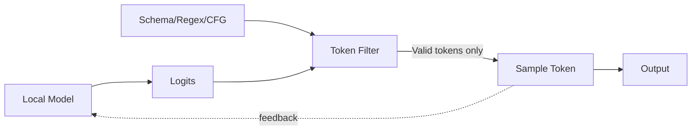

**Interview Q&A:**

*Q: Constrained decoding ki cost?*
Slight throughput drop — har step pe valid token mask compute karna padta hai (regex/grammar parsing). For simple schemas negligible (<5%). Complex recursive grammars me 20-30% slower. Compilation step ek-baar hai — same schema bar bar use karne pe amortized.

*Q: Open-source vs hosted structured outputs?*
Hosted (OpenAI strict mode, Anthropic) production-tested, backed by SLA, no infra. Open-source (Outlines, Guidance) jab tu local model deploy kar raha hai, custom grammar chahiye (CFG, regex), ya hosted unavailable. Functionality similar, ops burden different.

---

### 3.5 Handling parsing failures and retries

**Definition:** Even with structured outputs, real-world failures hote hain — schema strict mode bypass, model timeout, partial response, validation errors from custom validators. Retry strategy yeh decide karti hai kya retry karna, kaise back-off, kab give up.

**Why:** Production system me 0.1% failure bhi 1000 requests/min me 1.4 failures/min hai — significant. Naive retry (immediate, infinite) cost explode karta hai aur cascading failures la sakta hai. Smart retry resilience aur cost-control balance karti hai.

**How:**

```python
import json
import time
from pydantic import BaseModel, ValidationError
from openai import OpenAI, RateLimitError, APIError
from tenacity import retry, stop_after_attempt, wait_exponential, retry_if_exception_type

client = OpenAI()

class Output(BaseModel):
    answer: str
    confidence: float

# Tenacity se exponential backoff retries
@retry(
    stop=stop_after_attempt(3),
    wait=wait_exponential(multiplier=1, min=2, max=30),
    retry=retry_if_exception_type((RateLimitError, APIError, ValidationError))
)
def call_with_retry(prompt: str) -> Output:
    r = client.chat.completions.create(
        model="gpt-4o-mini",
        response_format={"type":"json_object"},
        messages=[{"role":"user","content":prompt}],
        timeout=30.0
    )
    raw = r.choices[0].message.content
    try:
        data = json.loads(raw)
    except json.JSONDecodeError as e:
        # Self-correction — error wapas bhejo
        raise ValidationError(f"Invalid JSON: {e}\nRaw: {raw[:200]}")
    return Output(**data)  # Pydantic validates

# Manual retry with self-correction loop
def call_with_self_correct(prompt: str, max_attempts: int = 3) -> Output:
    last_error = None
    for attempt in range(max_attempts):
        full_prompt = prompt
        if last_error:
            full_prompt += f"\n\nPrevious attempt failed: {last_error}\nRespond with valid JSON only."
        
        try:
            r = client.chat.completions.create(
                model="gpt-4o-mini",
                response_format={"type":"json_object"},
                messages=[{"role":"user","content":full_prompt}]
            )
            return Output(**json.loads(r.choices[0].message.content))
        except (json.JSONDecodeError, ValidationError) as e:
            last_error = str(e)
            time.sleep(2 ** attempt)  # exponential backoff
    
    raise RuntimeError(f"Failed after {max_attempts} attempts. Last: {last_error}")

# Circuit breaker pattern — provider-level outage handle
class CircuitBreaker:
    def __init__(self, threshold=5, timeout=60):
        self.failures = 0
        self.threshold = threshold
        self.timeout = timeout
        self.opened_at = None
    
    def call(self, fn, *args, **kwargs):
        if self.opened_at and time.time() - self.opened_at < self.timeout:
            raise RuntimeError("Circuit OPEN — provider down")
        try:
            result = fn(*args, **kwargs)
            self.failures = 0
            return result
        except Exception:
            self.failures += 1
            if self.failures >= self.threshold:
                self.opened_at = time.time()
            raise
```

**Real-life example:** Ek production system me OpenAI 30-min outage hua. Bina circuit breaker, retries pile up hue — request queue blow up, downstream services timeout, cascading failure. Post-mortem me added: circuit breaker + Anthropic fallback. Next outage me 99.5% requests Claude pe seamlessly served.

**Mermaid:**

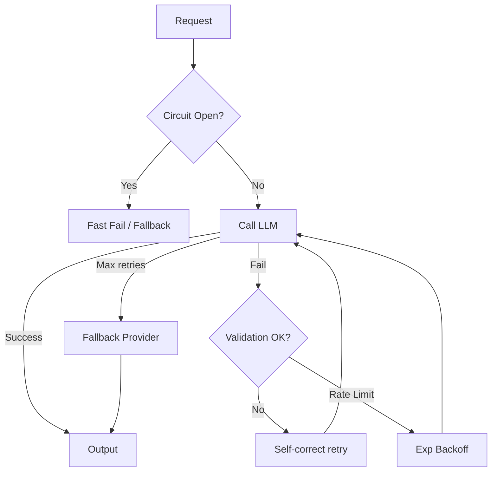

**Interview Q&A:**

*Q: Idempotency keys retries me kyon zaroori hain?*
Network retries pe duplicate side-effects ka risk — model already responded, response ude in transit, tu retry karta hai, duplicate billing. OpenAI Idempotency-Key header support karta hai — same key se 24hr me same cached response wapas. Non-LLM tools (payment, DB writes) ke liye yeh aur critical hai.

*Q: Self-correction loop infinite ho jaye to?*
Hard cap rakhna padta hai — typically 3 attempts. Aur har retry pe failure mode change ho rahi hai check kar — agar same error reproduce ho raha hai, model stuck hai, fallback (different model, different prompt strategy, or human escalation) trigger kar. Logs me retry depth track kar — high retry rate prompt regression ka indicator hai.

---

## Resources & further reading

- **Anthropic Prompt Engineering Guide** — `docs.anthropic.com/en/docs/build-with-claude/prompt-engineering`. Industry's deepest treatment of prompting; XML conventions, chaining, role prompts.
- **OpenAI Cookbook** — `cookbook.openai.com`. Hundreds of recipes — structured outputs, function calling, evals.
- **OpenAI Structured Outputs Guide** — strict JSON schema enforcement details, limitations, examples.
- **Instructor docs** — `python.useinstructor.com`. Pydantic + retries pattern, multi-provider examples.
- **Outlines (dottxt-ai/outlines)** — local model structured generation, regex/CFG/JSON.
- **Guidance (microsoft/guidance)** — programmatic prompt templates.
- **LangSmith / Helicone / Humanloop** — prompt observability and A/B testing platforms.
- **"Prompt Engineering for LLMs" by Schulhoff et al. (2024)** — taxonomy of 58 prompting techniques.
- **ReAct paper (Yao et al.)** — `arxiv.org/abs/2210.03629`. Foundational reasoning+acting pattern.
- **Tree-of-Thought (Yao et al., 2023)** — `arxiv.org/abs/2305.10601`.
- **Self-Consistency (Wang et al., 2022)** — `arxiv.org/abs/2203.11171`.
- **tiktoken** — OpenAI's tokenizer, essential for cost estimation.
- **Ollama docs** — `ollama.com/docs`. Local model deployment.
- **vLLM** — production-grade local inference server (alternative to Ollama for multi-user).
- **LiteLLM** — unified interface across 100+ providers; vendor lock-in solver.
- **Anthropic prompt caching cookbook** — 90% cost reduction patterns.
- **Promptfoo** — open-source prompt testing framework, eval-driven dev.
- **Eugene Yan's blog** — `eugeneyan.com`. Practical LLM eng patterns from senior practitioner.
- **Simon Willison's weblog** — daily LLM news and pragmatic experiments.
- **Tenacity (jd/tenacity)** — Python retry library, production-grade backoff.

Final word: LLM APIs ke saath senior engineering ka matlab hai — har layer pe paranoid hona. Token counts log kar, schemas strict rakh, retries bounded, fallback providers ready, prompts version controlled, evals automated. "It works on my prompt" se "it works in production at p99.9" tak ka safar inhi 100 chhoti detail me chhupa hai. Ab ja, code likh, aur production me kuch tod ke seekh.
