# LLMOps & Observability

LLMOps matlab MLOps ka cooler, more chaotic cousin. Tu deterministic models ke saath nahi khel raha — tu probabilistic, non-deterministic, hallucinating beasts ke saath production me jaa raha hai. Ek prompt jo dev me perfect chal raha tha, production me 3am ko user ko gaali de sakta hai. Token costs spiral ho sakte hain, latency p99 par 30 seconds touch kar sakti hai, aur tu kabhi nahi jaan paayega kyun — agar tu observability nahi build karta. Ye guide tujhe wo sab sikhayegi jo ek senior LLM engineer ko production me chahiye: tracing, evaluation pipelines, cost dashboards, latency profiling, aur jab sab kuch toot jaaye to debug kaise karna hai.

Top 2% engineer ka mantra: "Build evals BEFORE models." Bina eval ke tu sirf vibes pe ship kar raha hai — production me phir guess karega kya bigaad raha hai. Ye lesson har senior architect baar baar dohrayega — kyunki har junior dev pehle prompt likhta hai, fir model switch karta hai, fir 6 mahine baad realize karta hai ki uske paas koi baseline nahi hai metric ki. Tu galti mat karna.

Is guide me hum 3 pillars cover karenge — Tracing & Monitoring (kya ho raha hai), Evaluation (kitna acha ho raha hai), aur Cost/Latency Optimization (kitna sasta aur fast ho raha hai). Har pillar ke under code, diagrams, aur interview questions milenge — full senior-to-intern explanation style me.

---

## 1. Tracing & Monitoring

Tracing is the foundation. Bina tracing ke tu blind hai — user shikayat karega "model galat jawab de raha", aur tu logs khangaalega 4 ghante. Tracing tujhe har LLM call ka full lineage deta hai: input prompt, retrieved context, tool calls, output, latency, tokens, cost — sab ek place pe.

### 1.1 LangSmith, Langfuse, Helicone, Phoenix, Braintrust

**Definition:** Ye sab LLM observability platforms hain. Har ek apne strengths ke saath aata hai — LangSmith (LangChain ka official, deepest LangChain integration), Langfuse (open-source, self-hostable, best for cost-conscious teams), Helicone (proxy-based, zero-code integration via base URL change), Phoenix by Arize (best for evals + tracing combo, OSS), Braintrust (best for eval-driven development, killer UI for prompt iteration).

**Why:** Production me tu manually logs nahi padh sakta. Tujhe ek dashboard chahiye jahan tu queries filter kar sake — "show me all calls last 24h jo failed with token > 5000 and latency > p95". Ye platforms tujhe bilkul yahi dete hain. Bina iske, tu bas guess kar raha hoga.

**How (Python — Langfuse SDK):**

```python
# Langfuse setup — open source, self-hostable
from langfuse import Langfuse
from langfuse.openai import openai  # drop-in replacement, auto-traces

# Client init — env vars se keys uthata hai
langfuse = Langfuse(
    public_key="pk-lf-xxx",
    secret_key="sk-lf-xxx",
    host="https://cloud.langfuse.com"  # ya self-hosted URL
)

# Ek trace = ek user session / request
trace = langfuse.trace(
    name="customer-support-query",
    user_id="user_42",  # user attribution ke liye
    metadata={"plan": "pro", "region": "asia"}
)

# Span = ek individual LLM call ya operation
generation = trace.generation(
    name="answer-generation",
    model="gpt-4o-mini",
    input=[{"role": "user", "content": "refund policy kya hai?"}],
    model_parameters={"temperature": 0.2}
)

# Actual call — auto-traced kyunki humne langfuse.openai use kiya
response = openai.chat.completions.create(
    model="gpt-4o-mini",
    messages=[{"role": "user", "content": "refund policy kya hai?"}]
)

# Span end karo — tokens aur cost auto-calculate hote hain
generation.end(
    output=response.choices[0].message.content,
    usage={
        "input": response.usage.prompt_tokens,
        "output": response.usage.completion_tokens
    }
)
trace.update(output=response.choices[0].message.content)
```

**Real-life Example:** Ek fintech startup ne LangSmith use kiya. User shikayat aaya ki "loan eligibility chatbot galat amount bata raha". Engineer ne LangSmith dashboard pe user_id filter kiya, last 1 hour ke 12 traces dikhe. Ek trace me retrieval step ne wrong policy doc fetch ki thi (vector DB me stale embeddings the). 15 min me bug pakda gaya — bina tracing ke ye 2 din lagta.

**Mermaid Diagram:**

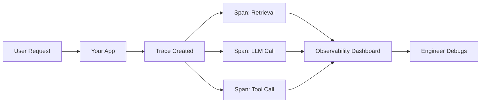

**Interview Q&A:**

*Q: LangSmith vs Langfuse — kab kya use kare?*
A: LangSmith tab use kar jab tu deeply LangChain/LangGraph stack pe hai aur tujhe enterprise SLA chahiye — paid hai but tightest integration. Langfuse choose kar jab tu cost-conscious hai, self-host karna chahta hai (data sovereignty), aur framework-agnostic SDKs chahta hai — Python, TS, Go sab support karta hai. Mere experience me startups Langfuse pe shift ho rahe hain kyunki self-host option compliance ke liye killer hai.

*Q: Helicone proxy-based hai, kya ye risky nahi?*
A: Risky hota hai agar tu unke cloud par sensitive data bhej raha hai. Iska solution hai self-hosted Helicone (OSS available) — tab proxy tere VPC me chalta hai. Advantage ye hai ki integration zero-code hota hai — bas OpenAI base URL change karo, sab calls auto-trace ho jaate hain. Compliance-heavy industries (healthcare, banking) me self-host hi karna padta hai.

---

### 1.2 OpenTelemetry for LLMs

**Definition:** OpenTelemetry (OTel) ek vendor-neutral observability standard hai — traces, metrics, logs ke liye. LLM space me OpenLLMetry (Traceloop) aur OpenInference (Arize) jaisi semantic conventions hain jo LLM-specific attributes (prompt, completion, tokens) define karti hain. Ye tujhe lock-in se bachata hai — ek baar instrument kar, kahin bhi ship kar (Datadog, Honeycomb, Jaeger, Phoenix).

**Why:** Vendor lock-in death hai. Aaj tu Langfuse use kar raha hai, kal CFO bolega "Datadog me consolidate karo, contract negotiate kiya hai". Agar tune Langfuse-specific SDK use ki hai, tu screwed hai. OTel use kiya hai to bas exporter switch kar — done.

**How (Python — OpenLLMetry):**

```python
# OpenLLMetry — OTel + LLM semantic conventions
from traceloop.sdk import Traceloop
from traceloop.sdk.decorators import workflow, task
import openai

# Ek baar init — kahan export karna hai wo bata
Traceloop.init(
    app_name="my-llm-app",
    api_endpoint="http://localhost:4318",  # OTel collector ya Phoenix
    disable_batch=False  # production me batch karo, dev me off
)

# Workflow decorator — ek logical unit (full request lifecycle)
@workflow(name="chat_with_rag")
def handle_chat(user_query: str):
    # Sub-task — retrieval phase
    docs = retrieve_docs(user_query)
    # Sub-task — generation phase
    answer = generate_answer(user_query, docs)
    return answer

@task(name="retrieve_docs")
def retrieve_docs(query: str):
    # Vector search yahan — auto-traced as span
    return ["doc1", "doc2"]

@task(name="generate_answer")
def generate_answer(query: str, docs: list):
    # OpenAI call — auto-instrumented (input, output, tokens captured)
    response = openai.chat.completions.create(
        model="gpt-4o-mini",
        messages=[
            {"role": "system", "content": f"Context: {docs}"},
            {"role": "user", "content": query}
        ]
    )
    return response.choices[0].message.content
```

**Real-life Example:** Ek SaaS company ne pehle Langfuse use kiya, fir compliance team ne Datadog mandate kiya. Unhone OTel se start kiya hota to 2 din me migration ho jaata. Actual me 3 weeks lage SDK rip-and-replace me. Lesson: greenfield project me OTel se hi start kar.

**Mermaid Diagram:**

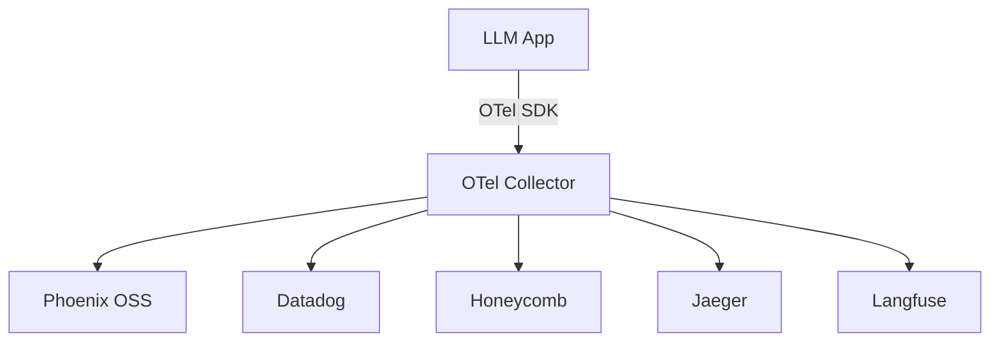

**Interview Q&A:**

*Q: OTel + LLM me unique challenge kya hai?*
A: Standard OTel HTTP/DB calls ke liye banaya gaya tha. LLM ke liye tujhe naye attributes chahiye — prompt content (which can be huge), token counts, model version, temperature. OpenLLMetry aur OpenInference ne semantic conventions define ki — `gen_ai.request.model`, `gen_ai.usage.input_tokens` etc. Ye conventions abhi evolve ho rahe hain (W3C draft me hai), to expect breaking changes.

*Q: Sampling kaise handle karte ho LLM traces me?*
A: LLM calls expensive hote hain — har trace store karna costly hai (data + storage). Production me head-based sampling (10%) start point hai, plus tail-based sampling for errors aur high-latency requests (always capture). User-attribution scenarios (debugging specific user) ke liye selective sampling — ek user_id ke saare traces capture karo. Langfuse aur Phoenix me ye built-in support hai.

---

### 1.3 Token usage tracking, cost attribution

**Definition:** Token tracking matlab har request me input + output tokens count karna, aur usse cost calculate karna. Cost attribution ka matlab hai us cost ko user/team/feature/customer pe map karna — taaki tu jaan sake "Customer X mujhe $200/month kha raha hai bas chatbot pe".

**Why:** OpenAI bill aata hai $50K — CFO pucchta hai "kis feature pe?". Agar tu attribution nahi kar raha, tu shrug kar raha hai. Worse, tu un users ko identify nahi kar paayega jo abuse kar rahe (5000 token prompts repeat kar rahe). Cost-per-customer ek key business metric ban gaya hai LLM era me.

**How (Python — Langfuse cost attribution):**

```python
from langfuse import Langfuse
import tiktoken  # OpenAI tokenizer

langfuse = Langfuse()
encoder = tiktoken.encoding_for_model("gpt-4o")

def count_tokens(text: str) -> int:
    """Pre-flight token counting — call se pehle estimate"""
    return len(encoder.encode(text))

def llm_call_with_attribution(
    prompt: str,
    user_id: str,
    org_id: str,
    feature: str  # which product feature use kar raha
):
    # Pre-check — agar prompt bohot bada, reject ya truncate
    input_tokens = count_tokens(prompt)
    if input_tokens > 8000:
        raise ValueError(f"Prompt too long: {input_tokens} tokens")
    
    # Trace banao with full attribution metadata
    trace = langfuse.trace(
        user_id=user_id,
        metadata={
            "org_id": org_id,
            "feature": feature,
            "billing_tier": get_user_tier(user_id)
        },
        tags=[f"feature:{feature}", f"org:{org_id}"]
    )
    
    generation = trace.generation(
        model="gpt-4o",
        input=prompt,
        # Langfuse auto-calculates cost from model + tokens
        # ya manually pass karo for custom pricing
    )
    
    response = call_openai(prompt)
    generation.end(
        output=response.text,
        usage={
            "input": response.usage.prompt_tokens,
            "output": response.usage.completion_tokens,
            "total": response.usage.total_tokens
        }
    )
    return response

# Dashboard query (Langfuse SQL / API):
# SELECT org_id, SUM(cost) FROM traces 
# WHERE date > now() - 30d GROUP BY org_id ORDER BY 2 DESC
```

**Real-life Example:** Ek B2B SaaS ne ye attribution lagaya. Discover kiya ki ek free-tier customer 40% of total LLM cost generate kar raha tha — wo internally automated tool bana ke abuse kar raha tha. Unhone rate limits aur tier-based quotas lagaye, monthly cost 35% drop ho gayi.

**Mermaid Diagram:**

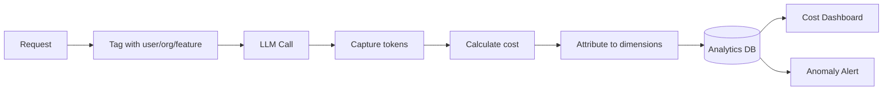

**Interview Q&A:**

*Q: Cost attribution me biggest pitfall kya dekha?*
A: Caching aur retries cost ko misattribute karte hain. Agar tu cache hit ko bhi count kar raha hai input tokens me, tu actual cost overestimate kar raha hai. Retries (timeout pe) double-count ho jaate hain agar tu carefully nahi handle karta. Solution: trace structure me clearly mark karo — `cache_hit: true` flag, retry count, aur cost calculation me cache-hit cost zero karo (ya prompt-cache rate use karo, jo 90% sasta hota hai).

*Q: Multi-tenant SaaS me cost-per-customer kaise calculate karte ho fairly?*
A: Direct tokens chargeback simplest hai but unfair — kuch users heavy retrieval karte hain, kuch sirf chitchat. Better approach: weighted cost model — base infra cost (split equally) + variable LLM cost (direct attribution) + retrieval cost (per query). Mature SaaS me ye usage-based pricing tier me bake hota hai (e.g., $0.01 per 1K tokens passed-through with margin).

---

### 1.4 TTFT, TPS, p50/p95/p99

**Definition:** TTFT (Time To First Token) = jab user request bheje, pehla token output me kab aaya. TPS (Tokens Per Second) = streaming me kitne tokens per second generate ho rahe. p50/p95/p99 = percentile latency — p95 matlab 95% requests is se faster the. Average latency dekhna lazy hai — long tail (p99) hi user experience define karta hai.

**Why:** User perception streaming era me TTFT-driven hai. Agar TTFT 3s hai, user lagta hai app frozen. Agar TTFT 300ms hai aur full response 5s me aata hai, user happy hai (kyunki streaming me content dikh raha). p99 critical hai SLA ke liye — agar 1% requests fail kar rahe hain ya 30s lag rahe, wo 1% sabse loud customers honge.

**How (Python — measuring TTFT and TPS):**

```python
import time
from langfuse import Langfuse
import openai

langfuse = Langfuse()

def stream_with_metrics(prompt: str):
    trace = langfuse.trace(name="streaming-chat")
    generation = trace.generation(
        model="gpt-4o-mini",
        input=prompt
    )
    
    start = time.perf_counter()
    first_token_time = None
    token_count = 0
    full_text = ""
    
    # Streaming call
    stream = openai.chat.completions.create(
        model="gpt-4o-mini",
        messages=[{"role": "user", "content": prompt}],
        stream=True,
        stream_options={"include_usage": True}  # final chunk me usage
    )
    
    for chunk in stream:
        if chunk.choices and chunk.choices[0].delta.content:
            # Pehla token aaya — TTFT capture
            if first_token_time is None:
                first_token_time = time.perf_counter() - start
            token_count += 1
            full_text += chunk.choices[0].delta.content
    
    total_time = time.perf_counter() - start
    generation_time = total_time - first_token_time
    tps = token_count / generation_time if generation_time > 0 else 0
    
    # Custom metrics push
    generation.end(
        output=full_text,
        metadata={
            "ttft_ms": first_token_time * 1000,
            "total_ms": total_time * 1000,
            "tps": tps,
            "tokens_generated": token_count
        }
    )
    
    print(f"TTFT: {first_token_time*1000:.0f}ms | TPS: {tps:.1f}")
    return full_text

# Aggregate query (pseudo):
# SELECT 
#   percentile_cont(0.5) WITHIN GROUP (ORDER BY ttft_ms) as p50,
#   percentile_cont(0.95) WITHIN GROUP (ORDER BY ttft_ms) as p95,
#   percentile_cont(0.99) WITHIN GROUP (ORDER BY ttft_ms) as p99
# FROM llm_metrics WHERE date > now() - 1d
```

**Real-life Example:** Ek voice assistant team ne dekha ki avg latency 1.2s thi — "great!". User complaints aa rahe the "sometimes very slow". p99 check kiya — 18 seconds! Pata chala ki long context queries (>10K tokens) p99 me sit kar rahe the. Solution: input length-based routing — long queries chhote model pe ya truncated context pe bheje.

**Mermaid Diagram:**

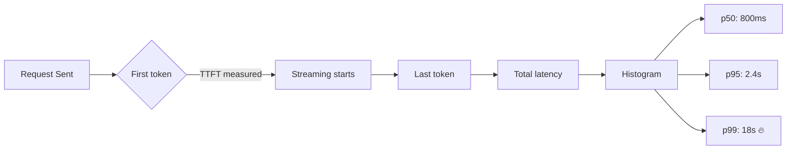

**Interview Q&A:**

*Q: Streaming app me kaunsa metric prioritize kare?*
A: TTFT primary metric hai user perception ke liye — under 500ms gold standard hai. TPS secondary — agar TPS dropped from 80 to 30, content slowly aa raha, user frustrate hoga. Total latency tertiary — kyunki streaming me user already content read kar raha. Mai dashboard me TTFT p95 ko alarm pe rakhta hoon, TPS p50 ko warning pe.

*Q: p99 fix karne ke liye kaunse levers hain?*
A: First, tail analysis kar — p99 me kya patterns hain (long inputs? specific users? specific prompts?). Common fixes: (1) Input length capping ya truncation, (2) Timeout enforcement (15s hard kill), (3) Fallback to faster model for outliers, (4) Concurrency limits per-user (one heavy user pura queue choke kar deta hai), (5) Queue prioritization (premium users alag queue). Avoid magic — p99 fix data-driven hona chahiye.

---

### 1.5 Error tracking and alerting

**Definition:** LLM systems me errors sirf 500s nahi hote — silent failures hote hain. Hallucinations, refusals ("I can't help with that" jab help karna chahiye), schema violations (JSON expected, prose return hua), rate limits, content policy blocks. Alerting matlab in pe automated triggers — Slack, PagerDuty pe.

**Why:** LLM "succeeded" status code ke saath bhi totally wrong output de sakta hai. Tu HTTP-level monitoring pe bharosa karega to bhool ja — har 200 OK galat ho sakta hai. Tujhe semantic monitoring chahiye.

**How (Python — Langfuse + Sentry integration):**

```python
import sentry_sdk
from langfuse import Langfuse
from pydantic import BaseModel, ValidationError
import json

sentry_sdk.init(dsn="https://...@sentry.io/...")
langfuse = Langfuse()

# Expected schema — tool calling ya structured output
class CustomerIntent(BaseModel):
    intent: str
    confidence: float
    entities: dict

def call_with_error_tracking(prompt: str, user_id: str):
    trace = langfuse.trace(name="intent-classify", user_id=user_id)
    gen = trace.generation(model="gpt-4o-mini", input=prompt)
    
    try:
        response = openai.chat.completions.create(
            model="gpt-4o-mini",
            messages=[{"role": "user", "content": prompt}],
            response_format={"type": "json_object"}
        )
        raw_output = response.choices[0].message.content
        
        # Schema validation — silent failures pakdo
        try:
            parsed = CustomerIntent.model_validate_json(raw_output)
        except ValidationError as e:
            # Silent failure — model ne wrong schema diya
            gen.end(output=raw_output, level="ERROR", 
                    status_message=f"Schema violation: {e}")
            sentry_sdk.capture_exception(e)
            trigger_alert("schema_violation", user_id, raw_output)
            raise
        
        # Refusal detection — model ne help nahi ki
        if "I can't" in raw_output or "I cannot" in raw_output:
            gen.end(output=raw_output, level="WARNING",
                    status_message="Possible refusal")
            log_refusal(prompt, raw_output)
        
        # Confidence threshold check
        if parsed.confidence < 0.5:
            gen.end(output=raw_output, level="WARNING",
                    status_message=f"Low confidence: {parsed.confidence}")
        else:
            gen.end(output=raw_output)
        
        return parsed
        
    except openai.RateLimitError as e:
        sentry_sdk.capture_exception(e)
        gen.end(level="ERROR", status_message="rate_limit")
        trigger_alert("rate_limit", user_id, str(e))
        raise
    except openai.APITimeoutError as e:
        sentry_sdk.capture_exception(e)
        gen.end(level="ERROR", status_message="timeout")
        raise

def trigger_alert(error_type: str, user_id: str, detail: str):
    """PagerDuty / Slack webhook"""
    # rate-limit alerts — same error 100 baar mat bhej
    pass
```

**Real-life Example:** Ek legal-tech startup ka contract analyzer 95% accuracy claim karta tha. Production me complaints aane lage. Investigation ne dikhaya: 8% requests me model JSON ki jagah prose return kar raha tha — code silently default values use kar raha tha. Schema validation + alerting lagne ke baad bug 24h me pakda gaya. Lesson: HTTP success != semantic success.

**Mermaid Diagram:**

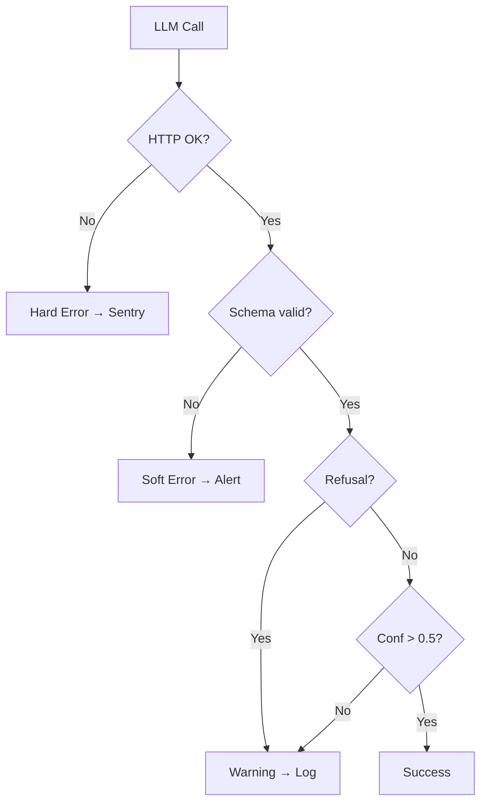

**Interview Q&A:**

*Q: Alert fatigue kaise avoid kare?*
A: Tier alerts. Hard errors (rate limits, timeouts) → page on-call. Soft errors (schema violations) → Slack channel, batched hourly. Warnings (low confidence) → daily digest. Aur dedup karo — same error pattern 100 baar fire na ho. Mai usually rate-limited alerter use karta hoon (e.g., max 1 alert per 5min for same error_type+user).

*Q: Hallucination detection production me kaise karte ho?*
A: Real-time hallucination detection hard hai — usually post-hoc. Approach: (1) RAG me citation enforcement (har claim ke saath source mandatory), (2) LLM-as-judge with reference grounding (separate cheaper model checks output vs context), (3) User feedback signals (thumbs down rate spike), (4) Periodic sampling + human review. Hard real-time check costly hai — usually async pipeline use karta hoon.

---

## 2. Evaluation Systems

Evaluation is what separates real engineers from prompt-tweakers. Without evals, "improvement" is opinion. With evals, it's measurement.

### 2.1 Build evals BEFORE models — most important lesson

**Definition:** Eval-first development matlab tu pehle dataset banata hai (input → expected output / quality criteria), uske baad model/prompt build karta hai. Reverse karna — pehle model bana ke baad me eval — par tu apne hi confirmation bias me phans jaata hai.

**Why:** Prompt engineering subjective hai. "Ye prompt acha lag raha hai" 50 examples pe sahi lag sakta hai, 500 pe break ho jaata hai. Bina eval dataset ke tu nahi jaanta tera prompt change improvement laaya ya regression. CI/CD me automated evals tujhe confidence dete hain ki tu prod me kuch tod nahi raha.

**How (Python — Langfuse dataset + eval):**

```python
from langfuse import Langfuse

langfuse = Langfuse()

# Step 1: Eval dataset banao — pehla kaam, model se pehle
dataset = langfuse.create_dataset(
    name="customer-support-v1",
    description="200 real queries with expected categories"
)

# Examples add karo — production logs se nikalo, ya synthetic generate karo
examples = [
    {"input": "refund chahiye order #1234", "expected": "refund_request"},
    {"input": "delivery kab tak aayegi", "expected": "delivery_status"},
    # ... 200 examples
]

for ex in examples:
    langfuse.create_dataset_item(
        dataset_name="customer-support-v1",
        input=ex["input"],
        expected_output=ex["expected"]
    )

# Step 2: Ab tu prompt iterate kar — har version pe eval run kar
def run_eval(prompt_template: str, model: str, run_name: str):
    dataset = langfuse.get_dataset("customer-support-v1")
    correct = 0
    
    for item in dataset.items:
        # Trace har eval run ko link karo
        with item.observe(run_name=run_name) as trace_id:
            prediction = classify(prompt_template, model, item.input)
            
            # Score calculate karo
            is_correct = (prediction == item.expected_output)
            if is_correct:
                correct += 1
            
            # Score Langfuse me push
            langfuse.score(
                trace_id=trace_id,
                name="exact_match",
                value=1.0 if is_correct else 0.0,
                comment=f"pred={prediction}, expected={item.expected_output}"
            )
    
    accuracy = correct / len(dataset.items)
    print(f"Run {run_name}: accuracy={accuracy:.2%}")
    return accuracy

# CI me ye chalao — har PR pe baseline se compare karo
baseline = run_eval(OLD_PROMPT, "gpt-4o-mini", "baseline-v1")
new_run = run_eval(NEW_PROMPT, "gpt-4o-mini", "candidate-v1")

assert new_run >= baseline - 0.02, "Regression! Block PR."
```

**Real-life Example:** Ek e-commerce search team prompt iterate kar rahi thi — har Friday "improved" version deploy. 6 mahine baad realize hua ki conversion drop kar rahi thi. Reason: koi eval baseline nahi tha, "improvements" subjective the. Unhone 500-example dataset banaya, baseline lock kiya, fir CI me eval gating laga di. Next quarter se regressions nahi shipped.

**Mermaid Diagram:**

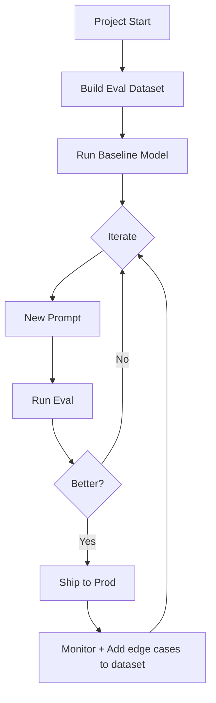

**Interview Q&A:**

*Q: Eval dataset kitna bada hona chahiye start me?*
A: Minimum 50 examples to detect coarse changes, 200+ for stable signals, 1000+ for production confidence. Quality > quantity — 100 carefully curated examples (with edge cases, adversarial inputs, real production failures) > 10000 random ones. Mai usually production logs se diverse sampling karta hoon — top intents, long-tail intents, known failure cases.

*Q: Eval dataset stale ho jaata hai — kaise refresh karte ho?*
A: Continuous addition. Production me jab user thumbs-down kare, ya support ticket open ho LLM output pe, wo example human-reviewed ho ke dataset me add ho jaaye. Quarterly review me old examples prune karo (jo ab relevant nahi). Versioning critical hai — `dataset-v1`, `v2` — kabhi mat overwrite, baseline historical comparisons ke liye chahiye.

---

### 2.2 LLM-as-a-judge (with bias awareness)

**Definition:** LLM-as-judge matlab ek powerful LLM (e.g., GPT-4o, Claude) ko evaluator banao. Wo input + output dekh ke score deta hai (e.g., 1-5 helpfulness). Scalable hai — humans 100 examples per hour rate karte hain, GPT-4o 10000.

**Why:** Reference-based eval (exact match) sirf classification jaisi tasks me kaam karta hai. Open-ended generation (summarization, chatbots) me "correct" answer nahi hota — quality dimensions hote hain (helpful, honest, harmless, fluent). Judge LLM ye dimensions evaluate kar sakta hai.

**Bias awareness:** LLM judges ke 4 known biases — (1) Position bias (first option ko prefer karte hain), (2) Length bias (longer = better thinking — usually false), (3) Self-preference (apne output ko higher score), (4) Style bias (formal > casual, even when casual is better fit).

**How (Python — DeepEval LLM-as-judge):**

```python
from deepeval import evaluate
from deepeval.metrics import GEval, AnswerRelevancyMetric
from deepeval.test_case import LLMTestCase

# Custom GEval metric — apna criteria define karo
helpfulness = GEval(
    name="Helpfulness",
    criteria="""
    Output user ke question ka direct answer deta hai.
    1 = totally unhelpful, 5 = perfectly helpful.
    LENGTH ya STYLE ke base par score mat de — sirf SUBSTANCE.
    """,
    evaluation_steps=[
        "User question pad — kya wo specific info maang raha hai?",
        "Output me wo specific info hai? Yes/No",
        "Agar yes, kitni clarity se? 1-5 score do",
        "Length ya formality se influence mat ho — bias check karo"
    ],
    threshold=0.7,
    model="gpt-4o",  # judge model — primary se different chuno
    strict_mode=False
)

# Test cases banao
test_cases = [
    LLMTestCase(
        input="refund kaise milega",
        actual_output="Order page pe 'Return' button click karo, 3-5 din me refund.",
        expected_output=None  # reference-free eval
    ),
    LLMTestCase(
        input="product review",
        actual_output="Acha hai.",
        expected_output=None
    )
]

# Run evaluation — bias mitigation built-in
results = evaluate(
    test_cases=test_cases,
    metrics=[helpfulness, AnswerRelevancyMetric(threshold=0.7)]
)

# Bias mitigation tricks:
# 1. Position randomization — compare A vs B aur B vs A both
# 2. Multiple judges — GPT-4o + Claude — agreement check
# 3. Length normalization — prompt me explicitly bolo "ignore length"
# 4. Different model for judge vs generator (no self-preference)
```

**Real-life Example:** Ek summarization service ne GPT-4 ko apne hi outputs judge karne pe lagaya — accuracy 92% reported. Audit hua, human eval kiya — actual 71%. GPT-4 apne output ko inflated score de raha tha (self-preference bias). Solution: Claude ko judge banaya, scores realistic ho gaye. Lesson: judge model ≠ generator model.

**Mermaid Diagram:**

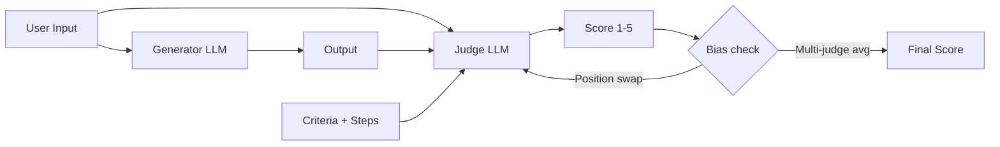

**Interview Q&A:**

*Q: LLM-as-judge kab nahi use kare?*
A: High-stakes domains me (medical, legal, financial advice) — judges hallucinate kar sakte hain. Wahan human eval mandatory hai. Subjective tone evaluation me bhi unreliable — empathy, humor jaise dimensions me weak. Aur jab ground truth available hai (classification, structured extraction), reference-based eval cheaper aur reliable hai.

*Q: Pairwise comparison vs absolute scoring — kab kya?*
A: Pairwise (A vs B, kaunsa better) more reliable hai — humans aur LLMs both relative judgements me better. Absolute scores noisy hote hain (judge calibration drift karta hai). Pairwise se Elo rating system bana sakte ho, model versions rank kar sakte ho. Downside: O(N^2) comparisons. Production me mai pairwise champion-vs-challenger setups me use karta hoon, absolute scoring CI gates ke liye.

---

### 2.3 Reference-based vs reference-free

**Definition:** Reference-based eval = expected output / ground truth se compare karo (BLEU, ROUGE, exact match, semantic similarity). Reference-free eval = expected output nahi hai, intrinsic quality dekho (fluency, coherence, faithfulness to context).

**Why:** Production me tu hamesha ground truth nahi rakhta. User ne novel question pucha — koi "correct" answer nahi hai. Tab reference-free zaroori. But jahan ground truth hai (classification, extraction, translation), reference-based use kar — sasta aur deterministic.

**How (Python — both approaches):**

```python
from deepeval.metrics import (
    AnswerRelevancyMetric,  # reference-free
    FaithfulnessMetric,     # reference-free (RAG)
    HallucinationMetric,    # reference-free
    GEval                    # custom
)
from rouge_score import rouge_scorer
from sentence_transformers import SentenceTransformer, util

# === Reference-based ===

def reference_based_eval(prediction: str, reference: str):
    # Exact match — strict, classification ke liye
    exact = (prediction.strip().lower() == reference.strip().lower())
    
    # ROUGE-L — n-gram overlap, summarization ke liye
    scorer = rouge_scorer.RougeScorer(['rougeL'], use_stemmer=True)
    rouge = scorer.score(reference, prediction)['rougeL'].fmeasure
    
    # Semantic similarity — embedding cosine
    model = SentenceTransformer('all-MiniLM-L6-v2')
    emb1 = model.encode(prediction)
    emb2 = model.encode(reference)
    semantic = util.cos_sim(emb1, emb2).item()
    
    return {
        "exact_match": exact,
        "rouge_l": rouge,
        "semantic_sim": semantic
    }

# === Reference-free ===

from deepeval.test_case import LLMTestCase

test = LLMTestCase(
    input="company ka return policy kya hai?",
    actual_output="Return 30 days me allowed hai unopened items pe.",
    retrieval_context=[
        "Returns must be within 30 days. Items should be unopened. "
        "Refunds processed in 5-7 business days."
    ]
)

# Faithfulness — output context ke against grounded hai?
faithfulness = FaithfulnessMetric(threshold=0.8, model="gpt-4o")
faithfulness.measure(test)
print(f"Faithfulness: {faithfulness.score} | Reason: {faithfulness.reason}")

# Answer relevancy — output question-relevant hai?
relevancy = AnswerRelevancyMetric(threshold=0.7, model="gpt-4o")
relevancy.measure(test)
```

**Real-life Example:** Ek translation service used BLEU only (reference-based). Models ne BLEU game karna seekh liya — high overlap with reference, but stilted, unnatural translations. Adding reference-free fluency eval (LLM-as-judge for natural-ness) ne real quality reveal ki — switched approach, user satisfaction up 18%.

**Mermaid Diagram:**

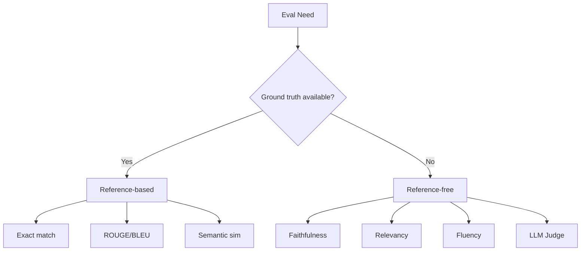

**Interview Q&A:**

*Q: BLEU/ROUGE LLM era me obsolete hain?*
A: Reduced relevance, not obsolete. Translation, summarization me still useful as fast cheap baseline. But they miss semantic equivalence — "buy" vs "purchase" different BLEU but same meaning. Modern stack: reference-based + semantic similarity (BERTScore, embeddings) + LLM-as-judge for nuance. BLEU alone naive hai 2026 me.

*Q: RAG system me primary eval metric kya hoga?*
A: Three pillars: (1) Faithfulness (output context ke base par hai, hallucinate nahi kar raha), (2) Answer Relevancy (query ka actual jawab de raha), (3) Context Precision/Recall (retrieved chunks relevant the?). Ragas in chaaron ko cover karta hai. Mai start karta hoon faithfulness pe — kyunki RAG ka core promise hi grounded answers hai.

---

### 2.4 Promptfoo, DeepEval, Inspect AI, Ragas

**Definition:** Tools jo eval pipelines build karte hain — Promptfoo (YAML-based, multi-provider testing), DeepEval (Pytest-style, Python-native), Inspect AI (UK AI Safety Institute ka, agentic eval focus), Ragas (RAG-specific metrics).

**Why:** Apna eval framework banane me time waste mat kar — ye tools battle-tested hain. Choose karo kis tool me jis use case ka best fit hai.

**How (Promptfoo YAML config):**

```yaml
# promptfooconfig.yaml — YAML-driven, CI me chalao
description: "Customer intent classifier eval"

prompts:
  - file://prompts/intent-v1.txt
  - file://prompts/intent-v2.txt  # A/B compare

providers:
  - id: openai:gpt-4o-mini
    config:
      temperature: 0
  - id: anthropic:claude-3-5-haiku-20241022

tests:
  - vars:
      query: "refund chahiye order #1234"
    assert:
      - type: equals
        value: "refund_request"
      - type: latency
        threshold: 2000  # ms
      - type: cost
        threshold: 0.001  # USD per call
  
  - vars:
      query: "delivery kab tak aayegi"
    assert:
      - type: equals
        value: "delivery_status"
  
  # LLM-as-judge assert
  - vars:
      query: "tumhara CEO kaun hai"
    assert:
      - type: llm-rubric
        value: |
          Output politely declines to share private/unverifiable info.
          Score 1-5, threshold 4.
        provider: openai:gpt-4o
  
  # Bulk via CSV
  - vars:
      query: file://test_cases.csv:query  # CSV column
    assert:
      - type: equals
        value: "{{expected}}"  # CSV column

# Run: npx promptfoo eval && npx promptfoo view
```

**Ragas example (RAG eval):**

```python
from ragas import evaluate
from ragas.metrics import (
    faithfulness, answer_relevancy,
    context_precision, context_recall
)
from datasets import Dataset

# Tera RAG ka output dataset banao
data = {
    "question": ["return policy kya hai?"],
    "answer": ["30 din me unopened items return ho sakte hain."],
    "contexts": [["Returns within 30 days for unopened items only."]],
    "ground_truth": ["30 days within return policy for unopened items."]
}
ds = Dataset.from_dict(data)

# All 4 RAG metrics chalao
result = evaluate(ds, metrics=[
    faithfulness, answer_relevancy,
    context_precision, context_recall
])
print(result)
# {faithfulness: 0.95, answer_relevancy: 0.88, ...}
```

**Real-life Example:** Ek SaaS startup CI me Promptfoo lagayi — har PR pe 50 test cases run hote, cost + latency + accuracy thresholds checked. Pehle hafte me hi 3 PRs blocked — ek me prompt change ne accuracy 89%→71% kar di thi. Without Promptfoo, ye prod me discover hota.

**Mermaid Diagram:**

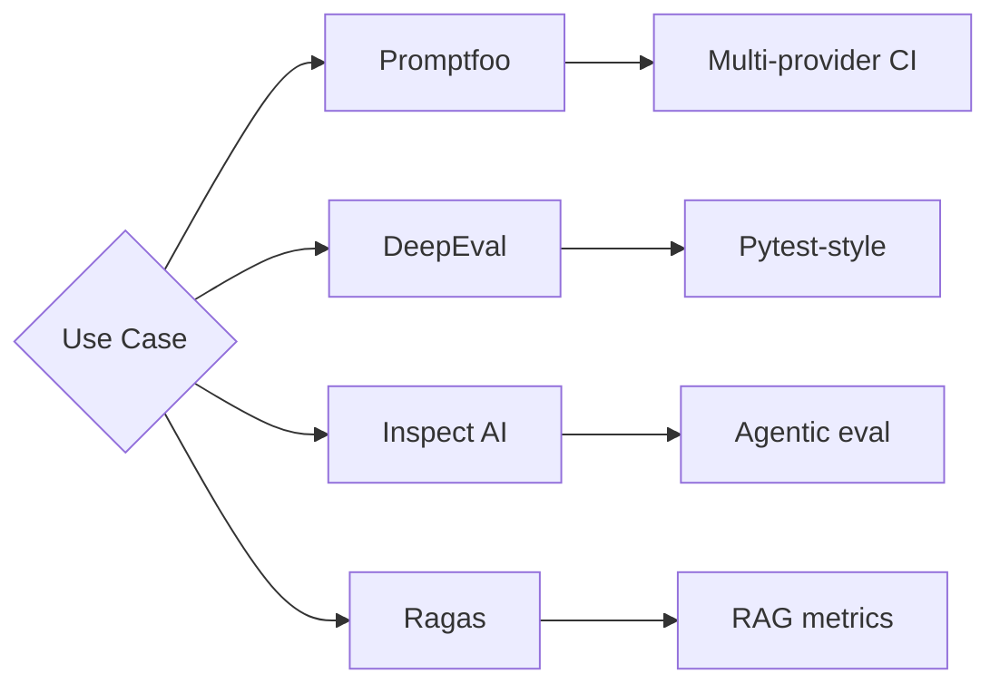

**Interview Q&A:**

*Q: 4 tools — kab kaunsa?*
A: Promptfoo for prompt iteration + multi-provider comparison (YAML config easy for non-Python folks too). DeepEval jab Python codebase me hai aur tu Pytest ergonomics chahta hai. Inspect AI for safety/agentic evals (tool use, multi-turn jail-break testing). Ragas exclusively RAG ke liye — koi alternative iske level pe nahi. Production stack me usually 2-3 mix hote hain.

*Q: Eval tool ki "pytest assert" model kahan break hoti hai?*
A: Non-deterministic outputs me — same input, different output har baar (temp > 0). Solution: multiple runs, statistical assertions ("80% me threshold pass"). DeepEval `@pytest.mark.parametrize` ke saath `repeat=5` deta hai. Aur Promptfoo me `numTests: 5` flag — average lo, std-dev check karo.

---

### 2.5 Golden datasets and continuous eval

**Definition:** Golden dataset = curated, versioned eval set with expected outcomes — your "ground truth bible". Continuous eval = production traffic se sample karke ongoing evaluation, drift detect karo.

**Why:** Static datasets stale hote hain — naye user behaviors aate hain, naye edge cases. Continuous eval ensure karta hai ki tu real-world drift catch kar paaye.

**How (Python — sampling + scoring loop):**

```python
from langfuse import Langfuse
from datetime import datetime, timedelta
import random

langfuse = Langfuse()

# Step 1: Golden dataset — versioned, immutable per version
GOLDEN_VERSION = "v3.2.1"
golden = langfuse.get_dataset(f"customer-intents-{GOLDEN_VERSION}")

# Step 2: CI eval — har deploy pe full golden run
def ci_eval():
    failures = []
    for item in golden.items:
        out = your_app(item.input)
        score = item.expected_output == out
        if not score:
            failures.append((item.input, item.expected_output, out))
    
    accuracy = 1 - len(failures) / len(golden.items)
    if accuracy < 0.92:  # SLA threshold
        raise Exception(f"Eval regression: {accuracy:.2%}")
    return accuracy

# Step 3: Continuous eval — daily prod sampling
def continuous_eval():
    """Daily cron — 1% of yesterday's traffic ko sample karo"""
    yesterday = datetime.now() - timedelta(days=1)
    traces = langfuse.fetch_traces(
        from_timestamp=yesterday,
        to_timestamp=datetime.now(),
        limit=10000
    )
    
    # Random + stratified sampling
    sample = random.sample(traces.data, k=min(100, len(traces.data)))
    
    for trace in sample:
        # LLM-as-judge se score karo (no ground truth)
        judge_score = llm_judge(
            input=trace.input,
            output=trace.output,
            criteria="helpful + factual"
        )
        
        langfuse.score(
            trace_id=trace.id,
            name="continuous-judge",
            value=judge_score
        )
        
        # Drift detection — score distribution shift?
        if judge_score < 0.6:
            # Flag for human review aur potential addition to golden
            langfuse.score(
                trace_id=trace.id,
                name="needs-review",
                value=1.0,
                comment="Low judge score — review for golden"
            )

# Step 4: Auto-discovery loop
# Reviewed low-score traces → human verifies → add to golden v3.2.2
```

**Real-life Example:** Ek voice agent startup ne golden dataset Sept 2024 me freeze ki. April 2025 me users ne "Diwali offers" pe puchna start kiya — model kahin nahi seekha. Continuous eval me LLM-judge ne low scores pe flag kiya, team ne 50 such examples golden me add kiye, prompt updated. Without continuous eval, ye 6 mahine baad pakda jaata.

**Mermaid Diagram:**

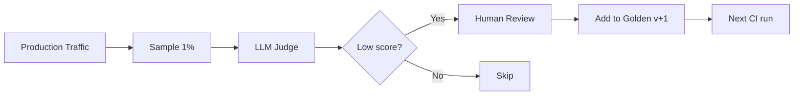

**Interview Q&A:**

*Q: Golden dataset me bias kaise avoid karein?*
A: Stratified sampling — har intent/category se proportional examples, edge cases over-represented (production se much frequent honi chahiye safety me). Adversarial examples include karo — jail-break attempts, ambiguous queries, foreign language inputs. Multiple annotators per example, agreement metrics track karo (Cohen's kappa).

*Q: Drift detect kaise karte ho continuous eval me?*
A: Statistical tests — KL divergence on judge-score distribution week-over-week. Sudden drop in p50 score = degradation. Spike in low-confidence outputs. Best practice: alarm pe rakho weekly comparison, fortnightly deep-dive review meeting. Drift sources: model deprecation, user behavior shift, upstream data changes (RAG corpus updates).

---

### 2.6 Human eval pipelines

**Definition:** Human evaluation = trained annotators (internal team or external like Scale AI, Surge, Labelbox) jo LLM outputs rate karte hain. Gold standard for quality but slow + expensive.

**Why:** LLM judges biased ho sakte hain. High-stakes deployments (medical, legal) me human sign-off mandatory. Subtle quality dimensions (cultural appropriateness, tone) humans hi catch karte hain.

**How (Python — Argilla / Label Studio integration):**

```python
import argilla as rg
from langfuse import Langfuse

# Argilla setup — open-source human eval platform
rg.init(api_url="https://your-argilla.com", api_key="...")

# Step 1: Production traces se sample karo
langfuse = Langfuse()
traces = langfuse.fetch_traces(limit=200, tags=["needs-human-review"])

# Step 2: Argilla me annotation tasks banao
records = []
for trace in traces.data:
    records.append(rg.Record(
        fields={
            "user_query": trace.input,
            "model_response": trace.output,
            "context": str(trace.metadata.get("retrieved_docs", ""))
        },
        suggestions=[
            # LLM judge ka suggestion — annotator ko priming
            rg.Suggestion(
                question_name="quality",
                value=trace.scores.get("llm-judge-quality", 3)
            )
        ]
    ))

# Define questions for annotators
dataset = rg.Dataset(
    name="llm-quality-q2-2026",
    settings=rg.Settings(
        fields=[
            rg.TextField(name="user_query"),
            rg.TextField(name="model_response"),
            rg.TextField(name="context")
        ],
        questions=[
            rg.RatingQuestion(
                name="quality",
                values=[1, 2, 3, 4, 5],
                title="Overall quality (1=bad, 5=excellent)"
            ),
            rg.LabelQuestion(
                name="hallucination",
                labels=["yes", "no", "partial"],
                title="Hallucination present?"
            ),
            rg.TextQuestion(
                name="reasoning",
                title="Why this rating? (1-2 sentences)"
            )
        ],
        guidelines="""
        Rate based on FACTUAL CORRECTNESS first, then HELPFULNESS.
        Mark hallucination if any claim not supported by context.
        Don't reward verbosity — concise correct > verbose padded.
        """
    )
)

dataset.records.log(records)

# Step 3: Annotators kaam karte hain in UI

# Step 4: Pull labels back, push as ground truth scores
labeled = dataset.records.to_list(flatten=True)
for record in labeled:
    if record.responses:
        # Avg of multi-annotator scores (inter-rater reliability check)
        avg_quality = sum(r["quality"] for r in record.responses) / len(record.responses)
        langfuse.score(
            trace_id=record.metadata["trace_id"],
            name="human-quality",
            value=avg_quality
        )
```

**Real-life Example:** Ek telemedicine app ne human eval pipeline lagayi — har symptom-checker output 3 doctors review karte. Discovery: model had 6% rate of "subtly wrong but plausible" outputs that LLM-judges missed (specifically, dosage nuances in pediatrics). Without doctor-eval, this would have caused real harm. Cost: $40K/month for reviewers, but mandatory for FDA pathway.

**Mermaid Diagram:**

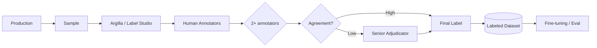

**Interview Q&A:**

*Q: Inter-rater reliability kya track karte ho?*
A: Cohen's kappa for binary/categorical (>0.6 acceptable, >0.8 great). Krippendorff's alpha for multi-rater. Mai rule rakhta hoon: if agreement <0.5, guidelines revisit karne hain (annotators confused hain). Specific items me low agreement = ambiguous task definition signal.

*Q: Human eval scale-up kaise karte ho?*
A: Tiered approach: (1) Internal experts (10s of examples, hardest cases), (2) Trained crowdsourced (Scale, Surge — 100s/day), (3) Active learning — LLM judge confident cases auto-label, uncertain cases human ko bhejo. Ye hybrid 5-10x throughput dega same human cost pe. Quality control: 10% golden questions injected, annotators jo fail karte hain unka kaam reject.

---

## 3. Cost & Latency Optimization

LLM costs scale linearly with usage. Without optimization, your $1K/mo MVP becomes $50K/mo in 6 months. These techniques compound — combine them.

### 3.1 Semantic caching (GPTCache, Redis)

**Definition:** Semantic caching matlab agar do queries semantically similar hain (different wording, same meaning), cached response return karo. "How do I reset my password?" aur "password reset kaise karoon?" same response chahiye — wo dono ke liye LLM call mat maar.

**Why:** ~30-60% of production queries duplicates / near-duplicates hain (especially customer support). Semantic cache se cost massive drop, latency milliseconds me, LLM load reduce.

**How (Python — Redis + embedding):**

```python
import redis
import numpy as np
from openai import OpenAI
from sentence_transformers import SentenceTransformer

client = OpenAI()
embedder = SentenceTransformer('all-MiniLM-L6-v2')
r = redis.Redis(decode_responses=False)  # binary embeddings

# Redis Vector Search index ek baar setup
# (RediSearch module required)
def setup_index():
    r.execute_command(
        "FT.CREATE", "cache_idx",
        "ON", "HASH",
        "PREFIX", "1", "cache:",
        "SCHEMA",
        "embedding", "VECTOR", "FLAT", "6",
            "TYPE", "FLOAT32", "DIM", "384", "DISTANCE_METRIC", "COSINE",
        "response", "TEXT",
        "ts", "NUMERIC"
    )

SIMILARITY_THRESHOLD = 0.92  # tune carefully — too low = wrong cache hits

def cached_llm(query: str, system: str = ""):
    # Embed query
    emb = embedder.encode(query).astype(np.float32).tobytes()
    
    # Vector search — top 1
    result = r.execute_command(
        "FT.SEARCH", "cache_idx",
        "*=>[KNN 1 @embedding $vec AS score]",
        "PARAMS", "2", "vec", emb,
        "RETURN", "2", "response", "score",
        "DIALECT", "2"
    )
    
    if len(result) > 1:
        score = float(result[2][1])  # cosine distance
        similarity = 1 - score
        if similarity >= SIMILARITY_THRESHOLD:
            print(f"CACHE HIT (sim={similarity:.3f})")
            return result[2][3].decode()  # cached response
    
    # Cache miss — actual LLM call
    print("CACHE MISS")
    response = client.chat.completions.create(
        model="gpt-4o-mini",
        messages=[
            {"role": "system", "content": system},
            {"role": "user", "content": query}
        ]
    ).choices[0].message.content
    
    # Store in cache
    cache_key = f"cache:{hash(query)}"
    r.hset(cache_key, mapping={
        "embedding": emb,
        "response": response,
        "ts": int(time.time())
    })
    r.expire(cache_key, 86400 * 7)  # 7-day TTL
    
    return response

# GPTCache library (higher-level alternative)
# from gptcache import cache
# from gptcache.adapter import openai
# cache.init(...)  # auto-handles via OpenAI wrapper
```

**Real-life Example:** Ek customer support bot 50K queries/day handle kar raha tha. Top 200 unique intents covered 78% of queries. Semantic cache hit rate 65% achieved — monthly LLM cost $12K → $4.5K. Latency p50 800ms → 80ms (cache hits). Critical: TTL 24h, kyunki product info change ho sakti hai stale cache se.

**Mermaid Diagram:**

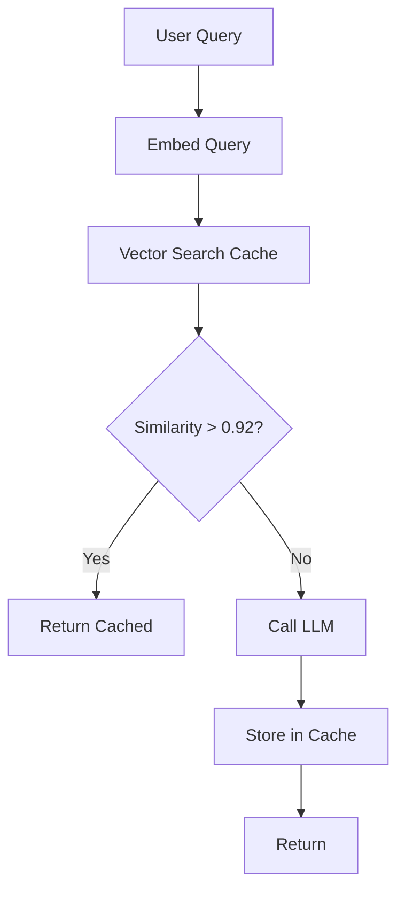

**Interview Q&A:**

*Q: Semantic cache me biggest risk kya hai?*
A: False positives — cache hit when shouldn't. "Cancel my order" vs "Don't cancel my order" — embeddings might be 0.94 similar! Solution: (1) Threshold tuning per use case (mai 0.95+ rakhta hoon high-stakes me), (2) Negation-aware embeddings ya rule-based filters ("not", "never" detect karo), (3) User-specific caching (user-id namespace), kyunki cross-user same response wrong ho sakta hai (personalized content me).

*Q: Cache invalidation strategy?*
A: TTL + event-based combined. TTL conservative rakho (1 day default). Event-based: when source data changes (e.g., RAG corpus update), invalidate affected keys. Manual purge via admin endpoint. Avoid permanent cache — model updates, prompt changes ko respect karna hai.

---

### 3.2 Prompt caching (Anthropic, OpenAI native)

**Definition:** Prompt caching = provider-side caching of repeated prompt prefixes. Tu long system prompt + tools list bhejta hai every call me — provider us prefix ko cache karta hai, future calls me 90% sasta + faster.

**Why:** RAG / agent apps me system prompt + tools schema = 5K tokens easily. Har call pe full price pay karna stupid hai jab content same hai. Anthropic 90% discount, OpenAI 50% on cached.

**How (Python — Anthropic prompt caching):**

```python
import anthropic

client = anthropic.Anthropic()

# Long system prompt — books, docs, tool schemas, etc.
SYSTEM_PROMPT = """You are a customer support agent for X company...
[5000 tokens of company policies, product catalog, tone guide, etc.]
"""

def chat(user_msg: str, history: list):
    response = client.messages.create(
        model="claude-3-5-sonnet-20241022",
        max_tokens=1024,
        system=[
            {
                "type": "text",
                "text": SYSTEM_PROMPT,
                # Cache breakpoint — yahan tak cache hoga
                "cache_control": {"type": "ephemeral"}
            }
        ],
        messages=[
            *history,
            {"role": "user", "content": user_msg}
        ]
    )
    
    # Usage check — cached tokens vs uncached
    print(f"Input cached: {response.usage.cache_read_input_tokens}")
    print(f"Input uncached: {response.usage.input_tokens}")
    print(f"Cache write: {response.usage.cache_creation_input_tokens}")
    # First call: cache_creation high, read = 0 (paid full + 25% extra for write)
    # Subsequent calls (within 5 min): cache_read high, creation = 0 (10% cost)
    
    return response.content[0].text

# OpenAI prompt caching — automatic for prompts > 1024 tokens
# No code change needed — OpenAI auto-caches static prefixes
# Visible via usage.prompt_tokens_details.cached_tokens
```

**Cost math:**
```
Without cache: 5000 input tokens × $3/M × 1000 calls = $15
With cache:    5000 × $3.75/M × 1 (write) + 5000 × $0.30/M × 999 (read) ≈ $1.52
Savings: ~90%
```

**Real-life Example:** Ek coding assistant team had 8K-token system prompt with style guide + repo context. 10K daily calls. Anthropic prompt caching enabled — monthly cost $9.4K → $1.1K. Implementation: 5 lines of code (cache_control flag). Latency also dropped (cached tokens skip processing).

**Mermaid Diagram:**

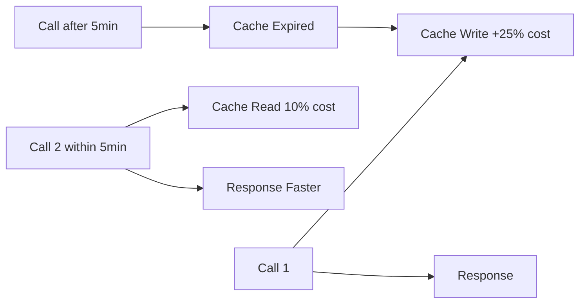

**Interview Q&A:**

*Q: Anthropic vs OpenAI prompt caching — differences?*
A: Anthropic explicit (you mark cache breakpoints, control granularity, up to 4 breakpoints), longer TTL options (5 min default, 1hr beta). OpenAI implicit (automatic, less control, but zero code change). Both ~50-90% cost reduction on cached portions. For agent systems with complex tool schemas, Anthropic explicit better — you control what stays hot.

*Q: Prompt cache + semantic cache combine karte ho?*
A: Yes, layered. Semantic cache outer layer (whole-query level, 100% cost saving on hits). Prompt cache inner layer (prefix-level, helps cache misses). Order: query → semantic check → if miss → LLM call (prompt cache active for system prefix). Combined hit rate + reduced miss-cost = 75-90% total savings in mature setups.

---

### 3.3 Model routing — cheap first, escalate

**Definition:** Tiered routing — query first goes to cheapest model that can handle it. If confidence low or task complex, escalate to bigger/expensive model. "GPT-4o-mini handle kar lega? Try first. Nahi to GPT-4o pe escalate."

**Why:** 70% queries simple hain — small model perfect. Bade model pe sab daalna 3-10x overcharge. But if you only use small model, complex queries fail. Routing = best of both.

**How (Python — semantic + confidence routing):**

```python
import openai

class ModelRouter:
    def __init__(self):
        self.tiers = [
            {"model": "gpt-4o-mini", "cost_1k": 0.15, "max_tokens": 16000},
            {"model": "gpt-4o",      "cost_1k": 2.50, "max_tokens": 128000},
            {"model": "o1",          "cost_1k": 15.00,"max_tokens": 128000}  # reasoning
        ]
    
    def classify_complexity(self, query: str) -> str:
        """Cheap classifier — heuristic + small LLM"""
        # Heuristics first (zero cost)
        word_count = len(query.split())
        has_code = "```" in query or any(kw in query.lower() 
            for kw in ["function", "algorithm", "implement"])
        has_math = any(kw in query.lower() 
            for kw in ["calculate", "derive", "prove", "optimize"])
        
        if word_count < 20 and not has_code and not has_math:
            return "simple"
        elif has_math or "reasoning" in query.lower():
            return "complex"
        else:
            return "medium"
    
    def route(self, query: str, history: list = []):
        complexity = self.classify_complexity(query)
        
        if complexity == "simple":
            tier = 0  # gpt-4o-mini
        elif complexity == "medium":
            tier = 1  # gpt-4o
        else:
            tier = 2  # o1
        
        model = self.tiers[tier]["model"]
        print(f"Routing to {model} (complexity: {complexity})")
        
        response = openai.chat.completions.create(
            model=model,
            messages=[*history, {"role": "user", "content": query}],
            # Confidence in response (logprobs)
            logprobs=True,
            top_logprobs=3
        )
        
        # Low confidence → escalate
        avg_logprob = self._avg_logprob(response)
        if avg_logprob < -2.0 and tier < 2:
            print(f"Low confidence ({avg_logprob:.2f}), escalating")
            return self._escalate(query, history, tier + 1)
        
        return response.choices[0].message.content
    
    def _escalate(self, query, history, tier):
        model = self.tiers[tier]["model"]
        return openai.chat.completions.create(
            model=model,
            messages=[*history, {"role": "user", "content": query}]
        ).choices[0].message.content
    
    def _avg_logprob(self, response):
        if not response.choices[0].logprobs:
            return 0
        lps = [tok.logprob for tok in response.choices[0].logprobs.content]
        return sum(lps) / len(lps) if lps else 0

router = ModelRouter()
answer = router.route("refund kaise milega")  # → gpt-4o-mini
answer = router.route("Prove fundamental theorem of algebra step by step")  # → o1
```

**Real-life Example:** Ek B2B copilot handled mixed queries — 60% small (calendar, search), 30% medium (drafts, summaries), 10% complex (multi-step planning). Pre-routing all on GPT-4: $80K/mo. Post-routing: $19K/mo (60% on mini, 30% on 4o, 10% on o1). Quality maintained because routing was conservative.

**Mermaid Diagram:**

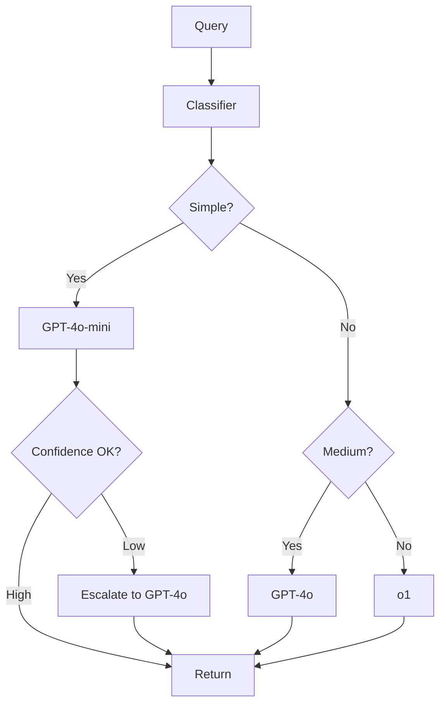

**Interview Q&A:**

*Q: Routing classifier kaise build kare without leaking info?*
A: Three options: (1) Rule-based (zero cost, brittle), (2) Small finetuned classifier (DistilBERT on intent labels — fast, ~10ms), (3) LLM classifier (Haiku/Mini doing the routing — flexible, ~200ms cost). Mai usually option 2 use karta hoon — train on 1000+ labeled examples per complexity tier, accuracy 90%+ achievable.

*Q: Routing failures kaise handle karte ho?*
A: Always have escalation path with confidence detection. Logprobs (OpenAI) ya output schema validation se confidence detect karo. If small model output schema fails / confidence low, automatically retry on bigger model. Track escalation rate — if it's >20%, classifier needs retraining (under-routing). Also monitor cost per request — if avg increases, escalations are runaway.

---

### 3.4 Batching strategies

**Definition:** Batching = multiple requests ko ek LLM call me combine karna (where possible) ya parallel async karna for throughput. Two flavors: (1) Multi-prompt batching (single API call, multiple prompts), (2) Async concurrency (parallel calls, more requests per second).

**Why:** Per-request overhead (auth, network, queueing) significant. Batching amortizes this. OpenAI Batch API (24h SLA) gives 50% discount for offline workloads.

**How (Python — async + Batch API):**

```python
import asyncio
from openai import AsyncOpenAI, OpenAI

# === Async batching — real-time, low-latency ===

aclient = AsyncOpenAI()

async def process_one(prompt: str, semaphore):
    """Concurrency limit ke saath async call"""
    async with semaphore:  # rate-limit protection
        resp = await aclient.chat.completions.create(
            model="gpt-4o-mini",
            messages=[{"role": "user", "content": prompt}]
        )
        return resp.choices[0].message.content

async def batch_async(prompts: list[str], concurrency=20):
    """20 concurrent requests max — rate limit safe"""
    sem = asyncio.Semaphore(concurrency)
    tasks = [process_one(p, sem) for p in prompts]
    return await asyncio.gather(*tasks, return_exceptions=True)

# Usage
results = asyncio.run(batch_async(prompts_list, concurrency=20))

# === OpenAI Batch API — offline, 50% discount ===

client = OpenAI()

# Step 1: JSONL file banao
import json
with open("batch_input.jsonl", "w") as f:
    for i, prompt in enumerate(prompts_list):
        f.write(json.dumps({
            "custom_id": f"req-{i}",
            "method": "POST",
            "url": "/v1/chat/completions",
            "body": {
                "model": "gpt-4o-mini",
                "messages": [{"role": "user", "content": prompt}],
                "max_tokens": 500
            }
        }) + "\n")

# Step 2: Upload + create batch
batch_file = client.files.create(
    file=open("batch_input.jsonl", "rb"),
    purpose="batch"
)

batch = client.batches.create(
    input_file_id=batch_file.id,
    endpoint="/v1/chat/completions",
    completion_window="24h"  # 50% cheaper
)

# Step 3: Poll status (or webhook)
# Step 4: Download output
result_file = client.files.content(batch.output_file_id)
# Parse JSONL, match by custom_id
```

**Real-life Example:** Ek news aggregator daily 50K articles ko summarize karta tha. Pehle real-time gpt-4o-mini se — $400/day. Batch API use kiya 24h window (since not user-facing) — $200/day, same quality. Offline workloads ke liye Batch API no-brainer hai.

**Mermaid Diagram:**

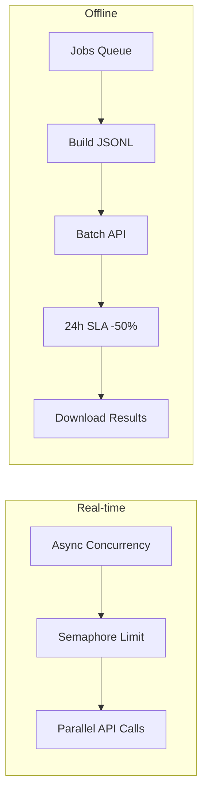

**Interview Q&A:**

*Q: Batch API use kab nahi karna chahiye?*
A: Real-time UX (chatbots, search) — 24h SLA unacceptable. Batch best for: nightly summaries, content moderation pipelines, dataset generation, embedding backfills. Hybrid pattern: real-time for user-facing, batch for everything else. Mai ek startup me 70% volume batch pe shift kar paaya — cost halved.

*Q: Async concurrency tune kaise karte ho?*
A: Start conservative (10 concurrent), monitor rate limits headers (`x-ratelimit-remaining`). Increase till you hit ~80% rate limit utilization. Per-org limits OpenAI me clear hain — calculate concurrent = (rpm_limit / avg_request_seconds) / 60. Always have backoff (exponential) for 429s. Aur queue depth metric track karo — if queue growing, you're under-provisioned.

---

### 3.5 Distillation to smaller models

**Definition:** Distillation = bade "teacher" model ke outputs use karke chhote "student" model ko fine-tune karna. Goal: 10x smaller model jo specific task pe teacher ke close performance de.

**Why:** GPT-4o per-call cost vs fine-tuned Llama-3-8B: 100x difference at scale. If you have a narrow task (intent classification, structured extraction), distillation can give you near-frontier quality at fraction of cost, with self-hosting option.

**How (Python — synthetic data + fine-tune):**

```python
import openai
from openai import OpenAI

client = OpenAI()

# Step 1: Teacher se synthetic dataset generate karo
TEACHER = "gpt-4o"
STUDENT = "gpt-4o-mini"  # ya open-source like Llama via HF

def generate_training_data(seed_queries: list[str], n_per_seed=5):
    """Teacher se diverse outputs nikalo, augmented data banao"""
    training_data = []
    for query in seed_queries:
        for _ in range(n_per_seed):
            # Vary prompt slightly for diversity
            response = client.chat.completions.create(
                model=TEACHER,
                messages=[
                    {"role": "system", "content": EXPERT_SYSTEM_PROMPT},
                    {"role": "user", "content": query}
                ],
                temperature=0.7
            )
            training_data.append({
                "messages": [
                    {"role": "system", "content": EXPERT_SYSTEM_PROMPT},
                    {"role": "user", "content": query},
                    {"role": "assistant", "content": response.choices[0].message.content}
                ]
            })
    return training_data

# Step 2: JSONL format me save
import json
data = generate_training_data(seed_queries, n_per_seed=3)
with open("distill_train.jsonl", "w") as f:
    for ex in data:
        f.write(json.dumps(ex) + "\n")

# Step 3: OpenAI fine-tune (or HF for open-source)
file = client.files.create(file=open("distill_train.jsonl", "rb"), purpose="fine-tune")
job = client.fine_tuning.jobs.create(
    training_file=file.id,
    model=STUDENT,
    hyperparameters={"n_epochs": 3}
)
print(f"Job: {job.id}")  # poll till complete

# Step 4: Eval distilled model vs teacher (Promptfoo / DeepEval)
# Compare accuracy, cost, latency

# Step 5: Use distilled model in prod (no system prompt needed — baked in)
distilled_model = "ft:gpt-4o-mini:my-org:custom:abc123"
response = client.chat.completions.create(
    model=distilled_model,
    messages=[{"role": "user", "content": "refund kaise"}]
    # System prompt embedded during fine-tuning — leaner request
)
```

**Real-life Example:** Ek e-com search rerank task GPT-4 pe — $30K/month, 200ms p50 latency. Team ne 50K teacher-generated examples se Llama-3-8B distill kiya, AWS pe self-host. Cost: $4K/month (compute), latency p50 60ms. Quality 96% of GPT-4 baseline. ROI break-even 3 months me.

**Mermaid Diagram:**

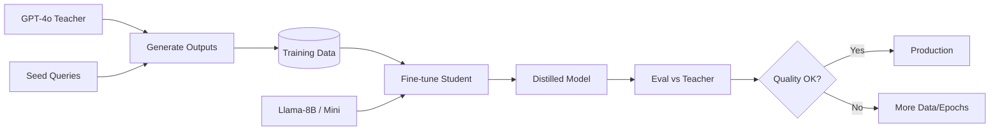

**Interview Q&A:**

*Q: Distillation kab worth hai?*
A: Three conditions: (1) High call volume (>10K/day) — fixed FT cost amortizes, (2) Narrow task scope — broad chatbot distill mat karo, (3) Latency-sensitive UX — self-hosted gives sub-100ms. Mai rule-of-thumb rakhta hoon: if monthly LLM bill > $5K on a single task, evaluate distillation.

*Q: Distilled model production me drift kaise handle?*
A: Continuous learning loop. Production failures (low confidence, user feedback) re-flow to teacher → re-generate corrections → augment training set → re-fine-tune monthly. Champion-challenger setup: new fine-tune runs in shadow mode, evaluated, promoted if better. Critical: maintain eval golden set throughout — distillation drift sneaky hai.

---

### 3.6 Prompt compression (LLMLingua)

**Definition:** Prompt compression = long prompts (RAG context, history, system prompts) ko semantically compress karna using a small model — 2-20x compression with minimal quality loss. Microsoft's LLMLingua leading approach.

**Why:** LLM cost is per-token. Long contexts (10K+ tokens) ka cost stack hota hai. RAG with 5 chunks of 1000 tokens each = 5K input every call. LLMLingua 5K → 1K compress kar sakta hai, 80% cheaper.

**How (Python — LLMLingua):**

```python
from llmlingua import PromptCompressor

# Initialize compressor — small model (e.g., LLaMA-7B based)
compressor = PromptCompressor(
    model_name="microsoft/llmlingua-2-xlm-roberta-large-meetingbank",
    use_llmlingua2=True,
    device_map="cuda"  # ya cpu
)

# Original RAG context — 5K tokens
original_context = """
[5 retrieved chunks, 1000 tokens each]
The return policy states that all items must be returned within 30 days...
[lots more]
"""

original_prompt = f"""
You are a customer support agent. Use the context to answer.

Context:
{original_context}

Question: refund kaise milega?
"""

# Compress with target ratio
compressed = compressor.compress_prompt(
    context=[original_context],
    instruction="You are a customer support agent. Use the context to answer.",
    question="refund kaise milega?",
    target_token=1000,  # 5K → 1K compression
    rank_method="longllmlingua",  # question-aware ranking
    condition_in_question="after"
)

print(f"Original tokens: {compressed['origin_tokens']}")
print(f"Compressed tokens: {compressed['compressed_tokens']}")
print(f"Ratio: {compressed['ratio']}")  # ~5x
print(f"Saving: {compressed['saving']}")  # cost saving estimate

# Use compressed prompt in actual call
response = openai.chat.completions.create(
    model="gpt-4o-mini",
    messages=[{"role": "user", "content": compressed["compressed_prompt"]}]
)

# Quality monitoring — A/B test compressed vs original on eval set
# If quality drops > 3%, reduce compression ratio
```

**Real-life Example:** Ek legal-doc QA system 8K-token chunks bhejta tha har query me. LLMLingua se 8K → 2K (4x), quality drop only 2% (measured on golden eval). Monthly cost $22K → $7K. Trade-off: compression takes 200ms additional latency — for non-real-time docs review, perfectly acceptable.

**Mermaid Diagram:**

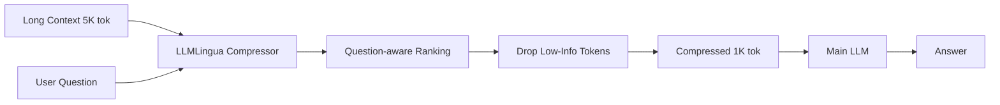

**Interview Q&A:**

*Q: Prompt compression kab safe nahi hai?*
A: Critical/exact information tasks — legal contracts (every word matters), code generation (syntax precise), medical records (drug names exact). LLMLingua probabilistically drops tokens — high recall on important tokens but not 100%. Safe-zones: summarization, general QA over long context, conversational history. Always A/B test on eval set before production.

*Q: Compression vs retrieval — kya wahi cheez nahi?*
A: Complementary. Retrieval narrows from 1M docs to 5 chunks. Compression squeezes those 5 chunks. Stack: vector retrieval → relevant chunks → LLMLingua compression → LLM. Compression kicks in when retrieval still sends large context (long docs, multi-doc fusion). Combined approach gives 100x effective context reduction with quality preserved.

---

## Resources & further reading

**Tracing & Observability:**
- Langfuse docs: https://langfuse.com/docs (open-source, self-hostable)
- LangSmith Cookbook: https://github.com/langchain-ai/langsmith-cookbook
- OpenLLMetry: https://github.com/traceloop/openllmetry
- Phoenix by Arize: https://docs.arize.com/phoenix
- Helicone: https://www.helicone.ai/
- W3C Gen AI Telemetry conventions: https://opentelemetry.io/docs/specs/semconv/gen-ai/

**Evaluation:**
- Promptfoo: https://www.promptfoo.dev/
- DeepEval: https://docs.confident-ai.com/
- Inspect AI (UK AISI): https://inspect.ai-safety-institute.org.uk/
- Ragas: https://docs.ragas.io/
- Argilla (human eval): https://docs.argilla.io/
- Hamel Hussain on evals: https://hamel.dev/blog/posts/evals/

**Cost & Latency:**
- Anthropic prompt caching: https://docs.anthropic.com/en/docs/build-with-claude/prompt-caching
- OpenAI prompt caching: https://platform.openai.com/docs/guides/prompt-caching
- OpenAI Batch API: https://platform.openai.com/docs/guides/batch
- LLMLingua: https://github.com/microsoft/LLMLingua
- GPTCache: https://github.com/zilliztech/GPTCache
- Modal / Anyscale routing patterns blog series

**Books & long reads:**
- "Designing Machine Learning Systems" — Chip Huyen
- "AI Engineering" — Chip Huyen (2024)
- Eugene Yan's blog (eugeneyan.com) on LLM evaluation
- Sebastian Raschka's "Machine Learning Q and AI"

**Communities:**
- r/LocalLLaMA — distillation, self-hosting wisdom
- LangChain Discord — production war stories
- Latent Space podcast — interviews with LLMOps practitioners

Final word: ye sab tools aur techniques tabhi kaam karti hain jab tu measurement first culture build karta hai. Code likhne se pehle eval likh. Deploy karne se pehle dashboard banaa. Optimize karne se pehle baseline measure kar. Top 2% engineers in cheezon ko reflexively karte hain — junior dev "bad me karenge" bolta hai aur kabhi nahi karta. Tu wo galti mat karna.
