# Mathematics for Gen AI

Dekh bhai, ek baat seedhi bol deta hoon — Gen AI mein math sirf "important" nahi hai, ye foundational hai. Tu agar transformer ka paper padh raha hai aur attention ka softmax samajh nahi paaya, ya LoRA implement karne baitha aur SVD ka rank kya karta hai pata nahi, ya RLHF mein KL divergence kyu lagta hai clue nahi — toh tu sirf API call kar raha hai, engineer nahi hai. Math hi wo glue hai jo deep learning ke har layer ko bind karta hai.

Ye guide tujhe IIT-level rigor ke saath, but Hinglish mein, har wo concept dega jo Gen AI ke andar daily kaam mein lagta hai. Linear algebra basically deep learning ka grammar hai. Bina iske tu paper padh nahi paayega, code optimize nahi kar paayega. Calculus tera optimization engine hai — gradient descent, backprop, sab isi pe khada hai. Probability tera uncertainty handle karne ka tareeka hai — sampling se lekar Bayesian inference tak. Aur information theory tera language modeling ka theoretical backbone hai — perplexity, cross-entropy, KL — sab yahin se aate hain.

Hum 4 bade topics cover karenge — Linear Algebra, Calculus, Probability & Statistics, aur Information Theory — total 21 subtopics. Har subtopic mein definition, why, how (with code), real-life production example, diagram, aur ek interview question milega. Tu agar ye guide thik se padh leta hai, toh tu na sirf interview crack karega, balki next time jab koi paper drop hoga, tu usse 30 minute mein decode kar lega. Chal shuru karte hain.

---

## 1. Linear Algebra

Linear algebra is the language of data. Har neural network ka forward pass basically matrix multiplication ka chain hai. Tera input ek vector hai, weights matrices hain, activations vectors hain, attention scores ek matrix hai. Agar tu matrix multiply karte time dimensions mismatch kar raha hai, debug karne mein ghante laga dega. Isiliye yahan se solid foundation chahiye.

### 1.1 Vectors, vector spaces, norms (L1, L2, cosine)

#### Definition (kya hai?)

Vector ek ordered list of numbers hai — `[2.3, -1.1, 0.7, 4.5]`. Geometrically ye ek arrow hai origin se kisi point tak n-dimensional space mein. Vector space wo set hai jisme vectors add ho sakte hain aur scalar se multiply ho sakte hain — closure property satisfy karte hain. Tera embedding (jaise OpenAI ka 1536-dim embedding) ek vector hi toh hai jo 1536-dimensional space mein baitha hai.

Norm matlab vector ki "length" ya "size". L2 norm (Euclidean) sabse common hai — `||x||_2 = sqrt(sum(x_i^2))`. L1 norm (Manhattan) — `||x||_1 = sum(|x_i|)`. Cosine similarity actually norm nahi hai, but distance metric hai — `cos(theta) = (a . b) / (||a|| ||b||)`. Analogy: agar tu Mumbai mein hai aur Delhi jaana hai, L2 hai seedhi flight distance, L1 hai roads pe chal ke (turns wala), cosine hai sirf direction same hai ya nahi — magnitude bhool ja.

#### Why?

Embeddings compare karne ke liye norm chahiye. Jab tu RAG system bana raha hai aur query embedding ko document embeddings se match kar raha hai, tu cosine similarity use karta hai. Kyu? Kyunki magnitude se farak nahi padta — direction matter karta hai. L2 use karega toh longer documents ko penalize karega. L1 sparse regularization ke liye accha hai (Lasso). L2 weight decay ke liye standard hai.

#### How?

```python
import numpy as np

a = np.array([1, 2, 3])
b = np.array([4, 5, 6])

# L2 norm — sabse common
l2 = np.linalg.norm(a)  # sqrt(1+4+9) = 3.741

# L1 norm — sparsity ke liye
l1 = np.sum(np.abs(a))  # 6

# Cosine similarity — embeddings ke liye
cos_sim = np.dot(a, b) / (np.linalg.norm(a) * np.linalg.norm(b))
# 0.9746 — matlab vectors lagbhag same direction mein hain
```

#### Real-life Example

Tu Pinecone ya Weaviate jaise vector DB use kar raha hai RAG ke liye. User query `"How do I reset my password?"` ko embed karta hai (1536-dim vector), aur top-k similar document chunks dhundhta hai cosine similarity se. Agar tu L2 use karta toh long FAQ articles short ones ko dominate karte. Cosine ne magnitude normalize kar diya, sirf semantic direction match karta hai.

#### Diagram

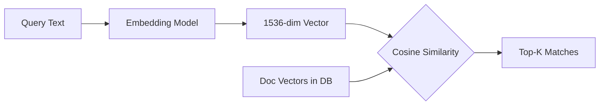

#### Interview Question

**Q:** Cosine similarity aur Euclidean distance mein kya difference hai, aur embeddings ke liye kaunsa better hai?

**A:** Euclidean distance vectors ke beech ki straight-line distance measure karta hai including magnitude — matlab agar do vectors same direction mein hain but ek lamba hai aur ek chhota, Euclidean unhe far apart batayega. Cosine similarity sirf angle dekhti hai, magnitude ignore karti hai. Embeddings mein typically magnitude noise hota hai (longer documents = larger magnitude), aur semantic meaning direction mein encode hoti hai. Isiliye text embeddings ke liye cosine standard hai. Note that agar tera embedding model already L2-normalized output deta hai (jaise SentenceTransformers), toh dono equivalent ho jaate hain — kyunki normalized vectors pe Euclidean distance squared = 2(1 - cosine).

---

### 1.2 Matrices: multiplication, transpose, inverse, rank

#### Definition (kya hai?)

Matrix ek 2D array of numbers hai — rows aur columns. Tera neural network layer basically `y = Wx + b` hai jahan W matrix hai. Multiplication: `(m,n) @ (n,p) = (m,p)` — inner dimensions match karne chahiye. Transpose `A^T` — rows aur columns swap. Inverse `A^-1` — wo matrix jisse multiply karne pe identity aaye, sirf square aur full-rank matrices ka hota hai. Rank — linearly independent rows/columns ka count, basically information ka "richness".

Analogy: matrix ek transformation hai. Tu ek vector daalta hai, ek naya vector nikalta hai. Rank batata hai ki transformation kitna "lossy" hai — full rank matlab koi info lose nahi hui, low rank matlab compress ho gayi.

#### Why?

Har dense layer ek matrix multiplication hai. Attention mechanism mein `QK^T` ek matrix multiply hai. Rank concept LoRA ka core hai — full weight matrix ko low-rank update se replace karte hain. Inverse rarely directly compute karte hain (numerically unstable), but conceptually solving linear systems ka core hai.

#### How?

```python
import torch

W = torch.randn(768, 512)  # weight matrix
x = torch.randn(32, 768)   # batch of 32 inputs

# Forward pass — matrix multiply
y = x @ W  # shape: (32, 512)

# Transpose
W_T = W.T  # shape: (512, 768)

# Rank check — kitna informative hai
rank = torch.linalg.matrix_rank(W)  # likely 512 (full rank)

# Inverse — sirf square matrices ke liye
A = torch.randn(5, 5)
A_inv = torch.linalg.inv(A)
identity = A @ A_inv  # ~ I
```

#### Real-life Example

GPT ka feed-forward layer: `FFN(x) = max(0, xW1 + b1)W2 + b2`. W1 shape `(d_model, 4*d_model)`, W2 shape `(4*d_model, d_model)`. Llama-7B mein d_model = 4096, toh ek FFN layer mein ~134M parameters hain. Tu jab inference karta hai, ye matrix multiplications GPU pe parallelize hote hain — yahi reason hai NVIDIA itni mehngi hai.

#### Diagram

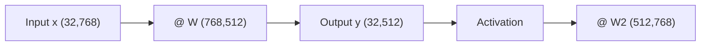

#### Interview Question

**Q:** Matrix ka rank kya batata hai, aur ye deep learning mein kyu matter karta hai?

**A:** Rank batata hai ki matrix mein kitne linearly independent rows ya columns hain — basically effective dimensionality. Agar 512x512 matrix ka rank 50 hai, toh wo apparently 512-dim space mein operate kar raha hai but actually 50-dim subspace mein hi info encode hai — bahut redundancy hai. Deep learning mein ye crucial hai kyunki research ne dikhaya hai ki trained transformers ke weight matrices typically low intrinsic rank wale hote hain. Yahi insight LoRA ka basis hai — full `d x d` matrix update ki jagah `d x r` aur `r x d` ka product use karte hain jahan `r << d`. 7B model ko fine-tune karne ke liye full 7B params train karne ki bajaye sirf few million params train karte hain, aur quality bahut acchi rehti hai.

---

### 1.3 Tensor operations (broadcasting, reshape, einsum)

#### Definition (kya hai?)

Tensor matlab n-dimensional array — scalar 0D, vector 1D, matrix 2D, aur uske aage tensor. Transformer mein typical tensor shape `(batch, seq_len, d_model)` hoti hai — 3D. Attention mein `(batch, heads, seq, d_head)` — 4D ho jaata hai. Broadcasting wo rule hai jo PyTorch/NumPy automatically chhote tensor ko bade ke saath align karte hain — `(32, 768) + (768,)` works, dono ke beech (768,) automatically `(1, 768)` ban ke broadcast hota hai.

Reshape tensor ka shape change karta hai bina data change kiye. Einsum ek powerful notation hai jo Einstein summation convention follow karta hai — `'bik,bkj->bij'` matlab batch matrix multiply.

#### Why?

Agar tu broadcasting nahi samajhta, tu loops likhega aur 100x slow code chalayega. Reshape galat kiya toh tera attention mask gadbad ho jayega. Einsum complex tensor operations ko ek line mein likhne deta hai — flash attention internally aise hi compute karta hai.

#### How?

```python
import torch

# Broadcasting — bias add to batch
x = torch.randn(32, 768)
b = torch.randn(768)
y = x + b  # b broadcasts to (32, 768) automatically

# Reshape for multi-head attention
batch, seq, d_model = 4, 128, 512
heads, d_head = 8, 64
x = torch.randn(batch, seq, d_model)
# Split d_model into (heads, d_head)
x_heads = x.view(batch, seq, heads, d_head).transpose(1, 2)
# Shape: (batch, heads, seq, d_head)

# Einsum — attention scores
Q = torch.randn(4, 8, 128, 64)
K = torch.randn(4, 8, 128, 64)
# Compute QK^T per batch per head
scores = torch.einsum('bhqd,bhkd->bhqk', Q, K)
# Shape: (4, 8, 128, 128)
```

#### Real-life Example

Multi-head attention implementation. Tu input ko `(batch, seq, d_model)` se `(batch, heads, seq, d_head)` mein reshape karta hai, fir QK^T compute karta hai einsum se, softmax lagata hai, V se multiply karta hai, aur wapas concatenate karke `(batch, seq, d_model)` mein laata hai. Pure flow tensor reshapes pe based hai. PyTorch ke `nn.MultiheadAttention` ke source code padh — sab yahin hai.

#### Diagram

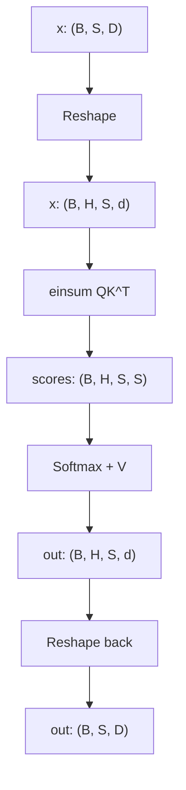

#### Interview Question

**Q:** `view` aur `reshape` mein kya farak hai PyTorch mein, aur kab kaunsa use kare?

**A:** `view` requires that tensor contiguous in memory ho — agar nahi hai toh error throw karega. `reshape` smart hai — agar contiguous hai toh view return karta hai (no copy), nahi hai toh internally `contiguous()` call karke copy banata hai. Performance ke liye `view` better hai kyunki guarantee karta hai no copy, but agar tu `transpose` ya `permute` ke baad reshape kar raha hai (which often makes tensor non-contiguous), tujhe `reshape` use karna padega ya pehle `.contiguous()` call karna hoga. Production code mein typically `reshape` use karte hain safety ke liye, but jab tu sure hai contiguous hai toh `view` slightly faster hai.

---

### 1.4 Eigenvalues, eigenvectors, eigendecomposition

#### Definition (kya hai?)

Eigenvector wo special vector hai jo matrix se multiply karne pe direction nahi badalta — sirf scale hota hai. Mathematically: `Av = lambda * v`. Yahan `v` eigenvector hai aur `lambda` eigenvalue. Eigendecomposition: `A = V * Lambda * V^-1` — matrix ko apne eigenvectors aur eigenvalues mein decompose karna.

Analogy: socho ek company hai jisme har department ek vector hai. Matrix A ek transformation hai (jaise restructuring). Eigenvectors wo departments hain jo restructuring ke baad bhi same direction mein rehte hain, bas size badal jaata hai — eigenvalue tells how much.

#### Why?

PCA (Principal Component Analysis) eigendecomposition pe khada hai — covariance matrix ke top eigenvectors hi tere principal components hain. Spectral methods, graph neural networks, stability analysis of dynamical systems — sab yahin se. ChatGPT directly use nahi karta but underlying math everywhere hai.

#### How?

```python
import numpy as np

# Symmetric matrix (jaise covariance matrix)
A = np.array([[4, 1], [1, 3]])

eigenvalues, eigenvectors = np.linalg.eig(A)
# eigenvalues: [4.618, 2.382]
# eigenvectors: columns are v1, v2

# Verify: A @ v = lambda * v
v1 = eigenvectors[:, 0]
print(A @ v1)              # [4.253, 2.628]
print(eigenvalues[0] * v1) # [4.253, 2.628] — match!
```

#### Real-life Example

Tu embeddings analyze kar raha hai — 1M product descriptions ke 768-dim embeddings hain. Direct visualize nahi kar sakta. PCA lagayega: covariance matrix nikalega, top 2 eigenvectors find karega, project karega 2D mein, plot karega. Yahi t-SNE/UMAP ke pehle kar lete hain dimensionality reduction ke liye. Bhi, PageRank algorithm ka core dominant eigenvector finding hai.

#### Diagram

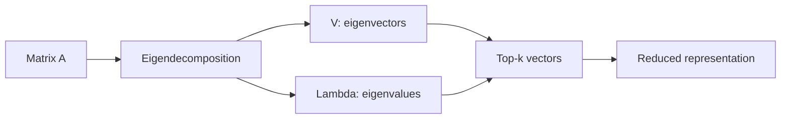

#### Interview Question

**Q:** Eigenvalues kaise help karte hain matrix ki properties samajhne mein?

**A:** Eigenvalues bahut kuch batate hain. Pehla, agar koi eigenvalue zero hai matlab matrix singular hai (non-invertible), aur nonzero eigenvalues ka count rank ke barabar hota hai. Doosra, symmetric positive definite matrix ke saare eigenvalues positive hote hain — ye optimization mein important hai (Hessian positive definite matlab local minimum). Teesra, condition number = max eigenvalue / min eigenvalue — agar bahut bada hai matlab matrix ill-conditioned hai, gradient descent slow hoga. Deep learning mein, weight matrices ka spectral norm (largest singular value, jo symmetric case mein largest eigenvalue hai) gradient explosion control karne ke liye monitor karte hain — spectral normalization GANs mein isiliye use hota hai.

---

### 1.5 Singular Value Decomposition (SVD) — used in LoRA

#### Definition (kya hai?)

SVD any matrix (square ho ya rectangular) ko teen matrices mein todta hai: `A = U * Sigma * V^T`. U aur V orthogonal hain, Sigma diagonal hai with non-negative singular values (descending order mein). Eigendecomposition ka generalized version samjho — har matrix ka SVD hota hai, har matrix ka eigendecomposition nahi.

Analogy: socho A ek transformation hai. SVD bolta hai ye transformation actually 3 simple steps hai — pehle V^T se rotate karo (input space mein), fir Sigma se scale karo har axis pe alag-alag, fir U se rotate karo (output space mein). Bas itna hi.

#### Why?

LoRA ka entire premise SVD pe based hai. Research dikhata hai trained weight matrices low effective rank wale hote hain — top few singular values dominate karte hain. Toh full `(d, d)` matrix update karne ki bajaye, hum `BA` form mein update karte hain jahan `B: (d, r)` aur `A: (r, d)`, `r << d`. Iske alawa SVD recommendation systems (matrix factorization), image compression, aur PCA mein bhi backbone hai.

#### How?

```python
import torch

W = torch.randn(768, 768)

# Full SVD
U, S, Vh = torch.linalg.svd(W)
# U: (768, 768), S: (768,), Vh: (768, 768)

# Low-rank approximation — keep top r singular values
r = 16
W_approx = U[:, :r] @ torch.diag(S[:r]) @ Vh[:r, :]

# LoRA-style — train B and A separately
B = torch.zeros(768, r, requires_grad=True)  # init to zero
A = torch.randn(r, 768, requires_grad=True) * 0.01
# Update: W_new = W_frozen + B @ A
```

#### Real-life Example

Tu Llama-7B fine-tune karna chahta hai ek custom dataset pe — full fine-tuning ke liye 28GB memory chahiye plus optimizer states ke liye 3-4x. Gareeb developer ke paas itni GPU nahi hai. LoRA: rank 16 ke saath, har attention matrix ke liye sirf `2 * 4096 * 16 = 131K` params train karta hai full 16M ki bajaye. ~100x reduction. Quality almost identical — kyunki underlying update inherently low-rank hai.

#### Diagram

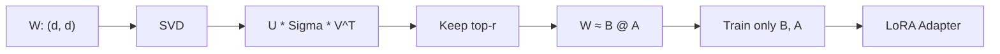

#### Interview Question

**Q:** SVD aur eigendecomposition mein kya difference hai, aur SVD kyu zyada general hai?

**A:** Eigendecomposition `A = V Lambda V^-1` sirf square matrices ke liye exist karta hai, aur agar A diagonalizable nahi hai (jaise defective matrices) toh ye work nahi karta. Eigenvectors orthogonal honge ye bhi guaranteed nahi (sirf symmetric matrices ke liye haan). SVD `A = U Sigma V^T` har matrix ke liye exist karta hai — square ho ya rectangular, full rank ho ya nahi. U aur V dono orthogonal hote hain (which is super useful), Sigma always real non-negative diagonal. SVD basically `A^T A` aur `A A^T` ke eigendecomposition se related hai — singular values are square roots of eigenvalues of `A^T A`. Practically, jab tab tu numerical stability chahta hai, ya rectangular matrix ke saath kaam kar raha hai, SVD use kar — eigendecomp ke jhanjhat mein mat pad.

---

### 1.6 Matrix calculus

#### Definition (kya hai?)

Matrix calculus matlab matrices/vectors ke respect mein derivatives lena. `dy/dW` jahan W matrix hai aur y scalar ya vector — ye basically gradients ka backbone hai. Layout convention important hai — numerator layout vs denominator layout — different textbooks alag use karte hain. Deep learning mein typically denominator layout use hota hai: `dL/dW` ka shape W ke same hota hai.

Key results yaad rakh: `d(Wx)/dx = W^T` (denominator layout), `d(x^T A x)/dx = (A + A^T)x`, `d(tr(AB))/dA = B^T`. In rules ke combinations se backprop derive hota hai.

#### Why?

Tu jab koi naya layer custom likh raha hai PyTorch mein, ya autograd debug kar raha hai, ya kisi paper ka loss derive kar raha hai — yahi math chahiye. SGD update rule hai `W = W - lr * dL/dW`. Wo `dL/dW` matrix calculus se nikalta hai.

#### How?

```python
import torch

# Linear layer: y = x @ W, loss = ||y||^2
x = torch.randn(4, 10)
W = torch.randn(10, 5, requires_grad=True)
y = x @ W
loss = (y ** 2).sum()
loss.backward()

# W.grad shape: (10, 5) — same as W
# Manually: dL/dW = 2 * x^T @ y
manual_grad = 2 * x.T @ y
print(torch.allclose(W.grad, manual_grad))  # True
```

#### Real-life Example

Tu Mixture-of-Experts model mein gating function custom likhta hai — sparse top-k routing ke saath. PyTorch autograd straight-through estimator handle karne ke liye custom backward likhna padta hai. Yahan tujhe matrix calculus ki gehri samajh chahiye warna gradients corrupt ho jaayenge aur model train hi nahi hoga.

#### Diagram

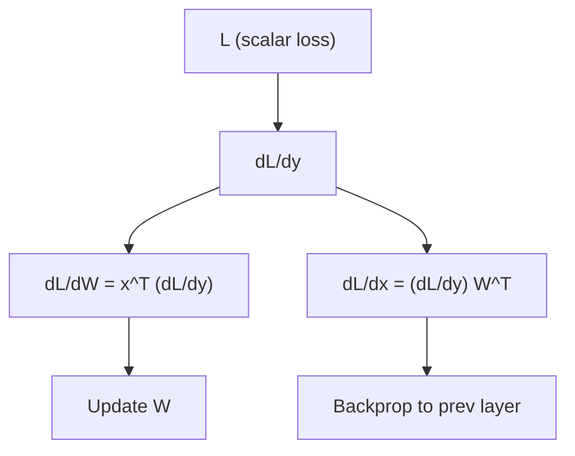

#### Interview Question

**Q:** Backprop derive kar `y = sigmoid(Wx + b)` ke liye, given dL/dy.

**A:** Pehle define karte hain — `z = Wx + b`, `y = sigmoid(z)`. Chain rule: `dL/dz = dL/dy * dy/dz`. Sigmoid derivative `dy/dz = y * (1 - y)` — element-wise. Toh `dL/dz = dL/dy * y * (1-y)` element-wise multiply. Ab `dL/dW = dL/dz * dz/dW`. Since `z = Wx + b`, `dz/dW` involves outer product. Result: `dL/dW = (dL/dz) @ x^T` agar x column vector hai, ya batch case mein `dL/dW = x^T @ (dL/dz)` shape `(in, out)`. `dL/db = sum over batch of dL/dz`. `dL/dx = W^T @ dL/dz`. Yahi exact chain har dense layer ke liye PyTorch autograd compute karta hai — bas symbolic graph traverse karta hai reverse mein.

---

## 2. Calculus

Calculus tera optimization ka engine hai. Bina derivative ke gradient nahi, bina gradient ke training nahi, bina training ke model nahi. Har loss function minimize karna hai — calculus batata hai kaise.

### 2.1 Derivatives, partial derivatives

#### Definition (kya hai?)

Derivative `df/dx` measures kitni rate se f change hota hai jab x change hota hai. Geometrically slope of tangent line at that point. Partial derivative `df/dx_i` — multivariable function mein sirf ek variable ke respect mein derivative, baaki constant maan ke.

Analogy: socho tu pahad pe khada hai (loss surface). Derivative batata hai ki agar tu ek direction mein ek kadam le, height kitni badlegi. Partial derivative — sirf east-west axis pe step liya, height change?

#### Why?

Loss minimize karne ke liye direction chahiye — derivative wo direction deta hai. Zero derivative matlab critical point (minimum, maximum, ya saddle). Multivariable functions (jo neural nets hain — millions of parameters) ke liye partial derivatives chahiye har parameter ke respect mein.

#### How?

```python
import torch

# Single variable
x = torch.tensor(2.0, requires_grad=True)
f = x**3 + 2*x  # df/dx = 3x^2 + 2
f.backward()
print(x.grad)  # 14.0 = 3*4 + 2

# Multivariable — partial derivatives
x = torch.tensor(1.0, requires_grad=True)
y = torch.tensor(2.0, requires_grad=True)
f = x**2 * y + y**3
f.backward()
print(x.grad)  # df/dx = 2xy = 4
print(y.grad)  # df/dy = x^2 + 3y^2 = 13
```

#### Real-life Example

Tu image generation diffusion model train kar raha hai. Loss = MSE between predicted noise aur actual noise. Har step pe model parameters ke respect mein loss ka partial derivative compute karta hai, fir parameters update karta hai. Bina derivatives ke tu random walk kar raha hota — convergence kabhi nahi milti.

#### Diagram

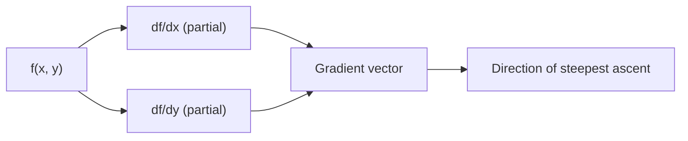

#### Interview Question

**Q:** Derivative aur partial derivative mein conceptually kya farak hai?

**A:** Single-variable function `f(x)` ke liye sirf ek derivative hota hai — `df/dx`. Multivariable function `f(x, y, z, ...)` ke liye har variable ka apna partial derivative hota hai — total n derivatives. Partial derivative compute karte time, baaki saare variables constant maan ke ek variable ke respect mein differentiate karte hain. Total derivative concept tab aata hai jab multiple variables ek aur underlying variable se related hain (jaise time) — chain rule lagta hai. Deep learning mein, loss `L(theta_1, theta_2, ..., theta_n)` hai jahan theta_i parameters hain — hum saare partial derivatives compute karte hain, unhe gradient vector mein collect karte hain, aur SGD step lete hain.

---

### 2.2 Chain rule (engine of backprop)

#### Definition (kya hai?)

Chain rule batata hai composition of functions ka derivative kaise nikale. Agar `y = f(g(x))`, toh `dy/dx = f'(g(x)) * g'(x)`. Multivariable case mein ye matrix chain ban jaata hai — Jacobians ka product.

Analogy: tu factory chala raha hai. Raw material (x) ek machine se guzarta hai (g), output ko doosri machine deti hai (f). Agar raw material thoda change ho, final output kitna change hoga? Pehle wala step kitna affect karta hai bich wala output, fir bich wala output kitna affect karta hai final. Multiply both rates.

#### Why?

Backpropagation literal chain rule hai. Neural network has L layers — output `y = f_L(f_{L-1}(...f_1(x)))`. Loss ka gradient w.r.t. early layer parameters chain rule se nikalta hai — last layer se start karke reverse mein gradients propagate karte hain, isiliye "back" propagation.

#### How?

```python
import torch

# Manual chain rule demo
x = torch.tensor(2.0, requires_grad=True)
# y = sin(x^2)
# dy/dx = cos(x^2) * 2x  (chain rule)
y = torch.sin(x**2)
y.backward()
print(x.grad)  # cos(4) * 4

# Verify manually
import math
manual = math.cos(4) * 4
print(manual)  # ~ -2.615

# Multi-layer NN — autograd chain rule automatically
W1 = torch.randn(10, 20, requires_grad=True)
W2 = torch.randn(20, 5, requires_grad=True)
x = torch.randn(1, 10)
h = torch.relu(x @ W1)
y = h @ W2
loss = y.sum()
loss.backward()
# autograd chain rule applied: dL/dW1 needs dL/dy, dy/dh, dh/dW1
```

#### Real-life Example

Tu LayerNorm ya RMSNorm jaisi custom normalization layer banata hai. Forward pass simple hai — input ko mean/std se normalize. Backward pass mein chain rule apply hota hai — gradient flow karta hai through mean computation, variance computation, fir normalization. Agar tu mistake karega chain rule mein, gradients exploded ho jaayenge ya zero ho jaayenge.

#### Diagram

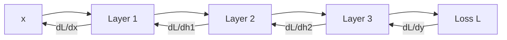

#### Interview Question

**Q:** Vanishing gradient problem kya hai aur ye chain rule se kaise related hai?

**A:** Deep network mein backprop chain rule ka chain hota hai — gradient at early layer = product of derivatives across all subsequent layers. Agar har derivative <1 hai (jaise sigmoid jiska max derivative 0.25 hai), toh 50 layer baad gradient 0.25^50 = effectively zero ho jaata hai — early layers ka kuch sikhna nahi hota. Yahi reason hai sigmoid/tanh deep networks mein replace hue ReLU se (jiska derivative either 0 ya 1 hai). Iske alawa, residual connections (`y = x + f(x)`) gradient ka direct path provide karte hain — `dy/dx = 1 + df/dx` — toh worst case bhi 1 minimum gradient flow hai. Yahi ResNet ka magic hai aur yahi reason hai transformers mein bhi residual connections har layer mein hain.

---

### 2.3 Gradients, Jacobians, Hessians

#### Definition (kya hai?)

Gradient — vector of partial derivatives. Scalar function `f: R^n -> R` ka gradient `n`-dim vector hai. Jacobian — vector function `f: R^n -> R^m` ke liye `m x n` matrix of partial derivatives. Hessian — scalar function ke second partial derivatives ka `n x n` matrix.

Analogy: gradient = first-order info (slope). Hessian = second-order info (curvature). Slope batata hai kis direction mein chalna hai, curvature batata hai kitna lamba step lena hai safely.

#### Why?

Gradient SGD ke liye chahiye. Jacobian autodiff mein har layer ka derivative represent karta hai. Hessian second-order optimization (Newton's method) mein chahiye, ya loss landscape analyze karne ke liye. Modern deep learning mein full Hessian compute karna infeasible hai (n x n matrix where n = millions), but approximations (K-FAC, Shampoo) use hote hain.

#### How?

```python
import torch

# Gradient
x = torch.randn(5, requires_grad=True)
f = (x**2).sum()
f.backward()
grad = x.grad  # shape (5,)

# Jacobian — vector function
def vec_func(x):
    return torch.stack([x[0]**2, x[1]*x[0], x[1]**3])

x = torch.randn(2, requires_grad=True)
J = torch.autograd.functional.jacobian(vec_func, x)
# J shape: (3, 2)

# Hessian — scalar function
def scalar_func(x):
    return (x**2).sum() + (x[0]*x[1])

x = torch.randn(2, requires_grad=True)
H = torch.autograd.functional.hessian(scalar_func, x)
# H shape: (2, 2)
```

#### Real-life Example

Tu LLM mein influence functions analyze kar raha hai — kaunsa training example kis output ko influence kar raha hai. Influence function ka formula Hessian inverse involve karta hai. Direct Hessian compute karna 7B params ke liye impossible — 49 quadrillion entries. Toh Hessian-vector products use karte hain (HVP) jo Pearlmutter trick se efficient calculate hote hain.

#### Diagram

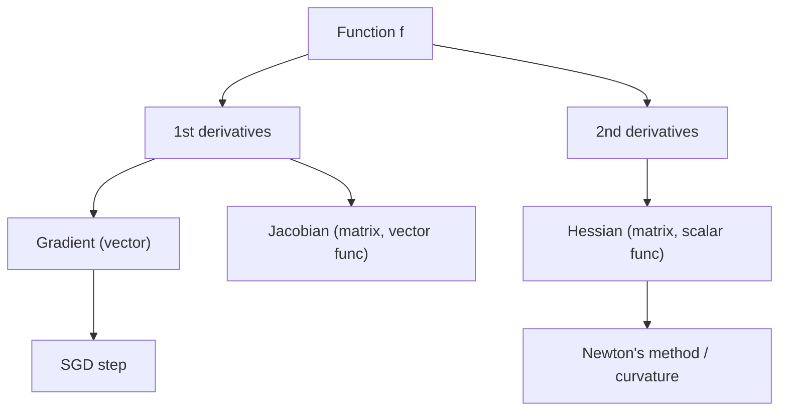

#### Interview Question

**Q:** Hessian matrix kya batata hai loss landscape ke baare mein?

**A:** Hessian eigenvalues curvature batate hain har direction mein. Saare eigenvalues positive matlab local minimum (bowl shape). Saare negative matlab local maximum. Mixed signs matlab saddle point — ek direction mein neeche, doosri mein upar. Modern deep learning mein, research dikhata hai high-dim loss landscapes mein local minima rare hain — most critical points are saddle points. Adam optimizer ka second moment estimate basically Hessian diagonal ka approximation hai — yahi reason hai ki Adam SGD se converge faster karta hai badly conditioned problems pe. Hessian eigenvalues ka spread bhi batata hai problem kitna ill-conditioned hai — agar bahut spread hai toh learning rate tuning bahut sensitive hota hai.

---

### 2.4 Taylor series approximations

#### Definition (kya hai?)

Taylor series kisi smooth function ko polynomial se approximate karne ka tareeka hai. `f(x + h) = f(x) + f'(x)*h + f''(x)*h^2/2 + ...`. Multivariable mein: `f(x + h) ≈ f(x) + grad(x)^T h + 0.5 * h^T H h`.

Analogy: tu kahin pe khada hai aur thoda sa aage jaana chahta hai. Poora function complex hai, but agar tu first derivative aur second derivative jaanta hai, tu ek small neighborhood mein function ko quadratic se approximate kar sakta hai — kaafi accha approximation aata hai chhote steps ke liye.

#### Why?

Optimization algorithms ka derivation Taylor expansion pe khada hai. Gradient descent first-order Taylor se aata hai, Newton's method second-order se. Quantization analysis, perturbation analysis, certified robustness — sab Taylor pe based hain.

#### How?

```python
import numpy as np

# Approximate sin(x) around x=0
# sin(x) ≈ x - x^3/6 + x^5/120 - ...
def taylor_sin(x, terms=5):
    result = 0
    sign = 1
    for n in range(terms):
        power = 2*n + 1
        result += sign * x**power / np.math.factorial(power)
        sign *= -1
    return result

print(taylor_sin(0.5, 5))  # ~0.4794
print(np.sin(0.5))         # 0.4794

# Newton's method — uses 2nd order Taylor
# Update: x_new = x - f'(x)/f''(x)
```

#### Real-life Example

Quantization in LLM inference. Tu fp16 model ko int8 mein quantize karta hai — har weight ko 256 levels mein round karta hai. Loss kitna change hoga? Taylor expansion: `Delta_L ≈ grad^T * Delta_W + 0.5 * Delta_W^T * H * Delta_W`. Yahin se GPTQ aur AWQ jaisi techniques aati hain — wo Hessian-aware quantization karte hain taaki critical weights kam disturb ho.

#### Diagram

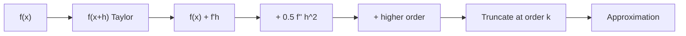

#### Interview Question

**Q:** Gradient descent update rule Taylor series se kaise derive hota hai?

**A:** First-order Taylor approximation: `f(x + h) ≈ f(x) + grad(x)^T h`. Hum chahte hain f minimize karna — toh h aisa choose karein ki `grad^T h` minimum (most negative) ho. Constraint: `||h|| = epsilon` (chhota step). Cauchy-Schwarz se, `grad^T h` minimum hota hai jab `h = -epsilon * grad / ||grad||` — matlab gradient ke opposite direction. Yahi gradient descent hai. Newton's method second-order Taylor use karta hai: `f(x+h) ≈ f(x) + grad^T h + 0.5 h^T H h`. Iss quadratic ko h ke respect mein minimize karke `h = -H^-1 grad` milta hai. Newton faster converges (quadratic rate) but Hessian inverse compute karna deep learning mein impractical hai — isiliye SGD or Adam-like first-order methods dominate karte hain.

---

### 2.5 Multivariable optimization

#### Definition (kya hai?)

Multivariable optimization matlab function `f(x_1, x_2, ..., x_n)` ka minimum ya maximum dhundhna. Constraints ho sakte hain (constrained) ya nahi (unconstrained). Convex problems easy hain — koi bhi local minimum global minimum hota hai. Non-convex (jaise neural networks) hard — multiple local minima, saddle points.

#### Why?

Training a neural network = optimization. Loss function ko parameter space mein minimize karna hai. SGD, Adam, AdamW, Lion — sab multivariable optimization algorithms hain. RLHF mein PPO bhi optimization, just constrained ek KL bound ke saath.

#### How?

```python
import torch

# Train a simple model — multivariable optimization
x = torch.randn(100, 10)
y = torch.randn(100, 1)

W = torch.randn(10, 1, requires_grad=True)
b = torch.randn(1, requires_grad=True)

optimizer = torch.optim.Adam([W, b], lr=0.01)

for step in range(100):
    pred = x @ W + b
    loss = ((pred - y)**2).mean()
    
    optimizer.zero_grad()
    loss.backward()  # gradients computed
    optimizer.step()  # parameters updated

# Yeh basically multivariable optimization hai — 11 parameters jointly optimize ho rahe hain
```

#### Real-life Example

Tu LLM ko RLHF se train kar raha hai. PPO loss = policy gradient term + KL penalty + entropy bonus. Constrained optimization — chahta hai policy improve ho but reference model se zyada deviate na kare. Yahan multivariable optimization with constraints ka game lag raha hai. Agar constraint slack chhod diya, model reward hack karega; agar tight rakha, learning slow hoga.

#### Diagram

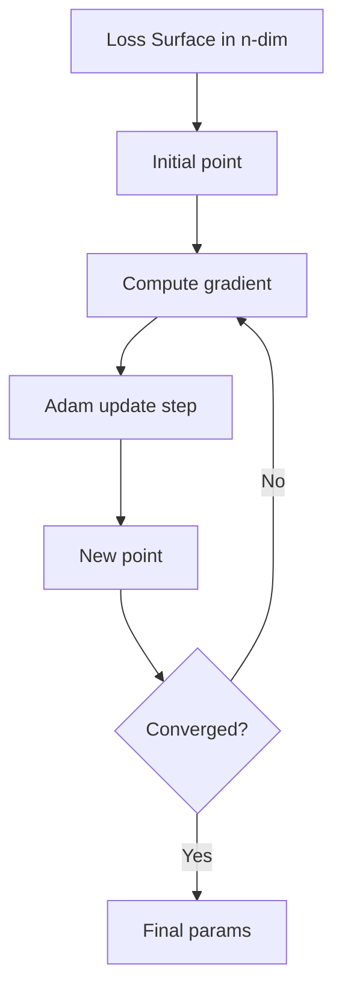

#### Interview Question

**Q:** Adam optimizer SGD se kaise different hai aur kab kaunsa use karna chahiye?

**A:** SGD plain hai — `theta = theta - lr * grad`. Adam adaptive hai — har parameter ke liye apni effective learning rate maintain karta hai. Wo first moment (mean of gradients, momentum jaisa) aur second moment (variance estimate) maintain karta hai exponential moving average se, fir update `theta = theta - lr * m_hat / (sqrt(v_hat) + eps)`. Effect: agar koi parameter ka gradient consistently bada hai, uska effective lr automatic kam ho jaata hai; agar gradient noisy hai, smoothing aati hai. Transformers ke liye Adam (specifically AdamW with decoupled weight decay) standard hai kyunki gradients across parameters bahut variable hote hain. SGD with momentum CV models (jaise ResNet) mein kabhi-kabhi better generalize karta hai. Practical advice — start with AdamW for NLP/LLMs, consider SGD for ImageNet-style tasks.

---

## 3. Probability & Statistics

Probability uncertainty handle karne ka language hai. LLM outputs probability distributions hain, sampling probabilistic hai, RLHF mein KL divergence center pe hai. Bina probability ke tu sirf deterministic functions samjhega — modern AI ka half story miss karega.

### 3.1 Random variables, PDFs, CDFs

#### Definition (kya hai?)

Random variable ek function hai jo random outcome ko number assign karta hai. Discrete (countable values, like dice roll) ya continuous (real-valued, like temperature). Probability Density Function (PDF) `f(x)` continuous RV ke liye — `P(a < X < b) = integral of f from a to b`. CDF `F(x) = P(X <= x)` cumulative probability.

Note: PDF ki value 1 se zyada ho sakti hai (it's density, not probability). Probability tab milti hai jab integrate karte hain over interval.

#### Why?

LLM ka output har step pe ek probability distribution over vocabulary hai (categorical RV). Diffusion models gaussian RVs ke saath kaam karte hain. Sampling strategies (top-k, top-p, temperature) yeh distributions modify karti hain.

#### How?

```python
import torch
import torch.distributions as dist

# Continuous — Gaussian
normal = dist.Normal(loc=0.0, scale=1.0)
samples = normal.sample((1000,))
log_prob = normal.log_prob(torch.tensor(0.5))  # log of PDF at 0.5
cdf_val = normal.cdf(torch.tensor(0.5))  # P(X <= 0.5) ~ 0.69

# Discrete — Categorical (like LLM next-token)
logits = torch.randn(50000)  # vocab size
probs = torch.softmax(logits, dim=-1)
cat = dist.Categorical(probs=probs)
token = cat.sample()  # sampled token id
```

#### Real-life Example

GPT generation: tu prompt deta hai, model logits return karta hai for next token (50K dim vector). Softmax karke probability distribution banti hai. Tu temperature se scale karta hai (lower = more deterministic), top-k ya top-p se truncate karta hai, fir sample karta hai. Yeh poora process random variable theory pe khada hai.

#### Diagram

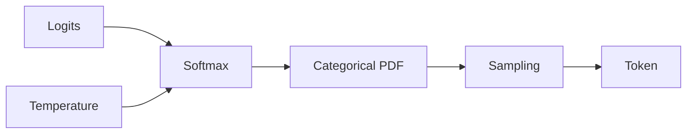

#### Interview Question

**Q:** PDF aur CDF mein difference batao, aur PDF ki value 1 se zyada kaise ho sakti hai?

**A:** PDF density hai — units `probability per unit x`. Actual probability tab milti hai jab tu PDF ko interval pe integrate karta hai. Agar variable ka range bahut chhota hai (jaise [0, 0.001]), uniform PDF ki height 1000 hogi taaki total area 1 ho. CDF actual probability hai — `P(X <= x)`, hamesha 0 se 1 ke beech, monotonically non-decreasing. PDF CDF ki derivative hai. Discrete case mein "PMF" hota hai (not PDF) — wo direct probability deta hai (sum to 1). LLM context mein next-token distribution PMF hai (50K discrete tokens) — softmax exactly that PMF deta hai.

---

### 3.2 Common distributions (Gaussian, Bernoulli, Categorical, Dirichlet)

#### Definition (kya hai?)

Gaussian (Normal): bell curve, parameters mean aur variance. Most natural processes Gaussian behave karte hain (CLT ki vajah se). Bernoulli: binary outcome (success/failure) with probability p. Categorical: K outcomes with probabilities (p_1, ..., p_K) summing to 1 — basically multi-class Bernoulli. Dirichlet: distribution OVER categorical distributions — meta-level. Use it when tu probabilities ki uncertainty model karna chahta hai.

#### Why?

Gaussian — diffusion noise, weight initialization, VAE latent space. Bernoulli — binary classification. Categorical — language modeling next-token, classification. Dirichlet — topic models (LDA), Bayesian neural net priors, mixture models.

#### How?

```python
import torch.distributions as D
import torch

# Gaussian — diffusion noise
gauss = D.Normal(0, 1)
noise = gauss.sample((4, 3, 32, 32))  # noise tensor

# Bernoulli — dropout mask
bern = D.Bernoulli(probs=0.9)
mask = bern.sample((100,))  # 1s and 0s

# Categorical — token sampling
probs = torch.softmax(torch.randn(50000), dim=-1)
cat = D.Categorical(probs=probs)
tokens = cat.sample((10,))  # 10 sampled tokens

# Dirichlet — prior over categorical
dirichlet = D.Dirichlet(torch.ones(5))
prob_dist = dirichlet.sample()  # 5-dim simplex
```

#### Real-life Example

Stable Diffusion training: tu image x_0 ko time step t pe noise add karke x_t banata hai — `x_t = sqrt(alpha) * x_0 + sqrt(1-alpha) * eps` where `eps ~ N(0, I)`. Model x_t aur t se noise predict karta hai. Bina Gaussian distribution understand kiye, tu diffusion math interpret nahi kar paayega.

#### Diagram

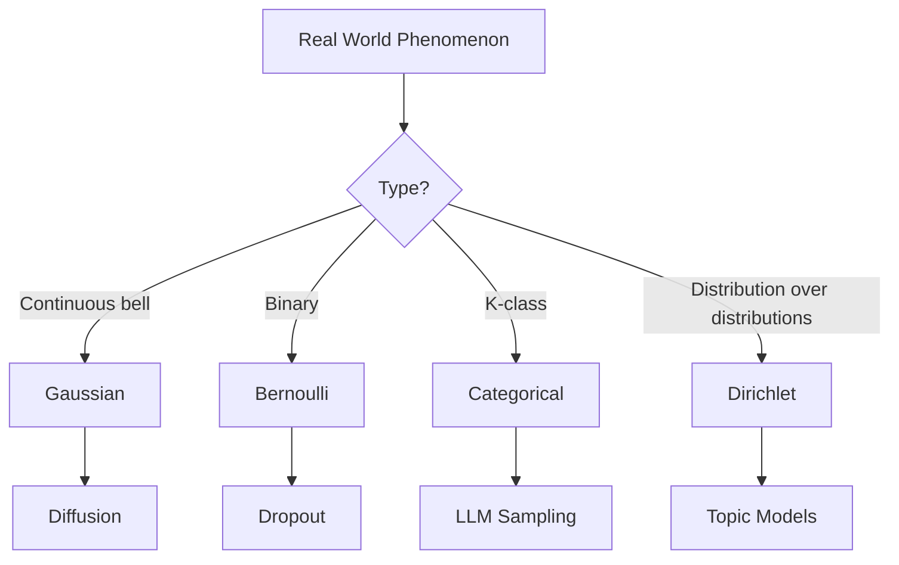

#### Interview Question

**Q:** Categorical aur Dirichlet distribution ka relationship kya hai?

**A:** Categorical distribution K outcomes pe probability deta hai — defined by parameter vector `(p_1, ..., p_K)` jo simplex pe lie karta hai (sum = 1, all >= 0). Dirichlet distribution bhi same simplex pe defined hai, lekin ye distribution OF distributions hai — Dirichlet sample karne se tujhe ek `(p_1, ..., p_K)` vector milta hai jo categorical parameters ki tarah use kar sakte ho. Dirichlet basically Beta distribution ka multivariate generalization hai, aur ye categorical/multinomial distribution ka conjugate prior hai — matlab Bayesian update simple closed-form hota hai. LDA (Latent Dirichlet Allocation) mein topic distributions Dirichlet prior se aate hain. Modern context mein, Bayesian deep learning aur uncertainty estimation mein bhi Dirichlet use hote hain — jaise classifier ki output probabilities pe Dirichlet fit karke calibration check karna.

---

### 3.3 Bayes' theorem & Bayesian thinking

#### Definition (kya hai?)

Bayes' theorem: `P(A|B) = P(B|A) * P(A) / P(B)`. Reads as: posterior = (likelihood * prior) / evidence. Bayesian thinking matlab probabilities ko beliefs samjhna jo evidence aane pe update hoti hain — frequentist view se opposite jo probabilities ko long-run frequencies samjhta hai.

Analogy: tu doctor hai. Patient ka test positive aaya disease X ke liye. Test 99% accurate hai. Disease prevalence 1 in 10000 hai. Bayes lagaye toh actual probability disease hone ki sirf ~1% hi nikalti hai (despite positive test). Counterintuitive but correct — prior dominates jab base rate kam hai.

#### Why?

Modern AI mein Bayesian thinking everywhere hai — Bayesian neural networks, variational inference (VAE, diffusion), Thompson sampling in bandits, uncertainty quantification. RAG basically retrieval ke baad Bayesian update hai — LLM ka prior knowledge + retrieved evidence -> updated answer.

#### How?

```python
import numpy as np

# Email spam classification — Naive Bayes example
P_spam = 0.3  # prior
P_word_given_spam = 0.6
P_word_given_not_spam = 0.05

# P(spam | word) using Bayes
P_word = P_word_given_spam * P_spam + P_word_given_not_spam * (1 - P_spam)
P_spam_given_word = (P_word_given_spam * P_spam) / P_word
print(P_spam_given_word)  # 0.837 — much higher than prior 0.3
```

#### Real-life Example

Anomaly detection in production. Tu ek model deploy kar raha hai jo fraudulent transactions detect kare. Prior P(fraud) = 0.001. Tera classifier flag karta hai 5% transactions. Given flag, actual fraud probability Bayes se nikalegi — usually shocking how low it is, even with "good" model. Yahin se precision-recall tradeoff samajh aata hai aur kyu rare event detection hard hai.

#### Diagram

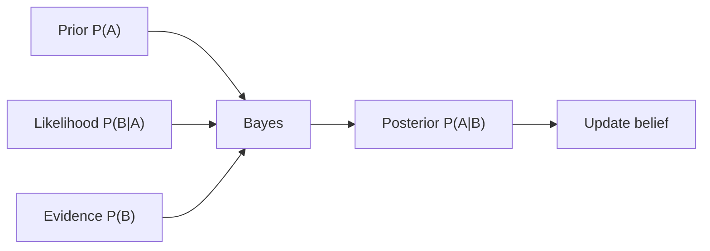

#### Interview Question

**Q:** Naive Bayes classifier "naive" kyu kehlata hai?

**A:** Naive Bayes assume karta hai ki saare features class label given conditionally independent hain. Real world mein ye almost never true hota hai — words sentence mein definitely dependent hote hain, image pixels neighbor pixels pe depend karte hain. Toh "naive" — ye assumption chhodne ke liye hai. Despite this strong assumption, Naive Bayes practically often surprisingly well work karta hai, especially text classification mein, aur extremely fast hai. Modern deep learning mein, transformers explicitly conditional dependencies model karte hain through attention — jo essentially Naive Bayes ka opposite philosophy hai. But Bayes theorem itself naive ya complex assumptions ke saath same powerful framework hai — variational inference, Bayesian neural networks, uncertainty quantification — sab Bayes pe based hain.

---

### 3.4 MLE & MAP

#### Definition (kya hai?)

Maximum Likelihood Estimation (MLE): parameters theta find karna jo observed data ki likelihood maximize kare. `theta_MLE = argmax P(data | theta)`. No prior beliefs.

Maximum A Posteriori (MAP): parameters that maximize posterior `theta_MAP = argmax P(theta | data) = argmax P(data | theta) * P(theta)`. Prior included. MAP = MLE + regularization (basically).

Analogy: MLE — tu stocks pe data dekh ke best fit number nikal raha hai bina kuch external knowledge ke. MAP — tu data dekh raha hai but pehle se kuch beliefs hain (jaise "extreme values rare hote hain"), unhe combine kar raha hai.

#### Why?

Almost saari deep learning training MLE hai — cross-entropy minimize karna = log-likelihood maximize karna. L2 regularization add kar diya, ab MAP hai with Gaussian prior on weights. L1 = Laplace prior. Yahi reason hai weight decay regularization actually Bayesian justification rakhta hai.

#### How?

```python
import torch

# MLE for Gaussian — sample mean and variance
data = torch.randn(1000) * 2 + 5  # true mean=5, std=2
mu_mle = data.mean()    # ~5
sigma_mle = data.std()  # ~2

# MLE for classification — cross entropy training
logits = torch.randn(32, 10, requires_grad=True)
labels = torch.randint(0, 10, (32,))
loss = torch.nn.functional.cross_entropy(logits, labels)
# Minimizing cross-entropy = maximizing log-likelihood = MLE

# MAP — add weight decay (Gaussian prior on weights)
optimizer = torch.optim.AdamW([logits], lr=0.01, weight_decay=0.01)
```

#### Real-life Example

LLM pretraining literally MLE: model predicts next token, tu cross-entropy loss minimize karta hai over trillion tokens — that's MLE. Fine-tuning with weight decay = MAP with implicit Gaussian prior keeping weights close to 0. LoRA training — A initialized random Gaussian, B initialized zero, weight decay applied — implicit MAP framework.

#### Diagram

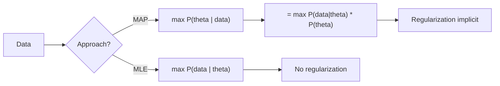

#### Interview Question

**Q:** L2 regularization (weight decay) MAP estimation se kaise related hai?

**A:** Agar tu weights pe Gaussian prior assume kare `P(W) = N(0, sigma^2 I)`, MAP objective `log P(data | W) + log P(W)` ban jaata hai. Log of Gaussian prior is `-||W||^2 / (2 sigma^2) + const`. Toh maximize karne ka matlab `log P(data | W) - lambda ||W||^2` maximize karna where `lambda = 1/(2 sigma^2)`. Equivalently, negative log likelihood + lambda * ||W||^2 minimize karo — yahi exactly L2 regularization hai. Similarly, L1 regularization Laplace prior se aata hai. Toh weight decay ka tuning effectively prior strength tuning hai — agar tu chhota lambda use karta hai, prior weak hai, model data ke aas-paas zyada flexibility leta hai (overfit prone). Bada lambda strong prior, smoother solutions. Bayesian framework intuitive samajh deta hai regularization choices ka.

---

### 3.5 Sampling: Monte Carlo, importance, MCMC

#### Definition (kya hai?)

Monte Carlo: random samples se expectations approximate karna. `E[f(X)] ≈ (1/N) * sum f(x_i)` where x_i ~ p(x). Importance sampling: agar p se sample karna mushkil hai, easy distribution q se sample karo aur `f(x) * p(x)/q(x)` average karo. MCMC (Markov Chain Monte Carlo): construct a Markov chain whose stationary distribution is target — Metropolis-Hastings, Gibbs, HMC.

#### Why?

LLM generation Monte Carlo sampling hai literally. RLHF mein expected reward estimate karne ke liye samples chahiye. Diffusion models sampling-based generative process hain. Importance sampling RLHF mein off-policy correction ke liye crucial hai.

#### How?

```python
import torch
import numpy as np

# Monte Carlo — estimate pi
N = 100000
points = torch.rand(N, 2)
inside = (points**2).sum(dim=1) < 1
pi_estimate = 4 * inside.float().mean()
print(pi_estimate)  # ~3.14

# Importance sampling for LLM rewards
# Target: expected reward under current policy
# Easy: samples from old policy
# weight = pi_new(a|s) / pi_old(a|s)
old_log_probs = torch.tensor([-2.0, -1.5, -3.0])
new_log_probs = torch.tensor([-1.8, -1.2, -2.5])
rewards = torch.tensor([1.0, 0.5, 2.0])

weights = torch.exp(new_log_probs - old_log_probs)
expected_reward = (weights * rewards).mean()
```

#### Real-life Example

PPO for RLHF: tu old policy se samples generate karta hai (expensive — full LLM generation). Fir new policy update karte hain. Har update step pe re-sample karna na padhe, importance sampling se ratio compute karte hain `pi_new/pi_old`, reward weighting karte hain. PPO ka clipping yahin se aata hai — agar ratio bahut bada/chhota ho, clip kar do, warna variance explode ho jaata hai.

#### Diagram

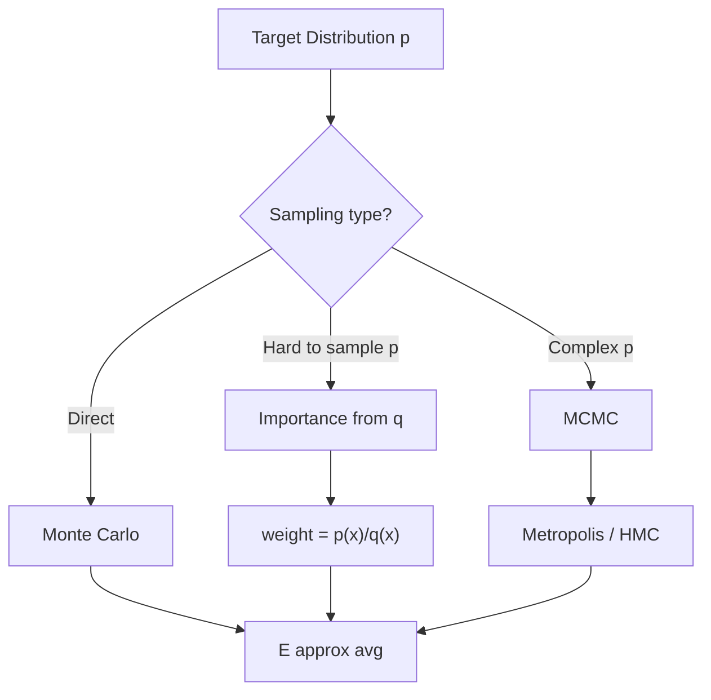

#### Interview Question

**Q:** Importance sampling ka high variance problem kya hai aur kaise handle karte hain?

**A:** Importance sampling weights `w = p(x)/q(x)`. Agar p aur q ke supports ya modes mismatch karte hain, weights very large ya very small ho sakte hain — extreme variance. Effective sample size drop ho jaati hai — most samples ka contribution negligible aur ek-do extreme samples dominate karte hain estimate. Solutions: (1) clipping — PPO mein ratios `[1-eps, 1+eps]` mein clip karte hain, (2) effective sample size monitoring aur resample karna, (3) self-normalized importance sampling weights ko normalize karke biased but lower variance estimator banana, (4) better proposal q choose karna jo target ke close ho. RLHF mein specifically, KL divergence constraint between new aur old policy add karte hain — implicit way to keep importance ratios from blowing up.

---

### 3.6 KL divergence, cross-entropy, Jensen-Shannon

#### Definition (kya hai?)

KL divergence: `KL(P || Q) = sum P(x) * log(P(x) / Q(x))`. Measures kitna Q distribution P se "different" hai. Asymmetric — `KL(P||Q) != KL(Q||P)`. Always >= 0, zero iff P = Q.

Cross-entropy: `H(P, Q) = -sum P(x) log Q(x) = H(P) + KL(P||Q)`. Jensen-Shannon: symmetric version of KL, `JS(P,Q) = 0.5*KL(P||M) + 0.5*KL(Q||M)` where M = (P+Q)/2. Bounded between 0 and log 2.

#### Why?

KL RLHF ka constraint hai — fine-tuned policy ko reference (SFT) policy ke close rakho. Cross-entropy LLM loss function hai. Variational inference (VAE, ELBO) KL pe khada hai. JS divergence original GAN paper mein use hua tha.

#### How?

```python
import torch
import torch.nn.functional as F

# Cross-entropy — standard LLM loss
logits = torch.randn(4, 50000)
targets = torch.randint(0, 50000, (4,))
ce_loss = F.cross_entropy(logits, targets)

# KL divergence between two distributions
p = F.softmax(torch.randn(50000), dim=-1)
q = F.softmax(torch.randn(50000), dim=-1)

kl = F.kl_div(q.log(), p, reduction='sum')  # KL(p || q)

# RLHF KL penalty — keep policy close to reference
log_pi_new = F.log_softmax(torch.randn(50000), dim=-1)
log_pi_ref = F.log_softmax(torch.randn(50000), dim=-1)
pi_new = log_pi_new.exp()
kl_penalty = (pi_new * (log_pi_new - log_pi_ref)).sum()
```

#### Real-life Example

DPO (Direct Preference Optimization) — RLHF ka simpler alternative — implicit reward model se directly KL-constrained policy optimization karta hai. Loss formula KL-regularized RL ka closed-form solution hai. Bina KL math samjhe DPO derive nahi kar paayega ya fine-tune nahi kar paayega. Bhi, knowledge distillation — student model ko teacher ki distribution match karne ke liye train karte hain, exactly KL minimization hai.

#### Diagram

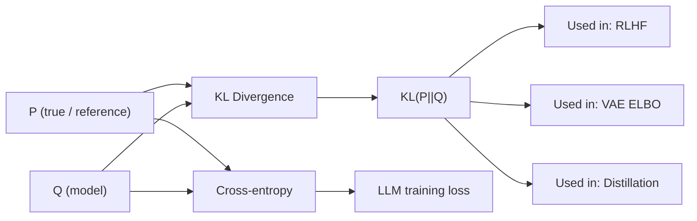

#### Interview Question

**Q:** KL(P||Q) aur KL(Q||P) mein difference hai — kab kaunsa use kare?

**A:** KL asymmetric hai aur direction matter karta hai. `KL(P||Q)` "forward KL" or "M-projection" — P jahan high probability deta hai wahan Q ko bhi high dena chahiye, otherwise penalty. Mass-covering behavior — Q P ke saare modes cover karne ki koshish karega even if it spreads thin. `KL(Q||P)` "reverse KL" or "I-projection" — Q jahan high hai wahan P bhi high hona chahiye. Mode-seeking — Q ek prominent mode pe collapse kar sakta hai. VAE forward KL minimize karta hai (encoder posterior to prior), variational inference often reverse KL use karta hai (computational reasons). RLHF mein KL(pi_new || pi_ref) use hota hai jo reverse-style hai — chhota mass jahan reference assigns nahi karta wahan. Cross-entropy as loss MLE = forward KL minimization hai (data distribution to model). Symmetric version chahiye ho toh JS divergence use kar.

---

## 4. Information Theory

Information theory data ke "amount of surprise" ko quantify karne ka math hai. Shannon ne 1948 mein invent kiya tha. LLMs essentially compression algorithms hain, aur compression information theory ka core hai. Perplexity, cross-entropy, mutual information — sab yahin se aate hain.

### 4.1 Entropy, conditional entropy

#### Definition (kya hai?)

Entropy: `H(X) = -sum P(x) log P(x)`. Measures average "surprise" or uncertainty in distribution. High entropy = uniform-ish (lots of uncertainty), low entropy = concentrated (predictable). Units bits agar log_2, nats agar log_e.

Conditional entropy: `H(Y|X) = -sum P(x,y) log P(y|x)` — average uncertainty in Y given X. `H(Y|X) <= H(Y)` always — knowing X can only reduce uncertainty about Y.

Analogy: uniform 50K-vocab distribution mein next-token uncertainty huge hai (~log 50000 = 15.6 bits). Trained LLM is se much less — typically 2-3 bits per token on natural text. Wo difference hi LLM ka "intelligence" hai information-theoretic sense mein.

#### Why?

LLMs literally entropy minimize kar rahe hain — text ka conditional entropy given context. Compression ratio of any algorithm is bounded by source entropy. Diffusion models ki noise schedule entropy ke terms mein design hoti hai.

#### How?

```python
import torch
import torch.nn.functional as F

# Entropy of a distribution
probs = F.softmax(torch.randn(50000), dim=-1)
entropy = -(probs * probs.log()).sum()
print(entropy)  # in nats; divide by ln(2) for bits

# Uniform — max entropy
uniform = torch.ones(50000) / 50000
uniform_entropy = -(uniform * uniform.log()).sum()
print(uniform_entropy)  # ~10.82 nats = ~15.6 bits

# Concentrated — low entropy  
concentrated = F.softmax(torch.tensor([10.0, 0.1, 0.1, 0.1, 0.1]), dim=-1)
print(-(concentrated * concentrated.log()).sum())  # very low
```

#### Real-life Example

Tu LLM agent ka monitoring system bana raha hai. Tu next-token entropy track karta hai — agar suddenly entropy spike kare matlab model uncertain hai, possibly hallucinating or out-of-distribution input. Production setups (Anthropic, OpenAI) is type ka monitoring use karte hain to flag uncertain outputs for human review.

#### Diagram

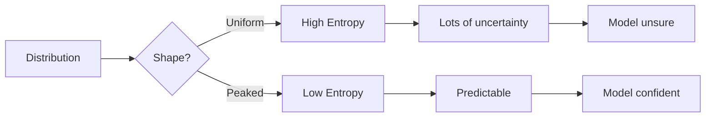

#### Interview Question

**Q:** Entropy bits mein kya represent karta hai practically?

**A:** Bits of entropy literally batate hain ki on average kitne yes/no questions chahiye uncertainty resolve karne ke liye, ya optimal compression mein per-symbol kitne bits chahiye. Agar English text ka per-character entropy ~1 bit hai (Shannon estimate), matlab tu English ko theoretically 1 bit per character mein compress kar sakta hai (ASCII 7 bits/char hai — huge redundancy). LLM training mein per-token cross-entropy loss tujhe negative log-likelihood deta hai — converted to bits ye kehta hai average kitne bits chahiye next token predict karne ke liye. GPT-4 estimated ~2 bits/token on web text. Yeh bound directly compression performance se related hai — LLM as compressor papers (Deepmind 2023) ne dikhaya hai LLMs gzip se better compress karte hain text/images.

---

### 4.2 Cross-entropy & relationship to likelihood

#### Definition (kya hai?)

Cross-entropy `H(P, Q) = -sum P(x) log Q(x)` — average bits/nats needed to encode samples from P using a code optimal for Q. Decomposes as `H(P, Q) = H(P) + KL(P||Q)`. Always >= H(P).

Relationship to likelihood: agar P empirical data distribution hai aur Q model distribution, then cross-entropy = -average log-likelihood. Minimizing cross-entropy = maximizing likelihood = MLE.

#### Why?

Cross-entropy is THE loss function for classification and language modeling. Tu PyTorch mein `F.cross_entropy` daily use karta hai — kabhi soche kyu? Because it's mathematically the right thing to minimize given probabilistic interpretation.

#### How?

```python
import torch
import torch.nn.functional as F

# Standard LLM loss
batch, seq, vocab = 4, 128, 50000
logits = torch.randn(batch, seq, vocab)
targets = torch.randint(0, vocab, (batch, seq))

# Reshape for cross_entropy
loss = F.cross_entropy(
    logits.reshape(-1, vocab),
    targets.reshape(-1)
)
print(loss)  # average negative log-likelihood per token

# Manually
log_probs = F.log_softmax(logits, dim=-1)
nll = -log_probs.gather(-1, targets.unsqueeze(-1)).mean()
# Same as cross_entropy result
```

#### Real-life Example

Tu Llama 3 ka pretraining loss curve dekh raha hai — y-axis pe loss, jo cross-entropy hai. Wo curve `e^(-loss)` se perplexity nikalta hai. Production training mein tu dekhega loss kabhi-kabhi spike kare — instability ya bad data. Cross-entropy ka understanding deep hona chahiye — kyu spike hua, kya rate of decrease healthy hai.

#### Diagram

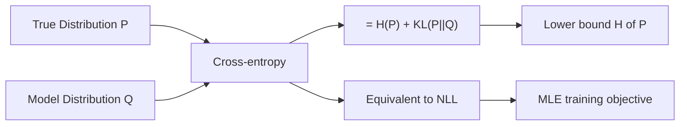

#### Interview Question

**Q:** Cross-entropy loss ka derivative softmax output ke respect mein kyu itna clean hai?

**A:** Combined softmax + cross-entropy ka gradient elegantly comes out as `(softmax(z) - one_hot(y))`. Derivation: softmax `p_i = exp(z_i) / sum exp(z_j)`. Loss `L = -log p_y` for true class y. `dL/dz_i = p_i - delta_{iy}` — agar i true class hai toh `(p_y - 1)`, otherwise `p_i`. Bahut clean. Yahi reason hai PyTorch ka `cross_entropy` fused implementation hai jo softmax aur loss alag se compute karne se faster aur numerically stable hai (logsumexp trick included). Agar tu softmax aur NLL alag-alag karega, gradient theoretically same milega but numerically unstable ho sakta hai exp overflow ki vajah se. Production tip: hamesha logits pe `cross_entropy` use kar, alag se softmax mat le.

---

### 4.3 Perplexity (the standard LLM metric)

#### Definition (kya hai?)

Perplexity `PPL = exp(cross_entropy_loss)`. Equivalently, `PPL = 2^H` agar entropy bits mein. Interpret as: model effectively choose kar raha hai ke beech kitne tokens ke (geometric mean ke sense mein). Lower is better.

GPT-2 ki perplexity WikiText-103 pe ~30 thi, GPT-3 ne ~20, GPT-4 likely ~10-12. Native English speaker estimated ~12.

#### Why?

Standard benchmark metric for language models. Cross-entropy hi sufficient hai but perplexity humans ko interpret karne mein easier hai — PPL 10 matlab "model effectively chooses among 10 tokens at each step on average".

#### How?

```python
import torch
import torch.nn.functional as F

# Compute perplexity over a dataset
total_loss = 0
total_tokens = 0
with torch.no_grad():
    for batch in dataloader:
        logits = model(batch)
        loss = F.cross_entropy(
            logits[:, :-1].reshape(-1, vocab_size),
            batch[:, 1:].reshape(-1),
            reduction='sum'
        )
        total_loss += loss.item()
        total_tokens += batch[:, 1:].numel()

avg_loss = total_loss / total_tokens
perplexity = torch.exp(torch.tensor(avg_loss))
print(f"Perplexity: {perplexity:.2f}")
```

#### Real-life Example

Tu fine-tuning kar raha hai domain-specific model — legal documents pe. Base GPT ki PPL legal corpus pe ~50 hai. Fine-tune karte karte 18 tak girti hai — proof model adapted hai. Tu A/B test karega different fine-tuning recipes (LoRA rank, learning rate) — perplexity tera primary objective metric hoga downstream tasks ke alawa.

#### Diagram

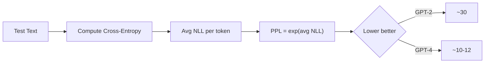

#### Interview Question

**Q:** Perplexity kab misleading metric hota hai?

**A:** Perplexity language modeling intrinsic quality measure hai but kayi cases mein limit hai. (1) Cross-corpus comparison fair nahi — har model apne tokenizer use karta hai, aur same text alag-alag tokens mein break ho sakta hai, ye perplexity numbers ko skew karta hai. Always normalize by character ya byte. (2) Perplexity downstream task quality predict nahi karta exactly — ek model lower PPL pe ho sakta hai but reasoning tasks pe behtar nahi. RLHF ke baad PPL often increase ho jaati hai but human preference aur task performance better. (3) Memorization rewarded hota hai — agar model train data exactly memorize kare, low PPL aayegi but generalization weak. Modern eval suites isiliye MMLU, GSM8K, HumanEval, HELM jaisi multi-faceted benchmarks use karte hain. Perplexity is necessary but not sufficient — ek baseline sanity check ke liye theek hai, but production decisions sirf perplexity pe nahi hone chahiye.

---

### 4.4 Mutual information

#### Definition (kya hai?)

Mutual Information `I(X; Y) = H(X) - H(X|Y) = H(Y) - H(Y|X)`. Symmetric, non-negative. Measures how much knowing one variable reduces uncertainty about the other. `I(X; Y) = 0` iff X and Y independent.

Equivalently, `I(X; Y) = KL(P(X,Y) || P(X)P(Y))` — joint distribution kitna independent product se diverge karta hai.

#### Why?

Information bottleneck theory of deep learning — networks during training maximize `I(features; labels)` while minimizing `I(features; input)`. InfoNCE loss in contrastive learning (SimCLR, CLIP) ek mutual information lower bound hai. Disentangled representations mutual information minimize karte hain across factors.

#### How?

```python
import torch
import torch.nn.functional as F

# InfoNCE — contrastive learning loss (mutual information lower bound)
def info_nce(query, keys, temperature=0.07):
    # query: (B, D), keys: (B, D) where keys[i] is positive for query[i]
    sim = query @ keys.T / temperature  # (B, B)
    labels = torch.arange(query.size(0))
    return F.cross_entropy(sim, labels)

# CLIP-style training
img_emb = torch.randn(64, 512)
text_emb = torch.randn(64, 512)
img_emb = F.normalize(img_emb, dim=-1)
text_emb = F.normalize(text_emb, dim=-1)
loss_i = info_nce(img_emb, text_emb)
loss_t = info_nce(text_emb, img_emb)
loss = (loss_i + loss_t) / 2
```

#### Real-life Example

CLIP — OpenAI ka image-text model. Train kiya gaya 400M image-text pairs pe. Loss function image embedding aur corresponding text embedding ke beech mutual information maximize karta hai (InfoNCE). Yahi reason hai CLIP zero-shot classification kar sakta hai — image embedding aur "a photo of a cat" embedding ke beech high mutual information ho jaati hai trained representation space mein.

#### Diagram

```mermaid
graph TD
    A["H(X)"] --> C[Mutual Info]
    B["H(Y)"] --> C
    D["H(X,Y)"] --> C
    C --> E["I(X;Y) = H(X)+H(Y)-H(X,Y)"]
    E --> F[Reduce uncertainty]
    F --> G[Contrastive learning]
    F --> H[Information bottleneck]
    F --> I[Feature selection]
```

#### Interview Question

**Q:** Contrastive learning losses (InfoNCE) mutual information se kaise related hain?

**A:** InfoNCE loss explicitly mutual information ka lower bound hai (Oord et al. 2018). Idea: tu N samples mein se positive pair distinguish karna chahta hai N-1 negatives ke beech. Optimal classifier accuracy mutual information se directly related hai — `I(X; Y) >= log N - L_NCE`. Toh InfoNCE minimize karna mutual information maximize karne ke approximation hai. Practical implications: large batch size matter karta hai (more negatives = tighter MI bound), quality of negatives matters (hard negatives = better signal). CLIP, SimCLR, MoCo — sab is principle pe khade hain. Pure mutual information directly compute karna high-dim continuous spaces mein intractable hai (densities estimate karne padte hain), but contrastive bounds gradient-friendly aur sample-based hain — yahi reason hai modern self-supervised learning mein InfoNCE everywhere hai.

---

## Resources & further reading

Solid foundation chahiye toh in resources se nahi hatna:

- **3Blue1Brown — Essence of Linear Algebra & Essence of Calculus**: YouTube series, visual intuition build karne ke liye unmatched. Pehle yeh dekh, fir text padh.
- **MIT 18.06 — Linear Algebra by Gilbert Strang**: classic course, full lectures free available. Strang ki teaching style intuitive aur deep dono hai.
- **Goodfellow, Bengio, Courville — Deep Learning Book, Chapter 2**: complete ML-relevant linear algebra in 30 pages. Free online. Read this twice.
- **StatQuest with Josh Starmer**: probability aur statistics ko bahut accessible way mein explain karta hai. PCA, Bayes, SVD — sab covered.
- **Harvard Stat 110 — Probability by Joe Blitzstein**: probability ki rigorous foundation. YouTube pe full lectures hain. Counterintuitive paradoxes excellent way mein cover karta hai.
- **Bishop — Pattern Recognition and Machine Learning**: Bayesian perspective deeply. Variational inference, EM, mixture models — all derived from first principles.
- **Cover & Thomas — Elements of Information Theory**: information theory ka bible. Dense but precise. Relevant chapters: 1-2 (entropy, mutual info), 4 (data compression), 11 (information theory and statistics).
- **Pattern Recognition and Machine Learning by Christopher Bishop**: probabilistic ML ka classic, Bayesian view se.
- **Boyd & Vandenberghe — Convex Optimization**: optimization understand karne ke liye essential. Stanford lectures online available.
- **Murphy — Probabilistic Machine Learning**: modern comprehensive textbook covering everything from Bayes to deep generative models.

Practical advice — don't read passively. Har concept ko code mein implement kar (NumPy se shuru kar, fir PyTorch). Har formula derive kar pen-paper pe. Interview ke time ye muscle memory hi tujhe bachayegi. Aur jab koi naya paper aaye, math notation se ghabra mat — bhul jaa marketing buzzwords, math hi truth bolta hai. Linear algebra, calculus, probability, info theory — yahi tera Gen AI ka asli foundation hai. Iske bina sab castle in the air hai.
