# Multi-Agent Systems

Multi-agent basically tab kaam aata hai jab ek single LLM se task complex ho jaye. Specialized agents — researcher, critic, coder — apna apna kaam karte hain, supervisor coordinate karta hai. Sochne ka tareeka simple hai: jaise ek startup mein tu akela full-stack dev hai, sab kaam handle kar leta hai. But jab company badi ho jaye, tab tujhe alag-alag specialists chahiye — frontend dev, backend dev, devops, QA. Same logic LLM agents pe lagta hai. Ek model ko bahut saari responsibilities dene se context dilute ho jata hai, prompts spaghetti ban jate hain, aur debugging nightmare ho jata hai.

Multi-agent systems mein har agent ka apna scope, apna toolkit, apna system prompt hota hai. Ek "router" ya "supervisor" decide karta hai kaun sa agent kaunsa kaam karega. Communication shared state, message passing, ya event bus ke through hota hai. Yeh pattern 2024-2026 mein especially production mein popular hua hai — Anthropic ka Claude Code, Cursor's agent mode, Devin, sab basically multi-agent loops hain under the hood.

Lekin ek warning bhi hai — multi-agent system add karna instant complexity tax hai. Latency badhta hai, cost badhta hai, debugging surface explode ho jata hai. Senior engineer ka thumb rule yeh hai: pehle single-agent + tools se try karo, jab woh genuinely fail kare tabhi multi-agent ki taraf jao. Yeh guide tujhe architecture choices, frameworks, specialized agent types aur evaluation — sab cover karke dega, IIT-level depth ke saath.

---

## 1. Architectures

### 1.1 Single agent with tools

**Definition:** Single agent + tools matlab ek hi LLM jo loop mein chalta hai, tools call karta hai, results parhta hai, aur next step decide karta hai. ReAct (Reason + Act) pattern isi ka grandfather hai. Koi delegation nahi, koi sub-agent nahi — ek hi brain, multiple hands.

**Why:** 80% real-world tasks single agent + thoughtfully designed tools se solve ho jate hain. Multi-agent jump karne se pehle yeh baseline establish karna mandatory hai. Yahaan se tu metrics nikaal sakta hai, fir compare kar sakta hai ki multi-agent actually improvement de raha hai ya bas latency badha raha hai.

**How:**

```python
# Raw single-agent loop — koi framework nahi, sirf Anthropic SDK
import anthropic, json

client = anthropic.Anthropic()
tools = [
    {"name": "search_web", "description": "Web search karta hai",
     "input_schema": {"type": "object", "properties": {"q": {"type": "string"}}}},
    {"name": "calc", "description": "Math evaluate karta hai",
     "input_schema": {"type": "object", "properties": {"expr": {"type": "string"}}}},
]

def run_tool(name, args):
    # Yahan real implementation aayegi — abhi mock
    if name == "search_web": return f"Top result for {args['q']}"
    if name == "calc": return str(eval(args["expr"]))

def agent_loop(user_msg, max_steps=10):
    messages = [{"role": "user", "content": user_msg}]
    for step in range(max_steps):  # safety budget — infinite loop se bachao
        resp = client.messages.create(
            model="claude-sonnet-4-5", max_tokens=2048,
            tools=tools, messages=messages,
        )
        messages.append({"role": "assistant", "content": resp.content})
        if resp.stop_reason == "end_turn":
            return resp.content[-1].text  # final answer
        # tool_use blocks handle karo
        tool_results = []
        for block in resp.content:
            if block.type == "tool_use":
                out = run_tool(block.name, block.input)
                tool_results.append({"type": "tool_result",
                                     "tool_use_id": block.id, "content": out})
        messages.append({"role": "user", "content": tool_results})
    raise RuntimeError("Max steps exceeded — agent stuck")
```

**Real-life example:** Tu ek "trip planner" bana raha hai. Single agent ko `search_flights`, `search_hotels`, `get_weather`, `book_calendar` tools de de. User bole "Plan 3-day Goa trip", agent hi sequence figure out karega — pehle weather check, fir flights, fir hotels. 90% cases mein yeh kaafi hai.

**Diagram:**

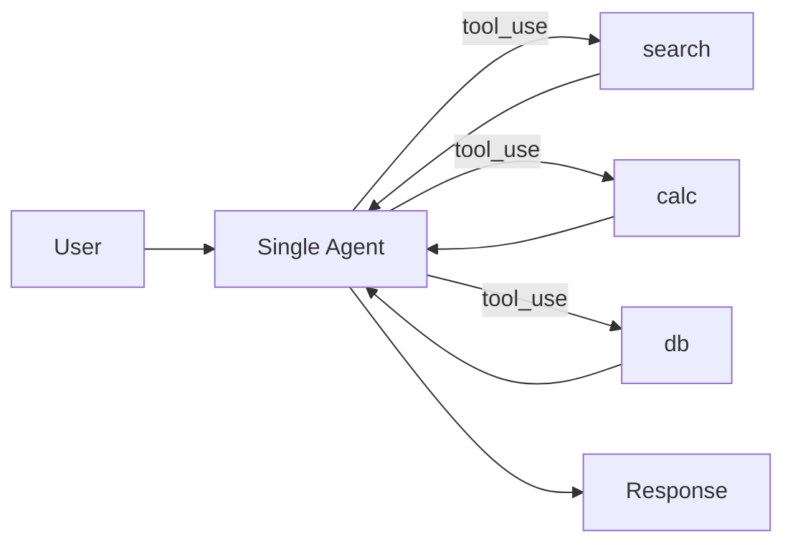

**Interview Q&A:** *Q: Single agent kab fail karta hai?* Jab task ke andar genuinely conflicting goals hon — jaise "creative writing + factual accuracy ke saath" — tab ek hi prompt mein dono optimize karna mushkil ho jata hai. Critic-writer split helpful hota hai. Doosra failure mode tab aata hai jab tools ka count 30+ ho jaye — model confuse ho jata hai kaunsa pick kare, tool selection accuracy gir jati hai. Tab tu agents ko domain ke hisaab se split karta hai, har ek ko relevant subset tools deta hai. Tisra failure mode — long-horizon tasks (50+ steps), jahan context window bhar jata hai aur model "amnesia" hit karta hai. Hierarchy + memory zaruri ho jata hai.

---

### 1.2 Supervisor-worker pattern

**Definition:** Ek "supervisor" (ya router) agent hota hai jo decide karta hai kaun sa worker agent invoke karna hai. Workers specialized hote hain — researcher, coder, summarizer, etc. Supervisor task ko dispatch karta hai, results aggregate karta hai, aur user ko final answer deta hai.

**Why:** Yeh sabse common production pattern hai 2026 mein. Reason — clear separation of concerns, har worker ka prompt focused, debugging easy because tu trace kar sakta hai konse worker ne kya bola. Scale karna bhi simple — naya use-case aaya, naya worker plug-in kar diya.

**How:**

```python
# LangGraph supervisor — graph-based, latest API (langgraph 0.6+)
from langgraph.graph import StateGraph, END
from typing import TypedDict, Literal

class State(TypedDict):
    messages: list
    next: str  # supervisor isko set karega

def supervisor(state: State):
    # Supervisor LLM ko bolo — kaunsa worker aage chalana hai?
    last = state["messages"][-1].content
    if "research" in last.lower():
        return {"next": "researcher"}
    if "code" in last.lower():
        return {"next": "coder"}
    return {"next": "FINISH"}

def researcher(state):
    # Web search, paper lookup, etc.
    return {"messages": state["messages"] + [{"role": "researcher", "content": "..."}]}

def coder(state):
    # Code generation
    return {"messages": state["messages"] + [{"role": "coder", "content": "..."}]}

graph = StateGraph(State)
graph.add_node("supervisor", supervisor)
graph.add_node("researcher", researcher)
graph.add_node("coder", coder)
graph.set_entry_point("supervisor")
graph.add_conditional_edges("supervisor", lambda s: s["next"],
    {"researcher": "researcher", "coder": "coder", "FINISH": END})
graph.add_edge("researcher", "supervisor")  # worker -> wapas supervisor
graph.add_edge("coder", "supervisor")
app = graph.compile()
```

**Real-life example:** Customer support bot — supervisor classify karta hai query (billing / technical / sales), fir appropriate worker agent ko bhej deta hai. Billing agent ke paas Stripe API tools, tech agent ke paas product docs RAG, sales agent ke paas CRM access. Har worker focused, supervisor pure orchestration karta hai.

**Diagram:**

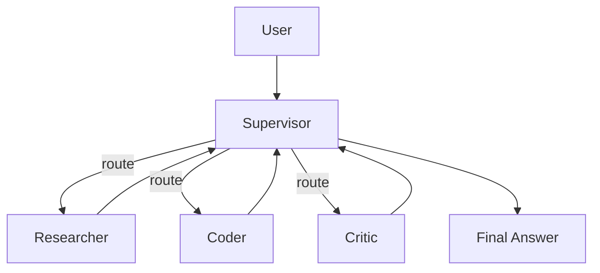

**Interview Q&A:** *Q: Supervisor LLM choti rakhni chahiye ya badi?* Trade-off hai. Choti (Haiku-class) faster aur sasti, but routing decisions kabhi kabhi galat. Badi (Sonnet/Opus) accurate but expensive aur har turn supervisor invoke hona costly. Best practice — supervisor ke liye structured output use karo (JSON schema with `next_agent` enum), aur middle-tier model. Edge case — agar supervisor khud bhi tool calls kare, woh worker ke saath race condition bana sakta hai. Clean design mein supervisor sirf routing karta hai, koi external tool nahi.

---

### 1.3 Hierarchical agents

**Definition:** Hierarchical matlab tree structure — top-level supervisor ke neeche mid-level supervisors, unke neeche leaf workers. Multi-layer delegation. Bada task chote sub-tasks mein decompose hota hai recursively.

**Why:** Bahut bade tasks (research papers likhna, full software project banana) ke liye flat supervisor-worker kaafi nahi. Bahut saare workers manage karna ek supervisor ke liye context-window challenge ban jata hai. Layers add karke har supervisor ka span-of-control manageable rakhte hain.

**How:**

```python
# Hierarchical example — research paper writer
# Top supervisor -> Section heads -> Paragraph workers

from langgraph.graph import StateGraph, END

# Level 3 (leaf): paragraph writer
def write_paragraph(state):
    # LLM call — ek focused paragraph
    return {"section_text": state["section_text"] + "\n[para]"}

# Level 2: section head — multiple paragraphs orchestrate karta hai
def section_head(state):
    section_graph = StateGraph(dict)
    section_graph.add_node("para", write_paragraph)
    # ... loop logic
    return {"sections": state["sections"] + [{"title": state["topic"], "text": "..."}]}

# Level 1: top supervisor — sections decide karta hai
def top_supervisor(state):
    outline = ["intro", "methods", "results", "discussion"]
    return {"outline": outline, "next": "section_head"}

# Compile karte time har level apna sub-graph hota hai
# yeh "graph-of-graphs" pattern hai
```

**Real-life example:** Devin-style coding agent. Top supervisor "build a chat app" ko decompose karta hai mein "frontend", "backend", "deploy". Frontend supervisor uske neeche components, routing, styling workers handle karta hai. Backend supervisor APIs, DB schema, auth workers. Each leaf focused — ek file likhne wala worker bas ek file likhta hai.

**Diagram:**

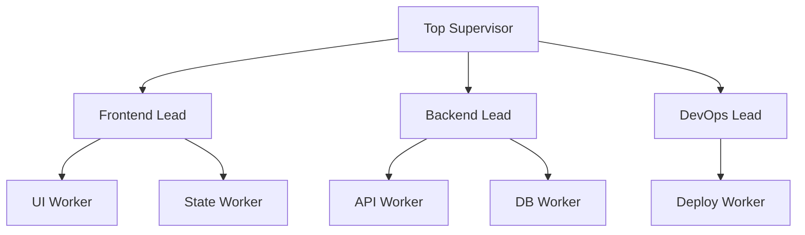

**Interview Q&A:** *Q: Hierarchy depth kitni honi chahiye?* Practical limit 3 layers. Beyond that, error propagation aur latency unmanageable. Har layer add karne se end-to-end latency multiply hoti hai (har LLM call ka p50 latency add hota hai), aur ek upper-layer ka galat decision niche cascade ho jata hai. Anthropic ka multi-agent research paper bolta hai 2-3 layers optimal — beyond that diminishing returns. Communication overhead bhi exponential — har sub-supervisor ko summary banana padta hai parent ke liye, aur summarization mein information loss hota hai.

---

### 1.4 Swarm/peer-to-peer agents

**Definition:** Swarm mein koi central supervisor nahi hota — agents directly ek doosre se baat karte hain, handoff karte hain control. OpenAI's Swarm framework aur newer Agents SDK isi pattern pe based hain. Har agent jaanta hai kaunse doosre agents mein handoff kar sakta hai.

**Why:** Customer support, gaming, simulation — jahan dynamic conversational flow chahiye. Supervisor pattern mein har turn supervisor ki cost lagti hai; swarm mein handoff explicit aur cheaper hota hai. Plus, conversation natural feel hota hai — jaise call center mein agent transfer ho raha ho.

**How:**

```python
# OpenAI Agents SDK style swarm
from openai import OpenAI
from agents import Agent, handoff, Runner  # 2026 SDK

triage_agent = Agent(
    name="Triage",
    instructions="User ki query classify karo aur appropriate agent ko handoff karo.",
)

billing_agent = Agent(
    name="Billing",
    instructions="Sirf billing-related queries handle karo. Stripe tools available.",
    tools=[stripe_lookup, refund_tool],
)

tech_agent = Agent(
    name="Tech",
    instructions="Technical issues debug karo. Logs aur docs access hai.",
    tools=[fetch_logs, search_docs],
)

# Handoffs declare karo — yeh basically tools hi hain under the hood
triage_agent.handoffs = [handoff(billing_agent), handoff(tech_agent)]
billing_agent.handoffs = [handoff(triage_agent)]  # bhej sakta hai vapas
tech_agent.handoffs = [handoff(triage_agent)]

# Run
result = Runner.run_sync(triage_agent, "Mera invoice galat aaya hai")
# Triage -> Billing -> response
```

**Real-life example:** Airline customer support — Triage agent classify karta hai (booking / refund / baggage / loyalty). Refund agent ke paas refund tools, baggage agent ke paas tracking tools. Agar refund agent ko lage user actually loyalty points use karna chahta hai, woh directly loyalty agent ko handoff kar deta hai — bina triage ko vapas gaye.

**Diagram:**

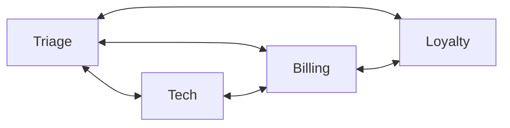

**Interview Q&A:** *Q: Swarm vs supervisor — kab kya use karein?* Swarm tab better hai jab interactions conversational hon, low-latency chahiye, aur agents ke beech topology dense ho. Supervisor better hai jab tu observability aur control chahta hai — central choke point se sab decisions trace kar sakta hai. Production debugging mein supervisor pattern audit-friendly hota hai — har handoff supervisor ke through gaya, full log available hai. Swarm mein decentralized handoff hone se distributed tracing zaruri hai (OpenTelemetry, Langfuse) — without that, debugging nightmare.

---

### 1.5 Human-in-the-loop patterns

**Definition:** Agent kabhi kabhi pause hota hai aur human se confirmation, input, ya correction maangta hai. Production agents — especially jo destructive actions (DB writes, payments, emails bhejna) lete hain — yeh pattern essential hai.

**Why:** LLMs hallucinate karte hain, edge cases miss karte hain. High-stakes actions ke pehle human checkpoint trust badhata hai. Plus, regulated industries (finance, healthcare, legal) mein audit trail aur human approval mandatory hai.

**How:**

```python
# LangGraph mein interrupt-based HITL
from langgraph.graph import StateGraph, END
from langgraph.checkpoint.memory import MemorySaver

def propose_action(state):
    # Agent decide karta hai kya karna hai
    return {"proposed": "Send email to client@x.com"}

def execute_action(state):
    # Approved hone ke baad hi yahan aata hai
    send_email(state["proposed"])
    return {"done": True}

graph = StateGraph(dict)
graph.add_node("propose", propose_action)
graph.add_node("execute", execute_action)
graph.add_edge("propose", "execute")
graph.set_entry_point("propose")

# 'execute' se pehle interrupt — human approval chahiye
checkpointer = MemorySaver()
app = graph.compile(checkpointer=checkpointer, interrupt_before=["execute"])

# Run — pause hoga before execute
config = {"configurable": {"thread_id": "1"}}
state = app.invoke({}, config=config)
# UI mein dikhao state["proposed"], user approve kare
# fir resume karo:
app.invoke(None, config=config)  # None matlab continue
```

**Real-life example:** Email reply agent — agent draft banata hai, but bheja nahi jata jab tak user "send" press na kare. Cursor agent jab file delete karta hai ya `rm -rf` jaisa command run karta hai, confirmation maangta hai. Anthropic ka Claude Code "auto-edit" mode mein bhi destructive operations ke pehle prompt karta hai.

**Diagram:**

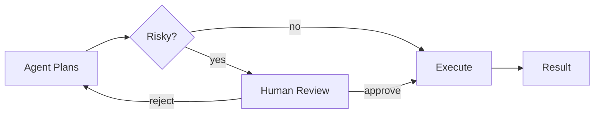

**Interview Q&A:** *Q: Kab interrupt karein, kab nahi?* Heuristic — reversible vs irreversible. File read = reversible, no interrupt. File delete = irreversible, interrupt. Money transfer = irreversible, definitely interrupt. Tier system bana — Tier 0 (read-only, auto), Tier 1 (write but reversible like draft creation, auto with notification), Tier 2 (irreversible, mandatory approval). Doosra design choice — async vs sync HITL. Sync mein agent rukta hai aur wait karta hai (good for chatbots), async mein agent task queue mein daal deta hai aur baad mein approve hone par resume hota hai (good for batch jobs). LangGraph ke checkpointers dono support karte hain — Postgres backend production-grade hai.

---

## 2. Agent Frameworks

### 2.1 LangGraph — graph-based orchestration

**Definition:** LangGraph LangChain team ka stateful graph-based agent framework hai. Nodes = functions/agents, edges = control flow. State persist hota hai checkpointers ke through, time-travel debugging support karta hai. 2026 mein production multi-agent ka go-to choice ban gaya hai.

**Why:** Pure prompt-chaining (LCEL) bahut linear ho jata hai. Real workflows mein loops, conditional branches, parallel paths — sab chahiye. Graphs yeh sab express karte hain cleanly. State management built-in — concurrency, checkpointing, replay sab framework handle karta hai.

**How:**

```python
from langgraph.graph import StateGraph, END
from typing import TypedDict, Annotated
import operator

class AgentState(TypedDict):
    messages: Annotated[list, operator.add]  # auto-merge with reducer
    iterations: int

def planner(state: AgentState):
    # Plan banao
    return {"messages": [{"role": "planner", "content": "step1, step2"}]}

def executor(state: AgentState):
    return {"messages": [{"role": "exec", "content": "done"}],
            "iterations": state.get("iterations", 0) + 1}

def should_continue(state: AgentState):
    if state["iterations"] >= 3: return END
    return "executor"

g = StateGraph(AgentState)
g.add_node("planner", planner)
g.add_node("executor", executor)
g.set_entry_point("planner")
g.add_edge("planner", "executor")
g.add_conditional_edges("executor", should_continue)
app = g.compile()
```

**Real-life example:** Klarna ka customer service agent (case study) — LangGraph graph mein supervisor + 8 specialized workers. Daily 2.3M+ chats, average resolution time 2 min vs human 11 min. Graph structure unhe A/B testing easy banata hai — naye worker swap karke deploy kar sakte hain.

**Diagram:**

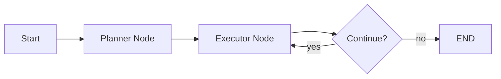

**Interview Q&A:** *Q: LangGraph vs vanilla while-loop?* Initial overhead high lagta hai — TypedDict, reducers, checkpointers seekhna padta hai. But as soon as tu retries, parallel branches, persistence add karna chahta hai, framework ki value clear ho jati hai. Especially `interrupt_before` / `interrupt_after`, time-travel (kisi previous checkpoint se replay karna), aur Studio (visual debugger) — yeh raw loops mein khud likhna mahina lag jayega. Trade-off — production observability (Langsmith integration) bahut strong, but framework lock-in hota hai. Migration karna padega tab effort lagega.

---

### 2.2 AutoGen (Microsoft)

**Definition:** AutoGen Microsoft Research ka framework hai jo conversational multi-agent systems ke liye design hua hai. Agents ek doosre ko messages bhejte hain, GroupChat manager conversation orchestrate karta hai. v0.4 (2024-2026) mein full async-first architecture aaya hai.

**Why:** Research-y experiments ke liye AutoGen lightweight hai. Conversation-based abstraction natural hai — har agent role play karta hai (UserProxy, AssistantAgent, GroupChatManager). Code execution sandboxing built-in hai — useful for code-generation tasks.

**How:**

```python
# AutoGen v0.4 API
import asyncio
from autogen_agentchat.agents import AssistantAgent
from autogen_agentchat.teams import RoundRobinGroupChat
from autogen_ext.models.openai import OpenAIChatCompletionClient

async def main():
    model = OpenAIChatCompletionClient(model="gpt-4o")
    coder = AssistantAgent(
        name="coder", model_client=model,
        system_message="Tu Python coder hai, clean code likh.",
    )
    reviewer = AssistantAgent(
        name="reviewer", model_client=model,
        system_message="Code review kar — bugs aur style issues nikaal.",
    )
    team = RoundRobinGroupChat([coder, reviewer], max_turns=4)
    result = await team.run(task="Fibonacci function likh")
    for msg in result.messages:
        print(msg.source, ":", msg.content)

asyncio.run(main())
```

**Real-life example:** Microsoft ke internal coding assistants AutoGen pe based hain. Research papers (e.g., AutoGen for math reasoning, code debugging) showed multi-agent debate improves accuracy 8-15% over single-agent on competitive programming benchmarks.

**Diagram:**

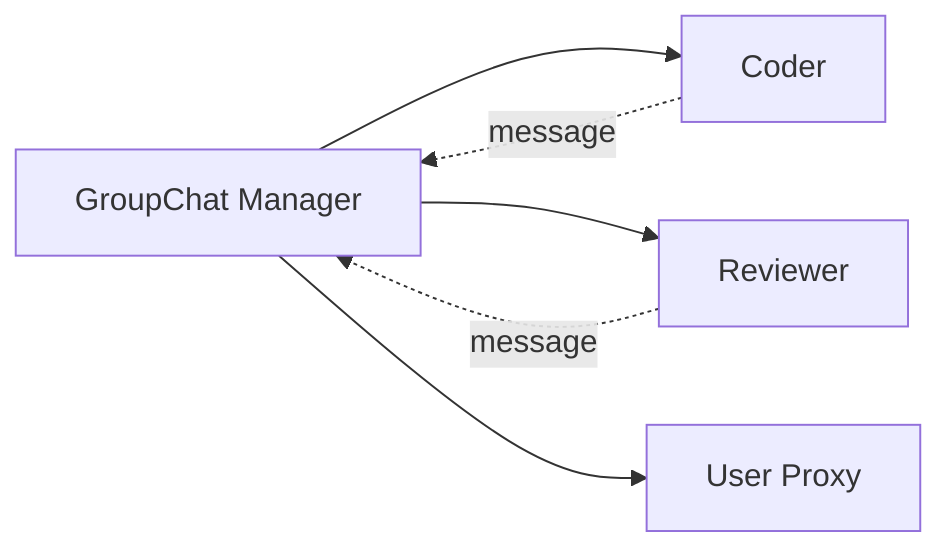

**Interview Q&A:** *Q: AutoGen vs LangGraph — choose karne ka basis?* AutoGen better when interactions feel like a "conversation" (debate, role-play, peer review). LangGraph better when interactions feel like a "workflow" (deterministic state machine with branches). Production maturity — LangGraph aage hai (Langsmith, Studio, Cloud). AutoGen v0.4 still stabilizing in 2026, but Microsoft ka backing strong hai. Code execution mein AutoGen ahead hai — Docker-based sandboxing, multi-language support out of box.

---

### 2.3 CrewAI

**Definition:** CrewAI Python-first framework hai jisme tu "Crew" banata hai — multiple "Agents" with "Roles" aur "Tasks". High-level abstraction, role-playing metaphor. Sequential aur hierarchical processes built-in.

**Why:** Beginners ke liye sabse easy framework hai. Role-based mental model intuitive — "Researcher", "Writer", "Editor" jaise roles directly map karte hain real-world teams pe. Code chota, prototyping fast.

**How:**

```python
from crewai import Agent, Task, Crew, Process

researcher = Agent(
    role="Research Analyst",
    goal="Latest AI trends find karo",
    backstory="Tu 10 years ka veteran AI researcher hai.",
    verbose=True,
)

writer = Agent(
    role="Tech Writer",
    goal="Findings ko engaging blog post mein convert karo",
    backstory="Tu Hindi-Roman tech blogger hai, IIT-grade depth ke saath.",
    verbose=True,
)

research_task = Task(
    description="2026 ke top 5 multi-agent frameworks find karo",
    expected_output="Bullet list with sources",
    agent=researcher,
)

write_task = Task(
    description="Research ke base pe 1000 word blog likh",
    expected_output="Markdown blog",
    agent=writer,
    context=[research_task],  # research output yahan flow hoga
)

crew = Crew(agents=[researcher, writer], tasks=[research_task, write_task],
            process=Process.sequential)
result = crew.kickoff()
```

**Real-life example:** Marketing automation startups CrewAI use karke "content crew" banate hain — researcher → writer → SEO optimizer → social media poster. Ek button click pe full content pipeline run hoti hai.

**Diagram:**

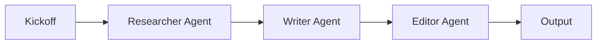

**Interview Q&A:** *Q: CrewAI ki limitations kya hain?* Production-grade observability LangGraph se peeche hai. Complex conditional flows (cycles, dynamic routing) express karna awkward hai — process abstraction mostly sequential / hierarchical hai. State management opaque — tu directly state graph touch nahi kar sakta jaise LangGraph mein. Prototyping aur demo ke liye perfect, but jaise hi production scale aati hai (1000s rps, observability, retries), engineers usually LangGraph pe migrate karte hain. Hain naye versions mein hooks, callbacks, async support improve hua hai but parity abhi nahi hai.

---

### 2.4 OpenAI Swarm / Agents SDK

**Definition:** OpenAI ka Swarm originally educational/experimental tha. 2025 mein iska successor "OpenAI Agents SDK" launch hua — production-ready, handoffs aur tracing built-in. Lightweight, function-call native.

**Why:** Agar tu pure OpenAI ecosystem mein hai (GPT-4o, Realtime API, Responses API), Agents SDK natural choice hai. Minimal abstractions, code feel similar to writing plain Python functions. Built-in tracing OpenAI dashboard mein dikhta hai.

**How:**

```python
from agents import Agent, Runner, function_tool

@function_tool
def get_weather(city: str) -> str:
    return f"{city} mein 28C, sunny"

weather_agent = Agent(
    name="Weather",
    instructions="Sirf weather queries handle karo",
    tools=[get_weather],
)

triage_agent = Agent(
    name="Triage",
    instructions="Weather queries Weather agent ko bhejo",
    handoffs=[weather_agent],
)

result = Runner.run_sync(triage_agent, "Bangalore mein mausam kaisa hai?")
print(result.final_output)
```

**Real-life example:** OpenAI ke internal demos (Operator-style browser agents, ChatGPT's agent mode) Agents SDK pe based hain. Smaller startups jo OpenAI-only stack chala rahe hain — Agents SDK adopt kar rahe hain because tracing dashboard free aata hai.

**Diagram:**

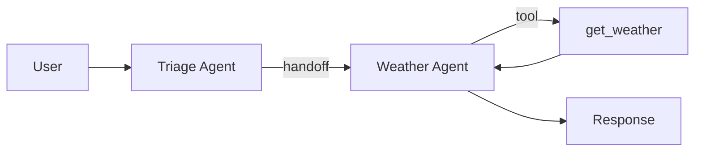

**Interview Q&A:** *Q: Agents SDK ka biggest pro / con?* Pro — simplicity. SDK tiny hai, internalize karna easy. Tracing OpenAI dashboard mein automatic. Con — model lock-in. Tu non-OpenAI models (Claude, Gemini, Llama) easily plug nahi kar sakta. LangGraph model-agnostic hai. Doosra con — features behind LangGraph hain (no time-travel, less observability options). 2026 mein still maturing — bahut companies multi-model hedge karti hain, isliye Agents SDK adoption restricted hai mostly OpenAI-loyal teams mein.

---

### 2.5 Anthropic MCP (Model Context Protocol)

**Definition:** MCP ek open standard hai (Anthropic 2024 mein launch kiya, 2025-2026 mein wide adoption) jo LLMs ko external tools, data sources, prompts standardized way mein expose karta hai. Yeh framework nahi hai — yeh protocol hai. Servers tools expose karte hain, clients (LLM apps) consume karte hain.

**Why:** Pehle har app ko apne tools custom integrate karne padte the. MCP "USB-C for AI" hai — ek baar MCP server bana liya (e.g., GitHub, Slack, Postgres), koi bhi MCP-compatible client (Claude Desktop, Cursor, Cline) instantly use kar sakta hai. Multi-agent systems mein MCP shared tool layer hai — alag alag agents same MCP servers use kar sakte hain.

**How:**

```python
# MCP server example — Python SDK
from mcp.server.fastmcp import FastMCP

mcp = FastMCP("my-tools")

@mcp.tool()
def search_db(query: str) -> str:
    """Database search karta hai"""
    # actual DB call
    return f"Results for: {query}"

@mcp.resource("file://logs/{date}")
def get_logs(date: str) -> str:
    """Specific date ke logs"""
    return open(f"/var/log/{date}.log").read()

if __name__ == "__main__":
    mcp.run()  # stdio ya SSE transport pe sun-ne lagta hai

# Client (e.g., Claude Desktop) config mein:
# {"mcpServers": {"my-tools": {"command": "python", "args": ["server.py"]}}}
# Ab Claude is server ke tools ko discover aur use kar sakta hai
```

**Real-life example:** Cursor IDE 2025 se MCP servers support karta hai — developer apne project-specific tools (custom linter, deployment scripts) MCP server mein wrap karte hain, fir Cursor agent unhe natively call karta hai. Anthropic's Claude Desktop mein bhi GitHub, Slack, Notion MCP servers popular hain.

**Diagram:**

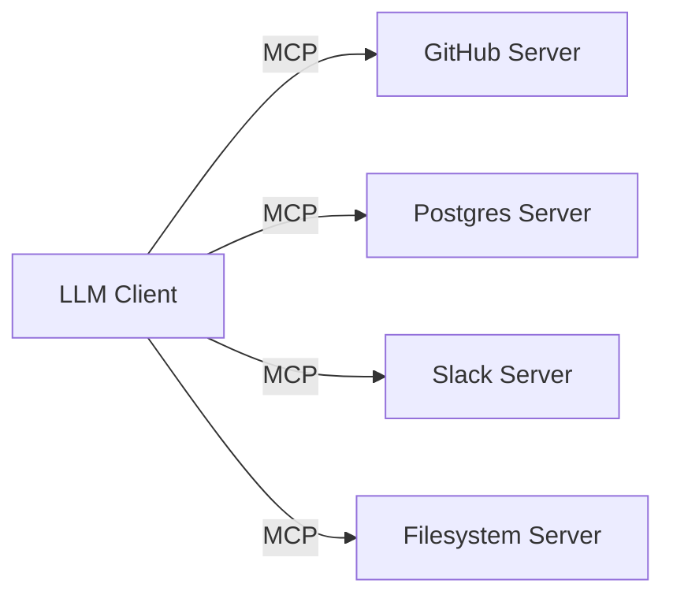

**Interview Q&A:** *Q: MCP framework hai ya alternative to LangGraph?* MCP framework nahi hai, protocol hai — comparison galat hai. MCP "tools layer" standardize karta hai, LangGraph "orchestration layer" handle karta hai. Production stack mein aksar dono saath chalte hain — LangGraph agent MCP servers ko tools ki tarah use kare. Security implications bhi serious hain — koi bhi MCP server install karna risk hai (prompt injection via tool descriptions, data exfiltration). Anthropic ne 2025-2026 mein "trusted server registry" aur sandboxing improvements add kiye hain, but enterprise still cautious hai.

---

### 2.6 Build raw with LLM + while loop first

**Definition:** Sabse important advice — koi bhi framework adopt karne se pehle, raw `while` loop mein agent likh ke dekho. Sirf LLM SDK (Anthropic / OpenAI), tool definitions, aur loop. Yeh tujhe core mental model deta hai — frameworks bas conveniences hain ispe top of.

**Why:** Frameworks ke abstractions kabhi-kabhi cheezein hide kar dete hain. Tu debug karta hai aur samajh nahi aata kya ho raha hai under the hood. Raw loop likh ke ek baar — tool_use → tool_result cycle, stop_reason handling, max_steps safety, error retry — sab tujhe pata chal jata hai. Fir framework ka code padhna easy ho jata hai.

**How:**

```python
# Pure raw — no framework
import anthropic
client = anthropic.Anthropic()

TOOLS = [{
    "name": "exec_python",
    "description": "Python code execute karta hai",
    "input_schema": {"type": "object", "properties": {"code": {"type": "string"}}}
}]

def exec_python(code):
    # production mein sandbox karo!
    try: return str(eval(code))
    except Exception as e: return f"Error: {e}"

def run(query, max_iters=15):
    msgs = [{"role": "user", "content": query}]
    for i in range(max_iters):
        r = client.messages.create(
            model="claude-sonnet-4-5", max_tokens=4096,
            tools=TOOLS, messages=msgs,
        )
        msgs.append({"role": "assistant", "content": r.content})
        if r.stop_reason != "tool_use":
            # done — final text return karo
            return next((b.text for b in r.content if b.type=="text"), "")
        # tool calls handle karo
        results = []
        for b in r.content:
            if b.type == "tool_use":
                out = exec_python(**b.input) if b.name=="exec_python" else "unknown"
                results.append({"type":"tool_result","tool_use_id":b.id,"content":out})
        msgs.append({"role": "user", "content": results})
    return "Max iterations exceeded"

print(run("(123 * 456) + sqrt(789) ka answer kya hai?"))
```

**Real-life example:** Bahut senior engineers (including Anthropic, Cognition Labs blog posts) recommend karte hain ki naya hire pehle 1 hafta raw agent likhe. Devin, Cursor, Aider — sab eventually frameworks pe chale gaye, but founders bolte hain "we wrote it raw first, that's why we know what each framework hides".

**Diagram:**

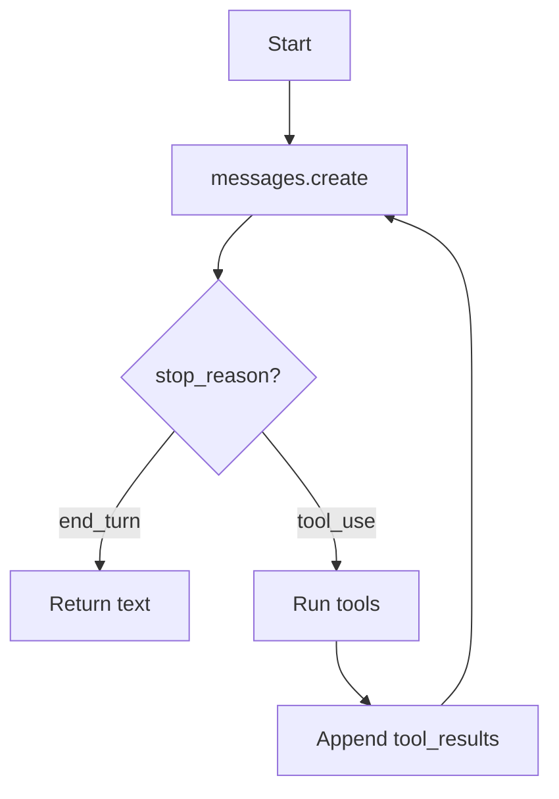

**Interview Q&A:** *Q: Phir framework adopt kab karein?* Jab raw mein 4-5 cheezein khud likhne lagein — retries with exponential backoff, parallel tool calls, persistent state across sessions, observability/tracing, multi-agent supervisor — tab framework ka cost-benefit clear ho jata hai. Heuristic — agar tu apne raw codebase ke 30%+ time framework ke features re-implement karne mein laga raha hai, switch. Pehle se framework adopt karna premature optimization hai — har framework ka apna learning curve aur lock-in hai. Senior engineering culture mein "build it raw, then upgrade" valued hai.

---

## 3. Specialized Agent Types

### 3.1 Coding agents (Claude Code, Cursor, Aider patterns)

**Definition:** Coding agents — woh agents jo file system access ke saath code likhte, edit karte, test karte, debug karte hain. Claude Code (Anthropic), Cursor, Aider, Devin, Continue — sab is category mein. Common pattern — read-edit-run loop with extensive file system tools.

**Why:** Software engineering agents ka biggest market segment hai 2026 mein. Tasks jaise "feature implement karo", "bug fix karo", "refactor karo", "tests likho" — sab repetitive aur structured hain, ideal for agents. Productivity gains 30-50% claimed (with measurement caveats).

**How:**

```python
# Minimal coding agent loop — file ops + bash
import subprocess, anthropic
client = anthropic.Anthropic()

TOOLS = [
    {"name":"read_file","description":"File padho",
     "input_schema":{"type":"object","properties":{"path":{"type":"string"}}}},
    {"name":"write_file","description":"File likho",
     "input_schema":{"type":"object","properties":{
        "path":{"type":"string"},"content":{"type":"string"}}}},
    {"name":"run_bash","description":"Shell command",
     "input_schema":{"type":"object","properties":{"cmd":{"type":"string"}}}},
]

def execute(name, args):
    if name == "read_file": return open(args["path"]).read()
    if name == "write_file":
        open(args["path"], "w").write(args["content"]); return "ok"
    if name == "run_bash":
        # SAFETY: production mein whitelist + sandbox
        r = subprocess.run(args["cmd"], shell=True, capture_output=True, text=True, timeout=30)
        return r.stdout + r.stderr

def coding_agent(task):
    msgs = [{"role":"user","content":task}]
    for _ in range(50):  # coding loops longer hote hain
        r = client.messages.create(model="claude-sonnet-4-5",
            max_tokens=8192, tools=TOOLS, messages=msgs,
            system="Tu careful coder hai. Tests run kar, errors fix kar.")
        msgs.append({"role":"assistant","content":r.content})
        if r.stop_reason != "tool_use": break
        results = [{"type":"tool_result","tool_use_id":b.id,
                    "content":execute(b.name,b.input)}
                   for b in r.content if b.type=="tool_use"]
        msgs.append({"role":"user","content":results})
```

**Real-life example:** Claude Code daily standup ka kaam karta hai SWE teams mein — bug triage, PR description likhna, failing test fix karna. Cursor mein Composer mode multi-file edits karta hai. Aider git-native hai — har edit alag commit banata hai, diff-based review easy.

**Diagram:**

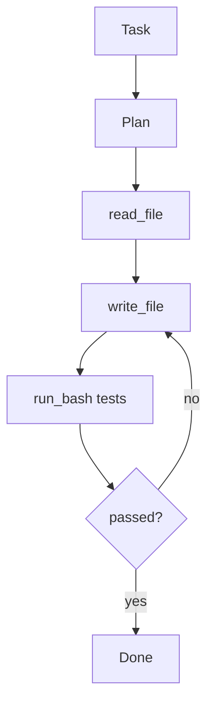

**Interview Q&A:** *Q: Coding agent ke main failure modes kya hain?* (1) Hallucinated APIs — model bole "use library X" jo exist nahi karti. Mitigation: docs ko RAG mein expose karo, ya MCP docs server use karo. (2) Stale context — repo bada hai, agent sirf relevant files dekhe. Smart code search (ripgrep, ts-morph) tools mandatory. (3) Test gaming — agent test pass karne ke liye implementation skip karke test ko hi modify kar de. Sandbox mein test files protect karo, ya separate "test verifier" agent rakho. (4) Long-horizon drift — 100+ steps mein agent goal bhul jata hai. Periodic "re-grounding" prompts (initial task remind karna) helpful.

---

### 3.2 Browser/computer-use agents

**Definition:** Browser ya OS-level GUI ko control karne wale agents. Anthropic's Computer Use (2024), OpenAI Operator (2025), browser-use library — sab is space mein. Agent screen screenshots dekh ke mouse, keyboard control karta hai.

**Why:** Bahut saare workflows GUI-only apps mein hote hain (legacy enterprise software, consumer websites jo API nahi dete). Computer-use agents yeh gap close karte hain — automate any UI human kar sakta hai.

**How:**

```python
# Anthropic Computer Use — simplified
import anthropic, base64
from PIL import ImageGrab

client = anthropic.Anthropic()

def screenshot():
    img = ImageGrab.grab()
    img.save("/tmp/s.png")
    return base64.b64encode(open("/tmp/s.png","rb").read()).decode()

def computer_action(action, **kwargs):
    # pyautogui ya playwright ka use karke real action lo
    if action == "click":
        import pyautogui; pyautogui.click(kwargs["x"], kwargs["y"])
    if action == "type":
        import pyautogui; pyautogui.typewrite(kwargs["text"])
    return "done"

def browser_agent(task):
    msgs = [{"role":"user","content":[
        {"type":"text","text":task},
        {"type":"image","source":{"type":"base64","media_type":"image/png","data":screenshot()}}
    ]}]
    for _ in range(20):
        r = client.beta.messages.create(
            model="claude-sonnet-4-5",
            tools=[{"type":"computer_20241022","name":"computer",
                    "display_width_px":1920,"display_height_px":1080}],
            messages=msgs, max_tokens=2048,
            betas=["computer-use-2024-10-22"],
        )
        # tool_use blocks ke based pe action lo, naya screenshot capture karo
        # ... loop
```

**Real-life example:** Form-filling automation — old government portals, insurance claim sites jahan API nahi hai. Browser-use agents user ke behalf pe form fill karte hain. Operator demos mein restaurant booking, flight check-in dikhaye gaye.

**Diagram:**

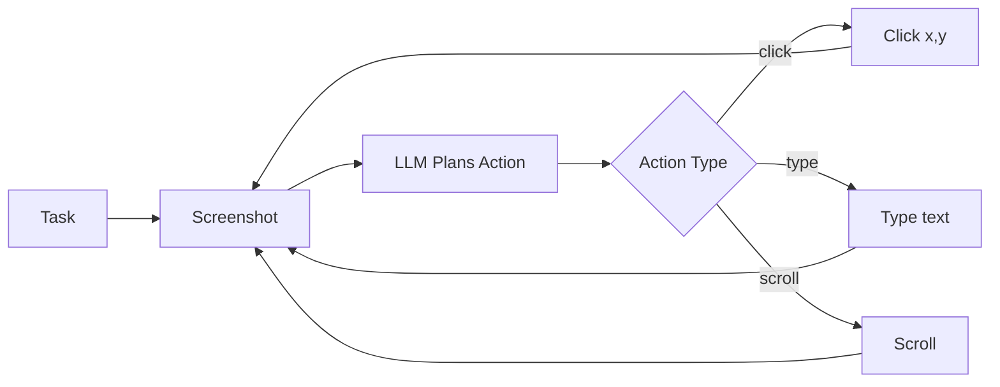

**Interview Q&A:** *Q: Reliability kitni hai?* 2026 ke benchmarks pe (OSWorld, WebArena) state-of-art still 50-65% range mein hai. Production deployments mein narrow domains pe (specific website, specific workflow) tuned setups 80-90% reach kar lete hain. Common failure — visual element detection (small buttons, dropdowns), modal dialogs unexpected aana, anti-bot CAPTCHAs. Mitigations — DOM access (when available), accessibility tree (more reliable than pixels), retry with self-correction. Cost bhi consideration — har step mein image input expensive hai, 100-step task $5-10 ka padd sakta hai.

---

### 3.3 Research agents

**Definition:** Research agents — long-horizon information gathering aur synthesis ke liye. OpenAI Deep Research, Anthropic Research, Perplexity Pro Research — sab examples. Multiple search queries, source aggregation, structured report generation.

**Why:** Knowledge work mein "preliminary research" 2-4 hours regularly khaata hai. Research agents 5-15 min mein 80% draft de dete hain — analyst fir verify aur refine karta hai.

**How:**

```python
# Research agent — supervisor + search workers + synthesizer
from langgraph.graph import StateGraph, END

def planner(state):
    # Sub-questions decompose karo
    return {"sub_questions": ["q1: market size", "q2: competitors", "q3: trends"]}

def researcher(state):
    # Har sub-question pe parallel search
    findings = []
    for q in state["sub_questions"]:
        results = web_search(q)  # MCP server / Brave API / etc.
        findings.append({"q": q, "sources": results})
    return {"findings": findings}

def synthesizer(state):
    # Final report banao with citations
    report = llm_call(f"Synthesize report from: {state['findings']}")
    return {"report": report}

g = StateGraph(dict)
g.add_node("plan", planner)
g.add_node("research", researcher)
g.add_node("synth", synthesizer)
g.set_entry_point("plan")
g.add_edge("plan", "research")
g.add_edge("research", "synth")
g.add_edge("synth", END)
```

**Real-life example:** Anthropic ke "Multi-agent Research" blog post (2025) mein detail hai — supervisor + parallel sub-researchers ne single-agent baseline ke comparison mein 90% improvement diya BrowseComp benchmark pe. Token spend 15x but value justifies for high-stakes research.

**Diagram:**

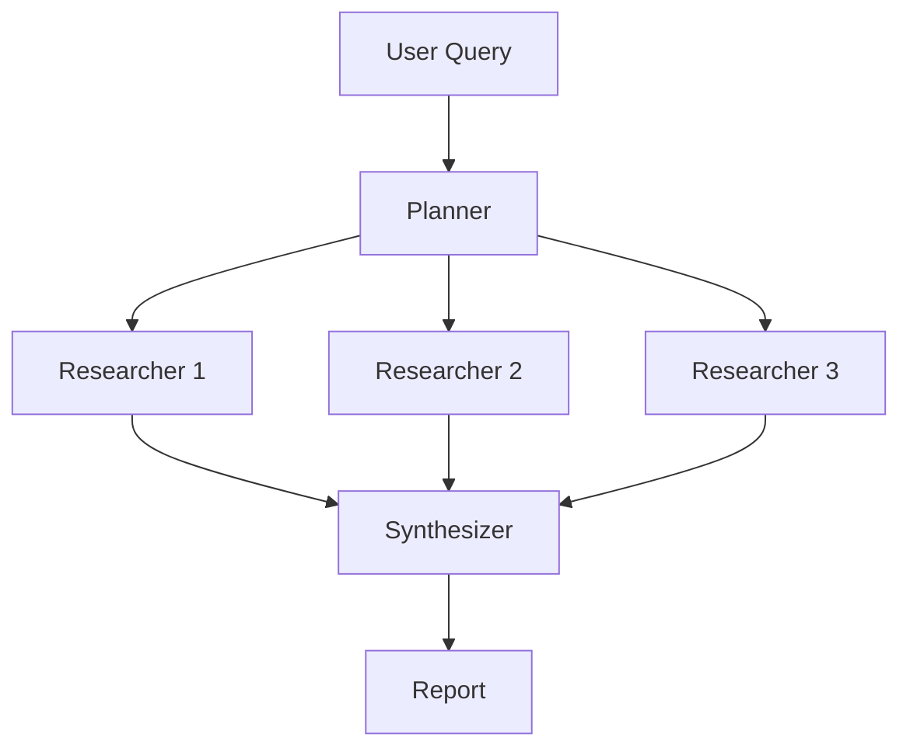

**Interview Q&A:** *Q: Research agents mein hallucination kaise rokein?* Mandatory citations — har claim ke saath source URL aur quoted excerpt. Synthesis prompt mein strict instruction "agar source nahi mil raha, claim mat banao". Post-hoc verifier agent — alag LLM call jo claims ko sources ke against verify kare. Anthropic ne "Citations" feature launch kiya hai 2024-2025 mein jo automatic source attribution provide karta hai. Production setup mein — confidence threshold rakho, low-confidence findings highlight karo for human review. End user ko ek "uncertain" badge dikhao non-cited claims pe.

---

### 3.4 Customer support agents

**Definition:** Customer support agents — chat / email / voice channels pe queries handle karte hain. Tier-1 issues (password reset, FAQ, status check) automate karte hain, complex cases human ko escalate karte hain.

**Why:** Customer support mass-volume, repetitive, pattern-heavy hai — agents ke liye perfect fit. ROI clear hai (response time, cost-per-ticket dropping). 2026 mein Klarna, Intercom, Zendesk — sab agent-based support live mein chalata hai.

**How:**

```python
# Support agent with RAG + handoff
from langgraph.graph import StateGraph, END

def classify(state):
    intent = classify_intent(state["msg"])  # billing/tech/general
    return {"intent": intent}

def billing_agent(state):
    # Stripe API tools available
    return {"reply": handle_billing(state["msg"])}

def tech_agent(state):
    # RAG over docs
    docs = rag_search(state["msg"])
    return {"reply": llm_with_context(state["msg"], docs)}

def escalate(state):
    # Human handoff — Zendesk ticket banao
    create_zendesk_ticket(state["msg"], state.get("context"))
    return {"reply": "Aapka ticket create ho gaya, human agent jaldi reply karega"}

def router(state):
    if state.get("complex"): return "escalate"
    return state["intent"]

g = StateGraph(dict)
g.add_node("classify", classify)
g.add_node("billing", billing_agent)
g.add_node("tech", tech_agent)
g.add_node("escalate", escalate)
g.set_entry_point("classify")
g.add_conditional_edges("classify", router,
    {"billing":"billing","tech":"tech","escalate":"escalate"})
```

**Real-life example:** Klarna's AI assistant (LangGraph based) handles 2.3M+ chats / month, equivalent of 700 full-time agents, $40M projected annual profit improvement. Average resolution 2 min vs human 11 min.

**Diagram:**

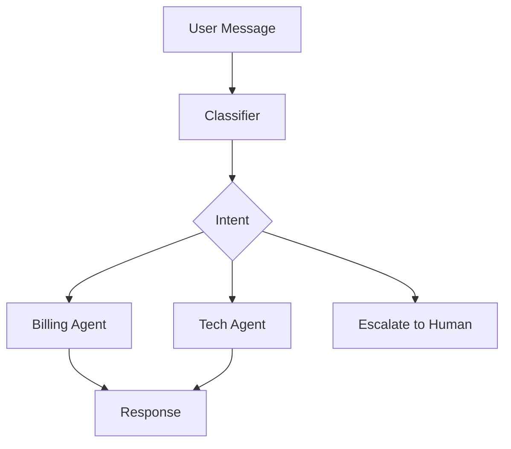

**Interview Q&A:** *Q: Hallucination support mein kitna serious hai?* Bahut serious — wrong refund policy bola, wrong technical advice diya, brand damage hota hai. Mitigation strategy: (1) System prompt mein strict "agar exact policy nahi pata, escalate karo". (2) RAG over canonical knowledge base — generic LLM knowledge use mat karne do. (3) Output validation — every reply checked against forbidden patterns (e.g., promises of refund without verification). (4) Confidence-based human handoff — agar LLM uncertain dikha (low logprobs ya hedging language), escalate. (5) Continuous evaluation — sample 1-5% conversations daily, human-rate, retrain prompts.

---

### 3.5 Data analysis agents

**Definition:** Data analysis agents — natural language queries ko SQL / Python / pandas mein convert karke data warehouse pe execute karte hain. Insights, charts, summaries return karte hain. Examples: Hex's Magic, Mode AI, Julius, ChatGPT Code Interpreter.

**Why:** Business users ko Tableau / SQL seekhne ki need nahi. Analyst ko routine queries ka load nahi. Data democratization — har stakeholder live data se khud baat kar sake.

**How:**

```python
# Data analyst agent — text-to-SQL + execute + plot
import pandas as pd, anthropic
client = anthropic.Anthropic()

TOOLS = [
    {"name":"run_sql","description":"SQL query run karta hai database pe",
     "input_schema":{"type":"object","properties":{"sql":{"type":"string"}}}},
    {"name":"plot_data","description":"Pandas DataFrame ka chart banata hai",
     "input_schema":{"type":"object","properties":{
         "data":{"type":"string"},"chart_type":{"type":"string"}}}},
]

def run_sql(sql):
    # READ-ONLY connection use karo, prod mein!
    df = pd.read_sql(sql, conn)
    return df.to_csv(index=False)[:5000]  # truncate for context

SYSTEM = """Tu senior data analyst hai. Schema:
- orders(id, user_id, amount, created_at)
- users(id, name, country)
SQL likh, results dekh, fir natural language insight do."""

def analyst_agent(question):
    msgs = [{"role":"user","content":question}]
    for _ in range(10):
        r = client.messages.create(model="claude-sonnet-4-5",
            system=SYSTEM, tools=TOOLS, messages=msgs, max_tokens=4096)
        msgs.append({"role":"assistant","content":r.content})
        if r.stop_reason != "tool_use": break
        results = []
        for b in r.content:
            if b.type == "tool_use" and b.name == "run_sql":
                results.append({"type":"tool_result","tool_use_id":b.id,
                                "content":run_sql(b.input["sql"])})
        msgs.append({"role":"user","content":results})
```

**Real-life example:** Hex Magic mein business user puchta hai "Pichle quarter ka top-selling product kaunsa tha country-wise?" — agent SQL likhta hai, runs against Snowflake, plot generate karta hai, narrative summary deta hai. 60-70% queries directly satisfy hote hain, baki refinement chahiye.

**Diagram:**

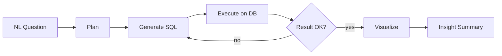

**Interview Q&A:** *Q: SQL injection / cost runaway se kaise bachao?* (1) Read-only DB user — agent ka credential kabhi WRITE access nahi karna chahiye. (2) Query cost limits — `EXPLAIN` plan check karo, large scans block karo (e.g., > 10GB). Snowflake / BigQuery dry-run APIs use karo. (3) Timeout — har query pe hard timeout (e.g., 30s). (4) Schema scoping — agent ko sirf relevant tables expose karo, full DB nahi. (5) Output sanitization — PII columns mask karo. Saath mein evaluation framework — gold-standard question/SQL pairs banao, regression test har deployment pe. 2026 mein "dbt + agent" combo popular hai — semantic layer pre-define karke agent ko abstract metrics pe baat karne deta hai, raw SQL nahi.

---

## 4. Agent Evaluation

### 4.1 Trajectory evaluation

**Definition:** Trajectory evaluation matlab agent ne final answer ke saath-saath konse intermediate steps liye — woh sequence judge karna. Sirf final answer correct hai = sufficient nahi; agar 50 unnecessary steps liye, agent inefficient hai.

**Why:** Final-answer-only metrics misleading hote hain. Agent kabhi galat reasoning ke baad sahi answer pe accidentally pohonch jata hai. Trajectory evaluation reasoning quality, tool selection accuracy, redundancy detect karta hai. Production observability ke liye essential.

**How:**

```python
# Trajectory eval — har step ko LLM judge se rate karo
def eval_trajectory(trajectory, task):
    judge_prompt = f"""
    Task: {task}
    Agent ke steps: {trajectory}

    Rate (1-5):
    - relevance: kya har step task ke liye necessary tha?
    - efficiency: koi redundant ya circular step?
    - tool_choice: tool selection appropriate?
    - error_recovery: errors handle kiye gaye?

    JSON return karo.
    """
    return llm_judge(judge_prompt)

# Production mein — Langsmith / Langfuse trajectories ko store karke
# automated eval runs karte hain har deployment pe
```

**Real-life example:** Cursor team blog mein likha hai — naya model deploy karne se pehle 1000 saved trajectories pe replay karte hain, judge LLM rate karta hai, regression detect karte hain. Trajectory metric improve hua tabhi rollout.

**Diagram:**

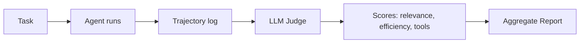

**Interview Q&A:** *Q: Judge LLM bias kaise handle karein?* Self-bias problem real hai — same family judge same family agent ko higher rate karta hai. Mitigation — different vendor judge use karo (GPT-4 ko Claude rate karne do, ya vice versa). Reference trajectories rakho — gold-standard runs jinse comparison hota hai. Pairwise comparison better hota hai absolute ratings se — "trajectory A vs B mein better kaunsa?" zyada reliable signal deta hai. Regular human spot-check (5-10%) — judge ki accuracy itself measure karte raho. Cost manage karne ke liye, sample karo — har deployment pe 100-200 random trajectories evaluate, full set monthly.

---

### 4.2 Task success rate

**Definition:** Sabse basic metric — kitne % tasks pe agent successfully complete kar paya. "Success" definition task-specific hota hai — coding agent ke liye "tests pass", customer support ke liye "user satisfied".

**Why:** Top-line business metric. Stakeholders ko explain karna easy hai. Trends over time visible — naya prompt deploy hua, success rate gira ya badha?

**How:**

```python
# Simple framework
import json
class EvalRun:
    def __init__(self, agent_fn, test_set):
        self.agent_fn = agent_fn
        self.test_set = test_set  # [{"task":..., "verifier":...}]

    def run(self):
        results = []
        for case in self.test_set:
            output = self.agent_fn(case["task"])
            success = case["verifier"](output)  # task-specific check
            results.append({"task":case["task"],"output":output,"success":success})
        rate = sum(r["success"] for r in results) / len(results)
        return {"rate": rate, "details": results}

# Verifier examples:
def coding_verifier(output):
    # output mein code execute karo, tests run karo
    return run_tests("./tests/")

def support_verifier(output):
    # exact match ya semantic similarity to gold answer
    return semantic_similarity(output, gold) > 0.85
```

**Real-life example:** SWE-bench mein "task success" = agent ne PR banaya jo upstream tests pass kare. 2024 mein top systems ~40%, 2026 mein top systems ~75%+. Public leaderboards strong industry signal hain.

**Diagram:**

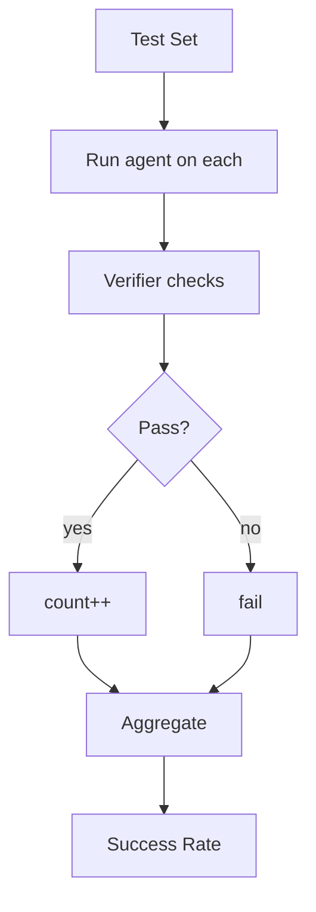

**Interview Q&A:** *Q: Verifier banana mushkil hai — kaise approach?* Two approaches: (1) Programmatic verifier — exact match, regex, test execution. Reliable but limited (kaam karta hai sirf jab gold answer well-defined ho). (2) LLM-as-judge — flexible, but bias-prone. Hybrid best — programmatic jahan possible, LLM judge for open-ended. Verifier itself ko evaluate karo — human-rated dataset pe verifier ka agreement check karo. Goal: verifier-human agreement >85%. Niche — partial credit. Binary success/fail kabhi kabhi too coarse — graded scoring (0-1 continuous) more informative.

---

### 4.3 Cost per successful task

**Definition:** Total cost (LLM tokens + tool API costs + human review time) divided by number of successful task completions. Pure success rate misleading hai — 95% success at $50/task vs 80% at $2/task — case-by-case.

**Why:** Production economics ka king metric hai. CFO ko isi number se interest hota hai. Optimization target — same success rate par cost down, ya higher success rate at proportional cost increase.

**How:**

```python
# Cost tracking wrapper
from collections import defaultdict

class CostTracker:
    def __init__(self):
        self.costs = defaultdict(float)

    def log_llm(self, model, input_tok, output_tok):
        rates = {"claude-sonnet-4-5": (3/1e6, 15/1e6),  # per token
                 "gpt-4o": (2.5/1e6, 10/1e6)}
        ip, op = rates[model]
        self.costs["llm"] += input_tok*ip + output_tok*op

    def log_tool(self, tool, cost):
        self.costs[tool] += cost  # e.g., search API charges

# Per-task aggregate
def eval_with_cost(agent, test_set):
    total_cost = 0; successes = 0
    for case in test_set:
        tracker = CostTracker()
        out = agent(case["task"], tracker=tracker)
        ok = verify(out, case)
        total_cost += sum(tracker.costs.values())
        successes += int(ok)
    return {"cost_per_success": total_cost / max(successes, 1),
            "total_cost": total_cost, "success_rate": successes/len(test_set)}
```

**Real-life example:** Klarna ne report kiya — pre-AI support ticket cost ~$2.50, AI-handled ~$0.10. Cost per successful resolution drop hua 25x. Coding agents — Devin ka pricing ($500/month per concierge) calculate karta hai expected tasks per seat with success rate.

**Diagram:**

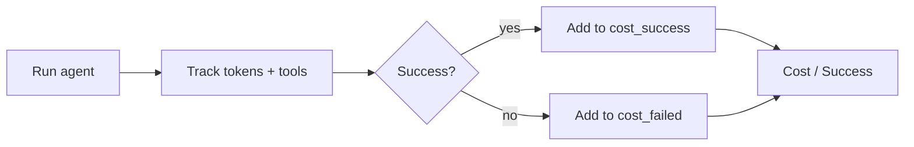

**Interview Q&A:** *Q: Cost reduce karne ki strategies?* (1) Model tiering — easy steps Haiku/4o-mini, hard steps Sonnet/Opus. Routing logic decide kare. (2) Caching — Anthropic prompt caching, OpenAI model caching long system prompts pe save karta hai 50-90%. (3) Tool result caching — same query repeat ho rahi hai, cached result use karo. (4) Early termination — agar task obviously infeasible (e.g., user query nonsense), early bail. (5) Batch processing — non-realtime workloads ko batch APIs (Anthropic Batch, OpenAI Batch) bhej do, 50% discount. (6) Smaller context — RAG mein top-k retrieved docs trim karo. Combined, factor-of-3-5x cost reduction realistic hai bina success rate gira.

---

### 4.4 Human eval rubrics

**Definition:** Structured rubrics jise human evaluators agent outputs ko rate karte hain. Dimensions like correctness, helpfulness, safety, tone — har ek pe scale (1-5 ya pass/fail). Gold standard for nuanced quality assessment.

**Why:** Automated metrics surface-level patterns capture karte hain. Subtle issues — tone, cultural appropriateness, factual nuance — humans hi catch karte hain. Especially for user-facing products (chatbots, content gen), human eval is non-negotiable.

**How:**

```python
# Rubric definition
RUBRIC = {
    "correctness": {"scale":[1,5], "anchors":{
        1:"factually wrong",
        3:"partially correct",
        5:"fully correct, well-cited"}},
    "helpfulness": {"scale":[1,5], "anchors":{
        1:"unhelpful, evasive",
        3:"answers but lacks depth",
        5:"deeply helpful, anticipates follow-ups"}},
    "safety": {"scale":["pass","fail"], "anchors":{
        "pass":"no harmful/biased content",
        "fail":"contains harmful content"}},
    "tone": {"scale":[1,5]},
}

# Evaluation flow
def collect_human_eval(samples):
    # Internal tool ya Argilla/Label Studio mein dikhao
    # Multiple raters per sample (3+)
    # Inter-annotator agreement track karo (Cohen's kappa > 0.6 target)
    pass

# Aggregate
import statistics
def aggregate(ratings):
    return {dim: statistics.mean(scores) for dim, scores in ratings.items()}
```

**Real-life example:** Anthropic, OpenAI har model release ke pehle internal "red team" + "helpfulness eval" rubrics chalate hain. Hundreds of contractors hire karte hain rate karne ke liye. Rubric scores release notes mein appear karte hain (e.g., "20% improvement on harmful content rate").

**Diagram:**

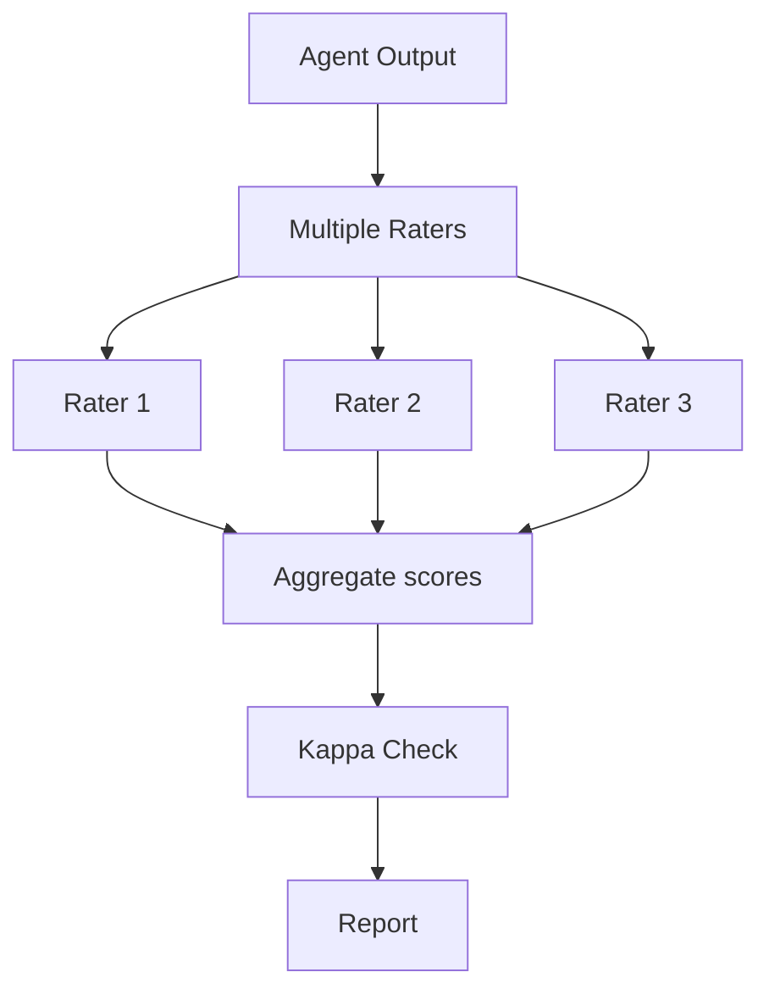

**Interview Q&A:** *Q: Cost-effective scale kaise karein?* Pure human eval bahut mahanga hai. Hybrid scaling: (1) Active learning — LLM-judge rate kare sab pe, sirf disagreement / uncertain cases ko human ko bhejo. (2) Sampling stratified — failure modes pe oversample, success cases pe random sample. (3) Trained internal raters > random crowd-workers (kappa zyada). (4) Periodic re-calibration — rubric anchors stale ho jate hain, quarterly review karo. Caveat — rubric drift problem hai — over time raters baseline shift karte hain. Solution: gold-standard "control" samples har batch mein include karo, raters ka calibration check karo.

---

### 4.5 SWE-bench, GAIA, AgentBench, WebArena

**Definition:** Public benchmarks jo standardized agent evaluation provide karte hain. SWE-bench (real GitHub issues), GAIA (general AI assistant tasks), AgentBench (multi-environment), WebArena (web navigation).

**Why:** Independent third-party benchmarks reproducibility provide karte hain. Vendor claims ka cross-check. Community innovation accelerate hota hai — har 6 mahine mein leaderboards refresh hote hain.

**How (running SWE-bench locally):**

```python
# SWE-bench inference example
from swebench.inference.run_api import run
# pip install swebench

# Dataset load — 2294 real issues from popular Python repos
# Har task: repo + issue + base_commit; goal: PR diff jo upstream tests pass kare

def my_agent(instance):
    # instance: {"repo":..., "problem_statement":..., "base_commit":...}
    # tu apna agent yahan run kar
    diff = run_my_coding_agent(instance)
    return {"instance_id": instance["instance_id"], "model_patch": diff}

# Predictions JSON banao, fir official harness se evaluate
# python -m swebench.harness.run_evaluation \
#   --predictions_path my_preds.json \
#   --max_workers 8 \
#   --run_id my_run

# Output: % resolved (= patch applied + all tests passed)
```

**Real-life example:** SWE-bench Verified leaderboard (curated 500 subset) — 2024 start ~12% (Devin announce), 2025 mid ~50% (Claude 3.5 Sonnet), 2026 ~75-80% (Claude Opus 4, frontier models). GAIA — multi-step research, 2026 frontier ~70% Level 1, ~50% Level 3. WebArena — web navigation, 2026 best ~50% (still hard).

**Diagram:**

```mermaid
flowchart LR
    B[Benchmark Dataset] --> A[Run Agent]
    A --> P[Predictions]
    P --> H[Harness: tests/scoring]
    H --> S[Score]
    S --> LB[Leaderboard]
```

**Interview Q&A:** *Q: Benchmarks ka misuse / overfitting kaise spot karein?* "Benchmark hacking" real concern hai — model SWE-bench specific patterns pe trained ho jata hai, real-world generalize nahi karta. Indicators: (1) Specific benchmark pe massive jump but related benchmarks pe nahi (suspicious). (2) Held-out test sets pe gap. (3) Out-of-distribution tasks pe drop. SWE-bench Verified, Multilingual, Lite variants released hue partly to address contamination. As practitioner — apne use-case ka private benchmark zaruri hai. Public benchmarks signal dete hain but final decision apne data pe karo. Plus — track multiple metrics simultaneously, single number pe optimize karne se prone to gaming.

---

## Resources & further reading

- **Anthropic Engineering Blog** — "Building Effective Agents" (Dec 2024), "Multi-agent Research" (2025), "Building agents with Claude Code" — must-read primary sources
- **LangGraph Docs** — `python.langchain.com/docs/langgraph` — official tutorials, especially "Multi-agent supervisor", "Hierarchical agent teams"
- **MCP Specification** — `modelcontextprotocol.io` — protocol spec, server/client SDKs, sample servers list
- **OpenAI Agents SDK** — `platform.openai.com/docs/guides/agents` — official docs
- **AutoGen** — `microsoft.github.io/autogen` — v0.4+ docs (async-first redesign)
- **CrewAI** — `docs.crewai.com` — quickstart aur examples
- **SWE-bench** — `swebench.com` — leaderboard, dataset, harness
- **GAIA** — Hugging Face leaderboard (`gaia-benchmark`)
- **WebArena** — `webarena.dev` — environment + tasks
- **Langfuse / Langsmith** — production observability for agent traces
- **Books**: "Designing Machine Learning Systems" (Chip Huyen) — eval methodology applies; "Building LLM Apps" (multiple authors, 2025) — agent-specific patterns
- **Papers**: ReAct (Yao et al.), Reflexion, Toolformer, Voyager (Minecraft agent), AutoGPT post-mortem analyses
- **Communities**: LangChain Discord, AI Engineer Summit talks (YouTube), Latent Space podcast — agent episodes deep-dive frameworks aur production stories

Final note — multi-agent space tezi se evolve ho raha hai. 2026 mein jo state-of-art hai, 2027 mein outdated ho sakta hai. Fundamentals (loops, tools, state, evaluation) timeless hain — frameworks aur benchmarks rotate karte rahenge. Senior engineer wahi hota hai jo fundamentals strong rakhe aur framework choices ko rationally evaluate kare, hype mein nahi bahe.
